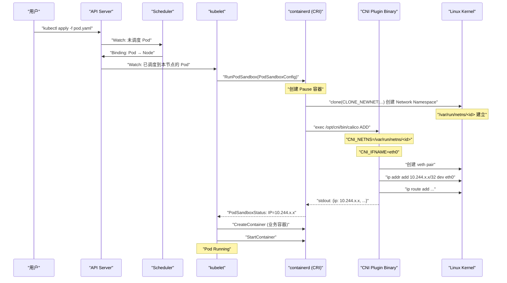

# CNI体系详解——插件规范、调用链与主流实现对比

## 摘要

CNI（Container Network Interface）是 Kubernetes 网络生态的基石——它定义了容器运行时与网络插件之间唯一的契约。本文深入 CNI Spec v1.0 的协议语义，解析 kubelet 调用 CNI 的完整链路，剖析 ADD/DEL/CHECK 三个操作的精确语义，并系统梳理 IPAM 子插件的工作机制。在此基础上，以技术本质为轴，构建 Flannel、Calico、Cilium、WeaveNet 四大主流 CNI 插件的多维选型对比矩阵。**理解 CNI，是在插件海洋中做出正确技术决策的前提。**

---

## 第 1 章 CNI 的诞生：为什么需要一个标准接口

### 1.1 混乱的前标准时代

2014 年，当 Kubernetes 刚刚开源时，容器网络领域处于"百花齐放、群雄割据"的混乱状态。Docker 推出了自己的网络方案 libnetwork（后来演变为 Docker Network），CoreOS 发布了 Flannel，Weaveworks 推出了 Weave，Metaswitch 开始开发 Calico。每个方案都有自己的配置接口、安装方式、与容器运行时的集成方法。

对于一个希望拥抱这个生态的 Kubernetes 来说，选择是残酷的：

- **绑定一个实现**：Kubernetes 自身集成 Flannel，不想用 Flannel 的用户无路可走
- **支持全部实现**：为每个网络方案写一套集成代码，维护成本爆炸
- **定义一个标准**：规定容器运行时与网络插件的交互协议，任何符合协议的插件都能工作

第三条路显然是正确的。2015 年，CoreOS（Flannel 的作者）联合其他厂商，提出了 CNI 规范，并将其贡献给 CNCF。Kubernetes 从 1.0 版本起采用 CNI 作为官方网络接口标准。

> [!note] 设计哲学
> CNI 的设计哲学极度克制——它只规定"接口"，不规定"实现"。这种克制是 CNI 成功的关键。接口稳定才能生态繁荣；如果 CNI 规范每隔几个月就重构一次，插件作者将疲于奔命，用户将无法升级。

### 1.2 CNI 与 CNM：一场设计哲学的分歧

CNI 并不是当时唯一的容器网络标准提案。Docker 同期推出了 **CNM（Container Network Model，容器网络模型）**，两者的设计哲学截然不同：

| 维度 | CNI | CNM |
| :--- | :--- | :--- |
| **核心抽象** | 操作（ADD/DEL/CHECK） | 对象（Network、Endpoint、Sandbox） |
| **生命周期** | 无状态，每次调用独立 | 有状态，Endpoint 对象持久化 |
| **实现形式** | 可执行文件（binary） | Daemon（常驻服务） |
| **与运行时耦合** | 松耦合，只需通过环境变量通信 | 紧耦合，需要运行时内置 API 支持 |
| **生态** | Kubernetes 采用，CNCF 标准 | Docker 原生，仅限 Docker 生态 |

CNI 的"操作语义"比 CNM 的"对象语义"更简单、更通用。对于 Kubernetes 这样需要对接多种容器运行时（containerd、CRI-O、Docker）的系统，CNI 的松耦合设计显然更合适。事实证明，CNI 赢得了这场竞争——CNM 随着 Docker Swarm 的衰落而逐渐边缘化。

### 1.3 CNI 规范的演进历史

| 版本 | 时间 | 核心变化 |
| :--- | :--- | :--- |
| **0.1.0** | 2015.03 | 初始规范，定义 ADD/DEL 操作 |
| **0.2.0** | 2015.06 | 增加 IP 配置返回格式 |
| **0.3.0** | 2016.05 | 增加多 IP、路由支持，规范化 IPAM 接口 |
| **0.3.1** | 2016.10 | 修订接口定义，增加接口列表 |
| **0.4.0** | 2019.05 | 增加 CHECK 操作 |
| **1.0.0** | 2021.11 | 语义澄清，移除 IP Masquerade 字段，稳定接口 |

当前（2024 年）生产环境主流是 CNI 0.3.1 和 1.0.0，大多数插件同时支持两个版本。

---

## 第 2 章 CNI Spec v1.0：协议的精确语义

### 2.1 CNI 插件是什么

理解 CNI 的第一步，是彻底消除"CNI 是一个 Daemon"的错误认知。

**CNI 插件是一个可执行文件（binary）**，通常存放在节点的 `/opt/cni/bin/` 目录。当需要为一个 Pod 配置网络时，容器运行时（containerd/CRI-O）直接 `execve()` 这个二进制文件，通过**环境变量**传入操作参数，通过**标准输入（stdin）**传入 JSON 格式的配置，通过**标准输出（stdout）**读取操作结果，通过**退出码**判断是否成功。

这种设计的优雅之处：
- **无状态**：CNI 插件进程执行完毕即退出，不保留状态（状态存在外部存储或本地文件中）
- **语言无关**：任何语言写的程序，只要能读取环境变量、处理 stdin/stdout，就能是 CNI 插件
- **隔离性好**：CNI 插件崩溃不影响已有 Pod，也不影响 kubelet 的运行
- **调试直观**：可以手动构造环境变量和输入 JSON，在命令行直接调用 CNI 插件调试

节点上的标准目录结构：

```
/opt/cni/bin/          # CNI 插件可执行文件
    flannel            # Flannel 主插件
    calico             # Calico 主插件
    bridge             # 通用 bridge 插件
    host-local         # IPAM：本地 IP 分配
    loopback           # loopback 接口配置
    portmap            # HostPort 实现
    bandwidth          # 流量限速
    ...

/etc/cni/net.d/        # CNI 配置文件
    10-flannel.conflist
    10-calico.conflist
    ...
```

### 2.2 三个核心操作的精确语义

CNI 规范定义了三个操作，由 `CNI_COMMAND` 环境变量指定：

#### 2.2.1 ADD 操作——为 Pod 建立网络

**触发时机**：Pod 的 Pause 容器创建后，Network Namespace 已建立但尚未配置任何网络时。

**输入参数**：

| 环境变量 | 含义 | 示例值 |
| :--- | :--- | :--- |
| `CNI_COMMAND` | 操作类型 | `ADD` |
| `CNI_CONTAINERID` | 容器/Pod 的唯一 ID | `abc123...` |
| `CNI_NETNS` | Network Namespace 路径 | `/var/run/netns/xxx` |
| `CNI_IFNAME` | 要在 Namespace 内创建的接口名 | `eth0` |
| `CNI_ARGS` | 额外参数，K=V 格式 | `K8S_POD_NAME=nginx;K8S_POD_NAMESPACE=default` |
| `CNI_PATH` | CNI 插件搜索路径 | `/opt/cni/bin` |

**标准输入（stdin）**：CNI 配置 JSON（包含插件类型、IPAM 配置等）

**标准输出（stdout）**：成功时返回网络配置结果 JSON：

```json
{
  "cniVersion": "1.0.0",
  "interfaces": [
    {
      "name": "eth0",
      "mac": "0a:58:0a:f4:00:06",
      "sandbox": "/var/run/netns/xxx"
    },
    {
      "name": "veth3b4a2c8",
      "mac": "46:7e:c5:71:3c:52"
    }
  ],
  "ips": [
    {
      "address": "10.244.0.6/24",
      "gateway": "10.244.0.1",
      "interface": 0
    }
  ],
  "routes": [
    {"dst": "0.0.0.0/0", "gw": "10.244.0.1"}
  ],
  "dns": {
    "nameservers": ["10.96.0.10"],
    "search": ["default.svc.cluster.local", "svc.cluster.local"]
  }
}
```

**ADD 操作的语义要求**：
1. 在 `CNI_NETNS` 指定的 Namespace 内，创建名为 `CNI_IFNAME` 的网络接口（通常是 veth pair 的内端）
2. 为该接口分配 IP 地址（通过 IPAM 子插件）
3. 配置路由规则，确保 Pod 能访问外部
4. 在节点网络侧配置必要的路由，确保外部能访问这个 Pod
5. 幂等性：如果同样的 `(CNI_CONTAINERID, CNI_IFNAME)` 组合已经成功执行过 ADD，再次执行应当成功并返回正确结果（而不是报错说"已存在"）

#### 2.2.2 DEL 操作——清理 Pod 网络

**触发时机**：Pod 被删除，Pause 容器停止之前（或 kubelet 强制清理时）。

DEL 操作需要撤销 ADD 操作的所有副作用：
- 删除 Namespace 内的接口（通常会自动删除，因为 veth pair 删一端另一端也消失）
- 释放分配的 IP 地址（IPAM DEL）
- 清理节点上的路由规则
- 清理 iptables 规则（如果 ADD 时写入了 iptables）

**DEL 的关键约束**：DEL **必须是幂等的**。原因是：在异常情况下（节点崩溃重启、网络分区），DEL 可能在 ADD 未执行、或执行失败的情况下被调用；DEL 也可能被调用多次。插件必须容忍这些情况——如果要删除的资源已经不存在，直接返回成功（而不是报错），否则会导致 kubelet 卡住、Pod 无法完全删除。

> [!warning] 生产避坑
> 这是很多"祖传"CNI 插件实现的 Bug 重灾区：DEL 操作发现资源不存在时抛出错误，导致 kubelet 反复重试 DEL，Pod 长期卡在 Terminating 状态。如果你在生产环境遇到 Pod 永远 Terminating，且 `kubectl describe pod` 看到 CNI DEL 相关的错误，这往往是根因。临时解决办法：`kubectl delete pod --force --grace-period=0`，但这只是绕过，不是修复。

#### 2.2.3 CHECK 操作——验证网络配置（CNI 0.4.0+）

**触发时机**：由容器运行时周期性调用，或在怀疑网络配置有问题时手动触发。

CHECK 操作检查 ADD 操作建立的网络配置是否仍然有效：
- 接口是否存在且 UP
- IP 地址是否正确
- 路由是否正确
- iptables 规则是否完整

**CHECK 的返回值**：
- 退出码 0：网络配置正确
- 退出码非 0 + stderr 错误信息：网络配置有问题

CHECK 目前在实际生产中并不常用，大多数容器运行时（containerd）并不主动调用 CHECK，仅作为插件自我诊断能力的预留接口。

### 2.3 CNI 配置文件的两种格式

CNI 支持两种配置文件格式：

**单插件格式（`.conf`）**：

```json
{
  "cniVersion": "1.0.0",
  "name": "mynet",
  "type": "bridge",
  "bridge": "cni0",
  "ipam": {
    "type": "host-local",
    "subnet": "10.244.0.0/24",
    "gateway": "10.244.0.1"
  }
}
```

**插件链格式（`.conflist`）**：

```json
{
  "cniVersion": "1.0.0",
  "name": "k8s-pod-network",
  "plugins": [
    {
      "type": "calico",
      "log_level": "info",
      "datastore_type": "kubernetes",
      "ipam": {
        "type": "calico-ipam"
      },
      "policy": {"type": "k8s"},
      "kubernetes": {"k8s_api_root": "https://127.0.0.1:443"}
    },
    {
      "type": "portmap",
      "snat": true,
      "capabilities": {"portMappings": true}
    },
    {
      "type": "bandwidth",
      "capabilities": {"bandwidth": true}
    }
  ]
}
```

当存在 `.conflist` 文件时，容器运行时按 `plugins` 数组顺序链式执行所有插件。前一个插件的输出（`prevResult`）会通过 stdin 传给下一个插件——这就是"插件链"。

**插件链的执行规则**：
- ADD：按顺序执行每个插件，每个插件可以修改并传递 `prevResult`
- DEL：**逆序**执行每个插件（先执行最后添加的，最后执行第一个）
- CHECK：按顺序执行每个插件

---

## 第 3 章 CNI 调用的完整链路

### 3.1 从 kubectl apply 到 CNI 被调用

理解 CNI 调用链需要先理解 Kubernetes 的容器运行时架构。Kubernetes 通过 **CRI（Container Runtime Interface）** 与容器运行时交互，CRI 是 kubelet 与容器运行时之间的 gRPC 接口。containerd 和 CRI-O 是最常见的 CRI 实现（Docker 已在 K8s 1.24 后被移除）。

完整的调用链如下：



### 3.2 kubelet 与 CRI 的分工

一个容易混淆的点是：kubelet 本身并不直接调用 CNI。kubelet 通过 CRI（gRPC）调用容器运行时，**容器运行时（containerd/CRI-O）负责调用 CNI**。

这种分工的意义在于：kubelet 不需要了解 CNI 的细节，它只是说"给我创建一个网络准备好的 Pod Sandbox"——至于怎么配置网络，是容器运行时的责任。

containerd 中负责调用 CNI 的组件是 **CNI Manager**，它：
1. 读取 `/etc/cni/net.d/` 目录下的配置文件（按字典序选择第一个）
2. 根据配置文件中的插件列表，找到 `/opt/cni/bin/` 下对应的二进制
3. 构造环境变量和 stdin JSON
4. `exec` 调用 CNI 二进制，等待结果
5. 解析 stdout JSON，返回给 kubelet

### 3.3 CNI 配置文件的选择逻辑

当 `/etc/cni/net.d/` 目录下有多个配置文件时，容器运行时按**字典序取第一个**。这就是为什么很多 CNI 配置文件命名为 `10-xxx.conflist`——数字前缀保证优先级可控。

如果有多个配置文件：
```
/etc/cni/net.d/
    05-cilium.conflist      ← 优先级最高，被使用
    10-flannel.conflist
    99-loopback.conf
```

> [!warning] 生产避坑
> 在集群迁移 CNI 插件时（例如从 Flannel 迁移到 Calico），如果没有清理旧的配置文件，两个 `.conflist` 文件并存会导致 CNI 行为不确定——取决于哪个文件名字典序更靠前。正确做法：先删除旧 CNI 插件的配置文件和 DaemonSet，再安装新插件。

### 3.4 手动模拟 CNI ADD 调用（调试技巧）

了解 CNI 的二进制调用方式，就能手动模拟这个过程，这是排查 CNI 问题的有力工具：

```bash
# 1. 创建一个测试 Network Namespace
ip netns add test-ns

# 2. 准备 CNI 配置
cat > /tmp/cni-conf.json << 'EOF'
{
  "cniVersion": "0.3.1",
  "name": "test-net",
  "type": "bridge",
  "bridge": "cni0",
  "ipam": {
    "type": "host-local",
    "subnet": "10.244.0.0/24",
    "gateway": "10.244.0.1"
  }
}
EOF

# 3. 模拟 CNI ADD 调用
CNI_COMMAND=ADD \
CNI_CONTAINERID=test-container \
CNI_NETNS=/var/run/netns/test-ns \
CNI_IFNAME=eth0 \
CNI_PATH=/opt/cni/bin \
/opt/cni/bin/bridge < /tmp/cni-conf.json

# 4. 验证结果
ip netns exec test-ns ip addr show
ip netns exec test-ns ip route show
```

---

## 第 4 章 IPAM 子插件——谁来分配 IP

### 4.1 IPAM 的职责边界

IPAM（IP Address Management）是 CNI 体系中的一个关键子系统。主 CNI 插件负责"网络连通性"（创建 veth、配置 bridge、配置路由），而"给这个 Pod 分配什么 IP"是 IPAM 的职责。两者通过 CNI 规范定义的接口解耦。

IPAM 同样是通过可执行文件实现的。主 CNI 插件在执行时，调用（exec）IPAM 插件，IPAM 插件返回分配好的 IP 信息，主插件再用这个 IP 配置网络接口。

### 4.2 host-local IPAM：最简单的本地 IP 管理

**工作原理**：host-local 是最基础的 IPAM 实现。每个节点预先分配一个 IP 子网（如 `10.244.0.0/24`），host-local 在本地文件系统（`/var/lib/cni/networks/<网络名>/`）中记录哪些 IP 已被分配。

```
/var/lib/cni/networks/k8s-pod-network/
    10.244.0.2          # 文件内容是 ContainerID
    10.244.0.3
    10.244.0.4
    last_reserved_ip    # 上次分配的最后一个 IP
```

**分配策略**：从 `last_reserved_ip + 1` 开始顺序分配，跳过已占用的 IP，到达子网末尾后回绕（但不重用未释放的 IP）。

**局限性**：
- 每个节点独立管理 IP，节点间没有协调——需要保证各节点分配的子网不重叠（由 CNI 插件的控制器，如 flannel-daemon，负责）
- 分配信息存本地文件，节点崩溃重启后可能出现 IP 泄露（文件丢失但 Pod 还在）
- 不支持跨节点的动态 IP 调配

**适用场景**：Flannel、bridge 等简单 CNI 插件；每节点 Pod 数量固定且 IP 段预规划清晰的场景。

### 4.3 calico-ipam：基于 IP Pool 的动态分配

Calico 的 IPAM 实现更复杂，支持集群范围的 IP 池（IP Pool）管理，通过 Calico 的数据存储（Kubernetes CRD 或 etcd）协调全局 IP 分配。

**核心概念**：
- **IP Pool**：集群级别的 IP 地址段（如 `192.168.0.0/16`），通过 CRD 定义
- **Block**：IP Pool 被划分成固定大小的块（默认 `/26`，64 个 IP），每个块分配给一个节点
- **Handle**：每个 IP 分配记录的唯一标识，用于追踪和释放

```yaml
apiVersion: projectcalico.org/v3
kind: IPPool
metadata:
  name: default-ipv4-ippool
spec:
  cidr: 192.168.0.0/16
  blockSize: 26        # 每个节点分配 /26 块（64 个 IP）
  ipipMode: Always
  natOutgoing: true
```

**分配流程**：
1. calico-ipam 检查本节点已分配的 Block
2. 如果本节点没有 Block，向数据存储申请一个新 Block（CAS 操作保证原子性）
3. 在 Block 内顺序分配 IP
4. Block 用完后，自动申请新 Block

**优势**：
- 支持多 IP Pool，可以为不同 Namespace 分配不同网段
- IP 分配信息存储在 Kubernetes etcd 中，节点崩溃不丢失
- 支持 IP Pool 的 BGP 通告，与 Calico 的路由体系深度集成

### 4.4 whereabouts：分布式 IPAM

**whereabouts** 是一个相对新的 IPAM 插件，主要解决多网卡场景（Multus）和裸机环境的 IP 管理需求。

**特点**：
- 使用 Kubernetes API（ConfigMap 或 CRD）存储分配状态，无需外部存储
- 支持 IP 范围和排除列表（excludes），精确控制可分配 IP 的范围
- 内置 IP 泄露检测和 garbage collection（定期清理无对应 Pod 的 IP 分配记录）

```json
{
  "type": "whereabouts",
  "ipRanges": [
    {
      "range": "192.168.2.225/28",
      "exclude": ["192.168.2.229/30"]
    }
  ]
}
```

### 4.5 IPAM 对比表

| IPAM 插件 | 状态存储 | 跨节点协调 | GC 机制 | 适用场景 |
| :--- | :--- | :--- | :--- | :--- |
| **host-local** | 本地文件 | 无（依赖子网划分） | 无 | 简单集群、Flannel |
| **calico-ipam** | Kubernetes CRD/etcd | 有（Block 机制） | 有 | Calico 体系 |
| **dhcp** | DHCP 服务器 | 有 | DHCP 租约 | 与物理网络 DHCP 集成 |
| **whereabouts** | Kubernetes CR | 有（乐观锁） | 有（定期 GC） | Multus 多网卡 |

---

## 第 5 章 主流 CNI 插件深度对比

### 5.1 四大主流插件的技术基因

在深入对比之前，先理解四个插件各自的"技术基因"——它们的设计出发点决定了它们在各个维度上的取舍：

| 插件 | 诞生背景 | 核心设计理念 |
| :--- | :--- | :--- |
| **Flannel** | CoreOS 为 Kubernetes 打造，2014 年 | 极简，只解决 Pod 间 L3 连通性，不做网络策略 |
| **Calico** | Metaswitch 开源，2014 年 | 纯三层路由，BGP 驱动，企业级网络策略 |
| **Cilium** | Isovalent 开源，2016 年 | eBPF 优先，L7 策略，可观测性第一 |
| **WeaveNet** | Weaveworks 开源，2014 年 | 零配置，加密通信，适合多云/混合云 |

### 5.2 网络实现方案对比

这是 CNI 插件选型中最核心的技术差异维度，直接决定**性能**和**部署要求**。

#### 5.2.1 Flannel：封包隧道的三种模式

Flannel 是最简单的 CNI 插件，它的核心工作就一件事：**解决跨节点 Pod 通信**。它提供三种封包模式（详细实现见第 3 篇），这里做简要对比：

| 模式 | 原理 | 性能开销 | 部署要求 |
| :--- | :--- | :--- | :--- |
| **UDP 模式** | TUN 设备 + 用户态转发 | 最高（两次用户态/内核态切换） | 无特殊要求，最兼容 |
| **VXLAN 模式** | 内核 VXLAN 封包，VTEP 转发 | 中等（内核态封包，性能损耗约 10-20%） | 内核 3.12+ |
| **Host-GW 模式** | 静态路由，无封包 | 最低（等同于原生路由） | **节点必须二层互通**（同一子网） |

Flannel 本身**不支持 NetworkPolicy**——它只提供网络连通性，没有流量过滤能力。如果需要 NetworkPolicy，必须配合 Calico（仅用 Calico 的策略引擎 + Flannel 的网络）。

#### 5.2.2 Calico：纯三层路由 + 丰富策略

Calico 的核心理念是：**IP 路由已经足够了，不需要封包**。在每个节点上运行 Felix 组件，直接操纵节点的路由表和 iptables 规则；运行 BIRD（BGP 实现），与其他节点交换路由信息。

**无封包路由（直接路由）**：
- 同一二层网络（同子网）：直接路由，数据包到达目标节点后，通过路由表找到目标 Pod 的 veth 接口
- 跨子网（不同二层网络）：使用 IPIP 或 VXLAN 封包（此时退化为类 Flannel 的封包隧道）

**BGP 路由分发**：
- 每个节点运行 BIRD，与其他节点（或 BGP Route Reflector）建立 BGP Peer
- BIRD 将本节点的 Pod CIDR（`10.244.x.0/26`）通告给其他节点
- 其他节点的 BIRD 收到通告后，在本地路由表中写入对应条目

**NetworkPolicy 实现**：
- Felix 将 K8s NetworkPolicy 翻译成 iptables 规则（或 eBPF 程序）
- 支持 L3（IP）和 L4（端口/协议）级别的策略
- Calico 自身的 GlobalNetworkPolicy 和 NetworkPolicy 提供比 K8s 原生更丰富的策略语义

#### 5.2.3 Cilium：eBPF 驱动的新一代网络

Cilium 是目前技术上最先进的 CNI 插件，它几乎用 eBPF 重写了 Kubernetes 网络栈中所有依赖 iptables 的部分（详细实现见第 5 篇）。

**为什么要替换 iptables？**

iptables 是 Linux 防火墙的传统实现，诞生于 2000 年代，基于规则链的线性匹配。在 Kubernetes 集群中，kube-proxy 使用 iptables 实现 Service 的 DNAT——当集群有 10000 个 Service、每个 Service 有 3 个 Endpoint 时，iptables 规则数量可达 **30000 条**，每个数据包的匹配时间复杂度是 O(N)，严重影响网络性能。

eBPF（extended Berkeley Packet Filter）允许在 Linux 内核中运行经过验证的沙箱代码，在网络栈的各个 hook 点（XDP、TC、Socket）拦截并处理数据包，使用哈希表查找替代线性规则匹配，时间复杂度从 O(N) 降到 O(1)。

**Cilium 的数据面架构**：
- **XDP Hook**（最早介入点，网卡驱动层）：DDoS 防护、早期包过滤
- **TC Hook**（Traffic Control，内核网络栈）：Service 转发（替代 kube-proxy）、NetworkPolicy
- **Socket Hook**（Socket 系统调用层）：跳过内核协议栈，直接在 Socket 间转发（同节点 Pod 通信零开销）

**Cilium 的 L7 网络策略**：Cilium 是目前唯一原生支持 L7（HTTP/gRPC）NetworkPolicy 的 CNI 插件。你可以写出如下策略：

```yaml
apiVersion: cilium.io/v2
kind: CiliumNetworkPolicy
spec:
  ingress:
  - fromEndpoints:
    - matchLabels:
        app: frontend
    toPorts:
    - ports:
      - port: "80"
        protocol: TCP
      rules:
        http:
        - method: "GET"
          path: "/api/v1/.*"  # 只允许 GET /api/v1/ 路径
```

这种策略需要 Cilium 在内核中解析 HTTP 协议（通过 eBPF 程序），是 iptables 完全做不到的。

#### 5.2.4 WeaveNet：零配置的加密覆盖网络

WeaveNet 是"开箱即用"设计哲学的代表，它的目标是：**不需要了解 BGP、VXLAN 等底层原理，装上就能用，天然支持加密通信**。

**实现方式**：
- 在每个节点运行 weave 守护进程，守护进程之间建立 TCP/UDP 连接形成 mesh 网络
- 数据包通过 weave 网桥 + sleeve（用户态隧道）或 fastpath（VXLAN 内核隧道）转发
- 天然支持 Sleeve 模式的 NaCl 加密（不需要 TLS 证书管理）
- 支持 NetworkPolicy

**劣势**：
- 性能低于 Calico 和 Cilium（用户态处理路径开销大）
- 维护活跃度下降（Weaveworks 于 2023 年关闭，项目转 CNCF 社区维护）

### 5.3 综合选型对比矩阵

| 维度 | Flannel | Calico | Cilium | WeaveNet |
| :--- | :---: | :---: | :---: | :---: |
| **部署复杂度** | ⭐（极简） | ⭐⭐⭐ | ⭐⭐⭐⭐ | ⭐⭐ |
| **网络性能** | ⭐⭐⭐ | ⭐⭐⭐⭐ | ⭐⭐⭐⭐⭐ | ⭐⭐ |
| **NetworkPolicy** | ❌（无） | ✅（L3/L4） | ✅（L3/L4/L7） | ✅（L3/L4） |
| **加密通信** | ❌ | ✅（WireGuard） | ✅（WireGuard） | ✅（NaCl） |
| **跨子网支持** | ✅（VXLAN） | ✅（IPIP/VXLAN） | ✅ | ✅ |
| **eBPF 加速** | ❌ | ✅（可选） | ✅（核心特性） | ❌ |
| **替代 kube-proxy** | ❌ | ✅（eBPF 模式） | ✅（推荐） | ❌ |
| **可观测性** | ⭐ | ⭐⭐⭐ | ⭐⭐⭐⭐⭐（Hubble）| ⭐⭐ |
| **Windows 节点支持** | ✅ | ✅ | 部分支持 | ❌ |
| **社区活跃度** | ⭐⭐ | ⭐⭐⭐⭐⭐ | ⭐⭐⭐⭐⭐ | ⭐（停止维护） |
| **适用规模** | 小型集群 | 中大型集群 | 中大型集群 | 小型集群 |

### 5.4 典型场景选型建议

**场景 1：学习/测试环境，快速拉起集群**
→ **Flannel（VXLAN 模式）**：一条 `kubectl apply` 命令，3 分钟内网络就绪，没有任何额外配置。

**场景 2：生产集群，需要 NetworkPolicy 和企业级网络管理**
→ **Calico**：BGP 模式下性能接近裸机，NetworkPolicy 功能完整，对运维人员友好（有 calicoctl 工具）。

**场景 3：追求极致性能，节点数 > 500，需要深度可观测性**
→ **Cilium**：eBPF 数据面在大规模集群下性能优势显著，Hubble 提供无与伦比的网络可见性。需要内核版本 ≥ 5.4（推荐 5.10+）。

**场景 4：多云/混合云，节点跨数据中心，需要加密**
→ **Calico（VXLAN + WireGuard）** 或 **Cilium（WireGuard 透明加密）**：两者都支持 WireGuard 加密，性能远优于 WeaveNet 的软件加密。

**场景 5：需要 Windows 节点**
→ **Calico** 或 **Flannel**：目前对 Windows 节点支持最完整。Cilium 的 Windows 支持仍在开发中。

> [!warning] 生产避坑
> 不要在生产集群迁移 CNI 插件——这几乎意味着你需要重新创建所有 Pod（因为每个 Pod 的网络配置是在创建时由 CNI 建立的，无法原地迁移）。CNI 选型应在集群建立之初就确定，并在此后的 major upgrade 中坚守。如果必须迁移，使用蓝绿集群策略（新集群装新 CNI，业务迁移过去）是最稳妥的方案。

---

## 第 6 章 CNI 的扩展生态

### 6.1 Multus：多网卡支持

**Multus** 是一个"元插件"（meta-plugin），它本身不提供网络能力，而是允许一个 Pod 同时连接多个 CNI 网络（即拥有多张网卡）。

**典型场景**：
- **数据面与管理面网络分离**：Pod eth0 连接集群内部网络（Calico），eth1 连接高性能存储网络（SR-IOV）
- **多租户网络隔离**：不同业务的流量走不同的网卡和网络策略
- **5G/电信场景**：NFV（Network Function Virtualization）需要 Pod 同时接入多个物理网络

```yaml
metadata:
  annotations:
    k8s.v1.cni.cncf.io/networks: '[
      {"name": "macvlan-net", "interface": "net1"},
      {"name": "sriov-net",   "interface": "net2"}
    ]'
```

Multus 通过 Kubernetes CRD `NetworkAttachmentDefinition` 管理额外的网络配置。

### 6.2 SR-IOV CNI：硬件加速网络

**SR-IOV（Single Root I/O Virtualization）** 允许一个物理网卡（PF，Physical Function）虚拟出多个 VF（Virtual Function），每个 VF 可以直接绑定到一个 Pod，绕过内核网络栈，实现接近裸金属的网络性能。

这在需要极高网络吞吐量的场景（如机器学习集群的 GPU 通信、高频交易）中非常重要。SR-IOV CNI 配合 Multus 使用，是高性能计算 Pod 的标准配置。

### 6.3 Cluster Mesh：跨集群网络

**Cluster Mesh** 是 Cilium 提供的跨集群网络功能，允许多个 Kubernetes 集群的 Pod 直接用 Pod IP 互通，并跨集群应用 NetworkPolicy。

**使用场景**：多集群服务网格（通常配合 Istio 或 Linkerd）、多可用区集群的 Pod 直接通信、混合云/多云场景下的服务互访。

---

## 第 7 章 小结

### 7.1 核心知识回顾

本文深入解析了 CNI 体系的各个层面：

| 层面 | 关键知识点 |
| :--- | :--- |
| **CNI 设计** | 无状态 binary，三个操作（ADD/DEL/CHECK），插件链 |
| **调用链** | kubectl → API → kubelet → containerd → CNI binary |
| **IPAM** | host-local（本地文件）、calico-ipam（CRD）、whereabouts（分布式） |
| **主流插件** | Flannel（简单封包）、Calico（BGP路由）、Cilium（eBPF）、WeaveNet（加密） |
| **扩展生态** | Multus（多网卡）、SR-IOV（硬件加速）、Cluster Mesh（跨集群） |

### 7.2 下一篇预告

理解了 CNI 的规范和调用链，接下来进入具体插件的深度解析。下一篇将深入 Flannel 的三种封包模式：

- **[[03 Flannel深度解析——VXLAN、Host-GW与UDP模式]]**：详解 VXLAN 封包的每一个字节从哪里来，Host-GW 模式的路由表如何构建，以及为什么 UDP 模式在现代集群中几乎不再使用。

---

*本文是 [[Kubernetes网络原理与插件]] 专栏的第 2 篇。*
