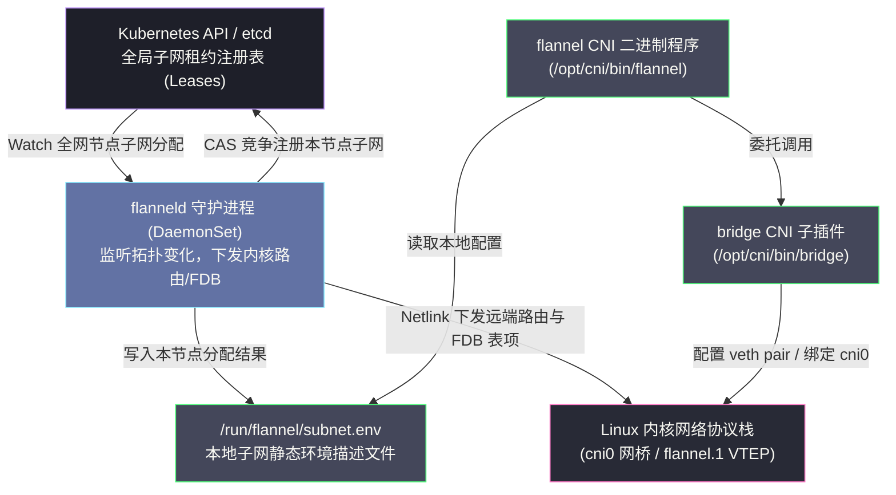
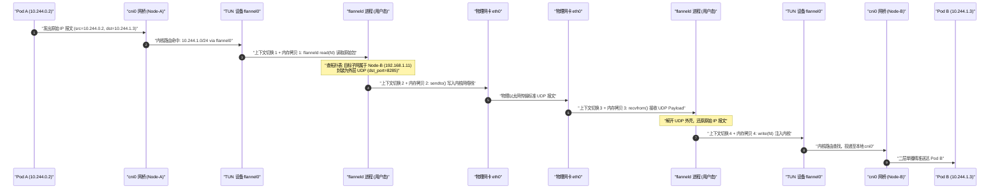
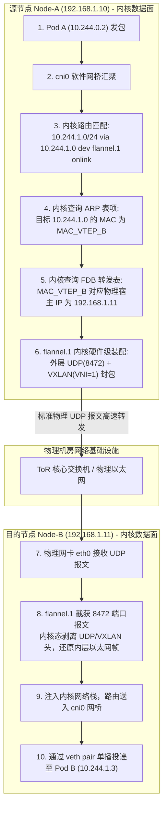
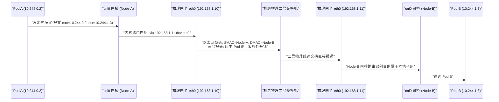

# Flannel深度解析——VXLAN、Host-GW与UDP模式

**摘要：**

在 Kubernetes 诞生初期的混沌岁月中，Flannel 凭借极简的设计哲学与开箱即用的工程体验，成为了千万工程师迈入云原生网络大门的第一块引路石。它放弃了对复杂网络策略与细粒度安全隔离的追逐，将全部设计力量聚焦于解决最为根本的核心矛盾——跨主机的 Pod 连通性。本文沿着"软件定义网络如何克服物理硬件拓扑约束"这一主线，系统剖析 Flannel 在控制平面与数据平面的双层解耦架构；自底向上深入其演进历史中极具代表性的三种后端模式：还原基于 Linux TUN 设备的用户态 UDP 隧道模式及其四次上下文切换的性能代价，拆解 RFC 7348 协议规范下 VXLAN 模式 50 字节外层封装报文、内核 VTEP 驱动、FDB 转发表与 ARP 协同转发微观链路，推导 Host-GW 模式如何凭借纯三层静态主机路由逼近物理裸金属线速；最后结合 DirectRouting 混合模式与出集群 IP 伪装（MASQUERADE）机制，全面复盘 Flannel 在万级节点超大集群下的规模瓶颈与现代架构定位。本文旨在解答两个核心问题：Flannel 是如何在不改造机房底层硬件的前提下凭空架设起跨机扁平网络的，以及其在封装开销、物理拓扑依赖与数据面吞吐之间所做出的经典架构权衡。

---

## 第 1 章 架构基石：Flannel 的设计哲学与定位

### 1.1 历史背景：CoreOS 为什么在 2014 年打造这样一个“故意被简化”的网络插件

要深刻理解 Flannel 的技术形态，我们必须重温 2014 年那个技术狂飙突进的历史切面。

彼时，Google 刚刚对外宣布开源 Kubernetes，整个容器编排领域尚处于蛮荒草创阶段。对于广大基础设施工程师而言，搭建一套多节点的分布式容器集群，所面临的最大拦路虎并非调度算法或声明式 API，而是繁复沉重的跨节点网络互联。在传统数据中心网络架构中，物理路由器与三层交换机只识别宿主机的物理 IP；容器在各宿主机内部所分得的虚拟私网地址，根本无法被底层物理网络感知与路由。若要实现跨节点容器直通，往往需要资深网络工程师深入机房机柜，手动配置物理交换机上的 VLAN、BGP 路由宣告或昂贵的商业 SDN 控制器。

这一高耸入云的技术门槛，几乎要将刚刚萌芽的云原生技术生态窒息在摇篮之中。当时积极主导容器基础设施演进的 CoreOS 团队（后被 Red Hat 收购），在深度参与 Kubernetes 早期研发的过程中敏锐地意识到：**如果不能提供一个能够让普通开发者在五分钟之内快速跑通跨节点网络的傻瓜化方案，那么再宏伟的分布式编排愿景都将沦为空中楼阁**。

正是在这种强烈的工程实用主义驱动下，Flannel 诞生了。

它的设计哲学可以用极其凝练的四个字来概括——**极度克制**。
Flannel 的缔造者们极其清醒地为这个项目画下了坚固的能力边界：
- ✅ **它必须全力解决且只解决一件事**：在完全不假设外部物理网络具备任何高阶功能的前提下，以最微小的部署代价，在集群所有节点之间建立起一条符合 Kubernetes 扁平网络要求的、跨节点的 Pod-to-Pod 三层（L3）双向通信通道；
- ❌ **它坚决不做且刻意回避的事情**：它不支持基于白名单的网络访问控制策略（NetworkPolicy），没有流量过滤能力；它不支持传输链路层的自动加密；它不具备应用层（L7）协议感知与流量治理能力；它甚至不提供任何细粒度的分布式 IP 地址借贷与精细 QoS 限速。

这种“故意被简化”的克制，并非源于技术实力的不足，而是面对历史主要矛盾时极具战略定力的工程妥协。正是凭借这种零门槛的开箱即用特性，Flannel 在过去十年间牢牢占据了全球数以百万计中小型 Kubernetes 集群与实验开发环境的默认网络基座地位。

### 1.2 整体双层架构全景图：DaemonSet 与 CNI 二进制的分工

在整体工程架构层面，Flannel 展现出了教科书级别的“控制面拓扑感知”与“数据面单机配置”双层解耦设计。整个系统主要由两个关键部件协同运转：



#### 1. 集群级拓扑控制器：flannel-daemon（`flanneld`）
以 DaemonSet 形式长驻于集群中每一个工作节点上的后台服务进程。其核心职责是作为系统的“大脑”操盘宏观拓扑：
- 在节点加入集群时，向全局键值存储（早期为独立的 etcd 集群，现代版本完全托管于 Kubernetes API Server 的 Node 注解或 Lease 对象）申请并锁定属于当前节点的独立 Pod 子网；
- 与集群存储建立长连接 Watch 监听机制，实时感知其他节点的加入、下线与子网变更事件；
- 根据预先设定的后端驱动类型（VXLAN、Host-GW 或 UDP），通过 Linux Netlink 系统调用在宿主机内核中动态创建并维护虚拟网络设备（如 `flannel.1`）、刷写三层内核路由表以及同步二层转发表项；
- 将本节点成功获取的子网信息，以纯文本键值对的形式固化写入本地临时文件系统的 `/run/flannel/subnet.env` 文件中。

#### 2. 单机 Pod 网络装配器：flannel CNI 二进制程序（`/opt/cni/bin/flannel`）
安放在宿主机磁盘上的无状态可执行程序。它的职责高度聚焦于微观执行：
- 当 containerd 或 CRI-O 需要为某个新创建的 Pod 建立网络时，由运行时派生执行该二进制；
- 插件读取由 `flanneld` 预先生成的 `/run/flannel/subnet.env` 描述文件，提取出本节点的子网网段与推荐的 MTU 参数；
- 紧接着，`flannel` 插件自身并不去重复编写操作网卡的底层代码，而是直接以适配器的姿态，将参数打包委托调用 CNI 官方标准的 **`bridge` 插件** 与 **`host-local` IPAM 插件**，由后者在指定的命名空间内完成具体的 veth pair 创建、IP 地址分配以及绑定至宿主机 `cni0` 网桥。

这种分工精妙地划清了界限：**`flanneld` 负责节点间的宏观互联拓扑，`flannel CNI` 负责节点内的微观网卡焊接**。两者通过本地文件系统解耦，互不拖累。

### 1.3 子网动态切分与存储协同机制

在整个集群初始化阶段，管理员首先在全局配置清单中指定集群的全局网络范围——**Network CIDR**（在生产实践中通常默认划定为 `10.244.0.0/16`，共计包含 65534 个可用 IP）。

`flanneld` 在每个节点上启动时，其执行的子网协调流转如下：
1. **子网切分规格**：根据配置中的 `SubnetLen` 参数（默认设定为 `24`），Flannel 将这片巨大的 `/16` 空间逻辑切割为 256 个独立的 `/24` 子网块（每个子网块包含 254 个可分配的 Pod 主机地址）；
2. **原子竞争抢占**：`flanneld` 启动后，向存储后端发起带条件的 **CAS（Compare-And-Swap）** 写入事务，尝试在租约路径下注册本节点的子网占有权（譬如将 `10.244.1.0/24` 绑定到 Node-A 的物理 IP `192.168.1.10`）。由于 CAS 操作具备强一致性原子保障，集群中绝对不会出现两台物理机争抢到同一网段的严重脑裂故障；
3. **环境固化**：抢占成功后，`flanneld` 在本地写入 `/run/flannel/subnet.env`：

```bash
FLANNEL_NETWORK=10.244.0.0/16
FLANNEL_SUBNET=10.244.1.1/24       # 本节点的子网，.1 固定作为本地 cni0 网桥的网关 IP
FLANNEL_MTU=1450                    # 综合考虑封包头开销后的推荐安全 MTU
FLANNEL_IPMASQ=true                 # 指示是否针对出集群的流量开启 SNAT 伪装
```

通过这一套简洁明快的协调流程，一个原本物理上彼此割裂的计算集群，在逻辑上被严丝合缝地瓜分为了整齐划一的网段矩阵。

---

## 第 2 章 UDP 模式——历史的教训与用户态隧道的代价

### 2.1 诞生背景：早期 Linux 内核对通用隧道支持受限时的妥协之策

在探究目前主流的 VXLAN 之前，我们必须首先对已经被历史淘汰的 **UDP 模式** 展开解剖。理解 UDP 模式的技术缺陷，是深刻领会 Linux 内核将数据路径下沉之必要性的最佳教材。

在 2014 年之前，Linux 主线内核虽然已经支持了包括 GRE、IPIP 在内的点对点 IP 隧道，但这些传统隧道协议在面对大规模、多对多的容器动态通信时显得极其僵化；而专为数据中心虚拟化定制的内核原生 VXLAN 驱动，直到 Linux 3.12 版本才初具体系，且在早期的 CentOS 6 等主流企业级操作系统中尚未被广泛反向移植。

面对这一客观环境，Flannel 团队在初代设计中只能退而求其次，选择了一条对内核版本毫无严苛依赖、兼容性极高的方案——**基于 Linux TUN 虚拟设备在用户空间实现 UDP 隧道封包**。

### 2.2 Linux TUN 虚拟网络设备底层原理

TUN 设备是整个 UDP 模式能够运转的核心内核原语。
在 Linux 操作系统中，物理以太网卡与操作系统的界面通常是硬件总线；而 **TUN 设备（定义于 `drivers/net/tun.c`）** 是一种纯粹由软件模拟的虚拟第三层（L3，网络层）网络接口。

它的精妙之处在于：物理网卡的背后连着铜线双绞线，而 TUN 设备的“背面”，直接连着一个由用户态进程打开的文件描述符（File Descriptor，通常通过打开特殊字符设备文件 `/dev/net/tun` 并执行 `ioctl(TUNSETIFF)` 得到）。
- 当操作系统内核将一个 IP 数据包路由推入名为 `flannel0` 的 TUN 设备时，内核不会去寻找任何物理天线，而是直接将这个完整的 IP 数据报文写入该文件描述符的读缓冲区中；此时，安坐在用户态的 `flanneld` 进程调用标准的 `read(fd)` 系统调用，就能像读取一个普通文本文件一样，直接将整个原始 IP 数据包从内核拷贝到自己的内存空间之中；
- 反向地，当用户态的 `flanneld` 进程在内存中构造好一个原始 IP 包，并调用 `write(fd)` 写入该文件描述符时，内核协议栈会将其视作从物理世界真实接收到的网络报文，并对其展开常规的三层解构与路由决策。

> [!info] 概念辨析：TUN 与 TAP
> Linux 虚拟网络中存在一对孪生设备：**TUN 设备** 工作在 OSI 第三层（网络层），其读写处理的是纯粹的 IP 数据报文（不包含二层以太网帧头部）；**TAP 设备** 工作在 OSI 第二层（数据链路层），读写的是包含源目的 MAC 地址的完整以太网帧。OpenVPN 与 Flannel UDP 模式选择 TUN，正是因为它们只关心跨节点的 IP 报文搬运；而 QEMU/KVM 虚拟机的网卡虚拟化则通常依赖 TAP 设备模拟真实的物理以太网插槽。

### 2.3 数据包流转微观全链路追踪

让我们构造一个具体的通信场景，以还原 UDP 模式在底层令人惊心动魄的数据包旅行路线：
- 节点 Node-A（物理 IP `192.168.1.10`）上运行着 Pod A（IP `10.244.0.2`）；
- 节点 Node-B（物理 IP `192.168.1.11`）上运行着 Pod B（IP `10.244.1.3`）。



这套时序展现了数据包如何在用户空间与内核空间之间反复横跳：
1. **源端出舱**：Pod A 发起网络调用，数据帧通过 veth pair 抵达 Node-A 的 `cni0` 网桥；
2. **内核路由引入隧道**：Node-A 的内核路由表中维护着一条由 `flanneld` 写入的路由：`10.244.1.0/24 dev flannel0`。内核判断该报文必须经由 `flannel0` 发送，于是将其塞入 TUN 内部队列；
3. **跌入用户态**：常驻在用户态的 `flanneld` 进程通过阻塞式的 `read(fd)` 捕获该报文，数据从内核空间被**第一次拷贝**至用户态缓冲区，伴随着从内核态到用户态的**第一次 CPU 上下文切换**；
4. **用户态加壳封装**：`flanneld` 审视该报文的目的 IP，在自己内存中维护的子网映射表检索到 `10.244.1.0/24` 属于 Node-B，其物理 IP 为 `192.168.1.11`。随后，`flanneld` 在原始报文外侧强行套上一层 UDP 协议头，构造出一个普通的 UDP 报文：源端口随机，目的端口为固定监听的 `8285`，Payload 正是原始 IP 报文全量数据；
5. **重返内核发射**：`flanneld` 调用标准的套接字发送接口 `sendto()`，数据包从用户态被**第二次拷贝**进内核套接字写缓冲区，发生**第二次 CPU 上下文切换**；随后物理网卡 `eth0` 将该 UDP 报文通过常规以太网交换机送往 Node-B；
6. **对端接收破壳**：Node-B 的物理网卡接收到该 UDP 包，引发硬件与软中断；运行在 Node-B 用户态的 `flanneld` 进程通过调用 `recvfrom()` 读取该报文，数据发生**第三次内存拷贝**与**第三次上下文切换**；
7. **逆向注入内核**：Node-B 的 `flanneld` 剥去外层 UDP 报头，提取出内层的原始 IP 报文，调用 `write(fd)` 强行将其塞入本机的 `flannel0` TUN 设备，数据经历**第四次内存拷贝**与**第四次上下文切换**；
8. **终点交付**：Node-B 内核协议栈接收到从 TUN 管道冒出来的报文，再次执行三层路由，识别出其目的 IP 属于本地 `cni0` 网桥网段，最终通过二层网桥送入 Pod B 内部。

### 2.4 性能断崖的罪魁祸首：4 次上下文切换与 4 次内存复制的 CPU 消耗

请读者停下来仔细端详上述漫长流程中触目惊心的数字：
仅仅为了完成一个微服务之间的数据包跨机传输，系统在源端和目的端总计经历了 **4 次剧烈的内核态/用户态上下文切换**，以及 **4 次跨越物理内存保护边界的大块数据复制（Memory Copy）**。

在现代计算机体系结构中，用户态与内核态之间的上下文切换是极度沉重的系统负荷：
- 处理器必须通过 `sysenter` 或 `syscall` 软中断保存全部通用寄存器、栈指针与状态标志；
- 伴随切换而来的地址空间跳转，往往会使得 CPU 内部高速运行的 **快表（TLB，Translation Lookaside Buffer）** 缓存大面积失效，引发连锁性的二级/三级硬件缓存命中率骤降。

工业界的基准性能测试数据（基于 10Gbps 物理网卡环境）冷酷地验证了这一灾难：
- **物理硬件线速**：约 9.5 Gbps，端到端延迟约 0.08 毫秒；
- **Flannel UDP 模式**：实际有效吞吐骤降至 **2.0 ~ 2.5 Gbps**（性能折损高达惊人的 75% 以上），CPU 使用率随着网络流量的上升而迅速逼近 100% 饱和状态；
- **延迟指标**：小包传输延迟较原生网络暴增 3 至 5 倍。

正因如此，UDP 模式被业界公认为容器网络演进史上一座代价沉痛的警示碑。它虽然在兼容性上做到了极致，但其致命的性能惩罚在现代高吞吐的微服务面前不堪一击，迅速被全面淘汰并退入历史博物馆。

---

## 第 3 章 VXLAN 模式——将封包下沉到 Linux 内核数据面

### 3.1 RFC 7348 协议深度解析与 50 字节报文逐字节解构

面对 UDP 模式在用户空间的性能灾难，计算机科学家们提出的破局思路极其坚决：
**既然封包与解包的逻辑是高度确定且标准化的，那么为什么不能将这一整套状态机，彻底下沉到 Linux 操作系统内核网络协议栈的底层硬件驱动流中去执行？**

这便促成了 **VXLAN（Virtual eXtensible Local Area Network，RFC 7348）** 技术在云原生数据平面的王者降临。

VXLAN 最初是由 VMware、Cisco 等传统网络巨头为了解决大规模多租户数据中心中传统 802.1Q VLAN 标识符数量上限（4096 个）不足而联手制定的网络虚拟化标准。它本质上是一种 **MAC-in-UDP（二层以太网帧封装在四层 UDP 报文内）** 的覆盖网络隧道技术。

为了彻底拆解这一工业级封装，我们以显微镜般的精度，逐字节解剖一个穿行在物理网络之上的 VXLAN 报文结构：

```text
┌────────────────────────────────────────────────────────────────────────┐
│ 1. 物理外层以太网头 (Outer Ethernet Header: 14 字节)                   │
│    - DMAC: 下一跳物理交换机/宿主机 MAC | SMAC: 本机物理网卡 MAC | Type: 0x0800 │
├────────────────────────────────────────────────────────────────────────┤
│ 2. 物理外层 IP 报头 (Outer IPv4 Header: 20 字节)                         │
│    - 源 IP: Node-A 宿主机物理 IP (192.168.1.10)                        │
│    - 目的 IP: Node-B 宿主机物理 IP (192.168.1.11)                       │
│    - Protocol: 17 (UDP 协议)                                           │
├────────────────────────────────────────────────────────────────────────┤
│ 3. 物理外层 UDP 报头 (Outer UDP Header: 8 字节)                         │
│    - 源端口: 基于内层数据流哈希计算的随机端口 (实现物理网络 ECMP 负载均衡)   │
│    - 目的端口: 8472 (Linux/Flannel 默认端口) 或 4789 (IANA 官方标准端口)   │
├────────────────────────────────────────────────────────────────────────┤
│ 4. 专属 VXLAN 报头 (VXLAN Header: 8 字节)                               │
│    - Flags (8 bits): 首字节固定为 0x08 (声明 I 位为 1，代表 VNI 有效)      │
│    - Reserved (24 bits): 保留未用，置零                                │
│    - VNI (24 bits): VXLAN 虚拟网络标识符 (Flannel 默认固定为 1)           │
│    - Reserved (8 bits): 保留未用，置零                                 │
├────────────────────────────────────────────────────────────────────────┤
│ 5. 原始内层以太网帧 (Inner Ethernet Frame: 14 字节)                     │
│    - DMAC: Node-B 上 flannel.1 设备的虚拟 MAC 地址                     │
│    - SMAC: Node-A 上 flannel.1 设备的虚拟 MAC 地址                     │
│    - EtherType: 0x0800 (IPv4)                                          │
├────────────────────────────────────────────────────────────────────────┤
│ 6. 原始内层 IP 报文 (Inner IP Payload: 20 字节 IP 头 + 原始 TCP/UDP 负载)│
│    - 源 IP: Pod A 真实 IP (10.244.0.2)                                 │
│    - 目的 IP: Pod B 真实 IP (10.244.1.3)                                │
│    - Payload: 应用层 HTTP 请求或 RPC 业务报文                           │
└────────────────────────────────────────────────────────────────────────┘
```

仔细审视上述由外而内的千层饼结构，我们可以总结出两项至关重要的物理规律：
- **固定的 50 字节封装税（Encapsulation Overhead）**：外层以太网头（14B）+ 外层 IP 头（20B）+ 外层 UDP 头（8B）+ VXLAN 专属头（8B），四者相加正好构成了整整 **50 字节** 的封包附加开销；
- **UDP 源端口哈希与多路径等价路由（ECMP）**：注意外层 UDP 的源端口绝非固定写死，内核 VTEP 驱动在封包时，会主动提取内层原始报文的四元组（源 IP、目的 IP、源端口、目的端口）计算一个哈希值，并将该哈希值作为外层 UDP 的源端口。这展现了设计团队极其深厚的网络功底：当这个报文经过机房核心物理交换机时，交换机的硬件负载均衡算法（ECMP）能够将不同容器连接的流量均匀喷洒到不同的物理骨干链路上，有效避免了单链路拥塞。

### 3.2 Linux 内核 VTEP 设备（flannel.1）驱动机制

在 VXLAN 体系中，承担封包与解包的核心硬件/软件实体，被称为 **VTEP（VXLAN Tunnel EndPoint，VXLAN 隧道端点）**。

在 Flannel VXLAN 模式下，当 `flanneld` 启动时，它不再去创建什么脆弱的 TUN 设备，而是通过与内核 Netlink 套接字通信，在 Linux 内核中注册一个纯正的内核态 VTEP 网络接口——**`flannel.1`**（名称中的数字 `1` 代表其所属的 VNI 编号）：

```bash
# flanneld 启动时在内核底层触发的等效配置命令
ip link add flannel.1 type vxlan     id 1 \                        # 绑定 VNI = 1
    dstport 8472 \                # 设置外层 UDP 监听端口为 8472
    local 192.168.1.10 \          # 绑定当前节点的宿主机物理 IP
    nolearning \                  # 核心关键参数：强制关闭内核二层广播自学习
    dev eth0                      # 绑定物理底层出口网卡

# 为该 VTEP 设备分配本节点子网的基准地址（作为隧道端点 IP）
ip addr add 10.244.0.0/32 dev flannel.1
ip link set flannel.1 up
```

> [!important] 深度破局：为什么必须声明 nolearning 参数？
> 在传统的大规模数据中心网络中，VXLAN 交换机为了知晓某个虚拟 MAC 到底位于哪台物理宿主机上，通常需要依赖多播（Multicast）组播报文向全机房广播 ARP 请求。然而，在以千台、万台计的现代 Kubernetes 大集群中，如果在物理机房掀起海量的组播广播风暴，机房核心网络基础设施将面临瞬间瘫痪的威胁；更关键的是，许多公有云基础设施（如 AWS VPC 或阿里云专有网络）在物理路由器层面上直接**封杀禁用了组播报文**。
> `nolearning` 参数的声明，是 Flannel 极其精妙的一记神来之笔：**它命令内核放弃一切自发的多播学习行为，宣告数据包该往哪里送的全部智慧，将由位于用户态的 flanneld 借助 Kubernetes 全局注册中心提前查明，并由 flanneld 亲手将路由、ARP 邻居与 FDB 转发表精准写入内核**。

### 3.3 数据包跨机穿梭的内核六步曲

现在，让我们再次追踪 Pod A（`10.244.0.2`）发往 Pod B（`10.244.1.3`）的报文。在 VXLAN 模式下，整个过程完全在 Linux 内核网络栈的内部流转，用户态进程零介入：



让我们以显微镜的视角，逐步剖析这一纯内核态的高速流转链路：

#### 步骤一：本地网桥汇聚并上浮至三层路由
数据包从 Pod A 的 `eth0` 出发，通过 veth pair 穿入宿主机端口并汇聚至 `cni0` 网桥。网桥发现目的 IP `10.244.1.3` 不属于本地任何一个 Slave 端口的 MAC，于是将数据帧上呈给宿主机的网络协议栈展开三层路由检索。

#### 步骤二：命中 onlink 明细路由规则
在 Node-A 的主路由表中，早已由 `flanneld` 借助 Netlink 系统调用注入了一条明细路由：
```text
10.244.1.0/24 via 10.244.1.0 dev flannel.1 onlink
```
内核路由算法精准匹配该条目。该条目明确指出：去往对端子网 `10.244.1.0/24` 的数据包，必须从本机的 `flannel.1` 虚拟设备发出，且其逻辑下一跳网关地址为 `10.244.1.0`（注意：这个 IP 正是对端 Node-B 上 `flannel.1` 设备的 IP）。其中的 `onlink` 标志位告知内核：尽管下一跳 `10.244.1.0` 与本机看似不在同一子网，但请直接在链路层发起通信，无须质疑。

#### 步骤三：内核 ARP 表锁定对端 VTEP 虚拟 MAC
既然确定了下一跳是 `10.244.1.0`，内核三层栈为了构造内层以太网帧，必须知晓该 IP 对应的二层 MAC 地址。
内核查询本地 ARP 邻居缓存表，赫然发现其中已经常驻着一条静态邻居条目：
```text
10.244.1.0 dev flannel.1 lladdr d2:1b:c3:4a:5e:6f PERMANENT
```
这条静态记录由 `flanneld` 预先写入，`d2:1b:c3:4a:5e:6f` 正是对端 Node-B 上 `flannel.1` 设备的 MAC 地址。内核因此毫无阻碍地封装好了内层以太网帧头。

#### 步骤四：内核 FDB 表锁定对端宿主机物理 IP
现在内层帧已经齐备，内核 VTEP 驱动面临最后一个拷问：这个封装出来的 VXLAN 数据包，究竟应该通过 UDP 发送给哪一台物理宿主机？
此时，内核检索挂接在 `flannel.1` 设备上的 **FDB（Forwarding Database，转发数据库）**：
```text
d2:1b:c3:4a:5e:6f dev flannel.1 dst 192.168.1.11 self permanent
```
FDB 表清晰地指示：凡是发往虚拟 MAC `d2:1b:c3:4a:5e:6f` 的报文，其外层 IP 报头的目的地址必须填入 `192.168.1.11`（Node-B 的物理网卡 IP）。

#### 步骤五：内核原生单播封包发射
全部三重视图在内核内存中瞬间对齐。`flannel.1` 驱动直接在内核态完成外层以太网、外层 IP、外层 UDP 以及 VXLAN 报头的全量装配，通过宿主机的物理网卡 `eth0` 呼啸而出。

#### 步骤六：对端内核解包与交付
Node-B 的物理网卡接收到该 UDP 报文，内核传输层检查到目标端口为 `8472`，直接将其移交给注册在该端口上的 `flannel.1` VXLAN 驱动处理。驱动剥去外层包装，将完好的内层原始以太网帧注入内核网络栈，经过本地三层路由送入 `cni0` 网桥，并在毫秒之内精准送入 Pod B 内部。

整套流程**完全在 Linux 内核的数据链路层与网络层穿梭，中途没有任何一次进入用户态空间的上下文切换，没有任何无谓的文件读写**。其基准吞吐能力迅速从 UDP 时代的 2 Gbps 跃升至 **7.5 ~ 8.5 Gbps**，逼近硬件物理极限。

### 3.4 flanneld 的 FDB 与 ARP 动态维护控制器

整个 VXLAN 架构之所以能在内核中展现出如此确定且高效的流转，其幕后的无名英雄正是常驻在用户态的 `flanneld` 守护进程。

`flanneld` 的核心工作机制是一个标准的基于 Kubernetes API（或 etcd）事件驱动的协调循环（Reconciliation Loop）：
1. **监听感知**：当集群中加入一台全新的工作节点 Node-C 时，Node-C 上的 `flanneld` 启动后，向 API Server 注册自身的子网租约元数据（包含自身的物理 IP、分得的 Pod CIDR 以及自身 `flannel.1` 设备的虚拟 MAC 地址）；
2. **全网广播下发**：所有其他存量节点上的 `flanneld` 捕获到这一新增事件，立即通过 Netlink 机制在本地内核中并发写入三位一体的规则链条：
   - 写入内核路由：`Node-C Pod CIDR via Node-C VTEP IP dev flannel.1 onlink`
   - 写入内核 ARP 邻居表：`Node-C VTEP IP -> Node-C VTEP MAC`
   - 写入内核 FDB 转发表：`Node-C VTEP MAC -> Node-C 物理宿主 IP`
3. **故障自愈与清理**：当 Node-C 发生故障下线或者租约到期被剔除时，全网 `flanneld` 协同撤销上述条目。

运维人员可以通过如下标准命令行，随时调取并验证宿主机内核中被注入的这三套状态：

```bash
# 1. 验证 VTEP 设备的内核链路属性
ip -d link show flannel.1

# 2. 检查由 flanneld 维系的 VTEP 间 ARP 邻居缓存
ip neigh show dev flannel.1

# 3. 检查内核 VTEP 的 FDB 二层转发表
bridge fdb show dev flannel.1

# 4. 检查三层路由表中去往远端 Pod 子网的路由
ip route show | grep flannel
```

### 3.5 封包开销与 MTU 陷阱：1450 字节的物理死线

在 VXLAN 模式赋予我们强大的跨子网穿透能力的同时，物理定律亦强制向我们索取不可逃避的“封装税”。

前文已经严密论证，VXLAN 封装会在原始以太网帧外部强制追加 **50 字节** 的报头开销。如果底层物理网络的 MTU 为标准的 1500 字节，那么留给内层虚拟报文的最大安全容差空间便只剩下：

$$	ext{有效 MTU} = 1500 - 50 = 1450 	ext{ 字节}$$

这正是为什么在 `/run/flannel/subnet.env` 文件中，`FLANNEL_MTU` 被死死固定在 `1450` 的物理根源。

在生产实践中，由于 MTU 配置不一致引发的“幽灵故障”层出不穷：
- **经典故障表征**：集群内的 Pod 相互通过 `ping` 探测一切正常（因为 ICMP Echo 请求包通常极小，仅几十字节）；使用 `curl` 访问简单的 RESTful API 亦毫无异样；唯独当客户端尝试上传一个数兆字节的二进制文件，或者执行大报文通信时，连接瞬间挂起并永久超时；
- **排障剖析**：由于某些节点上的 Docker 或 containerd 未能正确继承 `FLANNEL_MTU=1450` 的配置，容器内网卡依然默认采用 1500 字节的 MSS 规格发包。当这一超大尺寸报文抵达 `flannel.1` 并完成 50 字节外层包装后，整个报文尺寸飙升至 1550 字节，直接突破了物理交换机 1500 字节的硬上限；若中间物理网络关闭了分片支持并屏蔽了 ICMP 报错，PMTUD 机制失效，大报文被物理交换机静默抛入黑洞。

**生产避坑基准**：在集群部署阶段，必须通过在 containerd 的 `/etc/containerd/config.toml` 或 CNI 链配置中强制显式声明 `mtu = 1450`，确保 Pod 内部网卡从诞生第一天起便遵循严格的 1450 字节约束；倘若物理网络具备条件，最佳实践则是在机房核心物理交换机全线开启**巨型帧（Jumbo Frames，将物理 MTU 上调至 9000 字节）**，让 50 字节的封包税在 9000 字节的巨大吞吐面前彻底变得微不足道。

---

## 第 4 章 Host-GW 模式——放弃封包的纯三层路由线速

### 4.1 设计理念：当节点本身就是网关，为何还要加装隧道外壳

既然 VXLAN 模式下的 50 字节封包开销依然带来了约 10%~15% 的计算吞吐折损与轻微的 CPU 周期消耗，那么我们是否有可能在不依赖复杂 BGP 动态路由协议的前提下，彻底扔掉一切封包外壳，回归纯粹的物理裸金属线速？

Flannel 团队给出的第二种经典解法，便是 **Host-GW（Host Gateway，主机网关）模式**。

Host-GW 模式的核心哲学极其朴素直接：
在由多台物理机组成的集群局域网内，**每一台物理宿主机自身，天然就是其上所承载的所有 Pod 的第一跳三层路由器（Gateway）**。

既然 Node-A 想要将数据包发送给 Node-B 上的 Pod-B（`10.244.1.3`），而 Node-A 本身便知晓 Node-B 的物理 IP 是 `192.168.1.11`，那么为什么非要大费周章地调用 VXLAN 在外面裹上一层厚重的 UDP 报头？为什么不能直接在 Node-A 的宿主机内核路由表中写下一条清晰的静态路由：**“去往 `10.244.1.0/24` 的下一跳网关就是 `192.168.1.11`，直接从物理网卡 `eth0` 扔出去”**？

### 4.2 路由表拓扑与数据包路径

当 Flannel 被切换至 Host-GW 模式运行时，整个系统变得无比轻盈与清爽。
此时宿主机上不再需要创建任何 `flannel.1` 虚拟 VTEP 设备，`flanneld` 的唯一核心工作，就是持续监听集群节点列表，并根据每个节点的子网分配，直接向本地 Linux 内核主路由表中写入点对点的三层静态路由。

假设集群包含三个节点：
- Node-A（`192.168.1.10`）：Pod CIDR 为 `10.244.0.0/24`；
- Node-B（`192.168.1.11`）：Pod CIDR 为 `10.244.1.0/24`；
- Node-C（`192.168.1.12`）：Pod CIDR 为 `10.244.2.0/24`。

在 Node-A 的宿主机上执行 `ip route show`，其展现的拓扑简洁而优美：

```text
10.244.0.0/24 dev cni0 proto kernel scope link src 10.244.0.1  # 本地 Pod 子网直连路由
10.244.1.0/24 via 192.168.1.11 dev eth0                        # 远端 Node-B Pod 子网路由
10.244.2.0/24 via 192.168.1.12 dev eth0                        # 远端 Node-C Pod 子网路由
default via 192.168.1.1 dev eth0                               # 机房物理默认网关
```



现在观察 Pod A 访问 Pod B 的物理全链路：
1. Pod A 发出原始 IP 报文（`src=10.244.0.2, dst=10.244.1.3`），涌入本地 `cni0`；
2. Node-A 宿主机内核三层协议栈查表，匹配命中 `10.244.1.0/24 via 192.168.1.11 dev eth0`；
3. **物理二层直接转发**：内核发现下一跳是位于同网段的 `192.168.1.11`，直接查询本地 ARP 邻居表获取 Node-B 物理网卡的 MAC 地址，并将以太网帧头部的目的 MAC 直接设定为 Node-B 的物理 MAC，从物理网卡 `eth0` 呼啸射出；
4. **报文无损穿行**：机房普通的二层交换机在收到该以太网帧时，仅仅根据外层的物理 MAC 地址就完成了极速单播转发；数据包内部的 IP 报头自始至终是纯净的 `10.244.0.2 -> 10.244.1.3`；
5. **对端接收与拆卸**：数据包进入 Node-B 的物理网卡，Node-B 内核识别出其目的 IP 属于本地管理的子网，直接推入 `cni0` 网桥并送入 Pod B。

在这个过程中，**没有任何隧道封装，没有任何额外的字节开销，有效 MTU 完完整整地保留为物理网络的 1500 字节，网络吞吐与延迟完全等同于原生物理网络**。

### 4.3 物理边界的刚性约束：为何 Host-GW 必须要求全节点同处同一二层域

天下没有免费的午餐。Host-GW 模式在获得极致性能的同时，不得不签下一份极其苛刻的物理网络“霸王条款”：
**它强制要求集群中所有的宿主机节点，必须同处于同一个二层物理广播域（即同一个物理以太网段/同一子网）之中**。

为什么会有这条铁律？

我们必须回归到 IP 路由转发的最基本原理：
在 Linux 内核三层路由体系中，当一条路由规则被声明为 `via <Gateway-IP>` 时，内核要求该 `Gateway-IP` 必须在链路层是**二层直接可达的（L2 Directly Reachable）**。换言之，发送端宿主机必须能够直接通过本地物理网卡发送 ARP 请求，并顺利获取到该网关 IP 的物理 MAC 地址。

如果 Node-A（IP `192.168.1.10/24`）与 Node-B（IP `10.0.0.11/24`）分处在两个不同的机房机架或两个不同的物理子网中，彼此之间通过三层路由器相连：
- 当 Node-A 的内核试图将包发往下一跳 `10.0.0.11` 时，由于该 IP 不属于本地二层广播域，Node-A 无法获取其 MAC 地址，路由规则根本无法生效；
- 倘若强行将下一跳指向中间的机房路由器，机房物理路由器在解构该数据包时，赫然发现其内层目的 IP 是私有的 `10.244.1.3`，物理路由器由于没有容器路由记录，会无情地将其直接抛弃。

这一致命约束，使得纯粹的 Host-GW 模式在如下现代复杂云原生架构中寸步难行：
- **公有云多可用区（Multi-AZ）集群**：各可用区的虚拟机天然处于不同的 VPC 子网，跨可用区跨越了三层边界；
- **大型混合云与跨机架部署**：超大型数据中心普遍采用 Spine-Leaf 纯三层网络拓扑，机架服务器之间跨越了三层路由；
- **边缘计算场景**：节点散落在各地网络边缘，物理二层互通根本无法奢望。

反之，在**单一物理机柜的裸金属集群**、或者**所有云服务器均严格绑定在同一个 VPC 私有子网内部的轻量环境**中，Host-GW 则是无可比拟的性能性能神器。

### 4.4 混合折中方案：DirectRouting 模式的动态智能判定

面对“VXLAN 通用但损耗性能”与“Host-GW 线速但受制于二层”的两难境地，Flannel 团队在 VXLAN 后端中演进出了一项极具工程智慧的折中机制——**DirectRouting（直接路由混合模式）**。

其设计思想堪称优雅的典范：**能在二层直通的尽量走 Host-GW，不得不跨越三层的自动回退为 VXLAN**。

在开启了 `DirectRouting: true` 之后，`flanneld` 在监听全网节点时，会动态比对目标节点的物理 IP 是否与本机处于同一物理子网：
- **同子网节点（L2 邻居）**：`flanneld` 直接在宿主机主路由表中注入类似 Host-GW 的直连路由：`10.244.1.0/24 via 192.168.1.11 dev eth0`。发往该节点的流量彻底摆脱 50 字节封装，直奔线速；
- **跨子网节点（跨三层网关）**：`flanneld` 依然维系标准的 VXLAN 规则链：`10.244.2.0/24 via 10.244.2.0 dev flannel.1 onlink`。流量自动退回内核隧道模式穿透物理路由器。

```json
{
  "Network": "10.244.0.0/16",
  "Backend": {
    "Type": "vxlan",
    "DirectRouting": true
  }
}
```

这种根据拓扑动态分支的混合智能架构，使得同一个集群能够在同机架内部最大化榨取硬件物理性能，同时在跨机架、跨可用区间保持着坚如磐石的透明连通性，展现了软件定义网络的强大弹性。

---

## 第 5 章 出集群流量与 IP Masquerade（SNAT）治理

### 5.1 私有 Pod IP 访问公网的物理不可达困境

到目前为止，我们探讨的全部脉络都聚焦于“集群内部”的通信连通。但在实际生产业务中，Pod 绝非自给自足的孤岛，它们不可避免地需要频繁向外访问集群外部的网络设施——譬如请求第三方的公网 OpenAPI、连接机房内部独立的物理 Oracle 数据库、或者拉取外部对象存储中的文件。

此时，一个严肃的三层寻址冲突再次浮现：
集群内部 Pod 所分配的 IP（如 `10.244.0.2`），是完全由 Flannel 自主圈占分配的私有网络地址。外部物理机房的路由器、公网防火墙以及外部互联网，对这片私有网段的拓扑一无所知；即便外部服务器接收到了来自 `10.244.0.2` 的请求，当它试图发送 TCP ACK 握手响应时，外部路由器也会因为无法为该私网 IP 找到回程路由而将报文直接抛弃。

### 5.2 flanneld 注入的精妙 Netfilter 规则

为了解决这一出海难题，Flannel 深度联动 Linux 内核的 Netfilter 框架，引入了 **IP Masquerade（IP 地址伪装，即基于连接跟踪的动态 SNAT）** 机制。

当我们在配置文件中维持默认的 `FLANNEL_IPMASQ=true` 时，`flanneld` 启动后会在宿主机的 `nat` 表 `POSTROUTING` 链中，强行注入一条极其精妙的 iptables 规则：

```bash
# 查看 flanneld 注入的 POSTROUTING 规则
iptables -t nat -S POSTROUTING
```

其核心规则通常呈现如下标准格式：

```text
-A POSTROUTING -s 10.244.0.0/16 ! -o flannel.1 -j MASQUERADE
```

让我们以极其严密的逻辑，拆解这条规则中每一个匹配条件背后的深邃考量：
1. **源地址匹配 `-s 10.244.0.0/16`**：该规则只对全网 Pod CIDR 范围内的容器流量生效，完全不干扰宿主机原生进程的常规网络行为；
2. **逻辑反选与接口排除 `! -o flannel.1`**：这是整条规则的核心所在。注意规则中的逻辑非条件，它明确宣告：**只要出接口不是虚拟隧道接口 `flannel.1`，便满足匹配**。
   - 如果数据包是发往集群中其他节点的跨机 Pod 流量，它必然会被内核路由引流至 `flannel.1` 设备进行封装，此时不满足“非 `flannel.1`”的条件，规则被完美跳过，数据包得以原汁原味地保留原始 Pod IP，严格恪守 Kubernetes 第二约束（Pod 间通信严禁 NAT）；
   - 反之，如果数据包是发往外网或机房外部数据库，三层路由会判定该报文应当从宿主机的物理网卡（如 `eth0`）发出，此时条件完全吻合。
3. **动作执行 `-j MASQUERADE`**：内核 Netfilter 模块介入，在数据包穿出物理网卡的一刹那，将报文头部原本的私网源 IP（`10.244.0.2`）瞬间改写为宿主机物理网卡的真实公网/内网 IP（如 `192.168.1.10`），并动态随机分配一个空闲的高位端口。

外部目标服务器看到的是一个来自合法宿主机物理 IP 的常规网络请求，其响应报文顺理成章地返回给该宿主机；宿主机内核根据 conntrack 状态表自动执行反向 DNAT，将响应包精确送回最初发起调用的 Pod 内部。

### 5.3 SNAT 对连接跟踪表与真实源 IP 透传的工程影响

这一设计虽然以极小的代价解决了 Pod 访问外网的通信问题，但在超高并发的工业级生产环境中，平台架构师必须清醒地意识到其暗藏的隐患：
- **宿主机 conntrack 压力**：每一次出集群的访问都需要在宿主机内核连接跟踪表中建立一条状态条目。若容器内部大量发起短连接高频外部调用，极易在流量突发期撑爆物理宿主机的 `nf_conntrack` 表；
- **外部审计失真**：由于所有 Pod 的外访流量全部被宿主机物理 IP 统一覆盖伪装，外部数据库与安全审计日志中记录的客户端 IP 全部是杂乱的宿主机 IP，导致应用层微服务的安全溯源难度大幅提升。

---

## 第 6 章 性能实测基准、规模瓶颈与代际演进

### 6.1 三种模式核心指标横向全景对比表

为了在系统架构层面彻底厘清 Flannel 内部三种后端模式的优劣边界，我们将其核心技术指标汇总如下表所示：

| 评估维度 | UDP 模式 (历史遗迹) | VXLAN 模式 (默认基准) | Host-GW 模式 (纯路由) | DirectRouting 混合模式 |
| :--- | :---: | :---: | :---: | :---: |
| **数据面处理空间** | **用户态**（TUN 设备） | **内核态**（VTEP 驱动） | **内核态**（原生路由） | **内核态**（条件分支） |
| **封解包开销与层次** | 沉重（4次切换/4次拷贝） | 适中（50 字节封包税） | **零开销**（无封装） | 同网段零开销/跨网段 50 字节 |
| **有效 MTU 容差** | 1450 字节 | 1450 字节 | **1500 字节**（无折损） | 需全局向下兼容设为 1450 |
| **物理网络拓扑要求** | **零要求**（任意 IP 连通） | **低要求**（支持 UDP 8472）| **极高要求**（必须二层互通）| 同子网直连，跨子网支持 UDP |
| **基准传输吞吐** | 极低（约 2.0-2.5 Gbps） | 较高（约 7.5-8.5 Gbps）| **极致**（约 9.5 Gbps 线速）| 同网段线速，跨网段较高 |
| **CPU 资源敏感度** | 极高（软中断与上下文暴涨）| 中等（仅封装头开销） | **极低**（等同原生网络栈） | 极低至中等 |
| **生产实践定位** | 现代集群严禁开启 | 云环境主流默认基准 | 裸金属机房首选推荐 | 混合拓扑场景最佳折中 |

### 6.2 扩展性天花板：万级节点下静态路由表膨胀与广播风暴

在几十个至几百个节点的常规集群中，Flannel 表现得如同瑞士军刀般可靠锋利。然而，一旦集群规模迈向一千甚至数千个物理节点的宏大规模时，Flannel 的极简架构就会遭遇其物理世界的**扩展性天花板（Scalability Ceiling）**：

#### 1. 单机内核路由表的线性膨胀
在 Host-GW 模式下，全网有 $N$ 个节点，每个节点的本地内核路由表中就必须线性注入 $N-1$ 条静态明细路由。当集群规模达到 5000 节点时，每一台宿主机内核都必须维系 5000 条实时路由；当网络中发生节点故障、扩容或漂移时，`flanneld` 必须向全集群 5000 台宿主机广播更新，引发集群控制面的剧烈“惊群震荡”。

#### 2. FDB 与 ARP 缓存的单机内存雪崩
在 VXLAN 模式下，虽然路由表被聚合为针对 `flannel.1` 的单条规则，但每个节点的内核中依然必须维系针对全网其他所有节点的静态 ARP 条目与 FDB 二层转发表项。在大规模动态扩缩容集群中，全网广播式的事件推送机制会迅速将 `flanneld` 的 CPU 与网络带宽耗尽。

这也是为什么在超大型数据中心生产场景中，企业团队最终必然会跨越 Flannel，走向由 BGP 动态路由协议（Calico）或 eBPF 哈希表（Cilium）统治的更高阶领域。

### 6.3 致命短板：缺乏 NetworkPolicy 与 Canal 组合过渡形态

Flannel 在企业级安全审计面前最难以逾越的阿喀琉斯之踵，自始至终在于其**完全不支持 Kubernetes 原生的 `NetworkPolicy` 资源对象**。

Flannel 只负责通路，不负责设防。在默认部署下，集群内所有 Namespace 下的全部 Pod 之间处于完全敞开的“全裸”互通状态。这在金融、政企以及多租户隔离场景中是绝对无法通过合规准入的。

为了化解这一致命尴尬，开源社区在长达数年的过渡期中衍生出了著名的 **Canal 项目**。Canal 的本质是一套精巧的“缝合怪”工程：**它在底层继续使用稳定轻巧的 Flannel 负责跨机数据包转发（VXLAN/Host-GW），而在上层剥离并借用 Calico 的 Felix 策略组件，由 Felix 专门负责监听 NetworkPolicy 并向宿主机注入 iptables 过滤规则**。Canal 为那些既舍不得 Flannel 极简运维体验、又迫切需要安全策略防护的企业团队提供了一条宝贵的渐进演进通道。

### 6.4 Flannel 在现代云原生时代的生态定位

行文至此，我们可以清晰地勾勒出 Flannel 在当今云原生技术版图中的真实坐标：

它不再是那个试图包揽一切的孤胆英雄，但它也绝非可以被轻易遗弃的昨日黄花。
在**边缘计算（如 K3s 默认集成轻量化 Flannel）**、**本地开发测试环境（如 Minikube / Kubeadm 初学者实验田）**、以及**业务模型单一、追求极低维护成本的中小型单租户私有云集群**中，Flannel 凭借其无状态、零学习曲线、代码极其轻量且坚如磐石的稳定性，依然散发着不可替代的独特工程魅力。

---

## 第 7 章 总结与认知收束

### 7.1 认知升华：好的设计源于对核心矛盾的克制聚焦

剖析完 Flannel 从 UDP 到 VXLAN 再到 Host-GW 的完整演进之路，我们不仅掌握了一组具体的内核原语与封包协议，更在系统架构层面收获了一场宝贵的思维洗礼。

正如周志明先生在《凤凰架构》中所一再强调的核心命题：**优秀的架构师的第一职责，往往不是在系统里塞入多少项璀璨夺目的前沿特性，而是在纷繁复杂的工程现实面前，极其清醒地识别出当前阶段的核心矛盾，并为此做出最克制、最自洽的架构取舍**。

Flannel 的伟大之处，恰恰在于它的“有所不为”。它没有在 2014 年那个混乱的前夜盲目追求大而全的安全策略与分布式路由，而是以极大的定力死磕跨机网络打通这一生死线。通过把控制面交给成熟的 etcd/K8s API，把微观网卡交割给标准 bridge 插件，把封解包推进到内核 VTEP，Flannel 用最小的系统复杂度，托举起了早期整个 Kubernetes 容器生态从萌芽走向繁荣的希望。

### 7.2 核心权衡：在无侵入隧道与裸金属性能之间的抉择

技术架构没有神话，每一处物理收益的背后都明码标价着对应的代价：
- 如果你需要**无视物理机房拓扑、实现跨可用区与异构网络的无缝穿透**，那么选择 **VXLAN 模式**，坦然接纳 50 字节的有效净荷缩水与微弱的 CPU 封包损耗；
- 如果你身处**二层广播域确定统一的裸金属机房、追求微秒级延迟与线速吞吐**，那么开启 **Host-GW 模式**，享受纯三层路由带来的硬件极致线速；
- 如果你渴望**鱼与熊掌兼得、在同子网内追求极致并在跨子网时自动逃生**，那么启用 **DirectRouting 模式**，用略微增加的拓扑感知逻辑换取最佳的系统弹性。

彻底参透了这三种模式背后的内核运转机理，你便真正读懂了底层网络在面对分布式容器编排时所交出的第一份高分答卷。

---

## 参考资料

1. **IETF RFC 协议规范**:
   - [RFC 7348: Virtual eXtensible Local Area Network (VXLAN): A Framework for Overlaying Virtualized Layer 2 Networks over Layer 3 Networks](https://datatracker.ietf.org/doc/html/rfc7348)
   - [RFC 826: An Ethernet Address Resolution Protocol](https://datatracker.ietf.org/doc/html/rfc826)
2. **Flannel 官方架构与代码库**:
   - [flannel-io/flannel GitHub Repository](https://github.com/flannel-io/flannel)
   - [Flannel Backends Architecture & DirectRouting Documentation](https://github.com/flannel-io/flannel/blob/master/Documentation/backends.md)
3. **Linux 内核网络子系统源码**:
   - `drivers/net/vxlan.c` (Linux 内核原生 VXLAN 驱动与 VTEP 实现)
   - `drivers/net/tun.c` (Linux TUN/TAP 虚拟设备与用户态字符接口)
4. **经典著作**:
   - 周志明. 《凤凰架构：构建可靠的大型分布式系统》. 机械工业出版社, 2021.

---

> [!note] 思考题
> 1. 在解析 VXLAN 模式时，我们系统计算出其封装报文带来了严格的 50 字节额外开销，要求在标准 1500 字节物理网络中将 Pod 网卡 MTU 下调至 1450 字节。试设想一个更为恶劣的复合生产环境：如果该 Kubernetes 集群部署在某些公有云的底层网络之上，而云厂商自身的 VPC 网络底层已经使用了一层 VXLAN 封装；同时在容器内部，业务团队又启用了 Istio 服务网格或者基于 WireGuard 的加密链路。在面对这种“Overlay over Overlay”的多层嵌套封装时，网络的有效 MTU 容差会发生怎样的级联缩减？作为集群架构师，你将如何通过网络分段与 TCPMSS 改写策略，根治因此类多层嵌套引发的 PMTUD 丢包黑洞？
> 2. Flannel 的 Host-GW 模式要求所有物理节点必须同处于同一个二层局域网内，而 DirectRouting 模式则声称能够实现同子网走 Host-GW 直连、跨子网走 VXLAN 封包的智能回退。在实际生产排障中，如果某个节点的子网掩码被错误地配置（譬如部分机器物理掩码为 `/24`，另一部分被误配为 `/23`），或者机房交换机开启了代理 ARP（Proxy ARP），会导致 DirectRouting 的动态判断逻辑出现怎样的严重偏差？这会引发怎样隐蔽的单向断流或流量黑洞现象？
> 3. 虽然 Flannel VXLAN 模式避免了 UDP 模式昂贵的用户态上下文切换，但在万级节点超大规模集群中，每个节点的 Linux 内核依然需要维系全网所有节点的静态 ARP 条目与 FDB 表项。试深入对比分析：Flannel 这种基于集中式控制面全量推送静态转发表的模式，与 Calico 借助 BGP 路由反射器（Route Reflector）分级收敛路由的模式，在应对超大规模集群频繁的节点上下线事件时，两者的全网广播控制风暴与内存开销存在怎样本质的代际差距？
