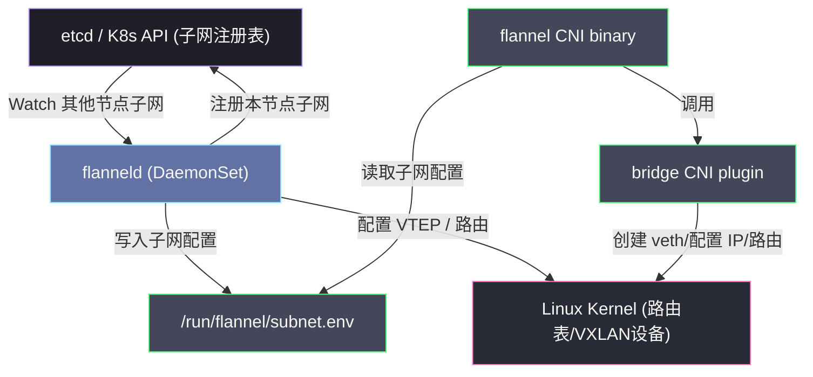

# Flannel深度解析——VXLAN、Host-GW与UDP模式

## 摘要

Flannel 是 Kubernetes 生态中历史最悠久、部署最广泛的 CNI 插件之一。它的设计目标极度聚焦：**用最简单的方式解决跨节点 Pod 通信问题**。本文深入 Flannel 的三种后端实现——UDP（用户态隧道）、VXLAN（内核隧道）、Host-GW（纯三层路由）——逐字节还原数据包的封装与转发路径，解析 flannel-daemon 的子网分配机制与 etcd/K8s API 协调逻辑，并通过三种模式的性能对比，揭示 Flannel "简单易用却性能受限"这一工程取舍的内在逻辑。

---

## 第 1 章 Flannel 的设计哲学与定位

### 1.1 一个故意被简化的 CNI 插件

2014 年，CoreOS 在开发 Kubernetes 的早期版本时面临一个工程现实问题：需要一个能快速跑通的网络方案，让开发者能够上手 Kubernetes，而不是在网络配置上花费大量时间。Flannel 由此诞生——它的第一优先级是**简单**，第二优先级才是性能。

这个定位决定了 Flannel 的边界：
- ✅ **解决了什么**：跨节点 Pod 间的三层（L3）连通性
- ❌ **没有解决什么**：NetworkPolicy（没有流量过滤能力）、加密通信、L7 感知、细粒度 IP 管理

理解这个设计边界，是理解为什么生产环境大集群往往不用 Flannel 的根本原因——不是 Flannel 做错了什么，而是它从一开始就不打算解决那些问题。

### 1.2 Flannel 的整体架构

Flannel 的架构由两部分组成：

**1. flannel-daemon（flanneld）**：在每个 Kubernetes 节点上以 DaemonSet 形式运行的守护进程。它的职责是：
- 向集群的状态存储（etcd 或 Kubernetes API）注册本节点的子网分配信息
- Watch 其他节点的子网注册信息，在本节点配置对应的网络路由或隧道
- 根据后端类型（VXLAN/UDP/Host-GW），创建并维护对应的内核网络设备

**2. flannel CNI 插件（/opt/cni/bin/flannel）**：一个被 containerd 调用的 CNI binary。它的职责是：
- 读取 flannel-daemon 写入本地的子网配置文件（`/run/flannel/subnet.env`）
- 调用 bridge CNI 插件，完成具体的 veth pair 创建、IP 分配、路由配置

这种"daemon + CNI binary"的分工值得理解：flannel-daemon 负责**集群级**的网络拓扑维护（哪个节点管哪个子网，怎么到达），flannel CNI binary 负责**Pod 级**的网络配置（单个 Pod 的 veth、IP、路由）。



### 1.3 子网分配机制

Flannel 将整个集群的 Pod CIDR（如 `10.244.0.0/16`）划分成多个子网（默认每个节点 `/24`，即 254 个 Pod IP），每个节点独占一个子网。

**分配过程**：
1. flanneld 启动时，从配置中读取全局 Pod CIDR（如 `10.244.0.0/16`）和每节点子网大小（SubnetLen，默认 24）
2. 向 etcd（或 Kubernetes API）注册本节点的子网租约（Lease），格式如：`/coreos.com/network/subnets/10.244.1.0-24` → `{"PublicIP": "192.168.1.11", "BackendType": "vxlan", "BackendData": {"VNI": 1, "VtepMAC": "..."}}`
3. 子网分配使用 **CAS（Compare-And-Swap）** 操作保证原子性，不会出现两个节点抢到同一个子网的情况
4. flanneld Watch etcd 中其他节点的子网租约，实时感知集群网络拓扑变化

子网分配完成后，flannel-daemon 将本节点的子网信息写入 `/run/flannel/subnet.env`：

```bash
FLANNEL_NETWORK=10.244.0.0/16
FLANNEL_SUBNET=10.244.1.1/24     # 本节点的子网（第一个 IP 作为网关）
FLANNEL_MTU=1450                  # 考虑封包 overhead 后的 MTU
FLANNEL_IPMASQ=true               # 是否开启出集群流量的 IP Masquerade
```

---

## 第 2 章 UDP 模式——最古老的实现，最重的开销

### 2.1 UDP 模式的设计背景

UDP 模式是 Flannel 最初的实现，也是性能最差的一种。理解它对于理解 VXLAN 模式的改进有重要意义——两者解决的是同一个问题（跨节点封包），但 UDP 模式是在用户态完成这项工作，而 VXLAN 模式将其下沉到内核。

UDP 模式之所以能工作，依赖于一个关键内核特性：**TUN 设备（虚拟隧道网络接口）**。TUN 是 Linux 内核提供的一种虚拟网络设备，它与物理网卡的区别在于：物理网卡的"另一端"是网线，而 TUN 设备的"另一端"是一个用户态进程的文件描述符——用户态进程可以从 TUN 设备读取内核送来的原始 IP 数据包，也可以向 TUN 设备写入 IP 数据包，内核会把它当作真实收到的网络包处理。

> [!info] 核心概念
> TUN（三层隧道）和 TAP（二层隧道）是 Linux 两种不同的虚拟网络设备。TUN 工作在 L3（IP 层），用户态读写的是 IP 数据包；TAP 工作在 L2（以太网层），读写的是以太网帧。Flannel UDP 模式使用 TUN 设备，因为它处理的是 IP 数据包的封包/解包。OpenVPN 也使用 TUN 设备实现 VPN 隧道。

### 2.2 UDP 模式的数据包路径

设有两个节点：
- Node A：IP `192.168.1.10`，Pod A：IP `10.244.0.2`
- Node B：IP `192.168.1.11`，Pod B：IP `10.244.1.3`

Pod A 向 Pod B 发送一个数据包，在 UDP 模式下经历以下步骤：

**步骤 1：Pod A 发出数据包**
Pod A 的 eth0（`10.244.0.2`）发出目标 IP 为 `10.244.1.3` 的数据包。根据 Pod A 内的路由表，默认路由走 cni0 bridge（`10.244.0.1`）。数据包经过 veth pair，到达 Node A 的 cni0。

**步骤 2：Node A 内核路由查找**
Node A 的路由表中有一条由 flanneld 写入的路由：`10.244.1.0/24 via flannel0 dev flannel0`（flannel0 是 TUN 设备）。内核将数据包交给 TUN 设备 flannel0。

**步骤 3：flanneld 从 TUN 读取原始包**
由于 flannel0 是 TUN 设备，"另一端"的 flanneld 用户态进程通过 `read(fd)` 读取到这个原始 IP 数据包（`src=10.244.0.2, dst=10.244.1.3`）。

**步骤 4：flanneld 封包为 UDP**
flanneld 查询路由表：目标 `10.244.1.3` 属于 Node B 管理的子网 `10.244.1.0/24`，Node B 的公网 IP 是 `192.168.1.11`。flanneld 将原始 IP 包作为 **UDP payload**，封装为：
```
UDP 外层包:
  src IP:  192.168.1.10（Node A）
  dst IP:  192.168.1.11（Node B）
  src port: 随机
  dst port: 8285（flannel 默认监听端口）
  payload: [原始 IP 包: src=10.244.0.2, dst=10.244.1.3, ...]
```
然后通过 Node A 的物理网卡发送出去。

**步骤 5：Node B 的 flanneld 收包解包**
Node B 的 flanneld 监听 UDP 8285 端口，收到 UDP 包后，从 payload 中取出原始 IP 包，通过 `write(fd)` 写入 flannel0 TUN 设备。

**步骤 6：Node B 内核路由到 Pod B**
内核收到从 TUN 设备"进来"的 IP 包（`dst=10.244.1.3`），查询路由表，通过 cni0 bridge 转发到 Pod B 的 veth，最终到达 Pod B。

### 2.3 用户态/内核态切换：UDP 模式的性能杀手

上述过程中，一个数据包经历了 **4 次用户态/内核态切换**：

```
[Pod A] → 内核协议栈 → TUN flannel0 → [用户态 flanneld 读取]
                                              ↓ 封 UDP 包
[物理网卡发送] ← 内核协议栈 ← [用户态 flanneld 写入 socket]

（Node B 收包方向对称）
```

每次用户态/内核态切换都需要：保存/恢复寄存器状态、切换地址空间、可能触发 TLB flush。在网络密集型场景下，这 4 次切换的累积开销是不可忽视的。

基准测试数据（参考 Cilium 官方 CNI 性能报告）：
- 原生网络（物理网卡直连）：约 9.5 Gbps
- Flannel UDP 模式：约 **2-3 Gbps**（降幅超过 60%）
- Flannel VXLAN 模式：约 7-8 Gbps（降幅约 15-20%）
- Calico BGP 直连：约 9+ Gbps（接近原生）

这就是为什么 UDP 模式在现代生产环境中几乎不再使用——它的性能损耗太大，而 VXLAN 模式在安全性相同的前提下，性能好得多。

> [!warning] 生产避坑
> 如果你的 Flannel 部署没有显式指定 backend 类型，不同版本的默认值不同。新版 Flannel 默认使用 VXLAN 模式，但如果运行在内核版本低于 3.12 的旧机器上，可能回退到 UDP 模式。可以通过 `kubectl get cm kube-flannel-cfg -n kube-flannel -o yaml` 确认 backend 类型。

---

## 第 3 章 VXLAN 模式——将封包下沉到内核

### 3.1 VXLAN 协议背景

VXLAN（Virtual eXtensible Local Area Network，虚拟可扩展局域网）是 IETF RFC 7348 定义的网络隧道协议。它诞生于数据中心网络虚拟化的需求：在物理三层（L3）网络之上，构建虚拟的二层（L2）网络，让 VM 可以跨机架、跨数据中心"看起来"在同一个局域网内。

VXLAN 的封包格式如下（从内到外）：

```
┌─────────────────────────────────────────────────────┐
│  原始以太网帧 (Inner Frame)                           │
│  ┌──────────────────────────────────────────────┐    │
│  │  Inner Ethernet Header (src MAC, dst MAC)    │    │
│  │  Inner IP Header (src Pod IP, dst Pod IP)    │    │
│  │  Inner TCP/UDP Payload                       │    │
│  └──────────────────────────────────────────────┘    │
├─────────────────────────────────────────────────────┤
│  VXLAN Header (8 bytes)                              │
│  ┌────────────────────────────────────────────┐      │
│  │  Flags (8 bits) | Reserved (24 bits)       │      │
│  │  VNI - VXLAN Network Identifier (24 bits)  │      │  
│  │  Reserved (8 bits)                         │      │
│  └────────────────────────────────────────────┘      │
├─────────────────────────────────────────────────────┤
│  UDP Header (dst port: 4789, IANA 标准)              │
├─────────────────────────────────────────────────────┤
│  Outer IP Header (src Node IP, dst Node IP)          │
├─────────────────────────────────────────────────────┤
│  Outer Ethernet Header                               │
└─────────────────────────────────────────────────────┘
```

**VNI（VXLAN Network Identifier）** 是 24 位，可以区分约 1600 万个不同的 VXLAN 网络。Flannel 默认使用 VNI=1（因为整个集群只有一个 overlay 网络）。

### 3.2 VXLAN 的内核实现：VTEP 设备

VXLAN 模式与 UDP 模式的根本区别在于：**封包/解包操作由 Linux 内核在 VTEP（VXLAN Tunnel EndPoint，VXLAN 隧道端点）设备上完成，不需要用户态进程参与**。

**VTEP 设备**（在 Flannel 中是 `flannel.1`）是 Linux 内核的一种特殊虚拟网络设备，它同时具备：
- 在发送端：将 L2 以太网帧封装进 VXLAN/UDP/IP 包，通过物理网卡发送
- 在接收端：从 UDP 包中剥离 VXLAN header，还原内层以太网帧，注入到内核网络栈

VTEP 的工作完全在内核态完成，避免了 UDP 模式的用户态/内核态切换开销。

flanneld 在启动时创建 VTEP 设备：

```bash
# flanneld 执行的等效操作（实际通过 netlink 系统调用完成）
ip link add flannel.1 type vxlan \
    id 1 \                        # VNI = 1
    dstport 8472 \                # Flannel 使用 8472（非 IANA 标准 4789）
    nolearning \                  # 禁用 ARP 学习（由 flanneld 手动维护 FDB）
    local 192.168.1.10            # 本节点公网 IP

ip addr add 10.244.0.0/32 dev flannel.1   # VTEP 的 IP（子网网络地址）
ip link set flannel.1 up
```

> [!info] 核心概念
> `nolearning` 是 VXLAN 在 Kubernetes 中使用的关键配置。标准 VXLAN 会通过 ARP 广播学习远端 MAC 地址（这在数据中心网络中可行），但在 Kubernetes 场景中，flanneld 已经知道所有节点的 Pod 子网和 VTEP MAC，不需要广播学习——由 flanneld 手动写入 FDB（Forwarding DataBase）表和 ARP 表，实现精确的点对点转发，避免广播风暴。

### 3.3 VXLAN 模式的数据包路径

仍然使用之前的例子（Pod A: `10.244.0.2` → Pod B: `10.244.1.3`）：

**步骤 1：Pod A 发包，到达 Node A 的路由层**

同 UDP 模式的步骤 1，数据包到达 Node A 的 cni0 bridge 后，由内核路由查找。Node A 的路由表中有一条 flanneld 写入的路由：
```
10.244.1.0/24 via 10.244.1.0 dev flannel.1 onlink
```
这条路由的含义：目标为 `10.244.1.0/24` 的包，通过 `flannel.1` 设备转发，下一跳（nexthop）是 `10.244.1.0`（Node B 的 VTEP IP）。

**步骤 2：内核查找 VTEP MAC（ARP 表）**

内核需要知道下一跳 `10.244.1.0` 对应的 MAC 地址，以构造内层以太网帧。它查询 ARP 表：
```
10.244.1.0 dev flannel.1 lladdr d2:1b:c3:4a:5e:6f PERMANENT
```
这条 ARP 记录是 flanneld 通过 `ip neigh add` 手动写入的，`d2:1b:c3:4a:5e:6f` 是 Node B 的 VTEP 设备（`flannel.1`）的 MAC 地址。

**步骤 3：内核查找 Node B 的物理 IP（FDB 表）**

内核知道了下一跳的 MAC，但还需要知道把 VXLAN UDP 包发到哪个节点的 IP（即 Node B 的实际物理 IP）。它查询 FDB（Forwarding Database）表：
```
d2:1b:c3:4a:5e:6f dev flannel.1 dst 192.168.1.11 self permanent
```
FDB 表告诉内核：MAC `d2:1b:c3:4a:5e:6f` 对应的 VTEP 在 IP `192.168.1.11`（Node B 的物理网卡 IP）。

**步骤 4：内核 VTEP 封包**

内核在 `flannel.1` 设备上完成 VXLAN 封包：

```
Outer IP:   src=192.168.1.10 (Node A)  dst=192.168.1.11 (Node B)
UDP:        src=随机端口              dst=8472
VXLAN:      VNI=1
Inner Eth:  src=flannel.1的MAC        dst=d2:1b:c3:4a:5e:6f
Inner IP:   src=10.244.0.2 (Pod A)    dst=10.244.1.3 (Pod B)
Inner TCP:  [原始 TCP 负载]
```

整个封包操作**完全在内核态完成**，通过物理网卡（eth0）发出。

**步骤 5：Node B 收包解包**

Node B 的物理网卡收到 UDP 包，目标端口 8472 对应 VXLAN 设备 `flannel.1`。内核将 VXLAN 包交给 flannel.1 处理，剥离外层 UDP/VXLAN header，还原内层以太网帧，注入内核网络栈。

**步骤 6：Node B 路由到 Pod B**

还原出的 IP 包（`dst=10.244.1.3`）经过 Node B 的路由表，到达 cni0 bridge，再通过 veth pair 到达 Pod B。

### 3.4 flanneld 如何维护 ARP 和 FDB 表

理解 flanneld 的 ARP/FDB 维护机制，对于排查 VXLAN 网络问题至关重要。

**flanneld 通过 Watch Kubernetes API 感知集群变化**：
- 当新节点加入集群时，新节点的 flanneld 向 K8s API（Node annotation 或 Lease）注册自己的子网和 VTEP MAC
- 其他节点的 flanneld Watch 到新节点注册事件后，立即通过 netlink 系统调用，在本节点添加：
  - ARP 记录：`新节点的 VTEP IP → 新节点的 VTEP MAC`
  - FDB 记录：`新节点的 VTEP MAC → 新节点的物理 IP`
  - 路由记录：`新节点的 Pod CIDR → 经 flannel.1 到新节点 VTEP IP`

**节点下线时**，其他节点的 flanneld Watch 到 Lease 过期，删除对应的 ARP、FDB、路由记录。

这种**集中式感知 + 分散式配置**的模式，是 Flannel VXLAN 模式能够工作的核心机制。如果 flanneld DaemonSet 某个节点上的 Pod 崩溃，该节点将无法感知新节点的加入，可能导致与新节点 Pod 的通信中断。

```bash
# 排查 VXLAN 网络问题的常用命令

# 1. 查看 flannel.1 设备
ip -d link show flannel.1

# 2. 查看 VTEP ARP 表（哪个 VTEP IP 对应哪个 MAC）
ip neigh show dev flannel.1

# 3. 查看 VTEP FDB 表（哪个 MAC 在哪个物理 IP 上）
bridge fdb show dev flannel.1

# 4. 查看路由表中 flannel 相关路由
ip route show | grep flannel

# 5. 验证某个远端节点的 FDB 记录是否正确
bridge fdb show dev flannel.1 | grep <远端节点物理IP>
```

### 3.5 MTU 的问题

VXLAN 封包会增加包头开销：
- VXLAN header: 8 bytes
- UDP header: 8 bytes  
- IP header: 20 bytes
- Ethernet header: 14 bytes
- **合计：50 bytes overhead**

如果底层网络的 MTU 是 1500 bytes，那么 Flannel VXLAN 模式的有效 MTU 是 **1450 bytes**（1500 - 50）。这就是 `/run/flannel/subnet.env` 中 `FLANNEL_MTU=1450` 的来源。

如果 Pod 发出的 IP 包超过 1450 bytes 但没有正确设置 MTU，会发生**IP 分片（IP Fragmentation）**——大包被分成多个小包，在目标端重组，这是严重的性能杀手。更糟糕的情况是，如果中间路由器设置了 `Don't Fragment` 位，大包会被直接丢弃，导致神秘的连接超时故障（数据量小时没问题，数据量大时连接中断）。

> [!warning] 生产避坑
> Flannel 会通过 `FLANNEL_MTU` 配置节点和 Pod 的 MTU，但这个机制并不总是可靠的。生产中建议显式在节点的 Docker/containerd 配置中设置 MTU：
> ```bash
> # 对于 containerd，在 /etc/containerd/config.toml 中
> [plugins."io.containerd.grpc.v1.cri".cni]
>   conf_template = ""
> # 或在 CNI 配置文件中显式设置 mtu 字段
> ```
> 另外，如果底层网络已经使用了 VXLAN（如很多云厂商的 VPC 网络），Flannel VXLAN 会形成**双层 VXLAN 封包**（overlay over overlay），MTU 损耗达 100 bytes，进一步降低有效吞吐量。

---

## 第 4 章 Host-GW 模式——没有封包的纯路由

### 4.1 Host-GW 的工作原理

Host-GW（Host Gateway，主机网关）模式是 Flannel 性能最高的模式，它完全放弃了隧道封包，改用**纯 IP 路由**来实现跨节点通信。

**核心思路**：每个节点本身就是其他节点 Pod 子网的"网关"——当 Node A 想要把包发到 Node B 管理的 `10.244.1.0/24`，只需在 Node A 的路由表上加一条：`10.244.1.0/24 via 192.168.1.11 dev eth0`（即，通过物理网卡 eth0，把包直接发给 Node B 的物理 IP）。数据包到达 Node B 后，Node B 根据本地路由表转发到对应 Pod。

这个方案的精妙之处在于：数据包**不需要任何封包/解包**，内外层 IP 只有一层（Pod IP 就是最外层 IP），完全等同于原生 IP 路由。

### 4.2 Host-GW 模式的路由配置

当 flanneld 以 Host-GW 模式运行时，它的工作变得极其简单：**Watch 集群中其他节点的子网注册，为每个远端节点在本地路由表中写入一条静态路由**。

假设集群有 3 个节点：
- Node A（`192.168.1.10`）：Pod CIDR `10.244.0.0/24`
- Node B（`192.168.1.11`）：Pod CIDR `10.244.1.0/24`
- Node C（`192.168.1.12`）：Pod CIDR `10.244.2.0/24`

Node A 的路由表（由 flanneld 写入）：
```
10.244.0.0/24 dev cni0 proto kernel scope link src 10.244.0.1  # 本节点 Pod 子网，直连
10.244.1.0/24 via 192.168.1.11 dev eth0                        # Node B 的 Pod 子网
10.244.2.0/24 via 192.168.1.12 dev eth0                        # Node C 的 Pod 子网
```

数据包 `Pod A (10.244.0.2) → Pod B (10.244.1.3)` 的路径：

```
[Pod A]
  ↓ veth pair
[cni0 bridge, Node A]
  ↓ Linux 路由查找: 10.244.1.3 匹配 10.244.1.0/24 via 192.168.1.11
[eth0, Node A] → 直接发到 Node B（物理网络）
  ↓
[eth0, Node B]
  ↓ Linux 路由查找: 10.244.1.3 匹配本地路由 10.244.1.0/24 dev cni0
[cni0 bridge, Node B]
  ↓ veth pair
[Pod B]
```

整个过程没有任何封包，数据包的 IP header 始终是 `src=10.244.0.2, dst=10.244.1.3`，完全满足 Kubernetes 的"无 NAT"约束。

### 4.3 Host-GW 模式的关键限制

**Host-GW 要求所有节点必须在同一个二层网络（L2 域，即同一子网）**。

原因是：Host-GW 路由表中的下一跳是其他节点的物理 IP（如 `192.168.1.11`），而 Linux 路由只能将数据包发往与本机直接连通的下一跳——即同一二层网络内的地址。如果 Node A（`192.168.1.10`）和 Node B（`10.0.0.11`）在不同的子网，`via 10.0.0.11` 这条路由就无法直接生效，因为 Node A 的 ARP 找不到 `10.0.0.11`（不在同一以太网段）。

这个限制在以下场景中成为阻碍：
- **云厂商多可用区部署**：不同可用区的节点通常在不同的 VPC 子网，天然是不同 L2 域
- **混合云/跨数据中心集群**：节点必然跨越多个 L3 网络

反之，在以下场景中，Host-GW 是完美方案：
- **裸金属集群**：所有节点接同一台 ToR 交换机，同一 VLAN
- **同一云厂商同一子网的节点**：满足二层互通条件

### 4.4 三种模式的性能对比与选型


| 维度 | UDP 模式 | VXLAN 模式 | Host-GW 模式 |
| :--- | :---: | :---: | :---: |
| **数据面** | 用户态（TUN + flanneld） | 内核（VTEP 设备） | 内核（纯路由） |
| **封包 overhead** | 较大（UDP 封包） | 中等（VXLAN 50B） | **无** |
| **MTU 损耗** | ~50 bytes | ~50 bytes | **0** |
| **跨子网支持** | ✅ | ✅ | ❌（需要 L2 互通） |
| **CPU 使用** | 最高（用户态处理） | 中等 | **最低** |
| **延迟** | 最高 | 中等 | **最低** |
| **适用场景** | 兼容性最高，性能不敏感 | 主流选择，云环境通用 | 裸金属、同 L2 域节点 |

---

## 第 5 章 Flannel 的 iptables 规则与 IP Masquerade

### 5.1 出集群流量的 NAT 问题

前面讨论的都是 Pod 间通信。当 Pod 需要访问集群外部网络（如公网 API、外部数据库）时，存在一个关键问题：Pod IP（`10.244.x.x`）是集群内部的私有地址，出了集群没有任何意义——外部网络不知道如何把响应包路由回来。

解决办法是 **IP Masquerade（SNAT，源地址转换）**：当 Pod 的数据包经过节点网卡出集群时，将源 IP 从 Pod IP 替换为节点的公网 IP。这样外部网络看到的请求来自节点的公网 IP，响应也会发到节点，节点再通过 conntrack 找到对应的 Pod，将响应包的目标 IP 改回 Pod IP（DNAT）。

### 5.2 Flannel 写入的 iptables 规则

当 `FLANNEL_IPMASQ=true`（默认）时，flanneld 在每个节点写入如下 iptables 规则（位于 nat 表的 POSTROUTING 链）：

```
-A POSTROUTING -s 10.244.0.0/16 ! -o flannel.1 -j MASQUERADE
```

解读：
- 源 IP 在 `10.244.0.0/16`（即 Pod IP）
- 出接口**不是** `flannel.1`（即不是发往其他节点的隧道流量）
- 执行 MASQUERADE（将源 IP 替换为出接口的 IP）

这条规则精确地只对出集群的流量做 SNAT，Pod 间的流量（从 `flannel.1` 转发，条件不满足）不做 NAT，满足 Kubernetes 的"Pod 间无 NAT"约束。

> [!note] 设计哲学
> `! -o flannel.1` 这个"排除隧道接口"的技巧在 Flannel 中普遍使用，是一种精确的流量分类方式：同一条 iptables 规则既保证了 Pod 间通信的无 NAT 语义，又保证了出集群流量的正确 SNAT。这种"白名单排除"比"黑名单匹配目标 IP"更稳健——即使将来 Pod CIDR 发生变化，规则逻辑也不需要更新。

---

## 第 6 章 Flannel 的局限性与演进

### 6.1 没有 NetworkPolicy——Flannel 的最大短板

Flannel 从设计之初就没有 NetworkPolicy 的实现，这是它在生产环境受限的根本原因。

**什么是 NetworkPolicy？** 它是 Kubernetes 定义的网络访问控制策略，允许用户声明"Pod A 只能接受来自 Pod B 的 TCP 80 端口流量"。如果没有 NetworkPolicy，集群中所有 Pod 之间默认是全互通的——任何 Pod 可以访问任何其他 Pod 的任意端口，这在多租户或安全敏感场景中是不可接受的。

Flannel 的解决办法是：**配合 Calico 的 NetworkPolicy 引擎使用**——只用 Flannel 的网络后端（封包/路由），用 Calico 的 Felix 组件来处理 iptables 规则（实现 NetworkPolicy）。这种组合被称为 **Canal**。Canal 适合那些已经在用 Flannel 但又需要 NetworkPolicy 的团队，作为过渡方案。

### 6.2 Flannel 的规模瓶颈

Flannel 的 Host-GW 模式在节点数量增加时，每个节点的路由表条目数线性增长（N 个节点，每个节点有 N-1 条路由）。当集群规模达到数百甚至数千节点时：
- 路由表过大，路由查找延迟增加
- flanneld 需要维护和同步大量路由更新
- 节点上线/下线时，全集群的路由表需要同步更新

这是 Calico 使用 BGP 协议解决路由分发的动机之一——BGP 的设计就是为了处理互联网级别的路由规模（数十万条路由），在 Kubernetes 规模下绰绰有余。

### 6.3 Flannel 在 2024 年的现状

Flannel 仍然是轻量级、测试环境、单租户集群的流行选择，原因是：
- **极低的学习曲线**：kubeadm + Flannel 是 Kubernetes 官方文档中最常见的示例
- **无状态、轻量级**：flanneld 本身资源消耗极低
- **成熟稳定**：代码变化缓慢，没有激进的新特性引入

但对于需要 NetworkPolicy、多租户隔离、高性能、可观测性的生产集群，Calico 或 Cilium 是更合适的选择。

---

## 第 7 章 小结

### 7.1 三种模式的本质差异

三种模式之间的差异，根本上是在**"实现跨节点路由"**这个问题上做出的不同工程选择：

| 模式 | 本质 | 代价 | 收益 |
| :--- | :--- | :--- | :--- |
| **UDP** | 用户态软件隧道 | 性能最差（4次 context switch） | 兼容性最好 |
| **VXLAN** | 内核硬件隧道 | MTU 损耗，轻微封包开销 | 跨 L3 域可用，性能可接受 |
| **Host-GW** | 纯路由，无隧道 | **必须二层互通** | 性能最高，接近原生 |

### 7.2 Flannel 知识体系的位置

Flannel 是理解 CNI 插件技术演进的重要基础。理解 Flannel 的封包模式和局限性，正是理解为什么 Calico 要用 BGP 路由、为什么 Cilium 要用 eBPF 的逻辑起点。

- **[[04 Calico深度解析——BGP路由、eBPF数据面与网络策略]]**：Calico 如何用 BGP 在三层网络中实现无封包路由，以及如何用 Felix 实现企业级 NetworkPolicy
- **[[05 Cilium深度解析——eBPF驱动的下一代网络与可观测性]]**：Cilium 如何彻底绕过 iptables 和传统内核网络栈，用 eBPF 实现更高效的数据面

---

*本文是 [[Kubernetes网络原理与插件]] 专栏的第 3 篇。*

---

> [!note] 思考题
> 1. kube-proxy 的 iptables 模式为每个 Service 创建一组 iptables 规则——使用概率分支实现负载均衡（如 3 个 Pod 各 33% 概率）。在 5000 个 Service 的集群中，iptables 规则可能达到数万条——规则匹配的 CPU 开销和更新延迟都很高。IPVS 模式使用内核的 IPVS 模块——Hash 表 O(1) 查找。你的集群是否应该迁移到 IPVS？迁移的风险是什么？
> 2. kube-proxy 的 `externalTrafficPolicy: Local` 保证外部流量只路由到与入口节点相同节点上的 Pod——保留了客户端源 IP。但如果该节点上没有 Pod——流量被丢弃（返回 502）。`externalTrafficPolicy: Cluster`（默认）在所有节点上负载均衡但会 SNAT（丢失源 IP）。你如何在'保留源 IP'和'负载均衡均匀性'之间选择？
> 3. eBPF-based kube-proxy 替代方案（如 Cilium 的 kube-proxy replacement）直接在内核中通过 eBPF 实现 Service 负载均衡——不需要 iptables/IPVS。性能更高且支持更丰富的负载均衡策略（如 Maglev 一致性哈希）。在什么规模下替换 kube-proxy 的收益值得迁移成本？
