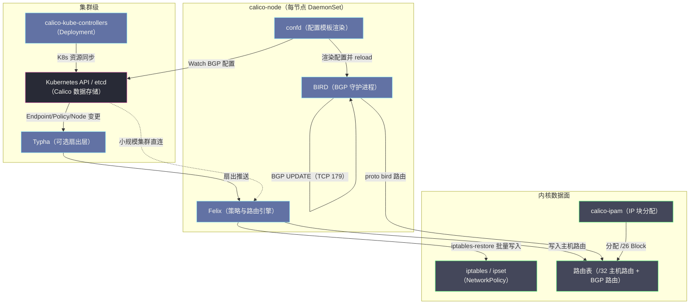
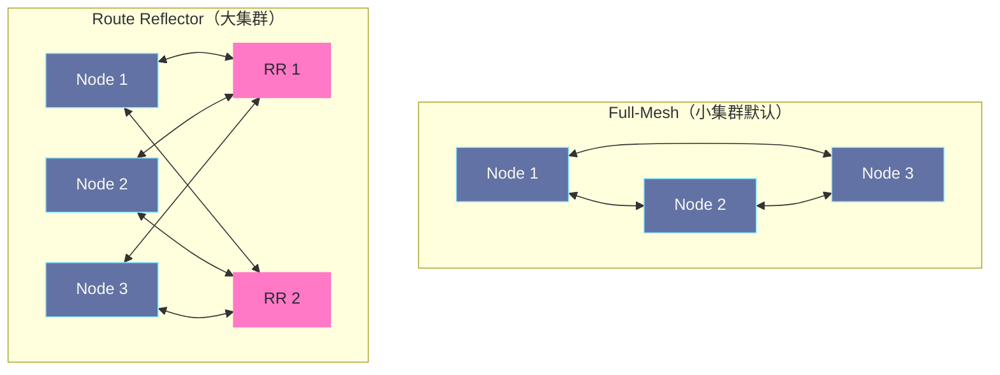
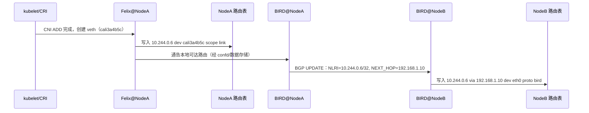

# Calico深度解析——BGP路由、eBPF数据面与网络策略

**摘要：**

在绝大多数 CNI 插件沿着"用隧道封包掩盖物理网络复杂性"的思路前进时，Calico 选择了一条截然相反的道路——它拒绝封包，转而把 Kubernetes 集群里的每一台宿主机变成一台正统的 BGP 路由器，让 Pod IP 以真实身份参与集群的三层路由域。这一异类选择的底气，来自其背后电信软件团队对互联网骨干路由协议数十年工程经验的移植。本文沿着"动态路由协议如何在容器时代重获新生"这条主线，先追溯 Calico 从电信机房到数据中心的出身渊源，再拆解 Felix、BIRD、confd、Typha 四个组件如何把声明式策略与路由信息灌入 Linux 内核，随后深入 iBGP Full-Mesh 的平方困局与 Route Reflector 的化解之道、calico-ipam 的块分配与地址借用机制，以及跨子网场景下 IPIP 与 VXLAN 的按需封包智慧；最后直面 Calico 的 eBPF 数据面如何在内核 TC 钩子上收起 iptables 的历史包袱。本文旨在回答两个问题：为什么一个诞生于互联网自治系统之间的路由协议，能成为容器网络最合适的控制面，以及在生产集群的规模与安全约束下，应当如何在 Calico 的多种数据面形态之间做出取舍。

---

## 第 1 章 历史抉择：从电信机房到数据中心自治系统

### 1.1 一家电信软件公司的跨界

理解 Calico 的设计气质，必须先理解它的出身。

Calico 并不是在容器社区里原生生长出来的项目，它诞生于英国电信软件公司 Metaswitch Networks——一家从上世纪八十年代起就为运营商编写呼叫控制与网络信令软件的老牌厂商，在电信级 IP 路由与软交换领域浸淫了数十年。2015 年前后，当 CoreOS 的 CNI 规范刚刚划定容器网络接口的边界、整个生态还在为"如何让跨主机容器互通"而集体转向隧道封包时，Metaswitch 的工程师们带着一个电信人的直觉闯入了这个战场：在一个网络专业人士眼中，容器要的根本不是被层层包裹的虚拟局域网，而是一个干干净净、可被路由协议直接寻址的三层端点。

2016 年，Calico 的核心团队从 Metaswitch 剥离出来创立 Tigera，专门负责 Calico 的商业化运营；2020 年 Metaswitch 本身被微软收购，而 Calico 项目则继续在 Tigera 与开源社区的共同推动下演进。这段并不平坦的公司变迁史并没有改变 Calico 的技术底色——它始终是 CNI 世界里那个把"路由"二字刻在骨子里的异类。

### 1.2 BGP 的底气：一份为互联网而生的协议

Calico 敢把动态路由协议引入集群，依仗的是 BGP（Border Gateway Protocol，边界网关协议）在互联网上长达三十余年的服役记录。

BGP-4 由 RFC 4271 于 2006 年正式标准化（其前身可追溯至 1989 年的 RFC 1105），是支撑全球互联网自治系统（Autonomous System，AS）之间路由交换的唯一事实标准。你今天访问任何一个网站，数据包穿越的电信、联通、云厂商骨干网，其可达性信息全部由 BGP 在数十万个自治系统之间传播。一个天生就要在高度异构、互不信任、动辄数十万条前缀规模的环境中求生的协议，其可靠性、收敛能力与可运营性早已被互联网本身的体量反复证明。

更值得玩味的是，将 BGP 搬进数据中心这件事，在 Calico 之前就有了官方背书。随着大规模数据中心普遍采用 CLOS 折线拓扑组网，IETF 于 2017 年发布了 RFC 7938《Use of BGP for Routing in Large-Scale Data Centers》，明确建议用 BGP 取代传统的二层生成树与机箱内专有协议来构建数据中心内部的 Underlay 路由域。也就是说，当 Kubernetes 需要为每一个 Pod 找到去往对端节点的路径时，BGP 在数据中心里本就是成熟得近乎无聊的标准答案——Calico 所做的，不过是把这套答案从机顶交换机（Top-of-Rack Switch）一路延伸到了宿主机上的每一个 veth 接口。

### 1.3 Flannel 留下的三笔账

在前一篇 [[03 Flannel深度解析——VXLAN、Host-GW与UDP模式|Flannel 深度解析]]中我们看到，Flannel 用最小复杂度打通了跨节点连通性，但也在工程上欠下了三笔必须有人偿还的账：

**第一笔是封包开销的账。** VXLAN 模式每包固定付出 50 字节的头部与一次内核封包/解包的成本，在 RPC 密集型微服务场景下，这笔税会在 PPS 与有效载荷比上同时体现；UDP 模式的用户态转发则更为昂贵。

**第二笔是安全策略的账。** Flannel 只管"通不通"，不管"该不该通"。多租户集群要求的 NetworkPolicy 隔离，在纯 Flannel 部署中只能依靠外挂 Canal 这类缝合方案，把 Calico 的 Felix 策略引擎嫁接进来——这本身就已经暗示了 Calico 在策略侧的不可替代性。

**第三笔是规模收敛的账。** Flannel 的每个节点依赖控制面全量推送的静态路由与 ARP/FDB 表项，节点上下线引发的表项刷新要遍历全网；而 BGP 天生就是为"增量通告、按需收敛"设计的协议，节点加入时只需向 Peer 通告几条 UPDATE，离开时有标准的撤销与保活探测机制。

Calico 的全部设计，可以视为对这三笔账的一次系统性清算。它选择正面回答一个被隧道方案绕开的问题：如果物理网络本来就会路由，为什么不直接让 Pod 流量被路由？在笔者看来，这个问题之所以值得问，是因为它逼出了 CNI 选型中最根本的分歧点——你究竟信不信任自己的 Underlay。

---

## 第 2 章 纯三层路由的核心主张

### 2.1 每个节点就是一台路由器

Calico 的核心主张用一句话即可概括：**每个节点就是一台路由器，Pod IP 是可被路由的真实 IP，同网段内不需要任何 Overlay 封包**。

这句话里藏着两层激进之处。其一，它拒绝了把宿主机伪装成交换机的诱惑——Calico 节点上的 Pod 外端接口不接入任何 Linux 网桥，没有 MAC 学习，没有广播域，没有 ARP 泛洪，一台宿主机上几百个 Pod 在二层视角下彼此完全隔绝，所有互访一律上升到三层由路由表裁决。其二，它要求集群的 Underlay 网络"懂"Pod 路由——节点之间通过 BGP 交换 Pod 子网可达性，目的地址是 Pod IP 的数据包在物理网络上就以 Pod IP 的原貌被逐跳转发，IP 头部从头到尾不被重写。

这种设计换来的是隧道方案永远无法企及的两样东西：**零封包开销**与**端到端的 IP 身份保真**。前者意味着同网段 Pod 间通信的网络路径与两台物理机直接互访完全等价，吞吐与延迟不损失一个比特；后者意味着网络策略、访问日志、流量审计所看到的源地址，自始至终就是那个 Pod 自己，而不是某个经过 SNAT 伪装的节点 IP——这正是后文 NetworkPolicy 能够以 IP 为粒度精确设防的地基。

身份保真的价值在运维侧同样立竿见影：抓包工具、NetFlow 审计、物理防火墙上的每一条流记录都直接对应一个 Pod，排查"谁在连谁"不再需要拿着时间戳去对照 NAT 表与 Pod 分配历史做考古式回溯。换言之，Calico 把"定位一个流量属于谁"这件在 Overlay 世界里需要多层拼接的事，还原成了 IP 地址本来的样子。

### 2.2 放弃网桥：/32 主机路由与 cali 接口

Calico 与 Flannel 在单机数据面上最直观的分歧，在于是否使用 Linux Bridge（Flannel 体系中所有 Pod 的 veth 外端都插入 `cni0` 网桥）。Calico 的答案是彻底放弃网桥，代之以**每个 Pod 一条 /32 主机路由**：

```bash
# Calico 节点上的路由表（节选）
ip route show | grep cali

10.244.0.4 dev cali1a2b3c scope link   # Pod 1 的主机路由
10.244.0.5 dev cali4d5e6f scope link   # Pod 2 的主机路由
10.244.0.6 dev cali7a8b9c scope link   # Pod 3 的主机路由
10.244.0.64/26 via 192.168.1.11 dev eth0 proto bird   # Node B 的 Pod 块（BGP 学到）
10.244.0.128/26 via 192.168.1.12 dev eth0 proto bird  # Node C 的 Pod 块
```

每一对 veth pair 的宿主机侧被命名为 `cali` 前缀加随机串（如 `cali1a2b3c`），Felix 为该 Pod 写入一条精确到 /32 的主机路由指向这个接口。没有了网桥，二层域缩小到了每个 veth 对内——从 Pod 视角看，它对端那台"交换机"根本就是一台直连的路由器。

这里还有一个常被忽略的细节：Calico Pod 的默认网关并不是某个真实的网桥地址，而是固定的链路本地地址 `169.254.1.1`。宿主机在每个 `cali` 接口上开启 proxy ARP，无论哪个 Pod 来 ARP 询问这个网关的 MAC，宿主机都以自己的接口 MAC 应答。这套设计让 Pod 的地址配置与网关拓扑彻底解耦——Pod 永远只认 `169.254.1.1`，真正的下一跳裁决由宿主机路由表完成，Pod 内甚至不需要知道自己的网关"长什么样"。

> [!info] 设计对照：二层交换域 vs 三层路由点
> Flannel/bridge 模型下，一台宿主机上所有 Pod 共享一个二层广播域，任何 ARP 请求、误配的组播、乃至失控的广播风暴都在这个域内泛洪；Calico 模型下每个 Pod 独占一条点到点链路，二层彻底退化为一根虚拟导线，所有的可见性、可控性都收敛到路由表与 iptables 这两个三层设施上。这是用"更多路由表项"交换"更小爆炸半径"的典型权衡。

### 2.3 反事实推演：如果 Calico 也去封包

不妨做一个反事实假设：倘若 Calico 当年追随主流采用 VXLAN，它会失去什么，又会得到什么。

得到的显而易见——对物理网络零要求，随便两台能互通三层的机器就能组网，跨机房、跨可用区、跨云都不需要底层配合。但失去的恰恰是其立身之本：一旦接受封包，Pod IP 就不再是网络上的真实身份，网络策略将无法基于"谁在与谁通信"来制定，只能退化为对隧道端点的粗放控制；每一个数据包都要为 VXLAN 头与封解包动作纳税；而最重要的是，Calico 将沦为一个平庸的 CNI——市面上的隧道插件已经够多了，不缺它一个。

这个推演揭示了 Calico 全部后续设计的逻辑起点：**它用对底层网络的更高要求，换取了数据面的零损耗与策略面的强表达**。至于底层不配合时怎么办——那正是 IPIP 与 CrossSubnet 要回答的问题，我们留到第 6 章再谈。

---

## 第 3 章 控制面解剖：Felix、BIRD、confd 与 Typha

Calico 的每节点守护进程 `calico-node`（以 DaemonSet 部署）内部并非铁板一块，而是四个各司其职的进程同居一个容器。这种"一个 Pod 装下一个迷你控制面"的打包方式，常让初学者误以为 Calico 是个单体——先把它们拆开看。



### 3.1 Felix：把声明式世界翻译成内核事实的引擎

Felix 是 Calico 真正的灵魂组件，它的职责清单读起来像一份内核记账员的岗位说明：

- Watch 数据存储中的 Endpoint（Pod）与 Policy 对象，计算出"本节点应该长什么样"；
- 为本节点每个 Pod 维护 /32 主机路由与 `cali` 接口的 ARP 应答；
- 将 NetworkPolicy 翻译成 iptables 规则与 ipset 集合，用 `iptables-restore` 批量灌入内核；
- 将本节点可达的路由喂给 BIRD，由后者对外通告。

Felix 生成的规则体系远不止转发链：除了后文详述的 `cali-from-*`/`cali-to-*` 工作负载链，它还会搭建 `cali-INPUT` 与 `cali-OUTPUT` 两条宿主机保护链——当管理员为节点本身配置了 HostEndpoint 策略时，进出宿主机协议栈（而非仅仅路过转发面）的报文也会进入 Calico 的裁决范围，这让"保护节点 sshd 只允许堡垒机访问"这类诉求与工作负载策略复用同一套语义。规则落地载体上，Felix 传统走 iptables，较新版本亦提供了 nftables 数据面选项以跟进发行版的去 iptables 化潮流，而 eBPF 则是另一条更彻底的技术路线，留待第 8 章展开。

Felix 一个极易被低估的工程决策，是它**从不逐条调用 `iptables -A` 修改规则**。iptables 的每次变更都伴随内核锁与规则链重建，Pod 高频生灭的大集群里，逐条修改会让内核态操作次数爆炸。Felix 的做法是把本节点的目标规则集在内存中整体计算出来，周期性 diff 后用 `iptables-restore` 一次性原子替换——这是声明式思想在内核编程层面的贯彻：不修补现状，而是陈述终态。

### 3.2 BIRD 与 confd：成熟守护进程和它的配置木偶师

BIRD（BIRD Internet Routing Daemon）是查理大学（Charles University）自上世纪末孵化的开源路由守护进程，实现 BGP/OSPF/RIP 等全套协议，如今大量互联网交换中心（IXP）的路由服务器跑的正是它。Calico 没有重复发明 BGP 协议栈，而是把这款久经 ISP 沙场考验的组件直接塞进 `calico-node`——让 BGP 的会话管理、UPDATE 编解码、路由选优、保活与优雅重启（Graceful Restart）这些复杂状态机交给最专业的实现去扛。

这里其实藏着一个值得品味的工程判断：Calico 本可以让 Felix 直接 Watch Kubernetes API 计算路由、再写进内核——毕竟 Pod 增删事件它已经在监听了。但"自己派发路由"意味着要重新发明断连检测、增量同步、错误回滚、多节点时序竞争这一整套分布式状态机的难题，而 BIRD 给出的答案是：这些问题 BGP 协议在三十年前就解决完了，并且经过了全球最苛刻环境的检验。站在成熟协议肩上与自造轮子之间，Calico 选择了前者——这与 CNI 规范本身"用现成二进制拼装而非内嵌框架"的哲学一脉相承。

confd 则扮演着 BIRD 的"配置木偶师"：它 Watch Calico 数据存储中的 BGP 配置对象（AS 号、Peer 列表、Route Reflector 设定等），一旦变化就用模板重新渲染 `bird.conf` 并触发 BIRD reload。新节点入列、RR 拓扑调整，全程无人值守。这个"Watch → 模板渲染 → reload"的三段式，正是 Unix 世界里配置管理的最朴素形态。

### 3.3 Typha：大规模集群的扇出减压阀

旧版 Calico 有个著名的规模短板：每个节点的 Felix 都直连 Kubernetes API Server（或 etcd）做 Watch，N 个节点就是 N 条长连接加 N 份全量事件流，apiserver 会成为被自家网络插件压垮的第一个受害者。

Typha 是为此引入的**扇出代理层**：它作为 Deployment 部署 2-3 个副本，自身向上游 apiserver 维持一份 Watch，向下接纳成百上千个 Felix 的订阅连接，把同一份事件流多播出去。当集群规模超过约 50 个节点时，官方建议启用 Typha——这与 Route Reflector 解决的是同一类问题的两个侧面：一个为控制面事件扇出减压，一个为 BGP 会话平方减压，我们将在第 4 章细看后者。

### 3.4 calico-kube-controllers：两类世界的翻译官

`calico-kube-controllers` 以单副本 Deployment 运行，内部同样是多个职责单一的控制器集合：Policy 控制器把 K8s `NetworkPolicy` 转写为 Calico 的 Policy 表示；Node 控制器把 `Node` 对象同步为 Calico Node 资源（供 IPAM 与 BGP 使用），并在节点被删除时回收其名下全部 IPAM Block；此外还有 Namespace、ServiceAccount 控制器负责把这两类资源的元数据翻译成策略可引用的标签维度，以及周期性的 IPAM 垃圾回收——清理已消亡 Pod 残留的地址分配记录。它是两个世界语义的边界检查员，本身不碰数据面，却是保证"K8s 声明"与"Calico 事实"不漂移的关键纠偏环。

### 3.5 数据存储与部署形态：藏在选项里的自由度

Calico 的"数据存储"层有两个可互换的后端：默认的 **Kubernetes 数据存储（KDD）**把 Calico 的全部状态存为 apiserver 中的 CRD，与 K8s 共用一个 etcd，省去独立存储的运维成本；独立的 **etcd 数据存储**模式则让 Calico 直接持有自己的 etcd 集群——后者多见于超大规模、非 K8s 环境（Calico 本身也能给裸主机、OpenStack 虚机做网络）或对 apiserver 负载极度敏感的集群。部署形态上，手工 manifest 与 tigera-operator（基于 Operator 模式，用 `Installation` CR 声明数据面、IPPool、BGP 拓扑）并存，新集群一律推荐后者——把网络插件自身的生命周期也纳入声明式管理，而不是留在一份越来越难维护的 YAML 大合订本里。

---

## 第 4 章 BGP 数据面：路由如何在节点间生长

### 4.1 iBGP、私有 AS 与 Full-Mesh 的平方困局

Calico 默认让所有节点同属一个私有自治系统——AS 64512（取自 RFC 6996 保留的 64512-65534 私有 AS 段），节点之间运行 **iBGP（internal BGP）**。

这里立刻会撞上 iBGP 的一条祖训：为防止路由环路，从一个 iBGP Peer 学到的路由**不得**再通告给其他 iBGP Peer（即水平分割规则）。这意味着路由信息无法像洪水一样逐跳扩散，每个节点必须与集群内所有其他节点直接建立 BGP 会话——**Full-Mesh 全互联**。N 个节点需要 N×(N-1)/2 条 TCP 179 会话：10 节点 45 条尚可一笑置之，100 节点 4950 条就已触目惊心，每条会话都要消耗文件描述符、内存与保活定时器。

### 4.2 Route Reflector：把平方压回线性

RFC 4456 早就为这个问题准备好了标准答案——**Route Reflector（路由反射器，RR）**。指定少数节点作为 RR，其余节点只需与 RR 建立会话；RR 收到一条 iBGP 路由后，被授予了打破水平分割规则的特权，把它"反射"给所有客户端 Peer。会话数从 O(N²) 降回 O(N)，收敛路径却只多了一跳控制面转发——数据面流量依旧直连，因为 BGP 通告的 NEXT_HOP 始终是路由的原始产生者。



> [!warning] 生产避坑
> 官方经验值是百节点以内的 Full-Mesh 尚可容忍，更大规模应果断引入 RR。RR 的部署姿势是：选择 2-3 台专用 infra 节点（双 RR 避免单点），打上路由反射器标签，将集群 `nodeToNodeMeshEnabled` 关闭，再通过 `BGPPeer` CRD 显式声明每个节点到 RR 的 Peer 关系。裸金属集群更进一步，可以让节点直接以 eBGP 与机顶交换机（ToR）建 Peer，把 Pod 路由注入物理 Fabric——这恰是 RFC 7938 描绘的数据中心组网正统。

### 4.3 一条 /32 路由的完整旅程

以一个具体场景追踪路由的诞生与传播。Node A（`192.168.1.10`）持有 IPAM 块 `10.244.0.0/26`，Node B（`192.168.1.11`）持有 `10.244.0.64/26`，此刻 Node A 上新建 Pod `10.244.0.6`：



这条 BGP UPDATE 的载荷值得驻足看一眼：NLRI 字段携带前缀 `10.244.0.6/32`，NEXT_HOP 属性指向 Node A 的物理 IP，AS_PATH 中只有本集群的私有 AS——极简得近乎简陋，却足以让 Node B 的内核在收到报文、查表命中 `via 192.168.1.10` 之后，把原始 IP 包原封不动地推上物理网络。BGP 的报文类型其实一共只有四种：OPEN 建会话、UPDATE 通增删、KEEPALIVE 保活、NOTIFICATION 报错，一个协议能把互联网的可达性管理压缩进四种消息里运转三十年，这本身就是协议设计史上少有的克制。**动态路由协议之于静态配置的全部优越性，就凝结在这条 `proto bird` 路由里**：Pod 销毁时路由随会话撤销，节点宕机时保活超时触发收敛，一切皆由协议自动完成。

### 4.4 为什么偏偏是 BGP，而不是 OSPF 或 Raft 派发

一个顺理成章的疑问是：传播路由非要 BGP 不可吗。链路状态的 OSPF 行不行，让控制面直接算好路由表用 Raft 一致性推下去行不行。

答案藏在协议的设计目标差异里。OSPF 是域内链路状态协议，要求每个节点洪泛并全量保存全网拓扑数据库（LSDB），为"知道整张地图"付出内存与 SPF 重算代价——它追求的是域内收敛速度，假设参与者同属于一个信任域且数量有界。BGP 是路径向量协议，节点只关心"前缀 + 下一跳 + 路径属性"这条最小可达性信息，不需要重建全局拓扑，天然容忍数十万条前缀与异构参与者；更重要的是 BGP 的会话式 TCP 179 点到点设计，让路由的发布粒度、过滤策略、邻居认证都获得了逐 Peer 精细控制的能力——这正是 ToR 对接、多集群联邦等生产玩法的前提。至于"控制面算好再推"，那不过是把 BGP 已经解决的问题用私有协议重新发明一遍，还要自己处理断连、增量、版本一致性——典型的收益为零、复杂度自造。

细心的读者或许已经注意到一处张力：RFC 7938 推荐数据中心内部用 eBGP-only 组网（每个机架一个 AS），而 Calico 节点间默认却走 iBGP。这并非违背最佳实践，而是面向不同对象的合理分化——RFC 7938 的场景是数据中心 Fabric 自身的 Underlay 组网，eBGP 天然可再通告路由，无需反射器；Calico 的节点间 mesh 是容器 Overlay 之上的路由交换层，节点逻辑上属于同一"集群自治域"，iBGP 配上 RR 已足够。真正需要对接物理网络时（向 ToR 通告 Pod 路由），Calico 会切到 eBGP，每个节点使用独立 AS 或按机架规划 AS——两套范式各就其位，互不僭越。

---

## 第 5 章 IPAM 的块分配：/26 Block、地址亲和与借用

Calico 的 IP 地址管理（calico-ipam）与 Flannel 的"每节点一段大子网"思路形似而神不同，其间的差别在大规模下才会显形。

calico-ipam 以 `IPPool` 定义地址总池（如 `10.244.0.0/16`），但分配的最小单位不是单个 IP，而是**块（Block）**——IPv4 默认 `/26`，即 64 个地址为一块。块通过 `IPAMBlock` CRD 记录在数据存储中，并带有**节点亲和（Block Affinity）**属性：一个块被某个节点申领后，该块内的地址原则上只服务该节点上的 Pod，对外通告时也以 `/26` 为粒度汇聚成一条块路由。

块设计的收益是双重的。对路由面而言，绝大多数跨节点流量靠 `/26` 块路由命中，BGP 通告量从"每 Pod 一条"降为"每 64 个 Pod 一条"，路由表规模与收敛风暴被压缩了两个数量级；对数据存储而言，地址簿从逐 IP 记录变为逐块位图（bitmap），etcd 里的对象数量同样锐减。

但生活从不安分：某个节点上 Pod 数超过其名下所有块的容量时，calico-ipam 允许**跨块借用（Borrowing）**——从其他节点名下尚有富余的块里借出单个 IP。借来的地址不能被原块路由覆盖，Felix 便为它单独下发并通告一条 /32 主机路由。于是 Calico 的 BGP 路由域里实际流淌着两种粒度的前缀：常态的 `/26` 块路由，与借用产生的零散 `/32` 路由——后者是效率为局部碎片付出的代价，数量通常可控，却也解释了为何在超大规模集群中要关注 `IPAMBlock` 的碎片化监控。

`IPPool` 本身还携带几个后文要用的旋钮：`ipipMode` 与 `vxlanMode` 控制隧道策略，`natOutgoing` 决定 Pod 出访集群外时是否做 SNAT，`nodeSelector` 则能把不同 IP 池钉在不同机架或可用区上——譬如给 ARM 节点池单独划一段 Pod CIDR，或为需经专线出网的一批 Pod 指定特定出口网段，让下游防火墙得以按源网段放行。`natOutgoing` 的语义值得单独记一笔：开启后 Pod 访问集群外地址时，报文出节点前被 SNAT 成宿主机 IP，这对外部防火墙白名单友好，却再次模糊了客户端身份——数据中心内若有"直连不伪装"的合规要求，应将其关闭并依靠 BGP 把 Pod 路由发布给物理网络，让 Pod IP 以真实身份抵达企业内网。

与 host-local 这类每节点各自为政的 IPAM 插件相比，calico-ipam 的差别在于它拥有一个集群级的一致视图：块分配记录在共享数据存储中，节点申领与归还经 CAS 操作仲裁，避免了多节点各自记账必然出现的地址冲突与孤岛。这与第 2 篇所述 CNI 把 IPAM 外包给独立插件的规范完全同构——只不过 Calico 把这个插件也做成了自己体系内的一等公民。块大小 `blockSize` 是可调的：调大（如 /24）让块路由更聚合、借用更少，但节点只要拿到一个块就占用 256 个地址，小规模节点浪费明显；调小（如 /28）则反之。这是一个典型的"聚合效率 vs 分配粒度"权衡，默认 /26 是官方在两端的折中。

---

## 第 6 章 跨子网边界：IPIP、VXLAN 与 CrossSubnet

### 6.1 纯路由失效的边界

纯路由方案的全部魔力，建立在"通告中的 NEXT_HOP 可达"这一前提上。节点同处一个二层域时它坚如磐石，可一旦节点跨了子网，地基就松动了：

设想 Node A 在可用区一，物理 IP `10.0.1.10`（子网 `10.0.1.0/24`），Node B 在可用区二，物理 IP `10.0.2.11`（子网 `10.0.2.0/24`）。Node B 通过 BGP 学到 `10.244.0.6 via 10.0.1.10`，高高兴兴写入路由表，然后内核发现：`10.0.1.10` 不在本机直连网段，得交给 VPC 路由器转发——而 VPC 路由器只认识两个可用区子网，对 `10.244.x.x` 这片 Pod 地址段一无所知。更现实的限制在于，公有云 VPC 的虚拟路由器根本不是你的 BGP Peer，它不会收下你的路由通告；安全组与 IP 源校验（Source/Destination Check）还会干脆丢弃源地址不属于本实例的报文。

纯路由的边界至此显形：**Calico 的 BGP 模式要求 Underlay 要么在同一个可直达的二层/三层域里，要么允许 BGP 对接**。裸金属机房与开放云栈里这是常态，主流公有云 VPC 里则处处碰壁。

### 6.2 IPIP：二十字节的最小隧道

面对这条边界，Calico 的回应不是投降式地全面 VXLAN 化，而是拿出了一件更贴身的武器——**IPIP（IP-in-IP，RFC 2003，1996）**。它把一个完整的 IP 包原样塞进另一个 IP 包的载荷里，没有 UDP 层，没有 VNI，没有二层以太帧头，外层仅仅多出一个 20 字节的 IP 头：

```
外层 IP 头：src=10.0.1.10 (Node A)  dst=10.0.2.11 (Node B)  protocol=4
内层 IP 头：src=10.244.0.2 (Pod A)  dst=10.244.0.70 (Pod C)
内层载荷：[原始 TCP/UDP 数据]
```

对 VPC 路由器而言，这就是一趟再普通不过的节点间 IP 通信；对容器流量而言，真实身份在内层完好无损。Linux 内核原生的 `tunl0` 设备承担封解包，路由表里的相应表项改指隧道口：

```bash
ip route show | grep tunl0
10.244.0.64/26 via 10.0.2.11 dev tunl0 proto bird onlink
```

代价也随之而来，只是比 VXLAN 轻得多：外层 20 字节让隧道口 MTU 降至 1480（VXLAN 则是 1450），且内层协议号固定为 4 的 IPIP 报文可能被某些只放行 TCP/UDP 的安全策略拦截——在云上启用前，务必确认节点间安全组放行了 IP 协议号 4。

### 6.3 CrossSubnet：按需封包的混合智慧

IPIP 与 VXLAN 在 `IPPool` 上的取值有三个：`Never`（纯路由，要求全节点直达）、`Always`（一律封包）、以及最能体现 Calico 工程审美的 `CrossSubnet`——**同子网内纯路由，跨子网自动封包**：

```yaml
apiVersion: projectcalico.org/v3
kind: IPPool
metadata:
  name: default-ipv4-ippool
spec:
  cidr: 10.244.0.0/16
  ipipMode: CrossSubnet    # 仅跨子网才进 tunl0
  vxlanMode: Never
  natOutgoing: true
```

实现机制朴实无华：Felix 比对目标节点的物理 IP 与本机子网掩码，同子网则下发直连路由，跨子网则把 `dev` 改写为 `tunl0` 并加 `onlink` 标记。效果却是实在的——同城同机房的热路径一个封包动作都不做，只有真正跨越三层边界的少数流量承担隧道税。与 Flannel VXLAN"逢跨节点必封包"的一刀切相比，这是把底层拓扑信息反馈进数据面决策的典型做法。

值得一提的是 Calico 版 VXLAN 与 Flannel 版 VXLAN 的实现细节差异：Calico 的 VXLAN 接口（`vxlan.calico`）不依赖组播或洪泛学习来填充 FDB——远端 VTEP 的 MAC、远端 Pod IP 到 VTEP 的映射，全部由 Felix 根据数据存储里的 Node 与 Endpoint 信息确定性地下发。同样是隧道，一个靠"问出来的转发表"，一个靠"算出来的转发表"，后者在节点规模膨胀时不会引入额外的二层未知单播泛洪，且可与 BGP 模式按需混用。

| 模式 | 适用前提 | 封包开销 | 典型场景 |
| :--- | :--- | :--- | :--- |
| 纯 BGP 路由 | 节点同二层域，或 ToR 支持 eBGP 对接 | 0 字节 | 裸金属机房、自建 IDC |
| IPIP CrossSubnet | 跨子网节点三层可达，安全组放行协议号 4 | 20 字节/包 | 公有云多可用区、混合云 |
| VXLAN CrossSubnet | 跨子网节点 UDP 4789 可达 | 50 字节/包 | 云上通用兜底、IPIP 被拦截时 |
| VXLAN Always（可关 BGP） | 仅要求 UDP 互通 | 50 字节/包 | 完全不管 Underlay 的托管环境 |

### 6.4 WireGuard：顺手解决的加密题

既然已经有了逐节点对（node-to-node）的隧道基础设施，顺带实现加密便水到渠成。Calico 自 3.14 版本（2020 年）起支持基于 WireGuard 的节点间流量加密：每对节点间建立 WireGuard 隧道，密钥由 Felix 自动生成轮换，Pod 跨节点流量自动加密，对应用完全透明。与服务网格的 mTLS（Pod 到 Pod 粒度，携带工作负载身份）相比，这是"节点到节点粒度、不含身份"的基础设施层加密——WireGuard 的内核态实现让性能开销远小于 envoy 式的用户态代理链，但安全语义也粗得多：它能回答"这条链路是否被窃听"，回答不了"对端是不是我信任的那个服务"。两者解决的是不同层的问题，合规要求严格的环境里常常需要叠加使用。

---

## 第 7 章 NetworkPolicy 的落地：从声明式规则到 iptables 链

### 7.1 先厘清语义：K8s 对象本身不设防

Kubernetes 的 `NetworkPolicy` 是一个纯声明式 API 对象——它躺在 etcd 里，自己一个比特的流量也拦不住，必须等 CNI 插件把它翻译成宿主机上的执行规则。Flannel 选择不翻译（所以它不支持），Calico 由 Felix 翻译成 iptables/ipset，Cilium 翻译成 eBPF Map——同一份声明，三种执行。

语义上最要紧的一条是**拒绝优先**：只要某个方向（Ingress 或 Egress）被任意一条 NetworkPolicy 的 `podSelector` 选中，该 Pod 在此方向上就进入"受保护"状态，默认拒绝一切未被显式允许的流量；未被任何策略选中的 Pod 则维持默认全连通。这是个"白名单一旦启用即只认白名单"的模型，理解它才能看懂后文所有规则的组织方式。

`policyTypes` 字段决定了这个"门"装在哪一面：只声明 `Ingress` 则出站依旧敞开，只声明 `Egress` 则入站不受影响，两个都写才是全方向白名单。流量匹配的原子单位有三种选择器——`podSelector` 选同域 Pod、`namespaceSelector` 选整个域、`ipBlock` 直接圈 CIDR（对外部数据库、集群外服务的出站管控全靠它）；一条 `from`/`to` 数组里的多个选择器项是"或"的关系，同一项内部的多个字段则是"与"，这个组合语义写错一次就足以把预期外的流量放进来。

还有一个在 default-deny 之后几乎必踩的坑：**Egress 全拒会连 DNS 一起掐死**。Pod 的域名解析要出站访问 kube-dns 的 UDP/TCP 53，一旦配置了全量 Egress 拒绝而没有放行 DNS 的规则，整个 Namespace 的服务发现会静默瘫痪——应用日志里只剩一堆 "no such host"，却看不到任何拒绝记录。零信任基线落地时，放行 `kube-system` 中 DNS 端点的 Egress 规则必须与 default-deny 同时下发，这几乎成了集群安全加固的第一课。

### 7.2 Felix 的翻译术：cali-* 链与 ipset

Felix 的落地结构是**每接口两条规则链**：宿主机 iptables 的 FORWARD 进入 `cali-FORWARD` 后分流——从 `caliXXX` 接口进来（即 Pod 出站）的包走 `cali-from-XXX` 链，应用该 Pod 的 Egress 策略；发往 `caliXXX` 的包走 `cali-to-XXX` 链，应用 Ingress 策略。由于 Calico 无网桥、每 Pod 一条点到点链路，策略天然以接口为锚点，连 IP 匹配都可以省略一步。

以这条常见策略为例——`backend` Pod 只放行 `frontend` 来的 TCP 8080：

```yaml
apiVersion: networking.k8s.io/v1
kind: NetworkPolicy
metadata:
  name: allow-frontend
  namespace: default
spec:
  podSelector:
    matchLabels: {app: backend}
  ingress:
  - from:
    - podSelector:
        matchLabels: {app: frontend}
    ports:
    - {protocol: TCP, port: 8080}
```

Felix 翻译时并不把 `podSelector` 逐一展开成 `-s <pod-ip>` 规则——Pod 生灭频繁，逐个 IP 写规则会让规则数随副本数线性膨胀。真正的实现是把选择器命中的 IP 集合投进 **ipset**（内核的 IP 集合数据结构，O(1) 查找），iptables 规则只引用集合名：

```bash
# cali-to-cali7a8b9c 链（简化示意）
-A cali-to-cali7a8b9c -m set --match-set cali40s:frontend-ips src \
    -p tcp --dport 8080 -j ACCEPT
-A cali-to-cali7a8b9c -j DROP   # 受保护 Pod 的默认拒绝
```

frontend 扩容缩容、Pod 重建换 IP，只需 Felix 往 ipset 里增删成员，iptables 规则本体纹丝不动——这是"策略表达"与"数据匹配"解耦的又一个声明式实践。此外 Felix 还会预置一组 **failsafe 端口**（入站放行 TCP 22，出站放行 etcd 2379/2380、apiserver 6443、BGP 179、Typha 6666/6667），防止一条配错的 default-deny 把宿主机自己锁死在集群之外——网络插件把自己赖以通信的通道切断，是运维史上反复重演的自锁悲剧。

### 7.3 GlobalNetworkPolicy 与策略分层

原生 `NetworkPolicy` 的作用域是单 Namespace、仅 Pod、规则无序、只有隐式 Allow。Calico 的 `GlobalNetworkPolicy` CRD 把边界全面外推：集群级作用域、`selector` 可选中 HostEndpoint（给宿主机网卡本身设防）、`order` 字段决定策略优先级、`action` 扩展为 Allow/Deny/Pass/Log。

| 维度 | K8s NetworkPolicy | Calico GlobalNetworkPolicy |
| :--- | :--- | :--- |
| 作用范围 | 单 Namespace | 全集群 |
| 选择对象 | 仅 Pod | Pod、HostEndpoint、NetworkSet |
| 规则次序 | 无序并集 | `order` 显式排序 |
| 动作 | Allow（隐式 Deny） | Allow / Deny / Pass / Log |
| 主机设防 | 不支持 | 支持（保护节点自身端口） |

`order` 与 `Pass` 的存在让策略有了"先匹配兜底、再逐层细化"的流水线能力——譬如先用一条高优先级全局策略无条件 Deny 掉已知恶意 CIDR，再把判决权 Pass 给各业务 Namespace 自己的 NetworkPolicy。

在匹配维度上，Calico 的策略模型还有几处超越原生 API 的表达力：选择器可以直接匹配 **ServiceAccount**（按服务身份而非按易变的 IP 设防）、可以引用 **NetworkSet**（一组具名 CIDR 的集合，一处维护多处引用）、支持**具名端口**（按 `port: http` 这样的端口名而非裸数字匹配，端口漂移时不用改策略）；另有一类 `StagedNetworkPolicy`，规则照常下发但只记录"若执行会放行/拒绝什么"而不真正执行——新策略上线前先以 staged 形态灰度观察日志，是把安全变更的试错成本降到最低的设计。

### 7.4 三个典型的隔离姿势

**零信任基线——全默认拒绝：**

```yaml
spec:
  podSelector: {}              # 选中本 Namespace 全部 Pod
  policyTypes: [Ingress, Egress]
```

先关门，再逐项开窗，是任何安全审计的起点配置。

**Namespace 间硬隔离——只放本域：**

```yaml
spec:
  podSelector: {}
  ingress:
  - from:
    - namespaceSelector:
        matchLabels: {kubernetes.io/metadata.name: team-a}
```

**监控例外——放行 Prometheus 抓取：**

```yaml
spec:
  podSelector: {}
  ingress:
  - from:
    - namespaceSelector:
        matchLabels: {kubernetes.io/metadata.name: monitoring}
    ports: [{protocol: TCP, port: 9090}]
```

> [!warning] 生产避坑：两个语义不同的"空"
> `podSelector: {}` 选中的是**本 Namespace 的所有 Pod**；而 `namespaceSelector: {}` 选中的是**集群所有 Namespace**。前者是"本域全员"，后者是"全世界"——一字之差，隔离强度天壤之别。这是 NetworkPolicy 排障中最高频的误配来源，写完策略务必用 `calicoctl get networkpolicy -o yaml` 核对 Felix 实际生成的规则。

---

## 第 8 章 eBPF 数据面：当 Calico 收起 iptables

### 8.1 iptables 的两宗规模原罪

Calico 在 3.13 版本（2020 年 2 月）引入可选的 eBPF 数据面，动机是 iptables 在大规模下的两宗原罪。

**其一，线性匹配。** kube-proxy 用 iptables 做 Service DNAT，KUBE-SERVICES 链随 Service 数量线性增长，每个报文都要顺序过链——万级 Service 集群里这是每个新建连接都必须支付的 O(N) 税。**其二，整表刷新的抖动。** Endpoint 一变，kube-proxy 就要重算全量规则集、持锁原子替换，规则集越大，锁持有越久，新旧规则交叠窗口内的流量行为越不可预测。

eBPF 的答案是把查表换成查哈希：BPF Map（`BPF_MAP_TYPE_HASH`）的查找是 O(1)，与 Service 规模无关；规则的增删改是 Map 元素的增删改，没有"整表重建"这个动作。官方公开数据称两万 Service 规模下 Service 访问延迟从 iptables 模式的数十毫秒级压回毫秒以内——量级参考即可，不必当作合同条款。

### 8.2 TC 钩子上的一站式裁决

Calico eBPF 数据面在每个 `cali` 接口（以及物理网卡）的 TC（Traffic Control）ingress/egress 钩子上挂 BPF 程序，报文一进接口就完成全部裁决：查 Service Map 判定是否 ClusterIP 并作 DNAT 选端点，查 Conntrack Map 识别已有连接，查 Policy Map 执行 NetworkPolicy——同一个程序里一次走完，不再像 iptables 时代那样在多条链、多个表之间辗转。连接状态不再依赖内核全局 conntrack 表，而是落在 Calico 自管的 BPF Conntrack Map 中，大并发节点上连内核连接跟踪表被打爆这条经典故障路径也一并绕开了。

比 TC 更靠前的是 **XDP（eXpress Data Path）** 钩子——它在网卡驱动收包路径的最前端执行，早于 skb 分配，Calico 将其用于 DoS 缓解类的早期丢弃（譬如命中黑名单 CIDR 的报文以最小代价就地销毁）以及对宿主机流量的预策略过滤。Service 转发方面，eBPF 模式除常规 SNAT 外还支持 **DSR（Direct Server Return）**：回程报文由后端 Pod 所在节点直接回给客户端而不再折返入口节点，配合 `externalTrafficPolicy: Local` 保留真实客户端 IP 的同时省掉一跳转发——这是 iptables 数据面给不出的路径优化。

值得强调的是连续性：eBPF 模式下**Felix 还是那个 Felix**，策略计算、Selector 解析、声明式语义原封不动，变的只是执行载体从 iptables/ipset 换成 BPF Map。启用时 Operator 将 `linuxDataplane` 切为 `BPF`、按需驱逐 kube-proxy，并由 `bpfKubeProxyIptablesCleanupEnabled` 清理遗留规则。这是"基础设施替应用隐藏复杂性"命题的又一次演示——上层 API 纹丝不动，底下的执行引擎已经换了代。

两套数据面的取舍并非全优替全劣，工程上至少有三个维度的不对称：

| 维度 | iptables 数据面 | eBPF 数据面 |
| :--- | :--- | :--- |
| Service 转发 | 依赖 kube-proxy（O(N) 链匹配） | 原生接管（O(1) Map，支持 DSR） |
| 连接跟踪 | 内核 conntrack 全局表 | Calico 自管 BPF Map |
| 策略执行点 | netfilter 链 | TC/XDP 钩子，更早裁决 |
| 内核要求 | 几乎无要求 | ≥5.3，推荐 ≥5.10 |
| 特性对等 | 全量特性 | 个别形态（特定 HostEndpoint、加密组合）有缺口 |
| 生态兼容 | 第三方工具可注入规则 | 与注入 iptables 的外部工具不兼容 |

最后一行常被忽视：主机上若跑着其他依赖 iptables 的安全/审计工具（譬如某些 IDS 探针或合规 agent），切到 eBPF 后它们的规则钩子将形同虚设——评估数据面替换时，这是比性能指标更容易翻车的兼容性问题。

> [!warning] 边界条件
> eBPF 数据面对内核版本有硬要求（官方底线约 5.3，生产推荐 5.10 以上，部分老发行版内核未编译相应特性），且并非 iptables 模式全部特性都已在 eBPF 模式对齐——启用前需对照官方功能矩阵逐项确认，譬如某些 HostEndpoint 策略形态与 IPv6/dual-stack 组合的支持度。它适合作为新建大集群的默认选项，而非存量集群的冲动替换。

---

## 第 9 章 完整数据流：三种场景的包路径

把前面所有机制串成三条端到端路径，作为全文的收口检验。

### 9.1 同节点：路由表内的点到点

Pod A（`10.244.0.2`）→ Pod B（`10.244.0.5`），同在 Node A：

```text
Pod A eth0 → veth → cali1a2b3c（节点侧）
  → cali-from-cali1a2b3c（Pod A Egress 策略）
  → 路由查找：10.244.0.5/32 dev cali4d5e6f
  → cali-to-cali4d5e6f（Pod B Ingress 策略）
  → veth → Pod B eth0
```

不经网桥，不出节点，一次路由查找即达——无网桥设计的红利在这里兑现得最彻底。

### 9.2 跨节点同子网：纯 BGP 路由

Pod A（Node A）→ Pod C（`10.244.0.70`，Node B）：

```text
Pod A eth0 → cali1a2b3c → Egress 策略
  → 路由：10.244.0.64/26 via 192.168.1.11 dev eth0（proto bird）
  → ARP 解析 192.168.1.11 → 物理网络二层直达
Node B eth0 → 路由：10.244.0.70/32 dev cali9x8y7z
  → Ingress 策略 → Pod C eth0
```

IP 头自始至终是 `10.244.0.2 → 10.244.0.70`，物理网络看到的就是一趟普通的三层转发。

### 9.3 跨子网：IPIP 的一次封装往返

Pod A（AZ1，Node A `10.0.1.10`）→ Pod C（AZ2，Node B `10.0.2.11`），IPPool 配置 `ipipMode: CrossSubnet`：

```text
Pod A eth0 → cali1a2b3c → Egress 策略
  → 路由：10.244.0.64/26 via 10.0.2.11 dev tunl0 onlink
  → tunl0 封装：外壳 10.0.1.10→10.0.2.11（proto=4），内核原包
  → eth0 → VPC 三层路由（只见节点 IP）
Node B eth0 → 内核 IPIP 解包（取出内层原包）
  → 路由：10.244.0.70/32 dev cali9x8y7z
  → Ingress 策略 → Pod C eth0
```

回程同理反向。中间的网络设备始终以为这是两台宿主机的对话，Pod 的真实 IP 则在内层全程保真。

### 9.4 节点宕机：协议自己完成的葬礼

最后补一条反方向的链路，最能体现"动态协议 vs 静态配置"的差距。假设 Node B 整机断电：它对 Peer 的 BGP TCP 会话断开，KEEPALIVE 停发，Peer 侧 hold timer（默认 90 秒量级）超时后宣告邻居死亡，随即将从 Node B 学到的全部前缀标记为不可达并逐条从内核路由表撤下——`10.244.0.64/26` 这条块路由从每个节点的路由表里消失，不需要任何值班员登录机器清理残表。同一时刻，calico-kube-controllers 的 Node 控制器在控制面上回收该节点的 IPAM Block，调度器把受影响的 Pod 重排到健康节点，新 Pod 的路由又循第 4.3 节的路径重新生长。故障注入与故障清理都由协议自动完成，这正是"用会死会重生的部件构筑可靠系统"在网络层的标准演绎——与之对照，静态路由方案里那张写死的 `via` 表项，会一直把报文导向一具已经不存在的下一跳。

---

## 第 10 章 生产运维与故障排查

### 10.1 calicoctl：与 kubectl 平行的第二把瑞士刀

Calico 自带命令行工具 `calicoctl`，用于直查其私有数据模型——排障时 `kubectl` 看到的是 K8s 的声明，`calicoctl` 看到的才是 Calico 的事实：

```bash
calicoctl node status                        # 本节点 BGP Peer 会话状态（Established 为正常）
calicoctl get ippool -o wide                 # IP 池与隧道模式
calicoctl ipam show --show-blocks            # IPAM Block 分配与亲和
calicoctl get workloadendpoint -A            # 全部工作负载端点
calicoctl get networkpolicy -A               # 同步后的策略（Felix 视角）
calicoctl get globalnetworkpolicy            # 集群级策略
calicoctl get bgppeer -A                     # BGP 邻居配置
```

其中 `node status` 是跨节点不通时的第一手证据：Peer 状态停留在 `Established` 之外（譬如反复 `Active`/`Connect`），说明 BGP 会话根本没建起来——大概率是 179 端口被安全组拦截或 RR 配置错漏，问题在控制面而非数据面。

### 10.2 三条高频排障路径

**路径一：跨节点 Pod 不通，同节点正常。** 证据链依次是：`calicoctl node status` 看 BGP 会话 → `ip route` 在双方节点核对块路由是否存在 → 若跨子网则确认 IPPool 隧道模式与 `tunl0`/`vxlan.calico` 状态 → 抓包确认报文出了哪一侧网卡。八成以上的此类故障落在 BGP 会话未建立或隧道被安全组拦截。

**路径二：策略配了但行为不对。** `kubectl describe networkpolicy` 确认声明 → `calicoctl get networkpolicy -o yaml` 看 Calico 侧翻译结果 → 目标节点 `iptables -L cali-to-<iface> -n -v` 核对实际规则与命中计数 → `kubectl logs calico-node-xxx -c calico-node` 找 Felix 报错。命中计数是判断"规则在不在、有没有被流量踩到"的直接物证。

**路径三：新建 Pod 拿不到 IP。** `kubectl describe pod` 看 CNI 报错 → `calicoctl ipam show --show-blocks` 查该节点块是否耗尽或泄漏 → 若为泄漏，对照 kube-controllers 日志中的回收记录定位——块泄漏多发于节点非正常摘除（直接删 Node 对象而未走优雅下线）。

> [!warning] 排障心法
> Calico 的故障面天然分成三层且互不混淆：控制面（BGP 会话、Felix 到 apiserver/Typha 的 Watch）、配置面（IPPool/BGPPeer/Policy 声明与翻译）、数据面（路由表、iptables/ipset、隧道口）。排障的铁律是先定位层再动手——`node status` 管第一层，`calicoctl get` 管第二层，`ip route`/`iptables -L` 管第三层。在错误的层里找证据，是 Calico 排障最常见的自我消耗。

---

## 第 11 章 边界与取舍：何时该选 Calico

### 11.1 技术栈小结

| 层面 | 实现 | 职责 |
| :--- | :--- | :--- |
| 路由分发 | BGP（BIRD，可配 RR/eBGP 对接 ToR） | 节点间可达性交换 |
| 策略引擎 | Felix（声明式计算 → 批量下发） | Endpoint/Policy 到内核的翻译 |
| 数据面（默认） | iptables + ipset | NetworkPolicy 执行 |
| 数据面（可选） | eBPF（TC Hook + BPF Map） | 高性能策略与 Service 转发 |
| 地址管理 | calico-ipam（/26 Block + 借用） | 集群级 IP 池与块亲和 |
| 跨子网 | IPIP / VXLAN（CrossSubnet） | 穿越三层边界的按需隧道 |
| 控制面扩展 | Typha 扇出 | apiserver 减压 |
| 策略扩展 | GlobalNetworkPolicy / Tier | 集群级有序策略 |

### 11.2 与 Flannel、Cilium 的取舍坐标

| 维度 | Flannel | Calico | Cilium |
| :--- | :--- | :--- | :--- |
| 数据面哲学 | Overlay 隧道（VXLAN 为主） | 纯三层路由优先，按需封包 | eBPF 原生，可路由可隧道 |
| 路由机制 | 静态（flanneld 维护） | 动态 BGP（BIRD） | eBPF Map + 可选 BGP |
| NetworkPolicy | 不支持 | iptables/eBPF，L3/L4 | eBPF，L3/L4/**L7** |
| Service 转发 | 依赖 kube-proxy | 可依赖或用 eBPF 替代 | 原生 eBPF 全面替代 |
| 规模模型 | 中小集群 | 大集群（RR + Typha） | 大集群（eBPF 线性无关） |
| 运维门槛 | 极低 | 中（要懂 BGP） | 中高（要懂 eBPF） |
| 可观测性 | 无 | 基础（需外配） | Hubble 原生流日志 |

三者的分野并非新旧替代，而是**对"复杂性放在哪一层"的不同回答**：Flannel 把复杂性藏在隧道里，换运维极简；Calico 把复杂性摆在路由协议上，换数据面零损耗与策略能力；Cilium 把复杂性编进内核可编程层，换取极致性能与 L7 语义。

### 11.3 什么场景下不选 Calico

- **团队完全没有网络工程储备**：BGP、RR、MTU、安全组协议号这些概念一旦成为排障门槛，Flannel 的傻瓜式确定性反而更划算；
- **需要 L7 策略与深度可观测**：基于 HTTP 路径、Kafka Topic 的七层策略是 Cilium 的主场，Calico 的 L3/L4 鞭长莫及；
- **底层网络彻底不可控且拒绝一切隧道**：极端受限环境没有纯路由空间，只能全量 VXLAN，此时 Calico 与隧道插件的差异被抹平；
- **超大规模且绑定托管服务**：万节点级超大规模或深度托管场景，云厂商 CNI（如 AWS VPC CNI）与 Cilium 的组合往往更顺滑。

此外还有一个超出单集群的维度值得知道：因为底层就是 BGP，Calico 天然支持把多个集群的路由域直接对接——跨集群建立 BGP Peer 后，A 集群的节点能学到 B 集群的 Pod 块路由，多集群东西向流量无需经过额外的网关层翻译。对规划多集群联邦或混合云网络平面的架构师来说，这是纯路由方案在单集群边界之外继续兑现的红利。

行文至此，Calico 的画像已经足够清晰：它把赌注押在"物理网络可以被说服"上——在能说服的地方（裸金属、开放云栈）收获纯路由的全部红利，在说不服的地方（公有云 VPC）退守 IPIP/VXLAN 的底线，并用 Felix 的策略引擎把 NetworkPolicy 做成本家的护城河。这不是一个处处最优的方案，却是一个把取舍写得明明白白的方案——正如周志明先生反复强调的，有利有弊才需要决策，有取有舍才需要权衡。

下一篇我们将看到另一种极端：当 Cilium 决定让 eBPF 从第一天起就接管整个网络栈时，Kubernetes 网络又会被改写成什么模样——[[05 Cilium深度解析——eBPF驱动的下一代网络与可观测性]]。

---

## 参考资料

1. **IETF 协议规范**：
   - [RFC 4271: A Border Gateway Protocol 4 (BGP-4)](https://datatracker.ietf.org/doc/html/rfc4271)
   - [RFC 7938: Use of BGP for Routing in Large-Scale Data Centers](https://datatracker.ietf.org/doc/html/rfc7938)
   - [RFC 4456: BGP Route Reflection: An Alternative to Full Mesh Internal BGP (IBGP)](https://datatracker.ietf.org/doc/html/rfc4456)
   - [RFC 2003: IP Encapsulation within IP](https://datatracker.ietf.org/doc/html/rfc2003)
   - [RFC 6996: Autonomous System (AS) Reservation for Private Use](https://datatracker.ietf.org/doc/html/rfc6996)
2. **Calico 官方文档与代码库**：
   - [Project Calico Documentation](https://docs.tigera.io/calico/latest/about/)
   - [projectcalico/calico GitHub Repository](https://github.com/projectcalico/calico)
   - [BIRD Internet Routing Daemon](https://bird.network.cz/)
3. **经典著作**：
   - 周志明. 《凤凰架构：构建可靠的大型分布式系统》. 机械工业出版社, 2021.

---

> [!note] 思考题
> 1. Calico 的 BGP 纯路由模式要求底层网络能够路由 Pod CIDR，或至少允许节点间建立 BGP 会话。在公有云 VPC（如 AWS）中，虚拟路由器不接受租户 BGP 通告，且默认开启源/目的 IP 校验。此时 Calico 退回 CrossSubnet 的 IPIP/VXLAN 封包后，相比 Flannel 的原生 VXLAN 还剩下哪些优势？反过来，在自建裸金属机房中，把节点以 eBGP 直接 Peer 到机顶交换机（ToR）换来的是什么，需要物理网络团队配合做出哪些承诺？
> 2. calico-ipam 的块分配用 /26 Block 亲和把路由通告量压缩了两个数量级，但跨块借用会产生零散的 /32 主机路由。请推演：当一个节点被调度了远超其块容量的大量短命 Pod（譬如批处理 Job 风暴）时，IPAM 的碎片化与路由表项数会呈现怎样的增长曲线？`blockSize` 调大与调小各自的代价是什么？
> 3. Calico 的 eBPF 数据面保留了 Felix 的全部策略语义、仅替换执行载体，同时又接管了 kube-proxy 的 Service 转发。请对比这种"同一策略引擎、可换数据面"的架构与 Cilium"eBPF 原生、策略与执行一体设计"的架构，在功能演进速度、存量用户迁移成本、以及与 iptables 生态（如第三方安全工具注入规则）兼容性三个维度上，各付出了什么、换来了什么？
