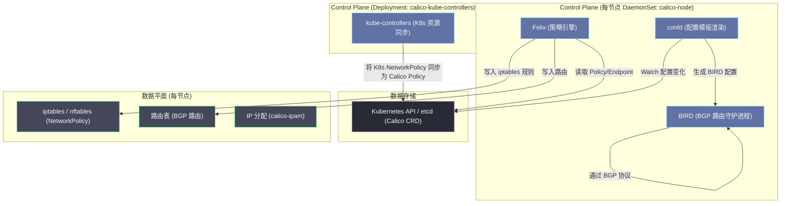
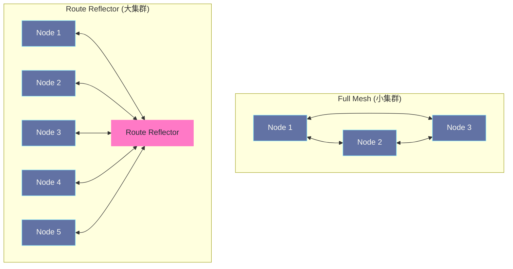

# Calico深度解析——BGP路由、eBPF数据面与网络策略

## 摘要

Calico 是目前生产环境使用最广泛的 Kubernetes CNI 插件之一，它以"纯三层路由"为核心设计理念，通过 BGP 协议在节点间分发路由，用 Felix 组件将 NetworkPolicy 翻译成 iptables 规则，在必要时使用 IPIP/VXLAN 穿越跨子网障碍。本文深入 Calico 的架构拆解：Felix 如何生成 iptables 规则、BIRD 如何建立 BGP Peer 交换路由、跨子网时如何选择封包模式，以及 Calico 的 eBPF 数据面如何替换 kube-proxy。**理解 Calico，是在大规模生产集群中实现精细化网络控制的关键。**

---

## 第 1 章 为什么 Calico 选择纯三层路由

### 1.1 Flannel 留下的问题

上一篇我们详细分析了 Flannel 的工作方式。Flannel 解决了 Kubernetes 网络的基础连通性问题，但暴露了三个工程挑战：

**问题一：封包 overhead**。VXLAN 模式的 50 bytes overhead 在高频小包场景（如 RPC 密集型微服务）下，实际上浪费了大量的网络带宽和 CPU 周期。

**问题二：没有 NetworkPolicy**。Flannel 只管"通"，不管"该不该通"。在需要多租户隔离、服务间访问控制的生产环境中，必须叠加其他工具（如 Canal 中的 Calico Policy 引擎）。

**问题三：可扩展性有限**。在数百节点的集群中，Flannel 的子网同步和路由维护逐渐成为瓶颈。

Calico（2014 年由 Metaswitch Networks 开源）的设计目标是正面回答这三个问题：
- **用 BGP 路由替代封包**：三层路由直接可达，无需封包 overhead
- **内置 NetworkPolicy**：Felix 直接操纵 iptables 实现精细化访问控制
- **BGP 天然适合大规模**：BGP 协议本就是为互联网路由（数十万条路由）设计的，K8s 规模完全驾驭

### 1.2 纯三层路由的核心主张

Calico 的核心主张可以用一句话概括：**每个节点就是一台路由器，Pod IP 是可路由的真实 IP，不需要任何叠加封包（overlay）**。

这个主张成立的前提是：节点间的网络必须能够路由 Pod CIDR 的 IP 包。实现这一点有两种方式：
1. **物理网络层面**：将 Pod 子网的路由注入到物理交换机/路由器（适合裸金属集群，需要网络设备支持 BGP）
2. **逻辑路由层面**：在所有节点之间交换路由信息，让每个节点知道每个 Pod 子网的下一跳是哪个节点（这是 Calico 的默认做法，通过 BGP 在节点间交换路由）

> [!note] 设计哲学
> Calico 的思路与 Flannel Host-GW 模式非常相似，都是"纯路由，无封包"。区别在于 Flannel Host-GW 用 flanneld 手动维护静态路由，而 Calico 使用 BGP 协议动态交换路由——BGP 是专为大规模网络设计的动态路由协议，节点的加入/离开、路由的变更都能通过 BGP 自动传播，无需中央协调器。

---

## 第 2 章 Calico 的组件架构

### 2.1 组件全景图

Calico 的架构由多个组件构成，每个组件有清晰的职责边界：



### 2.2 Felix：Calico 的策略引擎

**Felix** 是 Calico 最核心的组件，运行在每个节点上（作为 `calico-node` DaemonSet 的一部分）。它的职责是：

1. **Watch Calico 数据存储**（Kubernetes API 或 etcd）中的 Endpoint（Pod）和 NetworkPolicy 对象
2. **计算 iptables 规则**：将 NetworkPolicy 翻译成对应的 iptables 规则集
3. **写入内核**：通过 iptables-restore 批量更新节点的 iptables 规则
4. **管理路由**：为本节点的每个 Pod，在路由表中创建一条主机路由（`10.244.x.x/32 dev caliXXXX`）
5. **管理接口**：创建 Pod 的 veth pair，并在节点侧将接口以 `caliXXXX` 命名

**关键设计：Felix 使用批量更新而非逐条修改**

iptables 的操作是有代价的——每次修改都需要在内核中重建规则链。如果 Felix 每添加一个 Pod 就调用一次 `iptables -A`，在大规模集群中性能会非常差。Felix 的做法是：将所有规则变更积累起来，用 `iptables-restore` 一次性批量写入，大幅减少内核态操作次数。

### 2.3 BIRD：BGP 路由守护进程

**BIRD（BIRD Internet Routing Daemon）** 是一个成熟的开源 BGP 实现，广泛用于生产级别的 ISP 网络。Calico 将 BIRD 集成到 `calico-node` 中，用于在节点间交换路由信息。

BIRD 的职责：
1. **建立 BGP Peer**：与其他节点（或 Route Reflector）建立 BGP TCP 连接（端口 179）
2. **通告本节点路由**：将本节点的 Pod CIDR（如 `10.244.0.0/26`）和各个 Pod 的主机路由（`10.244.0.6/32`）通告给 BGP Peer
3. **接收远端路由**：接收其他节点通告来的路由，写入本地路由表
4. **路由过滤**：根据策略过滤不需要接受或通告的路由前缀

### 2.4 confd：BIRD 配置的动态生成器

**confd** 是一个轻量级的配置管理工具，它 Watch Calico 数据存储中的配置变化，根据模板自动生成 BIRD 的配置文件，并触发 BIRD 重新加载配置。

当集群中加入新节点、修改 BGP 配置时，confd 自动感知并更新 BIRD 的 Peer 配置，无需手动干预。

### 2.5 calico-kube-controllers：K8s 与 Calico 的桥接器

**kube-controllers** 运行在集群中（Deployment，不是 DaemonSet），负责将 Kubernetes 的原生资源同步到 Calico 的数据存储：

- 将 Kubernetes `NetworkPolicy` 对象同步为 Calico 的内部 Policy 表示
- 将 Kubernetes `Node` 对象同步为 Calico 的 Node 资源（包含节点 IP 等信息）
- 清理孤立的 Calico IP 分配记录（对应已删除的 Pod）

---

## 第 3 章 BGP 路由：Calico 数据面的核心

### 3.1 BGP 是什么，为什么适合 Kubernetes

**BGP（Border Gateway Protocol，边界网关协议）** 是互联网的骨干路由协议，由 RFC 4271 定义。你访问任何网站时，数据包在全球 ISP 之间的路由，都由 BGP 控制。BGP 的设计目标是：在**大规模、去中心化、异构**的网络中，动态传播可达性信息（即路由）。

BGP 的几个关键特性，使它非常适合 Kubernetes 场景：

**1. iBGP vs eBGP**：BGP 分为两种：运行在同一自治系统（AS）内部的 iBGP（internal BGP），和运行在不同 AS 之间的 eBGP（external BGP）。Calico 在集群内部使用 iBGP——所有节点属于同一 AS（默认 AS 64512），通过 iBGP 交换路由。

**2. 全互联（Full Mesh）vs Route Reflector**：iBGP 要求每个节点与所有其他节点建立 BGP Peer，形成全互联（Full Mesh）。在 N 个节点的集群中，需要 N*(N-1)/2 个 BGP 连接。当 N=10 时是 45 个连接，当 N=100 时是 4950 个连接——这在大集群中是不可接受的。

解决方案是 **Route Reflector（路由反射器，RR）**：指定 2-3 个节点作为 RR，其他节点只需与 RR 建立 BGP Peer。RR 接收到一个节点的路由后，将其反射给所有其他 BGP Peer。这将连接数从 O(N²) 降低到 O(N)。



> [!warning] 生产避坑
> 在超过 50 个节点的集群中，强烈建议配置 Route Reflector，否则 Full Mesh 模式下每个节点要维护数十上百个 BGP TCP 连接，消耗大量文件描述符和内存。Calico 文档推荐选择 2-3 个节点（最好是独立的 infra 节点）作为 RR，并打上 `route-reflector: true` 标签。

### 3.2 BGP 路由分发的完整过程

以一个新 Pod 创建的场景为例，详细追踪 BGP 路由的分发过程：

**初始状态**：
- Node A（`192.168.1.10`）的 calico-ipam 管理 `10.244.0.0/26`（64 个 IP）
- Node B（`192.168.1.11`）的 calico-ipam 管理 `10.244.0.64/26`

**步骤 1：Pod 创建，Felix 建立主机路由**

CNI 在 Node A 上为新 Pod（`10.244.0.6`）创建 veth pair，接口名 `cali3a4b5c`（Calico 的接口命名规范）。Felix 检测到新的 Endpoint，在 Node A 的路由表中写入：
```
10.244.0.6 dev cali3a4b5c scope link
```
这是一条"主机路由"（host route），/32 精度，直接指向 Pod 的 veth 外端接口。

**步骤 2：Felix 通知 BIRD**

Felix 通过 `confd` 将新路由信息写入 BIRD 的数据源（Calico 数据存储）。

**步骤 3：BIRD 通过 BGP 通告路由**

Node A 的 BIRD 进程生成一条 BGP UPDATE 消息，通告 `10.244.0.6/32` 可达（nexthop 是 Node A 的 IP `192.168.1.10`）。这条消息被发送给所有 BGP Peer（Full Mesh 模式）或 Route Reflector。

**步骤 4：其他节点的 BIRD 接收路由**

Node B 的 BIRD 收到 BGP UPDATE，得知 `10.244.0.6/32` 的下一跳是 `192.168.1.10`。BIRD 将这条路由写入 Node B 的内核路由表：
```
10.244.0.6 via 192.168.1.10 dev eth0 proto bird
```

**结果**：Node B 上的任何 Pod 要访问 `10.244.0.6`，内核路由查找到下一跳是 `192.168.1.10`（Node A），数据包通过物理网络直接路由到 Node A，Node A 再根据主机路由转发到 Pod。**全程没有封包，没有 NAT。**

### 3.3 Calico 的接口命名与路由设计

Calico 与 Flannel 的一个显著区别是：Calico **不使用 Linux bridge（cni0）**。

Flannel 的做法是让所有 Pod 的 veth 外端接入同一个 bridge，bridge 负责二层转发。Calico 的做法是：让每个 Pod 的 veth 外端直接"挂"在节点上（不接 bridge），并为每个 Pod 写一条 /32 主机路由。

这种设计的好处：
- 彻底避免了 bridge 的广播域问题（ARP 广播风暴）
- 每个 Pod 都有独立的路由表项，路由查找是精确匹配（/32），没有 bridge 的二层泛洪
- 更容易在每个 Pod 的 veth 接口上应用 iptables 规则（Felix 生成的 NetworkPolicy 规则直接绑定在 calixxx 接口上）

```bash
# Calico 节点上的路由表（部分）
ip route show | grep cali

10.244.0.4 dev cali1a2b3c scope link   # Pod 1 的主机路由
10.244.0.5 dev cali4d5e6f scope link   # Pod 2 的主机路由
10.244.0.6 dev cali7a8b9c scope link   # Pod 3 的主机路由
10.244.0.64/26 via 192.168.1.11 dev eth0 proto bird   # Node B 的 Pod 子网（BGP 学到）
10.244.0.128/26 via 192.168.1.12 dev eth0 proto bird  # Node C 的 Pod 子网
```

---

## 第 4 章 跨子网场景：IPIP 与 VXLAN 封包模式

### 4.1 纯路由的边界

Calico 的 BGP 纯路由方案在同一 L2 域（同一物理子网）效果完美。但在以下场景中，BGP 通告的路由无法直接使用：

**场景：云厂商跨可用区部署**

- Node A 在 AZ1，IP `10.0.1.10`（所在 VPC 子网 `10.0.1.0/24`）
- Node B 在 AZ2，IP `10.0.2.11`（所在 VPC 子网 `10.0.2.0/24`）

Node A 的 BGP 通告：`10.244.0.6/32 via 10.0.1.10`。Node B 收到后，在路由表中写入 `10.244.0.6 via 10.0.1.10`。但当 Node B 试图把包发到 `10.0.1.10` 时——问题来了：`10.0.1.10` 不在 Node B 的直连网段（`10.0.2.0/24`），VPC 路由器需要知道如何转发这个包。

在大多数云环境中，VPC 路由器只负责 `10.0.1.0/24` 和 `10.0.2.0/24` 之间的路由，不知道 `10.244.x.x` 这些 Pod IP 如何转发——它不是你的 BGP 的 Peer。

**解决方案：IPIP 或 VXLAN 封包**。

### 4.2 IPIP 模式：最轻量的封包

**IPIP（IP-in-IP）** 是一种极简的隧道封包协议（RFC 2003），它将一个完整的 IP 包作为 payload，封装在另一个 IP 包中：

```
外层 IP Header:
  src: 192.168.1.10 (Node A)
  dst: 192.168.1.11 (Node B)
  protocol: 4 (IPIP)

内层 IP Header:
  src: 10.244.0.2 (Pod A)
  dst: 10.244.1.3 (Pod B)

内层 TCP Payload: [实际数据]
```

IPIP 相比 VXLAN 更轻量：IPIP header 只有 20 bytes（外层 IP header），而 VXLAN 有 50 bytes。IPIP 没有 UDP 层，直接使用 IP 协议号 4，效率更高。

Calico 使用 Linux 内核原生的 IPIP 隧道设备（`tunl0`）来实现封包：

```bash
# Calico IPIP 模式下的接口
ip link show tunl0
# tunl0: <NOARP,UP,LOWER_UP> mtu 1480 qdisc noqueue state UNKNOWN

# IPIP 模式下的路由（注意是通过 tunl0 而非直接通过 eth0）
ip route show | grep tunl0
10.244.1.0/26 via 192.168.1.11 dev tunl0 proto bird onlink
```

**IPIP 模式的 MTU 损耗**：外层 IP header 20 bytes，所以有效 MTU 是 1500 - 20 = **1480 bytes**，比 VXLAN 的 1450 bytes 少损耗 30 bytes。

### 4.3 三种数据面模式的选择

Calico 提供了灵活的跨子网配置，通过 `IPPool` 的 `ipipMode` 和 `vxlanMode` 字段控制：

```yaml
apiVersion: projectcalico.org/v3
kind: IPPool
metadata:
  name: default-ipv4-ippool
spec:
  cidr: 10.244.0.0/16
  ipipMode: CrossSubnet    # 仅跨子网时使用 IPIP，同子网直接路由
  vxlanMode: Never
  natOutgoing: true
```

| `ipipMode` / `vxlanMode` 值 | 含义 |
| :--- | :--- |
| `Never` | 从不使用隧道，纯路由（要求全节点二层互通） |
| `Always` | 总是使用隧道封包 |
| `CrossSubnet` | **仅在跨子网时使用隧道**，同子网内使用直接路由 |

**`CrossSubnet` 模式的精妙之处**：Calico 检测目标节点是否与本节点在同一子网（通过比对节点 IP 和子网掩码）。同子网的 Pod 间通信走纯路由（零 overhead），跨子网的通信自动切换为 IPIP/VXLAN 封包，实现"最优化的混合模式"。

这是 Calico 比 Flannel 更灵活的地方之一——Flannel 在 VXLAN 模式下对所有跨节点流量都封包，Calico 可以精确区分同子网和跨子网流量，只在必要时封包。

---

## 第 5 章 NetworkPolicy 的 Calico 实现

### 5.1 为什么 NetworkPolicy 需要 CNI 插件实现

Kubernetes 的 `NetworkPolicy` 对象只是一个**声明式的 API 对象**，它本身不做任何事情——它需要 CNI 插件来"实现"它。具体实现机制取决于 CNI 插件的技术选择：Calico 用 iptables（或 eBPF），Cilium 用 eBPF，Flannel 根本不实现 NetworkPolicy。

Kubernetes 默认的网络是"全连通"的——所有 Pod 可以访问所有其他 Pod。NetworkPolicy 是在这个基础上"做减法"——定义"谁能访问谁"。

> [!info] 核心概念
> NetworkPolicy 是**拒绝优先**的：一旦一个 Pod 被任何 NetworkPolicy 的 `podSelector` 选中，它就进入了"受策略保护"状态，默认拒绝所有未被策略明确允许的流量。如果没有任何 NetworkPolicy 选中某个 Pod，则该 Pod 保持默认的"全连通"状态。

### 5.2 Felix 的 iptables 规则生成逻辑

Felix 将 NetworkPolicy 翻译成 iptables 规则的核心思路是：**在 Pod 的 veth 接口（calixxx）上设置 per-interface 规则链**。

Calico 在 iptables 中创建以下规则链结构（仅展示核心逻辑）：

```
FORWARD 链（所有转发包都经过）
  ↓
KUBE-FORWARD（kube-proxy 的规则，处理 Service）
  ↓
cali-FORWARD（Calico 接管）
  ↓
  cali-from-XXX（从接口 calixxx 来的包，即出 Pod 的流量）
    ↓ 对应 Pod 的 Egress NetworkPolicy 规则
  cali-to-XXX（发往接口 calixxx 的包，即入 Pod 的流量）
    ↓ 对应 Pod 的 Ingress NetworkPolicy 规则
```

以一个具体的 NetworkPolicy 为例：

```yaml
apiVersion: networking.k8s.io/v1
kind: NetworkPolicy
metadata:
  name: allow-frontend
  namespace: default
spec:
  podSelector:
    matchLabels:
      app: backend
  ingress:
  - from:
    - podSelector:
        matchLabels:
          app: frontend
    ports:
    - protocol: TCP
      port: 8080
```

**这条策略的含义**：`backend` Pod 只接受来自 `frontend` Pod 的 TCP 8080 流量，拒绝其他所有入站流量。

Felix 将其翻译成的 iptables 规则（简化版）：

```bash
# cali-to-<backend-pod-interface> 链
-A cali-to-cali7a8b9c -m comment --comment "NetworkPolicy allow-frontend/default"
    -s 10.244.0.5          # frontend Pod 的 IP（由 Felix 解析 podSelector 得出）
    -p tcp --dport 8080
    -j ACCEPT

# 默认拒绝（受策略保护的 Pod）
-A cali-to-cali7a8b9c -m comment --comment "Default deny" -j DROP
```

当 `frontend` Pod 的 IP 发生变化时（Pod 重启分配新 IP），Felix 自动更新 iptables 规则中的 IP 地址。这正是 Felix 持续 Watch Kubernetes API 的原因——它需要实时跟踪每个被 NetworkPolicy 选中的 Pod 的 IP 变化。

### 5.3 Calico 的扩展策略：GlobalNetworkPolicy

Kubernetes 原生的 `NetworkPolicy` 只作用于单个 Namespace，Calico 提供了更强大的 `GlobalNetworkPolicy` CRD，可以作用于整个集群：

```yaml
apiVersion: projectcalico.org/v3
kind: GlobalNetworkPolicy
metadata:
  name: deny-all-non-calico
spec:
  order: 1000           # 优先级，数值越小越优先
  selector: all()       # 选中所有 Endpoint
  types:
  - Ingress
  - Egress
  ingress:
  - action: Deny        # 默认拒绝所有入站
  egress:
  - action: Allow       # 允许所有出站（通常不限制出站）
```

**GlobalNetworkPolicy vs NetworkPolicy 对比**：

| 特性 | K8s NetworkPolicy | Calico GlobalNetworkPolicy |
| :--- | :---: | :---: |
| **作用范围** | 单个 Namespace | 整个集群 |
| **选择器** | `podSelector`（仅 Pod） | `selector`（Pod、HostEndpoint 等） |
| **规则顺序** | 无顺序（所有规则并集） | 有顺序（order 字段控制优先级） |
| **Action 类型** | Allow（隐式 Deny） | Allow / Deny / Pass / Log |
| **主机端点支持** | ❌ | ✅（可以控制节点本身的网络访问） |
| **DNS 策略** | ❌ | ✅（Calico Enterprise 功能） |

### 5.4 三种典型的网络隔离场景

**场景 1：默认拒绝所有流量（Zero-Trust 基础配置）**

```yaml
apiVersion: networking.k8s.io/v1
kind: NetworkPolicy
metadata:
  name: default-deny-all
  namespace: production
spec:
  podSelector: {}    # 选中 production Namespace 中所有 Pod
  policyTypes:
  - Ingress
  - Egress
```

这是 Zero-Trust 网络架构的起点。部署此策略后，`production` Namespace 中所有 Pod 的流量默认被拒绝，然后针对每个服务逐一添加必要的允许规则。

**场景 2：Namespace 级别隔离**

```yaml
apiVersion: networking.k8s.io/v1
kind: NetworkPolicy
metadata:
  name: allow-same-namespace
  namespace: team-a
spec:
  podSelector: {}
  ingress:
  - from:
    - namespaceSelector:
        matchLabels:
          kubernetes.io/metadata.name: team-a
```

只允许来自 `team-a` Namespace 内部的流量，实现 Namespace 间的硬隔离。

**场景 3：允许监控系统访问所有 Pod 的 metrics 端口**

```yaml
apiVersion: networking.k8s.io/v1
kind: NetworkPolicy
metadata:
  name: allow-prometheus-scrape
  namespace: production
spec:
  podSelector: {}    # 所有 Pod
  ingress:
  - from:
    - namespaceSelector:
        matchLabels:
          kubernetes.io/metadata.name: monitoring
    ports:
    - protocol: TCP
      port: 9090    # Prometheus metrics 端口
```

> [!warning] 生产避坑
> NetworkPolicy 的 `podSelector` 为空（`{}`）时，选中的是**当前 Namespace 的所有 Pod**，而不是集群所有 Pod。在 `namespaceSelector` 为空时，选中的是**所有 Namespace**。这两个"空选择器"的语义不同，是生产中写错策略的常见来源，务必仔细验证。

---

## 第 6 章 Calico 的 eBPF 数据面

### 6.1 为什么 Calico 要引入 eBPF

Calico 在 3.13 版本（2020 年）引入了可选的 eBPF 数据面，以替代传统的 iptables 数据面。动机来自 iptables 在大规模集群下的性能问题：

**iptables 的规模问题（以 Service 为例）**：

kube-proxy 用 iptables 实现 Service 的 DNAT。假设集群有 10000 个 Service，每个 Service 有 3 个 Endpoint，kube-proxy 需要维护约 **40000 条 iptables 规则**（KUBE-SERVICES 链约 10000 条，KUBE-SVC-xxx 链约 30000 条）。

每个数据包在 DNAT 时，需要线性匹配这 10000 条 KUBE-SERVICES 规则，时间复杂度 O(N)。当规模增大 10 倍时，匹配延迟也增加 10 倍。Calico 官方测试数据显示：在 20000 个 Service 的集群中，iptables 模式下 Service 访问延迟可达 50-100ms，而 eBPF 模式稳定在 1ms 以内。

**iptables 的另一个问题：规则刷新延迟**

当 Endpoint 发生变化（Pod 更新、节点宕机）时，kube-proxy 需要重新生成并加载整个 iptables 规则集。这个操作本身需要持有内核的 iptables 锁，在规则较多时可能需要数秒，期间新的规则与旧的规则不一致，可能导致短暂的流量异常。

### 6.2 Calico eBPF 数据面的实现

Calico 的 eBPF 数据面通过 TC（Traffic Control）hook 在网络接口上挂载 eBPF 程序：

```
数据包到达 calixxxx 接口（ingress TC hook）
  ↓
Calico eBPF 程序执行：
  1. 查找 BPF Map: 目标是否是 ClusterIP？
  2. 如果是 ClusterIP: 从 Endpoint BPF Map 查找 backend，做 DNAT（替代 kube-proxy）
  3. 查找 NetworkPolicy BPF Map: 是否允许该流量？
  4. 如果拒绝: DROP
  5. 如果允许: 通过
```

**BPF Map 的优势**：eBPF 程序通过 Hash Map（`bpf_map_type = BPF_MAP_TYPE_HASH`）存储 Service 和 Endpoint 信息。Hash Map 的查找时间复杂度是 O(1)，无论有多少个 Service，查找时间恒定。

**Calico eBPF 模式替代 kube-proxy**：启用 Calico eBPF 数据面后，可以完全禁用 kube-proxy，由 Calico 的 eBPF 程序直接处理 Service 的 DNAT 和负载均衡，大幅降低 Service 的访问延迟和 CPU 消耗。

### 6.3 eBPF 模式的配置

```bash
# 1. 在安装 Calico 时启用 eBPF 数据面（通过 operator）
kubectl patch installation default --type merge \
    -p '{"spec":{"calicoNetwork":{"linuxDataplane":"BPF"}}}'

# 2. 禁用 kube-proxy（eBPF 模式不需要）
kubectl patch ds kube-proxy -n kube-system \
    -p '{"spec":{"template":{"spec":{"nodeSelector":{"non-calico":"true"}}}}}'

# 3. 配置 Calico 接管 kube-proxy 的 BPF Service 支持
kubectl patch felixconfiguration default \
    --type merge \
    -p '{"spec": {"bpfKubeProxyIptablesCleanupEnabled": true}}'
```

> [!warning] 生产避坑
> Calico eBPF 模式要求内核版本 ≥ 5.3，推荐 ≥ 5.10。在升级前务必确认节点内核版本。此外，eBPF 模式不支持所有 Linux 发行版（部分旧版 CentOS/RHEL 的内核未编译相应 eBPF 特性），部署前需要运行 Calico 提供的前置检查工具：`calicoctl node check-bpf`。

---

## 第 7 章 Calico 的完整数据流追踪

### 7.1 同节点 Pod 通信（BGP 直连）

以 Pod A（`10.244.0.2`，在 Node A）向 Pod B（`10.244.0.5`，也在 Node A）发包为例：

```
[Pod A: eth0, 10.244.0.2]
  ↓ veth pair（eth0 ↔ cali1a2b3c）
[Node A 内核: ingress on cali1a2b3c]
  ↓ Calico iptables: cali-from-cali1a2b3c（Pod A 的 Egress Policy 检查）
[Node A 路由查找: 10.244.0.5 via cali4d5e6f（主机路由）]
  ↓ Calico iptables: cali-to-cali4d5e6f（Pod B 的 Ingress Policy 检查）
[veth pair: cali4d5e6f ↔ eth0]
[Pod B: eth0, 10.244.0.5]
```

**关键点**：同节点通信不经过 bridge，直接通过路由表的 /32 主机路由转发。

### 7.2 跨节点 Pod 通信（BGP + 纯路由）

Pod A（`10.244.0.2`，Node A）向 Pod C（`10.244.0.70`，Node B，BGP 路由可达）发包：

```
[Pod A: eth0]
  ↓ veth → cali1a2b3c
[Node A 内核: 10.244.0.70 via 192.168.1.11 dev eth0（BGP 学到的路由）]
  ↓ ARP: 192.168.1.11 的 MAC（同子网直接 ARP 可达）
[Node A: eth0 → 物理网络]
  ↓ 物理路由（二层直连）
[Node B: eth0]
[Node B 路由查找: 10.244.0.70 via cali9x8y7z（主机路由）]
  ↓ Calico iptables: Pod C 的 Ingress Policy 检查
[Pod C: eth0]
```

**关键点**：数据包的 IP header 始终是 `src=10.244.0.2, dst=10.244.0.70`，全程无 NAT，无封包。

### 7.3 跨子网 Pod 通信（IPIP 模式）

Pod A（Node A，AZ1）向 Pod C（Node B，AZ2）发包，两节点不同子网，开启 IPIP CrossSubnet 模式：

```
[Pod A: eth0]
  ↓ veth → cali1a2b3c
[Node A 内核: 10.244.0.70 via 10.0.2.11 dev tunl0（IPIP 路由）]
  ↓ IPIP 封包:
      外层 src=10.0.1.10(Node A), dst=10.0.2.11(Node B)
      内层 src=10.244.0.2(Pod A), dst=10.244.0.70(Pod C)
[Node A: eth0 → 物理网络（VPC 路由）]
  ↓ VPC 路由: 10.0.2.0/24 → Node B
[Node B: eth0 → 内核 IPIP 解包]
[内层包: src=10.244.0.2, dst=10.244.0.70]
[Node B 路由查找: 主机路由 → cali9x8y7z]
[Pod C: eth0]
```

---

## 第 8 章 Calico 的运维工具与故障排查

### 8.1 calicoctl

`calicoctl` 是 Calico 的命令行管理工具，类似于 Kubernetes 的 `kubectl`，专门用于管理 Calico 的资源对象：

```bash
# 查看所有节点的 BGP Peer 状态
calicoctl node status

# 查看 IP Pool 配置
calicoctl get ippool -o wide

# 查看 NetworkPolicy
calicoctl get networkpolicy --all-namespaces

# 查看 GlobalNetworkPolicy
calicoctl get globalnetworkpolicy

# 查看某节点的 Endpoint 信息
calicoctl get workloadendpoint --node=node-a -o yaml

# 查看 IP 地址分配情况
calicoctl ipam show --show-blocks
```

### 8.2 常见故障排查路径

**故障 1：Pod 间网络不通**

```bash
# 1. 确认 Pod IP 和节点
kubectl get pod -o wide

# 2. 在目标节点检查路由表
ip route show | grep <pod-ip>

# 3. 检查 Calico 主机路由是否存在
ip route show | grep cali

# 4. 检查 BGP Peer 状态（跨节点）
calicoctl node status

# 5. 检查 iptables 规则是否有 DROP
iptables -L cali-to-<interface> -n -v

# 6. 检查 Felix 日志
kubectl logs -n kube-system calico-node-xxx -c calico-node | grep ERROR
```

**故障 2：NetworkPolicy 行为异常**

```bash
# 1. 确认 NetworkPolicy 语义
kubectl describe networkpolicy <name> -n <namespace>

# 2. 用 calicoctl 查看生成的 Calico Policy（经过同步处理后的）
calicoctl get networkpolicy <name> -n <namespace> -o yaml

# 3. 查看 Felix 是否成功应用了策略
kubectl logs -n kube-system calico-node-xxx -c calico-node | grep policy

# 4. 检查具体 iptables 规则（在目标 Pod 所在节点执行）
iptables -L cali-to-<pod-interface> -n -v --line-numbers
```

---

## 第 9 章 小结

### 9.1 Calico 的核心技术栈

| 层面 | 技术 | 作用 |
| :--- | :--- | :--- |
| **路由分发** | BGP（BIRD） | 节点间路由信息交换 |
| **数据面（默认）** | iptables（Felix） | NetworkPolicy 实现、包过滤 |
| **数据面（可选）** | eBPF（TC hook） | 高性能 Service 转发、替代 kube-proxy |
| **IP 分配** | calico-ipam（Block 机制） | 集群级 IP 池管理 |
| **跨子网** | IPIP / VXLAN（CrossSubnet） | 穿越 L3 边界的封包隧道 |
| **策略扩展** | GlobalNetworkPolicy CRD | 集群级网络访问控制 |

### 9.2 Calico vs Flannel 的本质差异

| 维度 | Flannel | Calico |
| :--- | :--- | :--- |
| **路由机制** | 静态路由（flanneld 手动维护） | 动态 BGP（BIRD 协议） |
| **封包策略** | 总是封包（VXLAN/UDP） | 按需封包（CrossSubnet IPIP/VXLAN） |
| **NetworkPolicy** | ❌ 不支持 | ✅ 完整支持（L3/L4） |
| **规模上限** | 中等（路由表线性增长） | 大规模（BGP Route Reflector） |
| **运维复杂度** | 简单 | 中等（需要理解 BGP） |

### 9.3 下一篇预告

Calico 的 eBPF 模式是向下一代网络的迈进，但它的 eBPF 使用相对保守。下一篇将介绍从一开始就将 eBPF 作为核心架构设计的 Cilium：

- **[[05 Cilium深度解析——eBPF驱动的下一代网络与可观测性]]**：Cilium 如何用 eBPF 完全重写 Kubernetes 网络栈，实现 L7 感知的 NetworkPolicy，以及 Hubble 如何提供无与伦比的流量可见性

---

*本文是 [[Kubernetes网络原理与插件]] 专栏的第 4 篇。*
