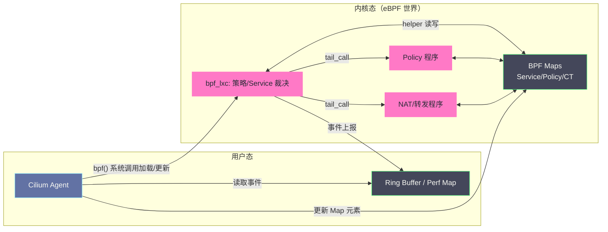
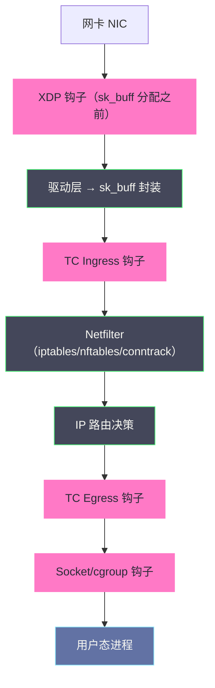
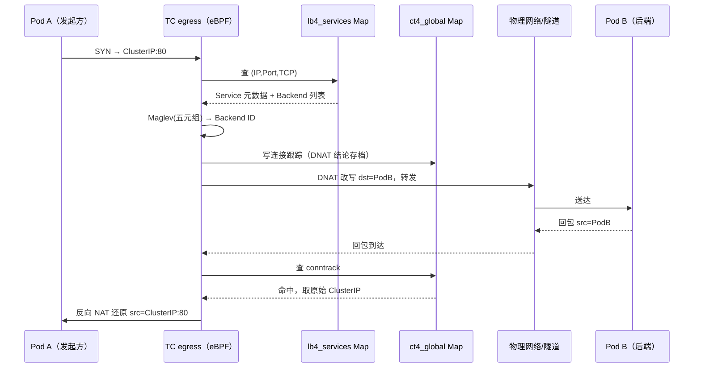
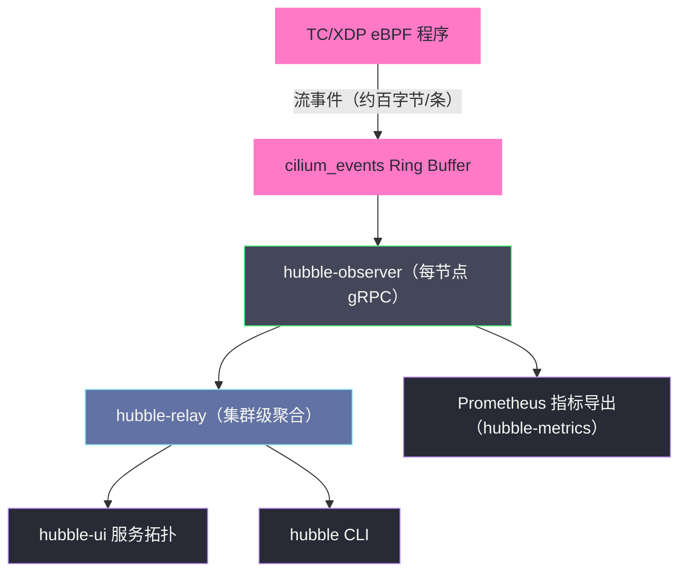

# Cilium深度解析——eBPF驱动的下一代网络与可观测性

**摘要：**

当 Calico 们还在用 BGP 与 iptables 这些上世纪的构件拼装容器网络时，Cilium 做了一件更激进的事——它把整个网络数据面搬到了 eBPF 这台内核虚拟机上，让"每个报文经过网络栈时该做什么"从一张静态规则表变成了一段可按需编程的内核代码。这一选择的回报是 O(1) 的 Service 查找、与 IP 解耦的安全身份、L7 协议级策略与近乎零开销的全流量观测；代价则是对内核版本的硬约束与一套全新的排障知识体系。本文沿着"eBPF 如何把 Linux 内核变成可编程数据面"这条主线，先回溯 BPF 从 1992 年报文过滤器到 2014 年内核虚拟机的三十年进化，再拆解 XDP/TC/Socket 三级 Hook 点的卡位逻辑与 BPF Map 的状态承载方式，继而深入 Cilium 的三大设计内核——Security Identity、连接期负载均衡与透明代理式 L7 策略，最后审视 Hubble 可观测体系与 Cluster Mesh 的扩展形态，并对"eBPF 能否取代 Sidecar"这场未完的争论给出应有的留白。本文旨在回答两个问题：eBPF 究竟凭什么让网络数据面获得了一次范式级升级，以及 Cilium 把哪些复杂性留在了使用者的账单上。

---

## 第 1 章 前史：从 tcpdump 的字节码到内核虚拟机

### 1.1 1992 年：一台为过滤而生的内核虚拟机

eBPF 的源头要追溯到一个朴素得多的问题。1992 年，Steven McCanne 与 Van Jacobson 在 USENIX 冬季会议上发表了论文《The BSD Packet Filter: A New Architecture for User-level Packet Capture》，要解决的是 `tcpdump` 这类抓包工具的效率困境：若把网卡上的每一个报文都复制到用户态再做过滤，绝大多数将被丢弃的报文白白付出了内存拷贝的代价。BPF 的方案是在内核里放一台极简虚拟机，用户态上传一段字节码，内核对每个报文就地执行、就地裁决，只有通过的报文才值得复制上去。

这个"把裁决程序下沉到事件发生处"的思想在此后三十年里只做过两件小事：Linux 2.2（1998 年）将其引入作为 cBPF（classic BPF），服务 `tcpdump`；之后又被复用到 `seccomp` 里过滤系统调用——seccomp-BPF 至今仍是容器默认安全配置的一部分。它安静地存在着，等待一个把"包过滤"重新理解为"内核编程"的人。回头看，1992 年那篇论文里其实已经把今天 eBPF 的两条命脉写明白了：其一，用户态可以向内核提交程序，且程序的执行边界由内核严格圈定；其二，filter 的结果驱动资源的分配——只有值得看的报文才值得付出拷贝代价。三十年后，这两条原封不动地长成了 Cilium 的 Verifier 与 Hook 体系。

### 1.2 2014 年：Starovoitov 的再造与 eBPF 的成年礼

2014 年，当时在 PLUMgrid 的 Alexei Starovoitov 向内核提交了名为 eBPF（extended BPF）的重构补丁集——这次扩展之大，使 eBPF 事实上与祖先 cBPF 只剩名字上的血缘（社区后来干脆宣布"eBPF 不再是一个缩写词"，以免"包过滤器"的字面含义继续误导世人）。这次重构一口气做了五件事：

- **执行引擎换代**：寄存器从 2 个 32 位扩为 11 个 64 位，调用约定向 x86-64 对齐，字节码可被内核 JIT 编译为接近原生的机器码——eBPF 程序跑起来的成本与原生内核代码相差无几；
- **状态载体 Map**：新增 **BPF Map** 一族内核数据结构，让程序可以跨触发记住东西，也让用户态能与内核态程序共享同一份数据；
- **能力边界 ABI**：新增 **Helper 函数**——eBPF 程序不能直接调用任意内核函数，只能通过这组约两百个的受控接口（查表、改包、重定向、取随机数）与内核交换能力；
- **安全闸门 Verifier**：加载前的静态验证器，证明程序有限步内终止、内存访问不越界——内核里跑用户提交的代码而不失控的全部信心都来自它；
- **挂载点泛化**：钩子从报文扩到内核的几乎任意事件——XDP/TC 网络收发、kprobe/tracepoint 探针、cgroup/sockops 套接字生命周期、LSM 安全钩子。

2016 年随 Linux 4.8 合入的 XDP（eXpress Data Path）把 eBPF 程序推到了网卡收包路径的最前端；几乎同一时期，曾任 Linux 内核网络子系统长期贡献者的 Thomas Graf 创立了 Isovalent，并在 2018 年发布 Cilium 1.0——一个从第一天起就把 eBPF 当作主数据面而非辅助工具的 CNI 插件。此后剧情一路加速：2021 年 Cilium 进入 CNCF 孵化，2023 年 10 月成为 CNCF 毕业项目中第一个以 eBPF 为底座的网络项目，2024 年 Isovalent 被思科收入麾下。eBPF 之于 Linux，正如社区那句流传甚广的评语——JavaScript 之于浏览器页面：它把一块原本静态的内核领地，变成了可编程的平台。

### 1.3 为什么轮到网络数据面被重写

回到本专栏的主场。前两篇已经反复看到，Kubernetes 网络的传统数据面建立在两个上世纪末的构件上：iptables 用线性链表做规则匹配，kube-proxy 靠整表重建做增量更新；Linux bridge 用洪泛学习维系转发表。它们的设计前提是单机、规则数有限、变化低频——而云原生集群的常态是数千节点、数万 Endpoint、每秒数千次的成员变更。构件没有错，是它们被用在了超出设计包线的负载上。

算一笔细账更能看清坡度：一个 Service 对应若干条 KUBE-SERVICES 链规则加每条 Endpoint 一条 KUBE-SEP 规则，一万 Service、每 Service 三 Endpoint 的集群意味着四万条上下的规则；每个报文顺序过链，每次 Endpoint 变化整表重建。把同样的规模放到哈希表上，查找与更新都退化成常数级操作——eBPF 提供的就是另一条路：查找用哈希表而非链表，更新改一个 Map 元素而非重建规则集，逻辑是程序而非静态匹配项。Cilium 的全部架构，就是把这条路在云原生网络里走到底的答卷。

还有一个行业维度值得记下：2021 年 Linux 基金会成立 **eBPF Foundation**（Isovalent、Meta、Google、Microsoft 等共同发起），把 eBPF 相关基础设施（编译工具链、运行时库、规范）升格为厂商中立的公共品。eBPF 从"几个内核黑客的聪明补丁"升级为行业级平台依赖，Cilium 是这趟列车上跑得最靠前的乘客之一。

值得顺带一问的是：为什么"可编程内核"的红利最先兑现在网络上，而不是存储或调度上。原因其实藏在数据面的形状里——网络处理是一条极热、极窄、判决逻辑极规整的热路径：每个报文都要走同一条流水线，判决所需的输入（五元组、身份、表项）高度结构化，产出无非"放行/丢弃/改写/转向"寥寥几种。这样的负载恰恰是"小程序 + 快查找"模型最擅长啃的骨头；相比之下，调度器的决策上下文散漫、文件系统的语义层叠缠绕，都不具备这种规整性。理解了这一点，就能明白为什么 eBPF 的第一个大规模战利品是网络数据面，也能预判它下一个目标会是谁——观测与安全，正是后文 Hubble 与 Tetragon 的方向。

---

## 第 2 章 技术底座：Verifier、Map 与 Tail Call 的三角约束

在展开 Cilium 之前，必须先把 eBPF 这台"内核虚拟机"的三块基石讲透——它们决定了 Cilium 所有设计的形状。

**第一块是 Verifier，eBPF 的安全底线也是能力天花板。** 一段 eBPF 字节码被加载进内核前，必须通过静态验证：不允许无界循环、不允许越界内存访问、不允许调用白名单外的 Helper、必须能证明在有限步内终止。它的检查是逐寄存器、逐分支的符号执行——跟踪每个寄存器的类型与值域，推演所有可达路径上的内存访问是否合法、Map 引用是否泄漏、返回值是否被检查。早期内核对程序指令数限制在 4096 条，5.2 版本放宽到百万级，5.3 起允许有界循环。Verifier 保证了跑在内核里的这段代码不会崩溃、不会死循环拖垮调度——代价是你写不了"任意逻辑"，只能写"能被证明安全的逻辑"。

**第二块是 BPF Map，eBPF 程序与世界的共享记忆。** eBPF 程序单次触发是无状态的，一切跨报文、跨程序、跨内核态/用户态的状态都存放在 Map 里。哈希表、数组、LRU 表、环形缓冲区各就其位，后文将看到 Cilium 如何用一张 Service Map 换下 iptables 的数万条规则。

**第三块是 Tail Call 与 Helper，程序化的逃生舱。** 单程序指令数仍有限，于是 eBPF 提供 `bpf_tail_call` 允许一个程序"尾调用"跳转至下一个程序（跳转次数有界），把长流水线拆成程序链；Helper 函数（`bpf_map_lookup_elem`、`bpf_skb_store_bytes`、`bpf_redirect` 等约两百个）则构成 eBPF 与内核交互的稳定 ABI，报文改写、重定向、校验和重算都由它们完成。Cilium 的数据面程序正是由数十个经 tail call 串联的小程序织成的——这不是优雅癖好，而是被 Verifier 逼出来的工程形态：当一个策略执行流超过程序尺寸上限，就切一刀、跳到下一段，Verifier 对每段独立验证，整体流水线长度因此可以远超单程序极限。

三个约束共同塑造了 eBPF 开发的行业气质：写 eBPF 不像写应用代码，更像在海关层层申报的表格里写代码——每一笔内存访问要有出处，每一次循环要能被证明收敛，每一个内核调用要走白名单。理解了这层约束，后文 Cilium 的一切"绕路"设计——为什么 L7 要借道 Envoy、为什么程序要拆成碎块——就都有了出处。

这里还要补一笔对可移植性的回答：eBPF 程序读写内核数据结构，而内核结构体随版本漂移，一段为 5.4 编译的程序到 5.15 上可能字段偏移全错。社区给出的答案是 **BTF/CO-RE（BPF Type Format / Compile Once, Run Everywhere）**——编译产物携带类型信息，加载时按目标内核的实际布局重定位。这项技术也是 Cilium 能在不同内核版本上分发同一份数据面程序的前提，反过来解释了官方文档里"特性支持矩阵随内核版本展开"的现实。



---

## 第 3 章 Hook 点体系：XDP、TC、Socket 的三级卡位

### 3.1 一个报文的旅途与四个可介入点

理解 Cilium 的挂载策略，先要还原一个报文在 Linux 里的完整旅途，并看清 eBPF 可以在哪几处设卡：



四个卡位的取舍一目了然：**XDP 最早但上下文最贫瘠**（报文尚未封装成 sk_buff，能读到的只是原始字节）；**TC 位置适中且上下文完整**（sk_buff 已成型，元数据齐全）；**Socket 最晚但最贴近应用**（直接与 socket 对象打交道）。Cilium 的答案是三级并用、各司其职，而不是押注单点。

这个"多级布防"背后其实是一条普适的设计原则：**每类工作应该发生在"信息刚够用、代价尚最小"的那个点上**。早弃类工作（黑名单、DDoS）信息需求少，就压到最靠前的 XDP；策略与转发需要完整报文上下文，就放在 TC；而同节点直连这种"发起时即已知结局"的优化，只有 connect 时刻的 Socket 层才有资格做。反过来理解：如果你把早弃规则放在 TC，就白白支付了 sk_buff 分配成本；把策略判决放在 XDP，又会发现读不到需要的上下文——挂载点的选择本质上是对"信息-代价"曲线的分段求解。

### 3.2 XDP：驱动层的极刑场

XDP 在驱动收包路径上执行，早于 sk_buff 分配——报文此刻只是 DMA 缓冲区里的一段字节，程序直接读字节、改写节、定生死。返回值四种：`XDP_PASS` 放行入栈、`XDP_DROP` 就地丢弃、`XDP_TX` 从本卡原路弹回、`XDP_REDIRECT` 重定向他卡或他 CPU。

这个位置的意义在于"把代价消灭在发生之前"：丢弃一个报文不必先为它分配内核对象，DDoS 清洗、黑名单过滤的边际成本被压到极限。Meta 公开过其基于 XDP 的负载均衡器 Katran 的数据——单核千万级 PPS 的量级，数倍于 iptables 路径。Cilium 把 NodePort 的 DNAT、DSR 回包改写、主机级防火墙的早弃规则放在了这里。需要清醒认识的是 XDP 的代价面：它工作在 raw packet 上，拿不到 conntrack、协议栈元数据这些"加工过"的上下文，复杂裁决力有不逮——它适合当刀口，不适合当法官。

XDP 本身还分三种挂载形态，性能与普适性各不相同：**native/driver 模式**要求网卡驱动支持，报文在驱动收包函数内被处理，是常态部署的主力；**offload 模式**把程序下推到支持的智能网卡（SmartNIC）上执行，CPU 完全不参与；**generic/SKB 模式**则是驱动不支持 XDP 时的兜底，报文已被封装成 sk_buff 后才跑程序，性能优势大打折扣——生产上确认驱动是否支持 native XDP，与确认内核版本一样，都是 Cilium 落地的入门体检项。

### 3.3 TC：主战场

TC（Traffic Control）是 Cilium 的默认主场：在每个 Pod 的 veth 宿主机端（`lxc*`）与物理网卡的 ingress/egress 双向挂载（经 `clsact` qdisc 挂载，不进入传统流控语义）。ingress 方向做入向策略裁决与 Service 反向还原，egress 方向做出向策略、ClusterIP DNAT 与转发决策。TC 上的报文已是完整 sk_buff，能取到五元组、网口索引、与 cgroup/网络命名空间的关联信息——足以支撑"这个包是谁发的、该去哪、放不放行"的全部判决，同时又早于 Netfilter 主链，让 iptables 的漫长旅程被整体绕过。

TC 之所以而非 netfilter 钩子被选为主战场，原因有二：其一它天然挂在网络设备上，Pod 的每根 veth 都是独立挂载点，策略与接口的绑定关系清晰；其二它的双向性恰好映射策略的 ingress/egress 语义，一份声明两个挂载点，没有转译损耗。

### 3.4 Socket：同节点通信的近道

最深的优化藏在对 `connect()` 系调用拦下的 **cgroup/sockops 钩子**里：当 Pod A 发起连接、目标恰是本节点的 ClusterIP 或同节点 Pod 时，Socket 层程序直接把目标改写为对端 socket——两个 socket 内核内直连，连 veth 对和 TC 都跳过，同节点通信被压缩成近似 loopback 的开销。这套 **Socket-Level Load Balancing（亦称 host-reachable services）** 顺带接管了节点上主机进程访问 ClusterIP 的路径，后者在 kube-proxy 时代要靠 iptables 的 OUTPUT 链兜住。

值得点破的是这一层优化对"负载均衡发生时机"的重新定义：iptables DNAT 是**逐包**的——每个报文都要过一次规则匹配；Socket LB 与 Cilium 的连接跟踪协作，把负载均衡决策提前到 `connect()` 那一刻，之后的每个报文走的都是已确定的对端——从"每个包做一次选择题"变成"每条连接做一次选择题"，这是 eBPF 模型相对 netfilter 的又一处结构性优势。

---

## 第 4 章 BPF Map：把规则表换成数据结构

### 4.1 从"遍历规则"到"查询表项"的范式切换

iptables 的根本瓶颈不在规则本身，而在组织形式：规则链是顺序链表，第 N 条规则命中前要先走完前 N-1 条，且任何变更必须以整表为单位原子替换。BPF Map 把这件事改成了数据结构问题——`BPF_MAP_TYPE_HASH` 的查找是 O(1)，一万个 Service 与一个 Service 的查找耗时相同，元素的增删改都是独立原子的；`LRU_HASH` 给连接跟踪装上自动淘汰；`RINGBUF`（内核 5.8+）为内核到用户态的事件流提供无锁多生产者管道；`SOCKHASH`/`SOCKMAP` 则让 socket 对象本身可以被索引导流。

这张数据结构清单值得按用途细读：`HASH` 是所有"键到值"映射的主力，`ARRAY` 以零哈希开销做配置与计数，`LRU_HASH` 用容量上限兜住 conntrack 这类不能无限增长的状态，`RINGBUF` 解决"内核想对用户态说话"的高效通道，`SOCKHASH` 解决"连接到 socket"的直达转发。每种 Map 都是在"查得快"与"特性约束"之间的不同取舍点，Cilium 的选型几乎是一份教科书级的演示。

### 4.2 Cilium 的核心 Map 谱系

| Map | 类型 | 承载内容 |
| :--- | :--- | :--- |
| `cilium_lb4_services_v2` | HASH | ClusterIP:Port → Service 元数据 |
| `cilium_lb4_backends_v3` | HASH | Backend ID → Endpoint IP:Port |
| `cilium_lb4_reverse_nat` | HASH | 反向 NAT（回包还原）索引 |
| `cilium_ct4_global` | LRU_HASH | 全局连接跟踪 |
| `cilium_policy` | HASH | Identity → 允许的源 Identity 集 |
| `cilium_ipcache` | HASH | IP → Security Identity 映射 |
| `cilium_events` | RINGBUF/PERF | 流量事件（Hubble 的数据源） |

这张表揭示了 Cilium 架构的一个关键分工：**用户态的 cilium-agent 负责"世界应该是什么样"，内核里的 eBPF 程序与 Map 负责"报文此刻该怎么走"**。Service 增删、Pod 换 IP、策略变更，agent 只需改几个 Map 元素；数据面程序下次被触发时读到的就是新世界。没有整表重建，没有内核锁大迁移—— kube-proxy 那个被诟病了多年的更新模型，被降维成了一次哈希写。

几个细节值得留意。其一，`cilium_ct4_global` 用的是 LRU 而非普通哈希——连接跟踪表面对 UDP 式无状态流量与扫描探测时有被撑爆的风险，LRU 让最久未活跃的条目自动让位，等效于一个内置的容量治理策略。其二，ipcache 这张"IP → Identity"映射表是 Identity 模型得以落地的物理载体：集群中每个 Pod IP、每个节点 IP、每个外部 CIDR 都被 agent 预先登记身份，数据面查到的不是"这个 IP 是谁"的枚举答案，而是"这个 IP 属于哪个身份"的归类答案——枚举随规模膨胀，归类不会。其三，所有这些 Map 都可以通过 `bpftool map` 与 `cilium bpf *` 族命令直接检视，排障时所见即所得，这是可调试性上相对 iptables 规则的意外红利。

### 4.3 控制面解剖：agent、operator 与身份分配器

把 Map 当作"写入点"反推上去，Cilium 的控制面分层就清晰了。每节点 DaemonSet 的 **cilium-agent** 是控制面与数据面的缝合者：它 Watch Kubernetes API 获取 Pod/Service/Endpoint/Policy 事件，把"世界应该是什么样"翻译成 Map 元素的增删改，负责 eBPF 程序的编译、加载与挂载，并接待本节点 CNI 的 ADD/DEL 调用——CNI ADD 时由它创建 veth、注入 eBPF 程序、登记 Endpoint。集群级单副本的 **cilium-operator** 则处理需要全局视角的事务：IPAM 的地址池协调（Cluster Pool 模式）、Identity 的分配仲裁、EndpointSlice 等的同步与若干 GC。

Identity 的分配模式值得单独看：默认基于 **CRD** 把 Identity 分配记录存进 apiserver，简单但与 apiserver 共呼吸；大规模或隔离要求高的场景可切到 **kvstore**（独立 etcd）承载身份与集群状态——这与 Calico"KDD 还是独立 etcd"的分叉在精神上一致：共享存储省心，独立存储隔离爆炸半径。

---

## 第 5 章 Security Identity：把策略从 IP 解耦到标签

### 5.1 基于 IP 设防的原罪

传统 NetworkPolicy 的执行载体是 IP：选择器解析出 Pod IP 集合，再把 IP 写进 iptables 规则或 ipset。这在 Pod 短命的云原生世界埋着一个结构性摩擦——Pod 一重建 IP 就变，控制面必须赶在流量到来前把新 IP 灌进全网每个相关节点的规则里；集群越大、Pod 生灭越频繁，控制面越疲于奔命，规则与现实的错位窗口越难消除。Calico 用 ipset 缓解了这个问题的常数项（IP 变更只改集合成员而非规则），但集合更新本身仍然是一个随集群规模线性增长、按变更频率线性发生的控制面动作——问题在于"以易变物为锚"这件事本身。更进一步说，IP 在 Kubernetes 里同时扮演"定位符"与"身份符"两个角色：它既回答"这个包发给谁"，又被策略体系借用去回答"这个包是谁发的"。前者天生易变，后者理应稳定——把两种语义绑在同一个字段上，是一切同步摩擦的总根源。

### 5.2 Identity：以标签为锚的稳定身份

Cilium 的破局点是把策略主语从 IP 换成 **Security Identity**：每个 Endpoint（Pod）按其标签集合算出一个集群内唯一的 32 位整数身份，标签相同即身份相同——`app=frontend` 的 Pod 无论重建多少次、换到哪个节点，身份恒定。`1-255` 为保留段，宿主（host）、外部世界（world）、集群实体等基础设施角色各占固定编号，用户工作负载从更高位段分配。

身份分配本身是控制面的一次性动作：cilium-agent（及集群级 operator）在 Endpoint 创建时完成"标签集 → Identity"的计算与登记，Identity 一经分配即被写入该 Endpoint 的元数据与 ipcache，之后无论流量从哪个节点来、经由隧道还是直连，接收端拿到的都是同一个数字。这与 SPIFFE 等服务身份体系在概念上同构——用加密或元数据手段把"我是谁"从"我在哪"中解耦出来，只不过 Cilium 把它压进了 L3/L4 数据面的报文头字段里，做到逐包可验证。

身份随报文旅行：VXLAN 模式下被编进 VNI 字段（Geneve 模式进 option），到达对端后由 eBPF 程序解出源 Identity，直接查 `cilium_policy`——"源身份 × 目的身份 × 端口"的一次哈希命中即完成策略判决。IP 到 Identity 的翻译则交给 `cilium_ipcache`。

> [!info] 这一层抽象换来了什么
> 策略从"IP 集合的枚举"变成"身份对身份的判定"：Pod 重建不触发任何规则更新，策略查找与集群中 Pod 总数解耦，且判决被放在**接收端**执行——即使源节点被攻破伪造流量，目标侧的 Identity 校验依然成立。基于标签的身份，也让"同一身份跨集群"成为可能，这是第 9 章 Cluster Mesh 的地基。

### 5.3 接收端执行与 Host Firewall

"判决在接收端"这一安排值得单独拆解，因为它与 iptables 时代的直觉相反。传统实现里策略多在源侧或转发路径中段执行，被攻破的节点理论上可以伪造豁免流量；Cilium 把终裁权放在目的 Endpoint 的 `lxc` 接口上，报文携带来的源 Identity 无法由发送方单方面改写——接收端根据本地权威的策略 Map 判卷，发送端被攻陷也只能送来一个正确的"出身证明"，无法篡改判卷标准。这是把零信任模型中"永不信任、始终验证"原则落到了数据面报文级。

Identity 的保留段还支撑起另一类能力：**Host Firewall**。宿主机的协议栈在 ipcache 中登记为 `host` 身份，节点自身的入向/出向流量因此可以被 CiliumClusterwideNetworkPolicy 纳管——"节点只允许堡垒机 SSH"、"节点出网仅放行必要端口"这类诉求不再需要 iptables 手工规则兜底，与工作负载策略共用同一套声明语义。

---

## 第 6 章 替代 kube-proxy：连接期负载均衡的完整实现

### 6.1 一次 ClusterIP 访问的 eBPF 之旅

一个报文访问 `10.96.100.1:80` 时，TC 上的 eBPF 程序完成五步接力：先以 `(IP, Port, Proto)` 为键查 `lb4_services_v2`（O(1) 命中 Service）；再按负载均衡算法选 Backend——Cilium 默认的 **Maglev 一致性哈希**（Google 2014 年为其软件负载均衡器提出的算法）用连接五元组哈希查后端查找表，保证同一连接恒定落到同一后端，后端集合变动时只有极小比例的映射翻边；随后在 `ct4_global` 写入连接跟踪记录，把"这条连接的 DNAT 结论"存档备查；再调用 `bpf_skb_store_bytes`/`bpf_l3_csum_replace` 就地改写报文头完成 DNAT，校验和同步重算；回包则依 conntrack 记录把源地址还原为 ClusterIP 原路送回。整个过程对应用透明，对内核只是一次 Map 查询与几处字段改写。

```c
// 负载均衡选后端（示意）
struct lb4_key key = { .address = daddr, .dport = dport, .proto = proto };
struct lb4_service *svc = bpf_map_lookup_elem(&LB4_SERVICES_MAP_V2, &key);
backend_id = select_backend_by_maglev(svc, flow_hash);   // 一致性哈希
```

Maglev 值得单独展开半句。它预生成一张定长的后端查找表，连接五元组哈希到表项即得后端 ID——后端增删时只需重排自己的表项份额，绝大多数既有映射保持稳定，这正是"一致性"二字的含义。对长连接场景（gRPC、数据库会话），后端扩缩容不再意味着成批连接被掀桌重连，这与 kube-proxy 概率跳转模型下"Endpoint 一变、映射全局洗牌"形成鲜明对照。

把这段旅程画成时序图会更直观——注意所有判决都发生在内核态，控制面只在虚线之外工作：



对比 kube-proxy 的 iptables 模型——`--statistic random` 概率跳转、规则数随 Service×Endpoint 线性膨胀、每包顺序过链——两者在"万级 Service"这个标尺下的差距不再是优化幅度问题，而是复杂度类问题：O(N) 对 O(1)。会话亲和（sessionAffinity）在 eBPF 侧同样由连接跟踪与亲和 Map 天然支持，无需额外的规则拼贴。

### 6.2 不止 ClusterIP：NodePort、DSR 与回源保真

外部流量进入集群的 NodePort 路径被压得更深：XDP 程序在驱动层直接完成 DNAT 并可选 `XDP_TX` 弹回，报文连协议栈都不必进。**DSR（Direct Server Return）** 模式让后端 Pod 所在节点将回包直发客户端、不再折返入口节点，配合 `externalTrafficPolicy: Local` 同时保住真实客户端 IP——这在 iptables 体系里是无法组合的"既要又要"：传统模式下要么 Cluster 级转发再跳一跳、源 IP 被 SNAT 掉，要么 Local 模式保住源 IP 但回包仍要绕入口节点。DSR 把入口节点从回程路径上摘除，东向带宽与尾延迟同时受益，代价是外层需要封装（Geneve 或 IPIP）把真实客户端 IP 捎给后端节点——路径优化的账永远有得算。

### 6.3 平滑取代：kubeProxyReplacement 的工程姿势

启用方式只是 Helm 参数（`kubeProxyReplacement=true` + apiserver 地址），但工程姿势值得讲究：

> [!warning] 生产避坑
> 切换建议分灰度进行——新节点池先启用替换、旧节点池保留 kube-proxy，验证 Service 转发、conntrack 行为、`externalTrafficPolicy` 语义与既有 NetworkPolicy 的协作后再全量。尤其注意依赖 kube-proxy iptables 规则的旁路工具（某些监控或安全 agent 通过解析 KUBE-* 链做流量拓扑推断）会一并失效。

还有几处与 kube-proxy 时代的语义差需要验收：`externalTrafficPolicy: Local` 在 eBPF 下不再损失源 IP 却也不再折返，DSR 与否决定了回包路径的跳数；sessionAffinity 的"按客户端 IP 粘滞"由亲和 Map 与 conntrack 协同实现，语义等价但缓存窗口与失效时机不同；而 NodePort 的 DNAT 发生在 XDP/TC，意味着主机 netfilter 里那些"先过一遍本地规则"的调试习惯从此失效——`iptables -t nat -L` 看到的是一片没有 KUBE-* 的空矿，排障直觉需要跟着换代。

---

## 第 7 章 CiliumNetworkPolicy：L7 感知的边界

### 7.1 L3/L4 的天花板

L3/L4 策略的判词只有五元组，这决定了它分辨不出同一端口上 `/api/orders` 与 `/api/admin` 的区别，也拦不住"把数据塞进 DNS TXT 记录往外带"这类正经协议里的邪门用途。微服务越细，"放通 8080"这条规则的语义就越粗——安全团队想要的往往是"放行 GET /api/*，拒绝 DELETE /api/admin/*"，而这超出了端口语义的表达极限。换一组场景同样成立：Kafka 集群希望按 Topic 而非按 Broker IP 授权，公网出口希望按域名而非按永远漂移的 CDN IP 收敛——它们共同指向同一件事：**策略的主语应该从传输层地址上升为应用层语义**。

### 7.2 透明代理：eBPF 做不到的部分交给 Envoy

诚实地说，L7 解析做不了纯 eBPF——HTTP 头部变长、Kafka 协议有状态，都超出 Verifier 的程序上限。Cilium 的姿态是把这层复杂性显式外包：命中 L7 规则的连接被 TPROXY 透明重定向到**每节点一个的共享 Envoy**，由后者解析协议、按 CiliumNetworkPolicy 下发下来的 L7 规则放行或返回 403，再放行回原路径。Pod 与服务端都感知不到这次借道——原始目的地址经 `SO_ORIGINAL_DST` 取回，四元组在两端的视角里保持原样。

这条流水线的控制面同样值得看一眼：CiliumNetworkPolicy 中的 L7 段由 agent 编译为 Envoy 的监听器与路由配置，经节点内 xDS 通道下发；数据面上 eBPF 负责"哪些连接需要过 Envoy"的初筛，Envoy 负责"过的时候怎么判"的终裁。两个可编程层各守其位——内核里跑不动的活，就交给一个被内核精确投喂的代理。

L7 的协议覆盖不止 HTTP：Kafka 可按 Topic 与 produce/consume 角色授权，DNS 可限定"只允许解析某域名的应答"，还有 gRPC、MySQL 等协议族渐次支持。另有一个容易被低估的运行态能力——**Policy Audit Mode**（策略审计模式）：把策略标记为审计态后，数据面照常放行但会记录"若该策略正式生效，哪些流量将被拒绝"，配合 Hubble 的 verdict 流可以在不改断任何连接的前提下完成策略灰度验证——网络策略终于也能像代码变更一样先观察再上线。

> [!note] 这里埋着后文的争议点
> "每节点一个共享 Envoy"意味着 Cilium 的 L7 路径并非"零代理"，只是用节点级代理替代了 Sidecar 级代理。这个细节在评估"eBPF 消灭 Sidecar"的叙事时至关重要，第 10 章会回到这里。

### 7.3 三种典型的策略形态

```yaml
# L3/L4：等价原生 NetworkPolicy（但以 Identity 执行）
spec:
  endpointSelector: {matchLabels: {app: backend}}
  ingress:
  - fromEndpoints: [{matchLabels: {app: frontend}}]
    toPorts: [{ports: [{port: "8080", protocol: TCP}]}]
```

```yaml
# L7 HTTP：iptables 永远写不出的规则
    toPorts:
    - ports: [{port: "8080", protocol: TCP}]
      rules:
        http:
        - {method: GET,  path: "/api/v1/.*"}
        - {method: POST, path: "/api/v1/orders"}
```

```yaml
# L7 DNS/FQDN：对"放行一切到公网"的精细替代
  egress:
  - toFQDNs:
    - matchName: "api.stripe.com"
    toPorts: [{ports: [{port: "443", protocol: TCP}]}]
```

```yaml
# L7 Kafka：按 Topic 与角色授权
    toPorts:
    - ports: [{port: "9092", protocol: TCP}]
      rules:
        kafka:
        - {role: produce, topic: "orders"}
        - {role: consume, topic: "events"}
```

`toFQDNs` 一项值得单独停留：Cilium 的 DNS 代理旁路监听 Pod 的 DNS 应答，把域名到 IP 的映射实时记入 ipcache，使"只允许访问 `api.stripe.com`"这类以域名为主语的策略成为可能——在出口管控场景里，这是把"放行一个永远变化的 IP 列表"收敛为"放行一个名字"的质变。

此外还有两类原生 API 没有的语义：**`CiliumDenyPolicy`/`deny` 规则**提供显式拒绝（在白名单模型里开口例外，譬如"放通前端整个段，但拒绝其中 `role=debug` 的 Pod"）；`CiliumClusterwideNetworkPolicy` 则把选择器作用域从单 Namespace 扩到全集群——与 Calico 的 GlobalNetworkPolicy 对同一诉求的两种拼写。

### 7.4 Identity 与 L7 的合流

至此 Cilium 的策略栈拼齐了：L3/L4 用 Identity 哈希判决，L7 借道节点级 Envoy，拒绝优先语义与 K8s 原生保持一致。同一套 `endpointSelector` 声明，向下编译为 Map 查表或 Envoy 配置——声明式的面子，可编程的里子。

回望整条策略链路，Cilium 做对的一件事是把"表达"与"执行"彻底解耦：用户写的是标签与协议语义，数据面看到的却是数字与哈希键。这层翻译的存在，让策略表达可以无限贴近业务语言，而判决路径可以无限贴近机器效率——两边各自演进，互不拖累。

---

## 第 8 章 Hubble：可观测性作为副产品

### 8.1 观测不该另起炉灶

传统方案的流量观测都要在数据面之外另建一套采集设施：tcpdump 全量拷贝、NetFlow 抽样、iptables LOG 逐包记日志，要么开销不可承受，要么信息先天残缺。Hubble 的立场截然不同——数据面本来就是 eBPF 写的，让程序顺手把每条流的裁决结果与元数据写进 Ring Buffer，观测就成了转发的副产品。

一条 Flow 记录里沉淀的信息相当可观：源/目的 Endpoint 的 Pod 名、Namespace 与 Identity、五元组、方向（ingress/egress）、裁决（forwarded/dropped 及丢包原因）、关联的 NetworkPolicy 名、TCP 状态与重传等传输层信号，乃至经 Envoy 时的 L7 摘要。换句话说，Hubble 记录的不是"一个包"，而是"一条带身份的连接故事"——这解释了为什么它的排障效率远超裸抓包。



Ring Buffer 只记元数据（五元组、Identity、裁决、方向）而非报文内容，多条核并发写不同 slot，消费者跟不上就丢弃新事件而不是阻塞转发——这是"观测绝不反过来压垮被观测对象"的协议自觉。官方口径的额外开销在个位数 CPU 百分点、亚毫秒延迟量级。对比一下旧方案的分母就更清楚这份克制的分量：tcpdump 要为每个报文付出内核到用户态的整包拷贝，NetFlow 以采样换开销却注定漏掉被抽掉的那部分真相，iptables LOG 则把日志写放进了每个报文的成本里——三者都过不了万兆线速的关，而 Ring Buffer 记录一条流的代价只是写一百来个字节。

### 8.2 能回答的问题

`hubble observe` 一行命令能实时回答的，恰是生产中最痛的几类问题：

```bash
hubble observe --verdict DROPPED -A          # 全集群被策略拒绝的流量
hubble observe --pod default/nginx-xxx       # 某 Pod 的全部流
hubble observe --protocol http -A            # L7 层细节
# Feb 5 10:23:41 default/frontend:42000 -> default/backend:8080
#   TCP SYN → HTTP GET /api/v1/users → 200 OK (3.2ms)  Policy: ALLOW
```

`--verdict DROPPED` 列出被策略拒绝的全部流量（NetworkPolicy 生效与否从玄学变成可查的事实）；按 Pod/Namespace/协议过滤出的流记录自带服务名与身份；L7 模式给出 HTTP 方法与路径；UI 则把全集群的服务依赖画成实时拓扑，每条边的速率、错误率、拒绝事件一目了然。hubble-metrics 还能把流事件聚合为 Prometheus 指标（按丢包原因、按源目的身份的吞吐与延迟分布），让"网络层发生了什么"进入与业务指标同一套看板体系。

架构上的分工同样值得一提：observer 是每节点的本地权威——它只消费本节点 Ring Buffer 的事件、只在内存里保留有限窗口的流历史，因此对流量的存储面是无状态的；relay 是集群级聚合器，把所有 observer 的流拼成统一视图供 UI 与 CLI 查询——流数据既不落盘也不中心化存储，Hubble 的"观测"更接近"实时窗口"而非"历史数据湖"。这个设计让它的开销模型极其轻，也规定了它的边界：要做跨时段的流量审计取证，仍需把 Flow 导出到外部存储。在"容器网络故障几乎无法抓包"这个老大难领域，Hubble 相当于把全网节点都变成了常开的、有身份上下文的嗅探器——这条能力线继续延伸就是运行时安全项目 Tetragon，用同样的 eBPF 底座观测进程与文件行为。

---

## 第 9 章 拓扑形态与集群外延伸

### 9.1 数据面拓扑的自由度

与流行的误解相反，Cilium 并非绑定 Overlay：它支持 VXLAN/Geneve 隧道模式（默认，跨子网无门槛、顺带承载 Identity），也支持 **Native Routing**——Pod CIDR 直接路由，配 `auto-direct-node-routes` 或 BGP Control Plane 向物理网络通告，在支持的 Underlay 上拿到与 Calico 等价的零封包路径。隧道与路由不是阵营，是同一数据面上的两个旋钮。需要留意的是 Native Routing 的前提与 Calico 同源：节点间要么同二层域，要么物理网络能学到 Pod 路由；且直连模式下报文头里不再携带隧道字段，源 Identity 要靠对端节点用源 IP 反查 ipcache——身份保真与 Underlay 的关系又绕回了那个老问题：底层愿意为你做什么。

IPAM 一侧的选择同样自由：既可以用 Kubernetes 分配的 `spec.podCIDR`（每节点一段，最贴合 kubeadm 默认），也可以用 Cilium 自己的 Cluster Pool IPAM 从 CRD 定义的地址池统一分配，甚至在云上直接对接 ENI/IPAM（把云厂商 VPC 的弹性网卡地址分发给 Pod，实现 Pod IP 即 VPC 内可路由地址——EKS 上的常见生产形态）。选哪种，取决于你的 Underlay 到底愿意为你路由什么。

### 9.2 加密与带宽管理

节点间加密提供 WireGuard（内核 5.6+）与 IPsec 两条路径，对应用透明；加密与隧道、路由模式均可正交组合。**带宽管理器**则利用内核 5.1+ 的 EDT（Earliest Departure Time，最早出队时间）机制在 FQ 调度器上给每个 Pod 做精确限速——传统 HTB/令牌桶以丢包为反馈信号，EDT 改为给每个报文盖"最早允许发出"的时间戳，把节流从丢包惩罚换成了延迟整形，配合 BBR 这类基于速率的拥塞控制算法效果尤佳：业务侧感受到的是平滑排队而非突发丢包，TCP 也不必在丢包后才后知后觉地降窗。

出向治理上还有一个常被问到的拼图——**Egress Gateway**：可以把指定 Pod 的集群外访问统一收拢到某个出口节点、以固定 SNAT IP 出网，让企业防火墙的"源地址白名单"不必追着一个会漂移的 Pod IP 集合。这个功能对"K8s 内的服务要访问 IDC 里带 ACL 的老系统"这种混合云常见叙事几乎是刚需，而它的实现同样不过是路由与 NAT 规则在数据面的一次确定性下发。

### 9.3 Cluster Mesh：身份模型的跨集群兑现

第 5 章埋的伏笔在这里兑现：**Cluster Mesh** 让多个集群共享一套 Identity 与 Service 语义——每个集群部署 `clustermesh-apiserver` 以 etcd 兼容接口暴露本集群的端点与身份状态，各集群互相订阅，跨集群的 Pod IP 在 ipcache 里被打上"所属集群"的身份维度；打上 `service.cilium.io/global` 注解的 Service 即成为全局服务，任何成员集群的客户端按名访问，流量被负载均衡到所有集群的健康后端，NetworkPolicy 以 Identity 跨集群生效。与多集群服务网格方案相比，它不引入额外网关层、服务发现语义零改造，代价是所有成员集群都要跑 Cilium、网络平面需要规划互通、以及状态同步对 clustermesh-apiserver 可用性的依赖——又一次"用对底层的更高要求换更薄的上层"。

### 9.4 向服务网格张望

以节点级 Envoy 为支点，Cilium 继续向上长出了 Ingress/Gateway API 支持与"无边车服务网格"的野心：既然每节点已有共享代理与 eBPF 重定向能力，把东西向流量按需引到节点代理，理论上也就能完成传统 Sidecar 的大部分工作。这条扩张路径与第 4 篇 Calico"纯三层"的克制形成有趣对照——Calico 把边界守在 L3/L4，把 L7 让给服务网格去卷；Cilium 则认定内核可编程层往上长一层是自然延伸，Ingress、Gateway、Service Mesh 都成了同一数据面上的功能选项而非另立项目。这条路能走多远，正是下一节的争议所在。

### 9.5 一条完整的报文路径：把全部机制串一遍

以跨节点 Pod 访问 ClusterIP 收尾本章，把前几章的机制串成一条链路。Pod A（Node A）发起 `curl http://backend`：

```text
Pod A connect()
  → cgroup/sockops 钩子：目标是本节点 Pod？否，走正常路径
Pod A eth0 → veth → Node A 的 lxc 接口 TC egress
  → Service Map 查找：ClusterIP → Maglev 选后端（Pod B，Node B）
  → Policy Map 查找：Identity(A→B) 被允许
  → DNAT：dst 改写为 Pod B IP
  → VXLAN 封装：外层 NodeA→NodeB，VNI 中编入 Identity(A)
  → Node A eth0 → 物理网络
Node B eth0 → TC ingress
  → VXLAN 解封装，取出内层报文与源 Identity
  → Policy Map 查找：源 Identity 是否被目的 Endpoint 放行
  → conntrack 记录命中/写入
  → 转发至 Pod B 的 lxc 接口 → Pod B
回包反向：conntrack 还原 ClusterIP，路径对称
```

值得停下来看的是这条链路上**没有**出现的东西：没有 iptables 链、没有 conntrack 主表遍历、没有 kube-proxy——整趟旅程的每一个判决点都是一次 Map 查找或一段 eBPF 程序，且全部发生在内核态，没有一次进出用户态的往返。这就是"数据面重写"四个字在报文视角下的完整含义。

### 9.6 一组量级的性能观感

性能数字随测试环境浮动，以下量级（源自官方与第三方公开基准）只用于建立直觉而非选型依据：

| 场景 | iptables kube-proxy | Cilium eBPF |
| :--- | :--- | :--- |
| Service 转发查找 | 随 Service 数线性变慢 | O(1)，规模无关 |
| Service/Endpoint 变更生效 | 整表重建，秒级抖动 | Map 元素更新，毫秒级 |
| 同节点 Pod 通信 | 完整网络栈 | Socket LB 近似 loopback |
| NetworkPolicy 判决 | 逐链匹配 | Identity 一次哈希 |
| 流可观测开销 | 外置采样/拷贝 | Ring Buffer 元数据，约个位数 % CPU |

---

## 第 10 章 边界与争议：把账单也摊开

### 10.1 硬约束与隐性成本

先看官方特性与内核版本的对应关系（摘录高频项）：

| 能力 | 最低内核版本 |
| :--- | :--- |
| 基础 CNI 与策略 | 4.19（更早版本残缺运行） |
| kube-proxy 替换 / Host Services | 5.3 |
| Socket-Level LB | 5.4 |
| WireGuard 透明加密 | 5.6 |
| BPF Ring Buffer（Hubble 高效通道） | 5.8 |
| 生产推荐基线 | 5.10 LTS 及以上 |

- **内核版本是入场券**：上表意味着老发行版（CentOS 7/RHEL 7 系）基本被挡在门外，选型第一步是核对节点内核；
- **排障知识换代**：问题域从"看 iptables 规则"变成"看 Map、prog、tail call 链"，`cilium status`、`cilium bpf lb list`、`bpftool prog list`、`cilium monitor --type drop` 是新工具箱，团队需要一轮技能重置——`cilium connectivity test` 这类自带回归测试能兜底一部分，但深层问题仍要求读懂 eBPF 的物件；
- **升级的天花板效应**：Verifier 的程序上限使某些极端复杂策略需要拆分下发；跨版本升级涉及 Map schema 迁移与程序重载，官方虽有 migration 机制，大版本跳跃仍需在测试环境预演——升级窗口中旧 Map 与新程序的短暂错配是真实存在的风险敞口；
- **生态共存的边界**：eBPF 接管路径后，主机上依赖 iptables 的第三方工具（审计、IDS、旧式探针）需要重新评估；
- **Windows 与异构节点**：Windows 节点支持长期在路上，混合集群仍需 Calico 或 Flannel 顶位。

与之对称的是"何时可以不选 Cilium"的清单：五十节点以内、无 NetworkPolicy 诉求的教学级集群，Flannel 的极简更划算；内核无法升级的旧资产池，Calico 的 iptables 数据面更现实；而多团队共用、需要给应用团队下放 L7 自治权的组织，则要认真评估节点级 Envoy 的租户边界是否够用。

### 10.2 未完的争论：eBPF 能否取代 Sidecar

Cilium 阵营的论点很直接：既然 eBPF 能在内核完成转发、观测与 L3-L7 策略的大部分工作，何必再为每个 Pod 配一份 Sidecar 的内存与跳转税——这笔税在多语言栈环境里还要乘以各语言的代理适配成本，治理侧的回报（灰度、熔断、身份）似乎远小于为每个工作负载常驻一个代理的代价。

反方的反驳同样有力，且分三层递进。第一层是事实层：L7 深度处理终究离不开 Envoy，节点级共享代理只是把 Sidecar 换成了"每节点一个大 Sidecar"，代理没有被消灭，只是被合并；第二层是隔离层：每 Pod 代理的故障半径是一个 Pod，每节点代理的故障半径是一整机，多租户场景里一个租户的代理崩溃会殃及同节点所有邻居，配置的爆炸半径、灰度粒度同样被拉粗；第三层是能力层：mTLS 的按工作负载身份签发与轮换、连接级灰度与熔断、按应用的协议升级路径——这些是控制面问题，从来不是换个数据面引擎就能消掉的复杂度。

这场争论的公允读法，或许是把问题拆开：对于"转发、策略、观测"这类网络本职工作，eBPF 已证明自己做得到且做得更便宜；对于"工作负载身份与 L7 治理"这类服务网格本职，eBPF 至多提供一个更薄的执行底座。Envoy 在 Cilium 体系里没有被消灭，而是被从每 Pod 收敛到每节点——消灭的是 Sidecar 的部署密度，不是代理的功能性需求。

笔者的立场倾向中庸：eBPF 确定无疑地收编了 Sidecar 模型中"为基础设施所迫"的那部分开销，但服务网格要解决的身份、灰度、韧性问题具有独立价值，两者更可能走向"内核处理快路径、代理处理 L7 慢路径"的分层共存，而非一方取代另一方。这场争论目前仍然言之尚早。

### 10.3 三插件的终局坐标

回到与 [[03 Flannel深度解析——VXLAN、Host-GW与UDP模式|Flannel]]、[[04 Calico深度解析——BGP路由、eBPF数据面与网络策略|Calico]] 的三角对照：

| 维度 | Flannel | Calico | Cilium |
| :--- | :--- | :--- | :--- |
| 数据面哲学 | 隧道掩盖差异 | 路由直面物理网络 | 内核可编程，隧道路由皆可 |
| 策略能力 | 无 | L3/L4 | L3/L4/L7（经节点 Envoy） |
| Service 转发 | 依赖 kube-proxy | kube-proxy 或 eBPF | 原生 eBPF 全面接管 |
| 可观测性 | 无 | 基础 | Hubble 全流量内建 |
| 身份模型 | IP | IP（+ipset） | Security Identity（标签锚定） |
| 使用门槛 | 极低 | 中（BGP 素养） | 中高（内核与 eBPF 素养） |

三者的分野本质上是**复杂性寄存位置**的选择：Flannel 寄在隧道里，Calico 寄在路由协议上，Cilium 寄在内核可编程层中。没有哪一层天然高贵——小型团队、存量内核、审计型组织未必供养得起 Cilium 的学习曲线，而大集群、强安全、重观测的场景里，它给出的回报同样无法被旧构件凑出来。还要补一句诚实的成本观：Cilium 把网络的"平均成本"降了下来，却把"极端情况的排障成本"提了上去——当一切顺遂时它比谁都便宜，当 eBPF 程序本身行为可疑时，能看懂它的人比能看懂 iptables 的人少得多。选型时把团队的人才结构算进总账，与把性能数字算进总账同样重要。

### 10.4 小结与过渡

行文至此，三大 CNI 的设计哲学已经各归其位：Flannel 用最小复杂度换来即插即用，Calico 用路由协议换来身份保真与策略纵深，Cilium 用可编程内核换来性能天花板与 L7 语义。回顾 Cilium 的全部设计，会发现它其实只做了一件连贯的事：把"报文该被怎么处理"这个命题，从静态规则表改写成了可编程内核中的即时计算——当判决变成程序，表达能力、执行效率与观测能力就成了同一件事的不同侧面。它们共享一个前提——数据面再聪明，也只解决"Pod 到 Pod"的问题；当流量以"服务"为单位被抽象、被负载均衡、被外部访问时，登场的将是另一套机制。下一篇回到所有集群的公共地基：[[06 Service底层实现——kube-proxy、iptables与IPVS|Service 与 kube-proxy 的底层实现]]。

---

## 参考资料

1. **经典论文与协议**：
   - McCanne, S., Jacobson, V. *The BSD Packet Filter: A New Architecture for User-level Packet Capture*. USENIX Winter 1993.
   - Eisenbud, D. E. et al. *Maglev: A Fast and Reliable Software Network Load Balancer*. NSDI 2016.
2. **Cilium 官方文档与代码库**：
   - [Cilium Documentation](https://docs.cilium.io/)
   - [cilium/cilium GitHub Repository](https://github.com/cilium/cilium)
   - [eBPF.io — eBPF 社区官网站点](https://ebpf.io/)
3. **内核文档**：
   - Linux Kernel Documentation: BPF/XDP/TC 相关章节（`Documentation/bpf/`、`Documentation/networking/`）
4. **经典著作**：
   - 周志明. 《凤凰架构：构建可靠的大型分布式系统》. 机械工业出版社, 2021.

---

> [!note] 思考题
> 1. Cilium 用 BPF Map 的 O(1) 哈希查找替换了 iptables 的线性链匹配，又以"改 Map 元素"替换了"整表重建"。请推演一个 5000 Service、每秒发生 50 次 Endpoint 变更的集群：kube-proxy iptables 模式与 Cilium 各自在数据面延迟分布（均值与尾延迟）和控制面 CPU 消耗上会呈现怎样的曲线差异？为什么说两者的差距是"复杂度类"而非"常数项"的？
> 2. Security Identity 让策略判决以标签为锚、在接收端执行，从而与 IP 生灭解耦。请分析：当两个不同 Namespace 恰好使用相同标签集合（譬如都有 `app=web`）时，Identity 模型如何避免跨 Namespace 的误放通？标签即身份的设计，对标签治理（Label 规范、变更审计）提出了哪些在 IP 模型中不存在的新要求？
> 3. Cilium 的 L7 策略需要把命中流量透明重定向到节点级共享 Envoy。请对比这种"每节点一个大代理"与 Istio"每 Pod 一个 Sidecar"的隔离模型：在故障半径、性能开销、多租户隔离粒度、配置下发复杂度四个维度上各有什么得失？这对你评估"eBPF 是否将取代 Sidecar"的判断有何影响？
