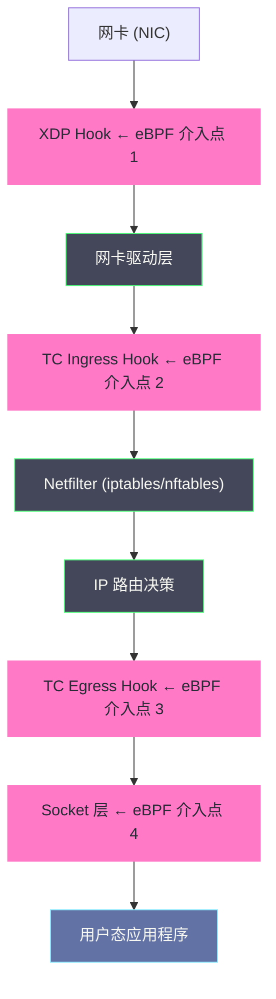
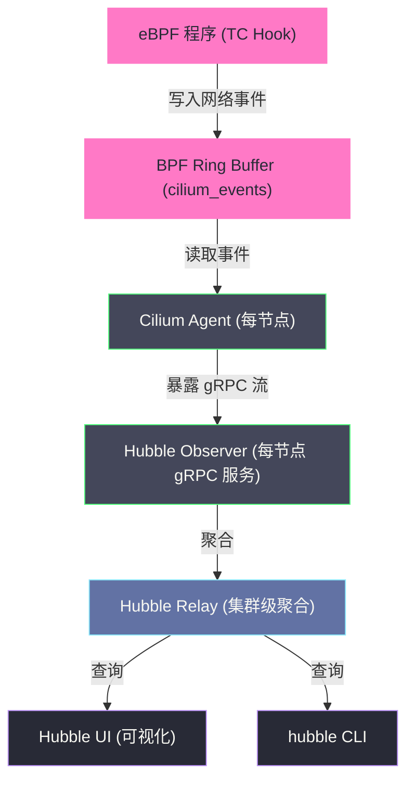

# Cilium深度解析——eBPF驱动的下一代网络与可观测性

## 摘要

Cilium 是 Kubernetes 网络领域近年来最具颠覆性的 CNI 插件。它将 eBPF（extended Berkeley Packet Filter）从一个"内核调试工具"提升为完整的网络数据面，在 XDP、TC、Socket 等内核 Hook 点部署 eBPF 程序，完全替代了 iptables 和 kube-proxy 的角色。本文深入 eBPF 在网络栈中的 Hook 体系，解析 Cilium 的 BPF Map 数据结构设计，还原 Service 流量的 eBPF 转发路径，剖析 L7 NetworkPolicy 的实现原理，并详解 Hubble 可观测平台如何在不修改任何应用代码的前提下，提供完整的网络流量可见性。**理解 Cilium，是理解下一代云原生网络基础设施的入口。**

---

## 第 1 章 eBPF 的前世今生——从包过滤器到网络数据面

### 1.1 BPF 的起源：网络包过滤

1992 年，Steven McCanne 和 Van Jacobson 在 USENIX 论文《The BSD Packet Filter: A New Architecture for User-level Packet Capture》中提出了 **BPF（Berkeley Packet Filter）**。BPF 的初始目标非常具体：让 `tcpdump` 之类的工具能在内核中高效过滤数据包，而不是将所有数据包都复制到用户态再过滤——因为后者的开销极大。

BPF 的设计是一个运行在内核中的虚拟机（VM），接受用户态传入的过滤程序（一段字节码），对每个数据包执行这段程序，决定是否保留该包。这个设计的关键优势：过滤在内核中完成，只有通过过滤的包才被复制到用户态。

BPF 在 Linux 内核 2.2（1998 年）中被引入，并在此后十多年以原始形式（称为 **cBPF，classic BPF**）存在，主要用于 `tcpdump` 和 `seccomp` 系统调用过滤。

### 1.2 eBPF 的革命性扩展

2014 年，Alexei Starovoitov 向 Linux 内核提交了一个重大的扩展：**eBPF（extended BPF）**。eBPF 对 cBPF 做了根本性的重新设计：

**寄存器扩展**：从 cBPF 的 2 个 32 位寄存器，扩展为 11 个 64 位寄存器（r0-r10），与 x86-64 的寄存器模型对齐，使得 eBPF 字节码可以被 JIT 编译器直接翻译为高效的原生机器码。

**Map 数据结构**：引入了 **BPF Map**——内核中的持久化数据结构（Hash Map、Array、LRU、Ring Buffer 等），允许 eBPF 程序存储状态，也允许用户态程序与内核 eBPF 程序共享数据。这是 eBPF 能够做复杂工作的基础。

**Helper 函数系统**：eBPF 程序不能直接调用任意内核函数（否则会破坏内核稳定性），但可以调用内核暴露的 **BPF Helper 函数**（如 `bpf_map_lookup_elem`、`bpf_skb_store_bytes`、`bpf_redirect`），这些函数构成了 eBPF 与内核交互的稳定 ABI。

**验证器（Verifier）**：eBPF 程序在加载进内核时，必须通过严格的**验证器**检查：确保程序能够在有限步骤内终止（没有无限循环）、不访问越界内存、不调用非法函数。只有通过验证的程序才能被加载，这保证了 eBPF 程序的安全性——运行 eBPF 程序不会使内核崩溃。

**多样的 Hook 点**：eBPF 程序可以附着（attach）到内核的多个 Hook 点，在这些 Hook 点被触发时执行：网络包收发（XDP、TC）、系统调用（Tracepoint、Kprobe）、Socket 操作、cgroups 策略等。

> [!info] 核心概念
> eBPF 和 cBPF 的区别类比于 Java 虚拟机（JVM）和早期的字节码解释器：cBPF 是一个简单的解释器，只能做基本的包过滤；eBPF 是一个完整的沙箱 VM，带有 JIT 编译、持久化状态、内核 API 调用能力，几乎可以在内核中实现任意（安全的）逻辑。

### 1.3 eBPF 为什么能颠覆 Kubernetes 网络

Kubernetes 网络的传统实现依赖 iptables（kube-proxy）和 Linux bridge。这两者都是上世纪 90 年代末到 2000 年代初设计的，**针对的是单机防火墙和简单网络的场景，而非数千节点、数万 Pod 的云原生集群**。

**iptables 的根本性能问题**：
- **线性规则匹配**：iptables 规则链是链表，每个数据包需要从链头遍历匹配规则，O(N) 复杂度，N 是规则数
- **不支持增量更新**：修改任何规则都需要重新加载整个规则集（iptables-restore），在有数万条规则时，这个操作本身需要持有内核锁，耗时可达数秒
- **状态分散**：不同 Chain 之间的规则分散在内核的多个数据结构中，难以追踪和调试

**eBPF 的优势**：
- **O(1) 查找**：BPF Hash Map 支持 O(1) 的键值查找，无论有多少 Service，查找时间恒定
- **原子增量更新**：BPF Map 的单条记录可以原子更新，不需要"先删后建"整个规则集
- **可编程**：eBPF 程序是代码，而非静态规则，可以实现 iptables 完全无法做到的逻辑（如 L7 协议解析）
- **可观测**：eBPF Ring Buffer 可以将内核中的网络事件高效传递给用户态，实现几乎零开销的流量观测

---

## 第 2 章 eBPF 在网络栈中的 Hook 点体系

### 2.1 Linux 网络栈的处理路径

在深入 Cilium 的 eBPF 使用方式之前，需要理解 Linux 网络栈的处理路径，以及 eBPF Hook 点在哪里介入。

一个数据包从网卡到达应用程序的完整路径：



### 2.2 XDP：最早介入点，性能最高

**XDP（eXpress Data Path）** 是 eBPF 在网络栈中最早的介入点——在网卡驱动层、甚至在网卡硬件上（offload 模式）执行，数据包尚未进入内核的 socket buffer（sk_buff）分配流程。

XDP 程序的返回值决定数据包的命运：
- `XDP_PASS`：放行，继续正常的内核网络处理
- `XDP_DROP`：直接丢弃，内核零开销
- `XDP_TX`：从同一网卡发送回去（U-Turn）
- `XDP_REDIRECT`：重定向到另一个网卡或 CPU

**XDP 的典型用途**：
- DDoS 防护：在 DDoS 攻击时，用 XDP DROP 以极低 CPU 开销丢弃恶意包，而不进入内核协议栈分配 sk_buff
- 负载均衡：Cilium 的 NodePort 实现可以在 XDP 层直接做 DNAT，不进入内核协议栈

**XDP 的性能数字**：Meta（Facebook）公开的测试显示，用 XDP 实现的负载均衡可以达到 **24 Mpps（每秒 2400 万包）**，而基于 iptables 的实现仅约 3 Mpps。差距在 8 倍以上。

> [!info] 核心概念
> XDP 之所以性能极高，是因为它在 sk_buff 分配之前处理数据包。sk_buff（socket buffer）是 Linux 内核描述一个数据包的核心结构体，大约 232 字节，包含包的元数据、指向数据的指针、各种标志位等。分配和初始化 sk_buff 本身就有开销，XDP 完全跳过了这一步——数据包就是 DMA 内存中的一段原始字节，XDP 程序直接操作这段字节。

### 2.3 TC：最灵活的 Hook 点

**TC（Traffic Control）** 是 Cilium 最主要使用的 Hook 点。TC 在数据包已经进入内核协议栈（sk_buff 已分配）之后，在 IP 路由决策前后介入。

TC 有两个方向的 Hook：
- **TC Ingress**（进方向）：数据包刚进入网络接口，在 Netfilter/iptables 之前
- **TC Egress**（出方向）：数据包即将从网络接口发出，在 Netfilter/iptables 之后

Cilium 在每个 Pod 的 veth 接口（ciliumXXXX 或 lxcXXXX）的 TC Ingress 和 TC Egress 上都挂载了 eBPF 程序，用于：
- **Ingress**：处理进入 Pod 的流量——NetworkPolicy 检查、Service 的反向 NAT（SNAT 还原）
- **Egress**：处理从 Pod 发出的流量——Service 的 DNAT（ClusterIP → Endpoint IP）、NetworkPolicy 出站检查

**TC 程序的返回值**：
- `TC_ACT_OK`：放行
- `TC_ACT_SHOT`：丢弃
- `TC_ACT_REDIRECT`：重定向到另一个接口（可以跳过内核协议栈的中间步骤）

### 2.4 Socket Hook：同节点通信的终极优化

对于同一节点上两个 Pod 之间的通信，Cilium 还可以在 **Socket 层** 介入，实现更彻底的优化。

**传统路径（两个同节点 Pod 通信）**：
```
Pod A → eth0(veth内端) → veth外端(TC egress) → 路由 → veth外端(TC ingress) → eth0 → Pod B
```
数据包需要经过两次 veth pair 的上下文切换和两次 TC Hook。

**Socket 层 eBPF 优化路径**：
在 `connect()` 系统调用时，Cilium 的 Socket Hook 程序检测到目标 IP 是同节点的另一个 Pod，直接将目标地址重写为对端 Pod 的 Socket 地址。这样两个 Socket 直接通信，完全跳过网络协议栈——就像 localhost 通信一样，延迟接近零。

这种优化被 Cilium 称为 **Socket-Level Load Balancing** 或 **Direct Routing via Socket**，是 Cilium 在同节点通信性能上远超 Flannel/Calico 的核心原因之一。

---

## 第 3 章 BPF Map——eBPF 程序的大脑

### 3.1 为什么需要 BPF Map

eBPF 程序是"无状态"的——每次被触发时，它只能访问当前数据包的信息和寄存器，无法在不同触发实例之间共享状态。但网络数据面需要大量"有状态"的操作：

- Service 的 DNAT 需要查询 ClusterIP → Endpoint 的映射表
- NetworkPolicy 需要查询允许哪些来源 IP 访问
- conntrack（连接跟踪）需要记录每个 TCP 连接的 DNAT 映射，以便处理返回包

**BPF Map 正是为解决这个问题而设计的**。BPF Map 是存储在内核中的持久化数据结构，生命周期独立于任何单个 eBPF 程序。eBPF 程序可以通过 Helper 函数读写 BPF Map，用户态程序也可以通过文件描述符（通过 bpffs 挂载的虚拟文件系统）读写 BPF Map。这使得 eBPF 程序与用户态控制面之间可以高效共享状态。

### 3.2 Cilium 使用的核心 BPF Map 类型

**BPF_MAP_TYPE_HASH（哈希表）**：最常用的类型，O(1) 查找/插入/删除，用于存储 Service→Endpoint 映射、NetworkPolicy 规则等。内部使用内核的哈希表实现，支持并发访问（通过每个 bucket 的自旋锁保证原子性）。

**BPF_MAP_TYPE_ARRAY（数组）**：固定大小的数组，通过整数下标访问，O(1)。查找速度比 Hash Map 更快（无哈希计算，直接内存偏移）。用于配置参数、计数器等。

**BPF_MAP_TYPE_LRU_HASH（LRU 哈希表）**：带 LRU（最近最少使用）淘汰策略的哈希表，当表满时自动淘汰最久未使用的条目。Cilium 用于 conntrack 表——连接跟踪表不能无限增长，LRU 确保旧连接记录被自动清理。

**BPF_MAP_TYPE_RINGBUF（环形缓冲区，5.8+）**：高性能的内核→用户态数据流通道，eBPF 程序将网络事件写入 ring buffer，用户态的 Hubble 进程读取。相比旧的 perf_event_array，ring buffer 支持多生产者单消费者模型，且不会因用户态处理慢导致内核丢失事件（可以配置为阻塞或丢弃）。

**BPF_MAP_TYPE_SOCKHASH（Socket 哈希表）**：存储 Socket 对象的哈希表，用于 Socket 层负载均衡——将目标 IP:Port 映射到实际的 Socket 对象，实现同节点通信的直接 Socket 转发。

### 3.3 Cilium 的核心 BPF Map 实例

Cilium 在节点上维护的关键 BPF Map（可通过 `bpftool map list` 查看）：

| Map 名称 | 类型 | 内容 | 大小 |
| :--- | :--- | :--- | :--- |
| `cilium_lb4_services_v2` | HASH | Service ClusterIP:Port → Service 元数据 | 65536 条 |
| `cilium_lb4_backends_v3` | HASH | Backend ID → Endpoint IP:Port | 65536 条 |
| `cilium_lb4_reverse_nat` | HASH | Backend ID → 反向 SNAT 信息 | 65536 条 |
| `cilium_ct4_global` | LRU_HASH | 连接跟踪（全局） | 256k 条 |
| `cilium_ct4_any` | LRU_HASH | 连接跟踪（per-Pod） | 64k 条 |
| `cilium_policy` | HASH | Pod Identity → 允许的源 Identity 集合 | 按策略数量 |
| `cilium_ipcache` | HASH | IP → Security Identity | 512k 条 |
| `cilium_events` | PERF_ARRAY | Cilium 事件通知（Hubble 使用） | 4096 条 |

这些 Map 的生命周期由 Cilium agent 管理——当 Service 或 Pod 变化时，agent 更新对应的 BPF Map 条目，eBPF 程序在下次处理数据包时就能看到最新的配置。

> [!info] 核心概念
> BPF Map 是 eBPF 在 Kubernetes 网络中的核心创新点。传统 iptables 的"规则"是线性链表，Calico 维护数万条 iptables 规则时，每次数据包都要遍历这些规则。BPF Map 是哈希表，`cilium_lb4_services_v2` 中有 10000 个 Service 时，查找一个 ClusterIP 仍然只需要一次哈希计算，时间复杂度 O(1)。这就是 Cilium 在大规模集群下性能碾压 kube-proxy 的底层原因。

---

## 第 4 章 替代 kube-proxy——eBPF Service 实现

### 4.1 kube-proxy 的工作方式回顾

在进入 Cilium 的实现之前，先简要回顾 kube-proxy 的 iptables 模式是如何实现 Service 的（详细内容见第 6 篇）。

当一个请求访问 ClusterIP `10.96.100.1:80` 时，kube-proxy 预先在节点上写入的 iptables 规则链会将其 DNAT 为某个 Endpoint IP:Port（如 `10.244.0.5:8080`）：

```
PREROUTING → KUBE-SERVICES
  → -d 10.96.100.1 -p tcp --dport 80 -j KUBE-SVC-XXXX
    KUBE-SVC-XXXX（随机选 Endpoint）
      → -j KUBE-SEP-1111（33% 概率）→ DNAT to 10.244.0.5:8080
      → -j KUBE-SEP-2222（50% 概率）→ DNAT to 10.244.0.6:8080
      → -j KUBE-SEP-3333（100% 概率）→ DNAT to 10.244.0.7:8080
```

负载均衡通过 `--statistic module random` 实现（概率性跳转），这种方式的问题是：规则数随 Service 和 Endpoint 数量线性增长，每条规则的匹配都是顺序遍历。

### 4.2 Cilium 的 eBPF Service 实现

Cilium 用 BPF Map + eBPF 程序完全替代了这套 iptables 规则。整个 Service 的 DNAT 逻辑在 TC eBPF 程序中完成：

**步骤 1：查找 Service BPF Map**

数据包到达节点时，TC Ingress 程序提取目标 IP:Port（`10.96.100.1:80`），在 `cilium_lb4_services_v2` 中做哈希查找：

```c
// eBPF 程序伪代码（简化）
struct lb4_key key = {
    .address = 0x0A606401,  // 10.96.100.1
    .dport   = htons(80),
    .proto   = IPPROTO_TCP,
};
struct lb4_service *svc = bpf_map_lookup_elem(&cilium_lb4_services_v2, &key);
```

这一步 O(1)，无论有多少 Service。

**步骤 2：选择 Endpoint（负载均衡）**

从 Service 元数据中得到 backend 数量和当前轮询计数器（`svc->count`、`svc->rev_nat_index`），通过原子操作选择 Backend ID（Cilium 默认使用 maglev 哈希或 round-robin）：

```c
// 使用 Maglev 一致性哈希（基于连接 5 元组）
backend_id = cilium_lb4_backend_id(svc, flow_hash(skb));
```

Cilium 支持三种负载均衡算法：
- **Random**：随机选择
- **Round Robin**：轮询（通过全局原子计数器）
- **Maglev**：Google 提出的一致性哈希算法，确保相同的连接（5 元组哈希）总是路由到同一个 Backend，在 Backend 变化时只有少量连接需要重新路由

**步骤 3：写入 conntrack 记录**

选定 Backend 后，在 `cilium_ct4_global` 中写入一条连接跟踪记录，记录 `(src_ip, src_port, dst_ip, dst_port, proto)` → `(Backend IP, Backend Port, rev_nat_id)`。这用于处理返回包的反向 SNAT。

**步骤 4：修改数据包（DNAT）**

通过 BPF Helper 函数直接修改 sk_buff 中的目标 IP:Port：

```c
bpf_skb_store_bytes(skb, offsetof(struct iphdr, daddr), &backend_ip, 4, BPF_F_INVALIDATE_HASH);
bpf_l4_csum_replace(skb, TCP_DPORT_OFF, old_dport, new_dport, sizeof(new_dport));
// 更新 IP checksum
bpf_l3_csum_replace(skb, IP_CSUM_OFF, old_daddr, new_daddr, sizeof(new_daddr));
```

**步骤 5：返回包的反向 NAT**

返回包到达时，TC Ingress 程序在 conntrack 表中查找原始的 `(src_ip, dst_ip)` 对，将返回包的源 IP:Port 从 Backend IP 还原为 ClusterIP，然后返回给客户端。

整个过程对应用完全透明，应用只看到 ClusterIP，不知道实际的 Backend IP。

### 4.3 Cilium kube-proxy 替换模式的部署

```bash
# 安装 Cilium 并禁用 kube-proxy
helm install cilium cilium/cilium \
    --namespace kube-system \
    --set kubeProxyReplacement=true \
    --set k8sServiceHost=<API_SERVER_IP> \
    --set k8sServicePort=6443

# 禁用 kube-proxy DaemonSet
kubectl patch ds kube-proxy -n kube-system \
    -p '{"spec":{"template":{"spec":{"nodeSelector":{"non-cilium":"true"}}}}}'
```

> [!warning] 生产避坑
> 启用 `kubeProxyReplacement=true` 后，必须在 Cilium 完全就绪（所有 `cilium-node` DaemonSet Pod Running）之前，不能有其他网络操作依赖 kube-proxy。建议分阶段迁移：先在新节点启用 Cilium kube-proxy 替换，旧节点保留 kube-proxy，验证稳定后再全量切换。

---

## 第 5 章 CiliumNetworkPolicy——L7 感知的网络策略

### 5.1 为什么需要 L7 NetworkPolicy

传统的 NetworkPolicy（以及 Calico 的 GlobalNetworkPolicy）工作在 L3/L4 层——基于 IP 地址、端口、协议进行访问控制。这在许多场景下已经足够，但在微服务架构中存在一个根本性的不足：

**L3/L4 策略无法区分同一端口上的不同 HTTP 路径**。

例如，你有一个用户服务（`/api/users/read`）和一个管理接口（`/api/admin/delete`），两者都监听 8080 端口。用 NetworkPolicy 允许前端访问 8080，那么前端既可以访问 `/api/users/read` 也可以访问 `/api/admin/delete`——你没办法在网络层面做区分，只能在应用层面做认证授权。

Cilium 的 L7 NetworkPolicy 解决了这个问题：**在内核中解析 HTTP（或 gRPC、Kafka 等协议）协议，基于 HTTP Method、Path、Header 进行访问控制**，完全在网络层实现，不需要应用代码做任何改动。

### 5.2 Cilium 的 Identity 模型

在理解 L7 策略之前，需要先理解 Cilium 的 **Security Identity（安全身份）** 概念，这是 Cilium 策略引擎的核心创新。

**传统 NetworkPolicy 的 IP-based 问题**：Pod 的 IP 是动态的，Pod 重启后 IP 变化，NetworkPolicy 引擎需要实时跟踪每个 Pod 的 IP 变化并更新 iptables 规则。在大规模频繁变化的集群中，这是 Felix 的主要 CPU 消耗来源。

**Cilium 的 Identity 方案**：Cilium 为每个 Pod（或 Endpoint）分配一个**固定的 32 位 Security Identity**，这个 Identity 基于 Pod 的 **Labels**（而非 IP）计算得出——相同 Labels 的 Pod 具有相同的 Identity。

```
Identity 计算示例:
  Labels: {app: frontend, env: prod} → Identity: 12345
  Labels: {app: backend,  env: prod} → Identity: 67890
```

Identity 被编码在 **VXLAN 的 VNI 字段**（或 Geneve 协议的 option 字段）中，随数据包传递。当数据包到达目标节点时，eBPF 程序从数据包中读取源 Identity，查询 NetworkPolicy BPF Map（允许哪些 Identity 的流量），做出放行/拒绝决策。

这种设计的优势：
- **与 IP 解耦**：Pod 重启 IP 变化时，Identity 不变，策略无需更新
- **O(1) 策略查找**：查询 `cilium_policy` BPF Map（`src_identity → 是否允许`），O(1) 完成，不随策略数量增长
- **分布式验证**：策略检查在数据包的接收端（目标节点）执行，而非在发送端，即使发送端被攻陷，目标仍能强制执行策略

### 5.3 L7 策略的实现：透明代理

L7 策略无法完全在 eBPF 中实现——HTTP 协议解析太复杂，eBPF 验证器不允许无限制的循环（HTTP header 长度不固定）。Cilium 的解决方案是：**透明代理（Transparent Proxy）**。

当一个连接被 L7 策略匹配时，Cilium 的 TC eBPF 程序将该连接**透明地重定向**（通过 `SO_TRANSPARENT` + `IP_TRANSPARENT` socket 选项）到本地运行的 **Envoy 进程**。Cilium 在每个节点运行一个 Envoy 实例（不是服务网格的 Sidecar，而是节点级别的共享代理）。

```
Pod A → L7 CiliumNetworkPolicy 匹配 → TC eBPF 重定向到 Envoy（本地）
                                            ↓
                              Envoy 解析 HTTP，检查 Method/Path/Header
                                            ↓
                              允许: Envoy 转发到真实目标
                              拒绝: Envoy 返回 403
```

**对 Pod A 和目标服务透明**：Pod A 不知道流量经过了 Envoy，目标服务不知道流量来自 Envoy——eBPF 在两端都做了 IP 地址的透明替换，确保 TCP 连接的四元组从应用视角看是正确的。

### 5.4 CiliumNetworkPolicy 示例

**L3/L4 层策略（与 K8s NetworkPolicy 等价，但使用 Identity）**：

```yaml
apiVersion: cilium.io/v2
kind: CiliumNetworkPolicy
metadata:
  name: allow-backend-from-frontend
  namespace: default
spec:
  endpointSelector:
    matchLabels:
      app: backend
  ingress:
  - fromEndpoints:
    - matchLabels:
        app: frontend
    toPorts:
    - ports:
      - port: "8080"
        protocol: TCP
```

**L7 HTTP 策略（iptables 完全无法实现）**：

```yaml
apiVersion: cilium.io/v2
kind: CiliumNetworkPolicy
metadata:
  name: allow-get-api-only
spec:
  endpointSelector:
    matchLabels:
      app: backend
  ingress:
  - fromEndpoints:
    - matchLabels:
        app: frontend
    toPorts:
    - ports:
      - port: "8080"
        protocol: TCP
      rules:
        http:
        - method: "GET"
          path: "/api/v1/.*"   # 只允许 GET /api/v1/ 路径
        - method: "POST"
          path: "/api/v1/orders"  # 只允许 POST /api/v1/orders
```

**L7 Kafka 策略**：

```yaml
toPorts:
- ports:
  - port: "9092"
    protocol: TCP
  rules:
    kafka:
    - role: produce
      topic: "orders"    # 只允许写入 orders topic
    - role: consume
      topic: "events"    # 只允许消费 events topic
```

> [!note] 设计哲学
> Cilium 的 L7 策略是云原生安全架构中的重大进步——它将原本只能在 API Gateway 层做的访问控制下沉到基础设施层，无需修改应用代码，无需部署 Sidecar。这是 Cilium 对"Zero Trust Networking"的具体实现：即使攻击者突破了服务间的 mTLS，也无法调用未被 L7 策略明确允许的 API 路径。

---

## 第 6 章 Hubble——基于 eBPF 的网络可观测平台

### 6.1 Hubble 是什么

**Hubble** 是 Cilium 的可观测性组件，于 2019 年作为独立项目开源，后合并回 Cilium 生态。它利用 eBPF 在内核中以极低开销采集网络流量数据，提供：

- **逐流可见性**：每个 TCP/UDP 连接的源/目标、协议、延迟、状态（允许/拒绝）
- **HTTP/gRPC 细节**：URL、Method、Status Code、延迟分布
- **服务依赖图**：自动发现微服务之间的调用关系，生成可视化拓扑
- **安全事件**：NetworkPolicy 拒绝事件、告警

### 6.2 Hubble 的技术架构



**数据流路径**：
1. Cilium 的 TC eBPF 程序在处理每个数据包时，将流量事件（src/dst、协议、policy decision）写入 `cilium_events` BPF Ring Buffer
2. Cilium Agent 持续从 Ring Buffer 读取事件，重建为完整的 Flow 记录（一个 TCP 连接对应一个 Flow）
3. 每个节点的 Hubble Observer（Cilium Agent 内嵌）通过 gRPC streaming 暴露这些 Flow
4. Hubble Relay 聚合所有节点的 Flow 数据，对外提供统一的查询接口
5. Hubble UI 和 hubble CLI 通过 Relay 查询和展示数据

### 6.3 Hubble 的零开销原理

Hubble 的一个重要特性是：**对网络性能几乎零影响**。这得益于 eBPF Ring Buffer 的设计：

**传统监控方案的 overhead**：
- tcpdump：需要 copy 每个数据包的内容到用户态，大流量下 CPU 消耗显著
- Netflow/IPFIX：在网络设备上采样，只能采样部分流量，信息不完整
- iptables LOG：每个匹配的包都写一条 kernel log，高频下 log 本身成为瓶颈

**eBPF Ring Buffer 的优势**：
- eBPF 程序只写入流量的**元数据**（src/dst/port/protocol/verdict），而非数据包内容本身，每条记录约 100-200 bytes
- Ring Buffer 是无锁的生产者-消费者模型（多个 CPU 核可以并发写入不同的 slot），写入 overhead 极低（微秒级）
- 当消费者（Cilium Agent）处理较慢时，Ring Buffer 满了会丢弃新事件（而非阻塞 eBPF 程序），不影响数据包处理

官方基准测试：在 10 Gbps 的流量下，Hubble 开启后，节点 CPU 使用率增加约 **1-2%**，延迟增加 < 0.1ms。

### 6.4 实际使用 Hubble

```bash
# 安装 Hubble CLI
HUBBLE_VERSION=$(curl -s https://raw.githubusercontent.com/cilium/hubble/master/stable.txt)
curl -L --remote-name-all https://github.com/cilium/hubble/releases/download/$HUBBLE_VERSION/hubble-linux-amd64.tar.gz
tar xzvf hubble-linux-amd64.tar.gz && mv hubble /usr/local/bin

# 启用 Hubble 端口转发
cilium hubble port-forward&

# 查看实时流量（所有命名空间）
hubble observe --all-namespaces

# 查看被 NetworkPolicy 拒绝的流量
hubble observe --verdict DROPPED --all-namespaces

# 查看特定 Pod 的流量
hubble observe --pod default/nginx-xxx --all-namespaces

# 查看 HTTP L7 流量详情
hubble observe --protocol http --all-namespaces

# 输出示例
# Feb  5 10:23:41.123 default/frontend:42000 -> default/backend:8080
#   TCP Flags: SYN
#   HTTP GET /api/v1/users → 200 OK (latency: 3.2ms)
#   Policy: ALLOW (identity: frontend→backend)
```

### 6.5 Hubble UI 的服务拓扑可视化

Hubble UI 提供了一个实时更新的服务依赖图，自动发现：
- 哪些服务在相互调用
- 每条连接的流量速率和错误率
- NetworkPolicy 拒绝事件（以红色边标注）
- HTTP 请求的延迟分布（P50/P95/P99）

这种可见性在传统网络工具中需要在应用层部署分布式追踪（如 Jaeger/Zipkin），需要修改应用代码注入 trace header。Hubble 完全在网络层完成，对应用零侵入。

---

## 第 7 章 Cilium 的部署与运维

### 7.1 内核版本要求

Cilium 对 Linux 内核版本有明确要求：

| Cilium 功能 | 最低内核版本 | 推荐内核版本 |
| :--- | :--- | :--- |
| 基础 CNI | 4.9 | 5.10+ |
| kube-proxy 替换 | 5.3 | 5.10+ |
| Host Reachable Services | 5.3 | 5.10+ |
| Bandwidth Manager (EDT) | 5.1 | 5.10+ |
| L7 NetworkPolicy | 5.3 | 5.10+ |
| Socket-level LB | 5.4 | 5.10+ |
| WireGuard 加密 | 5.6 | 5.10+ |
| BPF Ring Buffer | 5.8 | 5.10+ |
| XDP NodePort | 4.19 | 5.10+ |

**推荐 Linux 5.10（LTS）或更新版本**，以获得所有特性支持和最佳稳定性。AWS EKS、GKE、AKS 的默认节点 AMI 通常满足这一要求。

### 7.2 使用 Helm 安装 Cilium

```bash
helm repo add cilium https://helm.cilium.io/

# 最小化安装（仅 CNI）
helm install cilium cilium/cilium \
    --version 1.15.0 \
    --namespace kube-system \
    --set ipam.mode=kubernetes

# 生产推荐配置（启用全部高级特性）
helm install cilium cilium/cilium \
    --version 1.15.0 \
    --namespace kube-system \
    --set ipam.mode=kubernetes \
    --set kubeProxyReplacement=true \
    --set k8sServiceHost=<API_SERVER_IP> \
    --set k8sServicePort=6443 \
    --set hubble.enabled=true \
    --set hubble.relay.enabled=true \
    --set hubble.ui.enabled=true \
    --set bandwidthManager.enabled=true \   # 基于 EDT 的带宽管理
    --set encryption.enabled=true \          # WireGuard 透明加密
    --set encryption.type=wireguard
```

### 7.3 常用诊断命令

```bash
# 查看 Cilium 整体状态
cilium status

# 查看某个 Pod 的 Endpoint 信息（Identity、NetworkPolicy、veth 接口）
cilium endpoint list
cilium endpoint get <ENDPOINT_ID>

# 查看 BPF Map 内容（Service Map）
cilium bpf lb list

# 查看 NetworkPolicy 的 BPF 表示
cilium bpf policy get <ENDPOINT_ID>

# 查看 conntrack 表
cilium bpf ct list global

# 测试两个 Pod 之间的连通性（考虑 NetworkPolicy）
cilium connectivity test

# 查看节点上的 eBPF 程序
bpftool prog list | grep cilium

# 查看 BPF Map
bpftool map list | grep cilium

# 实时查看 Cilium 监控事件
cilium monitor --type drop    # 只看丢包事件
cilium monitor --type trace   # 查看完整数据包跟踪
```

> [!warning] 生产避坑
> 在升级 Cilium 版本时，必须注意：Cilium 的 eBPF 程序存储在 bpffs（BPF 文件系统，挂载于 `/sys/fs/bpf`）中，跨版本升级时旧的 BPF 程序需要被新程序替换。如果升级过程中节点重启，可能出现新的 Cilium agent 无法识别旧版 BPF Map schema 的问题（Map 格式变更时）。Cilium 通过 "bpf map migration" 机制处理这个问题，但建议在升级前阅读对应版本的升级说明，并在测试环境验证。

---

## 第 8 章 Cilium 的性能数字与横向对比

### 8.1 基准测试结论（来源：Cilium 官方及第三方测试）

以下数据基于典型的裸金属测试环境（2x Intel Xeon，25 Gbps NIC），仅供参考：

| 场景 | Flannel VXLAN | Calico BGP | Cilium (kube-proxy替换) |
| :--- | :---: | :---: | :---: |
| **TCP 吞吐量（同节点 Pod）** | ~9 Gbps | ~9 Gbps | ~9.5 Gbps（Socket LB） |
| **TCP 吞吐量（跨节点）** | ~7.5 Gbps | ~9 Gbps | ~9 Gbps |
| **Service 延迟（10k Services）** | ~50ms | ~5ms | **~0.5ms** |
| **Service 规则更新延迟** | 秒级 | 秒级 | **毫秒级** |
| **CPU（Service 转发）** | 中（iptables 开销） | 中 | **低（BPF Map 查找）** |
| **NetworkPolicy 延迟（1k Pod）** | N/A | ~2ms | **~0.1ms** |

> [!info] 核心概念
> "Service 延迟（10k Services）"这个指标最能体现 Cilium 的优势。kube-proxy（iptables 模式）在 10000 个 Service 时，每个数据包需要遍历数万条 iptables 规则，单次 DNAT 耗时可达数十毫秒。Cilium 的 BPF Map 哈希查找恒定 O(1)，在 10000 个 Service 和 1 个 Service 时查找时间几乎相同（约 0.5ms，主要是网络传输延迟）。

### 8.2 何时不选 Cilium

Cilium 并非在所有场景下都是最佳选择：

- **旧版 Linux 内核（< 4.19）**：某些旧版 RHEL/CentOS 系统无法支持 Cilium 的全部特性，此时 Calico 更合适
- **Windows 节点混合集群**：Cilium 对 Windows 节点的支持仍在进行中，Calico 或 Flannel 是更成熟的选择
- **对 eBPF 调试经验要求高**：当 Cilium 出现问题时，排查 eBPF 程序的行为需要专业知识，团队如果没有 eBPF 调试经验，维护成本较高
- **极度简单的集群（< 50 节点，无 NetworkPolicy 需求）**：Flannel 部署更简单，运维成本更低

---

## 第 9 章 小结

### 9.1 Cilium 技术体系总览

| 层面 | 技术 | 作用 |
| :--- | :--- | :--- |
| **数据面** | TC eBPF（每 veth 接口） | 包过滤、DNAT/SNAT、NetworkPolicy |
| **Service 转发** | BPF Hash Map（O(1) 查找） | 替代 kube-proxy 的 iptables DNAT |
| **早期介入** | XDP | DDoS 防护、NodePort 高性能处理 |
| **同节点优化** | Socket Hook | 同节点 Pod 通信跳过网络栈 |
| **策略模型** | Security Identity（基于 Labels） | 与 IP 解耦的网络身份 |
| **L7 策略** | 透明代理（Envoy） | HTTP/gRPC/Kafka 层访问控制 |
| **可观测性** | BPF Ring Buffer + Hubble | 零开销全流量可见性 |
| **加密** | WireGuard（透明） | 节点间流量加密 |

### 9.2 三大 CNI 插件的本质差异总结

| 维度 | Flannel | Calico | Cilium |
| :--- | :--- | :--- | :--- |
| **核心技术** | 封包隧道（UDP/VXLAN） | BGP + iptables | **eBPF（颠覆性）** |
| **策略层级** | 无 | L3/L4 | **L3/L4/L7** |
| **Service 实现** | kube-proxy（iptables） | kube-proxy（或 eBPF 可选） | **eBPF（替代 kube-proxy）** |
| **可观测性** | 基本 | 中等 | **完整（Hubble）** |
| **技术复杂度** | 低 | 中 | **高** |
| **内核要求** | 低（3.12+） | 中（4.x+） | **高（推荐 5.10+）** |

### 9.3 下一篇预告

理解了三大 CNI 插件的实现，接下来将聚焦 Kubernetes 中另一个核心网络组件：

- **[[06 Service底层实现——kube-proxy、iptables与IPVS]]**：深入 kube-proxy 的 iptables 规则链结构，解析 ClusterIP/NodePort/LoadBalancer 的实现机制，以及 IPVS 模式如何解决大规模 Service 的性能问题

---

*本文是 [[Kubernetes网络原理与插件]] 专栏的第 5 篇。*
