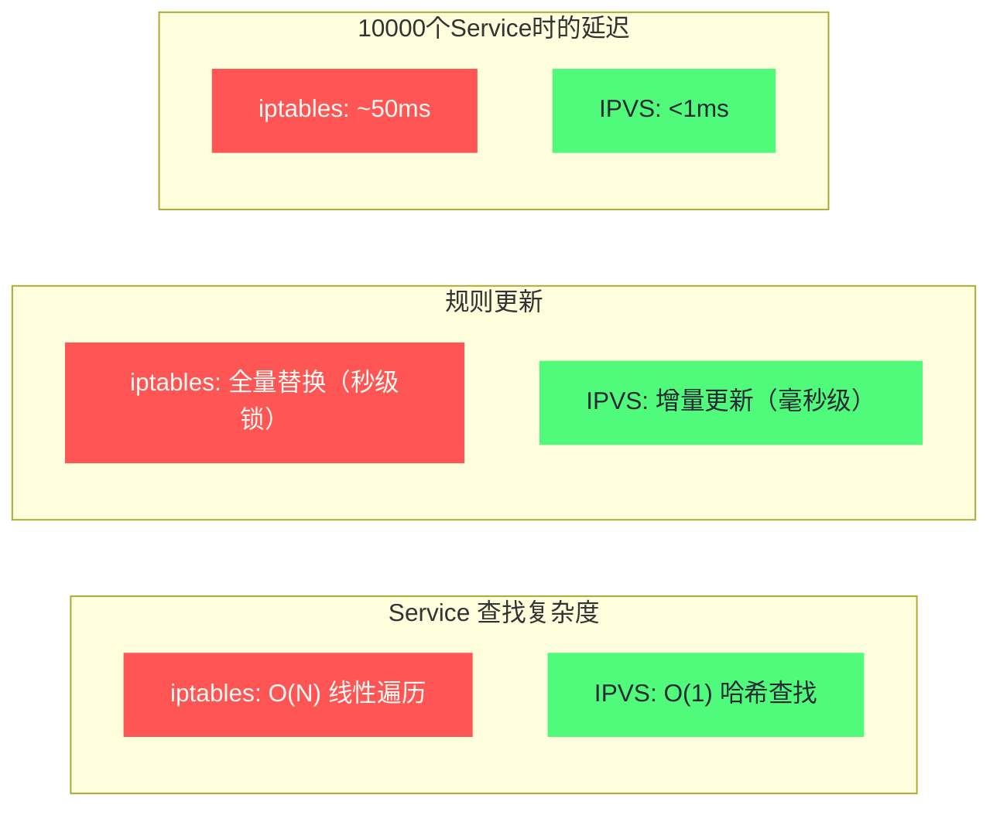

# Service底层实现——kube-proxy、iptables与IPVS

## 摘要

Kubernetes Service 是集群内部服务发现与负载均衡的基础抽象，但它在底层并非一个真实存在的网络实体——ClusterIP 是一个"幻象 IP"，没有任何网络接口与之对应。本文深入 Service 的实现机制：kube-proxy 如何感知 Endpoint 变化并生成 iptables 规则，KUBE-SERVICES/KUBE-SVC/KUBE-SEP 三级规则链的精确语义，NodePort 和 LoadBalancer 类型的数据包路径，以及 IPVS 模式如何用内核虚拟服务器取代 iptables 规则链解决大规模 Service 的性能问题。**理解 Service 的底层实现，是排查"curl 通但 ping 不通"、"偶发超时"等经典故障的必备知识。**

---

## 第 1 章 Service 抽象的设计动机

### 1.1 没有 Service 会怎样

Pod 是 Kubernetes 的最小调度单位，但 Pod 是临时性的（Ephemeral）——Pod 可能因为节点故障、版本升级、资源压力被随时销毁和重建，每次重建后 Pod 会得到一个新的 IP 地址。

假设你有一个"前端"应用需要调用"后端"API，如果直接使用 Pod IP：
- 后端 Pod 重启后 IP 变化，前端需要重新发现后端 IP
- 后端有 3 个副本，前端需要自己实现客户端负载均衡
- 后端 Pod 不健康时，前端需要自己实现健康检查和剔除

这些逻辑如果放在每个微服务中实现，会造成严重的代码耦合和重复。这正是 Service 要解决的问题。

**Service 的核心价值**：提供一个**稳定的虚拟入口**——一个固定的 ClusterIP（或 DNS 名）和端口，无论后端 Pod 如何漂移，前端始终通过这个固定入口访问，Kubernetes 负责将流量自动分发到健康的 Pod。

### 1.2 Service 的四种类型

| 类型 | 访问范围 | 实现机制 | 典型场景 |
| :--- | :--- | :--- | :--- |
| **ClusterIP** | 仅集群内部 | iptables/IPVS DNAT | 服务间内部调用 |
| **NodePort** | 集群外部（通过节点 IP:端口） | ClusterIP + 节点 iptables | 开发测试、临时外部访问 |
| **LoadBalancer** | 集群外部（通过云 LB IP） | NodePort + 云厂商 LB | 生产环境外部暴露 |
| **ExternalName** | 集群内部访问外部域名 | DNS CNAME | 对接外部服务（无 iptables）|

### 1.3 ClusterIP 为什么 ping 不通

这是 Kubernetes 初学者最常见的困惑。`curl http://10.96.100.1:80` 成功，但 `ping 10.96.100.1` 超时。

**根本原因**：ClusterIP 是一个**纯粹的 iptables DNAT 规则的匹配条件**，它不对应任何网络接口，没有任何进程在"监听"这个 IP。当一个数据包目标是 ClusterIP 时，iptables 的 PREROUTING hook 在路由决策之前将其 DNAT 为某个 Endpoint IP。这个转换只对 TCP/UDP 数据包生效（kube-proxy 的 iptables 规则使用 `-p tcp` 或 `-p udp` 匹配）。

ICMP（ping）数据包：
1. 发出 `ping 10.96.100.1`
2. ICMP 包进入内核协议栈
3. iptables PREROUTING → KUBE-SERVICES 链：规则只匹配 TCP/UDP，ICMP 不匹配，直接通过
4. 内核路由查找 `10.96.100.1`：找不到对应路由（ClusterIP 不在任何接口的地址范围）
5. 内核返回 ICMP "No route to host" 或直接丢弃

这就是 ClusterIP 可以 `curl` 不能 `ping` 的本质原因：**TCP/UDP 数据包命中了 DNAT 规则被重定向到真实 Pod，ICMP 数据包没有命中 DNAT 规则，在路由阶段就被丢弃。**

> [!info] 核心概念
> ClusterIP 是 Kubernetes 最精妙的设计之一：它是一个"只存在于 iptables 规则中的 IP"。没有任何进程监听这个 IP，没有任何网卡配置这个 IP，但你可以用它建立 TCP 连接——因为在你发出 SYN 包的那一刻，iptables 已经在内核中悄悄将目标 IP 改成了真实的 Pod IP。这种"透明代理"的实现方式，是 Kubernetes 网络设计中用户态与内核协作的经典范例。

---

## 第 2 章 kube-proxy 的工作机制

### 2.1 kube-proxy 是什么

**kube-proxy** 是在每个 Kubernetes 节点上运行的网络代理组件（DaemonSet）。它的核心职责是：

1. **Watch Kubernetes API**：监听 Service 和 Endpoint（Slice）对象的变化
2. **维护转发规则**：根据 Service/Endpoint 的变化，在节点上更新 iptables 规则（或 IPVS 规则）
3. **健康检查代理**：对 NodePort 类型的 Service，在节点上监听对应端口，处理健康检查请求

**kube-proxy 不转发实际流量**——它只是一个**规则维护者**。实际的数据包转发完全在 Linux 内核中完成（通过 iptables DNAT 或 IPVS 的内核模块）。kube-proxy 进程崩溃后，已有的规则仍然有效，只是无法响应新的 Service/Endpoint 变化。

### 2.2 kube-proxy 的三种模式

| 模式 | 实现机制 | 内核版本要求 | 适用场景 |
| :--- | :--- | :--- | :--- |
| **userspace（已废弃）** | kube-proxy 进程自身转发流量 | 任意 | 已不使用，历史遗留 |
| **iptables（默认）** | 内核 iptables DNAT 规则 | 内核 2.6+ | 通用，适合中小规模集群 |
| **ipvs** | 内核 IPVS 虚拟服务器 | 内核 4.11+，需 ipvs 模块 | 大规模集群（>1000 Service） |

本文重点深入 iptables 和 IPVS 两种模式。

### 2.3 Watch 机制：kube-proxy 如何感知变化

kube-proxy 通过 Kubernetes API 的 **Watch 机制**（基于 HTTP/2 长连接）实时感知 Service 和 Endpoint 变化。具体链路：

```
API Server（etcd 存储）
  ↓ Watch 推送
kube-proxy
  ↓ 差量计算（对比当前规则和目标规则）
  ↓ 生成 iptables-save 格式的规则文本
  ↓ iptables-restore 批量更新内核规则
```

**批量更新的重要性**：kube-proxy 不会对每个 Endpoint 变化单独调用 `iptables -A/-D`，而是积累一段时间内的所有变化，一次性通过 `iptables-restore` 批量写入。原因是 iptables 的修改操作需要持有内核的 `xt_iptables` 全局锁，在规则较多时单次操作耗时较长；批量写入可以大幅减少锁争用次数。

从 Kubernetes 1.19 版本起，kube-proxy 默认使用 **EndpointSlice**（而非 Endpoints）API——EndpointSlice 将 Endpoint 数据分片存储，解决了大型 Service（数百 Endpoint）时单个 Endpoints 对象过大、每次变化都需要传输整个对象的问题。EndpointSlice 每个切片最多 100 个 Endpoint，只传输变化的切片，大幅减少 API Server 和 kube-proxy 之间的数据传输量。

---

## 第 3 章 iptables 模式深度解析

### 3.1 iptables 的规则链体系

要理解 kube-proxy 的 iptables 规则，需要先理解 iptables 的基本架构。iptables 基于 **Netfilter** 框架，定义了 5 个 Hook 点：

| Hook 点 | 触发时机 | 对应 iptables 链 |
| :--- | :--- | :--- |
| PREROUTING | 数据包刚到达本机，路由决策前 | PREROUTING |
| INPUT | 路由决策后，包目标是本机进程 | INPUT |
| FORWARD | 路由决策后，包需要转发（不是本机进程） | FORWARD |
| OUTPUT | 本机进程发出的包，路由决策后 | OUTPUT |
| POSTROUTING | 数据包即将离开本机，路由决策后 | POSTROUTING |

kube-proxy 主要在 **nat 表**（Network Address Translation，网络地址转换）上操作，用于 DNAT（目的地址转换，将 ClusterIP 转为 Pod IP）和 SNAT（源地址转换）。

### 3.2 kube-proxy 创建的规则链结构

kube-proxy 在 nat 表的 PREROUTING 和 OUTPUT 链上插入跳转规则，然后构建自己的三级规则链：

```
nat 表 PREROUTING
  └── -j KUBE-SERVICES

nat 表 OUTPUT（本机进程发出的包也需要 DNAT）
  └── -j KUBE-SERVICES

KUBE-SERVICES（Service 入口链，每个 Service 一条规则）
  ├── -d 10.96.100.1 -p tcp --dport 80 -j KUBE-SVC-XXXXXXXX  ← 匹配 Service A
  ├── -d 10.96.200.2 -p tcp --dport 443 -j KUBE-SVC-YYYYYYYY ← 匹配 Service B
  └── -j KUBE-NODEPORTS（如果是 NodePort）

KUBE-SVC-XXXXXXXX（单个 Service 的负载均衡链）
  ├── -m statistic --mode random --probability 0.33333 -j KUBE-SEP-AAA  ← 33% 到 Endpoint 1
  ├── -m statistic --mode random --probability 0.50000 -j KUBE-SEP-BBB  ← 50% 到 Endpoint 2
  └── -j KUBE-SEP-CCC                                                    ← 100% 到 Endpoint 3

KUBE-SEP-AAA（单个 Endpoint 的 DNAT 链）
  ├── -s 10.244.0.5 -j KUBE-MARK-MASQ  ← 如果包来自 Endpoint 自己（防环）
  └── -j DNAT --to-destination 10.244.0.5:8080  ← 实际 DNAT
```

### 3.3 负载均衡的概率计算原理

`KUBE-SVC-xxx` 链中的概率跳转是一个精妙的数学设计。假设有 3 个 Endpoint，需要均等分配（33.3%/33.3%/33.3%），但 iptables 是顺序匹配的，每条规则的概率是**相对于剩余流量**的。

计算方式：
- **第 1 条规则**：`--probability 1/3`（0.333）→ 33.3% 的包跳到 Endpoint 1，66.7% 继续
- **第 2 条规则**：`--probability 1/2`（0.5）→ 剩余 66.7% 中的 50% 跳到 Endpoint 2 = 33.3%，另 33.3% 继续
- **第 3 条规则**：无概率，直接跳到 Endpoint 3 = 剩余 33.3%

公式：第 i 条规则的概率 = `1 / (N - i + 1)`，其中 N 是 Endpoint 总数，i 从 1 开始。

这种设计的局限性：**添加/删除 Endpoint 时，必须重算所有规则的概率**。kube-proxy 每次 Endpoint 变化都会重新生成整个 `KUBE-SVC-xxx` 链，并通过 `iptables-restore` 全量替换。

> [!warning] 生产避坑
> 这个负载均衡是**基于连接（connection）的随机分配**，不是基于字节的。一旦一个 TCP 连接建立（SYN 包触发 DNAT 决策），后续这条连接的所有包都走同一个 Endpoint（由 conntrack 表保证）。如果你的客户端使用了长连接（HTTP keep-alive，或 gRPC 长连接），那么一个客户端实例的所有请求都会打到同一个后端，实际负载可能严重不均——这就是为什么在 Kubernetes 中，基于 TCP 连接的 Service 负载均衡对于 gRPC/HTTP2 长连接效果差，需要在应用层（服务网格）做 L7 负载均衡。

### 3.4 ClusterIP 的完整数据包路径

以 Pod A（`10.244.0.2`）访问 Service（ClusterIP `10.96.100.1:80`）为例：

**步骤 1：Pod A 发出 TCP SYN 包**
```
src=10.244.0.2:12345  dst=10.96.100.1:80
```

**步骤 2：包离开 Pod A 的 Network Namespace，经过 veth pair 进入节点网络栈**

**步骤 3：节点内核——nat 表 OUTPUT 链（因为是本机发出的包）**

等等——这是 Pod A 发出的包，为什么触发节点的 OUTPUT 链而不是 PREROUTING？

关键在于：Pod A 的数据包经过 veth pair 进入节点，此时内核视角，这个包是从 `cali3a4b5c` 接口进来的，目标不是本机，需要**转发**（FORWARD 链），而不是走 OUTPUT 链。

**更准确的路径**：

```
Pod A 发包
  ↓ veth pair 进入节点
nat PREROUTING
  ↓ -j KUBE-SERVICES
  ↓ 匹配 -d 10.96.100.1 -p tcp --dport 80
  ↓ KUBE-SVC-XXXXXXXX → 概率跳转 → KUBE-SEP-AAA
  ↓ DNAT: dst 改为 10.244.1.3:8080（Pod B）
mangle FORWARD（略）
filter FORWARD
  ↓ KUBE-FORWARD 链允许转发
nat POSTROUTING
  ↓ KUBE-POSTROUTING 链（如果需要 SNAT）
```

**步骤 4：DNAT 后的包路由**

DNAT 后，包的目标变为 `10.244.1.3:8080`（Pod B 在 Node B 上）。内核重新路由：通过 CNI 的路由规则（Flannel VXLAN 或 Calico BGP），找到 Node B，封包发出。

**步骤 5：Node B 收包，转发给 Pod B**

Node B 的内核收到包，路由到 Pod B。Pod B 看到的包是 `src=10.244.0.2, dst=10.244.1.3:8080`——源是 Pod A 的真实 IP，目标是自己的真实 IP，不知道中间经过了 DNAT。

**步骤 6：Pod B 回包**

Pod B 回复 `src=10.244.1.3:8080, dst=10.244.0.2:12345`。这个回包在穿越 Pod A 所在节点时，被 conntrack 表识别（存在 `10.244.0.2:12345 ↔ 10.244.1.3:8080` 的连接记录），自动进行反向 DNAT（`src=10.244.1.3:8080` 还原为 `src=10.96.100.1:80`），Pod A 收到的回包源是 ClusterIP，对上了发出时的目标，TCP 连接正常建立。

### 3.5 NodePort：将集群内服务暴露到集群外

**NodePort** 类型的 Service 在每个节点上开放一个固定端口（默认范围 30000-32767），外部流量访问任意节点的这个端口，都会被转发到 Service 的后端 Pod。

kube-proxy 在节点上增加的额外规则：

```
nat PREROUTING → KUBE-SERVICES → KUBE-NODEPORTS
  └── -p tcp --dport 30080 -j KUBE-SVC-XXXXXXXX  ← 匹配 NodePort 端口
      └── ... 同 ClusterIP 的 KUBE-SVC-xxx 链
```

以及 SNAT 规则（确保回包经过同一节点）：

```
nat POSTROUTING → KUBE-POSTROUTING
  └── -m mark --mark 0x4000/0x4000 -j MASQUERADE  ← 打了 KUBE-MARK-MASQ 标记的包做 MASQUERADE
```

**NodePort 的数据包完整路径**（外部客户端 `203.0.113.1` 访问 `192.168.1.10:30080`）：

```
外部客户端 → Node A (192.168.1.10:30080)
  ↓ PREROUTING → KUBE-SERVICES → KUBE-NODEPORTS → KUBE-SVC-xxx
  ↓ DNAT: dst=10.244.1.3:8080（Pod B，可能在 Node B 上）
  ↓ 如果 Pod B 在本节点：直接路由到 Pod B
  ↓ 如果 Pod B 在其他节点：
      POSTROUTING → MASQUERADE：src 改为 Node A 的 IP（192.168.1.10）
      发到 Node B，Node B 转发给 Pod B
      Pod B 回包到 Node A（因为 src 是 Node A IP）
      Node A 的 conntrack 还原 DNAT，发回外部客户端
```

> [!warning] 生产避坑
> NodePort 的 MASQUERADE（SNAT）是必要的，但会隐藏客户端的真实 IP。如果你需要在应用中获取真实客户端 IP（日志、限流、地理位置等），有两种方案：
> 1. 设置 `service.spec.externalTrafficPolicy: Local`：kube-proxy 只将 NodePort 流量路由到**本节点的 Pod**，跳过 SNAT（因为不需要跨节点转发），Pod 能看到真实客户端 IP。代价是负载不均（只能打到有 Pod 的节点）
> 2. 使用 LoadBalancer 类型并配置 `ProxyProtocol`：云 LB 通过 Proxy Protocol 将客户端 IP 带入，应用层解析

### 3.6 iptables 模式的性能瓶颈分析

iptables 模式有两个已知的性能天花板：

**瓶颈一：规则数量与匹配延迟**

在 KUBE-SERVICES 链中，每个 Service 对应一条规则。当集群有 N 个 Service 时，每个数据包在 KUBE-SERVICES 中需要平均遍历 N/2 条规则才能找到匹配项（因为命中目标 Service 之前需要逐条跳过其他 Service 的规则）。当 N = 10000 时，平均遍历 5000 条规则，这在高并发场景下会显著增加 CPU 开销和延迟。

**瓶颈二：规则更新的全量替换开销**

当任何 Endpoint 发生变化时（Pod 重启、Deployment 滚动更新），kube-proxy 需要重新生成并 `iptables-restore` 整个规则集（因为 iptables 不支持原子的增量更新）。在 10000 个 Service 的集群中，单次 `iptables-restore` 可能需要 **2-5 秒**，在此期间内核持有锁，新建连接的 DNAT 会有短暂延迟。

---

## 第 4 章 IPVS 模式——用内核虚拟服务器替代规则链

### 4.1 IPVS 是什么

**IPVS（IP Virtual Server，IP 虚拟服务器）** 是 Linux 内核的一个模块，用于实现高性能的四层负载均衡。它最初由章文嵩（前 Linux 基金会理事，阿里云技术副总裁）在 1998 年设计，是 **LVS（Linux Virtual Server）** 项目的核心组件，在互联网行业的大规模生产级负载均衡场景中有数十年的实战历史。

**IPVS 的数据结构**：不同于 iptables 的链式规则，IPVS 在内核中维护**哈希表**（虚拟服务表）：
- **虚拟服务（Virtual Service）**：`(VIP:Port, Protocol)` → Service 的 ClusterIP
- **真实服务器（Real Server）**：每个虚拟服务对应多个 Real Server（即 Endpoint Pod IP:Port）

查找一个 ClusterIP 时，IPVS 在哈希表中直接定位（O(1)），而不是像 iptables 那样线性遍历。

### 4.2 IPVS 的多种调度算法

IPVS 支持多种负载均衡调度算法，远比 iptables 的概率随机更丰富：

| 算法 | 简称 | 原理 | 适用场景 |
| :--- | :--- | :--- | :--- |
| **Round Robin** | rr | 轮询，顺序分发 | 请求处理时间相近 |
| **Weighted Round Robin** | wrr | 加权轮询，按权重分发 | 节点性能不均 |
| **Least Connection** | lc | 最少连接，发给当前连接数最少的后端 | 长连接，请求处理时间差异大 |
| **Weighted Least Connection** | wlc | 加权最少连接（默认） | **kube-proxy IPVS 模式默认** |
| **Source Hash** | sh | 基于源 IP 哈希 | 会话保持（Session Affinity） |
| **Destination Hash** | dh | 基于目标 IP 哈希 | 缓存服务 |
| **Shortest Expected Delay** | sed | 最短期望延迟 | 响应时间敏感 |
| **Never Queue** | nq | SED 变体，优先空闲后端 | 与 sed 类似 |

kube-proxy IPVS 模式默认使用 **Weighted Least Connection（wlc）**，可通过 `--ipvs-scheduler` 参数指定其他算法。

### 4.3 kube-proxy IPVS 模式的工作方式

kube-proxy 在 IPVS 模式下的工作：

**1. 在节点上创建虚拟网卡 kube-ipvs0**

IPVS 需要 ClusterIP 在本节点的某个接口上有地址，否则内核路由会在路由决策时直接丢弃目标为 ClusterIP 的包（因为找不到路由）。kube-proxy 创建一个 dummy 接口 `kube-ipvs0`，并将所有 Service 的 ClusterIP 绑定到这个接口上。

```bash
# IPVS 模式下的 kube-ipvs0 接口
ip addr show kube-ipvs0
# 输出示例：
# 5: kube-ipvs0: <BROADCAST,NOARP> mtu 1500 qdisc noop state DOWN
#     inet 10.96.100.1/32 scope global kube-ipvs0   ← Service A 的 ClusterIP
#     inet 10.96.200.2/32 scope global kube-ipvs0   ← Service B 的 ClusterIP
#     inet 10.96.0.1/32 scope global kube-ipvs0     ← kubernetes Service
```

这样，当数据包的目标是 ClusterIP 时，内核路由会将其视为"发往本机"的包（因为 kube-ipvs0 上有这个 IP），触发 INPUT 链，进而被 IPVS 模块处理。

**2. 通过 ipvsadm 配置虚拟服务**

```bash
# kube-proxy 执行等效于以下 ipvsadm 命令的操作
ipvsadm -A -t 10.96.100.1:80 -s wlc   # 创建虚拟服务
ipvsadm -a -t 10.96.100.1:80 -r 10.244.0.5:8080 -m   # 添加 Real Server（-m = masquerade/NAT 模式）
ipvsadm -a -t 10.96.100.1:80 -r 10.244.0.6:8080 -m
ipvsadm -a -t 10.96.100.1:80 -r 10.244.0.7:8080 -m

# 查看 IPVS 表
ipvsadm -Ln
# TCP  10.96.100.1:80 wlc
#   -> 10.244.0.5:8080         Masq    1      0          0
#   -> 10.244.0.6:8080         Masq    1      0          0
#   -> 10.244.0.7:8080         Masq    1      0          0
```

**3. 保留少量 iptables 规则**

IPVS 模式并非完全不使用 iptables——仍然需要少量 iptables 规则处理：
- SNAT（NodePort 流量出去时的 IP Masquerade）
- 连接标记（标记需要 SNAT 的包）
- 端口转发（NodePort 的端口监听）

但这些规则数量远少于 iptables 模式（通常只有几十条，而不是数万条）。

### 4.4 IPVS vs iptables 性能对比



| 指标 | iptables 模式 | IPVS 模式 |
| :--- | :--- | :--- |
| **Service 查找** | O(N)，线性遍历 | O(1)，哈希表查找 |
| **规则更新** | 全量替换，持有全局锁（秒级） | 增量更新，虚拟服务独立修改（毫秒级） |
| **1000 个 Service 时的连接建立延迟** | ~2ms | ~0.1ms |
| **10000 个 Service 时的连接建立延迟** | ~50ms | ~0.1ms |
| **内存占用** | 约 100MB（规则链占用） | 约 10MB（哈希表占用） |
| **调度算法** | 仅随机概率 | 8 种调度算法 |
| **连接数限制** | 取决于 conntrack 表大小 | 取决于 IPVS 连接表大小 |

> [!note] 设计哲学
> IPVS 模式的性能优势在 Service 数量超过 1000 时开始显现，在 Service 数量超过 5000 时非常明显。对于大多数中小规模集群（< 500 个 Service），两种模式的性能差异在实际业务中几乎感知不到。选型时不要为了追求技术先进性而盲目切换到 IPVS——如果你的集群规模不大，iptables 模式更稳定、更易于调试。

### 4.5 切换到 IPVS 模式

```bash
# 前置条件：确认内核已加载 IPVS 模块
lsmod | grep ip_vs
# 如果没有输出，手动加载
modprobe ip_vs
modprobe ip_vs_rr
modprobe ip_vs_wrr
modprobe ip_vs_sh
modprobe nf_conntrack

# 方式一：修改 kube-proxy ConfigMap
kubectl edit configmap kube-proxy -n kube-system
# 将 mode: "" 改为 mode: "ipvs"

# 方式二：kubeadm 初始化时指定
kubeadm init --config kubeadm-config.yaml
# kubeadm-config.yaml 中添加：
# kubeProxy:
#   config:
#     mode: "ipvs"

# 切换后重启所有 kube-proxy Pod
kubectl rollout restart daemonset kube-proxy -n kube-system

# 验证 IPVS 规则
ipvsadm -Ln
```

---

## 第 5 章 EndpointSlice——大型 Service 的性能优化

### 5.1 Endpoints 的扩展性问题

Kubernetes 早期，每个 Service 对应一个 `Endpoints` 对象，存储该 Service 的所有 Endpoint IP:Port。当一个 Service 有 1000 个 Endpoint 时，这个 Endpoints 对象可能有几十 KB；每次任何一个 Pod 重启（只有一个 Endpoint 变化），API Server 都要传输整个 Endpoints 对象给所有 Watch 了这个 Service 的 kube-proxy——N 个节点的集群，每次 Endpoint 变化要传输 N 次完整的大对象。这在有大量 Service 和 Pod 的集群中是显著的 API Server 带宽压力。

### 5.2 EndpointSlice 的设计

**EndpointSlice**（K8s 1.17 引入，1.21 默认启用）将 Endpoint 数据分片存储：

- 每个 EndpointSlice 最多包含 100 个 Endpoint
- 一个 Service 可以对应多个 EndpointSlice
- 当某个 Endpoint 变化时，只更新包含该 Endpoint 的 EndpointSlice，其他切片不变
- kube-proxy 只需接收变化的切片，而非整个 Service 的所有 Endpoint

例如，一个有 300 个 Endpoint 的 Service：
- **旧方式（Endpoints）**：1 个对象，300 个 IP，每次变化传输约 30KB
- **新方式（EndpointSlice）**：3 个切片，每切片 100 个 IP；Endpoint 变化时只传输 1 个切片，约 10KB

在高频 Pod 滚动更新的场景下，EndpointSlice 的带宽节省可达 **60-70%**。

### 5.3 EndpointSlice 的 Topology 感知路由

EndpointSlice 还引入了 **Topology-aware Hints（拓扑感知路由）** 功能：

```yaml
apiVersion: discovery.k8s.io/v1
kind: EndpointSlice
metadata:
  name: my-service-abc123
  labels:
    kubernetes.io/service-name: my-service
addressType: IPv4
endpoints:
  - addresses: ["10.244.0.5"]
    conditions:
      ready: true
    hints:
      forZones:
        - name: "us-east-1a"    # 建议 us-east-1a 的节点优先使用这个 Endpoint
    zone: "us-east-1a"
```

kube-proxy 可以根据 hints 优先选择同可用区的 Endpoint，减少跨可用区流量（降低延迟和跨区数据传输费用）。这在多可用区部署的云上集群中非常有价值。

---

## 第 6 章 Session Affinity——粘性会话

### 6.1 什么是 Session Affinity

默认情况下，kube-proxy 对每个新的 TCP 连接随机选择 Endpoint，相同客户端的连续请求可能到不同的 Pod。对于有状态的应用（如存储了用户会话的 Web 应用），这可能导致用户体验问题。

**Session Affinity（会话保持）** 确保来自同一客户端（源 IP）的请求总是路由到同一个 Pod。

```yaml
apiVersion: v1
kind: Service
spec:
  sessionAffinity: ClientIP
  sessionAffinityConfig:
    clientIP:
      timeoutSeconds: 10800  # 3小时
```

### 6.2 iptables 模式的 Session Affinity 实现

kube-proxy 在 iptables 模式下，为启用了 Session Affinity 的 Service 增加额外的规则：

```bash
# 在 KUBE-SVC-xxx 链头部添加 recent 模块的规则
-m recent --name KUBE-SEP-AAA --rcheck --seconds 10800 --reap -j KUBE-SEP-AAA
```

`recent` 模块维护一张"最近见过的源 IP"表：
- 如果源 IP 在过去 10800 秒内曾命中 KUBE-SEP-AAA（Endpoint 1），那么这次也跳到 KUBE-SEP-AAA
- 如果没有记录，走正常的随机分配逻辑，分配后记录这个 (源 IP, Endpoint) 的映射

**IPVS 模式**使用 `sh`（Source Hash）调度算法天然支持 Session Affinity，基于源 IP 哈希选择 Real Server，更高效。

---

## 第 7 章 故障排查实践

### 7.1 Service 不通的排查流程

```bash
# 步骤 1：确认 Service 和 Endpoint 状态
kubectl get svc my-service -n default
kubectl get endpoints my-service -n default  # 旧版
kubectl get endpointslice -n default -l kubernetes.io/service-name=my-service  # 新版

# 步骤 2：确认 kube-proxy 是否正在运行且健康
kubectl get pods -n kube-system -l k8s-app=kube-proxy
kubectl logs -n kube-system kube-proxy-xxx | tail -20

# 步骤 3：在 Pod 所在节点检查 iptables 规则（iptables 模式）
iptables -t nat -L KUBE-SERVICES -n | grep <ClusterIP>
iptables -t nat -L <KUBE-SVC-xxx> -n -v

# 步骤 4：在 Pod 所在节点检查 IPVS 表（IPVS 模式）
ipvsadm -Ln | grep -A5 <ClusterIP>

# 步骤 5：测试从 Pod 内直接访问 Endpoint IP（绕过 Service）
kubectl exec -it test-pod -- curl http://10.244.0.5:8080/healthz

# 步骤 6：如果直接访问 Endpoint IP 通但通过 ClusterIP 不通，
#         说明 iptables/IPVS 规则有问题，检查 kube-proxy 日志

# 步骤 7：查看 conntrack 表，确认 DNAT 是否正在工作
conntrack -L | grep <ClusterIP>
```

### 7.2 偶发连接超时的排查

偶发超时（部分请求成功，部分超时）通常与以下原因有关：

**原因 1：Endpoint 健康状态延迟更新**

Pod 已经不健康（进程崩溃），但 kubelet 的健康检查还没有上报，kube-proxy 还没有从 Endpoint 列表中删除该 Pod，仍然向其发送流量。

诊断：在超时发生时检查 Pod 状态，看是否有 Pod 处于 `CrashLoopBackOff` 或 `Running` 但 Ready 为 `False` 的状态：
```bash
kubectl get pods -n default -o wide | grep -v Running
kubectl get pods -n default -o jsonpath='{range .items[*]}{.metadata.name}{"\t"}{.status.conditions[?(@.type=="Ready")].status}{"\n"}{end}'
```

**原因 2：滚动更新期间的连接中断**

Deployment 滚动更新时，旧 Pod 被 `SIGTERM`，但 kube-proxy 的 iptables 规则更新有延迟（Watch 事件 + 规则更新的时间差）。期间新连接可能仍被路由到正在关闭的 Pod，导致连接被 RST 或超时。

解决方案：
```yaml
spec:
  template:
    spec:
      terminationGracePeriodSeconds: 60  # 给 Pod 足够的 graceful shutdown 时间
      containers:
      - lifecycle:
          preStop:
            exec:
              command: ["sleep", "5"]  # 在 SIGTERM 前先 sleep 5s，等待 iptables 规则更新
```

**原因 3：conntrack 表满**

在高并发集群中，Linux 的 conntrack 表可能被打满，导致新连接无法建立（返回 "nf_conntrack: table full, dropping packet"）：
```bash
# 检查 conntrack 表当前大小和最大值
cat /proc/sys/net/netfilter/nf_conntrack_count
cat /proc/sys/net/netfilter/nf_conntrack_max

# 临时调大（需要在所有节点执行）
sysctl -w net.netfilter.nf_conntrack_max=1048576
```

---

## 第 8 章 小结

### 8.1 Service 实现体系全景

| 组件 | 职责 | 位置 |
| :--- | :--- | :--- |
| **kube-proxy** | Watch Service/Endpoint，维护转发规则 | 每节点 DaemonSet |
| **iptables（DNAT）** | 将 ClusterIP 透明转发到 Endpoint | 内核 nat 表 |
| **IPVS** | 高性能虚拟服务器负载均衡 | 内核 IPVS 模块 |
| **conntrack** | 跟踪 NAT 连接，确保回包正确还原 | 内核 nf_conntrack |
| **EndpointSlice** | 分片存储 Endpoint，减少 API Server 压力 | Kubernetes API |
| **kube-ipvs0** | IPVS 模式下绑定 ClusterIP 的虚拟接口 | 节点虚拟网卡 |

### 8.2 iptables vs IPVS 选型建议

- **< 500 个 Service**：iptables 模式，稳定、易调试，性能够用
- **500-1000 个 Service**：考虑 IPVS，开始有明显的性能差异
- **> 1000 个 Service**：强烈建议 IPVS，或考虑 Cilium（完全替代 kube-proxy）

### 8.3 下一篇预告

Service 解决了服务发现和负载均衡，NetworkPolicy 解决服务间的访问控制，CoreDNS 解决集群 DNS 解析。最后一篇将这两个主题综合：

- **[[07 NetworkPolicy与CoreDNS——网络安全策略与集群DNS]]**：深入 NetworkPolicy 的选择器语义与 iptables 实现，CoreDNS 的插件链架构，以及 ndots 参数导致的 DNS 性能问题与调优方案

---

*本文是 [[Kubernetes网络原理与插件]] 专栏的第 6 篇。相关专栏：[[04 流量管理——VirtualService、DestinationRule与灰度发布|Istio 流量管理]]（Service 之上的 L7 路由层）、[[05 Cilium深度解析——eBPF驱动的下一代网络与可观测性|Cilium eBPF 替代 kube-proxy]]*
