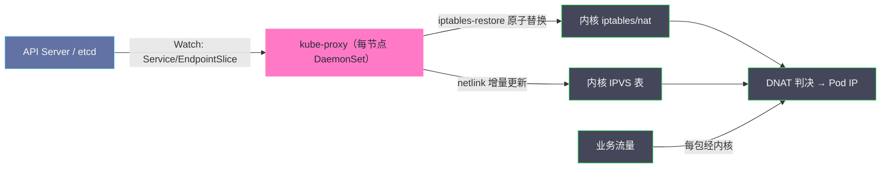
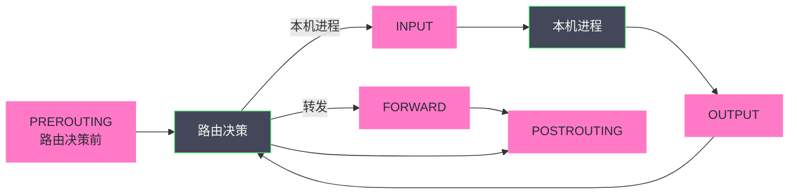
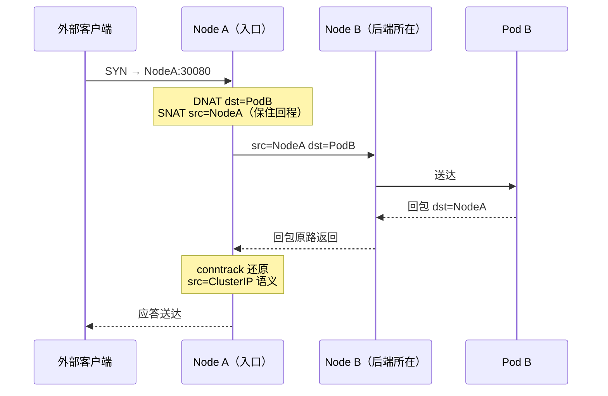
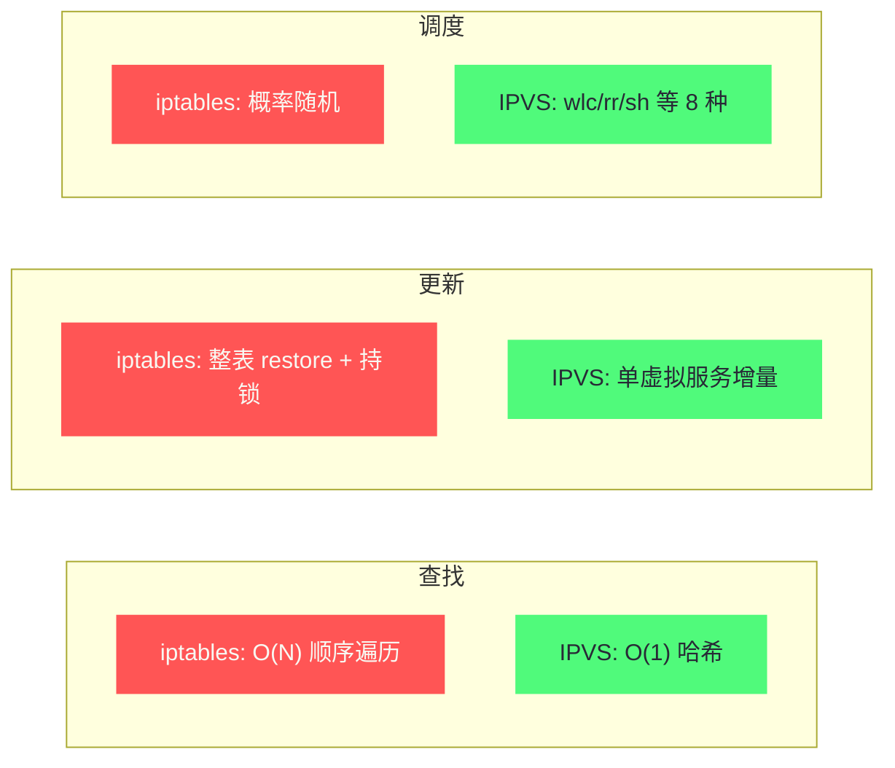

# Service底层实现——kube-proxy、iptables与IPVS

**摘要：**

`curl http://my-service` 能通、`ping my-service` 却超时——几乎每个 Kubernetes 使用者的第一课都从这个悖论开始，而悖论的答案藏着整个 Service 的设计哲学：ClusterIP 是一个不存在于任何网卡上的虚拟地址，它只在 iptables 规则里"被引用"，在 conntrack 表里"被记住"。本文沿着"一个 SYN 包如何从 ClusterIP 走到真实 Pod"这条主线，先回溯 kube-proxy 从用户态代理到 iptables 再到 IPVS 的三代演进，再把 KUBE-SERVICES/KUBE-SVC/KUBE-SEP 三级链与概率负载均衡拆到字节级，继而给常被忽略的 conntrack 连接跟踪一次正名，最后端出大规模集群下 EndpointSlice、IPVS 与 eBPF 三条突围路线，以及一条完整的排障决策树。读完全文，你应当能回答三个问题：Service 为什么只能是"幻 IP"、iptables 模型在哪个规模开始崩、以及"偶发超时"在生产环境里究竟是谁的锅。

---

## 第 1 章 一个并不存在的 IP：Service 抽象的由来

### 1.1 Pod 易变与服务入口的两难

回到 2014-2015 年 Kubernetes 的设计起点：Pod 被明确定义为易失品——节点故障、版本升级、资源压力都会让它原地销毁重建，每次重建都会换一个新 IP。可是微服务的调用方需要一个稳定的调用目标：前端不能每次后端重建就重新发现 IP，更不能在自己的代码里维护健康检查与客户端负载均衡——那是把基础设施复杂度摊派给每个应用。

一个天真的反问是"为什么不让客户端直接查 apiserver 拿 Pod IP 列表"——这恰是后来 Headless Service 与客户端负载均衡的方向，但它把三个问题原样退回给了应用：变更订阅的实时性（客户端要自己 Watch）、健康剔除（客户端要懂 readiness）、以及多语言栈重复实现（每种语言一份 SDK）。Kubernetes 的选择是让集群替所有客户端统一回答这个问题——用一次性的内核规则成本，换掉每应用一份的发现逻辑。

Service 给出的答案在今天看来理所当然、在当时却是关键一跃：**为服务提供一个稳定的虚拟入口，让"入口存在"与"后端是谁"彻底解耦**。一个固定的 ClusterIP（及对应的 DNS 名）作为服务的法定地址，后端的 Pod 可以任意生灭，入口纹丝不动。这个抽象之所以成立，是因为 Kubernetes 选择了一条看似偷懒、实则精明的实现路线——不为 ClusterIP 创建任何实体：没有进程监听它，没有网卡绑定它，它只是一个写在 netfilter 规则里的匹配条件，一个被所有节点共同认账的"约定地址"。

值得对照的是同时代的另一条路线：客户端负载均衡。Dubbo 用注册中心 + 客户端 SDK，Netflix 用 Eureka + Ribbon，都把"发现后端、选择后端"的责任放进了应用进程内——好处是少一跳转发、能做应用语义的路由，代价是每个语言栈都要维护一套 SDK、控制逻辑与业务进程同生共死。Kubernetes 的判断是基础设施化的：发现与均衡不该是应用的职责，哪怕为此在内核里多写几万条规则。这个判断的遗产至今仍在——到了服务网格专栏你会看到，Sidecar 模型正是把这条思路又往应用侧推回了一步：不再往内核写规则，而是每个 Pod 旁挂一个代理。架构的钟摆从来如此，在"下沉到基础设施"与"贴近应用语义"之间往复。

### 1.2 四种 Service 形态：一张语义光谱

| 类型 | 访问面 | 实现机制 | 本质 |
| :--- | :--- | :--- | :--- |
| **ClusterIP** | 集群内 | DNAT 规则（iptables/IPVS/eBPF） | 纯虚拟 IP |
| **NodePort** | 集群外 | ClusterIP + 每节点固定端口 | 带节点入口的 ClusterIP |
| **LoadBalancer** | 集群外 | NodePort + 云厂商 LB | 外包入口的 NodePort |
| **ExternalName** | 集群内 | 仅一条 DNS CNAME | 不代理任何流量 |

四种类型呈嵌套关系：LoadBalancer 包含 NodePort，NodePort 包含 ClusterIP。理解了这个同心圆，就不难解释为什么 ExternalName 与其他三类格格不入——它根本不在转发体系里，只是 CoreDNS 返回的一个别名记录。

这个嵌套关系还有个实用推论：任何 LoadBalancer Service 都自动带着一个可用的 NodePort 和一个可用的 ClusterIP——你可以从集群内、节点 IP、云 LB 三条路径分别访问同一个后端集合。生产排障时"三条路径各自通不通"是定位故障域的快速切分法：ClusterIP 通而 NodePort 不通，问题在节点入向规则；NodePort 通而 LB 不通，问题在云厂商那层。

一个最小 ClusterIP Service 的样子值得扫一眼，后面所有机制都在为这几个字段服务：

```yaml
apiVersion: v1
kind: Service
metadata:
  name: web
spec:
  selector: {app: web}          # 选择器：哪些 Pod 是后端
  ports:
  - {port: 80, targetPort: 8080} # ClusterIP:80 → Pod:8080
```

`selector` 决定了 EndpointSlice 由谁填充，`ports` 的 port/targetPort 分离定义了"入口端口号"与"后端实际端口"的映射。这两个字段的所有组合，就是 kube-proxy 每夜要翻译成内核规则的全部原材料。

还有一层分工值得现在就记住：**Service 层与 CNI 层是垂直叠加的两个平面**。CNI（Flannel/Calico/Cilium）负责让 Pod IP 可达，kube-proxy 负责让 ClusterIP 可达——前者管"去哪"，后者管"先改成去哪"。DNAT 把目标从 ClusterIP 改成 Pod IP 之后，接下来的传输依然是 CNI 的活；这意味着"Service 通不通"与"CNI 通不通"是两个可独立证伪的命题，第 7 章的排障树正是按这个分层来砍的。

由此也衍生一条重要的边界意识：**ClusterIP 只在集群内有意义**。集群外的世界不认识 `10.96.x.x` 这个地址——它既不会被路由、也没有对应的网卡、更没有"离开集群"的路径；Service 的可及范围以"报文能碰到某台节点上写过这条规则的内核"为限。这就是为什么出集群必须走 NodePort/LoadBalancer/Ingress 的显式入口——虚拟地址的作用域从来是被规则的书写位置界定的。

### 1.3 ping 不通的课：ClusterIP 的虚拟性

`curl http://10.96.100.1:80` 通、`ping 10.96.100.1` 不通——这个组合是 Kubernetes 新人几乎人手一份的"第一个坑"。原理一句话：**kube-proxy 生成的 DNAT 规则只匹配 TCP/UDP（`-p tcp`/`--dport`），ICMP 报文根本不会被改写**。于是 ICMP 包顺着路由表走向一个没有任何接口认领的地址，在路由决策处无声消失。这个"能连不能 ping"的现象不是 Bug，而是 ClusterIP 虚拟性的直接推论——它只存在于"DNAT 匹配条件"这个语境里，不是一个能被 ping 达的网络实体。

### 1.4 Headless Service：把"均衡"还给你的后门

Service 还有第五种不太起眼却极其重要的形态——`clusterIP: None` 的 **Headless Service**。它放弃虚拟入口：不为服务分配 ClusterIP，kube-proxy 也不为它写任何 DNAT 规则，CoreDNS 对服务名的解析直接返回**所有后端 Pod 的 IP 列表**。发现归发现、转发归转发——StatefulSet 正是靠它拿到 `pod-0.svc` 这种稳定的逐实例 DNS 名（用于 Kafka broker 序号、数据库主从这些必须"指名道姓"的场景），而那些自己做客户端负载均衡的框架（gRPC 的 `dns:///` resolver 是典型）也靠它绕开连接级均衡拿到逐请求分发的能力。Headless 是这个体系里诚实的逃生舱：当"基础设施替你均衡"的假设不成立时，它把选择权原样交还。

Headless 还揭示了一个常被忽略的语义事实：**ClusterIP 的"稳定入口"承诺本身也是一笔交易**。你得到的是"一个永远不变的地址"，失去的是"对后端选择的控制"——你不能指定某个 Pod、不能按权重分流、不能感知每个后端的负载差异。Headless 把这些自由原样退回，代价是重新把"选哪个后端"的责任放回客户端——这是一切 L7 负载均衡（gRPC 客户端 LB、服务网格）得以存在的逻辑空间。

> [!info] 核心概念
> ClusterIP 是 Kubernetes 网络设计里"声明先于实体"的范例：你声明了一个地址，集群里所有节点就"认"这个地址——不是因为哪里真的有一台设备应答，而是因为每台节点的内核里都写着同一条规则："看到这个地址的包，请改投给这些后端"。虚拟化在网络领域的精髓正在于此：实体不存在，契约成立。

---

## 第 2 章 kube-proxy：一个不转发流量的"代理"

### 2.1 名字里的误会

kube-proxy 的名字是它历史上最大的冤案——它根本不是一个代理。它不在任何流量的数据路径上，不终结 TCP，不读报文内容；它只是一台跑在每个节点上的 DaemonSet，职责是 **Watch apiserver 上 Service 与 EndpointSlice 的变化，把变化翻译成本节点内核中的转发规则**。真正的转发发生在内核里：iptables 的 DNAT、IPVS 的虚拟服务、或 Cilium 的 eBPF 程序。kube-proxy 进程即使崩溃，已写入的规则照常工作——只是 Service 世界的新变化再无人翻译。

它还有一份不那么显眼的兼职：`healthCheckNodePort` 的应答方。LoadBalancer 类 Service 在 `externalTrafficPolicy: Local` 下靠这个端口报告"本节点是否有活的后端"，云 LB 据此决定流量该打向谁——这是 kube-proxy 唯一一个真的在监听的端口，也是"它不做数据面"这件事的唯一例外。

### 2.2 三代模式的演进史

kube-proxy 的历史是一部"把代理逐出数据面"的历史：

- **userspace 模式（史前）**：kube-proxy 真的在用户态监听端口、终结连接、再转发到后端——iptables 只负责把 ClusterIP 流量 DNAT 到 kube-proxy 自己监听的端口，由这个进程里的 Go 代码读完报文、选出后端、再新建一条到后端的连接。每条连接四次用户态↔内核态往返、两份 socket 缓冲，性能惨不忍睹，是 Kubernetes 1.2 之前的默认。它的存在意义是为"service 需要一个入口"提供了最早的占位答案，一旦 iptables 模式成熟便退场——今天的任何新集群都不再需要它，但理解它有助于看清"代理"二字的祛魅过程，也为"为什么每一代都在把转发往内核里塞"这个问题提供了最直观的反面教材；
- **iptables 模式（默认至今）**：kube-proxy 退居控制面，数据面交给内核 netfilter 的 DNAT 规则，转发在协议栈内完成，零上下文切换——"代理"从此只剩名字，而 iptables 也从此成了 Kubernetes 网络的事实基础设施；
- **ipvs 模式**：数据面换成内核 IPVS 哈希表，调度算法更丰富，面向 Service 规模上千的集群；
- **nftables 模式（新）**：Kubernetes 1.29 起 kube-proxy 增加 nftables 后端，用 nftables 的集合（set）与映射（map）数据结构取代线性链——`vip:port → backend` 写成一次 map 查表而非逐条规则匹配，更新粒度也随之细化到集合成员级。这是 iptables 模型在自己的继任者身上完成的自我修正，也是对 Cilium 式"查表而非过链"路线的官方靠拢；
- **干脆不用 kube-proxy**：Cilium 的 `kubeProxyReplacement` 让 eBPF 接管整个 Service 数据面，第 5 篇已详述。

每一代的驱动力相同：**让转发这件事留在内核、留在数据结构上、留在最小的开销处**。从用户态代理到 eBPF 的这条演进线，就是本专栏前五篇反复出现的那句话——把热路径交给内核，把声明交给控制面。

三代同堂的格局也给排障带来一个前提动作：动手查规则前，先确认本集群的 kube-proxy 跑在哪个模式——`kubectl logs -n kube-system kube-proxy-xxx | grep "Using"` 启动日志会直接写明，别把 IPVS 集群当 iptables 集群查。

### 2.3 Watch、翻译与批量提交

先看一张全景图，再逐段拆：



kube-proxy 与 apiserver 之间是 HTTP/2 长连接 Watch：Service/EndpointSlice 的每一次变更被推送到每个节点的 kube-proxy，后者在内存里重算本节点的目标规则集，积累一个同步周期内的全部变更，最后用 `iptables-restore` 一次性原子替换。

批量提交不是洁癖而是必需品：iptables 的规则修改需要持有内核 `xt` 大锁，单条 `-A`/`-D` 操作的常数成本在大规则集下可观；而把"先 dump、改完、再 restore"攒成一个事务，既保证中途不出半成品状态，又把锁持有次数压到每周期一次。这个模式你在第 4 篇 Felix 身上已经见过一次——优秀的网络控制面殊途同归。

同步节奏由 `--iptables-sync-period`（默认 30 秒）控制下限，Watch 事件驱动上限：高频变更会被攒批到下一个周期边界统一提交。这个"周期 + 事件"的双触发模型意味着 Service 变更到规则生效之间存在一个有界的传播窗口——它通常以百毫秒计，但在大集群里可以拖长到秒级，这是后文"滚动更新竞态"的物理根源之一。

实现层面还有一个 informer 的机制值得知道：kube-proxy 并不直连 apiserver 长轮询，而是用 client-go 的 SharedInformer 维护本地缓存——apiserver 只推增量，本地缓存做去重与重同步兜底，即使 Watch 中断重连也能从 `resourceVersion` 续传。这套"远端只推变化、本地维护全量"的 informer 模式是整个 Kubernetes 控制面的事实标准，kube-proxy 只是其中一个消费者。

值得顺带看清这条数据流的方向性：kube-proxy 是**纯消费者**——它从不向 apiserver 回写任何状态，也不参与任何共识；它只是把 apiserver 里的声明尽力投射成本节点的内核事实。这种"单向投影"的架构让它可以随便死、随便重启、随便慢一拍——恢复后重新 Watch 全量再校一遍，状态自然收敛。这与第 4 篇 Felix、第 5 篇 cilium-agent 的角色在哲学上完全一致：**所有 CNI 数据面的控制面，本质都是"声明到内核事实"的投影仪**——区别只在投影用的是 iptables 规则、BGP 路由还是 BPF Map。

---

## 第 3 章 iptables 模式：把 DNAT 写成一张三级链表

### 3.1 Netfilter 的五个挂载点

理解 kube-proxy 规则前，先回到它的宿主。Netfilter 是 Linux 内核在协议栈上预设的五个钩子——每个报文在旅途中的五个关键站点都会被各张"规则表"过一遍。iptables 的"表"是按职责分的维度：`filter` 管放行/拒绝，`nat` 管地址转换，`mangle` 管报文修改，`raw` 管绕过 conntrack——kube-proxy 的业务几乎全在 `nat` 表，但 Calico 的策略规则（第 4 篇）住在 `filter`/`mangle`，两张表在同一挂载点上先后经手同一个报文。



kube-proxy 的全部规则都写在 **nat 表**上——`PREROUTING`（外部/转发流量入栈第一关）与 `OUTPUT`（本机进程出栈）上各插一条跳板指向自建链，报文在离开前的 `POSTROUTING` 还可能被 SNAT。

### 3.2 三级链：入口、服务、端点

kube-proxy 的 nat 规则体系是一个三级跳转结构：

```text
PREROUTING / OUTPUT
  └─ -j KUBE-SERVICES               （所有 Service 的统一入口）

KUBE-SERVICES
  ├─ -d 10.96.100.1 -p tcp --dport 80 -j KUBE-SVC-XXXX   ← 每个 Service 一条
  ├─ -d 10.96.200.2 -p tcp --dport 443 -j KUBE-SVC-YYYY
  └─ -j KUBE-NODEPORTS              （NodePort 端口兜底）

KUBE-SVC-XXXX（一个 Service 的负载均衡链）
  ├─ -m statistic --mode random --probability 0.3333 -j KUBE-SEP-AAA
  ├─ -m statistic --mode random --probability 0.5000 -j KUBE-SEP-BBB
  └─ -j KUBE-SEP-CCC                （无概率=兜底）

KUBE-SEP-AAA（一个 Endpoint 的实际 DNAT）
  ├─ -s 10.244.0.5 -j KUBE-MARK-MASQ   ← 防止发给自己（hairpin）
  └─ -j DNAT --to-destination 10.244.0.5:8080
```

每一级各司其职：KUBE-SERVICES 负责"这是不是某个 Service 的流量"，KUBE-SVC-* 负责"这个 Service 选哪个后端"，KUBE-SEP-* 负责"目标改成这个后端，顺便处理自环"。分层让规则有归属，但也让规则数随 Service×Endpoint 线性膨胀——这是后文性能讨论的伏笔。

在真实节点上 `iptables-save -t nat` 出来的样子，与上面的示意只有噪声上的差别：

```text
-A KUBE-SERVICES -d 10.96.100.1/32 -p tcp -m comment --comment "default/web:http cluster IP" -m tcp --dport 80 -j KUBE-SVC-4N5TFS6S2PZO7QKR
-A KUBE-SVC-4N5TFS6S2PZO7QKR -m comment --comment "default/web:http" -m statistic --mode random --probability 0.33333333349 -j KUBE-SEP-AAAA...
-A KUBE-SVC-4N5TFS6S2PZO7QKR -m comment --comment "default/web:http" -m statistic --mode random --probability 0.50000000000 -j KUBE-SEP-BBBB...
-A KUBE-SVC-4N5TFS6S2PZO7QKR -m comment --comment "default/web:http" -j KUBE-SEP-CCCC...
-A KUBE-SEP-AAAA... -s 10.244.0.5/32 -m comment --comment "default/web:http" -j KUBE-MARK-MASQ
-A KUBE-SEP-AAAA... -p tcp -m comment --comment "default/web:http" -m tcp -j DNAT --to-destination 10.244.0.5:8080
```

规则名里的哈希后缀来自 Service 名与端口的确定性散列——同名 Service 在所有节点上得到同样的链名，这让跨节点的 `iptables-save | grep` 比对成为可能。`-m comment` 注释则是排障时的路标：规则会告诉你它服务于谁，而不是只留下一串神秘哈希。

### 3.3 概率均衡：一场数学上的把戏

iptables 没有原生的"随机三分"指令，kube-proxy 用 `statistic` 模块把均等负载均衡折成了一组递推概率：若有 N 个后端，第 i 条规则的概率是 `1/(N-i+1)`——第一条 1/3、第二条在剩余 2/3 中取 1/2、最后一条兜底。展开后每个后端恰好分到 1/N。

这个递推结构的数学直觉值得单独停留：每条规则要"从剩余流量中拿走自己的 1/N"，所以概率必须随位置递进——第 i 条面对的不是总流量的 1/N，而是剩余流量的 1/(N-i+1)。把这个结构读出来后，你就能立刻识别任何一组"看似随意"的概率数字背后的语义——它们不是后端权重，而是"条件概率链"。

这个设计有两层值得记住的性质。其一是**规则顺序敏感**：概率是相对"走到这条规则时剩余流量"而言的，任何一条后端增删都会导致整条 KUBE-SVC 链的概率重算重排——增量变更在数学上不成立，只能整链重建。其二是**它均衡的是连接而非流量**：DNAT 只在连接建立时执行一次，之后整条连接的报文都由 conntrack 锁定到已选后端——于是 HTTP keep-alive 与 gRPC 长连接会让一个客户端的全部请求钉死在同一 Pod 上，"负载均衡"在长连接语义下名存实亡。

三级链之外还有两条容易忽略的辅助规则值得点名。其一是 KUBE-SEP 链首的 `-s <PodIP> -j KUBE-MARK-MASQ`——当 Pod 访问自己所在的 Service 又被选中自己时（hairpin），回包若原样返回会因路径不对称被 TCP 栈丢弃，提前打标 MASQUERADE 把源改成节点 IP 以强制回程过同一节点。其二是 filter 表的 `KUBE-FORWARD` 链——DNAT 后的报文要经 FORWARD 转发，Kubernetes 早期版本依赖默认 ACCEPT，严格化之后由它显式放行 DNAT 流量；NetworkPolicy 类 CNI 的 filter 规则也常挂在同一段路径上，Service 转发与策略过滤在此交汇。

### 3.4 一次 ClusterIP 访问的完整旅程

Pod A（`10.244.0.2`）在 Node A 上访问 Service `10.96.100.1:80`（后端 Pod B `10.244.1.3:8080` 在 Node B）：

```text
1. Pod A 发包 src=10.244.0.2:12345 dst=10.96.100.1:80
2. 经 veth 入 Node A 网络栈 → nat PREROUTING → KUBE-SERVICES
3. 命中 -d 10.96.100.1 --dport 80 → KUBE-SVC-XXXX
4. 概率跳转 → KUBE-SEP-AAA → DNAT dst=10.244.1.3:8080
   conntrack 记录：这条连接的 DNAT 结论存档
5. 路由决策：dst 属 Node B 的 PodCIDR → 走 CNI 数据面（VXLAN/BGP）
6. Node B 收包 → 转发给 Pod B（报文已是 src=A dst=B）
7. Pod B 回包 src=10.244.1.3:8080 dst=10.244.0.2:12345
8. 回包经 Node A 时 conntrack 命中记录
   → 反向 DNAT：src 还原为 10.96.100.1:80
9. Pod A 收到：回包源与请求目标一致，连接正常
```

两个细节是整个机制的灵魂。其一，**DNAT 只发生在首包**：conntrack 在第 4 步把结论存档后，本连接后续每个报文查表即知去向，不再重跑 KUBE-* 链——连接级判决、报文级执行。其二，**回包必须回到执行 DNAT 的同一节点**才能被还原成 ClusterIP——这条约束在 NodePort 跨节点场景里直接催生了 MASQUERADE 规则，也是 `externalTrafficPolicy` 取舍的由来。

这条路径上还有一个值得记住的观察点：第 5 步"DNAT 后交给 CNI 路由"意味着 **Service 层与 CNI 层是严格串行的两次判决**——kube-proxy 的规则负责"把目标从 ClusterIP 翻成 Pod IP"，Flannel/Calico/Cilium 的数据面负责"把 Pod IP 送到对端节点"。前者在 nat 表/哈希表里发生，后者在 VXLAN/BGP/eBPF 里发生，两层各自失败各自排——这就是为什么排查"Service 不通"时必须把"直接 curl Pod IP"当作分水岭动作的原因。

还有一条路径常被问起：**本机进程访问 ClusterIP 走的不是 PREROUTING，而是 OUTPUT**——本机发出的报文不经"入栈第一关"，kube-proxy 因此在 OUTPUT 上挂了同样的 KUBE-SERVICES 跳板。这也是为什么节点上 `kubectl` 调试流量、`node-exporter` 抓取服务这类本机流量同样能被 Service 转发接管的原因。

### 3.5 NodePort：把入口钉到每个节点

NodePort 在每个节点打开 30000-32767 范围内的同一端口（`--service-node-port-range` 可调），外部流量打到任何节点的该端口都会进入 Service 的负载均衡。规则上它只是多了一条 `KUBE-NODEPORTS` 链把"节点 IP:NodePort"跳转到 KUBE-SVC-*，但真正的门道在回包路径：若选中的后端不在本节点，报文要在 `POSTROUTING` 被 MASQUERADE 成入口节点 IP，否则回包绕过入口节点、反向 NAT 无处还原——**为保住回包路径，源 IP 被改没了**。

端口范围本身是个值得留意的配额：默认 2768 个端口中，每个 NodePort 服务要在所有节点上独占一个，且这些端口实际被 kube-proxy 的 iptables 规则"认领"而非被进程监听——`ss -tlnp` 看不到它，`netstat` 亦然，但端口确实已被占用。与宿主机自身服务（如 Node.js 应用、数据库）的端口规划冲突时，要么缩范围、要么换宿主机端口，这是集群规划里容易被遗漏的一项。

这正是 `externalTrafficPolicy: Local` 存在的理由：设成 Local 后，kube-proxy 只为"本节点有后端"的 Service 保留 NodePort 规则，流量不再跨节点转发、不再 SNAT，Pod 能看到真实客户端 IP。代价同样直白——没有本机后端的节点上这个 NodePort 直接拒绝连接，外部负载均衡器必须靠健康检查把流量只打到有后端的节点，否则部分入口会黑洞化。为此 Service 还专门暴露了 `healthCheckNodePort` 字段——kube-proxy 在每个节点监听该端口应答健康检查，节点有本 Service 的健康后端才返回 200，云 LB 据此精确选路。LoadBalancer 类型再往上叠一层云厂商 LB，语义上只是把"谁来决定打向哪个节点"外包了出去，NodePort 的本质未变；而 ExternalName 则干脆不进入转发体系，只在 CoreDNS 里种一条 CNAME——适合"集群内统一用 `db.svc` 这个名字，实际指向外部 RDS"的解耦场景。

> [!note] 客户端 IP 的三层存活方式
> "保住源 IP"这件事在 Service 语境里有三档答案：`Cluster` 策略下源 IP 必然被 SNAT 抹掉（最早的路径即最模糊的身份）；`Local` 策略保住了它但牺牲了均衡半径；而 DSR（第 5 篇 Cilium 的方案）与 Proxy Protocol（云 LB 把客户端 IP 塞进连接头）则是"又要路径优、又要身份真"的两条高级路。每层解法都在为上一层的某个性质付费——这几乎可以作为"分布式系统里没有免费的透明性"的样本案例。

把 NodePort 的跨节点路径画出来会更清楚 MASQUERADE 为何非此不可：



注意第 2 步的 SNAT：若不做它，回包会从 Node B 直奔客户端，客户端看到的回包源是 Pod B 而非它请求过的 NodeA:30080，TCP 握手直接失败——MASQUERADE 是"对称回程"的保证金。

### 3.6 这个模型的天花板在哪

iptables 模式的两处结构性短板在第 5 篇已从 eBPF 视角对照过，这里从它自身说起——它们的共同根源都是同一个事实：iptables 的规则模型是"链表 + 逐条匹配"，它从 1998 年的防火墙时代走来，从未为一个"几千个虚 IP、每秒都在变"的场景设计过。

- **查找是线性的**：KUBE-SERVICES 里每个 Service 一条规则，万级 Service 意味着每个首包平均遍历数千条规则——且 iptables 规则匹配要逐条执行 match 模块与 target 判定，每条的常数开销并不微小；
- **更新是整表的**：任何 Endpoint 变化都要 `iptables-restore` 全量替换，万级规则下单次提交可达秒级，期间持锁阻塞新的规则操作——高频滚动更新时段，这个"秒级抖动"会与 `iptables-sync-period` 叠加，形成可观的规则生效延迟；
- **能力是受限的**：概率随机之外没有调度算法可言，会话保持要靠 `recent` 模块打补丁，按权重、按最少连接、按一致性哈希一概欠奉。

还有一处不那么显眼但同样真实的成本——**规则集本身就是内存与 cache 的负担**：数万条规则占用内核内存、撑爆 dmesg 与 `iptables-save` 的输出长度，排查时一次 `iptables -L` 可以刷出几十万行。中小集群里这些都不成问题——数百 Service 的规则集毫秒级遍历，更新抖动业务无感。天花板在"Service 数量与 Endpoint 变更频率"两个维度同时拉大时才真正碰到。

---

## 第 4 章 conntrack：隐形的连接状态机器

### 4.1 DNAT 之后的账本

所有 NAT 方案都有一个共同的会计问题：改写只在去程发生一次，回包怎么知道该改回来？Netfilter 的答案是 **conntrack（连接跟踪）**——内核为每条流（含 UDP 伪流）维护一条记录，里面记着原始四元组、应答四元组、连接状态（NEW/ESTABLISHED/RELATED/INVALID 等）与 NAT 改写结论。报文入栈先查 conntrack：命中即按存档处理，未命中才走规则链。这就是为什么"DNAT 是连接级的"——规则只在建流那一刻被咨询，之后一切听账本的。

这几个状态的语义值得记住：`NEW` 是单向首包（只有去程见过），`ESTABLISHED` 是双向已确认，`RELATED` 是与既有连接相关的衍生流（FTP 数据通道的经典用法），`INVALID` 则是"无法归入任何已知流"的报文——后者在某些内核版本上会被默认丢弃，是"明明规则都对了但还是丢包"的一个隐角落。conntrack 同时是 NAT 的状态库与防火墙的流状态库——这解释了为何关掉 conntrack（`raw` 表 `-j NOTRACK`）能省内存却会让 NAT 一并失效：两者共用同一本账。

账本条目是有生命周期的：TCP 连接在 FIN/RST 后进入 TIME_WAIT 倒计时清理，UDP"伪流"则纯靠超时过期（默认 180 秒，无流量的"流"就此消失）；条目数量有上限 `nf_conntrack_max`，大小与内存挂钩。每一条都是内核态的常驻状态——这也是 eBPF 版 Service 同样要维护 conntrack Map 的原因：连接跟踪不是 iptables 的私产，而是所有 NAT 数据面绕不开的宿命。

一条真实记录长这样：

```text
tcp 6 431999 ESTABLISHED src=10.244.0.2 dst=10.96.100.1 sport=52344 dport=80
    src=10.244.1.3 dst=10.244.0.2 sport=8080 dport=52344 [ASSURED] mark=0 use=1
```

前半是去程原样（客户端视角），后半是应答改写（服务端视角）——conntrack 把"双向四元组各是什么"一次性记全，后续报文正反两向都按此对号入座。`431999` 是这条 TCP 连接的剩余超时秒数，`[ASSURED]` 标记表示双向都已见包、条目不会轻易被回收——读懂这行字，你就能解释 90% 的"回包丢了"类故障。

### 4.2 conntrack 带来的生产效应

这本账不是免费的，它的代价以三种典型方式现身：

- **表满丢包**：`nf_conntrack_max` 耗尽时新连接直接被丢（dmesg 里 `table full, dropping packet`），高并发短连接集群里这是常客——每条 DNS 查询、每次健康检查、每个短 HTTP 请求都各占一个名额，且 UDP 条目默认存活 180 秒，"短命流"的累计速度远比直觉快；应对除了调大 `nf_conntrack_max`（`sysctl -w net.netfilter.nf_conntrack_max=...`），还可以按需调小 UDP 流的 `nf_conntrack_udp_timeout` 并配合 NodeLocal DNSCache（第 7 篇）从源头削减 DNS 流条目；
- **UDP 幽灵流**：UDP 没有连接终止信号，conntrack 条目只能靠超时过期；CoreDNS 的每两次查询（A 与 AAAA）各留一条 180 秒的记录，一个万次/秒 DNS 的集群在峰值时表内躺着数百万条 DNS 残留——这是大规模集群 `nf_conntrack_max` 被打满的第一嫌疑犯；
- **滚动更新竞态**：Pod 收到 SIGTERM 的瞬间，EndpointSlice 里它还没被摘除，kube-proxy 的规则也还没重刷——此窗口内新连接仍会被 DNAT 到正在死亡的 Pod，于是有了"滚动更新期间零星 5xx"的经典悬案。

第三条的机理值得掰开：Pod 进入 Terminating 状态时 apiserver 立即把它从切片摘除，但摘除事件要经 Watch 推到每个节点、再攒进 kube-proxy 的下一个 sync 周期才能落成规则——在"已 SIGTERM 但规则未刷新"的窗口里，这个正在退出的 Pod 仍然是有权接收新连接的合法 DNAT 目标。应用若在收到 SIGTERM 后立刻拒绝新连接，窗口内的建连就会撞上 RST——这就是 `preStop sleep` 存在的物理理由：让"我已被摘除"的消息先传遍全网，再开始关门。

对应的标准配置写法：

```yaml
spec:
  template:
    spec:
      terminationGracePeriodSeconds: 60
      containers:
      - lifecycle:
          preStop:
            exec: {command: ["sleep", "5"]}   # 先等摘除消息传遍全网
```

`sleep 5` 的秒数不是经验主义的拍脑袋——它是对"EndpointSlice 摘除 + Watch 传播 + kube-proxy 攒批 + iptables-restore"这条链路总时延的一个保守兜底；大集群或高变更频率下可以按需加长。

> [!warning] 生产避坑
> 缓解滚动更新竞态的标准姿势是两段式：`preStop` 钩子里先 `sleep` 几秒（让 EndpointSlice 摘除与规则刷新的消息跑赢 SIGTERM），再配合理的 `terminationGracePeriodSeconds` 让存量连接排空。这条口诀几乎每个线上集群都要用到一次。

### 4.3 Session Affinity：给账本加一条偏好

默认的"每连接随机"对有状态应用不友好——存了会话的 Pod 希望同一客户端一直来找自己。开启方式一行字段：

```yaml
spec:
  sessionAffinity: ClientIP
  sessionAffinityConfig:
    clientIP: {timeoutSeconds: 10800}
```

`sessionAffinity: ClientIP` 在 iptables 模式下用 `recent` 模块实现：命中过某 KUBE-SEP 的源 IP 在超时窗口内被路由回同一后端。它本质上是"按客户端身份锁定 DNAT 结论"，实现了粘性但也放大了不均——某个大客户的长会话会把流量集中到单一后端。IPVS 侧则由 `sh`（源地址哈希）调度算法原生承担同一语义，只是实现从"查一张最近见过谁"换成了"源 IP 哈希到固定后端"，省掉的是一次表查询，留下的是同样的均衡隐患。

粘性的边界也该写清：它只保证"同一客户端 IP"的稳定，对 NAT 网关后共享出口 IP 的大量客户端（移动网络、企业 NAT）而言，粘性会退化成"半个互联网共用一个后端"——亲和不是均衡的替代品，而是它的局部豁免。

---

## 第 5 章 IPVS：内核里沉睡了二十年的负载均衡器

### 5.1 LVS 的来历

IPVS（IP Virtual Server）的来历比 Kubernetes 老得多：1998 年，章文嵩（后来的阿里云技术副总裁）发起 LVS 项目，目标是给 Linux 装上一个内核态四层负载均衡器——在那个硬件 LB 昂贵的年代，用普通服务器集群扛住门户网站的海量并发。IPVS 于 2004 年合入内核主线，此后二十多年一直在超大规模负载均衡场景服役，是淘宝双十一级别流量的老兵。

这段历史给 IPVS 模式一个独特的定性：它不是"为 Kubernetes 造的新轮子"，而是"把一个生产检验了二十年的内核能力重新启用"。LVS 的设计假设本来就是这个场景——海量连接、频繁后端变更、要求逐连接记状态——Kubernetes 的 Service 几乎是它原生工作负载的复刻。这也解释了为什么它对"Service 多、Endpoint 变"的组合拳有如此天然的抗性：它本来就是为此而生的。

它对 Service 场景的适配几乎是量身定做：虚拟服务表是哈希表而非链表，`VIP:Port → 后端集合` 的查找 O(1)；每个虚拟服务的后端增删是独立的增量操作，不存在整表重建；调度算法自带八种（rr/wrr/lc/wlc/sh/dh/sed/nq），kube-proxy 默认 **wlc**（加权最少连接）——比"连接级随机"更懂得把新连接发给此刻最闲的后端。内核里 IPVS 与 netfilter 的关系是协作而非替代：IPVS 在 LOCAL_IN 挂载点上接管目标为本机的报文，做自己的调度与 DNAT，然后再把报文交回协议栈走完剩下的路——它是在 netfilter 体系内加了一台"专用调度器"，而不是另立门户。

IPVS 原生支持三种转发模式：NAT（masq，双向改写）、DR（Direct Routing，只改 MAC、回包不经过 LB）与 TUN（隧道封装）。kube-proxy 选用的是最简单的 masq 模式——DNAT 改写目标地址后按路由转发，回包对称返回经同一节点做反向 NAT，与 iptables 模式的数据面语义完全等价；它没有用 DR 模式榨取"回包不绕行"的性能（那是第 5 篇 DSR 的事），所以 IPVS 模式的收益全部集中在**查找效率与更新粒度**上，而非转发路径的长短。这一点是常被误读的：IPVS 模式并不比 iptables 少一跳，它只是更快地决定要跳去哪。

### 5.2 IPVS 模式的三个机关

kube-proxy IPVS 模式比 iptables 模式多一个关键道具——**dummy 网卡 `kube-ipvs0`**。ClusterIP 在内核路由表里本无任何归属，报文会在路由决策处被丢弃；kube-proxy 把所有 ClusterIP 以 /32 绑到 `kube-ipvs0` 上，使内核认为"这是本机地址"，报文得以走到 INPUT 方向并被 IPVS 模块接管。这个"先认领地址再接管流量"的手法，与 Calico 的 `169.254.1.1` 代理 ARP 在精神上异曲同工——虚拟入口要成立，总得在内核某处给它落一个户口。

另一个常被混淆的事实是：IPVS 模式下 **iptables 并没有消失**。后端以 `-m`（Masq/NAT 模式）加入虚拟服务，报文被 DNAT 到 Pod IP；而 masquerade、NodePort 的端口认领、若干标记规则仍由 iptables 完成，只是 kube-proxy 会用 ipset（`KUBE-CLUSTER-IP`、`KUBE-NODE-PORT-TCP` 等集合）把规则数压到常数级——`iptables-save | wc -l` 在两种模式下可能差三个数量级，但绝不会是零。判断集群是不是 IPVS 模式，看 `ipvsadm -Ln` 有没有虚拟服务比数 iptables 规则更可靠。

切换动作本身一行命令就够，但请把它当变更管理对待：

```bash
# 1. 确认内核模块在位
lsmod | grep ip_vs   # 或 modprobe ip_vs ip_vs_rr ip_vs_wrr ip_vs_sh nf_conntrack

# 2. 修改 kube-proxy 配置
kubectl edit configmap kube-proxy -n kube-system
#   mode: "" → "ipvs"

# 3. 滚动重启
kubectl rollout restart daemonset kube-proxy -n kube-system

# 4. 验证
ipvsadm -Ln | head
ip addr show kube-ipvs0
```

切换瞬间会重建转发规则并打翻 conntrack——存量长连接会经历一次重连，低峰窗口操作是基本礼仪。

```bash
# 查看 IPVS 虚拟服务与后端
ipvsadm -Ln
# TCP  10.96.100.1:80 wlc
#   -> 10.244.0.5:8080   Masq   1   0   0
#   -> 10.244.0.6:8080   Masq   1   0   0
```

### 5.3 与 iptables 模式的对照



| 维度 | iptables | IPVS |
| :--- | :--- | :--- |
| Service 查找 | O(N) | O(1) |
| 变更粒度 | 整表替换 | 单虚拟服务增量 |
| 调度算法 | 概率随机 | wlc 等 8 种 |
| Session Affinity | recent 模块补丁 | sh 原生支持 |
| 调试直觉 | 规则直白 | 需懂 ipvsadm 与 dummy 网卡 |
| 规模拐点 | ~千级 Service 起吃紧 | 万级仍从容 |

公开基准的量级观感（不同环境数字浮动，只取方向）：iptables 模式下 Service 数从千到万，每连接建连延迟从亚毫秒爬升到几十毫秒、规则整表替换到秒级；IPVS 同规模下建连延迟稳定在亚毫秒、单服务更新毫秒级。两张表的差距不是"快多少"，而是"随规模如何变化"——O(N) 与 O(1) 的分水岭从来不在小数字上。

诚实的边界也该写在这里：IPVS 优化的是"Service 转发"这一段，iptables 的其余职责（masquerade、filter 链等）并未消失；当集群规模大到连 IPVS 的控制面同步都嫌重时，再往前一步就是第 5 篇的 eBPF——那已经不是"换一个内核模块"，而是"换一台执行引擎"。

还有一条 IPVS 模式的隐性成本需要计入：它把"Service 转发"的排障工具从 iptables 生态换到了 `ipvsadm`/`ipset`/`kube-ipvs0` 这一套——当团队中多数人只熟悉 iptables 的输出时，IPVS 模式会把"规则看没看对"从一目了然变成需要先理解"dummy 网卡 + 虚拟服务表"的两步翻译。这个工具链迁移成本在选型时经常被低估。

---

## 第 6 章 规模化的补丁：EndpointSlice 与拓扑感知

### 6.1 Endpoints 对象的大对象病

控制面也有自己的规模病。早期每个 Service 的所有后端挤在一个 `Endpoints` 对象里：一千个 Endpoint 就是几十 KB 的单体对象，任何一个 Pod 重启都要把这个庞然大物全量推送给每个 Watch 它的 kube-proxy——N 个节点 × M 次变更 = 全集群无谓的带宽与 CPU。问题不在数据量大，而在**变更粒度与传输粒度不匹配**：动一个 IP，传一千个。这个设计的后果在大型集群里非常具体：API Server 的出向带宽被 Endpoints 推送吃掉、每个 kube-proxy 的反序列化 CPU 被反复全量解析烧掉、etcd 的对象读写也随变更频率线性放大——Endpoints 曾经是大集群扩容路上最先撞到的那堵墙。

算一笔账：5000 Endpoint 的 Service、每秒 50 个 Pod 生灭、1000 节点——Endpoints 模型下每次变更推送一次全量对象（约几百 KB），每秒 50 次变更 × 1000 节点 = 每秒几十 GB 的 apiserver 出口带宽，还不含序列化与 Watch 维护的 CPU。这不是"优化空间"，这是"根本跑不动"。

### 6.2 分片解法与附带红利

EndpointSlice（1.17 引入、1.21 默认）把后端按最多 100 个一组切片存储：某 Endpoint 变化只更新并下发它所在的那一片。同样的服务、同样的变更频率，apiserver 与 kube-proxy 之间的传输量直接砍去一个数量级——一个只改"分配粒度"就兑现的优化。一个真实切片长这样：

```yaml
apiVersion: discovery.k8s.io/v1
kind: EndpointSlice
metadata:
  name: web-abc12
  labels:
    kubernetes.io/service-name: web   # 回链 Service
addressType: IPv4
endpoints:
- addresses: ["10.244.0.5"]
  conditions: {ready: true}
  nodeName: node-a
  zone: us-east-1a
  hints:
    forZones: [{name: "us-east-1a"}]  # 拓扑感知提示
ports:
- {name: http, port: 8080, protocol: TCP}
```

每片自带 `conditions.ready`（kube-proxy 据此过滤未就绪后端）、`nodeName`/`zone`/`hints`（拓扑信息）与 `ports` 映射——切片已经不是"Endpoints 的分片"，而是"带元数据的端点单元"。

附带的结构红利更持久：切片对象天然是挂扩展字段的地方。**Topology-aware Hints** 在每片端点上携带 `forZones` 提示，kube-proxy 据此优先选择同可用区后端——跨 AZ 流量的延迟与数据传输费因此有了官方的内生解法，而不必再靠外部拓扑路由的奇技淫巧。Hints 语义有个诚实的限定词：它是"在分布均衡的前提下尽量就近"，当各可用区后端比例严重失衡时控制器宁可放弃提示也要保住均衡——拓扑优化让位于负载公平，这是合理的优先级排序。

EndpointSlice 还有一处设计细节值得记取：它由独立的 EndpointSlice 控制器（而非 kubelet 或 kube-proxy）负责生成，对象带 `kubernetes.io/service-name` 标签回链 Service，`addressType` 字段让 IPv4/IPv6 双栈共存得以前置建模——分片不是终点，而是"把 Service 的成员关系变成一等 API 对象"的载体。

### 6.3 internalTrafficPolicy 的补位

`externalTrafficPolicy` 管外部流量，对称地，`internalTrafficPolicy`（1.26 起引入、随后毕业）开始管集群内流量：设为 `Local` 时只路由到本节点后端。它为"DaemonSet 型服务只处理本节点流量"这类拓扑约束提供了官方表述——譬如节点本地的日志收集 agent 以 Service 形式访问本节点的采集端点，避免无意义的跨节点绕行。这也让 Service 的流量路径治理语义第一次完整覆盖了内外两个方向。

这一对字段的对称性里藏着 Service 模型的一个成熟标记：**"流量从哪来"与"流量该去哪"被拆成了两个独立的策略轴**。外部流量的源 IP 保真、路径跳数、健康检查（`externalTrafficPolicy`）与内部流量的拓扑约束（`internalTrafficPolicy`）可以分别调优——这在云上是"外部流量过 LB、内部流量就近"这类生产诉求的直接落点。

一个容易被忽略的配套知识：`externalTrafficPolicy` 影响的是"进入集群后怎么走"，`internalTrafficPolicy` 影响的是"集群内部怎么选"，而 `ipFamilyPolicy`/`ipFamilies` 则决定 Service 在双栈集群里拿到几个地址族——三个字段共同构成了 Service 流量治理的完整控制面，它们之间没有重叠，但经常被混为一谈。

---

## 第 7 章 排障：Service 不通的决策树

Service 类故障的高明之处在于症状雷同、根因分散——同一个"连不通"可能出在六个不同层。一棵按"隔离变量"组织的决策树比背命令更有用：

```text
症状：访问 Service 不通/超时
├─ 先确认 DNS 解析正常（nslookup my-service，详见第 7 篇）
├─ kubectl get endpointslice -l kubernetes.io/service-name=X
│    ├─ 无切片/为空 → 选择器或 Pod 健康（控制面问题）
│    └─ 有健康端点 ↓
├─ 绕过 Service：直接 curl <PodIP:Port>
│    ├─ 不通 → 问题在 Pod 或 CNI（不是 Service 层）
│    └─ 通 ↓ 问题锁定在转发层
├─ 查本节点规则
│    ├─ iptables -t nat -L KUBE-SERVICES | grep <ClusterIP>
│    └─ ipvsadm -Ln | grep <ClusterIP>
│    ├─ 无规则 → kube-proxy 异常（看日志）
│    └─ 有规则 ↓
├─ conntrack -L | grep <ClusterIP> / 查表是否打满
│    └─ dmesg | grep "table full"
└─ 滚动更新零星失败 → preStop/优雅退出竞态
```

配套的几个高频根因：Endpoint 摘除与规则刷新的延迟差（滚动更新竞态）；conntrack 表满（高并发短连接）；`externalTrafficPolicy: Local` 下无本地后端的节点黑洞（外部 LB 健康检查未同步）；以及会话亲和导致的"负载均衡看起来失效"。

每一条根因都有对应的实证命令，排障时按图索骥：

```bash
# 端点是否就位
kubectl get endpointslice -n default -l kubernetes.io/service-name=my-service

# 本节点规则是否存在（iptables 模式）
iptables -t nat -L KUBE-SERVICES -n | grep <ClusterIP>

# 本节点规则是否存在（IPVS 模式）
ipvsadm -Ln | grep -A5 <ClusterIP>

# conntrack 是否打满
cat /proc/sys/net/netfilter/nf_conntrack_count
cat /proc/sys/net/netfilter/nf_conntrack_max
conntrack -L | grep <ClusterIP>

# 绕过 Service 直连 Pod（隔离 Service 层）
kubectl exec -it test-pod -- curl http://<PodIP>:<Port>/healthz
```

排障的本质是逐层证伪——Service 层清白了再怀疑 CNI，转发规则在位了再怀疑 conntrack，顺序不能反。还有一类不在此表中的干扰项值得记住：NetworkPolicy——策略把流量在转发路径上拦下时，从 Service 视角看与"后端不通"几乎无法区分，查排障树之前先问一句"最近有没有上策略"往往能省半小时。

最后补两条"症状诡异但根因平凡"的排障案底，都是线上真实高频事件：

- **某节点上 Service 全部不通，其他节点正常**——本节点 kube-proxy 挂了或卡了（`kubectl logs` 看 panic/oom，DaemonSet 该 Pod 重启即可），与"网络坏"无关；
- **访问某 Service 偶发连接到已下线的 Pod**——EndpointSlice 已摘除但本节点 conntrack 里该连接的 DNAT 结论仍有效（既有连接不受规则删除影响），这是"规则改了但老连接还活着"的 conntrack 黏性，对短连接无影响、对长连接需要 `conntrack -D` 或重启客户端兜底。

### 7.1 一张最小排障清单

把上面收敛成日常操作版：

| 检查项 | 命令 | 期待 |
| :--- | :--- | :--- |
| Service 存在 | `kubectl get svc` | ClusterIP 与端口正确 |
| 端点就位 | `kubectl get endpointslice -l kubernetes.io/service-name=X` | 至少一条 ready: true |
| 本节点规则（iptables） | `iptables -t nat -L KUBE-SERVICES \| grep <IP>` | 有命中链 |
| 本节点规则（IPVS） | `ipvsadm -Ln \| grep <IP>` | 有虚拟服务 |
| conntrack 余量 | `cat /proc/sys/net/netfilter/nf_conntrack_{count,max}` | count 远低于 max |
| 直连后端 | `kubectl exec -- curl <PodIP>:<Port>` | 通则 Service 层问题 |

这份清单的隐含前提值得点明：它假定你已确认流量确实走到了 Service 层——也就是 DNS 解析已返回 ClusterIP、客户端确实在打这个地址。大量"Service 不通"的工单最后的根因其实在更上游：`nslookup my-service` 解析失败（CoreDNS 问题，下一篇的主角）、NetworkPolicy 静默丢弃、或者应用根本没在用它以为的那个名字。排查永远从"流量是否真的到达了这一层"开始，而不是从"这一层出了什么错"开始。

---

## 第 8 章 边界与演进：三代同堂之后

### 8.1 三个数据面的各自地盘

至此 Service 的实现谱系完整：iptables 是默认且普适的存量，IPVS 是规模化的官方答案，eBPF 是范式跃迁的下一代——而 nftables 后端则是 iptables 模型在其继任者身上的保守演进。四者不是"新旧替代"关系，而是**不同规模、不同内核条件、不同团队能力下的并存选项**：数百 Service 的小集群用 iptables 心安理得，数千规模上 IPVS 性价比最高，万级规模或内核够新时 Cilium 给出代差级回报。

选型的量级参考（公开基准与生产经验的共识区间，非合同条款）：Service 数在数百量级时三种模式的可感知差异几乎为零；过千后 iptables 的规则遍历与更新抖动开始显现；五千以上 kube-proxy 的 iptables 模式已是明显的运维负担，IPVS 或 eBPF 成为必选项而非优化项。切换本身的成本也应计入——模式变更要求 kube-proxy 滚动重启，存量连接会因 conntrack 失效而中断重连，生产集群请挑低峰窗口操作。

反向的"何时就留在 iptables"同样值得写清：中小规模集群（<500 Service）里 iptables 模式的规则直白、`iptables-save` 可读性最好、不引入额外内核模块依赖；存量集群在没痛到点上前，切 IPVS/eBPF 的收益对不上变更风险——"它没坏就不动它"在网络层永远是更稳妥的默认值。性能优化类切换的正确触发器从来是"当前模式已被观测到成为瓶颈"，而不是"有一个更快的方案存在"。

值得为 nftables 模式多写一笔，因为它是这条演进线上最安静、也最可能走得最远的一支。iptables 的原罪从来不是功能，而是数据结构——链表式的规则组织天然抗拒 O(1) 查找与增量更新；nftables 在内核里引入真正的 set/map 原语后，kube-proxy 可以用与 IPVS 几乎相同的"查表"模型实现 DNAT，而不必引入第二个内核子系统。它 1.29 起作为 kube-proxy 后端可用，语义上与 iptables 模式完全等价（同一套 Service API、同样的 ClusterIP/NodePort），差别只在底层执行引擎——这几乎是"同一个翻译器换了个内核方言"的最好样本。

### 8.2 Service 模型的边界

也该说清 Service 抽象自身的边界：它只解决 L4 的"可达与均衡"，不解决 L7 的"路由、灰度、熔断、重试"——后者是 Ingress/Gateway 与服务网格的地盘；它的负载均衡是连接级的，长连接场景需要 L7 层补位；它的健康检查是"Endpoint 在不在切片里"级别的，应用级健康要靠 readinessProbe 把语义传到位。把不该归它的需求塞进 Service，譬如指望 ClusterIP 做按比例分流，是架构错配最常见的形式。

往上看还有一条接缝值得点破：Service 只管"到 Pod"的这一段，至于"从外部世界到 Service"的入口——域名、证书、路径路由、WAF——那是 Ingress 与 Gateway API 的战场。Ingress 是声明式 L7 入口规范，Gateway API 是它的后继者，两者都在 Service 之上再架一层；而 LoadBalancer 类型则是"把入口外包给云厂商"的另一种形态。Kubernetes 的边界划分是清晰而有意的：Service 不试图成为入口代理，正如 CNI 不试图成为负载均衡器——每一层守自己的职责，复杂性才有处安放。

协议面上同样有边界：ClusterIP/NodePort 默认面向 TCP/UDP（SCTP 需要 CNI 与 kube-proxy 的双重支持，双栈服务需要 `ipFamilyPolicy` 显式声明）；Service 的语义以"东西向集群内通信"为主轴，南北向入口（域名、证书、路径路由）从设计上就是 Ingress/Gateway 的职责——认清这条接缝，比记住任何一条规则都更能避免误用。

### 8.3 小结与过渡

行文至此，Kubernetes 网络的两大支柱已各归其位：Pod 网络解决"每个工作负载有地址"，Service 解决"地址集合有稳定入口"。若把前五篇与这篇连起来看，会发现同一个模式在不断复现：一个声明式 API（NetworkPolicy、Service、Pod）落到用户态控制器（Felix、cilium-agent、kube-proxy），再被翻译成内核事实（iptables 规则、BGP 路由、BPF Map）——"声明 → 投影 → 内核执行"是 Kubernetes 网络所有层的通用语法。

Service 的故事还有一个更长的余韵值得收个尾：它证明了"虚拟化网络实体"的威力——一个不存在任何设备的地址，可以靠全集群的规则共识成为最可靠的服务入口；也证明了其代价——为了让这个虚拟地址成立，每台节点要背一张不断变化的规则表，而这张表的规模上限，正是后来 IPVS、eBPF、nftables 相继登场的全部理由。但一个能通的网络还不是一个安全的网络——谁能访问谁、服务名如何解析成 ClusterIP，这两件每天发生亿万次的小事，是最后一篇的主角：[[07 NetworkPolicy与CoreDNS——网络安全策略与集群DNS|NetworkPolicy 与 CoreDNS]]。

---

## 参考资料

1. **官方文档**：
   - [Kubernetes Service 文档](https://kubernetes.io/docs/concepts/services-networking/service/)
   - [KEP-752: EndpointSlice API](https://github.com/kubernetes/enhancements/tree/master/keps/sig-network/752-endpointslice)
   - [kube-proxy nftables 模式说明](https://kubernetes.io/docs/reference/networking/virtual-ips/)
2. **Netfilter/LVS**：
   - Linux Kernel Documentation: netfilter / IPVS（`Documentation/networking/`）
   - [LVS 项目官网](http://www.linuxvirtualserver.org/)
3. **经典著作**：
   - 周志明. 《凤凰架构：构建可靠的大型分布式系统》. 机械工业出版社, 2021.

---

> [!note] 思考题
> 1. kube-proxy 的 iptables 模式把"负载均衡"实现为"建连时刻的一次概率跳转 + conntrack 长期锁定"。请推演：在 gRPC 长连接场景下，后端从 3 副本扩到 6 副本后，现有客户端连接的流量分布会发生什么？为什么"重启客户端"往往是最快的负载均衡手段？这对长连接服务的容量规划有何启示？
> 2. `externalTrafficPolicy: Local` 用"可能黑洞部分节点"换来"保住真实客户端 IP + 少一跳转发"。请画出外部流量经云 LB 进入集群的完整路径，说明健康检查如何避免打到无后端的节点；再推演 LB 健康检查与 Pod 摘除不同步时的故障窗口长什么样。
> 3. EndpointSlice 把"变更粒度"从整对象缩到百级分片，解决了 apiserver 推送风暴。请分析：若某 Service 有 5000 个 Endpoint 且每秒滚动更新 50 个，分片前后每个 kube-proxy 每秒接收的数据量各是多少量级？除了带宽，分片还降低了 kube-proxy 哪部分的开销？
