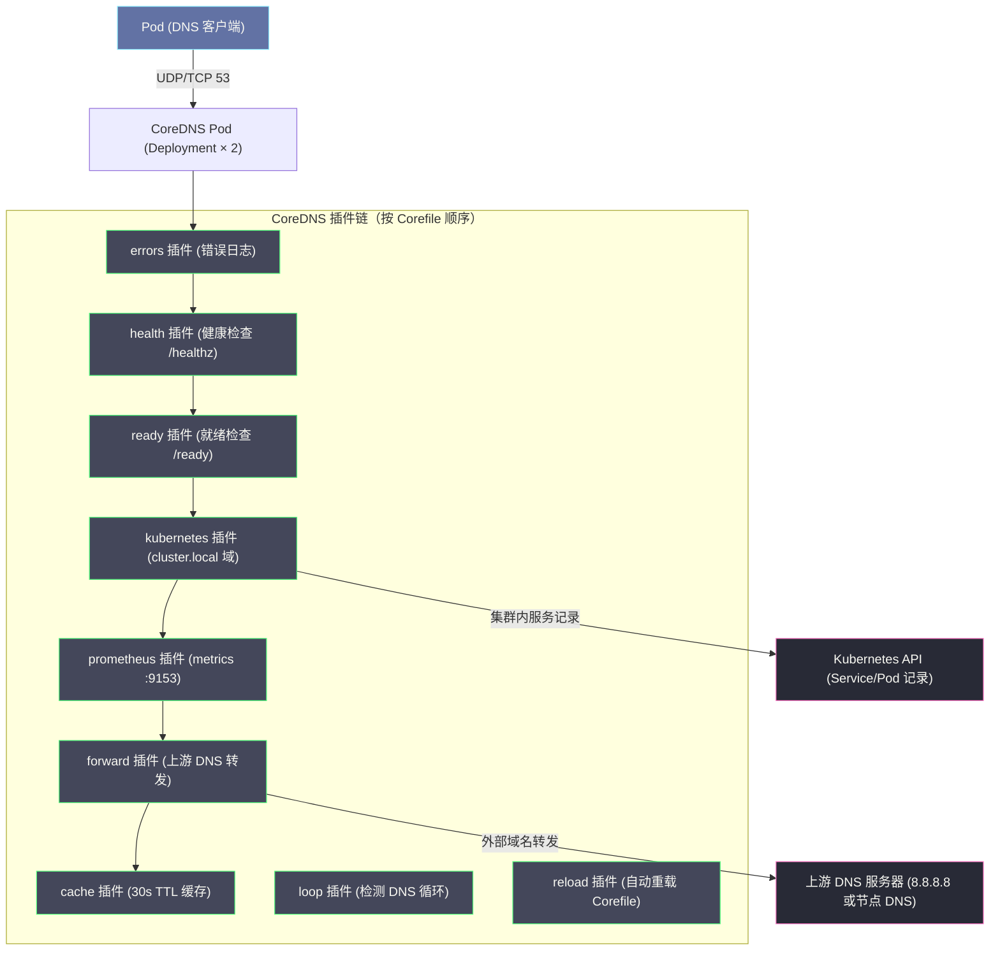
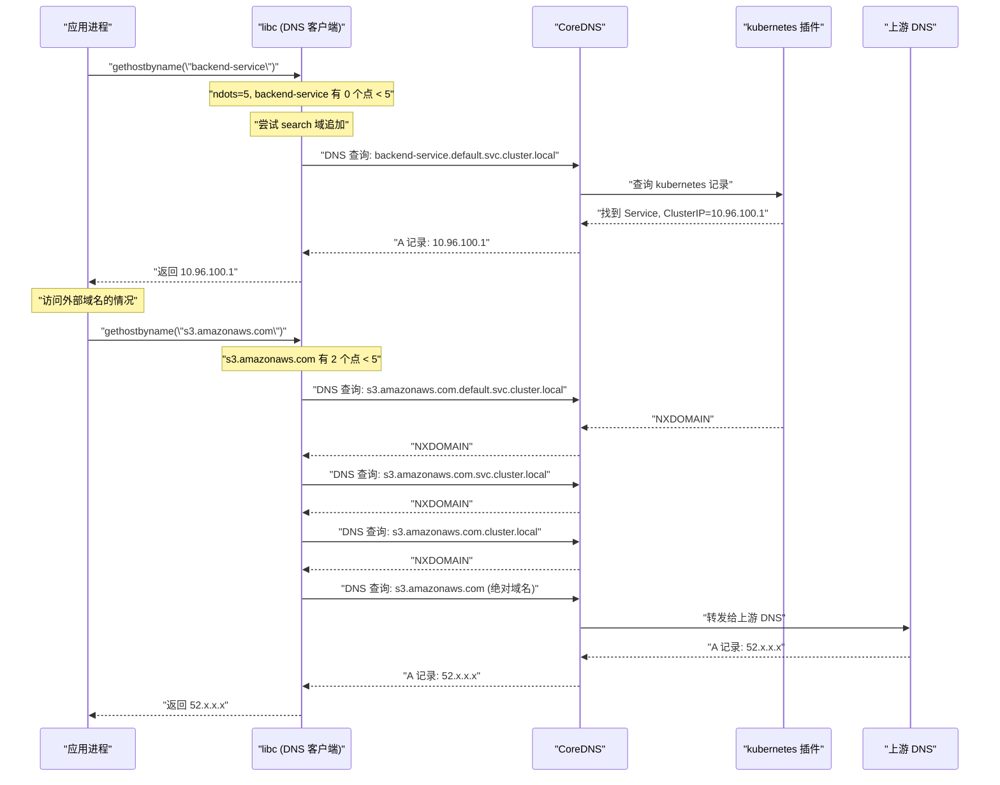

# NetworkPolicy与CoreDNS——网络安全策略与集群DNS

## 摘要

本文聚焦 Kubernetes 网络体系中两个不可或缺的组件：NetworkPolicy 与 CoreDNS。NetworkPolicy 是集群网络的"安全屏障"，通过 CNI 插件将声明式的访问控制策略转化为内核 iptables 规则；CoreDNS 是集群的"地址薄"，通过插件链架构将服务名解析为可访问的 ClusterIP。本文深入 NetworkPolicy 选择器语义与三种典型隔离场景的 iptables 实现，剖析 CoreDNS 的插件链（cache/kubernetes/forward）工作原理，并重点分析 `ndots` 参数引发的 DNS 性能陷阱及调优方案。**在生产集群中，超过 30% 的"网络不通"故障根因在这两个组件，理解它们是掌握集群网络全貌的最后一块拼图。**

---

## 第 1 章 NetworkPolicy——声明式网络访问控制

### 1.1 NetworkPolicy 的设计动机

在前几篇中，我们建立了一个关键认知：Kubernetes 默认网络是"全连通"的——集群中任何 Pod 可以访问任何其他 Pod 的任意端口，任何 Pod 可以访问任何 Service。这在单一团队、单一业务的小型集群中没有问题，但在以下场景中会带来严重的安全风险：

**场景一：多租户集群**。团队 A 和团队 B 共用一个集群，但业务相互隔离。没有 NetworkPolicy 时，团队 A 的 Pod 可以直接访问团队 B 的数据库 Pod——即使这个数据库端口在正常业务中不应该暴露给团队 A。

**场景二：纵深防御（Defense in Depth）**。即使服务间有 mTLS 和应用层鉴权，一旦某个服务被攻陷（如注入恶意代码），没有 NetworkPolicy 的集群会让攻击者在集群内"横向移动"——可以扫描所有 Pod、尝试连接所有端口、找到下一个漏洞节点。NetworkPolicy 提供的网络层隔离，是纵深防御体系的重要一环。

**场景三：合规要求**。PCI-DSS、SOC2、HIPAA 等合规标准要求网络层的最小权限原则——系统应当只允许必要的网络通信，拒绝所有其他流量。NetworkPolicy 是满足这些要求的直接工具。

> [!info] 核心概念
> NetworkPolicy 遵循**白名单模型（Allowlist）**：一旦某个 Pod 被任何 NetworkPolicy 的 `podSelector` 选中，它就进入了"受保护"状态，所有未被明确允许的流量都被拒绝。如果没有任何 NetworkPolicy 选中某个 Pod，则该 Pod 处于"非保护"状态，允许所有流量（Kubernetes 默认的全连通语义）。这个模型的关键含义是：**你不能用 NetworkPolicy 主动拒绝某类流量，只能用它定义允许的流量。** 拒绝是默认行为，不是显式配置的结果。

### 1.2 NetworkPolicy 的资源结构

```yaml
apiVersion: networking.k8s.io/v1
kind: NetworkPolicy
metadata:
  name: backend-policy
  namespace: production       # NetworkPolicy 是 Namespace 作用域的资源
spec:
  podSelector:               # 这个策略应用于哪些 Pod（必填字段）
    matchLabels:
      app: backend
  policyTypes:               # 声明这个策略控制 Ingress、Egress 还是两者
  - Ingress
  - Egress
  ingress:                   # 入站规则（允许哪些流量进来）
  - from:
    - namespaceSelector:     # 允许来自特定 Namespace 的流量
        matchLabels:
          env: production
      podSelector:           # 同时满足：这个 Namespace 内的特定 Pod
        matchLabels:
          app: frontend
    - ipBlock:               # 或者：允许来自特定 IP 段（用于外部流量）
        cidr: 10.0.0.0/8
        except:
        - 10.244.0.0/16      # 排除集群 Pod CIDR
    ports:
    - protocol: TCP
      port: 8080
  egress:                    # 出站规则（允许哪些流量出去）
  - to:
    - namespaceSelector:
        matchLabels:
          kubernetes.io/metadata.name: kube-system
    ports:
    - protocol: UDP
      port: 53               # 允许访问 CoreDNS（DNS 解析）
  - to:
    - podSelector:
        matchLabels:
          app: database
    ports:
    - protocol: TCP
      port: 5432
```

### 1.3 选择器语义的精确理解

NetworkPolicy 的 `from`/`to` 规则中的选择器语义是最容易出错的地方，需要精确理解：

**情况 1：同一 `from` 元素中同时有 `namespaceSelector` 和 `podSelector`**

```yaml
from:
- namespaceSelector:
    matchLabels:
      env: production
  podSelector:
    matchLabels:
      app: frontend
```

含义：**AND 关系**——必须同时满足"来自 `env: production` 的 Namespace"**且**"Pod 有 `app: frontend` 标签"。即：production 命名空间中带有 frontend 标签的 Pod。

**情况 2：`from` 是列表，每个元素独立**

```yaml
from:
- namespaceSelector:
    matchLabels:
      env: production
- podSelector:
    matchLabels:
      app: frontend
```

含义：**OR 关系**——满足任一条件即可：或者来自 `env: production` 的任意 Namespace 的任意 Pod，或者来自**同一 Namespace**（注意：没有 `namespaceSelector` 时，默认当前 Namespace）中有 `app: frontend` 标签的 Pod。

> [!warning] 生产避坑
> 两种写法的区别是 YAML 格式中 `-` 符号的位置——一个 `-` 开头的块（同时包含 `namespaceSelector` 和 `podSelector`）是 AND；两个 `-` 开头的独立块是 OR。这个微小的格式差异会导致完全不同的安全语义，是生产中写错 NetworkPolicy 的最常见来源。建议在写完 NetworkPolicy 后，用 `kubectl describe networkpolicy` 验证规则的解读是否符合预期，或者使用 Cilium 的 `cilium policy trace` 命令测试具体的流量是否被允许。

**空选择器（`{}`）的语义**：

| 位置 | `{}` 的含义 |
| :--- | :--- |
| `spec.podSelector: {}` | 选中**当前 Namespace** 的所有 Pod |
| `from[].podSelector: {}` | 允许来自**当前 Namespace** 的所有 Pod |
| `from[].namespaceSelector: {}` | 允许来自**所有 Namespace** 的所有 Pod |

### 1.4 `policyTypes` 的重要性

`policyTypes` 字段声明这个 NetworkPolicy 控制 Ingress、Egress 还是两者。如果省略，Kubernetes 会根据策略内容自动推断：有 `ingress` 规则就添加 `Ingress`，有 `egress` 规则就添加 `Egress`。

**陷阱场景**：你想创建一个"允许特定 Ingress"的策略，同时**不限制** Egress（保持所有出站流量开放）：

```yaml
# 错误写法：会同时限制 Egress（因为 policyTypes 自动推断为 [Ingress]）
# 等等，实际上只包含 Ingress 时，policyTypes 只有 Ingress，Egress 不受影响
# 但如果你显式写了 policyTypes: [Ingress, Egress] 但没有 egress 规则，所有 Egress 会被拒绝

# 正确写法：明确声明只控制 Ingress
spec:
  podSelector: ...
  policyTypes:
  - Ingress       # 只声明 Ingress，Egress 不受此策略影响
  ingress: ...
```

```yaml
# 危险写法：声明了 Egress 但没有给出 egress 规则，所有出站流量被拒绝！
spec:
  podSelector: ...
  policyTypes:
  - Ingress
  - Egress        # 声明了控制 Egress，但没有 egress 规则 = 拒绝所有 Egress
  ingress: ...
  # 没有 egress 字段 = 没有任何允许的出站流量
```

---

## 第 2 章 NetworkPolicy 的 iptables 实现原理

### 2.1 CNI 插件如何实现 NetworkPolicy

NetworkPolicy 对象本身是 Kubernetes API 的声明，实际的数据包过滤由 CNI 插件在每个节点上通过 iptables（或 eBPF）规则实现。以 Calico 为例（Flannel 不支持 NetworkPolicy，Cilium 用 eBPF 实现，核心逻辑相似）：

**Felix 的工作流程**：
1. Watch Kubernetes API，获取所有 NetworkPolicy 和 Pod（Endpoint）信息
2. 对每个被 NetworkPolicy 选中的 Pod（Endpoint），在该 Pod 所在节点的 iptables 中写入规则
3. 规则挂载在 FORWARD 链上，通过接口匹配（`-i calixxx` 或 `-o calixxx`）将流量导入 per-Pod 的规则链
4. Per-Pod 规则链检查流量是否符合 NetworkPolicy，不符合则 DROP

### 2.2 规则链的层次结构

以一个简单的 Ingress NetworkPolicy 为例，Calico 生成的 iptables 规则层次（简化）：

```
filter FORWARD
  └── -j cali-FORWARD

cali-FORWARD
  ├── -i cali3a4b5c -j cali-from-cali3a4b5c  ← 处理从 backend Pod 发出的流量（Egress Policy）
  └── -o cali3a4b5c -j cali-to-cali3a4b5c    ← 处理发往 backend Pod 的流量（Ingress Policy）

cali-to-cali3a4b5c（backend Pod 的 Ingress 规则链）
  ├── -m comment "NetworkPolicy backend-policy: allow from frontend"
  │   -s 10.244.0.5 -p tcp --dport 8080 -j ACCEPT      ← frontend Pod 的 IP（动态维护）
  │   -s 10.244.0.6 -p tcp --dport 8080 -j ACCEPT
  └── -m comment "Default deny (pod is selected by policy)" -j DROP
```

**关键观察**：
- 规则中的 IP（`10.244.0.5`、`10.244.0.6`）是 frontend Pod 的当前 IP，由 Felix 动态维护
- 当 frontend Pod 重启 IP 变化时，Felix Watch 到 Endpoint 变化，立即更新 iptables 规则中的 IP
- DROP 规则在最后——只有在所有 ACCEPT 规则都不匹配时才执行，体现了白名单模型

### 2.3 三种典型隔离场景的完整配置

#### 场景一：Namespace 级别的完全隔离

目标：`team-a` Namespace 的 Pod 只能与 `team-a` 内的 Pod 通信，不能访问其他 Namespace。

```yaml
# 1. 默认拒绝所有入站流量
apiVersion: networking.k8s.io/v1
kind: NetworkPolicy
metadata:
  name: default-deny-ingress
  namespace: team-a
spec:
  podSelector: {}    # 所有 Pod
  policyTypes:
  - Ingress

---
# 2. 允许同 Namespace 内部通信
apiVersion: networking.k8s.io/v1
kind: NetworkPolicy
metadata:
  name: allow-same-namespace
  namespace: team-a
spec:
  podSelector: {}
  policyTypes:
  - Ingress
  ingress:
  - from:
    - namespaceSelector:
        matchLabels:
          kubernetes.io/metadata.name: team-a
```

注意：从 K8s 1.22 起，`kubernetes.io/metadata.name` 标签自动添加到每个 Namespace，值为 Namespace 名称，可以用于精确的 Namespace 选择器匹配。

#### 场景二：三层架构（前端→后端→数据库）的最小权限

```yaml
# 后端：只允许来自前端的请求，只允许访问数据库
apiVersion: networking.k8s.io/v1
kind: NetworkPolicy
metadata:
  name: backend-policy
  namespace: production
spec:
  podSelector:
    matchLabels:
      tier: backend
  policyTypes:
  - Ingress
  - Egress
  ingress:
  - from:
    - podSelector:
        matchLabels:
          tier: frontend
    ports:
    - protocol: TCP
      port: 8080
  egress:
  - to:
    - podSelector:
        matchLabels:
          tier: database
    ports:
    - protocol: TCP
      port: 5432
  - to:                        # 允许 DNS 查询（CoreDNS）
    - namespaceSelector:
        matchLabels:
          kubernetes.io/metadata.name: kube-system
    ports:
    - protocol: UDP
      port: 53
    - protocol: TCP
      port: 53
```

> [!warning] 生产避坑
> 一个极其常见的 NetworkPolicy 错误：为 Pod 添加了 Egress 控制后，**忘记允许 DNS（UDP/TCP 53）访问 CoreDNS**。结果是 Pod 所有的 DNS 解析都失败，任何通过服务名（而非 ClusterIP）的访问都失败，表现为 `Could not resolve host: my-service`。在添加 Egress 限制时，**始终记得添加 DNS 例外规则**。

#### 场景三：允许 Prometheus 抓取所有 Pod 的 Metrics

```yaml
# 对所有 Namespace 的 Pod 开放 /metrics 端口给 Prometheus
apiVersion: networking.k8s.io/v1
kind: NetworkPolicy
metadata:
  name: allow-prometheus-scraping
  namespace: production
spec:
  podSelector: {}    # 所有 Pod
  policyTypes:
  - Ingress
  ingress:
  - from:
    - namespaceSelector:
        matchLabels:
          kubernetes.io/metadata.name: monitoring
      podSelector:
        matchLabels:
          app: prometheus
    ports:
    - protocol: TCP
      port: 9090    # 或 8080，根据实际 metrics 端口调整
```

---

## 第 3 章 CoreDNS——集群服务发现的地址薄

### 3.1 为什么需要集群内 DNS

在上面的 NetworkPolicy 配置中，我们用 ClusterIP（如 `10.96.100.1`）来标识 Service。但在实际应用中，程序不会硬编码 ClusterIP——因为 ClusterIP 是在 Service 创建时动态分配的，不同集群不同，重建 Service 也会变化。

应用需要通过**稳定的服务名**来访问服务，如：`http://backend-service:8080/api`。将服务名解析为 ClusterIP 的工作，由集群内的 DNS 服务完成——这就是 **CoreDNS**。

**服务发现的完整链路**：
```
应用代码: curl http://backend-service:8080/api
  ↓
应用调用 libc 的 gethostbyname("backend-service")
  ↓
libc 读取 /etc/resolv.conf，找到 DNS 服务器地址 (ClusterIP of kube-dns)
  ↓
发送 DNS 查询到 CoreDNS
  ↓
CoreDNS 在内部 Kubernetes 记录中查找 "backend-service.default.svc.cluster.local"
  ↓
返回 ClusterIP: 10.96.100.1
  ↓
应用建立 TCP 连接到 10.96.100.1:8080
  ↓
iptables DNAT 到实际 Pod IP
```

### 3.2 CoreDNS 的架构演进

**KubeDNS（2015-2018）**：Kubernetes 1.12 之前的默认 DNS 实现，由三个组件组成（kubedns、dnsmasq、sidecar），架构复杂，有已知的内存泄漏问题和缓存不一致问题。

**CoreDNS（2018-至今）**：从 Kubernetes 1.12 开始成为默认 DNS 实现，由 Go 编写，单进程架构，基于**插件链**实现功能扩展。CoreDNS 的设计理念与 CNI 类似：核心是插件框架，所有功能通过插件实现，用户通过 Corefile 配置插件链。

> [!note] 设计哲学
> CoreDNS 是 CNCF（云原生基金会）的孵化项目，2019 年毕业。它的插件架构体现了"关注点分离"的设计原则：每个插件只做一件事（缓存、Kubernetes 记录查询、日志、健康检查等），Corefile 决定插件的执行顺序和配置。这使得 CoreDNS 既轻量（单进程）又高度可扩展（通过插件添加功能）。

### 3.3 CoreDNS 的组件架构



### 3.4 Corefile：插件链的配置入口

CoreDNS 的所有配置通过 `Corefile` 完成，存储在 `kube-system` Namespace 的 ConfigMap `coredns` 中：

```
.:53 {
    errors                           # 记录 DNS 错误到 stderr
    health {                         # 健康检查端点
       lameduck 5s                   # 关闭前等待 5s，优雅处理飞行中的请求
    }
    ready                            # 就绪探针端点（/ready）
    kubernetes cluster.local in-addr.arpa ip6.arpa {  # 处理 cluster.local 域和反向查询
       pods insecure                 # 为 Pod IP 生成 DNS 记录（insecure: 不验证 Pod 名）
       fallthrough in-addr.arpa ip6.arpa   # 反向查询未匹配时继续到下一个插件
       ttl 30                        # DNS 记录 TTL 30 秒
    }
    prometheus :9153                 # 暴露 Prometheus metrics
    forward . /etc/resolv.conf {     # 未匹配的域名转发到节点 /etc/resolv.conf 中的 DNS
       max_concurrent 1000
    }
    cache 30                         # 缓存 DNS 响应，TTL 上限 30 秒
    loop                             # 检测 DNS 转发循环，避免死锁
    reload                           # 监控 Corefile 变化并自动重载（无需重启）
    loadbalance                      # 对 DNS 响应中的 A 记录轮询排序（简单负载均衡）
}
```

### 3.5 Kubernetes 插件：集群服务记录的生成

**kubernetes 插件**是 CoreDNS 处理集群内 DNS 的核心，它直接 Watch Kubernetes API（Service、Endpoints），在内存中维护 DNS 记录，响应 `cluster.local` 域名的查询。

**生成的 DNS 记录类型**：

| DNS 记录 | 格式 | 解析结果 |
| :--- | :--- | :--- |
| **Service A 记录** | `<svc>.<ns>.svc.cluster.local` | ClusterIP |
| **Headless Service** | `<svc>.<ns>.svc.cluster.local` | 所有 Endpoint IP（多条 A 记录） |
| **ExternalName Service** | `<svc>.<ns>.svc.cluster.local` | CNAME → 外部域名 |
| **Pod A 记录** | `<pod-ip-dashes>.<ns>.pod.cluster.local` | Pod IP（需开启 pods insecure） |
| **StatefulSet Pod** | `<hostname>.<svc>.<ns>.svc.cluster.local` | 特定 Pod IP |
| **SRV 记录** | `_<port>._<proto>.<svc>.<ns>.svc.cluster.local` | Port + 目标主机名 |

**Headless Service 的特殊行为**：当 `spec.clusterIP: None` 时，Service 没有 ClusterIP。DNS 查询返回的是所有健康 Endpoint 的 IP（多条 A 记录），由客户端直接选择。这用于 StatefulSet（直接访问特定 Pod）和需要客户端负载均衡的场景（如 gRPC）。

---

## 第 4 章 Pod 的 DNS 解析链路

### 4.1 /etc/resolv.conf 的自动注入

每个 Pod 启动时，kubelet 会自动在 Pod 的 Network Namespace 中写入 `/etc/resolv.conf`：

```
nameserver 10.96.0.10        # CoreDNS 的 ClusterIP（kube-dns Service）
search default.svc.cluster.local svc.cluster.local cluster.local
options ndots:5
```

这三行配置决定了 Pod 的 DNS 解析行为：

- **`nameserver`**：DNS 服务器地址，指向 CoreDNS 的 ClusterIP
- **`search`**：DNS 搜索域列表，解析短名称时按顺序追加这些后缀尝试
- **`options ndots:5`**：当查询的域名中 `.` 的数量少于 5 个时，先按 search 域追加后缀尝试

### 4.2 ndots 参数：最容易被忽视的 DNS 性能陷阱

**ndots** 参数是 DNS 解析中的关键配置，也是生产环境中 DNS 查询延迟的最常见根因。

**ndots 的含义**：如果一个域名中 `.` 的数量少于 `ndots` 值，则该域名被视为"不完整域名"，DNS 客户端（libc）会**先将其与 search 域拼接后查询**，拼接失败后再尝试绝对域名（以 `.` 结尾）。

**默认 `ndots:5` 时查询 `google.com` 的完整过程**：

`google.com` 中有 1 个 `.`，少于 5，被视为不完整域名。libc 按 search 域顺序拼接尝试：

```
1. google.com.default.svc.cluster.local → NXDOMAIN（CoreDNS 查不到）
2. google.com.svc.cluster.local         → NXDOMAIN
3. google.com.cluster.local             → NXDOMAIN
4. google.com                           → 转发到上游 DNS → 返回正确 IP
```

**一次对 `google.com` 的 DNS 查询，实际上发出了 4 次 DNS 请求！** 前 3 次都是无效的查询，纯粹是浪费。

在微服务密集调用的场景中，每次调用外部 API（如 AWS S3 `s3.amazonaws.com`）都会触发 3 次无效 DNS 查询。如果你有 100 个 Pod，每秒调用 100 次外部 API，那就是每秒产生 300 次无效 DNS 查询——这对 CoreDNS 的压力非常大，也是 CoreDNS 成为集群瓶颈的常见原因。

> [!warning] 生产避坑
> `ndots:5` 这个默认值的设计初衷是为了让 K8s 内部服务名（如 `backend-service`，0 个点）能够通过搜索域自动补全为 `backend-service.default.svc.cluster.local`。但它的副作用是让所有含少于 5 个点的外部域名都经历额外的 NXDOMAIN 查询。
>
> **实际影响**：`s3.amazonaws.com`（2 个点）、`rds.amazonaws.com`（2 个点）、`api.stripe.com`（2 个点）都少于 5，都会触发 3 次无效查询。
>
> **解决方案**：在应用中使用**全限定域名（FQDN）**——即在域名末尾加 `.`，如 `s3.amazonaws.com.`。FQDN 不会被 search 域追加，直接查询。或者将 Pod 的 `dnsConfig.options.ndots` 设置为 2 或 1。

### 4.3 DNS 性能调优方案

**方案一：降低 ndots 值**

```yaml
apiVersion: v1
kind: Pod
spec:
  dnsConfig:
    options:
    - name: ndots
      value: "2"    # 只有少于 2 个点的域名才追加 search 域
```

将 `ndots` 从 5 降低到 2，意味着：
- 集群内服务名（`backend-service`，0个点）仍然可以通过 search 域解析 ✅
- `service.namespace`（1个点）仍然可以通过 search 域解析 ✅  
- `s3.amazonaws.com`（2个点）不再追加 search 域，直接查询外部 DNS ✅（性能改善）
- `my-service.my-ns.svc`（2个点，等于 ndots）仍然触发 search 域追加 ⚠️

**方案二：在 CoreDNS 中配置 autopath 插件**

`autopath` 插件允许 CoreDNS 代替客户端做 search 域追加，只需客户端发一次查询，CoreDNS 内部循环尝试所有 search 域：

```
# Corefile 修改
kubernetes cluster.local in-addr.arpa ip6.arpa {
    autopath @kubernetes    # 启用 autopath，让 CoreDNS 在服务端做 search 追加
    pods insecure
    ttl 30
}
```

启用 autopath 后，客户端只发出 1 次 DNS 查询，CoreDNS 内部完成 search 域尝试，减少网络往返。但 autopath 会增加 CoreDNS 自身的 CPU 开销（因为要做更多内部查询）。

**方案三：调整 CoreDNS 缓存 TTL**

默认 CoreDNS `cache 30`（30秒 TTL）对于频繁访问的外部域名来说 TTL 太短，每 30 秒就需要重新查询。对于外部 API 地址（如 AWS 服务端点，几乎不变），可以适当增大 TTL：

```
cache {
    success 9984 300    # 成功响应缓存 300 秒
    denial 9984 5       # NXDOMAIN 响应缓存 5 秒（防止缓存蔓延）
}
```

**方案四：针对高并发外部 DNS 查询，增加 CoreDNS 副本数**

```bash
kubectl scale deployment coredns -n kube-system --replicas=4
```

同时调整 CoreDNS 的 HPA（Horizontal Pod Autoscaler）或使用 `cluster-proportional-autoscaler` 根据节点数自动扩缩：

```yaml
# cluster-proportional-autoscaler 配置
coresPerReplica: 256
nodesPerReplica: 16
min: 2
max: 8
preventSinglePointOfFailure: true
```

### 4.4 DNS 解析的详细流程图



---

## 第 5 章 CoreDNS 故障排查

### 5.1 DNS 解析失败的排查流程

```bash
# 步骤 1：确认 CoreDNS Pod 正在运行
kubectl get pods -n kube-system -l k8s-app=kube-dns

# 步骤 2：检查 CoreDNS 日志
kubectl logs -n kube-system -l k8s-app=kube-dns --tail=50

# 步骤 3：在目标 Pod 内测试 DNS
kubectl exec -it test-pod -n default -- nslookup backend-service
kubectl exec -it test-pod -n default -- nslookup backend-service.default.svc.cluster.local
kubectl exec -it test-pod -n default -- cat /etc/resolv.conf

# 步骤 4：测试 CoreDNS 是否可以直接访问
kubectl exec -it test-pod -- nslookup backend-service 10.96.0.10
# 10.96.0.10 是 kube-dns Service 的 ClusterIP

# 步骤 5：测试外部域名解析
kubectl exec -it test-pod -- nslookup google.com

# 步骤 6：如果外部域名失败，检查 CoreDNS 的 forward 配置
kubectl get configmap coredns -n kube-system -o yaml | grep forward
```

### 5.2 CoreDNS 高负载的诊断

```bash
# 查看 CoreDNS 的 Prometheus 指标
kubectl port-forward -n kube-system deployment/coredns 9153:9153 &
curl localhost:9153/metrics | grep -E "coredns_dns_requests|coredns_dns_responses|coredns_cache"

# 关键指标：
# coredns_dns_requests_total{server,zone,proto,family}  - 总请求数
# coredns_dns_responses_total{server,zone,rcode}         - 按响应码统计
# coredns_cache_hits_total                               - 缓存命中数
# coredns_cache_misses_total                             - 缓存未命中数

# 计算缓存命中率
# 命中率 = cache_hits / (cache_hits + cache_misses)
# 如果命中率低于 50%，说明 TTL 太短或 ndots 问题导致大量无效 NXDOMAIN 查询

# 在节点上抓取 DNS 查询（排查 ndots 问题）
tcpdump -i any -n udp port 53 -w /tmp/dns.pcap
# 然后用 wireshark 或 tshark 分析是否有大量追加了 search 域的查询
```

### 5.3 常见 CoreDNS 问题与解决方案

**问题 1：CoreDNS 返回 SERVFAIL**

可能原因：
- CoreDNS 无法访问上游 DNS 服务器（网络策略阻断？节点 DNS 不可用？）
- `/etc/resolv.conf` 中的上游 DNS 指向了一个不可达的地址

诊断：
```bash
kubectl exec -it coredns-xxx -n kube-system -- nslookup google.com 8.8.8.8
```

**问题 2：Pod 启动慢，日志显示 DNS 超时**

可能原因：
- CoreDNS Pod 还没有就绪（Pod 刚启动时的竞态）
- NodeLocal DNSCache 没有配置

解决方案：部署 **NodeLocal DNSCache**——在每个节点上运行一个 DNS 缓存 DaemonSet，将节点 DNS 请求本地处理，减少对 CoreDNS 的压力：

```bash
# NodeLocal DNSCache 部署后，每个节点有一个本地 DNS 缓存
# Pod /etc/resolv.conf 中的 nameserver 改为本地链路 IP（169.254.20.10）
# 本地缓存命中则直接返回，未命中才转发给 CoreDNS

# 查看 NodeLocal DNSCache
kubectl get ds node-local-dns -n kube-system
```

**问题 3：`/etc/resolv.conf` 中的 search 域异常**

某些情况下（如 Pod 使用 `hostNetwork: true`，或 `dnsPolicy: Default`），Pod 的 `/etc/resolv.conf` 会继承节点的配置而不是 K8s 注入的配置：

| `dnsPolicy` 值 | 含义 |
| :--- | :--- |
| `ClusterFirst`（默认） | 先查 CoreDNS，未匹配再转发上游，`/etc/resolv.conf` 由 K8s 注入 |
| `Default` | 继承节点的 `/etc/resolv.conf`，不走 CoreDNS |
| `None` | 完全自定义，需提供 `dnsConfig` |
| `ClusterFirstWithHostNet` | `hostNetwork: true` 的 Pod 使用 CoreDNS |

---

## 第 6 章 综合实战：全链路网络问题排查手册

### 6.1 网络故障分类与排查矩阵

经过前 7 篇的学习，我们已经建立了 Kubernetes 网络的完整知识体系。下面整合成一张故障排查矩阵：

| 故障现象 | 可能根因 | 排查工具 |
| :--- | :--- | :--- |
| **Pod 无法创建（Pending）** | CNI 插件未安装、Node NotReady | `kubectl describe pod`、`kubectl get node` |
| **同节点 Pod 间不通** | cni0 bridge 问题、iptables 规则、NetworkPolicy | `ip link`、`iptables -L`、`brctl show` |
| **跨节点 Pod 间不通** | CNI 路由/隧道问题、VXLAN FDB 错误 | `ip route`、`bridge fdb show`、`tcpdump` |
| **Service ClusterIP 不通** | kube-proxy 未运行、iptables 规则丢失 | `iptables -t nat -L KUBE-SERVICES`、`ipvsadm -Ln` |
| **Service 偶发超时** | Endpoint 健康检查延迟、滚动更新期间规则延迟 | `kubectl get endpoints`、`conntrack -L` |
| **DNS 解析失败** | CoreDNS 不可用、NetworkPolicy 阻断 53 端口 | `nslookup`、`kubectl logs coredns` |
| **DNS 解析慢** | ndots 问题、CoreDNS 负载高、缓存命中率低 | `tcpdump udp port 53`、CoreDNS metrics |
| **NetworkPolicy 不生效** | CNI 不支持 NetworkPolicy、规则语义错误 | `kubectl describe networkpolicy`、`iptables -L cali-to-xxx` |
| **外部流量无法访问 NodePort** | 节点防火墙阻断、NodePort 端口范围配置 | `netstat -nlp`、云安全组配置 |

---

## 第 7 章 小结：K8s 网络专栏知识体系

### 7.1 七篇文章构建的知识图谱

至此，K8s 网络原理与插件专栏的七篇文章已构成一个完整的知识体系：

| 篇章 | 核心知识 | 工程价值 |
| :--- | :--- | :--- |
| **01 网络模型** | Network Namespace、veth pair、Linux bridge、K8s 四约束 | 理解所有 CNI 插件的底层基础 |
| **02 CNI 体系** | CNI Spec、调用链、IPAM、主流插件选型 | 做出正确的 CNI 选型决策 |
| **03 Flannel** | UDP/VXLAN/Host-GW 三种模式、VTEP、FDB | 理解封包隧道的成本与适用场景 |
| **04 Calico** | BGP 路由分发、Felix iptables、IPIP 跨子网 | 生产级网络策略与高性能路由 |
| **05 Cilium** | eBPF Hook 体系、BPF Map O(1)、L7 策略、Hubble | 下一代高性能、可观测网络 |
| **06 Service** | kube-proxy、iptables 规则链、IPVS、EndpointSlice | 排查 Service 相关的所有故障 |
| **07 NetworkPolicy+CoreDNS** | 选择器语义、search 域、ndots 陷阱、调优方案 | 安全隔离与 DNS 性能优化 |

### 7.2 推荐的后续学习路径

掌握了 K8s 网络的底层原理，以下是自然的延伸方向：

- **[[服务网格]]**：当 L3/L4 层的 NetworkPolicy 不够用时，服务网格（Istio + Envoy）在应用层（L7）提供更细粒度的流量管理、mTLS 加密和可观测性
- **[[eBPF]]**：深入 Linux 内核的 eBPF 编程，理解 Cilium 底层的实现细节
- **[[云原生安全]]**：NetworkPolicy 是网络安全的起点，Falco、OPA/Gatekeeper、Pod Security Standards 构成更完整的安全体系
- **[[Kubernetes集群监控]]**：Prometheus + Grafana + Alertmanager 对网络指标（Pod 间延迟、DNS 查询成功率、CNI 错误率）的监控与告警体系

---

*本文是 [[Kubernetes网络原理与插件]] 专栏的第 7 篇（终篇）。NetworkPolicy 提供 L3/L4 访问控制，如需 L7 级别的细粒度控制（HTTP 方法/路径），参见 [[05 安全——mTLS、认证与授权策略|Istio AuthorizationPolicy]]。*
