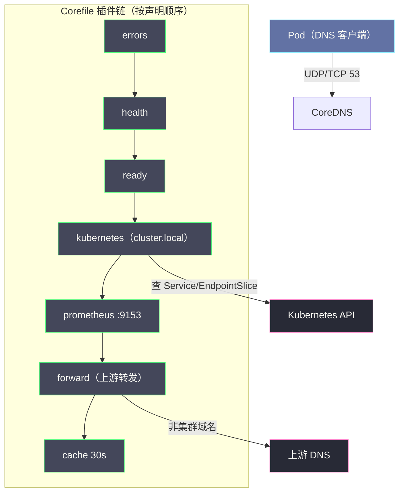
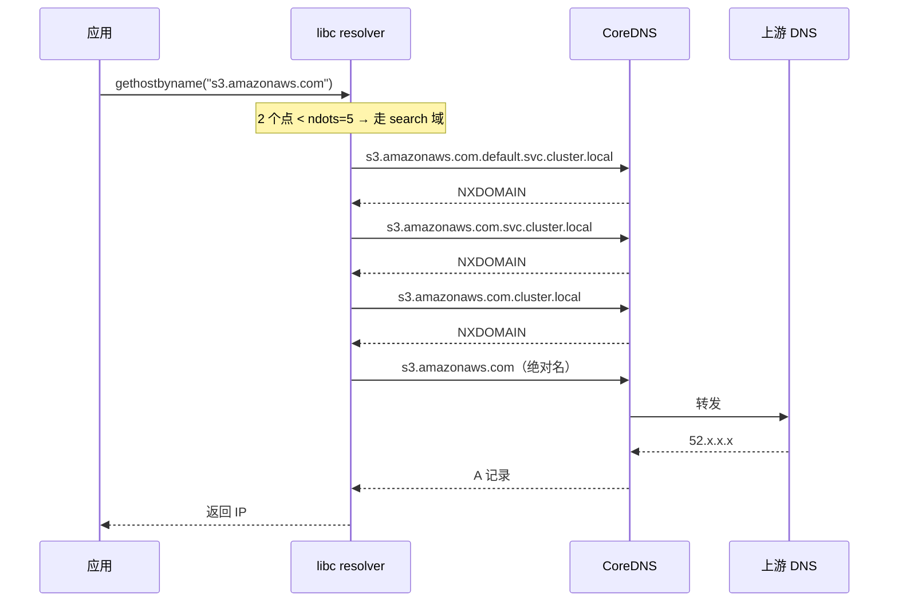

# NetworkPolicy与CoreDNS——网络安全策略与集群DNS

**摘要：**

这是专栏的最后一篇，处理两个看似无关、实则同属"收尾层"的组件：NetworkPolicy 决定"谁可以通"，CoreDNS 决定"名字叫谁"。前六篇把 Pod 网络、CNI、Flannel/Calico/Cilium、kube-proxy 逐层拆完，回答的都是"流量如何到达"；本篇回答剩下的两个问题——"到达之前是否被允许"与"到达之前如何找到地址"。NetworkPolicy 部分把白名单模型、选择器的 AND/OR 陷阱、policyTypes 语义、以及它在 Calico iptables 与 Cilium eBPF 两种数据面上的不同落地讲透；CoreDNS 部分沿 KubeDNS→CoreDNS 的演进史展开，拆插件链架构与 Corefile，然后把 `ndots:5` 这个默认值的放大效应推演到字节级，并给出 FQDN、降 ndots、autopath、NodeLocal DNSCache 四档解法。文末附一张覆盖全专栏的联合排障矩阵，作为七篇的收官索引。

---

## 第 1 章 为什么把"策略"与"DNS"放在一起讲

把 NetworkPolicy 和 CoreDNS 塞在同一篇，不是编排上的偷懒，而是它们在体系中的位置确实对称——前六篇解决的是"流量能到"的能力问题，这两个组件解决的是"流量该不该到"与"名字怎么找到地址"的语义问题。一个负责在数据面加闸门，一个负责在控制面维持一本地址簿；一个决定通信的边界，一个决定寻址的方式。在故障统计上它们也常被归为一类：生产环境里"网络不通"的工单，排除掉 CNI 与 kube-proxy 后，剩下的大头几乎都落在这两个组件上——策略误配把合法流量拦了，或 DNS 解析把名字解错了。

它们还有一个共同的"收尾"性质：前面所有篇章讨论的都是"如何把数据包送到"，本篇的两个组件是数据包上路之前的最后两道关——NetworkPolicy 在语义层决定"这条路该不该走"，CoreDNS 在寻址层决定"这条路通往谁"。一个集群即使 CNI 与 Service 全部正常，只要这两个组件任一出问题，从用户视角看就是"网络坏了"——这也是它们值得单独一篇的分量所在。

理解它们各自"管哪一段"是排障的第一步：NetworkPolicy 作用在**报文进入/离开 Pod 的那一刻**（filter 层），CoreDNS 作用在**连接建立之前的寻址环节**（应用层语义）。两者没有数据路径上的交集，但共同定义了"一次通信在语义上是否成立"。把它们并置的另一个好处是能看到 Kubernetes 声明式 API 的两个极端：NetworkPolicy 是"声明意图、由各 CNI 自由实现"的弱规范（语义有实现差异），CoreDNS 则是"功能强收敛、行为高度确定"的强实现——同一个"声明式"哲学，在两个组件上走出了完全不同的形态。

排障时还有一个更朴素的定位顺序值得先立起来：**凡是"服务名不通"，先怀疑 DNS；凡是"IP 通但特定端口/方向不通"，先怀疑策略；凡是"所有 Pod 都不通"，先怀疑 CNI 数据面**。这条口诀把本篇与前六篇的分工压缩成一句话——拿到一个"不通"的工单，先用它把嫌疑域砍到一层，再进对应章节的细排。

---

## 第 2 章 NetworkPolicy：声明式白名单

### 2.1 默认全连通的安全债

Kubernetes 的 Pod 网络有一条贯穿始终的默认假设：**任意 Pod 可以与任意 Pod 通信**。这条假设让集群开箱即通，也让它在安全视角下毫无边界——没有策略时，前端 Pod 可以直接连数据库，一个被攻陷的服务可以扫描整个 Pod CIDR 寻找下一个目标。在单一团队的小集群里这只是理论风险；在多租户、多业务混部、或要过合规审计（PCI-DSS 的最小权限条款是常客）的集群里，它是要命的债。

这个"默认全通"不是疏忽，而是有意的选择：Kubernetes 把"连通性"定义为基线保障，把"隔离"留给了可选的策略层。这个选择的历史背景是早期容器网络的首要难题是"让 Pod 互通"本身，安全是后话；但它留下了一个至今仍在的默认暴露面——绝大多数中小集群的所有 Pod，至今仍在白名单之外裸奔。

NetworkPolicy 给出的答案是**白名单模型**：一个 Pod 一旦被某条策略的 `podSelector` 选中，它就进入受保护状态——只允许被显式声明的流量，其余一律拒绝。没被任何策略选中的 Pod 则维持默认的全连通。这个"声明即生效"的语义是整个模型的轴心：**NetworkPolicy 里没有"拒绝"这个动词，只有"允许"——拒绝是白名单模型的默认余量**。这一条语义是整个机制里最反直觉、也最容易写错的地方，后面会反复回到它。

从安全架构的视角看，NetworkPolicy 是纵深防御里"网络层"的那一道——它与应用层的 mTLS、鉴权、审计不是替代关系而是叠加关系：应用层管"调用是否合法"，网络层管"连接是否被允许存在"。一个被攻陷的容器即使绕过了应用层鉴权，Egress 策略仍能挡住它向外部 C2 服务器的回连——这就是"网络层兜底"在攻击链上的真实价值。

也要先说清它**不**是什么：NetworkPolicy 是 L3/L4 层的访问控制，只懂"IP、端口、协议、标签"，不懂"HTTP 方法、URL 路径、gRPC method、mTLS 身份"——那些是 L7 的语义，归服务网格的 AuthorizationPolicy 管。NetworkPolicy 也不做加密、不做认证、不做审计——它只管"放不放行这个连接"。把它当成防火墙的正确形态是"L4 白名单闸门"，而不是"应用层安全策略"——期待它管 L7 是拿错了工具。

### 2.2 资源结构的骨架

一份 NetworkPolicy 的骨架由四个字段撑起：`podSelector`（本策略管谁）、`policyTypes`（管入还是管出）、`ingress`/`egress`（各一组允许规则）。规则体内 `from`/`to` 下可选三类对端描述：`podSelector`（按 Pod 标签）、`namespaceSelector`（按命名空间标签）、`ipBlock`（按 CIDR）——三者是 OR 关系，而同一项内的 `podSelector` + `namespaceSelector` 联合书写则是 AND 关系。这个 AND/OR 的 YAML 陷阱是整个 API 里写错率最高的地方。

`ports` 字段还有一层语义常被忽略：它在每条 `from`/`to` 规则上是**附加约束而非独立维度**——不写 `ports` 表示该规则的所有端口都放行，写了则缩窄到列出的端口。策略评估的真实结构是"（对端集合 × 端口集合）的笛卡尔允许项"：每条规则是两者的合取，整个 `ingress` 列表是各规则的并集。把这个模型装进脑子，大多数"我写的策略为什么没按我想的拦"都能现场推演出来。

```yaml
apiVersion: networking.k8s.io/v1
kind: NetworkPolicy
metadata:
  name: backend-policy
  namespace: production
spec:
  podSelector:
    matchLabels: {tier: backend}
  policyTypes: [Ingress, Egress]
  ingress:
  - from:
    - namespaceSelector: {matchLabels: {env: production}}
      podSelector: {matchLabels: {tier: frontend}}   # AND：prod ns 里的 frontend pod
    ports: [{protocol: TCP, port: 8080}]
  egress:
  - to:
    - podSelector: {matchLabels: {tier: database}}
    ports: [{protocol: TCP, port: 5432}]
  - to:                                             # 永远别忘的 DNS 例外
    - namespaceSelector:
        matchLabels: {kubernetes.io/metadata.name: kube-system}
    ports: [{protocol: UDP, port: 53}, {protocol: TCP, port: 53}]
```

### 2.3 选择器的 AND/OR 陷阱

YAML 的一个 `-` 之差，语义就是天壤之别：

```yaml
# 写法 A（AND）：同一 - 块内同时写两个 selector
from:
- namespaceSelector: {matchLabels: {env: production}}
  podSelector: {matchLabels: {app: frontend}}
# 语义：env=production 命名空间内、带 app=frontend 标签的 Pod

# 写法 B（OR）：两个独立 - 块
from:
- namespaceSelector: {matchLabels: {env: production}}
- podSelector: {matchLabels: {app: frontend}}
# 语义：整个 prod ns 的任意 Pod，或当前 ns 内带 app=frontend 的 Pod
```

写法 B 的第二项尤其容易误读——裸 `podSelector` 的作用域是**策略所在的当前命名空间**，不是"所有命名空间里带这个标签的 Pod"。少了 `namespaceSelector` 的锚定，意图里的"允许所有 frontend"会退化成"只允许本 ns 的 frontend"。

还有第三种更隐蔽的写法差异值得记住：同一 `-` 块里写 `namespaceSelector` + `podSelector` 是"交集"（AND），但如果需要的是"整个命名空间 OR 某标签 Pod"的并集语义，必须拆成两个 `-` 项——YAML 的层级在这里直接编码了集合运算，写错一个缩进就是把交集写成并集、或把并集写成交集。写完任何 NetworkPolicy 后用 `kubectl describe networkpolicy` 回读一次语义，是比审 YAML 更可靠的验证。

空选择器 `{}` 的语义同样不能含糊：

| 位置 | `{}` 的含义 |
| :--- | :--- |
| `spec.podSelector: {}` | 选中当前 Namespace 的所有 Pod |
| `from[].podSelector: {}` | 允许当前 Namespace 的所有 Pod |
| `from[].namespaceSelector: {}` | 允许所有 Namespace 的所有 Pod |

### 2.4 多条策略如何叠加：并集而非优先级

当多个 NetworkPolicy 同时选中同一个 Pod 时，它们的规则不是"就近覆盖"也不是"按优先级合并"——而是**所有规则的允许集合取并集**。三条策略分别放行 A、B、C，最终效果就是放行 A∪B∪C；白名单的"默认拒绝"只在并集之外的余量上生效。

这个"取并集"语义有一个重要的治理含义：**你无法用一条更严格的策略去收紧另一条更宽松的策略**。一旦某条策略放行了某流量，任何其他策略都不能撤销它——想收紧只能修改或删除那条宽松策略本身。这与防火墙"第一条命中即终止"的规则模型截然不同：NetworkPolicy 里没有"顺序"，只有"并集"，运维上的含义是把权限下放给各团队时要明白——任何团队加进白名单的流量，管理员都无法用另一条 NetworkPolicy 收回（这正是 AdminNetworkPolicy 要补的洞）。

### 2.5 policyTypes 的隐式陷阱

`policyTypes` 声明本策略管 Ingress、Egress 还是两者，省略时按内容自动推断：有 `ingress` 规则就带上 `Ingress`，有 `egress` 规则就带上 `Egress`。真正危险的是另一种写法——**显式声明了 `Egress` 却没写任何 `egress` 规则**：在白名单模型下，这意味着"此方向已被管理、但没有任何允许项"，结果是所有出站流量被静默拒绝。DNS 断流、外部 API 连不通，表象五花八门，根因都是这一行。

```yaml
# 危险写法：声明了 Egress 但没有任何 egress 规则
spec:
  podSelector: {matchLabels: {app: web}}
  policyTypes: [Ingress, Egress]   # 声明管理 Egress
  ingress:
  - from: [...]
  # 没有 egress 字段 = 该 Pod 的所有出站一律拒绝
```

这个陷阱的隐蔽性在于它"看起来没写错"——YAML 合法、语义自洽、意图里"我只管入站"的设想却在声明 `Egress` 的那一刻被推翻。**`policyTypes` 写不写、写什么，永远比 `ingress`/`egress` 写了什么更早决定行为**。

### 2.6 ipBlock 与 named ports 的边界

`ipBlock` 是策略体系里唯一能描述"集群外对端"的手段（`cidr` + `except`），常用于"允许出口到外部 RDS"或"拒绝内网敏感段"。但它的语义边界要记清：ipBlock 匹配报文的**源/目的 IP**，不感知 Pod 身份——在 CNI 用了 SNAT（如跨节点 masquerade）的场景里，对端看到的源 IP 可能已被改写，ipBlock 的匹配会落在改写后的地址上。命名端口（`port: http` 写端口名）则把规则与具体端口号解耦，但不是所有 CNI 都完整支持——支持度差异正是下一节"实现面"要谈的主题。

还有一条几乎从不被写进文档、但在生产里真实的边界：**NetworkPolicy 对"同节点通信"也生效**。两个 Pod 同在一个节点上、走同一个 bridge 通信时，它们的流量同样过该节点的 filter 链——"同一节点"不构成豁免。这个细节在"为什么同节点能通、跨节点不通"或反过来的故障里是最后一块拼图。

---

## 第 3 章 从声明到内核：NetworkPolicy 的实现面

### 3.1 一个弱规范：CNI 支持矩阵

NetworkPolicy 是 Kubernetes 里少见的"声明了 API、但没绑定实现"的资源——`kubectl apply` 一个 NetworkPolicy 不会报错，但若你的 CNI 不实现它，规则就只是躺在 etcd 里的愿望清单。这也是它与传统防火墙的本质差异：iptables `-A INPUT -j DROP` 是即时生效的命令，NetworkPolicy 是一份"等待被某个实现翻译"的声明——生效与否完全取决于集群里装了哪个 CNI。

还有一个更细的语义点先立起来：**"被策略选中"是按方向独立的**。一个 Pod 可以被一条策略的 `Ingress` 管着（入站白名单）、同时不被任何策略管 Egress（出站全开）——两个方向的"受保护状态"互不相干，"完全受保护"需要两条方向的策略都到位。这也是为什么规范里 `policyTypes` 是数组而非单值：方向是被逐一宣告、逐一保护的。

各家 CNI 的支持度差异巨大：

| CNI | NetworkPolicy 支持 | 实现机制 |
| :--- | :--- | :--- |
| **Flannel** | 不支持 | 无（纯连通性 CNI） |
| **Calico** | 完整支持（含扩展 GlobalNetworkPolicy） | Felix → iptables 链 |
| **Cilium** | 完整支持（含 L7 扩展 CiliumNetworkPolicy） | eBPF Map + Identity |
| **Weave / Antrea 等** | 支持 | OVS 流表 / 各自数据面 |

"Flannel 不实现 NetworkPolicy"是生产里最常被忽略的选型结论——用 Flannel 的集群等于裸奔在白名单之外，加再多 NetworkPolicy YAML 也不会有一字节的流量被拦。这也是第 3/4/5 篇把"是否支持策略"列为 CNI 选型第一维度的原因。

验证你的集群"策略是否真的在生效"有一个直接的实证动作：给某测试 Pod 挂一条 default-deny，然后从另一个 Pod 尝试访问它——通则策略没生效（CNI 未实现或实现路径有缺口），不通则生效。`kubectl describe networkpolicy` 只回显声明内容，**不能证明数据面真的拦了包**——这是与"apply 成功"同等重要的验证习惯。

对 Calico 集群，更进一步的实证手段是直接读节点上的规则：`iptables -L cali-to-<iface>` 看 per-Pod 链是否生成、`ipset -L` 看选择器对应的 IP 集合是否就位、`calicoctl get workloadendpoint` 看 Felix 是否把该 Pod 认成了受管 workload。这条"声明 → Felix → iptables → ipset"的链路每一环都可独立查证，是 NetworkPolicy 排障的完整纵深。

### 3.2 Calico/Felix 的链式实现

以 Calico 为样本看"声明如何落到内核"：Felix Watch 到 NetworkPolicy 与 Endpoint 后，在每台节点的 filter 表上为每个受策略管理的 Pod 生成两条 per-workload 链——`cali-from-<iface>`（该 Pod 的出方向，egress 策略）与 `cali-to-<iface>`（入方向，ingress 策略），挂在 `cali-FORWARD` 之下按接口名分流。链体内逐条翻译 `from`/`to` 规则为 `-s/-d <PodIP> -p tcp --dport <port> -j ACCEPT`，链尾兜底一条 DROP——白名单模型的"默认拒绝"就藏在这最后一行里。

这套结构的性能特征是"链数随受管 Pod 数线性增长、每条链内规则数随允许项数增长"——几百个受管 Pod 的节点上 `cali-*` 链会有几百条，但每条链都很短，Felix 用 ipset 把"选择器命中的 IP 全集"集合化后，单链内的规则匹配也基本是常数级。Calico 的策略实现在数据面上付出的代价是链数量而不是链深度，这与 kube-proxy 那种"KUBE-SERVICES 一条长链"的形态恰好相反。

真正的成本集中在投影层而不是数据面：Pod 生灭、标签变化、策略增减都会触发 Felix 重算并下发规则——在 Pod 变动密集的节点上，这个"Watch → 重算 → iptables-restore"的循环是 Calico 节点 CPU 的主要来源之一，与本专栏反复强调的"控制面投影成本"一脉相承。

两个实现细节值得记住。其一，**规则里的 IP 是动态维护的**：当 `podSelector` 匹配的 Pod 因重建而 IP 变化，Felix 靠 Watch 事件即时更新链上的 IP 列表——这就是为什么"选择器"能在"IP 会变"的世界里成立：IP 只是选择器的一个物化快照。其二，**ipset 是规模化的关键**：同一 Service/Selector 命中的一批后端 IP 被收进 ipset 集合，规则只引用集合名——Pod 增删改的是集合成员而非规则条目，把 O（规则数） 变更降级成 O(1) 集合操作，这与 kube-proxy 在 IPVS 模式用 ipset 压缩 masquerade 规则是同一手法。

在节点上看到的真实样貌（简化过的 `iptables-save` 输出）：

```text
-A cali-FORWARD -o cali3a4b5c -j cali-to-cali3a4b5c     # 进 backend pod 的流量
-A cali-FORWARD -i cali3a4b5c -j cali-from-cali3a4b5c   # 出 backend pod 的流量
-A cali-to-cali3a4b5c -m set --match-set frontendIPs src -p tcp --dport 8080 -j ACCEPT
-A cali-to-cali3a4b5c -j DROP                            # 白名单兜底
```

`--match-set frontendIPs` 那一行就是 ipset 的引用——`frontendIPs` 是一个成员可变的 IP 集合，Felix 负责把"标签为 frontend 的 Pod 当前 IP 全集"实时同步进去。读懂这条链，Calico 的 NetworkPolicy 实现就没有秘密了。

### 3.3 Cilium 的 Identity 实现对照

Cilium 用第 5 篇的 Security Identity 模型把同一件事做得更彻底：不再按 IP 匹配，而是给每组同标签 Pod 分配一个稳定的 Identity 编号，策略编译成 `Identity → Identity:Port` 的 BPF Map 条目，在接收端 hook 上一次查表裁决。IP 变了、Pod 重建了，只要标签不变 Identity 就不变，规则一次编译长期有效——这是"选择器"语义在数据面上的最彻底落地，也是 Calico 链式实现要不断维护 IP 快照时 Cilium 不需要做的原因。

两种实现的选择也折射出两种工程取舍：Calico 的链式实现对存量 iptables 生态零门槛——`iptables-save` 就能看到全部规则，排障直观；Cilium 的 Map 实现把匹配效率做到极致，但排障要进 `cilium policy`/`hubble` 这套专属工具链。对"策略多、Pod 变动密"的大集群，后者免去的是持续重建链的成本；对"策略少、团队以 iptables 排障为主"的集群，前者的可读性仍是真实收益。

### 3.4 下一代：AdminNetworkPolicy 与 ClusterNetworkPolicy

NetworkPolicy 的命名空间作用域 + 白名单模型在"集群管理员想统一约束"的场景里力不从心——管理员要的是"先默认全拒绝、再让各团队白名单放行"的全局顺序，而标准 NetworkPolicy 无法表达"集群级默认策略 + 命名空间级例外"这种分层。SIG-Network 为此引入 **AdminNetworkPolicy（ANP）与 BaselineAdminNetworkPolicy（BANP）**（KEP-2091，1.28+ 起各 CNI 陆续实现）：它们是集群作用域资源，规则在命名空间策略之前先评估，支持显式 `Allow/Deny/Pass` 三种动作与优先级排序——把 NetworkPolicy 从"团队自管理的白名单"升级为"管理员能先圈边界、团队再在白名单内细化"的两级治理模型。当前并非所有 CNI 都完整支持，选型时需核对实现状态。

ANP 的三个动作重新引入了 NetworkPolicy 缺失的动词：`Allow` 显式放行、`Deny` 显式拒绝、`Pass` 把判决权交还给更下层的命名空间策略——加上规则内的 `priority` 字段，管理员第一次能写"拒绝所有到 kube-system 的访问，除非命中后面这条 Allow"。这份"先评估、能拒绝、有顺序"的表达能力，是 NetworkPolicy 十年后才补上的管理面。

一个最小 ANP 的样子：

```yaml
apiVersion: policy.networking.k8s.io/v1alpha1
kind: AdminNetworkPolicy
metadata: {name: cluster-baseline}
spec:
  priority: 50
  subject:
    namespaces: {}                     # 全集群所有命名空间
  ingress:
  - name: deny-monitoring-ns
    action: Deny
    from:
    - namespaces:
        matchLabels: {kubernetes.io/metadata.name: monitoring}
  egress:
  - name: allow-dns
    action: Allow
    to:
    - pods:
        podSelector: {matchLabels: {k8s-app: kube-dns}}
        namespaceSelector: {matchLabels: {kubernetes.io/metadata.name: kube-system}}
    ports: [{portNumber: {port: 53, protocol: UDP}}]
```

`subject` 选择被管理的对象（可以是 namespaces 或 pods），`priority` 数字决定多条 ANP 的评估顺序（小的先评）。这个 API 还在演进（v1alpha1 阶段），但方向已经明确：Kubernetes 在把"策略治理"从"每个团队自己的白名单"升级到"集群可分级管控"——这也是本专栏全部技术史里最晚发生的一次语义升级。

什么情况下该认真考虑 ANP 而不是继续堆 NetworkPolicy：当你需要"集群级默认规则"（如全集群拒绝到 kube-system、全集群放行监控抓取）且不想在每个命名空间重复维护同一份 YAML 时；当你需要"先设全局 Deny、再让各命名空间自行放行"的两级治理时；或者当多个团队的 NetworkPolicy 并集已经开始失控、需要管理员能从上往下再画一条边时。这三类信号出现任何一个，ANP 的引入成本就该被认真算一次。

---

## 第 4 章 三个典型隔离场景

### 4.1 默认拒绝底座

任何 NetworkPolicy 体系的起点都是同一块基石——先把命名空间整体置于受保护状态，再逐条放行：

```yaml
# 1. 默认拒绝所有入站
apiVersion: networking.k8s.io/v1
kind: NetworkPolicy
metadata: {name: default-deny-ingress, namespace: team-a}
spec:
  podSelector: {}
  policyTypes: [Ingress]
---
# 2. 放行同命名空间内部互访
apiVersion: networking.k8s.io/v1
kind: NetworkPolicy
metadata: {name: allow-same-namespace, namespace: team-a}
spec:
  podSelector: {}
  policyTypes: [Ingress]
  ingress:
  - from:
    - namespaceSelector:
        matchLabels: {kubernetes.io/metadata.name: team-a}
```

`kubernetes.io/metadata.name` 这个标签自 1.22 起由系统自动附加到每个 Namespace，值就是命名空间名——它是"按名字选命名空间"的官方锚点，比自建标签更可靠。这套"先兜底拒绝、再点名放行"的两段式，是任何安全模型落地的标准起手式。

这两段的配合逻辑值得单独看一遍：第一条 `default-deny-ingress` 把整个 ns 的入站全部置于白名单之下（允许集为空 = 全部拒绝），第二条 `allow-same-namespace` 再把"本 ns 内部"这一个子集加回白名单。它们是两条独立策略、按并集合并——你不需要在 default-deny 里写例外，因为它根本没有"写例外"的语法；你想放的东西由另一条策略去"加回来"。**这就是并集模型在工程上的正确用法：default-deny 负责画边界，放行策略负责在边界内开窗口**。

### 4.2 三层架构的最小权限

经典三层（frontend→backend→database）的策略写法是一个"每层只放必需"的范本。frontend 那一层相对宽松（它要接 Ingress 入口流量，通常放行外部 ipBlock 或 ingress namespace 的来源），backend 是收紧的中间层，database 是最严的终点。完整的一组里 backend 与 database 的样子：

```yaml
# backend：只许 frontend 进、只许 database 出 + DNS
apiVersion: networking.k8s.io/v1
kind: NetworkPolicy
metadata: {name: backend, namespace: production}
spec:
  podSelector: {matchLabels: {tier: backend}}
  policyTypes: [Ingress, Egress]
  ingress:
  - from:
    - podSelector: {matchLabels: {tier: frontend}}
    ports: [{protocol: TCP, port: 8080}]
  egress:
  - to:
    - podSelector: {matchLabels: {tier: database}}
    ports: [{protocol: TCP, port: 5432}]
  - to:   # DNS 例外，永远别省
    - namespaceSelector:
        matchLabels: {kubernetes.io/metadata.name: kube-system}
    ports: [{protocol: UDP, port: 53}, {protocol: TCP, port: 53}]
---
# database：只许 backend 进、拒绝一切出站
apiVersion: networking.k8s.io/v1
kind: NetworkPolicy
metadata: {name: database, namespace: production}
spec:
  podSelector: {matchLabels: {tier: database}}
  policyTypes: [Ingress, Egress]
  ingress:
  - from:
    - podSelector: {matchLabels: {tier: backend}}
    ports: [{protocol: TCP, port: 5432}]
  egress:
  - to:   # database 只需要 DNS
    - namespaceSelector:
        matchLabels: {kubernetes.io/metadata.name: kube-system}
    ports: [{protocol: UDP, port: 53}]
```

frontend 那一层没有展开，因为它的策略形态取决于入口从哪来——如果流量经 Ingress Controller 进来，ingress 规则放行的是 ingress 命名空间的 Pod；如果是 NodePort 直接进节点，来源是外部 ipBlock；这两种形态的差异本身就是"入口路径决定策略形态"的一个实例。

这类策略的模板意义大于示例意义——真正要记住的是**每个方向的规则集合都要能回答"谁、什么端口、为什么需要"三个问题**，答不上来的允许项就是该删的项。写出"全放行"的规则时，多半意味着边界没想清。

### 4.3 策略上线的工程节奏

白名单模型的现实风险是"一刀切下去先拦了自己"——正确上线节奏是分四步走：第一步只上 `default-deny-ingress`（先把入站保护起来，出站维持全开），第二步逐服务补 ingress 白名单并观察业务；第三步再上 `default-deny-egress` 并预留充足的 DNS/监控例外；第四步才是逐步收紧。每一步都用"先在测试命名空间验证、再灰度到生产命名空间"的节奏推进——NetworkPolicy 没有 dry-run 语义，错误的策略从 apply 那一刻起就在拦真实流量。Cilium 的 Policy Audit Mode 是这条路上最有价值的辅助：把策略先跑成"只记录不执行"的审计模式，看清它实际会拦什么，再切换成强制执行。

还有一个上线前的清单习惯值得养成：在 apply 任何 default-deny 之前，先把"必须通"的三类例外在白名单里备好——DNS（kube-system:53）、监控抓取（monitoring ns）、以及节点/kubelet 的健康检查来源。这三类是所有服务的公共底座，漏掉任何一个，你的 default-deny 就会把"保护了集群"变成"挂了集群"。

### 4.4 被反复踩中的两个坑

第一个坑是 **DNS 例外**：一旦给 Pod 挂上 Egress 控制，UDP/TCP 53 就不再天然放行——应用瞬间失去名字解析，报"Could not resolve host"，表象像 CoreDNS 挂了而实际是策略拦了 53。凡是带 egress 的策略，`to kube-system :53` 这条例外是固定配料。第二个坑是 **Prometheus 抓取的覆盖面**：监控要抓所有 Pod 的 `/metrics`，ingress 规则得用 `namespaceSelector`（选 monitoring ns）+ `podSelector`（选 prometheus pod）的 AND 组合精确放行，而不是简单"放行 monitoring 命名空间"——后者的颗粒度把整命名空间都放进了白名单。

```yaml
# 放行 monitoring 命名空间里的 prometheus 来抓所有 Pod 的 9090
apiVersion: networking.k8s.io/v1
kind: NetworkPolicy
metadata: {name: allow-prometheus, namespace: production}
spec:
  podSelector: {}
  policyTypes: [Ingress]
  ingress:
  - from:
    - namespaceSelector:
        matchLabels: {kubernetes.io/metadata.name: monitoring}
      podSelector: {matchLabels: {app: prometheus}}
    ports: [{protocol: TCP, port: 9090}]
```

第三个较少被提及但同样现实的坑是**健康检查流量**：kubelet 的 liveness/readiness 探针从节点发起，若你的策略把"来自节点"的流量也拦了，探针会全部失败、Pod 无限重启——多数 CNI 会把节点自身流量视为"主机域"自动放行，但这是实现行为而非规范保证，严格策略落地前值得先在测试集群里验证这条。

---

## 第 5 章 CoreDNS：集群的地址簿

### 5.1 为什么集群内必须有自己的 DNS

第 6 篇解释了 ClusterIP 是虚地址；但它同时是个**会变的虚地址**——Service 重建、CIDR 重规划都会换 IP，应用不能硬编码它。于是"服务名 → ClusterIP"的解析成了基础设施的必备职能：Pod 里的应用写 `http://backend-service`，由集群内 DNS 把它翻译成当前有效的 ClusterIP。这就是 CoreDNS 的存在理由——它不是"集群里跑的一个 DNS 服务器"，而是"Service 抽象的最后一环"：没有它，Service 名字面就断了。

这条链路的注入点也值得记住：Pod 里的 `/etc/resolv.conf` 不是镜像自带的，而是 kubelet 在创建 Pod 网络命名空间时按 `dnsPolicy` 与 `dnsConfig` 现写进去的——同一个镜像在不同集群、不同命名空间里拿到不同的 nameserver 与 search 域。应用与解析配置之间的这层解耦，是"可移植"得以成立的另一半：代码里写死服务名，集群负责让它在不同的环境里解析到不同的后端。

### 5.2 KubeDNS 到 CoreDNS 的演进

第一代实现 KubeDNS 是三进程缝合怪（kubedns + dnsmasq + sidecar）：dnsmasq 负责缓存、kubedns 负责查 API 生成记录、sidecar 负责健康检查——架构复杂、内存泄漏、缓存一致性问题频发。它在 1.12 前撑了三年，撑法是把 SkyDNS 的记录生成与 dnsmasq 的缓存用 sidecar 的健康检查缝在一起——三个进程之间的心跳、缓存失效、记录更新各自独立又互相依赖，任一环节慢了都会以"DNS 莫名慢"的形式出现。

1.12 起 CoreDNS 接任默认：Go 编写、单进程、插件链架构，所有功能（Kubernetes 记录、缓存、转发、健康检查、metrics）都是 Corefile 里声明的插件，按需串成链。这个"核心只留框架、能力全靠插件"的设计与 CNI 在精神上同源——**把规范做小、把实现做可插拔**，是云原生组件共同的结构直觉。

换代的原因值得单独写清：KubeDNS 的三进程结构里，dnsmasq 的缓存与 kubedns 的记录更新之间存在一段不可消弭的同步延迟——Pod 新建后其 DNS 记录要等 dnsmasq 缓存过期才能被正确解析，这在 Pod 生灭频繁的集群里是实打实的"刚建好的服务名解析不出来"故障。CoreDNS 的 kubernetes 插件把记录维护与应答收进同一进程的同一份内存状态，这类不一致从结构上被消灭了。

一份真实的 Corefile（kube-system/coredns ConfigMap 中的样子）：

```text
.:53 {
    errors
    health { lameduck 5s }
    ready
    kubernetes cluster.local in-addr.arpa ip6.arpa {
       pods insecure
       fallthrough in-addr.arpa ip6.arpa
       ttl 30
    }
    prometheus :9153
    forward . /etc/resolv.conf { max_concurrent 1000 }
    cache 30
    loop
    reload
    loadbalance
}
```

每一行是一个插件：`errors` 打错误日志、`health`/`ready` 暴露探针、`kubernetes` 接管 cluster.local、`forward` 兜底外部域名、`cache` 留存结果、`loop` 防转发死循环、`reload` 让 Corefile 改动免重启生效、`loadbalance` 把多 A 记录洗牌返回（Headless Service 的简易负载均衡就靠它）。

### 5.3 插件链：一次查询的旅程

CoreDNS 把"一次 DNS 查询"处理成一条插件管道——链上每一站都可以决定就地应答、放行给下一站、或在回程上动点手脚。注意插件链的顺序就是 Corefile 里书写的顺序：把 `cache` 写在 `kubernetes` 之前会让集群内查询也走缓存，把 `forward` 写在 `kubernetes` 之前会让 cluster.local 先被外包——Corefile 不是声明清单，而是执行顺序的直接定义。全貌：



一条查询进 CoreDNS 后按插件链顺序过站：`kubernetes` 插件识别 `cluster.local` 域就就地应答；不认识的域名交给 `forward` 转上游；`cache` 在返回路径上按 TTL 留存结果；`prometheus` 全程埋点。链路里每个插件都是可替换的零件——要换缓存策略、换上游、换记录来源，都只是改 Corefile 的一行。

插件链的执行模型与传统的"中间件管道"略有不同：每个插件拿到查询后有两个选择——要么就地应答并终止（`kubernetes` 对 cluster.local 就是这么做的），要么调 `ServeDNS` 把查询转给链上的下一个插件并保留对响应的后处理权（`cache` 就是这么在返回路径上截获结果的）。这个"可在前端拦截、也可在后端观察"的双向结构，是 CoreDNS 能把缓存、转发、过滤这些职责拆成正交插件的基础——每个插件只需要关心自己那一段，不必知道链上还有谁。

### 5.4 kubernetes 插件与记录类型

`kubernetes` 插件是 CoreDNS 与集群世界的接口：它 Watch Service/EndpointSlice，在内存里维护 `cluster.local` 域的记录——Service 的 ClusterIP 在 Service 创建后即被登记，Endpoint 的就绪状态实时决定 Headless Service 返回哪些 A 记录。这条"API 对象 → 内存记录"的链路是 push 而非 pull：CoreDNS 不去查 apiserver，apiserver 的变更被 Watch 推送到 CoreDNS 的内存视图——这与 kube-proxy、Felix 维护本机规则的方式在机制上完全同构。

它产出的记录类型覆盖了 Kubernetes 服务发现的全部语义——这张表值得对照第 6 篇的 Service 类型逐行看，每一行记录都对应着那篇里的一种 Service 形态，缺了哪一行都能在 Service 侧找到对应：

| 记录 | 格式 | 解析结果 |
| :--- | :--- | :--- |
| Service A | `<svc>.<ns>.svc.cluster.local` | ClusterIP |
| Headless Service | 同上 | 全部就绪 Endpoint 的多条 A |
| ExternalName | 同上 | CNAME → 外部域名 |
| Pod A | `<ip-dashes>.<ns>.pod.cluster.local` | Pod IP |
| StatefulSet Pod | `<hostname>.<svc>.<ns>.svc.cluster.local` | 指定 Pod IP |
| SRV | `_<port>._<proto>.<svc>.<ns>.svc...` | 端口+目标名 |

其中 Headless 那行值得对照第 6 篇重读一遍：它返回的不是一个 ClusterIP 而是后端全集——DNS 在这里从"翻译入口"退回了"返回成员列表"，把负载均衡的责任交还给客户端。CoreDNS 是 Service 模型里"稳定入口"与"诚实成员"两种语义的分水岭。

`kubernetes` 插件内部还有几个值得记住的默认值：`ttl 30` 让每条集群内记录带着 30 秒的 TTL 下发（Pod 生灭后 30 秒内旧记录仍可能被缓存命中），`pods insecure` 让 `<ip-dashes>.<ns>.pod.cluster.local` 这种 Pod 级记录在不做严格校验的情况下直接生成，`fallthrough` 则把反向查询（PTR/in-addr.arpa）未命中的请求继续交给下一个插件而不是当场 NXDOMAIN——这三个默认把"记录新鲜度"与"查询吞吐"的平衡点放在了"宁可稍微过期、也要快"的一侧。

### 5.5 CoreDNS 的资源形态与可用性

CoreDNS 在集群里的部署形态是一套标准的"关键基础设施"配置：以 Deployment 运行（默认 2 副本，跨节点反亲和）、以 Service（kube-dns，`10.96.0.10` 这个全集群默认 ClusterIP）暴露、配 PodDisruptionBudget 保证滚动维护时至少有一个副本存活。它是集群里为数不多的"挂了全集群受影响"的中心组件——DNS 挂了，所有靠名字通信的服务同时失联，这也是为什么它的资源配额、副本数、亲和性都按"平台关键组件"的等级对待。给一个直觉上的量级参考：一个中等规模集群里 CoreDNS 的 QPS 量级很容易上万，其中相当比例正是上一节 ndots 放大出的无效查询——CoreDNS 的容量规划从来不是"它自己需要多少"，而是"整个集群的名字查询习惯会给它压上多少"。

扩容的正确姿势不是手动 `kubectl scale`，而是用 **cluster-proportional-autoscaler**：按集群节点数自动调 CoreDNS 副本数（常见配比 `nodesPerReplica: 16`、每核 256 个），让容量随集群规模线性伸缩。手动固定副本数在集群扩张后会悄悄变成单点压力——DNS 容量是"随节点数走"的，不是"随业务流量走"的。

它的 Service 形态有一个常被忽略的细节：`kube-dns` 这个 Service 拿到的是**集群默认的第一个 ClusterIP**（`10.96.0.10`，apiserver 的 `10.96.0.1` 之外的第二个固定地址）——这个 IP 在每个 Pod 的 resolv.conf 里被引用，一旦改变意味着全集群 Pod 的解析配置全部失效。`kube-dns` Service 因此是集群里"最不该被重建"的对象之一，它对应的 ClusterIP 事实上成了集群的一个常量。

---

## 第 6 章 ndots 与 search 域：一个默认值引发的放大

### 6.1 resolv.conf 的三行决定了一切

每个 Pod 的 `/etc/resolv.conf` 由 kubelet 注入三行关键配置：`nameserver 10.96.0.10`（指向 CoreDNS 的 ClusterIP）、`search default.svc.cluster.local svc.cluster.local cluster.local`（短名补全域列表）、`options ndots:5`（"几个点才算全名"的阈值）。这三行合起来定义了"名字怎么被解析"，而第三行是整个故事的主角——一个几乎所有 Kubernetes 用户都见过、却很少有人意识到它正在悄悄放大查询量的默认值。

三行各自的职责边界值得划清：`nameserver` 决定"问谁"，`search` 决定"短名补全成什么"，`options` 决定"什么样的名字算短名"——前两个是寻址的素材，第三个是判别的规则。ndots 之所以能成为性能陷阱，正是因为它悄悄改写了"哪些名字要走 search 域"这个判别——它把"绝大多数真实域名"都误分类成了"需要补全的短名"。

search 域的完整拼接顺序值得一提：对 `my-service`（0 个点）这个短名，glibc resolver 会依次尝试 `my-service.default.svc.cluster.local` → `my-service.svc.cluster.local` → `my-service.cluster.local`，命中即停。这个顺序意味着"同命名空间的服务用最短名字就能解析"，但也意味着**任何一次短名查询都预设了最多三次候选**——解析一个内部服务名时客户端实际发起的 DNS 次数，远比直觉多。

`ndots` 的语义：域名里的 `.` 数量**少于** ndots 时，被当作"相对名"——先逐个拼接 search 域尝试，全部 NXDOMAIN 后才按绝对名查询。这个设计的初衷是好的：`backend-service`（0 个点）能被自动补全成 `backend-service.default.svc.cluster.local`。副作用是灾难性的：**任何少于 5 个点的名字都要先付 N 次无效查询的学费**。

为什么是 5 而不是更小的数——这背后是 Kubernetes 的 FQDN 层级：`service.ns.svc.cluster.local` 最多四级，为了让 `service.ns.svc`（3 个点）这种"写了大半的短名"仍能走 search 补全，ndots 必须大于最长可用短名的点数。于是"4 个点以下都算短名"这个保守默认被写进了每个 Pod——代价是所有常见的外部域名（通常 2-3 个点）全部被误伤为"相对名"。这个默认值本质上是"集群内名字的便利"压过了"集群外名字的效率"的一次取舍——它假设你查的更多是内部服务名，这个假设在外部调用密集的现代微服务集群里越来越站不住脚。

### 6.2 放大效应的推演

`google.com` 有 1 个点 < 5，于是一次解析变成 4 次往返：`google.com.default.svc.cluster.local`（NXDOMAIN）→ `google.com.svc.cluster.local`（NXDOMAIN）→ `google.com.cluster.local`（NXDOMAIN）→ `google.com`（转发上游，成功）。`s3.amazonaws.com` 有 2 个点，同样中枪——**每一次对外的服务调用都要先让 CoreDNS 白查三遍**。

把这笔账乘上规模：100 个 Pod × 每秒 10 次外部调用 × 3 次无效查询 = 每秒 3000 次纯浪费的 DNS 往返。CoreDNS 的 CPU、上游 DNS 的 QPS、conntrack 里的 UDP 伪流（第 6 篇提过它们默认活 180 秒）全被这笔学费吃掉——大集群里"DNS 慢"的工单，十有八九先在 `ndots` 上找答案。

完整的时序把放大看得更清楚：



前三次往返是纯开销——三次 UDP 包、三次 conntrack 条目、三次 CoreDNS 查询，换来三个 NXDOMAIN。

再补一个与第 6 篇 conntrack 直接联动的放大点：这三次无效查询不只是浪费 DNS 往返，它们各自还在 conntrack 里创建一条 UDP 伪流条目（默认 180 秒过期）——高并发外部调用的集群里，conntrack 表被这类"为无效查询买单"的条目悄悄占满是 DNS 偶发丢包的一个隐藏来源。ndots 的代价从来不是"多几次查询"这么简单，它会沿链路放大到 CoreDNS 的 CPU、上游的 QPS、和节点的 conntrack 占用三个账本上。

### 6.3 调优的四档方案

按侵入度从轻到重：

| 方案 | 做法 | 代价/边界 |
| :--- | :--- | :--- |
| **FQDN** | 应用里写 `s3.amazonaws.com.`（尾点） | 零侵入，但要改应用习惯 |
| **降 ndots** | Pod `dnsConfig.options.ndots: 2` | 注意 `svc.ns` 型短名仍要触发 search |
| **autopath** | Corefile 里给 kubernetes 插件加 `autopath` | 把 search 尝试挪到服务端做，省客户端往返但增 CoreDNS CPU |
| **NodeLocal DNSCache** | 每节点 DaemonSet 本地缓存 | 最直接削 CoreDNS 压力，下一节展开 |

autopath 的工作方式值得展开一句：客户端照常发一次 `s3.amazonaws.com` 查询，CoreDNS 的 kubernetes 插件识别出"这个名字有 search 域候选"后，在内部按 search 顺序逐个查自己的记录库——对集群内名字直接命中返回，对非集群名直接让 forward 走上游——把客户端的"4 次往返"压缩成"1 次客户端→CoreDNS + 内部多次 lookup"。它把放大从网络层面移进了 CoreDNS 进程内，代价是 CoreDNS 每次外部查询要多跑几次内存查找——这笔账在大多数集群里是划算的，因为内存 lookup 的成本远低于网络往返。

`ndots` 降到 2 时要注意一个语义边界：`my-service.my-ns`（1 个点）仍走 search 补全，`my-service.my-ns.svc`（2 个点）与 `s3.amazonaws.com` 一样直接按绝对名查——降 ndots 是让"看起来够全的名字"跳过 search 域，不是让短名失效。四个方案里 FQDN 是"改应用习惯"的零成本路径，`autopath` 是"改 CoreDNS 行为"的服务端路径，`NodeLocal` 是"加组件"的架构路径，降 ndots 是"改 Pod 配置"的逐点路径——它们分别解决同一个放大问题的不同层，组合使用才是完整答案。

降 ndots 的 Pod 级写法：

```yaml
spec:
  dnsConfig:
    options:
    - {name: ndots, value: "2"}
```

这是个 Pod 级配置而非集群级开关——改它要么逐 workload 注入、要么用准入控制器统一打补丁，两种方式的维护成本都要计入方案选择。

---

## 第 7 章 DNS 的韧性工程

### 7.1 NodeLocal DNSCache：把热点留在节点

大集群里 CoreDNS 的标准减压件是 **NodeLocal DNSCache**：每个节点跑一个本地 DNS 缓存 DaemonSet，Pod 的 `nameserver` 改指向节点本地地址（`169.254.20.10`），命中即返、未命中才上行到集群 CoreDNS。它一石三鸟：削掉跨节点 DNS 跳数、摊平 CoreDNS 副本压力、规避 conntrack 在跨节点 UDP 上的伪流累积。它不是默认组件（需显式部署），但在节点数过百的集群里基本是标配。

它还有一个不那么显眼但同样重要的收益：**升级 CoreDNS 时不会再有"集群范围 DNS 闪断"**——本地缓存把节点上的查询与中心 CoreDNS 解耦，CoreDNS 滚动重启期间存量节点仍能命中本地缓存应答。这个"把关键依赖从中心下沉到节点"的手法，与本专栏反复出现的"把热路径留在本机/内核"是同一哲学。

NodeLocal 的实现细节值得记一笔：它在节点上监听一个 link-local 地址（`169.254.20.10`），kubelet 把 Pod 的 nameserver 指到它，未命中时走节点本地的 iptables 规则或直接 socket 上行到 CoreDNS 的 ClusterIP——因为本地缓存就是节点上的普通进程，它上行查询 CoreDNS 时同样走 Service 的 DNAT 链路，这意味着 NodeLocal 与 kube-proxy 是同一条转发链路上的两个相邻环节，排查"DNS 偶发慢"时两者要一起看。

### 7.2 DNS 客户端自身的超时与重试

在进 dnsPolicy 之前，先补一层容易被忽略的客户端侧事实：glibc 的 resolver 自带 `timeout`（默认 5 秒）与 `attempts`（默认 2 次）——单次查询无响应先等 5 秒，再重试一次，总共最长 10 秒的"DNS 慢"表象可能根本不是 CoreDNS 慢，而是**第一个查询包丢了**在等超时。UDP 丢包、conntrack 表满、节点到 CoreDNS 的链路抖动都会以"DNS 偶发慢 5 秒"的形态出现——排查时若只在 CoreDNS 侧找原因，会漏掉这一类传输层的真凶。`options timeout:1 attempts:2` 把单次等死缩短到 1 秒，是缓解这类抖动的常用兜底。

Java 应用还有一层自己的缓存坑：JVM 默认把 DNS 解析结果按 `networkaddress.cache.ttl` 缓存（历史上默认永久），Pod 重建后旧 IP 仍被客户端拿着连——表现为"Service 没换、后端换了、客户端却还在打老地址"。在 K8s 环境里 JVM 的 DNS 缓存必须显式设为短 TTL（几秒级），这是接入 Kubernetes 的 Java 应用几乎必做的一项配置。

### 7.3 dnsPolicy：Pod 层的 DNS 行为开关

Pod 的 `dnsPolicy` 决定它的 `/etc/resolv.conf` 从哪来——以及更重要的，决定它的 DNS 查询**会不会经过集群 DNS**：

| 值 | 行为 |
| :--- | :--- |
| `ClusterFirst`（默认） | 走 CoreDNS，search 域为集群域 |
| `Default` | 继承节点的 resolv.conf，不走 CoreDNS |
| `None` | 完全自定义，配合 `dnsConfig` |
| `ClusterFirstWithHostNet` | `hostNetwork: true` 的 Pod 也走 CoreDNS |

`hostNetwork: true` 的 Pod 默认会拿到节点的 resolv.conf（即 `Default` 语义）——这是"hostNetwork Pod 里服务名解析不通"这类事故的根因，解法就是显式声明 `ClusterFirstWithHostNet`。

`dnsConfig` 字段则提供 Pod 级的细粒度覆盖——`nameservers`、`searches`、`options` 三项分别对应 resolv.conf 的三行，本文前面用到的 `ndots` 调整、以及 `timeout`/`attempts`/`edns0` 等 resolver 参数都从这里注入。它与 `dnsPolicy` 的关系是叠加而非替代：`dnsPolicy` 选模板，`dnsConfig` 在模板之上再改局部字段——`dnsPolicy: ClusterFirst` 保持集群域接入、`dnsConfig` 再把 ndots 从 5 降到 2，是最常见的组合用法。

### 7.4 排障的抓手

CoreDNS 侧的排障三板斧：`kubectl logs -n kube-system -l k8s-app=kube-dns` 看错误、`nslookup <name> 10.96.0.10` 直接点名 CoreDNS 服务器验证解析、`:9153/metrics` 看 `coredns_dns_requests_total` 与 `coredns_cache_hits_total` 的比率。缓存命中率低于五成时，先怀疑 ndots 放大与 TTL 太短——这两个是命中率的最大变量。配合 `tcpdump -i any udp port 53` 抓包确认是否有大量带 search 后缀的无效查询，是验证 ndots 问题的最直接证据。

NetworkPolicy 侧配套的一条验证命令也别漏：`kubectl get networkpolicy -A` 看全集群策略清单、`kubectl describe networkpolicy <name> -n <ns>` 回读单条语义、`iptables -L cali-to-<iface>`（Calico）或 `cilium policy get`（Cilium）看数据面是否真的落成了规则——策略侧的排障同样是"声明 → 投影 → 内核"三层各查一遍。

完整的一组排查命令按"先确认服务、再确认解析、再确认配置"的顺序：

```bash
# CoreDNS 是否健康
kubectl get pods -n kube-system -l k8s-app=kube-dns
kubectl logs -n kube-system -l k8s-app=kube-dns --tail=50

# 在目标 Pod 内测解析（隔离"客户端侧"与"服务端侧"）
kubectl exec -it test-pod -- cat /etc/resolv.conf
kubectl exec -it test-pod -- nslookup backend-service
kubectl exec -it test-pod -- nslookup backend-service 10.96.0.10   # 点名 CoreDNS

# 确认是 ndots 放大还是真解析失败
kubectl exec -it test-pod -- nslookup s3.amazonaws.com   # 慢但成功 → ndots
tcpdump -i any -n udp port 53                             # 看 search 域追加

# CoreDNS 指标
kubectl port-forward -n kube-system deployment/coredns 9153:9153 &
curl localhost:9153/metrics | grep coredns_dns_requests_total
```

一个特别容易与 NetworkPolicy 交叉的根因：**DNS 查询走的是 UDP/TCP 53 出站流量**——如果某 Pod 带了 Egress 策略而没放行 53，`nslookup` 会表现为超时而非拒绝，排查时先问"最近有没有上 Egress 策略"比查 CoreDNS 更快。

### 7.5 DNS 的故障域分层

把"DNS 不通"拆成可独立证伪的四层，是快速定位的关键：

- **客户端层**：`/etc/resolv.conf` 对不对、`dnsPolicy` 是不是 `Default`、应用有没有自己的 DNS 缓存（JVM）；
- **传输层**：Pod 到 CoreDNS 的 UDP/TCP 53 通不通——这一层的真凶最常见的是 Egress NetworkPolicy 拦了 53、conntrack 表满丢 UDP 包、或节点到 `kube-dns` ClusterIP 的链路问题；
- **CoreDNS 层**：进程健康、插件链是否接管了该域名（`kubernetes` 插件只管 cluster.local，外部域名归 `forward`）、上游 `/etc/resolv.conf` 是否可达；
- **上游层**：`forward` 指向的节点 DNS/公网 DNS 是否正常——`SERVFAIL` 多半是这一层的回响。

把这四层换成"症状 → 该查什么"的对应关系更直观：`NXDOMAIN` 先看客户端的名字写没写对、`SERVFAIL` 先看上游、`超时` 先看传输层（策略/丢包）、`解析到了旧 IP` 先看客户端或 CoreDNS 缓存。

这四层按序排查的好处是每一层都有独立的验证动作：Pod 内 `nslookup <name> <IP>` 点名不同 nameserver 可以把"客户端配置"与"CoreDNS 本身"一刀切开，`kubectl exec` 到 coredns Pod 里再查一次上游又能把"CoreDNS 层"与"上游层"切开——DNS 排障的本质就是用点名 nameserver 的方式把这条链路一段段剥出来。

---

## 第 8 章 收官：一张联合排障矩阵

到这一章，前七篇已经把所有"该知道的机制"铺完。剩下的事是把它们收成一张能用的索引——排障时你不需要记得所有细节，只需要记得"这个症状该回哪一章查"，把问题先落到正确的层。

### 8.1 全专栏的故障定位矩阵

把七篇的排障线索收拢成一张按"症状 → 层 → 抓手"的总表——它同时是专栏的索引。这张表的每一行都可以追溯到前文某一章的具体机制，读它的正确方式不是背下来，而是把它当成"症状 → 哪一章"的路由表。读这张表的方式是先按症状找行、再按"该怀疑的层"回到对应章节取详细排障路径：

| 现象 | 该怀疑的层 | 抓手 |
| :--- | :--- | :--- |
| Pod 建不起来 | CNI/kubelet | `kubectl describe pod` |
| 同节点 Pod 不通 | 本机 veth/bridge | `ip link`、`brctl show` |
| 跨节点 Pod 不通 | CNI 数据面 | `ip route`、`bridge fdb`、隧道 MTU |
| ClusterIP 不通 | kube-proxy | `iptables -t nat -L KUBE-SERVICES` |
| Service 偶发超时 | conntrack/滚动竞态 | `conntrack -L`、preStop |
| DNS 解析失败 | CoreDNS/策略拦 53 | `nslookup`、`kubectl logs coredns` |
| DNS 解析慢 | ndots/缓存 | `tcpdump udp port 53`、metrics |
| 策略不生效 | CNI 不支持/语义错 | `kubectl describe networkpolicy` |
| NodePort 打不通 | 节点防火墙/安全组 | `netstat`、云控制台 |

这张表还有一个使用上的提醒：每一行的"抓手"列给的是**最先验证的动作**，不是排障的终点——"该怀疑的层"那一列才是真正的索引，它告诉你回哪一篇取详细机制。矩阵的价值不在穷举，而在把"症状 → 层"的映射变成肌肉记忆，让你在凌晨三点的故障面前少绕半小时弯路。

### 8.2 七篇的知识图谱

回看全专栏，七篇各自的落点拼起来正好是 Kubernetes 网络的完整分层：

- **01** 立住"Linux 网络原语"这块地基——netns、veth、bridge、路由，回答"同一个内核里如何隔出多个网络世界"；
- **02** 把 CNI 从黑盒拆成"插件规范 + IPAM"的通用接口，回答"Pod 网络的供给如何标准化"；
- **03/04/05** 是同一个"Pod 网络"问题的三代答案——Flannel 的隧道简单、Calico 的 BGP 路由与策略、Cilium 的 eBPF 与可观测，分别对应"能用、好用、下一代"三个选型档；
- **06** 在 Pod 网络之上叠加了 Service 的虚拟入口与负载均衡，回答"易变的 Pod 集合如何对外呈现稳定入口"；
- **本篇**补上最后两块语义：NetworkPolicy 的"该不该通"与 CoreDNS 的"名字叫谁"——一个是边界，一个是寻址。

一条贯穿全专栏的主线至此可以收束：**Kubernetes 网络的每一层都是"声明式 API + 用户态控制器 + 内核数据面"的三段式**，变的只是内核那段的载体——从 iptables 规则、到 BGP 路由、到 BPF Map。理解了这条主线，任何新的网络组件进来，你都能用同一把尺子量它：它声明什么、谁在投影、内核里落成什么。

这条主线的另一个副产品是把"性能瓶颈"的可预期位置标了出来：投影层（控制器）的开销随 Watch 变更频率走，内核层的开销随规则数据结构的查找效率走——前者是 Felix/kube-proxy/cilium-agent 各自的 Watch 与重算成本，后者是 iptables 链长、IPVS 哈希、BPF Map 各自的查找复杂度。下次再有新的 CNI 或代理出现时，先用这把尺子估它的两端成本，比跑 benchmark 更能预判它在你的规模上的表现。

### 8.3 边界与后续

NetworkPolicy 的边界在 L4——它管"谁连谁的哪个端口"，管不了 HTTP 方法、路径、gRPC method；那一层是服务网格（Envoy/Istio）的地盘，本专栏相邻的[[01 服务网格概述——从微服务治理痛点到Sidecar模式|服务网格专栏]]是它的自然续篇。CoreDNS 的边界在"集群内"——它不解公网域名的权威、不做 DNSSEC 验证，集群外的名字一律靠 `forward` 交还给上游。两篇之内若还想深挖，eBPF 数据面的细节在[[05 基础设施可观测性：eBPF 的崛起与内核级洞察|eBPF 可观测性]]一文有专门展开。

专栏的句号落在这里，但有一条更长的脉络值得最后点一次：从 01 的 Linux 原语到本篇的 DNS 与策略，Kubernetes 网络解决的其实一直是同一个问题——**"让一堆易变的、分布式的、需要被发现与隔离的进程，能像单机进程间通信一样可靠地找到彼此"**。所有机制都是这句话的不同切面：netns/veth 解决"隔离出独立的网络世界"，CNI/IPAM 解决"给每个世界发地址"，Flannel/Calico/Cilium 解决"把世界连起来"，Service 解决"给集合起个稳定的名字"，NetworkPolicy 解决"决定谁可以说话"，CoreDNS 解决"名字怎么翻译成地址"。这个专栏的全部内容，就是这个句子在七个层面上的展开。

---

## 参考资料

1. **官方文档**：
   - [Kubernetes NetworkPolicy](https://kubernetes.io/docs/concepts/services-networking/network-policies/)
   - [KEP-2091: Admin Network Policy](https://github.com/kubernetes/enhancements/tree/master/keps/sig-network/2091-admin-network-policy)
   - [CoreDNS 官方文档与插件手册](https://coredns.io/manual/toc/)
   - [DNS for Services and Pods](https://kubernetes.io/docs/concepts/services-networking/dns-pod-service/)
   - [NodeLocal DNSCache](https://kubernetes.io/docs/tasks/administer-cluster/nodelocaldns/)
2. **经典著作**：
   - 周志明. 《凤凰架构：构建可靠的大型分布式系统》. 机械工业出版社, 2021.

---

> [!note] 思考题
> 1. NetworkPolicy 的白名单模型意味着"声明即受保护"。请推演：给某 Pod 加上 `policyTypes: [Egress]` 但漏写 DNS 例外后，从"应用报 DNS 解析失败"到"确认是策略拦了 53 端口"的完整排查路径是什么？这条路径上有几个可以"一步到位"的验证动作？
> 2. `ndots:5` 让 `s3.amazonaws.com` 每次解析付 3 次 NXDOMAIN 学费。请画出这条查询链在 CoreDNS 插件链上的完整路径（每个无效查询走到了哪个插件、在哪一站被 NXDOMAIN）；再算一个 QPS=5000 的外部调用密集型集群，开 NodeLocal DNSCache 前后 CoreDNS 的 QPS 各是什么量级。
> 3. 专栏七篇拼起来是"声明 → 投影 → 内核执行"这条主线在七个组件上的七次复现。请任选其中两个组件（如 kube-proxy 与 Felix），列出它们各自的"声明对象、投影者、内核载体"三要素，并论证为什么 eBPF 能在这条主线上同时改写多个组件。
