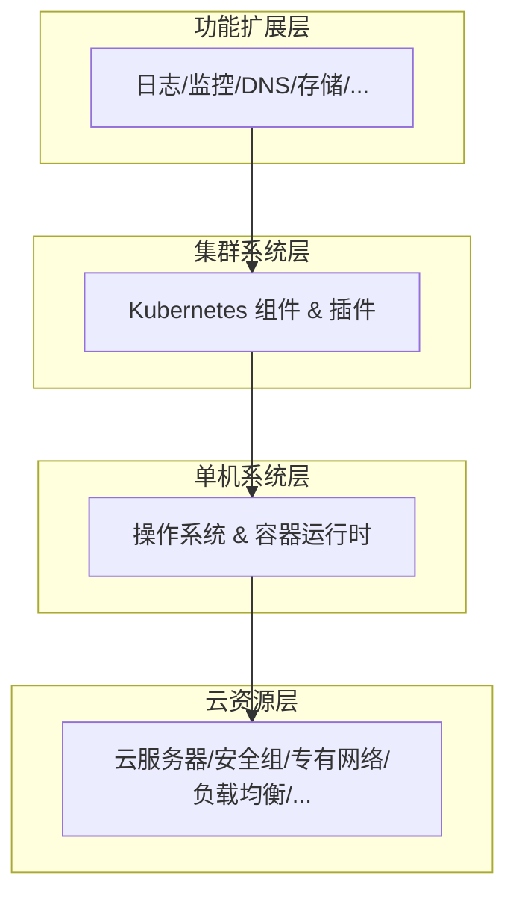
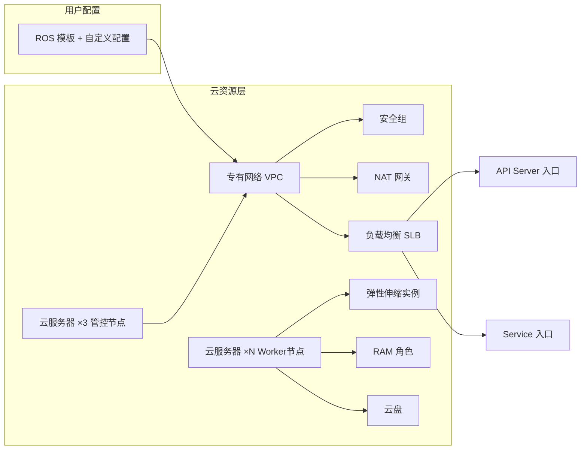
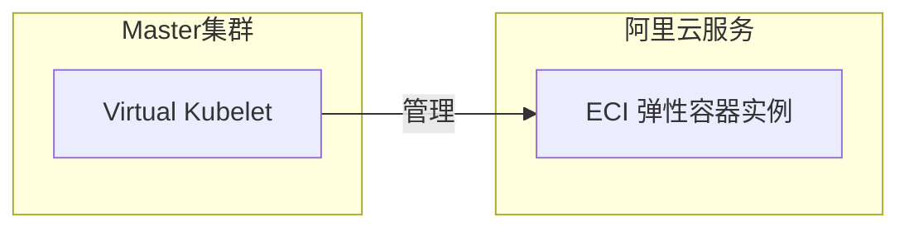
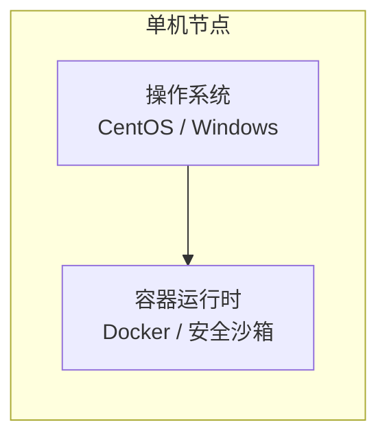
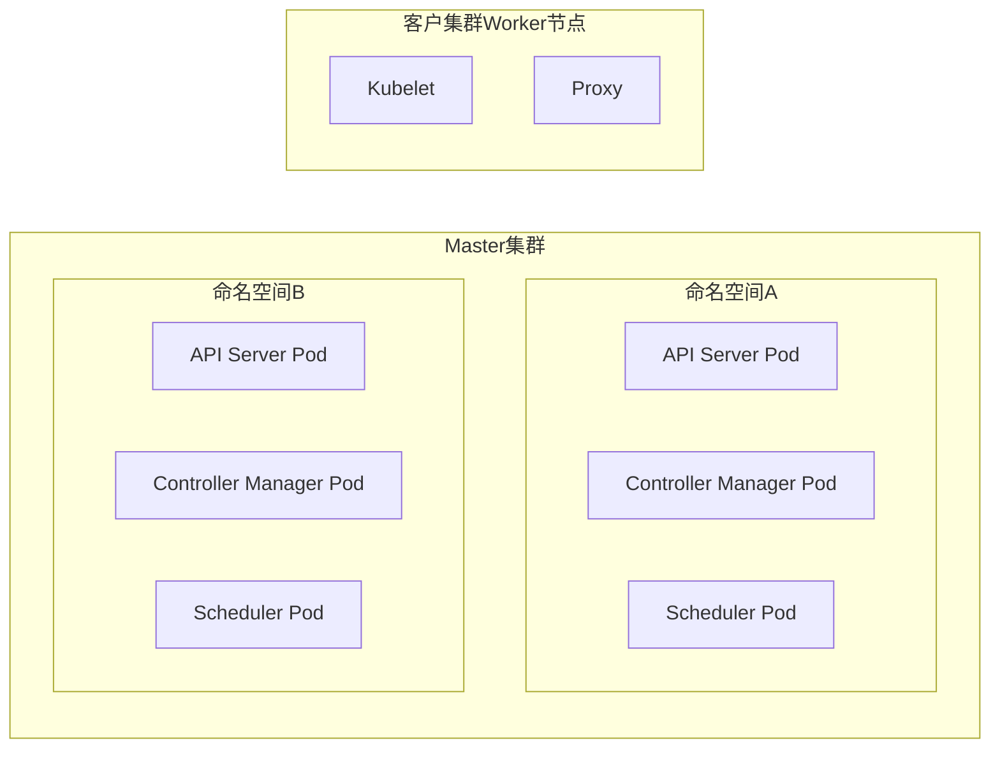
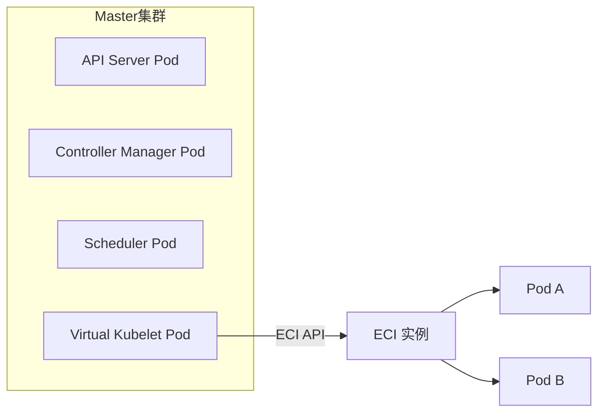
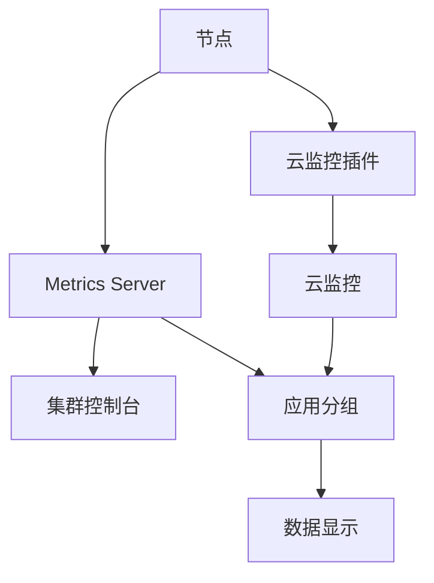
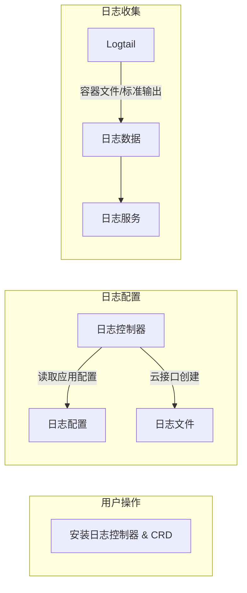
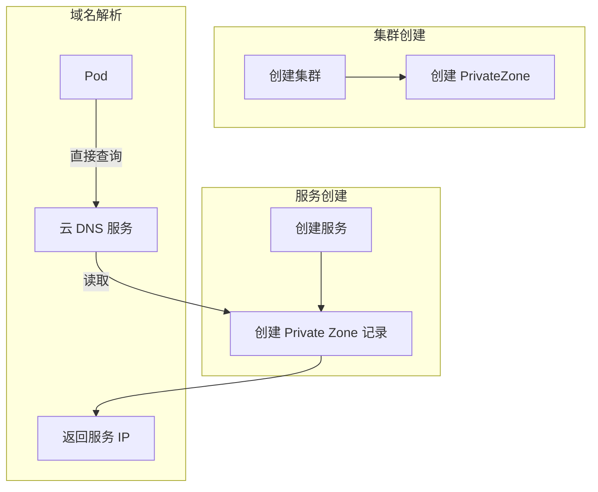

# 上篇 理论篇（技术进阶）

## 第1章 鸟瞰云上Kubernetes

云原生本质上是一套让用户用好云的技术栈。从目前的发展情况来看，**Kubernetes on Cloud** 是这套技术栈的主框架。这里的 Kubernetes on Cloud，说的是各个云厂商基于自己的云产品和开源 Kubernetes 软件实现的容器集群产品。

这些容器集群产品，以云服务器为节点，基于专有网络实现集群网络，依靠弹性伸缩实现节点伸缩等，从而吸收了云的弹性和 Kubernetes 的自动化运维等属性，给用户带来一加一大于二的资源优势和**人效优势**。

阿里云的 [[容器服务 Kubernetes]]（ACK）就是这样的产品。本章将从全景视野角度，以阿里云的实现为范本，总结云上 Kubernetes 的组成原理。本章不会囊括所有的组件细节，只会鸟瞰全局并总结技术要点。

> [!INFO] 目标读者：已具备 Kubernetes 基础知识的读者，希望通过本章对云上集群的整体架构形成宏观认识。

### 1.1 内容概要

从整体架构上来看，我们可以把阿里云 Kubernetes 集群分为**四层结构**，如图 1-1 所示。自下而上分别是：**云资源层**、**单机系统层**、**集群系统层**，以及**功能扩展层**。

- **云资源层**：包括集群使用的所有云资源，这也是需要用户付费的一层。
- **单机系统层**：包括节点的操作系统和容器运行时。
- **集群系统层**：包括 Kubernetes 系统组件以及插件。
- **功能扩展层**：基于下部的三层资源，并依靠一些特殊功能组件而实现的对集群功能的扩展。

**图 1-1 阿里云 Kubernetes 集群分层结构**



---

### 1.2 云资源层

云资源层和云上 Kubernetes 之间的关系，相当于计算机硬件与操作系统之间的关系。云资源层为 Kubernetes 提供了有弹性优势的软硬件基础，如**云服务器**、**安全组**、**专有网络**、**负载均衡**、**资源编排**等。

> [!NOTE] Kubernetes 本身并不提供任何计算、网络或存储资源，它仅仅是这些底层资源的封装。

容器集群对底层资源封装的程度，在不同厂商的实现中，可能完全不同。以阿里云为例，用户除了可以通过容器服务的接口使用集群外，还可以通过底层资源的接口（如负载均衡控制台）来对集群底层资源做操作。但是这种操作具有一定程度的风险，如无必要，不要直接操作底层资源。

在以下三节中，我们分别看一下阿里云容器集群三种形态的组成原理，包括**专有版**、**托管版**及 **Serverless 版**。

#### 1.2.1 专有版

首先是**资源管理**。专有版集群使用了多种云资源，如图 1-2 所示。在实现的时候，我们可以选择使用编码的方式来管理这些资源实例的生命周期，但这显然是低效的。阿里云的选择是，以**资源编排（ROS）模板**为基础，结合用户自定义配置来统一管理底层资源。

**图 1-2 阿里云专有版 Kubernetes 集群组成原理**



其次是**集群网络**。专有版集群在被创建之初，就被指定了专有网络 VPC 的配置，如节点网段等。VPC 实例被创建之后，其他所有集群资源，都必然和这个 VPC 实例相关联。VPC 的**安全组**，在这里扮演着集群网络的防火墙角色。

再次是**计算资源**。集群在默认情况下会创建三个云服务器作为**管控节点**，同时集群会根据用户的需求，创建若干云服务器作为集群的 **Worker 节点**。这些 Worker 节点与**弹性伸缩实例**绑定，以实现节点伸缩功能。集群节点和 **RAM**（访问控制）的角色绑定，以授权集群内部组件访问其他云资源。另外，集群节点可以挂载**云盘**并以本地存储形式来使用。

最后是**接口实现**。集群使用 **NAT 网关**作为集群默认的网络出口，使用 **SLB**（负载均衡）作为集群的入口，这包括 API Server 入口，以及图中未包括的 Service 的入口。

#### 1.2.2 托管版

托管版集群在资源管理、集群网络、Worker 节点，以及接口实现方面，基本上采用了与专有版集群相同的实现方法。

托管版与专有版的第一个差别，在于**管控组件**方面。托管版集群的管控组件，是用户不可见的。这些组件以 Pod 的形式运行在专门的 **Master 集群**里，如图 1-3 所示。

这会引入一个非常核心的问题，就是位于 Master 集群里的 **API Server Pod** 与位于客户集群里的**节点**之间的通信问题。因为 Master 集群是阿里云生产账号创建的集群，所以这实际上是一个**跨账号、跨 VPC** 通信的问题。

解决方法是使用一种特殊的**弹性网卡 ENI**。这种网卡逻辑上位于客户集群所在的 VPC 里，所以可以和 VPC 里的节点通信，而物理上被安装在 API Server Pod 里，即位于 Master 集群里。这就完美解决了 API Server Pod 与托管版集群节点之间的通信问题。

**图 1-3 阿里云托管版 Kubernetes 集群组成原理**

```mermaid
graph LR
    subgraph Master集群(阿里云生产账号)
        MasterVPC[VPC]
        APIServerPod[API Server Pod]
        ENI[弹性网卡 ENI]
    end
    subgraph 客户集群
        CustomerVPC[VPC]
        WorkerNode[Worker 节点]
    end
    APIServerPod --> ENI
    ENI -.-> CustomerVPC
    CustomerVPC --> WorkerNode
```

#### 1.2.3 Serverless 版

与前两种类型的集群相比，Serverless 版的实现要简单一些，可以看作前两种实现的简化版，如图 1-4 所示。

**图 1-4 阿里云 Serverless 版 Kubernetes 集群组成原理**



首先，Serverless 集群因为用到的云资源较少，且变化不大，所以我们直接通过编码的方式实现了资源管理。

其次，Serverless 使用 **ECI**（弹性容器实例）来运行 Pod，没有使用云服务器这样的计算资源。

最后，集群直接依靠运行于 Master 集群里的 **Virtual Kubelet** 来管理 ECI 实例。

---

### 1.3 单机系统层

单机系统层主要有两部分内容，分别是**操作系统**和**容器运行时**。从理论上来说，这两者的组合可以有很多变化，如 CentOS 和 Docker，Windows 和 Docker 等。阿里云单机系统层主要支持 **CentOS** 和 **Windows** 两种操作系统，以及 **Docker** 和 **安全沙箱** 两种容器运行时。

Kubernetes 集群单机系统层结构如图 1-5 所示。

**图 1-5 Kubernetes 集群单机系统层结构**



> [!WARNING] 从整体架构来看，操作系统和容器运行时比较简单直接，但是按经验来讲，如果这两部分出现问题，会极大地影响集群的整体稳定性。本书实践篇的前两个案例（第13章、第14章），是专门针对这两部分内容的。

---

### 1.4 集群系统层

集群系统层是指 Kubernetes 及其组件，比如网络组件 **CNI**、存储插件 **FlexVolume** 等。这部分内容，实际上是大部分工程师学习 Kubernetes 的起点，也是工程师相对比较熟悉的一部分内容。

为了适配云环境，以及支持百万级线上集群稳定运行，阿里云三种版本 Kubernetes 集群的实现，对原生的 Kubernetes 做了一些定制和改造。比如为了支持托管版和 Serverless 版，API Server 的形态和部署位置都做了调整。

#### 1.4.1 专有版

总体上来说，集群系统层的组件和功能，在专有版集群里，体现在 Master 节点和 Worker 节点上。

在 **Master 节点**上，运行着集群中心数据库 **Etcd**，以及集群管控的三大件 **API Server**、**Controller Manager** 和 **Scheduler**，另外包括 **Cloud Controller Manager** 等定制组件。

在 **Worker 节点**上，运行着服务代理 **Proxy**、节点代理 **Kubelet**，以及网络插件和存储插件等自定义组件，如图 1-6 所示。

**图 1-6 专有版集群系统层架构**

```mermaid
graph LR
    subgraph Master节点×3
        etcd[Etcd]
        API[API Server]
        CM[Controller Manager]
        Sched[Scheduler]
        CCM[Cloud Controller Manager]
    end
    subgraph Worker节点×N
        Kubelet[Kubelet]
        Proxy[Kube Proxy]
        CNI[网络插件 CNI]
        Storage[存储插件]
    end
```

#### 1.4.2 托管版

在托管版集群的实现中，Kubernetes 管控三大件被封装成 Pod，运行在 Master 集群隔离的命名空间中，如图 1-7 所示。

Master 集群里混合部署了很多集群的管控三大件。我们通过**主备 Pod** 以及集群本身的高可用特性，保证用户集群管控三大件的高可用。

**图 1-7 托管版集群系统层架构**



#### 1.4.3 Serverless 版

从集群系统层的角度来看 Serverless 版和托管版集群，两者的实现是非常类似的。如图 1-8 所示，Serverless 版也使用了 Master 集群，并以 Pod 的形式来管理集群的管控三大件。

不一样的地方在于，Serverless 版集群在 Master 集群里部署了 **Virtual Kubelet** 组件，这个组件会直接通过 ECI 编程接口来管理 ECI 实例生命周期，给 Pod 提供运行环境。

**图 1-8 Serverless 版集群系统层架构**



---

### 1.5 功能扩展层

功能扩展层是对包括**日志**、**监控**、**存储**、**镜像**、**路由**、**负载均衡**、**伸缩**、**DNS** 和**包管理**在内的，大量 Kubernetes on Cloud 集群扩展组件的合称。

如果没有功能扩展层，那么 Kubernetes 集群在云上的实现，基本上只能被称为 **IaaS+**，即没有从根本上改变用户使用底层云资源的方式。而有了不断丰富的功能扩展层，集群才不断地接近 **PaaS**。

大部分扩展组件都是基于某些云产品，同时采用**自定义控制器**的方式来实现的。比如监控扩展组件，就包括了云监控和监控控制器等部分。

这一节我们不会穷尽所有扩展组件，而是以**监控**、**日志**及 **DNS** 为例，总结功能扩展层的一般性规律和实现原理。

#### 1.5.1 监控

监控的实现，可以分为三个阶段，分别是**应用分组的创建**、**性能数据的收集**，以及**性能数据的上传和显示**。

1. **应用分组的创建**：简单来说，就是运行在节点上的监控控制器通过云监控接口创建应用分组的操作。这个操作会在云监控里为集群中的应用创建对应的数据显示模板。
2. **性能数据的收集**有两个方面：
   - 云监控插件对集群节点性能数据的收集。
   - Metrics Server 通过集群管控入口对集群 Pod 性能数据的收集。
3. **性能数据的上传和显示**，有三部分内容：
   - Metrics Server 将性能数据上传到集群控制台并使其显示出来。
   - Metrics Server 将性能数据上传到应用分组并使其显示出来。
   - 云监控插件将主机性能数据上传到云监控并使其显示出来。

阿里云 Kubernetes 集群监控系统如图 1-9 所示。

**图 1-9 阿里云 Kubernetes 集群监控系统**



#### 1.5.2 日志

与监控扩展组件类似，阿里云 Kubernetes 集群的日志扩展组件，大体上也可以分为三个阶段，分别是**组件部署阶段**、**日志配置阶段**和**日志收集阶段**。

1. **组件部署阶段**：用户需要给集群安装日志控制器，包括实现的日志服务的扩展资源定义 CRD。
2. **日志配置阶段**：日志控制器会读取应用日志相关配置，并通过日志服务的云接口，创建对应的日志文件和配置。
3. **日志收集阶段**：日志收集工具 **Logtail** 会从容器文件或者标准输出中获取日志数据，并同步到日志服务。

阿里云 Kubernetes 集群日志系统如图 1-10 所示。

**图 1-10 阿里云 Kubernetes 集群日志系统**



#### 1.5.3 DNS

集群对 DNS 的扩展实现，可以分两种情况，分别是**基于 Core DNS 的实现**和**基于云解析 DNS 的实现**。前一种实现适用于专有版和托管版集群，后一种实现适用于 Serverless 版集群。

**基于 Core DNS 的域名解析服务**，主要依靠两个机制形成的阶梯状的服务发现机制，具体实现参考图 1-11。

1. **Kubernetes 服务发现机制**：Core DNS 在收到 Pod 发出的域名解析请求的时候，第一步是去 Kubernetes 查询。
2. **云 DNS 服务**：如果 Core DNS 从 Kubernetes 得到的响应是找不到对应的域名，则会进一步去云 DNS 服务查询。

**图 1-11 阿里云 Kubernetes 集群 DNS 系统**

```mermaid
graph LR
    Pod[Pod] -->|DNS查询| CoreDNS[Core DNS]
    CoreDNS -->|第一步| K8sDNS[Kubernetes 服务发现]
    K8sDNS -->|找到| Response**图 1-11 阿里云 Kubernetes 集群 DNS 系统**

```mermaid
graph LR
    Pod[Pod] -->|DNS查询| CoreDNS[Core DNS]
    CoreDNS -->|第一步| K8sDNS[Kubernetes 服务发现]
    K8sDNS -->|找到| Response[返回解析结果]
    K8sDNS -->|未找到| CloudDNS[云 DNS 服务]
    CloudDNS --> Response
```

**基于云解析的域名解析服务**,主要依靠阿里云云解析产品来注册 Serverless 集群内服务域名.具体步骤如图 1-12 所示.

1. 在 Serverless 集群创建的时候,集群管控会为集群创建一个对应的 **PrivateZone**.
2. 在用户创建服务的时候,集群管控会为服务域名创建对应的 Private Zone 记录.
3. 在 Pod 尝试访问服务域名的时候,Pod 会直接通过云 DNS 服务来做域名解析,而域名解析所使用的数据,正是上一步创建的 Private 记录.

**图 1-12 阿里云 Server Kubernetes 集群 DNS 系统**



---

### 1.6 总结

总的来说，我们可以把 **Kubernetes on Cloud** 看作云原生技术栈的主框架，所有其他的扩展，包括[[服务网格]]等，都使这个主框架更加丰富。

本章以分层的方法，研究了 Kubernetes on Cloud 的组成原理，包括了**云资源层**、**单机系统层**、**集群系统层**，以及**功能扩展层**。我们的研究基于阿里云容器服务 Kubernetes 版。

希望通过对本章的学习，读者可以对集群的组成原理有宏观的认识。在后续章节中，我们会针对具体功能和组件，如**控制器**、**网络**、**节点伸缩**等做进一步探究。