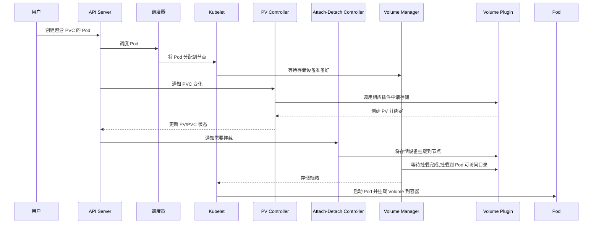

# 第10章 集群与存储系统

在云环境中，存储资源和计算资源的管理方式往往不同。为了能够屏蔽底层不同存储厂商存储实现的细节，Kubernetes 引入了 **Persistent Volume Claim (PVC)**、**Persistent Volume (PV)**、**Storage Class (SC)** 等 API 原语（Primitive），以及抽象出来一套标准的可以与 Kubernetes 交互的接口（FlexVolume、SI），将具体的存储实现与 Kubernetes 自身解耦。

本章内容深入分析 Kubernetes 集群存储系统的核心设计思想与基本原理。

## 10.1 从应用的状态谈起

在 Kubernetes 集群中的应用大致可分为 **无状态应用** 和 **有状态应用** 这两种类型。这两种应用对存储的需求不同。

### 10.1.1 无状态的应用

Kubernetes 使用 [[ReplicaSet]] 来保证应用 Pod 实例的在线数量。如果应用的某个实例由于某种原因崩溃了（如 Pod 所在的宿主机出故障了），ReplicaSet 会立刻用相同模板创建并启动一个新实例来替代它。

由于是无状态的应用，新实例与旧实例一模一样，所以新实例能做到对旧实例的无损替代。此外，Kubernetes 通过负载均衡 [[Service]] 的方式，对外提供一个稳定的访问接口，实现应用的高可用。

### 10.1.2 有状态的应用

对于有状态的应用，Kubernetes 引入了 [[StatefulSet]]。StatefulSet 配合 [[PVC]] 和 [[PV]]，可以将应用的状态存储到远端。这样的应用 Pod 在遇到宿主机等的故障迁移后，通过复用之前的远端存储，可实现应用带状态的迁移。

而 StatefulSet 是通过保持其管理的每个 Pod 名字的有序性和不变性的方式，建立了 Pod 名字与该 Pod 使用的存储（通过 PVC 来描述）的一一对应关系，从而保证了同名的 Pod 发布或迁移过程中始终可以使用“同一份”远程存储。

## 10.2 基本单元：Pod Volume

Kubernetes 中的最小调度单位是 [[Pod]]，可以认为一个 Pod 是一个具体的微服务实例，它一般会包含多个容器。这些容器共享根容器 Pause 的网络命名空间，并可共享在 Pod 中声明的所有 Volume。

[[Pod Volume]] 是对 [[Docker Volume]] 的一种更高层次的抽象，属于 Pod 对象的一部分，面向的是应用实例 Pod，而不是容器粒度。这里我们对 Kubernetes 中 Pod Volume 可以使用的 Volume 类型做一下简单的分类。

1. **本地存储**：`EmptyDir`、`HostPath` 等，主要使用 Pod 运行节点上的本地存储。
2. **网络（分布式）存储**：
   - **In-tree（内置）**：`awsElasticBlockStore`、`gcePersistentDisk`、`nfs` 等。存储插件的实现代码放在 Kubernetes 代码仓库中。
   - **Out-of-tree（外置）**：[[FlexVolume]]、[[CSI]] 等网络存储 Inline Volume Plugin，存储插件单独实现。特别是，CSI 是 Volume 扩展机制的核心发展方向。
3. **Projected Volume**：[[Secret]]、[[ConfigMap]]、[[DownwardAPI]]、[[ServiceAccountToken]]，将 Kubernetes 集群中的一些配置信息以 Volume 的方式挂载到 Pod 的容器中，即应用可以通过 POSIX 接口来访问这些对象中的数据。
4. **PVC 与 PV 体系**：Kubernetes 中将存储资源与计算资源分开管理的核心设计。

## 10.3 核心设计：PVC 与 PV 体系

在 Kubernetes 中通过引入 [[PVC]] 和 [[PV]] 资源对象的设计，来解耦 Pod 和 Pod 使用的存储的生命周期管理，而 PVC 和 PV 资源对象由一组单独的 Kubernetes Controller 来管理。这样的设计可以给以下常见的场景带来良好的扩展性：

- **宿主机故障数据迁移**（如 StatefulSet 管理的 Pod 带远程 Volume 迁移）。
- **多 Pod 共享同一个数据 Volume**（如共享 NFS 文件系统）。
- **Volume Snapshot 和在线扩容 Size** 等功能的扩展。

> [!INFO] PVC 与 PV 的区别
> 为什么 Kubernetes 要引入两个看起来相近的资源对象？  
> 简单来说是为了简化用户使用存储的过程，区分**存储使用方**与**存储服务提供方**的职责。用户只需通过 **PVC** 声明自己需要的存储 Size、AccessMode（单 Node 独占还是多 Node 共享？只读还是读写访问？）等业务真正关心的需求，而不用关心存储系统的实现细节，**PV** 和其对应的后端复杂信息完全可以交由 Kubernetes Cluster 或 Administrator 统一维护和管控。

接下来我们介绍在 Kubernetes 中通过 PVC 和 PV 使用存储的两种方式。

### （1）预先声明 PV 的静态方式

所需存储类型、大小等预先定义和分配好，一般来说相应的存储是预先分配好的，这种使用方式不够灵活，如图 10-1 所示。

> [!NOTE] **图 10-1** 以静态方式使用存储  
> （此处为图片占位符，原图描述：展示静态方式中 PV 预先创建，PVC 请求时绑定到预先分配好的 PV）

### （2）通过 SC 按需动态分配方式

SC（[[Storage Class]]）用于声明动态申请的存储 Volume 将由哪种 Volume Plugin 创建、创建时的参数，还可以从其他功能性和非功能性角度进行描述。这种方式可按需动态分配，使用起来比较灵活，在 Kubernetes 中比较常用，如图 10-2 所示。

> [!NOTE] **图 10-2** 以动态方式使用存储  
> （此处为图片占位符，原图描述：展示动态方式中，PVC 请求通过 SC 触发 Provisioner 动态创建 PV 并绑定）

## 10.4 与特定存储系统解耦

### 10.4.1 Volume Plugin

前面我们从应用的角度分析了，Kubernetes 为了给在其上运行的容器化服务提供存储能力所引入的抽象出来的资源对象。接下来我们看一下 Kubernetes 与存储系统的交互机制，以及其与特定存储系统一步步的解耦过程。

简单来说，我们对存储系统的核心需求有两个：
- 申请存储空间
- 将其最终挂载到应用容器中

对用户来说，只需要创建资源对象（PVC）。而真正替我们实现这两个核心需求的，是集群中的**存储相关控制器**。存储相关控制器会“观察”到资源字段的变化，并触发相应的动作来完成存储申请和挂载等操作。

下面我们结合图 10-3 来介绍一个包含 PVC 的 Pod 的创建过程，以及各组件的交互细节。

> [!NOTE] **图 10-3** 集群存储插件交互流程  
> 步骤说明：
> 1. 用户通过 API Server 创建包含 PVC 的 Pod 对象。
> 2. 调度器把这个 Pod 分配给某个节点。
> 3. Kubelet 开始等待 Volume Manager 准备好存储设备。
> 4. PV Controller 调用相应 Volume Plugin 申请存储并创建 PV 与 PVC 绑定。
> 5. Attach-Detach Controller 或者 Kubelet 的 Volume Manager 通过 Volume Plugin 将存储设备挂载到节点上。
> 6. Volume Manager 等待存储设备挂载完成后，将 Volume 挂载到 Pod 可访问的目录下。
> 7. Kubelet 启动 Pod 并将存储挂载到相应的容器中。

总的来说，就是通过 PV Controller 监控 PV、PVC、SC 等资源对象，然后调用相应的存储插件去申请存储空间，并通过 Attach-Detach Controller 或 Kubelet Volume Manager 将相应存储空间挂载到指定节点上，然后 Pod 在启动的过程中将其挂载到容器可访问的目录上。

### 10.4.2 in-tree（内置）Volume Plugin

早期与特定存储交互的逻辑是直接写到 Kubernetes 的代码中的（如图 10-3 中的 GCE、Azure 存储插件），这种被称为 **in-tree** 的方式。随着支持 Kubernetes 的云厂商的不断增加，这会对 Kubernetes 本身的维护和发展造成难以控制的影响。

因此从 **Kubernetes 1.8** 开始，Kubernetes Storage SIG 停止接受 in-tree Volume Plugin，并建议所有存储提供商使用 **out-of-tree Volume Plugin**。目前有两种推荐实现方式：[[FlexVolume]] 和 [[容器存储接口 CSI]]。

### 10.4.3 out-of-tree（外置）Volume Plugin

**FlexVolume** 把 Kubelet 对它的调用转化为对可执行程序命令行的调用。其基本思路就是把自己实现的卷插件程序放到指定的路径，供 Kubelet 创建 Pod 过程中的特定阶段调用。这样通过二进制命令行形式扩展存储插件能够提供的功能非常有限，部署也很不方便。

**CSI** 通过规定一组标准的网络 Client 调用接口（[[gRPC 接口]]），让存储提供商去提供网络服务端的调用实现。这样存储系统就完全是外置的服务进程，甚至可以“跑”在容器中，其架构如图 10-4 所示。

> [!NOTE] **图 10-4** 集群存储 CSI 架构  
> （此处为图片占位符，原图描述：CSI 架构包含 CSI Controller、CSI Node、External-Provisioner、External-Attacher 等组件，Storage Provider 实现 CSI 服务端接口）

## 10.5 Kubernetes CSI 管控组件容器化部署

通过 CSI 接口，Kubernetes 和 Storage Provider 变得泾渭分明，存储系统的功能开发从 Kubernetes 中彻底剥离了出来，并且可以将存储插件以容器化的方式部署，可借助 Kubernetes 的能力大大提升存储插件的易用性和稳定性。

图 10-5 中的部署方式是官方推荐的方式。与特定存储相关的组件（**Third Storage Vendor Container**）完全可以由普通的容器化应用通过 Kubernetes 来部署，Kubernetes 与存储系统的交互也通过社区实现的通用组件（**external-provisioner**、**csi-attacher**、**node-driver-registrar** 等）实现了标准化。存储提供方只用实现图中绿色的部分就可以将一个具体的存储系统对接到 Kubernetes 中供容器化的应用使用。

> [!NOTE] **图 10-5** 管控组件容器化部署  
> （此处为图片占位符，原图描述：展示 Kubernetes 集群中部署了 CSI 相关组件：StatefulSet 或 Deployment 形式的 external-provisioner、csi-attacher、node-driver-registrar，以及存储厂商提供的 CSI 容器）

## 10.6 基于 Kubernetes 的存储：Rook 项目

本节我们通过一个“跑”在 Kubernetes 上的社区项目 [[Rook]] 来介绍存储系统如何借助 Kubernetes 来简化存储系统本身的运维。

Rook 是专用于云原生环境的文件、块、对象存储服务，它依赖 Kubernetes 实现了一个可以自我管理、自我扩容和自我修复的分布式存储服务。支持自动部署、启动、配置、分配、扩容、缩容、升级、迁移、灾难恢复、监控，以及资源管理等功能，并通过 [[FlexVolume]] 卷插件扩展 Kubernetes 的存储系统。Pod 可以挂载 Rook 管理的块设备或者文件系统。

Rook 与 Kubernetes 的交互关系如图 10-6 所示。

> [!NOTE] **图 10-6** Rook 与 Kubernetes 的交互关系  
> （此处为图片占位符，原图描述：Rook 组件作为 Kubernetes Pod 运行，通过 CRD 和 Operator 管理存储集群，提供 PV/FlexVolume 接口给 Kubernetes）

像 Rook 这种以服务的方式寄生在容器编排系统上，并为编排系统上运行的容器化应用提供基础存储服务的做法，可大幅降低存储系统自身的运维成本，对以后存储系统的演进也是很好的参考对象。

## 10.7 总结

Kubernetes 通过 **PVC 和 PV 体系**来简化容器化的应用使用存储的方式，同时通过 **CSI** 来解耦存储系统和 Kubernetes 的交互流程并使其标准化。随着 Kubernetes 的进一步普及，存储系统借助 Kubernetes 来简化自身部署、运维，保证自身稳定性，这些也是未来的趋势。