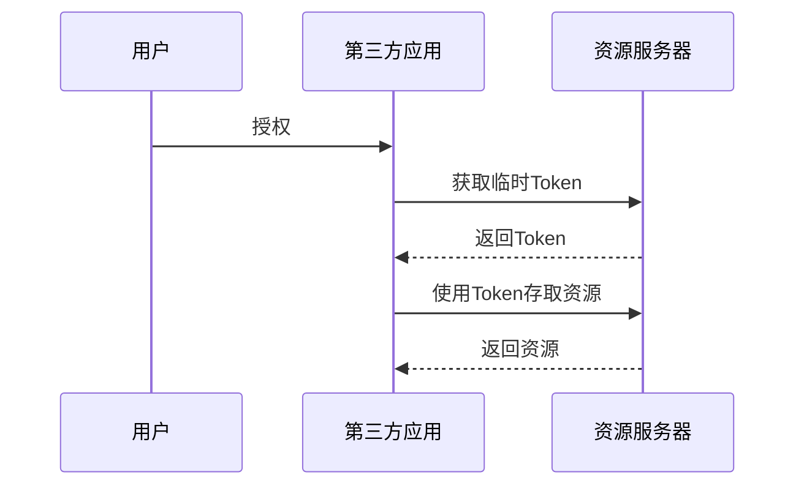
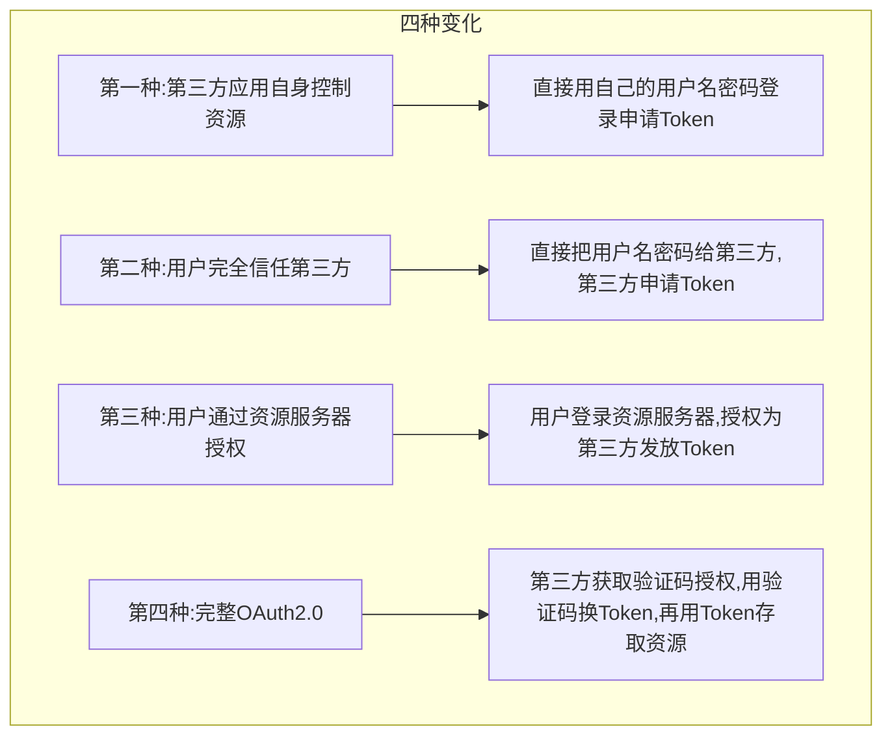
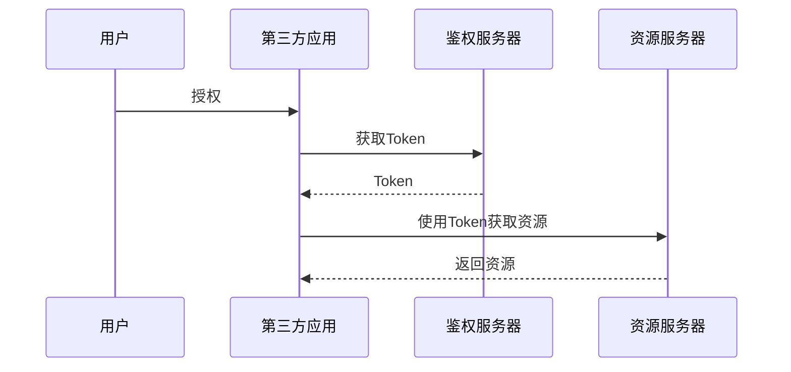
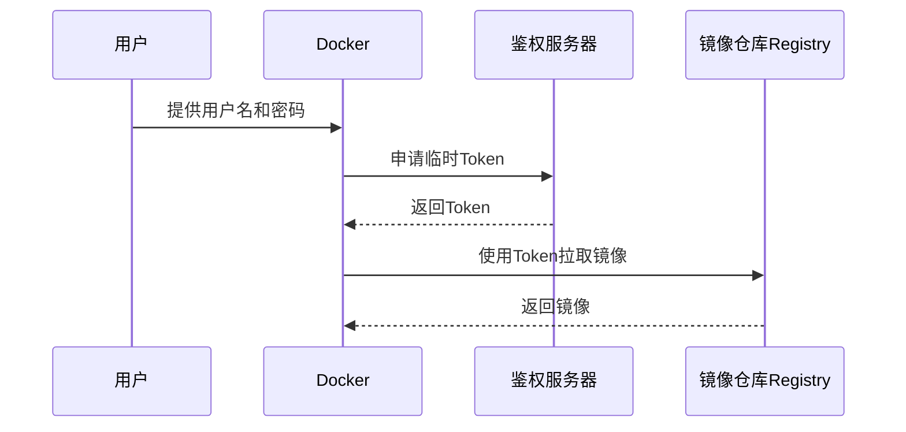
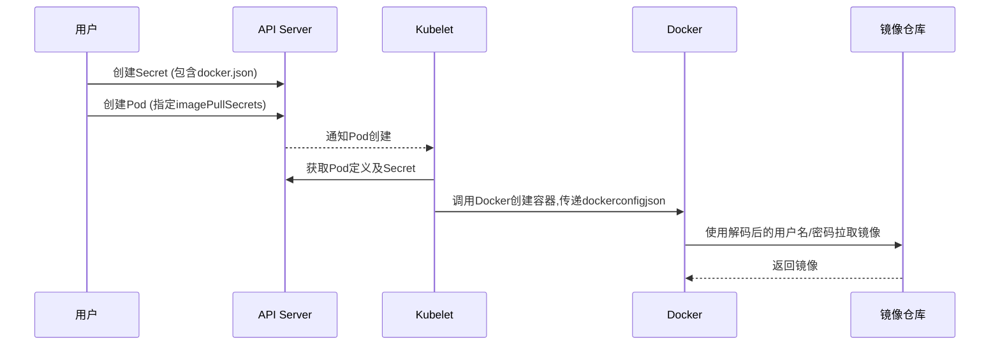
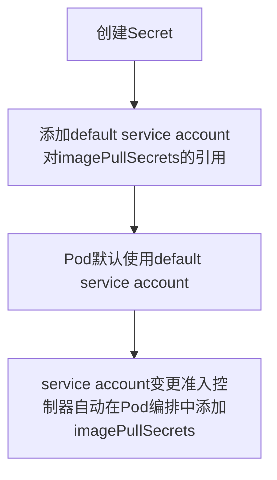
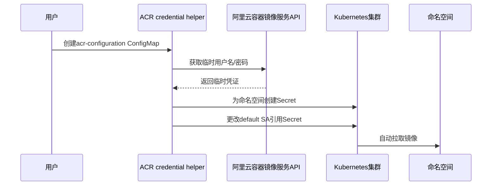

# 第8章 镜像下载自动化

> [!INFO] 本章导读
> 与Kubernetes集群的其他功能相比，私有镜像的自动拉取看起来可能是比较简单的。而镜像拉取失败，大多数情况下都和权限有关。所以，在处理相关问题的时候，我们往往会轻松地说：这个问题很简单，肯定是权限问题。
> 
> 但实际情况是，我们经常为一个问题花了很多时间却找不到原因。这主要还是因为我们对镜像拉取，特别是私有镜像自动拉取的原理理解不深。本章内容讨论镜像自动下载的相关原理。
> 
> 从顺序上来说，私有镜像自动拉取会首先通过[[阿里云ACR credential helper]] 组件，再经过Kubernetes集群的[[API Server]]和[[Kubelet]]组件，最后到[[Docker容器运行时]]。但是本章的叙述会从后往前，从最基本的[[Docker镜像拉取]]说起。

---

## 8.1 镜像下载这件小事

为了讨论方便，我们来设想一个场景。很多人会使用网盘来存放一些文件，像照片、文档之类。当我们需要存取文件的时候，我们需要向网盘提供用户名和密码，这样网盘就能验证我们的身份。这时，我们是文件资源的所有者，而网盘则扮演着资源服务器的角色。用户名和密码作为认证方式，保证只有我们自己可以存取自己的文件，如图8-1所示。

**图8-1 存取网盘数据**  
  
*（图像说明：展示用户向网盘提供用户名密码存取文件的流程）*

这个场景足够简单，但我们很快就会遇到新需求：我们需要使用一个在线制作相册的应用（以下简称相册）。按正常的使用流程，我们需要把网盘中的照片下载到本地，然后再把照片上传到相册中。

这个过程是比较烦琐的。我们能想到的优化方法是，让相册直接访问网盘来获取我们的照片。而这需要我们把用户名和密码的使用权授予相册。

这样的授权方式，优点显而易见，但缺点也是很明显的：我们把网盘的用户名和密码给了相册，相册就拥有了读写网盘的能力，从数据安全角度来看，这是很可怕的。

其实这是很多应用都会遇到的一般性场景，私有镜像拉取其实也是这样的场景。这里的镜像仓库就跟网盘一样，是资源服务器，而容器集群则是第三方服务，它需要访问镜像仓库获取镜像，如图8-2所示。

**图8-2 私有镜像拉取**  
  
*（图像说明：镜像仓库作为资源服务器，容器集群作为第三方服务，需要获取镜像）*

---

## 8.2 理解OAuth 2.0协议

协议OAuth是为了解决上述问题设计的一种标准方案，我们的讨论针对2.0版。与把用户名和密码直接给第三方应用不同，此协议采用了一种间接的方式来达到同样的目的。

如图8-3所示，这个协议包括三个部分，分别是第三方应用获取用户授权、第三方应用获取临时Token以及第三方应用存取资源。



**图8-3 OAuth 2.0协议**  
  
*（图像说明：协议三部分——用户授权、获取临时Token、存取资源）*

这六步理解起来不容易，主要是因为安全协议的设计，需要考虑协议的易证明性，所以我们换一种方式来解释这个协议。

简单来说，这个协议其实就做了两件事情：在用户授权的情况下，第三方应用获取Token所表示的临时访问权限，然后第三方应用使用这个Token去获取资源。

如果用网盘的例子来说明，那就是用户授权网盘为相册创建临时Token，然后相册使用这个Token去网盘中获取用户的照片。

实际上OAuth 2.0各个变种的核心差别在于第一件事情，就是用户授权给资源服务器的方式。这个差别演化出图8-4中的四种情况。



**图8-4 OAuth 2.0协议的四种变化**  
  
*（图像说明：四种授权方式的差异）*

第一种，也是最简单的一种。适用于第三方应用本身就拥有被访问资源控制权限的情况。在这种情况下，第三方应用只需要用自己的用户名和密码登录资源服务器并申请临时Token即可。

第二种，用户在对第三方应用足够信任的情况下，直接把用户名和密码给第三方应用，第三方应用使用用户名和密码向资源服务器申请临时Token。

第三种，用户通过资源服务器提供的接口，登录资源服务器并授权让资源服务器为第三方应用发放Token。

第四种，完整实现OAuth 2.0协议，也是最安全的。第三方应用首先获取以验证码表示的用户授权，然后用此验证码向资源服务器换取临时Token，最后使用Token存取资源。

从上面的描述中我们可以看到，资源服务器实际上扮演了鉴权和资源管理两种角色，这两者分开实现的话，协议流程会变成图8-5这样。



**图8-5 鉴权和资源服务器拆分**  
  
*（图像说明：鉴权服务器和资源服务器分离的协议流程）*

---

## 8.3 Docker扮演的角色

### 8.3.1 整体结构

如图8-6所示，镜像仓库Registry的实现目前使用“把用户名和密码给第三方应用”的方式。即假设用户对Docker足够信任，用户直接将用户名和密码交给Docker，然后Docker使用用户名和密码向鉴权服务器申请临时Token。



**图8-6 Docker鉴权服务器的实现**  
  
*（图像说明：Docker使用用户提供的用户名密码向鉴权服务器申请Token，再用Token拉取镜像）*

### 8.3.2 理解docker login

首先，我们在拉取私有镜像之前，要使用 `docker login` 命令来登录镜像仓库。这里的登录其实并没有和镜像仓库建立什么会话之类的关系。

登录主要做了三件事情。

第一件事情是向用户要用户名和密码。当执行登录命令时，这个命令会提示输入用户名和密码，这件事情对应的是图中的第一步。

第二件事情，docker访问镜像仓库的HTTPS地址，并通过挑战v2接口来确认接口是否会返回 `Docker-Distribution-Api-Version` 头字段。这件事情在图8-6中没有对应的步骤，它的作用跟ping差不多，只是确认一下v2镜像仓库是否在线，以及版本是否匹配。

第三件事情，docker使用用户提供的用户名和密码，访问 `Www-Authenticate` 头字段返回的鉴权服务器的地址 `Bearer realm`。

如果访问成功，则鉴权服务器会返回jwt格式的Token给docker，然后docker会把用户名和密码编码并保存在用户目录的 `.docker/docker.json` 文件里。

以下是登录仓库之后的 `docker.json` 文件。这个文件作为docker登录仓库的唯一证据，在后续镜像仓库操作中，会被不断地读取并使用。其中关键信息 `auth` 就是用户名和密码的Base64编码。

```json
{
  "auths": {
    "registry.example.com": {
      "auth": "base64encoded_username:password"
    }
  }
}
```

### 8.3.3 拉取镜像是怎么回事

镜像一般会包括两部分内容：一是[[manifests]]文件，这个文件定义了镜像的元数据；二是镜像层，是实际的镜像分层文件。镜像拉取基本上是围绕这两部分内容展开的。因为本章的重点是权限问题，所以我们只以manifests文件拉取为例进行讲解。

要拉取manifests文件基本上会做三件事情。首先，docker直接访问镜像manifests的地址，以便获取 `Www-Authenticate` 头字段。这个字段包括鉴权服务器的地址 `Bearer realm`，镜像服务地址 `service`，以及定义了镜像和操作的 `scope`。

接着，docker访问上面拿到的 `Bearer realm` 地址来鉴权，并在鉴权之后获取一个临时的Token。这对应着图8-6中使用用户名和密码获取临时Token这一步，使用的用户名和密码直接读取自 `docker.json` 文件。

最后，使用上面的Token，以 `Authorization` 头字段的方式下载manifests文件。这对应的是图8-6中下载资源这一步。当然因为镜像还有分层文件，所以实际上docker还会用这个临时Token多次下载文件才能实现完整的镜像下载。

---

## 8.4 Kubernetes实现的私有镜像自动拉取

### 8.4.1 基本功能

Kubernetes集群一般会管理多个节点，每个节点都有自己的docker环境。如果让用户分别到集群节点上登录镜像仓库，显然是很不方便的。

为了解决这个问题，Kubernetes实现了自动拉取镜像的功能。如图8-7所示，这个功能的核心，是把 `docker.json` 内容编码，并以 `Secret` 的方式作为Pod定义的一部分传给[[Kubelet]]。



**图8-7 私有镜像拉取基本方式**  
  
*（图像说明：Kubernetes通过Secret传递docker.json到Kubelet，再由Docker拉取镜像）*

具体来说，步骤如下：

**第一步**，创建Secret。这个Secret的 `.dockerconfigjson` 数据项包括了一份Base64编码的docker.json文件。

**第二步**，创建Pod，且使Pod编排中 `imagePullSecrets` 指向第一步创建的Secret。

**第三步**，Kubelet作为集群控制器，监控着集群的变化。当它发现新的Pod被创建时，就会通过API Server获取Pod的定义，这包括 `imagePullSecrets` 引用的Secret。

**第四步**，Kubelet调用docker创建容器且把 `.dockerconfigjson` 传给docker。

**第五步**，运行时docker使用解码得到的用户名和密码拉取镜像，这和上一节的方法一致。

### 8.4.2 进阶方式

上面的功能在一定程度上解决了集群节点登录镜像仓库不方便的问题，但是我们在创建Pod的时候，仍然需要给Pod指定 `imagePullSecrets`。

Kubernetes通过[[变更准入控制]]（Mutating Admission Control）进一步优化了上面的基本功能，如图8-8所示。



**图8-8 私有镜像拉取进阶方式**  
  
*（图像说明：通过Mutating Admission Control自动注入imagePullSecrets）*

进一步优化的内容如下：

- 一是在第一步创建Secret之后，添加 `default service account` 对 `imagePullSecrets` 的引用。
- 二是Pod默认使用 `default service account`，而 `service account` 变更准入控制器会在 `default service account` 引用 `imagePullSecrets` 的情况下，在Pod的编排文件里添加 `imagePullSecrets` 配置。

---

## 8.5 阿里云实现的ACR credential helper

阿里云容器服务团队在Kubernetes的基础上实现了控制器[[ACR credential helper]]，如图8-9所示。这个控制器可以让同时使用阿里云Kubernetes集群和容器镜像服务产品的用户，在不用配置自己用户名和密码的情况下，自动使用私有仓库中的容器镜像。



**图8-9 阿里云ACR credential helper组件实现**  
  
*（图像说明：ACR credential helper监听ConfigMap，通过API获取临时凭证，自动创建Secret并修改SA）*

具体来说，控制器会监听 `acr-configuration` 这个ConfigMap的变化，其主要关心 `acr-registry` 和 `watch-namespace` 这两个配置。

前一个配置指定为临时账户授权的镜像仓库地址，后一个配置管理可以自动拉取镜像的命名空间。当控制器发现有命名空间需要被配置却没有被配置的时候，它会通过阿里云容器镜像服务的API来获取临时用户名和密码。

有了临时用户名和密码，ACR credential helper就为命名空间创建对应的Secret以及更改default SA来引用这个Secret。这样，控制器和Kubernetes集群本身的功能，一起使阿里云Kubernetes集群拉取阿里云容器镜像服务上的镜像的全部流程自动化了。

---

## 8.6 总结

总的来说，理解私有镜像自动拉取的实现，有一个难点和一个重点。

- **难点**：[[OAuth 2.0]]安全协议的原理，上文主要分析了为什么OAuth会这么设计。
- **重点**：[[集群控制器原理]]，因为整个自动化的过程，实际上是包括[[Admission control]]和[[ACR credential helper]]在内的多个控制器协作的结果。

> [!TIP] 学习路径建议
> 建议先掌握基础的Docker镜像拉取流程（8.3节），再理解Kubernetes自动拉取的机制（8.4节），最后学习阿里云实现的进阶自动化方案（8.5节）。OAuth 2.0协议（8.2节）可以作为理论支撑，理解为什么这样设计。