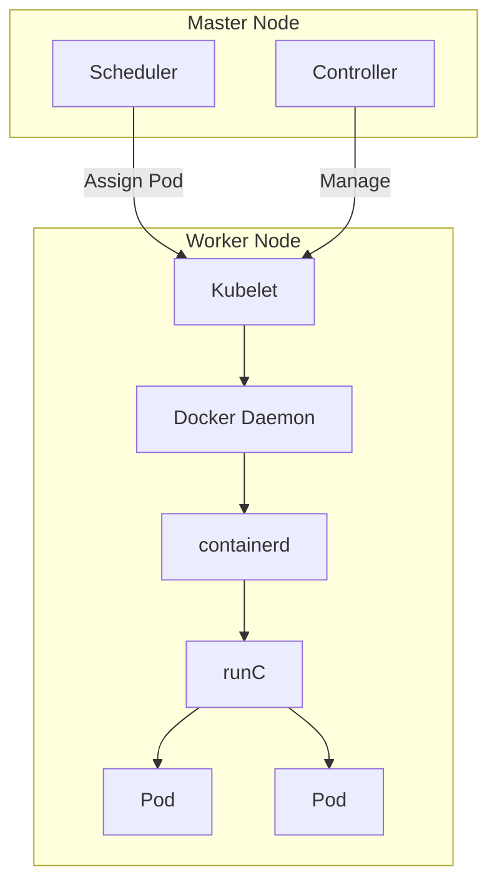
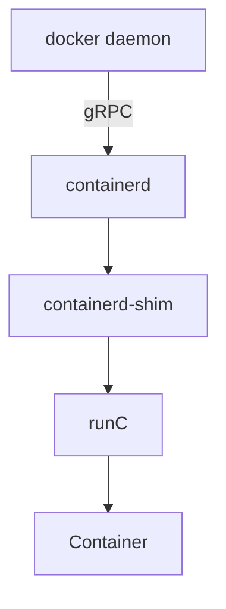

# 第13章 节点就绪状态异常（一）

> [!INFO] 场景描述  
> 针对完全陌生的云产品或者系统组件来诊断不熟悉的问题，是阿里云工程师的日常工作中比较有趣的一类场景，也是一个挑战。这一章我们来分享一个Kubernetes集群诊断案例。  
> 此类问题影响范围较广。从技术上来说，问题和一些底层的操作系统组件有关系，比如[[Systemd]]和[[D-Bus]]。排查问题的思路和方法对理解[[Kubernetes]]的实现非常有帮助，也可以被复用到相关问题的诊断过程中。

---

## 13.1 问题介绍

### 13.1.1 就绪状态异常

阿里云有自己的Kubernetes容器集群产品。随着Kubernetes集群出货量剧增，线上用户零星地发现，集群会非常低概率地出现节点 **NotReady**（集群就绪状态异常）的情况。据我们观察，这个问题差不多每个月都会有一两个用户遇到。在节点NotReady之后，集群Master没有办法对这个节点做任何控制，比如下发新的Pod，又如抓取节点上正在运行的Pod的实时信息。

**图13-1 节点就绪状态异常**  
*（此处为示意图：集群中一个节点标记为NotReady，Master无法与其通信）*

---

### 13.1.2 背景知识

这里我们稍微补充一点[[Kubernetes]]集群的基本知识。Kubernetes集群的“硬件基础”是以单机形态存在的集群节点，这些节点可以是物理机，也可以是虚拟机。集群节点分为 **Master节点** 和 **Worker节点**。

- **Master节点**：主要用来承载集群管控组件，比如调度器和控制器。  
- **Worker节点**：主要用来“跑”业务。  

**Kubelet** 是“跑”在各个节点上的代理，它负责与管控组件沟通，并按照管控组件的指示，直接管理Worker节点。

**图13-2 集群简易架构图**

当集群节点进入NotReady状态的时候，我们需要做的第一件事情，是检查运行在节点上的Kubelet是否正常。在这个问题出现的时候，使用 `systemctl` 命令查看Kubelet状态（Kubelet是Systemd管理的一个daemon）发现它是正常运行的。当我们用 `journalctl` 查看Kubelet日志的时候，会发现图13-3中的错误。

**图13-3 集群节点异常报错**  
*（日志截图显示错误信息：容器运行时是不工作的，且PLEG是不健康的）*

---

### 13.1.3 关于PLEG机制

这个报错清楚地告诉我们，**容器运行时是不工作的**，且**PLEG是不健康的**。这里容器运行时指的就是 **docker daemon**。Kubelet通过操作docker daemon来控制容器的生命周期。

而这里的 **PLEG** 指的是 **Pod lifecycle event generator**，PLEG是Kubelet用来检查运行时的健康检查机制。这件事情本来可以由Kubelet使用polling的方式来做，但是polling有其成本高的缺陷，所以PLEG应运而生。

PLEG尝试以一种“中断”的形式，来实现对容器运行时的健康检查，虽然实际上它是一种同时使用polling和“中断”的折中方案。

**图13-4 PLEG实现架构图**

根据上面的报错，我们基本上可以确认容器运行时出了问题。在有问题的节点上，通过docker命令尝试运行新的容器，命令会没有响应，这说明上面的报错是准确的。

---

## 13.2 Docker栈

### 13.2.1 docker daemon调用栈分析

[[Docker]]作为阿里云Kubernetes集群使用的容器运行时，在1.11版之后，被拆分成了多个组件以适应OCI标准。拆分之后，其包括 **docker daemon**、**containerd**、**containerd-shim** 和 **runC**。组件containerd负责集群节点上容器的生命周期管理，并向上为docker daemon提供gRPC接口。

**图13-5 Docker的组成**

在这个问题中，既然PLEG认为容器运行时出了问题，我们就需要从docker daemon进程看起。我们可以使用 `kill -USR1 <pid>` 命令发送USR1信号给docker daemon，而docker daemon收到信号之后，会把所有线程调用栈输出到 `/var/run/docker` 文件夹里。

docker daemon进程的调用栈是比较容易分析的。稍加留意，我们会发现大多数调用栈都是图13-6中的样子。通过观察栈上每个函数的名字，以及函数所在的文件（模块）名称，我们可以了解到，这个调用栈的下半部分，是进程接到HTTP请求，并对请求做出路由转发的过程，而上半部分则是具体的处理函数。最终处理函数进入等待状态，等待一个 **mutex** 实例。

**图13-6 线程等待mutex状态**  
*（调用栈截图：下半部分显示HTTP路由处理，上半部分显示等待mutex）*

到这里，我们需要稍微看一下 `ContainerInspectCurrent` 这个函数的实现。从实现可以看到，这个函数的第一个参数，就是这个线程正在操作的容器名指针。使用这个指针搜索整个调用栈文件，我们会找出所有等在这个容器上的线程。同时，我们可以看到图13-7中的这个线程。

**图13-7 线程远程调用containerd**  
*（调用栈截图：显示ContainerExecStart函数，已经在操作该容器并调用containerd）*

这个线程调用栈上的函数 `ContainerExecStart` 也是在处理相同的容器。但不同的是，`ContainerExecStart` 并没有在等这个容器，而是已经拿到了这个容器的操作权（mutex），并把执行逻辑转向了 `containerd` 调用。

关于这一点，我们也可以使用代码来验证。前面提到过，containerd通过gRPC向上对docker daemon提供接口。此调用栈上半部分内容，正是docker daemon在通过gRPC请求来呼叫containerd。

---

### 13.2.2 Containerd调用栈分析

与docker daemon类似，我们可以通过 `kill -SIGUSR1 <pid>` 命令来输出containerd的调用栈。不同的是，这次调用栈会直接输出到 `messages` 日志。

containerd作为一个gRPC的服务器，会在接到docker daemon的远程调用之后，新建一个线程去处理这次请求。关于gRPC的细节，我们这里其实不用太关注。在这次请求的客户端调用栈上，可以看到这次调用的核心函数在创建一个进程。我们在containerd的调用栈里搜索 `Start`、`Process` 以及 `process.go` 等字段，很容易发现图13-8中的这个线程。

**图13-8 线程启动容器进程**  
*（调用栈截图：显示核心函数正在使用runC创建容器进程）*

这个线程的核心任务，就是依靠runC去创建容器进程。而在容器启动之后，runC进程会退出。所以下一步我们自然而然会想到，runC是不是顺利完成了自己的任务。查看进程列表我们会发现，系统中有个别runC进程还在执行，这不是预期的行为。容器的启动和进程的启动，耗时应该是差不多的，系统里有正在运行的runC进程，则说明 **runC不能正常启动容器**。

---

## 13.3 什么是D-Bus

### 13.3.1 runC请求D-Bus

容器运行时的[[runC]]命令，是libcontainer的一个简单的封装。这个工具可以用来管理单个容器，比如创建容器和删除容器。在上一节的最后，我们却发现runC不能完成创建容器的任务。我们可以把对应的进程“杀”掉，然后在命令行用同样的命令启动容器，同时用 **strace** 追踪整个过程。

**图13-9 使用追踪机制分析runC**  
*（strace输出截图：显示runC停在向带有org.free字段的dbus socket写数据的地方）*

分析发现，runC停在了向带有 `org.free` 字段的dbus socket写数据的地方。那什么是[[D-Bus]]呢？在Linux中，D-Bus是一种进程间进行通信的机制。

### 13.3.2 原因并不在D-Bus

在Linux中，D-Bus是进程间互相通信的总线机制。

**图13-10 D-Bus在进程通信中的作用**  
*（示意图：多个进程通过D-Bus总线进行通信）*

我们可以使用 `busctl` 命令列出系统现有的所有bus。如图13-11所示，在问题发生的时候，我们看到问题节点bus name编号非常大。所以我们倾向于认为，是dbus某些相关的数据结构（比如name）的耗尽引起了这个问题。

**图13-11 D-Bus通信连接**  
*（busctl输出截图：显示大量bus名称，编号非常大）*

D-Bus机制的实现，依赖于一个叫作 **dbus daemon** 的组件。如果真的是dbus相关数据结构耗尽，那么重启这个daemon应该可以解决这个问题。但不幸的是，问题并没有这么简单。重启dbus daemon之后，问题依然存在。

在上面strace追踪runC的截图中，runC停在向带有 `org.free` 字段的bus写数据的地方。在busctl输出的bus列表里，显然带有这个字段的bus，都在被Systemd使用。这时，我们用 `systemctl daemon-reexec` 来重启Systemd，问题消失了。所以我们可以判断出大体方向：**问题可能和Systemd有关**。

---

## 13.4 Systemd是硬骨头

[[Systemd]]是相当复杂的一个组件，尤其是对没有做过相关开发工作的人来说。排查Systemd的问题我们用到了四个方法：使用（调试级别）日志、core dump、代码分析，以及live debugging。其中第一个、第三个和第四个结合起来使用，让我们在经过几天的“鏖战”之后，找到了问题的原因。但是这里我们先从“没用”的core dump说起。

### 13.4.1 “没用”的core dump

因为重启Systemd解决了问题，而这个问题本身，是runC在使用dbus和Systemd通信的时候没有了响应，所以我们需要验证的第一件事情，就是Systemd是不是有关键线程被锁住了。core dump里所有的线程，只有图13-12中的线程，此线程并没有被锁住，它在等待dbus事件，以便做出响应。

**图13-12 Systemd主线程调用栈**  
*（core dump调用栈截图：显示线程未锁住，在等待dbus事件）*

### 13.4.2 零散的信息

因为无计可施，所以只能做各种测试、尝试。使用 `busctl tree` 命令，可以输出所有bus上对外暴露的接口。从输出结果看来，`org.freedesktop.systemd1` 这个bus是不能响应接口查询请求的。

**图13-13 D-Bus总线报错**  
*（busctl tree输出截图：显示org.freedesktop.systemd1报错）*

使用下面的命令观察 `org.freedesktop.systemd1` 上接收到的所有请求，可以看到，在正常系统里，有大量unit创建、删除的消息，但是在有问题的系统里，这个bus上完全没有任何消息。

**图13-14 D-Bus监控数据**  
*（监控命令输出截图：对比正常系统与问题系统，问题系统无消息）*

分析问题发生前后的系统日志，runC在重复地运行一个测试（test），如图13-15所示，这个测试非常频繁，但是当问题发生的时候，这个测试就停止了。所以直觉告诉我们，这个问题可能和这个测试有很大的关系。

**图13-15 Systemd可疑信息输出**  
*（系统日志截图：显示runC重复执行测试，问题发生时停止）*

另外，我们使用 `systemd-analyze` 命令打开了Systemd的调试级别日志，发现Systemd有 `Operation not supported` 的报错。

**图13-16 Systemd不相关报错**  
*（调试日志截图：显示Operation not supported）*

根据以上零散的信息，可以得出一个大概的结论：`org.freedesktop.systemd1` 这个bus在经过大量unit创建、删除之后，没有了响应。而这些频繁的unit创建、删除测试，是runC某一个改动引入的。这个改动使得 `UseSystemd` 函数通过创建unit来测试Systemd的功能。`UseSystemd` 在很多地方被调用，比如创建容器、查看容器性能等操作。

### 13.4.3 代码分析

这个问题在线上所有Kubernetes集群中，发生的频率大概是一个月两例。问题一直在发生，且只能在问题发生之后通过重启Systemd来处理，风险极大。我们分别向Systemd和runC社区提交了bug，但是一个很现实的问题是，他们并没有像阿里云这样的线上环境，重现这个问题的概率几乎是零，所以这个问题没有办法指望社区来解决。硬骨头还得我们自己啃。

在上一节最后我们看到了，问题出现的时候，Systemd会输出一些 `Operation not supported` 报错。这个报错看起来和问题本身风马牛不相及，但是直觉告诉我们，这或许是离问题最近的一个地方，所以我们决定，先搞清楚这个报错因何而来。

Systemd的代码量比较大，而报这个错误的地方非常多。通过大量的代码分析，我们发现有几处比较可疑的地方，发现了这些可疑的地方，接下来需要做的事情就是等待。在等了三周以后，终于有线上集群再次出现了这个问题。

### 13.4.4 Live Debugging

在征求用户同意之后，我们下载Systemd调试符号，将gdb挂载到Systemd上，在可疑的函数下断点，然后继续执行。经过多次验证，发现Systemd 最终“踩”到了 `sd_bus_message_seal` 这个函数里的EOPNOTSUPP报错。

**图13-17 Systemd消息处理函数**  
*（gdb调试截图：断点停在sd_bus_message_seal函数）*

这个报错背后的道理是，systemd使用了一个变量 `cookie`，来追踪自己处理的dbus message。每次在加封一个新的message的时候，systemd会先给cookie的值加1，然后再把这个值复制给这个新的message。

我们使用gdb打印出 `dbus->cookie` 这个值，可以很清楚地看到，这个值超过了 `0xffffffff`。看来问题是Systemd在加封过大量message之后，cookie这个值溢出了，导致新的消息不能被加封，从而使得Systemd对runC没有了响应。

**图13-18 cookie溢出**  
*（gdb打印截图：显示cookie值为0x100000000，超过32位最大值）*

另外，在一个正常的系统中，使用gdb把 `bus->cookie` 这个值改到接近 `0xffffffff`，然后就能观察到，问题在cookie溢出的时候立刻出现，这就证明了我们的结论。

### 13.4.5 怎么判断集群节点NotReady是这个问题导致的

首先我们需要在有问题的节点上安装gdb和Systemd debuginfo，然后用命令 `gdb /usr/lib/systemd/systemd 1` 把gdb attach到Systemd，在函数 `sd_bus_send` 上设置断点，然后继续执行。等Systemd“踩”到断点之后，用 `p/x bus->cookie` 查看对应的如果此值超过了 `0xffffffff`，那么cookie就溢出了，则必然导致节点NotReady的问题。确认完之后，可以使用 `quit` 来detach调试器。

## 13.5 问题的解决

这个问题的解决并没有那么直截了当。原因之一，是Systemd使用了同一个cookie变量来兼容dbus1和dbus2。对于dbus1来说，cookie是32位的，这个值在经过Systemd在三五个月中频繁创建和删除unit之后，是肯定会溢出的；而dbus2的cookie是64位的，可能到了“时间的尽头”它也不会溢出。

另外一个原因是，我们并不能简单地让cookie折返来解决溢出问题。因为这有可能导致Systemd使用同一个cookie来加封不同的消息，这样的结果将是灾难性的。

最终的修复方法是，同样使用32位cookie来处理dbus1和dbus2两种情形。在cookie 达到 `0xfffffff` 之后，下一个cookie则变成 `0x80000000`，即用最高位来标记cookie已经处于溢出状态。检查到cookie处于这种状态时，我们需要检查是否下一个cookie正在被其他message使用，以避免cookie冲突。

## 13.6 总结

这个问题从根本上说是Systemd导致的，但是runC的函数 `UseSystemd` 使用不那么“美丽”的方法，去测试Systemd的功能，而这个函数在整个容器生命周期管理过程中被频繁调用，让这个小概率问题的发生成了可能。Systemd的修复已经被红帽接受，预期在不久的将来，我们可以通过升级Systemd从根本上解决这个问题。