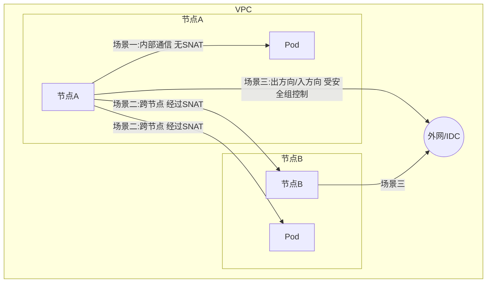
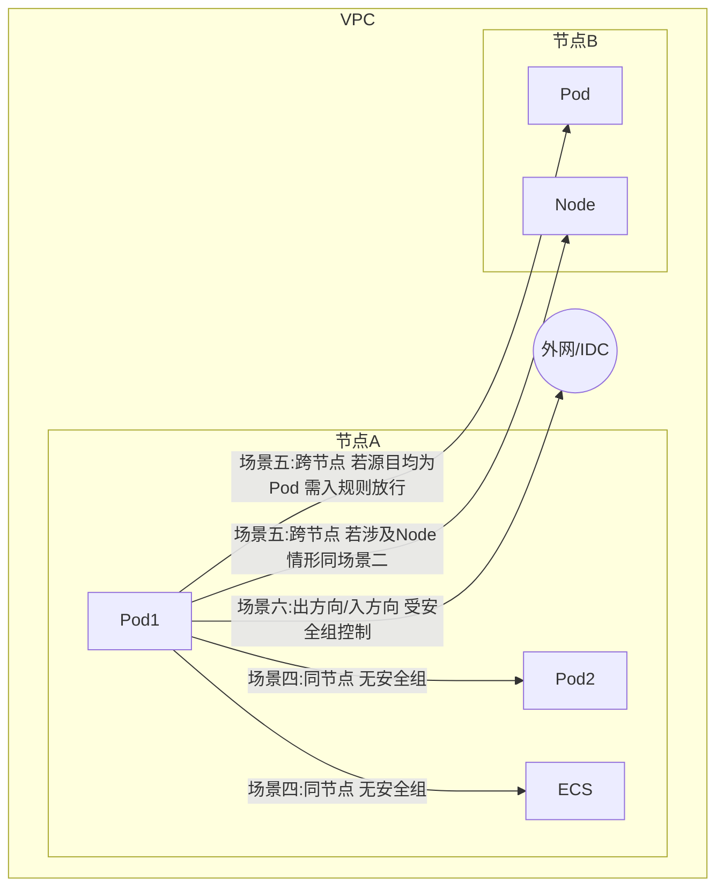

# 第16章 网络安全组加固对与错

阿里云容器产品Kubernetes版本（[[ACK]]）是基于阿里云IaaS层云资源创建的。IaaS层资源包括[[云服务器（ECS）]]、[[专有网络（VPC）]]、[[弹性伸缩（ESS）]]等。以这些资源为基础，ACK产品实现了Kubernetes集群的节点、网络、自动伸缩等组件或功能。

一般而言，用户对ACK产品有很高的管理权限，包括集群扩容、创建服务等。同时，用户可以绕过ACK产品，直接修改集群底层云资源，如释放ECS、删除[[SLB]]。如果不清楚这些修改可能产生的影响，则极有可能损坏集群功能。

本章会以ACK产品中[[安全组]]的配置管理为核心，深入讨论安全组在集群中扮演的角色、在网络链路中所处的位置，以及非法修改安全组会产生的各类问题。本章内容适用于专有集群和托管集群。

> [!INFO] 适用对象
> 专有集群与托管集群均在本章讨论范围之内。

## 16.1 安全组扮演的角色

阿里云ACK产品有两种基本形态：**专有集群**和**托管集群**。这两种形态的最大差别，就是用户对Master的管理权限。对安全组来说，两种形态的集群略有差别，这里分开讨论。关于两种集群的架构，请参考第1章的图1-2、图1-3。

### 专有集群

专有集群使用[[资源编排（ROS）]]模板搭建集群的主框架。其中：
- **专有网络**是整个集群运行的局域网
- **云服务器**构成集群的节点
- **安全组**构成集群节点的出入防火墙

另外，集群使用[[弹性伸缩（ESS）]]实现动态扩缩容功能，[[NAT网关]]作为集群的网络出口，[[SLB]]和[[EIP]]实现集群API Server的入口。

### 托管集群

托管集群与专有集群类似，同样使用资源编排模板搭建集群的主框架。在托管集群中，云服务器、专有网络、SLB、EIP、安全组等扮演的角色与专有集群类似。

与专有集群不同的是，托管集群的Master系统组件以Pod的形式运行在管控集群里——这就是用Kubernetes管理[[Kubernetes]]的概念。

因为托管集群在用户的VPC里，而管控集群在阿里云管控账号的VPC里，所以这样的架构需要解决的一个核心问题，就是跨账号、跨VPC通信问题。

为了解决这个问题，此处用到类似**传送门**的技术。托管集群会在集群VPC里创建两个[[弹性网卡]]，这两个弹性网卡可以像普通云服务器一样通信，但是这两个网卡被挂载到托管集群的API Server Pod上，这就解决了跨VPC通信问题。

> [!NOTE] 关键点
> 托管集群通过弹性网卡（ENI）实现跨VPC通信，安全组在其中起到防火墙作用。

## 16.2 安全组与集群网络

上一节总结了两种形态ACK集群的组成原理，以及安全组在集群中所处的位置。简单来说，**安全组就是管理网络出入流量的防火墙**。

安全组规则对出方向的数据包基于目的地址来做限制，而对入方向的数据包则基于源地址来做限制。ACK集群内部的通信对象包括集群节点和部署在集群上的[[容器组（Pod）]]，而外部通信对象可以是任意外网地址。

云服务器没有太多特殊的地方，只是简单地连接在VPC局域网内的ECS上，而容器组Pod连接在基于Veth网口对、虚拟网桥、VPC路由表所搭建的和VPC相互独立的虚拟三层网络上。

总结一下，有两种通信实体和三种通信方式，共六种通信场景，如表16-1所示。

**表16-1 通信场景分类**

| 通信实体 | 通信方式 | 场景编号 |
|---------|---------|---------|
| 节点（Node） | 节点 ↔ 节点内Pod | 场景一（与安全组无关） |
| 节点（Node） | 节点 ↔ 其他节点或Pod | 场景二（与安全组无关） |
| 节点（Node） | 节点 ↔ VPC外实体 | 场景三（与安全组有关） |
| 容器组（Pod） | Pod ↔ 同节点Pod/ECS | 场景四（与安全组无关） |
| 容器组（Pod） | Pod ↔ 其他节点或Pod | 场景五（入规则需放行） |
| 容器组（Pod） | Pod ↔ VPC外实体 | 场景六（与安全组有关） |

前三种场景如图16-1所示，以节点为通信实体之一。
- **场景一**：节点与其上的Pod通信 → 与安全组无关
- **场景二**：节点与其他节点或Pod通信 → 因为节点在相同VPC下，且Pod访问Pod网段以外的地址都会经过SNAT，所以与安全组无关
- **场景三**：节点与VPC之外的实体通信 → 出入方向通信都与安全组有关

**图16-1 节点的通信**

后三种场景如图16-2所示，以容器组Pod为通信实体之一。
- **场景四**：Pod在节点内部与Pod和ECS通信 → 与安全组无关
- **场景五**：Pod跨节点与其他节点或Pod通信 → 如果源地址和目的地址都是Pod，则需要安全组入规则放行；其他情况与场景二类似
- **场景六**：Pod与VPC之外的实体通信 → 与场景三类似

**图16-2 容器组的通信**

虽然以上场景有些复杂，但是经过总结后发现，与安全组有关的通信，从根本上说只有两种情况：
1. **Pod之间跨节点通信**
2. **节点或Pod与外网互访**（这里的外网可以是公网，也可以是与集群互联互通的[[IDC]]或者其他VPC）

> [!TIP] 核心结论
> 配置ACK集群的安全组，本质上只需控制两类通信：Pod跨节点通信（入规则放行Pod网段）以及集群与外网的互访（出/入规则）。

## 16.3 怎么管理安全组规则

上一节详细分析了安全组在ACK集群通信的时候会涉及的场景，最后的结论是：配置ACK集群的安全组，只需考虑两种情况——Pod之间跨节点通信，以及集群和外网互访。

ACK集群在创建的时候，默认添加了Pod网段放行入规则，与此同时，保持出规则对所有地址全开放。这使得Pod之间互访没有问题，同时Pod或节点可以随意访问集群以外的网络。

而在默认规则的基础上对集群安全组的配置管理，其实就是在不影响集群功能的情况下：
- **收紧**Pod或节点访问外网的能力
- **放松**集群以外网络对集群的访问限制

下面分三个常见的场景来进一步分析，怎么样在默认规则的基础上进一步管理集群的安全组规则。

### 16.3.1 限制集群访问外网

这是非常常见的一个场景。为了在限制集群访问外网的同时不影响集群本身的功能，配置需要满足三个条件：

1. 不能限制出方向Pod网段
2. 不能限制集群访问阿里云云服务的内网地址段 `100.64.0.0/10`
3. 不能限制集群访问一部分阿里云云服务的公网地址

其中第一条显而易见，第二条是为了确保集群可以通过内网访问DNS或者OSS这类服务，第三条是因为集群在实现部分功能的时候，会通过公网地址访问云服务。

> [!WARNING] 关键限制
> 若限制出方向时遗漏100.64.0.0/10或阿里云公网地址，将导致系统组件功能异常。

### 16.3.2 IDC与集群互访

对于IDC与集群互访这种场景，假设IDC和集群VPC之间已经通过底层的网络产品打通，IDC内部机器和集群节点或者Pod之间，可以通过地址找到对方。那么在这种情况下，只需要在确保出方向规则放行IDC机器网段的情况下，对入规则配置放行IDC机器地址段即可。

### 16.3.3 使用新的安全组管理节点

某些时候，用户需要新增加一些安全组来管理集群节点。比较典型的用法包括：
- **把集群节点同时加入到多个安全组里**
- **把集群节点分配给多个安全组管理**

如果把节点加入到多个安全组里，那么这些安全组会依据优先级，从高到低依次匹配规则，这会给配置管理增加复杂度。而把节点分配给多个安全组管理，则会出现[[脑裂（partition）]]问题，需要通过安全组之间授权或者增加规则的方式，确保集群节点之间互通。

## 16.4 典型问题与解决方案

前边的内容包括了安全组在ACK集群中所扮演的角色、安全组与集群网络，以及安全组配置管理方法。在本节中，我们基于阿里云线上海量问题的诊断经验，分享一些典型的与安全组错误配置有关系的问題和解决方案。

### 16.4.1 使用多个安全组管理集群节点

**现象：**
- 托管集群默认把节点ECS和管控ENI（弹性网卡）放在同一个安全组里，根据安全组的特性，这保证了ENI和ECS的网卡之间在VPC网络平面上的互通。
- 如果把节点从集群默认安全组里移除并纳入其他安全组的管理中，就会导致集群管控ENI和节点ECS之间无法通信。
- 常见表现：使用 `kubectl exec` 命令无法进入Pod终端做管理，使用 `kubectl logs` 命令无法查看Pod日志。
- 其中 `kubectl exec` 返回的报错比较清楚：从API Server连接对应节点10250端口超时，这个端口的监听者就是[[Kubelet]]。

**解决方案：**
1. 将集群节点重新加入集群创建的安全组
2. 让节点所在的安全组和集群创建的安全组之间互相授权
3. 在两个安全组里使用规则让节点ECS和管控ENI的地址段互相放行

> [!TIP] 推荐做法
> 尽量保持节点在集群默认安全组中，避免因脑裂导致管控中断。

### 16.4.2 限制集群访问公网或运营商级NAT保留地址

**背景：**
- 专有或托管集群的系统组件（如[[Cloud Controller Manager]]、[[Metrics Server]]、[[Cluster Auto Scaler]]等）使用公网地址或运营商级NAT保留地址（`100.64.0.0/10`）访问阿里云云产品，包括但不限于[[负载均衡（SLB）]]、[[弹性伸缩（ESS）]]、[[对象存储（OSS）]]。
- 如果安全组限制了集群访问这些地址，则会导致系统组件功能受损。

**现象：**
- 在创建服务的时候，Cloud Controller Manager无法访问集群节点[[Metadata]]并获取Token值 → 集群节点以及其上的系统组件通过节点绑定的授权角色访问云资源，如访问不到Token，会导致权限问题。
- 集群无法从阿里云镜像仓库下载容器镜像，导致Pod无法创建。在事件日志中，有明显的访问阿里云镜像仓库时的报错，如图16-3所示。

**图16-3 访问镜像仓库报错**
> 此处为截图占位，原文展示的是无法下载容器镜像的报错信息，可能包含类似 “Failed to pull image” 的错误。

**解决方案：**
在限制集群出方向的时候，确保运营商级NAT保留地址 `100.64.0.0/10` 网段以及阿里云云服务公网地址被放行。

其中运营商保留地址比较容易处理，云服务公网地址比较难处理，原因有二：
1. 集群会访问多个云服务且这些云服务的公网地址有可能会更改
2. 这些云服务可能使用[[DNS负载均衡]]，所以需要多次解析这些服务的URL找出所有IP地址并放行

> [!WARNING] 复杂情况
> 云服务公网地址可能动态变化，需定期更新安全组规则。

### 16.4.3 容器组跨节点通信异常

**背景：**
- 集群创建的时候，会在安全组里添加容器组网段入方向放行规则。有了这个规则，即使容器组网段和VPC网段不一样，容器组在跨节点通信的时候，也不会受到安全组的限制。
- 如果这个默认规则被移除，那么容器组跨节点通信会失败，进而使得多种集群基础功能受损。

**现象：**
- 容器组DNS解析失败
- 容器组访问集群内部其他服务异常
- 如图16-4所示，在容器组网段规则被移除之后，从磁盘控制器里访问阿里云主页则无法解析域名，telnet [[CoreDNS]]的地址不通。地址之所以可以访问，是因为安全组默认放行了所有ICMP数据。

**图16-4 DNS解析失败**
> 此处为截图占位，展示的是 CoreDNS 解析超时或无法到达的报错。

**解决方案：**
比较简单——重新把容器组地址段加入安全组。这类问题的难点在于，其引起的问题非常多，现象千奇百怪，所以从问题的现象定位到**容器组跨节点通信**是解决问题的关键一步。

## 16.5 总结

本章从三个方面深入讨论了阿里云ACK产品安全组配置管理：
1. 安全组在集群中扮演的角色
2. 安全组与集群网络
3. 常见问题和解决方案

同时，通过分析可以看到ACK产品安全组配置管理的三个重点：
- 集群的外网访问控制
- 集群容器组之间跨节点访问
- 集群使用多个安全组管理

与这三个重点对应的，就是三类常见的问题。以上总结会在集群创建之前和创建之后，对集群安全组的规划管理有一定指导意义。