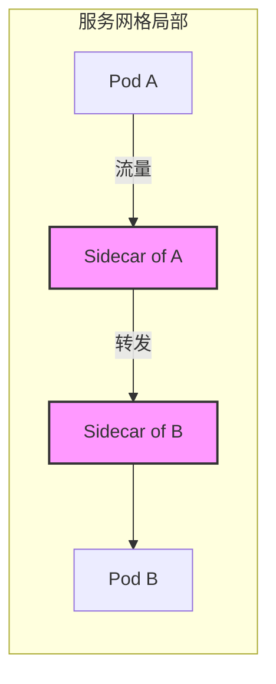
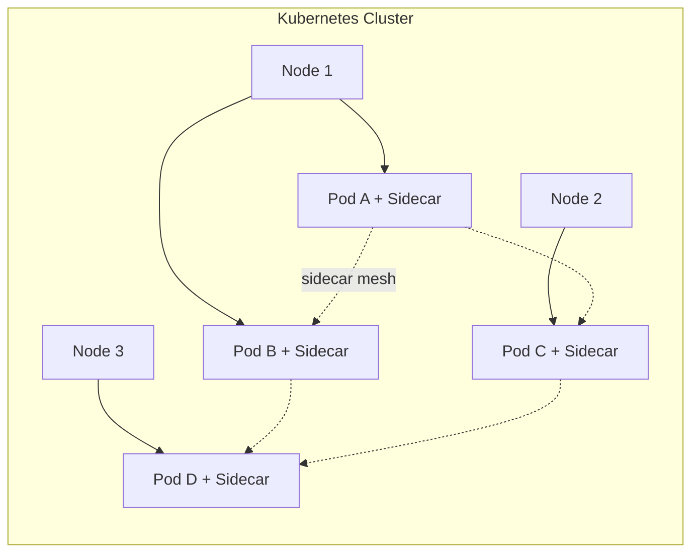
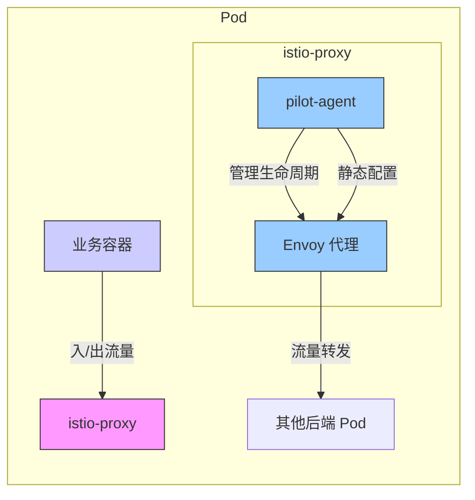
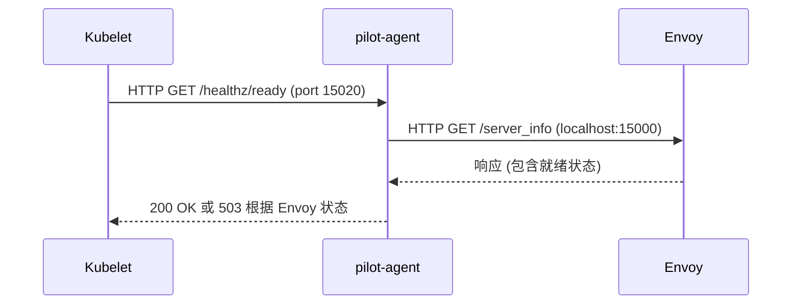
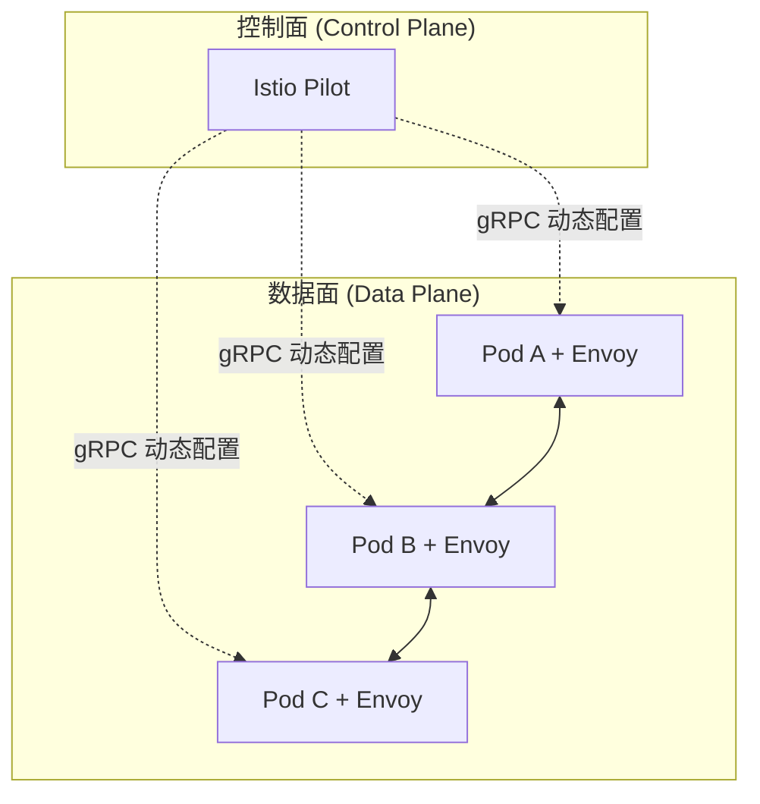

# 第17章 网格应用存活状态异常

Istio is the future（网格就是未来）！基本上，如果对云原生技术趋势有所判断的话，我们肯定会得出这个结论。

判断背后的逻辑其实比较简单：当[[Kubernetes]]成为容器化应用调度编排领域事实上的标准之后，其扮演的角色将会迅速成为集群的操作系统，像Linux一样无处不在。

随着Kubernetes集群所承载的微服务化应用的复杂化，服务治理将被提出更高的要求。Kubernetes本身实现的服务模型虽然比较易用，但在应对复杂场景方面，显然是能力不足的，特别是在[[链路追踪]]、[[熔断]]等方面。而传统的微服务框架（如[[Spring Cloud]]和[[Dubbo]]）虽然相对比较成熟，但[[服务网格]]把服务治理和应用本身解耦，确确实实给此领域带来了更优秀的思路。

[[Istio]]作为服务网格的典型实现，某种程度上已经成为网络技术事实上的标准。在本章中我们将分享一个Istio的案例，并借此和大家讨论一下网格技术背后的逻辑，以及[[阿里云服务网格（ASM）]]的基本原理。

---

## 17.1 在线一半的微服务

问题是这样的：用户在自己的测试集群里安装了Istio，并依照官方文档部署[[bookinfo应用]]。部署之后，用户执行 `kubectl get pods` 命令，发现所有的Pod都只有 **二分之一** 个容器是Ready的。

> [!INFO] Ready 列的含义  
> `Ready` 列给出的数字，如 `1/2`，代表每个 Pod 内部容器的 **readiness（就绪状态）**。每个集群节点上的 **Kubelet** 会根据容器本身 readiness 规则的定义，分别以 **tcp**、**http** 或 **exec** 的方式，来确认对应容器的 readiness 情况。

具体来说，Kubelet 作为运行在每个节点上的进程，以 tcp/http 的方式（从节点网络命名空间到 Pod 网络命名空间）访问容器定义的接口，或者在容器的命名空间里执行 exec 定义的命令，来确定容器是否就绪，如图 17-1 所示。


这里的 “2” 说明这些 Pod 里都有两个容器，“1/2” 则表示每个 Pod 里只有一个容器是就绪的（即通过 readiness 测试的）。关于 “2” 这一点，我们下一节会深入讲。这里我们先看一下，为什么所有的 Pod 里都有一个容器没有就绪。

使用 `kubectl` 工具拉取第一个 `details` Pod 的编排模板，可以看到这个 Pod 里的两个容器只有一个定义了 `readiness probe`。对于未定义 readiness probe 的容器，Kubelet 认为，只要容器里的进程开始运行，容器就进入就绪状态了。所以 `1/2` 个就绪 Pod 意味着，有定义了 readiness probe 的容器没有通过 Kubelet 的测试。

没有通过 readiness probe 测试的是 **istio-proxy** 这个容器。它的 readiness probe 规则定义如下：

```yaml
# 示例 readiness probe 定义(来自原文上下文)
livenessProbe:
  httpGet:
    path: /healthz/ready
    port: 15020
  initialDelaySeconds: 5
  periodSeconds: 10
```

我们登录这个 Pod 所在的节点，用 `curl` 工具来模拟 Kubelet 访问下面的 URI，测试 istio-proxy 的就绪状态。

```bash
# 在节点上模拟 Kubelet 访问
curl -v http://localhost:15020/healthz/ready
```

---

## 17.2 认识服务网格

上一节我们描述了问题的现象，但是留下一个问题：**Pod 里的容器个数为什么是 2？** 虽然每个 Pod 本质上至少有两个容器——一个是占位符容器 `pause`，另一个是真正的工作容器——但是我们在使用 `kubectl` 命令获取 Pod 列表的时候，`Ready` 列是不包括 `pause` 容器的。

这里的另外一个容器，其实就是服务网格的核心概念——**[[Sidecar]]**。其实把这个容器叫作 sidecar，某种意义上是不能反映这个容器的本质的。从本质上来说，sidecar 容器是 **反向代理**，如图 17-2 所示，它本来是一个 Pod 访问其他服务后端 Pod 的负载均衡。



**图 17-2 服务网格局部视角**（图中每个 Pod 都伴随一个 Sidecar 反向代理）

然而，当我们让集群中的每一个 Pod 都“随身”携带一个反向代理的时候，Pod 和反向代理就变成了 **服务网格**，正如图 17-3 这张经典大图所示。



**图 17-3 服务网格全局视角**（每个 Pod 携带 Sidecar，形成网状连接）

所以 sidecar 模式其实是“自带通信员”模式。有趣的是，在我们把 sidecar 和 Pod 绑定在一起的时候，sidecar 在出流量转发时扮演着反向代理的角色，而在入流量接收的时候，可以做一些超过反向代理职责的事情。

[[Istio]] 在 Kubernetes 基础上实现了服务网格，Istio 使用的 sidecar 容器就是 17.1 节提到的没有就绪的容器。所以这个问题其实就是：**服务网格内部所有的 sidecar 容器都没有就绪。**

---

## 17.3 代理与代理的生命周期管理

在上一节中我们看到，Istio 中的每个 Pod，都自带了反向代理 sidecar。我们遇到的问题是，所有的 sidecar 都没有就绪。我们也看到 readiness probe 定义的，判断 sidecar 容器就绪的方式就是访问下面这个接口：

```
http://localhost:15020/healthz/ready
```

接下来，我们深入理解一下 Pod，以及其 sidecar 的组成和原理。

在服务网格里，一个 Pod 内部除了本身处理业务的容器之外，还有 **istio-proxy** 这个 sidecar 容器。正常情况下，istio-proxy 会启动两个进程：**pilot-agent** 和 **Envoy**。

如图 17-4 所示，[[Envoy]] 是实际上负责流量管理等功能的代理，业务容器出、入的数据流都必须经过 Envoy；而 **pilot-agent** 负责维护 Envoy 的静态配置，并且管理 Envoy 的生命周期。这里的动态配置部分，我们在下一节中会展开来讲。



**图 17-4 代理与代理生命周期管理**

我们可以使用下面的命令进入 Pod 的 istio-proxy 容器做进一步排查。这里的一个小技巧是，我们可以以用户 `1337` 身份，使用 **特权模式** 进入 istio-proxy 容器，如此就可以使用 `iptables` 等只能在特权模式下运行的命令。

```bash
kubectl exec -it <pod-name> -c istio-proxy -- /bin/bash
# 或者使用特权模式
kubectl exec -it <pod-name> -c istio-proxy -u 1337 -- /bin/bash
```

> [!TIP] 用户 1337 的含义  
> 这里的用户 `1337` 其实是 sidecar 镜像里定义的一个同名用户 `istio-proxy`，默认 sidecar 容器使用这个用户。如果我们在以上命令中不使用用户选项 `-u`，则特权模式实际上是赋予 `root` 用户的，所以我们进入容器之后，需切换为 `root` 用户执行特权命令。

进入容器之后，我们使用 `netstat` 命令查看监听，我们会发现，监听 readiness probe 端口 `15020` 的，其实是 **pilot-agent** 进程。

```bash
# 在 istio-proxy 容器中执行
netstat -tlnp | grep 15020
```

我们在 istio-proxy 内部访问 readiness probe 接口，一样会得到 “503” 的错误。

```bash
curl -v http://localhost:15020/healthz/ready
# 输出类似:HTTP/1.1 503 Service Unavailable
```

---

## 17.4 就绪检查的实现

了解了 sidecar 的代理，以及管理代理生命周期的 pilot-agent 进程，我们可以稍微思考一下 **pilot-agent** 应该怎么去实现 `/healthz/ready` 这个接口。显然，如果这个接口返回 OK 的话，那不仅意味着 pilot-agent 是就绪的，而且必须确保代理工作正常。

实际上 pilot-agent 就绪检查接口的实现正是如此，如图 17-5 所示。这个接口在收到请求之后，会去调用代理 Envoy 的 `server_info` 接口。调用所使用的 IP 地址是 `localhost`——这非常好理解，因为这是同一个 Pod 内部进程通信。使用的端口是 Envoy 的 `proxyAdminPort`，即 **15000**。



**图 17-5 代理就绪检查机制的实现**

有了以上的知识准备之后，我们来看一下 istio-proxy 这个容器的日志。实际上，在容器日志里，一直在重复输出一个报错。这个报错分为两部分：

- **`Envoy proxy is NOT ready`**：这部分是 pilot-agent 在响应 `/healthz/ready` 接口的时候输出的信息，即 Envoy 代理没有就绪。
- **`config not received from Pilot (is Pilot running?): cds updates:0 successful, 0 rejected; lds updates:0 successful, 0 rejected`**：这部分是 pilot-agent 通过 `proxyAdminPort` 访问 `server_info` 的时候带回的信息——看来 Envoy 没有办法从 Pilot 获取配置。

> [!WARNING] 动态配置缺失  
> 到这里，建议大家回头看下上一节的图 17-4，在上一节我们选择性忽略了从 **Pilot** 到 **Envoy** 这条虚线，即 **动态配置**。这里的报错，实际上是 Envoy 从控制面 Pilot 获取动态配置失败。

---

## 17.5 控制面和数据面

到目前为止，这个问题其实已经很清楚了。在进一步分析问题之前，我们简单聊一下对 **控制面** 和 **数据面** 的理解。控制面和数据面模式可以说无处不在，我们举两个极端的例子。

**第一个例子**，是 **DHCP 服务器**。我们都知道，在局域网中的电脑，可以通过配置 DHCP 来获取 IP 地址。在这个例子中，DHCP 服务器统一管理，动态分配 IP 地址给网络中的电脑——这里的 DHCP 服务器就是 **控制面**，而每个动态获取 IP 的电脑就是 **数据面**。

**第二个例子**，是 **电影剧本** 和 **电影的演出**。剧本可以认为是控制面，而电影的演出（包括演员的每一句对白、电影场景布置等）都可以看作数据面。

之所以认为这是两个极端，是因为在第一个例子中，控制面仅仅影响了电脑的一个属性；而在第二个例子中，控制面几乎是数据面的一个完整的抽象和拷贝，影响数据面的方方面面。Istio 服务网格的控制面是比较接近第二个例子的情况，如图 17-6 所示。



**图 17-6 控制面和数据面**

Istio 的控制面 **Pilot** 使用 **gRPC 协议** 对外暴露接口 `istio-pilot.istio-system:15010`。而 Envoy 无法从 Pilot 处获取动态配置的原因是：**在所有的 Pod 中，集群 DNS 都无法使用。**

---

## 17.6 简单的原因

这个问题的原因其实比较简单。在 sidecar 容器 istio-proxy 里，Envoy 不能访问 Pilot 的原因是 **集群 DNS 无法解析 `istio-pilot.istio-system` 这个服务名字**。在容器里看到 `resolv.conf` 配置的 DNS 服务器地址是 `172.19.0.10`，这个是集群默认的 `kube-dns` 服务地址。

但是客户 **删除、重建了 kube-dns 服务**，且没有指定服务 IP 地址，这实际上导致集群 DNS 的地址改变了——这也是所有的 sidecar 都无法访问 Pilot 的原因。

> [!SUCCESS] 修复方法  
> 最后，通过修改 `kube-dns` 服务，指定 IP 地址（固定原 IP），sidecar 恢复正常，Envoy 成功从 Pilot 获取动态配置。

---

## 17.7 阿里云服务网格（ASM）介绍

从以上案例可以看出，[[Istio]] 在提供了强大的服务治理等功能的同时，对工程师的运维开发带来了一定程度的挑战。

[[阿里云服务网格（ASM）]]（Alibaba Cloud Service Mesh，简称 ASM）提供了一个 **全托管式** 的服务网格平台，极大地减轻了开发与运维人员的工作负担。

如图 17-7 所示，在阿里云 ASM 中，Istio 控制平面的组件全部托管，降低您使用的复杂度，您只需要专注于业务应用的开发部署。同时，保持与 Istio 社区的兼容，支持声明式的方式定义灵活的路由规则，支持网格内服务之间的统一流量管理。


从能力上来看，一个托管了控制平面的 ASM 实例可以支持来自多个 Kubernetes 集群的应用服务或者运行于 ECI Pod 上的应用服务。也可以把一些非 Kubernetes 服务（例如运行于虚拟机或物理裸机中的服务）集成到同一个服务网格中。

---

## 17.8 总结

这个案例的结论是比较简单的。基于对 Istio 的深入理解，问题排查的耗时也并不是很久，但整理这章内容，却有一种看《长安十二时辰》的感觉：排查过程虽短，写完背后的原理和前因后果却花了好几个小时。

总之，希望本章的案例分析对大家理解[[服务网格]]技术有所帮助，同时希望[[阿里云服务网格（ASM）]]可以帮助大家使服务网格类产品快速落地。