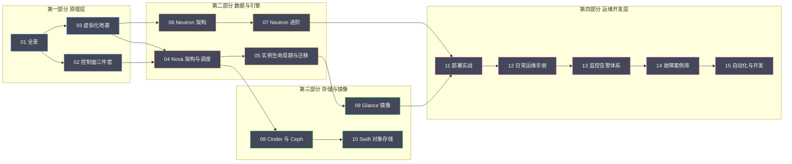

# 00 专栏导览

## 专栏定位

凌晨两点，告警响起：某计算节点失联，上面跑着 30 台业务实例。你需要在十分钟内判断——是网络抖动、是服务假死、还是宿主机真的挂了？实例要不要迁移？迁移会不会中断业务？

这个专栏要回答的，正是这类问题的完整答案链：**原理深到能排障，运维细到能上手**。它不是 OpenStack 的功能手册，而是一位运维开发工程师的知识地图——从控制面的消息队列到数据面的 tap 网卡，从调度器的过滤算法到故障案例的排查链路，每一篇都朝着"能独立接管一个 OpenStack 集群"这个目标铺路。

## 读者画像与前置知识

本专栏假设你已经具备：Linux 基础（命令行、日志查看、网络工具）、虚拟化的基本概念（知道虚拟机是什么）、以及至少一种脚本语言的使用经验（Python 优先）。不需要你用过 OpenStack——专栏会从"为什么需要它"讲起。

如果你已经用过 OpenStack，专栏的价值在于把"会用"升级为"懂原理"：知道 `openstack server create` 背后发生了什么，知道报错时该去哪个组件的日志里找答案。

## 专栏目录

### 第一部分 全景与地基（先立世界观）

| # | 篇目 | 一句话简介 |
|---|---|---|
| [[云原生/OpenStack/01 OpenStack 全景——从 NASA 与 Rackspace 的联姻到开源云操作系统\|01 全景]] | NASA 与 Rackspace 的联姻 | 演进史、服务地图、概念体系、与 K8s 的定位之辨 |
| [[云原生/OpenStack/02 控制面三件套——MariaDB、RabbitMQ 与 Keystone\|02 控制面三件套]] | 控制面的地基 | 认证体系、消息总线、数据库高可用——运维故障的大头 |
| [[云原生/OpenStack/03 虚拟化地基——KVM、QEMU 与 libvirt\|03 虚拟化地基]] | Nova 的底层 | CPU/内存/磁盘/网络虚拟化原理与排障 |

### 第二部分 计算与网络（核心服务深解）

| # | 篇目 | 一句话简介 |
|---|---|---|
| [[云原生/OpenStack/04 Nova 架构与调度——API、Scheduler 与资源模型\|04 Nova 架构与调度]] | 计算的中枢 | 组件拆解、filter scheduler、Placement 资源模型 |
| [[云原生/OpenStack/05 实例生命周期与迁移实战\|05 实例生命周期与迁移]] | 状态机与迁移 | 冷/热迁移原理、evacuate、维护窗口预案 |
| [[云原生/OpenStack/06 Neutron 架构——ML2、OVS 与网络命名空间\|06 Neutron 架构]] | 网络的骨架 | ML2 框架、OVS 数据面、tap 到物理网的完整路径 |
| [[云原生/OpenStack/07 Neutron 进阶——VXLAN、DVR 与安全组\|07 Neutron 进阶]] | 网络的进阶 | VXLAN 封装、DVR 分布式路由、安全组与 QoS |

### 第三部分 存储与镜像

| # | 篇目 | 一句话简介 |
|---|---|---|
| [[云原生/OpenStack/08 Cinder 块存储——卷生命周期与 Ceph RBD 后端\|08 Cinder 块存储]] | 卷的一生 | 生命周期、Ceph RBD 后端实战、数据保护 |
| [[云原生/OpenStack/09 Glance 镜像服务——镜像流水线与制作实战\|09 Glance 镜像服务]] | 镜像的流水线 | 架构与状态机、镜像制作实战、cloud-init 深入 |
| [[云原生/OpenStack/10 Swift 对象存储——环状数据结构与 Ceph RGW 对比\|10 Swift 对象存储]] | 环状数据结构 | Ring 算法、最终一致性、与 Ceph RGW 的选型对比 |

### 第四部分 部署与运维开发层

| # | 篇目 | 一句话简介 |
|---|---|---|
| [[云原生/OpenStack/11 部署实战——Kolla-Ansible 与生产架构设计\|11 部署实战]] | 从零到生产 | Kolla-Ansible 实战、生产架构设计、Ceph 对接 |
| [[云原生/OpenStack/12 日常运维手册——健康检查与故障处理\|12 日常运维手册]] | 巡检与 SOP | 命令集、日志体系、六个高频故障 SOP |
| [[云原生/OpenStack/13 监控告警体系——Prometheus 与关键指标\|13 监控告警体系]] | 看得见故障 | exporter 原理、核心指标、三级告警设计 |
| [[云原生/OpenStack/14 故障案例库——从告警到根因\|14 故障案例库]] | 六个真实案例 | 五段式复盘：现象→诊断→根因→处置→预防 |
| [[云原生/OpenStack/15 自动化与开发——CLI、SDK 与脚本化运维\|15 自动化与开发]] | 知识的变现 | CLI 精要、SDK 开发、Ansible 实战、自动化的边界 |

## 两条阅读路径

**急用型**（下周就要接手运维）：11 部署 → 12 运维手册 → 13 监控 → 14 案例库。先建立操作能力与故障应对能力，原理篇留作排障时的查阅材料。

**原理型**（系统学习）：01 → 15 顺序精读。每一篇都为下一篇铺垫——03 的虚拟化地基是 04 的 Nova 的底层，06 的 Neutron 架构是 07 的进阶的前提。

两条路径不是二选一：急用型的读者在运维稳定后，建议回头补原理篇——排障的效率上限，由原理深度决定。

## 关联专栏

- [[中间件/Ceph/00 专栏导览|Ceph 专栏]]：OpenStack 的主流存储后端，08 篇的 Cinder 对接、本专栏多处互链
- [[大数据/Hadoop/HDFS/00 专栏导览|HDFS 专栏]]：分布式存储的另一种形态，01 篇有定位对比
- [[分布式架构/分布式系统原理与协议/00 专栏导览|分布式系统原理与协议]]：Paxos、一致性等底层理论
- [[中间件/Redis/Redis设计与实现/00 专栏导览|Redis]]：09 篇 cloud-init 场景与 10 篇对比中涉及
- [[云原生/Kubernetes/00 专栏导览|Kubernetes]]：01 篇讨论 IaaS 与 CaaS 的定位之辨

