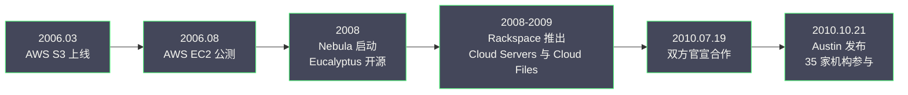
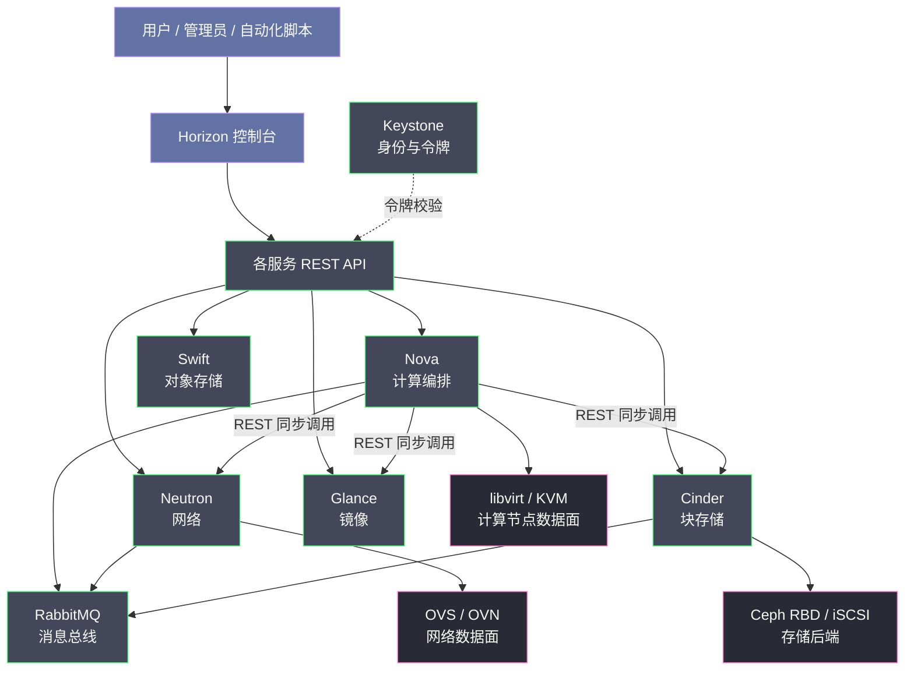
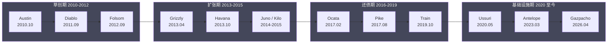
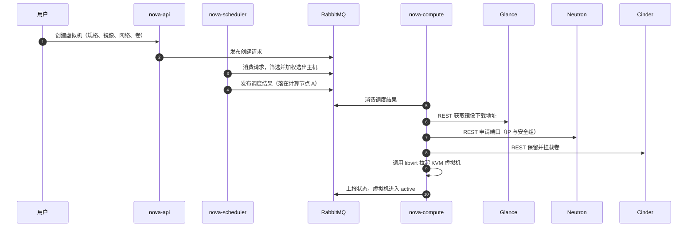

# 01 OpenStack 全景——从 NASA 与 Rackspace 的联姻到开源云操作系统

**摘要：**

2010 年 10 月 21 日，NASA 与 Rackspace 把各自手里最值钱的云平台代码捐了出来，合成一个名为 OpenStack 的开源项目，企业自建基础设施云从此有了事实上的标准底座。本文是 OpenStack 专栏的第一篇，负责在深入各个服务之前先建立全景：从公有云冲击下 IaaS 的需求背景讲起，交代 NASA Nebula 与 Rackspace Cloud Files 这场联姻各自的动机，以及 AWS API 兼容的初衷；随后给出云操作系统（Cloud OS）的定位与服务地图，厘清 project、domain、region 这套贯穿全专栏的概念体系；再沿版本时间线回顾从 Austin 到 2026.1（Gazpacho）的演进节奏、社区治理与「OpenStack 已死」之辩；最后落到设计哲学（松耦合、无共享、REST 加消息总线）与 Kubernetes 的定位之辨，并从运维开发视角给出控制面与数据面的分野、故障分布规律和本专栏的学习路径。全文试图回答两个问题：OpenStack 为什么长成这样（一堆松耦合的服务而非一个整体），以及你该如何在虚拟机、容器与私有云之间为它安排一个合适的位置。

---

## 第 1 章 为什么会有 OpenStack——一场被 AWS 逼出来的联姻

### 1.1 公有云的降维打击

2006 年 8 月，Amazon 把 EC2（Elastic Compute Cloud）推向公测，租用一台服务器的计量单位从「台」变成了「小时」，获取途径从「立项、招标、到货、上架」变成了一张信用卡。这个变化的杀伤力不在价格，而在时间：传统 IT 从提出需求到机器可用以月计，EC2 把它压缩到分钟级，而业务的迭代节奏恰恰是按周甚至按天计算的。当基础设施的供给速度第一次跟上了软件的交付速度，IT 部门多年积累的流程美德，一夜之间都显得像一种慢性的制度成本。

对企业 IT 部门来说，这是一场存在层面的危机。业务部门发现，绕开内部审批、直接注册一个公有云账号，就能拿到比内部资源池更快更弹性的算力，于是影子 IT（Shadow IT）开始蔓延，负载与预算一起流向墙外。IT 部门要自救，就必须把公有云的体验搬回自家机房：自助服务、按需分配、API 驱动、计量计费——这四个词拼在一起，就是基础设施即服务（IaaS, Infrastructure as a Service）的完整诉求。

不妨做一个反事实推演：假如 2010 年前后没有出现一个可自建的 IaaS 开源底座，企业会走向哪里？答案大概率是两极分化——要么继续忍受手工运维的低效，要么把越来越多的负载交给公有云。但数据主权、合规审计、专线延迟与长期成本这四条约束，决定了金融、政务、电信、制造这类行业根本无法全盘接受后者。

自建私有云不是情怀，而是约束条件下的理性选择；可要把「自建一朵云」的工程量摊薄到企业可承受，全行业需要一个共享的底座，而不是每家各造一遍轮子。OpenStack 就是为填这个空位而生的。

把「自建一朵云」拆开看，工程量相当于同时做好几件难事：用虚拟化把一台物理机切成许多台可独立调度的虚拟机；用软件定义网络（SDN, Software Defined Networking）给每台虚拟机接上既隔离又互通的网络；用分布式存储承接成千上万块虚拟磁盘；再把多租户的认证、配额、计量与计费补齐。这些能力单看每一件都有开源实现，难的是把它们捏合成一个对外统一、对内自洽的整体。**OpenStack 的价值不在于发明了这些技术，而在于把「捏合」这件事标准化了**——全行业不必重复造轮子，只需要在同一张图纸上施工。

### 1.2 两个「苦主」：NASA Nebula 与 Rackspace Cloud Files

历史把造底座的机会交给了两个看似八竿子打不着的机构。第一家是 NASA。2008 年前后，艾姆斯研究中心（Ames Research Center）启动了 Nebula 项目，要给科学家提供随取随用的计算资源。走采购流程太慢，用商业云又受数据与合规的掣肘，Nebula 团队干脆自研了一套云平台控制器。但自研的困境很快显现：一个科研机构养不起一个常设的云平台团队，为航天任务定制的代码也吸引不来外部生态，Nebula 陷入「自己够用、无人共用」的孤岛状态。

另一家是 Rackspace。这家 1998 年成立的老牌托管商在 2008 年前后推出 Cloud Servers 与 Cloud Files，正式下场云业务，但与 Amazon 对垒的账并不难算：AWS 的采购规模带来持续降价的空间，Rackspace 跟进一次就失血一次，跟随策略在规模效应面前没有胜算。Rackspace 的破局思路是换赛道——与其在应用层与 AWS 拼刺刀，不如把基础设施层开源，让全行业站在同一个底座上竞争，自己退回到服务、运维与企业级支持这些 AWS 覆盖薄弱的地带。把竞争对手的护城河填成公共道路，是弱势一方面对平台型对手的经典策略；而 Rackspace 恰好有值得公共化的资产：Cloud Files 的存储后端在生产环境里服务着数万客户。

| 组织 | 痛点 | 拿出的资产 | 期望的回报 |
|---|---|---|---|
| NASA（Nebula 团队） | 采购慢、商业云不可用、自研平台难以为继 | Nebula 的计算控制器（后称 Nova） | 卸下维护包袱，借外部生态分摊研发成本 |
| Rackspace | 与 AWS 竞争体量悬殊，跟随降价没有胜算 | Cloud Files 存储后端（后称 Swift）与 Cloud Servers API 规范 | 用开放标准瓦解 AWS 的专有壁垒，转向服务收费 |

两家机构的动机一对比就很有意思：一个是被采购流程逼出来的技术自救，一个是被商业竞争逼出来的战略让渡。动机不同，但诉求殊途同归——都需要一个自己不必独自供养、又能借众人之力持续演进的基础设施底座。

### 1.3 联姻与 Austin：AWS API 兼容的初衷

2010 年 7 月 19 日，双方官宣合作；同年 10 月 21 日，第一个版本 Austin 按期发布。首次设计峰会（Design Summit）在得克萨斯州奥斯汀举行，25 家公司的百余位架构师与开发者到场定路线、写代码；到 Austin 发布时，参与机构已超过 35 家。代码构成上，NASA 贡献了 Nebula 的计算控制器（其中也揉进了 Rackspace 内部控制器 Ozone 的部分），Rackspace 贡献了 Cloud Files 的存储后端——后者得到一个流传至今的名字：Swift。项目名 OpenStack 直白得近乎宣言：开放的云栈。

值得单独拎出来的是 API 策略。Austin 的计算组件同时提供两套接口：一套兼容 AWS EC2 API，另一套是基于 Rackspace Cloud Servers API 的原生接口。前者的意图毫不掩饰——让 AWS 上的工具、脚本与运维习惯能低成本迁移过来，这是「开源替代」策略成立的关键一环；后者则给社区留出了自由演进的接口。先兼容对手的标准把用户接过来，再培育自己的标准让生态长出来，这套「先借力、后立规」的两手策略，后来被无数开源项目反复抄写。

把这段前史压缩成一条时间线，大抵如下：

还有一个容易被忽略的细节：Austin 发布时，NASA 与 Rackspace 都在用这份代码跑生产，NASA 的规模以数千台服务器计。OpenStack 从第一天起就不是实验室玩具，而是两家机构把自家生产负载押上去的赌注——这种「吃自己的狗粮」的姿态，是它在随后几年里快速积累信任的重要原因。

### 1.4 为什么不是 Eucalyptus 或 CloudStack

在 OpenStack 之前，开源 IaaS 并非空白。加州大学圣塔芭芭拉分校 2008 年孵化的 Eucalyptus 主打 EC2 API 兼容，欧洲研究项目出身的 OpenNebula 同年起步，Cloud.com 的 CloudStack（2011 年被 Citrix 收购，2012 年捐给 Apache 基金会）在功能完整度上口碑不俗。单论代码成熟度，2010 年的 OpenStack 并没有拉开明显差距。

| 项目 | 起源 | 当时的短板 |
|---|---|---|
| Eucalyptus（2008） | 加州大学圣塔芭芭拉分校，主打 EC2 兼容 | 扩展性受限，部分核心能力留在商业版 |
| OpenNebula（2008） | 欧洲科研项目转化，轻量灵活 | 社区与厂商生态偏小 |
| CloudStack（2010） | Cloud.com 推出，功能完整 | 治理上被视为 Citrix 的自家项目 |
| OpenStack（2010） | NASA 与 Rackspace 联合捐码 | 代码尚不成熟，但治理与背书最强 |

但基础设施软件的竞争，比的从来不是谁的交易大厅装修豪华，而是谁能让最多的券商愿意进场。Eucalyptus 当时的短板是扩展性与开源纯度，部分核心能力留在商业版里；CloudStack 技术不弱，却长期被视为 Citrix 的自家项目，厂商中立的信任票始终拉不满。OpenStack 用 Apache 2.0 许可证、双巨头捐码、设计峰会共治这三件套，把治理本身做成了产品的一部分。回头去看，OpenStack 先赢下的是生态与信任，代码优势是后来才逐步建立的——基础设施软件的竞争，本质是生态与信任的竞争，这个次序值得每一个做选型的人记住。

后来的故事也印证了治理的分量：Eucalyptus 在 2014 年被 HP 收购后逐渐边缘化，CloudStack 在 Apache 基金会里维持着一方天地却再难撼动大局，而 OpenStack 的参与厂商名单在两年内扩张到数百家。技术上的差距可以在版本迭代中追平，生态与信任的差距一旦拉开，后来者要用数倍的时间偿还——这是基础设施领域反复上演的剧本。

> [!info] 核心概念：基础设施软件的竞争，本质是信任的竞争
> 基础设施的选型周期以年计，用户真正担心的是「这个项目五年后还在吗，会不会被某一家厂商绑架」。NASA 与 Rackspace 把代码捐给厂商中立的共同体，等于用自家生产负载为项目做了信用背书；此后加入的每一家厂商，既在贡献代码，也在为这份信用追加担保。开源基础设施项目的飞轮，是从信任开始转动的，代码质量只是飞轮的第二个叶片。

---

## 第 2 章 OpenStack 是什么——云操作系统的定位与服务地图

### 2.1 「云操作系统」这个比喻

OpenStack 官方对自身的定义多年来高度稳定：一个控制数据中心内大规模计算、存储与网络资源池的云操作系统（Cloud Operating System）。这个定位究竟是营销口号，还是站得住的架构判断？不妨把比喻拆开逐项核对。

如果 Linux 是「一台机器的操作系统」，那么 OpenStack 想做的是「一个数据中心的操作系统」：Nova 对应处理器与内存的调度，Neutron 对应网络协议栈，Cinder 与 Swift 对应磁盘与外部存储，Glance 对应系统安装镜像，Keystone 对应账户与权限体系，Horizon 对应桌面环境，Heat 对应开机自启动脚本；再往外一层，Mirantis、Red Hat、Canonical 等厂商基于它打包的发行版（Distribution），扮演的正是 Linux 发行版的角色，Kolla-Ansible 这类部署工具则近似各发行版的安装器。这张对应表大体工整，说明「云操作系统」并非凭空的宣传话术。

不过比喻在两处明显失真，而失真处恰恰藏着 OpenStack 的本质。其一，操作系统内核是单体紧耦合的，系统调用同步返回；OpenStack 却是一组松耦合服务的联邦，服务之间走 REST API 与消息总线，不存在「内核态」。其二，操作系统的资源单位是进程与线程，OpenStack 的资源单位是虚拟机、租户网络与块卷。

换句话说，**OpenStack 借用了操作系统的定位，却没有继承操作系统的形态**——它是用分布式系统的办法去回答操作系统的问题，这个根本差异贯穿了它全部的优点与全部的麻烦，也是理解后续所有章节的钥匙。

顺带一提，「云操作系统」这顶桂冠后来被 Kubernetes 分走了一半，两个系统谁才是「云的内核」，是过去十年基础设施领域最持久的争论之一，第 4 章会正面处理这场定位之辨。

为什么值得花一节篇幅核对这个比喻？因为比喻决定预期：把 OpenStack 当操作系统的人，会期待它像 Linux 一样装完就能跑、升级不打扰业务；而把它当服务联邦来理解的人，会从一开始就为高可用、升级窗口与故障排查做足准备。**对工具的心智模型，决定了你使用它的姿势**——这也是本篇不惜笔墨辨析一个比喻的原因。

### 2.2 服务地图全景

OpenStack 不是单一程序，而是一组服务的合称。按职能划分，它的服务地图如下：

| 分类 | 服务（代号） | 一句话职责 |
|---|---|---|
| 计算（Compute） | Nova | 虚拟机生命周期编排：创建、调度、迁移、快照与规格（flavor）管理 |
| 计算（Compute） | Glance | 虚拟机镜像的注册、发现与分发 |
| 计算（Compute） | Placement | 资源清单与分配的记账本（2017 年从 Nova 独立） |
| 网络（Network） | Neutron | 网络即服务：租户网络、路由、浮动 IP、安全组、负载均衡入口 |
| 存储（Storage） | Cinder | 块存储：卷的创建、挂载、快照与备份 |
| 存储（Storage） | Swift | 对象存储：海量非结构化数据的 REST 读写 |
| 存储（Storage） | Manila | 共享文件系统即服务（NFS/CIFS），高阶服务 |
| 共享服务（Shared Services） | Keystone | 身份认证、授权与服务目录（catalog） |
| 共享服务（Shared Services） | Horizon | Web 控制台 |
| 共享服务（Shared Services） | Heat | 编排：用模板一次描述网络、虚拟机与卷的整套拓扑 |
| 共享服务（Shared Services） | Ceilometer 等 | 计量与遥测数据采集 |

这张地图有几个值得停留的观察点。第一，计算、网络、存储三大类服务对应着数据中心的三种基础资源，与第 1 章的 IaaS 诉求严丝合缝。

第二，共享服务里最要紧的是 Keystone，所有服务的 API 调用都要先过它这一关，这也是我们把控制面三件套（MariaDB、RabbitMQ、Keystone）放在专栏第 2 篇的原因。第三，服务清单是开放的——从 Folsom 把 Cinder 与 Quantum 拆出 Nova 开始，OpenStack 的服务数量一路膨胀，官方大版本如今一次打包几十个组件发布，Flamingo（2025.2）发布页列出的交付物就超过四十个。

这张地图如果只当名词表来背，很快就会还给笔者；更好的记法是跟着一次真实的操作走一遍。当你点击「创建虚拟机」时：Nova 接单并核对规格（flavor），向 Glance 索取镜像、向 Neutron 申请网卡与 IP、向 Cinder 挂载云盘，随后把组装任务派给某个计算节点上的 libvirt 去拉起 KVM 进程；Swift 与这条链路无关，它服务的是镜像仓库、备份归档这类海量对象场景。**服务地图的每一格，都对应着这条链路上的一环**，后面各篇会逐环拆开细讲。

服务之间的协作关系，可以用一张图建立直觉：

图里有一条贯穿全专栏的主线：用户与自动化只面对各服务的 REST API，Keystone 负责验明正身，服务之间的同步协作走 REST 调用，异步协作走 RabbitMQ 消息总线，真正的脏活累活——启动虚拟机、下发流表、写入数据块——全部发生在各自的数据面组件上。**控制面编排，数据面干活**，这八个字是 OpenStack 全部架构讨论的坐标系。

### 2.3 Horizon 速览

Horizon 是 OpenStack 自带的 Web 控制台，用 Django 框架写成。它的架构定位非常克制：一个纯客户端，把用户的操作翻译成对各服务 REST API 的调用，自己不维护业务数据（除会话外），因此 Horizon 挂掉并不影响任何 API 的使用——你随时可以退回命令行或 SDK 干同样的活。打个比方，Horizon 之于 OpenStack，就像桌面环境之于内核：你完全可以在字符终端里完成一切，但有个图形界面，排查问题与向上汇报时总要方便得多。

不过 Horizon 的体验常年被诟病：页面与底层 API 的映射生硬，复杂操作仍要落到命令行。社区近年把新一代控制台 Skyline 吸纳进官方发布清单，算是承认了这个短板。对运维者来说，Horizon 的正确用法是把它当「只读优先」的巡检与演示工具，真正可靠的自动化永远应该走 API 与 CLI——这个判断会在第 11 篇部署实战与第 15 篇自动化开发中反复出现。

还有一点值得留意：Horizon 支持以插件方式扩展面板，各服务与第三方项目可以往控制台里挂自己的页面，权限则直接复用 Keystone 的角色体系。这个设计让 Horizon 成了企业内部「云门户」的底坯——不少公司在其上二次开发出审批流、工单集成与计量报表，虽然这类定制往往随着版本升级变成维护负担，但「控制台即插件集合」的思路，本身是值得借鉴的。

### 2.4 概念体系：贯穿全专栏的通用语言

OpenStack 的概念体系围绕「谁、在哪里、能对什么资源做什么」展开，几个核心概念贯穿全部服务：

| 概念 | 一句话定义 | 粗略类比 |
|---|---|---|
| project（项目，旧称 tenant/租户） | 资源归属与配额的基本单位，虚拟机、网络、卷都挂在某个 project 下 | 一台机器上的用户组 |
| user / role | 谁（user）以什么角色（role）进入哪个 project，权限由角色决定 | 账号与权限组 |
| group（用户组） | 把多个 user 打包后整体授权，企业级对接的常用抓手 | 用户组 |
| domain（域） | project 与 user 的上一层命名空间，常用于对接企业 LDAP/AD | 部门 |
| endpoint（端点） | 每个服务对外暴露的访问地址，分 public/internal/admin 三类 | 服务的门牌与内部通道 |
| region（区域） | 地理或故障域级别的独立部署单元，多个 region 可共享一套 Keystone | 园区 |

其中 project 与 tenant 的关系值得专门交代一句：早期各服务统一用 tenant 标识资源归属，Keystone v3（随 Grizzly 发布，2013 年）引入 domain 并把 tenant 更名为 project，此后两个字段在 API 与数据库里长期并存——你在 Nova 的表里看到的仍然是 `tenant_id`，而在 Keystone 里创建的是 project。这个历史包袱提醒我们：**术语的更替从来不是一次性完成的，阅读旧文档与旧代码时，tenant 与 project 应当随时互译**。region 与 endpoint 则共同回答了「服务在哪里」的问题：每个服务在 Keystone 的服务目录里登记自己的各区域端点，客户端先问目录、再发请求，这套机制是 OpenStack 多区域部署的地基。

概念之外，还有一组「资源对象」的名词会在每个服务里反复出现，提前对齐口径，后文不再逐一解释：

| 资源对象 | 所属服务 | 一句话定义 |
|---|---|---|
| flavor（规格） | Nova | 虚拟机的「型号」：vCPU、内存、根磁盘的预定义组合 |
| image（镜像） | Glance | 虚拟机的系统盘模板，含操作系统与预装软件 |
| volume（卷） | Cinder | 虚拟机的持久化块设备，实例删除后仍可保留 |
| network / subnet | Neutron | 租户私有的二层网络与网段 |
| security group（安全组） | Neutron | 虚拟机层面的包过滤规则集 |
| floating IP（浮动 IP） | Neutron | 可在虚拟机之间漂移的外网可达地址 |
| keypair（密钥对） | Nova | 登录虚拟机的 SSH 公钥，注入实例使用 |
| container / object | Swift | 对象存储里的「桶」与「对象」 |

配额（quota）机制把这组概念与上一张表串了起来：配额挂在 project 上，限定它能创建多少台虚拟机、多少个卷、多少个浮动 IP——资源对象是「货物」，project 是「账户」，配额是「信用额度」，而 Keystone 回答「谁有权动这个账户」。这四个词合在一起，就是 OpenStack 多租户模型的全部骨架。

---

## 第 3 章 演进史与版本命名——从 Austin 到 Gazpacho

### 3.1 半年一版与城市命名

为什么一个开源项目要用城市命名？答案藏在它的协作方式里。OpenStack 每个版本开工前，社区会先办一场设计峰会（Design Summit），各项目的开发者当面敲定这个版本做什么；版本名就取自峰会举办地或其周边地名——首届峰会与首发版本都在奥斯汀，故称 Austin；第二个版本 Bexar 取自圣安东尼奥所在的 Bexar 县；2015 年东京峰会之后是 Mitaka（三鹰市）；2018 年柏林峰会选了德语词 Stein（石头）；2019 年上海峰会之后是 Ussuri（乌苏里江）。字母递增加地名，既好排序又好记，还顺手记录了社区全球化的脚步——一个版本名就是一张社区的城市名片。

节奏上，从 Essex（2012）到 Stein（2019），OpenStack 严格保持半年一版，4 月与 10 月各发一列火车。半年制对开发是纪律，对运维却是折磨：生产环境刚把上一版摸熟，下一版的升级窗口又到了。社区最终在 2022 年引入 SLURP（Skip Level Upgrade Release Process，跳级升级发布流程）：每两个版本指定一个「大版本」，用户可以一年升级一次、直接跳过中间版本。开发节奏仍是半年，升级节奏变成年度——这是社区对生产现实的正式让步。截至本文写作（2026 年 9 月），最新版本是 2026 年上半年发布的 2026.1（Gazpacho），下一个版本已在路上。

> [!info] 版本名里的彩蛋
> 命名规则执行得并不刻板，个别版本走了「意译」路线：Grizzly 取自加利福尼亚州州旗上的灰熊，Kilo 取自巴黎近郊国际计量局保存的标准千克砝码（因为那一届峰会定在巴黎附近）。读版本名读出地名，是 OpenStack 老兵才懂的接头暗号。

设计峰会本身也值得一提：它不是纯粹的会议，而是「讨论加冲刺」的混合体，各项目的 PTL（Project Technical Lead，项目技术负责人）带着候选特性来过堂，社区成员现场辩论优先级，最终落下来的不是营销路线图，而是一份份带规格文档（spec）的工程承诺。规格先行、公开评审、按版本兑现，这套机制让「半年一版」的承诺在几十个团队之间大体守约，也是 OpenStack 能把松散社区拧成发布火车的制度基础。

### 3.2 标志性版本节点

十六年间三十多个版本，不必逐个记住，但下面这些节点值得知道，它们各自代表一次架构级的转折：

| 版本 | 发布时间 | 标志事件 |
|---|---|---|
| Austin | 2010-10 | 项目诞生：Nova 与 Swift，附带 EC2 兼容 API |
| Diablo | 2011-09 | Horizon 控制台转正，项目数量开始膨胀 |
| Essex | 2012-04 | Keystone 转正，身份体系统一 |
| Folsom | 2012-09 | Quantum 与 Cinder 从 Nova 拆出，网络与块存储独立成服务 |
| Grizzly | 2013-04 | 稳定化转向：限制新项目数量；Keystone v3 引入 domain/project |
| Havana | 2013-10 | Quantum 因商标纠纷更名 Neutron |
| Juno / Kilo | 2014-10 / 2015-04 | DVR（分布式虚拟路由）落地，三层路由下沉到计算节点 |
| Ocata | 2017-02 | Placement 从 Nova 独立；cells v2 推进，Nova 进入架构还债期 |
| Pike | 2017-08 | 容器化部署成为主题：Kolla、OpenStack-Helm 全面拥抱容器 |
| Queens | 2018-02 | EC2 API 从 Nova 移除，兼容使命交给独立项目 |
| Train | 2019-10 | 城市命名时代的尾声；社区重心转向边缘与容器 |
| Victoria | 2020-10 | 基金会更名 OpenInfra 前后的过渡期，疫情后线上协作成为常态 |
| Antelope | 2023-03 | YY.M 版本号成为主标识，SLURP 年度升级机制落地 |
| Epoxy / Flamingo | 2025-04 / 2025-10 | 15 周年；官方以「VMware 替代方案」为卖点 |
| Gazpacho | 2026-04 | 本文写作时的最新版本 |

这条时间线也可以按阶段压缩成四幕：

表里藏着三条暗线，值得点破。第一条是**拆分**：网络（Quantum/Neutron）与块存储（Cinder）在 Folsom 从 Nova 拆出，资源记账（Placement）在 Ocata 从 Nova 独立——Nova 早期是个什么都管的巨无霸，此后的历史就是不断把职责交出去的历史。

第二条是**网络重构**：从 nova-network 到 Neutron，再到 Juno/Kilo 落地的 DVR（Distributed Virtual Router，分布式虚拟路由），三层路由从集中的网络节点下沉到计算节点，扩展性上去了，复杂度也上去了，这部分将在第 6、7 篇展开。第三条是**容器化**：Pike 前后，社区把 OpenStack 自身的部署全面搬进容器（Kolla 系列），同时又把 Kubernetes 当作一等公民来对接——OpenStack 与容器的关系，从互相提防走到了互相成全。

### 3.3 社区治理与基金会

2012 年，OpenStack Foundation 成立，项目从两家发起企业的资产变成独立基金会的资产。治理结构上有两个值得注意的设计：其一是「四个开放」（Open Source、Open Design、Open Development、Open Community）被写进章程；其二是权力分置——董事会由出钱的成员企业组成，但技术路线由技术委员会（Technical Committee, TC）裁定，各项目设 PTL（Project Technical Lead）负责日常技术决策。出钱的不定技术，定技术的不出钱，好比业主委员会与规划局各司其职，这种刻意的分权是 OpenStack 治理最值得后来者抄写的一笔。

2014 年起，社区推行「大帐篷」（Big Tent）原则：不再严格区分核心项目与孵化项目，只要通过 TC 的评审门槛，所有项目在发布流程上一视同仁。这降低了新服务的入场门槛，也直接造成了服务数量的膨胀——鼎盛时期官方大版本要同时协调几十个交付物，协同成本随之水涨船高。2020 年 10 月，基金会更名为 Open Infrastructure Foundation（OpenInfra 基金会），把 Kata Containers、Zuul、StarlingX、Airship 等项目纳入伞下，OpenStack 从一个产品升格为一个基础设施生态的底座。

发布工程同样经历了演进：早期版本靠里程碑（milestone）驱动，每个版本切出若干里程碑供用户跟进测试；后来社区逐步转向持续交付式的滚动发布，里程碑模型退场，由专职的发布管理团队（Release Management）协调几十个交付物的节奏。对使用者来说，真正重要的变化是 SLURP 带来的升级预期——你可以把升级计划从「每半年一次的渡劫」改成「每年一次的例行工程」，这个变化对生产环境运维心理的影响，怎么估计都不过分。

这套治理结构对使用者的意义，比看上去更直接：你评估 OpenStack 的风险，本质上是在评估这套治理能否持续吸引厂商投入。基金会的成员名单、技术委员会的席位分布、各项目 PTL 的所在组织，都是公开信息——选型时不妨把它们当作尽调材料读一遍，比听任何一场宣讲都有用。

### 3.4 「OpenStack 已死」之辩

评价 OpenStack 的现状，社区里长期存在两套针锋相对的叙事，不妨把双方的证据都摆出来再下判断。

唱衰一方的论据是真实的：部署复杂、升级痛苦、人才稀缺，2016 年前后起峰会规模明显缩水，「OpenStack is dying」一度成为科技媒体的流量密码；一批明星创业公司转型或退场，公有云的碾压式扩张也不断挤压私有云的叙事空间。这些现象都不是虚构。

反驳一方的论据同样扎实：2025 年官方口径显示，OpenStack 生产部署规模已达 4500 万核量级，到 Flamingo（2025.2）发布时这一数字被更新为超过 5500 万核；CERN（欧洲核子研究中心）的科学云长期维持在数十万核量级，Walmart、中国移动等机构运行着全球最大的一批私有云；2023 年底 Broadcom 完成对 VMware 的收购后，许可与价格策略剧变，大批企业重新评估虚拟化底座，Epoxy（2025.1）的官方发布稿甚至直接以「VMware 替代方案」为卖点——历史在这里开了一个循环的玩笑：当年 OpenStack 的假想敌是 AWS，如今最大的拉新引擎却是 VMware 的涨价函。

还有一个常被低估的变量是地缘与合规。欧洲多国把数字主权（Digital Sovereignty）写进采购要求，政务、医疗与关键基础设施的数据被要求留在境内、由可控主体运营——这类需求公有云很难满足，却正是 OpenStack 的主场。国内电信运营商与金融机构的大规模部署，逻辑与此同构：不是技术偏好，而是监管与主权约束下的必然选择。看懂这一点，就明白「OpenStack 已死」的叙事为什么始终与它的实际部署量对不上——媒体看的是声量，市场看的是约束。

> [!note] 笔者的判断
> OpenStack 没有死，但它的市场定位经历了一次收缩：从「颠覆公有云的开放平台」收缩为「大规模私有云与主权云的底座」。这次收缩不是失败，而是找到生态位——就像大型机没有杀死小型机、云计算也没有杀死大型机一样，基础设施的每一层都会在约束条件下找到自己的存续空间。判断一个基础设施项目是否值得投入，别看媒体的讣告，看两样东西：有没有与你规模相仿的生产用户，以及发布节奏是否还在正常运转。这两条，OpenStack 今天都还站得住。

---

## 第 4 章 设计哲学——松耦合、无共享与定位之辨

### 4.1 松耦合服务：REST API 加消息总线

既然各服务要频繁协作，为什么不让它们共享一个数据库？这是理解 OpenStack 设计哲学的第一个设问。OpenStack 的回答是彻底的隔离：每个服务拥有独立的代码仓库、独立的数据库 schema、独立的进程组；对外暴露 REST API，服务之间只有两种通信方式——同步的 REST 调用（譬如 Nova 创建虚拟机时向 Neutron 要网络、向 Cinder 要卷、向 Glance 要镜像）与异步的消息（RabbitMQ 上的 RPC 与事件通知）。

服务之间不共享数据库，Nova 读不到 Cinder 的表，想知道卷的状态只能调它的 API。这个约束看似自找麻烦，实则是整个架构的锚点，后文会反复回到它。

打个比方，OpenStack 像一条自动化流水线上的一排独立工位：订单（API 请求）在工位之间传递，工位之间不翻看彼此的账本（数据库），对讲机（消息总线）里喊一嗓子「活儿干完了」，下游工位自然接手。账本分开，每个工位才能独立改造——今天给 Cinder 的账本加一页，不必通知 Nova；这条流水线也才能一段一段地升级，而不必整条停线。

反过来看，如果服务共享数据库会怎样？任何一个服务的 schema 变更都要协调所有依赖方，升级必须整列火车一起动，一个服务的慢查询能把所有服务的性能拖下水。OpenStack 早期恰好有现成的反面教材：nova-network 时代，网络功能内嵌在计算服务里，网络逻辑的任何变更都和虚拟机生命周期绑死，扩展与升级互相牵制——这正是 Folsom 把网络拆成独立服务的直接动因。**松耦合不是架构师的审美偏好，而是被紧耦合的疼痛逼出来的教训**。

把镜头再拉近一点，看一次跨服务协作的真实时序——创建一台带云盘的虚拟机（为清晰起见，省略了 nova-conductor 等中间环节，实际链路更长）：

这张时序图把 4.1 节的要点全部落了地：API 与执行者之间经 RabbitMQ 传递任务（异步），执行过程中的跨服务协作走 REST（同步）；任何一步失败，虚拟机就停在中间状态，等待重试或回滚。第 5 篇会把这个流程连同完整的状态机展开。

### 4.2 无共享架构与它的代价

在服务间松耦合之上，OpenStack 进一步追求无共享（Shared-Nothing）架构：控制面上，每个服务把状态外置到数据库与消息队列，自身尽量无状态，多副本前置负载均衡即可横向扩展；数据面上，计算节点（nova-compute 加 libvirt/KVM）、网络节点、存储节点各司其职，互不依赖对方的本地状态。任何一台控制面节点宕机，只要数据库与消息队列健在，服务就能在别处重生。

但无共享是有账单的。服务之间不再有共享内存与共享事务，跨服务操作——譬如「创建一台带租户网络与云盘的虚拟机」——天然成为分布式难题。OpenStack 的解法不是两阶段提交，而是状态机：把虚拟机的生命周期建模成一串状态（building、active、error……），每一步失败就重试或回滚，用最终一致逼近事务语义。这个选择换来的是组件的可替换与可重生（任何一步失败都不会让整体卡死在中间态），付出的是排障时不得不面对的「中间态」——你在数据库里看到一台 status 为 building 的虚拟机时，需要判断它是正在工作，还是已经死在半路。这份复杂性不会消失，只会从代码里转移到运维的头脑里。

补偿逻辑散布在各服务的状态机里，举例来说：创建虚拟机时 Cinder 建卷成功、计算节点却启动失败，Nova 会把虚拟机置为 error 并尝试清理已分配的端口与卷；删除虚拟机时网络端口清理失败，则可能留下等待定期任务回收的「孤儿端口」。没有统一的分布式事务兜底，意味着**一致性的最后防线是各服务自觉的补偿逻辑加上运维的定期对账**——理解了这一点，你就理解了为什么 OpenStack 的数据库里总有少量卡在中间状态的记录，以及为什么「对账与清理」是运维的日常功课。

### 4.3 不足与争议

松耦合与无共享是 OpenStack 的立身之本，但围绕它的争议从未停歇，逐项摆出来看：

**争议一：复杂度。** 几十个服务、数百个配置项、多层依赖，学习曲线在主流基础设施软件里名列前茅。但换个角度看，这是「把分布式的复杂性显式化」的必然代价——复杂性不会消失，只会转移，OpenStack 选择把分布式系统的复杂性摊开在你眼前，而不是藏进一个黑盒。各家发行版的一键部署能缓解入门之痛，却消除不了理解成本。

**争议二：升级之痛。** 半年一版的节奏对生产运维极不友好，跨版本升级动辄以周计。SLURP 是社区对现实的让步，但根因——服务数量多、版本对齐难——并没有被消除，只是被拉长了周期。

**争议三：API 风格不统一。** 各服务的 API 设计各自为政：Nova 有 flavor，Cinder 有 type，Neutron 靠 extension 机制打补丁，分页、过滤、批量操作的语义互不一致。openstackclient 统一了命令行入口，但那是一层包装而非一次重构。对比 Kubernetes 单一 API Server 加统一资源模型的整齐，差距一目了然——这是「联邦制」架构的固有税。

**争议四：它到底算不算微服务？** OpenStack 的松耦合发生在「服务」粒度，每个服务内部仍是单体（Nova 内部的 api、scheduler、conductor、compute 各进程共享一套代码与 schema）。在微服务语境里这常被当作落后，但笔者认为这是清醒的粒度选择：服务间按组织与变更节奏拆分，服务内不为拆而拆。按需耦合，胜过教条解耦。

四条争议合起来看，其实指向同一个判断：OpenStack 的复杂度是它架构选择的影子，而不是实现上的失误。把双方的立场收进一张表：

| 争议 | 指控方立场 | 辩护方立场与现状 |
|---|---|---|
| 复杂度 | 服务太多，学不动也养不起 | 复杂性显式化而非消失；发行版与 Kolla 降低入门门槛 |
| 升级 | 半年一版是运维渡劫 | SLURP 年度升级已是官方推荐姿势 |
| API 风格 | 各服务各自为政 | openstackclient 统一入口，但底层差异仍在 |
| 微服务化不足 | 服务内仍是单体 | 粒度是权衡结果，按需拆分胜过教条解耦 |

### 4.4 与 Kubernetes 的定位之辨

2014 年 Kubernetes 问世后，「K8s 会杀死 OpenStack」的论断每隔几个月就要刷一次屏。这场争论的火药味，恰恰来自两者的相似：都自诩「云的操作系统」，都管理着一池可调度的资源，甚至都有 Google 与 NASA 的影子——Kubernetes 的设计脱胎于 Google 内部跑了几十年的 Borg 系统，而 OpenStack 的第一行代码就写在 NASA 的机房里。要辨析这场争论，先把两个系统的差异摆上一张表：

| 维度 | OpenStack | Kubernetes |
|---|---|---|
| 定位 | IaaS：基础设施即服务 | CaaS/PaaS：容器编排与应用平台 |
| 管理对象 | 虚拟机、租户网络、块卷、镜像 | Pod、Service、ConfigMap、PVC |
| 控制面形态 | 几十个松耦合服务，各自持有数据库与消息队列 | 单一控制面：API Server 加 etcd 加控制器 |
| API 风格 | REST 加异步状态机，各服务风格不一 | 声明式资源模型，统一 API Server |
| 网络模型 | 租户二层/三层网络（VLAN、VXLAN），强调多租户隔离 | 扁平 Pod 网络，用 NetworkPolicy 做策略 |
| 存储抽象 | Cinder/Swift/Glance 三种语义各自独立 | CSI 接口统一挂接 |
| 隔离边界 | 虚拟机强隔离，内核彼此独立 | 容器共享内核，隔离靠 Namespace 与 Cgroups |
| 典型负载 | 传统企业应用、数据库、NFV、HPC | 微服务、Web 应用、AI 训练与推理 |

两者的分野，打个比方：OpenStack 提供的是带水电煤的毛坯房，隔断、门锁、独立水电表一应俱全，租户可以随便装修；Kubernetes 提供的是标准化家具的组装流水线，家具怎么摆、坏了怎么换都由流水线自动打理，但房子本身得有人先盖好。**K8s 管不了网卡、光纤、电源与虚拟机内核，OpenStack 管不了毫秒级的弹性伸缩与声明式的应用编排**——它们管理的是不同层次的资源，正如 [[云原生/Kubernetes/Kubernetes架构深度剖析/01 Kubernetes 的设计哲学：从 Borg 到云原生操作系统|Kubernetes 的设计哲学]] 一篇所说，K8s 的野心在应用编排层，而不在基础设施层。

至于容器隔离弱于虚拟机的问题，OpenInfra 基金会旗下的 Kata Containers 给出了折中方案：对外是容器接口，底下每个 Pod 跑在自己轻量虚拟机里，用虚拟机的隔离边界补容器的短板。想深入了解容器隔离的原理与边界，可以参考 [[云原生/Docker/00 专栏导览|Docker 专栏]] 的系列讨论。

共存与替代的关系，实践中大致有四种形态：

| 形态 | 做法 | 典型场景 |
|---|---|---|
| OpenStack 之上跑 K8s | 用 Magnum 或 Cluster API Provider OpenStack 在虚拟机上拉起 K8s 集群 | 最主流：私有云底座加云原生上层 |
| K8s 之上部署 OpenStack | OpenStack-Helm、Airship 把控制面装进容器 | 电信 NFV、超大规模运营商 |
| Kata Containers 折中 | 容器接口加虚拟机隔离 | 多租户 SaaS、金融合规场景 |
| 各管一摊 | 存量虚拟机留 OpenStack，云原生负载上 K8s | 大多数转型期企业 |

落点在哪里？替代论与共存论都过于简化。你的负载结构——存量虚拟机应用的占比、云原生改造的进度、合规与隔离要求、团队技能栈——才是决定两者边界的变量。存量的数据库与传统企业应用没有理由为了「上 K8s」而迁移，新建的微服务也没有理由为了「用 OpenStack」而放弃声明式编排。**基础设施选型没有标准答案，只有与你当前约束匹配的答案**，而且这个答案会随负载结构的变化而需要重估。

最后补上边界与反例，免得全文变成单方面的辩护。OpenStack 并非普遍适用：节点数只有个位数的小环境，装一套几十个服务的联邦纯属自找麻烦，一台装好 KVM 的宿主机加几个脚本反而更诚实；纯云原生的初创团队，从零开始就该直接上 Kubernetes 与公有云，OpenStack 对他们是纯粹的负资产；负载已经全量在公有云上的企业，自建私有云往往只是给运维团队找罪受。OpenStack 的适用域可以粗略画成三条线：规模大到公有云账单令人心痛、负载里虚拟机形态的存量应用占比高、且组织养得起一支基础设施团队——三条同时满足，它才是好答案；缺任何一条，都值得先掂量掂量。

---

## 第 5 章 高阶服务速览——本专栏的取舍

核心服务之外，OpenStack 还有一批常被提及的高阶服务，这里给出一句话定位，并交代本专栏为何不多展开：

| 服务 | 一句话定位 | 与核心服务的关系 |
|---|---|---|
| Heat | 编排服务：用模板一次描述网络、虚拟机、卷并按依赖顺序创建 | 对标 AWS CloudFormation 的开源实现 |
| Octavia | 负载均衡即服务：以虚拟机或容器为载体的负载均衡器实例 | 接管了 Neutron 的负载均衡职责 |
| Ironic | 裸金属即服务（Bare Metal as a Service）：把「装物理机」变成 API 调用 | HPC、数据库一体机、NFV 的地基 |
| Manila | 共享文件系统即服务：给多台虚拟机挂同一个 NFS/CIFS 目录 | 块存储（Cinder）之外的文件语义 |
| Magnum | 容器编排入口：在 OpenStack 之上拉起 Kubernetes 集群 | IaaS 与 CaaS 的接口层 |
| 其他 | Trove（数据库即服务）、Designate（DNS）、Barbican（密钥管理）、Cyborg（GPU/FPGA 加速器管理）等 | 模式与核心服务同构 |

不多展开的理由是工程性的：这些服务的架构模式与核心服务完全同构——一个 API 进程、一个调度器、一组执行代理、一套数据库与消息总线的用法，学会 Nova 与 Cinder 之后，看 Heat 与 Octavia 的文档会有强烈的既视感。专栏的篇幅是稀缺资源，应当留给高频踩坑的地方：Nova 的调度与生命周期、Neutron 的网络模型、Cinder 的卷管理、Glance 的镜像流水线、Swift 的环状数据结构，以及贯穿始终的部署与运维。高阶服务在你真正用到时再查文档，边际成本很低；而核心服务的原理不预先建立，排障时寸步难行——这笔账怎么算，不言自明。

---

## 第 6 章 运维开发视角——控制面、数据面与学习路径

### 6.1 控制面与数据面

从运维开发的视角看 OpenStack，最有解释力的一对概念是控制面（Control Plane）与数据面（Data Plane）。控制面负责「决定做什么」：各服务的 API 进程、调度器、数据库（通常是 MariaDB/Galera 集群）、消息队列（RabbitMQ）与 Keystone；数据面负责「把活干出来」：计算节点上的 libvirt/KVM 虚拟机、OVS 的流表与网络命名空间、存储后端的数据读写路径。

| 层面 | 典型组件 | 故障时的表现 |
|---|---|---|
| 控制面 | Keystone、各服务 API、Scheduler、MariaDB/Galera、RabbitMQ | 创建与变更操作失败或卡死，已运行的虚拟机通常不受影响 |
| 数据面 | libvirt/KVM、OVS 流表、存储数据路径 | 虚拟机崩溃、网络不通、磁盘 IO 挂起 |

这张表直接给出了排障的第一条分诊规则：**虚拟机还在跑而操作失败，先查控制面；虚拟机本身异常，才查数据面**。控制面是几十个服务共享的神经中枢，任何一处发炎都会全身发烧——从公开的故障复盘与笔者经历的一线案例看，故障的大头集中在三类：消息队列（队列堆积、Erlang 内存膨胀、镜像队列脑裂）、数据库（Galera 集群冲突、慢查询、连接数打满）与网络（MTU 不一致、OVS 流表错乱、命名空间泄漏），计算与存储本体反而相对稳定。原因也不难理解：控制面组件被所有服务共享，是故障的公共路径；数据面组件彼此独立，故障半径天然受限。

把这三类高频故障域再展开一格，作为后续运维篇章的预告：

| 故障域 | 典型症状 | 第一排查动作 |
|---|---|---|
| RabbitMQ | 各服务 API 超时、任务堆积、节点假死 | 查队列深度与消费者存活，看 Erlang 进程内存 |
| MariaDB/Galera | 写入报错、集群状态频繁漂移 | 查 wsrep 集群状态、慢查询与连接数 |
| 网络 | 虚拟机不通、创建卡在分配网络 | 查 MTU 一致性、OVS 流表与命名空间残留 |

> [!warning] 生产避坑：控制面故障是全局故障
> RabbitMQ 或 MariaDB 出问题时，表面症状往往出现在最远处——譬如 Nova 创建虚拟机超时，而根因是消息队列堆积。不要被症状牵着走，控制面三件套（数据库、消息队列、Keystone）的健康度应当作为排障的第一站，这也是本专栏把第 2 篇安排为「控制面三件套」的原因。监控体系的建设（第 13 篇）同样应当优先覆盖控制面组件，[[可观测/指标/02 Prometheus 数据模型与采集原理|Prometheus]] 的指标体系在那里会派上用场。

### 6.2 本专栏的学习路径

本专栏共十六篇，路线刻意模仿一次真实的生产建设：先打地基，再逐个拆解核心服务，然后进入部署与运维，最后收束于自动化开发。

给两类读者的阅读建议。赶时间的运维者，可以按 02、03、04、06、08、11、12、14 的顺序直取主线，网络与存储的细节留到用时再补；打算做二次开发或深度排障的工程师，建议按序通读，因为第 4 篇的资源模型与第 6 篇的 Neutron 模型是理解其余一切的前提。

使用本专栏时，还有三条建议值得放在前面：

- **配一套实验环境**：第 11 篇的 Kolla-Ansible 单机部署足够跑通全部演示，读原理时随手验证，比纯阅读的吸收率高一个量级；
- **每个概念都问一遍「它坏了会怎样」**：OpenStack 的知识密度集中在故障场景里，只记「是什么」而不推演「坏了怎样」，到了生产环境等于没学；
- **对照你的生产环境读**：专栏里的每个设计取舍，都值得拿你所在环境的参数（规模、网络、存储后端）重新算一遍账。

存储后端涉及 Ceph 的部分，专栏不重复展开，需要时请配合 [[中间件/Ceph/00 专栏导览|Ceph 专栏]] 阅读——特别是第 8 篇 Cinder 的 RBD 后端与 [[中间件/Ceph/07 RBD 块存储——快照、克隆与 Kubernetes CSI|RBD 块存储]]、第 10 篇 Swift 与 [[中间件/Ceph/09 RGW 对象存储——S3 兼容网关与多租户|RGW 对象存储]] 的对比。监控部分则与 [[可观测/指标/00 专栏导览|指标专栏]] 的 Prometheus 系列互为表里：那边讲采集与查询的原理，这边讲这些指标在 OpenStack 场景里分别意味着什么。

行文至此，全景已经铺开：你知道了 OpenStack 从哪里来（两家机构的联姻）、是什么（松耦合服务的联邦）、走过了什么（从 Austin 到 Gazpacho 的十六年）、信奉什么（松耦合与无共享）、以及它与 Kubernetes 如何相处。下一章，我们钻进控制面的机房，看看 MariaDB、RabbitMQ 与 Keystone 这三件套如何撑起整个系统的神经中枢——那是所有 OpenStack 故障故事开始的地方。

---

## 参考资料

1. OpenStack 官方博客，*Introducing OpenStack*（2010-07-19）与 *Announcing The OpenStack 2010.1 "Austin" Release*（2010-10）：https://www.openstack.org/blog/
2. The Register，*OpenStack unfurls first full cloud fluffer*（2010-10-21）：Nova 与 Swift 的代码来源及生产运行情况
3. ZDNet，*OpenStack platform has first major release, named Austin*（2010-10-21）：发布时参与机构数量
4. OpenStack Releases 官方站点：https://releases.openstack.org/（Austin 至 2026.1 Gazpacho 的版本清单与发布日期）
5. OpenStack 官方，*OpenStack Flamingo（2025.2）Release*（2025-10）：生产部署超 5500 万核、第 32 个版本、约 480 名贡献者
6. OpenStack 官方，*OpenStack Epoxy（2025.1）Release*（2025-04）：SLURP 机制、累计超 94 万次变更、「VMware 替代方案」定位
7. OpenStack 技术委员会，*Release Identification/Name*：https://governance.openstack.org/tc/reference/release-naming.html（版本命名规则与历史）
8. Neutron 官方文档，*Scenario: High Availability using Distributed Virtual Routing*（Juno/Kilo）：DVR 的引入与演进
9. Opensource.com，*How OpenStack releases get their names*（2017-04）：版本命名与设计峰会的对应关系（含 Grizzly、Kilo 命名彩蛋）
10. Wikipedia，*OpenStack (software)*：项目沿革、治理结构与版本列表的交叉参考
11. 相关篇章：[[云原生/Kubernetes/Kubernetes架构深度剖析/00 专栏导览|Kubernetes 专栏]] · [[云原生/Docker/00 专栏导览|Docker 专栏]] · [[中间件/Ceph/00 专栏导览|Ceph 专栏]] · [[中间件/ETCD/00 专栏导览|etcd 专栏]] · [[可观测/指标/00 专栏导览|指标专栏]]

---

> [!note] 思考题
> 1. Rackspace 把 Cloud Files 的代码捐给 OpenStack，等于亲手开源了自己与 AWS 竞争的核心资产。从竞争战略角度分析：这种「把产品变成公共品」的策略为什么对 Rackspace 是理性的？它需要满足哪些前提条件，才不会演变成单纯的「资敌」？
> 2. OpenStack 的服务之间不共享数据库，跨服务操作（创建一台带网络与云盘的虚拟机）只能靠状态机、重试与回滚来逼近一致性，而不是分布式事务。对比你熟悉的微服务架构：这种「服务间松耦合、服务内单体」的粒度选择，与盲目追求细粒度微服务相比，得失各是什么？
> 3. 假设你的组织明天要把 1000 台虚拟机的存量业务迁往 Kubernetes，你会建议全量迁移、混合共存还是维持 OpenStack？列出你的判断依据（负载类型、隔离要求、团队技能、合规约束），并指出其中哪些依据可能在未来三年内发生变化。

