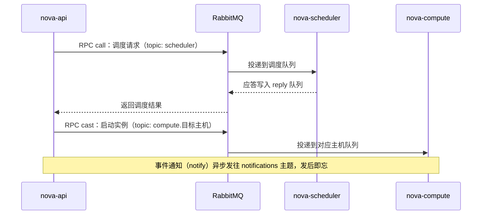
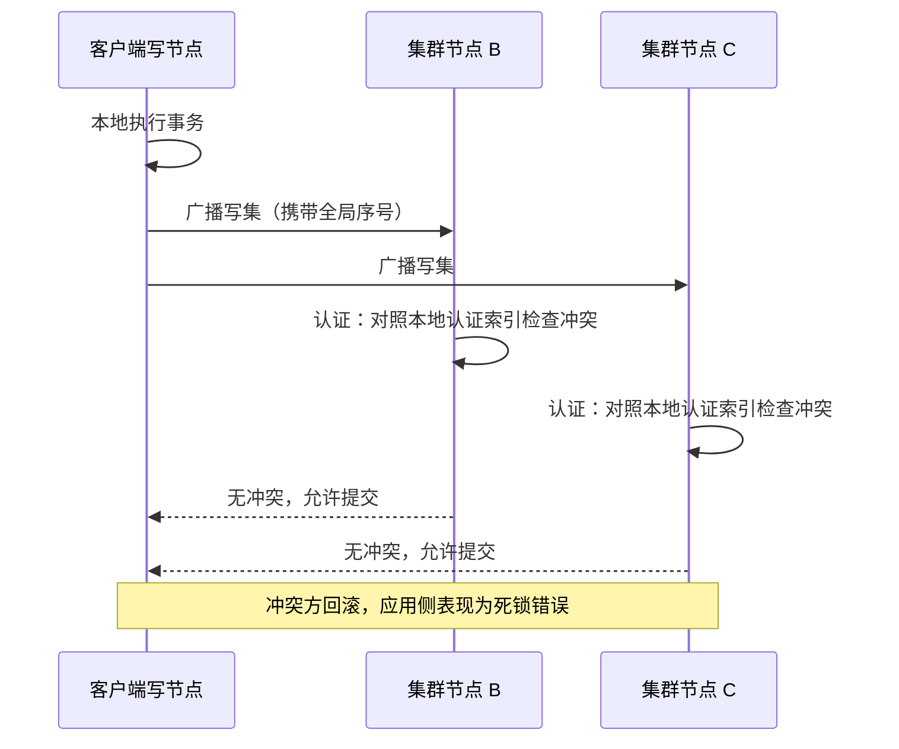

# 02 控制面三件套——MariaDB、RabbitMQ 与 Keystone

**摘要：**

[[云原生/OpenStack/01 OpenStack 全景——从 NASA 与 Rackspace 的联姻到开源云操作系统|上一篇]]把 OpenStack 的全景铺开之后，本篇要钻进控制面的机房。OpenStack 由几十个松耦合的服务组成，但这些服务共享三件基础设施——数据库（MariaDB/Galera）、消息队列（RabbitMQ）与身份服务（Keystone），任何一件停摆，整个平台的创建与变更操作随之瘫痪。本文回答两个问题：其一，这三件「不起眼」的基础组件为什么是 OpenStack 运维故障的重灾区，它们各自的设计取舍是什么；其二，当它们出事时，平台各处会呈现什么症状，运维者应当按什么顺序诊断与恢复。行文先从故障分布的运维经验切入，再依次拆解 Keystone 的令牌演进史、RabbitMQ 的 RPC 通信模型与集群形态、Galera 的认证式复制与流控，然后收拢为一份运维实践清单（证书过期、连接数上限、升级顺序、监控指标），最后用三组故障场景推演验证「控制面冻结不等于数据面停摆」这条贯穿全篇的主线。

---

## 第 1 章 控制面为什么是运维的重灾区

### 1.1 三件共享的基础设施

上一篇讲过，OpenStack 信奉无共享（Shared-Nothing）架构：服务之间不翻看彼此的数据库，协作只走同步的 REST 调用与异步的消息。但「无共享」说的是服务与服务之间，而不是服务与基础设施之间——恰恰相反，几十个服务把三样东西彻底共享了：一套数据库集群、一套消息队列集群、一个身份服务。

不妨把 OpenStack 想象成一栋联合办公大楼：几十家公司（各服务）各自经营，账本（数据库）分开记，谁也不看谁的账；但整栋楼共用同一个档案室（MariaDB，各公司有各自的书架，即独立的库）、同一个收发室（RabbitMQ，跨公司的协作单据都从这里流转）、同一套门禁系统（Keystone，进楼先刷卡，访客要登记）。

档案室瘫痪，所有公司都无法记账；收发室瘫痪，跨公司协作单据全部积压；门禁瘫痪，连楼都进不去——但已经出门在外的员工（已运行的虚拟机）照常干活，不受影响。

| 组件 | 扮演的角色 | 被谁共享 | 故障时的爆炸半径 |
|---|---|---|---|
| MariaDB/Galera | 各服务的状态存储（每服务一个独立库） | 全部服务共享一套集群 | 所有写操作失败，读操作视部署形态而定 |
| RabbitMQ | 服务间异步 RPC 与事件通知的载体 | 全部服务共享一套集群 | 一切需要跨服务协作的操作失败或卡死 |
| Keystone | 认证、服务目录与授权裁决的依据 | 全部服务与所有客户端 | 所有 API 请求在鉴权处失败 |

这三个组件没有一个是 OpenStack 发明的，也没有一个是为 OpenStack 定制的——它们是通用基础设施，OpenStack 只是它们世界上最大的租户之一。这个事实有两面：好的一面是，三件套各自都有十几二十年以上的生产历练，文档、社区与踩坑经验极其丰富；坏的一面是，它们的每一个设计取舍都是为「一般场景」做的，而 OpenStack 的用法恰恰在好几个维度上不一般——连接数极多、消息极碎、令牌校验极频繁。于是三件套的「一般假设」在 OpenStack 上被逐个击穿，这正是本章标题里「重灾区」三个字的由来。

### 1.2 故障的公共路径

上一篇第 6 章给过一条分诊规则：虚拟机还在跑而操作失败，先查控制面；虚拟机本身异常，才查数据面。这条规则背后是一组被反复验证的运维经验：从公开的故障复盘与笔者经历的一线案例看，OpenStack 平台级故障（影响面跨服务、跨节点的故障）的大头不在计算与存储本体，而在控制面——消息队列堆积与脑裂、Galera 集群冲突与慢查询、Keystone 鉴权瓶颈、内部网络抖动，这几类加起来占据了绝大多数「全平台不舒服」的时刻。

原因不难理解。控制面组件是所有服务的公共路径：几十个服务、每个服务若干进程、每个进程若干协作线程，它们的每一次跨服务握手、每一次状态落库、每一次令牌校验，全部汇入三件套。汇入的流量越大，公共路径上的任何一点摩擦就被放大得越多。

数据面则相反：一台计算节点的 libvirt 出问题，只影响本节点的虚拟机；一块 OSD 损坏，只影响它承载的放置组（见 [[中间件/Ceph/01 Ceph 全局架构——RADOS、CRUSH 与三大存储接口|Ceph 全局架构]]）。故障半径天然受限的组件，很难造成平台级事故；故障半径全局共享的组件，天然就是事故的候选地。

> [!info] 核心概念：公共路径与故障半径
> 判断一个组件的运维优先级，看的不是它出问题的频率，而是它出问题时的爆炸半径。三件套的故障半径是「全平台」，所以哪怕它们一年只闹一次脾气，也值得把监控、冗余与预案做满。反过来，单台计算节点故障是日常，处理流程标准化即可，不值得为它升级到「平台级预案」。运维资源的分配应当跟着爆炸半径走，而不是跟着故障频率走。

还有一层放大效应值得点破：三件套之间会互相传染。数据库慢了，消费消息的进程处理变慢，未确认消息堆积，RabbitMQ 内存水位上涨触发流控，发布端被阻塞，API 超时；API 超时引发客户端重试，重试打到 Keystone 的令牌校验上，鉴权压力跟着上涨。你看到的症状在最远处（用户报「控制台卡」），根因却可能在最近处（一块慢盘）。这就是为什么有经验的运维者排障时先看三件套的健康度，再顺着症状往外走——顺序反了，往往在数据面绕一个大圈。

### 1.3 为什么是这三个「老组件」

把三件套的出身年代摆出来看，会发现一个有趣的错位：OpenStack 是 2010 年出生的「新潮」项目，而它的三根支柱全是「中年人」——MySQL 诞生于 1995 年，RabbitMQ 的第一个版本发布于 2007 年（AMQP 0-9-1 规范 2008 年定稿），Keystone 最年轻，也是 2011 年随 Diablo 周期才启动、Essex（2012-04）起才被全部核心服务强制接入的。为什么一个志在「数据中心操作系统」的项目，不自己发明一套更现代的基础设施？

答案是：这三件事——可靠的状态存储、异步消息传递、统一身份认证——在 OpenStack 之前都已经有成熟答案，OpenStack 的创新在「编排」而不在「基建」。2010 年前后的工程共识是，把精力花在服务间的协作协议上（REST 加消息总线的松耦合模型），而把状态、消息与身份托付给经过验证的组件。回头看这个选择相当正确：OpenStack 十六年里服务数量膨胀了几十倍，架构模型却基本未变，靠的正是底座足够稳。

不过「成熟」不等于「无代价」，三件套各自都有一笔被 OpenStack 用法放大的账：

| 组件 | 成熟度带来的红利 | 被 OpenStack 用法放大的代价 |
|---|---|---|
| MariaDB/Galera | 生态、工具链、DBA 人才储备深厚 | 同步多写模型与几十个服务的连接数、热点行更新正面相撞 |
| RabbitMQ | 请求-应答语义与 RPC 模型天然契合 | 每服务多进程的连接模型撞上 Erlang 的资源上限 |
| Keystone | REST 鉴权事实标准，生态兼容性好 | 令牌校验频率与全平台 API 调用量同阶，而非与用户数同阶 |

这张表也是后续各章的路线图：第 2 章拆 Keystone 的令牌演进，第 3 章拆 RabbitMQ 的通信模型与集群形态，第 4 章拆 Galera 的复制原理，第 5 章收拢运维实践，第 6 章做故障推演。行文顺序刻意按「离用户最近」到「离数据最近」排列——鉴权是每个请求的第一关，消息是协作的通道，数据库是状态的归宿。

---

## 第 2 章 Keystone——身份服务的演进与取舍

### 2.1 令牌的进化史：从 UUID 到 Fernet

Keystone 回答三个问题：你是谁（认证，Authentication）、你能干什么（授权，Authorization）、你要找的服务在哪里（服务目录，Service Catalog）。三个问题里，认证的载体——令牌（Token）——经历了四次形态更替，这条演进史是理解 Keystone 运维特性的钥匙，值得完整讲一遍。

第一代是 UUID 令牌：一个 36 字符的随机字符串，Keystone 把它存进数据库，用户拿着它来调 API，服务端拿着它回 Keystone 验真。这个设计朴素可靠，撤销也简单（删掉库里那行记录即可），但有一个致命的负载特征：**每一次校验都是一次对 Keystone 的往返**。全平台每秒成千上万个 API 请求，每个请求都要摸一次 Keystone 的数据库，Keystone 从「发证机关」变成了「全平台每张工单的必经查验台」。

第二代是 PKI 令牌（Folsom，2012-09 引入）：令牌本身是一段用 X.509 证书签名的数据，里面装着用户、项目与服务目录的完整信息。服务端拿到令牌后本地验签即可，不必回 Keystone 查询——负载问题看似解决了。

但两个新麻烦接踵而至：其一，令牌体积膨胀到 8KB 量级，足以撞上常见 Web 服务器默认的请求头缓冲上限，运维者不得不四处调大缓冲区；其二，撤销不再能靠删库记录（令牌不在库里了），只能靠证书吊销列表（CRL，Certificate Revocation List）的分发，而分发有延迟，延迟窗口内被撤销的令牌依然有效。

第三代 PKIZ（Kilo，2015-04）只是对 PKI 做了压缩，缓解体积，不解决本质。真正的转折是第四代 Fernet 令牌（Kilo 引入，Mitaka 2016-04 起成为默认）：令牌用对称密钥加密加签（AES 加 HMAC），体积缩到约 250 字节，而且**不再落库**——Keystone 不存储任何令牌，校验只需要两样东西：密钥，以及一张很短的吊销事件列表。令牌从「需要查验的证件」变成了「本身即证明的芯片卡」。

| 格式 | 引入时间 | 体积 | 校验方式 | 撤销机制 | 遗留问题 |
|---|---|---|---|---|---|
| UUID | 2011 起 | 36 字符 | 回 Keystone 查库 | 删库记录 | Keystone 成为校验热点 |
| PKI | Folsom（2012） | 8KB 量级 | 本地验签 | CRL 分发 | 体积撞请求头上限；CRL 有延迟窗口 |
| PKIZ | Kilo（2015） | 压缩后较小 | 本地验签 | CRL 分发 | 同上 |
| Fernet | Kilo 引入，Mitaka（2016）默认 | 约 250 字节 | 本地解密验签 | 吊销事件列表 | 密钥同步成为运维命门 |


为什么社区宁可引入「密钥同步」这个新麻烦，也要放弃令牌持久化？因为持久化的代价不在存储，而在路径：只要令牌存在数据库里，撤销与校验就绕不开数据库，Keystone 的数据库就成了全平台每个请求的隐性依赖。Fernet 把「校验」从数据库操作变成了纯密码学运算，把撤销从「删记录」变成了「查一张小列表」，Keystone 的负载画像从此与请求量解耦。这是典型的**复杂性转移**：数据库的复杂性消失了，密钥管理的复杂性出现了——你不妨把 Fernet 密钥想象成制卡的母版，所有发卡点（Keystone 节点）必须用同一套母版，母版不一致，A 点发的卡在 B 点验不过。

密钥管理由此成为 Fernet 时代的运维命门，规则有三条：其一，所有 Keystone 节点必须共享同一套密钥仓库（通常放在共享存储或用配置管理工具分发）；其二，密钥要定期轮换（`keystone-manage fernet_rotate`），默认最多保留三把（主密钥、次密钥与预备密钥，`max_active_keys` 默认为 3），轮换后旧令牌在宽限期内仍可验证，过期后自然失效；其三，轮换动作必须全节点协调，任何一台节点漏转或错转，都会出现「部分用户随机鉴权失败」这种最难排查的症状——因为它看起来像网络问题，实际是密码学问题。

### 2.2 服务目录与 endpoint：先问路，再赶路

Keystone 的第二项职责是服务目录：每个 OpenStack 服务上线时，都要在目录里登记自己的名字、类型与访问地址（端点，Endpoint）。客户端的固定动作是「先问目录、再发请求」——你执行一条 `openstack server create`，命令做的第一件事是向 Keystone 要一张目录，查出 Nova、Neutron、Cinder、Glance 的地址，然后才开始真正的业务调用。

每个服务的端点按用途分三类接口（interface）：public（对外暴露的地址）、internal（服务间内网调用的地址）、admin（管理用途的地址）。这个划分在多区域（region）部署下还会叠加区域维度——同一个服务在每个 region 各有一套端点。上一篇讲过 region 与 endpoint 的概念体系，这里从运维视角补一层：目录数据就存在 Keystone 的数据库里，它本质上是**一张可以被改错的表**。

> [!warning] 生产避坑：目录是最容易被小改动放大的配置
> 改错一条端点记录，所有客户端跟着迷路——而且症状往往不在 Keystone，而在「迷路的地方」：public 地址指向了外网域名而计算节点内网解析不通，于是所有从计算节点发起的服务间调用超时；internal 与 public 混用，导致本该走内网的流量绕行公网，延迟与安全风险同时出现。修改目录应当走变更流程并保留旧值备份，改完立刻用 `openstack endpoint list` 核对，并从一台计算节点实际发起一次服务间调用做验证——目录的正确性不能靠「看起来对」，要靠一次真实的问路来证明。

端点还有一层容易忽略的运维含义：证书。public 与 internal 端点若启用了 TLS，证书的过期监控必须覆盖到内网地址——实践中「公网证书盯得紧、内网证书无人管」导致的平台级故障并不罕见，第 5 章还会回到这个话题。

### 2.3 domain/project 层级与 policy 授权

上一篇交代过 project、domain、region 的概念体系，本节从运维视角看这套层级如何影响授权。Keystone v3 API（随 Grizzly 发布，2013 年）引入了域（Domain）：域是用户与项目的顶层命名空间，一个域可以对应一家子公司、一个部门或一类客户，域之上还可以做联合身份（Federated Identity，对接企业 LDAP 或 SAML）。项目在 Mitaka（2016）起支持嵌套，形成「域—项目—子项目」的树，配额与角色沿树管理。

授权的裁决机制值得单独说透，因为它体现了一个容易被误解的分工：**Keystone 只回答「你是谁、你有什么角色」，而「这个角色能不能做这件事」由各服务自己裁决**。每个服务持有一份策略文件（早期是 policy.json，后来迁移为 policy.yaml），里面是形如「`volume:create` 需要 `admin` 或 `member` 角色」的规则。也就是说，OpenStack 没有一个中央授权引擎，Keystone 发放「带角色的身份」，Nova、Cinder、Neutron 各自拿着自己的规则手册做判断。

这个「标准与实现分离」的设计有明确的得与失。得的是灵活性：各服务可以按自己的资源语义定义细粒度规则，社区后来推动的默认策略演进（system 范围、reader 角色等）也可以逐服务推进而不必全体同步。失的是运维成本：改授权要逐服务改策略文件，改完要逐服务重启；跨服务的「一个人在系统里到底能干什么」没有一张统一的表可查，审计时要把几十份策略文件拼起来看。对比 [[云原生/Kubernetes/Kubernetes架构深度剖析/05 认证、授权与准入控制：K8s 的安全三级防线|Kubernetes 的认证授权体系]]——K8s 把授权收敛在 API Server 一处（RBAC 统一裁决），OpenStack 则把裁决权下放到各服务，两种取舍没有高下，但运维姿势完全不同：前者改一处生效全局，后者改几十处各自生效。

层级还有一个历史包袱要再提醒一次（上一篇提过）：早期字段叫 tenant，v3 起更名为 project，但 Nova 等服务的数据库表里至今仍是 `tenant_id`。读旧代码、旧监控与旧文档时，这两个词要随时互译。

### 2.4 token 风暴与校验成本

现在把令牌演进与负载联系起来。全平台对 Keystone 的调用压力，来自一个容易被低估的事实：**Keystone 的请求量与全平台 API 调用量同阶，而不是与用户数同阶**。一个用户点一次「创建虚拟机」，背后是 Nova 调 Neutron、调 Cinder、调 Glance 的多次服务间调用，每一次调用都要携带令牌、每一次都要校验；再加上自动化脚本、监控探针与周期任务，Keystone 承受的校验压力比「用户数 × 操作频率」高出不止一个量级。

所谓令牌风暴（Token Storm），就是这层放大在特定时刻的集中爆发：批量作业启动、监控全量采集、或某个服务异常重试时，海量令牌校验同时涌向 Keystone。

UUID 时代这是灾难性的——每次校验都打向 Keystone；Fernet 时代校验本地化，风暴眼转移到了吊销事件列表的拉取与缓存上，压力小了一个量级，但没有消失。

工程上的缓解手段按层次排：

1. **校验结果缓存**：各服务的认证中间件（keystonemiddleware 的 auth_token 层）支持把校验结果缓存到 memcached，命中缓存的请求不再回源——这是第一道闸门，生产部署必须开启；
2. **令牌格式升级**：Fernet 本地验签，把「每请求一次回源」变成「每请求一次本地运算」；
3. **TTL 权衡**：令牌默认有效期 1 小时（`[token] expiration` 默认 3600 秒），调长可以降低签发与校验频率，但撤销时效变差——被禁用的用户在 TTL 窗口内仍可凭旧令牌操作；调短则相反。这个旋钮没有标准答案，取决于你的安全基线与 Keystone 的容量余量；
4. **压住风暴源头**：对批量自动化任务做限速与错峰，避免「一万台虚拟机同时续租」这类自造的洪峰。

> [!note] 设计哲学：把校验从「路径」变成「能力」
> 令牌演进史的本质，是把「每次操作都要请示发证机关」改造成「发证机关只管发证与吊销，验真由持证者与服务端本地完成」。UUID 时代 Keystone 是路径（每个请求必经），Fernet 时代 Keystone 是能力（密钥在手即可验真）。路径会随流量线性放大，能力不会——这是所有鉴权系统演进的共同方向，也是 Keystone 运维者判断「压力来自哪里」的基本框架：先看校验是否走了缓存，再看吊销列表的获取频率，最后才看令牌签发本身。

### 2.5 高可用形态与部署要点

Keystone 本身是无状态服务：多实例加负载均衡即可横向扩展，自身不持有任何必须落地的状态——它的可用性设计因此异常简单，难点全部在外置状态上。身份与分配数据存放在 SQL 后端（随 Galera 集群获得高可用）；Fernet 密钥仓库要求全节点一致（2.1 节讲过）；校验结果缓存放 memcached；如果对接了企业 LDAP 或联合身份，外部身份源的可用性也会传导进来。

| 外置状态 | 放在哪里 | 挂掉会怎样 |
|---|---|---|
| 身份与分配数据 | SQL 后端（Galera 集群） | 无法登录与签发令牌，全平台鉴权失败 |
| Fernet 密钥仓库 | 共享存储或配置管理分发 | 密钥漂移的节点随机验签失败 |
| 校验缓存 | memcached | 回源增多、延迟上升，是劣化不是故障 |
| 外部身份源 | LDAP / SAML | 联合登录失败，本地用户不受影响 |

负载均衡的健康检查值得单独提醒：要打在真实的鉴权接口上（譬如 v3 的令牌接口），而不是 TCP 端口探活。「端口活着但服务不健康」的假活状态并不罕见——Web 服务进程僵死、应用队列打满，端口照样接受连接，请求进去却石沉大海。健康检查的语义必须与「用户能不能用」对齐，否则负载均衡会把流量继续送到一具僵尸上。

对接外部身份源（LDAP）的部署还要多想一层：企业 LDAP 的故障会直接变成「一半用户登录不了」，而 OpenStack 侧毫无异常。这不是 Keystone 的缺陷，而是依赖的自然传导——但预案里必须有它：LDAP 探活、缓存策略、以及「外部身份源故障时本地管理员账号仍可登录」的兜底验证，都应当写进运维手册。

---

## 第 3 章 RabbitMQ——消息总线的运维真相

### 3.1 RPC 与 notify：两种消息两种命运

上一篇讲过 OpenStack 的通信模型：同步协作走 REST，异步协作走消息总线。本节把异步这一半拆开。OpenStack 的服务间异步通信由 oslo.messaging 库（2014 年从早期各服务自带的 rpc 模块整合而成，IceHouse 周期定型）统一抽象，底层默认对接 RabbitMQ 的 AMQP 协议。oslo.messaging 把流量分成两大类，两类消息的命运截然不同：

第一类是 RPC（Remote Procedure Call，远程过程调用），又分三种语义：call（请求-应答，调用方阻塞等待结果）、cast（单向投递，不等应答）、fanout（广播，所有订阅者各收一份）。

nova-api 收到创建虚拟机请求后，向调度器发一次 call 问「哪台计算节点合适」，调度器应答后，再向目标计算节点发 cast 让它干活——这就是第 4 篇要展开的实例创建流水线的骨架。

第二类是通知（Notification）：服务把「发生了什么」（实例状态变更、卷创建完成）发到 `notifications` 主题，谁感兴趣谁订阅——遥测服务 Ceilometer 就是最大的消费者。通知是「发后即忘」的：发布者不关心谁在听、有没有人听到。

| 语义 | 方向 | 典型场景 | 默认可靠性 |
|---|---|---|---|
| RPC call | 请求-应答，同步等待 | API 调用执行者干活并要结果 | 队列持久化，消息持久化 |
| RPC cast | 单向投递，不等应答 | 下发任务（启动实例、挂载卷） | 队列持久化，消息持久化 |
| RPC fanout | 广播给所有同名消费者 | 向全部计算节点广播变更 | 同上 |
| Notification | 发布-订阅，发后即忘 | 状态事件上报（遥测、审计） | 队列默认非持久化，broker 重启即丢 |

这张表里最要紧的一行是最后一行。通知队列默认非持久化，意味着 RabbitMQ 重启一次，重启期间的所有事件就永久丢了——遥测曲线出现缺口、审计记录缺失，都是「设计如此」而不是故障。反过来说，RPC 队列是持久化的，broker 重启后积压的任务会继续投递。两种消息两种命运，做容量规划与故障预案时必须分开对待。



顺带回答一个常被问到的问题：为什么不用 Kafka 做消息总线？[[中间件/Kafka/01 Kafka 全局架构——Broker、Topic、Partition 与消息流转|Kafka]] 是日志型消息系统，消费者主动拉取、按位移消费、消息保留历史，适合「一份事件、多方回放」的流式场景；而 OpenStack 的 RPC 需要的是「点对点投递、处理完应答、队列空了就删」的队列语义，这正是 RabbitMQ 的主场。事实上 OpenStack 的遥测管道后来确实引入过 Kafka，但 RPC 主干始终是 RabbitMQ——**语义匹配比技术新旧更重要**。

### 3.2 集群、镜像队列与仲裁队列

单个 RabbitMQ 节点有两个先天局限：其一，队列默认只存在于一个节点上，节点挂了，它承载的队列随之不可用；其二，Erlang 进程与文件描述符的资源上限，决定了单节点扛不住大型部署的连接数。于是生产部署必然走向集群，而 RabbitMQ 的集群高可用方案本身经历了一次范式更替，这条线值得讲清楚。

RabbitMQ 集群由共享同一 Erlang cookie 的节点互联组成（节点发现走 epmd 的 4369 端口，节点间通信走 25672 起的分布式端口）。但要注意：**集群只复制元数据（交换器、绑定关系），不复制队列内容**——队列默认仍钉在创建它的节点上。

要让队列在节点故障后存活，需要高可用机制，历史上靠的是镜像队列（Classic Mirrored Queue，2011 年的 2.6 版引入）：为队列配置一个或多个镜像节点，主节点写入、镜像同步，主节点故障时镜像提升为主。

这个方案运行了十年，但它的同步语义在分区场景下并不可靠——主从失联时谁说了算，一度是 RabbitMQ 运维的经典难题，社区给出的网络分区处理策略里，`pause_minority`（少数派自动暂停）被 OpenStack 官方文档推荐为默认选择。

2019 年的 RabbitMQ 3.8 引入了仲裁队列（Quorum Queue）：队列副本之间用 Raft 协议（见 [[中间件/ETCD/02 Raft 共识协议——Leader 选举、日志复制与安全性|Raft 共识协议]]）达成多数派一致，写入需要多数节点确认，分区时少数派拒绝服务——从「主从复制」转向了「共识复制」。2021 年的 3.9 版正式把镜像队列标记为废弃，2024 年的 4.0 版彻底移除。OpenStack 侧的 oslo.messaging 也已支持仲裁队列，但存量生产环境里镜像队列仍然大量存在——**升级前先弄清自己跑的是哪一种**，两者的调优思路与故障模式并不相同。

打个比方：镜像队列像「每份文件复印三份放在三个柜子，主柜丢了拿副柜」，简单直接，但复印需要时间，主柜与副柜可能短暂不一致；仲裁队列像「三个保管员开会表决，过半数同意才算存入」，一致性更硬，但每次写入都要开一次小会，延迟略高。RabbitMQ 用十年时间完成了从前者到后者的迁移，这个迁移与 [[中间件/ETCD/02 Raft 共识协议——Leader 选举、日志复制与安全性|Raft 共识协议]] 在业界基础设施中的普及是同一股潮流。

### 3.3 连接风暴与 heartbeat

RabbitMQ 在 OpenStack 场景下的第一个放大效应是连接数模型。oslo.messaging 的连接是按「服务进程」组织的：每个 API 进程、每个执行器进程都持有自己的连接，nova-compute 每台一个进程但内部多条信道，再加上通知发布、遥测订阅各自独立连接。一个几百个计算节点的集群，RabbitMQ 上的连接数轻松达到数千，每条连接上还开着若干信道（channel）。这个量级本身不致命，致命的是它的两个伴生问题：连接上限与连接风暴。

连接上限是一组隐形天花板的叠加：RabbitMQ 的文件描述符限制（nofile）、Erlang 进程上限、内存与磁盘水位（内存默认用到物理内存的 40% 即触发告警，磁盘剩余空间低于阈值即拒绝写入）。水位一旦触发，RabbitMQ 会阻塞发布端——所有 OpenStack 服务的 RPC 调用瞬间挂起，表现为「全平台 API 卡死」。这个保护机制是合理的，但它把「资源水位」直接变成了「可用性」，所以第 5 章会强调水位监控必须前置。

连接风暴则是更常见的日常故障。AMQP 协议有心跳（Heartbeat）机制，默认 60 秒，双方周期互发心跳帧证明存活。经典的事故链是这样的：某个计算节点 CPU 饥饿或 DNS 解析卡住，客户端的心跳发不出去，broker 判定连接死亡并关闭；客户端立即重连（oslo.messaging 的重连间隔默认仅 1 秒）；如果此时恰好是 RabbitMQ 整体重启或网络抖动，全平台几百个服务进程**同时**重连，刚恢复的 RabbitMQ 立刻被连接洪峰压垮，进入「起来又被打死」的循环。

防范的要点有三：重启 RabbitMQ 必须分批错峰，绝不能「一把梭」重启整个集群；调大客户端重连间隔与抖动，把重连洪峰摊平；心跳超时不要盲目调小——green thread 被阻塞时心跳发不出去是常态，超时调得越激进，误杀越多。

### 3.4 积压诊断：rabbitmqctl 命令集

消息积压是 RabbitMQ 最常见的故障形态，诊断的第一站是命令行工具集：

```bash
# 队列视角：深度、就绪数、未确认数、消费者数——四个数字是诊断的核心
rabbitmqctl list_queues name messages messages_ready messages_unacknowledged consumers

# 连接视角：谁连着、从哪来、什么状态
rabbitmqctl list_connections user peer_host state channels

# 集群视角：节点是否齐全、是否有分区
rabbitmqctl cluster_status

# 内存都花在哪了（较新版本）
rabbitmq-diagnostics memory_breakdown
```

四个数字的判读逻辑如下表：

| 现象 | 含义 | 第一动作 |
|---|---|---|
| messages 高，consumers 为 0 | 消费者掉线：服务进程挂了或没起 | 查对应服务的进程与日志，而不是查 MQ |
| messages_unacknowledged 高 | 消费者收到了但没确认：处理慢或卡死 | 查消费者日志与 prefetch 配置，看下游数据库是否变慢 |
| messages_ready 持续增长 | 生产速率大于消费速率 | 找下游瓶颈（常见是数据库），必要时扩消费者 |
| 某队列深度忽高忽低震荡 | 消费者在反复重连 | 查消费者侧日志与心跳配置 |

消息丢失与重放是另一件要想清楚的事。通知类消息默认非持久化，丢了就是丢了，遥测与告警系统要有「数据有洞」的心理预期；RPC 消息虽然持久化，但「消费失败」并不会自动重试——oslo.messaging 没有内置的死信与重放队列，OpenStack 靠的是更高层的兜底：各服务的状态机与周期任务（譬如 nova-compute 的周期任务会把卡在中间状态的实例拉回正轨）。换句话说，**RabbitMQ 在 OpenStack 里是「协作的信道」，不是「可靠的账本」**——指望 MQ 帮你重放消息来恢复一致性，方向就错了；恢复一致性的机制在服务自身的状态机里。

### 3.5 队列拓扑——队列是怎么长出来的

排障时打开 RabbitMQ 的管理界面，第一眼往往被队列数量吓到：一个中型集群动辄上千个队列。这些队列不是谁手工建的，而是各服务启动时按规则自动声明的，理解声明规则，队列清单就是一张可读的拓扑图。

每个服务按主题（topic）声明自己的工作队列：调度器监听 `scheduler` 主题，执行器监听 `compute`、`volume` 之类的主题；需要定向投递到特定主机时，队列名追加主机名后缀（`compute.<host>`）；需要广播时派生一组 fanout 队列；通知则统一走 `notifications` 主题。队列总数大致等于「服务主题数 + 在线主机数 × 每主机队列数 + fanout 队列数」——几百个计算节点的集群，队列上千是常态。

| 队列类型 | 命名形态 | 谁消费 | 生命周期 |
|---|---|---|---|
| 主题队列 | `scheduler`、`compute` | 该主题的一组服务进程 | 服务存续期间持久存在 |
| 主机队列 | `compute.<host>` | 特定主机的执行器 | 随主机增减 |
| 广播队列 | `compute.fanout` | 所有同名消费者各一份 | 服务存续期间持久存在 |
| 通知队列 | `notifications` | 遥测、审计等订阅方 | 默认非持久化，broker 重启即消失 |

队列拓扑里藏着一个经典的坑：孤儿队列。服务改名、主机退役、配置调整之后，旧队列还留在 broker 上，没有消费者，却可能堆积着无人认领的消息。较新版本的 oslo.messaging 提供了瞬时队列的过期清理，但持久化队列仍需人工处理——巡检时要核对「队列清单」与「在线服务 × 在线主机」是否匹配，发现无消费者的持久化队列，先查明来路（是不是某台退役主机的遗留），再决定删除。队列清单与实际拓扑的偏差，本身就是一面反映集群健康度的镜子。

---

## 第 4 章 MariaDB/Galera——被低估的同步复制

### 4.1 各服务的数据库版图

OpenStack 的数据库版图是「一套集群、几十个库」：所有服务共享一套 MariaDB/Galera 集群，但每个服务拥有自己的库——keystone、glance、nova、neutron、cinder 各一块地盘，表结构、迁移节奏、访问模式完全独立。Nova 在 Ocata（2016）引入 cell v2 架构后进一步拆成三个库：nova_api（API 与配额等全局数据）、nova（cell 内实例数据）、nova_cell0（调度失败暂存的实例）——一个服务三个库，是 OpenStack 数据库版图里最值得记住的特例。

表规模给个量级：Nova 的主库有上百张表，Neutron 数十张，Keystone 二十张上下。行数量的级更值得关注：instances 表随集群规模与历史存量线性增长，一个运行多年的万级虚拟机集群，这张表加上它的关联表（含事件、审计类）可以积累到千万行级；增长最快的往往是事件与审计类表。这些数字决定了两件事：schema 迁移（升级时的 ALTER TABLE）在大表上是分钟级操作，必须安排在维护窗口；备份与统计查询必须避开业务高峰，否则会拖慢整个集群（原因见 4.2 节的流控）。

底层引擎的选型没有悬念：InnoDB 加行级锁，事务与崩溃恢复的语义在 [[中间件/MySQL/MySQL架构与底层原理/01 MySQL 全局架构——一条 SQL 的完整生命周期|MySQL 全局架构]] 里已有完整展开，本篇不重复。真正值得展开的是部署形态——生产环境几乎清一色选择 Galera 集群，而 Galera 的复制模型与 MySQL 传统主从复制是两种世界观。

### 4.2 认证式复制与流控

Galera 是芬兰 Codership 公司开发的同步多主复制方案，通过 wsrep（Write Set Replication）API 与 MariaDB 集成。它的工作方式与 [[中间件/MySQL/MySQL架构与底层原理/10 Binlog 与主从复制——数据同步的底层传动链|MySQL 主从复制]]（异步、单主、从库回放 binlog）完全不同：**每个节点都是主节点，每个事务在提交时向全集群广播写集（Write-set），所有节点各自独立地做一次认证（Certification），确认这个写集与本地已见到的事务没有冲突，多数派通过后才允许提交。**



认证式复制的本质是乐观并发控制在集群层的延伸：事务先斩后奏，本地执行时不加全局锁，提交时才对答案。冲突的代价由应用承担——输掉认证的事务回滚，客户端看到的是一条死锁错误。这个模型与 [[中间件/MySQL/MySQL架构与底层原理/10 Binlog 与主从复制——数据同步的底层传动链|MySQL 主从复制]] 的对比可以摆成一张表：

| 维度 | 异步主从复制 | Galera 同步复制 |
|---|---|---|
| 复制方向 | 单主，从库异步回放 | 多主（或单写），全节点同步 |
| 故障切换 | 需要提升从库，可能丢最新事务 | 剩余节点直接继续，已提交事务不丢 |
| 写延迟 | 主库本地提交，延迟低 | 等待全节点认证，受最慢节点拖累 |
| 写扩展性 | 写集中在主库 | 多写可分摊，但冲突回滚吃掉收益 |
| 一致性语义 | 最终一致（有复制延迟） | 顺序一致（全局序号） |

从 [[分布式架构/分布式系统原理与协议/02 CAP 定理深度解析|CAP 定理]] 的视角看，Galera 用同步复制换强一致，代价是可用性与写延迟受最慢节点拖累——网络一抖，全集群的写入都要等它。这个「等」有专门的机制来兜底，就是流控（Flow Control）：落后节点向集群广播暂停请求，其他节点按比例放慢写入，直到落后者追平。流控是保护，不是故障，但它把「一个节点慢」放大成「全集群写慢」，运维者必须能识别它：`wsrep_flow_control_paused` 指标上升、写入延迟抬升，就是流控在起作用的信号。

新节点加入或落后过多的节点重新接入，走的是另一条路：增量状态转移（IST，Incremental State Transfer）或状态快照传输（SST，State Snapshot Transfer）。每个节点维护一个环形缓冲（gcache），保存最近的写集；重新接入的节点若缺口在 gcache 覆盖范围内，走 IST 只补增量，几分钟内追平；缺口太大则退化为 SST，由一个捐赠节点做全量传输（mariabackup 或 xtrabackup 方式），期间捐赠节点脱离集群同步——三个节点的集群在 SST 期间实际只剩两个在服务，再坏一个就丢仲裁。**gcache 调大、SST 尽量避免，是 Galera 运维的第一条纪律。**

> [!note] 设计哲学：认证式复制是把冲突处理「前置」还是「后置」
> 异步主从复制把冲突处理后置——主库先提交，从库回放时发现冲突已经晚了，只能靠人工对账；Galera 把冲突处理前置——提交前全集群对答案，冲突者当场回滚。前置的代价是写路径变长（要等全节点认证），后置的代价是一致性风险。OpenStack 的负载是「写多、单行热点、强一致要求高」（配额、IP 分配、资源状态），前置冲突处理恰好匹配它的语义，这是 Galera 成为 OpenStack 事实标准数据库方案的根本原因。但匹配不等于免费——4.4 节的热点行问题，正是这个模型的账单。

### 4.3 wsrep 关键参数

Galera 的参数体系庞大，但 OpenStack 场景下真正需要动手的是少数几个：

| 参数 | 作用 | 运维建议 |
|---|---|---|
| `wsrep_cluster_name` / `wsrep_cluster_address` | 集群身份与成员列表 | 三节点起步，分散在不同故障域；跨机房部署要评估延迟 |
| `gcache.size` | 增量转移的环形缓冲大小 | 适当调大（默认值偏保守），让掉线节点尽量走 IST 而非 SST |
| `wsrep_slave_threads`（新版本改名 `wsrep_applier_threads`） | 事务并行回放线程数 | 按 CPU 核数调整；并行回放要求表有主键，OpenStack 的表基本满足 |
| `gcs.fc_limit` / `gcs.fc_factor` | 流控触发阈值与恢复比例 | 默认起步，观察流控指标后再调，不要上来就放大 |
| `wsrep_sync_wait` | 读操作前的因果一致性检查（读己之写） | 关键读路径按需开启，有延迟代价；全局开启会显著拖慢读 |
| `binlog_format` | 复制格式 | 固定 ROW，Galera 的硬性要求 |
| `innodb_flush_log_at_trx_commit` | 事务持久化语义 | 生产建议 1（每次提交落盘），与 Galera 的同步语义配套 |

这张表里最容易被误操作的是 `wsrep_sync_wait`：它解决的是「写节点 A 提交后立刻从节点 B 读不到」的经典问题，但每次读都要做因果检查，代价是读延迟上升。正确姿势是只在关键路径（譬如创建后的立即回读）开启，而不是全局打开。

### 4.4 慢查询与锁等待排障

Galera 集群上的性能问题，要按「先集群层、后单机层」的顺序排查，因为两层问题会互相伪装：流控会让所有查询变慢，看起来像慢查询泛滥；锁等待会让事务堆积，看起来像集群落后。第一层看集群状态：

```sql
-- 集群是否完整、本节点状态是否健康
SHOW STATUS LIKE 'wsrep_cluster_size';          -- 应等于节点总数
SHOW STATUS LIKE 'wsrep_cluster_status';        -- 应为 Primary
SHOW STATUS LIKE 'wsrep_local_state_comment';   -- 应为 Synced
-- 流控与冲突：这两个数字持续增长说明写入被拖慢或有冲突在发生
SHOW STATUS LIKE 'wsrep_flow_control_paused';
SHOW STATUS LIKE 'wsrep_local_cert_failures';
```

集群层排除后，第二层看锁与慢查询。OpenStack 有几个公开已久的热点：Nova 的配额表（quota_usages，每次创建实例都要在同一行上做预留与扣减，天然串行化）、Neutron 的 IP 分配表（ipallocations，同一子网的分配竞争同一批行）、Placement 的资源清单表（大规模调度时的库存扣减）。这些热点在低负载时毫无症状，负载一上来就表现为操作卡住数十秒后报死锁或超时——InnoDB 的锁等待超时默认 50 秒（`innodb_lock_wait_timeout`），应用侧看到的就是「卡 50 秒然后失败」。

工具链按这个顺序用：先查 `information_schema.innodb_trx` 与锁等待视图，看是谁持着锁不放（往往是某个长事务，譬如升级期的大表迁移）；再开慢查询日志（`long_query_time` 调低）定位具体语句；最后才谈加索引、改写法。**顺序不能反**——热点行问题不是索引能解决的，把精力花在错的地方，是数据库排障最常见的浪费。

### 4.5 备份策略

Galera 的多副本带来一个危险的错觉：三个节点互为副本，还需要备份吗？需要，而且理由比单机时代更硬：**副本防的是硬件故障，防不了逻辑错误**——一条误执行的 DELETE 会在认证通过后同步到所有节点，三个副本同时「正确地」删掉了数据。多副本架构下，逻辑错误的传播速度反而更快。

备份方案按场景选：mariabackup 做物理备份（速度快、可增量，从非写节点取备份以避开写路径），mysqldump 做逻辑备份（小库可用，恢复慢但可读性好）。要做时间点恢复（PITR，Point-In-Time Recovery），必须开启 binlog 并妥善归档——注意 Galera 的复制不依赖 binlog，binlog 在这里纯粹是为备份服务的。

备份窗口的选择也有讲究：备份的 IO 会拖慢节点、可能触发流控，从捐赠节点或负载最低的节点取备份是基本礼仪。

最后一条纪律最朴素也最重要：**定期做恢复演练**。没有验证过可恢复的备份不算备份，只算心理安慰——这条在 Galera 上尤其成立，因为从备份恢复往往意味着重建节点、重新加入集群，整套流程只有在演练里走通，事故时才敢用。

### 4.6 连接池与超时——应用侧的配合

数据库侧的天花板（5.2 节）只讲了一半，另一半在应用侧：每个服务进程的 SQLAlchemy 连接池参数，决定了「几十个服务 × 若干进程」最终会在数据库上压多少连接。池子上限（`max_pool_size` 加 `max_overflow`）要按服务进程数规划，而池子的回收参数（`pool_recycle`）则要与数据库侧的超时对齐——回收值必须小于数据库的空闲连接超时与中间层（负载均衡）的连接超时，否则应用会从池里拿到一条已被服务端悄悄关闭的连接，报出那句经典的「MySQL server has gone away」。

超时链条的对齐是这一节的核心。一条请求的失败边界由链条上最脆弱的一环决定，正确的排序是：应用层的请求超时大于数据库的锁等待超时，锁等待超时大于连接池的获取超时——每一层都给下一层留出先放弃的余地。反过来配置（应用等得比数据库久）会出现「数据库已经放弃并回滚，应用还在傻等」的错位，用户看到的是漫长的白屏加上一个不知所云的错误。

Galera 的单写者形态还给连接池添了一个拓扑要求：写连接池指向负载均衡上的写端口（只转发给写节点），读连接池可以分摊到所有节点——但「写后立即读」的关键路径必须留在写节点上（或开启 4.3 节的因果读），否则会遇到「刚写完就读不到」的复制延迟假象。连接池的拓扑与超时对齐，是应用侧与数据库侧的接口契约，值得写进每个服务的部署模板。

---

## 第 5 章 三件套运维实践

### 5.1 证书、密钥与 token 过期

三件套的运维里，有一类故障特别冤枉：组件本身毫无问题，但某个会过期的东西过期了，全平台跟着遭殃。会过期的东西至少有四类，每一类都值得纳入监控与轮换纪律。

第一类是 TLS 证书。内部端点（服务间调用的 internal 地址）的证书最容易被遗忘——公网证书有到期监控，内网证书常常无人认领，直到某天证书过期、所有服务间调用开始报证书校验失败，平台「莫名其妙」瘫痪。

第二类是 Fernet 密钥：轮换要全节点同步（2.1 节讲过），漏转一台就会出现「部分用户随机鉴权失败」；轮换本身应当用定时任务自动化（`keystone-manage fernet_rotate`），并把密钥仓库的节点间一致性纳入巡检。第三类是令牌 TTL：默认 1 小时，调长可以降低 Keystone 压力但撤销变迟钝，调短则相反——这是安全与性能的权衡，没有标准值，但必须有意识地选定并记录理由。第四类是服务凭据：每个服务的配置文件里都存着 Keystone 用户密码、RabbitMQ 密码、数据库密码，轮换它们是纯粹的工程问题——配置管理工具批量修改、滚动重启、灰度验证，缺一步都会造成「改了一半」的中间态。

> [!warning] 生产避坑：把「会过期的东西」当成一等公民来监控
> 证书、密钥、令牌、密码的共同特点是：平时完全隐形，过期时全面爆炸，而且爆炸症状（超时、鉴权失败、连接重置）与根因（某个日期到了）相距十万八千里。实践中的做法是把所有会过期的东西登记成清单，到期前 30 天告警、前 7 天升级告警；轮换操作写进 runbook 并演练。这类故障的根因从来不是技术，是「没人记得它存在」。

### 5.2 连接数上限：三件套的隐形天花板

三件套各自都有一组「默认值远低于 OpenStack 需求」的资源上限，平时不显山露水，容量一上来集体爆雷。逐个过一遍。

数据库侧：MariaDB 的最大连接数默认 151，而 OpenStack 的连接需求要按「服务数 × 每服务进程数 × 每进程连接池上限」估算——几十个服务、每个服务若干进程、每个进程的 SQLAlchemy 连接池（`max_pool_size` 加 `max_overflow`）加起来，数百节点的集群轻松突破数千连接。生产部署把这个值调到数千是常规操作，但调大只是解耦了数据库侧，连接的真正来源在应用侧，池子的上限要与服务进程数一起规划。消息队列侧：RabbitMQ 的天花板是文件描述符（nofile，需要调到数万）、Erlang 进程上限、内存与磁盘水位（内存默认 40% 触发告警并阻塞发布端）。Keystone 侧：Web 服务进程数乘线程数决定了并发校验能力，配合 2.4 节的缓存策略一起看。

这些上限的共同特点是：**平时离得很远，出事时一击致命**，而且往往在故障时刻集中触发——MQ 重启引发全平台重连，重连洪峰撞上文件描述符上限，一部分连接被拒，服务进入重试循环，风暴自我维持。所以容量规划不能只看平均值，要看「故障恢复时刻的峰值」：所有服务同时重连、同时重试、同时鉴权的那个瞬间，才是三件套真正的设计负载。

### 5.3 版本升级顺序

三件套的升级顺序有一条铁律：**先基建、后服务；基建内部，先数据库、再消息队列；服务内部，先 Keystone、后其他**。顺序错了不是「性能差一点」，是直接故障。

数据库先行，是因为 OpenStack 各服务的升级第一步都是数据库 schema 迁移（譬如 `keystone-manage db_sync`），新代码依赖新表结构——数据库没升级就升级服务，服务启动即崩。Galera 集群本身要逐台滚动升级：一台下线、升级、重启、等 IST 追平、确认 Synced，再动下一台；任何时刻集群里都要保持多数派在线。消息队列次之：RabbitMQ 的升级要按官方路径逐版本走（跨大版本有协议与特性开关的门槛），镜像队列在 3.9 后已废弃、4.0 已移除，升级前必须确认自己的队列形态与目标版本的兼容性。最后是 OpenStack 服务：Keystone 第一个升（所有服务都依赖它），然后按服务依赖顺序推进，每个服务先跑 schema 迁移、再滚动重启进程。

版本节奏上还有一个社区约定值得知道：OpenStack 从 2023 年起把每年二月的版本定为 SLURP（Stable Release Updates Release Point），允许从上一个 SLURP 直接跨一年升级，非 SLURP 版本之间则必须逐版本升——升级路径的规划要跟着这个节奏走，跨级升级是官方明确不支持的操作。

### 5.4 监控关键指标

三件套的监控指标可以收拢成一张清单，采集方式建议统一走 [[可观测/指标/02 Prometheus 数据模型与采集原理|Prometheus 的指标体系]]（RabbitMQ 与 MariaDB 都有成熟的 exporter，Keystone 可从 API 探活与日志指标入手）：

| 组件 | 指标 | 异常意味着什么 |
|---|---|---|
| Keystone | API 探活与 5xx 率、令牌校验延迟、Fernet 密钥年龄与节点间一致性 | 鉴权瓶颈、轮换失效、节点密钥漂移 |
| RabbitMQ | 队列深度（ready 与 unacked）、连接数、内存/磁盘水位、网络分区事件、Erlang 内存 | 消费者掉线、流控触发、脑裂前兆 |
| MariaDB/Galera | `wsrep_cluster_size`、`wsrep_local_state_comment`、流控指标、慢查询数、连接数、锁等待 | 集群降级、节点落后、热点行、容量不足 |

告警分级的原则与爆炸半径一致：集群完整性类指标（Galera 节点数、RabbitMQ 分区、Keystone 探活）是「立即告警」级——它们是可用性边界；队列深度、慢查询、连接数是「趋势告警」级——单点读数没有意义，斜率才有意义。把这两类混在同一级别，结果要么告警疲劳，要么慢性病拖成急症。监控体系的具体搭建在专栏第 13 篇展开，此处只立三件套视角的原则。

告警分级的原则与爆炸半径一致：集群完整性类指标（Galera 节点数、RabbitMQ 分区、Keystone 探活）是「立即告警」级——它们是可用性边界；队列深度、慢查询、连接数是「趋势告警」级——单点读数没有意义，斜率才有意义。把这两类混在同一级别，结果要么告警疲劳，要么慢性病拖成急症。监控体系的具体搭建在专栏第 13 篇展开，此处只立三件套视角的原则。

### 5.5 一份巡检清单

把 5.1 到 5.4 的要点收拢成一份可执行的巡检清单，按周期组织，逐项打勾：

| 周期 | 巡检项 | 通过标准 |
|---|---|---|
| 每日 | 三件套探活与 API 5xx 率 | 全部可达，5xx 率无抬升 |
| 每日 | Galera 集群状态 | 节点数完整、状态 Primary、各节点 Synced |
| 每日 | RabbitMQ 队列深度与连接数 | 无持续增长，无「零消费者的活跃队列」 |
| 每周 | Fernet 密钥仓库一致性 | 各 Keystone 节点密钥文件一致 |
| 每周 | 慢查询与锁等待趋势 | 无恶化斜率，热点行无恶化 |
| 每周 | 证书与凭据到期检查 | 30 天内无到期项 |
| 每月 | 恢复演练 | 从备份完整恢复一次并记录耗时 |
| 每月 | 队列清单与实际拓扑核对 | 无孤儿队列，无来路不明的队列 |

这份清单没有一条涉及高深技巧，全是朴素纪律——但三件套恰恰是那种「平时安静得让人忘记存在，出事时快得来不及翻文档」的组件。清单的价值不在于逐项执行本身，而在于把「记得检查」这件事从人的记性转移到流程与自动化里：能脚本化的巡检就脚本化，人工只负责确认输出与处理异常。

---

## 第 6 章 故障场景推演——控制面停摆时会发生什么

前三章拆完了三件套的原理与运维，本章做反向验证：故意让三件套逐一停摆，推演平台各处的真实反应。推演的价值在于，故障时刻没有时间翻文档，能依赖的只有事先推演过的因果链。

### 6.1 消息队列不可用时

假设 RabbitMQ 集群整体失联。第一时间的现象是分层的：查询类操作（列出虚拟机、查看卷状态）依然正常——它们直接读数据库，不经过消息队列；一切需要跨服务协作的操作（创建虚拟机、挂载卷、绑定浮动 IP）失败或长时间挂起——它们的每一步都依赖 RPC；遥测曲线出现缺口——通知类消息发不出去，而通知队列默认非持久化，失联期间的事件永久丢失。

已运行的虚拟机照常运转，网络流量照常转发，存储 IO 照常读写。

恢复消息队列后，还有一段「余震」要预期：失联期间各服务积压的重连请求集中涌入，形成 3.3 节讲过的重连风暴；积压的 RPC 消息被集中消费，下游（数据库、调度器）承受一波尖峰。所以恢复动作本身要克制：分批放行服务重连，观察队列消化速率，而不是把所有服务同时拉起。

这个场景的推演结论可以浓缩成一句话：**MQ 不可用，平台失去的是「协作能力」，保留的是「运行能力」与「观察能力」（读库类查询）**。判断依据回到通信模型：同步 REST 走的是点对点 HTTP，不依赖 MQ；异步 RPC 与通知才走 MQ。

### 6.2 数据库切换的影响面

Galera 严格说没有「主从切换」，但生产部署普遍采用单写者形态（所有服务经负载均衡指向同一个写节点，避免多写冲突），于是「写节点切换」就是 Galera 世界里的「主从切换」。切换的影响面可以精确刻画：写操作在切换瞬间出现秒级的连接错误，在途事务被回滚，应用侧的重试机制接管后恢复；读操作几乎无感（读可以分散在所有节点）；已运行的虚拟机完全无感。

真正要警惕的是另一种情况：集群仲裁丢失（三个节点只剩一个）。此时集群进入非主状态（Non-Primary），所有写操作拒绝执行，读操作视配置而定；平台的「记账能力」归零——所有服务的状态变更全部停摆，但虚拟机照跑。这与 [[中间件/Ceph/03 Monitor 与集群地图——Paxos、Quorum 与 MON 运维|Ceph MON 篇]] 讲过的「控制面冻结」是同构的：多数派丢失，权威状态无人维护，系统从「活的」变成「冻结的」。恢复的钥匙也在多数派语义里：修好任意一台即可凑齐仲裁，优先修问题最轻的那台。

### 6.3 Keystone 挂掉之后：数据面与控制面分离的智慧

最后一个场景最值得玩味：假设 Keystone 整体失联。已有虚拟机会受影响吗？答案是不会——虚拟机的运行不依赖 Keystone 的实时存在，计算节点上的 KVM 进程不知道 Keystone 为何物，网络流量照常转发，磁盘照常读写。但平台的另一面全面停摆：所有 API 调用（包括用户操作与服务间调用）在令牌校验处失败；进行中的跨服务流水线（譬如正在创建中的虚拟机）卡在当前状态；定时任务（备份、巡检、周期性的状态对账）静默失败。

这就是本篇想立住的最后一个论点：**数据面与控制面的分离，让「运行」与「演化」成为两种可以独立失效的能力**。虚拟机在跑，说明数据面活着；一切变更失败，说明控制面死了。

控制面冻结不会立刻中断业务，但会慢性侵蚀：备份失败让恢复能力流失，监控断流让可观测性流失，故障无人处理让冗余被一点点吃掉——这与 Ceph MON 篇的结论互为印证，两个系统在完全不同的领域得出了同一条运维铁律。

把三个场景的推演结果收拢成一张影响面矩阵：

| 故障场景 | 已运行虚拟机 | 查询类操作 | 变更类操作 | 恢复后的余震 |
|---|---|---|---|---|
| RabbitMQ 失联 | 不受影响 | 正常（读库） | 失败或挂起 | 重连风暴、积压消息尖峰 |
| Galera 写节点切换 | 不受影响 | 几乎无感 | 秒级中断，重试恢复 | 无（切换完成即恢复） |
| Galera 仲裁丢失 | 不受影响 | 视配置而定 | 全部停摆 | 需先恢复多数派 |
| Keystone 失联 | 不受影响 | 失败（鉴权在先） | 全部停摆 | 令牌校验积压尖峰 |

这张矩阵是全篇的落点。三件套没有一件是 OpenStack 发明的，但 OpenStack 把它们每一个的设计取舍都放大成了平台级命题：Keystone 的令牌形态决定了鉴权路径的成本，RabbitMQ 的连接模型决定了协作通道的容量，Galera 的同步语义决定了状态写入的一致性与延迟。运维上的结论也由此而来：三件套的可用性设计（多活、冗余、监控、预案）的优先级，高于任何单个服务的优化——因为它们的故障半径是全平台。至于你的部署该把三件套做到什么规格，没有统一答案：小规模环境单节点加可靠备份也许足够，大规模环境则必须把三件套当成核心分布式系统来运营——因地制宜地分配运维资源，才是唯一有效的做法。

### 6.4 把推演变成预案

推演的价值不在「想过了」，而在「预案化了」。每个故障场景都应当沉淀成一份四段式预案：现象（用户与监控各看到什么）、判断（用哪几个指标区分根因）、动作（按什么顺序执行什么命令）、回退（动作做错了怎么撤）。故障时刻没有时间推理，能依赖的只有事先写好的因果链——预案就是把因果链从脑子里搬到纸上。

恢复顺序值得单独强调，因为三个场景的恢复都遵循同一条优先级：**先恢复多数派与仲裁，再放行服务重连，最后做状态对账**。顺序颠倒的代价很具体：先放行重连，重连洪峰撞上还没恢复的集群，风暴自我维持；先做对账，对账工具本身依赖数据库与消息队列，等于在废墟上盖楼。


预案的最后一步是演练。在预发环境定期做「拔线演练」——故意停掉一个 Galera 节点、重启一次 RabbitMQ、掐掉 Keystone，把推演过的因果链在真实环境里走一遍。混沌工程的做法在这里完全适用：故障注入的目的是验证预案，而不是验证运气。没演练过的预案与没恢复过的备份一样，都只是心理安慰；三件套的预案写完之后，第一次演练往往就能发现「想当然」的环节——那正是它最大的价值。

行文至此，三件套的原理、运维与故障推演都已铺开，可以回到第 1 章立下的那条判断：运维资源的分配应当跟着爆炸半径走。三件套的故障半径是全平台，所以它们值得最完整的监控、最严格的纪律与最频繁的演练；至于投入的规格，小规模环境与大规模环境各有一本账——单节点加可靠备份是一种活法，多活集群加全链路预案是另一种，没有对错，只有与你的规模、团队与业务约束相匹配与否。因地制宜地算清这本账，是本篇留给你的最后一道练习，也是下一章钻进虚拟化地基之前，控制面故事的最后一块拼图。

---

## 参考资料

1. OpenStack 官方文档 — Keystone（令牌、Fernet 与策略）：https://docs.openstack.org/keystone/latest/
2. OpenStack Security Guide — Identity（令牌格式与安全建议）：https://docs.openstack.org/security-guide/identity.html
3. OpenStack 官方文档 — oslo.messaging（RPC 与通知的配置参考）：https://docs.openstack.org/oslo.messaging/latest/configuration/
4. OpenStack 官方文档 — High Availability Guide（RabbitMQ 集群与分区策略）：https://docs.openstack.org/ha-guide/
5. RabbitMQ 官方文档 — Quorum Queues：https://www.rabbitmq.com/docs/quorum-queues
6. RabbitMQ 官方文档 — Classic Mirrored Queues（废弃说明）：https://www.rabbitmq.com/docs/quorum-queues（含镜像队列迁移指引）
7. MariaDB 官方知识库 — Galera Cluster 系统变量：https://mariadb.com/kb/en/galera-cluster-system-variables/
8. Galera Cluster 官方文档（Codership）：http://galeracluster.com/documentation-webpages/
9. OpenStack 官方文档 — OpenStack Administration Guide（数据库与消息队列运维）：https://docs.openstack.org/admin-guide/
10. 相关篇章：[[云原生/OpenStack/01 OpenStack 全景——从 NASA 与 Rackspace 的联姻到开源云操作系统|01 OpenStack 全景]] · [[中间件/Ceph/03 Monitor 与集群地图——Paxos、Quorum 与 MON 运维|Ceph MON 与集群地图]] · [[中间件/MySQL/MySQL架构与底层原理/10 Binlog 与主从复制——数据同步的底层传动链|MySQL 主从复制]] · [[中间件/Kafka/01 Kafka 全局架构——Broker、Topic、Partition 与消息流转|Kafka 全局架构]] · [[中间件/ETCD/02 Raft 共识协议——Leader 选举、日志复制与安全性|Raft 共识协议]]

---

> [!note] 思考题
> 1. Fernet 令牌放弃了持久化，撤销从「删一条记录」变成了「等 TTL 过期或查吊销事件列表」。如果你把令牌 TTL 从 1 小时调到 24 小时，Keystone 的负载、撤销的时效性、密钥泄露的影响窗口各会发生什么变化？反过来调到 5 分钟呢？再进一步：如果三台 Keystone 节点中有一台的密钥仓库落后了一轮轮换，用户会看到什么症状？
> 2. 你的 OpenStack 集群里，RabbitMQ 某个队列的 messages_ready 持续增长、consumers 显示为 0。请推演：哪些用户操作会异常、哪些照常？为什么已运行的虚拟机不受影响？恢复消费者之后，积压消息会以什么节奏被消化，期间要防范什么二次故障？
> 3. 三节点 Galera 集群中一个节点的磁盘出现故障需要更换。请设计完整的操作序列（含流控影响评估与 gcache 的角色）；如果操作期间另一个节点出现网络抖动、流控频繁触发，写路径会发生什么？此时若第三个节点也失联，集群处于什么状态、恢复的第一优先级是什么？
