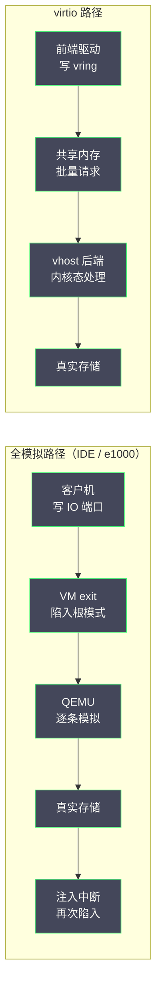
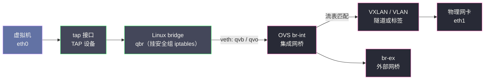
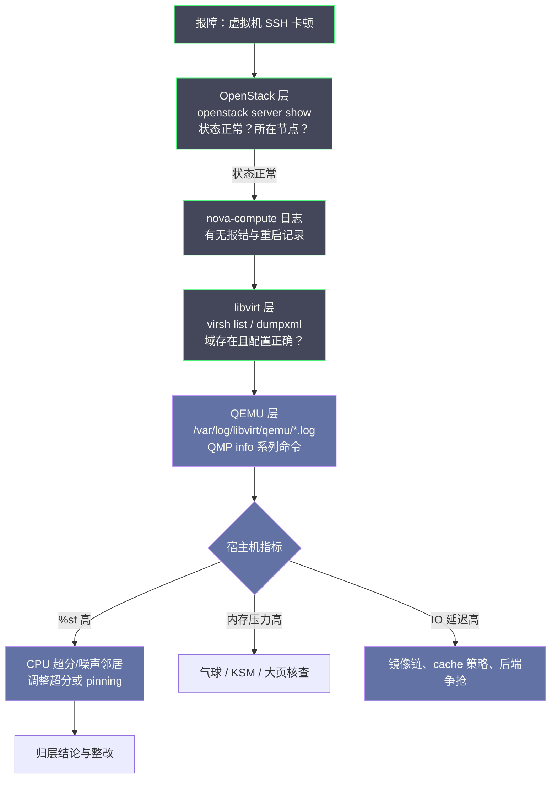

# 03 虚拟化地基——KVM、QEMU 与 libvirt

**摘要：**

[[云原生/OpenStack/02 控制面三件套——MariaDB、RabbitMQ 与 Keystone|上一篇]]拆完了控制面三件套，本篇往下再挖一层，进入计算节点的地基——虚拟化本身。Nova 在架构图上风光无限，但它自己从来不动手启动任何一台虚拟机：真正把 CPU、内存、磁盘与网卡「变」出来的，是内核里的 KVM 模块、用户态的 QEMU 进程，以及夹在中间传话的 libvirt。本文回答两个问题：其一，虚拟化为什么直到 2005 年前后才在 x86 上变得又快又稳，KVM、QEMU 与 libvirt 三者各自的分工是什么；其二，当一台虚拟机出现 CPU 卡顿、内存吃紧或磁盘缓慢时，你如何在 OpenStack 层、libvirt 层与 QEMU 层之间定位问题所在。行文先讲清三层边界对排障的意义，再沿「二进制翻译—半虚拟化—硬件辅助」的演进线拆解 KVM 与 QEMU 的原理，然后依次展开 CPU、内存、磁盘、网络四大资源的虚拟化机制，最后落到 libvirt 的日常操作与一条从 OpenStack 报障到根因的完整定位路径。

---

## 第 1 章 为什么运维开发要懂虚拟化底层

### 1.1 管家与工人：Nova 之下的三层世界

当你在工单里写下「虚拟机卡了」的时候，你说的究竟是哪一层的卡？是 Nova 的 API 响应慢，是 libvirt 报错，还是 QEMU 进程本身在挣扎？这个问题如果答不出来，后面的排查就全凭运气。要回答它，得先把计算节点上的三层世界看清楚：最上层是 Nova，负责「决定做什么」；中间一层是 libvirt，负责「翻译成虚拟化平台听得懂的话」；最底下是 KVM 与 QEMU，负责「把活真正干出来」。

打个比方，这一层结构像一家酒店。Nova 是前台与运营总部，它只管接单、排房、记账，从不进客房打扫；libvirt 是客房部的领班，运营总部说「302 房住进一位客人，要求大床、朝南、每天送水」，领班把这句要求翻译成保洁与客房服务听得懂的标准工单；QEMU 则是真正进房干活的服务团队，而 KVM 是这栋楼本身的承重结构与水电管网——客人（虚拟机里的操作系统）住得舒不舒服，最终取决于楼盖得好不好。前台再高效，客房服务跟不上，客人的体验照样糟糕；反过来，前台瘫痪了，已经入住的客人倒还能照常睡觉。这个比喻的后半句，正是上一篇「控制面冻结不等于数据面停摆」在计算节点上的翻版。

从代码路径上看，这条链路同样清晰。`nova-compute` 进程收到创建请求后，调用 libvirt 的 Python 绑定，把 flavor 的 vCPU 数、内存大小、镜像格式、网络端口翻译成一份 XML 域配置（domain XML），交给 libvirtd；libvirtd 据此拉起一个 QEMU 进程，QEMU 打开 `/dev/kvm`，让内核里的 KVM 模块接管 CPU 与内存的虚拟化，自己则退居幕后模拟磁盘、网卡与显卡。**Nova 是管理层的管家，KVM 与 QEMU 才是真正干活的工人**——理解了这个分工，你就理解了为什么很多 OpenStack 的疑难杂症，最后是在 libvirt 与 QEMU 的日志里找到答案的。

对运维开发这个角色来说，这三层不是知识装饰，而是三套日常工具箱。写自动化脚本时，你调用的是 OpenStack 层的 REST API，批量采集实例状态、触发迁移与重建；排性能问题时，你要下到 libvirt 层，核对 XML 与运行统计；查疑难杂症时，你得进 QEMU 层，看进程参数与监视器输出。三层里任何一层不熟，工具箱就缺一格——脚本写到 API 报错处就止步，性能问题查到宿主机就断线。本篇之后的每一章，都会反复用到这张三层地图。

### 1.2 三层边界：排障时的坐标系

分层最大的价值，不在于架构图好看，而在于排障时给你一张坐标地图。每一层有自己的状态存储、有自己的日志、有自己的故障模式，报障时先问「这一层是否正常」，逐层排除，比在几十万行日志里大海捞针高效得多。三层各自的边界可以收拢成一张表：

| 层 | 核心组件 | 状态与日志的位置 | 典型故障 | 第一排查动作 |
|---|---|---|---|---|
| OpenStack 层 | nova-api、nova-scheduler、nova-compute、MariaDB、RabbitMQ | Nova 数据库的 instances 表、`/var/log/nova/` | 创建卡在 scheduling、状态机停滞、配额报错 | `openstack server show` 看状态与所在节点 |
| libvirt 层 | libvirtd、domain XML、virsh | `/etc/libvirt/qemu/*.xml`、`/var/log/libvirt/qemu/*.log` | 域定义丢失、XML 校验失败、热插拔失败 | `virsh list --all`、`virsh dumpxml` |
| QEMU 层 | QEMU 进程、KVM 模块、QMP 监视器 | 进程参数、QMP socket、guest 内部 | CPU steal、设备模拟瓶颈、内存气球失效 | `ps` 看进程参数、QMP `info` 系列命令 |

这张表还隐含着一套分诊规则：虚拟机还在跑而管理操作失败，先查 OpenStack 层；虚拟机本身异常（起不来、频繁崩溃、性能骤降），才往下查 libvirt 与 QEMU 层。譬如一台实例反复重启，`openstack server show` 显示状态正常，Nova 数据库里风平浪静，那么问题大概率落在 libvirt 之下——去看 `/var/log/libvirt/qemu/` 下对应实例的日志，往往第一行就是答案。又譬如创建实例时卡在 `scheduling`，libvirt 层根本还没被触及，此时去查虚拟化反而南辕北辙。

三层之间还会出现一种更隐蔽的故障形态：状态不一致。Nova 数据库里的实例是 active，libvirt 里却找不到对应的域——这是删除流程半途夭折留下的孤儿记录；libvirt 里有域定义，QEMU 进程却早已僵死——这是数据面与控制面脱节的僵尸域。这类问题单看任何一层都「一切正常」，只有把三层的视图对到一起才能现出原形，这也是为什么有经验的运维者把「对账」当作例行功课，而不是等告警响了才动手。

> [!note] 笔者的经验
> 一线排障中，把问题「归层」往往比找到根因更早发生。笔者见过的多数虚拟化层故障——气球驱动失效导致的内存回收失败、镜像链过长导致的磁盘读放大、CPU 超分导致的 steal time 飙升——在 OpenStack 层的日志里几乎不留痕迹，只有下到 libvirt 与 QEMU 层才水落石出。反过来，控制面三件套出问题时，虚拟化层往往无辜。先归层，再深挖，这个顺序值得刻进肌肉记忆。

---

## 第 2 章 虚拟化技术演进——从二进制翻译到硬件辅助

### 2.1 1974 年的判据：Popek 与 Goldberg 的三个条件

虚拟化不是云计算时代的新发明。早在 1960 年代，IBM 就为了充分利用昂贵的大型机而发展出虚拟机技术，CP-40 与 CP-67 在 1967 年前后就能在一台 IBM System/360 上同时跑多个独立的操作系统实例，1972 年的 VM/370 更是把虚拟机作为正式产品交付。这段历史提醒我们：虚拟化的全部难题，本质上是「如何让一份硬件安全地、高效地冒充多份硬件」。

大型机时代的动机值得多说一句。彼时一台 System/360 的价格以百万美元计，让这样昂贵的机器同时服务多个用户是纯粹的经济问题；分时系统（Time-sharing）与虚拟机是同一场运动的两支——前者让多个用户共享 CPU 时间片，后者让多个操作系统共享整台机器。今天云平台把一台物理机切成几十台虚拟机出售，算的仍是六十年前那笔账：硬件越贵，共享的收益越大。

1974 年，Gerald Popek 与 Robert Goldberg 发表了《Formal Requirements for Virtualizable Third Generation Architectures》，给出了虚拟化可行的形式化判据：只要架构中所有的敏感指令（Sensitive Instructions）都是特权指令（Privileged Instructions），虚拟机监视器（Hypervisor，也称 VMM）就能通过「陷入—模拟」（Trap-and-Emulate）的方式接管一切——客户机执行敏感指令时陷入 VMM，由 VMM 模拟出该指令的效果。问题在于，x86 架构诞生时压根没考虑虚拟化，它有二十来条敏感指令在用户态执行时既不陷入也不报错，而是静默地产生错误结果，VMM 根本没有机会介入。1998 年前后系统化的分析确认了这一点，x86 因此长期被贴上「不可虚拟化」的标签。

### 2.2 VMware 与二进制翻译：绕过判据的第一条路

x86 不能虚拟化，产业的需求却等不了架构师重写指令集。1998 年成立的 VMware 给出了第一条工程出路：二进制翻译（Binary Translation，简称 BT）。思路说来直白——既然客户机的指令不能直接跑，那就在运行前把客户机的指令流扫描一遍，把那些危险的敏感指令替换成 VMM 提供的安全等价序列，其余指令原样执行。这好比给一位不会说本地语言的客人配一名同声传译：客人每说一句，译员翻一句，意思到了，但每一句都多了一道工序，开销自然存在。重 IO 场景下两位数的性能损失并不罕见，好在翻译结果可以缓存，热点路径的代价会随运行摊薄。

VMware 用这条路做出了 1999 年的 VMware Workstation 与后来的 ESX Server，让 x86 虚拟化从论文走进了企业机房。但翻译的复杂度极高，指令集每扩展一次，翻译器就要跟着长一截，这条路线的天花板肉眼可见。

### 2.3 Xen 与半虚拟化：请客人自己配合

第二条路来自剑桥大学。2003 年，Paul Barham 等人在 SOSP 上发表了《Xen and the Art of Virtualization》，思路与 VMware 截然相反：与其在 VMM 里费尽心思地「骗」客户机，不如直接修改客户机操作系统的内核，让它知道自己跑在虚拟机里，主动配合 VMM 完成特权操作。这就是半虚拟化（Paravirtualization）。好比不请同声传译了，而是提前给客人发一本本地语言手册，请他自己用本地语言点菜——效率高得多，但前提是客人愿意配合，也就是客户机内核必须可修改。Linux 可以，闭源的 Windows 就不行，只能退回全模拟或借助硬件辅助。

Xen 的这套设计在开源社区大获成功，2006 年上线的 AWS EC2 底层正是 Xen，此后近十年，公有云的虚拟机绝大多数跑在 Xen 之上。但 Xen 也有自己的麻烦：它自带一套微缩的特权域 dom0，宿主机的磁盘、网络都经 dom0 中转，内核版本与 Xen 版本强耦合，运维上始终隔着一层。

### 2.4 硬件辅助与 KVM：让 CPU 自己会说「虚拟化」这门语言

第三条路由芯片厂商给出。2005 年底，Intel 推出支持 VT-x（Virtual Machine Extensions）的处理器，AMD 紧随其后在 2006 年推出对应的 AMD-V。硬件辅助虚拟化（Hardware-assisted Virtualization）在 CPU 里新增了一个运行模式：客户机代码运行在非根模式（Non-root Mode），一旦执行敏感指令，CPU 硬件自动陷入根模式（Root Mode）里的 VMM，虚拟机控制结构（VMCS，AMD 侧为 VMCB）记录着陷入的上下文。Popek 与 Goldberg 的判据，被硬件直接满足了——不再需要翻译，也不再需要改客户机内核，Windows 也能原封不动地跑。

KVM 正是踩着这股东风登场的。2006 年 10 月，Avi Kivity 向 Linux 内核社区提交了一组补丁，思路大胆而简洁：不另起炉灶造一个 hypervisor，而是给 Linux 内核加一个模块，让 Linux 内核本身变成 hypervisor。2007 年 2 月，KVM 随内核 2.6.20 正式合入主线。在 KVM 的模型里，每一台虚拟机就是一个普通的 Linux 进程，每一个 vCPU 就是进程里的一个线程，客户机内存就是进程地址空间里的一块映射；QEMU 作为用户态程序负责设备模拟，KVM 模块负责 CPU 与内存的虚拟化，两者通过 `/dev/kvm` 这个字符设备上的一组 ioctl 协作：

```c
// /dev/kvm 的三个核心 ioctl，勾勒出 KVM 的全部工作模型
vm_fd = ioctl(dev_fd, KVM_CREATE_VM, 0);   // 创建一台虚拟机 = 创建一个进程级容器
vcpu_fd = ioctl(vm_fd, KVM_CREATE_VCPU, 0); // 每个 vCPU = 一个可调度的执行线程
ioctl(vcpu_fd, KVM_RUN, 0);                 // 进入非根模式执行客户机代码，
                                            // 遇到需要模拟的事件时返回用户态，由 QEMU 处理
```

2008 年 9 月，Red Hat 收购了 KVM 背后的公司 Qumranet，此后 KVM 成为 RHEL 的默认虚拟化栈，也顺理成章地成为 OpenStack 的默认 Hypervisor。三种路线的得失，可以摆进一张表：

| 路线 | 代表实现 | 原理 | 性能 | 主要代价 |
|---|---|---|---|---|
| 二进制翻译 | VMware（早期） | 运行时改写客户机指令流 | 中，翻译开销与缓存命中相关 | 翻译器复杂，跟随指令集演进的成本极高 |
| 半虚拟化 | Xen（PV 模式） | 修改客户机内核，主动配合 VMM | 好 | 客户机内核必须可修改，闭源系统受限 |
| 硬件辅助 | KVM、现代 Xen HVM、Hyper-V | CPU 新增运行模式，硬件陷入 | 好，接近原生 | 依赖较新的 CPU；VM exit 频繁时开销仍显著 |

硬件辅助也并非一劳永逸。每一次 VM exit 都要保存客户机上下文、切换到根模式、事毕再恢复回来，单次代价在微秒量级，看似不大，架不住频率高——一次磁盘 IO、一次网卡中断、一次页表操作都可能触发。这正是虚拟化性能优化的主战场在 IO 而不在计算的原因：纯计算负载在硬件辅助下已接近原生，IO 密集的负载则要把每一次陷入都记在账上。KVM 的另一个聪明之处在于复用：虚拟机是进程，vCPU 是线程，内存是映射，于是 Linux 内核几十年打磨出来的调度器、内存管理与 cgroups 全部直接为虚拟化所用——KVM 不是在 Linux 旁边另造一个世界，而是把 Linux 本身变成了那个世界。

### 2.5 QEMU 的角色：设备模拟的幕后功臣

谈 KVM 时人们常忘了 QEMU，但 QEMU 才是那个什么都干的角色。QEMU 由 Fabrice Bellard 于 2003 年发起，本意是一套纯用户态的全系统模拟器——不借助任何硬件虚拟化，靠动态二进制翻译（TCG）把客户机指令翻译成宿主机指令，慢，但什么平台都能模拟，甚至能在 x86 上模拟 ARM。硬件辅助虚拟化普及后，QEMU 与 KVM 形成了明确的分工：KVM 只负责 CPU 与内存这两块最难也最核心的虚拟化，其余一切——磁盘控制器、网卡、显卡、键盘鼠标、中断控制器——全部由 QEMU 在用户态模拟。你在虚拟机里看到的那块 IDE 硬盘、那颗 e1000 网卡，物理上并不存在，它们是 QEMU 用软件扮演的。

早期发行版为了方便管理，把 KVM 支持的 QEMU 分叉为 `qemu-kvm` 单独维护，两条线并行多年，直到 2012 年的 QEMU 1.3 才重新合流。今天你在计算节点上看到的 `qemu-system-x86_64` 或 `/usr/libexec/qemu-kvm`，本质上是同一个软件的不同打包。理解 QEMU 的双重身份——既是无 KVM 时的纯模拟器，又是 KVM 架构下的设备模型——对排障很有帮助：性能问题十有八九出在设备模拟路径上，而这条路径的钥匙叫 virtio，第 4 章会专门拆解。


---

## 第 3 章 CPU 与内存虚拟化——超分的艺术与代价

### 3.1 vCPU 与超分比：航空公司的超售生意

在 KVM 的模型里，vCPU 不是什么神秘物件，它就是一个 Linux 线程，与宿主机上其他进程一样接受内核调度器的安排。这个设计优雅至极——Linux 调度器几十年的成熟度直接为虚拟化所用——但也埋下了超分（Overcommit）的伏笔：既然 vCPU 只是线程，那么一台 32 核的宿主机上跑 200 个 vCPU，在技术上毫无障碍，只要不是所有虚拟机同时满负荷，物理核永远有活干，整体利用率就上去了。

这与航空公司超售机票是同一门生意：100 个座位卖出 120 张票，赌的是总有旅客误机；赌赢了，收益提升两成，赌输了，就得有人被请下飞机。CPU 超分的「被请下飞机」时刻，就是虚拟机之间互相争抢物理核的瞬间。OpenStack 的默认超分比是 16:1（`cpu_allocation_ratio`，即每个物理核记账 16 个 vCPU），这个默认值对多数通用负载是激进的，生产环境常见的稳妥区间在 1:1 到 4:1 之间，具体取决于负载类型——批处理可以高一些，数据库与延迟敏感业务则应当接近独占。

超分的代价有一个精确的观测指标：抢占时间（Steal Time，`top` 命令中的 `%st` 列）。它记录的是「虚拟机想运行、但 Hypervisor 把物理核分给了别人」的时间占比。steal 持续高于 5% 就值得警惕，高于 10% 则用户的每一次键盘敲击都能感知到迟滞。第 7 章会回到这个指标，这里先记住结论：**超分比是性能与利用率之间的汇率，没有免费的超售，只有尚未兑现的延迟**。

### 3.2 NUMA 亲和与 CPU pinning：把工位固定在离仓库最近的楼层

现代多路服务器不是一块均匀的内存池。典型的双路服务器有两个 CPU 插槽，每个插槽自带内存控制器与若干内存槽，CPU 访问自己插槽上的内存（本地节点）快，访问另一个插槽的内存（远端节点）要跨过互连总线，延迟可能高出四到五成。这就是非一致内存访问（NUMA，Non-Uniform Memory Access）。对普通应用，这点差距可以忽略；对数据库与 NFV 这类性能敏感负载，vCPU 与内存分处两个 NUMA 节点的虚拟机，性能可能莫名其妙地差掉一大截。

虚拟化层的对策是两组旋钮。其一是 CPU 亲和（Pinning）：用 `virsh vcpupin` 把特定 vCPU 钉在特定物理核上，用 `emulatorpin` 把 QEMU 进程自身的线程也钉住，避免调度器把 vCPU 挪来挪去破坏缓存局部性。极端形态是独占核（dedicated CPU policy），flavor 里声明 `hw:cpu_policy=dedicated`，Nova 会为实例划出物理核独占，配合内核的 `isolcpus` 把这些核从宿主机调度器里摘出去——代价是这些核不能再被其他实例共享，超分收益归零。其二就是 NUMA 亲和：让 vCPU 与它访问的内存落在同一个 NUMA 节点上，Nova 通过 flavor 的 `hw:numa_nodes` 与 libvirt XML 里的 `<numatune>` 落地。打个比方，pinning 是给员工固定工位，NUMA 亲和则是把工位安排在离他负责的仓库最近的楼层——两者合起来，才能消除「每天换工位、仓库在隔壁楼」的隐性损耗。

NUMA 相关的旋钮不止一个，收拢成一张表备查。其中 vNUMA（客户机可见的 NUMA 拓扑）值得单独一提：默认情况下客户机看不到宿主机的 NUMA 结构，把自己的内存当成一块均匀的池子；对 vCPU 多到跨插槽的大型实例，把拓扑暴露给客户机，让客户机自己的调度器也参与亲和，收益才完整。SMT 线程策略则是另一层细节——超线程的两个兄弟核共享执行单元，把两个 vCPU 放在兄弟核上省物理核但互相拖累，独占场景应当用 isolate 把兄弟核隔开。

| flavor 键 | 作用 | 典型取值 |
|---|---|---|
| `hw:cpu_policy` | vCPU 共享还是独占物理核 | shared / dedicated |
| `hw:cpu_thread_policy` | SMT 兄弟核的放置策略 | prefer / isolate / require |
| `hw:numa_nodes` | 客户机 NUMA 节点数 | 1 / 2 |
| `hw:numa_cpu.0` | 节点 0 承载的 vCPU | 0-1 |
| `hw:numa_mem.0` | 节点 0 承载的内存（MB） | 2048 |
| `hw:mem_page_size` | 内存页大小 | small / large / any |

### 3.3 内存的三本账：气球、大页与地址翻译

内存虚拟化比 CPU 更绕，因为多了一层地址翻译。客户机以为自己管理着真实的物理内存，实际上它手里的「物理内存」是 QEMU 进程地址空间里的一块区域，于是地址翻译要走两级：客户机虚拟地址到客户机物理地址（客户机页表负责），客户机物理地址到宿主机物理地址（宿主机页表负责）。在没有硬件辅助的年代，KVM 用影子页表（Shadow Page Table）把两级翻译合并成一张表直接喂给 MMU，代价是 VMM 要持续拦截客户机页表操作并同步维护影子副本，内存密集型负载的开销可达两位数百分比。2007 年前后，AMD 在 Barcelona 上率先落地嵌套页表（NPT，Intel 侧称扩展页表 EPT），由硬件的 MMU 直接完成两级查表，影子页表随之退场，但两级翻译毕竟比一级多走一层，TLB 未命中时的代价仍然更高——这就引出了大页。


大页（Huge Page）把页的大小从标准的 4 KB 提到 2 MB 甚至 1 GB，同样的内存容量下页表项数量骤减，TLB 的覆盖率大幅上升，EPT 时代内存虚拟化的最后一截损耗主要就靠它来填。代价是管理粒度变粗：大页必须整块分配、难以回收，宿主机要预留连续大页池，Nova 侧通过 flavor 的 `hw:mem_page_size=large` 声明。至于回收内存的软手段，则是内存气球（Memory Ballooning）：每个虚拟机里装一个气球驱动，宿主机缺内存时，QEMU 通知气球「充气」，气球驱动在客户机内核里申请内存页并交给 QEMU，客户机操作系统随即收缩自己的可用内存，腾出的页归还宿主机；宿主机宽裕时气球「放气」，内存还给客户机。整个过程不需要停机，但依赖客户机内装好驱动，且气球充气后客户机若真要用内存，需要客户机自己回收缓存，响应有延迟。与之互补的还有内核同页合并（KSM，Kernel Samepage Merging），宿主机定期扫描内存，把内容相同的页合并为只读共享页——多台虚拟机跑同一个镜像时收益可观，但扫描本身耗 CPU，且共享页为侧信道攻击留了口子，安全敏感环境通常关闭。三种手段的取舍如下：

| 机制 | 原理 | 收益 | 代价与风险 |
|---|---|---|---|
| 内存气球 | 客户机驱动动态归还/取回内存页 | 宿主机内存可超分，按需弹性 | 依赖 guest 驱动；回收有延迟；过度充气引发 guest swap |
| 大页 | 2 MB/1 GB 页减少 TLB 与 EPT 开销 | 内存密集负载性能提升明显 | 粒度粗、回收难，需预留大页池 |
| KSM | 合并内容相同的页为共享只读页 | 同镜像多实例场景节省可观内存 | 扫描耗 CPU；侧信道风险；写共享页触发缺页开销 |

大页还有一道容易踩的岔路：透明大页（THP，Transparent Huge Pages）与显式大页。THP 由内核自动把 4 KB 页合并成 2 MB 页，零配置，听起来很美；但合并与拆分的时机由内核自作主张，虚拟化场景下反而可能制造内存碎片与延迟毛刺，因此主流虚拟化最佳实践建议在宿主机上关闭 THP、改用显式预留的大页池。显式大页要改内核启动参数、预留大页池、再让 Nova 的调度器感知，工程量大了三倍，换来的是行为完全可预测——这笔账在关键业务上总是划算的。

> [!warning] 生产避坑：超分不是配置项，是承诺
> 内存超分比（默认 1.5:1）叠加大页与气球，账面上能多放三分之一的实例，但每一分超分都是对未来负载的赌注。气球机制的前提是客户机配合，Windows 老版本与未装 guest agent 的镜像会让气球形同虚设；一旦宿主机内存告急，KSM 与气球都来不及腾挪，宿主机开始 swap，所有虚拟机的延迟一起飙升——这是最难排查的一类「无差别性能劣化」。笔者的建议是：通用业务内存超分不超过 1.2:1，数据库等关键负载 1:1，并把宿主机 swap 使用率与 PSI 内存压力纳入告警。

---

## 第 4 章 磁盘虚拟化——virtio、qcow2 与镜像链

### 4.1 全模拟与半虚拟化：性能差异的根源

虚拟机里的一块硬盘是怎么来的？最朴素的办法是全模拟：QEMU 在软件里完整扮演一块真实的 IDE 或 SATA 控制器，客户机操作系统以为自己插着一块 2003 年的硬盘，用标准驱动就能识别。兼容性无可挑剔，代价却藏在每一次 IO 的路径里：客户机往端口写一个字，CPU 陷入根模式（VM exit），QEMU 接管、解析指令、模拟控制器行为、转发到真实存储，再把中断注回去。一次本该几百纳秒的 IO 请求，被拉长成一次跨模式的往返旅行，队列越深、IO 越密，模拟开销越显眼。

virtio 换了一个思路：既然客户机内核可以改造（半虚拟化的精神），那就别假装了——客户机明确知道自己跑在虚拟机上，前后端直接约定一套共享内存的消息协议。前端驱动（客户机内的 virtio_blk/virtio_net）把请求写进一块双方共享的环形缓冲区（vring），敲一下门；后端（QEMU 或内核里的 vhost）从缓冲区取走请求、执行、把结果放回去、再敲门通知。没有端口模拟，没有指令翻译，剩下的只是共享内存上的队列操作。打个比方：全模拟像每一封信都要经邮局柜台登记、拆检、再封发，virtio 则是双方约好一个共享信箱，投递与取件都是自助的。性能差距由此而来——在同样的存储后端上，virtio-blk 相比 IDE 模拟常有数倍差距，IOPS 越高差距越大。



这条路径上还有一次重要的优化叫 vhost：把 virtio 后端的报文与请求处理从 QEMU 用户态下沉到内核（vhost-net，或经 vhost-user 下沉到 OVS 等用户态数据面），省掉 QEMU 与内核之间的上下文切换。今天一台正常配置的 OpenStack 计算节点，磁盘走 virtio-blk 或 virtio-scsi、网络走 virtio-net 加 vhost-net，是默认姿势；镜像或 flavor 里没写 virtio，多半是历史遗留，值得专门排查。

### 4.2 qcow2 与 raw：镜像格式的取舍

磁盘的「内容」以镜像文件的形式躺在宿主机或存储后端上，格式主要有两种：raw 与 qcow2。raw 是最诚实的格式——文件内容就是磁盘的逐字节映像，没有元数据层，读写路径最短，性能最好；缺点是文件多大磁盘就多大（稀疏文件可缓解但不根治），且不支持快照、压缩等高级特性。qcow2（QEMU Copy-On-Write v2）则在 raw 之上加了一层元数据：按需分配簇、写时复制、支持内部与外部快照、支持 zlib 压缩与 AES 加密，还支持 backing file——这一条是 OpenStack 镜像流水线的命脉，下一节展开。代价是每次读写多一层元数据查找，随机写还可能触发簇分配与元数据更新，性能与 raw 拉开差距。

| 维度 | raw | qcow2 |
|---|---|---|
| 读写路径 | 直通，无元数据层 | 经元数据查找与簇管理 |
| 空间占用 | 文件即磁盘大小（可用稀疏文件缓解） | 按需增长，只占实际写入量 |
| 快照 | 不支持（依赖存储后端） | 内部/外部快照原生支持 |
| 镜像链 | 不支持 | backing file 支持 |
| 典型场景 | 高 IO 数据库、Ceph RBD 直挂 | 镜像仓库、模板分发、测试环境 |

格式之外，还有一层容易被忽略的旋钮：cache 策略。libvirt XML 里 `<driver>` 的 `cache` 属性决定宿主机页缓存是否介入读写路径，五种模式的取舍如下：

| cache 模式 | 语义 | 适用场景 |
|---|---|---|
| none | 绕过宿主机页缓存（O_DIRECT） | Ceph RBD 等共享后端的默认搭配 |
| writethrough | 写穿透落盘，读走页缓存 | 不支持集群语义时的稳妥默认 |
| writeback | 读写都走页缓存，异步落盘 | 本地盘、可接受掉电窗口的场景 |
| directsync | 读写都绕过页缓存 | 极少使用，调试对照 |
| unsafe | 完全异步，忽略刷盘 | 仅限测试环境 |

选型逻辑一句话可以说清：存储后端自己有缓存与副本机制时（Ceph 的客户端缓存、多副本），宿主机页缓存是多余的中间商，选 none；本地盘追求吞吐时，writeback 借页缓存攒批量，但掉电丢数据的窗口要自己认。排障时先看 XML 里 `<driver>` 的 cache 值与后端类型是否匹配，这是磁盘性能问题里性价比最高的一查。

### 4.3 镜像链：写时复制的家族树

qcow2 的 backing file 机制允许一个镜像声明自己的「父镜像」：父镜像只读，子镜像只记录与父镜像的差异块，读取时先查子镜像、未命中再回溯父镜像。于是「基于同一个 CentOS 模板创建一百台虚拟机」不再需要一百份完整拷贝——模板只存一份，每台虚拟机挂一个几 MB 起步的差分文件，创建速度与存储占用同时受益。这正是 Glance 镜像服务与 Nova 本地盘工作流的底层机制：镜像即只读底稿，实例磁盘即底稿之上的一层涂改。

落到 Nova 的实现上，一台实例的本地磁盘其实是一小族文件：`disk` 是根盘，backing file 指向计算节点上缓存的 Glance 镜像；`disk.local` 是 flavor 定义的临时盘；`disk.swap` 是交换分区；`disk.config` 则承载注入配置的 config drive。排障时用 `qemu-img` 家族命令核对这族文件的健康度：

```bash
# 查看镜像链：backing file 指向谁、链有多深
qemu-img info /var/lib/nova/instances/<uuid>/disk
# 压平镜像链：把差分层固化成独立镜像（迁移与瘦身前的标准动作）
qemu-img convert -O qcow2 disk disk.flat
# 合并相邻层：把子镜像的变化写回父镜像
qemu-img rebase -b new_base disk
```

不过家族树是会失控的。快照套快照，链条越拉越长，每次读取可能要回溯多层，删除中间节点更是牵一发动全身——子镜像永远依赖父镜像的存在，误删父镜像等于全家报废。运维上的纪律是：定期用 `qemu-img convert` 把长链压平成独立镜像，用 `qemu-img rebase` 合并相邻层，监控链深度并设上限。镜像链是借来的便利，利息在读取路径上，链越长利息越高。

### 4.4 virtio-blk 与 virtio-scsi：两代半虚拟化盘

virtio 家族里，磁盘设备有两个选项。virtio-blk 是老将，路径短、开销小，但设备编号空间有限（传统上 vda 到 vdz 一带，受 PCI 槽位约束），且不支持 SCSI 语义。virtio-scsi 是后起之秀，走 SCSI 命令集，单机可挂数百上千块盘，原生支持 TRIM/discard（回收 SSD 空间）与真正的 SCSI 设备直通，还便于配合 iothread 把 IO 处理线程独立出来，避免设备 IO 与主循环互相阻塞。

OpenStack 侧的切换只需在镜像属性或 flavor 里声明 `hw_disk_bus=scsi` 与 `hw_scsi_model=virtio-scsi`。笔者的建议是：新环境直接默认 virtio-scsi，老环境迁移时注意客户机内核版本与驱动兼容性即可；至于 IDE 与 SATA 全模拟，只该出现在兼容性兜底的清单里，不该出现在任何性能敏感的规格中。

---

## 第 5 章 网络虚拟化——为 Neutron 打底

### 5.1 TAP 与 veth：内核里的网线与插座

虚拟机的网卡要接到哪里去？答案藏在内核的两件小发明里。第一件是 TAP 设备：它是内核里的一块虚拟网卡，特殊之处在于有一个用户态可读写的字符设备接口——QEMU 打开它，把客户机发来的以太网帧从 TAP 读走、塞进真实网络，反向亦然。TAP 之于虚拟机，就像一个带传送带的服务窗口：帧从客户机出来，落在窗口（tap0），窗口另一侧的用户态进程（QEMU）负责搬运。第二件是 veth pair（虚拟以太网对）：一对成双成对的虚拟网线，从任何一端塞进去的帧都会从另一端完整地出来，常被用来连接两个网络命名空间——比如把 Neutron 的 DHCP 服务与租户网络接起来。

网络命名空间（Network Namespace）是这两件积木最常用的舞台。命名空间是内核的隔离单元，每套命名空间里有独立的网卡、路由表与 iptables 规则，彼此完全看不见；veth pair 则是命名空间之间的标准连接件，一头插在宿主机根命名空间，另一头插进租户命名空间。Neutron 的 DHCP 服务、虚拟路由器（qrouter）各自住在自己的命名空间里，靠 veth 与 TAP 串成一张图：

```bash
# 列出计算/网络节点上的命名空间：qdhcp 与 qrouter 各居其所
ip netns list
# 钻进某个 DHCP 命名空间看接口——veth 的一端在这里
ip netns exec qdhcp-<net-id> ip addr
```

这两个物件本身简单得近乎无聊，但它们是 Linux 网络虚拟化的乐高积木。你在计算节点上看到的 `tap` 开头的接口、成对的 `qbr` 与 `qvb/qvo`，全是这两类设备的组合。排障时记住一条物理直觉即可：**TAP 是插座，veth 是网线，帧只会沿着你插好的线路走，线路插错了，任何协议层的排查都是徒劳**。

### 5.2 Linux bridge 与 OVS：内核里的交换机

有了网卡，还需要交换机。Linux 内核自带一台二层交换机——Linux bridge，配置简单，`ip link` 加 `brctl`（或新式的 `ip link add type bridge`）就能把若干接口桥接成一个广播域。OpenStack 早期与多数中小环境至今仍在用它。但多租户场景很快会撞上它的天花板：流表能力弱、缺乏隧道原生支持、编程接口原始。于是 Open vSwitch（OVS）登场：它把转发逻辑拆成内核态的数据通路与用户态的 `ovs-vswitchd`，流表可编程、支持 VXLAN 与 OpenFlow、能被 Neutron 远程下发规则，成为 Neutron 的事实标准后端。

一个耐人寻味的细节是：Nova 的 OVS 混合模式下，虚拟机的 TAP 并不直接插在 OVS 上，而是先插在一台 Linux bridge（qbr）上，再经 veth pair 转接进 OVS 的集成网桥 br-int。多绕这一道，历史原因是安全组——早期的包过滤依赖 iptables/ebtables 的特定挂载点，而 OVS 的流表当时无法直接挂接这些规则，于是用 Linux bridge 做一层「转接头」。这个设计延续至今，成了每个计算节点上 `tap → qbr → veth → br-int` 这条固定链路的由来。理解了这条链路，后文 Neutron 架构篇里的拓扑图就不再是一堆缩写的堆砌，而是一张你亲手插过的线路图。

两台交换机各有各的检查工具。Linux bridge 用 `ip link show master qbr42` 看挂在桥上的接口，用 `brctl showmacs qbr42` 看转发表；OVS 用 `ovs-vsctl show` 看整体拓扑，用 `ovs-ofctl dump-flows br-int` 看流表，用 `ovs-appctl fdb/show br-int` 看介质访问控制（MAC，Media Access Control）地址学习结果。帧从 TAP 出来，先过 Linux bridge 的安全组规则，再进 OVS 的流表世界——排障时先确认帧在哪一段消失，才不会用错工具。



### 5.3 VLAN 与 VXLAN：多租户隔离的两代方案

多租户网络的核心诉求是隔离：A 租户的广播风暴不能淹到 B 租户。第一代方案是 VLAN（IEEE 802.1Q，1998 年标准化）：在以太网帧里插入 12 位的标签，把一张物理网逻辑切成至多 4094 个隔离域。Linux 内核对 VLAN 的支持是原生的——物理网卡上可以长出若干 `eth0.100` 这样的子接口，每个子接口就是一个广播域。VLAN 的问题在于规模与跨机房：4094 个标签对动辄数万租户的云平台捉襟见肘，且要求中间所有交换机都理解并透传标签，跨三层路由后标签即失效。

第二代方案是 VXLAN（Virtual eXtensible LAN，RFC 7348，2014 年 8 月定稿）：把二层以太网帧整个装进 UDP 报文里，用 24 位的 VNI（VXLAN Network Identifier）做隔离标识，理论上支持一千六百余万个隔离域；隧道端点（VTEP，VXLAN Tunnel Endpoint）之间走普通 IP 网络，中间设备无需理解 VXLAN，跨机房部署不再受限于交换机配置。代价是报文头多了约 50 字节，MTU 必须相应调大，漏调就是经典的「大包不通、小包正常」故障——物理网 MTU 1500 时，VXLAN 网内的有效载荷只剩 1450，客户机若按 1500 发包，大包就会被静默丢弃或分片，症状是 ping 小包正常、传文件卡死。

在内核里，VXLAN 是一个标准的内核模块：`ip link add vxlan100 type vxlan id 100 ...` 创建的隧道设备，其转发表（FDB）由 Neutron 的 OVS agent 或 Linux bridge agent 动态维护；`ip -d link show vxlan100` 能看到隧道参数，`bridge fdb show` 能看到端点学习结果。这些细节将在第 6、7 篇的 Neutron 章节全面展开，本篇只需建立直觉：**VLAN 是「物理网线上贴标签」，VXLAN 是「把整帧装进信封走邮政网络」——前者快而受限，后者灵活而多一层开销**。

| 维度 | VLAN | VXLAN |
|---|---|---|
| 标识空间 | 12 位，约 4094 个 | 24 位 VNI，约 1677 万个 |
| 封装开销 | 4 字节标签 | 约 50 字节（UDP 封装） |
| 中间设备要求 | 全程透传 802.1Q | 普通 IP 网络即可 |
| 跨三层/跨机房 | 受限 | 原生支持 |
| 内核实现 | vlan 子接口 | vxlan 模块 + FDB 转发表 |

---

## 第 6 章 libvirt 与运维实战——统一接口、XML 与监视器

### 6.1 libvirt 的定位：虚拟化世界的 POSIX

底层引擎讲完了，还缺一个把 KVM、QEMU、存储、网络捏在一起的管理层，这就是 libvirt。它是一套 C 语言库加一组守护进程（传统形态是 libvirtd，新版拆分为 virtqemud 等模块化守护进程），对外提供统一的 API，对内屏蔽各家 hypervisor 的差异——KVM/QEMU、Xen、LXC、乃至 VMware ESX，都能纳入同一套接口管理。Nova 的 libvirt driver 正是通过 libvirt 的 Python 绑定完成所有本地操作。打个比方，libvirt 之于虚拟化，就像 ODBC/JDBC 之于数据库：应用只面向一套接口编程，底下换引擎不必改代码。

对运维者来说，libvirt 的价值更直接——**无论你的云平台是 OpenStack 还是别的什么，只要底座是 KVM，`virsh` 这套工具就是你的万能钥匙**。云平台控制面瘫痪时，你依然可以登宿主机直接操作虚拟机；反过来，云平台正常时，libvirt 层的视图也是核对「声明与实际是否一致」的最后一道关卡。

### 6.2 virsh 常用命令集

virsh 是 libvirt 自带的命令行客户端，覆盖了日常运维的绝大多数场景。下面这张表按使用频率排列，建议对照自己的环境逐条跑一遍：

| 命令 | 用途 | 排障场景 |
|---|---|---|
| `virsh list --all` | 列出所有域（含未运行的） | 确认实例在宿主机上的存在性 |
| `virsh dominfo <域>` | 域的基本信息与状态 | 核对 UUID、状态、内存 |
| `virsh dumpxml <域>` | 导出当前生效的域 XML | 核对 Nova 生成的配置是否落地 |
| `virsh console <域>` | 连接串口控制台 | 网络不通时从控制台进系统 |
| `virsh domblklist <域>` | 列出块设备与镜像路径 | 定位磁盘文件与后端 |
| `virsh domiflist <域>` | 列出网卡与 TAP 设备 | 网络排障的起点 |
| `virsh vcpuinfo <域>` | vCPU 与物理核的映射 | 检查 pinning 是否生效 |
| `virsh attach-device / detach-device` | 热插设备（XML 描述） | 在线加盘、加网卡 |
| `virsh start / destroy <域>` | 启动 / 强制断电 | destroy 等同拔电源，慎用 |
| `virsh nodeinfo` / `virsh capabilities` | 宿主机资源与能力视图 | 容量核对、特性确认 |
| `virsh domstats <域>` | 批量采集域的运行统计 | CPU、内存、IO、网络计数 |
| `virsh qemu-monitor-command` | 直通 QEMU 监视器 | libvirt 未覆盖的底层操作 |

两点使用须知。其一，`dumpxml` 导出的是「当前生效」的定义，而 `/etc/libvirt/qemu/` 下落盘的 XML 是持久化定义，两者在域运行期间可能不同——热更过的配置要以后者为准核对；其二，`destroy` 这个名字有迷惑性，它不是「销毁」而是「强制断电」，客户机没有机会刷盘，对运行中的数据库实例等同于一次掉电，务必确认实例状态后再用。

> [!warning] 生产避坑：不要直接编辑 Nova 管理的域
> `virsh edit` 改出来的 XML 只活在 libvirt 里。Nova 数据库才是实例定义的权威来源，下次硬重启（hard reboot）时，nova-compute 会按数据库里的记录重新生成 XML 并覆盖你的手改——排障时临时改一改可以，把手工修改当成永久配置则是埋雷。正确的姿势是改 flavor 元数据、镜像属性或 Nova 配置，让声明式的定义一路传导下来。

热插是 virsh 的另一项常用能力，设备用一小段 XML 描述，在线生效：

```bash
# 热插一块盘：先写设备描述 XML，再挂到域上
cat > /tmp/newdisk.xml <<'EOF'
<disk type='file' device='disk'>
  <driver name='qemu' type='qcow2' cache='none'/>
  <source file='/var/lib/nova/instances/<uuid>/disk.local.new'/>
  <target dev='vdb' bus='virtio'/>
</disk>
EOF
virsh attach-device instance-00000042 /tmp/newdisk.xml --live
```

### 6.3 读懂 Nova 生成的 domain XML

`virsh dumpxml` 的输出是三层世界里最诚实的一份文件——flavor、镜像属性、Nova 配置的全部约定，最终都物化在这里。下面是一份精简后的典型实例 XML，注释标出每一段的来历：

```xml
<domain type='kvm'>                     <!-- type=kvm：KVM 加速；qemu 则是纯模拟 -->
  <name>instance-00000042</name>        <!-- Nova 的实例名 -->
  <uuid>0f4d...c1</uuid>                <!-- 与 Nova 数据库中一致 -->
  <memory unit='KiB'>4194304</memory>   <!-- flavor 的 ram_mb -->
  <currentMemory unit='KiB'>4194304</currentMemory>
  <vcpu placement='static'>2</vcpu>     <!-- flavor 的 vcpus -->
  <cputune>                             <!-- 来自 hw:cpu_policy=dedicated 等 -->
    <vcpupin vcpu='0' cpuset='8'/>
    <vcpupin vcpu='1' cpuset='9'/>
  </cputune>
  <numatune>                            <!-- 来自 hw:numa_nodes 等调度约束 -->
    <memory mode='strict' nodeset='0'/>
  </numatune>
  <os>
    <type arch='x86_64' machine='pc-i440x-rhel7'>hvm</type>
    <boot dev='hd'/>                    <!-- 启动顺序 -->
  </os>
  <features><acpi/><apic/></features>   <!-- 客户机可见的固件特性 -->
  <cpu mode='host-passthrough'/>        <!-- 直接透传宿主机 CPU 型号 -->
  <devices>
    <emulator>/usr/libexec/qemu-kvm</emulator>
    <disk type='file' device='disk'>
      <driver name='qemu' type='qcow2' cache='none'/>  <!-- 格式与缓存策略 -->
      <source file='/var/lib/nova/instances/<uuid>/disk'/>
      <target dev='vda' bus='virtio'/>  <!-- virtio 总线，性能关键 -->
    </disk>
    <interface type='bridge'>
      <mac address='fa:16:3e:...'/>
      <source bridge='qbr42'/>          <!-- 先过 Linux bridge（安全组） -->
      <target dev='tap42'/>
      <model type='virtio'/>
    </interface>
    <graphics type='vnc' port='-1'/>
    <console type='pty'/>               <!-- virsh console 的落点 -->
    <channel type='unix'>               <!-- QEMU Guest Agent 通道 -->
      <target type='virtio' name='org.qemu.guest_agent.0'/>
    </channel>
  </devices>
</domain>
```

逐段看，`<domain type='kvm'>` 回答「用不用硬件加速」，排障时若发现实例以 `qemu` 类型运行，性能问题先于一切；`<cputune>` 与 `<numatune>` 是第 3 章那些旋钮的落点，声明了却没生效，来这一层核对；`<cpu mode='host-passthrough'>` 解释了为什么跨不同代 CPU 的迁移可能翻车——客户机看到的 CPU 就是宿主机本尊；`<disk>` 的 `cache='none'` 对应宿主机绕过页缓存的直写策略，与 Ceph 等共享后端是标准搭配；`<interface>` 的 `source bridge` 指向 qbr 而非 OVS 网桥，正是第 5 章说的安全组转接头。读懂这份 XML，flavor 与镜像属性就不再是黑盒。

XML 里还有一段上文未展开的 `<metadata>`：Nova 会把实例的 project、用户、flavor 名等溯源信息塞在这里，`virsh dumpxml` 看到一个「来路不明」的域时，先看 metadata 就能把它对回 OpenStack 的账本——这也是清理孤儿资源时最可靠的指纹。

### 6.4 QEMU 监视器：在线排障的后门

libvirt 的 API 再全，也有覆盖不到的角落——虚拟机卡死想看内部状态、块设备想看实时统计、设备想热插但不走 Nova。这时要用到 QEMU 监视器（QEMU Monitor）。它有两种方言：面向人的 HMP（Human Monitor Protocol）与面向程序的 QMP（QEMU Machine Protocol，JSON 格式）。libvirt 为每个域拉起一条 Unix 套接字，`virsh qemu-monitor-command` 可以直通：

```bash
# 查看域的运行状态（HMP 方言）
virsh qemu-monitor-command instance-00000042 --hmp "info status"
# 查看块设备统计：读写字节数、未完成请求一目了然
virsh qemu-monitor-command instance-00000042 --hmp "info block"
# QMP 方言示例：JSON 进、JSON 出，可脚本化
virsh qemu-monitor-command instance-00000042 \
  '{"execute":"query-status"}'
```

QMP 的价值在于可编程：`query-blockstats` 给出每块盘的累计读写与刷新计数，`query-kvm` 确认硬件加速是否生效，`device_del` 配合 `device_add` 完成不走 Nova 的设备热插。把 QMP 的 JSON 输出接进脚本，你就有了一套不依赖 OpenStack 控制面的实例级采集通道——控制面失联时的最后一双眼睛。

监视器之外还有一位常被忽视的角色：QEMU Guest Agent（客户机代理）。它通过 XML 里那个 `<channel>` 落地的 virtio 串口与宿主机通信，让 Nova 能执行冻结文件系统做快照、取 IP 地址、安全关机等需要客户机配合的操作。监视器是宿主机看虚拟机的「X 光机」，Guest Agent 则是虚拟机主动伸出的「听诊器」——两者配合，才构成完整的在线排障能力。

---

## 第 7 章 性能基线与排障——从报障单到根因

### 7.1 宿主机资源视图：先看清你站在多大的地上

排性能问题的第一步不是改配置，而是建立宿主机的资源基线。`lscpu` 与 `numactl --hardware` 给出 CPU 拓扑与 NUMA 分布；`virsh nodeinfo` 与 `virsh capabilities` 从 libvirt 视角核对同一份信息；`free` 与 `/proc/meminfo` 里的 `HugePages_Total` 揭示大页池的预留情况；`top` 里的 `%st` 列与 `/proc/pressure/` 下的 PSI（Pressure Stall Information）指标则量化 CPU 与内存的失速程度。存储侧，`fio` 跑出的基线是判断「磁盘慢」的标尺——没有基线，一切「IO 慢」的指控都缺乏证据。这些命令的产出建议在环境健康时采集归档，故障时才有对照物。

| 命令 | 回答的问题 |
|---|---|
| `lscpu` / `numactl --hardware` | CPU 拓扑与 NUMA 节点分布 |
| `virsh nodeinfo` / `virsh capabilities` | libvirt 视角的宿主机能力 |
| `top`（`%st` 列） | CPU 抢占时间占比 |
| `/proc/pressure/{cpu,memory,io}` | 三类资源的失速时间占比（PSI） |
| `free` / `/proc/meminfo` | 内存余量与大页池预留 |
| `vmstat 1`（si/so 列） | swap 进出频率 |
| `iostat -x 1`（await 列） | 块设备延迟 |
| `fio` | 存储基线：IOPS 与延迟上限 |
| `ovs-vsctl show` | 节点网络拓扑与接口状态 |

基线的采集方法也有讲究：错峰采样（业务高峰与低谷各采一轮）、固定负载画像（同一台实例、同一种 fio 参数）、留存对照（健康期的数据就是故障期的标尺）。没有方法论的基线只是一堆数字，有了方法论，它才是证据。

```bash
# 建立存储基线：4K 随机混合读写是虚拟机盘的典型画像
fio --name=baseline --filename=/tmp/fio.test --size=1G \
    --rw=randrw --bs=4k --iodepth=32 --runtime=60 --time_based
```

### 7.2 三类高频性能问题：CPU steal、内存 swap 与磁盘争抢

虚拟化层的性能问题，八成落在三类。第一类是 CPU steal：`%st` 持续偏高，说明物理核被邻居抢走，根因通常是超分比过高或噪声邻居，处置要么降超分、要么对关键实例上 dedicated policy。第二类是内存失速：宿主机内存吃紧时，KSM 与气球来不及腾挪，宿主机开始 swap，所有虚拟机无差别变慢；观测点是宿主机 `si/so`（swap 进出）与 PSI memory 指标，预防靠超分纪律与气球驱动全覆盖。第三类是磁盘 IO 争抢：症状是单台虚拟机 IO 延迟飙升而宿主机整体尚可，常见根因包括 qcow2 镜像链过长导致的读放大、cache 策略与后端不匹配、以及共享存储上的邻居争抢；定位工具是 `virsh domblkstat`、QEMU 的 `info block` 与 `iostat -x` 的 await 列。三类的症状、定位与处置收拢如下：

| 症状 | 所在层 | 关键证据 | 处置方向 |
|---|---|---|---|
| CPU steal 高 | 宿主机资源层 | `top` 的 `%st`、PSI CPU 指标 | 降超分比、迁移噪声邻居、关键实例 dedicated |
| 宿主机 swap 抖动 | 宿主机内存 | `vmstat` 的 si/so、PSI memory | 降内存超分、修气球驱动、关 KSM |
| 磁盘 IO 延迟高 | QEMU/存储层 | `info block` 队列深度、fio 基线 | 压平镜像链、核查 cache 策略、blkio 限流 |
| 网络大包不通 | Neutron/VXLAN | MTU 不一致 | 调大物理网与隧道 MTU（详见第 6、7 篇） |

三类问题的共同点是「症状在虚拟机里，根因在宿主机上」，所以排查顺序永远是先宿主机、后实例。方法论上有一条值得强调：建立对照。在同一宿主机上找一台负载画像相近的健康实例做参照，或者翻出健康期采集的基线数据做比对——没有对照物的性能数据只是数字，有了对照物才是证据。譬如 steal 从基线的 0.5% 涨到 15%，你不需要懂调度器实现也能断定环境变了；而一台从上线起 steal 就在 15% 的实例，问题可能根本不在超分，而在它被调度到了一台本就不该混布的机器上。

### 7.3 从 OpenStack 报障到 libvirt 层定位：一条完整路径

最后把全篇串成一条排障路径。假设某个业务组报障：「几台虚拟机 SSH 卡顿，偶发超时」。按层推进的路径如下：



沿着图走一遍 CPU 侧的案例：业务报「SSH 偶发卡顿数秒」。第一步 `openstack server show` 确认实例状态 active、无迁移记录，排除控制面；登宿主机 `top` 看到 `%st` 长期在 20% 以上，而实例自身 CPU 使用率并不高——问题定位在超分争抢，属宿主机资源层而非虚拟机内部；核对调度策略，发现同宿主机上混布了批处理集群，将其迁移并对数据库实例改用 dedicated CPU 后，steal 归零，卡顿消失。

再看一个磁盘侧的案例：某业务组报「挂载的云盘写入延迟从 2 ms 涨到 40 ms」。`openstack server show` 显示实例与卷状态正常，控制面无辜；`virsh domblkstat` 证实写延迟确实高，但 `iostat -x` 显示宿主机本地盘一片安详——争抢不在本地；顺着 Cinder 的卷后端查到 Ceph 集群，正赶上一批 OSD 故障后的数据重平衡（Rebalance），写放大拖慢了整个池子。这个案例的教训写在三层地图的边界之外：虚拟化层的证据链走到头，指向的是存储后端的邻居——三层地图之外还有邻居，排障的地图要画到别人的地界上。

两条路径合起来看，方法始终如一：先确认「哪一层」，再问「那一层的哪个部件」，每一步都拿该层的证据说话。

> [!info] 三层分诊口诀
> 管理操作失败，先查 OpenStack 层（API、数据库、消息队列）；实例异常或性能劣化，下到 libvirt 层核对 XML 与域状态；再往下才是 QEMU 层的进程参数、监视器统计与客户机内部。**每一层都有权宣布自己无辜，只要你拿得出该层的证据**——`openstack server show`、`virsh dumpxml`、`info block`，各管一段。

---

## 参考资料

1. Gerald J. Popek, Robert P. Goldberg, *Formal Requirements for Virtualizable Third Generation Architectures*, Communications of the ACM, 1974-07：虚拟化可行性的形式化判据（敏感指令与特权指令的关系）。
2. Paul Barham 等, *Xen and the Art of Virtualization*, SOSP 2003-10：半虚拟化路线的奠基论文。
3. Edouard Bugnion 等, *Disco: Running Commodity Operating Systems on Scalable Multiprocessors*, SOSP 1997-10：VMware 创始团队的前身工作。
4. Avi Kivity 等, *kvm: the Linux Virtual Machine Monitor*, Ottawa Linux Symposium 2007：KVM 的原始设计论文。
5. Rusty Russell, *virtio: towards a de-facto standard for virtual I/O devices*, Ottawa Linux Symposium 2008：virtio 半虚拟化 I/O 框架的设计说明。
6. Intel, *Intel 64 and IA-32 Architectures Software Developer's Manual, Volume 3C*：VMX（VT-x）与 EPT 的权威规范。
7. QEMU 官方文档, *qcow2 cluster mapping* 与 *Images* 章节：https://www.qemu.org/docs/master/（qcow2 格式与 backing file 机制）
8. libvirt 官方文档, *Domain XML format*：https://libvirt.org/formatdomain.html（domain XML 各元素的权威定义）
9. IETF RFC 7348, *Virtual eXtensible Local Area Network (VXLAN)*, 2014-08：VXLAN 的协议规范。
10. OpenStack Nova 官方文档, *Hypervisors* 与 flavor 元数据参考：https://docs.openstack.org/nova/latest/admin/configuration/hypervisors.html
11. 相关篇章：[[云原生/OpenStack/01 OpenStack 全景——从 NASA 与 Rackspace 的联姻到开源云操作系统|01 OpenStack 全景]] · [[云原生/OpenStack/02 控制面三件套——MariaDB、RabbitMQ 与 Keystone|02 控制面三件套]] · [[云原生/Docker/01 容器的本质——从进程隔离到 OCI 标准|容器的本质]] · [[中间件/Ceph/07 RBD 块存储——快照、克隆与 Kubernetes CSI|RBD 块存储]]

---

> [!note] 思考题
> 1. 你的环境里，一台 64 核宿主机通常承载多少 vCPU？对照 OpenStack 默认的 16:1 超分比，用 `%st` 指标验证这个比例在你的负载下是否合理——如果 steal 长期低于 1%，说明你在为「保险」付多少闲置成本？如果长期高于 10%，哪些实例应当率先迁走或改用 dedicated CPU？
> 2. 假设一台数据库虚拟机的磁盘从本地 qcow2 迁到 Ceph RBD 后，随机写性能不升反降。请从「镜像格式元数据层、cache 策略、网络路径」三个角度各提出一个可能的根因，并说明分别用什么命令或指标验证。
> 3. 一台虚拟机 SSH 偶发卡顿数秒，宿主机 `top` 显示 `%st` 为 2%，内存充足，磁盘 IO 平稳。请设计一条从 OpenStack 层到 QEMU 层的完整排查路径，指出每一层「排除嫌疑」的具体证据，并说明在哪一层你会停止深挖、转向应用层。
