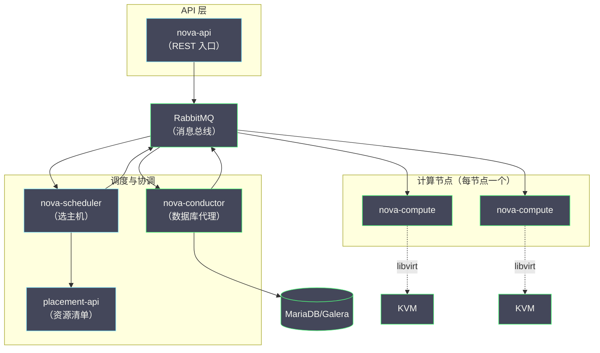
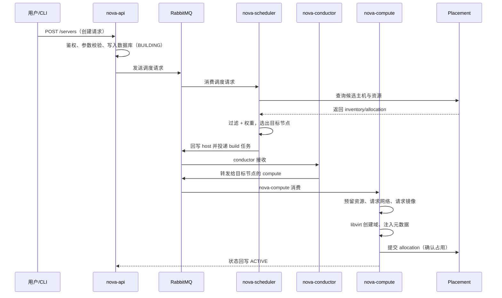

# 04 Nova 架构与调度——API、Scheduler 与资源模型

**摘要：**

Nova 是 OpenStack 的第一个服务，也是理解整个 OpenStack 架构的最佳切入点——它把"创建一台虚拟机"这件看似简单的事，拆解成 API 接收、调度决策、资源记账、底层执行四个环节，由多个松耦合组件协作完成。本文从 Nova 的历史地位讲起，逐一拆解 nova-api、nova-scheduler、nova-conductor、nova-compute 的职责与设计动机，深入 filter scheduler 的过滤与权重两阶段算法，梳理 Placement 服务从 Nova 内部资源表演化为独立服务的历史与模型，最后落到运维视角：资源超分的权衡、实例规格 flavor 体系、创建实例失败的排查路径与 cell 架构。读完你应当能回答两个问题：一台虚拟机从 API 请求到 libvirt 启动经历了什么，以及调度器为什么把实例放在这台而不是那台计算节点上。

---

## 第 1 章 Nova 的历史地位——从大而全到专注计算

### 1.1 第一个服务，也是最重的服务

要理解 Nova 在 OpenStack 中的地位，不妨回到 2010 年那个起点：NASA 的 Nebula 计算平台与 Rackspace 的存储平台合并为 OpenStack 时，计算部分就是 Nova 的前身。可以说，**OpenStack 的前几个版本，几乎就是 Nova 的代名词**——早期的 Nova 不仅管计算，还管网络（nova-network）和存储（nova-volume），是一个不折不扣的"大杂烩"。

但历史证明，"什么都管"的服务注定走不远。nova-volume 拆出去成了 Cinder（Folsom 版本，2012 年），网络部分拆出去成了 Neutron（当时还叫 Quantum），镜像管理拆出去成了 Glance。到今天，Nova 的职责边界已经收缩得非常清晰：**管理虚拟机的生命周期**——创建、调度、迁移、快照、销毁，仅此而已。

这个收缩的过程本身就是一个值得玩味的架构故事。你不妨把 Nova 想象成一家早期什么都做的公司：既造发动机（计算）、又铺马路（网络）、还建仓库（存储）。业务规模小的时候，什么都做反而高效——用户只需要对接一个 API；但规模一大，每条业务线的迭代节奏、故障域、专业深度都开始互相拖累，拆分就成了必然。OpenStack 用了三个版本周期完成的这场拆分，与微服务架构从单体演进出来的路径，几乎是同一条曲线的重放。

### 1.2 不这样会怎样——如果 Nova 继续大包大揽

不妨做个反事实推演。假如网络逻辑仍然留在 Nova 里（就像早期的 nova-network 那样），会发生什么？网络配置的变更需要修改 Nova 代码、走 Nova 的发布节奏，而网络的迭代速度远快于计算——DVR、VXLAN、负载均衡，每一项演进都会被 Nova 的发布节奏拖住后腿。事实上，Neutron 从 Nova 中独立出来，正是为了打破这个僵局。

同样的逻辑也解释了 Placement 的诞生：资源记账这件事，Cinder 要用、Ironic 要用、Cyborg 也要用，锁在 Nova 的数据库里就成了公共依赖的地狱。架构的演进史，就是职责边界不断被重新划分的历史——这个判断放在 OpenStack 成立，放在微服务拆分同样成立。

### 1.3 Nova 演进的几个里程碑

Nova 十余年的演进史里有几个值得记住的节点，它们各自代表一类架构问题的答案：

| 版本（年份） | 里程碑 | 回答的问题 |
| :--- | :--- | :--- |
| Diablo（2011） | nova-volume 独立计划启动 | 存储的迭代节奏为什么要独立 |
| Folsom（2012） | Cinder 诞生，Quantum 更名在即 | 网络与存储为什么要拆出 |
| Grizzly（2013） | nova-conductor 引入 | 数据库凭证为什么要收敛 |
| Newton（2016） | Placement API 雏形 | 资源记账为什么要共享 |
| Stein（2019） | Placement 正式独立 | 服务拆分的边界在哪里 |
| Victoria（2020） | cell v2 全面成熟 | 控制面如何水平扩展 |

把这张表竖着看是 Nova 的历史，横着看是所有分布式系统的成长模板：先功能堆积，再职责拆分，然后安全收敛、资源抽象、最后水平扩展。你以后在任何系统里看到类似的阶段，都不会陌生。

### 1.4 Nova 管什么、不管什么

今天的 Nova 职责清单可以这样概括：

| 职责 | 归属 | 说明 |
| :--- | :--- | :--- |
| 虚拟机生命周期管理 | Nova | 创建、删除、启停、迁移、快照、重建 |
| 计算资源调度 | Nova（Scheduler + Placement） | 决定实例落在哪台宿主机 |
| 宿主机资源管理 | Nova（与 libvirt 协作） | CPU/内存/本地盘的分配与隔离 |
| 网络 | Neutron | Nova 只在创建时调用 Neutron API 建端口 |
| 块存储 | Cinder | Nova 只负责把卷挂载到实例 |
| 镜像 | Glance | Nova 只负责下载镜像到本地 |
| 认证 | Keystone | Nova 只校验 token |

这张表的每一行"归属"背后，都是一次架构拆分。理解了"Nova 只管计算"，后面遇到网络问题去查 Neutron、存储问题去查 Cinder，思路才不会乱。

### 1.5 nova-network 时代——理解历史才能理解现状

今天的读者很难想象，早期的 Nova 连网络都是自己管的。nova-network 的模型非常朴素：每个计算节点上跑一个网络进程，用 Linux bridge 和 iptables 实现扁平网络或 multi-host 网络。它的优点是简单可靠——没有额外的网络组件，故障点少；缺点是能力贫瘠——没有租户网络重叠、没有 SDN 的一切。

Quantum（后来的 Neutron）在 Grizzly 版本前后逐步取代 nova-network，这个过程持续了好几个版本，很多老牌公有云的运维对 nova-network 的怀念持续至今——因为它的确简单到几乎不会坏。这段历史留下的启示是：**抽象层的引入一定伴随复杂性的上升，收益与代价要放在同一杆秤上称**。今天你抱怨 Neutron 复杂的时候，不妨想想它换来了什么：多租户重叠网络、可插拔的 SDN 后端、以及一个可以独立演进的网络服务。

---

## 第 2 章 Nova 组件拆解——各司其职的流水线

### 2.1 架构总览

Nova 的组件并不算多，但每个的存在都有明确的理由：



### 2.2 nova-api：唯一的入口

nova-api 是 Nova 对外的 REST 门面，接收并校验所有 API 请求。值得注意的是它其实承载了两组 API：一组是标准的 OpenStack 计算 API（`/v2.1`），另一组是元数据 API（metadata service，供实例内部通过 169.254.169.254 获取自己的元数据与注入的 SSH 密钥）。

元数据服务在多节点部署中常被忽略——实例拿不到 metadata 往往表现为 cloud-init 卡死、SSH 密钥没注入，但根因可能在网络路径上（路由没通到 metadata 服务），这是后话。这里先记住一个原则：**API 层的问题看 nova-api 日志，实例内部的问题看 metadata 路径**，两者别混为一谈。

nova-api 还有一个容易被忽略的机制：API 微版本（microversion）。OpenStack 各服务的 API 都支持微版本号，客户端在请求头里声明 `X-OpenStack-Nova-API-Version`，服务端据此决定暴露哪些能力。这个设计的价值在于**升级不破坏兼容**——服务端可以随版本增加新字段、新行为，而老客户端声明老版本号后行为完全不变。运维在写自动化脚本时应该显式固定微版本号，否则服务端升级后脚本行为可能悄悄改变。

微版本还有个运维侧的妙用：**用微版本号做能力探测**。脚本可以先请求一个高微版本，捕获 400 错误后降级重试——比按版本号硬编码判断更可靠，因为它探测的是"这个集群的真实能力"而不是"这个集群声称的版本"。

### 2.3 nova-conductor：一个"多余"组件的必要性

初学者常常困惑：为什么在 API 和 Compute 之间要插一个 conductor？直接让 compute 访问数据库不行吗？

答案是安全问题，而这个设计的动机值得细品。nova-compute 运行在成百上千台计算节点上，这些节点上的进程一旦被攻破，攻击者能拿到什么？如果 nova-compute 直连数据库，答案就是**整个云平台的数据库凭据**——这是不可接受的攻击面。nova-conductor 作为数据库访问的代理层，让计算节点上的进程完全不持有数据库凭证，所有数据库操作都通过消息队列转发给控制面的 conductor 完成。

你不妨把这个设计放到更大的图景里看：**把最敏感的凭证收敛到最小的信任域**，这与 Ceph 把 MON 挪出数据路径、Kubernetes 把 etcd 锁在控制面是同一条原则。安全设计的本质不是加更多的锁，而是让钥匙出现在更少的地方。

从部署形态看，conductor 是无状态的水平扩展服务——控制节点上跑几个实例都行，MQ 会自动分摊任务。这也意味着它的故障排查相对简单：日志在控制节点、状态在数据库、没有本地持久化，"重启大法"在这里真的有效（虽然我们不建议把它当第一手段）。

conductor 还有第二个职责：**代执行有状态的任务**。某些数据库操作（譬如实例的删除清理、迁移的协调）需要跨多个步骤保持一致性，放在 compute 上执行一旦中途失败就难以恢复，放在 conductor 上则可以统一重试与补偿。

顺带一提 conductor 的历史：它在 cell v1 架构中首次出现，当时的职责是"跨 cell 的数据库代理"；cell v2 普及后，它的角色演变为"所有 compute 的数据库代理"。一个组件的职责随架构演进而变化，但"收敛敏感访问"的内核从未改变——读源码时看到这种"旧瓶新酒"不要困惑，架构组件的生命周期本来就比某个具体功能长。

### 2.4 nova-compute：每节点一个的执行者

nova-compute 运行在每一台计算节点上，是 Nova 体系里唯一"亲手干活"的组件。它的工作是把上层的抽象（flavor、image、network port）翻译成底层的具体操作：调用 libvirt 创建域、下载镜像、配置网络、注入元数据。

nova-compute 与 Hypervisor 的对接通过 virt driver 抽象层完成，默认是 libvirt driver（覆盖 KVM/QEMU），此外还有对 Xen、VMware、Ironic（裸机）的驱动。这个抽象层的存在，让"Nova 管理什么类型的实例"成为一个可插拔的问题——这也是后面 Ironic 能用 Nova 的 API 管裸机的原因。

还有一个容易被遗忘的角色：**VNC/SPICE 代理**（nova-novncproxy 等）。实例的控制台访问不是直连计算节点的——代理把用户的 WebSocket 连接转发到 compute 节点上的 VNC 端口。排障时"控制台打不开"的问题，要沿着 用户→proxy→compute VNC 端口 这条链路查，token 失效、proxy 不可达、防火墙拦端口是三大常见根因。控制台是用户排障的第一窗口，它挂了会让所有"实例内部的问题"都失去第一现场，优先级不低。

### 2.5 nova-compute 的 build 流程：五步拆解

调度器选定主机后，nova-compute 接手 build 任务。这个流程由 conductor 协调、compute 执行，内部又分五步，每步都有独立的失败模式：

**第一步：资源预留**。compute 在本地为实例预留资源，防止同一节点上的并发 build 相互超卖。预留失败通常意味着 Placement 账本与本地状态不同步——又是那个对账问题。

**第二步：获取网络资源**。compute 调用 Neutron API 为实例绑定端口（port）。这一步是跨服务协作的第一站，Neutron 超时或端口创建失败会让 build 卡在 networking 阶段。运维排障时要注意：Nova 的日志只会告诉你"端口请求失败"，真正的根因在 Neutron 的日志里。

**第三步：获取镜像**。从 Glance 下载镜像到本地（通常落到 `/var/lib/nova/instances/<uuid>`），大镜像首次下载可能耗时数分钟。如果后端是 Ceph，这一步会退化为 RBD 的 copy-on-write 克隆，秒级完成——这也是"Ceph 后端的云平台开机更快"的原理所在。镜像缓存的命中与否，直接决定了批量创建时的开机风暴能不能扛住。

**第四步：构造 domain XML 并启动域**。compute 把 flavor、镜像、端口、元数据全部翻译成一份 libvirt domain XML，交给 libvirt/QEMU 执行。XML 里的每一段（CPU 拓扑、内存、磁盘设备、网卡、图形控制台）都对应着前面某个抽象的落地。这一步的失败通常是环境性的：磁盘空间不足、CPU 特性不兼容、KVM 模块异常。

排障时有一个高效的技巧：**直接读生成出来的 domain XML**（`virsh dumpxml <instance-uuid>`）。flavor 里的 `hw:*` 参数、镜像的属性、Neutron 端口的 MAC 与 IP，全部能在这份 XML 里找到对应——它是"上层抽象"与"底层现实"之间的对照表。你怀疑 CPU 绑核没生效？看 XML 的 `<cputune>` 段；怀疑大页没挂上？看 `<memoryBacking>` 段。学会读这份 XML，就等于拿到了 Nova 与 libvirt 之间的翻译词典。

**第五步：等待并上报**。compute 轮询域状态直到 RUNNING，然后向 Placement 提交 allocation、向数据库回写 ACTIVE。如果中间任何一步失败，实例进入 ERROR 状态，已创建的资源按反向顺序清理。

把 build 流程拆成五步的价值在于：**报错信息里出现的关键词，能直接映射到步骤**。"no space left" 是第四步，"port create failed" 是第二步，"image download timeout" 是第三步——看到关键词，就知道该去哪个组件的日志里找根因。

还有一个值得了解的细节：build 过程中的**重试与回滚边界**。镜像下载失败会重试（网络抖动是常态），但 libvirt 启动失败不会盲目重试（环境性问题重试无意义）——Nova 对"哪些错误值得重试"有内建判断。运维自己写自动化脚本时也应当效仿这个思路：把错误分为瞬时性与确定性两类，前者重试，后者告警，混为一谈只会让脚本在深夜里空转。

### 2.6 创建实例的完整时序

一台虚拟机从点击"创建"到真正运行，要经过这样一条链路。先把参与者的角色分清楚：API 是前台接待，scheduler 是分诊台，conductor 是传话与跑腿的调度室，compute 是真正动手的工人，Placement 是记账房——五个角色各司其职，缺一个流程就断。



这条时序图值得反复看，因为**创建实例的故障排查，本质上就是沿着这条链路找断点**：API 收到请求了吗？调度器选到主机了吗？compute 收到消息了吗？镜像下载成功了吗？网络注入完成了吗？每一环都有独立的日志与状态可查，这正是松耦合架构在排障时的双刃剑——职责清晰，但断点也多。

### 2.7 Nova 与周边服务的协作全景

创建一台带数据卷、有固定 IP 的实例，Nova 要与五个服务打交道。把这张协作表记熟，排障时才能迅速判断"该去谁的日志里找答案"：

| 协作服务 | 交互时机 | 交互内容 | 失败表现 |
| :--- | :--- | :--- | :--- |
| Keystone | 每次 API 调用 | token 校验 | 401，token 过期 |
| Glance | build 时 | 下载镜像 | 镜像下载超时 |
| Neutron | build/删除时 | 创建/删除端口 | 端口创建失败、IP 分配失败 |
| Cinder | 挂载/卸载卷时 | 卷 attach/detach | 卷挂不上、设备名冲突 |
| Placement | 调度与 build 时 | 资源记账 | No valid host、幽灵占用 |

值得注意的是协作的方向性：**Nova 是这些服务的消费者，而不是管理者**。这意味着 Nova 的故障不会传染给 Neutron 或 Cinder 的独立功能，但 Nova 的流程会被它们的故障阻塞——分布式系统里，你的可用性上限取决于你最弱的那条依赖链。

---

## 第 3 章 调度器深度解析——过滤与权重的两段论

### 3.1 filter scheduler 的两阶段模型

nova-scheduler 的默认实现是 filter scheduler，它的决策过程分两个阶段，颇像招聘：先按硬性条件筛掉不合格的候选人（过滤），再给剩下的人打分排序（权重）。

这个设计的精妙之处在于**可组合性**：每个 filter 只做一件小事、只回答一个是非题，调度策略由 filter 的组合顺序决定。你可以只启用三五个 filter 跑一个极简集群，也可以叠加十几个 filter 表达复杂的企业约束——调度策略从"写死在代码里"变成了"声明在配置里"，这与防火墙规则、K8s 的 admission webhook 是同一种扩展哲学。

**过滤阶段**：每个 filter 是一道关卡，主机必须通过所有 filter 才能进入候选集。

| Filter | 作用 | 典型场景 |
| :--- | :--- | :--- |
| ComputeFilter | 主机上 nova-compute 服务正常 | 基础健康检查 |
| RamFilter | 剩余内存满足实例需求 | 内存硬约束 |
| DiskFilter | 磁盘空间满足需求 | 本地盘场景 |
| VCPUFilter | 可用 vCPU 足够 | CPU 硬约束 |
| AggregateInstanceExtraSpecsFilter | 实例的 extra_specs 匹配主机组属性 | GPU 节点池、专属宿主机 |
| SameHostFilter / DifferentHostFilter | 与指定实例同宿主机/不同宿主机 | 主备亲和反亲和 |
| ImagePropertiesFilter | 镜像属性（架构、hypervisor 类型）匹配 | ARM 镜像调度到 ARM 主机 |
| ServerGroupAntiAffinityFilter | 组内实例分散到不同主机 | 高可用部署 |
| ServerGroupAffinityFilter | 组内实例集中到同一主机 | 低延迟通信 |
| PciPassthroughFilter | PCI 设备（GPU/网卡）满足需求 | GPU 直通场景 |
| ComputeCapabilitiesFilter | 计算能力元数据匹配 | 特性过滤 |
| RetryFilter | 排除已失败过的主机 | 重试时换目标 |
| IoOpsFilter | 主机 IO 负载过高时排除 | 保护 IO 敏感业务 |
| TrustedFilter | 可信计算池匹配 | 安全合规场景 |

这张表不必背，但**前三行与 Aggregate 相关的三行要熟**——前者决定了"资源够不够"，后者决定了"该不该放这台"，生产环境的调度问题八成出在这两类上。其余 filter 的存在意义在于提醒你：调度器的能力边界比大多数人用到的宽得多，很多"OpenStack 做不到"的需求，其实只是一个 filter 没开。

**权重阶段**：通过过滤的主机按权重函数打分，默认权重最大的是内存（RAMWeighter）——剩余内存最多的主机得分最高，这背后的取向是**让负载尽量摊薄**。但你可以通过调整权重系数改变这个取向，譬如希望"先填满一台再开下一台"以省电，就可以调高 IO 或计算相关的权重、降低内存权重。

权重系数通过 `filter_weight_name_multiplier` 类配置调整，譬如 `ram_weight_multiplier=-1.0` 会变成"内存越少越优先"（填满优先策略）。正负号一改，调度取向完全反转——这是运维手里最轻量也最危险的调度旋钮，改之前务必想清楚业务形态。

### 3.2 调度的失败模式

调度失败的报错是 `No valid host was found`，但这句话只是症状，根因藏在 filter 链的某一环。排查的钥匙是 scheduler 的日志——把 `filter_scheduler` 的日志级别调到 DEBUG 后，能看到每个 filter 对每台主机的淘汰理由。这个 DEBUG 开关建议在测试环境常开、生产环境按需开——日志量不小，但它是调度问题唯一的"行车记录仪"。

运维的经验法则是：先看是不是资源确实不够（RamFilter 淘汰），再看是不是 extra_specs 写错导致 Aggregate 类 filter 全军覆没，最后才怀疑调度器本身出问题——概率上，配置错误的远多于调度器 bug。另一个高频坑是**幽灵占用**：实例删除失败后 Placement 的 allocation 没有释放，账本显示资源已用完，实际主机空空如也，调度器自然报"没有可用主机"。

还有一个隐蔽的失败模式值得单独提醒：**filter 顺序引发的误判**。filter 的执行顺序由配置决定，某些 filter 的淘汰理由会掩盖真正的根因——譬如 Aggregate 类 filter 先把主机全淘汰了，日志里就永远看不到 RamFilter 的资源不足信息。遇到"淘汰理由看起来不合理"的情况，不妨调整 filter 顺序或临时单独启用嫌疑 filter 复现，让真正的根因浮出水面。

### 3.3 一次完整的调度演算

抽象的算法不如具体的演算。假设集群有 3 台宿主机，现在要创建一台 8 vCPU / 16GB 内存的实例：

| 主机 | 物理核 | 已用 vCPU（超分后） | 内存总量 | 已分配内存 | 状态 |
| :--- | :--- | :--- | :--- | :--- | :--- |
| compute-01 | 32 | 200/512 | 256GB | 200GB | 正常 |
| compute-02 | 32 | 480/512 | 256GB | 250GB | 正常 |
| compute-03 | 16 | 0/256 | 128GB | 0GB | nova-compute down |

**过滤阶段**：compute-03 被 ComputeFilter 淘汰（服务 down）；compute-01 剩余可承诺内存 256×1.0-200=56GB，通过 RamFilter（56>16）；compute-02 剩余 6GB，被 RamFilter 淘汰。候选集只剩 compute-01。

**权重阶段**：候选集只有一台主机，权重计算形同虚设，实例落在 compute-01。

这个例子虽小，却暴露了两个运维要点：其一，**超分后的"剩余内存"是账面值**——compute-02 账面只剩 6GB，但物理内存可能还有富余（虚机实际占用低于分配值），账本保守是设计使然；其二，**一台 down 掉的主机对调度的影响是即时的**，这也是为什么心跳误判值得单独警惕。

如果把场景换成批量创建 20 台这样的实例，权重阶段就开始发挥作用了：第一台落在剩余内存最多的主机后，该主机的账面资源减少，下一台实例的权重排序随之变化——20 台实例被逐步摊到多台主机上。调度器不追求单次最优，而追求序列上的均衡，这是 filter scheduler 与"一次性全局优化"方案的本质差异：前者牺牲了一点全局最优性，换来了无状态、可重入与线性扩展的调度能力。

### 3.4 调度的重试与 NUMA 感知

filter scheduler 还有两个进阶机制值得了解。

**重试机制**：调度失败后，Nova 支持带 `retry` 信息的重新调度（`scheduler_max_attempts` 控制重试次数），重试请求会携带上一次失败的主机列表，RetryFilter 会把这些主机排除。这个设计的意义在于：批量创建实例时，避免所有请求反复撞同一台"看起来有资源实际有问题"的主机。但重试也有代价——每次重试都要重新走一遍 filter 链，批量创建大规格实例时，调度耗时会明显拉长。

**NUMA 感知调度**：对于声明了 `hw:numa_nodes` 的 flavor，调度器会结合 Placement 的嵌套 provider 模型做 NUMA 拓扑感知——不仅主机要有足够资源，资源还要落在正确的 NUMA 节点上。这对高性能场景（DPDK、大内存带宽应用）是刚需，但也让调度的约束空间变窄，NUMA 感知的 flavor 更容易遇到 `No valid host`。性能与调度成功率，又是一对需要权衡的冤家。

### 3.5 host aggregate——调度域的划分工具

host aggregate（主机组）是运维手里最常用的调度域划分工具：把一组主机打上元数据标签（譬如 `ssd=true`、`gpu=true`、`tenant-a=exclusive`），再通过 filter 与 extra_specs 的配合，实现"某类实例只落在某类主机上"的分区效果。

它与 availability zone（AZ）的关系值得辨析：AZ 是面向用户的可见概念（用户创建实例时显式指定），aggregate 是面向运维的隐藏概念（用户无感知）。实践中常见的做法是 AZ 与 aggregate 一一对应——譬如把 SSD 节点组成 `az-ssd`，把 GPU 节点组成 `az-gpu`，用户选 AZ，调度器查 aggregate，各取所需。

aggregate 的一个高级用法是**专属宿主机**：给特定租户划一片主机，通过 AggregateInstanceExtraSpecsFilter 强制该租户的实例只能落在这片主机上。这在多租户隔离、合规审计场景是刚需，但要注意专属意味着资源利用率的下降——隔离的代价永远由密度来支付。

### 3.6 调度器的快照世界

filter scheduler 的决策依据是 Placement 的账本与 Nova 数据库的主机状态，这两者都不是实时的——compute 的资源上报有周期，实例状态变更也有传播延迟。调度器看到的世界，永远是几秒之前的快照。

这个延迟在绝大多数场景无感，但有两类操作要特别小心：**批量并发创建**（多个请求同时看到同一份"富余"快照，靠 Placement 的 allocation 原子性兜底）与**刚删除实例后的立即重建**（删除的资源回收有延迟，立即重建可能被调度到别的节点）。理解"调度器活在快照里"，很多"莫名其妙"的调度结果就有了合理解释。

---

## 第 4 章 Placement 服务——资源记账的独立王国

### 4.1 从 Nova 资源表到独立服务

在 Placement 独立之前（Stein 版本，2019 年正式从 Nova 分离），计算节点的资源信息存在 Nova 自己的数据库表里，调度器直接查表。这个设计在只有 Nova 一个资源消费方时没有问题，但 Cinder 要记账、Ironic 要记账、未来 GPU 设备也要记账——资源清单写死在 Nova 里，就成了所有服务的枷锁。

拆分的过程并不轻松：Placement 最初只是 Nova 里的一个内部 API（nova-api 的 placement 部署模式），后来才彻底独立为独立的 WSGI 服务与独立的代码仓库。这种"先内嵌试点、再独立运营"的演进路径，与微服务从模块拆成服务的节奏如出一辙——先让问题在内部长清楚，再把它推出去独立生长。

Placement 的解法是把"资源记账"抽象成三个概念：

- **Resource Provider（资源提供者）**：一台计算节点、一个存储池、一个 GPU 设备，都是 provider
- **Inventory（清单）**：provider 拥有什么资源，总量多少、已用多少、预留多少
- **Allocation（分配）**：哪个消费者占用了哪个 provider 的多少资源

这个模型的美妙之处在于**通用性**：CPU、内存、磁盘是 inventory，vGPU 的 profile 是 inventory，甚至 NUMA 拓扑也能建模成嵌套的 provider 树。资源记账从 Nova 的私产变成了全平台共享的账本——这正是"微服务拆分"的经典动机：当多个领域需要同一份数据时，把它抽成独立服务，比让某个服务代管更健康。

部署形态上，Placement 是一个独立的 WSGI 服务（placement-api），有自己的数据库表（与 Nova 库分离）。这个彻底的分离曾引发过"是否过度拆分"的争论——毕竟 Placement 的所有数据都来自 Nova 的上报，两者像连体婴。但时间给出了答案：Ironic 用它管裸机资源、Cyborg 用它管加速器、外部系统也能通过标准 API 消费资源清单，**共享账本的价值随着消费方的增加而指数上升**，当初的拆分成本早已摊薄。

### 4.2 allocation 的严谨性

Placement 的记账是事务性的：调度器选中主机后，先向 Placement 提交 allocation，成功才继续创建流程。这个设计杜绝了"两个调度请求同时选中同一台主机"的竞态——账本先行，干活在后。

但硬币的另一面是：如果后续创建失败，allocation 要正确回收，否则就会出现"账上有资源、实际没实例"的幽灵占用。运维中需要定期对账——用 `placement-status` 与 nova 数据库核对 allocation 与实例的对应关系，发现孤儿 allocation 后用 `placement-manage` 或 API 清理。对账频率取决于你的删除失败率，一般每周一次足以兜底。

值得强调的是 allocation 的消费者不止 Nova：Cinder 的卷后端资源、Ironic 的裸机、Neutron 的 QoS 带宽（较新版本）都走同一套记账。这意味着一次 Placement 的账实不符，影响面可能横跨计算与存储两个领域——排障时别忘了把视野从 Nova 扩展到整个 Placement 的消费方。

### 4.3 自定义资源类

Placement 允许自定义资源类（custom resource class），譬如把每台主机的 FPGA 卡数量建模为 `CUSTOM_FPGA_XILINX`，调度时通过 extra_specs 声明需求。这个能力让"特殊硬件的调度"不再需要改 Nova 代码——建模进 Placement，配好 filter，调度自然生效。扩展性做到了这个程度，才算真正把"资源"这件事抽象干净了。

用一条命令就能感受 Placement 的模型：

```bash
# 查看某计算节点的资源清单（provider 的 inventory）
openstack resource provider list
openstack resource provider show <uuid> --resource-class VCPU
# 查看该 provider 当前的分配记录
openstack resource provider allocation set --help
```

返回的 JSON 里，`total/reserved/min_unit/max_unit/allocation_ratio` 一目了然——调度器看到的账本，与你看到的完全一致。排障时如果怀疑"账实不符"，直接对比 Placement 的 inventory 与宿主机实际的可用资源（`virsh nodeinfo`、`free`），差值就是幽灵占用的嫌疑所在。

### 4.4 Placement 与调度的协作时序

把调度与记账的时序单独拎出来看，你会发现 Placement 在流程中出现了两次：

- **调度前**：scheduler 查询候选 provider 的 inventory，做过滤与权重（此时不占用，只读取）
- **调度后**：选定的主机提交 allocation，把资源"划走"（此时才真正占用）

读与写分离的设计，让调度器可以大胆地做多次假设性演算，而不用担心污染账本。只有最终决策落定，账本才发生不可逆的变更——这与"先写意向书、再签合同"的商业逻辑如出一辙，分布式系统的资源分配问题，归根结底都是同一个会计问题。

---

## 第 5 章 资源超分与配额——过日子的经济学

### 5.1 超分的默认值与生产建议

Nova 默认允许 CPU 超分 16 倍（`cpu_allocation_ratio=16.0`）、内存不超分（`ram_allocation_ratio=1.0`）。这两个默认值背后的逻辑值得琢磨：CPU 天然适合超分——大部分虚机的 CPU 利用率远低于其配额，超分能大幅提升密度；内存则危险得多——一旦宿主机物理内存耗尽，KVM 要么触发 swap（性能雪崩），要么 OOM kill 虚机进程（实例直接死掉）。

| 参数 | 默认值 | 生产建议 | 风险 |
| :--- | :--- | :--- | :--- |
| cpu_allocation_ratio | 16.0 | 4.0-8.0（通用业务） | 过高导致 CPU steal，延迟抖动 |
| ram_allocation_ratio | 1.0 | 1.0-1.2（谨慎） | 内存耗尽触发 swap 或 OOM |
| disk_allocation_ratio | 1.0 | 1.0（精简配置另计） | 精简置备下实际写满的风险 |

> [!warning] 超分不是免费的午餐
> 超分的本质是赌"所有租户不会同时满载"。日常没问题，但业务高峰叠加时，CPU steal 会让所有实例一起变慢，而且这种变慢没有单点根因——它分布在每一台超卖的宿主机上。生产环境的经验是：先压测出业务的真实峰值利用率，再反推安全的超分比，而不是照抄默认值。

### 5.2 flavor：实例规格的载体

flavor（实例规格）是 Nova 里最容易被低估的概念。它不只是"几核几 G"——flavor 的 extra_specs 字段承载着调度的全部意图：

| extra_specs 键 | 作用 | 示例 |
| :--- | :--- | :--- |
| hw:cpu_policy | CPU 独占或共享 | dedicated（绑核） |
| hw:mem_page_size | 大页内存 | 2048（2MB 大页） |
| aggregate_instance_extra_specs:xxx | 匹配主机组属性 | sriov=true |
| resources:CUSTOM_GPU | 声明 Placement 自定义资源 | 1 |
| hw:qemu_guest_agent | 启用 guest agent | yes |

运维的日常里，"这个规格的实例为什么调度不出去"的问题，十有八九的答案在 extra_specs 与 host aggregate 的匹配关系里。flavor 是用户视角的产品，extra_specs 是运维视角的调度语言——两者通过 AggregateInstanceExtraSpecsFilter 与 Placement 的 resources 声明连接起来。

flavor 的管理命令本身很朴素（`openstack flavor create`），但生产环境建议把 flavor 定义纳入代码化管理（Ansible 变量或脚本），原因很实际：flavor 的 extra_specs 一旦手滑改错，影响的是所有使用该规格的后续调度，而且这种变更没有天然的审批痕迹。譬如把 `hw:cpu_policy` 从 shared 改成 dedicated，会让该规格的所有新实例都变成绑核——宿主机可调度容量骤降，调度失败率飙升，而没有人知道为什么。

### 5.3 配额的层级

OpenStack 的配额有两层：Nova 的 project 配额（实例数/vCPU/内存上限）与 Cinder/Neutron 各自的资源配额。运维要留意的是配额报错的迷惑性——"Quota exceeded" 有时报的是配额上限，有时报的是 Placement 账本上没有可用资源，两者的解法完全不同：前者调配额，后者查资源。

排查配额问题的第一步是分清报错来源：`Quota exceeded` 来自配额子系统（用 `openstack quota show` 核对），`No valid host` 来自调度器（查 filter 日志）。两个报错在用户眼里长得差不多，在运维眼里是两条完全不同的路——这也是排障时"先定位报错出处、再动手"的原因。

### 5.4 高级资源特性——绑核、大页与 NUMA

flavor 的 extra_specs 里藏着三个高性能场景的利器，它们共同构成了"计算敏感型实例"的调优三件套。

**CPU 独占（hw:cpu_policy=dedicated）**：默认共享模式下，多个实例的 vCPU 会交错落在同一组物理核上，邻居实例的负载会干扰你的延迟。dedicated 模式把 vCPU 一对一绑定到物理核，代价是这些核不再接受其他实例——宿主机的可调度容量骤减。数据库、低延迟交易系统值得用，普通业务用了纯属浪费。

**大页内存（hw:mem_page_size=2048）**：4KB 标准页在大内存虚机上会让页表膨胀、TLB 频繁失效；2MB 大页把页表项减少 512 倍，内存访问的 TLB 命中率显著提升。使用大页的前提是宿主机预留了大页池（内核参数 `default_hugepagesz`/`hugepagesz`），运维要在部署阶段就规划好，运行时再改要重启宿主机。

**NUMA 拓扑（hw:numa_nodes/hw:numa_cpus.0 等）**：跨 NUMA 节点的内存访问延迟比本地的远 20%-30%，对内存带宽敏感的应用（DPDK、Redis）这个差距是致命的。通过 flavor 显式声明 NUMA 拓扑后，调度器会做拓扑感知放置（见第 3 章），libvirt 也会把 vCPU 与内存绑定到同一 NUMA 节点。

三件套的启用顺序有讲究：先在宿主机层面准备好（内核参数、libvirt 配置），再建对应的 host aggregate 打标，最后创建带 extra_specs 的 flavor——顺序错了，调度失败或静默降级都会发生。这也是为什么笔者建议**高性能规格的引入要走变更单**：它牵扯的层面比普通规格多得多。

### 5.5 超分的监控与止损

超分配置不是"设完就走"的一次性动作，而是需要持续监控的动态权衡。三个观测点：

**CPU steal（stolen time）**：宿主机上 `top` 命令的 `st` 值、或实例内部 `vmstat` 的 `st` 列，直接反映"虚机等着物理核腾时间"的比例。经验阈值：持续超过 5% 就该查超分比与邻居负载了。

**内存压力**：宿主机的 swap in/out 速率（`vmstat` 的 si/so 列）是内存超分过度的第一信号——出现非零的 swap 活动就要警觉，等 OOM killer 动手就晚了。

**调度倾斜**：Placement 的 allocation 分布若长期不均（少数主机贴顶、多数主机空置），说明权重配置与业务形态不匹配，需要重新校准。

止损手段按侵入性从低到高：调低 allocation_ratio（只影响新实例）→ 迁移实例腾空热点主机（`openstack server migrate --live`）→ 临时把主机摘出调度池。顺序体现了运维的第一原则——**用最小的动作止血，给根因修复留时间**。

---

## 第 6 章 运维视角——沿着链路找断点

### 6.1 创建实例失败的排查路径

回到第 2 章那条时序图，排查创建失败就是逐段核对：

1. **API 层**：请求到达了吗？`nova-api` 日志有无 4xx/5xx？常见根因是配额、参数、token 过期。这一层的报错用户自己就能看到（API 返回码），处理成本最低
2. **调度层**：`No valid host`？查 scheduler DEBUG 日志中每个 filter 的淘汰理由；确认 Placement 的 inventory 是否被幽灵 allocation 占满。这一层的问题要靠运维介入
3. **计算层**：任务到了 nova-compute 吗？镜像下载失败（Glance 不可达）、网络端口创建失败（Neutron 超时）、libvirt 报错（磁盘空间、CPU 特性不兼容）各有不同日志特征。这一层的问题最杂，因为 compute 是所有外部依赖的汇聚点
4. **状态机**：实例卡在 BUILD/ERROR 状态时，`nova show` 的 fault 字段与 compute 日志的 traceback 是第一现场。特别注意 BUILD 状态超时——任务在 MQ 里丢失时实例会永远停在 BUILD，这是 OpenStack 的经典老毛病，需要巡检兜底

### 6.2 一次完整的排障推演

抽象的路径不如真实的推演。假设值班时收到告警：某租户反馈"创建虚拟机一直失败"。按链路排查：

**第一站，API 层**。`openstack server show <id>` 看到实例卡在 BUILD 状态，fault 字段为空——说明 API 已受理，任务已下发，断点在下游。查 nova-api 日志确认请求正常返回 202，排除入口问题。顺带确认该租户的配额没有贴顶——配额问题在这一层就能拦下，不必走到后面。

**第二站，调度层**。在 scheduler 日志里搜该实例的 request-id，看到 `No valid host` 之前的逐主机淘汰记录：所有主机都被 RamFilter 淘汰。但 `openstack hypervisor list` 显示多台主机内存富余充足——账面与直觉矛盾，嫌疑指向 Placement 账本。

**第三站，对账**。查 Placement 的 allocation 记录，发现一台已删除实例的 allocation 仍然挂着（删除流程中 nova-compute 崩溃导致回收失败）。清理孤儿 allocation 后重新创建，实例正常启动。

**第四站，复盘**。问题解决了，但故事没完：为什么删除流程会中断？查那台 compute 的历史日志，发现删除时刻宿主机正好发生 OOM，nova-compute 进程被杀——回收逻辑没来得及执行。由此引出两个改进：给 nova-compute 配置内存保护（systemd 的 OOMScoreAdjust），以及把 Placement 对账从每周一次加密到每天一次。

整个排查 15 分钟，靠的不是运气，而是链路的确定性：**每个环节有自己的日志、自己的状态、自己的账本，断点必然能被定位**。把这条推演固化成 runbook，就是新值班同事的教材。

### 6.3 服务状态与巡检

`openstack compute service list` 是巡检的第一条命令，重点看每个 nova-compute 的状态与心跳时间——down 状态的 compute 不参与调度，但上面的实例照常运行，这正是"控制面故障不影响数据面"的又一例证。

巡检时还要留意 nova-compute 的心跳超时阈值（`service_down_time`，默认 60 秒）：网络抖动可能让 compute 短暂掉线，恢复后服务自动回来，但期间触发的调度决策已经把这台主机排除了。这与 Ceph 的 noout 逻辑异曲同工——**心跳误判的代价，是调度器做出不可撤销的错误决策**，所以生产环境普遍会把超时阈值调大一些，宁可调度保守一点。

日常巡检的命令清单可以这样组织：

| 命令 | 看什么 | 异常信号 |
| :--- | :--- | :--- |
| openstack compute service list | 服务状态与心跳 | down 状态、心跳停滞 |
| openstack server list --all-projects --status ERROR | 错误实例 | 突增的 ERROR 实例 |
| openstack hypervisor list | 各节点资源水位 | 单节点 vCPU/内存异常贴顶 |
| openstack server list --long + jq | 实例分布均匀度 | 单主机实例数远超均值 |
| nova usage-audit（月度） | 资源使用审计 | 账实不符 |
| placement-status upgrade check | Placement 健康 | 版本或数据异常 |

巡检的价值不在"发现问题"而在"发现趋势"：单次巡检看到的是快照，连续四周的巡检数据连起来才是趋势线——资源水位爬升的斜率、ERROR 实例的频率、调度失败的分布，这些趋势才是容量规划与参数调优的依据。

### 6.4 实例状态机——读懂 task_state 与 vm_state

`nova show` 输出里的实例状态其实由两个字段组成：`vm_state`（虚拟机的稳定状态：active/shutoff/error/deleted）与 `task_state`（进行中的任务：building/migrating/resizing 等）。运维看到的"状态"是两者的组合，臂如 `ACTIVE` 加 `task_state=migrating` 表示热迁移进行中。

读懂状态机能避免一个高频误判：**ERROR 状态的实例不一定是坏的**。`vm_state=error` 只表示"上一次操作失败了"，实例本体可能还在运行（譬如热迁移失败回滚后）。此时正确动作是先看 fault 信息，再决定 reset-state 恢复还是 delete 重建——直接删除一台还在跑业务的"ERROR 实例"是运维事故的经典来源。

| vm_state | task_state 示例 | 含义 | 常见处置 |
| :--- | :--- | :--- | :--- |
| active | migrating / resizing | 正常运行 + 任务进行中 | 等待完成，观察 |
| active | None | 正常运行 | 无需处理 |
| shutoff | None | 已关机 | 按需启动 |
| error | None | 上次操作失败 | 查 fault，reset-state 或重建 |
| building | spawning | 创建中 | 卡住超时则排查链路 |
| deleted | None | 已删除（软删除期内可恢复） | 按需恢复 |

### 6.5 日志地图

Nova 的日志分散在三类位置，排障前先确认你要找的组件在哪台机器上：

| 组件 | 位置 | 高频排障关键字 |
| :--- | :--- | :--- |
| nova-api / scheduler / conductor | 控制节点 `/var/log/nova/` | `No valid host`、`Filter`、`Quota` |
| nova-compute | 计算节点 `/var/log/nova/` | `Traceback`、`libvirt`、`Failed to` |
| libvirt/QEMU | 计算节点 `/var/log/libvirt/qemu/` | 域启动失败、设备错误 |

日志之外，数据库里的实例状态表（instances 表的 vm_state/task_state/progress 字段）是比日志更结构化的信息源——日志回答"发生了什么"，状态表回答"现在到哪一步了"。两者配合，才是完整的排障视角。

### 6.6 cell 架构：控制面的水平扩展

对于大规模部署（数百计算节点以上），Nova 提供了 cell 架构：把计算节点分组到多个 cell，每个 cell 有独立的数据库与消息队列，全局 API 通过 cell 路由。它的价值在于**控制故障域与规模上限**——单套 MQ/数据库撑不住千级节点，但拆成多个 cell 就能横向扩展。

cell 的结构分两层：顶层是全局的 API 与调度（cell0 是个特殊的"无数据库"cell，存放被调度放弃的实例），下层是若干个完整的 cell（各带 MQ 与数据库）。实例创建时先全局调度选定 cell，再在 cell 内完成 build——两层调度，各管一段。

这与 Ceph 的 PG、Kubernetes 的集群联邦是同一种思想在不同系统里的回响：**单层做不大时，就分层**。但 cell 也不是免费的——跨 cell 的操作（譬如跨 cell 迁移）受限，运维复杂度上升。笔者的建议是：两百节点以内不必碰 cell，把精力花在监控与自动化上更划算。

### 6.7 批量运维的脚本化思维

Nova 的运维动作大多是幂等的 API 调用，天然适合脚本化。几个高频场景的思路：

**批量核对实例与宿主机的分布**：`openstack server list --all-projects --long` 的输出配合 jq 统计每台宿主机的实例数，能快速发现调度倾斜——某台主机实例数远超均值时，要么是权重配置问题，要么是主机组的亲和规则把业务吸过去了。

**清理 ERROR 状态的残留实例**：`openstack server list --status ERROR` 找到残留后，先确认 fault 信息再决定 delete 或 reset-state——盲目 reset-state 会把"看似 ERROR 实际还在 build"的实例变成僵尸。

**变更前的快照留痕**：修改调度参数（超分比、权重系数）前，把当前配置导出留档（`grep -r allocation_ratio /etc/nova/nova.conf`），变更后对比。调度参数的影响是概率性的，没有前后对比数据，你永远无法向业务方证明"变慢不是你改配置改的"。

### 6.8 配置管理——一份 nova.conf，三种角色

Nova 的配置文件 nova.conf 有个容易踩坑的特性：**所有组件共用同一个配置文件，但各自只读自己关心的段落**。控制节点的 nova.conf 与计算节点的 nova.conf 内容差异很大，混用会导致诡异问题（譬如把 `[scheduler]` 段的配置写到计算节点上，毫无作用但也不报错）。

运维实践中的三条纪律：

- **按角色分发配置**：控制节点与计算节点的 nova.conf 分开管理（Kolla-Ansible 用角色模板解决这个问题），禁止整文件复制
- **配置变更走灰度**：nova-compute 的配置变更要逐台滚动，每台之间观察服务恢复与实例状态——配置错误的影响是"下一台实例"级别的，发现得越早止损越容易
- **注释掉的不算数**：nova.conf 里大量注释掉的示例参数，容易让人误以为生效。确认配置是否生效的唯一办法是看组件启动日志里打印的有效配置，或查 `nova-conf` 相关的运行时状态

还有一条经验：**配置的"默认值"是版本相关的**。升级后某个行为变了，第一反应应该是查 release notes 里该参数的默认值是否变化——OpenStack 社区会随版本调整部分默认值（譬如超分比、心跳阈值），升级前不核对默认值差异，升级后就可能收到"莫名其妙"的行为变化报告。

### 6.9 主机维护与实例的安置

计算节点打补丁、换内存、修 RAID，都绕不开一个问题：上面的实例怎么办？Nova 提供的选项按中断程度排序：

| 方式 | 中断程度 | 适用场景 | 关键命令 |
| :--- | :--- | :--- | :--- |
| 热迁移（live-migration） | 无中断（毫秒级抖动） | 内核小版本升级、硬件热插拔 | openstack server migrate --live |
| 冷迁移（cold-migrate） | 停机数分钟 | 大规格变更、跨宿主机调整 | openstack server migrate |
| 关机维护 | 完全停机 | 硬件更换 | openstack server stop |

无论哪种方式，维护前的标准动作是先把主机从调度池摘除（`nova service-disable` 或 aggregate 调整），防止维护期间新实例被调度上来。维护完成后再恢复调度——这个"摘除→维护→恢复"的三段式，与 Ceph 换盘前先 set noout 是同一个纪律：**先让集群忘记这台机器，再对它动手**。

热迁移的细节（前置检查、带宽占用、卡住的处置）留给下一篇展开，这里只强调一个容易被忽略的点：热迁移本身也受调度约束——目标主机的资源、CPU 特性、NUMA 拓扑都要与源主机兼容，这也是为什么"平时调度正常，热迁移却报 No valid host"并不罕见：迁移的约束比创建更严。

---

## 第 7 章 常见误区与小结

### 7.1 三个高频误区

**误区一：把 Nova 当作虚拟机的"所有者"。** 实例的磁盘在 Cinder、网络在 Neutron、镜像在 Glance，Nova 只是这些资源的"编排者"。删除实例时默认不删数据卷，快照存放在 Glance——理解资源的真实归属，才能设计正确的备份策略。反过来的教训同样成立：在 Cinder 层直接删除一个已 attach 的卷，Nova 与 libvirt 的状态会立刻失衡，这种跨服务的"越级操作"是状态失衡的经典来源。

**误区二：把调度失败当作调度器故障。** 前文的演算已经说明，`No valid host` 的根因九成在配置与资源状态，一成才是调度器本身。先查 filter 日志，再查 Placement 账本，最后才怀疑代码——这个顺序不是随意的，它按"出现概率 × 排查成本"排序，先查贵的只会浪费你的深夜。

**误区三：用重启解决问题。** 重启 nova-compute 能恢复服务状态，但对幽灵占用、账实不符这类数据性问题无能为力——重启之后问题依旧。数据性的问题要用数据性的手段（对账、清理、修复）解决。

**误区四：把 OpenStack 的版本号当 Nova 的功能边界。** 各服务的发布节奏虽然同步（同一个 release），但功能特性有各自的微版本与成熟周期。判断"我的版本能不能做某件事"，要查该服务对应版本的官方文档，而不是只看 release notes 的大标题——这是自动化脚本跨版本兼容性问题的常见根源。

### 7.2 小结

Nova 的架构没有一处是炫技：conductor 是为了收敛数据库凭证，filter scheduler 是把调度拆成可组合的简单规则，Placement 是把资源记账从私有变成公共，cell 是给控制面划分故障域。它的每一步演进都在回答同一个问题——**规模变大之后，什么应该集中、什么必须分散**。

这个问题没有标准答案，只有当下的权衡：超分比例调多高，取决于你对业务峰值重叠概率的判断；cell 拆多细，取决于你的规模与运维能力；filter 链排多长，取决于你的约束有多复杂。工具没有高下之分，只有合不合适——这个结论放在 Nova 的调度参数上，与放在任何架构决策上一样成立。

---

## 参考资料

1. OpenStack 官方文档——Nova 架构与调度配置：https://docs.openstack.org/nova/
2. Placement 服务文档：https://docs.openstack.org/placement/
3. Nova Filter Scheduler 配置参考：https://docs.openstack.org/nova/latest/admin/configuration/schedulers.html
4. OpenStack Wiki——Cells v2 架构：https://docs.openstack.org/nova/latest/admin/cells.html
5. Nova 微版本（Microversions）规范：https://docs.openstack.org/nova/latest/reference/api-microversions.html
6. OpenStack Superuser 社区——CPU allocation ratio 生产实践讨论
7. 相关篇章：[[云原生/OpenStack/02 控制面三件套——MariaDB、RabbitMQ 与 Keystone|02 控制面三件套]] · [[云原生/OpenStack/03 虚拟化地基——KVM、QEMU 与 libvirt|03 虚拟化地基]] · [[中间件/Ceph/03 Monitor 与集群地图——Paxos、Quorum 与 MON 运维|Ceph MON 篇]] · [[中间件/Ceph/07 RBD 块存储——快照、克隆与 Kubernetes CSI|Ceph RBD 篇]]

---

> [!note] 思考题
> 1. 一台 256GB 内存的宿主机，`ram_allocation_ratio=1.5` 时理论上可承诺 384GB 内存。假设业务虚机平均内存利用率 60%，这个超分安全吗？如果其中 10 台虚机同时发生内存泄漏，宿主机上会发生什么？swap、ballooning 与 OOM kill 的先后顺序由什么决定？
> 2. `No valid host` 报错时，你发现所有主机都被 AggregateInstanceExtraSpecsFilter 淘汰。extra_specs 的键值写错了一个字符，与真的没有匹配的聚合主机，两种情况如何区分？由此推演：调度失败的告警信息里，哪些信息是"必要的"、哪些是"昂贵的"？
> 3. Placement 的 allocation 如果因为 nova-compute 中途崩溃而残留（幽灵占用），会导致什么连锁反应？设计一个定期对账方案：对比哪些数据源、以谁为准、发现不一致后自动修复还是人工确认？
