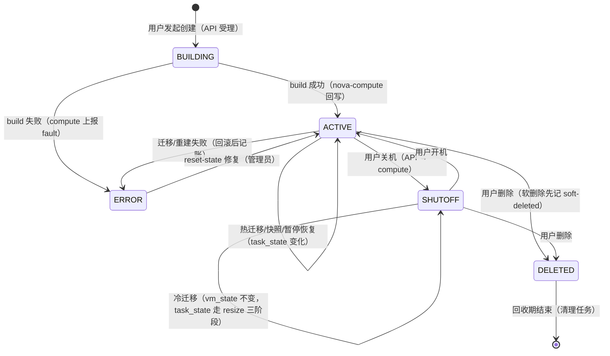
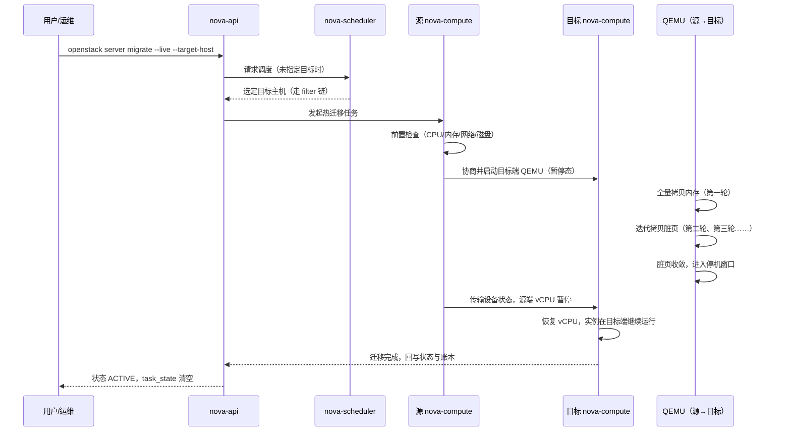

# 05 实例生命周期与迁移实战

**摘要：**

创建一台虚拟机只是故事的开头，实例在云平台上的大部分时光都花在"被移动、被维护、被恢复"上——而这一切都建立在一套精确的状态机之上。本文从 Nova 用三个状态字段（vm_state/task_state/power_state）刻画实例一生的设计讲起，沿着"实例如何被搬迁"这条主线，依次拆解冷迁移的朴素原理、热迁移的预拷贝（pre-copy）算法与停机窗口的形成机制、迁移卡住时的诊断路径与回滚手段，再到主机宕机后的 evacuate 恢复与 Masakari 实例高可用，最后落成一份可直接执行的主机维护窗口预案。读完你应当能回答两个问题：一台实例从 BUILD 到 DELETED 的每一次状态转换由谁触发、依据什么，以及把一台"正在跑业务"的实例从 A 机搬到 B 机而不让用户察觉，究竟难在哪里、代价是什么。

---

## 第 1 章 实例的一生——三态模型与状态机

### 1.1 为什么一个状态字段不够用

在展开迁移之前，我们必须先回答一个更基础的问题：云平台如何描述一台实例"现在怎么样"。这个问题看似平淡，却是理解后续所有运维动作的地基。

不妨先设想最朴素的方案：数据库里给实例一个 status 字段，创建时写 building，跑起来写 active，关机写 shutoff。听起来够用了，但很快你会撞上三类无法用单一字段表达的事实：实例正在稳定运行（稳定态）、实例正在被热迁移（进行中的任务）、libvirt 报告的域其实是暂停的（底层真实状态）。这三件事在时间尺度、可信主体、变化频率上完全不同——稳定态以分钟计、由控制面记账；任务以秒计、由执行者更新；底层状态以毫秒计、由 hypervisor 说了算。把它们塞进一个字段，就像把"婚姻状况""正在做的家务""此刻的心率"写进身份证的一栏里，任何一方的更新都会污染其他两方的语义。

Nova 的答案是拆成三个字段：**vm_state 记账、task_state 记事、power_state 记实**。这个三态模型不是过度设计，而是"控制面意图"与"数据面事实"分离的必然结果——你在第 04 篇已经见过 conductor 与 compute 的职责分离，状态模型是同一思想在数据结构上的投影。

### 1.2 vm_state：控制面的账本

vm_state（虚拟机状态）是 Nova 数据库里的权威记录，表示实例在控制面视角下的稳定状态，只有 API 操作与任务完成事件才能改写它：

| vm_state | 含义 | 进入方式 |
| :--- | :--- | :--- |
| active | 正常运行 | build 完成、开机、迁移完成 |
| building | 创建中 | 创建请求受理 |
| shutoff | 已关机 | 用户关机、冷迁移的中间态 |
| error | 上一次操作失败 | build/迁移/重建等任务失败 |
| deleted | 已删除 | 删除请求（软删除期内可恢复） |
| soft-deleted | 软删除保留期 | 配置了 reclaim 策略的删除 |
| paused | 已暂停 | 用户暂停操作 |
| resized | 迁移/变规落定待确认 | resize 的两阶段之间 |

请注意这张表里最容易被误读的一行：**error 不代表实例死了，只代表"上一次操作失败了"**。热迁移失败回滚后，实例多半还在源主机上正常跑着业务，但 vm_state 已经被记成 error。此时正确的动作是先查 fault 信息，再决定 reset-state 恢复还是删除重建——值班时看到 ERROR 实例就条件反射地 delete，是运维事故的经典来源，第 04 篇提过一次，这里值得再强调一遍，因为它在迁移场景下出现的频率远比创建场景高。

### 1.3 task_state：正在进行的任务

task_state（任务状态）记录实例当前正在执行的异步任务，由执行该任务的组件（通常是 nova-compute）在任务的关键节点上更新，任务结束即清空：

| task_state | 所属任务 | 更新者 |
| :--- | :--- | :--- |
| scheduling | 调度中 | nova-scheduler |
| networking / block_device_mapping / spawning | 创建流程各阶段 | nova-compute |
| migrating | 热迁移进行中 | nova-compute |
| resize_prep / resize_migrating / resize_finish | 冷迁移与变规三阶段 | nova-compute |
| image_snapshot / image_upload | 快照与镜像上传 | nova-compute |
| powering-off / powering-on | 关机与开机 | nova-compute |
| deleting | 删除中 | nova-compute |

vm_state 与 task_state 的组合才是实例的完整画像：`ACTIVE` 加 `task_state=migrating` 表示一台正常运行的实例正在被热迁移，`SHUTOFF` 加 `task_state=resize_prep` 表示一台关机的实例正在做冷迁移准备。运维脚本判断"实例是否空闲可操作"，判断的正是 task_state 是否为 None——对一台 task_state 非空的实例下发新操作，轻则被 API 拒绝，重则制造状态竞争。

### 1.4 power_state：hypervisor 的实话

power_state（电源状态）与前两者不同，它不是控制面"认为"的状态，而是 nova-compute 定期从 libvirt 轮询回来的域状态，是对物理世界现状的如实转述：

| power_state | 对应 libvirt 域状态 | 说明 |
| :--- | :--- | :--- |
| RUNNING (1) | running | 域在运行 |
| PAUSED (3) | paused | 域被暂停（譬如迁移的停机窗口内） |
| SHUTDOWN (4) | shut off | 域已停止 |
| CRASHED (6) | crashed | 域崩溃 |
| SUSPENDED (7) | suspended | 挂起到磁盘 |

三个字段一旦出现矛盾，排障的钥匙就藏在"谁更可信"这个问题里。vm_state 说 active 而 power_state 说 SHUTDOWN？可能是宿主机重启后域没有自动恢复，控制面账本还没对齐现实。vm_state 说 error 而 power_state 说 RUNNING？多半是迁移回滚后的记账残留。Nova 内建了一个对账机制：compute 周期性运行 reconcile 般的 power_state 同步，发现账实不符时以 hypervisor 为准修正，并在日志里留下 `Found instance ... in state ...` 一类关键字——看到这行日志，说明系统已经替你做了一次自动纠偏，但频繁出现则意味着有更深的问题（譬如 libvirt 与 Nova 的版本失配）在反复制造分歧。

### 1.5 一次完整生命的状态旅程

把三个字段合起来看，一台实例从创建到删除要经过这样一条主线。图里只画了 vm_state 的主干转换，每个转换旁标注了触发者：



触发者的分布颇有意味：用户能直接触发的只有创建、开关机、删除这几条粗线，其余的转换都由系统内部角色完成——调度器决定实例去哪，compute 决定状态何时落定，hypervisor 决定 power_state 的真值，清理任务决定 DELETED 何时真正消失。**用户看到的状态机是简化的，运维看到的状态机才是完整的**，这份完整版就是排障时的地图：任何"实例卡住了"的问题，第一步都是在地图上定位它卡在哪条边上、那条边的触发者是谁。

把触发者整理成对照表，排障时按"谁负责这条边"直接定位组件日志：

| 转换 | 触发者 | 第一现场日志位置 |
| :--- | :--- | :--- |
| BUILDING → ACTIVE / ERROR | nova-compute（build 任务） | 目标计算节点 nova-compute 日志 |
| ACTIVE ↔ SHUTOFF | 用户请求，compute 执行 | nova-api 与 compute 日志 |
| 迁移类 task_state 变化 | 源目两端的 nova-compute | 两台计算节点的日志对照着看 |
| power_state 修正 | nova-compute 的周期轮询 | compute 日志的状态同步记录 |
| soft-deleted → DELETED | 回收清理任务 | 控制节点 nova-conductor / 清理日志 |

这张表的用法是双向的：正向查"这个状态谁写的"，反向查"这个组件能改哪些状态"。值班时收到"实例状态不对"的工单，先在表里找到该状态的写入者，再去对应机器上捞日志，比在所有组件里大海捞针快得多。

### 1.6 状态卡住的两种成因

状态机地图上最常见的故障是"卡住"，而成因只有两类，处置方式截然相反。

**第一类：任务真的还在跑。** 譬如大规格实例的冷迁移，磁盘拷贝本身就要几十分钟，task_state 停在 resize_migrating 是正常的。判断方法是看任务有没有心跳——compute 日志的持续输出、os-migrations API 里迁移记录的更新时间。这类"卡住"只需要等待，任何强行干预（重启 compute、reset-state）都会把一个健康的长任务变成真正的事故。

**第二类：任务已经死了，状态没死。** 消息丢失、compute 崩溃、数据库回写失败，都会让任务消失而状态残留。判断依据同样是证据：日志里任务中断的 traceback、MQ 里的消息积压、compute 服务的心跳缺口。这类卡住才需要人工介入——修复根因后 reset-state 或让清理任务兜底。分不清这两类就动手，是状态机排障里最贵的错误。

### 1.7 软删除与回收：生命周期的尾声

状态机的尾声还有一段容易被忽略的旅程。删除请求到达后，实例并不立即消失：如果配置了软删除策略（`reclaim_instance_interval` 大于零），实例先进入 `soft-deleted` 状态保留一段时间，期间用户可以用 restore 恢复——这是给"手滑删库"准备的后悔药。保留期结束后，清理任务把它推进到 `deleted`，再由底层的清扫机制真正回收磁盘与网络资源。

这段尾声对运维的意义在于**资源占用的滞后性**：软删除期的实例仍占着 Placement 的账本与磁盘空间，"删除了实例但资源没回来"的工单，一半的答案是软删除还没到期，另一半才是第 04 篇讲过的幽灵 allocation。排查时先查删除时间与保留期配置，再查账本，顺序别颠倒。

> [!warning] ERROR 状态的三段论
> 看到 ERROR 实例，按固定顺序走三步：先看 fault 字段与 compute 日志确认"失败的是什么操作"；再确认实例本体是否还在运行（power_state、宿主机上的 virsh list）；最后才决定处置——操作已回滚且实例健在用 reset-state，实例确实残废用 delete 重建。跳过前两步直接删除，你删掉的可能是别人正在跑的生产业务。

---

## 第 2 章 冷迁移——最朴素的搬迁

### 2.1 原理：关机、拷贝、重建

冷迁移（cold migration）的原理朴素到一句话就能说完：把实例关机，把磁盘数据从源主机拷贝到目标主机，然后在目标主机上按原规格重建一台一模一样的实例。它不追求"用户无感"，只追求"数据不丢、规格不变"——本质上是把一台实例的"灵魂"（配置、磁盘、元数据）整体搬个家。

拆开看，冷迁移在 Nova 内部走的是 resize 的机制（下节详述），流程分三段：**准备阶段**，调度器按与创建相同的 filter 链选目标主机，源 compute 把实例置为 resize_prep 并关机；**迁移阶段**，磁盘数据经源主机到目标主机的拷贝通道传输（libvirt driver 默认通过 SSH 通道做原生拷贝），目标 compute 在本地重建镜像文件；**落定阶段**，目标主机启动实例、更新数据库与 Placement 账本，等待确认（confirm）后源主机的残留被清理。

这个流程里最值得玩味的是**它复用了调度器**。冷迁移不是"指定一台主机搬过去"，而是重新走一遍 filter 与权重——目标主机必须像接受一次新创建那样通过全部约束。这解释了一个高频困惑：为什么实例当初能调度到 A 集群，现在想冷迁移回 A 集群却报 `No valid host`？因为当初的约束（aggregate、extra_specs、资源水位）此刻可能已经不满足了。**迁移是一种"带着历史包袱的重新创建"**，理解这一点，很多调度报错就不再神秘。

拷贝通道本身也有值得细看的地方。libvirt driver 的默认做法是通过 compute 节点之间的 SSH 通道传输磁盘镜像文件，通道的建立依赖节点间预置的迁移专用密钥对（nova_migration 用户），这解释了为什么"冷迁移失败先查 SSH 互信"是排障的第一反应。如果实例的磁盘后端是 Ceph RBD，情况则完全不同——磁盘根本不在本地文件系统里，"拷贝"退化为 RBD 层面的操作甚至无需拷贝，冷迁移的速度与稳定性都上一个台阶。**磁盘后端的形态，决定了冷迁移的成本结构**，这与下一章热迁移面对的取舍遥相呼应：存储越共享，迁移越轻。

### 2.2 与 resize 的关系

resize（变规）与冷迁移在 Nova 里共用同一套机制，区别只在于目标规格是否变化：resize 把实例从 flavor A 变成 flavor B，冷迁移则是 flavor A 变成 flavor A。两者都走 prep→migrating→finish 的三阶段 task_state，都落在 resize 后的两阶段确认上——迁移或变规完成后，实例处于 `resized` 状态，由用户（或自动确认策略）执行 confirm 或 revert：

- **confirm**：确认新状态，源主机上的旧磁盘残留被清理，操作不可逆
- **revert**：回退到原主机原规格，代价是再做一次反向迁移

这个两阶段设计是"给用户反悔权"的工程化：迁移类操作动的是生产实例，任何自动化都不该剥夺人工复核的窗口。但代价是**状态停留**——忘记 confirm 的实例会一直挂在 resized 状态，源主机的磁盘副本不清理，Placement 的账目也按"迁移中"记账。生产环境应当为 confirm 配置自动策略或定期巡检，否则磁盘空间会被这些"待确认的残骸"慢慢吃掉。

### 2.3 适用场景与代价

冷迁移的适用边界由它的停机代价决定。它适合这些场景：实例可以接受分钟级停机的计划内搬迁（譬如业务低峰期的宿主机腾空）、热迁移因 CPU 差异或资源约束无法完成时的兜底手段、以及需要同时变更规格的搬迁（resize 场景）。

反过来，判断"这次搬迁该不该用冷迁移"，可以用三个问题快速过一遍：

- **业务能停吗**：能接受分钟级中断，冷迁移才有入场资格；不能，直接进入热迁移的约束检查
- **磁盘多大**：本地盘加 TB 级数据，全量拷贝的时间可能比一个维护窗口还长，先算时间账再动手
- **要改规格吗**：搬迁同时要变规格，resize 机制一步到位，不必"迁移一次再变规一次"

| 维度 | 冷迁移 | 热迁移 |
| :--- | :--- | :--- |
| 停机时间 | 分钟级（与磁盘大小成正比） | 毫秒到秒级抖动 |
| 磁盘传输 | 全量拷贝 | 增量迭代（或共享存储免拷贝） |
| 失败影响 | 实例留在关机态，可重试 | 回滚到源主机，业务无感 |
| 前置约束 | 调度约束 | 调度约束 + CPU 兼容性 + 带宽 |
| 用户感知 | 明确的服务中断 | 理论上无感 |

表里"失败影响"一行值得展开：冷迁移失败后实例停在关机状态，数据还在源主机或已部分拷贝，重试的成本低；热迁移失败则回滚到源主机继续跑，用户无感但问题被掩盖。**冷迁移的失败是显性的，热迁移的失败是隐性的**——前者逼你处理问题，后者让你以为没有问题，从运维视角看，显性失败反而更安全。

### 2.4 冷迁移失败的处理

冷迁移的失败点集中在拷贝通道上，处理路径也围绕它展开。

最常见的失败是**主机间 SSH 互信损坏**。libvirt driver 的拷贝依赖 compute 节点之间的迁移专用 SSH 通道（nova_migration 用户），密钥过期、权限漂移、known_hosts 冲突都会让拷贝在第一步就断掉，日志特征是 `Failed to copy` 或 SSH 相关的 traceback。第二类是**磁盘空间不足**——目标主机要容纳全量磁盘，超分过的磁盘账本与实际占用不符时，拷贝中途写满，日志特征是 `no space left on device`。第三类是**权限与路径问题**，`/var/lib/nova/instances` 目录属主或权限被误改后，目标主机写不进实例目录。

失败后的现场处理有一条纪律：**先让实例回到可调度状态，再修通道**。实例可能卡在 resized 或 error 状态，用 reset-state 归位后它至少可以被再次迁移或启动；拷贝通道的修复（密钥、空间、权限）可以慢慢做。反过来先修通道再管实例，业务停机时间会被无谓拉长——**止损与根因修复分离**，这条原则在所有迁移故障里都适用。

---

## 第 3 章 热迁移原理——内存的搬家艺术

### 3.1 一个持续被书写的难题

热迁移（live migration）要解决的问题听起来近乎悖论：把一台正在运行的虚拟机从 A 主机搬到 B 主机，期间内存还在被写、CPU 还在执行、网络连接还挂着，而用户几乎不该察觉。这个问题在工业界的第一次漂亮回答来自 VMware 的 VMotion（2003 年），学术界的里程碑则是 Clark 等人在 NSDI 2005 发表的《Live Migration of Virtual Machines》——这篇基于 Xen 的论文确立的预拷贝（pre-copy）框架，直到今天仍是 KVM/QEMU 热迁移的骨架。OpenStack 从早期版本起就把它作为一等公民能力，但"能用"与"用好"之间的距离，正是本章与下一章要填平的。

为什么这个问题难？难点在于**内存是活的**。磁盘数据拷贝时不会自己变化，拷完即止；但内存里正在运行的操作系统的每一毫秒都在写页——你拷贝的速度必须跑赢它弄脏页的速度，否则永远拷不完。热迁移的全部工程艺术，就是在一场"拷贝速度对脏页速度"的赛跑里想办法让前者赢。

### 3.2 预拷贝与脏页追踪

预拷贝的核心循环可以这样描述：先把全部内存完整拷贝一遍，同时用脏页追踪（dirty page tracking）记下拷贝期间被写过的页，然后只拷贝这些脏页；拷脏页期间又产生新的脏页，于是再拷一轮——如此迭代，直到剩余脏页足够少，才进入最后的停机切换。

脏页追踪的底层机制是 KVM 的脏页日志（dirty logging）：hypervisor 把客户机内存按页粒度维护一张位图，客户机每写一个页，对应的 EPT/SPT 违例触发该页在位图上置位——QEMU 每轮迭代读取位图，就知道哪些页需要重拷。这个机制的精妙在于**代价被摊到了正常路径上**：客户机的每次首次写都多付一次缺页类开销，但换来的是拷贝端可以精确增量，不必整内存反复搬运。

但迭代不保证收敛。如果实例的内存写压力太大——譬如一台跑着大吞吐缓存的 Redis——每轮迭代弄脏的页比拷贝的还多，迁移就陷入"追不上"的死循环。工程上有三个收敛手段，各有代价：

| 手段 | 原理 | 代价 |
| :--- | :--- | :--- |
| 停机时间递增 | 逐轮放宽停机窗口上限，逼迁移进入切换 | 停机抖动变大 |
| auto-converge | 对源实例的 vCPU 限速，压低脏页产生速度 | 实例性能在迁移期间下降 |
| post-copy | 先切主机再补拷内存，缺页从源端回取 | 切换后短暂性能骤降，源故障即实例故障 |

Nova 把这三个手段都做成了配置项：`live_migration_downtime`（停机窗口上限，默认 500 毫秒）配合 `live_migration_downtime_steps` 与 `live_migration_downtime_delay` 控制递增节奏，`live_migration_permit_auto_converge` 开启 vCPU 限速收敛，`live_migration_permit_post_copy` 允许后拷贝模式。三者的取舍本质是同一个问题的三种答案：**迁移期间，你愿意让实例慢、让停机长、还是让风险高**——没有免费选项。

### 3.3 停机窗口的形成

热迁移的"无感"是有限度的，这个限度就是停机窗口（downtime）。整个迁移的绝大部分时间里，源主机与目标主机并行存在，源端照常服务；只有当剩余脏页收敛到阈值，QEMU 才暂停源端 vCPU，把最后一批脏页与全部设备状态（CPU 寄存器、设备状态、网络套接字的连接追踪信息）一次性传过去，然后在目标端恢复执行——从源端暂停到目标端恢复，就是用户感知到的停机窗口，通常在几十毫秒到一秒之间。

窗口内发生的事情值得细看：网络层面，虚拟机的 MAC 与 IP 不变，但流量要从源主机的接入点切到目标主机，依赖二层网络的 ARP/转发表更新在窗口内自然收敛（这也是热迁移要求源目主机二层可达的原因之一）；存储层面，共享存储场景下磁盘根本不搬，窗口内只需切换卷的访问者。**停机窗口的长度不取决于内存总量，而取决于最后一轮的脏页量与网络延迟**——这就是为什么"内存大"不必然导致"停机长"，而"写压力大"必然导致收敛困难。

对停机窗口的量级建立直觉，有助于你判断"迁移是否健康"：通用业务的实例，窗口通常在几十毫秒到几百毫秒之间，表现为一两个 TCP 重传或一次进程调度延迟，绝大多数应用完全无感；窗口超过一秒，多半意味着最后一轮脏页太多（写压力问题）或迁移网络延迟高（网络问题），值得在迁移后复盘；而"迁移完成了但业务出现了明显的连接中断"，则要把怀疑指向窗口之外的因素——譬如安全组或负载均衡成员的健康检查在切换期间超时，这类问题不在 QEMU 的迁移机制里，而在周边配套上。

### 3.4 块迁移与共享存储迁移

内存要搬，磁盘要不要搬？这个问题的答案把热迁移分成两个流派。

**共享存储迁移**：实例磁盘放在源目主机都能访问的后端上（NFS、Ceph RBD 等），磁盘根本不需要拷贝，迁移只搬内存与设备状态。这是生产环境的首选形态——迁移速度快、约束少、停机窗口短，第 08 篇将展开的 Ceph RBD 后端正是为此而生。

**块迁移（block migration）**：实例磁盘在本地盘上，迁移时磁盘数据与内存一起走预拷贝流程。它让"本地盘实例也能热迁移"成为可能，但代价显著：迁移流量从"几个 GB 的内存"膨胀为"内存加全量磁盘"，拷贝通道长期饱和，收敛难度指数上升，大磁盘实例的迁移可能以小时计。

| 维度 | 共享存储迁移 | 块迁移 |
| :--- | :--- | :--- |
| 磁盘数据 | 不拷贝 | 全量预拷贝 |
| 迁移时长 | 与内存相关，通常分钟级 | 与磁盘总量相关，可能小时级 |
| 对写密集磁盘的容忍 | 无关 | 差（磁盘脏块同样要迭代） |
| 基础设施要求 | 需要共享存储后端 | 无额外要求 |
| 生产建议 | 首选 | 本地盘场景的权宜之计 |

**带卷的热迁移**介于两者之间又优于两者：实例的系统盘或数据盘是 Cinder 卷（后端 Ceph RBD 或其他共享后端），卷本身不需要迁移，只需在窗口内把卷的挂载关系从源主机切换到目标主机。这也是"卷优先"架构的又一红利——**全部实例都卷化之后，热迁移的约束几乎只剩内存与 CPU**，运维的自由度上一个台阶。

### 3.5 两个特殊约束：NUMA 与大页

在结束原理章之前，有两个高性能场景的迁移约束值得单独交代，它们都来自第 04 篇讲过的"高性能三件套"。

**NUMA 拓扑约束**：声明了 `hw:numa_nodes` 的实例，其 vCPU 与内存被绑定在特定的 NUMA 节点上，热迁移要求目标主机的 NUMA 拓扑能够容纳同样的绑定期望——目标端 NUMA 节点数量更少、或对应节点上资源已被占用，迁移都会在检查阶段被拒。异构机型混部的集群里，这是"同规格实例在 A 机型上迁不到 B 机型"的常见根因。

**大页内存约束**：使用 2MB 大页的实例，其内存以大页池的形式预留，迁移时目标主机必须有等量的大页池余量。大页池是启动时预留的，运行时无法临时扩充，所以"宿主机看着内存够、大页池却不够"导致的迁移失败并不罕见——核对大页余量（`hugepages` 相关的 `/proc/meminfo` 字段）应当成为高性能实例迁移前检查清单的固定一行。

### 3.6 完整时序

把参与者与阶段合起来，一次共享存储热迁移的完整时序如下：



这张图里有两个容易忽略的细节。其一，**目标端 QEMU 在拷贝开始前就已存在**（以暂停态启动），源目两端在整个迁移期间是双实例并行、单实例服务的状态，任何一端崩溃都要按迁移失败处理。其二，**调度与检查是两道独立的门**——调度器确认目标主机"放得下"，compute 侧的前置检查确认"迁得动"，前者看账本，后者看现实，两道门都过才算数。

### 3.7 post-copy：另一条路

预拷贝的收敛困境催生了反向思路：与其追着脏页跑，不如先把 CPU 状态切过去让实例在目标端直接开跑，缺的内存页按需从源端回取（缺页回填），后台再异步补齐剩余页面。这就是后拷贝（post-copy），QEMU 自 2.11 版本（2017 年）起支持，Nova 通过 `live_migration_permit_post_copy` 开放。

它的优点直击痛点：**停机窗口极短且与内存大小、写压力无关**——切换发生在迁移刚开始时，没有收敛问题。但代价换了个地方：切换后的一段时间里，实例的内存访问可能频繁触发跨主机缺页回取，性能断崖式下降；更致命的是，**迁移完成前源主机必须健在**——预拷贝失败可以回滚到源端，post-copy 一旦切换，源端内存是唯一权威副本，源主机此时宕机，实例就真的没了。所以 Nova 默认只在"迁移已陷入收敛困境时自动切换 post-copy"的场景下启用它，把它当逃生通道而非常规路线。

---

## 第 4 章 热迁移实战——从检查到回滚

### 4.1 前置条件：CPU 兼容性

热迁移的前置检查里，CPU 兼容性排第一位，因为它是最隐蔽的一类失败源。虚拟机的 vCPU 暴露的是一组指令集特性，源主机与目标主机的物理 CPU 型号不同（譬如一台 Intel 一台 AMD，或同厂商不同代际）时，目标端可能缺少源端已经暴露给客户机的指令——迁移过去，客户机一执行到缺失的指令就直接崩溃，这类崩溃发生在迁移完成之后，排查时极易误判为"迁移后应用出问题"。

libvirt 提供了 CPU 模型比较能力，Nova 在迁移前会调用它做源目 CPU 的特性比对，比对基准由 nova.conf 的 `[libvirt]` 段 `cpu_mode` 决定：`host-model`（默认）把宿主机 CPU 模型抽象后暴露给客户机，异构集群里迁移兼容性最好；`host-passthrough` 则把物理 CPU 原样直通，性能最好但**要求源目 CPU 型号严格一致**，否则迁移直接被检查拦下。生产环境的取舍很清晰：**大规模异构集群用 host-model 保兼容，性能敏感且主机同构的池子才用 host-passthrough**。还有一个常被遗忘的变量：内核与 QEMU 的版本差异——跨小版本的 compute 节点之间迁移，QEMU 的迁移协议兼容性由机器类型（machine type）兜底，但跨大版本升级后的首次迁移，建议先拿测试实例验证。

### 4.2 其余前置条件与检查清单

CPU 之外，一次热迁移要过的检查还有五道，合起来构成迁移前的完整清单：

| 检查项 | 检查内容 | 不满足的表现 |
| :--- | :--- | :--- |
| 内存资源 | 目标主机可用内存 ≥ 实例分配内存 | 调度阶段被 RamFilter 淘汰 |
| 磁盘空间 | 块迁移需全量磁盘空间，共享存储需写缓存空间 | 迁移中途写满失败 |
| 网络可达 | 源目主机迁移网络互通、二层一致 | 迁移通道建立失败 |
| PCI 设备 | SR-IOV/GPU 直通设备在目标端可用 | 检查阶段直接拒绝 |
| 主机状态 | 目标 compute 服务正常且未禁用 | 调度报 No valid host |

这些检查分布在两个层面：调度器管资源账本类的（内存、主机状态），compute 管物理现实类的（CPU、PCI、网络）。运维能做的是把失败前移——**迁移前的手工核对清单**应当包含：源目主机的 CPU 型号（`lscpu` 的 model name）、QEMU 与 libvirt 版本、迁移网络连通性（从源主机 telnet 目标迁移端口）、目标主机的磁盘余量。四项核对花两分钟，能拦下生产环境八成以上的迁移失败。

### 4.3 迁移卡住的诊断

热迁移最磨人的故障形态不是失败，而是"卡住"——迁移任务挂着，进度不动，取消也不是、等待也不是。诊断的钥匙是把"卡在哪个阶段"定位出来，三个信息源配合使用。

**第一个信息源是迁移记录**。`openstack server migration list`（依赖 API 微版本）能看到该实例的迁移类型、源目主机与状态，`os-migrations` API 还提供 progress 细节。**第二个信息源是 libvirt 的作业视图**：在源主机上 `virsh domjobinfo <domain>` 能看到迁移的实时数据——已拷贝内存量、剩余脏页量、迭代轮次，这是判断"收敛困难"还是"通道断掉"的最直接证据：剩余脏页居高不下且每轮递减缓慢是前者，拷贝字节数完全停滞是后者。**第三个信息源是日志关键字**：

| 位置 | 关键字 | 指向的问题 |
| :--- | :--- | :--- |
| nova-compute（源） | `Timeout waiting for migration` | 迁移超时，Nova 主动判定失败 |
| nova-compute（源） | `Live Migration failure` | libvirt 层迁移报错 |
| nova-compute（源） | `Migration operation has failed` | 迁移最终失败回滚 |
| libvirtd | `Unable to migrate` / `unable to connect` | 迁移通道建立失败 |
| QEMU 日志 | `migration` 相关速率与迭代输出 | 收敛过程细节 |

诊断的决策树不长：拷贝字节数在涨但脏页不收敛，是写压力问题，考虑 auto-converge 或换低峰窗口；字节数完全不动，查迁移网络——防火墙、MTU、源目主机的迁移端口连通性；日志里出现超时关键字，等 Nova 自己判定失败回滚（`live_migration_completion_timeout`，默认 800 秒，即迁移整体超过该时长自动放弃），不必手工强杀。**给系统自己的超时机制留出触发时间，是迁移卡住处置的第一纪律**——手工 kill QEMU 进程这类操作，只该在确认 Nova 的超时机制已经失效时使用。

### 4.4 取消与回滚

迁移发起后想中止，Nova 提供了 `openstack server migration abort`（或 `nova live-migration-abort`），但它的可用窗口有限：**迁移仍在进行中时才能取消**，已经进入停机窗口或已完成的任务不可取消。取消的语义是回滚——实例继续在源主机运行，目标端的半成品被清理，账本恢复原状。

这里要澄清一个容易混淆的语义：**迁移失败与迁移取消的落点都是源主机，但两者的状态记账不同**。失败会把 vm_state 记成 error（提醒你"上一次操作失败了"，实例本身健在），需要 reset-state 恢复；主动取消则通常干净地回到迁移前状态。运维脚本里处理迁移结果时，要区分这两种终态——把"失败"当"取消"处理（不做 reset-state），ERROR 状态就会残留并污染后续的巡检口径。

回滚不是万能的：块迁移进行到后期，目标端已经拷贝了几百 GB 磁盘，取消意味着这些流量全部作废；post-copy 模式下切换已经发生，源端不再是权威副本，**没有回滚可言**。所以"取消"这个动作的价值窗口，恰恰在迁移的前中期——发现走错了，越早停损失越小。

### 4.5 带宽限速与迁移网络

迁移流量是数据面里最不受欢迎的一种：它突发、持续、量大，与业务流量共享物理网络时，轻则业务延迟抖动，重则存储网络超时（如果 Ceph 与迁移共用网络，后果是读写毛刺连片）。治理手段有三层。

**第一层，专用迁移网络**。生产环境应当为迁移划独立网段（`live_migration_inbound_addr` 指定迁移地址），与业务流量、存储流量物理或逻辑隔离。这一条是架构问题而不是参数问题，应当在部署规划阶段（第 11 篇的范畴）就定下来。

**第二层，QEMU 限速**。`live_migration_bandwidth` 控制迁移的带宽上限（默认 0 表示用 QEMU 内建默认值，历史上约 32MiB/s 量级）。限速的取舍要辩证看：限得太死，收敛变慢、迁移窗口拉长、业务暴露在"双实例并行"状态的时间变长；不限，网络风险如前述。**经验做法是按迁移网络的真实带宽给一个留有余量的上限**，譬如万兆迁移网给 4-6Gbps，让迁移尽快完成又不至于打满链路。

**第三层，时机选择**。把大批量迁移安排在业务低峰，本身就是最便宜的"限速"——低峰期实例的脏页率低，收敛快，迁移总时长短，一举三得。

### 4.6 一次完整的迁移排障推演

抽象的清单不如具体的推演。假设值班时发起一次跨主机热迁移，20 分钟后实例仍处于 `ACTIVE` 加 `task_state=migrating`，进度不明。按本章的三个信息源走一遍：

**第一站，看迁移记录**。`openstack server migration list` 显示迁移状态仍是 running，源目主机无误——任务还活着，先排除"任务已死状态残留"的那一类。**第二站，看 libvirt 作业**。源主机上 `virsh domjobinfo` 显示已拷贝内存 48GB、剩余脏页 2GB 且每轮递减缓慢——不是通道断了，是收敛困难。**第三站，看实例画像**。这台实例是内存密集型缓存服务，写压力大，属于预拷贝最不擅长的负载。**第四站，决策**。当前是业务低峰，选择等待并观察递减趋势，同时把 auto-converge 列为下一步手段；若递减趋势停滞，则 abort 回滚，改约低峰重试。

整个推演 10 分钟，靠的不是运气，而是"记录定位任务、作业视图定位阶段、日志定位原因"的三层证据链。把这条推演固化成 runbook，迁移卡住就不再是深夜里的悬案。

> [!info] 迁移参数没有全局最优解
> `live_migration_bandwidth`、`live_migration_downtime`、auto-converge 开关，这组参数的最优组合取决于三件事：迁移网络的余量、实例的写压力分布、业务对毫秒级抖动的容忍度。别人的生产配置只能参考不能照抄——先在测试集群用典型规格与典型负载压测出收敛曲线，再定生产值。

---

## 第 5 章 evacuate 与实例高可用

### 5.1 主机宕机后的恢复路径

前两章讨论的都是计划内搬迁，现在换一个残酷得多的场景：一台计算节点毫无预兆地宕机了——电源故障、内核崩溃、硬件损坏，上面的几十台实例瞬间失联。此时控制面能做什么、不能做什么，取决于一个清醒的认知：**实例的内存状态已经随主机一起消失了**，任何恢复手段都不可能保住运行时状态，能救回来的只有磁盘数据与配置。

把宕机后的时间轴摊开看，恢复路径分四步，每步都有独立的判断点：

- **确认故障**：compute 服务心跳超时、带外管理（IPMI/Redfish）确认主机电源状态，排除"只是网络断了"的误判——这一步的误判是脑裂事故的起点
- **隔离故障主机**：`nova service-disable --reason` 把它摘出调度池，防止恢复期间有新实例被调度上去
- **疏散实例**：对卷化实例逐台或批量 evacuate，新主机上重建并重新挂卷
- **善后对账**：主机修复后核对 Placement 账本、清理残留的迁移记录，再考虑恢复调度

Nova 提供的恢复路径是 evacuate（疏散）：管理员声明某台主机已死，请求把上面的实例在别的节点上重建。流程上它与冷迁移共享"重建"的那一半——调度器选新主机、compute 从镜像与卷重建实例、网络端口重新绑定——但起点完全不同：冷迁移从"实例正常关机"开始，evacuate 从"实例下落不明"开始。这个差异决定了 evacuate 的所有特性：它必然丢内存状态（对实例而言等于一次硬重启）、它必须先确认源主机真的死了（否则两台主机上同时跑着同一个实例，磁盘与网络状态会互相践踏）、它的成功前提是磁盘数据在源主机之外还有一份。

### 5.2 evacuate 与 rebuild 的区别

evacuate 与 rebuild（重建）在 API 层面长得几乎一样——都是"在别处从镜像重建实例"，区别在语义与前提：

| 维度 | evacuate | rebuild |
| :--- | :--- | :--- |
| 触发前提 | 源主机宕机（Nova 校验其 compute 服务 down） | 实例存活，主动重建 |
| 磁盘数据 | 保留（共享存储卷）或丢失（本地盘） | 丢弃，按镜像重装 |
| 使用场景 | 故障恢复 | 镜像升级、实例"重装系统" |
| 管理员接口 | `openstack server evacuate` | `openstack server rebuild` |

关键分野在第三行：**evacuate 尽力保数据，rebuild 天然弃数据**。用 rebuild 来做故障恢复是常见的误用——它会把实例的系统盘重装成镜像初始状态，本地盘上的数据全部蒸发。而 evacuate 对数据的保真度，又取决于磁盘在哪里，这就引出本章最重要的分界线。

还有一个操作细节值得交代：evacuate 过程中实例的登录凭证如何处理。重建意味着实例的元数据与密钥注入要重来一遍，管理员可以通过参数指定新的管理密码，或依赖配置管理工具（cloud-init 与密钥注入机制）在恢复后重新下发访问手段——故障演练时把这个环节走通，比在真实故障里发现"实例恢复了但没人登得上去"体面得多。

### 5.3 共享存储与本地盘：两种命运

evacuate 的能力上限，在部署架构确定的那一刻就写好了。

**共享存储（卷化）实例**：磁盘在 Ceph RBD 或其他共享后端上，源主机宕机不影响数据可达性，evacuate 在新主机上重新挂卷、重建实例，数据完好，RTO（恢复时间）在分钟级。这是唯一能提供像样故障恢复能力的形态。

**本地盘实例**：磁盘在宕机主机的本地硬盘上，主机不死数据不可达，主机死了（存储尚可读时）还可以做抢救式拷贝，存储一并损坏则数据彻底丢失。对这类实例，evacuate 只能做"无盘重建"——从镜像重新拉起一台同名实例，本地数据归零，且必须显式告知 Nova 这是可接受的（`--on-shared-storage` 的反面场景，或接受空盘重建的语义）。

这个分界线的结论应当倒逼架构决策：**对可用性有要求的业务，卷化是前提而非选项**。第 08 篇展开的 Cinder 与 Ceph RBD 组合，正是这条结论的落地形态。把关键业务跑在本地盘上然后指望 evacuate 兜底，等于买了保险却不填受益人。

### 5.4 Masakari：把 evacuate 自动化

手工 evacuate 的问题在于它依赖人：发现主机宕机要靠人（或监控）、决定疏散要靠人、批量执行还要靠人——而故障发生时恰恰是最缺人的时候。Masakari（日语"灾厄"）项目正是为填补这个空缺而生，它在 Queens 版本（2018 年）成为 OpenStack 官方项目，把实例高可用（Instance HA）做成了一条自动化流水线。

它的架构分三块：**monitors** 负责发现故障（主机故障靠主机侧代理失联与外部监控、进程故障靠计算节点上的 pacemaker 资源状态）；**engine** 负责决策与编排（收到故障通知后按策略生成恢复计划）；**operator** 负责执行（调用 Nova/Neutron/Cinder 的 API 完成 disable 主机、evacuate 实例、恢复网络的全套动作）。故障域也分级处理：主机级故障走 evacuate 流程，进程级故障（nova-compute 挂掉但主机健在）只需重启进程，维护模式则主动排空。

但 Masakari 不是"装上就高可用"的银弹，它的有效性同样被第 5.3 节的分界线约束：**卷化实例的自动疏散是可靠的，本地盘实例的自动疏散是危险的**——自动化把"数据可能丢失"的决策从人脑搬到了代码里，如果策略配得激进，它会在你不知情时把本地盘实例"恢复"成空盘新机。此外，误判的代价被自动化放大：主机只是网络抖动了一下，Masakari 已经把几十台实例 evacuate 到别处，主机恢复后如何避免脑裂，需要依赖它的主机隔离（host fencing）机制与你的网络可靠性共同兜底。笔者的建议是：**先把手 evacuate 的 runbook 跑熟，再上 Masakari；上了 Masakari，也要把它的恢复记录纳入巡检**——自动化不等于免检。

还有一层部署上的现实值得提醒：Masakari 的故障发现依赖计算节点上的监控代理与控制面的失联判定，这套机制自身的可靠性决定了整条流水线的可信度——代理误报与漏报的权衡（心跳间隔多长算"失联"），本质上与 Nova 的 `service_down_time` 是同一类问题。部署时把失联阈值调得保守一些，宁可晚几分钟疏散，也不要在网络的抖动里制造一次全量误疏散——**自动化的灵敏与稳健，又是一对要称量的冤家**。

### 5.5 不足与争议

围绕实例高可用，社区与运维圈长期存在两派意见，值得逐项摆出来。

**一派主张"实例级 HA 是云平台的义务"**：用户买的是可用性，主机宕机平台理应自动恢复。这一派的隐含前提是实例无状态或已卷化，恢复的语义等价于重启。

**另一派主张"实例级 HA 是伪需求"**：公有云（AWS、GCP）普遍不提供实例级自动恢复，理由是内存状态不可恢复，"恢复"出来的实例对有状态应用可能有害（譬如数据库双写、集群脑裂），不如把 HA 做在应用层（Kubernetes 的副本调度、数据库的主从切换）。

两派各有道理，落点仍是分层：**无状态或卷化的通用业务，平台级 evacuate/Masakari 是性价比很高的兜底；有状态且对一致性敏感的业务（数据库、消息队列），恢复决策必须交给应用自己的集群机制**，平台强行"拉起"反而制造脑裂。因地制宜的意思在这里很具体——按业务的状态属性选择由哪一层负责恢复，而不是争论哪一层"应该"负责。

> [!info] 本章的一个判断口诀
> 给实例分类时不妨记住三问：数据在共享存储上吗（决定 evacuate 能不能保数据）、实例是单副本吗（决定自动恢复会不会制造脑裂）、停几分钟业务受得了吗（决定恢复手段的激进程度）。三问的答案组合，基本决定了这台实例该由平台恢复、由应用自愈，还是由人兜底。

### 5.6 概念辨析：shelve 与 pause 不是迁移

运维的日常里，还有一类"迁移"容易与本章的概念混淆，值得在收尾前辨析一句：**shelve（搁置）与 pause/suspend（暂停）不是迁移**。pause 把实例的内存挂在宿主机内存里（域暂停，资源仍占用），suspend 把内存落盘到宿主机本地（资源释放但内存文件绑定在源主机），shelve 则更进一步把实例打回镜像、彻底释放资源，恢复（unshelve）时重新调度——shelve/unshelve 因此可以看作"以牺牲运行时状态为代价的免费迁移"。它们的取舍维度与本章的迁移家族正交：迁移保运行时状态，暂停与搁置用状态换资源。把这组概念放进同一张地图，你面对"这台实例该用哪个动作"的咨询时，就有了完整的选项清单。

---

## 第 6 章 主机维护窗口的完整预案

### 6.1 从计划到恢复的 checklist

前面五章的机制，最终都要收敛到运维最日常的场景：一台计算节点要打内核补丁、换内存、升 BIOS，怎么把上面的实例安全地搬走、修完、再搬回来。这件事的完整预案是一份 checklist，每一行都对应前文的一个机制：

| 阶段 | 动作 | 依据的机制 | 完成标志 |
| :--- | :--- | :--- | :--- |
| 1. 预检 | 核对实例清单、卷化比例、CPU 兼容性 | 第 4 章前置检查 | 迁移对象清单确认 |
| 2. 摘除调度 | `nova service-disable` 或移出 aggregate | 调度约束（第 04 篇） | 新创建不再落到本机 |
| 3. 逐台迁移 | 热迁移卷化实例，冷迁移本地盘实例 | 第 3、4 章 | 宿主机实例清零 |
| 4. 确认落定 | 检查 resized 状态残留并 confirm | 两阶段确认（第 2 章） | 无 resized 残留 |
| 5. 维护 | 打补丁、换硬件、重启验证 | —— | 服务恢复、版本核对 |
| 6. 恢复调度 | `nova service-enable`，观察首批实例 | 摘除的逆操作 | 调度恢复、心跳正常 |

使用这份 checklist 时还有两条纪律。其一，**每个阶段留痕**——迁移了哪些实例、失败跳过了哪些、维护前后服务状态如何，全部记录在案，维护窗口出问题时这些记录是唯一的事故现场。其二，**回退点明确**——维护进行到第 5 步发现补丁有问题，回退方案是什么、实例要不要迁回来，这些答案应当写在预案里而不是临时想，临场决策的质量永远低于预案决策。

第 2 步"先摘除再动手"值得单独强调，它与 Ceph 换盘前先 set noout 是同一条纪律：**先让调度器忘记这台机器，再对它动手**。跳过这一步的后果是维护进行到一半，调度器把新实例创建上来，你不得不二次搬迁。第 4 步的 confirm 检查同理——迁移完就关机维护，resized 残留会在你维护期间悄悄占着账本。

### 6.2 批量维护的编排

单台主机的预案跑顺了，集群级的滚动维护（譬如全量内核升级）就是编排问题。编排的核心参数有三个。

**批次大小**：同时维护几台主机？约束来自两处——剩余容量必须能接住被迁移的实例（Placement 账本可算），故障域不能过大（同批次主机挂掉不能影响业务 SLA）。经验起点是集群的 5%-10%，按剩余容量余量调整。

**批次间隔**：上一批的恢复观察期要足够长，让"迁移引发的隐性故障"（譬如迁移后应用性能劣化、网络抖动）有机会暴露。观察期内 ERROR 实例数、迁移后告警量是两个关键观察哨。

**批次内顺序**：先维护低负载主机还是高负载主机？先低后高——低负载主机迁移量小，正好用来验证迁移通道与预案的正确性，把流程风险在损失最小的批次里消化掉。

这套编排没有现成的官方工具，实践中通常用 Ansible 或脚本驱动 CLI 完成。编排脚本里值得内建的三道保险：每台主机迁移前自动核对 CPU 兼容性（把第 4.1 节的手工清单代码化）、迁移失败自动跳过并记录（不让一台的问题阻塞整批）、维护后自动验证服务状态与心跳再放行下一台。

编排脚本的骨架可以概括成一段伪代码式的流程，供你落地时对照：

```bash
# 滚动维护单台主机的编排骨架（伪代码，注释解释"为什么"）
for host in $(cat maintenance_batch.txt); do
    nova service-disable $host nova-compute --reason maintenance  # 先让调度器忘记它
    for vm in $(list_vms_on $host --shared-storage); do
        live_migrate $vm || { log_skip $vm; continue; }           # 失败跳过不阻塞整批
    done
    for vm in $(list_vms_on $host --local-disk); do
        cold_migrate $vm || record_for_manual $vm                 # 本地盘走冷迁移，失败留人工
    done
    wait_and_verify $host                                         # 心跳、版本、残留状态三查
    maintenance_exec $host
    nova service-enable $host nova-compute
    observe_cooldown 30m                                          # 观察期是批次间隔的物理载体
done
```

### 6.3 与监控联动的自动化思路

预案的终局是自动化，但自动化的可靠程度取决于监控给出的信号质量。联动的基本思路是把"人看监控做决策"的环节逐个替换成"机器看指标做决策"，同时保留人的否决权：

- **触发联动**：主机维护需求（磁盘 SMART 预警、内核漏洞公告、内存 ECC 报错）作为事件源，自动生成维护工单与迁移对象清单
- **执行联动**：迁移期间监控迁移速率与业务指标（实例内延迟、丢包），异常超阈值自动 abort——把第 4.4 节的取消语义交给机器，前提是阈值经过压测校准
- **恢复联动**：维护完成后自动核对服务状态、心跳、首批迁移回实例的健康度，全部绿灯才恢复调度

这条链路的每一步都可以渐进实施，但**否决权的设计要先于自动化本身**：哪些决策必须留给人（譬如本地盘实例的 evacuate、生产高峰期的批量迁移），要在自动化方案里写成硬性卡点。监控体系本身的构建是第 13 篇的主题，这里只强调联动的前提——**没有可信的指标，自动化只是把人工失误换成了机器失误，而且机器失误的传播速度更快**。

### 6.4 预案的演练与老化

最后补一块常被忽略的拼图：预案不是写完就有效的资产，它是会老化的。集群扩容后新机型的 CPU 特性变了、升级后迁移参数的默认值变了、业务形态变化后实例的写压力分布变了——这些演进都不会主动通知你的 runbook。所以维护预案需要定期演练：每个季度挑一台低负载主机，按 checklist 完整走一遍"摘除→迁移→维护→恢复"，用演练暴露清单与现实的偏差，比在真实维护窗口里暴露便宜得多。

演练的另一个产出是**时间基准**：一台典型规格实例的热迁移在你们的网络上实际要几分钟、一次冷迁移要多久、恢复观察期多长才够——这些实测数字是批量维护编排（批次大小与间隔）的输入，拍脑袋估出来的时间表，要么让维护窗口一拖再拖，要么让观察期形同虚设。

### 6.5 小结

行文至此，可以把本篇的主线收拢成一句话：**实例生命周期管理的全部复杂性，都源于"运行时状态不可复制"这一物理事实**。三态模型是为了在不可复制的前提下精确记账，预拷贝算法是在不可复制的前提下追求无感搬迁，evacuate 是承认不可复制之后的止损重建，维护预案则是把这些机制编排成可重复的日常。

这条主线也给出了选型的判断依据：磁盘放共享存储还是本地盘，决定了故障恢复能力的上限；热迁移参数怎么调，取决于业务对抖动与迁移窗口的容忍；要不要上 Masakari，取决于你的业务状态属性与运维成熟度。工具与机制都是中性的，**把它们放到你的业务约束与团队能力的秤上称过再选**，才是本篇真正想留下的方法论。下一篇我们转向 Neutron，去看虚拟网络的另一套复杂性问题。

---

## 参考资料

1. OpenStack 官方文档——Nova 实例生命周期与迁移管理：https://docs.openstack.org/nova/latest/admin/
2. Nova 配置参考——live migration 相关参数（downtime/completion_timeout/bandwidth 等）：https://docs.openstack.org/nova/latest/configuration/config.html
3. Clark, C. et al., *Live Migration of Virtual Machines*, NSDI 2005——预拷贝算法的奠基论文
4. QEMU 文档——迁移（migration）与 post-copy 机制：https://www.qemu.org/docs/master/devel/migration.html
5. OpenStack 官方文档——evacuate 与实例高可用：https://docs.openstack.org/nova/latest/admin/evacuate.html
6. Masakari 项目文档——Instance HA 架构与部署：https://docs.openstack.org/masakari/latest/
7. OpenStack Superuser 社区——热迁移收敛与带宽调优的生产实践讨论
8. 相关篇章：[[云原生/OpenStack/04 Nova 架构与调度——API、Scheduler 与资源模型|04 Nova 架构与调度]] · [[云原生/OpenStack/03 虚拟化地基——KVM、QEMU 与 libvirt|03 虚拟化地基]] · [[云原生/OpenStack/02 控制面三件套——MariaDB、RabbitMQ 与 Keystone|02 控制面三件套]] · [[中间件/Ceph/07 RBD 块存储——快照、克隆与 Kubernetes CSI|Ceph RBD 篇]]

---

> [!note] 思考题
> 1. 一台跑着内存密集型缓存服务的实例热迁移时陷入收敛困境：每轮迭代后剩余脏页几乎不减少。分别推演 auto-converge 与 post-copy 两种方案的处置过程——前者迁移期间实例性能如何变化、后者切换后业务会感知到什么？如果这台实例承载的是单副本的金融行情服务，你会选哪个方案，还是干脆等低峰窗口冷迁移？
> 2. 一批本地盘实例所在的主机需要更换主板，预计停机 4 小时。请设计完整预案：哪些实例可以热迁移走、哪些必须冷迁移、哪些只能停机等待？如果维护期间主机彻底无法启动，你的数据丢失边界（RPO）是什么？由此反推：哪些业务当初就不该放本地盘？
> 3. Masakari 检测到某计算节点失联，自动将上面 30 台实例 evacuate 到其他节点；10 分钟后该节点恢复——原来只是交换机端口抖动。推演接下来的连锁反应：原主机上的实例与新疏散出的实例是什么关系？如何避免两套实例同时写同一份数据？据此设计"失联判定"的防误报策略，需要哪些信号交叉验证？
