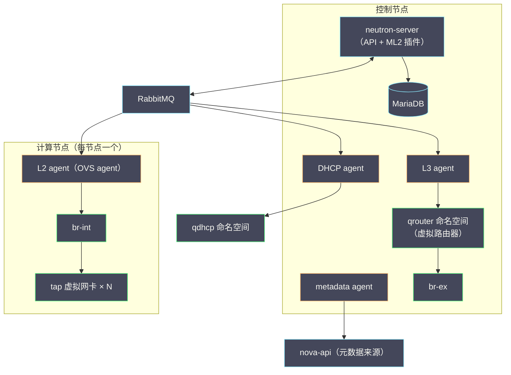
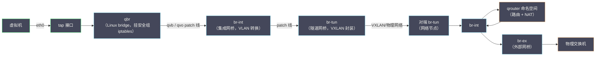
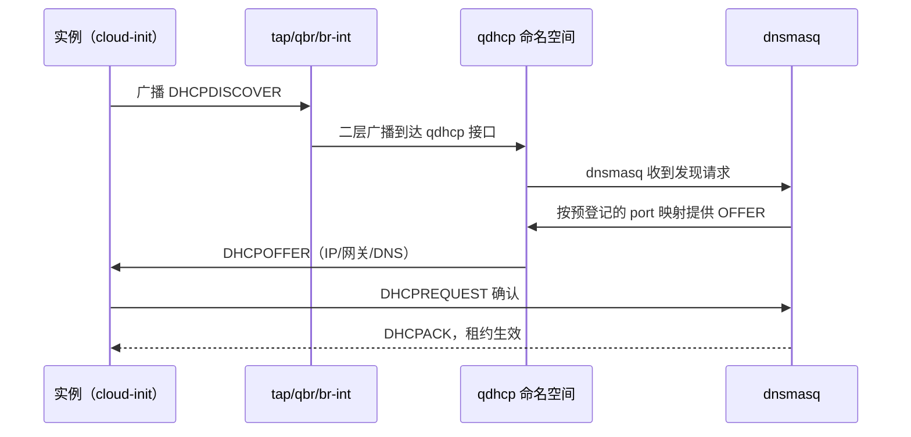

# 06 Neutron 架构——ML2、OVS 与网络命名空间

**摘要：**

如果说 Nova 是 OpenStack 的发动机，Neutron 就是它的血管系统——实例能不能通网、IP 从哪来、安全组为什么没生效，全部落在这套网络服务上。本文从 nova-network 的历史局限讲起，梳理 Quantum 更名 Neutron 的来龙去脉与 Network as a Service 的定位，拆解 neutron-server、ML2 插件框架与 L2/L3/DHCP/metadata 四个 agent 的分工协作，剖析 network/subnet/port/router 四大对象模型，然后用最大篇幅逐段拆解数据面：一块虚拟网卡从 tap 设备出发，经过 qbr、br-int、br-tun、br-ex 最终抵达物理网络的完整路径，以及 Linux 网络命名空间在其中扮演的角色。最后落到运维视角，给出一套网络不通时的分层排查法。读完你应当能回答两个问题：Neutron 为什么把网络从 Nova 手里接过来后变得如此复杂，以及一根网线（抽象意义上的）到底是怎么插进虚拟机的。

---

## 第 1 章 从 nova-network 到 Neutron——网络为什么要独立成服务

### 1.1 nova-network 的黄金时代与天花板

要理解 Neutron，得先回到它出现之前的世界。早期 Nova 自带一个网络模块 nova-network，它的模型朴素到近乎简陋：每个计算节点上跑一个网络进程，用 Linux bridge（Linux 网桥）与 iptables 组合，实现扁平网络或带浮动 IP 的多主机网络。它的优点与缺点是同一枚硬币的两面——**因为简单，所以可靠**：没有额外的控制面组件，没有分布式状态同步，网络配置随实例落盘，节点之间互不依赖。不少老运维对 nova-network 的怀念持续至今，理由无他，就是它几乎不会坏。

但简单是有代价的，而这个代价随着租户数量的增长迅速变得不可承受。nova-network 的网络模型里，**租户之间无法使用重叠的网段**——两个租户不能同时拥有 192.168.1.0/24，因为底层就是一张共享的二层网络，IP 地址是全局资源。公有云要做到规模化，多租户网络重叠（network overlay）是绕不开的门槛，VXLAN、GRE 这类隧道技术在 nova-network 的架构里没有立足之地。此外，nova-network 的实现与 Nova 代码深度耦合，网络功能的迭代节奏被计算服务的发布周期绑死，第三方 SDN 厂商想接入 OpenStack 也找不到干净的扩展点。

你不妨把这段历史想象成一条小镇上的老路：车少的时候，谁都能走、维护也便宜；可一旦镇上来了物流公司、公交公司、私家车主，路权之争、扩建之争就全来了。解决之道不是把路修得更宽，而是成立一个专门的"交通管理局"——把网络从 Nova 的职能里剥离出去，交给一个专职的服务统一规划、统一演进。这个专职服务，就是 Neutron 的前身 Quantum。

### 1.2 Quantum 的诞生与更名史

Quantum 这个名字首次进入 OpenStack 是在 Essex 版本的孵化阶段，到 Folsom 版本（2012 年）正式发布可用——与 Cinder 同一个版本周期，可见"拆分"是当时 OpenStack 的主旋律。不过 Quantum 这个名字只用了不到一年：2013 年的 Havana 版本，社区因为与 Quantum 公司（一家 D-Wave 关联的量子计算企业）的商标纠纷，将项目更名为 Neutron，沿用至今。这段更名史在今天的文档里留下了大量痕迹——数据库表名、配置项、命名空间前缀（qdhcp、qrouter 里的 q 就是 Quantum 的遗存）都还是旧名字，读老资料时看到 Quantum 与 Neutron，指的是同一个东西。

比名字更值得注意的是 Neutron 从诞生起就确立的架构取向：**可插拔（pluggable）**。社区没有把"用哪种技术实现虚拟网络"写死在代码里，而是定义了一套插件接口，让 OVS、Linux Bridge、各家厂商的 SDN 控制器都能以插件形式接入。这个决定在当时争议不小——插件接口的抽象成本让最简单的部署也背上了一层间接性，nova-network 的拥护者批评这是过度设计。但事后看，正是这个取向让 Neutron 活了下来：SDN 十年间的技术潮起潮落（OpenFlow、VXLAN、EVPN、SmartNIC），Neutron 靠着插件框架一次次换引擎而不换车身。

### 1.3 Network as a Service 的定位

Neutron 对自己的定位是网络即服务（Network as a Service，NaaS）：租户通过 API 声明"我要一张网络、一个子网、一台路由器、一个带固定 IP 的端口"，Neutron 负责把这些声明翻译成底层网络设备上的具体配置——网桥、流表、命名空间、路由表、iptables 规则。

这个定位里藏着 Neutron 复杂性的根源。Nova 的抽象对象是虚拟机，底层对应物（QEMU 进程）与抽象几乎一一对应；而 Neutron 的抽象对象是"虚拟网络"，它的底层对应物**分散在每一台宿主机的内核与用户态进程里**——没有哪个单一组件能看到一张虚拟网络的全貌。租户眼里的"一张网络"，在运维眼里是几十台机器上的网桥、流表、命名空间与隧道的总和。理解了这一点，你就理解了为什么 Neutron 的排障总是"分布式"的：任何一次网络不通，断点都可能落在任何一台节点的任何一层。

### 1.4 不这样会怎样——反事实推演

不妨做个反事实推演：假如网络仍然留在 Nova 里，今天会是什么局面？其一，多租户重叠网络无从谈起，公有云的地址规划在租户数量过千时就会撞墙；其二，SDN 厂商的接入需要修改 Nova 代码，生态合作退化为源码 fork；其三，网络的迭代（安全组增强、QoS、分布式路由）全部挤在 Nova 的发布节奏里，计算与网络互相拖累。这三条任何一条单独成立，都足以支撑拆分的决策。

但拆分本身也不是免费的午餐——Neutron 付出的代价是**复杂性的全面上移**：原本"不会坏"的 nova-network 变成了一个由 server、agent、命名空间、网桥组成的分布式系统，故障模式从"通"与"不通"变成了"部分通、时通时不通、通但很慢"。这个代价换来了能力与生态，值不值，取决于你的规模——单机房的几十台节点、租户数量有限，nova-network 式的简单未必是坏选择；但只要上了多租户的规模，这笔账就只能这么算。**复杂性不会消失，只会转移**，Neutron 的历史就是这句话最好的注脚。

### 1.5 标准与实现的分离——评价 Neutron 的正确姿势

评价 Neutron 这类系统，笔者建议采用"标准与实现分离"的视角：先把"Neutron 想做什么"与"Neutron 做到了什么程度"分开谈。想做的部分，NaaS 的抽象是干净且超前的——四对象模型、可插拔后端、声明式 API，这套设计放到今天的 SDN 生态里依然不落伍，Kubernetes 的 CNI 生态走的几乎是同一条路（声明式网络意图 + 可插拔实现）。做到的部分则参差不齐：集中式路由的性能瓶颈、L2 agent 与流表同步的延迟、跨版本升级的兼容性坑，都是社区用了很多个版本周期才逐步补齐的短板。

这个视角的实用价值在于排障时的心态管理：你遇到的问题，大概率不是"Neutron 的设计错了"，而是"某个具体实现环节的状态没有收敛"。把抱怨的精力换成对实现层次的理解，是运维与这套系统和解的唯一方式。

---

## 第 2 章 Neutron 的架构——控制面与数据面的分工

### 2.1 组件全景

Neutron 的组件可以分成两类：跑在控制节点上的 neutron-server（含数据库与消息队列交互），以及跑在每台计算节点与网络节点上的若干 agent。先看全景图：



这张图里有一个贯穿全文的关键区分：**控制面与数据面的分界线在 agent**。neutron-server 接收 API 请求、维护数据库里的"期望状态"，然后通过消息队列把配置意图下发给各个 agent；agent 则负责把期望状态落实为节点上的真实设备配置。server 从不直接碰网桥与流表，agent 从不直接对外提供 API——职责的边界画得非常清楚。

### 2.2 neutron-server：唯一的入口与大脑

neutron-server 是一个无状态的 WSGI 服务，对外提供 REST API，对内承担三件事：请求校验与鉴权（对接 Keystone）、业务逻辑编排（把"创建网络"翻译成数据库记录与 agent 通知）、插件调度（决定由哪个后端实现这张网络）。

它内部还有一个容易被忽略的层次——**API 扩展机制**。Neutron 的核心 API 只覆盖 network/subnet/port/router 四对象，安全组、浮动 IP、QoS、路由器高可用等能力全部以扩展（extension）形式挂载进来。这个设计与 Nova 的微版本不同：Nova 用版本号管理能力差异，Neutron 用扩展资源管理能力差异，两种思路各有优劣，但运维要记住的结论是一致的——**判断"我的版本能不能做某件事"，要看扩展是否加载，而不是只看版本号**（`neutron-status` 与 API 的 `/extensions` 列表可以核对）。

neutron-server 的进程内部还可以按职责再切一刀：核心 API 进程之外，WSGI 的部署形态允许把 API 服务与 RPC 服务（负责与 agent 通信的 server 侧端点）分开部署。小规模部署里两者合在一个进程毫无问题，但大规模部署（数百节点、高频端口变更）时，API 的突发流量与 agent 的配置下发会互相争抢进程资源——把两者拆开部署，等于给"用户请求"与"配置下发"各修一条车道。这个优化不必一开始就做，但容量规划时要知道它存在：当你发现"API 响应变慢"与"agent 同步延迟"总是同时出现，就该考虑拆了。

### 2.3 ML2：type driver 与 mechanism driver 的分层

ML2（Modular Layer 2）是 Havana 版本（2013 年）引入的插件框架，也是今天所有生产部署的事实标准。要理解它的价值，先看它取代了什么：在 ML2 之前，每种网络技术是一个独立的单体插件——OVS 插件、Linux Bridge 插件、各家 SDN 插件，彼此代码重复、无法混用，你选了 OVS 插件就没法同时用 Linux Bridge。

ML2 的解法是把"网络是什么类型"与"网络用什么设备实现"这两个正交的问题拆开，分别交给两类驱动：

| 驱动类型 | 回答的问题 | 典型实现 | 说明 |
| :--- | :--- | :--- | :--- |
| type driver | 这张网络是什么类型 | flat / VLAN / VXLAN / GRE / geneve | 管地址池的分配与回收，譬如 VLAN type driver 管理物理网络可用的 VLAN ID 段 |
| mechanism driver | 这张网络用什么实现 | openvswitch / linuxbridge / L2 population / sriov / 厂商 SDN | 管设备上的落地配置，把网络状态写进具体的网桥与流表 |

这个分层的精妙之处在于**组合爆炸被压成了加法**：3 种类型 × 2 种机制 = 6 种组合，但代码里只需要维护 3 + 2 个驱动。租户可以同时拥有 VXLAN 网络与 VLAN 网络（不同 type），只要 OVS mechanism driver 两者都支持；反过来，厂商 SDN 只需实现 mechanism driver 就能接入所有网络类型。**正交分解**是软件设计里最老也最有效的武器，ML2 是它在 OpenStack 里最干净的示范。

type driver 还有一个运维必须理解的职责：**分配与回收网络标识**。譬如 VXLAN type driver 维护着 VNI（VXLAN Network Identifier）号段池，创建网络时从中取号、删除网络时归还；VLAN type driver 则管理每个物理网络（provider:physical_network）可用的 VLAN ID 范围。号段配置错误（譬如两套环境用了重叠的 VNI 段）不会在创建时报错，而会在数据面表现为"两个不相干的网络互相串台"——这类问题的根因排查方向非常隐蔽，先记住这里。

### 2.4 四个 agent：L2、L3、DHCP 与 metadata

agent 是 Neutron 的手脚，四个常驻 agent 各管一摊：

| Agent | 部署位置 | 职责 | 落地形态 |
| :--- | :--- | :--- | :--- |
| L2 agent（OVS agent） | 每台计算节点、网络节点 | 把端口配置落到 OVS 网桥，维护隧道 | ovs-vswitchd 流表 + br-int/br-tun |
| L3 agent | 网络节点（或 DVR 下的计算节点） | 实现虚拟路由器：跨网段路由、浮动 IP 的 NAT | qrouter 网络命名空间 |
| DHCP agent | 网络节点 | 为端口分配并应答 IP（DHCP） | qdhcp 命名空间里的 dnsmasq |
| metadata agent | 网络节点 | 让实例能访问 169.254.169.254 获取元数据 | 命名空间里的 metadata proxy，回源 nova-api |

L2 agent 的工作模式值得展开一句：它并不常驻监听 API，而是通过消息队列接收 neutron-server 的通知，再周期性（report interval）上报状态。你在 `openstack network agent list` 里看到的 agent 心跳，就是这条上报通路在工作的证据——**agent 心跳停滞，意味着 server 认为这个节点上的所有端口都不可信**，这是后面排障章节的重要伏笔。

L3 agent 与 DHCP agent 有一个共同的设计选择：**每个对象一个命名空间**。每台虚拟路由器对应一个 qrouter-<router-id> 命名空间，每个网络对应一个 qdhcp-<network-id> 命名空间。为什么这么做？因为一台网络节点上要同时服务成百上千个租户，租户 A 的路由表绝不能与租户 B 的混在一起——Linux 网络命名空间（network namespace）提供了内核级的完全隔离：每个命名空间有独立的网卡、路由表、iptables 规则，彼此不可见。这是 Linux 内核能力与云网络需求的一次天作之合，第 4 章会回到这里。

metadata agent 解决的是另一个问题：cloud-init 启动时要访问 169.254.169.254 拿主机名、SSH 密钥与网络配置，但这个链路本地地址不属于任何子网，需要有人"半路截胡"——qrouter 命名空间里的 iptables 规则会把实例发往 169.254.169.254 的流量重定向到 metadata proxy，proxy 再带着实例的 IP 与 router-id 回源 nova-api 查询。**实例拿不到 metadata 的故障，根因往往在 Neutron 的这条链路上**，而不是 Nova 自己。

### 2.5 协作时序：创建一个端口发生了什么

把组件串起来看一次协作。用户（或 Nova 代为）调用 API 创建端口时：

1. neutron-server 校验请求，ML2 的 type driver 从号段池为网络分配标识，数据库写入 port 记录（状态 DOWN）
2. server 通过消息队列通知目标网络相关的 L2 agent
3. nova-compute 在启动实例时把端口绑定到具体的虚拟机（binding profile 更新，端口转为 ACTIVE）
4. L2 agent 感知到端口绑定事件，在节点的 br-int 上创建对应的 tap 接口并下发流表
5. DHCP agent 在 qdhcp 命名空间的 dnsmasq 里登记该端口的 IP/MAC 映射

注意第 3 步的细节：**端口从 DOWN 变 ACTIVE 的触发点是 Nova 的绑定动作，不是 Neutron 自己**。排障时看到端口长期 DOWN，第一反应不该是"Neutron 坏了"，而是"实例还没起来，或者绑定没完成"——状态机的归属权搞清楚，能省掉大量无效排查。

### 2.6 server 与 agent 的可用性设计

把可用性单独拎出来谈，是因为 Neutron 各组件的故障影响面差异极大，运维的优先级排序全靠这张账：

| 组件 | 故障影响 | 可用性手段 | 恢复难度 |
| :--- | :--- | :--- | :--- |
| neutron-server | 新的 API 请求失败，存量流量不受影响 | 多实例 + 负载均衡（无状态，水平扩展） | 低，重启即恢复 |
| L2 agent（单节点） | 该节点实例的网络配置无法变更，存量转发不受影响 | systemd 守护 + 心跳告警 | 低 |
| L3 agent（集中式） | 该 agent 管辖的虚拟路由器全部失联，南北向中断 | 多 L3 agent 分摊 router（availability zone 级） | 中，涉及 router 重新调度 |
| DHCP agent | 新实例拿不到 IP，存量实例不受影响（租约未过期） | 多 DHCP agent 副本 | 低 |
| metadata agent | cloud-init 卡死，SSH 密钥不注入 | 多实例 | 低 |

这张表里最有信息量的一行是 L2 agent：它挂掉后，**该节点上已经在跑的流量完全不受影响**——因为转发决策已经固化在内核的流表里，不需要 agent 在场。控制面与数据面的解耦在这里体现得最纯粹：agent 是"配置的搬运工"，不是"转发的守门人"。反过来，这也意味着 agent 挂掉的节点不会立刻暴露症状，症状要等到下一次配置变更（新实例启动、安全组修改）才爆发——**监控 agent 心跳的价值，就是把发现时机从"下次变更"提前到"现在"**。

集中式 L3 agent 则是另一番景象：它管辖的 router 命名空间是南北向流量的必经之路，agent 异常导致的 router 漂移（重新调度到别的网络节点）会带来几十秒的网关中断，外部监控会看到一波集中的 ping 丢包。生产环境给 L3 agent 做 router 分摊时，务必把"router 的分布均匀度"纳入巡检——所有 router 挤在一个 agent 上，等于把南北向的可用性押在单点上。

---

## 第 3 章 核心对象模型——network、subnet、port、router

### 3.1 四对象与它们的类比

Neutron 的 API 模型围绕四个对象展开，用一张家庭网络来类比会非常直观：

| 对象 | 类比 | 关键属性 | 说明 |
| :--- | :--- | :--- | :--- |
| network | 一台交换机 | provider 网络属性、VNI/VLAN ID | 二层广播域，租户隔离的边界 |
| subnet | 一段地址规划 | CIDR、网关、DHCP 池 | 挂在 network 下的三层地址段 |
| port | 一个网口 | MAC、固定 IP、device_owner | 网络的接入点，实例/路由器/DHCP 都通过 port 接入 |
| router | 一台家用路由器 | 外网网关、内网接口 | 跨 subnet 路由与南北向 NAT 的载体 |

四个对象的关系是单向嵌套的：router 通过接口（router interface）连接 subnet，subnet 必须属于某个 network，port 则是挂在 network/subnet 上的叶子节点。**port 是整个模型里最值得细看的对象**，因为它是所有"东西接入网络"的统一抽象——虚拟机的网卡是一个 port，路由器的内网接口是一个 port，DHCP 服务自己也是一个 port。

### 3.2 device_owner：port 的设备归属

每个 port 都有一个 device_owner 字段，标明这个端口被谁占用。这个字段是运维排障的钥匙，值得把常见的取值记熟：

| device_owner | 含义 | 排障意义 |
| :--- | :--- | :--- |
| compute:nova | Nova 虚拟机的网卡 | 实例的接入点，DOWN 状态先查实例 |
| network:router_interface | 虚拟路由器的内网接口 | 路由器接入了这个子网 |
| network:router_gateway | 虚拟路由器的外网网关 | 南北向流量的出口，绑定外部网络 IP |
| network:dhcp | DHCP 服务的端口 | dnsmasq 在这个子网里的身份 |
| network:floatingip | 浮动 IP 的载体端口 | 浮动 IP 本质上也是一个 port |
| baremetal / 其他 | Ironic 等其他服务 | 判断端口归属，避免误删 |

为什么要把归属权设计得这么显式？因为**网络资源的删除是危险操作，而删除者往往不知道资源的真实用途**。你删掉一个看似无主的 port，可能顺手拆掉了某个路由器的接口，整个子网瞬间失联——device_owner 就是系统留给运维的"此物有主"标签。清理"僵尸端口"之前，先按 device_owner 过滤一遍，是笔者建议的固定动作。

### 3.3 固定 IP 与浮动 IP 的区别

固定 IP（fixed IP）与浮动 IP（floating IP）的区别，本质上是**私有地址与公网地址的区别**，但 Neutron 的实现细节值得说透。

固定 IP 由 subnet 的地址池分配，写在 port 上，伴随实例的整个生命周期，用于租户网络内部的东西向通信。它可以是重叠的——两个租户的实例都拿 192.168.1.10，互不妨碍，因为底层的隧道隔离让两个网段根本碰不到一起。

浮动 IP 则是**从外部网络（provider network）的地址池里取出的公网地址**，通过 1:1 NAT 映射到某个固定 IP 上。实现层面，浮动 IP 落在 qrouter 命名空间的外部接口上，路由器用 iptables 的 DNAT 规则把入向流量改写目的地址转给实例，SNAT 规则把出向流量的源地址改写回来。理解了这个机制，两个经典故障就有了排查方向：浮动 IP ping 不通，先查 qrouter 里的 NAT 规则是否存在（`ip netns exec qrouter-xxx iptables -t nat -L`），再查外部网络的网关与安全组；而"实例主动访问外网"走的则是另一条路——没有浮动 IP 的实例出网靠路由器的 SNAT（默认经网络节点集中式转发，DVR 场景下在计算节点本地完成，这是下一篇的主题）。

> [!info] 一句话记住两者的分工
> 固定 IP 管"东西向"——租户网络内部谁找谁；浮动 IP 管"南北向"——外面的世界怎么进来。前者是身份，后者是门牌。排障时先分清流量方向，再决定查哪一侧的配置。

### 3.4 安全组与 port 的关系

安全组（security group）在 API 层面挂在 port 上——一个 port 可以挂多个安全组，规则（允许某源地址段的某协议某端口）最终翻译成实例所在计算节点上的 iptables 规则。这里有一个新手最容易困惑的实现细节：**安全组规则不落在 OVS 网桥上，而是落在 Linux bridge（qbr）与 tap 设备这一层**。原因是历史性的：OVS 的流表处理绕过了内核 netfilter 的桥接钩子，iptables 规则在 OVS 网桥上不生效，所以 Neutron 在 tap 与 br-int 之间插入了一台 Linux bridge 专门挂 iptables——这台桥的存在理由，就是给安全组一个落脚点。第 4 章拆数据面链路时，你会看到它的位置。

另外要记住安全组的语义边界：它是**白名单式的有状态防火墙**，默认拒绝所有入向、放行所有出向，规则只增删不排序（没有优先级概念，这与传统防火墙的规则序完全不同）。从"全拒绝"起步加白名单，是排查安全组问题时最不容易绕进死胡同的方法。

### 3.5 租户网络与 provider 网络的两条路线

创建 network 时有一组关键抉择：这是租户自己的网络，还是映射到既有物理网络的 provider 网络？两条路线的取舍贯穿了所有部署方案的设计：

| 维度 | 租户网络（tenant network） | provider 网络 |
| :--- | :--- | :--- |
| 谁来定义 | 租户通过 API 自助创建 | 运维预先规划，租户只能选用 |
| 隔离方式 | 隧道封装（VXLAN/GRE），租户间完全隔离 | 物理 VLAN 或 flat，依赖物理网络规划 |
| 地址规划 | 租户任意重叠，随缘分配 | 全局唯一，运维统一分配 |
| 典型用途 | 租户内部的东西向组网 | 实例直接接入外网、裸机场景、外部服务访问 |

生产环境的常见组合是"**两条腿走路**"：默认给租户一张自服务的 VXLAN 租户网络（隔离彻底、地址随便用），另备一条共享的 provider 网络供需要直连物理网络的特殊负载使用。只提供 provider 网络的部署（早期公有云的常见形态）省去了隧道的复杂度，但地址规划的压力全部落在运维头上——租户一多，VLAN 与 IP 的分配就变成手工考古。反过来，全租户网络的部署则要求计算网络的 MTU、离线部署的隧道可达性全部到位，第 6 章会看到 MTU 埋下的经典坑。

还有一个容易被忽视的细节：provider 网络的创建需要管理员权限（`--provider-network-type` 等参数），但创建出来后可以标记为共享（shared）供所有租户使用。排障时区分"这张网络是谁的"是第一步——租户网络的故障查隧道与 agent，provider 网络的故障查物理交换机与 VLAN 放行，两条完全不同的路。

### 3.6 port 的绑定：vnic_type 与性能路线

port 上还有一个对性能敏感的字段：vnic_type，它决定了实例网卡以什么形态接入，也是 Neutron 里"普通网络"与"高性能网络"的分水岭：

| vnic_type | 接入形态 | 性能特征 | 适用场景 |
| :--- | :--- | :--- | :--- |
| normal | 走本章的 tap → qbr → br-int 全链路 | 经过安全组与 OVS，有封装开销 | 绝大多数业务 |
| direct（SR-IOV） | VF 直通给实例，绕过 OVS 与安全组 | 接近物理网卡，延迟最低 | NFV、DPDK、低延迟交易 |
| macvtap | 直通但保留 MAC 管理 | 介于两者之间 | 过渡方案 |

SR-IOV 直通的代价必须说清楚：**绕过 OVS 的同时绕过了安全组与浮动 IP 的 NAT 路径**——直通网卡的流量不经过 qbr，iptables 安全组失效，浮动 IP 也不可用（需要配合硬件防火墙或 OpenStack 的 SR-IOV 安全组方案补位）。这与第 5 章超分比率的权衡是同一种思维：性能不是白来的，每一次绕过抽象层，都要放弃抽象层提供的保护。运维在审批 SR-IOV 需求时，把"你愿意放弃安全组吗"作为标准反问，能过滤掉大部分跟风型需求。

---

## 第 4 章 数据面拆解——从 tap 设备到物理网络

### 4.1 一条流量的完整旅程

本章是全文的重头。我们把镜头对准一台计算节点，追踪一块虚拟网卡发出的一个数据包，如何一步步走到物理网络。先上图（以 VLAN 类型网络、集中式路由为例，VXLAN 场景在 br-tun 一段补述）：



这条链路初看令人眼花，但拆成逐段来看，每一环的存在都有明确的理由。我们一段段走。

### 4.2 逐段解读：tap → qbr → br-int

**第一段：tap 设备。** libvirt 为虚拟机创建的每块网卡，在宿主机上都对应一个 tap 设备（TUN/TAP 设备，名字形如 tap<前几个字符的实例 UUID>）——虚拟机往 eth0 写入的每一个字节，都会从宿主机上对应的 tap 设备冒出来，反之亦然。这是虚拟化网络的第一级"翻译"：把 QEMU 进程里的虚拟硬件，翻译成内核里真实存在的网络接口。排障时 `ip link` 里看到的 tap 设备，就是实例网卡在宿主机上的投影。

**第二段：qbr（Linux bridge）。** tap 设备并不直连 OVS，而是先接进一台名为 qbr 的 Linux bridge，再通过一对 veth/patch 线缆（qvb 与 qvo）接入 br-int。为什么要多这一跳？答案在 3.4 节已经埋下：**安全组的 iptables 规则只能挂在 Linux bridge 上，挂不上 OVS 网桥**。qbr 就是安全组的"执法岗亭"——每个进出实例的数据包都要在这里过一遍 iptables 检查，不合格的直接丢弃。理解了这一点，你就明白为什么"清空 iptables 后安全组失效"、"OVS 流表里看不到安全组规则"都是正常现象，而不是配置错误。

不过要指出，这条 tap → qbr → br-int 的混合路径（社区称之为 hybrid route）是有性能代价的：包要经过 Linux bridge 与 OVS 两套转发逻辑，多两次进出内核协议栈，高 PPS 场景下延迟与 CPU 开销都不可忽视。社区后来的解法是 OVS 防火墙驱动（firewall driver 换成 openvswitch 后，安全组规则直接翻译成 OVS 流表，qbr 整个消失，链路缩短为 tap → br-int）——但流表化的安全组规则可读性远不如 iptables，排障习惯要整个换掉。两种方案至今并存，选型的天平取决于你更在乎性能还是更在乎排障的直观性，这与本系列一贯的结论一致：**没有更好的方案，只有更合适的取舍**。

**第三段：br-int（integration bridge，集成网桥）。** 这是每台节点上 OVS 布局的核心枢纽，所有本地流量——实例的、路由器的、DHCP 的——都在这里汇聚。br-int 上最重要的机制是 **VLAN ID 的本地转换**：每个租户网络在 br-int 上被分配一个**本地 VLAN ID**，这个 ID 只在本节点内部有意义。br-int 像一个机场的中转大厅——旅客（数据包）从不同航班（租户网络）下来，换上本地的登机牌（本地 VLAN tag），在大厅里转机，再飞往下一个目的地时换回航班的真实编号。本地 VLAN ID 与租户网络标识（VNI 或物理 VLAN ID）之间的换算，由 br-int 与 br-tun 之间的流表完成。

### 4.3 VLAN tag 的转换过程与 br-tun/br-ex

**br-tun（tunnel bridge，隧道网桥）** 只在隧道类网络（VXLAN/GRE）中出现，专职处理跨节点流量。它把 br-int 送来的、打着本地 VLAN tag 的包，根据流表改写为 VXLAN 封装（外层是本机与对端节点的物理 IP，内层 VNI 是租户网络的全局标识），从隧道端口发往对端节点；反向的解封装同理。**本地 VLAN ID 与 VNI 的换算发生在 br-tun 的流表里**——这就是为什么两台节点上同一租户网络的本地 VLAN ID 可以完全不同，而隧道对端的 VNI 必须一致。排查"跨节点不通、单节点正常"的问题时，br-tun 的流表是第一嫌疑。

**br-ex（external bridge，外部网桥）** 部署在网络节点（DVR 下也在计算节点），是数据包离开虚拟世界、进入物理网络的最后一站。qrouter 命名空间通过一个挂在 br-ex 上的接口与外部网络相连，完成路由与 NAT 后，包从 br-ex 直接送往物理交换机。br-ex 上通常挂着一个 internal type 的端口（见第 5 章）作为命名空间与网桥之间的连接件。顺带一提，br-ex 的物理侧网卡配置是部署阶段的高频翻车点：网卡必须以无地址的 promiscuous 模式挂进 br-ex（地址由 qrouter 持有），部署工具配错一步，外部网关的 ARP 就会石沉大海——这类问题的症状是"虚拟网络内部一切正常，唯独出不了外网"，与 MTU 问题的区分方法是看 ARP 表里有没有外部网关的应答。

把 VLAN tag 的完整旅程串起来（以 VXLAN 网络为例）：实例发出的包没有 tag → qbr 原样转发 → br-int 打上**本地 VLAN tag**（譬如 42）→ br-tun 查流表，剥掉本地 tag、封装 VXLAN（VNI 1000）→ 物理网络传输 → 对端 br-tun 解封装、打上**对端节点的本地 VLAN tag**（可能是 51，不必与 42 相同）→ 对端 br-int 送到目标 tap → 实例收到无 tag 的包。**同一个租户网络，在不同节点上有不同的本地 VLAN ID，但共享同一个 VNI**——理解了这句话，OVS 布局里最烧脑的部分就通了。

### 4.4 网络命名空间：DHCP 与 L3 agent 的舞台

现在把镜头转向网络节点，看命名空间如何工作。`ip netns list` 会列出形如 qrouter-<uuid> 与 qdhcp-<uuid> 的命名空间，每个里面都是一套独立的网络栈：

- **qdhcp-<network-id>**：里面有一块接在 br-int 上的接口，持有该子网里的一个固定 IP（就是 3.2 节里 device_owner=network:dhcp 的那个 port），以及一个 dnsmasq 进程。实例开机广播 DHCP 请求，广播在二层网络里到达 dnsmasq，IP 分配完成。**DHCP 服务与租户网络同处一个广播域，但与宿主机网络完全隔离**——命名空间保证了这两件事同时成立。
- **qrouter-<router-id>**：里面有两块（或更多）接口，一块接外部网络（br-ex 侧，持有外部网关），一块或多块接内部子网（br-int 侧，持有各子网的网关 IP）。路由表负责跨子网转发，iptables 的 nat 表负责浮动 IP 的 DNAT 与出网的 SNAT。

为什么每个路由器要独占一个命名空间，而不是共用网络节点的根命名空间？不妨设想共用会发生什么：成百上千个租户的网关 IP、路由表、NAT 规则全部堆在同一个栈里，地址重叠时（租户都用 192.168.1.1 当网关）直接冲突，路由表膨胀到不可维护，一条 iptables 规则的误删波及所有租户。**命名空间把"每个租户一台独立路由器"的幻觉变成了内核里的现实**，这是 Linux 网络虚拟化给云时代的最大馈赠之一。

> [!warning] 命名空间是排障的主战场，也是误操作的高发区
> 在 qrouter 命名空间里执行 `iptables -F` 清空规则，会瞬间切断该路由器上所有租户实例的南北向通信；在根命名空间里 `ip link` 看不到任何 qrouter/qdhcp 的接口，容易误判"设备不存在"。进命名空间排查一律用 `ip netns exec <ns> <命令>`，退出即回到根命名空间——把这条纪律刻进肌肉记忆，能避免大量"手滑级"事故。

### 4.5 三类流量的路径对比

把第 4 章的内容收拢成一张对照表，三类流量的路径差异一目了然——这张表是网络排障的"地图"，建议对照着背下来：

| 流量类型 | 路径 | 关键节点 | 典型故障点 |
| :--- | :--- | :--- | :--- |
| 同子网东西向（实例↔实例，同节点） | tap → qbr → br-int → 对端 tap | br-int 的本地 VLAN 转发 | 安全组、tap 状态 |
| 跨节点东西向（实例↔实例，跨节点） | br-int → br-tun → VXLAN 隧道 → 对端 br-tun → br-int | br-tun 流表的 VNI 换算 | 隧道不通、MTU、VNI 冲突 |
| 南北向入向（外网→实例） | br-ex → qrouter（DNAT）→ br-int → tap | qrouter 的 NAT 规则 | 浮动 IP 未关联、NAT 规则缺失 |
| 南北向出向（实例→外网） | tap → br-int → qrouter（SNAT）→ br-ex → 物理网络 | qrouter 的路由表与 SNAT | 无浮动 IP 且 SNAT 未配、外部网关失联 |

对照这张表，很多"玄学症状"可以立刻缩小范围：同节点实例互通但跨节点不通，问题几乎必然在隧道层（br-tun 流表、物理网络对 UDP 端口的放行、MTU）；固定 IP 互通但浮动 IP 不通，问题必然在 qrouter 的 NAT 层；全部不通，则先查 L2 agent 心跳与物理链路——**先分类流量，再选观测点**，比从第一条命令开始盲试快得多。

### 4.6 一次 DHCP 交互的完整时序

实例开机拿 IP 的过程，把 L2 agent、DHCP agent、命名空间全部串了起来，值得单独走一遍：



这条时序里有两个运维要点。其一，dnsmasq 的地址映射来自 DHCP agent 预先登记的 port 记录，**不是动态学习的**——所以"实例换了 IP 但没重启"这类场景下，dnsmasq 的租约与 Neutron 数据库的 port 记录可能短暂不一致，表现为偶发的地址冲突，重建 port 即愈。其二，DHCP 广播依赖二层广播域的完整可达，**跨节点的 DHCP 请求走的是隧道**——隧道层有问题的环境里，新实例会卡在"等待 IP"而存量实例毫无感知，这与 2.6 节"agent 挂掉的症状延迟爆发"是同一种模式：新配置动作才是故障的显影剂。

---

## 第 5 章 OVS 内部结构——br-int、br-ex 与流表

### 5.1 两座桥的分工与 internal port

把第 4 章的链路压缩一下，OVS 布局的骨架就是两座（或三座）网桥：**br-int 管"内"**——所有虚拟端口（实例、路由器接口、DHCP 接口）的汇聚点，本地 VLAN 转换的中枢；**br-ex 管"外"**——与物理网络的边界，南北向流量的出口。br-tun 则是隧道场景下的"国际航线柜台"。三座桥各司其职，桥与桥之间用 patch 线缆（一对互为对端的 internal type 端口，譬如 int-br-ex 与 phy-br-ex）连接——patch 线缆在逻辑上等价于一根网线，包从一端进、另一端出，中间不经过内核协议栈。

internal type 端口值得单独一提：它是 OVS 网桥在内核里的"替身"——每座 OVS 网桥都可以有一个同名 internal 端口，内核协议栈通过它与网桥通信。qrouter 与 qdhcp 命名空间里的接口、br-ex 与根命名空间之间的连接，用的都是这个机制。排障时在 `ip link` 里看到与网桥同名的接口，那就是 internal port，**它是命名空间与 OVS 世界之间的门**。

### 5.2 flow table 的概念

OVS 的转发决策由流表（flow table）驱动，这与 Linux bridge 的"学习式转发"是两种世界观：网桥像老门卫，看谁来得多了就记住 MAC 位置；流表则像一本写死的值班手册，每个包进来，按优先级从高到低匹配规则，规则说转发到哪就转发到哪，规则没覆盖就上报 ovs-vswitchd（用户态进程）补一条。

一条流表的规则大致长这样：匹配条件（入端口、VLAN tag、目的 MAC 等）+ 动作（转发、改写 tag、封装、丢弃）。Neutron 的 OVS agent 下发的规则里，最核心的就是第 4 章讲的**本地 VLAN 与 VNI 的双向换算表**。本篇不深入 OpenFlow 语法，运维需要建立的只是三个心智模型：

1. **流表是"期望状态"的产物**——它由 agent 根据 Neutron 数据库的配置生成，你手工改流表，agent 的下一次全量同步会把它改回去（这也是"手工修流表治标不治本"的原因）
2. **流表匹配失败不等于丢包**——未匹配的包会上报用户态处理，短时间的"slow path"是正常的，持续的大量上报才是问题
3. **流表有优先级**——排障时看流表要按优先级从上往下读，第一条命中的规则生效，后面的规则再合理也轮不到

### 5.3 排查命令的"够用集"

OVS 的命令行工具分两族，管的对象不同：

| 命令 | 管什么 | 典型用法 | 回答的问题 |
| :--- | :--- | :--- | :--- |
| ovs-vsctl | OVS 数据库（桥、端口、接口的拓扑） | ovs-vsctl show | 网桥与端口的连接关系对不对 |
| ovs-ofctl | 流表（转发规则） | ovs-ofctl dump-flows br-int | 转发决策是否正确 |
| ovs-appctl | 运行时控制 | ovs-appctl fdb/show br-int | MAC 学习表内容 |

`ovs-vsctl show` 是 OVS 排障的第一条命令，输出里要核对三件事：桥是否齐全（br-int/br-tun/br-ex）、patch 线缆两端是否成对出现（缺一端就是断链）、tap 端口是否挂在 br-int 的正确 VLAN tag 上。**拓扑对了再查流表，顺序不能反**——拓扑缺失时看流表只会看到一堆"正确但无用"的规则。

### 5.4 OVS 的进程模型

排查 OVS 自身的故障前，先认识它的两个用户态进程，它们与内核模块的分工决定了"OVS 挂了"到底意味着什么：

| 组件 | 形态 | 职责 | 挂掉的影响 |
| :--- | :--- | :--- | :--- |
| ovs-vswitchd | 用户态守护进程 | 流表的计算与下发、监听 ovsdb 变更 | 存量流表仍生效，新流无法建立 |
| ovsdb-server | 用户态守护进程 | 持有 OVS 配置数据库（桥/端口拓扑） | 拓扑无法变更，ovs-vsctl 无响应 |
| openvswitch 内核模块 | 内核态 | 按已下发的流表做快速转发 | 模块异常才影响存量转发 |

这张表的结论与 2.6 节的 L2 agent 一脉相承：**OVS 的转发面在内核，控制面在用户态，用户态进程挂掉不等于断网**。ovs-vswitchd 重启期间，已建立的流继续按内核缓存的规则转发，只有"需要新建流"的流量会短暂受影响。反过来，`ovs-vsctl show` 无响应时先查 ovsdb-server，流表行为异常时先查 ovs-vswitchd 的日志（`/var/log/openvswitch/ovs-vswitchd.log`）——两个进程的故障症状不同，别混为一谈。

### 5.5 流表阅读的入门姿势

不深入 OpenFlow 语法，但运维至少要能"读懂大意"。一条典型的 br-tun 流表规则拆开看：

```bash
# 查看隧道网桥的流表，按优先级排序
ovs-ofctl dump-flows br-tun --sort
# 输出示例（意译）：
# priority=1,dl_vlan=42 actions=strip_vlan,set_tunnel:0x3e8,output:2
# 含义：来自本地 VLAN 42 的包，剥掉 tag，封装 VNI 1000（0x3e8），从 2 号端口（隧道）发出
```

读流表的诀窍是抓三个字段：**匹配条件**（dl_vlan 是本地 VLAN tag）、**动作**（set_tunnel 是 VNI，output 是出端口）、**优先级**（数字越大越先匹配）。把 4.3 节的换算逻辑对照着看，你会发现 br-tun 的流表就是一张"本地 VLAN ↔ VNI"的双向翻译表——看懂一条，整张表就通了。反过来，如果 dump-flows 的输出里找不到你那个本地 VLAN 的翻译规则，那就是 6.1 节分层排查法第三层的实锤断点。

---

## 第 6 章 运维视角——网络不通的分层排查法

### 6.1 分层排查法：沿着包的旅程找断点

网络不通的排查，最忌讳的是"到处乱试"。Neutron 的链路虽长，但每一层都有独立的观测点，沿着包的旅程逐层验证，断点必然现形：

| 层 | 观测点 | 验证什么 | 常见根因 |
| :--- | :--- | :--- | :--- |
| 1. API 与数据库层 | openstack port show | 端口状态、IP 分配、安全组 | 端口 DOWN、IP 冲突、安全组全拒绝 |
| 2. L2 层 | ovs-vsctl show + tap 设备 | tap 是否挂上 br-int、tag 是否正确 | agent 挂了、绑定失败、VLAN 配置错 |
| 3. 流表层 | ovs-ofctl dump-flows | VLAN/VNI 换算规则是否存在 | agent 下发失败、号段冲突 |
| 4. 命名空间层 | ip netns exec ... route/iptables | 路由表、NAT 规则、网关连通性 | 路由缺失、NAT 规则被清、网关 IP 错 |
| 5. 物理层 | 节点物理网卡、交换机端口 | 物理链路、MTU、外部网关 | 网线/光模块、MTU 不匹配（VXLAN 场景高发）、上游网关失联 |

每一层验证"通过"才往下一层走，任何一层"失败"就停下深挖——这个纪律的价值在于**把不可知的"网络不通"分解成一串可判定的是非题**。

### 6.2 一次完整的排障推演

假设值班时收到反馈：某实例的浮动 IP ping 不通。按分层法走一遍：

**第一层**：`openstack port show <port-id>`，端口 ACTIVE、固定 IP 正常、安全组放行了 ICMP——API 层无恙。顺带 `openstack floating ip show` 确认浮动 IP 与端口的关联还在。

**第二层**：登上实例所在的计算节点，`ip link` 找到 tap 设备（存在且 UP），`ovs-vsctl show` 确认 tap 挂在 br-int 上、tag 与同网络其他实例一致——L2 拓扑无恙。

**第三层**：`ovs-ofctl dump-flows br-tun | grep <本地 tag>`，发现该 VLAN 的 VNI 换算规则缺失——嫌疑出现。对照网络节点上同一网络的流表，对端 VNI 一致，但本节点的下发规则确实少了。

**第四层**：`openstack network agent list` 查看该计算节点的 OVS agent，发现心跳停滞、状态 down——根因浮出水面：agent 进程异常退出后未恢复，流表处于陈旧状态。

**处置**：恢复 agent 服务，观察流表被重新全量下发，连通性恢复。**复盘**：给 agent 配置进程守护（systemd Restart=always），并在监控里给 agent 心跳加告警——这次故障从"ping 不通"到定位根因不到二十分钟，靠的不是运气，而是分层法把"玄学"变成了"流程"。

### 6.3 tcpdump 抓包位置的选择

抓包是网络排障的终极手段，但在 Neutron 的链路里，**抓在哪一层，决定了你能看到什么**：

| 抓包位置 | 能看到 | 注意事项 |
| :--- | :--- | :--- |
| tap 设备 | 实例的原始包，无 tag | 最接近实例视角，第一落点 |
| qbr / qvb | 过了安全组检查的包 | 抓不到被安全组丢弃的包（丢弃发生在 iptables 内部） |
| br-int 的 internal 端口 | 带本地 VLAN tag 的包 | tag 是本地的，与别处对不上是正常现象 |
| 隧道物理网卡 | VXLAN 封装后的包 | 外层是节点 IP，内层才是租户流量，MTU 问题在这里现形 |
| qrouter 命名空间接口 | NAT 前后的包 | `ip netns exec qrouter-xxx tcpdump -i <接口>`，验证 DNAT/SNAT 是否生效 |

两条经验法则：其一，**抓包要成对抓**——源端与目的端各抓一个点，对比两边的包是否存在（丢了 tag、被 NAT 改写、被封装），单点抓包只能看到"有没有包"，看不到"包变成了什么"；其二，**怀疑安全组丢包时，用计数器而非抓包验证**——`iptables -L -v` 的 pkts 计数与 OVS 的 drop 统计，比在 qbr 上"抓不到包"更能说明问题。

两条经验法则：其一，**抓包要成对抓**——源端与目的端各抓一个点，对比两边的包是否存在（丢了 tag、被 NAT 改写、被封装），单点抓包只能看到"有没有包"，看不到"包变成了什么"；其二，**怀疑安全组丢包时，用计数器而非抓包验证**——`iptables -L -v` 的 pkts 计数与 OVS 的 drop 统计，比在 qbr 上"抓不到包"更能说明问题。

### 6.4 日常巡检的命令清单

与第 6.1 节的故障排查相辅相成的是日常巡检——故障排查靠分层法，巡检则靠固定清单把问题消灭在爆发之前：

| 命令 | 看什么 | 异常信号 |
| :--- | :--- | :--- |
| openstack network agent list | 各 agent 状态与心跳 | down 状态、心跳停滞 |
| openstack port list --status DOWN | 未绑定端口 | 在跑实例的端口长期 DOWN |
| openstack router list --long | router 分布 | router 集中在单个 L3 agent |
| ovs-vsctl show（抽查计算节点） | 网桥拓扑完整性 | patch 线缆缺端、桥缺失 |
| ip netns list（网络节点） | 命名空间数量 | qrouter 数量与 router 数量不符 |
| ovs-vsctl list interface（错误计数） | 端口收发错误 | rx_dropped/crc_error 持续增长 |

巡检的价值同样在趋势而非快照：错误计数每周的增量、agent 心跳的超时频率、router 分布的偏移速度，这些趋势线才是容量规划（DHCP agent 扩容、L3 agent 分摊调整）的依据。单次巡检只能证明"此刻没事"，连续的巡检数据才能回答"还能撑多久"。

### 6.5 MTU：隧道网络的第一坑

MTU 值得单独成节，因为它是隧道网络里最经典、最隐蔽、也最容易根治的故障源。VXLAN 封装会在每个包外层增加约 50 字节（外层 IP/UDP 头 + VXLAN 头），如果物理网络的 MTU 仍是默认的 1500，封装后的包就会超标——超标包的处理方式取决于路径上的设备：丢弃（静默失败）或分片（性能劣化）。

症状极具迷惑性：**小包（ping、SSH 交互）一切正常，大包（文件传输、镜像拉取、TLS 握手的大证书）卡死**。ping 得通让排障者坚信"网络没问题"，于是问题被错误地归咎于应用层。根治方案是全链路统一规划：物理网络 MTU 调到 9000（巨型帧），隧道接口继承，实例侧由 Neutron 下发适配后的 MTU——任何一环漏配，症状就会在那一环重现。验证手段也简单：从实例内 `ping -M do -s 1472 <对端>`（禁止分片、顶格包长），通则 MTU 无恙，不通则沿路径逐跳排查。笔者建议把这条带 `-M do` 的 ping 写进新环境交付的标准验收清单——MTU 问题在业务低峰期毫无症状，等大流量上来再暴露，代价就大了。

### 6.6 常见误区与小结

**误区一：把 OVS 流表当配置文件手工改。** 流表是 agent 下发的产物，手工修改会被下一次同步覆盖；正确做法是修 Neutron 的配置或数据库状态，让 agent 重新生成。

**误区二：在根命名空间里找 qrouter 的接口。** 命名空间隔离的正是可见性，根命名空间里看不到是设计使然；先 `ip netns list` 再 `ip netns exec`，别在错误的栈里排查。

**误区三：把 MTU 问题当成性能问题。** VXLAN 封装多出 50 字节的开销，物理网络 MTU 若未相应调大（或实例 MTU 未调低），大包被丢弃而小包正常——表现为"ping 得通但传文件极慢"，这是隧道网络最经典的假性故障。

**误区四：把端口 DOWN 当作故障。** 端口 DOWN 的默认含义是"尚未绑定到设备"，实例关机、端口未使用都是正常 DOWN；只有"实例在跑而端口 DOWN"才是异常，且根因多半在 Nova 的绑定环节而非 Neutron。

**误区五：把所有问题都归咎于 Neutron。** 网络是全平台依赖的公共路径，DNS 解析失败、镜像仓库限速、应用自身的连接池耗尽，症状都长得像"网络不通"。分层排查法的第一层（API 与数据库层）之前，其实还有第零层——**先确认症状的边界**：是所有实例不通还是单个实例？是所有协议不通还是只有特定端口？是持续不通还是间歇性？花两分钟收窄症状范围，往往比两小时的链路排查更省时间。

行文至此，可以收束了。Neutron 的架构没有一处是凭空而来的：ML2 的分层是为了让技术选型可组合，命名空间是为了让多租户隔离有内核级的支撑，qbr 的存在是为了给安全组一个落脚点，br-int 与 br-tun 的分工是为了让本地 VLAN 与全局 VNI 各得其所。**它把 nova-network 的简单换成了能力，又用分层的结构把新增的复杂性约束在各自的格子里**——这套"分层 + 可插拔"的思路，与你在任何网络虚拟化系统（包括 Kubernetes 的 CNI 生态）里看到的，都是同一条曲线的重放。下一篇我们沿着本章埋下的伏笔继续深入：VXLAN 的封装细节、DVR 如何把路由从网络节点搬到计算节点、以及安全组在分布式场景下的演进。

---

## 参考资料

1. OpenStack 官方文档——Neutron 架构与 ML2 配置：https://docs.openstack.org/neutron/
2. OpenStack 官方文档——Networking Guide（数据面与 OVS 布局）：https://docs.openstack.org/neutron/latest/admin/
3. OpenVSwitch 官方文档——ovs-vsctl / ovs-ofctl 手册：https://docs.openvswitch.org/
4. ML2 插件框架设计规范（Havana，2013）：https://specs.openstack.org/openstack/neutron-specs/
5. Quantum 更名 Neutron 的社区决议（Havana 版本，2013）：OpenStack 基金会商标公告
6. 相关篇章：[[云原生/OpenStack/04 Nova 架构与调度——API、Scheduler 与资源模型|04 Nova 架构与调度]] · [[云原生/OpenStack/05 实例生命周期与迁移实战|05 实例生命周期与迁移实战]] · [[云原生/OpenStack/02 控制面三件套——MariaDB、RabbitMQ 与 Keystone|02 控制面三件套]] · [[云原生/OpenStack/03 虚拟化地基——KVM、QEMU 与 libvirt|03 虚拟化地基]]

---

> [!note] 思考题
> 1. 同一个租户网络（VNI 1000）在计算节点 A 上的本地 VLAN ID 是 42，在计算节点 B 上是 51。一个从 A 发往 B 的数据包，在 A 的 br-int 上、A 的隧道物理网卡上、B 的 br-int 上分别带什么标识？如果两台节点的 VXLAN type driver 配置了重叠但不同的 VNI 号段，会出现什么现象，为什么创建网络时不报错？
> 2. 实例 A（无浮动 IP）能 ping 通同子网的实例 B，但 ping 不通外网 8.8.8.8；同子网的实例 C（有浮动 IP）一切正常。请按本章的分层排查法列出你要依次验证的观测点，并指出最可能的三个根因（提示：qrouter 的 SNAT 规则、外部网关、MTU 各对应什么症状）。
> 3. 运维同事为了"清理规则"在 qrouter 命名空间里执行了 iptables -F，随后该路由器下所有实例的浮动 IP 全部失联，但固定 IP 互 ping 正常。解释这个现象与第 3 章浮动 IP 的 NAT 机制有何关联；再设计一个巡检方案，能在 NAT 规则被误清后的 5 分钟内发现（对比哪些数据源、以谁为准）。
