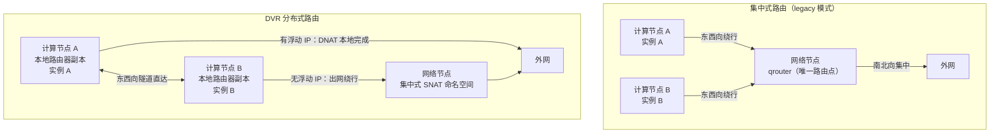
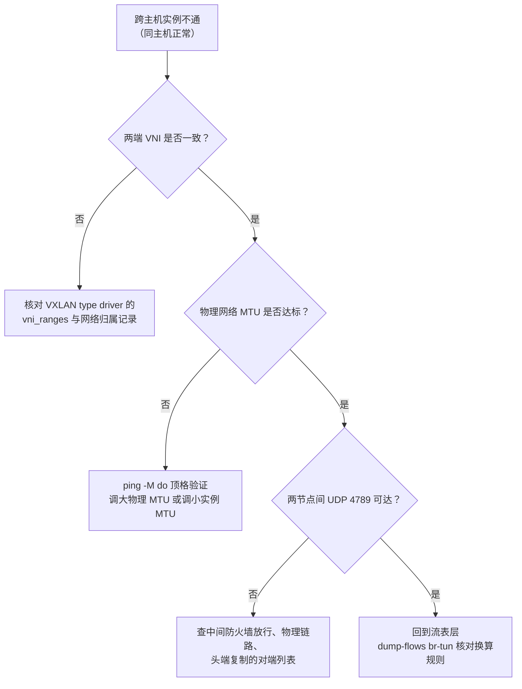

# 07 Neutron 进阶——VXLAN、DVR 与安全组

**摘要：**

上一篇我们拆解了 Neutron 的架构骨架与数据面链路，但有三块硬骨头被刻意留到了现在：租户网络靠什么做到成千上万个互不干扰（VXLAN 的封装原理与 br-tun 的流表换算）、路由为什么从网络节点搬到了计算节点（从集中式路由到 DVR 的演进及代价）、以及安全组到底在包路径的哪一层执法（iptables 注入位置、与 FWaaS 的分工、连接跟踪的语义）。本文按"问题 → 原理 → Neutron 的实现 → 运维权衡"的顺序逐个击破，最后补上 QoS 带宽管理与一套跨主机不通的排查路径，并简述 OVN 对这套经典布局的替代前景。读完你应当能回答两个问题：VXLAN 用 50 字节的外层开销买来了什么、又埋下了什么坑，以及 DVR 把路由分布式化之后，运维的账本上多了哪些新的科目。

---

## 第 1 章 多租户网络的核心矛盾——隔离的两种尺度

### 1.1 一个看似无害的需求：两租户都用 192.168.1.0/24

先从一个最平凡的场景说起。租户 A 与租户 B 互不相识，各自在自己的办公室里用 192.168.1.0/24 组网，如今他们的业务整体搬上公有云，都希望云上的网络与原来的规划一致——网段不变，迁移脚本不用改，网关地址不用改。这个需求在租户看来天经地义，在云平台的设计者眼里却是一记重拳：**IP 地址必须允许重叠，而重叠的 IP 不能在同一个二层里相遇**。

> [!note] 为什么"地址重叠"是公有云的试金石
> 私有地址空间（RFC 1918，1996 年）本来就是设计给"各自为政"的——每家企业内部随便用，反正不出门。但云平台把成千上万个"各自为政"的网络搬进了同一个物理机房，重叠从"各家的私事"变成了"平台的公共问题"。能不能优雅地容纳重叠地址，是区分"机房托管"与"公有云"的分水岭——前者卖的是机柜与带宽，后者卖的是被虚拟化、被隔离、可自助服务的网络。

上一篇讲 nova-network 时已经点过这个问题：扁平网络模型里 IP 是全局资源，两个租户的 192.168.1.10 在一张共享的二层网里就是同一个地址，ARP 一广播立刻串台。解法在概念上只有一条路——给每个租户的流量打上一个"所属权"标记，让物理网络根据标记把不同租户的流量隔离开，即使它们跑在同一批网卡、同一批交换机上。这个思路在业界有个统一的名字：**网络叠加（Overlay Network）**——在一张物理网络之上，用封装技术虚拟出多张彼此不可见的逻辑网络。

不妨用一个生活化的比喻来锚定这个概念：物理网络是小区的市政道路，叠加网络是每家快递公司自己的物流体系——顺丰、京东、菜鸟的货车都跑在同一条马路上，但每家的包裹只进自家的分拨中心，谁也收不到别家的货。封装技术就是包裹外面的快递面单：面单上写着承运方（隧道协议）与分拨中心编号（网络标识），中间的马路对此一无所知。

### 1.2 VLAN 的 4096 天花板

给流量打标记这件事，网络行业早在上世纪九十年代就有标准答案——虚拟局域网（Virtual LAN，VLAN）。IEEE 802.1Q 标准（1998 年定稿）在以太网帧头里塞进一个 12 位的 VLAN ID，交换机据此把端口划分进不同的广播域。这个设计在单一企业里工作得很好，但把它放到多租户云平台上，一个算术问题立刻暴露：**12 位只有 4096 个取值，扣除保留的 0 与 4095，实际可用 4094 个**。

4094 对一家公司是绰绰有余，对一朵公有云是杯水车薪。租户数量过千时，每个租户哪怕只分一张网络，VLAN ID 池就已见底；更麻烦的是 VLAN ID 的分配还要与所有物理交换机的端口配置联动——每开一张网络，运维（或自动化脚本）都要在沿途交换机上放行对应的 VLAN，规模一大，这套手工联动就成了变更事故的高发区。此外，交换机的 MAC 地址表与泛洪行为在多租户场景下也会互相干扰：所有租户的 MAC 混在交换机的同一张表里，一个租户的广播泛洪会惊扰所有租户的接入端口。

| 维度 | VLAN（802.1Q） | 叠加网络（VXLAN 等） |
| :--- | :--- | :--- |
| 标识空间 | 12 位，4094 个可用 | 24 位，约 1677 万个 |
| 配置联动 | 需要物理交换机逐跳放行 | 物理网络只看隧道端点 IP，无逐跳配置 |
| 隔离边界 | 依赖交换机端口划分 | 封装在报文内部，端到端携带 |
| 广播泛洪 | 在物理交换机上扩散 | 被限制在隧道覆盖范围内 |
| 适用规模 | 单企业、数百网段 | 多租户、数万网段 |

这张表的结论很直白：**VLAN 不是被 VXLAN 在技术上打败的，而是在规模上被多租户的需求撑爆的**。云平台需要的是一个标识空间以百万计、且不需要物理交换机配合的标记方案，这就是叠加网络登场的全部理由。

### 1.3 候选者与胜出者：GRE、VXLAN 与 Geneve

叠加网络的具体技术不止一种。Neutron 支持的隧道类型里，GRE（通用路由封装）出现最早，ML2 的 type driver 至今保留着 gre 类型；VXLAN 随后成为事实上的主流选择；更新的 Geneve（通用网络虚拟化封装，通用网络虚拟化封装协议）则在 OVN 体系里担任主角。三者的核心思想完全一致——外层封装 + 网络标识——差异在细节：GRE 没有标准化的网络标识字段（Neutron 用 key 字段模拟），VXLAN 用 24 位 VNI 与 UDP 封装（对五元组哈希分片友好），Geneve 则在 VXLAN 基础上扩展了可变长的选项区，给元数据传递留了余地。

VXLAN 之所以胜出，除了技术参数，还有一个容易被低估的因素：**它是先有厂商联盟、后有标准的**。Cisco 与 VMware 等厂商在 2011 年前后联合推动草案，IETF 在 2014 年 8 月发布 RFC 7348 定稿——主流交换机、网卡与虚拟化平台早已跟进实现，生态成熟度反过来巩固了技术地位。Neutron 默认推荐 VXLAN，既是技术判断，也是生态判断。不过要留一句余地：GRE 在老旧的物理网络环境里仍有存量，Geneve 则随着 OVN 的普及在上升通道中，第 7 章会再回到这个话题。

三种封装技术的横向对比放在这里，供选型时对照：

| 维度 | GRE | VXLAN | Geneve |
| :--- | :--- | :--- | :--- |
| 封装层 | IP（协议号 47） | UDP（端口 4789） | UDP（端口 6081） |
| 网络标识 | 无标准字段（Neutron 用 key 模拟） | 24 位 VNI | 24 位 VNI + 可变长选项区 |
| 哈希分片友好度 | 差（无端口字段，ECMP 哈希熵不足） | 好（UDP 端口参与哈希） | 好 |
| 元数据扩展 | 无 | 无 | 选项区可携带自定义 TLV |
| 生态现状 | 存量为主 | 生产主流 | OVN 体系的默认选择 |

这张表里"哈希分片友好度"一行值得多说一句：现代数据中心的上联链路普遍做等价多路径（ECMP），哈希算法依据报文头部的字段（源目的 IP、端口）分流——GRE 封装没有端口字段，同一对隧道端点之间的所有流量哈希后挤进同一条链路，带宽利用率打折；VXLAN 与 Geneve 借 UDP 端口获得了更均匀的分流。**性能往往不体现在单包开销，而体现在这些系统级的细节里**。

### 1.4 不这样会怎样——反事实推演

不妨做个反事实推演：假如没有叠加网络，多租户云平台会退化成什么样子？其一，租户隔离只能靠 VLAN，租户数量被 4094 的算术硬顶死，公有云的商业模式在千级租户处撞墙；其二，地址规划退化为全局分配——运维要为每个租户的每个网段手工划地址、在沿途交换机放行 VLAN，"租户自助建网"的 API 体验无从谈起；其三，物理交换机的 MAC 表与泛洪压力随租户数线性增长，网络设备的规格成为整个平台的天花板。这三条任何一条单独成立，都足以论证叠加网络的必要性。

但叠加网络本身也引入了新的账单：封装开销（第 2 章的 50 字节）、排障的层次加深（物理网络看到的不再是租户的真实拓扑）、以及控制面与数据面之间新的信息同步问题（第 3 章的 L2 population 正是为补这个洞而生）。**隔离能力的跃升，是用链路变长与层次变多换来的**——这笔交易的完整账单，会在后面三章里逐项展开。

---

## 第 2 章 VXLAN 原理——50 字节买来的千万级隔离

### 2.1 报文封装：给以太帧套上三层壳

VXLAN（Virtual eXtensible LAN，虚拟可扩展局域网）的全部魔法，就是往原始以太帧外面套了一层壳。实例发出的帧在离开宿主机之前，会被依次包上三段头部，先看图：


从外往里读：最外层是普通的以太网帧头，负责在物理链路上传输；其上是外层 IP 头，源与目的分别是两台宿主机上隧道端点的物理 IP——**物理网络看到的只是两台主机之间的普通 UDP 流量，对里面装着什么一无所知**；再上是 UDP 头，目的端口固定为 4789（IANA 为 VXLAN 保留的官方端口，早期实现常用 8472，读老文档时留意）；然后是 8 字节的 VXLAN 头，其中最要紧的是 24 位的网络标识（VXLAN Network Identifier，VNI）；最后才是被完整封装的原始以太帧。

这个结构里有一个精妙的分工值得你停下来体会：**VNI 是全局身份，外层 IP 是运输地址**。租户网络的隔离信息（VNI）被端到端地携带在报文里，任何一台中间设备都不需要理解它；而报文在物理网络里的寻径完全依赖外层 IP，沿途交换机与路由器按普通的 IP/UDP 流量处理即可。这就是 1.2 节说的"不需要物理交换机配合"的技术落点——部署 VXLAN 时，物理网络唯一的配置要求是隧道端点之间 IP 可达，仅此而已。

### 2.2 VNI：24 位的自由

24 位 VNI 提供约 1677 万个取值，与 VLAN 的 4094 相比是四个数量级的跃升。但标识空间变大只是必要条件，真正让多租户成立的是**分配机制**：VNI 由控制面统一分配与回收，保证同一时刻全局唯一。上一篇讲 ML2 时埋过伏笔——VXLAN 的 type driver 维护着一个 VNI 号段池（由 `vni_ranges` 配置），创建网络时取号、删除网络时归还。号段配置错误（譬如两套环境配了重叠的 VNI 段又通过隧道互通）不会在任何 API 层面报错，只会在数据面上表现为两个不相干的网络互相收到对方的广播——这类问题的隐蔽性，第 7 章排查路径里还会再遇到它。

分配机制里还藏着一个容量规划的细节：VNI 是"网络"粒度而非"实例"粒度——一个租户可以有多张网络，每张网络占一个 VNI。按每租户平均 3-5 张网络估算，1677 万的标识空间看似取之不尽，但号段配置（`vni_ranges`）通常只划出其中一小段（譬如 1-10000），**耗尽的往往不是协议空间，而是运维划定的号段**。号段使用率监控（第 7 章巡检清单里有它）就是这个原因。

还有一点值得澄清：VNI 的隔离是**二层隔离**，两个 VNI 之间没有路由、没有转发、互相不可见，除非有人在上面显式架设三层网关（虚拟路由器）。这与 VLAN 的语义一致——VXLAN 本质上是"用隧道技术重新发明了一遍 VLAN，顺便把标识空间扩大了一万倍"，它并不解决跨网段通信的问题，那是第 4 章路由的主题。

### 2.3 VTEP：隧道两端的装卸工

封装与解封装的动作需要一个执行者，这就是隧道端点（VXLAN Tunnel Endpoint，VTEP）。VTEP 的角色像是国际港口的装卸工：货物（租户报文）从内陆（虚拟机）运抵港口时，装箱（封装）、贴单（打 VNI）、装船（发往物理网络）；到岸的对端港口做反向操作。**VTEP 必须同时看得见两个世界**——内侧连着本地虚拟网络（br-int 上的本地 VLAN），外侧连着物理网络（隧道 IP），这个"一脚在里、一脚在外"的位置决定了它是整个 VXLAN 体系里最关键的组件。

VTEP 可以是软件的，也可以是硬件的。宿主机上的 OVS 就是典型的软件 VTEP（br-tun 网桥承担封装）；支持 VXLAN 卸载的物理交换机与智能网卡则是硬件 VTEP，能在交换芯片或网卡层面完成封装，把 CPU 从加解封的开销里解放出来。Neutron 的经典部署用的是软件 VTEP，性能话题（譬如硬件卸载与 DPDK 加速）超出本篇范围，但你要知道这条路线存在——它是后面谈 OVN 与智能网卡演进时的伏笔。

软件 VTEP 的开销也要有个量级概念：每个跨节点包多一次封装与一次解封装，各是一次内存拷贝加若干头部填写的量级，普通虚拟化场景下占比不大，但在高 PPS（每秒包数）负载（譬如小包密集的 RPC 调用）里，加解封的 CPU 占用会挤占虚拟机可用的计算资源。这也是为什么性能敏感的部署会走向两条岔路：要么用硬件卸载把封装下沉到网卡（配合 SR-IOV 或 OVS 硬件卸载），要么干脆改用不需要封装的 VLAN provider 网络。**封装是灵活性的价格，性能敏感者要么用硬件把价格付得更便宜，要么退回不需要灵活性的方案**——没有第三条免费的路。

### 2.4 MTU：50 字节外层开销的连锁反应

现在算一笔开销账。VXLAN 封装在原始帧外增加的头部长度是：外层以太网头 14 字节 + 外层 IP 头 20 字节 + UDP 头 8 字节 + VXLAN 头 8 字节，合计 **50 字节**。这 50 字节是隧道网络里一切 MTU 问题的总根源，值得把因果链完整推演一遍。

实例侧的接口 MTU 默认是 1500，实例发出的满尺寸帧到达 VTEP 后被套上 50 字节的壳，变成 1550 字节——如果物理网络的 MTU 还是 1500，这个包就超标了。超标包的命运取决于路径上的设备：要么被静默丢弃（表现为大流量传输莫名卡死），要么被强制分片（性能劣化且增加对端重组负担）。上一篇 6.5 节给出过症状画像：**小包一切正常，大包（文件传输、镜像拉取、TLS 大证书交换）卡死**，ping 得通让排障者坚信网络无恙，于是问题被错误地归咎于应用层。

根治方案有两条路线，方向相反但目的一致：

| 路线 | 做法 | 要点 |
| :--- | :--- | :--- |
| 物理网络调大 | 物理 MTU 升到 9000（巨型帧，Jumbo Frame），隧道接口继承，实例保持 1500 | 性能最优（封装开销被大帧摊薄），但要求全链路设备都支持 |
| 实例侧调小 | 物理 MTU 保持 1500，实例 MTU 降为 1450 | 不动物理网络，但牺牲 50 字节有效载荷，且要确保实例侧真的生效 |

Neutron 在这条链路上做了自动化：计算节点的物理接口 MTU 配置好后，L2 agent 会把扣除封装开销后的 MTU（1500 − 50 = 1450）通过 DHCP 选项下发给实例。但自动化覆盖不了所有角落——镜像里写死的 MTU、云初始化工具的覆盖、中间防火墙的透明分片处理，都可能让 1450 的约定在某一段链路上失效。验证手段上一篇给过：从实例内用 `ping -M do -s 1450 <对端>`（禁止分片、顶格包长）做端到端检验，通则 MTU 无恙。**把这条命令写进新环境交付的验收清单，是笔者见过的性价比最高的预防措施**。

> [!info] 一句话记住 VXLAN 的账本
> VXLAN 用每个包 50 字节的封装开销与一次加解封的 CPU 开销，换来了 1677 万的网络标识空间与零物理交换机配置的部署模型。这笔交易在多租户场景下稳赚，在单租户大流量的场景（譬如 HPC、存储后端）则未必——先算清你的租户数量，再决定要不要为隔离付这笔税。

### 2.5 一次跨节点通信的完整走线

把本章的机制串成一条完整的线。计算节点 A 上的实例（192.168.1.10，VNI 1000）要访问计算节点 B 上的实例（192.168.1.20），全程如下：

1. 实例先发 ARP 广播："谁是 192.168.1.20？"——若 L2 population 已同步映射，节点 A 的 br-tun 直接代答；否则走头端复制，广播被封装后发往同网络的所有对端 VTEP。
2. 拿到 MAC 后，实例发出目标为 192.168.1.20 的以太帧，经 qbr、br-int，被打上节点 A 的本地 VLAN tag（譬如 42）。
3. br-tun 查流表：剥掉本地 tag，封装 VXLAN（VNI 1000），外层 IP 从 10.0.0.1（节点 A 的 VTEP）发往 10.0.0.2（节点 B 的 VTEP），UDP 目的端口 4789。
4. 物理网络按普通 IP/UDP 流量转发，沿途设备对 VNI 一无所知。
5. 节点 B 的 br-tun 解封装，核对 VNI 1000 对应本地的哪个 VLAN（譬如 51），打上 tag 送进 br-int，再送到目标 tap。
6. 实例 B 收到的是与实例 A 发出时**一模一样的原始以太帧**——封装的痕迹在解封装时被完全抹去。

第 6 步值得你停下来体会：**隧道技术给两端虚拟机的承诺，是"中间的物理世界不存在"**——帧原样进、原样出，TTL 不变、MAC 不变，仿佛两台机器插在同一台交换机上。整个云计算的虚拟化叙事，从计算（虚拟机）到存储（卷）到网络（隧道），讲的都是同一个故事：用一层精确的翻译，让底下的物理世界对上层透明。

---

## 第 3 章 Neutron 的 VXLAN 实现——br-tun 流表与泛洪治理

### 3.1 br-tun 的流表：一张双向翻译表

原理讲完，回到 Neutron 的落地。上一篇 4.3 节已经介绍过 br-tun 的定位（隧道网桥）与本地 VLAN 的概念，本节把换算机制说透。回忆那个关键设定：**同一个租户网络在不同节点上的本地 VLAN ID 可以完全不同，但共享同一个 VNI**。br-tun 的流表就是维系这个设定的翻译机构，出向与入向各翻译一次：

- **出向**（br-int → 隧道）：来自本地 VLAN 42 的包，剥掉本地 tag，封装 VNI 1000，从隧道端口发往对端 VTEP。
- **入向**（隧道 → br-int）：收到 VNI 1000 的封装包，解封装，打上**本节点**的本地 VLAN tag（可能是 51，不必与 42 相同），送往 br-int。

用上一篇 5.5 节的流表阅读法看一条真实的规则（意译）：`priority=1,dl_vlan=42 actions=strip_vlan,set_tunnel:0x3e8,output:2`——本地 VLAN 42 的包，剥 tag、封 VNI 1000（十六进制 0x3e8）、从 2 号端口发出。整张 br-tun 流表，本质上就是"本地 VLAN ↔ VNI"的双向翻译表加上一张 VTEP 对端地址表。排查跨主机不通时，`ovs-ofctl dump-flows br-tun` 里找不到自己那个本地 VLAN 的翻译规则，就是实锤断点——这与上一篇分层排查法的第三层完全对应。

### 3.2 泛洪问题：广播在隧道世界里的传播

单播有目标地址，封装时查表即可；真正的麻烦是**广播与组播**（统称泛洪流量，BUM 流量：Broadcast、Unknown unicast、Multicast）。实例发出一个 ARP 请求（"谁是 192.168.1.20？"），这个广播在二层语义上必须到达同网络的所有端口——但 VTEP 怎么知道"所有对端 VTEP"是谁？

理论上有两种答案。其一是**组播复制**：所有 VTEP 加入一个组播组，广播包发往组播地址，物理网络的三层组播协议（譬如 PIM）负责复制分发。这个方案把复制压力交给了物理网络，但要求物理网络端到端开启组播路由——这在很多企业数据中心是可望不可即的前提。其二是**头端复制（head-end replication）**：每个 VTEP 自己维护同网络所有对端 VTEP 的列表，收到广播包后逐个复制、逐个单播发送。Neutron 的 OVS agent 默认采用头端复制——它对物理网络零要求（只要 IP 可达），代价是 VTEP 的 CPU 要承担复制开销，且对端列表的准确性完全依赖控制面的信息同步。

> [!warning] 头端复制的隐含依赖
> 头端复制的对端列表来自 L2 agent 之间通过消息队列同步的信息。如果某个计算节点的 agent 心跳停滞，其他节点的对端列表里它的信息就会陈旧甚至缺失——表现为"新节点上的实例收不到广播，DHCP 拿不到 IP，而存量流量一切正常"。这与上一篇 2.6 节"agent 挂掉的症状延迟爆发"是同一个模式：**广播类流量是 agent 健康状况最灵敏的显影剂**。

### 3.3 L2 population：用控制面信息消灭无谓泛洪

头端复制解决了"广播能到"，但没有解决"广播该不该到"。ARP 请求这种广播，99% 的场景只需要到达**目标所在的那一台节点**，逐个复制到所有 VTEP 是纯粹的浪费——租户网络越大（VTEP 越多），浪费按节点数线性放大。L2 population agent 就是为此而生的优化组件：它不参与转发，只做一件事——**把"哪个 MAC/IP 在哪个节点"的映射关系，通过消息队列广播给所有相关 agent**，让每个节点的 br-tun 预先填好两类表：

1. **FDB 表项**（转发数据库）：目的 MAC 对应的对端 VTEP IP，未知单播因此可以直接定向封装，不再泛洪；
2. **ARP 应答流表**：本节点的 br-tun 直接代答常见 ARP 请求（流表里查到"IP 192.168.1.20 在 VTEP 10.0.0.5"，就地回复），ARP 广播在源头就被拦截。

效果是显著的：配置了 L2 population 的环境里，绝大多数 ARP 与未知单播不再离开源节点，隧道里的泛洪流量下降一个数量级。这个组件的设计思路值得单独品味——**它没有优化"怎么把广播传得更快"，而是用控制面的先验知识让广播根本不必发生**。这与 CDN 用预取消灭回源请求、数据库用索引消灭全表扫描，是同一种工程哲学：最好的优化是让那件事不用做。

> [!info] 泛洪治理的三层境界
> 头端复制是第一层——广播照发，只是改成单播复制，物理网络零要求；L2 population 是第二层——用控制面信息把广播收敛到必要的对端；OVN 的逻辑拓扑是第三层——广播在逻辑层面就被表达为"发给谁"的精确语义，泛洪在模型里就不存在。三层的演进再次说明：**对广播的治理水平，是网络虚拟化架构成熟度的标尺**。

不过它也引入了新的依赖：映射信息的准确性成了新的故障面。若 L2 population 的通知丢失或滞后，节点的 ARP 代答表就会给出陈旧答案——实例迁移后 ARP 表未更新的经典症状是"迁移后不通，ping 一下网关（触发 ARP 重新解析）又通了"。排障时把这条也纳入检查清单，能少走弯路。

### 3.4 混合部署：VXLAN 与 VLAN 在同一朵云里

最后补一块生产环境常见的拼图：**隧道网络与 VLAN 网络并存**。ML2 的 type driver 支持多种类型同时启用（`tenant_network_types = vxlan, vlan` 表示租户网络优先用 VXLAN，VXLAN 号段耗尽时回落到 VLAN），典型组合是"租户网络走 VXLAN 隧道 + 对外网络走 VLAN/flat"——前者解决多租户隔离，后者对接物理网络与外部网关。上一篇讲的 br-ex 与外部网络，在这一章的语境下就是"不经隧道、直接以物理 VLAN 出网"的那条腿。

混合部署的运维要点是**两套标识空间的边界要清晰**：VNI 号段归 VXLAN type driver 管，VLAN 号段归 VLAN type driver 且与物理交换机的放行清单联动，两者互不干涉但可能在 provider 网络的属性上交汇（一张 provider VLAN 网络的 segmentation_id 就是物理 VLAN ID，它直接透传到交换机，没有封装）。排障时先问一句"这张网络是隧道类型还是 VLAN 类型"，能直接决定后面查流表还是查交换机——类型判断是网络排障的第一刀，这一刀切对了，后面每一步都在正确的路上。

---

## 第 4 章 路由的演进——从集中式到 DVR

### 4.1 集中式路由：简单时代的合理选择

VXLAN 解决了二层隔离，跨子网的三层通信还需要路由器。Neutron 早期（以及今天仍可选的 legacy 模式）的答案是**集中式路由**：每台虚拟路由器是一个 qrouter 命名空间，全部驻留在网络节点上，由 L3 agent 管理。所有跨子网的流量——不管两个实例相距一米还是横跨机房——都要先绕到网络节点，路由决策完成后再离开。

这个设计在规模小的年代是合理的：路由逻辑集中在一处，NAT 规则、路由表、浮动 IP 全都好排查，网络节点一台机器说清楚一切。但它的两个结构性缺陷随规模放大：

- **东西向流量绕行**：同一台计算节点上两个不同子网的实例互访，理论上一个内核路由跳转就能完成，集中式架构下却要绕行网络节点一来一回——带宽占用翻倍、延迟翻倍，网络节点的网卡成为整个集群的东西向瓶颈。
- **南北向单点**：所有租户的南北向流量（浮动 IP 的 DNAT、出网的 SNAT）全部挤过网络节点，这台机器的带宽与 CPU 决定了全平台的南北向吞吐上限，它的故障半径也是全平台的。

不妨想象一座城市只有一家邮局：所有信件——哪怕收寄双方住在同一栋楼——都要先送到邮局分拣再送回来。楼内互寄的效率、邮局的吞吐、邮局着火的影响面，三个问题同源。**DVR（Distributed Virtual Router，分布式虚拟路由）就是"每个街区自设分拣点"的改革**。

### 4.2 两种架构的对比

先上图，把两种架构的流量路径差异一次看清：



| 维度 | 集中式路由 | DVR |
| :--- | :--- | :--- |
| 东西向路径 | 绕行网络节点 | 计算节点本地路由（跨节点走隧道直达） |
| 南北向入向（DNAT） | 网络节点集中处理 | 计算节点本地完成 |
| 南北向出向（SNAT） | 网络节点集中处理 | 默认仍集中（集中式 SNAT 命名空间） |
| 网络节点压力 | 全部南北向 + 全部东西向 | 仅集中式 SNAT，压力大幅下降 |
| 排障复杂度 | 一个命名空间看全 | 每台计算节点各有一份路由状态 |
| 引入版本 | 初始设计 | Juno（2014）引入，Kilo（2015）走向成熟 |

### 4.3 DVR 的原理：把路由器复印到每台计算节点

DVR 的实现思路不是"分布式路由协议"，而朴素得多——**把虚拟路由器的功能拆解后，复印到每一台相关的计算节点上**。启用 DVR 后，每台计算节点上会多出一个形如 `qrtr-<router-id>` 的命名空间（qrouter 的分布式变体），里面装着该路由器在本地相关的接口、路由表与 NAT 规则。路由决策因此可以在包的源头就地完成。

东西向流量的变化最彻底。不同子网的两个实例跨节点互访时，源节点的本地路由器直接做路由决策，然后通过隧道把包送往目的节点——注意，**隧道里跑的不再是"原始二层帧"，而是已经过三层路由、TTL 已减一的包**，目的节点收到后直接送进目标子网。同节点的跨子网互访则完全不出网卡，一次内核路由完成。集中式架构下"东西向必须进网络节点"的枷锁被整个卸掉。

南北向的处理则体现了 DVR 设计者的克制——**入向与出向没有一刀切**：

- **入向 DNAT 分布式**：外部访问浮动 IP 时，包到达目的实例所在的计算节点，由本地路由器副本完成 DNAT 后送入实例。每台计算节点只处理属于自己的入向流量，天然分散。
- **出向 SNAT 保留集中**：没有浮动 IP 的实例主动出网时，仍要绕行网络节点上的**集中式 SNAT 命名空间**（centralized SNAT）。为什么不下放？因为 SNAT 需要一个**全局唯一且稳定的公网出口 IP**——如果每台计算节点各自 SNAT，同一个实例的出网源 IP 会随节点漂移，会话保持、对端白名单、审计日志全部失效。集中式 SNAT 用一个固定出口换回了地址语义的稳定性，这是典型的**用性能换正确性**的取舍。

用一个具体场景把两条路径走完。实例 A（有浮动 IP）对外提供 Web 服务：外部用户的请求到达计算节点，本地路由器副本把目的地址从浮动 IP 改写为固定 IP，回包在同一个节点完成反向改写——全程不经过网络节点。实例 B（无浮动 IP）要访问外部软件源：包从计算节点出发，经隧道抵达网络节点的集中式 SNAT 命名空间，源地址被改写为外部网络的网关地址后出网，回包按连接跟踪表原路送回。同一个路由器对象，两条路径在物理拓扑上分道扬镳，在租户视角却毫无区别——**分布式系统的透明性，就是让用户感觉不到你做的权衡**。

后续版本（Newton，2016）提供了把 SNAT 也下放的选项（dvr_snat 模式，计算节点分担 SNAT 并借助 BGP 等机制公告路由），但生产采用率一般——多数环境的出网流量占比有限，集中式 SNAT 的瓶颈远不如当年的全集中路由尖锐，而它带来的地址规划复杂度却是实打实的。

### 4.4 DVR 的代价：运维账本上的新科目

DVR 不是免费的午餐，它的代价全部记在运维账本上，逐项过一遍：

- **状态副本的膨胀**：每台计算节点上都有一份路由器副本，路由表、NAT 规则、连接跟踪表全部多副本存在。排查问题时，"看 qrouter"这一步变成了"看实例所在节点的 qrtr"——排障的起点从一台机器变成了 N 台。
- **配置下发的收敛时间**：路由器配置变更（加接口、改网关）要同步到所有相关计算节点，变更生效时间从集中式的"秒级"变成"与最慢节点相关"。变更后立刻验证可能看到新旧规则并存的中间态。
- **组件间的一致性依赖**：DVR 依赖 L2 population 的地址同步（3.3 节）、依赖计算节点与网络节点的隧道互通、依赖 L3 agent 在计算节点上的部署（dvr 类型的 L3 agent 同时跑在计算节点上）。任何一环掉链子，症状都是"部分流量通、部分不通"，比集中式的整体故障更难一眼定位。
- **版本演进的兼容包袱**：DVR 与 HA router（高可用路由器）的组合、与安全组/OVS 防火墙驱动的组合，在各个版本里有不同的成熟度，升级前要对照版本说明逐一核对。

这四条账单的共同点是：**它们都不出现在功能演示里，只在生产运行的第 N 个月现身**。评估 DVR 时拿一份"功能清单"打勾是看不出差别的，差别全在故障演练与变更演练里——这也是笔者建议任何分布式化改造（不止 DVR）都先做一次"故意拔线"的原因。

| 取舍维度 | 倾向集中式 | 倾向 DVR |
| :--- | :--- | :--- |
| 集群规模 | 小规模、网络节点压力可控 | 数十节点以上、东西向流量大 |
| 排障团队 | 熟悉单点排查、经验有限 | 具备分布式排障能力与自动化巡检 |
| 南北向占比 | 出网流量大且集中 | 东西向为主、南北向分散 |
| 版本状态 | 老版本或特殊后端 | Kilo（2015）之后的稳定版本 |

> [!warning] 启用 DVR 前的三个前置检查
> 其一，确认所有计算节点的 L3 agent 已按 dvr 模式部署且心跳正常——DVR 的路由副本由它们承载，缺一台节点就缺一块路由能力；其二，确认 L2 population 已启用——DVR 的东西向直达依赖节点间地址信息的同步，没有它，跨子网直达路由会退化为泛洪；其三，确认物理网络的 MTU 规划覆盖了计算节点之间的隧道（DVR 让隧道流量从"南北向为主"变成"东西向为主"，MTU 问题的影响面随之扩大）。三项任一不满足，先补课再切换，否则切换当天就是故障日。

由此可见，DVR 与集中式之间没有高下之分，只有与规模和团队能力的匹配问题。**架构演进的真实路径往往不是"新方案取代旧方案"，而是"旧方案退守到它仍然合理的那个角落"**——集中式路由至今没有被删除，就是这个道理。

### 4.5 与 HA router 的关系：高可用的另一条战线

DVR 解决的是"性能与瓶颈"，但它不解决"可用性"——路由器副本所在的计算节点宕机，该节点上实例的路由能力随之消失（虽然实例本身也不在了，影响面有限）。集中式路由时代配套的高可用方案是 **HA router（高可用路由器）**：网络节点上跑多个 L3 agent，同一台虚拟路由器以 VRRP（虚拟路由冗余协议）的形式在多个网络节点上各有一个副本，keepalived 选主，主节点故障时备节点接管虚拟 IP。HA 与 DVR 是两条独立的战线——前者保"路由器进程别成为单点"，后者保"流量别都挤一个点"，两者可以组合（DVR 环境里集中式 SNAT 部分仍可用 HA router 保护），但组合后的状态副本与故障模式也更复杂。运维在选型时不妨先问清自己的痛点是吞吐还是可用性，再决定引入哪一件武器——两件都上而团队经验不足，排障时的状态组合是指数级的。

---

## 第 5 章 安全组与防火墙——包路径上的执法岗亭

### 5.1 规则注入的位置：为什么是 qbr 而不是 OVS

上一篇 3.4 节埋过这个伏笔：安全组（Security Group）的 iptables 规则不落在 OVS 网桥上，而是落在 tap 与 br-int 之间的 Linux bridge（qbr）上。这里把原因说透。OVS 的数据面走的是自己的内核模块，包在网桥内的转发**绕过了内核 netfilter 的桥接钩子**——iptables 的规则在 OVS 网桥上根本不生效。而 Linux bridge 走的是内核协议栈的标准路径，iptables 的过滤链（INPUT/OUTPUT/FORWARD）在它上面完整生效。于是 Neutron 的经典方案是在链路里插入 qbr，让每个进出实例的包都过一遍 iptables 检查——**qbr 不是转发优化，是给安全组修的执法岗亭**。

规则的具体形态也值得看一眼。每个实例的每个端口，会在 qbr 对应的链上得到一组规则：入口链按安全组的白名单放行（譬如 `-p tcp --dport 22 -s 10.0.0.0/8 -j ACCEPT`），出口链默认全放行；配合连接跟踪（下一节展开）放行已建立连接的回包。简化后的规则骨架长这样：

```bash
# 意译：实例端口在 qbr 上的过滤链骨架（sg-chain）
# 入向：先过 sga（安全组入向链），不匹配白名单的回落到 DROP
-A sg-chain -m conntrack --ctstate ESTABLISHED,RELATED -j ACCEPT
-A sg-chain -p tcp -s 10.0.0.0/8 --dport 22 -j ACCEPT
-A sg-chain -j DROP
# 出向：默认放行，仅防欺骗规则在更底层拦截伪造流量
```

安全组规则是**每端口独立展开**的——一个 port 挂了三个安全组，三个安全组的所有规则都会在这个端口的链上实例化一份。这个设计的推论是：**集群里的 iptables 规则总数与"端口数 × 安全组规则数"成正比**，租户滥用宽泛的安全组（成百上千条规则）时，规则膨胀会拖慢每个包的过滤路径，也会拖慢 agent 的规则下发。治理安全组规则的数量，不只是安全治理，也是性能治理。

### 5.2 防火墙驱动的换代：iptables 与 OVS 流表

近年来这条链路发生了一次重要换代。OVS 防火墙驱动（openvswitch firewall driver）成熟后，安全组规则可以直接翻译成 OVS 流表——利用 OVS 对内核连接跟踪（conntrack）模块的调用能力，流表里可以写"新建连接按白名单判断、已建立连接直接放行"的有状态逻辑。qbr 整个消失，链路缩短为 tap → br-int，性能与规则下发效率都受益。新版本（Wallaby，2021）已将其设为默认。

但换代也有它的账：iptables 规则是人读得懂的文本，`iptables -L` 一目了然；OVS 流表的有状态逻辑则要结合 conntrack 的区域（zone）概念去读，排障的直观性明显下降。两种驱动至今都支持，选型的天平依旧是那句话——**更在乎性能，还是更在乎排障的直观性**。切换驱动是一次全量规则重下发，生产操作要安排在维护窗口。两种实现的差异收拢成一张表：

| 维度 | iptables 驱动（hybrid） | OVS 防火墙驱动 |
| :--- | :--- | :--- |
| 规则载体 | qbr 上的 iptables 链 | br-int 上的 OpenFlow 流表 |
| 链路长度 | tap → qbr → br-int（多两跳） | tap → br-int（直连） |
| 有状态能力 | 内核 conntrack + 状态匹配规则 | 流表 ct 动作调用 conntrack |
| 排障工具 | iptables -L / -S，文本可读 | ovs-ofctl dump-flows，需懂 ct 语义 |
| 规则下发规模 | 每端口一组链，规则数敏感 | 流表聚合，规模适应性更好 |
| 成为默认的版本 | 长期默认 | Wallaby（2021）起 |

### 5.3 安全组与 FWaaS：两把尺子量不同的东西

Neutron 还提供防火墙即服务（Firewall as a Service，FWaaS），新手常把它与安全组混为一谈。两者的区别不在能力强弱，而在**作用对象与语义模型**：

| 维度 | 安全组（Security Group） | 防火墙即服务（FWaaS） |
| :--- | :--- | :--- |
| 作用对象 | 单个 port（实例网卡） | 虚拟路由器（网络边界） |
| 语义模型 | 白名单、有状态、规则无序 | 策略规则集、有序匹配 |
| 典型用途 | 实例级访问控制（放行 22/80/443） | 租户级边界策略（禁止某网段出网） |
| 规则归属 | 租户自助管理 | 偏管理员/网络策略视角 |
| 实现位置 | 计算节点（qbr 或 OVS 流表） | 网络节点路由器命名空间 |

打个比方：安全组是每户家门口的门禁，管"谁能进这户人家"；FWaaS 是小区大门的保安亭，管"什么样的车能进出小区"。两套机制叠加工作，互不替代——实例被安全组拒绝的包，根本到不了路由器；被 FWaaS 拦在边界的包，也轮不到安全组表态。值得一提的是 FWaaS v1 的实现（Grizzly 时代，2013 年前后）把整个防火墙策略做成"全有或全无"的路由器属性，粒度粗、演进缓慢，社区一度将其弃用重写（FWaaS v2 改为策略组与路由器端口关联的模型）。生产选型时先确认版本，再谈能力。

顺带一提两者在租户体验上的分工逻辑：安全组之所以做成"每端口白名单、租户自助"，是因为实例的访问控制权应当握在租户自己手里——你买了服务器，自然有权决定开哪个端口；FWaaS 之所以偏管理员视角，是因为网络边界的策略影响整个租户的所有流量，放给单个实例的所有者去改，风险与影响面都不成比例。**控制权的分配跟着影响面走**，这条原则在安全组与 FWaaS 的分工里体现得干净利落。

### 5.4 安全组排障：规则顺序、连接跟踪与两个经典陷阱

安全组的排障有自己的方法论，核心是理解它的两个语义细节。

**细节一：规则无序，但语义有交集。** 安全组规则没有优先级（这与传统防火墙的"从上到下首条命中"完全不同），所有规则是并列的白名单条目——命中任意一条即放行。这消灭了"规则顺序错误"这类经典故障，但也带来一个新手陷阱：**没有显式的拒绝规则可用**。你想"拒绝某 IP 但放行其他"，在纯白名单模型里做不到（默认策略是拒绝，你只能收窄放行范围）。遇到"为什么安全组不能配 deny"的提问，答案就在模型本身。

**细节二：连接跟踪决定回程。** 安全组是有状态的：出向发起的连接，其回包自动放行，不受入向白名单约束——这靠内核连接跟踪（conntrack）实现，规则里的 `ESTABLISHED,RELATED` 状态匹配就是它的痕迹。由此推出两个经典症状的根因：

- **"能 ping 出不能 ping 进"**：ICMP 的回包依赖 conntrack 正确识别回程关系，某些中间设备改写了包（譬如 NAT 双重叠加）会让 conntrack 认不出回程，入向白名单没放行 ICMP 时就表现为单向通。
- **"改了安全组不生效"**：先确认规则真的下发到了实例所在节点（`iptables -L` 或流表里核对），再确认连接跟踪表里没有陈旧会话（已建立的连接在规则收紧后仍会存活到超时，`conntrack -L` 可查）——**规则是给新连接用的，存量连接不看新规则**，这条认知能解释一大半"改了不生效"的工单。

还有一条容易被忽略的边界：conntrack 表是**每节点全局共享**的内核资源（受 `nf_conntrack_max` 限制），安全组的每条连接都会占一个表项——DVR 让东西向、南北向的 NAT 连接全部落在计算节点本地，conntrack 的表项消耗比集中式时代大得多。表项耗尽时新连接建立失败，症状与安全组拒绝高度相似，但根因在内核参数而非规则配置。第 7 章的巡检清单里给它留了一行。

> [!note] 排障心法：从"全拒绝"开始
> 安全组是白名单模型，排查连通性问题时，最不容易绕进死胡同的方法是：先把临时规则收敛到最小白名单（只放行你正在验证的协议与端口），验证通过后再逐条加回业务规则。反过来从"一大堆规则里找哪条挡了路"，效率低且容易被规则间的隐式交集误导。

### 5.5 port security：安全组之外的另一道闸

与安全组常被混淆的还有一个 port 级开关：**端口安全（port security）**。它管的事比安全组更底层——防欺骗（anti-spoofing）：启用后，端口只允许发出与自身 MAC、自身固定 IP 匹配的流量，实例伪造别人的 MAC 或 IP（ARP 欺骗、IP 冲突攻击）会在这一层被丢弃。安全组管"谁能访问我"，端口安全管"我能不能冒充别人"，一守一攻，互补成对。

这个开关的实用价值在特殊场景：容器跑在虚拟机里（MAC 与 IP 动态变化）、嵌套虚拟化、负载均衡器的透明模式，都会触发防欺骗的误杀，表现为"部分流量莫名丢失且抓包看不到明确的拒绝点"。此时运维的选项是把端口的 `port_security_enabled` 关掉（放弃防欺骗）或用 allowed-address-pairs 显式放行额外的 MAC/IP 对。**先怀疑防欺骗再怀疑安全组**，是这类"玄学丢包"的正确排查顺序——它的规则藏在 OVS 流表的更深处，比 iptables 更不直观，提前知道它的存在能省掉大量盲查。

---

## 第 6 章 QoS 与带宽管理——限速的艺术与边界

### 6.1 QoS 策略模型：把带宽变成可声明的对象

前面几章解决的都是"通不通"，这一章解决"快不快"。多租户环境里带宽是公共资源，一个实例跑满物理网卡（无论是有意压测还是失控的爬虫）都会殃及同节点邻居——**没有带宽管理的云，邻居效应（noisy neighbor）只是时间问题**。Neutron 在 Liberty 版本（2015）引入了服务质量（Quality of Service，QoS）框架，模型与 Neutron 的其他对象一脉相承：管理员定义 QoS 策略（policy），策略里挂规则（rule），再把策略关联到 network 或 port 上。规则主要有两类：

- **带宽限制（bandwidth limit）**：设定速率上限（kbps 或 Mbps），可分方向（入向/出向）配置，这是限速；
- **DSCP 标记（DSCP marking）**：改写 IP 头的差分服务代码点（Differentiated Services Code Point，DSCP）字段，给包打上优先级标签，供上游设备分类调度，这是标记。

| 规则类型 | 语义 | 生效位置 | 依赖 |
| :--- | :--- | :--- | :--- |
| 带宽限制（出向） | 速率上限，整形 | 计算节点 OVS/TC | 仅本节点 |
| 带宽限制（入向） | 速率上限，管制 | 计算节点 OVS/TC | 仅本节点 |
| DSCP 标记 | 优先级标签 | OVS 流表改写 | 物理网络信任并调度 |
| 最小带宽 | 保障下限 | Placement + 硬件 | 调度核算与网卡能力 |

注意这两类规则的本质差异：**限速是强制执行，标记只是贴标签**。DSCP 标记要产生实际效果，路径上的交换机、路由器必须配置了对应的队列调度策略（信任 DSCP 并据此排队）——标签没人认，就只是个好看的数字。这与安全组（自己执法）不同，QoS 的效果是"端到端链条"上的，任何一环不配合，策略就打折。

一个具体的例子把模型走通：管理员创建策略 `policy-web`，挂两条规则——出向限速 500 Mbps、DSCP 标记 EF（加速转发）；再把策略关联到 Web 集群的端口。此后这些实例的出向流量在宿主机上被 HTB 平滑限速，包离开网卡时带着 EF 标记，若上联交换机配置了 EF 的高优先级队列，这些包在物理网络的拥塞时刻就能插队。限速与标记在同一策略里各司其职，前者管自己节点上的公平，后者管跨网络的优先——**一个策略，两段生效域，缺一不可也互不替代**。

### 6.2 OVS 的实现方式：整形与管制的分工

OVS agent 落地这两类规则时，用的是 Linux 流量控制（Traffic Control，TC）体系里的两件不同兵器，它们的语义差异值得说清：

| 规则方向 | 实现机制 | 语义 | 超额流量的命运 |
| :--- | :--- | :--- | :--- |
| 出向（实例发出） | HTB 分层令牌桶（整形，shaping） | 主动调度，平滑地压低发送速率 | 在队列里排队等待 |
| 入向（发往实例） | ingress policing（管制，policing） | 令牌桶判定，超标即丢 | 直接丢弃 |

为什么入向不用整形？因为**入向流量的发送方在别人手里**——包已经从物理网卡进来了，宿主机只能选择接收或丢弃，没有"让对方发慢点"的手段。管制（policing）的丢包式限速会触发 TCP 的拥塞退避，实际效果尚可，但对 UDP 类流量就是硬丢包。DSCP 标记则由 OVS 流表完成——匹配到策略端口的包，流表动作里改写 IP 头的 ToS/DSCP 位段，纯数据面操作，零额外延迟。SR-IOV 直通端口的 QoS 则走另一条路（网卡 VF 的速率限制），因为直通流量根本不经过 OVS，这再次印证了上一篇 3.6 节的结论：**绕过抽象层，就要放弃抽象层的服务**。

落地时的一个细节值得提醒：QoS 策略关联到 network 与关联到 port 的语义不同——关联到 network 时，策略对该网络上的**新建端口**生效（存量端口不会追溯），关联到 port 则立即生效于该端口。批量调整限速时，"改了网络策略为什么有的实例没生效"的工单，答案几乎都在这个新建/存量的分界上。另外，QoS 策略的生效依赖端口的绑定信息（vnic_type、宿主机），SR-IOV 与普通端口的策略要分开定义，一套策略通吃的想法在异构端口环境里行不通。

### 6.3 与物理网络的衔接：瓶颈在链路的最后一公里

QoS 的完整闭环不止于虚拟机所在的节点。实例被限到 100 Mbps，但如果它所在的物理网卡上挤着二十个同样被限 100 Mbps 的实例，物理网卡的 25 Gbps 在超分（oversubscription）场景下仍可能拥塞——**虚拟层的限速管住了每个租户的"上限"，管不住全体租户叠加后的"总量"**。总量治理要靠物理网络的 QoS 衔接：交换机端口的风暴控制、上联链路的 DSCP 队列调度、以及容量规划阶段的带宽超分比设计。

衔接的另一个方向是 DSCP 的信任边界。实例可以自己改写 DSCP（如果安全组与 QoS 策略没有约束），恶意租户可以把自己的包全标成最高优先级去"插队"——所以物理网络的入口交换机通常配置为**不信任入向 DSCP、按策略重打**。运维要清楚这条信任链：Neutron 打的 DSCP 标记在离开计算节点后是否被物理网络采纳，取决于物理侧的信任配置，两边的策略要对得上，标记才有意义。QoS 这件事，虚拟网络只能管好自己那一半，另一半永远在物理网络手里。

### 6.4 最小带宽：从"限上限"到"保下限"

QoS 框架的规则族里还有一类容易被忽略的成员：**最小带宽（minimum bandwidth）**。限速管的是"最多给你多少"，最小带宽管的是"至少给你多少"——后者对 NFV 类负载（譬如虚拟化网络功能、实时音视频）是刚需，它们不怕慢就怕抖。实现上，最小带宽走的是另一条技术路线：Placement 服务把各网卡的可保障带宽作为资源登记（inventory），调度器在放置实例时做资源核算，OVS agent 则配合硬件卸载（网卡本身的 QoS 能力）或 egress 调度去兑现承诺。

这条路线的边界要说清楚：**软件层面的"最小带宽"只能尽力而为，真正的保障必须落在硬件与调度上**——宿主机的网卡是共享介质，两个都被承诺 5 Gbps 的实例挤在一张 25 Gbps 网卡上，软件调度只能缓解、无法担保。这也是 QoS 框架把 Placement 拉进来的原因：把"能不能兑现"的判断前移到调度阶段，而不是事后靠限速器救火。运维评估 NFV 上云时，"最小带宽是否配置了 Placement 核算"应当作为标准检查项——只配了策略没配核算的保障，是纸面上的保障。

---

## 第 7 章 运维视角——排查路径与 OVN 的阴影

### 7.1 跨主机不通的排查路径

把前三章的知识收拢成一套排查动作。症状限定：**同主机实例互通正常，跨主机不通**——这个限定把问题范围压缩到了隧道层，排查按固定的决策链走。为什么敢做这个限定？因为同主机互通已经证明了 tap、qbr、br-int、安全组这条本地链路全部健康，剩下的变量只有三样：两端的封装参数（VNI）、物理网络的传输条件（MTU 与可达性）、以及两端流表的换算规则——**排除法在这里不是偷懒，是精确**。



三个检查点对应三章的知识，展开说：

- **VNI 一致性**（第 2、3 章）：两端 br-tun 流表里同一网络的 VNI 必须相同。不一致的根源几乎都在控制面——号段配置冲突、网络重建后 VNI 变更而缓存未刷新。验证方法是对比两端 `dump-flows br-tun` 里的 `set_tunnel` 值。
- **物理网络 MTU**（第 2.4 节）：VXLAN 场景的高发坑。注意 MTU 问题的症状是"小包通、大包断"，与"完全不通"不同——如果 ping 都不通，MTU 不是第一嫌疑，先查下一层。
- **隧道可达性**（第 3.2 节）：头端复制依赖节点间 UDP 4789 的单播可达，中间防火墙对 UDP 的静默丢弃是常见根因（TCP 放行了不代表 UDP 放行了）。验证方法是在两台节点的隧道 IP 之间跑 `nc -u` 或抓包确认。

把本篇各章的典型症状与嫌疑层面对应起来，排障时可以先对号入座再动手：

| 症状 | 第一嫌疑 | 对应章节 |
| :--- | :--- | :--- |
| 小包通、大包断 | VXLAN 封装的 MTU 开销 | 2.4 |
| 跨节点广播丢失、DHCP 超时 | 头端复制对端列表 / agent 心跳 | 3.2 |
| 迁移后不通、ping 网关后恢复 | L2 population 的 ARP 映射陈旧 | 3.3 |
| 东西向绕行、网络节点带宽打满 | 误用集中式路由 | 4.1 |
| 有浮动 IP 入向通、无浮动 IP 出网断 | 集中式 SNAT 命名空间异常 | 4.3 |
| 改安全组不生效、存量会话未断 | 连接跟踪的语义 | 5.4 |
| 部分流量莫名丢、抓包无拒绝点 | 端口安全的防欺骗误杀 | 5.5 |
| 限速策略对部分实例无效 | 策略关联的新建/存量分界 | 6.2 |

### 7.2 浮动 IP 不通的排查链

另一个高频工单是浮动 IP 不通。有了第 4 章的知识，排查链可以按 NAT 的方向精确展开：

1. **API 层**：`openstack floating ip show` 确认浮动 IP 与端口的关联还在、路由器的外部网关还在（外部网关被删是常见误操作）。
2. **入向 DNAT**：DVR 环境登上实例所在计算节点，在本地路由器副本命名空间里核对 DNAT 规则存在且指向正确的固定 IP；集中式环境则在网络节点的 qrouter 里查。
3. **安全组**：入向白名单是否放行了目标协议（ICMP/TCP 端口），注意 5.4 节的连接跟踪语义——存量连接不看新规则。
4. **出向回程**：实例没有默认路由指向路由器、或子网网关配置错误时，DNAT 后的包能到实例但回包出不去，表现为"单向通"。在实例内 `ip route` 核对默认网关。
5. **外部链路**：路由器外部接口到物理网关的 ARP 是否有应答（上一篇 4.3 节的 br-ex 配置问题在这一层现形）。

第 2 步里"登上实例所在计算节点"这个动作，本身就是 DVR 时代排障习惯的转折点——集中式时代运维的肌肉记忆是"网络问题去网络节点"，DVR 之后这个直觉要改写为"**流量从哪台机器进出，就去哪台机器看**"。老运维切换到 DVR 环境时最常见的低效，就是在网络节点上翻找早已分布到计算节点的 DNAT 规则；反过来，集中式 SNAT 的出网问题又确实还在网络节点上。哪类流量在哪台节点，值得画进团队的排障手册里，而不是留在每个人的脑子里。

这条链的价值在于顺序：**先确认 NAT 规则在正确的节点上存在，再查安全组，最后查物理链路**——与直觉相反，安全组问题往往排在 NAT 之后查，因为 NAT 规则缺失（譬如路由器重建后浮动 IP 关联残留）的频率更高。

### 7.3 日常巡检的增量清单

在第 7 章的语境下，上一篇 6.4 节的巡检清单可以补上本篇新增的几个科目：

| 检查项 | 命令/观测点 | 异常信号 |
| :--- | :--- | :--- |
| VNI 号段使用率 | VXLAN type driver 的号段配置与网络数量 | 号段接近耗尽，新网络创建将失败 |
| 隧道对端列表 | br-tun 流表的 tunnel 端口与 fdb 表 | 对端节点缺失（agent 心跳停滞的连带症状） |
| DVR 副本分布 | 各计算节点的 qrtr 命名空间数量 | 与 router 分配记录不符 |
| 集中式 SNAT 压力 | 网络节点 SNAT 命名空间的网卡流量 | 出网流量逼近链路上限 |
| 安全组规则规模 | 数据库统计端口数 × 规则数 | 单节点 iptables/流表规则总量异常膨胀 |
| conntrack 表水位 | 节点 `conntrack -C` 计数 | 逼近 nf_conntrack_max，丢包风险 |

巡检的逻辑与本系列一贯的主张一致：**单次快照只能证明此刻没事，趋势线才能回答还能撑多久**。本篇新增的科目里，conntrack 水位与安全组规则规模尤其值得自动化——它们是典型的"慢性病"，平时无症状，爆发时（新连接建立失败、规则下发超时）却已是积重难返。

### 7.4 OVN 的现状与迁移考量

最后把视野拉远。本章讲的 br-tun 流表、L2 population、DVR 命名空间，是 Neutron 十年演进的结晶，但社区已经把下一代押在了另一个方案上：**开放虚拟网络（Open Virtual Network，OVN）**。它诞生于 OVS 生态（2016 年前后从 OVS 主线分离独立发展），到 Rocky 版本（2018）达到生产可用，如今已是大型部署的主流选择。

OVN 的架构变化是根本性的：它抛弃了"每种功能一个 agent、用消息队列同步"的 Neutron 经典模式，改用**两级数据库 + 通用转发代理**——逻辑网络（交换机、路由器、ACL）全部表达为数据库里的逻辑对象，每台节点上只跑一个 ovn-controller，把逻辑对象翻译成本地 OpenFlow 流表。对照本篇的内容，你可以这样理解它的收益：

- **DVR 全面化**：OVN 里没有"集中式路由"的概念，逻辑路由器天然分布，连 SNAT 都通过分布式网关端口处理（借助 BFD 健康检测在多个网关节点间漂移）——第 4 章的集中式 SNAT 瓶颈在架构层面消失。
- **泛洪治理内建**：逻辑数据库里存着完整的地址映射，ARP 代答与定向转发是天然行为，不再需要 L2 population 这样的补丁式组件。
- **组件数量锐减**：L2/L3/DHCP 等 agent 合并为一个 ovn-controller，状态同步从消息队列的最终一致变为数据库的一致视图，排障的心智模型简化为"查逻辑拓扑 + 查本地流表"。
- **Geneve 的选项区派上用场**：1.3 节提过 Geneve 的可变长选项区，OVN 正是靠它把隧道元数据（安全组标签、路由信息）直接嵌进封装头，减少了对带外信息的依赖。

但迁移不是免费的。OVN 的流表规模与复杂度远超经典布局，排障技能要整体重建（`ovn-sbctl`/`ovn-trace` 替代了大部分 ovs-ofctl 的工作流）；安全组、QoS、浮动 IP 的语义在细节上有差异（譬如安全组规则在 OVN 里是有序的 ACL，与 iptables 的白名单模型不同）；存量环境的迁移需要规划地址、核对配置翻译、安排割接窗口。两套架构的差异收拢成一张表：

| 维度 | Neutron 经典布局（本篇主角） | OVN |
| :--- | :--- | :--- |
| 组件形态 | L2/L3/DHCP 等 agent 各司其职 | 单一 ovn-controller + 两级数据库 |
| 状态同步 | 消息队列（RabbitMQ）最终一致 | 数据库（OVN Southbound）一致视图 |
| 路由模型 | 集中式与 DVR 并存，SNAT 默认集中 | 全分布式，含分布式 SNAT 网关 |
| 泛洪治理 | L2 population 补丁式优化 | 逻辑拓扑内建 ARP 代答与定向转发 |
| 隧道协议 | VXLAN/GRE/Geneve 可选 | Geneve 为主 |
| 排障工具链 | ovs-ofctl / ip netns / iptables | ovn-sbctl / ovn-trace / ovs-ofctl |
| 学习曲线 | 资料丰富，社区经验沉淀深厚 | 资料渐多，技能需重建 |

**笔者的建议是：新环境优先评估 OVN，存量环境按"遇到架构级瓶颈（DVR 的 SNAT、agent 规模上限）再迁移"的节奏推进**——为迁移而迁移的工程，收益往往撑不起风险。

行文至此可以收束了。回看本篇的三块硬骨头，它们的共同母题是**规模对架构的倒逼**：VLAN 的 4096 天花板倒逼出 VXLAN 的封装，集中式路由的瓶颈倒逼出 DVR 的复印式分布，iptables 岗亭的规则膨胀倒逼出流表化的防火墙驱动。每一次演进都没有消灭复杂性，只是把复杂性搬到了更合适的层次——封装开销搬给了物理网络的 MTU 规划，路由状态搬给了每台计算节点的副本，有状态过滤搬给了 conntrack 与流表。**复杂性不会消失，只会转移，而好的架构是让复杂性转移到运维看得见、管得住的地方**。下一篇我们离开网络，去看数据的持久化之路：Cinder 如何管理块存储卷的生命周期，Ceph RBD 又是如何成为它的最佳搭档。

---

## 参考资料

1. OpenStack 官方文档——Neutron 架构与 ML2 配置：https://docs.openstack.org/neutron/
2. OpenStack 官方文档——Networking Guide（DVR、QoS 与安全组章节）：https://docs.openstack.org/neutron/latest/admin/
3. RFC 7348——Virtual eXtensible Local Area Network (VXLAN)（IETF，2014 年 8 月）：https://datatracker.ietf.org/doc/rfc7348/
4. OpenStack 官方文档——OVN 与 networking-ovn 部署指南：https://docs.openstack.org/neutron/latest/ovn/
5. OpenVSwitch 官方文档——conntrack 集成与 OVN 架构：https://docs.openvswitch.org/
6. IEEE 802.1Q——虚拟局域网标准（IEEE，1998 年定稿）
7. 相关篇章：[[云原生/OpenStack/06 Neutron 架构——ML2、OVS 与网络命名空间|06 Neutron 架构]] · [[云原生/OpenStack/04 Nova 架构与调度——API、Scheduler 与资源模型|04 Nova 架构与调度]] · [[云原生/OpenStack/05 实例生命周期与迁移实战|05 实例生命周期与迁移实战]] · [[云原生/OpenStack/02 控制面三件套——MariaDB、RabbitMQ 与 Keystone|02 控制面三件套]]

---

> [!note] 思考题
> 1. 某环境物理网络 MTU 为 1500 且无法调整，运维将实例 MTU 降为 1450 后，同子网互传文件正常，但实例通过浮动 IP 下载外网大文件时依然卡死。请沿着"实例 → 隧道 → 外部网络"的路径指出最可能的断点，并解释为什么同子网流量不受影响（提示：浮动 IP 路径上除了 VXLAN 封装，还有哪一段链路的 MTU 没有被 Neutron 的 DHCP 选项覆盖）。
> 2. 集中式路由下，两个不同子网的实例 A、B 位于同一台计算节点；启用 DVR 后，它们的互访路径发生了什么变化？如果 B 没有浮动 IP 而需要主动访问外网，流量会经过哪些节点？由此说明为什么 DVR 时代网络节点依然不可下线。
> 3. 租户反馈：实例 A 能主动 SSH 到实例 B，但把安全组里放行 22 端口的入向规则删掉后，已建立的 SSH 会话依然存活，而新发起的连接立刻失败。请用连接跟踪的语义解释这个现象；再设计一个变更流程，让"收紧安全组"对存量会话的生效时间可预期（对比 iptables 驱动与 OVS 驱动下 conntrack 表的清理手段）。
