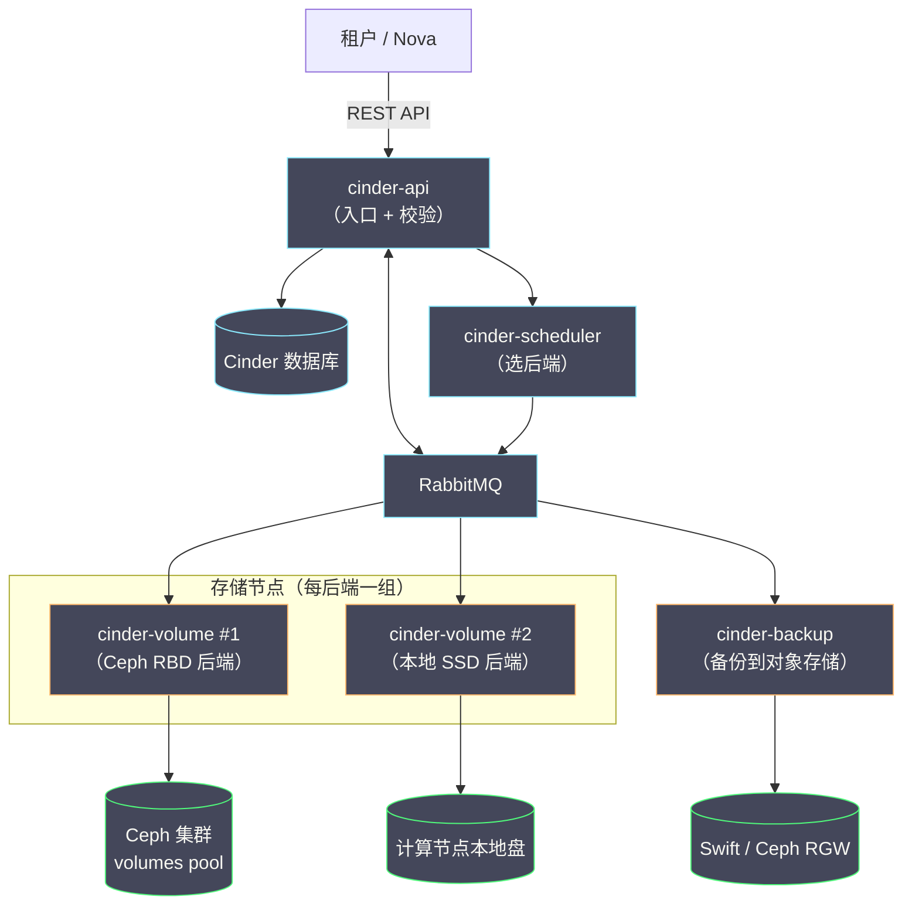
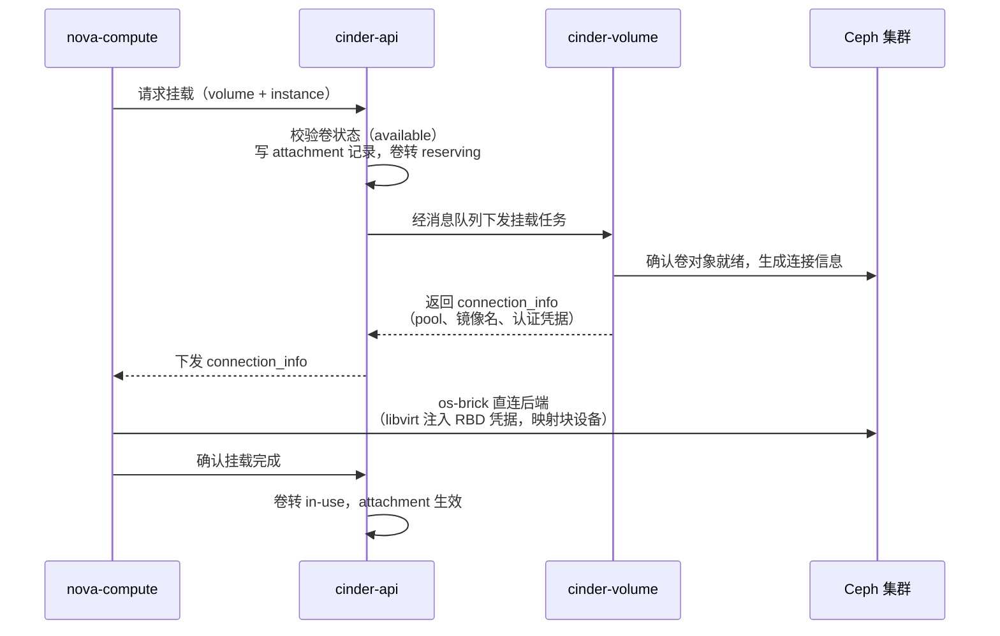

# 08 Cinder 块存储——卷生命周期与 Ceph RBD 后端

**摘要：**

如果说 Neutron 解决的是"实例如何彼此相连"，Cinder 解决的则是"实例的数据放在哪里才能活得比实例更久"。本文从 Nova 本地盘的三重局限讲起，回顾 nova-volume 到 Cinder 的拆分史，厘清卷（Volume）这一抽象在存储版图里的定位；随后拆解 cinder-api、cinder-scheduler、cinder-volume 与 cinder-backup 四个组件的分工，以及卷类型（volume type）如何充当租户需求与存储后端之间的翻译官；再沿着一块卷的完整生命周期——创建、挂载、快照、克隆、扩容——逐段拆解机制，其中挂载环节的 Nova、Cinder、Ceph 三方协作与写时复制（Copy-on-Write，COW）的秒级克隆是理解块存储的两把钥匙。本文的重头在第 4 章：Ceph RBD 后端的对接配置、最小权限原则、QoS 限速与多后端混合部署。最后落到运维视角，讨论卡死的卷状态如何处置、容量超分如何管理、与 Ceph 集群如何联动排障。读完你应当能回答两个问题：块存储为什么值得从计算服务里独立出来，以及一块卷从 API 请求到 Ceph 集群里的一串对象，中间究竟发生了什么。

---

## 第 1 章 块存储的定位——为什么卷要独立成服务

### 1.1 本地盘的三重局限

回到 2010 年 OpenStack 诞生之初，实例的磁盘并没有什么玄机：QEMU 把一个镜像文件当作虚拟机的硬盘，文件就躺在计算节点的本地磁盘上。这个模型朴素到近乎透明——没有额外的服务、没有网络存储协议、没有分布式一致性要操心，实例写盘就是进程写文件，性能几乎等于物理盘。早期许多从虚拟化运维转过来的工程师都对这个模型抱有好感，理由与当年怀念 nova-network 的人如出一辙：简单的东西不容易坏。

但简单是有代价的，而这个代价在云的规模化路上埋了三颗雷。**第一颗雷是迁移困难**：实例的根盘与计算节点物理绑定，热迁移要把整个磁盘数据在节点之间搬一遍，冷迁移则意味着停机窗口与数据盘的重新挂接——数据跟着节点走，而不是跟着租户走。**第二颗雷是可靠性差**：本地盘的冗余上限是节点内的 RAID，节点一坏，盘上的数据随之陪葬，云平台承诺的"数据安全"在硬件故障面前不堪一击。**第三颗雷是生命周期错位**：实例销毁，本地盘上的数据一并销毁，可租户的心智模型恰恰相反——机器可以不要，数据必须留下。

你不妨把本地盘想象成随身行李：人在哪行李在哪，取用方便，但换一趟航班就要拖着全部家当过安检；而块存储卷更像银行的保管箱——箱子存在银行的库房里，你换哪家分行办事都行，钥匙（挂载关系）在你手里，银行（云平台）负责库房的安防与冗余。行李与保管箱的差别，就是临时存储与持久存储的差别，也是 Cinder 存在的全部理由。

### 1.2 块存储在存储版图中的位置

在展开 Cinder 的历史之前，不妨先把块存储放进更大的存储版图里看。云平台对外提供的存储服务通常有三类，它们的分野不在容量与性能，而在**数据的组织方式与访问语义**：

| 存储形态 | 数据组织 | 访问方式 | 语义特征 | 典型代表 |
| :--- | :--- | :--- | :--- | :--- |
| 块存储 | 定长的块设备 | 实例内挂载，按扇区读写 | 容量语义，系统可格式化、可引导 | Cinder 卷、云硬盘 |
| 文件存储 | 目录树 | 网络文件协议（NFS/CIFS） | 路径语义，多客户端共享 | Manila、NFS 服务 |
| 对象存储 | 扁平的对象与桶 | REST API（HTTP） | 键值语义，天然跨网络访问 | Swift、S3 |

块存储的独特之处在于它**假装自己就是一块硬盘**：实例内的操作系统把它当作 /dev 下的块设备，可以在上面建文件系统、装数据库、甚至作为根盘引导系统——应用完全感知不到背后是分布式集群。这种"无感的兼容性"是块存储不可替代的价值：存量应用不需要任何改造就能用上分布式存储的可靠性。代价则是块设备的访问语义绑定了单一消费者（通常一个卷只挂一个实例），跨实例共享与跨网络访问不是它的舒适区——那些需求属于文件存储与对象存储的地盘。三者不是竞争关系，而是按数据的访问方式各就各位：**要引导系统用块存储，要共享目录用文件存储，要跨网络分发用对象存储**。Cinder 的整个设计，就是把"块设备即服务"这件事做扎实。

### 1.3 从 nova-volume 到 Cinder：一次迟到的拆分

OpenStack 社区意识到这个问题并不晚。2011 年前后，Rackspace 把自家公有云里块存储服务的经验贡献进 Nova，形成了 nova-volume 模块——实例除了本地临时盘，还可以挂载"独立于实例生命周期"的卷。但把块存储塞在计算服务里的别扭很快就显形了：卷的调度要考虑存储容量而不是计算资源，卷的高可用依赖存储后端而不是 hypervisor，卷的计费口径、配额体系、API 语义都与虚拟机格格不入。两套完全不同的资源模型挤在一个服务里，代码上的耦合让双方的演进互相拖累。

于是 2012 年 9 月的 Folsom 版本，社区做了一次与 Neutron 拆分同期的手术：nova-volume 独立为 Cinder 项目。与 Quantum 一样，Cinder 这个名字没有缩写含义，就是一个项目代号；也与 Neutron 一样，这次拆分在当时的社区里不乏反对声——多一个服务就多一套要部署、要监控、要升级的组件，小规模部署的运维成本实打实地涨了。但事后看，正是这次拆分给了块存储独立演化的空间：Cinder 在随后的版本周期里快速长出了多后端支持、快照、备份、QoS 等能力，而这些能力若还要挤在 Nova 的发布节奏里，恐怕一件都做不快。

Cinder 与 Ceph 的联姻是这段历史里最值得记的一笔。Ceph 的 RBD（RADOS Block Device，RADOS 块设备）驱动在 Cinder 独立后不久就进入主线，欧洲核子研究组织（CERN）在 2013 年前后把 OpenStack 与 Ceph 的组合推到了 PB 级的部署规模，用真实的生产负载验证了这条路线。此后十年，"OpenStack + Ceph"成了开源私有云的事实标准搭配，Cinder 的多后端架构与 Ceph 的统一存储各取所长——前者负责把存储能力声明为服务，后者负责把服务落实为数据。本章讲的是"为什么要有 Cinder"，后面几章讲的则是"Cinder 长成了什么样"。

### 1.4 卷与本地盘的选型权衡

不过，独立成服务不等于卷在所有场景下都优于本地盘。评价一个存储选型，先要把两者的账算清楚：

| 维度 | 本地临时盘 | Cinder 卷 |
| :--- | :--- | :--- |
| 生命周期 | 与实例绑定，销毁即消失 | 独立于实例，可卸载重挂 |
| 迁移 | 数据随节点绑定，热迁移代价高 | 数据在后端，实例可在节点间自由调度 |
| 可靠性 | 上限为节点内 RAID，节点故障即失联 | 由存储后端决定，Ceph 可做到多副本跨节点 |
| 性能 | 延迟最低，无网络开销 | 多一层存储网络协议，延迟与吞吐有折损 |
| 运维成本 | 零额外组件 | 需要独立服务与存储后端的运维投入 |
| 典型用途 | 系统临时文件、可重建的缓存 | 数据库、有状态服务、需要保留的业务数据 |

这张表里最有信息量的一行是性能：本地盘在延迟上永远赢，因为它省掉了存储网络的那一跳。对延迟极度敏感、数据可以随时重建的负载（譬如页缓存盘、编译产物目录），本地盘反而是更理性的选择——许多生产环境干脆两者混用：根盘与数据盘走 Cinder 卷，临时缓存走本地盘，各得其所。**卷的价值不在性能上限，而在数据与实例的解耦**：解耦之后，实例才能变成真正可抛弃（disposable）的东西，而云的弹性调度，恰恰建立在"实例可抛弃"这块基石上。

落到具体的选型动作上，笔者建议用四个问题过一遍每个数据集，答案基本就能自动浮出：

1. **这份数据丢了会怎样？** 不可重建的，直接排除本地盘，进卷与备份的讨论
2. **实例销毁后数据要活下来吗？** 要，就必须是卷；不要，本地盘的零成本优势成立
3. **延迟敏感到什么程度？** 毫秒级抖动都伤业务的，考虑本地盘或 Ceph SSD 池，并接受相应的架构约束
4. **会被多个实例共享访问吗？** 块存储的单一消费者语义不擅长共享，这需求该去找文件存储或对象存储

四个问题都答完还摇摆不定的场景很少——多数犹豫的本质是第 1 问没想清楚，而那是一个业务问题，不是存储问题。

不妨做个反事实推演来收束本章：假如块存储没有独立成服务，今天会是什么局面？实例的持久数据散落在各计算节点的本地盘上，热迁移变成数据搬运工程，节点故障升级为数据事故，存储后端的创新（分布式块存储、全闪存阵列）无从接入——因为根本不存在一个插件化的接入点。这三条任何一条单独成立，都足以支撑拆分的决策，这与第 6 篇里 Neutron 的故事互为镜像：OpenStack 的组件拆分史，本质上是一部"把资源模型从计算服务里解放出来"的历史。

---

## 第 2 章 Cinder 架构——四个服务与一个翻译官

### 2.1 组件全景

Cinder 的组件比 Nova 少得多，但分工的清晰程度不遑多让。先看全景图：



四个组件的分工一句话可以说清：**cinder-api 是门房，cinder-scheduler 是调度台，cinder-volume 是驻场工人，cinder-backup 是搬运队**。api 接收 REST 请求、校验参数、写数据库；scheduler 决定新卷落在哪个后端；volume 真正与存储后端打交道，把"创建一块 100 GB 的卷"翻译成后端上的具体操作；backup 则负责把卷的数据复制到对象存储。消息队列（RabbitMQ，见第 2 篇）串起 api 与各 worker，数据库记录所有卷的期望状态——这套"API 写期望、worker 落实状态"的模式，与 Nova、Neutron 是同一个模子。

把四个组件的部署位置、职责边界与故障影响列成一张表，这张表是容量规划与高可用设计的底稿：

| 组件 | 部署位置 | 核心职责 | 故障影响 | 高可用手段 |
| :--- | :--- | :--- | :--- | :--- |
| cinder-api | 控制节点（可多副本） | REST 入口、校验、状态记录 | 新请求失败，存量操作不受影响 | 多副本 + 负载均衡 |
| cinder-scheduler | 控制节点 | 为新卷挑选后端 | 新卷创建失败 | 多副本（消息队列竞争消费） |
| cinder-volume | 存储侧（每后端一组） | 执行卷的管理操作 | 该后端的卷管理动作停摆 | 主备切换或 active-active |
| cinder-backup | 控制节点或独立节点 | 卷到对象存储的备份 | 备份任务积压 | 多实例分摊 |

这张表里最值得琢磨的是 cinder-volume 一行：它是四个组件里唯一"挂了会阻塞管理动作"的 worker，也是唯一与具体后端绑定的组件——高可用方案因此必须按后端逐个设计，没有全局统一的答案。

与 Nova、Neutron 一样，Cinder 的组件间通信也走消息队列，这个共同点背后是同一条架构判断：**管理动作是低频的、可异步的，用消息队列解耦比同步 RPC 更抗抖动**——后端短暂繁忙时，创建卷的任务在队列里排队而不是让 API 超时。代价则是排障时要适应"请求已受理但尚未执行"的中间地带：API 返回成功不等于后端已动手，卷的状态字段才是事实的唯一来源。从 Nova 过来的读者把这个心智转换做好，Cinder 的一半排障思路就通了。

### 2.2 cinder-scheduler：与 Nova 调度的同与不同

读过第 4 篇的你对这套调度机制应当似曾相识：cinder-scheduler 同样采用过滤器加权重（filter + weigher）的两段式架构——先用过滤器淘汰不合格的后端，再用权重器给幸存者打分排序。CapacityFilter 检查后端的剩余容量是否装得下新卷，CapabilitiesFilter 检查后端能力是否匹配卷类型的要求（譬如是否支持多挂载、是否是 SSD 介质），CapacityWeigher 默认倾向把卷放到剩余容量最大的后端上，避免某个后端被过早填满。

但相似的外表下藏着三个关键差异，值得逐一说透。**其一，调度的粒度不同**：Nova 调度的是"实例放哪个计算节点"，候选是成百上千台主机；Cinder 调度的是"卷放哪个后端"，候选往往只有个位数的存储池——调度频率低得多，但每一次调度的后果都更难撤销（数据搬家的代价远大于虚拟机漂移）。**其二，容量的语义不同**：计算节点的资源是实打实的 CPU 与内存，而存储后端可以超分（见 6.2 节），CapacityFilter 看到的"剩余容量"是后端上报的账面数字，账怎么记是运维的决策。**其三，失败的处理不同**：Nova 调度失败返回 NoValidHost，重试即可；Cinder 调度失败后卷进入 error 状态，需要人工介入清理——因为创建卷的动作可能已经在后端留下了半成品。理解了这三点差异，你就理解了为什么块存储的运维更强调"容量规划前置"而不是"调度参数调优"。

把两段式调度里最常用的过滤器与权重器列成一张表，排障时"卷为什么没落到我想要的后端"就有了排查清单：

| 组件 | 类别 | 判定依据 | 剔除/加权逻辑 |
| :--- | :--- | :--- | :--- |
| CapacityFilter | 过滤器 | 后端上报的剩余容量 | 容量装不下新卷的后端直接淘汰 |
| CapabilitiesFilter | 过滤器 | 后端能力与卷类型 extra specs | 能力不匹配（如不支持多挂载）淘汰 |
| AvailabilityZoneFilter | 过滤器 | 请求指定的可用区 | 可用区不符的后端淘汰 |
| CapacityWeigher | 权重器 | 剩余容量 | 默认偏向剩余容量大的后端，摊薄写入热点 |

这张表的实用价值在于反向排查：卷被调度到了"错误"的后端，逐项核对过滤器即可——多数时候不是调度器失灵，而是卷类型的 `volume_backend_name` 写错、后端容量上报停滞（cinder-volume 挂了），或可用区参数与预期不符。调度是纯函数式的逻辑，输入对则输出必对，**"调度结果出乎意料"几乎总能归结为"某个输入与你以为的不一样"**。

### 2.3 cinder-volume：每个后端一个驻场经理

cinder-volume 是 Cinder 里唯一真正触碰数据的组件，它的部署模型有一个鲜明特征：**每个存储后端对应一组 cinder-volume 服务**。你在一个部署里同时接了 Ceph 与本地 SSD 两种后端，就有两组 cinder-volume，各自在配置文件里声明自己管的驱动、连接参数与后端名称。这个模型好比连锁超市的驻店经理——总部（api 与 scheduler）只管下订单，每个门店（后端）的经理负责把订单落实为货架上的实物，门店之间的库存互不混淆。

驱动（driver）是 cinder-volume 与后端之间的接口。Cinder 主线代码里维护着数十种驱动：Ceph RBD、LVM、各类商业阵列、NFS……驱动把"创建卷、删卷、快照、克隆、扩容"这组标准操作翻译成后端的私有 API。这个设计与 Neutron 的 ML2 mechanism driver 是同一种哲学：**核心服务定义语义，驱动负责落地**，存储厂商不必修改 Cinder 主线代码就能接入自己的产品。对运维的含义也很直接：排障时先分清问题出在哪一层——卷的状态不对，查 Cinder 的数据库与日志；卷的数据不对，查后端自身的健康度。两层的问题混在一起查，是新手最常走的弯路。

值得一提的是 cinder-volume 的高可用模型。早期版本里同一后端只允许一个 active 的 cinder-volume，服务挂了要靠主备切换；较新的版本支持 active-active 模式，多实例同时服务同一后端，靠分布式锁防止并发冲突。不过无论哪种模式，cinder-volume 挂掉的影响面都是"该后端上的卷管理操作停摆"——存量卷的读写不受影响（数据路径由 hypervisor 直达后端，不经过 cinder-volume），但新建、快照、扩容这些管理动作全部阻塞。这与 Neutron L2 agent 的故障特征（2.6 节）是同一个模式：控制面停摆，数据面照常，症状延迟爆发。

### 2.4 卷类型：租户与后端之间的翻译官

 Cinder 的对象模型里，卷（volume）本身很朴素——名字、大小、状态、挂载信息，没有太多玄机。真正承载设计智慧的是卷类型（volume type）：它是租户需求与存储后端之间的翻译官，把"我要一块高性能盘"这样的业务语言，翻译成"这个卷落在哪个后端、用什么介质、受什么 QoS 约束"的技术语言。

翻译的机制靠**元数据键值对（extra specs）**。卷类型上可以挂任意多的键值对，其中最特殊的一个键是 `volume_backend_name`——它是 scheduler 与后端之间的接头暗号：每个 cinder-volume 在配置里声明自己的 backend_name，卷类型里声明要求的 backend_name，两者匹配，卷才会被调度到对应的后端。除此之外的键值对则原样透传给驱动，由驱动自行解释（譬如 QoS 参数、加密设置、精简配置开关）。一条完整的类型定义长这样：

```bash
# 创建指向 Ceph SSD 后端的卷类型，并声明 QoS 消费端
openstack volume type create ceph-ssd \
  --property volume_backend_name=ceph-ssd
openstack volume type set ceph-ssd \
  --property multiattach='<is> False'
```

| extra specs 键 | 谁来解释 | 作用 |
| :--- | :--- | :--- |
| volume_backend_name | scheduler | 决定卷落在哪个后端，是类型与后端的绑定键 |
| QoS 参数（total_bytes_sec 等） | 后端或前端 | 限速，见 4.4 节 |
| 多挂载标记 | scheduler 与驱动 | 是否允许多实例同时挂载 |
| 厂商私有参数 | 具体驱动 | 透传给后端，驱动自行取舍 |

卷类型的价值在多后端环境里体现得最充分：运维定义"高性能 SSD""大容量 Ceph""加密盘"等若干类型，租户创建卷时只需选类型，不必知道也不必关心底下是哪家存储。**类型是抽象，后端是实现，`volume_backend_name` 是两者之间唯一的耦合点**——这与 ML2 里 type driver 与 mechanism driver 的正交分解（2.3 节）是同一条设计原则的两次应用。运维要记住的纪律是：卷类型的 extra specs 一经生产使用就当作 API 对待，改键名、改语义之前先盘点存量卷，否则新卷旧卷落在不同语义的配置上，排障时会出现"同类型不同行为"的灵异现象。

### 2.5 cinder-backup：独立于后端的第二道防线

cinder-backup 是四个组件里存在感最低、但在数据保护体系里地位特殊的一个。它把卷的数据以块为单位导出，存到对象存储后端——Swift、Ceph 自己的备份池、S3 兼容存储都可以。它与 cinder-volume 一样通过消息队列接收任务，但它的特殊性在于**不依赖卷所在的存储后端**：备份的目标与卷的来源是两套完全独立的系统，这正是它与快照的本质区别，第 5 章会展开。

cinder-backup 的工作方式还有两个值得记住的工程细节。其一是**增量机制**：对同一卷的后续备份只传输上次备份以来变化的数据块，这让"每日备份一个 2 TB 卷"从网络与存储的双重灾难变成日常可承受的操作——代价是恢复时需要沿增量链逐级重组，恢复耗时随链长增长，备份保留策略因此要在"恢复速度"与"存储成本"之间找平衡。其二是**服务本身的部署位置很自由**：cinder-backup 不与任何存储后端绑定，可以集中部署一两个实例服务全平台，也可以按可用区分片部署以隔离故障域——备份通道本身也是需要可用性设计的，灾备通道与生产通道同时失效的场景，是灾备演练里必须覆盖的科目。

---

## 第 3 章 卷的生命周期——一块卷的一生

### 3.1 四种出身：创建卷的四条路

一块卷的诞生有四种方式，路径不同，代价与特性也不同：

| 创建来源 | 后端动作 | 耗时特征 | 典型用途 |
| :--- | :--- | :--- | :--- |
| 空盘（empty） | 在后端分配一块空白空间 | 最快，几乎无数据拷贝 | 挂载后自行格式化的数据盘 |
| 从镜像（image） | 把 Glance 镜像数据写入卷 | 较慢，要拷贝完整镜像 | 根盘（boot from volume） |
| 从快照（snapshot） | 基于快照做写时复制克隆 | 秒级（COW 后端） | 批量派生相同数据的卷 |
| 从源卷（source volume） | 克隆现有卷 | 秒级（COW 后端） | 测试副本、批量预置 |

前两条路是"实打实"的拷贝：从镜像创建卷时，cinder-volume 要把镜像的完整数据写到后端上，一个 20 GB 的镜像就是 20 GB 的写入，这也是"批量创建实例时根盘创建很慢"的根源。后两条路则可能快得出奇——在支持写时复制的后端（Ceph RBD 是典型）上，从快照或源卷创建新卷只是登记一个新的克隆对象，数据块与源共享，创建耗时与卷的大小无关，秒级完成。**同一个 API 动作，在不同后端上的耗时可以相差三个数量级**，这是块存储运维必须建立的基本直觉，4.2 节会拆解其中的机制。

四种出身的选型也有章法可循。空盘适合"数据由应用自己初始化"的场景，最快也最干净；从镜像创建是根盘的唯一正路，但要留意镜像格式与后端的匹配（raw 直写最快，qcow2 要先转换）；从快照创建适合"以某个时点为模板批量派生"的场景，譬如给一套初始化好的数据库环境做母本；从源卷创建则适合在线系统的测试副本——不过要记住克隆卷与源卷共享数据，源卷的删除会受克隆依赖的牵制（Ceph 侧会保护父镜像），批量克隆之后的源卷管理要当成一个独立课题对待。

### 3.2 attach：Nova、Cinder 与后端的三方协作

挂载（attach）是卷生命周期里环节最多、也是排障价值最高的动作，因为它需要三个系统协同完成一次"过户"。我们把一块 Ceph 卷挂载到实例的完整时序走一遍：



这条时序里有三个值得驻足的细节。**第一，状态机的中间态是排障的钥匙**：卷从 available 出发，经过 reserving/attaching 的中间态，最终落到 in-use——任何一环失败，卷可能停在中间态上，第 6 章的"卡住的卷"说的就是这些状态。**第二，数据路径不经过任何 Cinder 组件**：Nova 拿到 connection_info 之后，由 os-brick（OpenStack 的存储连接库）直接与后端建立连接——Ceph 场景下是 libvirt 持 RBD 凭据把块设备映射进虚拟机，iSCSI 场景下是发起器登录目标并挂载。Cinder 全程只负责"撮合"，不负责"搬运"，这与 Neutron 里 agent 不参与存量转发是同一种解耦。**第三，凭据的传递是一次性的信任委托**：connection_info 里带着访问后端的凭据，从 Cinder 流向 Nova，这意味着挂载关系的本质是"云平台把后端上某个数据对象的读写权临时授予某个计算节点"——卸载（detach）就是收回授权、清理设备映射的逆过程。

connection_info 的内容因后端而异，把两种典型后端的连接信息对比一下，"撮合"的含义会更具体：

| 字段 | Ceph RBD 后端 | iSCSI 后端 |
| :--- | :--- | :--- |
| 协议标识 | rbd | iscsi |
| 目标对象 | pool 名 + RBD 镜像名 | target 地址 + IQN + LUN |
| 认证凭据 | rbd_user + 密钥（libvirt secret） | CHAP 用户名 + 密码 |
| 实例侧形态 | libvirt 直接以 RBD 为磁盘后端 | 宿主机登录 iSCSI 后映射为块设备 |
| 断开动作 | 解除 libvirt 磁盘引用 | 登出 target、清理本地图层 |

排障时这张表的用法是反向的：实例内看不到盘，先看 connection_info 声称的协议与凭据是否与计算节点上的实际配置一致——凭据对不上、target 不可达、pool 名写错，都在这一步现形。

 detach 的流程是 attach 的镜像：nova-compute 先断开实例侧的设备映射，再通知 Cinder 撤销 attachment 记录，卷回到 available。顺序不能反——先撤记录再断设备，实例还在写的卷会被后端拒绝断开，状态机立刻卡死。**挂载与卸载的纪律可以总结为一句话：谁持有设备，谁先放手**。

把生命周期里主要状态的含义与排障指向列成一张表，这是第 6 章处置手册的索引：

| 状态 | 含义 | 正常停留时长 | 长期停留的嫌疑方向 |
| :--- | :--- | :--- | :--- |
| creating | 后端正在创建卷数据 | 与来源相关（空盘秒级，镜像分钟级） | 后端繁忙、镜像转换慢、cinder-volume 停摆 |
| available | 就绪待挂载 | 可长期停留 | 无异常，这是稳态 |
| attaching / detaching | 挂载/卸载进行中 | 秒级 | nova-compute 失联、设备映射断不开 |
| in-use | 已挂载使用中 | 可长期停留 | 无异常，这是稳态 |
| error | 创建失败 | 不应出现 | 调度失败、后端报错，需人工清理 |
| deleting | 删除进行中 | 秒级到分钟级 | 后端删除操作超时、快照依赖未清理 |

这张表里最值得强调的是 available 与 in-use 是仅有的两个"稳态"——**其余所有状态都是过路态，过路态的长期停留就是故障**。值班时对卷状态的巡检可以简化成一条规则：把非稳态的卷列出来，逐个核对它"应该"花多久，超时的进入 6.1 节的处置流程。

### 3.3 快照与克隆：写时复制的魔法

快照（snapshot）是卷在某一时刻的只读副本，它的实现几乎都依赖写时复制（Copy-on-Write，COW）：创建快照的瞬间不拷贝任何数据，只是冻结当前状态、让后续写入重定向到新块——源卷继续读写，快照则停留在过去。你不妨把它想象成给一本正在书写的账本拍照：拍照只花一秒，之后账本继续往下写，照片里的数字永远停在拍照那一刻；而要让照片"活"过来（创建新卷），只需从照片出发重新誊写被修改过的页——这就是克隆（clone）。

Ceph RBD 把这套机制做到了极致。RBD 的镜像在 Ceph 集群里是一串有序的对象，快照是对象层面的只读版本标记，克隆则是基于快照的分层镜像（layered clone）：子镜像与父镜像共享全部数据对象，子镜像的写入落在自己的新对象里，读到自己没改过的对象就穿透到父镜像去取。**创建一个 1 TB 卷的克隆，耗时与创建一个 1 KB 卷的克隆相同**——因为两者都只是登记一个元数据对象，数据一个字节都没搬。代价是分层带来的读取放大：克隆链越深，穿透读取的层数越多，延迟越高。Cinder 为此提供了两个配置项来控制分层深度——`rbd_max_clone_depth` 限制克隆链长度，`rbd_flatten_volume_from_snapshot` 决定是否在适当时候把克隆"拍平"（把父镜像数据实打实拷贝一份，斩断依赖链）。拍平是一次性的数据拷贝，换来的是后续读取不再穿透——这与所有缓存问题一样，是"当下付代价"还是"以后付利息"的取舍。

快照还有一个容易被误解的语义边界：**快照不是备份**。快照与源卷同住一个后端、共享同一份物理介质，后端故障时两者一起消失；快照链还会随着写入增长而消耗空间（被冻结的旧块不能回收）。快照解决的是"误删除与逻辑错误的快速回滚"，备份解决的才是"后端整体故障的灾后重建"——两者的分工，第 5 章展开。

还要补一句关于快照与挂载状态的关系：多数后端支持对 in-use 的卷打快照（Ceph 的快照是崩溃一致性的——它等价于"在快照瞬间拔掉电源"时磁盘上的状态），但崩溃一致不等于应用一致——数据库的内存脏页、事务日志的中间态都可能被定格在快照里。对一致性要求高的场景，正确做法是先在实例内静默应用（或做文件系统冻结）再打快照，或者依赖应用自身的日志恢复机制。**快照保证的是"磁盘那一刻的样子"，不保证"应用那一刻的状态"**，这两者的差距是很多"快照恢复后数据库起不来"事故的根因。

### 3.4 扩容与状态机：在线生长的边界

卷的扩容（extend）在 Cinder 里是一个独立动作：`openstack volume extend` 把卷的配额调大，后端把空间补上。对 Ceph RBD 后端，在线扩容是支持的——卷挂着也能扩，实例侧收到容量变化通知后（配合文件系统的在线扩展）即可使用新空间。不过有两点纪律要记：其一，**块存储只能扩不能缩**，块设备的语义决定了缩小意味着数据截断，所有后端一律不支持；其二，扩容改变的是块设备的容量，实例内的文件系统、逻辑卷不会自动跟着长，"扩了卷但 df 看不到变化"不是故障，是文件系统还没扩展，这一步要靠实例内的工具（growpart、resize2fs 之类）补完。

扩容还有一个容易被忽略的容量账维度：扩容请求同样要过 scheduler 的容量检查，后端账面空间不足时扩容会被拒绝——这与创建卷是同一套逻辑。在超分的环境里（6.2 节），"创建时没占满、扩容后要占满"的预期写入增长必须纳入容量规划，否则扩容动作本身就会成为压垮物理容量的最后一根稻草。运维的实践是把"大范围扩容"当作与"批量创建"同等级的容量事件对待，提前核对后端的物理余量。

把生命周期各阶段的状态串起来，就是卷的状态机：creating → available →（attaching →）in-use →（detaching →）available → deleting，快照、备份、迁移各有自己的旁路状态。状态机是 Cinder 排障的总纲——**每一个卡住的中间态，都对应着流程里某个未完成的环节**，第 6 章的处置手册就是围绕这张状态机展开的。

---

## 第 4 章 Ceph RBD 后端实战——本篇的重头

### 4.1 对接 Ceph：keyring 与最小权限

Cinder 与 Ceph 的对接，本质上是一个 Ceph 客户端（cinder-volume）拿着密钥环（keyring）访问集群的过程。配置分两侧：Ceph 侧创建一个用户并授予恰好够用的权限，Cinder 侧在 cinder.conf 里声明驱动与凭据。先看 Ceph 侧：

```bash
# 在 Ceph 集群上创建 cinder 专用用户
# mon 用 rbd profile（获取集群地图与 OSD 映射）
# osd 用 rbd profile 且限定 volumes 池——只能碰这个池
ceph auth get-or-create client.cinder \
  mon 'profile rbd' \
  osd 'profile rbd pool=volumes' \
  mgr 'profile rbd pool=volumes'
```

这段命令的关键词是**最小权限**。`profile rbd` 是 Ceph 预定义的权限档位，而 `pool=volumes` 的限定把 cinder 用户的写权限锁死在卷池里——它碰不到 Ceph 集群的其他池，更碰不到集群管理命令。生产环境里最常见的错误做法是图省事授予 `osd 'allow *'` 的全量权限，这在单集群里看似无害，实则把 Cinder 的凭据变成了整个存储集群的万能钥匙——凭据一旦从某个计算节点泄露（它会被下发给 libvirt），攻击面就是整个集群。**权限的边界就是故障与事故的边界**，这条纪律与 Keystone 里角色最小化的原则一脉相承。

为什么凭据一定会扩散到计算节点？这由块存储的接入架构决定：实例读写 RBD 卷走的是 libvirt 到 Ceph 集群的直连路径，每个需要挂载 RBD 卷的计算节点都必须持有客户端凭据。这个事实对安全模型有两层推论：其一，Ceph 侧的权限设计必须按"凭据终将离开控制节点"的最坏情况来做——pool 级别的限定不是锦上添花，是底线；其二，凭据的轮换要有预案，keyring 更新涉及 cinder-volume 与所有计算节点 libvirt secret 的同步，把"多久轮换一次、怎么轮换"写进运维手册，比在安全审计时现场发明流程体面得多。

Cinder 侧的配置同样简洁：

```ini
[rbd-volumes]
volume_driver = cinder.volume.drivers.rbd.RBDDriver
volume_backend_name = ceph-hdd
rbd_pool = volumes
rbd_user = cinder
rbd_ceph_conf = /etc/ceph/ceph.conf
rbd_max_clone_depth = 5
```

几个键各有讲究：`volume_backend_name` 是 2.4 节说的接头暗号，卷类型靠它找到这里；`rbd_pool` 与 `rbd_user` 对应 Ceph 侧创建的池与用户；`rbd_ceph_conf` 指向集群配置，cinder-volume 靠它找到 monitor。此外还有一条 Nova 侧的隐性配合：实例要真正读写 RBD 卷，libvirt 也需要同一套凭据——nova.conf 的 libvirt 段里配置 `rbd_user` 与 `rbd_secret_uuid`，凭据以 libvirt secret 的形式注入实例进程。排障时"卷挂上了但实例内读不到盘"的问题，多半就出在这条 Nova 侧的凭据链上，而不是 Cinder 自己。

### 4.2 秒级创建的秘密：分层克隆

3.3 节埋下的伏笔在这里揭晓：为什么 Ceph 后端上从快照创建卷是秒级的？把数据在集群里的形态摊开看就明白了。一块 RBD 卷是 Ceph 对象存储（RADOS，Reliable Autonomic Distributed Object Store）里的一串 4 MB 对象；快照是这些对象的只读版本标记；从快照创建新卷时，RBD 不拷贝任何对象，而是创建一个新的分层镜像，把旧镜像声明为父——子镜像读数据时，自己有的直接读，没有的沿分层链向上穿透。

这套机制对 Cinder 的创建路径产生了连锁影响。从 Glance 镜像创建卷时，第一个卷要实打实地把镜像数据写入集群（镜像还要先转换成 raw 格式），这一步慢；但 Cinder 的镜像卷缓存（image volume cache）会把这份"母本"留在缓存池里，后续从同一镜像创建卷时直接对母本做快照加克隆——**第一个卷付全款，后面的卷付首付**。批量创建几十台相同镜像的实例时，这个差异把根盘创建时间从"每台几分钟"压到"每台几秒"，是 Ceph 后端最直观的性能红利。

不过分层不是免费的午餐，3.3 节说的读取放大会随克隆链加深而恶化，而父镜像一旦被删除，所有子镜像的穿透读取都会失败。Cinder 用 `rbd_max_clone_depth` 控制链深，超过阈值的克隆在后台被拍平（flatten，把父数据实拷一份、斩断依赖）。运维要建立的监控视角是：**克隆深度与拍平任务是 Ceph 后端特有的健康指标**——克隆链异常增长，说明快照派生的速度超过了后台拍平的消化能力，读取延迟的劣化只是时间问题。

秒级创建还有一个容易被误读的地方需要澄清：**克隆快，不等于克隆出来的卷永远快**。克隆卷在刚创建时与源共享数据，读取性能与源卷相当；但随着自身写入增多，它逐渐长出自己的数据块，性能特征回归到所在池的常态。把"克隆测试性能极佳"当作该池的稳态性能基线，是容量与性能评估里的常见误判——性能测试应当在克隆被"写实化"（写入足够多的独占数据）之后做，或者干脆在拍平之后做，测出来的数字才有代表性。

### 4.3 卷类型与 pool 的映射：一套集群里的分区术

Ceph 集群内部的容量分层靠池（pool）实现，而 Cinder 侧的对接方式简单得出奇：**一个后端配置对应一个池，需要几个池就配几组 cinder-volume**。常见做法是把 HDD 池与 SSD 池分开（底层靠 Ceph 的 CRUSH 规则把不同池的数据落到不同介质），Cinder 侧则配置两个后端，卷类型各指一个：

| 卷类型 | volume_backend_name | rbd_pool | 底层介质 | 典型用途 |
| :--- | :--- | :--- | :--- | :--- |
| high-iops | ceph-ssd | volumes-ssd | SSD（CRUSH 规则限定） | 数据库、高频交易 |
| standard | ceph-hdd | volumes | HDD + EC 纠删码 | 通用数据盘、备份暂存 |

这套映射的精妙之处在于**职责的分层**：Cinder 只管"这个类型的卷去这个池"，池里的数据落在什么介质、几副本还是纠删码，全是 Ceph 的 CRUSH 与池策略说了算。两个系统各自管自己擅长的事，中间只靠池名这一个字符串衔接。运维的容量规划也因此变成两个独立的问题：Cinder 层面规划各类型的配额与超分比，Ceph 层面规划各池的容量与副本策略——把两层的规划搅在一起做，是混合介质部署里最常见的混乱源。

落地时的操作序列也值得记一笔，它体现了"先有后端、再有类型、最后才有卷"的依赖顺序：先在 cinder.conf 里配好第二组 RBD 后端并重启 cinder-volume，确认 `openstack volume service list` 里新后端在线且容量上报正常；再创建卷类型并用 `volume_backend_name` 指向它；最后才建议租户使用。顺序颠倒的典型事故是"类型先建了、后端还没上线"——租户拿着类型创建卷，调度失败进 error 态，工单先于功能到达运维桌上。**新后端上线的验收标准不是配置写完，而是"用新类型成功创建、挂载、写入并删除一块测试卷"**，这条验收跑通了再开放给租户。

### 4.4 QoS 限速：把"邻居效应"关进笼子

共享存储的固有风险是**邻居效应（noisy neighbor）**：一个租户的卷跑满带宽，同池所有卷的延迟跟着遭殃。Cinder 的 QoS（Quality of Service）机制就是关这个笼子的，它以 QoS 规格（qos specs）的形式定义限速参数，再关联到卷类型上：

```bash
# 定义 QoS：每卷限 100 MB/s 读写、1000 IOPS，由后端执行
openstack volume qos create perf-limit \
  --property total_bytes_sec=104857600 \
  --property total_iops_sec=1000 \
  --consumer back-end
openstack volume type set perf-type --qos perf-limit
```

`--consumer` 参数是理解 QoS 的钥匙，它决定限速在哪一端执行。两种消费端的取舍列成表：

| consumer | 执行者 | 优点 | 局限 | 适用场景 |
| :--- | :--- | :--- | :--- | :--- |
| back-end | 存储后端（Ceph RBD 限速） | 精确，覆盖所有接入路径 | 依赖后端能力，异构后端行为不一 | Ceph 等支持限速的后端 |
| front-end | hypervisor（libvirt 限速） | 不依赖后端，全后端通用 | 只管得住 hypervisor 这一跳 | 异构后端、LVM 等无后端限速能力的场景 |

两者的取舍很实际：后端限速更精确、能覆盖所有接入路径，但依赖后端能力；前端限速不依赖后端、所有后端通用，但只管得住 hypervisor 这一跳。生产环境的常见组合是 Ceph 卷用 back-end、异构后端统一用 front-end，宁可策略不完全统一，也要保证每个卷都有笼子。还有一条纪律：QoS 参数是卷类型 extra specs 的一部分，**修改 QoS 只影响之后创建的卷，存量卷要靠 retype 或手动刷新才生效**——"调了限速没效果"的工单，先查卷是不是老卷，再查 consumer 端到底有没有执行能力。

### 4.5 多后端混合：Ceph 与本地盘的分工

生产环境很少只有一个存储后端，多后端混合才是常态，而混合的依据不是厂商偏好，是负载特征。一个经过验证的分工模板：

| 负载特征 | 后端选择 | 理由 |
| :--- | :--- | :--- |
| 数据库、有状态中间件 | Ceph SSD 池 | 要持久性与可迁移性，延迟可接受 |
| 通用业务数据盘 | Ceph HDD 池 | 容量优先，吞吐要求中等 |
| 可重建的缓存、临时盘 | 计算节点本地 SSD | 延迟最低，数据可丢 |
| 归档、备份落地 | Ceph EC 池或对象存储 | 容量成本优先，访问频率低 |

这个模板背后的决策原则只有一条：**数据的"可重建性"决定它配得上哪一层的存储投入**。可重建的数据用最便宜的路径，不可重建的数据用最可靠的路径，中间地带按延迟敏感度插值。多后端部署的运维成本也要如实计入：每多一个后端，就多一组 cinder-volume 要监控、一套容量账要算、一类故障模式要演练——如果团队只有一两个运维，先把 Ceph 一个后端做扎实，比铺开三四个半吊子后端更理性。这与数据密集型系统专栏里"先分离边缘服务"的渐进原则，是同一种工程智慧。

混合部署还有一层调度语义要交代：多后端之间没有自动的数据分层——Cinder 不会因为 SSD 池空闲就把 HDD 卷"晋升"上去，卷落在哪个后端完全由创建时的卷类型决定，终身不变（除非显式迁移，见 5.3 节）。这个设计是刻意的：数据搬家是重操作，让系统自动做"性能晋升"等于把一次计划外的大 IO 塞给生产环境。如果业务确实需要"先落 HDD、热起来再升 SSD"的分层，正确做法是把分层逻辑建在应用层或用显式的 retype 变更窗口实现，让每一次数据搬家都发生在计划内——**自动化应该管机制，人应该管时机**，这条边界在存储领域尤其值得守住。

---

## 第 5 章 数据保护——快照、备份与迁移

### 5.1 快照策略：快是快照的优点，也是风险

快照的运维价值在于"快"——COW 机制让创建瞬间完成，回滚也只涉及元数据，这使它成为变更前的标准动作：升级前拍一张，出问题秒级回退。但快照的风险恰恰藏在它的优点里：**创建得太容易，所以积累得太快**。每个快照都在冻结旧数据块、阻止空间回收，快照链越长，后端的隐性开销越大。Cinder 本身不限制租户的快照数量（配额体系里单独设额），把快照策略管起来是运维的责任：给租户的快照配额设上限、用定期任务清理过期快照、把"快照是临时保护不是长期备份"写进租户使用规范。生产环境的经验值是：快照保留以天计（变更窗口前后），长期保留一律转备份——快照链上挂了三个月前的旧快照的后端，容量账一定算不平。

快照与删除的交互还有一个隐蔽的坑值得单独提醒：**删除"有快照的卷"在多数后端上并不会真正释放空间**——快照还引用着卷的数据块，卷的删除只是把"活"的部分清掉，被快照冻结的块要等所有引用它的快照都删除后才回收。这就产生了"卷删了、池的占用却没降"的经典工单，根因几乎总是快照。排查这类问题在 Ceph 侧用 `rbd du`（含快照的深度统计）与 `rbd children`（克隆依赖）核对引用关系，Cinder 侧则核对该卷名下是否还有 snapshot 记录。把"删卷先删快照"写进清理流程的固定步骤，比事后解释容量账为什么对不上省事得多。

### 5.2 backup：独立副本的哲学

备份与快照的区别，一句话可以说透：**快照是同一份物理介质上的时间点标记，备份是搬到另一套系统的独立数据副本**。cinder-backup 把卷的数据切块、压缩（可选）、以对象的形式写入对象存储后端——Swift、Ceph 的备份池、S3 兼容存储都可以。因为数据离开了原后端，后端整体故障（集群损毁、误删池）时备份依然完好，这是快照在原理上做不到的保护。增量备份机制让这个过程对大卷友好：首次备份是全量，后续只传变化的数据块，恢复时再按链重组。

备份体系还有两个工程决策值得展开。**其一是备份目标的选型**：备份池与生产池共用同一个 Ceph 集群（只是不同 pool）是最省事的方案，但它只防逻辑事故（误删、误改），防不了集群级灾难——严格意义上的灾备要求备份落在独立的集群或独立的机房，Swift 跨站点部署或 S3 兼容的异地存储才是完整答案。备份目标的"独立性等级"应该与业务的数据等级匹配，不是所有卷都值得双机房的成本。**其二是备份的验证**：备份不恢复演练一次，就永远不知道它能不能用——增量链断裂、对象存储里的对象损坏、元数据丢失，都只在恢复的那一刻才暴露。把"抽样恢复到测试卷并校验数据"纳入月度例行，是灾备体系里投入最小、收益最确定的一项纪律。

| 维度 | 快照 | 备份 |
| :--- | :--- | :--- |
| 物理位置 | 与源卷同后端 | 独立的对象存储系统 |
| 创建耗时 | 秒级（COW） | 与数据量相关，增量缓解 |
| 恢复粒度 | 回滚源卷或派生新卷 | 恢复为新卷（可跨后端） |
| 抗后端故障 | 不能（一损俱损） | 能（独立副本） |
| 空间代价 | 冻结旧块，隐性增长 | 显性对象存储成本 |
| 适用场景 | 变更回滚、快速派生 | 灾备、长期保留、合规 |

这张表的落点是一个组合策略：**快照管日常，备份管灾难**。变更前快照、每日增量备份、备份保留以周或月计——两条防线各司其职，缺一不可。只做快照的环境，后端故障时才发现"所有鸡蛋在一个篮子里"；只做备份的环境，一次误操作要等整晚的备份恢复流程，而本可以秒级回滚。灾备设计的经典权衡（RPO 与 RTO 的取舍）在块存储这里，就具体化为快照与备份的组合方式。

把两条防线映射到恢复目标上说得更直白：快照决定的是**回滚点离故障点有多近**（RPO 以分钟计），备份决定的是**灾难后能找回多旧的数据**（RPO 以小时或天计）；反过来，快照的恢复几乎即时（RTO 以秒计），备份的恢复要走完整的导出导入流程（RTO 以分钟到小时计）。两条线在 RPO 与 RTO 的坐标系里各占一角，组合起来才覆盖完整的故障谱系——单防线的环境，等于宣布"我只防这一类故障"，而故障从不挑你防着的那类来。

### 5.3 跨后端迁移：把数据搬家

卷创建后落在哪个后端，默认终身不变——但运维需求总会出现：后端要下线、卷的类型要变更（从 HDD 类型改成 SSD 类型）、容量要重新平衡。Cinder 的迁移（migration）与改型（retype）机制就是为这些场景准备的。两者的关系容易混淆，用一张表分清：

| 动作 | 触发方式 | 是否搬数据 | 典型场景 |
| :--- | :--- | :--- | :--- |
| 改型（retype） | 修改卷的类型 | 视新类型而定 | 只改 QoS/元数据时不搬数据；换后端时等同迁移 |
| 迁移（migration） | 显式发起迁移 | 必然搬数据 | 后端下线、容量再平衡 |

发起迁移后，cinder-volume 把卷的数据从源后端实打实拷贝到目标后端，完成后切换元数据指向、清理源端数据。改型则更广一些——如果新类型只是改了 extra specs 而不需要换后端，改型只是元数据操作；如果新类型指向另一个后端，就退化成一次迁移。

迁移的边界条件必须说清楚：**迁移通常要求卷处于 detached 状态**，挂载中的卷迁移只有部分驱动支持且行为各异，生产操作一律先卸载再迁移。数据拷贝的耗时与卷的大小成正比——1 TB 的卷在万兆网络上搬家也要以十分钟计，期间源卷不可用。所以迁移是**计划内变更**，不是故障应急手段：把"某后端要下线"的迁移排进变更窗口、提前通知租户、逐批执行，才是这套机制的正确用法。指望故障发生时再用迁移救数据，不如把功夫花在 5.2 节的备份体系上。

---

## 第 6 章 运维视角——卡住的卷、容量与联动排障

### 6.1 卷状态卡住的处置：先诊断，再动手术

块存储运维最高频的工单不是数据丢失，而是**卷卡在中间态**：detaching 卡住、attaching 卡住、deleting 卡住。卡住的机理在 3.2 节已经铺好——状态机的每一步都依赖多方确认，任何一方失联（nova-compute 挂了、消息队列丢了消息、后端超时），卷就停在中间态等一个永远不会来的确认。

处置的纪律是**先诊断根因，再决定动哪把手术刀**。第一步永远是查日志定位卡点：cinder-volume 的日志里有没有后端超时？nova-compute 的日志里有没有设备断开失败？根因是"计算节点失联导致 detach 无法完成"，还是"后端繁忙导致操作超时"？诊断的观测点按顺序过一遍：

1. **卷的当前状态与 attachment 记录**（`openstack volume show`）——确认卡在哪个状态、挂载关系指向哪个实例与计算节点
2. **cinder-volume 日志**——后端操作是否报错、超时，任务是否还在重试
3. **目标计算节点的可达性**——节点活着吗？nova-compute 服务正常吗？
4. **后端侧的实物状态**——Ceph 场景看卷对象是否还在、有无残留的 watcher；iSCSI 场景看 session 是否还在

诊断清楚后，手术刀有两把：**reset-state** 把卷的状态强制改写（`openstack volume set --state available <卷>`），适用于"实际操作其实已完成、只是状态没更新"的场景；**force-detach**（`cinder force-detach`）强制清除挂载关系，适用于"实例侧已失联、挂载关系成为僵尸"的场景。两把刀的适用边界必须分清：reset-state 只改账本不动实物，用它掩盖"实物操作没完成"的问题，会留下后端上的半成品与账实不符；force-detach 清掉挂载关系后，如果计算节点其实还活着且持有设备映射，就会出现**两个消费者认领同一块卷**的危局——数据损坏的前奏。所以笔者的建议是把顺序固定为：先修根因（恢复失联的节点、等后端恢复），根因不可修或已确认操作实际完成，才动 reset-state；force-detach 只在确认实例侧已放手（节点已下线、实例已删除）后使用。

> [!warning] 强制操作的共同陷阱
> reset-state 与 force-detach 都只改 Cinder 的账本，不验证后端与计算节点的实物状态。强制操作之后务必人工核对两端：后端上卷对象是否残留半成品、计算节点上设备映射是否真的断开。**强制手段是"确认现状后的账实对齐"，不是"跳过验证的捷径"**——账实不符的卷，是块存储里最危险的东西，因为它看起来正常，用起来才爆炸。

### 6.2 容量管理：后端容量上报与超分

Cinder 的容量账本由 cinder-volume 定期上报：后端的总量、已用量、预留量，scheduler 据此决定新卷的去留。但存储与计算有一个本质不同：**块存储可以超分（oversubscription）**。Ceph 的精简配置（thin provisioning）意味着一块 1 TB 的卷在写入之前几乎不占实际空间，后端 10 TB 的物理容量可以"承诺"出 20 TB 的逻辑卷——就像航空公司的超售，只要不是所有乘客都到场，航班就能多卖票。

超分的比率是运维手里最锋利也最容易割伤自己的参数。Cinder 的 `reserved_percentage` 为后端预留安全垫，`max_oversubscription_ratio` 声明超分倍率，但真正决定安全的不是这两个数字，而是**写入率与回收率的动态平衡**：租户创建卷后实际写入的比例（Ceph 场景下卷的真实占用）、删除卷后空间的回收速度、快照对回收的阻断——这些才是物理容量耗尽速度的真实变量。超分的危险在于它的失效方式：物理容量耗尽不是优雅降级，而是**写入直接报错**，运行中的数据库卷写不进数据，比实例宕机严重得多。所以容量管理的纪律是：超分比率宁可保守，监控必须盯"物理已用/逻辑已分配"的比例而不是账面剩余，写入增速异常（譬如租户批量灌数据）要有告警。航空公司超售失败还能赔钱改签，存储超售失败赔的是数据。

把容量监控该盯的指标收拢成一张清单，按"谁看、看什么、阈值怎么定"组织：

| 指标 | 数据来源 | 告警含义 | 建议阈值方向 |
| :--- | :--- | :--- | :--- |
| 后端物理已用率 | Ceph 集群（池/整体） | 真实容量余量 | 高于 80% 预警，90% 严重 |
| 逻辑分配/物理容量比 | Cinder 容量上报 | 超分深度 | 按业务写入率定，通常不超过 2-3 |
| 卷的真实写入率 | 后端对象占用统计 | 精简配置的"兑现速度" | 增速异常即告警，不等容量见底 |
| 快照冻结空间占比 | rbd du 深度统计 | 回收被阻断的程度 | 持续增长即介入清理 |
| cinder-volume 上报心跳 | 服务列表 | 容量账本是否失真 | 心跳停滞立即处理（调度依据失效） |

最后一条尤其值得强调：容量账本本身也是需要监控的对象——cinder-volume 停摆后 scheduler 看到的是一份冻结的旧账，它可能继续把新卷调度到一个其实已经满载的后端上。**容量管理的第一课，是先确认记账的人还在上班**。

### 6.3 与 Ceph 的联动排障：两层账本对不上的时候

Cinder 与 Ceph 的架构分工决定了排障时必须同时看两层账本：Cinder 数据库里的卷状态是一层，Ceph 集群里的实际对象是另一层，**排障的多数时间花在核对两层账本是否一致**。与 Ceph RBD 篇（[[中间件/Ceph/07 RBD 块存储——快照、克隆与 Kubernetes CSI|Ceph RBD 篇]]）的联动视角在此收拢成一张对照表：

| 症状 | Cinder 层检查 | Ceph 层检查 | 常见根因 |
| :--- | :--- | :--- | :--- |
| 卷创建慢 | cinder-volume 日志、镜像缓存命中 | 集群写入延迟、OSD 状态 | 首次从镜像创建未命中缓存、集群慢盘 |
| 卷挂载失败 | connection_info 是否下发、Nova 凭据 | 客户端认证、池权限 | libvirt secret 失效、keyring 权限不足 |
| 卷删除后空间不回收 | 是否有快照挂在该卷上 | 池的实际占用与对象数 | 快照冻结旧块、EC 池的碎片 |
| 读取延迟突增 | 克隆深度、近期克隆量 | 穿透读放大、OSD 延迟指标 | 克隆链过深、慢 OSD 拖住读路径 |
| 容量告警但账面有富余 | 超分比率、reserved 配置 | 物理占用与逻辑分配的比例 | 超分过度、写入率超预期 |

联动排障的总原则与 Neutron 章节的分层法同构：**先确认症状在哪一层，再决定查哪一层的观测点**。卷的状态对但数据不对，问题在 Ceph 层；卷的状态本身不对，问题在 Cinder 层；两层都看不出异常但用户报障，回头检查症状的边界（是不是只有某个池的卷有问题、是不是只有某类实例有问题）。另外要留意一个 Ceph 特有的观测点：`rbd du` 能看到卷与克隆的真实占用与共享关系，是核对"账面 1 TB、实际占 200 GB"这类问题的第一工具。

再补一条联动排障的实战经验：**Cinder 的日志与 Ceph 的日志要对着看，时间轴要对齐**。用户报"卷写入卡顿发生在 14:30"，Cinder 层的日志在这个时间点往往一片安静（数据路径不经过 Cinder），而 Ceph 侧的 OSD 日志里可能躺着同一时刻的慢请求与心跳抖动记录。反过来，Ceph 集群报告"某客户端 IO 异常"时，要能反查到是哪个计算节点的哪个实例——这条对应关系藏在 Cinder 数据库的 attachment 记录与 Nova 的挂载信息里。**跨系统的排障能力，本质是把两个系统的日志与账本用时间轴和资源标识缝合起来的能力**，这份缝合的功夫平时不做，故障时就要用双倍的时间补课。

联动巡检的命令清单收拢如下，建议纳入日常巡检脚本：

| 命令 | 层 | 看什么 | 异常信号 |
| :--- | :--- | :--- | :--- |
| openstack volume service list | Cinder | 各 cinder-volume 状态 | down、心跳停滞 |
| openstack volume list --status error | Cinder | 失败卷 | error 态卷长期滞留 |
| cinder get-pools --detail | Cinder | 各后端容量上报 | 账面数字停滞不更新 |
| ceph df | Ceph | 池的真实占用 | 物理占用逼近阈值 |
| ceph health detail | Ceph | 集群健康度 | OSD 抖动、慢请求告警 |
| rbd du <pool> | Ceph | 卷与快照的真实占用 | 快照冻结空间持续增长 |

### 6.4 常见误区与小结

**误区一：把快照当备份。** 快照与源卷同生共死于一个后端，后端故障时一起消失；长期保留与灾后重建必须走 backup 通道，两者的组合策略见 5.2 节。

**误区二：用 reset-state 解决一切卡卷。** reset-state 只改状态不改实物，操作前的根因诊断与操作后的账实核对不可省略，否则制造出比卡卷更危险的账实不符。

**误区三：把超分比率当性能参数调。** 超分是容量承诺不是性能配置，调高它不会让卷变快，只会让容量耗尽来得更突然；性能问题去查 QoS、克隆深度与 Ceph 集群本身。

**误区四：认为卷的性能由 Cinder 决定。** Cinder 是管理与编排层，卷的延迟与吞吐由后端（Ceph 集群的健康度、网络、介质）与接入路径（os-brick 的连接方式）决定——Cinder 层的优化空间只有调度与 QoS，数据路径的性能问题去后端找。

**误区五：多后端一上来就铺满。** 每个后端都是一套独立的运维对象，先把主力后端（通常是 Ceph）的容量、监控、故障演练做扎实，再考虑扩展后端种类——存储架构的演进同样适用"先纵深后横宽"的原则。

**误区六：把"API 返回成功"当成"数据已就位"。** 消息队列的异步模型让请求受理与实际执行之间存在时间差，判断事实的唯一依据是卷的状态字段与后端的实物，而不是命令行的退出码——这条心智模型贯穿本章所有排障场景。

行文至此可以收束了。回望 Cinder 的架构，没有一处是凭空而来：从 Nova 拆出独立服务，是为了让数据与实例解耦；卷类型与 `volume_backend_name` 的抽象，是为了让租户需求与存储实现各说各话；COW 快照与分层克隆，是为了让"数据的复制"从拷贝字节的苦力活变成元数据的轻动作；快照与备份的双轨制，是为了在同一套系统里同时满足"快"与"远"两种矛盾的保护诉求。**Cinder 把块存储的复杂性收进了服务边界之内，而把"数据放在哪、怎么保护"的选择权，以卷类型与策略的形式交还给了你**——这套"服务管机制、人管策略"的分工，正是云平台与传统存储管理的分水岭。下一篇我们转向数据的另一个形态：Glance 如何把镜像从一份文件变成一条可治理的流水线。

---

## 参考资料

1. OpenStack 官方文档——Cinder 架构与块存储指南：https://docs.openstack.org/cinder/
2. OpenStack 官方文档——Cinder 调度器与容量过滤：https://docs.openstack.org/cinder/latest/admin/schedulers.html
3. Ceph 官方文档——RBD 与 Cinder 对接（用户与权限配置）：https://docs.ceph.com/en/latest/rbd/rbd-openstack/
4. OpenStack 官方文档——os-brick 存储连接库：https://docs.openstack.org/os-brick/
5. Folsom 版本发布说明（Cinder 与 Quantum 拆分，2012）：OpenStack 基金会版本公告
6. CERN OpenStack 与 Ceph 生产部署的技术分享（2013 年前后，PB 级规模验证）：CERN IT 部门公开演讲与博客
7. 相关篇章：[[云原生/OpenStack/04 Nova 架构与调度——API、Scheduler 与资源模型|04 Nova 架构与调度]] · [[云原生/OpenStack/05 实例生命周期与迁移实战|05 实例生命周期与迁移实战]] · [[云原生/OpenStack/02 控制面三件套——MariaDB、RabbitMQ 与 Keystone|02 控制面三件套]] · [[中间件/Ceph/07 RBD 块存储——快照、克隆与 Kubernetes CSI|Ceph RBD 篇]]

---

> [!note] 思考题
> 1. 一个部署里同时有 Ceph HDD 池与 Ceph SSD 池两个后端，某租户要求"数据库盘必须落 SSD 且限速 200 MB/s"。请从卷类型、extra specs、QoS consumer 的选择三个层面设计完整方案，并说明：如果 SSD 池的物理容量只剩 10% 而超分比率为 2.0，scheduler 会不会拒绝创建？容量告警应该在哪个层面（Cinder 还是 Ceph）配置，为什么？
> 2. 一块 2 TB 的 Ceph 卷在 detach 时卡在 detaching 状态，cinder-volume 日志显示后端操作正常完成，但 nova-compute 所在计算节点已失联重启。请给出处置顺序：什么时候用 force-detach、什么时候必须先恢复节点，如果跳过诊断直接 force-detach，最坏会发生什么？
> 3. 某环境只做了每日一次的 cinder-backup（增量，保留 30 天），没有快照策略。某天租户在升级数据库前想获得"秒级回滚"能力，运维建议加快照。请分析：快照与现有备份体系如何分工而不重复投入？快照链对 Ceph 池容量的隐性影响如何监控？如果租户的卷本身是从镜像克隆出来的（已有父镜像），再打快照派生新卷，克隆链会变成什么形态，该配置 `rbd_max_clone_depth` 时要注意什么？
