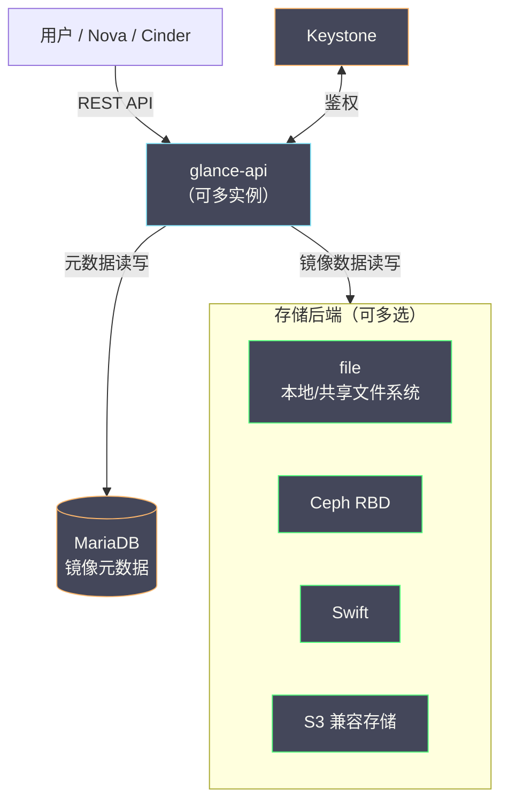
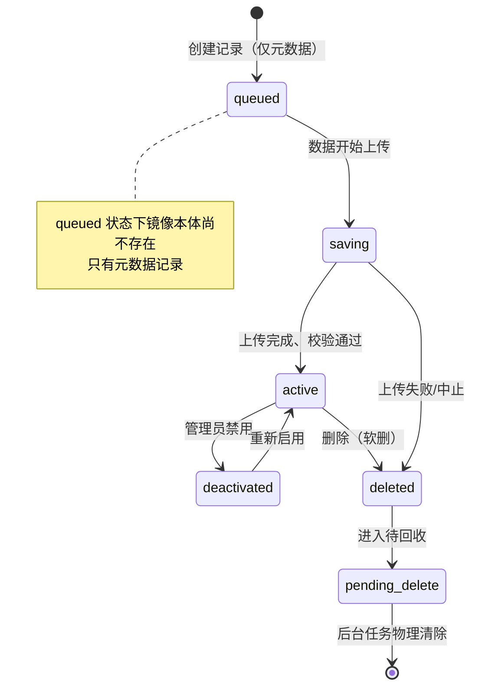

# 09 Glance 镜像服务——镜像流水线与制作实战

**摘要：**

如果说 Nova 是 OpenStack 的发动机、Neutron 是血管系统，那么 Glance 就像一座中央血库——实例的每一次开机，本质上都是"从血库里取一份血样，复制成一条新生命"。本文从镜像质量如何决定云平台的用户体验讲起，梳理 Glance 从 Nova 内嵌模块到独立服务的演进史与它的自我定位（只管仓储与元数据，不管制作），拆解 glance-api 的架构演进、存储后端的选择、镜像状态机与格式体系，然后进入本篇的重头戏：从零制作一个 Ubuntu 云镜像的完整流水线，包括 cloud-init 的安装与配置、virt-customize/virt-sysprep 的离线定制、从现有实例快照转镜像的注意事项，再深入 cloud-init 的数据源机制与三大经典故障。最后落到运维视角，谈镜像缓存预热、压缩去重、生命周期管理与故障速查。读完你应当能回答两个问题：为什么一个"看起来只是存文件"的服务值得单独一篇，以及一个合格的云镜像到底是怎么被制造出来的。

---

## 第 1 章 镜像为什么值得单独一篇

### 1.1 用户体验的天花板，往往在镜像里

先从一个值班室里的常见场景说起。用户投诉：实例开机要五分钟，控制台里盯着滚动条干着急；或者实例起来了，SSH 却连不上，密码注入也没生效；再或者实例跑起来性能比物理机差出一大截，CPU 与磁盘都查不出瓶颈。这三类投诉，新手运维的第一反应通常是查 Nova、查 Neutron、查宿主机负载，但排查到最后，相当比例的根因会落在同一个地方——**镜像本身**。

开机慢，可能是镜像里没有预装 virtio 驱动，QEMU 退化到 IDE 模拟的慢速磁盘；初始化失败，可能是镜像里的 cloud-init 版本太老，解析不了新版本元数据服务的响应；性能差，可能是镜像文件系统里堆满了发行版默认的调试日志服务，或者磁盘格式选了未对齐的 raw。换句话说，镜像决定了实例的"出厂状态"，而云平台给用户的体验，很大程度上就是这份出厂状态的体验。IaaS 层把计算、网络、存储都做对了，最后一公里却毁在一份粗糙的镜像上，这是很多私有云团队都交过学费的教训。

更麻烦的是镜像问题的**归因路径天然很长**。镜像的缺陷要等到实例启动后才显形，而启动链路上还隔着调度、libvirt、网络注入等环节，用户看到的症状（连不上、开机慢）与根因（镜像缺驱动）之间隔着好几层。笔者见过太多这样的排障：团队在 Nova 与 Neutron 里翻了两天日志，最后发现新版本镜像少打了一个 properties。镜像作为"所有实例的共同祖先"，它的一个缺陷会被复制到所有后代身上——这也是为什么镜像的变更管理值得按代码发布的标准来要求，而不是当成"传个文件"的小事。

不妨把云镜像类比成食品工业里的预制菜：用户拿到手只需要"加热"（开机），但加热快不快、味道好不好，全看预制菜在中央厨房里的配方与工艺。Glance 管的是冷链仓储与出入库登记，而"中央厨房"——镜像的制作流水线——是每一朵云的运营者自己要建的能力。这篇专栏之所以值得为镜像单独留出一篇，正是因为这条流水线上的每个环节（格式、驱动、初始化代理、清理工艺）都有工程含量，而且踩坑的成本由整个平台的用户分摊。

### 1.2 Glance 的定位：仓储与登记处，不是厨房

Glance 的自我定位需要说得很准确：它是镜像的仓储与元数据服务（Image Service），负责镜像的存储、检索、分发与生命周期登记，**但不负责制作镜像**。你没法用 Glance 的 API "生成"一个 Ubuntu 镜像，就像你没法用仓库管理系统的入库单做出一盘菜。制作镜像的工艺（装系统、配驱动、做清理）发生在 Glance 视野之外，由镜像制作者用 Packer、virt-manager、libguestfs 等工具完成，成品再"入库"到 Glance。

这个边界划分初看让人意外——一个功能这么"薄"的服务，为什么值得在 OpenStack 里占据一个核心项目的位置？答案在于**镜像在云里的角色是契约**。用户发起创建实例的请求时，Nova 拿到的只是一个镜像 ID，它必须无条件信任这个 ID 背后的东西：格式正确、驱动齐全、初始化代理就位、元数据属性真实。Glance 存在的意义，就是把这份契约登记在册——谁上传的、什么格式、多大、有哪些属性、能不能给谁用——让 Nova、Cinder、Ceph 这些下游服务可以放心地按契约办事。没有这份登记处，镜像就是散落在各处的文件，云平台就退化成了"手动拷贝磁盘镜像的虚拟化集群"。

契约这个类比还可以再推一步：契约要有**签署人与修订记录**。Glance 为每个镜像登记的所有者、创建时间、最小资源要求，就是契约的签署栏；镜像的可见性与共享机制，就是契约的授权范围。你在 `openstack image show` 里看到的那一屏输出，本质上是一份合同的全文——学会用"读合同"的眼光看镜像元数据，很多配置问题（min_disk 与 flavor 不匹配、可见性没放开、属性缺失）在打开镜像详情的那一刻就该被看出来，而不是等到实例创建失败。

### 1.3 反事实推演：没有 Glance 会怎样

不妨做个反事实推演：假如没有 Glance，镜像管理会是什么形态？其一，每个计算节点各自维护一份镜像目录，运维用脚本同步，版本漂移与"节点 A 能启动、节点 B 报格式错误"会成为日常；其二，镜像的元数据（操作系统类型、最低磁盘要求、是否带 guest agent）没有统一登记处，Nova 调度时无从判断"这个镜像适不适合这台宿主机"，错配全靠用户自己承担；其三，镜像的共享与权限没有载体，跨项目、跨租户的分发退化成管理员手工拷贝。这三条加起来，就是 2010 年之前大量私有云的真实写照。

这三条还可以再往深处追一层：它们指向的是同一个缺失——**镜像缺少"单一事实来源"（Single Source of Truth）**。分布式系统里，任何一份被多方消费的数据，如果没有一个权威登记处，就会在每个消费方那里长出自己的副本与自己的真相，然后开始互相矛盾。镜像不过是这个规律在基础设施层的又一次重演：Glance 之于镜像，正如镜像仓库（Registry）之于容器、制品库之于软件包——形态不同，角色是同一个。

而 Glance 的出现把这些职责收拢成一个服务，代价则是一层间接性：所有镜像流量都要经过它（或至少经过它的元数据校验），存储后端的选型与容量规划成了绕不开的课题。这笔账怎么算，取决于规模——三五个节点的实验环境，一个共享 NFS 目录加手工管理未必更差；但只要上了多租户、多集群的规模，一个统一的镜像登记处就是必需品。

### 1.4 镜像在组件链路中的位置

把 Glance 放回 OpenStack 的全景里看，它是少数几个"被所有计算路径依赖"的服务。实例从镜像启动（Nova 读它），根卷从镜像创建（Cinder 读它），实例的临时快照最终落回镜像库（Nova 写它），甚至裸机 provisioning（Ironic）部署物理机时读的也是它。这条依赖链意味着：**Glance 的可用性等级必须按"平台级公共依赖"来规划**——它短暂不可用，影响的不是某个功能，而是所有新实例的创建与所有卷的初始化。

不过这里有一个值得细看的缓解因素：Glance 的不可用并不等于存量实例的不可用。已经启动的实例，其磁盘内容早已落在本地盘或卷上，与 Glance 再无关系；镜像只在"从无到有创建"的那一刻被消费。这与 Neutron 的模式（agent 挂掉症状延迟爆发，见 [[云原生/OpenStack/06 Neutron 架构——ML2、OVS 与网络命名空间|06 Neutron 架构]] 第 2 章）异曲同工——**公共依赖故障的症状，总是被"存量不受影响"的假象推迟暴露**，等用户投诉时，往往已经积累了一批失败请求。所以镜像服务的监控告警（第 6 章）不能依赖用户反馈，要主动探测。

---

## 第 2 章 Glance 架构——API、存储后端与状态机

### 2.1 从 Nova 内嵌到 glance-api 一体化

Glance 的历史比大多数组件都要"资深"。2010 年 7 月 OpenStack 由 NASA 与 Rackspace 联合宣布时，镜像管理功能还内嵌在 Nova 之中；到 2011 年初的 Bexar 版本，Glance 已经作为独立服务登场——比 Neutron（2012）、Cinder（2012）的独立都要早，可见"镜像需要一个统一的家"是社区很早就达成的共识。

早期的 Glance 由两个进程组成：glance-api 对外提供 REST API，glance-registry 专职读写镜像的元数据数据库。这个拆分在今天看来有些费解，但在当年有它的道理——设计者设想 API 层与元数据层可以独立扩展、独立加固，registry 甚至可以配置成只信任内网直连，为"API 层暴露公网、元数据层深藏内网"的安全形态留了口子。不过实践中 registry 几乎总是与 api 同机部署、同生共死，拆分的收益从未兑现，反而让每个部署都多维护一个进程、多配一条内部通信。社区在 Pike 版本（2017 年）正式宣布弃用 glance-registry，Queens 版本（2018 年）将其彻底移除，两个进程合并回一个 glance-api。这段"分久必合"的演进值得记一笔，因为它是 OpenStack 历史上少有的"承认过度设计并回收"的案例——抽象层的存在必须有真实的扩展需求背书，否则它只是纯粹的运维负担。

今天的 Glance 部署形态非常简单：一个 glance-api 进程（可多实例水平扩展），一个元数据数据库（MariaDB），一个或多个存储后端，外加与 Keystone 的鉴权集成。API 层面，Glance 采用与 Nova 类似的版本协商机制——URL 里的 v2 是大版本，请求头里的 `OpenStack-image-api-version` 承载微版本，客户端与服务端按需协商能力。对运维的实际含义是：**判断"这个部署能不能用某个新镜像特性"，查的是 API 微版本与配置项，而不是 OpenStack 大版本号**——大版本只决定代码基线，特性开关散落在配置与微版本里。全景如下：



这张图里最值得注意的一点是：**镜像的"数据"与"元数据"走的是两条完全不同的路**。元数据（格式、状态、属性）进数据库，走 API 的控制路径；镜像本体（动辄几个 GB 的磁盘文件）直接在后端存储与 API 之间搬运，走数据路径。排障时要时刻分清你面对的是哪条路——"镜像列表能看到但下载失败"是数据路径的问题，"镜像列表里根本没有这条记录"才是元数据路径的问题。

### 2.2 存储后端：file、Ceph RBD、Swift 与 S3

Glance 的存储层是插件式设计，一个部署可以同时配置多种后端，创建镜像时用 `--store` 参数指定。主流选项的对比如下：

| 后端 | 存储形态 | 优势 | 代价与注意点 |
| :--- | :--- | :--- | :--- |
| file | 本地目录或共享文件系统 | 零依赖、最简单 | 单机容量受限；多实例共享需 NFS 等共享存储，否则各节点镜像不一致 |
| Ceph RBD | 分布式块存储的池 | 与 Cinder 共用集群，实例可直接克隆（copy-on-write），秒级开机 | 依赖 Ceph；镜像必须是 raw 格式才能分层克隆 |
| Swift | 对象存储 | 容量弹性好、多副本、天然适合大文件 | 多一跳网络传输；需要 Swift 集群的运维能力 |
| S3 兼容 | 对象存储 | 便于对接既有对象存储设施 | 网关类后端，功能与稳定性弱于原生后端 |

选型的核心权衡在**"与下游的亲密度"**。file 后端最简单，但 Nova 每次启动实例都要从 Glance 节点拉全量镜像，镜像越大、节点越多，这个集中式拷贝就越成为瓶颈；Ceph RBD 后端则让镜像与实例卷同处一个池，Nova 可以用分层克隆（clone）直接从镜像派生卷，把"拷贝几个 GB"变成"创建一个克隆对象"，这是生产环境大规模部署的事实标准组合（与 [[云原生/OpenStack/08 Cinder 块存储——卷生命周期与 Ceph RBD 后端|08 Cinder 块存储]] 中的卷后端是同一套 Ceph）。Swift 后端介于两者之间，适合已经有 Swift 集群、又不想让镜像挤占块存储池的场景。

这张表里最有信息量的一行是 RBD：它把"镜像"与"实例盘"的边界从拷贝变成了引用——传统流程里镜像要被复制成实例的磁盘，RBD 流程里实例盘只是镜像的一个克隆视图，物理数据在写时才分裂。**这一字之差（拷贝变引用），就是秒级开机与分钟级开机的差距**，也是生产部署倾向 RBD 后端最有分量的理由。

还有一个容易被忽略的架构细节：Glance 支持把一个镜像的多个存储位置（location）记录在元数据里，下游可以直接从位置读取。这个能力（`show_multiple_locations`）能减少中转，但等于把存储后端的访问凭据暴露给了有权限读镜像的租户，社区因此默认关闭它——**性能优化与安全边界之间的这笔账，Glance 替你做了保守的选择**，除非你明确知道自己在做什么，否则不要打开。

后端选型还有一条与团队现状相关的隐性维度：**你已有的运维能力**。选 Ceph RBD 的前提是团队有 Ceph 集群的运维能力（或与 Cinder 共享同一套集群的治理约定）；选 Swift 的前提是 Swift 集群有人管；file 后端看似零依赖，实则把容量规划与单点风险留给了 Glance 节点自己。存储选型从来不是纯技术打分，而是"这个后端的运维账单由谁、用什么能力来付"的问题——这与 [[云原生/OpenStack/08 Cinder 块存储——卷生命周期与 Ceph RBD 后端|08 Cinder 块存储]] 中卷后端的选型逻辑完全同构，两处决策最好放在同一张资源规划表里做。

### 2.3 多后端并存与迁移的现实

多后端支持还有一个工程上的现实意义：**存储迁移不必停摆**。Glance 允许同一个部署里新旧后端并存，运维可以新镜像走新后端、存量镜像按计划逐个搬迁，而不是一次性的大爆炸切换。搬迁的路径也现成：`glance image-download` 把镜像字节拉下来，`glance image-create`（或 `openstack image create`）指向新后端重新上传，元数据属性原样带上即可。整个过程对下游是透明的——镜像 ID 可以保持不变（用元数据更新 location 的方式），Nova 与用户的脚本无感知。

不过要给这份便利泼一盆冷水：迁移的难点从来不在 Glance 这一层，而在**下游的隐性耦合**。走 file 后端多年的环境里，Nova 的 _base 缓存（第 6 章详述）里躺着旧镜像的本地副本，迁移后这些缓存与 Glance 的对应关系要靠缓存管理器自然收敛；直接读后端路径的运维脚本（绕过 API 拿文件的那种，几乎每个老环境都有几个）会静默失效；备份策略如果按后端目录结构设计，也要跟着改。**存储层的迁移，清单的一半永远在存储层之外**，这是所有"可插拔"架构共同的迁移税。

### 2.4 镜像状态机：一次上传的完整旅程

Glance 里的每个镜像都有一台明确的状态机，它是理解上传类故障的钥匙：



逐个状态说清楚。**queued** 表示 API 已经受理了创建请求、元数据已入库，但镜像字节还一个都没到——用户可以先用一个 queued 的占位记录占住 ID，再慢慢传数据。**saving** 是数据正在写入后端的传输态，几 GB 的镜像在这个状态停留几分钟是正常的。**active** 是唯一"可用于创建实例"的就绪态。**deactivated** 是管理员主动按下的暂停键——镜像还在、元数据还在，但禁止任何新实例使用它，典型用途是某镜像被发现有安全漏洞时先冻结再排查。**deleted** 与 **pending_delete** 构成软删除的两级：前者是逻辑删除（可恢复），后者是等待后台任务物理清除的终审状态。

状态机里藏着两个经典故障的答案。其一是"镜像卡在 saving 不动"——数据路径断了（后端存储不可写、网络中断、进程被杀），状态会长期停留在 saving，需要管理员清理这条僵尸记录；其二是"上传报错后镜像列表里还有一条记录"——那是 queued 或 saving 的残骸，不清理会一直占着名字。**看状态机定位故障阶段，是镜像排障的第一步**。

状态机还有一个与运维习惯相关的推论：Glance 的状态转换大多是单向的，回退手段有限——saving 卡死后没有"重新续传"的官方路径，只能删记录重传。这决定了镜像上传的工程实践应当**优先保证可重试**：大镜像的分块上传、失败后的自动清理与重传逻辑，值得写进发布脚本，而不是依赖人工盯着进度条。把状态机的约束当成流程设计的输入，是这套机制给运维的真正价值。

### 2.5 镜像格式：disk_format 与 container_format

Glance 用两个字段描述镜像的封装：container_format 描述"外层容器"（绝大多数场景是 bare，即无容器；aki/ari/ami 等历史格式除外），disk_format 描述"里面的磁盘镜像本体"。真正影响日常运维的是 disk_format：

| disk_format | 本质 | 优势 | 劣势与适用 |
| :--- | :--- | :--- | :--- |
| raw | 无结构的裸磁盘镜像 | 性能最好（无格式开销）、可稀疏存储、Ceph 分层克隆的前提 | 文件尺寸等于磁盘尺寸（稀疏依赖文件系统）、无快照等高级特性 |
| qcow2 | QEMU 写时复制格式 | 支持压缩、快照、后端镜像（backing file）、按需增长 | 有元数据开销；作为 Glance 上传格式时 Nova 仍要转换 |
| iso | 光盘镜像 | 用于安装型镜像（挂载后引导安装） | 不能直接作为实例磁盘 |
| aki/ari/ami | Amazon 遗产三件套 | 内核/内存盘/镜像分离启动（EC2 兼容） | 历史包袱，现代部署几乎不再使用 |

这里要澄清一个高频误区：**Glance 里的 disk_format 不等于实例运行时的磁盘格式**。Nova 从 Glance 拉到镜像后，会按计算节点上 libvirt 的配置（`use_cow_images` 等参数）把镜像转换成实例后端需要的格式——Glance 存 qcow2 不代表实例跑在 qcow2 上，Glance 存 raw 也不代表实例用 raw。Glance 的格式字段更多是"入库登记"，真正的格式决策发生在 Nova 与后端存储的交界处。运维需要记住的实用结论是：**走 Ceph RBD 后端时，上传 raw 格式镜像**（分层克隆的前提）；走 file 后端时，上传压缩过的 qcow2（省传输与缓存空间），让 Nova 在节点上自行转换。

格式转换还有一个隐蔽的坑值得单独立牌：**qcow2 的后端镜像（backing file）依赖**。一个 qcow2 文件可以声明"我的基础数据在另一个文件里"，本机使用时 QEMU 会自动拼接两层——但这个引用是路径绑定的，把这样的镜像上传到 Glance 再分发到别的节点，backing file 的路径十有八九不存在，实例启动时直接报"无法打开镜像链"。制作流程里用 `qemu-img convert` 产出镜像的价值正在于此：convert 会把镜像链"压扁"成独立完整的单文件，切断对原环境的路径依赖。拿到任何来路不明的 qcow2，先 `qemu-img info` 看一眼 backing file 字段，是镜像入库前的固定动作。

---

## 第 3 章 镜像元数据——properties、metadefs 与调度的呼应

### 3.1 自由属性：properties 的力量与危险

Glance 镜像的元数据分两层：一层是**固定 schema 的核心字段**（disk_format、min_disk、min_ram、os_type 等），另一层是**完全自由的键值对 properties**。核心字段管住"这个镜像是什么"，properties 则回答"这个镜像希望被怎样对待"——它是一张递给下游服务的便签，Nova、Cinder、libvirt 都会来读。

几个高频 properties 值得点名认识。`hw_qemu_guest_agent=yes` 声明镜像内置了 QEMU guest agent，libvirt 会为实例创建 guest agent 通道，热插拔网卡、冻结文件系统做快照等能力依赖它；`os_type=linux|windows` 告诉 libvirt 用哪套默认设备模型（Windows 镜像不给这个标记，可能拿到一套 Windows 不认识的磁盘控制器）；`hw_disk_bus=virtio`、`hw_vif_model=virtio` 显式指定磁盘与网卡的设备模型；`img_config_drive` 控制是否挂配置盘。min_disk 与 min_ram 则是镜像对宿主的"最低要求声明"，Nova 会用它校验 flavor 是否满足。把常用项收拢成一张表：

| 属性 | 取值示例 | 谁在读 | 缺失/写错的症状 |
| :--- | :--- | :--- | :--- |
| hw_qemu_guest_agent | yes | libvirt | guest agent 通道不建立，热插拔与在线操作静默失败 |
| os_type | linux / windows | libvirt | 设备模型错配，Windows 实例可能无法识别磁盘 |
| hw_disk_bus / hw_vif_model | virtio / scsi / ide | libvirt | 磁盘网卡退化为慢速模拟设备，性能大幅劣化 |
| os_distro / os_version | ubuntu / 24.04 | 工具链与展示层 | 镜像列表与自动化脚本无法按发行版筛选 |
| min_disk / min_ram | 10 / 1024 | Nova 校验 | 小 flavor 强行启动，运行中磁盘写满或 OOM |
| img_signature 系列 | 签名与哈希值 | Nova 签名校验 | 开启强制签名的环境下镜像被拒绝调度 |

properties 的力量在于它的开放性——任何服务都可以定义自己的约定键；危险也恰恰在这里：**自由键值对没有任何语法校验，写错的代价是静默的**。`hw_qemu_guest_agent` 拼成了 `hw_qemu_guestagent`，不会报错，只是 guest agent 通道不出现，然后"热插拔不生效"的工单就来了。笔者的建议是把团队镜像的 properties 约定固化成制作流水线里的固定步骤（后文第 4 章会落到具体命令），而不是依赖人工记忆。

properties 还有一个与直觉相悖的特性值得交代：**它会随镜像的派生而扩散**。从快照生成的镜像继承源镜像的全部属性，从快照镜像再派生的实例再做快照，属性就传到了第三代——源头写错的一个属性，可能在镜像谱系里存续几代而不被察觉。治理上可行的对策是定期从"谱系根"（标准镜像）做属性核对，而不是只盯着新上传的镜像；发现属性漂移时，用 `openstack image set` 修正即可，属性是元数据，改起来不碰镜像字节。

### 3.2 metadefs：给自由键值对立规矩

properties 的"自由"很快在大组织里失控——不同团队对同一个语义各起各的键名，镜像属性成了没有字典的方言。社区在 Icehouse 版本（2014 年）引入了元数据定义服务（Metadata Definition Service，简称 metadefs）：用"命名空间（namespace）→ 对象（object）→ 属性（property）"三级结构，把"允许哪些键、什么类型、什么取值范围、适用于哪类资源"定义成可导入导出的目录。Glance 自带一套覆盖操作系统、CPU 特性、磁盘总线等常见维度的默认目录，管理员也可以定义自己的命名空间（譬如把"合规等级"做成一个必填属性）。

metadefs 与 properties 的关系，好比"词法字典"与"自由作文"的关系：字典规定了合法词汇，但作文（properties 的实际写入）依然不强制查字典——metadefs 的约束力主要来自 Horizon 界面与工具链的引导，而非 API 层的硬校验。这个"软约束"的设计常被批评不够强硬，但它换来了兼容性：历史镜像上那些不合规范的旧属性不会因为目录升级而失效。理解了这一点，你对 metadefs 的期望就该校准为——**它是治理工具，不是防火墙**。

metadefs 的另一个实用价值常被低估：**它是跨环境对齐属性约定的通用语言**。多套环境（生产/灾备、开发/生产）的镜像属性约定容易各自漂移，metadefs 的命名空间可以导出成 JSON 文件在环境间导入，让"合规等级""镜像负责人"这类组织自定义属性在所有环境里键名一致、类型一致。比起写一份没人看的属性规范文档，一份可导入的 metadefs 定义文件才是真正可执行的约定。

落地 metadefs 还有一个务实的起步建议：不必一上来就定义自己的命名空间，先把 Glance 自带的默认目录导入并启用（Horizon 的管理员面板里有现成入口），让 os_distro、CPU 架构这类通用属性在界面里变成下拉选项而不是自由文本——光是这一步，就能消灭大部分"手滑写错属性值"的事故。自定义命名空间留给组织真正特有的语义（合规等级、成本中心），按需渐进地加。

### 3.3 镜像属性如何影响调度：与 Nova 的呼应

镜像元数据最有存在感的时刻，是在 Nova 的调度链路上。Nova 的调度器里有一个专门的过滤器 ImagePropertiesFilter，它把镜像的 properties 与候选计算节点的能力做匹配：镜像声明 `hw_cpu_arch=x86_64` 而节点是 ARM，淘汰；镜像要求特定的 `hw_rng_model`（随机数设备）而节点不支持，淘汰。此外，min_disk/min_ram 会参与 flavor 校验，`img_signature` 相关属性则触发签名验证流程（见第 6 章）。换句话说，**镜像的 properties 是调度器的输入之一**——一份属性缺失或错误的镜像，轻则被调度到不合适的节点（性能劣化），重则所有节点都被过滤掉、实例创建直接失败（报错 No valid host，而根因在镜像属性）。

这个机制与 [[云原生/OpenStack/04 Nova 架构与调度——API、Scheduler 与资源模型|04 Nova 架构与调度]] 中的调度过滤器体系是一体的：flavor 描述"实例要什么"，镜像 properties 描述"镜像要什么"，两者共同收窄候选节点集合。运维视角的推论很直接：**新镜像上线前，把它的 properties 与既有同系列镜像 diff 一遍，应当成为发布检查清单的固定项**——属性层面的回归，比代码层面的回归更隐蔽，也更常见。

顺带把这条链路的另一端也补全：镜像属性不仅影响"能不能调度"，还影响"调度到哪之后怎么启动"。libvirt 生成实例 XML 时会读取镜像的设备模型属性（hw_disk_bus 等），Nova 的启动流程里，镜像元数据是继 flavor 之后的第二个输入源。所以镜像属性错误的故障谱系横跨调度与启动两段——"No valid host"是调度段的症状，"实例卡在开机"是启动段的症状，同一个根因（属性写错），两种完全不同的临床表现，这是镜像类故障迷惑性的又一个来源。

---

## 第 4 章 镜像制作实战——从零到入库的完整流水线

### 4.1 三条制作路线与取舍

镜像制作没有唯一正解，但路线可以归成三条，各有明确的适用场景：

| 路线 | 做法 | 优势 | 劣势 |
| :--- | :--- | :--- | :--- |
| 官方云镜像 + 定制 | 直接使用发行版提供的云镜像（已内置 cloud-init），按需注入定制 | 最快、最不容易出错 | 定制深度受限于发行版给的底子 |
| 从零安装 | ISO 引导安装最小系统，手工/脚本完成云化改造 | 完全可控、可裁剪到极小 | 工序最多，容易漏步骤 |
| 快照派生 | 从运行中的实例制作快照转镜像 | 无需安装工序、贴近真实运行态 | 继承实例的全部状态（含垃圾），需清理 |

三条路线不是互斥的，成熟团队的常见组合是：以官方云镜像为基线（覆盖 80% 场景），用从零安装维护少数深度定制的镜像（譬如最小化安全基线镜像），快照派生只用于"把调好的环境固化下来"这类临时需求。本章以信息量最大的第二条路线为主线走完整流程，其余两条在 4.5 节补述。

在开工之前还有一句提醒：**无论哪条路线，镜像都应当有版本化的命名与变更记录**。`ubuntu-24.04-20260901` 这样的名字、一份记录"这版改了什么"的流水账，是镜像库从"文件堆"变成"资产管理"的分界线。镜像没有版本管理的团队，迟早会在"哪个版本是稳定的"这个问题上付出整晚的代价。

### 4.2 从零制作一个 Ubuntu 云镜像

假设目标是一个 Ubuntu Server 24.04 的云镜像，工艺流程分五步：装系统、装云化组件、配初始化、做清理、转格式入库。逐步展开。

**第一步，装最小系统。** 用 virt-manager 或带图形的 libvirt 环境从 ISO 引导安装，磁盘给一个适中的尺寸（譬如 10 GB，后续可由 cloud-init 自动扩容），分区不建 LVM（云环境里直连根分区最省事，growpart 扩容工具对裸分区支持最好），软件包只选 OpenSSH server。这一步的原则是**克制**——装进去的每一个包，都会被这个镜像的成千上万个实例后代继承。

安装环节还有两个容易遗漏的细节。其一是引导方式要与目标环境一致：目标平台的计算节点若以 BIOS 引导为主，制作时就不要选 UEFI（反之亦然），引导方式烙进镜像后很难事后更改，而"镜像引导方式与节点固件不匹配"的报错（实例起不来、控制台黑屏）排查方向非常冷僻。其二是安装时区与语言环境要按团队约定统一——镜像里的 locale 配置会被所有实例继承，事后逐台修改的成本远高于制作时多花的一分钟。顺带一提，安装介质本身也建议固定版本并留存：镜像出问题时，"当初用哪张 ISO 装的"往往是最难回答、也最容易回答的问题。

**第二步，装云化组件。** 系统装好后进入虚拟机，安装三件套：

```bash
sudo apt update
# cloud-init：开机时对接元数据服务，注入主机名/密钥/网络
sudo apt install -y cloud-init
# qemu-guest-agent：与宿主机 libvirt 通信，支持热插拔与冻结快照
sudo apt install -y qemu-guest-agent
# acpid：让实例能响应 OpenStack 控制台的软关机/重启指令
sudo apt install -y acpid
```

这三个包各自对应一类"没有它就出怪事"的症状：缺 cloud-init，实例的主机名、SSH 密钥、IP 全部要手工配；缺 qemu-guest-agent，`openstack server show` 里看不到实例的 IP 地址，热插拔操作静默失败；缺 acpid，用户点"软关机"实例毫无反应，只能硬断电（相当于每次关机都是拔电源）。

三件套之外还有两个按需选装的组件。一是 cloud-guest-utils（含 growpart，根分区自动扩容的执行者，部分发行版把它独立打包）；二是发行版的 virtio 驱动包（Ubuntu 内核默认内置，Windows 镜像则必须显式安装 virtio-win 驱动并写入注册表，这是 Windows 云镜像制作比 Linux 麻烦一大截的核心原因）。选装的原则与三件套同理：**每多一个组件，先想清楚它对应哪类症状、值不值得被所有实例继承**。

**第三步，配置 cloud-init 的数据源。** 编辑 `/etc/cloud/cloud.cfg.d/90_dpkg.cfg`（或新建 `99_datasource.cfg`），把数据源白名单限定为 OpenStack 与 ConfigDrive，避免 cloud-init 在启动时对不存在的数据源做超时探测——这是"云镜像开机比物理机还慢"的经典原因，探测超时默认能吃掉几十秒：

```yaml
# datasources 列表即探测顺序，白名单越短，开机越快
datasource_list: [ OpenStack, ConfigDrive, None ]
```

同一步里还要确认默认用户。Ubuntu 官方云镜像约定俗成用 `ubuntu` 用户，自建镜像可以沿用，也可以定义 `cloud-user` 之类的团队约定用户——关键在于 cloud.cfg 里的 users 段要声明"这个用户由 cloud-init 在首次开机时创建、加入 sudo、禁止密码登录只允许密钥"，而不是在制作镜像时手工建好一个带密码的用户（那会把密码烙进镜像，成为所有实例后代的公共后门）。

这一步还有一条值得单独强调的纪律：**cloud-init 的版本要锁定并纳入镜像的版本记录**。cloud-init 的配置语法与模块行为在版本间有真实差异（第 5 章的 chpasswd 格式变化就是一例），"镜像里装的是哪个版本的 cloud-init"应当像记录镜像版本号一样记录在案——出问题时，你与上游 issue 区对话的第一句话就是它。

**第四步，清理与"去个性化"。** 安装过程留下的痕迹——SSH 主机密钥、machine-id、apt 缓存、日志——如果不清除，会被所有实例继承：两台实例共用同一对 SSH 主机密钥是严重的安全问题，相同的 machine-id 会让基于它的标识体系（譬如 DHCP client-id）互相混淆。清理交给 virt-sysprep（4.4 节详述），制作流程里只需要记住这一步不可省。

清理这一步还有一个方向相反的补充动作容易被忽略：**有些东西要主动留下**。cloud-init 的数据源白名单、guest agent 的开机自启、团队约定的 sudo 规则，这些是镜像的"出厂配置"，清理的边界是"去个性化"而非"去配置化"——sysprep 的 enable 参数之所以要显式列出清理项（而不是全量清理），正是为了让你能划清这条边界。全量清理会把 cloud-init 的配置也一并抹掉，镜像反而废了。

**第五步，压缩转换与入库。** 把制作好的磁盘转成压缩 qcow2 并上传：

```bash
# -c 压缩：镜像体积通常能缩到原始的一半以下，直接决定后续下载与缓存的速度
qemu-img convert -c -O qcow2 ubuntu2404.raw ubuntu2404.qcow2
openstack image create "ubuntu-24.04-cloudimg" \
  --file ubuntu2404.qcow2 --disk-format qcow2 --container-format bare \
  --min-disk 10 --min-ram 1024 \
  --property hw_qemu_guest_agent=yes \
  --property os_type=linux --property os_distro=ubuntu --property os_version=24.04
```

上传后用 `openstack image show` 核对状态到了 active、properties 齐全，再用它拉一个最小实例做冒烟测试（能否开机、能否注入密钥、guest agent 是否在线），测试通过才算流水线交付。

### 4.3 制作流水线的验收清单

第 4.2 节的工序走完，交付前还差一道验收。把冒烟测试要核对的项目固化成清单，是流水线工程化的最后一块拼图：

| 验收项 | 验证方法 | 对应工序 |
| :--- | :--- | :--- |
| 开机时间在预期内 | 计时从启动到 SSH 可达（譬如 60 秒内） | 数据源白名单、virtio 驱动 |
| 密钥注入生效 | 用注入的密钥 SSH 登录成功 | cloud-init users 段 |
| 主机名按元数据设置 | `hostnamectl` 核对 | cloud-init set_hostname |
| 磁盘自动扩容 | flavor 磁盘大于 10 GB 时，`df` 看根分区已扩 | growpart + resizefs |
| guest agent 在线 | `openstack server show` 能看到实例 IP | qemu-guest-agent |
| 软关机正常 | 控制台点关机，实例干净下电 | acpid |
| 无残留密钥 | `ls /etc/ssh/` 下无 host key（首次开机重新生成） | virt-sysprep |
| properties 齐全 | `openstack image show` 核对属性表 | 入库命令 |

这份清单的价值不在单项的深奥，而在**完整**——八项里任何一项漏验，问题都会以"某个用户某天反馈"的方式回来，届时排查成本十倍于制作时多花的三分钟。

### 4.4 virt-customize 与 virt-sysprep：不开机也能改镜像

上一节的流程要反复引导虚拟机，工序重、速度慢。libguestfs 工具族提供了另一条路：**离线定制**——直接挂载镜像文件系统改内容，不启动任何虚拟机。两个主力工具的分工是：virt-customize 负责"做加法"（装包、改配置、执行命令），virt-sysprep 负责"做减法"（清理个性化痕迹）。

```bash
# 加法：离线安装 cloud-init 与 guest agent，注入配置
virt-customize -a ubuntu2404.raw \
  --install cloud-init,qemu-guest-agent,acpid \
  --run-command 'systemctl enable qemu-guest-agent' \
  --write '/etc/cloud/cloud.cfg.d/99_datasource.cfg:datasource_list: [ OpenStack, ConfigDrive, None ]'

# 减法：清理主机密钥、machine-id、日志与临时文件
virt-sysprep -a ubuntu2404.raw \
  --enable ssh-hostkeys,machine-id,logfiles,tmp-files,net-hwaddr
```

这套离线工艺把第 4.2 节的五步压缩成"virt-customize 一条命令 + virt-sysprep 一条命令 + convert 一条命令"，而且天然可脚本化——配合 Packer 或纯 shell 脚本，镜像制作可以完全进入 CI 流水线，每次发行版安全更新自动产出新镜像。**镜像制作的工程化程度，是衡量一朵云运营成熟度的隐性指标**：还在用"手工开虚拟机装系统"工艺的团队，镜像更新的频率通常低到安全补丁追不上漏洞披露。

脚本化之后还有一层值得做的：**给流水线加版本追溯**。每次流水线产出镜像时，把触发的 git 提交号、基础镜像版本、构建时间写进镜像的一个自定义属性（譬如 `builder_commit`），出问题时一条 `openstack image show` 就能回答"这个镜像是哪次构建、基于什么底子做的"。镜像的可追溯性在出事故的那天，价值会超过流水线里其他所有优化。

不过离线工艺也有边界要交代：virt-customize 装包依赖镜像内能跑包管理器（需要 libguestfs 的 appliance 支持，且某些发行版组合有兼容性坑），内核模块级的修改（譬如安装新内核的驱动）仍然建议走真机安装路线。把离线工具当主力、真机安装当兜底，是笔者的建议。

> [!warning] libguestfs 的超级权限陷阱
> virt-customize 与 virt-sysprep 直接以 root 身份操作镜像内的文件系统，镜像里的启动脚本、udev 规则、文件系统标签都可能被触发或改写——这既是它强大的原因，也是它的风险所在。对来路不明的镜像执行离线定制前，先在隔离环境里做一次只读检查（`virt-inspector` 或 guestfish 的只读模式），确认镜像内容与预期相符再动手；生产镜像库的写操作，应当只对流水线自己产出的镜像执行。

### 4.5 快照转镜像：便利背后的继承问题

第三条路线——从现有实例制作镜像——是运维最常用也最容易踩坑的。命令本身一行：`openstack server image create --name my-golden <实例>`，Nova 会对实例磁盘做快照（运行中的实例是活快照，等价于文件系统在写入中途按下的暂停键）并注册成 Glance 镜像。它的便利无可替代：把一个调通了的环境一键固化，下次直接以它为模板开机。

但快照镜像继承的不只是你调好的东西，还有**实例的全部状态**。逐一清点继承物：SSH 主机密钥与 machine-id（与 4.2 节同样的安全问题，且快照路线没有 sysprep，需要你手工回源清理或接受风险）；实例开机时 cloud-init 写入的配置（主机名、网络渲染结果——好在 cloud-init 以 instance-id 为界，新实例的 instance-id 不同，大部分配置会重新生成）；实例上运行过的业务数据与日志（黄金镜像里带着上一个项目的数据库文件，是真实发生过的乌龙）；以及密码与密钥的残留（`/home` 下各用户的 authorized_keys、历史密码 hash）。所以快照转镜像的纪律是：**先停机、再清理、后快照**——停机保证快照的文件系统一致性，清理（删日志、清密钥、sysprep 化处理）保证不带走隐私，最后才值得按下快照键。运行中快照只用于"聊胜于无"的应急备份场景。

快照路线还有两个尺寸与格式层面的注意点。其一，快照镜像的尺寸等于实例 flavor 的磁盘尺寸而非实际用量——一个 100 GB flavor 的实例即使只用了 3 GB，快照也是 100 GB 的登记尺寸（qcow2 实际文件会小，但 min_disk 与下游预期都按 100 GB 走），用它派生实例时 flavor 选择会被这个数字约束。其二，快照镜像的 disk_format 跟随实例后端格式，若后端是 Ceph RBD 的 raw，快照天然是 raw，可以直接被分层克隆复用；若后端是本地 qcow2，快照镜像再分发到其他节点时还要经过一次转换。**快照适合"环境固化"，不适合当"标准镜像"长期维护**——标准镜像应当回到制作流水线上生产，快照只是它的临时替身。

---

## 第 5 章 cloud-init 深入——实例初始化的契约

### 5.1 cloud-init 的定位与四个阶段

第 4 章反复出现的 cloud-init，值得单独一章把它说透。这个项目 2008 年前后诞生于 Canonical，最初是为了让 Ubuntu 镜像能在 EC2 上开机自配置，如今已是跨发行版的云初始化事实标准——OpenStack、AWS、Azure、私有 KVM 环境都靠它完成"镜像出厂后的最后一公里"。它的职责边界同样要说准：**cloud-init 只负责"首次/每次开机时根据元数据配置系统"，不负责镜像制作**——但它与镜像制作深度耦合，因为镜像里 cloud-init 的版本与配置，决定了实例初始化能力的上限。

cloud-init 在开机时按固定顺序跑四个阶段，理解阶段顺序是排障的前提：```mermaid
%%{init: {'theme': 'dracula'}}%%
flowchart LR
    A["init-local<br/>（本地阶段：不依赖网络<br/>挂载数据源、识别 instance-id）"] --> B["init<br/>（网络阶段：配网络<br/>拉取元数据与 user-data）"]
    B --> C["modules --config<br/>（配置类模块：<br/>写入主机名、ssh 配置等）"]
    C --> D["modules --final<br/>（最终类模块：<br/>执行 runcmd、装包、起服务）"]

    classDef stage fill:#44475a,stroke:#8be9fd,color:#f8f8f2
    class A,B,C,D stage
```

每个模块还带着执行频率的标记（per-once / per-instance / per-always），譬如 growpart（扩容根分区）是 per-instance——只在 instance-id 变化时跑一次。排障时先问自己"问题出在哪个阶段"，再看对应阶段的日志（`/var/log/cloud-init.log` 与 `cloud-init-output.log`），比漫无目的地翻日志高效得多。把与运维关系最密的几个模块按频率归类：| 模块 | 职责 | 执行频率 | 排障提示 |
| :--- | :--- | :--- | :--- |
| growpart / resizefs | 根分区与文件系统扩容 | per-instance | flavor 磁盘变大但分区没扩，先查这两个模块日志 |
| set_hostname | 按元数据设置主机名 | per-always | 主机名"回退"的元凶，preserve_hostname 可关 |
| ssh | 生成主机密钥、注入 authorized_keys | per-instance | 密钥注入失败看此模块 |
| users-groups | 创建 user-data 声明的用户 | per-instance | 用户没建出来，核对 user-data 语法 |
| runcmd / scripts-user | 执行自定义命令与脚本 | per-instance | 业务初始化脚本的挂载点，失败看 output 日志 |
| package-update-upgrade-install | 按声明安装/升级软件包 | per-instance | 开机慢的常见来源，按需关闭 |

### 5.2 数据源：nocloud、user-data 与 meta-data

cloud-init 的一切配置都来自**数据源（datasource）**——一份开机时能取到的"出生证明"。OpenStack 环境里最常用的是 OpenStack 元数据服务（实例访问 169.254.169.254，链路在 [[云原生/OpenStack/06 Neutron 架构——ML2、OVS 与网络命名空间|06 Neutron 架构]] 的 metadata agent 一节拆过）与 ConfigDrive（把元数据做成一块挂载给实例的配置盘，适合没有元数据链路的场景）。两者怎么选？元数据服务的优势是**动态**——实例运行期间元数据可以更新（譬如密码重置、安全组变化能被实例感知），且不占用额外磁盘；ConfigDrive 的优势是**不依赖网络链路**——元数据服务那条 169.254.169.254 的链路横跨 Neutron 的命名空间与 agent，任何一环故障都会让实例卡在初始化，而 ConfigDrive 是一块随实例创建就挂好的本地盘，开机即可读。生产环境常见的稳妥组合是两者都启用（数据源白名单里并列），cloud-init 会按优先级取用。

而 **nocloud** 是最朴素也最通用的数据源：不依赖任何网络服务，只要实例能挂到一个卷（通常是一张 ISO，卷标 cidata），里面放两个文件——meta-data 与 user-data——cloud-init 就能完成初始化。本地测试镜像、虚拟化环境之外的复用，nocloud 都是标配。

两个文件的内容分工明确。meta-data 是实例的"身份信息"，最简形态只有两行：

```yaml
instance-id: iid-local01
local-hostname: test-vm
```

user-data 则是"配置指令"，支持两种形态：以 `#!` 开头的 shell 脚本（首次开机执行一次），或以 `#cloud-config:` 开头的声明式 YAML（能力更全，推荐）：

```yaml
#cloud-config
users:
  - name: cloud-user
    sudo: ALL=(ALL) NOPASSWD:ALL
    groups: sudo
    shell: /bin/bash
    ssh_authorized_keys:
      - ssh-ed25519 AAAA... test@laptop
ssh_pwauth: false
chpasswd:
  expire: false
  users:
    - name: cloud-user
      password: 不会生效因为上面禁了密码认证
      type: text
runcmd:
  - echo "final 阶段执行" >> /var/log/custom.log
```

OpenStack 的元数据服务本质上是把同样的结构通过 HTTP 提供：meta-data 对应元数据服务的实例信息，user-data 对应创建实例时 `--user-data` 传入的内容。理解了 nocloud 这对文件，你就理解了 OpenStack 元数据服务的语义——**它只是把这对文件的分发，从"挂 ISO"升级成了"访问固定地址"**。

### 5.3 用 nocloud 打通镜像开发的本地闭环

nocloud 的实用价值值得单独一节：它是镜像开发与 user-data 调试的**本地闭环工具**。制作镜像时不必每次都上传到 Glance、再开实例验证——把 meta-data 与 user-data 两个文件做成一张 cidata 卷标的光盘镜像，挂给本地的 KVM 虚拟机，cloud-init 就会像在 OpenStack 里一样完成初始化：

```bash
# 把两个文件打包成一张 cloud-init 可识别的种子 ISO
genisoimage -output seed.iso -volid cidata -joliet -rock user-data meta-data
# 本地 KVM 验证：种子 ISO 挂给虚拟机，cloud-init 自动读取
virt-install --name imgtest --memory 2048 --disk ubuntu2404.qcow2 \
  --cdrom seed.iso --import --noautoconsole
```

这个闭环把第 4 章制作流水线里的"冒烟测试"环节从云平台搬到了开发机上：user-data 的语法错误、cloud-init 的阶段日志、模块的执行结果，都能在本地几分钟内看到，而不是走一遍"上传 Glance、调度开机、登实例看日志"的平台流程。**镜像开发的迭代速度，取决于验证闭环的长短**——nocloud 就是那个把闭环从分钟级压到秒级的支点。

### 5.4 三大经典故障：网络不生效、主机名回退、密码注入失败

cloud-init 的故障有三大高频款，逐一给出根因与排查路径。开始之前先交代统一的取证入口：`cloud-init status --long` 一条命令就能看到各阶段的执行状态与耗时，`cloud-init.log` 记录模块的决策过程（选了哪个数据源、哪个渲染器），`cloud-init-output.log` 记录模块的执行输出（脚本的标准输出与报错）——两个日志文件加一个状态命令，是所有 cloud-init 排障的第一站。

**其一，网络不生效。** 症状是实例开机后网络配置与预期不符，或干脆没有网络。最常见的根因是**渲染器（renderer）与系统版本不匹配**：老版本 cloud-init 在新系统上往 `/etc/network/interfaces`（Debian 系的 ENI 格式）写配置，而系统实际由 netplan/systemd-networkd 管网络，写进去的配置无人消费。排查方向是看 `cloud-init.log` 里 network 阶段选了哪个 renderer，再核对镜像内 cloud-init 版本与发行版的对应关系。另一类根因是镜像制作时残留了旧的网卡配置（sysprep 的 net-hwaddr 清理项就是防这个——MAC 地址变了而配置里写着旧 MAC，接口起不来）。还有一类与 OpenStack 侧有关：创建实例时若显式指定了固定 IP 之外的端口配置（多网卡、无 DHCP 的子网），cloud-init 的 DHCP 等待会超时，表现为开机阶段卡在"网络配置"数分钟——这类问题的解法在镜像侧是缩短 DHCP 超时，在平台侧是保证 DHCP agent 的健康（链路见 [[云原生/OpenStack/06 Neutron 架构——ML2、OVS 与网络命名空间|06 Neutron 架构]] 第 4 章）。

**其二，主机名回退。** 用户改了主机名，重启后又被改回元数据里的名字，这类工单几乎每周都有。根因是 cloud-init 的 set_hostname 模块默认在每次开机时按元数据重设主机名——这是设计行为，不是 bug。解法是在镜像或 user-data 里声明 `preserve_hostname: true`（交还命名权），或者接受"主机名由平台管理"的约定、让用户改用 `hostnamectl` 之外的持久化方案。运维要做的不是抱怨这个行为，而是**把它写进镜像的默认配置，让约定显式化**。

**其三，密码注入失败。** 用户通过 `--property` 或控制台设置了 root/用户密码，实例里却登不进去。根因通常是三层里的一层：镜像里 sshd 的 `PasswordAuthentication no` 没放开（cloud-init 设了密码，但 SSH 拒绝密码认证）；user-data 里 `ssh_pwauth` 没置 true（cloud-init 只改密码不改认证策略）；或者 chpasswd 的 YAML 格式写错（新版要求 users 列表结构，老教程里的字符串写法静默失效）。三层排查的顺序是 sshd 配置、cloud-init 配置、user-data 语法，`cloud-init-output.log` 里通常有 chpasswd 模块的报错线索。

三大故障之外，还有一条横跨所有场景的元方法值得交代：**cloud-init 的状态是可以重放的**。`cloud-init clean` 会清空它的执行记录，下次开机所有 per-instance 模块按"新实例"重跑一遍——调试 user-data 时，不必每次都新建实例，改完配置执行 clean 再重启即可复现完整初始化流程。这个技巧把"改一次配置、开一台新机"的分钟级循环，压缩成"clean 加重启"的十秒级循环，是镜像与 user-data 开发调试的必备工具。

> [!info] 一条通用纪律
> cloud-init 的故障九成以上能归结为三类：**版本错配**（cloud-init 与发行版/元数据格式不匹配）、**状态残留**（镜像制作时没清理干净）、**契约误解**（以为它会做某事而它按设计不做，譬如 preserve_hostname）。遇到初始化问题先往这三类上靠，往往能少走弯路。

这三类故障还有一个共同的预防手段：**把 cloud-init 的版本升级纳入镜像的常规迭代**。cloud-init 社区的迭代速度不慢，新版本持续修复元数据格式的兼容问题、增加对新数据源的支持——镜像里那个"装好就不动"的 cloud-init，会随着平台侧的演进逐渐变成兼容性的欠账。镜像流水线每次构建时顺手升级 cloud-init 到发行版仓库的最新稳定版，是花一分钟买长期兼容性的买卖。

---

## 第 6 章 运维视角——缓存、生命周期与故障速查

### 6.1 镜像缓存与预热：Nova 的 _base 目录

镜像从 Glance 到实例之间还有一层常被忽略的机制：**Nova 在每个计算节点上的本地缓存**。计算节点首次使用某个镜像时，nova-compute 把它从 Glance 拉到 `/var/lib/nova/instances/_base/` 目录并转换成实例后端格式；之后该节点再启动同镜像的实例，直接复用本地缓存，不再走网络。这个设计把"每个实例开机都拉几 GB"的灾难，摊薄成"每个节点每个镜像只拉一次"。

但缓存也带来两个运维课题。其一是**回收**：不再被任何实例引用的缓存镜像，由 Nova 的镜像缓存管理器周期清理（`image_cache_manager_interval` 控制，默认每 2400 秒一轮）——如果你在 _base 目录里手工删文件"省空间"，下一轮就会发现自己跟 Nova 的缓存记账打架，正确做法是让管理器自己工作。其二是**预热**：新镜像发布时，第一个用它开机的用户要承担全量下载的延迟（大镜像可能几分钟），生产环境的标准做法是主动预热——最朴素的方式是在每个节点用新镜像拉起一个最小实例再删掉，或者借助社区工具批量触发下载。**镜像发布不预热，等于把发布成本转嫁给第一个吃螃蟹的用户**，这在内部平台的用户满意度账本上是一笔真实的负分。

把缓存机制的观测点收拢成一张小表：

| 观测点 | 位置 | 看什么 |
| :--- | :--- | :--- |
| 缓存命中情况 | 计算节点 _base 目录 | 镜像文件是否存在、修改时间是否陈旧 |
| 缓存占用趋势 | 各节点 du -sh _base | 持续增长说明回收异常或镜像版本堆积 |
| 首个实例创建耗时 | 实例创建的分位数监控 | 新镜像首发时 P99 是否显著抬升 |
| 缓存管理器日志 | nova-compute 日志 | 回收动作是否正常执行、有无报错 |

预热还有一层与第 4 章呼应的细节：缓存里的镜像会按计算节点的后端配置转换格式（qcow2 转 raw 之类），所以预热不只是"把字节搬到节点"，而是把"下载 + 转换"两段成本都提前消化。衡量预热是否到位的观测点，是第二个用同镜像开机的实例，其"从调度到 SSH 可达"的耗时应显著短于第一个——如果你的监控里有实例创建耗时的分位数指标，新镜像发布后的这个对比曲线，就是预热效果的直接成绩单。

### 6.2 压缩与去重：镜像膨胀的治理

镜像库的膨胀速度通常超出团队预期：几十个镜像、每个几 GB、每个版本迭代再翻一倍，一年下来 TB 级很常见。治理手段按层次分三档。第一档是**格式层压缩**：上传前 `qemu-img convert -c` 压缩 qcow2（第 4 章已落到命令），传输与缓存体积立减一半以上；raw 镜像依赖文件系统的稀疏特性，拷贝工具要带稀疏感知（`cp --sparse=always`），否则稀疏文件会被实打实地写满。第二档是**存储层去重**：Glance 自身不做内容去重，但 Ceph RBD 后端天然提供分层克隆——所有实例卷都是镜像的 copy-on-write 克隆，同一镜像的一千个实例在物理上共享母本数据，这是 RBD 后端在大规模部署里的隐性红利。第三档是**流程层治理**：定期归档无人引用的旧版本镜像（配合 deactivated 状态先冻结观察再删除），把"每个补丁版本都留一份全量"的惯性，改成"保留最近 N 个版本"的显式策略。

三档手段的适用顺序也有讲究：压缩是人人该做的（零风险、纯收益），去重取决于后端选型（选了 RBD 就自动享有），流程治理则考验组织纪律（归档策略定了没人执行，等于没定）。镜像库膨胀这个问题的本质，与代码仓库的技术债同构——**它不是某一次决策造成的，而是无数次"先留着吧"的默认选择累积成的**，治理它靠的也就不是某次大扫除，而是把保留策略变成流程里的默认动作。

压缩还有一条与性能相关的边界要交代：qcow2 的压缩是**上传态的压缩，不是运行态的**。压缩过的 qcow2 在 Nova 转换为实例后端格式时会解压，实例运行时没有压缩收益（反而转换多花一次 CPU）；它的收益全部落在"传输与缓存"这段路上。所以"压缩镜像跑分更低"的担心是多余的，"压缩镜像上传更快"的期待则是真实的——把压缩放在流水线的 convert 步骤里，收益与代价就各归其位了。

### 6.3 生命周期管理：可见性、共享与签名验证

镜像的可见性（visibility）分四档，各自的语义与适用边界值得用一张表说清：

| 可见性 | 谁能用 | 设置权限 | 典型用途 |
| :--- | :--- | :--- | :--- |
| private | 所属项目 | 项目自身 | 项目自管定制镜像（默认档） |
| shared | 所属项目 + 被共享项目 | 项目自身（对方接受） | 跨项目点对点协作 |
| community | 全平台（各自独立使用） | 管理员或镜像所有者 | 公开工具镜像，不承担公共维护责任 |
| public | 全平台 | 仅管理员 | 平台标准镜像 |

生产环境的常见治理结构是：平台团队维护一小批 public 的标准镜像（经过安全基线与冒烟测试），各项目在 private 空间里自管定制镜像，跨项目协作走 shared。public 档要慎用——**public 镜像等于全平台的公共依赖，它的每次变更都是一次全平台发布**，变更纪律（版本化命名、旧版本保留期）要按发布管理的水准来要求。shared 档则有一处容易忽略的细节：共享是双向确认的（对方项目要接受成员关系才生效），清理失效共享时两端的成员记录都要处理，只删一端会留下"看起来共享还在"的幽灵记录。

签名验证是镜像信任链的最后一环。流程分三步：镜像制作者用私钥对镜像签名，把公钥托管进 Barbican（OpenStack 的密钥管理服务），同时在镜像 properties 里写入 `img_signature` 相关属性；Nova 侧开启 `verify_signature` 类配置后，调度时校验签名与公钥的匹配。开启后，未签名的镜像可以被配置为拒绝调度——这在合规要求高的环境（金融、政务私有云）里是硬需求，代价是镜像发布流程多出签名环节。要不要启用，取决于你的威胁模型：防"镜像被篡改"的场景（多团队共用镜像库、镜像来源不可控），签名值得；单团队封闭环境，流程成本可能大于收益。

把本节的生命周期操作收拢成一份速览，供日常翻查：

- 冻结可疑镜像：`openstack image set --deactivate <镜像>`，排查后再 `--activate` 恢复
- 调整可见性：`openstack image set --visibility <private|shared|community|public>`
- 点对点共享：`openstack image add project`（对方接受后生效），解除用 `remove project`
- 软删除与回收：`openstack image delete` 进入 deleted，后端清理策略决定物理释放时机
- 修正属性：`openstack image set --property <键>=<值>`，只动元数据不碰镜像字节

签名机制还有一个容易被误读的边界要说清：它验证的是**镜像字节的完整性与来源**，不验证镜像内容的好坏——一个被正确签名的镜像，完全可以内置一个后门（签名者自己签的）。所以签名体系的前提是"签名者的制作流水线可信"，它解决的是分发链路上的篡改问题，替代不了对制作环节的安全审计。信任链的每一环只管自己那一环，这是所有签名类机制共同的语义边界。

### 6.4 镜像相关故障速查

把前几章的内容收拢成一张速查表，按症状归类：

| 症状 | 高概率根因 | 第一观测点 |
| :--- | :--- | :--- |
| 上传卡在 saving 不动 | 后端存储不可写、数据路径中断、进程被杀 | glance-api 日志 + 后端存储状态；确认后清理僵尸记录 |
| 上传报 413/超限 | 超过 `image_size_cap` 或后端配额 | 镜像实际尺寸 vs 配置上限；先压缩再传 |
| 镜像列表正常但下载极慢 | file 后端单点带宽瓶颈、镜像未压缩 | 后端网络吞吐；考虑压缩或换 RBD/Swift |
| 启动报"格式错误/无法引导" | disk_format 与实际不符、qcow2 的 backing file 丢失、UEFI 镜像缺 os_type 标记 | `qemu-img info` 核对实际格式；检查制作流程是否漏了 convert |
| 实例创建报 No valid host | 镜像 properties 把所有节点过滤掉（ImagePropertiesFilter）、min_disk 超过 flavor | 核对 properties 与节点能力；对照第 3 章调度链路 |
| 实例开机后初始化失败 | cloud-init 版本错配、数据源链路不通（metadata agent） | 实例内 `cloud-init status --long`；对照第 5 章三阶段日志 |

> [!warning] 两个容易误判的"镜像故障"
> 其一，"镜像下载慢"未必是 Glance 的问题——Glance 与 Nova 缓存之间的传输路径上，任何一环（跨机房链路、存储网络、TCP 缓冲配置）都可能是瓶颈，先定位慢在哪一段再下结论。其二，"实例起不来"未必是镜像的问题——第 2 章的格式误区、第 3 章的属性过滤、第 5 章的初始化失败，三种"起不来"的根因分属三个服务，症状却高度相似，这正是速查表第一列按"症状"而非"根因"组织的原因。

这张表的用法与 [[云原生/OpenStack/06 Neutron 架构——ML2、OVS 与网络命名空间|06 Neutron 架构]] 的分层排查法一脉相承：**先按症状定位到层，再进层内取证**，而不是从第一条命令开始盲试。镜像故障的特殊性在于它横跨"控制路径"（元数据、状态机、调度）与"数据路径"（存储、传输、格式），两层都过一遍状态，根因通常就锁定了。

最后补一条日常巡检建议：把 `openstack image list --long` 的输出（尺寸、状态、可见性、属性）定期导出对比，是镜像库治理里成本最低、收益最稳的动作——僵尸的 saving 记录、意外变成 public 的镜像、尺寸异常膨胀的新版本，都会在两次导出的 diff 里现形。镜像库的健康度没有复杂的指标，有的只是"有没有人在管"这个朴素的事实。行文至此可以收束。回头看 Glance 这个服务，它的架构没有一处炫技：API 一体化是承认 registry 的拆分失败后老老实实的合并，存储后端是老老实实的插件式可替换，状态机是老老实实的把上传过程拆成可观测的阶段。**它的价值不在功能的深度，而在契约的清晰**——镜像格式、属性、状态、可见性，每一项都被登记在册，让 Nova、Cinder 与用户可以基于同一份契约协作。而契约之外的"中央厨房"（镜像制作流水线），则是每朵云自己的功课：cloud-init 的版本管理、sysprep 的清理纪律、properties 的发布检查、缓存的预热策略，这些没有标准答案的工艺细节，恰恰是镜像质量真正的分水岭。下一篇我们转向另一类存储——Swift 对象存储的环状数据结构，以及它与 Ceph RGW 的路线之争。

---

## 参考资料

1. OpenStack 官方文档——Glance 架构与存储后端：https://docs.openstack.org/glance/
2. OpenStack 官方文档——Image Service 命令行与状态机说明：https://docs.openstack.org/glance/latest/admin/
3. cloud-init 官方文档——数据源、模块与阶段说明：https://cloudinit.readthedocs.io/
4. libguestfs 官方文档——virt-customize / virt-sysprep 手册：https://libguestfs.org/
5. glance-registry 弃用与移除的社区决议（Pike/Queens 版本，2017-2018）：OpenStack Release Notes
6. Nova 镜像属性与 ImagePropertiesFilter 调度说明：https://docs.openstack.org/nova/latest/admin/filtering.html
7. 相关篇章：[[云原生/OpenStack/04 Nova 架构与调度——API、Scheduler 与资源模型|04 Nova 架构与调度]] · [[云原生/OpenStack/05 实例生命周期与迁移实战|05 实例生命周期与迁移实战]] · [[云原生/OpenStack/08 Cinder 块存储——卷生命周期与 Ceph RBD 后端|08 Cinder 块存储]] · [[云原生/OpenStack/06 Neutron 架构——ML2、OVS 与网络命名空间|06 Neutron 架构]] · [[云原生/OpenStack/03 虚拟化地基——KVM、QEMU 与 libvirt|03 虚拟化地基]]

---

> [!note] 思考题
> 1. 一个镜像上传后长期停留在 saving 状态，管理员重启 glance-api 后状态依旧。请按第 2 章的状态机与数据/控制两条路径，列出你要依次检查的观测点；如果最终确认是后端存储故障导致的传输中断，这条僵尸记录应当如何处置，直接删除会有什么副作用？
> 2. 团队用 `openstack server image create` 把一台运行中的实例固化成"黄金镜像"，分发后用户反馈：新实例 SSH 登录时提示主机密钥变更告警，且两台新实例的 machine-id 相同。请解释这两个现象与第 4 章快照继承问题的关联，并设计一个"停机—清理—快照"的流水线步骤清单（指出每一步清理的是哪类继承物）。
> 3. 平台计划把镜像库从 file 后端迁移到 Ceph RBD 后端，以利用分层克隆加速开机。迁移后哪些镜像属性（提示：disk_format）会成为新的前置条件？如果部分存量镜像是 qcow2 格式且带有 backing file，直接上传 RBD 后端会发生什么？请给出存量镜像的迁移与验证方案要点。
