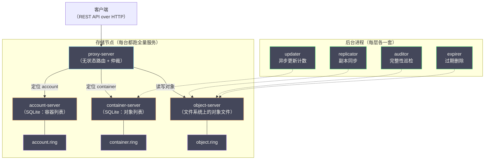
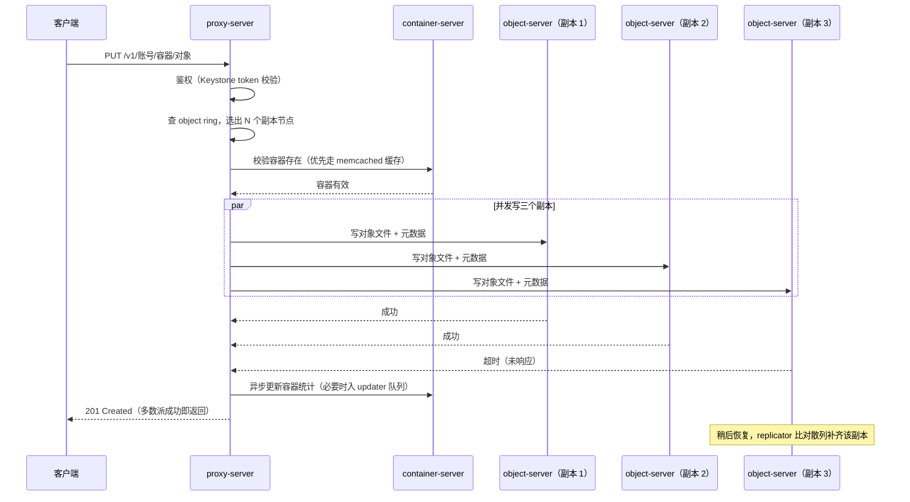
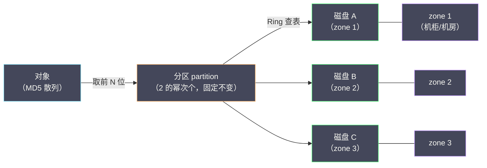
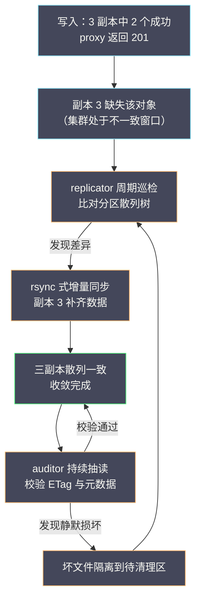
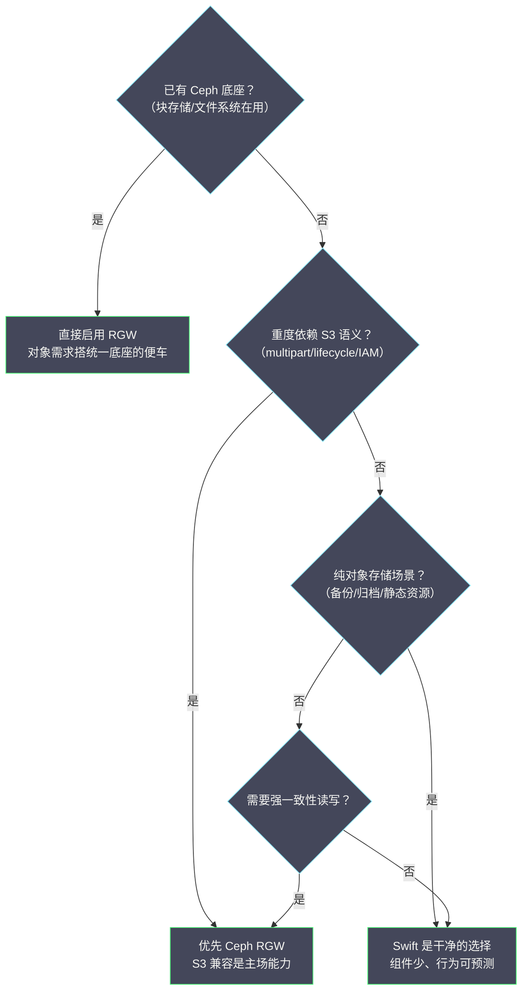

# 10 Swift 对象存储——环状数据结构与 Ceph RGW 对比

**摘要：**

在 OpenStack 的大家庭里，Swift 是一个特殊的存在：它比 OpenStack 这个名字本身还要老——2010 年 Rackspace 开源的 Cloud Files 代码与 NASA 的 Nebula 计算平台合并，才有了 OpenStack，而 Swift 正是前者的直系血统。本文从这段"半个出身"讲起，梳理 Swift 作为最终一致性对象存储的设计哲学，拆解 proxy-server 与 account/container/object 三层服务的架构分工，然后用全文最大的篇幅剖析 Swift 的心脏——环状数据结构（Ring）：一致性哈希如何演进为带分区层的 Ring、副本如何按 zone 隔离放置、Ring 如何构建与再平衡，以及它与 Ceph CRUSH 算法的同与不同。随后落到数据一致性与四个后台进程，最后切换到运维与选型视角，给出 Swift 与 Ceph RGW 的逐项对比。读完你应当能回答两个问题：Swift 为什么要在一致性哈希环和磁盘之间额外加一层分区，以及当你的场景需要对象存储时，Swift 与 Ceph RGW 之间该如何取舍。

---

## 第 1 章 比 OpenStack 还老的项目——Swift 的出身与定位

### 1.1 Cloud Files：OpenStack 的另一半血统

讲 Swift 的历史，得先把时间拨到 OpenStack 诞生之前。2008 年前后，Rackspace 作为老牌托管服务商，正被 AWS 压得喘不过气——S3 已经证明了对象存储（Object Storage）是一门能独立成生意的技术，Rackspace 便自研了一套对象存储服务对外提供，这就是 Cloud Files。这套系统在 Rackspace 内部跑了两年，扛住了真实公有云的流量考验。2010 年 7 月，Rackspace 把 Cloud Files 的核心代码开源；几乎同时，NASA 把它的 Nebula 计算平台代码也开源了出来。两拨人一拍即合，计算部分与存储部分合并成一个共同项目，取名为 OpenStack——**Compute 来自 NASA，Object Storage 来自 Rackspace**，这就是"联姻"的另一半血统。同年 10 月的 Austin 版本，Swift 与 Nova 一起构成了 OpenStack 最初的两块基石，比 Keystone、Glance 这些后来者都要年长。

这段出身解释了 Swift 的许多"性格"。其一，它是 OpenStack 里少数**不依赖其他核心服务也能独立运行**的项目——Swift 对 Keystone、MariaDB、RabbitMQ 都没有硬依赖，鉴权可以走临时中间件（tempauth），元数据自持，这套独立性是它作为第一个项目的遗产：它诞生时，OpenStack 还不存在。其二，它是用 Python 写的，代码风格与 Nova 一脉相承，读源码的门槛比 Ceph 这样的 C++ 巨兽低得多。其三，它在 Rackspace 内部经历了真实生产环境的淬炼才开源，这一点与许多"先开源后找场景"的项目不同——Swift 的每个设计决策背后，几乎都对应着一个运维踩过的坑。

把这段早期历史压缩成一张时间线，几个关键节点一目了然：

| 年份 | 事件 | 意义 |
| :--- | :--- | :--- |
| 2008 前后 | Rackspace 研发并上线 Cloud Files | Swift 的商业前身，真实公有云负载淬炼 |
| 2010 年 7 月 | Rackspace 开源 Swift 代码 | 与 NASA Nebula 合并的前置条件 |
| 2010 年 10 月 | OpenStack 首个版本 Austin 发布 | Swift 与 Nova 并列为最初两大组件 |
| 2011-2013 年 | 集群化能力持续增强（region 引入等） | 从单一机房走向地理分布式部署 |
| 2014 年之后 | Ceph 生态崛起，Swift 转入稳定维护 | 定位从"标配"退为"特定场景优选" |

不过年长也带来了包袱。Swift 的社区热度在 2014 年之后逐渐让位于 Ceph：Ceph 凭借统一存储（块、文件、对象三合一）的故事赢得了更多部署，OpenStack 的块存储后端几乎默认绑定了 Ceph RBD（详见 [[云原生/OpenStack/08 Cinder 块存储——卷生命周期与 Ceph RBD 后端|08 Cinder 块存储]]），而 Swift 始终坚守对象存储这一亩三分地。今天再看，Swift 并没有死——Rackspace、OVH 等大型公有云仍在生产环境运行它，社区也维持着稳定的发布节奏——但它已经从"OpenStack 的标配"退化为"特定场景下的优选"，这个定位变化，正是本章末尾与第 5 章选型讨论的伏笔。

### 1.2 对象存储的设计哲学——为什么是最终一致性

要理解 Swift 的架构取向，先要理解对象存储与块存储、文件存储的本质区别。块存储（譬如 Cinder 提供的卷）面对的是"一块裸磁盘"，语义由上层的文件系统补全；文件存储面对的是目录树；而对象存储面对的是一个扁平的命名空间——桶（bucket/container）里直接放对象，每个对象是"数据 + 元数据"的原子单元，通过 REST API 以 HTTP 方法访问。没有目录层级、没有随机读写、没有文件锁，**对象一旦写入就是不可变的（immutable），更新只能整体替换**。这个"贫瘠"的语义恰恰是它规模化的本钱：不可变意味着无需处理并发修改的冲突，扁平命名意味着元数据可以完全水平拆分，REST over HTTP 意味着任何语言任何平台都能直接访问。

语义贫瘠换来了规模自由，但分布式带来的问题一个也躲不掉：成百上千个存储节点，网络会断、磁盘会坏、机房会停电，写入的数据如何在故障下保持可用与不丢？业界对此有两条路线。一条是强一致性路线——所有副本写成功才算成功，任何时刻任何节点读到的都是最新数据，代价是副本间同步的延迟与故障时的可用性下降；另一条是最终一致性（Eventual Consistency）路线——写入在多数副本落盘即返回成功，剩余副本靠后台异步补齐，期间不同节点可能读到新旧不一的数据，但只要停止写入，所有副本终将收敛到一致。

两条路线的分岔处，站着三个必须回答的问题，Swift 对每个问题都给出了明确的取舍：

1. **写入要等多久？** 强一致等全部副本，最终一致等多数派——Swift 选后者，写入延迟由最快的多数副本决定。
2. **故障时还能读吗？** 强一致在副本失联时可能拒绝服务，最终一致继续提供可能陈旧的数据——Swift 选后者，可用性优先。
3. **旧数据谁来修？** 强一致没有这个问题，最终一致必须有后台修复机制——Swift 用 replicator 与 auditor 作答。

Swift 毫不犹豫地选了后者。这个选择同样有出身的烙印：Cloud Files 服务的是公有云上的静态内容——图片、备份、日志归档、视频分片，这类写入模式的共同特点是**一次写入、多次读取、极少修改**。对静态内容而言，读到几秒前的旧版本通常无害（CDN 回源的场景甚至完全无感），而为了这点无害的窗口期付出强一致性的可用性代价，在 Rackspace 的账本上不划算。于是 Swift 的整个架构都围绕"先保证可用与持久，再让一致性异步收敛"展开：写入走多数派仲裁，副本同步交给后台进程，冲突解决靠时间戳比新旧。这个取向与同年发表的 Amazon Dynamo 论文（2007，SOSP）不谋而合——Dynamo 用最终一致性支撑购物车的可用性，Swift 用它支撑对象存储的规模，两条独立的演化线在同一个设计空间里落到了同一个点上，这本身就是对"这类负载就该这么设计"的最好佐证。

> [!info] 一句话区分两条路线
> 强一致性问的是"任何时刻读到的都是最新的吗"，最终一致性问的是"数据最终会不会不丢不少"。静态对象存储的答案通常是后者就够了——但你要清楚自己放弃了什么：如果你的业务依赖"写完立刻读、必须读到最新"（譬如配置分发、元数据服务），Swift 的语义边界就需要额外设计来兜底。

### 1.3 Swift 与 Ceph RGW 的定位差异总览

既然要谈最终对比，先把两者的定位差异摆在明面上。Ceph RGW（RADOS Gateway）并不是一个独立的存储系统，而是架在 RADOS 之上的一层协议网关：RADOS 负责把对象可靠地存进集群（靠 CRUSH 算法做数据分布，靠强一致的多副本或纠删码保持久），RGW 则把 S3 与 Swift 两种 API 翻译成对 RADOS 的读写。而 Swift 是一个自成一体的对象存储系统——从 API 到数据分布到副本管理，全部自己实现，不依赖任何底层存储引擎。

这个差异决定了两者几乎在所有维度上的分野：一致性模型上，Swift 是最终一致，Ceph 是强一致；数据分布上，Swift 用自己的一致性哈希 Ring，Ceph 用 CRUSH；运维形态上，Swift 只管对象存储这一件事，Ceph 一套集群同时供 RBD 块设备、CephFS 文件系统与 RGW 对象网关使用。谁优谁劣？这个问题在社区里吵了十年，答案是"看场景"——第 5 章会逐项拆解。眼下你只需要记住一个类比：**Swift 是一家专营对象存储的精品店，Ceph 是一家什么都卖的仓储超市，RGW 是超市里的对象存储柜台**。精品店在它的领域里更深、更专，超市赢在一次采购覆盖三类需求——后面所有的技术差异，几乎都是这个定位差异的投影。

---

## 第 2 章 Swift 的架构——proxy 与三层存储服务

### 2.1 组件全景：一横三纵

Swift 的组件结构在 OpenStack 各服务里算得上清爽：对外只有一个入口 proxy-server，对内是 account、container、object 三层存储服务，每层都由"REST 服务 + 若干后台进程"构成。先看全景：



这张图里有两个与直觉相悖、却贯穿 Swift 全部设计的要点。第一，**存储节点是全对称的**——不存在"控制节点跑 server、存储节点跑 agent"的分工，每一台存储节点上都运行着 account/container/object 三层服务与全部后台进程，任何一台节点与其他节点完全对等。这与 Neutron 那种"server 下发、agent 执行"的主从结构（参见 [[云原生/OpenStack/06 Neutron 架构——ML2、OVS 与网络命名空间|06 Neutron 架构]]）截然不同：Swift 没有控制面与数据面之分，因为它的"控制信息"（Ring 文件）是静态分发的，不需要常驻的协调者。第二，**account 与 container 层用的是 SQLite**——一个以"嵌入式单机数据库"闻名的引擎，出现在分布式存储的元数据层，乍看像是草台班子，实则是深思熟虑：account/container 的数据量与访问模式（小、读多、按 ID 定位）恰好落在 SQLite 的舒适区，而它们自身的副本同步由 Swift 的 db replicator 负责，不劳数据库自己操心。用最合适的工具做最合适的事，而非追逐"企业级"的名头，这是 Swift 给后来者的一课。

### 2.2 proxy-server：无状态的路由与仲裁

proxy-server 是 Swift 唯一对外暴露的组件，客户端的所有请求都由它接住。它做三件事：鉴权（对接 Keystone 或 tempauth 中间件，校验 token）、定位（查 Ring，把"某个 account/container/object"翻译成"某几个存储节点上的某个磁盘"）、仲裁（向多个副本发起读写，按 quorum 规则决定给客户端返回什么）。

proxy-server 是**无状态的**——它不持久化任何业务数据，连 Ring 都只是缓存在内存里（Ring 文件本身静态分发）。这带来两个工程上的好处：其一，proxy 可以水平扩展，前面挂负载均衡即可，扩容不涉及数据搬迁；其二，proxy 挂掉不影响任何存量数据，重启即恢复，故障半径极小。你不妨把 proxy 想象成银行的叫号大厅——它负责核对身份、告诉你去几号窗口、汇总各窗口的回执，但它既不保管钱，也不决定钱放在哪个金库；决定数据在哪的，是 Ring（第 3 章的主角），保管数据的，是三层存储服务。

仲裁逻辑是 proxy 里最值得细看的部分，本章先立个框架：写请求时，proxy 按 Ring 找到 N 个副本节点并发写入，收到超过半数的成功响应即向客户端返回成功，少数派的失败由后台的 replicator 补齐；读请求时，proxy 依次尝试候选节点，用元数据（时间戳、内容长度、ETag 校验和）判断读到的数据是否最新，发现陈旧或损坏就换下一个节点。这套"写入多数派、读取带校验"的机制是最终一致性的运行时体现，第 4 章展开。

proxy 内部还有一个 Neutron 之外的"可插拔"传统值得知道：它的功能由一条**中间件管道（middleware pipeline）**串成，请求依次穿过鉴权、限速、审计、大对象处理等环节，管道顺序在配置文件里显式声明。常见的环节包括：

| 中间件 | 职责 | 备注 |
| :--- | :--- | :--- |
| tempauth / keystoneauth | 鉴权与 token 校验 | 独立部署用前者，接入 OpenStack 用后者 |
| slo / dlo | 大对象 manifest 的解析与拼装 | 2.6 节两种大对象方案的落点 |
| rate limit | 按账号限速 | 防止单租户打满集群 |
| catch_errors | 异常兜底 | 保证单个请求的异常不拖垮 worker |

这个设计与 Neutron 的 ML2、Nova 的 driver 一样，体现了 OpenStack 世代对"可插拔"的集体信仰——区别在于 Swift 的管道是请求级的、顺序敏感的，改管道顺序可能改变语义，这一点在升级配置时要格外留意。

### 2.3 account/container/object：三层递进的元数据

Swift 的命名空间是三层递进的：account（账号）下是 container（容器，对应 S3 的 bucket），container 下是 object（对象）。三层各自对应一套独立的服务与独立的 Ring：

| 层次 | 存储形态 | 记录的内容 | Ring 的作用 |
| :--- | :--- | :--- | :--- |
| account-server | 每账号一个 SQLite 库 | 账号下的 container 列表与统计 | 定位账号库所在的节点 |
| container-server | 每 container 一个 SQLite 库 | 容器下的对象列表、元数据与统计 | 定位容器库所在的节点 |
| object-server | 文件系统上的对象文件 | 对象数据本身 + 扩展属性里的元数据 | 定位对象文件所在的磁盘 |

请求的解析路径因此是一条三级跳：客户端请求 `/v1/AUTH_tenant/container/object`，proxy 先查 object ring 定位对象，再查 container ring 确认容器存在，最后查 account ring 确认账号有效——三层校验都通过，写操作才落地。这里有一个精妙的性能设计：**container 的存在性校验结果会被 proxy 缓存（memcached）**，否则每次对象写入都要串行查两层 SQLite，高频小对象的写入延迟会显著劣化。缓存带来的一致性窗口（容器刚删、缓存未失效时写入会失败）由 proxy 的错误处理兜底，这与 Swift"宁可短暂不一致，不让热路径变慢"的整体取向一脉相承。

object-server 的存储形态值得单独一句：每个对象就是文件系统上的一个普通文件，元数据放在文件的扩展属性（xattr）里，文件名由对象路径的 MD5 散列与时间戳构成。没有专用的存储引擎、没有自定义磁盘格式——Swift 把"对象"直接铺在 ext4/xfs 上。这个选择让 Swift 对底层文件系统毫无特殊要求，一块新磁盘格式化挂载就能入列；代价则是文件系统自身的开销（inode、目录项）在超大目录下会显现，Swift 用散列前缀把对象目录打散成多级子目录来缓解。**不发明轮子，把复杂性留给已经验证过的层**，是 Swift 一以贯之的工程趣味。

### 2.4 zone 与 region：故障域的划分艺术

Swift 的集群拓扑用两个概念刻画：region（区域）与 zone（可用区）。region 对应地理尺度——同城两机房可以是一个 region 的两个 zone，京沪两地则是两个 region；zone 对应机房内的故障隔离单元——可以是一台机柜、一间机房、一个供电域，粒度由运维自定义。在 Ring 的视角里，故障域是一个四层结构：**region > zone > 服务器（IP）> 磁盘（device）**，副本放置算法会保证同一份数据的多个副本尽量落在不同的故障域里。

为什么要显式建模故障域？因为**磁盘的故障概率与机柜的故障概率根本不是一个量级**。磁盘坏是常态（一年百分之几的故障率），机柜坏是意外（交换机断电、线缆被踢），机房级灾难是事故。副本放置若不区分这些层级，随机散布的三个副本可能恰好全在同一台机柜——交换机一断电，三副本同时消失，冗余形同虚设。Swift 的解法是把"故障域"作为 Ring 的一等公民：放置算法在挑选节点时强制检查"这个副本是否与已有副本落在不同的 zone"，只有当集群的 zone 数量少于副本数时才允许放宽约束（并在日志里明确警告）。这个设计把"冗余是否真的冗余"从概率问题变成了结构问题——**冗余的价值不在于副本数，而在于副本之间的独立性**，这句话不仅适用于 Swift，也是所有高可用设计的通用律。

### 2.5 一次对象写入的完整时序

把组件串起来看一次协作。客户端上传一个对象时，从请求进入到返回响应，完整走一遍：



这条时序里有三个值得咀嚼的细节。其一，**容器校验与对象写入的顺序不可颠倒**——对象写入前必须确认容器存在，否则数据会落进"无主"的命名空间，proxy 对此的校验失败会直接返回 404，这也是"容器刚删、缓存未失效"场景下写入报错的根源。其二，第三个副本的超时**不影响响应码**，多数派仲裁让写入延迟取决于最快的两个副本而非最慢的三个，这是最终一致性在延迟上的直接红利。其三，容器统计的更新可能走异步队列（updater 补录），所以极端负载下"账号的对象总数"会短暂少一——无伤大雅的不一致，换来热路径上少一次跨层同步，这笔账 Swift 算得很清楚。

### 2.6 大对象的支持：DLO 与 SLO

对象存储的语义里藏着一个工程约束：单个对象不宜过大。Swift 默认的单对象上限是 5GB，这不是能力缺陷，而是取舍——对象越大，单次写入的失败重试成本越高，副本同步的粒度越粗，最终一致性的收敛窗口越长。但"备份一个 200GB 的数据库文件"是真实需求，Swift 给了两条路：

| 方案 | 全称 | 机制 | 特点 |
| :--- | :--- | :--- | :--- |
| DLO | Dynamic Large Object（动态大对象） | 把分段对象放进指定容器，manifest 对象记录分段清单 | 分段可随时增删，但并发读时一致性靠运气 |
| SLO | Static Large Object（静态大对象） | 上传前规划好所有分段，manifest 里固化每段的 ETag 与大小 | 一次性提交、原子可见，但分段定好后不易变更 |

两者的差别用一句话概括：**DLO 是"边拍边播"，SLO 是"拍完再映"**。DLO 的 manifest 只是指向分段容器的路标，分段上传一段就能读一段，适合流式上传与持续追加（譬如日志归档）；SLO 则要求所有分段就位后一次性提交清单，读取端看到的要么是完整的旧版本、要么是完整的新版本，适合"整体替换一个大文件"的语义。生产实践里，S3 兼容层的 multipart upload 大致对应 SLO 的模式——这也是 Swift 的 S3 中间件兼容度一般的原因之一：S3 的分片语义与 SLO 的静态清单之间，总有一层翻译损耗。选型时如果你的业务重度依赖 S3 分片上传（譬如大数据组件直写对象存储），这个细节值得提前验证。

---

## 第 3 章 环状数据结构——Swift 的心脏

### 3.1 从一致性哈希说起

本章是全文的重头。Swift 要回答的核心问题是：一个有几十亿个对象、上千块磁盘的集群，如何决定"某个对象放在哪块磁盘上"，并且这个决定要在节点增减、磁盘更换时保持稳定？

最朴素的方案是哈希取模：`hash(object) % N`，N 是磁盘数。它简单，但有一个致命缺陷——**任何一次磁盘增减都会让几乎所有对象的归属发生变化**。扩容一块盘，N 从 1000 变 1001，全集群的数据要重新洗牌，搬迁量是 100%。对一个以"水平扩展、在线扩容"为立身之本的系统，这不可接受。

1997 年，MIT 的 Karger 等人在分布式缓存论文里提出了一致性哈希（Consistent Hashing）：把哈希空间组织成一个环，节点与对象都哈希到环上，对象顺时针交给遇到的第一个节点。这样增删一个节点，只有环上相邻区段的对象需要搬家，搬迁量从 100% 降到 1/N。2007 年的 Dynamo 论文把这套方案带进了工业界视野，Swift 则把它推到了极致——但 Swift 没有照搬教科书版本，而是在一致性哈希与真实磁盘之间，加了一层关键的中介。这一层，就是 partition。

### 3.2 partition：在哈希环与磁盘之间加一层

Swift 的 Ring 里，落到环上的不是磁盘，而是分区（partition）。整个哈希空间被均匀切成 2 的幂次个分区（数量由 partition power 参数控制，譬如 2 的 17 次方量级），每个对象通过 MD5 散列映射到唯一一个分区，每个分区再由 Ring 决定落在哪几块磁盘上。**对象到分区是固定的，分区到磁盘是可调的**——这句话是理解 Swift Ring 的钥匙。

为什么要多这一层？不妨对比没有它会发生什么。如果直接把磁盘哈希到环上，磁盘的哈希值由其标识（IP + 设备名）决定，各磁盘在环上占有的区段长短不一——哈希不均匀，负载就不均匀；新磁盘加入时，它只能分到环上自己哈希位置附近的流量，无法人为调配。引入分区层之后，**数据移动的最小单位从"对象"变成了"分区"**：分区数量固定（集群生命周期内不变），分区到磁盘的映射由 Ring 统一调配。扩容新磁盘时，Ring 把一批分区的副本从旧磁盘挪到新磁盘，每次搬迁的单位是数万个对象组成的一个分区目录，可以按磁盘权重精确控制搬迁量；磁盘退役时，同样按分区整目录迁出。对象级的散乱搬迁被收敛为分区级的批量搬迁，rsync 式的目录同步就能完成，无需逐对象处理。

这一层的价值还可以从另一个角度理解：它是**哈希确定性与运维可控性之间的和解**。纯一致性哈希里，数据归属完全由哈希函数决定，运维无法干预"哪块盘放什么"；纯人工调度则回到取模方案的老路。分区层让 Swift 两者兼得——对象到分区的映射保持纯哈希的确定性（任何节点独立计算结果一致，无需查表协商），分区到磁盘的映射则交给 Ring builder 按权重与故障域精心安排。**确定性的归哈希，可控性的归 Ring**，这个分层是 Swift 对一致性哈希最重要的工程改造，也是它与 Dynamo 原始设计的分野之一。



### 3.3 replica 的放置算法：zone 隔离

分区到磁盘的映射如何生成？Swift 用一个离线工具 ring-builder 完成：输入是集群的设备清单（每块盘的 IP、设备名、权重、zone/region 归属）与三个参数（partition power、副本数、min_part_hours），输出是三份 Ring 文件（account、container、object 各一份）。放置算法的目标用一句话概括：**把每个分区的 N 个副本，均匀地撒到权重允许的磁盘上，且尽量分散在不同故障域**。

一次典型的 Ring 变更操作长这样（以 object ring 加盘为例）：

```bash
# 向 builder 登记新设备：zone 2、权重按容量折算
swift-ring-builder object.builder add \
    r1z2-<ip>:<port>/sdb1 2200

# 重新计算分区分布，生成新版 Ring 文件
swift-ring-builder object.builder rebalance

# 核对变更摘要：搬迁了多少分区、是否有未满足的约束
swift-ring-builder object.builder
```

命令本身朴素得近乎简陋，但每一步背后的语义都不简单——add 只改了 builder 的"期望"，rebalance 才把它变成新的"布局"，而布局生效还要等 Ring 推送到全集群。三段式（登记—重算—分发）的节奏，正是 3.2 节"确定性的归哈希，可控性的归 Ring"在运维动作上的投影。

算法的运行方式值得玩味——它不是一次性求解，而是**迭代试错**：builder 先给每个分区随机挑 N 块盘，然后反复扫描所有分区，找出违反约束的放置（两个副本落在同一 zone、某磁盘的分区数偏离权重应有值、两个副本曾在 min_part_hours 内同盘等），逐个交换修正，直到约束全部满足或达到迭代上限。这个"先乱放、再纠错"的思路看似笨拙，实则聪明：放置问题本质是一个带多重约束的组合优化，精确求解在数万分区、上千磁盘的规模下不现实，而迭代法在绝大多数真实拓扑里几轮就收敛，剩下的极少数未满足项（builder 会明确报告）通常源于拓扑本身不合理——譬如 zone 数少于副本数。**工具不掩盖问题，而是把问题显式地暴露给运维**，这比悄悄放宽约束然后让故障域形同虚设，诚实得多。

副本数（replica count）默认是 3，这是持久性与成本之间的经典折中：两副本在磁盘故障叠加时窗口太薄，四副本的成本对绝大多数静态存储场景过奢。权重（weight）则表达磁盘的容量差异——2TB 的盘权重是 1TB 的两倍，分到的分区数也成比例，Ring 以此保证**各磁盘的填充率大体同步**，避免"有的盘满了、有的盘空着"的畸形分布。min_part_hours 是一个容易被忽略却极重要的参数：它规定同一个分区在多少小时内不能两次更换位置，作用是防止"分区在两块盘之间来回震荡"——某盘暂时不可达时数据被搬到别处，盘恢复后又搬回来，来回折腾消耗大量复制带宽。给数据移动设一个冷却期，与代码重试的退避（backoff）是同一种智慧。

### 3.4 Ring 的构建与再平衡

Ring 文件在集群里的分发方式非常"原始"却也非常可靠：ring-builder 的 `.builder` 文件是唯一权威来源（通常集中保管在管理节点或配置管理系统里），每次变更（加盘、减盘、调权重）后执行 rebalance，builder 生成新版本的 Ring 文件（一个 gzipped 查找表），由运维推送到集群所有节点，proxy 与各存储服务重新加载。**Ring 的变更因此是显式的、批量的、可回滚的**——旧 Ring 文件保留在节点上，出了问题随时切回。

rebalance 触发的数据搬迁由谁执行？答案是后台的 replicator，而不是某个在线的调度器。新 Ring 生效后，被重新映射的分区在新节点上"缺失"，replicator 巡检时发现本机应有的分区在别的节点上，就把数据同步过来；旧节点上的多余副本则按过期逻辑清理。整个扩容过程没有"数据迁移窗口"一说——集群一边继续服务读写，一边以可控的带宽慢慢把数据搬到新布局上。这正是 3.2 节分区设计的回报：搬迁以分区为单位、以 Ring 为蓝图、以 replicator 为执行者，三者的解耦让"在线扩容"从一个惊心动魄的工程动作，退化成一个不紧不慢的后台过程。

> [!warning] Ring 推送不是小事
> 新 Ring 必须推送到**所有**节点——proxy 用它做路由，存储节点用它做副本校验，任何一台节点拿着旧 Ring，都会把请求路由到过时的位置，制造"幽灵副本"（新 Ring 认为不该存在的数据）。生产变更的标准动作是：rebalance 后先在测试环境验证，再用自动化工具（rsync 或配置管理）全量推送并校验各节点的 Ring 版本（md5 比对），最后观察 replicator 的搬迁进度。跳过"校验推送完整性"这一步的团队，几乎都遇到过"部分节点行为不一致"的灵异故障。

### 3.5 Ring 与 CRUSH 的对比

把 Swift Ring 讲透之后，对比 Ceph 的 CRUSH（Controlled Replication Under Scalable Hashing，Sage Weil 在 2006 年 FAST 会议的论文中提出）就有了完整的参照系。两者解决的是同一个问题——大规模集群下确定性的数据分布——但走了两条不同的路：

| 维度 | Swift Ring | Ceph CRUSH |
| :--- | :--- | :--- |
| 分布决策方式 | 离线构建的查找表（Ring 文件），查询 O(1) | 在线实时计算（CRUSH 算法），每次映射现场推演 |
| 权威数据 | `.builder` 文件 + 分发的 Ring 文件 | 集群 monitor 持有的 cluster map |
| 权重与规则 | 磁盘权重 + zone 约束，规则内置 | 可调权重 + CRUSH rule（可编程的放置策略） |
| 变更生效 | 显式 rebalance + 全量推送 | map 版本演进，客户端增量感知 |
| 数据迁移单位 | 分区（整目录批量搬迁） | PG（placement group，同样是中间层） |
| 故障域建模 | region/zone/ip/device 四层 | 层级化的故障域树（root/datacenter/rack/host/osd） |

两者的第一个共同点值得先说破：**它们都发明了"中间层"**。Swift 的 partition 与 Ceph 的 PG（placement group）是同一个思想的两处落地——在"海量对象"与"有限设备"之间垫一层固定数量的映射单元，把对象级的散乱搬迁收敛为单元级的批量搬迁。两条独立的演化线再次殊途同归，这说明中间层不是某个天才的灵光一现，而是这类系统的结构必然。

差异则集中在"分布决策在哪里发生"。Swift 把决策离线化：Ring 是一张预先算好的表，查询是纯内存查找，快且稳定，代价是变更要走"rebalance—推送—重载"的人工流程，集群拓扑变更的响应以小时计。CRUSH 把决策在线化：客户端拿着 cluster map 现场计算每个对象该去哪，无需查表、无需推送，map 更新后各节点自然收敛，代价是每次 I/O 都要付一遍算法推演的成本，且算法的可调参数（CRUSH rule）复杂到自成一门小语言。**Swift 用运维流程的显式性换运行时的简单性，Ceph 用算法的复杂性换运维流程的自动化**——两条路线没有绝对的高下，前者适合拓扑变更低频、追求行为可预测的对象存储场景，后者适合拓扑动态变化、需要统一存储底座的场景。你在第 5 章的选型表里会看到，这个分野几乎决定了两者在运维复杂度上的全部差异。

### 3.6 partition power 的选择与容量演算

partition power 是 Ring 构建时最重要的参数，它决定分区总数（2 的幂次），而分区总数的下界由集群规模倒推。经验法则是**每块磁盘平均应分到 100 个左右的分区**：分区太少，单盘承载的分区过大，搬迁与再平衡的粒度太粗，磁盘间的负载均衡失真；分区太多，Ring 文件膨胀、replicator 的巡检开销上升，收益却不再增长。由此可以倒推一张速查表：

| 集群磁盘数 | partition power 建议量级 | 分区总数 | 每盘分区数（3 副本） |
| :--- | :--- | :--- | :--- |
| 50 盘 | 12 | 约 4096 | 约 250 |
| 200 盘 | 14 | 约 16384 | 约 250 |
| 1000 盘 | 16 | 约 65536 | 约 200 |
| 5000 盘 | 18 | 约 262144 | 约 160 |

这张表背后有一个让新手措手不及的约束：**partition power 在集群生命周期内不可更改**。分区总数一旦定死，对象到分区的映射随之定死，改它等于全集群数据重新洗牌。于是容量规划变成了一个"为十年后的集群选参数"的问题——今天 50 盘的小集群，如果预期三年后扩到 500 盘，partition power 就必须按 500 盘的量级来定，哪怕这意味着初期每盘只分到二十几个分区、负载均衡略显粗糙。Swift 社区为此提供过重建 Ring 的工具路径（导出设备清单、以新参数重建、让 replicator 全量搬迁），但那是一次代价高昂的"数据大迁徙"，能避免则避免。**用未来的规模选今天的参数，忍受初期的轻微不均，是 Ring 体系给运维上的第一课**——分布式系统的很多参数都是这样，它们不是为"现在"优化的，而是为"终局"锁定的。

> [!info] 为什么不把分区做小一点、动态加分区
> 有读者可能会问：分区不够用就动态增加，为什么 Swift 不这么做？因为分区的意义恰恰在于"固定"——对象到分区的映射靠取哈希前缀实现，分区数变了，前缀位数就变了，全量映射随之失效。固定分区数是"对象到分区零成本确定性映射"的前提，这个前提值钱到值得为它牺牲初期的均衡精度。Ceph 的 PG 数同样建议按终局规模预设（pg_num 调整同样代价高昂），两个系统在这件事上又一次不谋而合。

---

## 第 4 章 数据一致性与复制

### 4.1 最终一致性的含义

第 1 章说过 Swift 选择了最终一致性，本节把"最终"两个字拆开，看它到底承诺了什么、没承诺什么。Swift 承诺的是**持久性优先**：一次写入只要在多数副本落盘，数据就不会因后续的节点故障而丢失——replicator 会把少数派的缺失补齐，auditor 会持续校验存量数据的完整性，任何副本损坏都有另外两份兜底。Swift 没有承诺的是**读写的线性一致**：写入返回成功的瞬间，第三个副本可能还没收到数据，此刻从它那里读会得到 404 或旧版本；两个先后覆盖写的对象，不同副本上的时间戳可能短暂不一致。

对静态对象存储，这个语义缺口通常无害，但有两个场景需要显式应对。其一是**读后写**（read-after-write）：客户端上传对象后立刻下载，若 proxy 恰好路由到尚未同步的副本，会读到旧数据。Swift 的缓解手段是 proxy 读取时的元数据校验——每个对象文件带有写入时间戳，proxy 发现读到的版本比 container 记录的旧，就自动换下一个副本重试，绝大多数场景下用户无感。其二是**并发覆盖写**：两个客户端同时写同一个对象路径，各副本上的最终版本由时间戳仲裁（新的胜出），但仲裁完成前不同副本可能各持一个版本——Swift 不做合并、不做锁，直接以"最后写入者胜"收场。**把冲突解决权交给时间戳，把避免冲突的责任交给应用**，这是最终一致性系统的标准契约，用 Swift 存放会被并发修改的数据之前，先确认你的应用接受这个契约。

### 4.2 quorum：读写仲裁

proxy 的仲裁规则是最终一致性在请求路径上的执行者。写入时，proxy 向 Ring 选出的 N 个副本节点并发发起写，收到**超过半数**（对默认 3 副本即 2 个）的成功响应就向客户端返回 2xx；未响应的副本不阻塞请求，其缺失由 replicator 补齐。若成功数不足半数，proxy 返回 5xx，客户端重试。读取时，proxy 按顺序尝试候选副本，校验时间戳与 ETag，读到最新数据即返回；首选副本无响应或数据陈旧时自动切换。

这套机制里藏着 CAP 理论的一个活教材。写入多数派保证了**两个多数派之间必有交集**——只要集群多数节点存活，新写入总能被读到（配合 4.1 的版本校验），这实际上是 Swift 在网络分区时对一致性一侧的最低保障；但 Swift 并不追求严格的 C——分区期间少数派一侧依然可读（读到旧数据），可用性优先于一致性，这正是 AP 系统的标准取舍。值得一提的是，Swift 允许通过配置调节读写副本数（譬如读时多查一个副本以降低读到旧版的概率），但默认值始终围绕"多数派写入 + 校验式读取"——**默认值暴露了一个系统的价值观**，Swift 的价值观是可用与持久，而不是强一致。

写入返回成功之后，一致性的收敛并未结束，而是转入后台的修复闭环。把"一次部分失败的写入"到"三副本重新一致"的全过程画出来：



这个闭环是 Swift 持久性承诺的执行机构，值得注意它的**自愈性**：闭环里没有任何一步需要人工介入，也没有任何一步依赖某个中心化的协调者——每个存储节点的 replicator 与 auditor 独立巡检自己应持有的数据，发现差异就地修复。去中心化的自愈让 Swift 在大规模集群上的运维心智负担极低：你不需要"调度"修复，只需要保证修复的原料（健康副本与网络带宽）在位。反过来，这也意味着**修复的速度取决于巡检的周期与带宽的余量**——4.3 节的 min_part_hours 与 5.2 节的"扩容步幅"约束，都是在为这个闭环的消化能力留余量。

### 4.3 四个后台进程：auditor、replicator、updater、expirer

Swift 的最终一致性不是一句口号，而是由四个常驻后台进程具体执行的。它们是 Swift 架构里最容易被忽视、却最能体现工程功力的部分：

| 进程 | 职责 | 类比 |
| :--- | :--- | :--- |
| replicator | 副本同步：比对本地与远端的分区散列，把缺失或陈旧的数据推给对端 | 数据的"搬运工" |
| auditor | 完整性巡检：持续抽读对象文件，校验 ETag 与元数据，发现损坏即隔离并触发修复 | 数据的"质检员" |
| updater | 异步更新统计：高负载时 container 对 account 的计数更新走队列，由 updater 补发 | 账本的"补录员" |
| expirer | 过期删除：执行 X-Delete-After 等过期指令，到点清理对象 | 数据的"殡仪员" |

replicator 是其中最核心的一个。它的工作方式是**散列比对而非逐文件传输**：每个分区目录维护一棵对象散列树，replicator 先比对两端的散列摘要，摘要一致则跳过整个分区，不一致才下钻到具体文件做增量同步——这与 rsync 的思路同源，但为 Swift 的目录结构做了定制。散列树让"检查是否有差异"的成本与数据总量解耦，replicator 因此可以高频巡检而几乎不产生 I/O，只在真正有差异时才动带宽。顺带一提，replicator 在对象层与数据库层的工作方式并不相同：

| 层次 | 同步对象 | 比对方式 | 触发方式 |
| :--- | :--- | :--- | :--- |
| object replicator | 分区目录下的对象文件 | 对象散列树逐级比对 | 周期巡检 + 本地变更 |
| db replicator | account/container 的 SQLite 库 | 整库时间戳与行级合并 | 周期巡检 |

数据库副本的同步比对象文件更微妙——SQLite 是单文件库，整库拷贝会撞上写入中的状态，db replicator 因此借用了 SQLite 自带的复制机制做行级合并，两套 replicator 各管一摊、互不越界。auditor 则回答另一个问题：**静默损坏（bit rot）谁来发现？** 磁盘会在无报错的情况下悄悄损坏数据，RAID 与文件系统都未必能拦住，auditor 以持续抽读的方式给每份数据定期"体检"，发现校验不符就把坏文件隔离到待清理区，让 replicator 从健康副本重新补一份。检测与修复分离成两个进程，是职责单一原则在存储系统里的漂亮落地。

updater 与 expirer 处理的是"热路径上做不完的事"。容器数量巨大时，每次对象写入都同步更新 account 的统计计数会成为瓶颈，Swift 的做法是把更新请求先落进本地队列，updater 异步消化——代价是 account 的统计数字短暂不准（对象写入了、账号的"对象数"还没加一），收益是写入热路径上少一次跨层事务。expirer 则把"对象自动过期"从请求路径挪到后台：客户端写入时带上 X-Delete-After（多少秒后删除），对象同时进入一个内部过期队列，expirer 按到点时间逐批清理。**凡是能从关键路径上挪走的工作，都挪走**——这四个进程合起来，就是这句话的完整注脚。

### 4.4 对象版本控制与过期删除

Swift 在 API 层面为"不可变对象"提供了两个逃生舱。其一是**对象版本控制（versioning）**：给容器配置版本位置（X-Versions-Location 指向另一个容器）后，对该容器内对象的每次覆盖写都会把旧版本存进版本容器，删除操作也只是把当前版本移入版本容器——误删误覆盖有了后悔药。其二是**过期删除**：4.3 节的 X-Delete-After 与绝对时间的 X-Delete-At，让"日志保留 30 天""临时文件当天清理"这类生命周期策略有了原生支持，不必外挂定时任务遍历删除。

两个特性好用，但有几个边界要提前知道：

- 版本容器与源容器**不能是同一个**，且版本容器的写入不计入配额的地方各有约定，规划容量时两处都要算
- 过期删除由 expirer 异步执行，**到期不等于立刻消失**，存在分钟级的清理延迟
- 版本控制只对覆盖写与删除生效，**并发写同一对象时的版本行为仍受时间戳仲裁支配**，不能当作并发控制用

两个特性都是容器级的开关，粒度粗但够用——Swift 对元数据功能的克制一如既往，它宁愿把复杂语义留给上层应用，也不愿在核心路径上堆砌特性。S3 的生命周期规则比它精细得多，但对"备份归档"这类主战场，Swift 的粗粒度版本与过期已经覆盖了九成的真实需求。

### 4.5 与 S3 语义的对照——迁移者的对照表

不少团队评估 Swift 时的实际处境是"应用已经按 S3 语义写的"，因此把两套 API 的关键概念做一次对照，比空谈兼容性更有用：

| S3 概念 | Swift 对应物 | 语义差异 |
| :--- | :--- | :--- |
| bucket | container | 基本等价，命名规则略有差异 |
| object | object | 等价，元数据键名前缀不同（x-amz- 与 x-object-） |
| multipart upload | SLO（或 DLO） | S3 分片可并发补传，SLO 需预先规划清单 |
| lifecycle rule | X-Delete-After / X-Delete-At | Swift 只有按对象过期，无前缀级规则引擎 |
| versioning | X-Versions-Location | 语义相近，S3 版本可枚举恢复，Swift 靠版本容器管理 |
| IAM policy | Keystone policy + ACL | 模型差异大，细粒度授权需中间件补足 |

这张表的结论与 5.3 节的选型判断互为印证：Swift 的 API 是为自家语义设计的，S3 兼容是翻译出来的二手能力——轻度的对象读写翻译无损，但 multipart、lifecycle、细粒度 IAM 这些 S3 生态的"深水区"，翻译过去总有损耗。**按 Swift 原生 API 写的应用享受最完整的语义，按 S3 写的应用迁移前要做兼容性盘点**，这是两条路线之间不可省略的尽调动作。

---

## 第 5 章 运维视角与选型——Swift 还是 Ceph RGW

### 5.1 容量管理与监控指标

Swift 的运维模型围绕一个简单的事实展开：**容量就是磁盘**。集群总容量等于所有磁盘权重对应的可用空间，扩容就是加盘、调权重、rebalance、推送 Ring 四步，缩容反向操作。因为对象不可变、无随机写，Swift 的磁盘负载模式非常友好——顺序写为主、无碎片、填充率由 Ring 精确调配，容量规划因此可以做得相当线性：业务增速乘以副本数，除以单盘容量，就是扩容节奏。这套可预测性是对象存储相对块存储（参见 [[云原生/OpenStack/08 Cinder 块存储——卷生命周期与 Ceph RBD 后端|08 Cinder 块存储]] 的 RBD 后端）在运维上的隐性红利。

监控指标建议按三层组织：

| 层次 | 关键指标 | 异常信号 |
| :--- | :--- | :--- |
| 服务层 | proxy 的请求速率、延迟分位数、5xx 比例 | 5xx 突增（往往是磁盘满或 Ring 不一致） |
| 数据层 | replicator 的同步队列长度、搬迁吞吐、副本缺失计数 | 队列持续增长（搬迁速度跟不上变更速度） |
| 硬件层 | 各磁盘使用率、auditor 发现的损坏数、磁盘错误计数 | 磁盘使用率偏离权重应有值、损坏数非零 |

Swift 自带两个专用巡检工具值得写进值班手册：swift-recon 汇总集群各节点的状态（Ring 一致性、磁盘负载、复制统计），swift-dispersion-report 则从"持久性"角度做体检——它在集群里撒一批探针对象，检查每个探针的副本是否都落在应有的位置，以此量化"数据到底有多安全"。**副本数是配置，持久性是实测**，dispersion 报告就是把配置承诺换算成实测分数的那杆秤，建议每周跑一次并留存趋势。

日常巡检则建议固化为一张命令清单，把问题消灭在爆发之前：

| 命令 | 看什么 | 异常信号 |
| :--- | :--- | :--- |
| swift-recon --md5 | 各节点 Ring 文件一致性 | md5 不一致（推送不完整） |
| swift-recon --disk | 各磁盘使用率与权重应有值 | 偏离超过数个百分点 |
| swift-recon --replication | 复制进度与失败计数 | 失败计数持续增长 |
| swift-dispersion-report | 副本分布达标率 | 低于 100% 且持续不收敛 |
| swift-recon --auditor | auditor 的损坏发现数 | 非零（有静默损坏在发生） |
| proxy 访问日志聚合 | 5xx 比例与延迟分位数 | 507 集中出现（磁盘满前兆） |

巡检的价值同样在趋势而非快照：磁盘使用率每周的爬升斜率、dispersion 达标率的波动、auditor 损坏数的基线，这些趋势线才是"何时扩容、哪块盘该换"的决策依据。单次巡检只能证明"此刻没事"，连续的巡检数据才能回答"还能撑多久"——这与本系列监控篇的方法论完全同构。

### 5.2 常见故障：Ring 不均、磁盘满与 replication 风暴

Swift 的故障谱系不长，但有三类模式值得提前认识。

**Ring 不均**：症状是部分磁盘使用率远超其他盘，根因几乎总是三类之一——权重配错（新盘权重没按容量设）、zone 拓扑不合理（builder 迭代不收敛，日志里有未满足项却没被处理）、Ring 推送不完整（部分节点拿着旧 Ring，数据按旧布局写入）。排查顺序正好按反方向来：

1. `swift-recon --md5` 核对全节点 Ring 文件是否一致——不一致先补推送，问题往往到此结束
2. 查 ring-builder 的迭代报告，看有无"未满足约束"的分区被静默放过
3. 核对各设备的权重与实际容量是否对应，纠正后 rebalance

**Ring 是集群的宪法，宪法不一致，一切下游现象都是幻觉**——这句口诀值得贴在值班台的显示器边上。

**磁盘满**：对象写入失败，proxy 返回 507。Swift 对此有结构性防御——Ring 按权重调配填充率，各盘应当同步增长——但防御会被两件事击穿：一是权重与实际容量不符（配了 2TB 权重的 1TB 盘会先满），二是写入突发集中在少数分区（热点 account）。处置磁盘满不是简单清文件（对象文件删了会造成副本缺失），标准动作是：先摘除该盘的写入（Ring 里调低权重或标记故障），让 Ring 把新写入引走，再让 replicator 把该盘数据匀给别处，最后修复或更换磁盘后重新入列。**存储运维的铁律：满盘的处置目标是"让它不再接收写入"，而不是"腾出空间"**——后者治标，前者治本。

三类故障之外，把值班中最常见的几个误判也归拢成清单，供对照自查：

- **把 507 当成 proxy 故障**——507 是 object-server 报告的存储层错误，先查磁盘再查进程，顺序别反
- **把 replicator 队列增长当成故障**——扩容后的队列增长是设计内的正常现象，只有"增长不停"才是异常
- **把 dispersion 未达标当成数据丢失**——未达标只说明副本位置未收敛，数据本身通常安然无恙
- **把 Ring 推送当成可以分批拖延的事**——新旧 Ring 并存期间集群行为不可预测，推送要在变更窗口内一次完成

**replication 风暴**：一台宕机数日的节点重新上线，或一批新盘入列时，replicator 要在短时间内同步海量数据，复制流量可能挤占正常读写带宽，表现为集群延迟全面上涨。Swift 的缓解手段是限速（replicator 的带宽与并发可配）与分批（rebalance 后分多次推送 Ring，每次只挪一部分分区），但更根本的解法在规划期：**扩容的步幅不要超过集群总量的两成**，搬迁压力就永远在系统可消化的范围内。这与第 4 章的结论呼应——Swift 的所有后台机制都假设"变更是小步的"，把变更做成大跃进，再好的架构也会被自己的恢复机制拖垮。

> [!warning] 一类容易被误诊的故障：时间戳冲突
> 还有一类故障模式值得单独提醒：应用侧报告"对象内容偶尔回退到旧版本"，排查磁盘与网络均无异常。这往往是**并发覆盖写**撞上了 4.1 节的时间戳仲裁——两个写入者各写各的副本，时间戳新的胜出，但"新"的判定在每个副本上独立进行，窗口期内读到的版本可能来回摆动。这类问题的根因不在 Swift 而在使用方式：把"只应有一个写入者"的对象路径交给了多个写入者。处置方案在应用层——为对象路径引入版本号或唯一后缀（每次写入用新路径），让覆盖写变成追加写，冲突自然消失。**存储系统的一致性语义是契约，违约的症状出现在存储侧，解药却常常在应用侧**，排障时别只盯着集群日志。

### 5.3 Swift 与 Ceph RGW 的选型对比

行文至此，可以正面回答那个悬了五章的问题了。把两个系统放在同一张表里逐项过：

| 维度 | Swift | Ceph RGW |
| :--- | :--- | :--- |
| 协议生态 | 原生 Swift API，S3 兼容靠中间件（成熟度一般） | 原生 S3 + Swift 双协议，S3 生态兼容性是事实标准 |
| 一致性模型 | 最终一致（多数派写 + 校验读） | 强一致（RADOS 副本写全部确认） |
| 数据分布 | 一致性哈希 Ring，离线构建、显式推送 | CRUSH，在线计算、map 自动演进 |
| 运维复杂度 | 低：组件少、无强依赖、行为可预测 | 高：MON/OSD/MGR 多角色，参数空间大，调优门槛陡 |
| 统一存储 | 否，只做对象存储 | 是，一套底座供 RBD/CephFS/RGW |
| 硬件利用 | 对象存储专用集群，资源单一 | 与块存储共享集群，资源可复用 |
| 社区活跃度 | 稳定维护，热度平平 | 活跃度高，生态与厂商支持广泛 |
| 规模心智 | 十亿级对象、PB 级容量有长期生产验证 | 同样超大规模验证（Rook 等云原生场景加持） |

逐项权衡下来，两条选型主线清晰可见。**如果你的需求是纯对象存储**——备份归档、日志留存、静态资源、图片视频——Swift 的优势是结构性的：组件少意味着故障模式少，最终一致意味着写入路径短，Ring 的显式性意味着行为可预测、排障有章法，且它不需要为"块存储"支付任何多余的复杂度。**如果你的需求是统一存储**——既要给虚拟机供块设备（Cinder 的默认后端），又要给容器供文件系统，还要顺带提供对象网关——Ceph 几乎是唯一解，RGW 是搭车的那一部分，此时为对象存储单独再养一套 Swift 反而是运维浪费。中间地带则要小心：需要 S3 协议与强一致的对象存储场景（譬如自建兼容 S3 的应用后端），RGW 是更顺的选择，Swift 的 S3 中间件兼容度不足以支撑重度 S3 语义的应用。

选型之外，容量账也要算给读者看。以"每日增量 5TB 的备份归档、保留一年"为例：净数据量约 1800TB，3 副本下裸容量需求 5.4PB，再加三成余量应对再平衡与突发，规划 7PB 左右的磁盘池；若同样的负载放进已有 Ceph 集群，则要评估 OSD 的剩余容量能否再吃下 5.4PB 的对象流量，以及备份写入峰值（夜间批量）会不会挤占块存储的 IOPS——**统一存储的账本是合在一起记的，一个业务的突发就是所有业务的邻居**。这笔账没有标准答案，但它演示了选型落地的完整动作：语义需求定协议，容量与性能定底座，团队能力定运维形态。

### 5.4 因地制宜

最后收束全文。Swift 与 Ceph RGW 的十年之争，本质上不是技术优劣之争，而是**定位之争**：一个把对象存储做到深而专，一个把统一存储做到广而全。Swift 用最终一致性换来了写入路径的简洁与规模的从容，用 Ring 的显式性换来了运维的可预测，代价是放弃了强一致语义与 S3 生态的主场地位；Ceph 用 CRUSH 的在线计算与统一底座换来了场景通吃，代价是一套所有维度都在场的复杂系统。没有哪个是银弹——**集群规模、协议需求、团队运维能力、是否已有 Ceph 底座，这四个问题各有答案之后，选型自然浮出水面**。技术选型的第一职责从来不是找到"最好"的系统，而是找到与你的约束最匹配的那一个。

把决策过程整理成一张流程图，供读者对照自己的处境：



流程图的每个分叉都对应本章的一个论断，但请把它当思考框架而非判决书——真实的选型还要叠加团队的技术栈熟悉度、招聘市场的人才供给、既有监控体系的覆盖范围这些"非技术权重"。至于 Swift 本身，它比 OpenStack 还年长，见证并参与了对象存储从概念到标配的整个历程，今天它依然是这个领域里设计最诚实、行为最透明的系统之一——读懂了它的 Ring，你读懂的不只是一个组件，而是所有大规模分布式存储共同的那条脊梁。

---

## 参考资料

1. OpenStack 官方文档——Swift 架构与 Ring：https://docs.openstack.org/swift/
2. Swift 官方文档——Ring 与 ring-builder 机制说明：https://docs.openstack.org/swift/latest/overview_architecture.html
3. Karger, D. et al.（1997），《Consistent Hashing and Random Trees: Distributed Caching Protocols for Relieving Hot Spots on the World Wide Web》
4. DeCandia, G. et al.（2007），《Dynamo: Amazon's Highly Available Key-value Store》，SOSP '07
5. Weil, S. et al.（2006），《CRUSH: Controlled, Replicated And Fully Distributed Hash Function》，FAST '06
6. Rackspace 开源 Swift 与 OpenStack 诞生的社区史料（2010）：OpenStack 基金会发布记录
7. 相关篇章：[[云原生/OpenStack/08 Cinder 块存储——卷生命周期与 Ceph RBD 后端|08 Cinder 块存储]] · [[云原生/OpenStack/09 Glance 镜像服务——镜像流水线与制作实战|09 Glance 镜像服务]] · [[云原生/OpenStack/01 OpenStack 全景——从 NASA 与 Rackspace 的联姻到开源云操作系统|01 OpenStack 全景]] · [[云原生/OpenStack/02 控制面三件套——MariaDB、RabbitMQ 与 Keystone|02 控制面三件套]]

---

> [!note] 思考题
> 1. 集群有 3 个 zone、副本数为 3，此时再新加第 4 个 zone 并扩容一批磁盘，Ring builder 会把新写入的副本均匀分布到 4 个 zone 吗？反过来，若集群只有 2 个 zone 而副本数为 3，builder 会怎么处理，运维日志里会看到什么？由此说明 zone 数量与副本数的匹配关系应如何写进新集群的规划清单。
> 2. 某对象写入返回 201 成功后，客户端立刻发起读取，偶尔会读到 404 或旧版本，但稍后重试即恢复。请用本章的 quorum 仲裁、proxy 的元数据校验与 replicator 的补齐机制，完整解释这个现象的因果链；再设计一个应用层的规避方案（提示：写入后校验、版本号、容器元数据各能做什么）。
> 3. 你的团队要为"每日增量 5TB 的备份归档"新建对象存储，现有环境已有一套承载虚拟机块设备的 Ceph 集群（OSD 使用率 55%）。请分别评估"在现有 Ceph 上启用 RGW"与"新建 Swift 集群"两条路线在容量规划、故障隔离、运维人力三个维度上的取舍，并给出你的选择与理由——如果备份流量的写入峰值可能拖慢块存储的 IOPS，你的结论会变吗？
