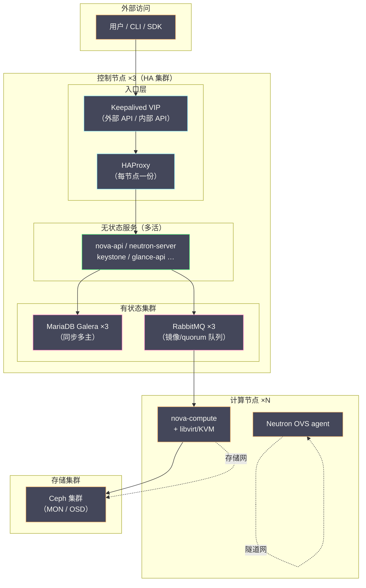

# 11 部署实战——Kolla-Ansible 与生产架构设计

**摘要：**

前十章我们一直在拆解 OpenStack 的"内部"——Nova 如何调度、Neutron 如何组网、Cinder 如何管卷，但所有这些组件要真正跑起来，首先得有人把它们装到机器上，而且要装得可重复、可升级、可回滚。这件事的难度常被严重低估：OpenStack 有几十个服务、上百个配置项、错综复杂的依赖关系，部署方式的演进史就是一部"如何驯服这份复杂性"的历史。本文先回顾 DevStack、Packstack 到 Kolla-Ansible 的部署工具演进脉络，再展开生产架构设计的核心议题——节点角色规划、网络平面分离、规模估算与高可用方案，然后走一遍 Kolla-Ansible 的完整部署流程与常见报错，接着讨论与 Ceph 对接的配置要点及超融合与分离部署的权衡，最后落到部署后基线的建立。读完你应当能回答两个问题：一套生产级 OpenStack 的架构图应该怎么画，以及 Kolla-Ansible 把复杂性藏在了哪里、又暴露了什么。

---

## 第 1 章 部署方式的演进史——从脚本到容器

### 1.1 DevStack：为演示而生的脚本

OpenStack 的部署工具史，几乎与 OpenStack 本身同龄。早在 2011 年前后，社区就提供了 DevStack——一个几百行的 Shell 脚本合集，它把 git clone、pip install、配置文件生成、服务启动全部串起来，在单台机器上几十分钟就能拉起一套完整的 OpenStack。对于想研究源码的开发者，DevStack 至今仍是标准工具，前文各篇的实验环境也大多基于它搭建。

但 DevStack 从设计之初就明确划定了自己的边界：**它只配开发，不配生产**。它的执行过程不幂等——同一环境跑两遍会报错；它的配置高度耦合——为了快，脚本里写死了大量路径与账号；它甚至会在运行中直接改动系统级配置（譬如修改内核参数、创建系统用户），跑完之后那台机器就"回不去了"。社区给它的定位是"从源码安装 OpenStack 的参考实现"，换句话说，DevStack 是一份可以执行的文档，而不是一件可以交付的工程。

这个定位带来的认知误区却延续至今：不少团队的第一次 OpenStack 评估就是用 DevStack 跑的，跑通之后便以为"部署不过如此"，等到真正规划生产环境才发现，从 DevStack 到生产之间隔着的不是距离，而是一个时代。

不过 DevStack 在它的赛道里依然是不可替代的。它从源码安装的特性让它成为"读代码的人"与"改代码的人"的桥梁——想验证某个服务的一个行为，与其在生产环境里小心翼翼地试探，不如在 DevStack 里复现；想追一个跨服务的调用链路，DevStack 的全组件同机部署让日志与断点都触手可及。工具的边界意识是双向的：DevStack 不该碰生产，生产环境也不该拒绝用 DevStack 做预演——**它的价值恰恰建立在"它不是生产"这个前提上**。

### 1.2 Packstack 与 TripleO：Puppet 路线的兴衰

第二条路线是 Red Hat 阵营的配置管理路线。Packstack 用 Puppet 模块封装了各服务的部署逻辑，一条 `packstack --allinone` 命令就能在 RHEL/CentOS 上装出一套像样的环境，比 DevStack 规范得多，一度是 RHEL 系用户的首选。再往后是 TripleO（"OpenStack on OpenStack" 的缩写），思路更为激进——用 OpenStack 自己的热迁移与编排能力（Heat、Ironic）来部署 OpenStack，把云平台变成自己的安装介质。

这条路线的兴衰值得玩味。Puppet 模块确实解决了"配置逻辑复用"的问题，但 OpenStack 服务数量太多、版本迭代太快，每个版本都要同步维护几十个模块的兼容性，维护成本随版本数线性上涨。TripleO 则把"部署工具"本身做成了一个分布式系统——你要先理解并运维一套用来部署 OpenStack 的 OpenStack，复杂性的转移而非消失在这里体现得淋漓尽致。最终，Red Hat 在 2023 年前后相继停止了 Packstack 与 TripleO 的维护，转向了容器化路线。配置管理路线的退场不是因为 Ansible 或 Puppet 不够好，而是因为**配置管理解决的是"配置一致性"，而 OpenStack 部署的真正痛点是"依赖隔离"**——这个问题后来由容器来回答。

### 1.3 手动部署的痛苦

在自动化工具成熟之前，相当多的团队走过手动部署的路：照着官方文档逐服务安装， Keystone 装完装 Glance，Glance 装完装 Nova，每个服务改十几处配置文件，配错一个连接串就全链路报错。手动部署的痛苦不在于第一次装不通——多花几天总能装通——而在于第二次、第三次：

- **不可重复**。三个月后要再扩一个环境，没人记得当时改过哪些配置，文档永远落后于现实。
- **不可升级**。从 N 版升到 N+1 版等于重新部署一遍，于是很多集群干脆停在老版本上不敢动。
- **不可回滚**。配置改坏了只能凭记忆改回来，没有"上一个已知良好状态"的概念。

这三条缺陷指向同一个根源：手动部署把"环境的状态"只存在于机器与人的记忆里，机器会漂移，记忆会失真，环境就永远无法被信任。

> [!info] 部署工具的本质
> 一套部署工具真正出售的不是"安装速度"，而是**可重复性**（Repeatability）——同样的输入永远得到同样的输出。可重复性是升级、回滚、灾备、审计等一系列运维能力的前提，没有它，后面的一切都是空中楼阁。这也是评价任何部署方案的第一标准。

### 1.4 Kolla-Ansible 与 OpenStack-Ansible：两条路线的竞争

2014 年前后，两条至今仍在服役的部署路线几乎同时起步。Kolla 项目（后拆分为 Kolla 容器镜像与 Kolla-Ansible 部署工具两部分）的核心主张是**容器化**：把每个 OpenStack 服务连同其全部依赖打包成 Docker 镜像，Ansible 只负责把镜像拉下来、把容器跑起来、把配置挂进去。OpenStack-Ansible（OSA）则走 Ansible 原生路线：用操作系统包管理器安装服务，用 LXC 容器或 systemd 做轻量隔离，配置管理全部交给 Ansible 角色。

两条路线竞争了多年，各有拥趸。把它们放到同一张表上比较，差异会清晰很多：

| 维度 | Kolla-Ansible | OpenStack-Ansible |
| :--- | :--- | :--- |
| 交付形态 | Docker 容器（binary/source 两种镜像） | 系统包 + LXC/systemd 隔离 |
| 依赖隔离 | 镜像级，宿主机几乎零依赖 | 容器级，但依赖仍由包管理器解析 |
| 升级方式 | 换镜像标签，逐服务滚动 | 重新执行 playbooks，逐主机滚动 |
| 学习曲线 | 较平缓（懂 Docker + Ansible 基础即可） | 较陡（需理解其角色体系与安全加固） |
| 灵活性 | 中（深度定制需重建镜像） | 高（配置项暴露更彻底） |
| 社区活跃度 | 部署文档与生态更普及 | 长期作为生产级方案维护 |

值得一提的是，这场竞争的裁判从来不是技术优劣的评分表，而是社区用脚投票的结果：Kolla-Ansible 凭借更平缓的门槛与更完整的文档，在新部署中的占比逐年走高；OSA 则在安全合规要求严苛的大型环境里保有自己的阵地。两条路线至今都活着，这个事实本身就是对"容器化与配置管理各有适用域"的最好注解。

除了这两条主线，还有 Canonical 的 Charmed OpenStack（基于 Juju 的 charm 交付）与 OpenStack-Helm（Kubernetes 上跑 OpenStack）等支线，它们各有适用场景，但社区声量与文档完备度都不及前两者，本文不再展开。

### 1.5 为什么容器化部署赢了

到今天，Kolla-Ansible 已经成为社区事实上的主流选择，新部署的生产环境大多从它起步。容器化路线的胜出不是偶然，而是它恰好命中了 OpenStack 部署的三个要害：

**第一，依赖地狱的终结**。OpenStack 各服务对 Python 库版本的要求并不总是一致的，裸机部署时这些要求要在同一台机器上共存，冲突在所难免。容器把每个服务的依赖封进各自的镜像，宿主机上只需要一个 Docker 守护进程——**复杂性没有消失，但它从"全局共享"变成了"各自封装"**，冲突的爆炸半径从整机缩小到了单个容器。

**第二，升级从"重装"变成了"换标签"**。容器镜像带版本标签，升级一个服务就是把容器从 `:2023.1` 换到 `:2024.1`，出问题切回旧标签即可。回滚从此有了物理载体，而不再依赖配置管理的逆向执行——后者在数据库 schema 已变更的场景下几乎不可能做对。

**第三，与宿主机解耦**。Kolla-Ansible 对宿主机操作系统的要求被压缩到最低限度（内核、Docker、时间同步），Ubuntu 与 RHEL 系都可以承载，操作系统的发行版选型不再绑架云平台的版本节奏。

不过容器化不是没有代价，这一点第 3 章还会回来说：排障时多了一层容器抽象，日志、网络、进程都隔着一层 Docker，习惯了裸机排障的工程师需要重新建立直觉。工具的每一次进化都是复杂性的重新分配，而不是复杂性的消灭——这个判断贯穿本章，也贯穿整篇。

### 1.6 选型的因地制宜

回看这条演进线，你会发现每一代工具都对应一类真实需求，谁也没有完全作废：DevStack 依然是开发者的日常，Packstack 的 Puppet 模块至今仍在一些老环境里服役，Kolla-Ansible 与 OSA 则各自守着一片生产阵地。把选型问题从"哪个最好"还原成"哪个适合你"，不妨按三个问题过一遍：

| 问题 | 倾向 Kolla-Ansible | 倾向 OpenStack-Ansible |
| :--- | :--- | :--- |
| 团队现有技能栈偏哪边 | 熟悉 Docker 与容器运维 | 熟悉 Ansible 深度定制与系统级调优 |
| 是否需要修改服务源码 | 偶尔定制（source 镜像可覆盖） | 深度定制（配置与代码路径暴露更彻底） |
| 环境规模与变更频率 | 中小规模、频繁重建 | 大规模、变更受控、安全合规要求高 |

还有一个常被忽略的维度是**人的因素**：部署工具是运维团队每天要打交道的界面，一个与团队心智模型不合的工具，再先进也会在无数次日常操作中磨出事故。笔者见过选择 Kolla-Ansible 的理由仅仅是"团队刚建完 Docker 容器平台，心智模型现成"——这不是敷衍，而是相当务实的判断。工具选型从来不只是技术题，组织与技能的惯性是真实存在的架构约束。

顺带回应一个常见的疑虑：选了 Kolla-Ansible 是否意味着放弃了深度调优的能力？答案是否定的——容器化只是封装了交付与配置的分发，服务的配置项依然通过 globals.yml 与各服务的自定义配置目录透出，绝大多数内核级调优（libvirt 参数、Neutron 的机制驱动配置、MariaDB 变量）都有对应的注入通道。真正受限的只有"改服务源码"这一种定制，而那恰恰是多数团队不该轻易踏入的区域。

---

## 第 2 章 生产架构设计——先画图，再敲命令

### 2.1 节点角色规划

如果说部署工具解决的是"怎么装"，那么架构设计解决的是"装在哪"。很多部署失败的种子在敲下第一条命令之前就已经埋下——节点角色没规划好、网络平面没分离，后面所有的配置都是在给错误的地基打补丁。生产架构设计的第一步是节点角色规划。

一套典型的生产环境包含三类节点：

| 节点角色 | 承载内容 | 规模参考 | 关键设计点 |
| :--- | :--- | :--- | :--- |
| 控制节点 | API、Scheduler、MariaDB、RabbitMQ、Keystone 等全部控制面服务 | 至少 3 台组成 HA | 规格"就高不就低"，数据库与 MQ 是资源大户 |
| 计算节点 | nova-compute、libvirt/KVM、Neutron openvswitch agent | 数十至数千台，按容量规划线性扩展 | CPU/内存/网络硬件决定云平台的能力上限 |
| 存储节点 | Ceph OSD（或独立存储后端） | 按容量与冗余策略规划 | 网络带宽是第一资源，见第 4 章 |

控制节点的规格值得单独说。初学者容易按"控制面不跑业务负载"的逻辑把控制节点配得很小，但控制面上跑的是 MariaDB（几十个服务的数据库）、RabbitMQ（全平台的消息总线）、各服务的 API 与内部进程，外加监控与日志采集的自身开销。笔者见过的多数控制面性能问题，根因都是控制节点规格过低——**控制面是全平台的心脏，心脏的规格要按"全平台都压上来"的最坏情况设计，而不是按"平时看起来很闲"设计**。一个常见的经验起点是：中小规模（百台计算节点以内）的控制节点不低于 32 vCPU / 128GB 内存 / SSD 系统盘，具体数字应结合第 2.3 节的估算方法按你的规模校准。

计算节点的规格则是另一套逻辑：它直接决定了云平台"卖什么"。CPU 的代际与核数决定实例密度的上限，内存容量决定超分空间（见 [[云原生/OpenStack/04 Nova 架构与调度——API、Scheduler 与资源模型|04 Nova 架构]] 的超分讨论），网卡带宽与是否支持 SR-IOV 决定网络型业务的天花板，磁盘则分两层看——系统盘与临时盘用 SSD/NVMe，而数据持久化交给后端存储（本地盘或 Ceph）。规划计算节点时最容易犯的错误是"一步到位买顶配"：计算节点是按批次滚动扩容的，与其首批就顶配，不如按业务画像分批采购、让每一批的规格都由真实负载反推。

控制面高可用要求控制节点至少 3 台——这个数字不是经验主义，而是由 quorum（法定人数）的数学决定的：Galera 与 RabbitMQ 集群都要求多数派存活才能写入，2 台节点坏 1 台即失去多数派，3 台坏 1 台仍可工作。5 台可以容忍 2 台同时故障，但运维与成本的边际收益递减，多数生产环境停在 3 台。

### 2.2 网络平面设计

第二件事是网络平面分离。前文 [[云原生/OpenStack/06 Neutron 架构——ML2、OVS 与网络命名空间|06 Neutron 架构]] 讲过，OpenStack 的流量种类远比一台普通服务器复杂，把它们混在一张网里，是生产环境最常见的架构错误。

| 网络平面 | 承载流量 | 典型带宽 | 不分离的后果 |
| :--- | :--- | :--- | :--- |
| 管理网（Management） | 服务间通信、数据库、MQ、Ansible 部署流量 | 1-10Gbps | 部署与内部通信被业务流量挤占 |
| 外部网/API 网（External/API） | 用户访问 Horizon 与各服务 API | 1-10Gbps | 用户流量与内部流量互相干扰，安全边界模糊 |
| 隧道网（Tunnel/Overlay） | VXLAN/GRE 封装的租户流量 | 10-25Gbps | 租户东西向流量冲击控制面通信 |
| 存储网（Storage） | 卷读写、镜像下载、Ceph 复制 | 25Gbps 起 | 存储抖动传导到全平台 |

分离的原则可以概括为一句话：**按流量的"脾气"分网，而不是按服务的归属分网**。存储流量是持续的大块吞吐，对抖动最敏感；隧道流量是突发的大规模并发；管理流量是低带宽但绝不允许丢包重传的集群心跳与数据库复制——三者的脾气完全不同，混在一起就等于让货车、跑车与救护车挤同一车道。

VLAN 规划在实践中通常这样落地：管理网、存储网、隧道网各占一个 VLAN 或独立物理口，外部 API 网按需多个 VLAN（区分内部 API 与公网浮动 IP），Neutron 的 provider 网络再预留一段 VLAN 池。规划时请留足余量——VLAN ID 池一旦在运营中期耗尽，重新规划的成本远高于初期多留一倍。

还有一个容易被忽略的细节：Neutron 的外部接口（`neutron_external_interface`）在部署时必须是一个**没有配置 IP 的空接口**，Kolla-Ansible 会把它直接划入 OVS 网桥。很多人在装机阶段习惯性给所有网口配好地址，部署时才发现这个口"被占用"了——这是新手部署报错榜上的常客。

网络平面的分离还与安全分区的设计相互咬合。管理网上跑着数据库与消息队列，理应是信任等级最高的网络，只有运维与节点自身可达；API 网面向用户，是暴露面最大的平面；两者之间必须由防火墙策略明确划界，而不是靠"都在内网"的模糊信任。实践中常见的事故模式是：有人为了图方便把管理网 VIP 暴露到办公网，数据库与 MQ 随之暴露——**网络平面的分离不只是性能设计，更是安全边界设计**，画网络图的时候，每一张网卡的归属都值得多问一句"谁不需要访问它"。

### 2.3 控制面规模估算

规模估算没有精确公式，但有几条经过大量生产验证的经验法则可以锚定量级：

- **控制节点对计算节点的承载比例**：一套三节点控制面（含 Galera 与 RabbitMQ 集群）在数百台计算节点的规模内通常运转良好；到千台级别，就要认真考虑 cell 架构（见 [[云原生/OpenStack/04 Nova 架构与调度——API、Scheduler 与资源模型|04 Nova 架构]]）或拆分部署单元了。
- **MariaDB 的容量**：瓶颈通常不在存储量而在写入峰值——所有服务的状态回写、审计记录、配额检查都落在这一处。监控上要盯住 Galera 的流控（flow control）与慢查询，而不是磁盘水位。
- **RabbitMQ 的容量**：消息速率与队列堆积是两个必须分开看的指标，前者反映吞吐，后者反映消费者是否跟上了。Nova 的周期性任务（report state、usage audit）会让消息速率呈现明显的周期尖峰，容量按尖峰而非均值规划。
- **API 层的容量**：nova-api 等无状态服务可以水平加实例，真正的天花板往往在它们背后的数据库连接数上——加 API 实例之前，先确认数据库连接池还有余量。

估算时还有一个实用的思维工具：**按"事件风暴"而不是"平均负载"做压力假设**。平均负载下控制面总是清闲的，真正的考验是批量创建一千台实例的开机风暴、全平台同时升级触发的状态回写洪峰、监控采集周期叠加造成的消息尖峰——控制面的规格要按这些事件中最大的那个来留余量。公有云厂商内部对这类场景有专门的术语与压测流程，私有云团队虽不必照搬其规模，但"用最坏事件而非平均值做设计"的思路是通用的。

这些法则的共同点是：**控制面的瓶颈几乎总是收敛到有状态的那两个组件——数据库与消息队列**。无状态的部分永远可以加机器解决，有状态的部分必须在架构期就给足规格与冗余。

### 2.4 高可用方案

控制面高可用的标准方案由三层拼装而成，每一层解决一类故障：

**第一层，有状态数据的集群化**。MariaDB 采用 Galera 集群（三节点同步多主复制），任一节点故障不影响读写；RabbitMQ 采用三节点集群，配合镜像队列或 quorum 队列保证消息不因单点故障丢失。这两套集群的共同点是**依赖多数派仲裁**，所以节点数取奇数、节点间网络延迟要低（Galera 对跨节点延迟敏感，控制节点之间尽量同机房同交换机）。

**第二层，无状态服务的多活**。各服务的 API 进程在每台控制节点上都跑一份，前面挂负载均衡。它们本身无状态，多活是"免费"的——代价只是每台节点都要预留承载全量流量的余量，防止故障切换后幸存节点过载。

**第三层，入口的虚拟 IP**。用 HAProxy 做四层/七层分发、Keepalived 通过 VRRP 提供漂移的虚拟 IP（VIP），API 网关地址永远指向 VIP，后端节点故障时流量自动切走。Kolla-Ansible 默认就按这套方案编排（`enable_haproxy: yes`），部署工具已经把"标准答案"内置了。

三层方案的分工可以用一个比喻收拢：有状态集群像一支轮值值守的班组，任何时刻必须凑齐多数人才能开门办事；无状态服务像一组可以互相顶班的柜台，谁在岗都办同样的业务；而 VIP 像一块永远挂在墙上的总服务牌——客户只认牌子，牌子后面是谁在值班，客户既不知道也不需要知道。高可用设计的全部目标，就是让"牌子后面的变动"对客户不可见。

把三层拼起来，一套生产级控制面的架构是这样的：



这张图里值得多看两眼的是有状态集群与无状态服务的分界线：**高可用设计的全部难度都集中在分界线以下**。无状态多活是成熟套件，有状态集群才是真正的功课——Galera 的脑裂处置、RabbitMQ 的队列恢复，都是需要提前演练而不是临场翻文档的事。

> [!warning] HA 不是部署完就成立的
> 集群装好只意味着"配置是 HA 的"，不意味着"故障切换是可用的"。生产验收前至少要做一轮破坏性演练：拔一台控制节点的电源，确认 VIP 漂移、API 不中断、Galera 与 RabbitMQ 自动恢复。没有演练过的 HA 方案，等于没有 HA——故障发生时你才会发现某个服务写死了单节点地址。

### 2.5 部署单元与故障域的划分

节点角色与网络平面之外，架构设计还有一层常被新手跳过的功课：**把整个环境划成几个故障域**。哪怕规模不大，也建议在逻辑上预先划分可用域（Availability Zone，AZ）——把计算节点按机柜、机房或业务线划入不同 AZ，让"一个机柜断电拖垮全部业务"从架构上就不可能发生。AZ 的划分粒度没有标准答案，但有一条底线：**任何单点故障（一台交换机、一路供电、一组存储）的影响面，必须小于你向用户承诺的可用性等级所允许的损失范围**。

存储侧的故障域划分与 Ceph 的 CRUSH 拓扑呼应（见 [[中间件/Ceph/02 CRUSH 算法——去中心化的数据放置|CRUSH 算法篇]]）：OSD 按 host、rack、room 分层，副本跨层分布，故障域才真正成立。计算侧的 AZ 与存储侧的 CRUSH 根最好对齐——同一个 AZ 的计算节点优先读写同故障域内的 OSD，既降低跨机柜流量，也让"整个 AZ 失联"成为存储与计算同时成立的故障假设，而不是各说各话。

| 规划对象 | 划分依据 | 与之联动的机制 |
| :--- | :--- | :--- |
| 计算 AZ | 机柜/机房/业务线 | 调度域、用户可见的放置选项 |
| 存储 CRUSH 层级 | 机柜/机房 | 副本/纠删码的分布策略 |
| 网络故障域 | 交换机/安全区 | 隧道网与存储网的物理拓扑 |
| cell（大规模） | 控制面承载单元 | 独立 MQ 与数据库，见 04 篇 |

这张表的四行其实是同一个思想在不同层面的投影：**架构师无法阻止故障发生，但可以决定故障的爆炸半径**。部署工具能帮你把节点装起来，却不能替你决定"哪台机器和哪台机器绑在同一个命运上"——这是画架构图的人不可外包的职责。

---

## 第 3 章 Kolla-Ansible 部署实战

### 3.1 前置准备与 bootstrap

架构图定稿后，进入 Kolla-Ansible 的实操。前置准备阶段的任务清单不长，但每一项都有部署失败的"经典案例"背书：

1. **基础环境**：所有节点装好 Docker（Kolla-Ansible 新版本也可配合容器运行时配置项选择）、Python 与 Ansible，时间同步（chrony/NTP）必须先配好——Galera 与 RabbitMQ 对时钟漂移零容忍，时钟不同步引发的服务异常是排障时最难想到的根因之一。
2. **获取配置骨架**：安装 kolla-ansible 后，把 `globals.yml` 与密码清单的样例复制到 `/etc/kolla/`，运行 `kolla-genpwd` 生成全套密码。密码清单是自动生成的随机串，请立即纳入密码管理——它丢了，整套环境就找不回管理入口了。
3. **执行 bootstrap**：`kolla-ansible bootstrap-servers` 会通过 Ansible 完成宿主机的初始化——装 Docker、配内核参数、建目录、分发配置。这一步是幂等的，跑多少遍都安全，所以放心用它来收敛宿主机状态。

bootstrap 的设计思想值得注意：**Kolla-Ansible 把"宿主机准备"与"服务部署"拆成了两个阶段**，前者面向操作系统（可重复执行、声明式收敛），后者面向容器（拉镜像、起服务）。两阶段分离让"重装一套环境"变成清空容器后重跑两个命令，环境的可重建性由此而来。

整个部署流程的先后依赖可以画成一条流水线，每一步的输出是下一步的输入：


这条流水线里最容易被轻视的是第一步与最后一步——准备宿主机与冒烟测试，它们没有产出任何"看起来像部署成果"的东西，却分别决定了部署的成败与部署的价值。中间五步是工具的舞台，首尾两步是人的功课。

### 3.2 globals.yml 关键配置解读

`globals.yml` 是 Kolla-Ansible 的主配置文件，一百多个配置项里真正必须理解的不到二十个。逐段看最关键的几组：

```yaml
# 基座选型：发行版与安装类型
kolla_base_distro: "ubuntu"     # 宿主镜像基座，ubuntu/rocky
kolla_install_type: "binary"    # binary=发行版包构建，source=源码构建
openstack_release: "2024.1"     # 镜像标签，即 OpenStack 版本
```

`kolla_install_type` 的选择是个典型权衡：binary 镜像基于发行版软件包，体积小、构建快，是绝大多数场景的默认选择；source 镜像从源码构建，可以打入自定义补丁，适合需要深度定制的团队。**选 binary 还是 source，本质上是在问"你要不要改 OpenStack 的代码"**——不改就选 binary，把定制留在配置层。

```yaml
# 网络接口：与第 2 章的网络平面一一对应
network_interface: "eth0"                    # 管理网
api_interface: "{{ network_interface }}"     # API 网（默认同管理网）
tunnel_interface: "{{ network_interface }}"  # 隧道网（生产应独立）
neutron_external_interface: "eth1"           # 外部网（必须无 IP）
```

这组配置就是第 2.2 节那张网络平面表的直接翻译。注意默认值全部指向 `network_interface`——**默认配置是"单网卡演示态"，生产环境必须显式展开**，这正是"globals.yml 即文档"的意义：每一行没有显式覆盖的默认值，都是一处潜在的设计疏漏。

```yaml
# 高可用与服务开关
kolla_internal_vip_address: "10.0.0.100"   # 内部 API 的 VIP
kolla_external_vip_address: "203.0.113.10" # 对外 API 的 VIP
enable_haproxy: "yes"
enable_keystone: "yes"
enable_glance: "yes"
enable_cinder: "yes"
cinder_backend_ceph: "yes"                 # Cinder 对接 Ceph 后端
enable_neutron_provider_networks: "yes"    # 允许 provider 网络
```

`enable_*` 系列是 Kolla-Ansible 最贴心的设计——**部署范围由开关声明，而不是由组件依赖隐式推导**。你需要什么就开什么，不需要的不装，控制面的资源与攻击面都随之收敛。开关之间有依赖关系（譬如开 Cinder 对接 Ceph 需要先配好 Ceph 的密钥与参数），Kolla-Ansible 会在部署时校验并给出明确报错，而不是静默跳过。

除了这三组核心配置，还有几组值得在首次部署前就弄清的条目：

| 配置项 | 作用 | 决策要点 |
| :--- | :--- | :--- |
| docker_registry | 镜像仓库地址 | 内网环境必配自建仓库，兼顾速度与可控 |
| config_strategy | 配置变更策略 | AUTO_COPY 或 COPY_ALWAYS，决定容器重建时配置如何同步 |
| neutron_plugin_agent | Neutron 的 ML2 机制驱动 | openvswitch 或 openvswitch（OVN 路线另行评估） |
| nova_compute_virt_type | 计算虚拟化类型 | 生产用 kvm，嵌套虚拟化测试环境才用 qemu |
| enable_prometheus 等监控开关 | 是否随部署带监控栈 | 建议开启，监控与平台同生命周期 |

这份表不必一次背全，但建议在第一次 deploy 前把 globals.yml 从头到尾通读一遍——注释里藏着大量"默认行为说明"，通读一遍的成本远低于部署失败后逐项排查的成本。配置文件是部署工具与你之间的契约，**签契约之前不读条款，出了问题只能怪自己**。

### 3.3 多节点 inventory 设计

Ansible 的 inventory 描述"哪些机器扮演什么角色"，Kolla-Ansible 预定义了一组主机组，多节点环境的典型写法如下：

```ini
[control]        # 控制节点，写 3 台即自动组成 HA
ctrl01 ansible_host=10.0.0.11
ctrl02 ansible_host=10.0.0.12
ctrl03 ansible_host=10.0.0.13

[network]        # 网络节点（DVR 部署下可与 control 合并）
ctrl01 ctrl02 ctrl03

[compute]        # 计算节点，横向扩展的主体
cmp01 ansible_host=10.0.1.11
cmp02 ansible_host=10.0.1.12

[monitoring]
ctrl01 ctrl02 ctrl03

[storage]
sto01 ansible_host=10.0.2.11
sto02 ansible_host=10.0.2.12
```

inventory 的价值在于**角色与机器的解耦**：同样是三台控制节点，改一行配置就能让它们同时兼任网络角色。实践中笔者建议把 inventory 纳入 git 管理，与 globals.yml 放在同一个部署仓库里——部署配置的版本历史就是环境的变更历史，这个习惯在事后审计与故障回溯时的价值，做过一次深度排障的人都会懂。

主机组的划分粒度还隐含着一套部署顺序的语义：Kolla-Ansible 会按 control、compute 等分组的依赖关系决定执行次序，控制面的数据库与消息队列先于依赖它们的计算组件就绪。理解这一点后，"新增一批计算节点要怎么做"这类问题就有了标准答案——inventory 里追加主机、核对前置清单、重跑 bootstrap 与 deploy，工具会只对增量部分生效。扩容从"一次小型部署项目"降格为"一次配置变更"，这正是声明式部署工具对运维模式的重塑。

### 3.4 deploy 执行与常见报错

一切就绪后执行 `kolla-ansible deploy`，它会按依赖顺序完成镜像拉取、容器编排、数据库建表、服务注册，中小规模环境通常几十分钟跑完。部署很少一次通过，好在绝大多数报错落在有限的几类里：

| 报错现象 | 高频根因 | 处置思路 |
| :--- | :--- | :--- |
| 镜像拉取超时/失败 | 仓库不可达、限流 | 配置国内镜像源或自建 registry |
| MariaDB 引导失败 | 残留数据目录、节点间无法互连 | 清理 `/var/lib/mysql` 后重跑，检查管理网互通 |
| RabbitMQ 集群起不来 | 时钟漂移、主机名解析异常 | 校时、核对 `/etc/hosts` 与主机名 |
| neutron 报外部接口异常 | `neutron_external_interface` 配了 IP | 摘掉该口的 IP 配置 |
| 端口冲突（3306/5672 等） | 宿主机装过 MySQL/MQ | 卸载宿主机上的同类服务 |
| facts 收集失败 | Python 版本、SSH 互通 | 统一 Python 环境、打通 SSH 免密 |

这张表的背后有一条共性规律：**绝大多数部署报错的根因在宿主机，而不在 OpenStack**。部署工具面对的是"千差万别的宿主机状态"，而它假设的是"干净的、符合前置清单的机器"——两者的差值就是报错的来源。所以部署排障的第一动作不是盯着 OpenStack 的报错信息，而是回头核对前置清单：时钟同步了吗、主机名解析对吗、接口配置干净吗、仓库可达吗。

排障时有一个效率倍增的习惯：**用 `kolla-ansible -t <tag>` 只重跑失败阶段的任务**，而不是整个 deploy 从头再来。deploy 的各阶段（pull、bootstrap、config、deploy）都有独立 tag，定位到哪一阶段失败就重跑哪一阶段，能把修复循环的周期从几十分钟压到几分钟。

还有一条关于"重跑"的纪律值得立在前头：deploy 是幂等的，但**幂等不等于无副作用**——MariaDB 引导阶段如果数据目录处于半初始化状态，盲目重跑可能把不一致固化下来。遇到有状态组件（MariaDB、RabbitMQ）的引导失败，先看日志判断是"环境问题"还是"半初始化残留"，前者修环境，后者清残留，确认后再重跑。机械重试是自动化时代最隐蔽的反模式：它把"修复问题"偷换成了"掩盖问题"。

> [!info] 容器化部署的排障直觉
> 进容器看日志用 `docker exec` 或 `docker logs`，配置文件在宿主机 `/etc/kolla/<服务>/` 下以挂载方式进入容器——**改容器里的文件是无效的，一切配置修改都要回到 globals.yml 与部署仓库**，重新执行 deploy 让配置重新生成。理解了"容器是牲口不是宠物"这个前提，容器化部署的排障直觉就建立起来了。

### 3.5 部署后验证

deploy 成功结束只是"容器都起来了"，环境是否真正可用要靠冒烟测试回答。标准动作三步：

1. **加载凭证**：`kolla-ansible post-deploy` 生成 `/etc/kolla/admin-openrc.sh`，`source` 之后 CLI 才有身份。
2. **服务巡检**：`openstack catalog list` 确认各服务端点注册齐全，`openstack service list` 与 `openstack compute service list` 确认各组件状态为 up。
3. **端到端冒烟**：跑一遍最小闭环——上传镜像、创建网络与子网、创建 flavor、启动一台实例、分配浮动 IP、SSH 登入、创建并挂载一块卷。Kolla-Ansible 自带的 `init-runonce` 脚本可以自动完成大部分准备动作，适合作为验收基线。

把冒烟闭环拆开看，每一环验证的其实是不同层面的东西：

| 冒烟动作 | 验证对象 | 失败时优先怀疑 |
| :--- | :--- | :--- |
| 上传镜像 | Glance 与其后端存储 | 存储对接配置、池权限 |
| 创建网络与子网 | Neutron 与 ML2 机制驱动 | 外部接口、隧道网连通性 |
| 启动实例 | Nova 调度与 libvirt 执行 | 调度过滤、计算节点状态 |
| 分配浮动 IP | 外部网与路由 | provider 网络与外部网关 |
| 挂载卷 | Cinder 与存储后端 | 卷类型映射、密钥分发 |

这张表的价值在于把"环境不可用"这种模糊的挫败感，拆解成一张可以逐行打勾的核对单——冒烟测试跑不通时，断在哪一行，排查方向就在哪一行。

冒烟测试的价值不在于"证明装好了"，而在于**建立环境的第一个已知良好状态**：这一刻的输出（服务列表、实例启动耗时、镜像下载速度）就是第 5 章要谈的基线的起点。

冒烟之后还有一件收尾的事：把这次部署的"现场"归档。部署当天各节点的内核版本、Docker 版本、镜像标签清单（`docker images` 的导出）、globals.yml 与 inventory 的最终版本，连同冒烟测试的输出一起存进部署仓库——生产环境的第一天是什么样子，从此有据可查。运维的老话讲"好记性不如烂笔头"，在部署这件事上，烂笔头的最佳形态就是一个 git 仓库。

---

## 第 4 章 对接 Ceph——存储后端的边界

### 4.1 三大服务的对接要点

OpenStack 与 Ceph 的组合是开源私有云的黄金搭档，三大存储消费方各有各的对接方式：

**Glance（镜像）**：把 RBD 配置为镜像存储后端，镜像直接写入 Ceph 池。与本地文件后端相比，收益在创建实例时兑现——计算节点可以从 RBD 做 copy-on-write 克隆，开机从分钟级降到秒级（原理见 [[云原生/OpenStack/09 Glance 镜像服务——镜像流水线与制作实战|09 Glance 篇]]）。配置要点是给 Glance 容器分发 Ceph 的密钥环与配置文件，并指定 RBD 池与用户。运维上还要留意镜像池的容量水位：镜像是"只增不减"的资产，删除镜像后空间回收依赖 Ceph 层面的处理，池的配额与告警阈值要按镜像库的增长曲线设定，而不是按当前存量。

**Cinder（块存储）**：以 RBD driver 接入 Ceph，卷就是 RBD 镜像。这是三处对接里最"原生"的一处——快照、克隆、QoS 全部由 Ceph 承接，Cinder 只做编排。配置上除了密钥环，还要注意 `cinder_backend_ceph` 开关与卷类型（volume type）的映射，让不同规格的卷可以指向不同的 Ceph 池——譬如把高 IO 业务指向 SSD 池、归档业务指向 HDD 池，卷类型就是这条策略在用户侧的接口。卷的加密、QoS 上限等策略也随卷类型下发，理解了"卷类型是策略的载体"，Cinder 与 Ceph 的协作模型就通了。

**Nova（临时盘）**：这是最容易被漏掉的第三处——把实例的临时盘也放到 RBD 上（`images_type=rbd`），实例的根盘与临时数据都活在 Ceph 里，热迁移时不再需要跨节点拷贝磁盘，迁移速度与成功率都显著提升（迁移实战见 [[云原生/OpenStack/05 实例生命周期与迁移实战|05 实例生命周期]]）。代价是临时盘的 IO 性能从本地盘变为网络盘，对 IO 敏感的业务要配合卷类型或聚合规划兜底。是否启用这一项，取决于你对"迁移速度"与"单实例 IO"两个指标的排序——没有对错，只有业务优先级。

此外 Gnocchi（计量数据的时间序列库）也可以用 Ceph 做后端存储，把监控计量数据的持久化一并交给统一存储池。四处对接共享同一个原则：**OpenStack 侧只保存"怎么连 Ceph"（密钥、池名、用户），不保存数据本身**——数据的所有权完全交给存储集群，这正是存储与计算分离的干净边界。

### 4.2 超融合与分离部署的权衡

Ceph 集群与 OpenStack 计算节点的关系有两种形态：**超融合**（hyperconverged，Ceph OSD 与 nova-compute 同机部署）与**分离部署**（独立存储集群）。两者的权衡是存储架构的经典议题，与 [[中间件/Ceph/10 集群部署实战——cephadm 与生产规格设计|Ceph 部署篇]] 中的生产规格设计互为表里：

| 维度 | 超融合 | 分离部署 |
| :--- | :--- | :--- |
| 硬件成本 | 低（机器复用） | 高（独立存储节点） |
| 故障域 | 存储/计算故障互相耦合 | 隔离清晰 |
| 性能可预期性 | 计算负载与存储 IO 抢资源 | 各自独立，可分别调优 |
| 扩展节奏 | 绑定（加存储必须加计算） | 独立演进 |
| 适用规模 | 小规模、成本敏感 | 中大规模、性能敏感 |

超融合省下的硬件成本是真实的，但代价同样真实：一台节点既是计算资源又是存储资源，虚机的 IO 风暴会拖累同机的 Ceph OSD，OSD 的恢复流量又会反过来拖累虚机——**故障域与资源域的双重耦合**。笔者的建议是：几十个节点以内、业务 IO 平缓的环境可以超融合起步；任何有性能承诺（SLA）的生产环境，都值得为分离部署多付那一排存储节点的钱。顺带一提，Kolla-Ansible 曾经内置过 Ceph 部署能力，但社区在 Victoria 版本前后移除了它，转而推荐用 cephadm 独立部署 Ceph、OpenStack 侧只做对接——这个演进本身就是"存储与计算各走各的发布节奏"这一架构判断的注脚。

两种形态之间还存在折中路线：按业务分层超融合——把 IO 平缓的业务与 OSD 混部、把 IO 敏感的业务放在纯计算节点上。这条路能吃到超融合的成本红利，又不让最敏感的业务承担存储抖动的风险，代价是运维要同时管理两类节点的规格与调度策略，复杂度介于两者之间。没有哪种形态是免费的，选型的依据始终是同一个问题：你愿意用多少运维复杂度，去换多少硬件成本。

> [!note] 边界的判断标准
> 判断该不该超融合，与其数节点数，不如问一个问题：**你的存储 IO 需求与计算需求是否同比例增长**？同步增长（譬如通用云桌面）超融合的绑定扩展不构成负担；不同步（譬如计算密集型业务配大容量冷存储）就该分离，让两类资源各按各的曲线扩展。

---

## 第 5 章 部署后基线——把初始状态变成资产

### 5.1 性能基线

部署完成的集群是"空白且健康"的，此刻测得的性能数据是最干净的参照系，错过就不再来。值得记录的性能基线至少包括：

- **实例启动耗时**：从 API 请求到实例 ACTIVE 的时间，分镜像缓存冷/热两种状态各测一轮；
- **镜像流水线速度**：上传一个标准镜像的耗时、从 Glance 到计算节点的分发速度；
- **磁盘 IO**：在实例内用 fio 测卷与临时盘的顺序/随机读写，记录 Ceph 后端与本地盘的差异量级；
- **网络吞吐**：租户网络东西向吞吐、经外部网的南北向吞吐。

测基线的方法论比数字本身更重要：**固定变量、多次取样、记录条件**。同一项测试至少跑三轮取中位数，同时记录当时的并发度、镜像大小、实例规格与存储池水位——脱离条件的数字没有可比性，三个月后你翻出"开机 90 秒"时，必须知道这是冷缓存单实例的数字，还是批量并发下的数字，否则基线反而会成为误导。

这些数字单独看没有意义，意义在于**当未来某天"云变慢了"，你手里有一把出厂的尺子**。没有基线的性能排障，只能靠猜测与玄学；有基线的性能排障，是当前曲线与出厂曲线的差分分析。

### 5.2 健康基线

健康基线是性能基线的运维侧对应物：各服务进程数与内存占用、Galera 集群的流控频率、RabbitMQ 的消息速率曲线、各容器的重启计数。Kolla-Ansible 提供了 `kolla-ansible check` 一类的健康检查入口，配合 `docker ps`、`rabbitmqctl status`、Galera 的状态变量，可以把"健康"定义成一组可自动采集的指标。

| 基线项 | 采集方式 | 关注什么 |
| :--- | :--- | :--- |
| 服务状态 | openstack service list / docker ps | down 状态、异常重启计数 |
| 数据库健康 | Galera 状态变量 | 流控频率、复制延迟、集群尺寸 |
| 消息队列 | rabbitmqctl status / 队列深度 | 消息速率尖峰、堆积趋势 |
| 资源水位 | 各节点 CPU/内存/磁盘 | 控制节点的水位爬升斜率 |
| 调度健康 | Placement 与 Nova 对账 | 幽灵占用、账实偏差 |

这些指标连同采集命令一起写进运维手册，就是第 12 篇"日常运维手册"的雏形——**运维体系的起点不是故障发生时，而是部署完成的那一天**。健康基线与性能基线的分工也值得辨析：性能基线回答"系统跑多快"，健康基线回答"系统是否正常"，前者的消费者是容量规划与性能排障，后者的消费者是告警阈值与巡检清单——两份清单都建立在部署完成时的干净状态上，这正是把基线工作放在部署篇而不是运维篇的原因。

### 5.3 配置即文档

前文反复提到 globals.yml 要纳入 git，这里把理由说透。传统部署的文档是"部署完成后补写的说明书"，与真实环境天然有时差；Kolla-Ansible 的部署仓库是"可执行的说明书"——globals.yml、inventory、密码管理策略、Ceph 对接参数，全部以配置形式存在，**文档与环境之间不存在翻译损耗，因为文档就是环境本身**。任何人想了解这套环境长什么样，读部署仓库比读任何 Word 文档都可靠。

配套的纪律只有两条：所有配置变更走部署仓库的提交与评审，禁止在节点上手工改配置（容器会把它覆盖回去，但更糟的是它会造成"看起来改了"的错觉）；每次变更在提交说明里写清动机——半年后回看，"为什么当时这么配"比"配了什么"更难回忆。

配置即文档的做法还有一个进阶形态：**把环境差异做成变量表**。如果团队要维护多套环境（开发、预发、生产），可以把三套环境共有的配置留在主 globals.yml，差异项（IP 段、密码引用、开关组合）抽成按环境覆盖的变量文件，部署时以 `-e @<环境>.yml` 叠加。这样"三套环境为什么行为不一致"的问题，就收敛为"三个变量文件之间的 diff"——差异被显式化了，排障的搜索空间从整个配置文件缩小到差异项本身。

### 5.4 升级策略与 SLURP

部署篇的结尾，把视线投向环境的整个生命周期。OpenStack 的版本节奏是半年一版、每年四月与十月各一版，社区从 2023.1（Antelope）起引入了 SLURP（SLURP upgrade release）机制——每年只有一版是 SLURP 版（如 2023.1 与 2025.1 的 Epoxy），跨 SLURP 升级可以一次跳过中间多个版本，非 SLURP 版本则只能逐版升级。这给容量与升级规划提供了一个清晰的节拍：**生产环境按"每年一次大版本升级、锚定 SLURP 版本"来规划**，把升级从"随时可能发生的事故"变成"日历上的例行工程"。

Kolla-Ansible 对升级的支持是分层的：小版本内是 `kolla-ansible upgrade` 的滚动升级，跨版本则按官方升级文档逐版执行、先控制面后计算面。无论哪一档，升级的前提都是同一个——部署仓库完整、基线数据在手、回滚路径演练过。这三样东西，恰好就是本章前三节讲的三件事。

落到操作层面，一次大版本升级前的准备清单大致是：

- 在预发环境用相同配置完整演练一遍升级流程，记录耗时与报错；
- 核对目标版本的 release notes，逐条确认默认值变更与废弃参数（globals.yml 里的每一个参数都过一遍）；
- 备份 MariaDB 全库与 `/etc/kolla` 配置目录，确认备份可恢复；
- 冻结变更窗口，通知业务方升级期间的抖动预期；
- 准备回滚预案：镜像标签切回、数据库回档的步骤与判定条件。

这份清单本身不复杂，复杂的是它的每一条都依赖部署仓库与基线的长期维护——升级能力是日常纪律的利息，不是临阵磨枪能补出来的。

升级策略还有一个与部署架构强相关的推论：**部署工具的标准化程度，决定了升级的成本曲线**。当年那些手动部署的集群之所以停在老版本上，不是因为团队不想升级，而是升级成本高到不可行；容器化部署把升级变成"换镜像标签 + 滚动重启"，成本曲线平缓到可以纳入年度日历。回望第 1 章的演进史，会发现部署工具竞争的终极裁判不是安装速度，而是这条升级成本曲线——**装得快只是省了一天，升得动才能陪环境走完五年**。

由此可见，部署从来不是专栏的"施工花絮"，而是把前十章的所有抽象落成现实的那座桥：网络平面表落成 VLAN，资源模型落成节点规格，存储后端落成 Ceph 对接，而部署工具的演进史则提醒我们，架构师的每一个选择都是在复杂性的不同形态之间做转移，而非消灭。工具没有银弹，规模没有常数，只有把演进史、架构图与操作手册放在同一张桌子上对照着看，才能为你自己的团队与业务，因地制宜地画出那张属于你的架构图。

---

## 参考资料

1. OpenStack 官方文档——Kolla-Ansible 部署指南：https://docs.openstack.org/kolla-ansible/
2. Kolla-Ansible globals.yml 配置参考：https://docs.openstack.org/kolla-ansible/latest/reference/globals.html
3. OpenStack-Ansible 官方文档：https://docs.openstack.org/openstack-ansible/
4. OpenStack SLURP 升级机制说明：https://docs.openstack.org/operations-guide/
5. Ceph 官方文档——cephadm 部署：https://docs.ceph.com/en/latest/cephadm/
6. OpenStack Superuser 社区——生产环境部署架构案例讨论
7. 相关篇章：[[云原生/OpenStack/02 控制面三件套——MariaDB、RabbitMQ 与 Keystone|02 控制面三件套]] · [[云原生/OpenStack/05 实例生命周期与迁移实战|05 实例生命周期]] · [[云原生/OpenStack/07 Neutron 进阶——VXLAN、DVR 与安全组|07 Neutron 进阶]] · [[云原生/OpenStack/08 Cinder 块存储——卷生命周期与 Ceph RBD 后端|08 Cinder 篇]] · [[云原生/OpenStack/10 Swift 对象存储——环状数据结构与 Ceph RGW 对比|10 Swift 篇]] · [[中间件/Ceph/10 集群部署实战——cephadm 与生产规格设计|Ceph 部署篇]]

---

> [!note] 思考题
> 1. 控制面高可用要求 3 台控制节点组成 Galera 与 RabbitMQ 集群。假设机房只有两台控制节点的预算，有人提议"2 节点 Galera + 第三仲裁节点（garbd）"方案，这个方案在哪些故障场景下仍会失去写入能力？与直接上 3 台相比，省下的钱对应放弃了哪些可用性保证？
> 2. 部署完成后你发现实例开机要 8 分钟，而基线记录是 90 秒。请设计一条排查路径：从镜像分发、Ceph 读写、调度耗时三个候选方向中，如何用最少的测量步骤定位根因？哪些基线数据在这一步会派上用场？
> 3. 你的团队要在一批新机器上重建一套与生产完全相同的 OpenStack 用于压测。盘点一下：部署仓库里的哪些文件可以原样复用，哪些必须修改（IP、密码、Ceph 对接），哪些"环境状态"根本不在部署仓库里、需要额外导出（数据库内容、镜像、卷）？由此思考"可重建环境"与"可复制环境"的差别。
