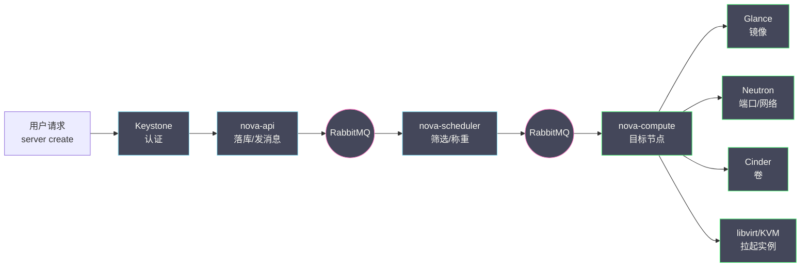
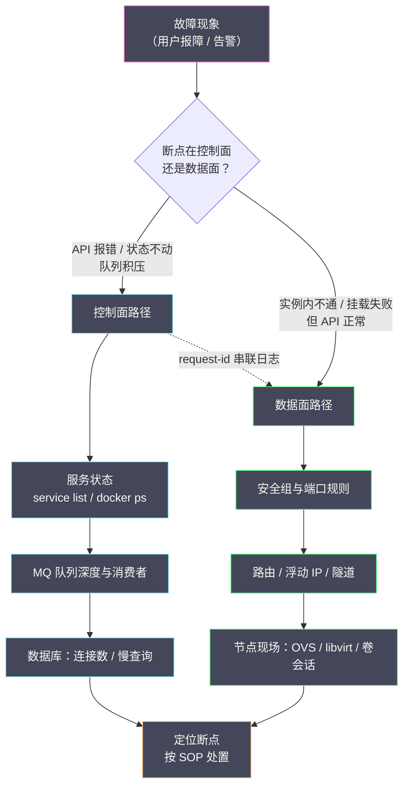

# 12 日常运维手册——健康检查与故障处理

**摘要：**

前一篇我们把 OpenStack 装进了生产环境，但部署完成只是运维生涯的第一天，从这一天起，你要面对的是一个由几十个服务、上百个容器、三套有状态集群共同组成的分布式系统，而它不会告诉你哪里不舒服。本文先建立 OpenStack 运维的心智模型——多服务协作意味着故障域、日志与状态的全面分散，运维的第一性原理是沿着调用链找断点；然后给出日常巡检的命令集与分层清单，梳理日志体系的组织方式与跨服务串联方法；接着用六个高频故障的标准作业程序（SOP）演示"现象→诊断→处置→预防"的完整套路，这是本文的重头；最后讨论变更管理的灰度流程、SLURP 升级节奏与回滚预案，并收拢一个值得长期维护的运维工具箱。读完你应当能回答两个问题：一套生产 OpenStack 的"体检表"应该长什么样，以及当故障发生时，如何沿着调用链在最短时间内定位断点。

---

## 第 1 章 运维的心智模型——沿着调用链找断点

### 1.1 故障域的分散：从体检一个人到体检一支球队

运维一套单体应用，好比给一个人做体检——抽血、拍片、问诊，所有指标都来自同一个身体，异常与病因之间的距离很近。而运维 OpenStack，更像是给一支二十几人的球队做体检：每个队员（服务）都有自己的体检报告，但比赛的胜负（业务可用性）取决于全队的配合，任何一个位置掉链子，记分牌上都是同一个结果——丢球。这就是 OpenStack 运维与普通应用运维的第一个根本差异：**故障域是分散的，而故障的表现是收敛的**。

我们不妨跟着一个最普通的请求走一遍。用户敲下 `openstack server create`，这个"开机"动作实际要穿过一条长长的链路：Keystone 先验明正身，nova-api 收下请求并落库，消息经 RabbitMQ 递给调度器（Scheduler），调度器在 Placement 的账本里挑一个资源够用的计算节点，消息再递到目标节点的 nova-compute，后者调用 libvirt 拉起 QEMU 进程，期间向 Glance 下载镜像、向 Neutron 请求端口与网络配置、按需向 Cinder 附加卷——这条链路在 [[云原生/OpenStack/04 Nova 架构与调度——API、Scheduler 与资源模型|04 Nova 架构]] 里拆解过，当时我们关心的是它如何协作，现在我们要关心的是它如何断裂：



链路上任何一个环节出问题——Keystone 的令牌过期策略改坏了、MQ 的队列堆起来了、调度器的过滤器筛掉了所有节点、计算节点的 libvirt 起不来了、镜像后端读不动了、隧道网不通了——用户看到的都是同一个现象：实例创建失败。**表现收敛于用户接口，根因分散于整条链路**，这个不对称就是 OpenStack 排障的全部难度来源。由此可以提炼出本篇的第一性原理：**沿着调用链找断点**。不要一上来就盯着报错最响的那个服务，先画出这条请求的完整链路，然后从链路的两端向中间收拢——确认请求进来了没有、响应出去了没有，断点必然夹在两者之间。

### 1.2 状态的三个存放处

沿着链路找断点，还需要知道去哪里找。OpenStack 的系统状态分散在三个地方，排障时的动作也因存放处而异：

| 存放处 | 内容 | 排障动作 |
| :--- | :--- | :--- |
| 数据库（MariaDB） | 持久事实：实例记录、端口记录、卷记录、配额 | 查表确认"账面状态"，警惕账实不符 |
| 消息队列（RabbitMQ） | 在途消息：调度请求、状态回报、周期任务 | 看队列深度与消费者，确认消息是否被取走 |
| 进程内存 | 瞬时状态：服务心跳、缓存、连接池 | 看服务状态与日志，必要时重启刷新 |

三个存放处里最容易出问题的是它们之间的**一致性**。譬如一个实例在数据库里还是 `BUILD` 状态，但计算节点上的进程早就死了，这条"僵尸记录"不会自己消失，Nova 靠周期性的对账（Reconciliation）任务去清理，而对账有周期、有延迟，排障时你看到的账面状态可能落后于现实几分钟。再譬如调度器已经把消息发进队列，但 nova-compute 掉线了，消息就静静躺在队列里——数据库里实例是 `BUILD`，队列里消息在堆积，两边都有"线索"，但只有把三个存放处对照着看，才能拼出真相。**账实相符是健康，账实有差是线索**，这是巡检与排障共用的判断基准。

这个心智模型还有一层推论：**排障时问的问题要跟着存放处走**。"实例为什么开机失败"是个坏问题，因为它太大；"实例记录在数据库里是什么状态、队列里有没有它的调度消息、计算节点上有没有它的 QEMU 进程"才是好问题——三个存放处各问一句，断点的位置就收敛到很小的一个区间里。后文第 4 章的所有 SOP，本质上都是这套提问法的展开。

### 1.3 Kolla 容器化下的运维界面

心智模型的最后一块拼图，是搞清楚"东西都在哪"。[[云原生/OpenStack/11 部署实战——Kolla-Ansible 与生产架构设计|11 部署实战]] 说过"容器是牲口不是宠物"，这句话落到日常运维，就是一张位置对照表：

| 运维对象 | 裸机部署的位置 | Kolla 部署的位置 |
| :--- | :--- | :--- |
| 服务进程 | systemd 管理的系统服务 | 宿主机上的 Docker 容器 |
| 服务日志 | `/var/log/<服务>/` | 宿主机 `/var/log/kolla/<服务>/`（容器挂载出来） |
| 配置文件 | `/etc/<服务>/` | 宿主机 `/etc/kolla/<服务>/`（挂载进容器） |
| 客户端命令 | 直接安装的 python-openstackclient | `kolla_toolbox` 容器内 |
| 数据库/MQ | 直接安装的服务 | 同样是容器，但数据目录持久化在宿主机 |

这张表里有几个容易踩的坑值得提前说破。第一，**日志在宿主机上就能看**，Kolla 把容器内的日志目录挂载到了 `/var/log/kolla/`，你不需要为看日志进容器，直接 `tail` 宿主机路径即可，日志采集器（filebeat、fluentd）也统一从这里取数。第二，**改容器里的配置是无效的**，配置文件是宿主机 `/etc/kolla/` 挂载进去的，而且下一次 deploy 会重新生成——一切配置修改都要回到部署仓库（globals.yml 与自定义配置目录），这是 11 篇"配置即文档"纪律在排障场景的回响。第三，`openstack` 命令行要在 `kolla_toolbox` 容器里执行，或者按官方文档在运维机上自装客户端，把 admin-openrc.sh 带上即可——客户端在哪里不重要，重要的是凭证与端点可达。

> [!info] 运维界面的心智迁移
> 从裸机到容器，运维动作的"动词"没变——看状态、看日志、改配置、重启服务，但每个动词的"宾语"都换了位置。迁移期最容易出的事故不是不会做，而是凭肌肉记忆做错了地方：在容器里改了配置以为生效了，在宿主机上找日志找错了目录。花半小时把这张位置表走一遍，比排障时省下的半小时多得多。

---

## 第 2 章 日常巡检命令集

### 2.1 服务与代理状态：巡检的第一层

巡检的第一层是确认"所有队员都在场上"。OpenStack 把服务注册信息存在数据库里，CLI 可以直接读出来：

```bash
# 服务目录与端点：确认"招牌"齐全
openstack catalog list

# 各服务注册状态：确认"队员"在册
openstack service list
openstack compute service list      # nova 系服务，重点看 down 与 disabled
openstack network agent list        # neutron 代理，重点看 alive 列
openstack volume service list       # cinder 系服务
```

这组命令的读法有讲究。`openstack compute service list` 里，`up` 与 `down` 的判定依据是服务心跳——每个 nova 服务周期性向数据库回报状态，超过阈值未回报即标记为 down。**down 不等于进程死了**，可能是心跳线程被阻塞、数据库 momentarily 不可达，但它是一个高信噪比的异常信号，值得逐条追查。`network agent list` 的 `alive` 列同理，尤其要留意某台计算节点的 OVS agent 掉线——它意味着这台节点上新创建的端口可能没有正确下发流表，故障会以"个别实例网络不通"的形态出现，相当隐蔽。

容器层的状态是同一件事的物证：

```bash
docker ps                                          # 哪些容器在跑
docker ps -a --filter status=exited                # 哪些容器退出了
docker inspect -f '{{.Name}} {{.RestartCount}}' \
    $(docker ps -q) | sort -k2 -rn                 # 重启计数排行
```

`RestartCount` 是一个被低估的指标：容器反复重启说明服务在启动后很快崩溃，而 `docker ps` 只显示"此刻在跑"，掩盖了这种"跑不长久"的状态。巡检时把重启计数排个序，计数偏高的容器就是当天的重点观察对象。

### 2.2 端点健康：招牌背后有没有人办事

服务列表只说明"注册过"，不说明"现在能办事"。第二层巡检直接戳端点，验证从 VIP 到服务的完整路径。最省力的做法是用 Keystone 的令牌接口做探针——它不需要任何参数，却能验证负载均衡、HAProxy 后端健康检查、Keystone 服务本身三层：

```bash
# 对每个 API 端点做一次轻量探测
curl -s -o /dev/null -w '%{http_code}\n' \
    https://api.example.com:5000/v3                 # keystone，期望 200
curl -s -o /dev/null -w '%{http_code}\n' \
    https://api.example.com:8774/v2.1               # nova，期望 401（未带凭证）
```

注意这里的判读标准：**对需要认证的端点，401 是健康信号**——它说明服务活着并且认证链路在工作；连接超时或拒绝才是异常。巡检脚本里不妨把"期望状态码"做成每个端点的属性，而不是笼统地期望 200，否则你会收获一堆假警报。

端点巡检还有一层容易被忽略的对象：**负载均衡器本身**。HAProxy 自带状态页（Kolla 部署默认开启），上面列着每个后端成员的 up/down 与健康检查结果，API 端点探测失败时先看它——如果 HAProxy 显示所有后端正常而端点仍超时，问题就在 VIP 漂移或防火墙上，而不是服务本身。把"VIP 是否落在预期节点、HAProxy 后端是否全绿"纳入端点巡检的中间层，端点故障的三段定位（客户端 → 负载均衡 → 服务）就完整了。

### 2.3 数据库与消息队列健康：心脏的听诊

控制面的两个有状态集群是全平台的心脏（见 [[云原生/OpenStack/02 控制面三件套——MariaDB、RabbitMQ 与 Keystone|02 控制面三件套]]），巡检它们不能只看进程在不在，要看集群的协作状态：

```sql
-- Galera 集群健康：在任一控制节点执行
SHOW GLOBAL STATUS LIKE 'wsrep_cluster_size';   -- 期望 = 节点总数
SHOW GLOBAL STATUS LIKE 'wsrep_ready';          -- 期望 ON
SHOW GLOBAL STATUS LIKE 'wsrep_flow_control_paused';  -- 期望接近 0
```

`wsrep_cluster_size` 小于节点数说明有节点掉出集群；`wsrep_flow_control_paused` 非零且持续增长，说明慢节点在拖累全集群写入——Galera 的同步复制让"一个慢节点拖慢所有人"成为常态化的风险，这个指标就是它的听诊器。

```bash
# RabbitMQ 集群健康
docker exec rabbitmq rabbitmqctl cluster_status      # 集群成员与分区
docker exec rabbitmq rabbitmqctl list_queues \
    name messages consumers | sort -k2 -rn | head    # 队列深度排行
```

队列深度排行是 MQ 巡检的精华：正常情况下各服务队列的消息数应该在个位数到几十之间波动，**某个队列的消息数持续增长且消费者数不为零，说明消费者处理不过来；消费者数为零，说明消费者掉线了**。这两种情况的处置方向完全不同，前者要看消费者服务的日志与负载，后者要先把消费者拉起来。

### 2.4 实例状态分布与容量水位

前几层巡检看的是"平台本身"，这一层看"平台上跑的业务"。实例状态分布是业务健康度的总览，其中 `ERROR` 状态的实例数量是整个平台的**金丝雀**：

```bash
# 实例状态分布统计
openstack server list --all-projects --long \
    -c Status -f value | sort | uniq -c | sort -rn
```

健康的集群里 `ERROR` 实例应该是零星的存在，如果某天 `ERROR` 计数突然抬头，几乎总对应着一次真实的故障——可能是某台计算节点掉线期间的连锁失败，也可能是镜像后端抖动了一段时间。把它当作巡检的敏感指标，比等用户报障早得多。

容量水位则是另一本账：各服务的配额（quota）与实际用量的差值，决定业务还能不能继续开机、建卷、建网络。Nova 侧的账本在 Placement 服务里，`openstack resource provider list` 配合 usage 查询可以看到每个计算节点的真实占用；巡检时重点核对的是**账实差**——Placement 记录的用量与计算节点上实际运行的实例是否一致，长期的不一致会以"明明有资源却调度不上"的形式爆发，那时再去手工修正（`placement-manage` 的对账命令或重算）成本已经很高了。

存储侧的水位是同一本账的另一半。Ceph 池的水位（原始容量与实际用量的比例、OSD 之间的均衡度）决定卷与镜像还能写多久，`ceph df` 与 `ceph osd df` 是它的读数；Cinder 的配额按租户计，但后端池的容量是全局共享的——**租户配额的总和远大于池的物理容量**是常态，配额管不了的事要靠池水位告警兜底。水位巡检的判读要点是看趋势而不是看绝对值：80% 的水位如果是三个月涨上来的，你有的是时间扩容；如果是一周涨上来的，先查有没有业务在异常写放大。

### 2.5 巡检清单：把命令变成纪律

把前四节收拢成一张分层的巡检清单，频率按层递减：

| 频率 | 巡检项 | 命令/指标 | 异常判据 |
| :--- | :--- | :--- | :--- |
| 每日 | 服务注册状态 | compute/network/volume service list | down、非 alive |
| 每日 | 容器状态与重启计数 | docker ps / inspect | exited、RestartCount 异常 |
| 每日 | 端点探测 | curl 各 API 端点 | 超时、拒绝、非预期状态码 |
| 每日 | 队列深度 | rabbitmqctl list_queues | 持续增长或消费者为零 |
| 每日 | 实例状态分布 | server list 统计 | ERROR 计数抬头 |
| 每周 | Galera 集群状态 | wsrep 状态变量 | 集群缺员、流控暂停增长 |
| 每周 | 容量水位 | Placement 用量、Ceph 池水位 | 账实差、水位超阈值 |
| 每周 | 日志错误趋势 | 各服务 ERROR 计数曲线 | 环比突增 |

这份清单的价值不在命令本身——命令谁都会敲——而在于**把"健康"定义成一组可自动采集、可判定的指标**。巡检脚本化的终点是接入监控告警（那是 13 篇的主题），但在告警体系建成之前，一份每天花十分钟人工过一遍的清单，已经能拦下大部分"温水煮青蛙"式的劣化。

清单还有一个隐含的作用值得点破：**它是新成员的培训教材**。新人接手运维，最缺的不是命令知识，而是"看什么、怎么判断"的框架——这张清单恰好就是框架本身，每一行的"异常判据"列都是一次老带新的经验传递。维护清单的过程，就是把团队的排障直觉沉淀成组织记忆的过程，人员流动带不走它。

---

## 第 3 章 日志体系

### 3.1 日志在哪里：一套路径，两种视角

Kolla 部署下，所有服务的日志统一落在宿主机的 `/var/log/kolla/` 下，按服务名分目录、按组件分文件：

```
/var/log/kolla/
├── nova/
│   ├── nova-api.log          # API 层：请求进出、错误响应
│   ├── nova-scheduler.log    # 调度决策与失败原因
│   └── nova-compute.log      # 计算节点：libvirt 交互、镜像下载
├── neutron/
│   ├── neutron-server.log    # 控制面：端口创建、ML2 机制驱动
│   └── openvswitch-agent.log # 数据面：流表下发、隧道状态
├── glance/  ├── cinder/  ├── keystone/  └── ...
```

两个视角的差异值得强调：**容器内进程写的是容器内路径，你读的是宿主机挂载路径**，两者内容一致但路径不同；另外，日志文件按大小轮转，排障时别只盯着 `.log`，`.log.1`、`.log.gz` 里往往藏着故障发生时刻的完整现场。计算节点上的 nova-compute 日志在计算节点本地，控制节点上看不到——这意味着跨节点排障时，你要么逐台登录，要么先把日志集中采集（ELK、Loki 一类），后者是规模化的正道，13 篇会再谈。

日志的保留策略也值得在体系搭建之初想清楚。OpenStack 各服务的日志量差异悬殊：nova-api 与 keystone 这类入口服务的日志以 GB 每天计，而 scheduler 的日志可能几天才轮转一次。统一按最大服务的量级配置保留期，要么让安静服务的日志白白过期，要么让喧闹服务撑爆磁盘——按服务分级配置保留期（入口服务保两周、其他保一两个月、审计类长期归档），是更务实的做法。归档的日志不是死数据，容量复盘与安全审计都要回头翻它，把它压进对象存储（譬如自家平台上的 Swift，见 [[云原生/OpenStack/10 Swift 对象存储——环状数据结构与 Ceph RGW 对比|10 Swift 篇]]）是成本与可靠性的平衡点。

### 3.2 日志级别：什么时候开 debug

各服务的日志级别默认是 INFO，绝大多数故障凭 INFO 级别的日志就能定位。但有两类场景需要临时调到 DEBUG：一类是"服务说它做完了，但结果不对"的行为类问题，需要 DEBUG 级别的细节（譬如调度器每个过滤器的淘汰明细）；另一类是上游社区要求提供 DEBUG 日志才能继续跟进的 bug 报告。

调整的方式要遵守部署仓库的纪律：在 globals.yml 或服务的自定义配置目录里设置 `debug: true`，重新执行对应服务的 deploy，而不是进容器改配置文件——后者在容器重建后即失效，而且会造成"改过了"的错觉。**DEBUG 日志是放大镜不是常态**：它的量级是 INFO 的数倍到数十倍，长期开启会拖慢服务、撑爆磁盘，用完记得关回去，并把"开了 debug 忘了关"列入变更检查单。

### 3.3 关键字速查表：日志的"高频词汇"

不同服务的日志千差万别，但报错的关键字高度收敛。下面这张速查表是笔者从生产排障经验里提炼的高频词，按"看到它就先想到什么"组织：

| 关键字 | 常见含义 | 优先怀疑方向 |
| :--- | :--- | :--- |
| Traceback | Python 异常堆栈 | 看堆栈最后一行的异常类型与所属服务 |
| timeout / timed out | 等待对方超时 | 网络不通或对端过载，看"在等谁" |
| Connection refused | 对端端口没人监听 | 对端服务挂了或地址/端口配错 |
| AMQP / NoRoute / queue | 消息通道问题 | MQ 集群状态、消费者掉线 |
| NoValidHost | 调度器筛不出节点 | 资源不足、过滤器过严、节点状态 down |
| unauthorized / 401 | 认证失败 | 令牌过期、密钥轮换不同步、时钟漂移 |
| denied / permission | 权限拒绝 | 策略配置、文件系统权限、Ceph 能力 |
| Failed to attach | 卷附加失败 | 存储后端状态、iSCSI/RBD 连通性 |
| MTU / fragment | 分片问题 | 隧道网与物理网的 MTU 不匹配 |

这张表的用法不是背，而是**建立"关键字→怀疑方向"的条件反射**，让日志阅读从逐行扫描变成关键词跳转。配合 `grep -E 'ERROR|Traceback' <日志>` 的粗筛，多数故障的日志定位可以在分钟级完成。

用关键字粗筛时有一个纪律：**先看时间窗，再筛关键字**。服务跑了很久，日志里的历史 ERROR 会有厚厚一摞，不分时间地 grep 只会收获噪音。正确姿势是先从故障现象的时间点（用户报障时刻、告警触发时刻）确定一个前后几分钟的窗口，再在窗口内筛关键字——日志排障的效率差异，八成出在这一步。

### 3.4 request-id：贯穿链路的线索

跨服务排障最痛的不是看不懂单条日志，而是不知道"这条日志是不是我那个请求的"。OpenStack 的答案是请求标识符（Request ID）：每个进入 API 层的请求都会被分配一个 `req-xxxx` 形式的 ID，随后这个 ID 会随着内部调用一路传递，出现在链路上每个服务的日志里。

获取它最方便的途径是 CLI 的 debug 模式——`openstack --debug server list` 的输出里能看到响应头 `X-OpenStack-Request-Id`；API 调用者则直接从响应头里拿。拿到 ID 之后，跨节点、跨服务的日志检索就变成了一个字符串搜索：

```bash
# 在控制节点上串联一个开机失败请求的全链路日志
grep -r "req-1a2b3c4d-..." /var/log/kolla/nova/ /var/log/kolla/glance/
# 计算节点上补齐 compute 侧的现场
grep "req-1a2b3c4d-..." /var/log/kolla/nova/nova-compute.log
```

**request-id 是 OpenStack 自带的分布式追踪**，只是它没有图形化界面。当你的日志被集中采集后（ELK、Loki），按 request-id 聚合就能还原一条请求穿过所有服务的完整时间线——这正是 13 篇监控体系里日志与追踪两大支柱的交汇点。排障时先拿 request-id 再翻日志，应当成为肌肉记忆。

---

## 第 4 章 高频故障 SOP

本章是全文的重头。每个故障按"现象→诊断→处置→预防"四段展开，这个结构本身就是方法论：现象回答"用户看到什么"，诊断回答"怎么缩小范围"，处置回答"怎么恢复"，预防回答"怎么让它别再发生"——**没有预防段的 SOP 只是一份救火手册，有了预防段才是运维资产**。

六个 SOP 各有各的细节，但共享同一张诊断总图。故障发生时，先判断断点在控制面还是数据面，再沿对应的路径收拢，request-id 作为贯穿两面的线索：



这张图不是要背下来，而是要在每次排障时先默走一遍：**分类（控制面还是数据面）比努力更重要**，分类错了，后面所有的检查都是在错误的半区里翻找。

### 4.1 实例启动失败：三分支定位法

**现象**：用户创建实例失败，实例进入 `ERROR` 状态，或者长时间停在 `BUILD` 后转 `ERROR`。

**诊断**：开机失败是"链路断裂"最典型的表现，诊断的核心是先分清断在链路的前段、中段还是后段。第一动作永远是看实例的故障信息与调度器日志：

```bash
openstack server show <instance> -c fault -f json   # 实例记录的故障详情
grep "NoValidHost" /var/log/kolla/nova/nova-scheduler.log
```

按结果分三个分支：

| 分支 | 特征 | 断点位置 |
| :--- | :--- | :--- |
| 调度失败 | 日志见 NoValidHost，实例未分配节点 | scheduler 之前的控制面 |
| 镜像问题 | 已分配节点，compute 日志见镜像下载/格式错误 | Glance 与镜像后端 |
| 网络或存储超时 | 已分配节点，卡在端口绑定或卷附加 | Neutron / Cinder 数据面 |

**分支一：调度失败（NoValidHost）**。这个报错的字面意思是"所有计算节点都被过滤器筛掉了"，诊断就是找出筛掉的原因：`openstack compute service list` 确认候选节点是否 down；资源是否真的不够——常见的是内存不足（超分比配置过保守）或磁盘不足（镜像解压后超过节点剩余空间）；过滤器是否过严——譬如指定了某个 AZ 或主机聚合，而该域内没有可用节点。处置对应地是修资源（清理僵尸实例、扩容）、调超分比或放宽调度约束。**预防**靠容量巡检：把"各节点可用资源"纳入每周水位检查，在调度失败发生前就看到水位逼近。

**分支二：镜像问题**。compute 日志里常见两类报错：镜像下载失败（Glance 后端不可达、镜像过大超时）与镜像格式问题（qcow2 损坏、virtual size 超过 flavor 磁盘配额）。处置上前者先验证 Glance 服务与后端存储的健康（`openstack image list` 能否正常返回、后端池是否满），后者用 `qemu-img check` 验证镜像文件。**预防**的关键在镜像入库环节——[[云原生/OpenStack/09 Glance 镜像服务——镜像流水线与制作实战|09 Glance 篇]] 讲过的镜像流水线校验（格式检查、启动冒烟）就是为这一刻省的命。

**分支三：网络或存储超时**。实例已调度到节点，但端口绑定失败或卷附加超时，compute 日志里是各种 timeout。这类故障的根因多数不在 Nova，而在 Neutron 或 Cinder 的数据面，诊断方法转入 4.3 与 4.4 节的对应 SOP。处置的应急手段是清理卡住的资源后重试：删除残留端口（`openstack port purge` 或按 device_id 清理）、重置实例状态（`nova reset-state --active`）再重建。

> [!warning] 应急处置的边界
> `reset-state`、`port purge` 这类命令是"把卡住的状态机掰回来"的手术刀，用对是解药，用错是截肢——它只该在确认底层资源（进程、端口、卷）的真实状态之后使用。**先看现实，再改账面**，顺序反了，你会把一个可诊断的故障变成一个不可诊断的悬案。

### 4.2 实例无法 SSH：从外到内的四层排查

**现象**：实例开机成功、控制台能登录，但 SSH 连不上；或者连 ping 都不通。

**诊断**：与开机失败相反，这类故障的链路全在数据面，而且"能 ping 通不能 SSH"与"ping 都不通"是两个不同的故障域，先分开。诊断的次序是从外到内逐层放行：

| 层 | 检查项 | 命令/方法 |
| :--- | :--- | :--- |
| 安全组 | 22 端口与 ICMP 是否放行 | `openstack security group rule list <sg>` |
| 密钥与认证 | 密钥对是否注入、认证方式 | 控制台登录验证，看 auth.log |
| 网络路径 | 浮动 IP 绑定、路由器、外部网关 | `openstack floating ip list`、路由器接口 |
| 实例内部 | cloud-init 是否完成、sshd 是否起来 | 控制台登录检查 |

**第一层，安全组**。这是占比最高的原因，没有之一。默认安全组通常不放行 SSH（TCP 22）与 ICMP，用户忘记加规则是常态。诊断时先 `openstack security group rule list` 看规则，缺就补——但请注意，安全组规则是状态化的，放行入站的同时要确认出站规则没有被收紧（默认出站全放行，被人改过就另说）。

**第二层，密钥与认证**。安全组通了但 SSH 仍失败，多半是认证问题：创建实例时没选密钥对、镜像里没有 cloud-init（密码注入与密钥注入都靠它）、或者实例内 sshd 配置禁用了密钥认证。这一层的诊断要靠控制台：Horizon 或 `openstack console url show` 拿到控制台地址，登进去看 `/var/log/auth.log` 与 cloud-init 的输出日志——**控制台是绕开整个网络栈的旁路，数据面故障的排查全靠它提供实例内部的视野**。

**第三层，网络路径**。ping 不通的实例要走这一层：浮动 IP 是否真的绑到了这台实例、实例所在子网是否连到了路由器、路由器是否有外部网关。一个常见的坑是浮动 IP 绑定在端口上但端口的 IP 与实例内网卡不一致（实例内手动改过 IP），流量到了 OVS 却进不了实例。

**第四层，实例内部**。cloud-init 未完成（首次开机拉 metadata 超时）、sshd 未安装（极简镜像）都会表现为"网络通但 SSH 拒绝"。guest 内的 qemu-guest-agent 缺失不影响 SSH，但会让平台侧拿不到实例的 IP 与主机名信息，间接干扰自动化运维——制作镜像时把它带上，是 [[云原生/OpenStack/03 虚拟化地基——KVM、QEMU 与 libvirt|03 虚拟化地基]] 里镜像制作清单的常客。

这一层还有一个时间维度的陷阱值得单独提醒：**首次开机要等 cloud-init 跑完**。镜像越大、初始化脚本越多，从"实例 ACTIVE"到"SSH 可登录"之间的窗口就越长，用户在窗口期内反复重试 SSH，得到的都是拒绝连接——这是"假故障"，实例再等一分钟就好了。运维侧的对策是把"标准镜像的首次开机耗时"测进基线（11 篇的性能基线里有这一项），用户报障时先问开机几分钟了，能省下大量无效排查。

**预防**：把"标准安全组 + 标准镜像"做成开箱即用的默认值，用租户级的默认安全组模板与经过流水线校验的镜像，把这一类故障在入口处消化掉。另外值得在租户文档里放一份"SSH 排查自查单"（安全组规则、密钥对、开机时长三问），因为这类故障的报障者多数是业务侧用户——**把排查能力前置给用户，是运维杠杆率最高的一种预防**。

### 4.3 卷挂载失败：状态机卡住与多挂载冲突

**现象**：挂载卷时长时间无响应后报错，或卷卡在 `attaching`/`detaching` 状态不再变化。

**诊断**：Cinder 的卷是一个显式的状态机（见 [[云原生/OpenStack/08 Cinder 块存储——卷生命周期与 Ceph RBD 后端|08 Cinder 篇]]），挂载失败分两大类。第一类是**状态机卡住**：cinder-volume 与 nova-compute 之间的交互（经 MQ 的 RPC）超时或丢失，卷的状态停在中间态，后续所有操作都被状态机拒绝。诊断看 cinder-volume 日志里的 attach 流程断在哪一步——RBD 后端看与 Ceph 的连接，iSCSI 后端看 target 与 initiator 的会话。第二类是**多挂载冲突**：卷的 `multiattach` 属性未开启时，一个卷只能挂给一台实例，前一台实例异常退出没走正常的 detach 流程，卷就带着"已被占用"的标记拒绝新的挂载。

**处置**：状态机卡住的处置是先把底层现实查清，再重置账面——确认计算节点上没有残留的 iSCSI 会话或 RBD 映射（`rbd showmapped`、`iscsiadm -m session`），然后 `cinder reset-state` 把卷重置回 `available`/`in-use` 的正确状态，必要时用 `cinder force-detach` 强制解除关联。多挂载冲突的处置是先在旧实例侧完成清理（实例若已死，reset-state 后 force-detach），确需共享卷的业务则开启 multiattach 并确认文件系统的集群化支持——**共享块设备而不做集群文件系统，是数据损坏的邀请函**。

**预防**：一是监控 cinder-volume 与 MQ 的健康，attach 超时的多数根因是 MQ 抖动或存储后端过载；二是把"异常实例退出后卷未释放"纳入巡检——每周扫一遍 `in-use` 状态但 attachment 指向已不存在实例的卷，这类账实差正是下一次挂载失败的伏笔。

### 4.4 网络 ping 不通：数据面的四段排查

**现象**：实例有 IP、开机正常，但同租户实例之间或外部到浮动 IP 之间 ping 不通。

**诊断**：网络故障的排查面最广，不妨按流量的路径切四段，逐段验证。流量从源到宿要经过：源实例 → 源节点 OVS → 隧道网 → 目标节点 OVS → 目标实例（东西向），或经网络节点/分布式路由器出外部网（南北向）。

| 段 | 检查项 | 验证方法 |
| :--- | :--- | :--- |
| 安全组 | 入站 ICMP/端口规则 | `openstack security group rule list` |
| 路由 | 子网是否接路由器、路由器是否活跃 | `openstack router show`、端口列表 |
| 浮动 IP | 绑定关系与外部网关 | `openstack floating ip show` |
| 隧道 | VXLAN 隧道网连通性与 MTU | 节点间 ping 大包、tcpdump 抓 4789 端口 |

安全组与路由两层用 API 就能查完，方法在 4.2 节已述。真正需要登节点的是**隧道层**：VXLAN 隧道把租户流量封装在 UDP 4789 端口里跑在隧道网上，隧道网不通（物理链路、防火墙）或 MTU 不匹配（物理网 1500 而 VXLAN 封装需要 1450）都会表现为"间歇性、方向性的不通"。验证手段是在计算节点上抓包：

```bash
# 在目标计算节点抓 VXLAN 封装流量：有包说明隧道通，问题在更内层
tcpdump -ni <隧道网口> udp port 4789 -c 10
# 大包测试验证 MTU：1450 = 1500 - VXLAN 封装开销
ping -M do -s 1422 <对端隧道地址>
```

**处置**按断点对症：隧道不通修物理网络与防火墙；MTU 问题统一隧道网的 MTU 配置（Kolla 里对应 tunnel 接口的 MTU 参数）；流表问题（OVS agent 掉线期间端口没下发流表）重启 agent 或重建端口。**预防**上，隧道网独立成平面（11 篇的网络平面设计）已经消灭了大部分抖动源，剩下的靠变更纪律：任何触碰隧道网物理链路的变更，都要在变更单里附带"变更后大包 ping + 抓包验证"的回执项。

### 4.5 MQ 积压与 API 变慢：从症状倒推消费者

**现象**：API 响应明显变慢（列表页要等数秒），或实例状态更新滞后（开机完成了，`server list` 里还是 BUILD），MQ 队列深度持续增长。

**诊断**：MQ 积压是"症状"而不是"疾病"——消息没人消费，要么消费者死了，要么消费者活着但处理不过来。诊断分三步：第一步 `rabbitmqctl list_queues` 看哪个队列在涨、消费者数是否为零；第二步看对应服务的日志与进程状态，确认它是死了还是在慢速工作；第三步看数据库，因为多数消费者处理慢的根因是**数据库变慢**——消费者每处理一条消息都要读写数据库，数据库慢，所有消费者一起慢，队列一起积压。这一步用 4.6 节的数据库检查完成。

**处置**：消费者掉线就恢复服务（重启对应容器，查明掉线原因）；数据库慢就先治数据库（慢查询、连接数、磁盘 IO），治好之后队列会自然排空；如果积压是良性的（譬如批量开机风暴导致的消息洪峰），可以等它自行消化，但不要在积压高峰重启消费者——重启会让它重新入队未确认的消息，雪上加霜。

**预防**：把队列深度纳入每日巡检与告警（阈值按基线定，见 11 篇的健康基线），并在容量规划里给批量操作留窗口——**运维侧的"错峰"（把批量开机安排在业务低峰）是成本最低的容量手段**。

### 4.6 数据库连接数耗尽：所有慢的终点

**现象**：多个服务同时报数据库相关错误（`too many connections`、获取连接超时），API 全面变慢，日志里各服务的报错五花八门但都指向 MariaDB。

**诊断**：数据库连接数耗尽是控制面故障的"终点站"——前面几节的故障如果放任不管，最后都会走到这里。诊断三步：

```sql
SHOW STATUS LIKE 'Threads_connected';      -- 当前连接数，对比 max_connections
SHOW FULL PROCESSLIST;                     -- 谁占着连接、在干什么
SHOW GLOBAL STATUS LIKE 'Slow_queries';    -- 慢查询计数
```

`PROCESSLIST` 的读法是找模式：大量 `Sleep` 状态的连接说明应用侧连接池配置过大或泄漏；大量同一查询的副本说明某个服务的某个查询在风暴（常见于周期任务的报表式查询）；单条查询长时间 `Sending data` 说明缺索引或数据量越过了索引的适用边界。

诊断时还有一个方向感值得建立：**连接数耗尽很少是"突然发生"的，它是慢化的终点**。数据库变慢（磁盘 IO 饱和、慢查询堆积）→ 查询占用连接的时间变长 → 同样的并发需要更多连接 → 连接池打满 → 上游服务报错。所以看到 `too many connections` 时，真正的初始扰动往往发生在几十分钟前——这时候健康基线（11 篇）的价值就显现了：对比当前与基线的连接数曲线、慢查询曲线，扰动的时间点与来源通常一目了然。没有基线，你只能从"现在"开始猜；有基线，你可以从"偏离的那一刻"开始查。

**处置**：应急手段是杀掉风暴源头（`KILL <id>`）或调大 `max_connections`——但调大连接数是止痛不是治病，内存会被更多的连接吃掉，治标的极限很快变成新的故障。治本是找到连接的来源：哪个服务的连接池配多大、哪条查询慢，逐一收敛。

**预防**：慢查询日志长期开启并纳入巡检；各服务连接池的总和与 `max_connections` 之间留出余量（这笔账要在扩容 API 实例前算——**每次加 API 实例，都是在给数据库的连接账本上加一行**）；周期任务（Nova 的 usage audit、Neutron 的 DHCP 租约清理）错峰配置，避免同一时刻对数据库形成合力。

把六个 SOP 摆在一起看，会发现它们共享同一个诊断骨架：**先分清断点在控制面还是数据面，控制面沿 MQ 与数据库查，数据面沿流量路径查，而 request-id 是贯穿两面的线索**。这个骨架记住了，没进 SOP 的故障也有章法可循。

---

## 第 5 章 变更管理

### 5.1 配置变更的灰度流程

巡检与排障是"守"，变更管理是"攻"——而生产环境的多数事故是攻出来的，不是守丢的。OpenStack 的配置变更（调参数、换后端、改策略）必须走灰度流程，因为它的服务间耦合太紧，一个看似局部的参数（譬如 Nova 的超分比、RabbitMQ 的心跳超时）都可能改变全局行为。

灰度的落点因服务而异，但流程是同一个骨架：

1. **预发验证**：在与生产同构的预发环境（或至少一台闲置计算节点）上先改先测，记录行为差异；
2. **单点先行**：计算节点类变更先改一台，观察一个业务周期（至少一天，覆盖高峰）；控制面变更则借助 HA 集群的天然灰度能力——三节点集群先改一台，观察集群状态与业务指标；
3. **全量推进**：确认无异常后按批次铺开，每批之间留观察窗口；
4. **记录在案**：变更内容、动机、回滚条件写进部署仓库的提交说明，"为什么改"比"改了什么"更值钱。

控制面的灰度有一个特别值得利用的性质：Galera 与 RabbitMQ 集群里，**参数大多可以逐节点生效**，这给了你一个低风险的观察窗口——先改一台，看集群有没有异响，再决定继续还是回退。但要注意少数必须全集群一致的参数（譬如某些 Galera 的 wsrep 参数），逐节点改反而制造节点间不一致，这类参数在官方文档里都有标注，变更前查一遍。

灰度流程里还有一条对人的纪律：**变更要有人看着做，而不是提交完就走**。配置变更生效的瞬间（容器重建、服务重启）正是故障的高发时刻，变更执行人与观察人分开——执行人盯着命令，观察人盯着服务状态与业务指标——两人四只眼睛，能拦下大部分"改完就撤、半小时后用户报障"的尴尬。小团队做不到双人值守时，至少把"变更后观察半小时"写进流程，让离开工位这件事变成一个显式动作而不是默认行为。

### 5.2 SLURP 节奏与升级顺序

版本升级是最大号的变更。OpenStack 半年一版，社区自 2023.1（Antelope）起引入了 SLURP（SLURP upgrade release）机制：每年只有一版是 SLURP 版（2024.1 Caracal、2025.1 Epoxy），跨 SLURP 升级可以一次跳过中间版本，非 SLURP 版本只能逐版升。这给运维定了一个清晰的节拍：**按"每年一次大版本升级、锚定 SLURP 版本"规划**，把升级从被动的事故响应变成日历上的例行工程，11 篇的部署基线与升级清单在这里直接复用。

升级顺序有一条铁律：**先控制面，后数据面；先无状态，后有状态的基础先动**。Kolla-Ansible 的 upgrade 流程会先升级 MariaDB 与 RabbitMQ（它们是所有服务的依赖），再滚动升级各控制面服务，最后逐台滚动计算节点。计算节点的滚动要配合实例迁移（[[云原生/OpenStack/05 实例生命周期与迁移实战|05 实例生命周期]] 的热迁移实战在这里派上用场）：把节点上的实例热迁移走，升级，再迁移回来——业务无感的版本升级，靠的就是"迁移能力 + 滚动节奏"的组合。

升级窗口内的纪律只有三条：升级前备份 MariaDB 全库与 `/etc/kolla` 目录并验证可恢复；升级中冻结一切其他变更（包括"顺手改个小配置"）；升级后跑一遍冒烟闭环（11 篇的 init-runonce 一类）再宣布完成。三条都不难，难的是在"就差最后一步了"的心态下不省略它们。

### 5.3 变更窗口与回滚预案

变更窗口不是"找个半夜"那么简单，它是一组约定：**什么时间动、动多久、什么情况算失败、失败了怎么退**。前两条是常识，后两条才是关键——变更单里必须写明回滚的判定条件（譬如"升级后冒烟测试任一环节失败即回滚"）与回滚的具体步骤（镜像标签切回、配置回退、数据库回档的顺序）。回滚预案没有演练过，就等于没有：**回滚的可靠性不取决于预案写得多好，取决于你最后一次演练它是什么时候**。

还有一个反直觉的经验值得记下：**回滚要趁早**。变更后出现异常时，人的本能是"再观察一下、再修一下"，而故障的损失随时间指数增长，回滚的可行性随时间指数衰减（尤其是数据库 schema 已变更之后）。变更窗口内设一个"决策时限"——超过时限未恢复，立即执行回滚，把"再试一次"的冲动留给预发环境。

把本章收拢一下：变更管理的本质是**用流程给不确定性定价**。灰度流程是把"改坏了影响多大"从全平台缩小到一台节点，SLURP 节奏是把"什么时候升级"从随机事件变成日历条目，回滚预案是把"改坏了怎么办"从临场发挥变成照单执行。三件事的共同点是把不确定性从"故障时刻的慌乱"前置到"变更时刻的从容"——运维团队的水平差距，平时看不出来，全写在变更窗口的深夜里。

---

## 第 6 章 运维工具箱

### 6.1 --debug 模式：把 CLI 还原成 API

`openstack --debug` 是笔者心目中性价比最高的排障开关。加上它之后，CLI 会打印出完整的 HTTP 交互——请求了哪个端点、带了什么头、返回了什么状态码与响应体。它的价值有两层：浅层是排障，CLI 报错含糊时（"Unable to establish connection"），debug 输出能立刻分辨是 DNS、TLS 还是 HTTP 层的问题；深层是学习，**CLI 只是 API 的一层皮**，看多了 debug 输出，你会自然理解 OpenStack 的 API 设计——认证怎么走、分页怎么做、异步操作怎么轮询——这份理解会直接迁移到 15 篇要讲的 SDK 与脚本化运维里。

debug 模式还有两个进阶用法。其一是**抓取请求体做复现**：CLI 某个组合参数行为异常时，debug 输出里的请求体就是最小复现样本，贴进 issue 或用 curl 重放都方便；其二是**验证负载均衡**：连续执行多次带 debug 的请求，对比输出的实际后端地址，可以确认 VIP 是否在多个控制节点间正常分发——这是 11 篇高可用方案的运行时验证，比部署时的破坏性演练更贴近日常。

### 6.2 kolla 工具集：部署工具的运维侧

Kolla-Ansible 不只是部署工具，它的几个子命令在运维期同样常用：

| 命令 | 运维用途 |
| :--- | :--- |
| `kolla-ansible check` | 巡检各服务健康状态，部署后基线的自动采集入口 |
| `kolla-ansible deploy -t <服务>` | 只重部署某个服务，配置变更后的最小生效手段 |
| `kolla-ansible upgrade` | 滚动升级，5.2 节的节拍执行者 |
| `kolla-ansible post-deploy` | 重新生成 admin-openrc.sh，凭证丢失时的救命命令 |

配合 `kolla_toolbox` 容器（里面预置了 openstack 客户端与各类工具），大多数运维动作不需要在宿主机上装任何东西——这套"零侵入"的特性，是容器化部署在运维侧的隐性红利，排障时连环境依赖问题都被容器一并封装掉了。这里再强调一次纪律：**deploy 是配置变更的唯一生效通道**，绕过它手工改容器，下一次 deploy 会把你的修改无声地抹掉——那种"改了当时有效、过几天又坏了"的灵异故障，多数源于此。

### 6.3 one-liner 收藏：把常用动作固化下来

最后收拢几条高频 one-liner，它们本身不值钱，值钱的是"把常用动作固化成脚本"的习惯：

```bash
# 实例状态分布：业务健康度的总览
openstack server list --all-projects -c Status -f value | sort | uniq -c

# 找出所有 ERROR 实例及其所在节点
openstack server list --all-projects --status error \
    -c ID -c Name -c 'Compute Host' -f value

# 各计算节点上运行中的实例数（容量与负载分布）
for h in $(openstack hypervisor list -c 'Hypervisor Hostname' -f value); do
  echo "$h: $(openstack server list --all-projects --host $h --long | wc -l)"
done

# 队列深度 Top10：MQ 积压的速查
docker exec rabbitmq rabbitmqctl list_queues name messages \
    | sort -k2 -rn | head
```

这些命令建议按"巡检、排障、容量"分类收进团队的运维仓库，配上注释与异常判据——**工具箱是团队资产而不是个人记忆**，人可以离职，脚本要留下来。

收藏 one-liner 还有一个进阶形态：把"命令 + 判据 + 处置提示"打包成巡检脚本，输出统一的"正常/异常"结论。脚本化的意义不只是省时间，更是**把判读标准固化**——人肉判读会漂移（今天觉得 5 个 ERROR 正常，明天觉得 3 个可疑），脚本不会。脚本先跑起来，等 13 篇的监控体系接入后，这些脚本里的判据就直接翻译成告警规则，前期投入一点不浪费。

回望全篇，从心智模型到巡检清单，从日志串联到六个 SOP，再到变更管理与工具箱，OpenStack 运维的所有功夫其实都指向同一件事：**让"沿调用链找断点"这件事变得越来越快**——巡检让断点在爆发前暴露，日志与 request-id 让断点在爆发后显形，SOP 让处置不再即兴，变更管理让断点根本不被制造出来。运维没有银弹，但有一套可以持续复利的纪律；工具会换代，环境会扩容，唯有把"健康"定义成可采集的指标、把"处置"沉淀成可复用的 SOP、把"变更"约束在可回滚的流程里，这套纪律才能陪你把这套平台走完它的整个生命周期。至于这些指标与日志如何接入统一的监控告警体系，让机器代替人盯屏，那是下一篇的主题。

---

## 参考资料

1. OpenStack 官方文档——Operations Guide（运维指南）：https://docs.openstack.org/operations-guide/
2. OpenStack 官方文档——Administrator Guide（管理与排障）：https://docs.openstack.org/glance/latest/admin/ 及各服务 admin 目录
3. Kolla-Ansible 官方文档——Operations（check/upgrade 等运维命令）：https://docs.openstack.org/kolla-ansible/latest/user/operations.html
4. RabbitMQ 官方文档——CLI Tools 与集群管理：https://www.rabbitmq.com/docs/cli
5. Galera Cluster 官方文档——Status Variables（wsrep 状态变量）：https://galeracluster.com/library/documentation/
6. OpenStack Superuser 社区——生产环境运维与故障案例讨论
7. 相关篇章：[[云原生/OpenStack/02 控制面三件套——MariaDB、RabbitMQ 与 Keystone|02 控制面三件套]] · [[云原生/OpenStack/04 Nova 架构与调度——API、Scheduler 与资源模型|04 Nova 架构]] · [[云原生/OpenStack/05 实例生命周期与迁移实战|05 实例生命周期]] · [[云原生/OpenStack/07 Neutron 进阶——VXLAN、DVR 与安全组|07 Neutron 进阶]] · [[云原生/OpenStack/08 Cinder 块存储——卷生命周期与 Ceph RBD 后端|08 Cinder 篇]] · [[云原生/OpenStack/11 部署实战——Kolla-Ansible 与生产架构设计|11 部署实战]]

---

> [!note] 思考题
> 1. 用户报告"实例开机失败"，你在 nova-scheduler 日志里看到了 NoValidHost，但 `openstack compute service list` 显示所有节点都是 up，Placement 里也显示资源充足。请设计一条排查路径：在"账面健康但调度失败"的前提下，哪些环节可能导致过滤器筛掉所有节点？如何用最小的验证步骤区分它们？
> 2. 4.5 节说"MQ 积压是症状不是疾病"，并指出多数消费者处理慢的根因是数据库变慢。假设你观察到 nova 队列积压、API 变慢、Galera 的 flow control 非零三个现象同时出现，请画出你认为最可能的因果链，并说明：先处置哪一环，其余现象会随之缓解？为什么直接重启消费者是错误处置？
> 3. 你的团队计划把一套三节点控制面的 OpenStack 从非 SLURP 版本升级到下一个 SLURP 版本，升级窗口只有一夜。盘点一下：哪些准备必须在窗口之前完成（备份、演练、变更冻结通知），哪些检查必须放在窗口之内（冒烟、回滚判定），哪些工作必须留到窗口之后（观察期、指标复盘）？如果冒烟测试在凌晨三点失败，你的回滚决策时限应该设在哪里？
