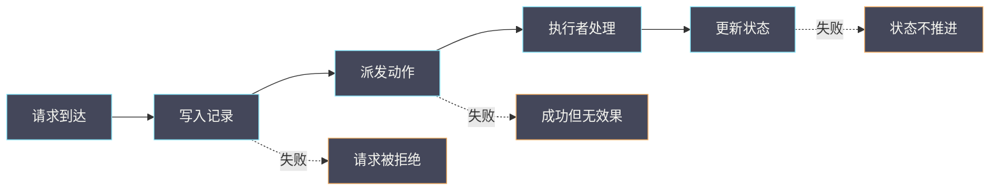

# 17 RabbitMQ 与 MariaDB 故障对请求与状态的影响

**摘要：**

控制面三件套中，数据库与消息队列是「沉默的依赖」：它们不直接对外提供服务，但一旦异常，症状会出现在各个服务上。更麻烦的是，两者的故障表现不同——数据库故障表现为「请求失败」，消息队列故障表现为「请求成功但状态不变」。本文讲清两者在请求链路中的位置、四种组合故障的表现、以及如何用「状态是否变化」这个判据区分它们。全文回答两个问题：为什么「请求成功但虚机没建起来」，以及控制面依赖异常该如何定位。文中的观测命令与判据取自 2026 年 9 月的现场记录，涉及具体数值处标注口径；控制面组件的基础见 [[云原生/OpenStack/02 控制面三件套——MariaDB、RabbitMQ 与 Keystone|02 控制面三件套]]。

---

## 第 1 章 两类依赖的不同角色

先明确两者在请求链路中的位置。

### 1.1 数据库：状态的家

**数据库存放「服务的状态」**：**如虚机的记录、网络的配置、卷的元数据**。

**它在请求链路中的位置是「写入状态」**：**请求处理的最后一步通常是把结果写入数据库**。

**因此数据库故障的直接表现是「请求失败」**：**因为无法写入状态，请求无法完成**。

### 1.2 消息队列：动作的通道

**消息队列传递「要执行的动作」**：**如「在某节点启动虚机」「创建某网络设备」**。

**它在请求链路中的位置是「派发动作」**：**请求处理中间需要把动作派发给执行者**。

**因此消息队列故障的表现是「请求成功但动作未执行」**：**因为状态可能已写入（请求被接受），但动作没有派发**。

### 1.3 两者的关键差异

**关键差异是「失败发生在链路的前半段还是后半段」**。

**数据库故障在「写入」环节**：**它发生在请求的末尾**，**因此请求会失败并返回错误**。

**消息队列故障在「派发」环节**：**它发生在请求的中间**，**而请求可能已经被接受**，**因此表现为「成功但无效果」**。

**这个差异决定了排查方法**：**「请求失败」查数据库，「成功但无效果」查消息队列**——**这是本篇最核心的判据**。

### 1.4 本篇定位

**本篇补强既有 OpenStack 专栏**：**02 篇讲三件套的定位与作用，本篇深入「故障表现与定位」**。

**读完本篇应当能回答**：为什么「请求成功但虚机没建起来」、两类依赖的四种组合表现、以及如何定位控制面依赖异常。

### 1.5 一张链路示意图



**图里三条虚线对应三种失败**：**「请求被拒绝」「成功但无效果」「状态不推进」**。**三种失败的排查入口不同**——**这正是本篇要建立的判据**。

### 1.6 一个类比与它的边界

可以用「办事窗口」来类比这套链路。

**数据库像「登记簿」**：**办事先登记，办完再记录结果**。**消息队列像「派工单」**：**登记后把工单派给办事员**。

**类比的价值在于「它解释了两种失败」**：**登记失败就是「办不了」，派单失败就是「登记了但没人办」**。

**类比的边界在于「办事是串行的人工流程，而系统是并发的自动流程」**：**系统里同一个请求可能被重试多次**，**因此「登记了但没人办」会累积成大量记录**。**这一点在人工窗口不明显，但在系统里是主要问题**——**它对应 3.2 节「大量创建中记录堆积」**。

### 1.7 两类依赖的三个共性

两类依赖有三个共性，理解它们有助于统一排查方法。

**共性一是「都是共享依赖」**：**多个服务共用同一套数据库与消息队列**。**因此它们的故障影响面广**——**这与 05 篇 CVM 专栏「共享故障域」是同一结构**。

**共性二是「都不直接对外服务」**：**它们不响应业务请求，只被服务调用**。**因此「业务正常」不能证明它们正常**。

**共性三是「故障会向后传递」**：**它们的异常会表现为上游服务的异常**。**因此症状出现在服务层，根因在依赖层**——**这与 05 篇「依赖链」是同一结构**。

**三个共性共同指向一个结论**：**排查控制面问题必须「穿过服务层，直达依赖层」**。

### 1.8 三类请求的差异

不同类型的请求对两类依赖的依赖程度不同。

**创建类请求依赖两者**：**需要写入记录并派发动作**。**因此两类依赖异常都会影响它**。

**查询类请求主要依赖数据库**：**它只读取状态**。**因此队列异常通常不影响它**。

**删除类请求依赖两者**：**需要派发删除动作并更新状态**。**因此两类依赖异常都会影响它**。

**三类的差异提供了一个排查线索**：**如果「只有创建失败而查询正常」，说明问题更可能在队列侧**——**因为查询不依赖队列**。

**这个线索的价值在于「它用现象差异缩小范围」**——**这与 01 篇「按现象定位段」是同一方法**。

### 1.9 一个判断顺序

判断控制面依赖是否异常，可以按一个简单顺序。

**第一步看「请求是否返回错误」**：**返回错误倾向数据库问题**。

**第二步看「状态是否推进」**：**不推进倾向队列或第二次写入问题**。

**第三步看「队列是否有积压」**：**有积压倾向派发或消费者问题**。

**第四步看「资源是否被占用」**：**被占用说明动作已执行，问题在状态更新**。

**四步的顺序是「请求、状态、队列、资源」**。**它与链路顺序一致**——**按链路顺序判断，能定位到具体环节**。

**这个顺序的价值在于「它把「请求异常」拆成了四个可验证的问题」**——**这与 01 篇「先判断现象属于哪一类」是同一方法**。

### 1.10 一个能力对照

两类依赖异常对「运维能力」的影响不同。

| 依赖 | 受影响的能力 | 影响方式 |
| :--- | :--- | :--- |
| 数据库 | 状态记录与查询 | 无法记录或读取状态 |
| 消息队列 | 动作派发 | 记录成功但动作不执行 |
| 两者 | 全部控制面能力 | 状态混乱且动作不执行 |

**三行的对照说明「数据库影响的是『知道』，队列影响的是『做到』」**。

**「知道」优先于「做到」**：**因为没有状态记录，动作执行了也无法追踪**——**这正是「状态优先」处置顺序的依据**。

**这个对照也解释了「为什么控制面高可用优先」**：**它决定了「能否执行恢复」**。

### 1.11 一个排查心态

控制面依赖的排查需要一种特定的心态。

**第一种心态是「不要相信单一症状」**：**「请求失败」与「请求成功但无效果」都可能来自多个环节**。**因此需要多判据交叉**。

**第二种心态是「不要急着处置」**：**控制面异常的处置会改变状态**，**在原因未明时处置可能让状态更混乱**。

**第三种心态是「接受『不能变』这个状态」**：**控制面异常时，最安全的做法是暂停变更**，**而不是尝试「边修边做」**。

**三种心态的共同点是「谨慎优先」**：**因为控制面异常的影响是「状态一致性」，而不是「单点故障」**——**这与 04 篇 CVM 专栏「恢复前的校验」是同一纪律**。

## 第 2 章 请求链路中的位置

理解链路才能理解故障的表现。

### 2.1 一次请求的完整链路

**一次创建请求大致经过**：**接口接收 → 数据库写入记录 → 消息队列派发动作 → 执行者处理 → 数据库更新状态**。

**五步中，数据库被访问两次**（写入与更新），**消息队列被访问一次**（派发）。

**两次数据库访问的失败表现不同**：**第一次失败是「请求被拒绝」，第二次失败是「请求已接受但状态未更新」**。

**第二种更隐蔽**：**用户看到的是「创建中」，但状态永远不会变成「已完成」**。

### 2.2 同步与异步的边界

**请求链路中有一个「同步转异步」的边界**：**在派发动作之前是同步的（请求会等待结果），之后是异步的（请求返回，动作在后台执行）**。

**这个边界的位置很关键**：**它决定了「请求失败」还是「请求成功但无效果」**。

**数据库在边界两侧都有访问**：**边界之前是「写入请求记录」，之后是「更新状态」**。

**消息队列在边界上**：**它是「从同步转异步」的开关**。**因此它的故障会导致「转不过去」**——**即请求被接受但动作永远不派发**。

### 2.3 状态的三种可能

**结合两次数据库访问与一次派发，状态有三种可能**。

**第一种是「未写入」**：**第一次数据库访问失败，请求被拒绝**。**用户看到明确的错误**。

**第二种是「已写入但未派发」**：**第一次写入成功，但派发失败**。**用户看到「创建中」但永远不完成**。

**第三种是「已派发但状态未更新」**：**派发成功，但第二次写入失败**。**用户看到「创建中」，而实际动作已执行**。

**第三种最危险**：**因为资源实际已被占用，但状态显示「创建中」**，**可能导致重复创建或资源泄漏**。

### 2.4 观测入口

```bash
# 查看数据库连接与慢查询
mysql -e "show processlist" | head
mysql -e "show status like 'Threads_connected'"

# 查看消息队列的连接与队列积压
rabbitmqctl list_queues name messages consumers | head -20
rabbitmqctl list_connections | head -10

# 查看服务的健康状态
openstack compute service list
openstack network agent list
```

**观测的要点是「同时看两者」**：**只看数据库会漏掉「已写入但未派发」，只看消息队列会漏掉「写入失败」**——**这与 01 篇「跨视角对照」是同一方法**。

### 2.5 一个状态实例

设想一次「虚机停在创建中」的问题，需要判断属于哪种状态可能。

**第一步，看请求返回**：**如果返回错误，属于「未写入」**。**如果返回成功，进入第二步**。

**第二步，看队列积压**：**如果队列有积压且无消费者，属于「已写入但未派发」**。

**第三步，看资源是否被占用**：**如果队列无积压但资源已被占用，属于「已派发但状态未更新」**。

**三步的顺序是「请求、队列、资源」**。**它把「停在创建中」这个笼统现象拆成了三种具体可能**。

**这个实例的价值在于「它演示了三个判据的组合使用」**：**单看任何一个判据都无法定论**——**这与 04 篇「五类异常的对照表」是同一形态**。

### 2.6 三个判据的一个实例

设想用三个判据区分一次异常。

**请求返回错误**：**说明写入环节失败**。**处置方向是数据库**。

**请求成功、状态不推进、队列有积压**：**说明派发环节失败**。**处置方向是队列与消费者**。

**请求成功、状态不推进、队列无积压、资源已占用**：**说明第二次写入失败**。**处置方向是数据库（写入环节），且需要处理「无法追踪的资源」**。

**三种组合对应三个不同的处置方向**：**而它们的现象都是「创建不完成」**。

**这说明「单看现象无法定位」**：**必须结合多个判据**——**这与 04 篇「五类异常需要多判据区分」是同一要求**。

### 2.7 一个链路追踪实例

设想追踪一次创建请求的完整链路。

**第一步，确认请求是否到达接口**：**看服务日志是否有对应请求**。**如果没有，问题在更上游**。

**第二步，确认记录是否写入**：**查数据库是否有对应记录**。**如果没有，说明写入环节失败**。

**第三步，确认动作是否派发**：**看队列是否有对应消息**（或看队列积压）。**如果没有，说明派发环节失败**。

**第四步，确认状态是否更新**：**查记录的最终状态**。**如果停在中间态，说明第二次写入失败或动作未完成**。

**四步的顺序与 2.1 节的链路一致**。**它把「请求异常」拆成了「在哪一环失败」**——**这与 01 篇「分段法」是同一方法**。

### 2.8 一个同步异步边界的实例

设想一次「请求返回很快但状态不推进」的问题。

**现象**：请求立即返回成功，但状态长时间不推进。

**原因**：**请求在「派发」之后返回**，**因此返回快只说明「派发之前没有阻塞」**。**状态推进依赖后续的异步处理**。

**因此「返回快」与「处理快」是两件事**：**前者取决于同步段，后者取决于异步段**。

**排查方向是异步段**：**看队列是否有消息、消费者是否在工作、执行者是否正常**。

**这个实例说明「理解同步异步边界能避免误判」**：**把「返回快」当成「处理快」，会漏掉异步段的问题**——**这与 03 篇「配置值不等于实际值」是同一类观察**。

### 2.9 一个链路对比

把「正常链路」与「三种异常链路」对比，可以看出差异所在。

| 场景 | 写入记录 | 派发动作 | 更新状态 | 现象 |
| :--- | :--- | :--- | :--- | :--- |
| 正常 | 成功 | 成功 | 成功 | 创建完成 |
| 数据库写入失败 | 失败 | 未到达 | 未到达 | 请求被拒绝 |
| 队列派发失败 | 成功 | 失败 | 未到达 | 成功但无效果 |
| 状态更新失败 | 成功 | 成功 | 失败 | 资源占用但状态不推进 |

**四行的对比说明「同一个现象可能来自不同环节」**：**「创建不完成」这个现象对应后三行**。

**因此「看现象无法定位，看链路环节才能定位」**——**这与 01 篇「分段法」是同一要求**。

### 2.10 一个证据链

控制面依赖的排查需要形成证据链。

**证据链的结构是「现象、判据、环节、处置」**。

**现象**：**用户看到的表现**（请求失败、创建不完成）。**判据**：**用于区分的可观测项**（请求返回、状态、队列、资源）。

**环节**：**判据指向的具体位置**（写入、派发、第二次写入）。**处置**：**针对环节的动作**。

**四段的关系是「逐段收窄」**：**每一段都基于上一段的结论**。**证据链完整时，处置是确定的**；**证据链缺失时，处置只能靠猜**。

**这与 01 篇「分段法的结论形式」是同一思路**：**每一段都要有可验证的结论**。

## 第 3 章 四种组合故障

两者可能同时异常，组合后表现不同。

### 3.1 数据库异常、队列正常

**表现是「请求失败」**：**写入失败，请求被拒绝**。**队列侧看不到异常，因为没有请求到达派发环节**。

**排查方向是数据库**：**看连接数、慢查询、锁等待、磁盘空间**。

**这一类最容易定位**：**因为有明确的错误返回**。

### 3.2 队列异常、数据库正常

**表现是「请求成功但无效果」**：**记录已写入，但动作未派发**。

**排查方向是消息队列**：**看队列积压、连接数、消费者数量**。

**这一类较难定位**：**因为请求「看起来成功了」**，**用户可能反复重试**，**导致大量「创建中」的记录堆积**。

### 3.3 两者都异常

**表现是「请求失败且状态混乱」**：**部分请求写入失败，部分写入成功但未派发**。

**排查方向是两者都要看**：**但应当先恢复数据库**，**因为它决定了「能否记录状态」**。

**顺序的理由是「状态优先」**：**没有状态记录，后续的动作即使执行了也无法被追踪**——**这与 05 篇 CVM 专栏「恢复顺序」是同一原则**。

### 3.4 两者都正常但表现异常

**表现是「请求成功、状态变化，但动作结果不符预期」**。

**这一类说明「问题不在两者」**：**可能在执行者（计算节点、网络代理）或配置层面**。

**排查方向是「沿链路继续往下」**：**两者正常是「排除了控制面依赖」这个结论**——**排除也是一种定位**。

### 3.5 四种组合的一个对照表

| 组合 | 表现 | 排查方向 | 处置顺序 |
| :--- | :--- | :--- | :--- |
| 数据库异常、队列正常 | 请求失败 | 数据库 | 恢复数据库 |
| 队列异常、数据库正常 | 成功但无效果 | 消息队列 | 恢复队列与消费者 |
| 两者都异常 | 失败且状态混乱 | 两者都要看 | 先数据库后队列 |
| 两者都正常 | 结果不符预期 | 执行者或配置 | 沿链路往下 |

**四行的处置顺序依据是「状态优先」**：**先恢复「记录能力」，再恢复「执行能力」**。

**这个顺序与直觉相反**：**直觉是「先把事情做完」，但那样会产生「无法追踪的资源占用」**——**这与 05 篇 CVM 专栏「恢复顺序」是同一原则**。

### 3.6 一个组合故障实例

设想一次「数据库与队列同时异常」的问题。

**现象**：部分请求失败（数据库问题），部分请求成功但无效果（队列问题）。**状态记录混乱**。

**排查方法**：**先看两类现象的比例**。**如果失败的多，说明数据库问题更严重**。

**处置顺序**：**先恢复数据库，再恢复队列**。**理由是「状态记录优先」**——**没有状态记录，动作即使执行也无法追踪**。

**恢复后应当核对**：**确认「创建中」的记录是否有对应的资源**。**如果有，需要释放或推进**——**这一步最容易被省略，但它是「恢复完整」的标志**。

**这个实例说明「组合故障的处置需要额外步骤」**：**单类故障处置完即结束，组合故障还需要「状态核对」**。

### 3.7 一个反例

一个常见的反例：队列异常时，用户反复重试创建，结果产生大量「创建中」记录。

**问题在于「重试不解决队列问题」**：**每次重试都会写入一条新记录**，**但动作仍无法派发**。

**后果是「记录堆积」**：**大量「创建中」记录会掩盖真正的问题**，**也会占用资源账本（见 16 篇）**。

**正确的做法是「先恢复队列，再处理堆积记录」**：**顺序不能颠倒**——**因为队列未恢复时，处理记录只是清理症状**。

**这个反例的启示是：症状堆积会掩盖根因**——**这与 06 篇 CVM 专栏「不要让恢复动作产生噪声」是同一要求**。

### 3.8 一个识别顺序

识别属于哪种组合故障，可以按一个顺序。

**第一步，看「请求失败的比例」**：**如果全部失败，倾向数据库问题**。**如果部分失败且部分成功，倾向组合问题**。

**第二步，看「失败请求与成功请求的差异」**：**如果成功的是查询类，失败的是创建类，说明问题在队列侧**。

**第三步，看「两者的健康状态」**：**分别确认数据库与队列是否正常**。

**三步的顺序是「比例、差异、状态」**。**它先用现象缩小范围，再用直接观测确认**——**这与 01 篇「先按现象定位」是同一方法**。

**这个顺序的价值在于「它避免了『一上来就查两个组件』的盲目性」**。

### 3.9 一个与 16 篇的连接

本篇与 16 篇（资源账）有直接连接。

**连接点是「记录堆积会占用资源账本」**：**队列异常时产生的「创建中」记录，会在账本中表现为「已分配」**。

**因此「控制面异常」与「账本虚高」是相关的**：**前者是原因，后者是后果**。

**处置顺序因此是「先修控制面，再核账本」**：**顺序颠倒会导致「账本核对了但新问题又产生」**。

**这个连接说明「控制面问题的影响会扩散」**：**它不只影响请求，还影响资源账本的准确性**——**这与 05 篇 CVM 专栏「共享故障域」是同一结构**。

## 第 4 章 定位方法

把前面的机制合成可执行的方法。

### 4.1 三个判据

**判据一是「请求是否返回错误」**：**返回错误倾向数据库问题**。

**判据二是「状态是否变化」**：**状态不变倾向消息队列问题**。

**判据三是「资源是否被占用」**：**资源被占用但状态未变，说明「已派发但状态未更新」**。

**三个判据组合使用**：**它们共同区分三种状态可能**——**这与 04 篇「用时间分布区分容量与超时」是同一方法**。

### 4.2 观测顺序

**第一步，看请求返回**：**确认是「失败」还是「成功」**。

**第二步，看状态记录**：**确认记录是否已写入、是否在变化**。

**第三步，看队列积压**：**确认动作是否已派发**。

**第四步，看资源占用**：**确认动作是否实际执行**。

**四步的顺序是「请求、状态、队列、资源」**。**它对应 2.1 节的链路顺序**——**按链路顺序查，能定位到具体环节**。

### 4.3 一个定位实例

设想一次「批量创建后大量虚机停在创建中」的问题。

**第一步，看请求返回**：**请求都返回成功**。**说明数据库写入没有失败**。

**第二步，看状态记录**：**记录已写入，但状态未推进**。**说明「已写入但未派发」或「已派发但状态未更新」**。

**第三步，看队列积压**：**发现队列有大量未消费消息**。**说明动作未派发或未被消费**。

**第四步，看消费者**：**发现消费者数量为零**。**说明执行者未连接队列**。

**结论是「执行者与队列的连接中断」**。**处置是恢复执行者的队列连接**，**而不是处理数据库**——**因为数据库没有异常**。

**这个实例说明「判据能把范围限定到环节」**：**「请求成功 + 状态未推进 + 队列积压」这个组合直接指向队列与消费者之间**。

### 4.4 处置顺序

**处置应当按「先状态、后动作」的顺序**。

**理由是一旦动作被派发而状态无法记录，会产生「无法追踪的资源占用」**。**因此先恢复状态记录能力，再恢复动作派发**。

**这与 3.3 节「状态优先」是同一原则**——**它与直觉相反（通常认为「先把事情做完」优先），但更安全**。

### 4.5 定位方法的可迁移部分

这次定位可以提炼成三个动作：**先看请求返回、再看状态与队列、最后看资源占用**。

**第一个动作的关键是「区分失败与成功」**；**第二个动作的关键是「确认记录是否推进」**；**第三个动作的关键是「确认动作是否实际执行」**。

**三个动作合起来，把「请求异常」从一个笼统描述变成一条可执行的路径**。**这与 02 篇 CVM 专栏「分段定位」是同一方法**。

### 4.6 一个反例

一个常见的反例：发现大量「创建中」记录后，直接批量删除这些记录，结果资源未被释放。

**问题在于「删除记录不等于释放资源」**：**如果动作已被派发且实际执行，删除记录会让资源变成「无法追踪的占用」**。

**正确的做法是「先确认资源状态，再决定处置」**：**如果资源已占用，应当释放资源；如果未占用，可以直接清理记录**。

**这个反例的启示是：处置前必须确认「资源是否真的存在」**。**记录与实际是两件事**——**这与 16 篇「账本与实际的关系」是同一纪律**。

### 4.7 一个观测方法的选择

观测方法的选择影响排查效率。

**日志适合「确认请求是否到达」**：**它是请求链路的起点证据**。**成本低，但可能不完整**。

**数据库查询适合「确认记录状态」**：**它是状态链路的证据**。**成本低，且结论明确**。

**队列查询适合「确认动作是否派发」**：**它是动作链路的证据**。**成本低，但需要理解队列语义**。

**资源查询适合「确认动作是否执行」**：**它是执行结果的证据**。**成本中等，但最接近事实**。

**四者的使用顺序是「日志、数据库、队列、资源」**。**它与链路顺序一致**——**按链路顺序取证据，最不容易迷路**。

### 4.8 一个判据清单

- 请求是否返回错误。
- 记录是否已写入。
- 状态是否在推进。
- 队列是否有积压。
- 消费者数量是否正常。
- 资源是否已被占用。
- 数据库连接与慢查询是否异常。

**七项覆盖了三个判据与两类依赖的观测点**。**按链路顺序检查，能定位到具体环节**。

**最后一项容易被忽略**：**数据库的「连接数与慢查询」是「写入失败」的前置信号**，**它能在请求失败之前暴露问题**——**这与 08 篇 CVM 专栏「趋势告警」是同一思路**。

### 4.9 一个处置清单

- 确认请求返回是否正常。
- 确认记录是否已写入。
- 确认队列积压与消费者状态。
- 确认资源是否被占用。
- 按「状态优先」确定处置顺序。
- 处置后核对「创建中」记录与资源。
- 确认控制面恢复后再执行其他变更。

**七项覆盖了从定位到处置的完整流程**。**第五项是顺序原则，第六项是完整性校验**。

**第六项最容易被省略**：**「控制面恢复了」不等于「状态一致了」**，**必须核对「创建中」记录是否有对应资源**——**这与 16 篇「处置后必须验证」是同一要求**。

### 4.10 一个判据的可信度

四个判据的可信度不同，使用时应当注意。

**「资源是否被占用」最可信**：**它直接反映实际状态，难以被中间状态掩盖**。

**「队列是否有积压」较可信**：**它反映派发环节的状态，但可能受队列配置影响**。

**「状态是否推进」中等**：**它反映记录状态，但可能因「第二次写入失败」而失真**。

**「请求是否返回错误」最低**：**它只反映同步段的结果，无法说明异步段**。

**四者的可信度排序提示了一个原则**：**优先用「接近事实」的判据**——**这与 06 篇 CVM 专栏「证据可信度排序」是同一方法**。

## 第 5 章 与故障恢复的关系

控制面依赖异常会影响恢复流程。

### 5.1 恢复流程的依赖

**故障恢复（如疏散、重建）本身也是请求**：**它同样依赖数据库与消息队列**。

**因此「控制面异常时无法执行恢复」**：**这是一个重要的约束**——**恢复能力以控制面可用为前提**。

**实践含义是「控制面的高可用优先于其他组件」**：**因为它决定了「能否执行恢复」**——**这与 04 篇 CVM 专栏「恢复能力是运维的底线」是同一关切**。

### 5.2 降级与兜底

**控制面异常时，业务通常仍可运行**：**因为数据面（虚机的网络与存储）不依赖控制面**。

**但「运维能力」会丧失**：**无法创建、无法迁移、无法恢复**。

**因此控制面故障的定位应当优先**：**它虽然不影响存量业务，但会削弱「应对变化的能力」**——**这与 05 篇 CVM 专栏「共享故障域」的讨论是同一思路**。

### 5.3 观测与告警

**控制面依赖应当有独立的监控**：**数据库的连接数、慢查询、复制状态**；**消息队列的积压、连接数、消费者数**。

**告警应当早于业务受影响**：**因为控制面异常先影响「运维能力」，后影响「存量业务」**。

**这提供了一个「提前量」**：**在存量业务受影响之前，还有时间处置**——**这与 08 篇 CVM 专栏「趋势告警早于阻塞告警」是同一思路**。

### 5.4 一个恢复顺序实例

设想一次「控制面部分异常时执行疏散」的场景。

**背景**：某宿主机故障，需要疏散其上的虚机。**此时控制面存在部分异常**（如消息队列积压）。

**如果直接发起疏散**：**请求会被接受，但动作可能无法派发**，**导致「疏散请求已提交但虚机未迁移」**。

**正确的做法是先确认控制面可用性**：**确认数据库与队列都正常，再发起疏散**。

**这个实例说明「恢复能力以控制面可用为前提」**：**在控制面异常时执行恢复，可能让问题复杂化**——**这与 04 篇 CVM 专栏「恢复前的校验」是同一要求**。

### 5.5 一个降级的实例

设想一次「控制面异常但业务需继续」的场景。

**背景**：控制面部分异常，但存量业务仍在运行。**此时需要决定「是否继续执行业务变更」**。

**决策依据是「变更是否依赖控制面」**：**扩容、迁移、重建都依赖控制面**；**应用层的配置变更可能不依赖**。

**因此「控制面异常时应当暂停依赖它的变更」**：**继续执行会留下「已提交但未完成」的状态**。

**这个实例说明「控制面异常的影响是『不能变』而不是『不能用』」**——**它与 5.2 节「降级与兜底」是同一结论**。

### 5.6 一个监控设计

控制面依赖的监控应当独立设计。

**监控项有三类**：**可用性**（服务是否在线）、**容量**（连接数、队列长度）、**性能**（慢查询、消息延迟）。

**三类的作用不同**：**可用性给「是否故障」，容量给「是否接近上限」，性能给「是否劣化」**。

**三类的告警优先级不同**：**可用性最高（立即处理），容量次之（计划处理），性能最低（观察趋势）**。

**这个设计的原则是「分层告警」**——**避免所有指标同一优先级，导致告警疲劳**——**这与 08 篇 CVM 专栏「分层告警」是同一思路**。

### 5.7 一个演练建议

控制面依赖异常的处置能力可以通过演练建立。

**演练内容**：**在测试环境制造「队列异常」与「数据库异常」，观察表现并验证处置流程**。

**演练的价值有三**：**验证判据是否有效**、**验证处置顺序是否可行**、**以及建立团队的响应习惯**。

**演练的产出应当形成文档**：**包含「现象到判据」的对应表与「判据到处置」的操作步骤**。

**这与 06 篇 CVM 专栏「实验沉淀」是同一思路**：**把单次处置经验变成可复用的方法**。

## 第 6 章 误判与反例

第一，**把「请求成功但无效果」当成业务问题**。可能是消息队列异常。

第二，**把「请求失败」直接当成服务异常**。可能是数据库异常。

第三，**只看数据库不看队列**。会漏掉「已写入但未派发」。

第四，**只看队列不看数据库**。会漏掉「写入失败」。

第五，**在两者都异常时先恢复队列**。状态记录优先，应当先恢复数据库。

第六，**忽略「已派发但状态未更新」**。它会造成无法追踪的资源占用。

第七，**把「请求重试」当成解决方案**。在队列异常时，重试会堆积更多「创建中」记录。

第八，**忽略消费者数量**。队列正常但无消费者，表现与队列异常相同。

第九，**认为控制面异常不影响业务**。它影响的是「运维能力」，后果是「无法应对变化」。

第十，**把控制面依赖的监控放在业务监控之后**。应当独立且提前。

第十一，**在控制面异常时执行恢复操作**。恢复本身也是请求，需要控制面可用。

第十二，**把「请求重试」当成队列异常的解决方案**。重试会堆积更多「创建中」记录。

第十三，**把「控制面恢复」当成「状态一致」**。必须核对「创建中」记录与资源的一致性。

第十四，**不演练控制面异常的处置**。演练能验证判据与处置流程是否有效。

### 6.1 四类误判对照

把本篇的误判归为四类，便于自查。

| 误判类别 | 具体表现 | 正确做法 |
| :--- | :--- | :--- |
| 归因错 | 把「成功但无效果」当成业务问题 | 先查队列 |
| 单点错 | 只看数据库或只看队列 | 两者都要看 |
| 顺序错 | 先恢复队列后恢复数据库 | 状态记录优先 |
| 处置错 | 直接删除「创建中」记录 | 先确认资源状态 |

**四行的共同点是「跳过了『两者都要看』这一步」**。**因此自查的方法是「问自己：另一侧看了吗」**。

### 6.2 一个反例

一个常见的反例：控制面恢复后，运维直接继续执行之前失败的创建请求，结果产生重复资源。

**问题在于「未核对之前的状态」**：**之前的请求可能「已派发但状态未更新」**，**即资源已存在但记录显示失败**。

**继续执行会产生重复**：**新的请求会再创建一份资源**，**导致资源泄漏或冲突**。

**正确的做法是「先核对，再继续」**：**核对「之前失败的请求是否有对应资源」**，**然后决定是「复用」还是「重新创建」**。

**这个反例的启示是：控制面恢复后的第一步是「核对状态」**，**而不是「重试请求」**——**这与 16 篇「处置后必须验证」是同一要求**。

## 第 7 章 边界与反例

第一，**组件实现随版本演进**。数据库与消息队列的部署方式可能变化。

第二，**高可用配置会改变故障表现**。主从切换期间的表现与单点不同。

第三，**请求链路的细节随服务而异**。不同服务的链路可能不同。

第四，**观测命令随版本与部署变化**。以现场为准。

第五，**恢复顺序的建议绑定具体场景**。某些场景下可能需要调整。

第六，**在控制面异常时执行疏散或重建**。恢复请求同样依赖控制面，可能产生「已提交但未执行」的状态。

第七，**把控制面依赖的监控合并进业务监控**。它应当独立且提前告警，因为影响的是运维能力。

第八，**把「部分失败」当成随机问题**。部分失败往往指向组合故障，需要分别确认两者。

第九，**忽略「查询正常而创建失败」这个线索**。它指向队列侧，是缩小范围的直接依据。

第十，**控制面恢复后直接重试之前的请求**。应当先核对之前请求是否有对应资源。

第十一，**把「重试」当成通用的恢复手段**。在「已派发但状态未更新」的场景下，重试会产生重复资源。

### 7.1 三类边界说明

本篇的边界可以归为三类。

**第一类是「实现边界」**：**数据库与消息队列的部署方式（单点、主从、集群）会影响故障表现**。**因此「故障表现」的结论需要绑定部署形态**。

**第二类是「服务边界」**：**不同服务的请求链路细节不同**。**因此「链路位置」的结论需要按服务确认**。

**第三类是「版本边界」**：**观测命令与状态字段随版本变化**。**因此「观测方法」的结论需要按版本确认**。

**三类边界的共同含义是「结论需要绑定环境」**——**这与全专栏「结论要带边界」是同一要求**。

行文至此，把本篇落点收在两条原则上。其一，架构即权衡——用异步派发换来了请求的快速返回，代价是「成功」不再等于「完成」。其二，复杂性不会消失只会转移——把「一次同步操作」拆成「记录与派发」两步，把复杂度从「操作本身」转移到了「两步之间的一致性」上。相邻的三件套定位与作用见 [[云原生/OpenStack/02 控制面三件套——MariaDB、RabbitMQ 与 Keystone|02 控制面三件套]]，宿主机失联与恢复决策见 [[SRE/CVM集群可靠性工程/04 宿主机失联——故障检测、Fencing、Masakari 与恢复决策|04 宿主机失联]]。

---

## 速查卡：控制面依赖异常的定位

这张表把控制面依赖异常的常见现象与优先怀疑的对象对应起来，用于快速定向。使用时的顺序是「先看请求返回，再看状态与队列，最后看资源占用」。

三条纪律值得写在表前：**第一，两者都要看**（只看数据库或只看队列都会漏掉一类问题）；**第二，处置顺序是「状态优先」**（先恢复记录能力，再恢复执行能力）；**第三，恢复操作本身也依赖控制面**（控制面异常时应暂停恢复动作）。

最后一点：**「请求成功」不等于「操作完成」**。异步派发把一次操作拆成了「记录」与「执行」两步，**因此「成功」只说明第一步完成**。

补充一句关于堆积的提醒：**队列异常时不要反复重试**。重试会写入更多「创建中」记录，掩盖真正的问题，也会占用资源账本。

再补一句关于恢复的提醒：**控制面恢复后应当核对「创建中」的记录是否有对应资源**。这一步最容易被省略，但它是「恢复完整」的标志。

再补一句关于监控的提醒：**控制面依赖的监控应当独立于业务监控，且分层告警**。可用性最高优先级，容量次之，性能最低。

最后补一句关于现象的提醒：**「只有创建失败而查询正常」这个现象指向队列侧**，因为查询不依赖队列。

| 现象 | 优先怀疑 | 关键证据 |
| :--- | :--- | :--- |
| 请求返回错误 | 数据库 | 连接数、慢查询、锁等待 |
| 请求成功但状态不变 | 消息队列 | 队列积压、消费者数 |
| 资源被占用但状态未变 | 第二次写入失败 | 资源与实际记录对比 |
| 状态推进但动作未执行 | 队列或消费者 | 消费者数量与连接状态 |
| 两者都异常 | 状态记录优先 | 先恢复数据库 |
| 两者正常但结果不符 | 执行者或配置 | 沿链路继续往下 |

## 口径与事实说明

- 命令与判据取自 2026 年 9 月的现场记录，属某时点实践，不构成唯一正确用法。
- 机制描述（数据库与消息队列在请求链路中的位置、同步转异步边界、三种状态可能）属于相关组件的稳定行为。
- 观测命令随版本与部署变化，排查前先确认现场形态。
- 文中命令均为只读观测类操作，服务与依赖的变更须走审批并回读。
- 数据库与消息队列都是共享依赖，故障影响面广，应当优先排查。
- 两者都不直接对外服务，因此「业务正常」不能证明它们正常。
- 两者的故障都会向后传递，症状出现在服务层而根因在依赖层。
- 创建与删除类请求依赖两者，查询类请求主要依赖数据库。
- 「只有创建失败而查询正常」指向队列侧，这是可用的排查线索。
- 请求链路上数据库被访问两次，两次失败的表现不同。
- 第一次写入失败表现为「请求被拒绝」，第二次失败表现为「状态不推进」。
- 「已派发但状态未更新」最危险，因为它会产生无法追踪的资源占用。
- 同步转异步的边界位于派发环节，它决定了「失败」还是「成功但无效果」。
- 观测应当同时覆盖数据库与队列，单侧观测会漏掉一类问题。
- 日志、数据库、队列、资源四类证据应当按链路顺序采集。
- 数据库的连接数与慢查询是「写入失败」的前置信号。
- 队列的积压与消费者数量是「派发失败」的直接证据。
- 消费者数量为零时表现与队列异常相同，需要单独确认。
- 组合故障处置后需要额外核对「创建中」记录对应的资源。
- 队列异常时的重试会堆积记录，掩盖根因并占用资源账本。
- 处置「创建中」记录前必须确认资源是否真的存在。
- 控制面异常时应当暂停依赖它的变更（扩容、迁移、重建）。
- 控制面异常影响的是「不能变」而非「不能用」。
- 恢复操作本身是请求，因此需要控制面可用才能执行。
- 控制面恢复后应当核对状态与资源的一致性。
- 监控应当分为可用性、容量、性能三类，并分层设置告警优先级。
- 本文与本专栏其余篇目共享同一套观察方法与口径纪律，相邻篇目已展开的机制不在此重复推导。
- 本文的判据与顺序可直接用于同类控制面依赖，具体命令与字段需按现场版本调整并以实测为准。
- 控制面依赖的排查应当形成「现象、判据、环节、处置」四段证据链。
- 证据链完整时处置是确定的，缺失时只能靠猜，因此应当逐段确认。
- 四个判据的可信度不同，应当优先采用「接近事实」的判据。
- 「资源是否被占用」是最可信的判据，它直接反映实际状态。
- 「请求是否返回错误」可信度最低，它只反映同步段的结果。
- 控制面异常与账本虚高是因果相关的，处置顺序是先控制面后账本。
- 记录堆积会在账本中表现为「已分配」，进而影响调度（见 16 篇）。
- 排查控制面问题需要「不要相信单一症状」的心态，多判据交叉。
- 在原因未明时处置控制面问题，可能让状态更混乱。
- 控制面异常时最安全的做法是暂停变更，而不是边修边做。
- 控制面异常影响的是状态一致性，而不是单点故障。
- 识别组合故障的顺序是「比例、差异、状态」，先看现象后做观测。
- 部分失败往往指向组合故障，需要分别确认两者。
- 演练能验证判据与处置流程，应当纳入常规能力建设。
- 控制面恢复后的第一步是核对状态，而不是重试请求。
- 数据库与队列的健康状态应当分别确认，不能以「服务可用」代替。
- 「服务可用」只说明服务进程正常，不代表其依赖正常。
- 观测应当覆盖「可用性、容量、性能」三个维度，避免只看可用性。
- 请求链路的细节应当按服务确认，不同服务的链路可能不同。
- 高可用部署会改变故障表现，主从切换期间的表现与单点不同。
- 控制面异常的排查应当形成证据链，每段都要有可验证的结论。
- 处置「创建中」记录应当分批执行并保留回退手段。
- 控制面恢复后的核对应当覆盖「记录与资源的一致性」。
- 组合故障的处置顺序依据是「状态记录优先于动作执行」。
- 队列异常时应当先恢复队列，再处理堆积记录，顺序不可颠倒。
- 控制面依赖的监控应当独立且提前告警，因为影响的是运维能力。
- 控制面异常时应当暂停变更，等恢复后再执行。
- 恢复操作本身依赖控制面，因此控制面异常时应暂停恢复。
- 演练应当覆盖「数据库异常」「队列异常」「两者都异常」三种场景。
- 演练产出应当包含「现象到判据」与「判据到处置」两份对应表。
- 控制面异常的排查不应从「查两个组件」开始，应当先用现象缩小范围。
- 记录堆积会掩盖根因，因此处置前应当先恢复派发能力。
- 控制面恢复后应当确认「没有遗留的中间状态记录」。
- 两类依赖的监控项应当与业务监控分离，避免告警相互淹没。
- 控制面依赖异常的表现差异是「失败」与「成功但无效果」，判据是「状态是否变化」。
- 请求链路上「写入」与「派发」是两个关键环节，两者失败表现不同。
- 「已写入但未派发」会造成记录堆积，「已派发但状态未更新」会造成资源不可追踪。
- 两种后果的处置方向不同：前者清理记录，后者释放资源。
- 控制面依赖的观测顺序应当与链路顺序一致，避免跳环节导致缺少参照。
- 排查应当先确认「现象属于哪一类」，再选对应判据，而不是直接查组件。
- 控制面异常的处置应当先恢复记录能力，再恢复执行能力。
- 恢复完成后应当核对「记录与资源的一致性」，这是恢复完整的标志。
- 控制面依赖的可用性优先于性能，因为前者决定「能否执行恢复」。
- 控制面异常的处置应当避免产生新的中间状态记录。
- 排查应当避免「边修边做」，因为控制面异常会影响状态一致性。
- 本文所述方法可直接用于同类控制面依赖场景，具体命令需按现场版本调整。
- 控制面依赖的排查应当以「状态一致性」为核心目标，而不是「单点恢复」。
- 记录与资源的一致性是判断「恢复是否完整」的唯一标准。
- 控制面异常期间应当记录所有失败的请求，便于恢复后逐条核对。
- 控制面依赖的变更（升级、扩容）应当安排在业务低谷并预留回退手段。
- 控制面异常的处置经验应当沉淀为文档，避免依赖个人记忆。
- 控制面依赖的排查与处置应当形成闭环：定位、处置、核对、记录。
- 状态一致性是控制面问题的最终判据，任何处置都应当以它收尾，不可省略核对步骤，也不应以「感觉恢复」代替核对。

---

## 参考资料

1. OpenStack 官方文档，控制面组件与高可用：<https://docs.openstack.org/>
2. RabbitMQ 官方文档，队列与连接管理：<https://www.rabbitmq.com/documentation.html>
3. MariaDB 官方文档，状态与诊断：<https://mariadb.com/kb/en/documentation/>
4. OpenStack 官方文档，Nova 与 Neutron 运维：<https://docs.openstack.org/nova/latest/admin/>
5. 内部现场素材：CVM 集群控制面运维记录（2026-09，脱敏）

---

> [!note] 思考题
> 1. 数据库故障与消息队列故障的表现差异是什么，为什么会有这个差异。
> 2. 「同步转异步的边界」在请求链路的哪个位置，它决定了什么。
> 3. 三种状态可能中哪一种最危险，为什么。
> 4. 为什么两者都异常时应当先恢复数据库，这与直觉有何不同。
> 5. 控制面异常为什么先影响「运维能力」而不是「存量业务」。
