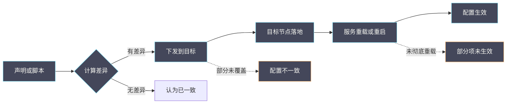

# 18 现场部署方式下的配置、升级与回滚

**摘要：**

现场部署方式决定了「改一个配置要走多少步」：自动化部署工具把配置从「逐台修改」变成了「声明加下发」，代价是「配置的生效路径变长且不直观」。本文讲清现场部署方式的三种形态、配置的生效路径与常见断裂点、升级的三个阶段与回滚的可行性边界、以及如何为一次变更设计可回滚的方案。全文回答两个问题：为什么「改了配置但没生效」，以及升级为什么常常「回不去」。文中的方法与检查清单取自 2026 年 9 月的现场记录，涉及具体数值处标注口径；部署方式的组件介绍见 [[云原生/OpenStack/11 部署实战——Kolla-Ansible 与生产架构设计|11 部署实战]]。

---

## 第 1 章 部署方式决定变更路径

先明确一件事：变更路径由部署方式决定。

### 1.1 三种部署形态

**第一种是「手动部署」**：**逐台登录、逐台修改配置文件、逐台重启服务**。**路径最短、最直观，但一致性依赖人的细心**。

**第二种是「脚本部署」**：**用脚本批量执行修改与重启**。**路径稍长，一致性由脚本保证，但脚本本身需要维护**。

**第三种是「声明式部署」**：**在声明文件中描述期望状态，由工具计算差异并下发**。**路径最长，一致性最强，但「改了声明」与「生效」之间隔着若干步骤**。

**三种形态的演进方向是「一致性增强、路径变长」**——**这是本专栏反复出现的取舍模式**。

### 1.2 变更路径的三个环节

**无论哪种形态，变更路径都包含三个环节**：**修改**（改配置）、**下发**（把配置送到目标）、**生效**（让服务读取新配置）。

**三个环节的失败表现不同**：**修改失败是「没改」，下发失败是「改了但没到」，生效失败是「到了但没读」**。

**三者都表现为「配置没生效」**，**因此排查需要逐环节确认**——**这与 05 篇「依赖链」是同一结构**。

### 1.3 为什么路径会断裂

**路径断裂的常见原因有四**。

**一是「修改了错误的位置」**：**声明文件改了，但实际生效的是另一份配置**。

**二是「下发未覆盖全部目标」**：**部分节点收到新配置，部分仍是旧的**。

**三是「生效未完成」**：**服务未重启或未重载，仍在使用旧配置**。

**四是「生效被覆盖」**：**生效后又被其他机制改回**（如其他自动化任务）。

**四种原因的共同点是「都表现为『改了但没效果』」**——**因此必须逐环节确认，而不是反复改配置**。

### 1.4 一张变更路径示意图



**图里两条虚线是「改了但没生效」的两种典型路径**：**「部分未覆盖」导致不一致，「未彻底重载」导致部分项未生效**。**两者的排查入口不同**——**前者查下发范围，后者查重载方式**。

### 1.5 本篇定位

**本篇补强既有 OpenStack 专栏**：**11 篇讲部署工具与架构，本篇讲「变更路径与回滚」**。

**读完本篇应当能回答**：为什么「改了配置但没生效」、升级为什么难回滚、以及如何设计可回滚的变更。

### 1.6 三种形态的对照

把三种部署形态对照，可以看出取舍。

| 形态 | 一致性 | 路径长度 | 排查难度 |
| :--- | :--- | :--- | :--- |
| 手动 | 依赖人的细心 | 最短 | 低 |
| 脚本 | 由脚本保证 | 中 | 中 |
| 声明式 | 最强 | 最长 | 高 |

**三行的关系是「一致性与路径长度正相关，与排查难度也正相关」**。

**这个关系解释了一个常见困惑**：**「用了自动化工具，为什么排查反而更难了」**——**因为路径变长，断点变多**。

**但它也解释了一个收益**：**「配置漂移」在声明式部署下更容易被发现**——**因为工具会持续比较声明与实际**。

### 1.7 一个类比与它的边界

可以用「装修」来类比变更管理。

**手动部署像「自己动手改」**：**想改哪里改哪里，但容易漏**。**声明式部署像「按设计图施工」**：**改了设计图，由施工队按图施工**。

**类比的价值在于「它解释了为什么『改了设计图』不等于『房子变了』」**：**设计图改了，但施工队还没动手，房子当然没变**。

**类比的边界在于「施工是一次性的，而声明式部署是持续同步的」**：**工具会持续比较声明与实际**。**因此「手工改墙」会被「按图重做」覆盖**——**这正是 1.3 节「生效被覆盖」的原因**。

### 1.8 一个变更能力的对照

变更能力可以从三个维度评估。

**第一个维度是「一致性保证」**：**手动部署依赖人，脚本部署依赖脚本，声明式部署由工具保证**。

**第二个维度是「可追溯性」**：**手动部署的记录靠人写，脚本部署有执行日志，声明式部署有声明历史**。

**第三个维度是「回滚难度」**：**手动部署需要逐台改回，脚本部署重跑反向脚本，声明式部署改回声明**。

**三个维度的对照说明「声明式部署在三个维度上都更强」**：**代价是路径最长、排查最难**。

**因此「选择部署方式」是一个取舍**：**不是「越自动化越好」，而是「按团队能力与运维需求选择」**——**这与 07 篇 CVM 专栏「工具选择要匹配能力」是同一要求**。

### 1.9 一个与 17 篇的连接

本篇与 17 篇（控制面依赖）有直接连接。

**连接点是「变更会影响控制面依赖」**：**升级数据库或消息队列，就是变更控制面依赖**。

**因此「升级方案必须考虑控制面影响」**：**升级期间控制面可能短暂不可用**，**此时应当暂停业务变更**（见 17 篇 5.5 节）。

**处置顺序因此是「先完成升级，再恢复业务变更」**：**而不是「边升级边创建」**。

**这个连接说明「变更与故障处置的边界是重叠的」**：**变更期间应当按「控制面不可用」的标准操作**——**这与 05 篇 CVM 专栏「维护窗口」是同一要求**。

### 1.10 一个变更的四个角色

一次规范的变更涉及四个角色。

**第一个角色是「提出者」**：**它描述变更的内容与目的**。**产出是变更申请**。

**第二个角色是「执行者」**：**它按方案执行变更**。**产出是执行记录**。

**第三个角色是「验证者」**：**它确认变更结果**。**产出是验证结论**。

**第四个角色是「决策者」**：**它决定「是否继续、是否回滚」**。**产出是决策记录**。

**四个角色可以由同一人承担，但职责必须区分**：**「执行者自己验证」是常见的风险点**——**因为执行者倾向于认为「已成功」**。

**这与 07 篇 CVM 专栏「决策要留归属」是同一要求**：**职责明确是流程可靠的前提**。

## 第 2 章 配置的生效路径

这一章拆解「从声明到生效」的完整路径。

### 2.1 声明与差异

**声明式部署的第一步是「计算差异」**：**工具比较「当前状态」与「声明状态」，得出需要执行的动作**。

**差异计算的依据是「工具采集的当前状态」**：**如果采集不准（如服务未上报），差异就会算错**。

**这一点与 16 篇「资源账」是同一机制**：**工具依赖「账本」，账本不准则决策不准**。

### 2.2 下发与落地

**第二步是「下发」**：**把动作分发到各目标节点**。**第三步是「落地」**：**各节点执行动作**。

**下发与落地的分离带来一个常见现象**：**「部分节点已改、部分未改」**。

**这个中间状态很危险**：**配置不一致会导致行为不一致**，**表现为「部分请求正常、部分异常」**——**这与 05 篇 CVM 专栏「共享故障域」是同一类问题**。

### 2.3 生效与重载

**第四步是「生效」**：**服务重新读取配置**。**生效方式有两种**：**重启**（完全重新加载）与**重载**（部分重新加载）。

**两者的取舍**：**重启彻底但有中断**，**重载无中断但可能不彻底**。

**「重载不彻底」是一个隐蔽的问题**：**部分配置项可能只在重启时生效**。**因此「重载后配置没生效」是可能的**——**这与 03 篇「配置值不等于实际值」是同一类观察**。

### 2.4 观测方法

```bash
# 查看声明文件与实际配置的差异（以现场工具为准）
# 通常提供 dry-run 或 diff 能力

# 查看节点上的实际配置文件
grep -n "关键配置项" /etc/<service>/<config>

# 查看服务是否已重启或重载
systemctl status <service>
ps -eo pid,lstart,cmd | grep <service>
```

**观测的要点是「同时看声明、实际配置与进程状态」**。**三者缺一，就无法判断「断在哪一环节」**——**这与 01 篇「跨视角对照」是同一方法**。

### 2.5 一个生效失败的实例

设想一次「改了配置但服务行为没变」的问题。

**第一步，确认声明已改**：**查看声明文件，确认修改已保存**。**第二步，确认差异被计算**：**查看工具的输出，确认它识别到了差异**。

**第三步，确认已下发**：**查看目标节点上的配置文件，确认已是新内容**。**第四步，确认已生效**：**查看进程的启动时间，确认已重启或重载**。

**四步中最常见的断裂点是第四步**：**配置已下发但服务未重载**。**判断方法是看进程的启动时间是否早于配置文件的修改时间**——**这是一个简单但有效的判据**。

**这个实例说明「生效环节最容易被漏」**：**因为它需要「服务动作」，而下发只需要「文件同步」**——**文件同步往往是自动的，服务动作往往需要显式触发**。

### 2.6 一个不一致实例

设想一次「部分节点行为不同」的问题。

**现象**：同一服务的多个实例，部分返回新行为、部分返回旧行为。

**原因通常是「下发未覆盖全部节点」**：**部分节点收到新配置，部分仍是旧配置**。

**定位方法**：**逐节点对比实际配置文件**。**如果发现差异，即为下发未覆盖**。

**处置**：**对未覆盖的节点重新下发**。**但要注意「未覆盖的原因」**——**可能是节点不可达、也可能是工具的采集漏掉了该节点**。

**这个实例说明「不一致的排查靠逐节点对比」**：**没有其他更可靠的方法**——**因为「配置不一致」本身是「文件内容不同」**。

### 2.7 一个观测清单

- 声明文件的内容。
- 差异计算的输出。
- 目标节点的实际配置文件。
- 进程的启动时间。
- 服务的运行状态。
- 各节点配置的一致性。

**六项覆盖了变更路径的三个环节**。**第四项是「是否生效」的关键判据**——**进程启动时间早于文件修改时间，说明未生效**。

**第六项是「是否一致」的判据**：**它需要逐节点对比，是唯一可靠的方法**。

### 2.8 一个生效判据

判断配置是否生效，有一个简单可靠的判据。

**判据是「比较进程启动时间与配置文件修改时间」**：**如果进程启动时间早于文件修改时间，说明进程未重新加载该文件**。

**这个判据的优点有三**：**简单**（只需两个时间）、**可靠**（不依赖服务的自述）、**且通用**（适用于大多数服务）。

**判据的边界是「重载可能不改变进程启动时间」**：**重载只重新读取配置，不重启进程**。**因此这个判据只适用于「需要重启才生效」的配置项**。

**因此完整的判据是「先看启动时间，再看重载记录」**：**两者结合才能覆盖两种生效方式**——**这与 04 篇「多判据组合」是同一要求**。

### 2.9 一个工具差异

不同部署工具的「生效方式」不同，这是排查时的常见坑。

**部分工具默认「重载」**：**它下发配置后触发重载**，**因此「需要重启才生效」的配置项不会生效**。

**部分工具默认「重启」**：**它下发配置后重启服务**，**因此生效更彻底但有中断**。

**因此「改了配置没生效」的原因可能是「工具用了重载」**：**这不是工具的错误，而是「重载的固有局限」**。

**判断方法**：**查看工具的执行日志，确认它执行的是重载还是重启**——**这是排查生效问题的一个直接入口**。

**这个差异说明「理解工具行为是排查的前提」**：**不确认工具行为，就会把「重载局限」当成「配置错误」**。

### 2.10 一个差异计算实例

设想一次「差异计算未识别变更」的问题。

**现象**：声明文件已改，但工具报告「无差异」。

**原因可能是「工具采集的当前状态有误」**：**如果工具从缓存或上报读取状态，而该状态未更新，它就会认为「已一致」**。

**验证方法**：**手动对比「声明内容」与「目标节点的实际文件内容」**。**如果两者不同而工具报告无差异，说明采集有误**。

**处置**：**刷新工具的状态缓存，或强制重新采集**。**注意这属于写操作**，须走审批。

**这个实例说明「差异计算依赖采集准确性」**：**与 16 篇「账本不准则决策不准」是同一机制**——**工具的状态与实际的偏差，会导致决策错误**。

## 第 3 章 升级的三个阶段

升级是变更中最复杂的一类，它包含三个阶段。

### 3.1 准备阶段

**准备阶段的工作是「确认可升级」**：**检查版本兼容性、备份状态、容量余量、以及回滚条件**。

**这一阶段的产出是「升级方案」**：**包含步骤、顺序、验证点与回滚方案**。

**准备阶段最容易被压缩**：**因为「想尽快升完」**。**但压缩准备阶段会放大后续风险**——**这与 07 篇 CVM 专栏「门禁在实施之前」是同一要求**。

### 3.2 执行阶段

**执行阶段的工作是「按顺序升级各组件」**：**通常按「控制面到数据面」或「从属到主」的顺序**。

**顺序的依据是「依赖关系」**：**被依赖者先升或后升，取决于兼容性设计**。

**执行阶段的关键是「保持可回滚」**：**每一步之后都应当确认「当前状态可回滚」**。**一旦发现不可回滚，应当立即停止**——**这与 07 篇「灰度与放行」是同一原则**。

### 3.3 验证阶段

**验证阶段的工作是「确认升级成功」**：**包括功能验证、性能验证与一致性验证**。

**一致性验证最容易被省略**：**它确认「各组件版本与配置一致」**。**不一致的状态会在后续变更中暴露问题**。

**验证阶段还应当确认「回滚方案仍然有效」**：**因为升级后回滚可能需要额外步骤**——**这与 04 篇「状态重建」是同一关切**。

### 3.4 一个升级顺序的实例

设想一次「控制面升级」的顺序设计。

**顺序是**：**数据库（从属）→ 消息队列 → 数据库（主）→ 服务组件**。

**理由**：**先升从属保证主可用**，**再升消息队列保证派发能力**，**然后升主**，**最后升服务**。

**每一步之后的验证点**：**确认服务可用、数据一致、队列通畅**。

**这个顺序的设计原则是「始终保持可用」**：**任何一步失败时，系统仍处于可用状态**——**这与 05 篇 CVM 专栏「恢复顺序」是同一原则**。

### 3.5 一个阶段对照表

| 阶段 | 主要工作 | 产出 | 常见问题 |
| :--- | :--- | :--- | :--- |
| 准备 | 兼容性与回滚条件检查 | 升级方案 | 被压缩导致风险放大 |
| 执行 | 按顺序升级并保持可回滚 | 逐组件升级完成 | 中间状态不一致 |
| 验证 | 功能、性能与一致性验证 | 升级确认 | 一致性验证被省略 |

**三行的顺序不可颠倒**：**准备不足会导致执行风险，执行不规范会导致验证困难**。

**「验证被省略」是最常见的形态**：**因为「升级完成」看起来就是终点**——**但一致性未验证的升级，会在后续变更中暴露问题**。

### 3.6 一个升级失败实例

设想一次「升级中途失败」的场景。

**现象**：升级到某组件时失败，此时部分组件已升级、部分未升级。

**关键问题是「能否回滚」**：**如果已升级的组件引入了数据格式变化，回滚不可行**。

**判断方法**：**确认已升级组件的「数据格式是否变化」**。**如果未变化，可以回滚到升级前状态**。

**处置决策**：**如果可回滚，回滚并分析原因；如果不可回滚，应当继续完成升级并修复问题**。

**这个实例说明「升级中途失败时的决策依据是回滚可行性」**：**而不是「继续还是放弃」的直觉**——**这与 04 篇 CVM 专栏「恢复决策」是同一方法**。

### 3.7 一个验证清单

- 功能是否正常。
- 性能是否在预期范围。
- 各组件版本是否一致。
- 各组件配置是否一致。
- 数据是否完整。
- 回滚方案是否仍有效。

**六项里，最后三项是「一致性验证」**，**也是最容易被省略的部分**。

**第六项尤其重要**：**升级后回滚可能需要额外步骤**（如需要先降级数据格式），**因此应当在验证阶段确认**——**这与 4.3 节「回滚成本」是同一关切**。

### 3.8 一个准备清单

升级准备阶段应当完成以下检查。

- 版本兼容性是否确认。
- 数据是否已备份且验证可恢复。
- 容量余量是否充足。
- 回滚条件是否具备。
- 升级顺序是否确定。
- 每步的验证点是否明确。
- 业务窗口是否确认。

**七项里，第二项与第五项最关键**：**前者决定「能否回滚」，后者决定「会不会中途卡住」**。

**第一项容易被形式化**：**「兼容性确认」应当查阅具体版本的兼容性矩阵**，而不是凭印象判断——**这与 07 篇 CVM 专栏「门禁要有依据」是同一要求**。

### 3.9 一个与业务窗口的关系

升级与业务窗口的关系需要明确。

**升级可能影响业务**：**控制面组件升级期间，依赖它的操作会失败**。

**因此升级应当安排在业务低谷**：**且应当提前确认「窗口长度是否足够」**。

**窗口长度的估算依据是「升级步骤的实测耗时」**：**而不是「理论耗时」**。**因此升级前应当在测试环境实测**。

**这与 4.4 节「回滚的时间窗口」是同一要求**：**无论是升级还是回滚，都需要实测耗时才能判断是否可行**。

### 3.10 一个回滚点设计

升级方案应当设计明确的回滚点。

**回滚点是「可以安全回滚的状态」**：**它需要满足三个条件**：**无数据格式变化、无不可逆操作、且旧版本仍可用**。

**设计方法是「在每个步骤后确认是否满足三个条件」**：**如果满足，该步骤后即为回滚点**；**如果不满足，说明该步骤是「不可逆步骤」，应当格外谨慎**。

**「不可逆步骤」应当被标注出来**：**并在执行前做额外的确认与备份**。

**这与 3.2 节「保持可回滚」是同一要求**：**回滚点是「保持可回滚」的具体化**——**它让「是否可以停下」变成一个明确判断**。

## 第 4 章 回滚的可行性边界

回滚不是总能做，理解边界很重要。

### 4.1 什么可以回滚

**可以回滚的变更具备三个特征**：**无状态变化**（只改配置或代码）、**有旧版本可用**（旧包或旧配置仍在）、**且无数据格式变化**。

**配置类变更通常可回滚**：**因为旧配置仍在，只需改回并重载**。

**代码类变更通常可回滚**：**只要有旧包，重新安装即可**。

### 4.2 什么不能回滚

**不能回滚的变更也具备三个特征**：**有数据格式变化**（如数据库结构变更）、**有不可逆操作**（如删除旧数据）、**或旧版本已不可用**。

**数据格式变化是最常见的「不可回滚点」**：**升级后数据被转换为新格式，旧版本无法读取**。

**因此「升级前是否备份数据」是回滚可行性的关键**——**没有备份，数据格式变化就意味着不可回滚**。

### 4.3 回滚的成本

**回滚的成本有三**：**时间成本**（回滚需要多久）、**数据成本**（是否需要恢复数据）、**以及风险成本**（回滚本身可能失败）。

**三个成本与「升级的深入程度」相关**：**升级越深入，回滚成本越高**。

**因此「尽早发现问题是降低回滚成本的关键」**：**在准备阶段发现问题，成本为零；在执行早期发现问题，成本较低；在验证阶段才发现，成本最高**——**这与 07 篇「灰度」是同一思路**。

### 4.4 一个回滚检查清单

- 是否有旧版本的包或镜像。
- 是否有配置的备份。
- 是否有数据的备份。
- 数据格式是否已变化。
- 是否有不可逆操作已执行。
- 回滚步骤是否经过验证。
- 回滚的时间窗口是否可接受。

**七项覆盖了回滚的三个边界（包、配置、数据）与四个条件（不可逆、验证、时间、窗口）**。

**第七项最容易被忽略**：**「能回滚」与「回滚来得及」是两件事**——**如果回滚需要数小时，而业务窗口只有半小时，那么回滚实际上不可行**。

### 4.5 一个回滚实例

设想一次「回滚执行但未恢复」的问题。

**现象**：执行了回滚步骤，但服务行为仍未恢复。

**原因可能是「回滚不完整」**：**回滚了配置但未回滚数据**，**或回滚了代码但未回滚配置**。

**定位方法**：**核对「回滚清单」与实际执行**。**确认哪些项已回滚、哪些未回滚**。

**处置**：**补全未回滚的项**。**同时应当反思「回滚清单为什么不完整」**——**因为清单的完整性是回滚的前提**。

**这个实例说明「回滚需要清单」**：**凭记忆回滚会遗漏项**——**这与 08 篇 CVM 专栏「清单化」是同一要求**。

### 4.6 一个备份的判据

备份的判据是「可恢复」，而不是「存在」。

**「存在」只说明「有备份文件」**：**它可能是损坏的、过期的、或不完整的**。

**「可恢复」需要验证**：**在测试环境执行恢复，确认能恢复到预期状态**。

**验证的频率应当与「变更频率」匹配**：**频繁变更的场景应当更频繁验证**。

**这个判据与 07 篇 CVM 专栏「备份恢复演练」是同一要求**：**未经验证的备份，不能作为回滚的依据**。

### 4.7 一个不可回滚的实例

设想一次「升级后无法回滚」的问题。

**背景**：升级过程中某组件执行了「数据格式转换」，升级后发现新版本有问题，希望回滚。

**回滚不可行的原因是「数据已转换」**：**旧版本无法读取新格式数据**。**因此回滚需要「先把数据降级」**。

**「数据降级」是否有工具支持，取决于具体组件**：**部分组件提供降级工具，部分不提供**。

**因此「升级前应当确认『是否有数据降级手段』」**：**这是回滚可行性的关键前置条件**——**它比「是否有备份」更具体**。

**这个实例说明「回滚可行性需要逐项确认」**：**「一般能回滚」这个判断不足以支撑决策**——**必须具体到「数据格式是否可降级」**。

### 4.8 一个回滚演练

回滚能力应当通过演练验证。

**演练内容**：**在测试环境执行「升级后回滚」的完整流程**，**记录耗时与遇到的问题**。

**演练的价值有三**：**验证回滚清单的完整性**、**实测回滚耗时**、**以及发现「回滚后的遗留问题」**。

**演练的产出应当形成文档**：**包含回滚步骤、耗时实测、以及注意事项**。

**这与 07 篇 CVM 专栏「备份恢复演练」是同一要求**：**未演练的回滚方案，其可行性是未经验证的假设**。

### 4.9 一个备份策略

备份策略需要与「回滚需求」匹配。

**备份的内容有三**：**配置**（变更前保存）、**数据**（变更前备份）、**以及版本**（保留旧版本包）。

**备份的时机是「变更前」**：**且应当在变更前验证可恢复**。

**备份的保留期应当覆盖「观察期」**：**观察期内出问题需要回滚，因此备份不能过早清理**。

**「观察期」与「备份保留期」的匹配最容易被忽略**：**常见的错误是「观察期还没结束，备份已被清理」**——**这与 5.6 节「观察期容易被省略」是同一关切**。

## 第 5 章 变更的可回滚设计

把前面的机制合成设计方法。

### 5.1 三个设计原则

**原则一是「先备份后变更」**：**备份是回滚的前提**，**且备份应当在变更前完成并验证可恢复**。

**原则二是「小步推进」**：**把大变更拆成小步骤**，**每步之后都有验证点与回滚点**。

**原则三是「保留旧版本」**：**在确认新版本稳定之前，不删除旧版本**。

**三个原则的共同点是「为回滚留出空间」**——**这与 07 篇 CVM 专栏「退路设计」是同一要求**。

### 5.2 与部署方式的关系

**部署方式影响可回滚设计的难度**。

**手动部署下**：**回滚需要逐台改回，一致性依赖细心**。**因此应当保留变更前的配置备份**。

**声明式部署下**：**回滚通常是「把声明改回」**，**由工具重新下发**。**但如果工具已执行不可逆动作（如删除旧包），回滚仍不可行**。

**声明式部署的「回滚看起来更简单」是一个陷阱**：**它只回滚「声明」，不回滚「已经发生的事实」**——**这与 17 篇「记录与资源」是同一类区分**。

### 5.3 一个变更实例

设想一次「修改某服务配置」的变更设计。

**第一步，备份当前配置**：**保存文件并确认可恢复**。**第二步，小范围变更**：**先在一台或一组节点上变更**。

**第三步，验证效果**：**确认配置生效且服务正常**。**第四步，扩大范围**：**逐步覆盖全部节点**。

**第五步，观察**：**在观察期内保持旧配置可用**。**第六步，确认后清理**：**确认稳定后再删除旧配置**。

**六步的顺序是「备份、试点、验证、扩面、观察、清理」**。**它与 07 篇 CVM 专栏「灰度与放行」是同一流程**。

### 5.4 一个反例

一个常见的反例：升级前「为了省事」不备份数据库，结果升级后发现数据格式变化且新版本有问题，无法回滚。

**问题在于「省略了准备阶段的关键一步」**：**数据备份是「数据格式变化」场景下唯一的回滚手段**。

**后果是「只能前进不能后退」**：**要么继续在新版本上修问题，要么接受数据重建的损失**。

**正确的做法是「备份并验证可恢复」**：**备份后应当验证「能恢复」，而不是「有备份文件」**。

**这个反例的启示是：备份的判据是「可恢复」而不是「存在」**——**这与 07 篇 CVM 专栏「恢复演练」是同一要求**。

### 5.5 一个与部署方式的实例

设想一次「声明式部署下的变更」设计。

**变更内容**：修改某服务的连接数配置。

**设计**：**第一步改声明文件**；**第二步执行差异计算（预演）确认影响范围**；**第三步小范围下发**；**第四步验证生效**；**第五步扩大范围**。

**关键点是第二步**：**预演能提前暴露「影响范围是否与预期一致」**。**如果影响范围超出预期，应当停止**。

**这与手动部署的差异是「多了一个预演步骤」**：**手动部署也可以预演，但需要人工逐台确认**——**声明式部署把这个步骤标准化了**。

**这个实例说明「声明式部署的收益在于预演标准化」**。

### 5.6 一个变更记录模板

变更记录应当包含：**变更内容**、**影响范围**、**验证点**、**回滚方案**、**执行结果**、以及**观察期**。

**六项里，「回滚方案」与「观察期」最容易被省略**。**没有回滚方案，变更就是单向的**；**没有观察期，问题的发现会滞后**。

**记录的价值在于「它让变更可追溯」**：**出问题时能知道「改了什么、什么时候改的」**——**这与 08 篇 CVM 专栏「变更可追溯」是同一要求**。

### 5.7 一个与混合部署的关系

混合部署（部分手动、部分自动化）会带来额外复杂度。

**复杂度来源是「两种机制可能互相覆盖」**：**手动改的配置可能被自动化任务改回**，**自动化下发的配置可能被手工调整**。

**因此混合部署下「配置漂移」更容易发生**：**且更难发现**（因为没有统一的状态源）。

**应对方法是「明确边界」**：**哪些配置由自动化管理、哪些由手动管理**，**边界内的变更应当走对应流程**。

**这与 1.3 节「生效被覆盖」是同一问题**：**它是混合部署下的典型故障形态**——**也是迁移期最常见的问题**。

## 第 6 章 误判与反例

第一，**把「改了配置」当成「配置生效」**。中间还有下发与生效两个环节。

第二，**反复改配置而不查环节**。问题可能在下发或生效，改配置无效。

第三，**把「有备份」当成「可回滚」**。备份的判据是「可恢复」。

第四，**把「声明回滚」当成「事实回滚」**。已执行的不可逆动作不会因改声明而消失。

第五，**省略准备阶段**。它会导致执行风险放大。

第六，**省略一致性验证**。不一致的状态会在后续变更中暴露。

第七，**把「能回滚」当成「回滚来得及」**。时间窗口是回滚可行性的必要条件。

第八，**在确认稳定前删除旧版本**。旧版本是回滚的前提。

第九，**把「重载」当成「重启」**。部分配置项只在重启时生效。

第十，**认为自动化部署的回滚一定简单**。它只回滚声明，不回滚事实。

第十一，**在混合部署下不做边界划分**。手动与自动化互相覆盖会导致配置漂移。

第十二，**把工具的「无差异」当成「已一致」**。工具的状态采集可能有误，需要手动核对。

### 6.1 四类误判对照

把本篇的误判归为四类，便于自查。

| 误判类别 | 具体表现 | 正确做法 |
| :--- | :--- | :--- |
| 环节错 | 反复改配置而不查环节 | 逐环节确认 |
| 判据错 | 把「有备份」当成「可回滚」 | 验证可恢复 |
| 事实错 | 把「声明回滚」当成「事实回滚」 | 确认不可逆动作 |
| 时机错 | 在验证阶段才发现问题 | 尽早验证 |

**四行的共同点是「跳过了确认步骤」**。**因此自查的方法是「问自己：这一步确认了吗」**。

## 第 7 章 边界与反例

第一，**部署工具的行为随版本变化**。差异计算与下发方式可能不同。

**第二，混合部署会带来额外复杂度**。部分组件手动、部分自动化时，一致性更难保证。

第三，**升级顺序绑定具体架构**。不同架构的顺序可能不同。

第四，**回滚可行性与业务窗口相关**。技术可行不等于业务可行。

第五，**一致性验证的深度需要权衡**。全量验证成本高，抽样验证可能漏掉问题。

第六，**在混合部署下不划分管理边界**。边界不清会导致手动与自动化互相覆盖。

第七，**认为工具的差异计算一定准确**。它依赖状态采集，采集有误则结论有误。

### 7.1 三类边界说明

本篇的边界可以归为三类。

**第一类是「工具边界」**：**部署工具的行为随版本变化**。**因此「差异如何计算、如何下发」需要按现场版本确认**。

**第二类是「架构边界」**：**升级顺序绑定具体架构**。**不同架构的组件依赖关系不同**。

**第三类是「业务边界」**：**回滚可行性与业务窗口相关**。**技术可行不等于业务可行**。

**三类边界的共同含义是「变更方案必须结合现场」**——**照搬他人的升级方案是常见的风险来源**。

行文至此，把本篇落点收在两条原则上。其一，架构即权衡——声明式部署换来了更强的一致性，代价是变更路径变长且「改了声明」与「生效」之间隔着若干步骤。其二，复杂性不会消失只会转移——把「逐台修改」的复杂度转移到了「差异计算与下发一致性」上，因此排查入口也从「看文件」变成了「看环节」。相邻的部署工具与架构设计见 [[云原生/OpenStack/11 部署实战——Kolla-Ansible 与生产架构设计|11 部署实战]]，备份恢复演练见 [[SRE/CVM集群可靠性工程/07 备份恢复演练——RPO、RTO、数据校验与应用可用性|07 备份恢复演练]]。

---

## 速查卡：变更路径的定位

这张表把变更路径的常见现象与优先怀疑的环节对应起来，用于快速定向。使用时的顺序是「先看声明，再看下发，最后看生效」。

三条纪律值得写在表前：**第一，不要反复改配置**（问题可能在下发或生效，改配置无效）；**第二，备份的判据是「可恢复」而不是「存在」**；**第三，声明回滚不等于事实回滚**（已执行的不可逆动作不会因改声明而消失）。

最后一点：**变更路径的长度由部署方式决定**。声明式部署路径最长，一致性最强，但断点也最多。**因此「用了自动化工具反而更难排查」是正常的，关键是建立「按环节排查」的方法**。

补充一句关于生效的提醒：**判断「是否生效」的简单判据是「进程启动时间与配置文件修改时间的先后」**。启动时间早于修改时间，说明未生效。

再补一句关于不一致的提醒：**「配置不一致」的唯一可靠排查方法是逐节点对比文件内容**。没有其他捷径。

再补一句关于升级的提醒：**升级中途失败时的决策依据是「回滚可行性」**，而不是「继续还是放弃」的直觉。

最后补一句关于回滚的提醒：**回滚需要清单**。凭记忆回滚会遗漏项，而遗漏项会让「回滚完成」变成假象。

| 现象 | 优先怀疑 | 关键证据 |
| :--- | :--- | :--- |
| 改了配置但没生效 | 生效环节 | 进程启动时间与文件修改时间 |
| 部分节点行为不同 | 下发未覆盖 | 各节点的实际配置文件 |
| 重载后部分项未生效 | 重载不彻底 | 需要重启的配置项 |
| 生效后又被改回 | 其他自动化覆盖 | 配置文件的修改时间序列 |
| 升级后无法回滚 | 数据格式已变化 | 备份与格式检查 |
| 回滚来不及 | 时间窗口不足 | 回滚步骤的实测耗时 |

## 口径与事实说明

- 方法与检查清单取自 2026 年 9 月的现场记录，属某时点实践，不构成唯一正确用法。
- 机制描述（三种部署形态、变更路径三环节、升级三阶段、回滚边界）属于相关部署方式的稳定特征。
- 部署工具的具体行为随版本变化，操作前先确认现场版本。
- 文中命令均为只读观测类操作，配置与版本变更须走审批并回读。
- 变更路径的三个环节是「修改、下发、生效」，三者失败表现不同但症状相同。
- 三种部署形态的取舍是「一致性越强、路径越长、排查越难」。
- 声明式部署的收益在于「配置漂移更容易被发现」，因为工具会持续比较。
- 声明式部署的代价是「路径变长、断点变多」，这是排查变难的直接原因。
- 手动部署的回滚需要逐台改回，一致性依赖细心，因此更依赖配置备份。
- 声明式部署的回滚是「改回声明」，但不回滚「已执行的事实」。
- 「生效被覆盖」是路径断裂的第四种原因，它由其他自动化任务引起。
- 判断生效的判据是「进程启动时间与配置文件修改时间」的先后。
- 重载不改变进程启动时间，因此该判据只适用于需要重启的配置项。
- 「配置不一致」的排查方法是逐节点对比文件内容，没有捷径。
- 配置不一致会导致行为不一致，表现为「部分请求正常、部分异常」。
- 升级的三个阶段是「准备、执行、验证」，顺序不可颠倒。
- 准备阶段最容易被压缩，但压缩会放大后续风险。
- 执行阶段的关键是「每一步之后保持可回滚」，一旦不可回滚应立即停止。
- 验证阶段的「一致性验证」最容易被省略，它确认版本与配置一致。
- 升级中途失败时的决策依据是「回滚可行性」，而不是直觉。
- 回滚的三个边界是「包、配置、数据」，其中数据最容易被忽略。
- 数据格式变化是最常见的「不可回滚点」，它让旧版本无法读取数据。
- 回滚的三个成本是「时间、数据、风险」，它们与升级深入程度相关。
- 「能回滚」与「回滚来得及」是两件事，业务窗口是必要条件。
- 备份的判据是「可恢复」而不是「存在」，需要实际验证恢复。
- 可回滚设计的三个原则是「先备份、小步推进、保留旧版本」。
- 变更应当按「备份、试点、验证、扩面、观察、清理」六步推进。
- 变更记录应当包含「内容、影响范围、验证点、回滚方案、结果、观察期」。
- 变更记录中最容易被省略的是「回滚方案」与「观察期」。
- 升级前应当确认「是否有数据降级手段」，它比「是否有备份」更具体。
- 兼容性确认应当查阅版本兼容性矩阵，而不是凭印象判断。
- 回滚清单的完整性是回滚成功的前提，凭记忆回滚会遗漏项。
- 本文与本专栏其余篇目共享同一套观察方法与口径纪律，相邻篇目已展开的机制不在此重复推导。
- 本文的判据与流程可直接用于同类声明式部署环境，具体工具与命令需按现场版本调整。
- 变更方案必须结合现场架构与工具版本，照搬他人方案是常见风险来源。
- 升级顺序绑定具体架构，不同架构的组件依赖关系不同。
- 回滚可行性与业务窗口相关，技术可行不等于业务可行。
- 一致性验证的深度需要权衡，全量成本高、抽样可能漏掉问题。
- 自动化部署工具的行为随版本变化，操作前先确认现场版本。
- 混合部署（部分手动、部分自动化）会带来额外的一致性复杂度。
- 变更的可回滚设计应当纳入变更流程，而不是事后补救。
- 变更能力的三个维度是「一致性、可追溯性、回滚难度」，声明式在三维度都更强。
- 升级控制面组件等同于「变更控制面依赖」，因此期间应暂停业务变更。
- 不同部署工具的生效方式不同（重载或重启），这是「改了没生效」的常见原因。
- 查看工具执行日志可以确认它执行的是重载还是重启。
- 升级应当安排在业务低谷，且窗口长度依据实测耗时而非理论耗时。
- 回滚能力应当通过演练验证，演练产出包含步骤、耗时实测与注意事项。
- 未演练的回滚方案，其可行性是未经验证的假设。
- 变更与故障处置的边界是重叠的，变更期间应按控制面不可用的标准操作。
- 升级前应当在测试环境实测各步骤耗时，用于估算窗口长度。
- 回滚后的遗留问题（如残留配置、残留数据）应当在演练中识别。
- 变更方案应当包含「谁执行、谁验证、谁决策回滚」三项职责。
- 声明式部署下应当善用「预演」能力，提前暴露影响范围。
- 差异计算依赖状态采集，采集有误会导致「报告无差异」。
- 混合部署下应当明确「哪些配置由自动化管理」的边界，避免互相覆盖。
- 配置漂移在混合部署下更容易发生且更难发现，因为缺少统一状态源。
- 变更方案应当明确执行、验证与回滚决策三项职责的归属。
- 工具报告「无差异」时应当手动核对声明与实际文件，不能直接采信。
- 变更涉及四个角色：提出者、执行者、验证者、决策者，职责必须区分。
- 「执行者自己验证」是常见风险点，因为执行者倾向于认为已成功。
- 回滚点是「可以安全回滚的状态」，需要满足无格式变化、无不可逆、旧版本可用三条件。
- 不可逆步骤应当被标注，并在执行前做额外确认与备份。
- 备份内容应当包含配置、数据与旧版本包三类，缺一不可。
- 备份的保留期应当覆盖观察期，避免「观察期未结束而备份已清理」。
- 升级方案应当明确标注「不可逆步骤」并对其单独准备。
- 验证者与执行者应当尽量分离，避免「自证成功」。
- 变更申请的产出应当包含目的、内容与预期影响三项。
- 执行记录的产出应当包含时间、步骤与结果，便于事后追溯。
- 决策记录应当包含「继续或回滚」的判断依据。
- 变更流程的可靠性依赖职责明确，而不是依赖个人能力与细心。
- 回滚点的设计让「是否可以停下」变成一个明确判断。
- 观察期与备份保留期的匹配是变更设计中常被忽略的一项。
- 变更方案应当包含「不可逆步骤清单」，并对其做额外准备。
- 变更的可回滚设计应当覆盖配置、数据与版本三个层面。
- 变更验证应当由非执行者进行，或至少采用独立的验证方法。
- 变更流程应当包含「中止条件」，明确何时应当停止推进。
- 升级方案应当包含每步的验证点与预期结果，便于对照。
- 回滚演练应当覆盖「升级后立即回滚」与「运行一段时间后回滚」两种场景。
- 变更窗口的确定应当基于实测耗时加余量，而不是理论耗时。
- 变更前的准备清单应当包含「确认无其他变更在并行执行」。
- 并行变更会互相干扰，应当避免或明确隔离。
- 变更记录应当归档，供后续同类变更参考。
- 变更能力的提升依赖流程沉淀，而不是依赖个别经验丰富的人。
- 变更方案应当明确「哪些步骤需要人工确认」，避免全自动执行不可逆步骤。
- 变更的「观察期」应当明确时长与观察项，而不是含糊的「观察一段时间」。
- 观察项应当包含功能、性能与一致性三类，缺一会导致遗漏。
- 变更后的记录应当包含实际耗时，用于后续窗口估算与方案优化。
- 变更流程应当定期复核，因为工具与架构会随版本变化。
- 变更的职责分配应当形成文档，避免依赖口头约定与个人记忆。
- 升级方案应当包含「每步失败时的处置」，而不只是「成功路径」。
- 回滚方案应当包含「回滚后如何验证」，而不只是「如何回滚」。
- 变更前的准备应当包含「确认回滚包可用」，而不只是「确认备份存在」。
- 变更窗口应当预留「回滚所需时间」，而不只是「升级所需时间」。
- 变更的风险评估应当包含「影响面」与「不可逆程度」两个维度。
- 变更流程应当包含「事后复盘」，把发现的问题转化为流程改进。
- 变更流程应当包含「事前通知」，让相关方知晓变更窗口与预期影响。
- 变更的中止条件应当包含「关键指标异常」与「验证点未通过」两类。
- 回滚决策应当由决策者做出，而不是由执行者自行判断。
- 变更后的观察应当由验证者负责，避免执行者「既执行又验证」。
- 变更记录应当包含「未按计划执行的偏差」，供复盘与改进使用。
- 变更能力的成熟度体现在「流程可执行」而不是「文档存在」。
- 变更流程的每一次执行都应当留下可追溯的记录，包括偏差与决策依据。
- 变更方案的评审应当覆盖「准备、执行、验证、回滚」四个环节，缺一会留下风险。
- 变更能力的建设应当循序渐进，先在低风险变更上验证流程，再推广到高风险变更。

---

## 参考资料

1. OpenStack 官方文档，部署与升级：<https://docs.openstack.org/>
2. OpenStack Kolla-Ansible 文档：<https://docs.openstack.org/kolla-ansible/latest/>
3. Ansible 官方文档，幂等与差异计算：<https://docs.ansible.com/>
4. OpenStack 官方文档，升级与回滚：<https://docs.openstack.org/nova/latest/admin/>
5. 内部现场素材：CVM 集群部署与升级记录（2026-09，脱敏）

---

> [!note] 思考题
> 1. 三种部署形态的演进方向是什么，代价是什么。
> 2. 变更路径的三个环节分别会以什么方式失败，如何区分。
> 3. 为什么「重载后配置没生效」是可能的，这与重启有何区别。
> 4. 回滚的可行性边界有哪些，为什么数据格式变化是关键边界。
> 5. 为什么「声明回滚」不等于「事实回滚」，这对变更设计有什么要求。
