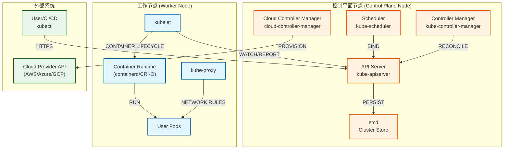
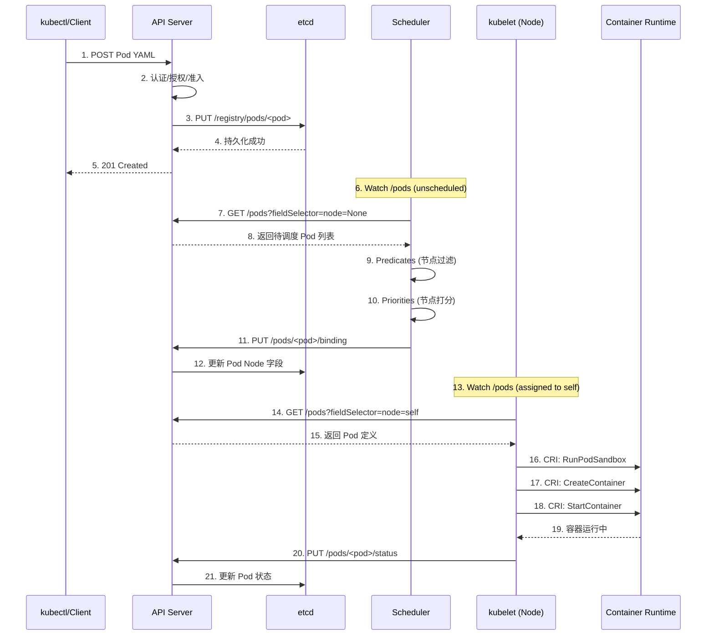
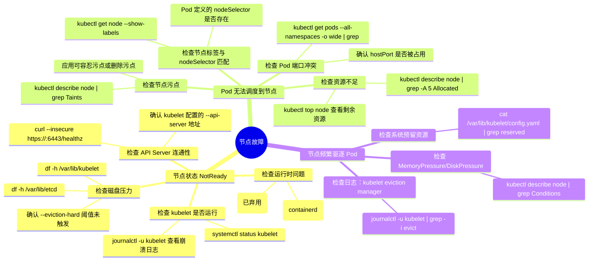

> **摘要**：Kubernetes 集群由两类节点构成——控制平面节点与工作节点，这是分布式系统中“控制-执行”分离架构的经典实现。本文深入分析两类节点的组件构成、通信模式与故障隔离边界，并探讨为何生产环境必须将控制平面与用户负载物理/逻辑分离。通过对 kubelet、API Server 交互的详细拆解，揭示节点模型设计背后的可用性、安全性与性能权衡。

## 一、核心概念与底层图景

### 1.1 定义

**工程定义**：Kubernetes 节点模型是将集群职能划分为**控制逻辑执行单元**（控制平面节点）与**业务负载执行单元**（工作节点）的架构模式。控制平面节点运行集群级控制器与状态存储，工作节点运行业务容器，两者通过 API Server 进行松耦合通信。

**类比**：类似现代操作系统内核与用户进程的分离——内核（控制平面）管理系统资源与调度，用户进程（工作负载）运行在受限的用户态，通过系统调用（API Server）请求服务。

### 1.2 架构全景图



**架构说明**：
- **控制平面节点**（橙色）运行集群级服务，所有组件**必须为 Linux 系统**（Windows 不支持控制平面）
- **工作节点**（蓝色）运行业务 Pod，可混合 Linux/Windows 节点
- **通信模式**：所有组件**仅通过 API Server 通信**，无直接跨节点调用（除 etcd 集群内部 RAFT 通信）
- **状态持久化**：唯一有状态组件是 etcd，其他均为无状态设计

---

## 二、机制原理深度剖析

### 2.1 核心子模块拆解

| 子模块 | 职责 | 设计意图/为何独立 |
|--------|------|------------------|
| **API Server (kube-apiserver)** | 认证/授权/准入控制，RESTful API 暴露，状态持久化转发 | 单一入口保证安全策略集中执行，避免多组件直接操作 etcd 导致数据不一致 |
| **Scheduler (kube-scheduler)** | 监测未调度 Pod，通过 predicate/filter 与 priority 算法选择目标节点 | 调度逻辑独立可插拔，支持自定义调度器；解耦“决策”与“执行” |
| **Controller Manager** | 运行约 30+ 独立控制器（Deployment、ReplicaSet、EndpointSlice 等） | 集中管理控制器生命周期，避免每个控制器独立运行导致的资源竞争 |
| **etcd** | 分布式键值存储，保存所有集群对象（期望状态） | 基于 RAFT 的强一致性，Watch 机制支撑控制器事件驱动架构 |
| **Cloud Controller Manager** | 对接云厂商 API（负载均衡、存储卷、节点管理） | 抽象云厂商差异，使核心控制平面与云平台解耦 |
| **kubelet** | 节点代理，注册节点、创建 Pod、健康检查、上报状态 | 每个节点唯一的 agent，实现控制平面与节点本地 runtimes 的适配层 |
| **kube-proxy** | 维护节点 iptables/IPVS 规则，实现 Service 到 Pod 的负载均衡 | 将集群虚拟 IP 映射到具体 Pod IP，解耦服务发现与底层网络实现 |

### 2.2 核心流程可视化：Pod 调度全生命周期



**流程关键点**：
- **步骤 6-8**：Scheduler 通过 **Watch 机制**监听未绑定 Pod，而非轮询——这是 etcd Watch 在控制平面中的核心应用
- **步骤 9-10**：调度算法分两阶段，先“可行性过滤”后“优选”，设计上允许自定义扩展
- **步骤 16-18**：kubelet 通过 CRI（Container Runtime Interface）与运行时交互，实现运行时无关性
- **步骤 20**：kubelet 通过**乐观并发控制**更新 Pod 状态（基于 resourceVersion）

### 2.3 设计意图分析：为何必须分离？

**1. 故障隔离（Failure Isolation）**

控制平面故障（如 API Server OOM）不应导致已运行 Pod 终止。工作节点的 kubelet 在失去与 API Server 通信时，会维持现有 Pod 运行（除非节点 eviction 阈值触发）。这种设计保障了**控制平面故障时的业务连续性**。

**2. 安全边界（Security Boundary）**

控制平面节点存储集群根证书与 etcd 数据，必须严格限制访问。工作节点运行不可信用户容器，若被攻破，攻击者无法直接获取集群凭证——因为 kubelet 仅持有自身节点的有限凭证（基于 Node 鉴权模式）。

**3. 扩缩容独立性（Scaling Decoupling）**

工作节点可随业务负载水平扩展（Cluster Autoscaler），而控制平面节点数量相对固定（通常 3 或 5 节点）。若两者混合，业务 Pod 会消耗控制平面资源，导致 API 响应延迟。

**4. 升级策略（Upgrade Strategy）**

控制平面节点升级可能导致短暂 API 不可用，但不影响现有 Pod。工作节点可滚动升级（drain + upgrade + uncordon），实现节点 OS 或 kubelet 版本更新而不中断业务。

---

## 三、内核/源码级实现

### 3.1 核心数据结构：Node 对象（Go）

```go
// k8s.io/api/core/v1/types.go

// Node 是 Kubernetes 中的工作节点（物理机/VM）。
// 该对象由 kubelet 或云控制器管理，控制平面通过它了解节点状态。
type Node struct {
    metav1.TypeMeta `json:",inline"`
    // 标准对象元数据
    metav1.ObjectMeta `json:"metadata,omitempty" protobuf:"bytes,1,opt,name=metadata"`
    
    // Spec 定义节点的期望状态，主要由云控制器或管理员设置
    Spec NodeSpec `json:"spec,omitempty" protobuf:"bytes,2,opt,name=spec"`
    
    // Status 反映节点的实际运行状态，由 kubelet 定期更新
    // 并发访问：kubelet（写）与调度器/控制器（读）通过 API Server 协调
    Status NodeStatus `json:"status,omitempty" protobuf:"bytes,3,opt,name=status"`
}

// NodeSpec - 节点的不变属性
type NodeSpec struct {
    // PodCIDR 分配给该节点的 Pod IP 段
    // 生命周期：节点加入集群时由控制器分配，永不修改
    PodCIDR string `json:"podCIDR,omitempty" protobuf:"bytes,1,opt,name=podCIDR"`
    
    // ProviderID 标识云提供商上的实例（如：aws:///us-east-1a/i-12345678）
    // 用于云控制器识别具体实例
    ProviderID string `json:"providerID,omitempty" protobuf:"bytes,3,opt,name=providerID"`
    
    // Unschedulable 控制调度器是否可将新 Pod 分配至此节点
    // 由管理员或 Cluster Autoscaler 设置，用于节点维护或缩容
    Unschedulable bool `json:"unschedulable,omitempty" protobuf:"varint,4,opt,name=unschedulable"`
    
    // Taints 阻止不容忍该污点的 Pod 调度至此节点
    // 实现节点专用化（如：仅 GPU 节点）
    Taints []Taint `json:"taints,omitempty" protobuf:"bytes,5,opt,name=taints"`
}

// NodeStatus - 节点动态状态，由 kubelet 通过 heartbeat 更新
type NodeStatus struct {
    // Capacity 节点总资源量（CPU、内存、最大 Pod 数等）
    // 由 kubelet 启动时检测并上报
    Capacity ResourceList `json:"capacity,omitempty" protobuf:"bytes,1,rep,name=capacity,casttype=ResourceList,castkey=ResourceName"`
    
    // Allocatable 可供 Pod 使用的资源量（Capacity 减去系统预留）
    // 由 kubelet 根据预留策略计算
    Allocatable ResourceList `json:"allocatable,omitempty" protobuf:"bytes,2,rep,name=allocatable,casttype=ResourceList,castkey=ResourceName"`
    
    // Conditions 节点健康状况（Ready、DiskPressure、MemoryPressure 等）
    // 由 kubelet 周期性检测并更新，调度器据此过滤不可用节点
    Conditions []NodeCondition `json:"conditions,omitempty" patchStrategy:"merge" patchMergeKey:"type" protobuf:"bytes,4,rep,name=conditions"`
    
    // Addresses 节点 IP 地址（InternalIP、ExternalIP、Hostname）
    // 由 kubelet 或云控制器设置，用于 kube-proxy 生成访问规则
    Addresses []NodeAddress `json:"addresses,omitempty" patchStrategy:"merge" patchMergeKey:"type" protobuf:"bytes,5,rep,name=addresses"`
    
    // NodeInfo 节点操作系统、内核版本、容器运行时版本等
    // 由 kubelet 探测并上报，用于节点选择器（nodeSelector）
    NodeInfo NodeSystemInfo `json:"nodeInfo,omitempty" protobuf:"bytes,7,opt,name=nodeInfo"`
    
    // Images 节点上已缓存的容器镜像列表
    // 由 kubelet 扫描并上报，调度器可选择已有镜像的节点加速启动
    Images []ContainerImage `json:"images,omitempty" protobuf:"bytes,8,rep,name=images"`
}
```

**并发设计**：
- `Node` 对象由**多写者**操作：kubelet 写 `status` 子资源，控制器/管理员写 `spec` 子资源
- API Server 通过 **`resourceVersion` 乐观锁**防止并发更新冲突
- kubelet 使用 **PATCH 操作**（而非 PUT）更新 `status`，减少冲突概率

### 3.2 核心流程伪代码：kubelet 节点注册与心跳

```python
# kubelet 启动主循环简化逻辑
def kubelet_main():
    # 1. 加载节点配置（hostname、kubeconfig、预留资源）
    config = load_kubelet_config()
    
    # 2. 注册节点到集群
    node = create_node_object(config)
    while True:
        try:
            # POST /api/v1/nodes - 首次注册
            existing = api_server.create_node(node)
            break
        except ConflictError:  # 节点已存在
            # GET /api/v1/nodes/<name> - 获取现有对象
            existing = api_server.get_node(node.metadata.name)
            # 合并资源版本，更新 spec（如云提供商信息）
            node.resourceVersion = existing.resourceVersion
            api_server.update_node(node)
            break
        except Exception as e:
            sleep(retry_interval)
    
    # 3. 启动状态同步循环
    while True:
        # 收集节点状态
        status = NodeStatus()
        status.capacity = detect_node_resources()
        status.conditions = check_node_health()
        status.images = list_cached_images()
        
        # PATCH /api/v1/nodes/<name>/status - 更新状态子资源
        # 使用 PATCH 而非 PUT 避免与 spec 更新冲突
        api_server.patch_node_status(node.metadata.name, status)
        
        # 4. 监听分配给本节点的 Pod
        pods = api_server.watch_pods(
            field_selector=f"spec.nodeName={node.metadata.name}"
        )
        for event in pods:
            handle_pod_event(event)  # 创建/更新/删除容器
        
        sleep(heartbeat_interval)  # 默认 10 秒
```

**关键实现点**：
- **子资源设计**：`/status` 子资源仅允许 kubelet 更新，`/spec` 仅允许管理员/控制器更新，减少锁冲突
- **Lease 对象**（v1.14+）：除 Node 对象心跳外，kubelet 额外维护 `Lease` 对象（轻量级），降低 etcd 压力
- **Watch 断连重试**：kubelet 与 API Server 的 Watch 连接断开后，需重新 list-and-watch 保证事件不丢失

---

## 四、生产落地与 SRE 实战

### 4.1 场景化案例：控制平面节点故障导致调度暂停

**现象**：
SRE 团队收到告警：`Deployment 滚动更新卡住`，`Pending Pods 持续增长`。监控图表显示 API Server 响应延迟升高至 5s+。

**排查链路**：
1. `kubectl get pods -A | grep Pending` → 确认数百 Pod 处于 Pending 状态
2. `kubectl describe pod <pending-pod>` → 事件显示：`0/3 nodes are available` 但节点健康
3. `kubectl get events --all-namespaces` → 发现大量 `Failed to watch *v1.Pod: etcdserver: request timeout`
4. 登录控制平面节点检查 etcd 健康：`etcdctl endpoint health` → 两个 etcd 节点 unreachable
5. `journalctl -u etcd -f` → 日志显示磁盘 I/O 延迟高达 500ms（etcd 依赖低延迟磁盘）

**根因**：
etcd 使用的磁盘达到 IOPS 上限（共享磁盘与其他高 IO 应用混部），导致 etcd 选举超时，RAFT 集群失去 quorum。API Server 依赖 etcd Watch，超时后无法处理 Pod 绑定事件。

**解决方案**：
1. **紧急恢复**：将 etcd 数据目录迁移至专用 SSD（立即恢复 quorum）
2. **长期治理**：
   - 控制平面节点使用**本地 NVMe SSD**（非共享存储）
   - 配置 etcd 磁盘 IOPS 监控告警（`etcd_disk_wal_fsync_duration_seconds` > 100ms）
   - 实施**控制平面节点专用**策略（通过 taint `node-role.kubernetes.io/control-plane:NoSchedule`）

**验证**：
- `kubectl get pods -A` → Pending Pod 逐渐调度成功
- `etcdctl endpoint status --write-out=table` → 所有节点均为 leader/follower 正常

### 4.2 参数调优矩阵

| 参数名 | 作用域 | 推荐值（v1.32） | 内核解释 |
|--------|--------|----------------|---------|
| `--max-pods` | kubelet | 110（默认） | 节点可运行的最大 Pod 数量。受限于 Pod CIDR 大小、节点内核参数（`net.ipv4.ip_local_port_range`）。超出导致 Pod 创建失败。 |
| `--system-reserved` | kubelet | `cpu=500m,memory=1Gi` | 为系统守护进程（sshd、systemd）预留的资源。不设置可能导致节点压力驱逐系统关键进程。 |
| `--kube-reserved` | kubelet | `cpu=200m,memory=512Mi` | 为 kubelet、容器运行时预留的资源。保证控制面 agent 不被业务 Pod 饿死。 |
| `--eviction-hard` | kubelet | `memory.available<100Mi` | 节点资源不足时触发 Pod 驱逐的阈值。设得太低导致 OOM 风险，太高导致资源碎片。 |
| `--node-monitor-period` | controller-manager | 5s | 控制器检查节点健康状况的间隔。与 `--node-monitor-grace-period`（默认 40s）配合，决定节点故障检测时间。 |
| `--pod-eviction-timeout` | controller-manager | 5m | 节点 NotReady 后，等待多长时间驱逐该节点上的 Pod。期间业务可能受影响。 |

### 4.3 监控与诊断命令

**节点健康检查**：
```bash
# 查看节点状态及条件
kubectl get nodes -o wide
kubectl describe node <node-name> | grep -A 5 Conditions

# 查看节点资源使用
kubectl top node <node-name>

# 查看节点事件
kubectl get events --field-selector involvedObject.kind=Node,involvedObject.name=<node-name>
```

**kubelet 日志诊断**：
```bash
# SSH 登录节点后
journalctl -u kubelet -f --since "5 minutes ago"

# 常见错误：
# "Failed to get sandbox image" → 容器运行时不可达
# "Out of memory" → 节点内存不足触发 eviction
# "Error updating node status" → API Server 连接问题
```

**etcd 健康诊断**：
```bash
# 在控制平面节点执行
ETCDCTL_API=3 etcdctl --endpoints=https://127.0.0.1:2379 \
  --cacert=/etc/kubernetes/pki/etcd/ca.crt \
  --cert=/etc/kubernetes/pki/etcd/server.crt \
  --key=/etc/kubernetes/pki/etcd/server.key \
  endpoint health --write-out=table

# 关键指标
# - 是否有 leader：member xxxx is leader
# - 延迟：etcd_request_duration_seconds 分位数
```

### 4.4 故障排查决策树



---

## 五、技术演进与未来视角（2026+）

### 5.1 历史设计约束与改进

| 版本 | 变化 | 动因/解决的问题 |
|------|------|----------------|
| v1.0 (2015) | 节点模型确立：Master + Minions | 初始设计，Master 运行所有控制组件，Minions 运行业务 |
| v1.2 (2016) | 引入 Taints 与 Tolerations | 解决专用节点问题（GPU、SSD），替代粗暴的 nodeSelector |
| v1.5 (2016) | Node 条件与自愈 | 标准化节点健康检测机制，Controller Manager 开始驱逐故障节点上的 Pod |
| v1.14 (2019) | 节点心跳改用 Lease 对象 | 减轻 etcd 压力，将周期性心跳从大对象 Node 迁移至轻量级 Lease |
| v1.20 (2020) | 弃用 Docker 作为运行时 | 移除对 Docker 的硬依赖，强制使用 CRI 兼容运行时（containerd/CRI-O） |
| v1.24 (2022) | 移除 Dockershim | 完成 CRI 迁移，kubelet 仅通过 CRI 与运行时交互 |
| v1.28 (2023) | 混合架构节点 GA | 正式支持同一集群中混合 Linux/Windows 节点，调度器根据 `nodeSelector` 分配 |

### 5.2 2026 年仍存在的“遗留设计”

1. **控制平面组件静态 Pod 部署**：至今多数集群仍通过静态 Pod 或 systemd 启动控制平面组件，缺乏滚动升级的优雅机制。原因：kubelet 依赖 API Server 启动，形成启动依赖循环。

2. **节点状态强依赖心跳**：节点故障检测依赖 kubelet 周期性上报，最长检测时间 = `node-monitor-period` + `node-monitor-grace-period` + 网络延迟 ≈ 1 分钟。这对快速故障转移仍显迟钝。

3. **Windows 节点为二等公民**：Windows 节点无法运行控制平面，且许多 CSI/CNI 插件对 Windows 支持滞后。根本原因：Windows 容器与 Linux 容器在进程隔离、网络实现上存在根本差异。

### 5.3 未来趋势

**1. 硬件趋势对节点模型的影响**
- **DPU/IPU 卸载**：将网络、存储虚拟化卸载至智能网卡，节点上 kube-proxy、CNI 的部分功能可卸载至硬件，降低 CPU 开销。
- **CXL 内存扩展**：节点可挂载远端内存池，改变资源模型——调度器需考虑 NUMA 与 CXL 的混合拓扑。

**2. 架构趋势**
- **Kubelet 精简**：部分功能（如镜像拉取、日志轮转）逐步外移，kubelet 回归“节点代理”本质。
- **无节点 K8s**：AWS Fargate、AKS Virtual Nodes 等 Serverless 容器模糊节点边界，调度器直接面向“虚拟节点”分配 Pod，节点模型隐式存在但用户无感。

**3. 官方路线图**
- **KEP-4193：Node Log Access**：标准化从 API Server 访问节点日志的接口，逐步替代 SSH 登录排障模式。
- **KEP-3457：Machine Management**：将节点生命周期管理（provisioning/draining）标准化为 Machine API，统一裸机与云节点的管理体验。

**结语**：节点模型作为 Kubernetes 最基础的架构决策，其“控制-执行分离”原则在过去十年被证明是构建可扩展分布式系统的正确抽象。即使未来 Serverless 淡化节点概念，底层仍遵循同样的隔离边界——只是“节点”从物理实体变为逻辑单元。