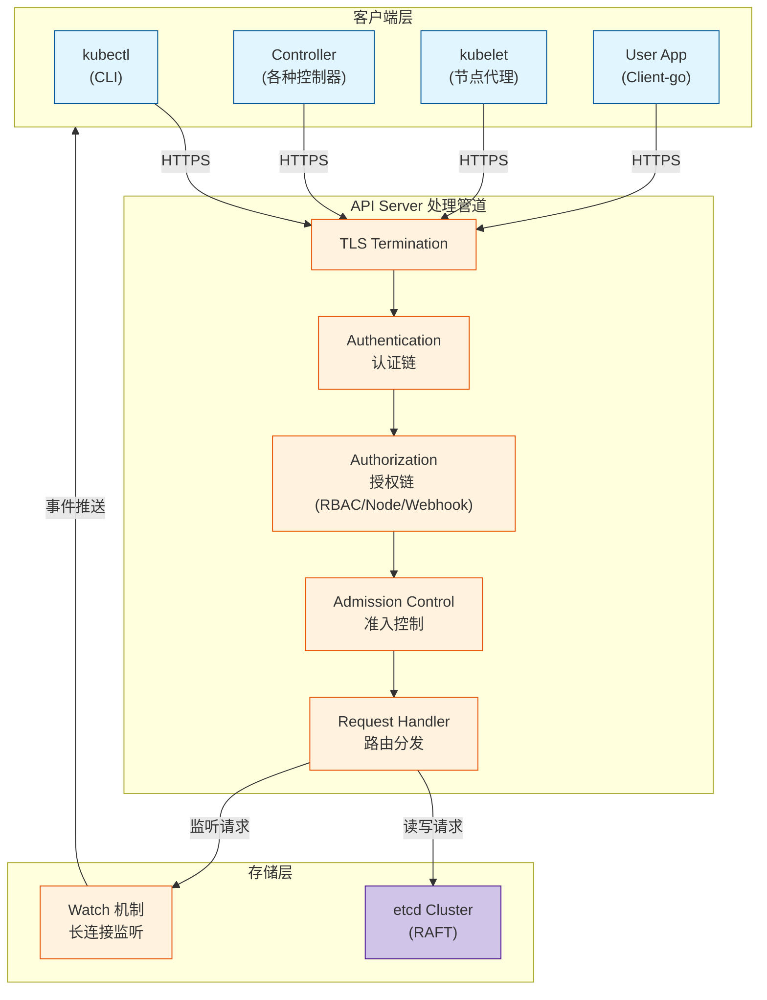
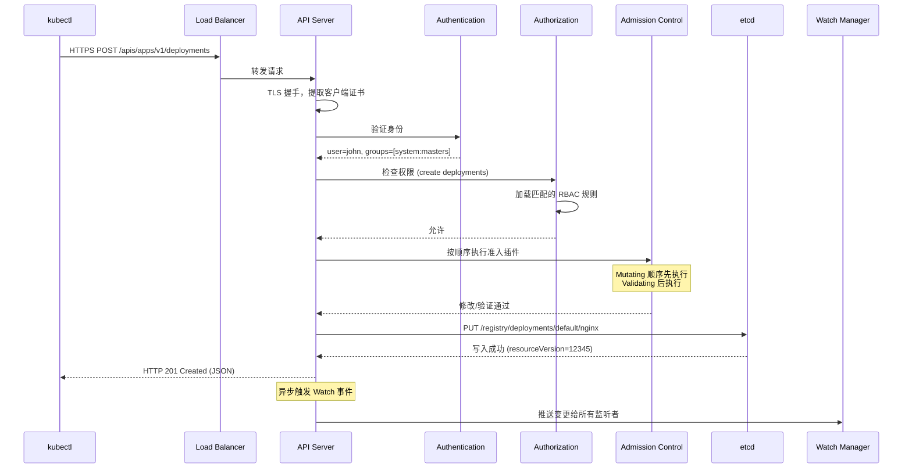
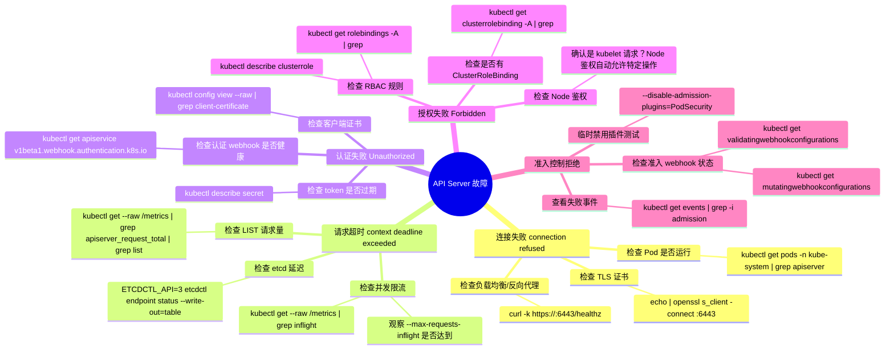

> **摘要**：API Server 是 Kubernetes 系统中唯一与 etcd 直接交互的组件，所有组件和用户的请求都必须经过它。本文深入分析 API Server 的请求处理全流程——从 TLS 终止、认证链、授权链、准入控制到最终的对象持久化与响应返回。通过对认证插件、RBAC 匹配算法、准入控制器执行顺序的拆解，揭示 API Server 如何在高并发场景下保证安全性与数据一致性。同时分析三种客户端（kubectl、controller、kubelet）与 API Server 交互模式的差异。

## 一、核心概念与底层图景

### 1.1 定义

**工程定义**：API Server（kube-apiserver）是 Kubernetes 控制平面的前端服务，实现 RESTful API 的 HTTP(S) 暴露、请求处理管道（认证→授权→准入→持久化）以及 etcd 的读写代理。它是集群中唯一有状态（依赖 etcd）的无状态水平扩展组件。

**设计哲学**：无共享架构（Shared Nothing）——所有 API Server 副本均无本地持久化状态，请求处理结果完全由 etcd 驱动，支持水平扩展实现高吞吐。

### 1.2 架构全景图



**架构要点**：
- **无状态设计**：API Server 不存储任何数据，所有状态存于 etcd，支持多副本水平扩展
- **统一入口**：所有集群操作（读、写、监听）必须经过 API Server，无旁路路径
- **请求管道**：每个请求按顺序经过认证→授权→准入三个阶段，任一阶段拒绝则请求终止
- **Watch 机制**：基于 HTTP/1.1 的长连接，客户端可监听资源变化，实现控制器事件驱动

---

## 二、机制原理深度剖析

### 2.1 核心子模块拆解

| 子模块 | 职责 | 设计意图/为何独立 |
|--------|------|------------------|
| **TLS 终止** | 解密客户端 HTTPS 请求，提取客户端证书（若配置 mTLS） | 所有 API 通信强制加密，防止中间人攻击；证书中的 CN/O 字段直接用于认证 |
| **认证链 (AuthN)** | 验证请求者身份，提取 `user` 和 `groups` 信息 | 支持多认证方式（证书、令牌、Webhook）共存，任一成功即通过 |
| **授权链 (AuthZ)** | 检查已认证用户是否有权限执行请求操作 | 支持多授权模块（RBAC、Node、Webhook）并存，任一允许即通过 |
| **准入控制** | 在对象持久化前进行修改或校验 | 分离“权限检查”与“策略执行”，支持动态扩展（如 AlwaysPullImages、NamespaceLifecycle） |
| **Request Handler** | 根据 HTTP 方法和路径路由到对应资源 REST 逻辑 | 实现标准的 RESTful 语义（GET/POST/PUT/PATCH/DELETE） |
| **etcd 客户端** | 与 etcd 集群通信，执行读写操作 | 封装 etcd 客户端逻辑，处理 lease、watch、事务 |
| **Watch 管理器** | 维护客户端长连接，推送资源变更事件 | 基于 etcd 的 Watch 实现，按需过滤资源类型与字段 |

### 2.2 核心流程可视化：一次 `kubectl apply` 的完整请求生命周期



**流程关键点**：
1. **认证顺序**：客户端证书 → 静态令牌 → Bearer 令牌 → Webhook，任一认证通过即停止后续认证
2. **授权短路**：多个授权模块中，任一模块返回 `allow` 则立即通过，无需等待后续模块
3. **准入顺序**：固定顺序——先 `MutatingAdmissionWebhook`（可修改对象），后 `ValidatingAdmissionWebhook`（只读检查）
4. **乐观并发**：etcd 写入基于 `resourceVersion` 实现乐观锁，防止并发更新冲突

### 2.3 设计意图分析：为什么所有组件都必须通过 API Server？

**1. 单一事实来源（Single Source of Truth）**

如果允许控制器直接读写 etcd：
- 多个控制器可能并发修改同一对象，导致数据不一致
- 无法实施统一的认证授权策略
- 无法通过 Watch 机制通知其他组件变更

**2. 安全策略集中执行**

API Server 作为唯一入口，可在**一个地方**实施：
- TLS 加密（所有通信）
- 认证（识别谁在操作）
- 授权（检查能否操作）
- 准入（操作是否符合集群策略）

若允许旁路访问，任何组件都可能绕过安全控制。

**3. 负载隔离与限流**

API Server 可对不同类型的请求实施优先级和限流（APF——API Priority and Fairness）：
- `list` 大量对象可能消耗 etcd 资源，可限制并发
- `watch` 长连接占用内存，可限制连接数
- 控制平面组件（如 kubelet 状态上报）与用户请求分离队列

**4. 版本兼容与转换**

API Server 负责处理 API 版本转换：
- 客户端请求 `extensions/v1beta1/ingress`
- 集群存储为 `networking.k8s.io/v1/ingress`
- API Server 在读取时自动转换版本，实现客户端与服务端版本解耦

---

## 三、内核/源码级实现

### 3.1 核心数据结构：请求信息聚合

```go
// k8s.io/apiserver/pkg/endpoints/request/context.go

// RequestInfo 包含从 HTTP 请求解析出的 Kubernetes 资源信息
// 生命周期：认证后由请求处理链填充，贯穿整个请求处理过程
type RequestInfo struct {
    // IsResourceRequest 是否为资源请求（如 /api/v1/pods）
    // false 表示非资源请求（如 /healthz、/metrics）
    IsResourceRequest bool
    
    // Path 原始请求路径
    Path string
    
    // Verb 映射后的操作类型（get/list/create/update/patch/delete/watch/proxy）
    // 注意：HTTP GET 可能映射为 get 或 list，取决于是否包含名称
    Verb string
    
    // APIPrefix 通常是 "api" 或 "apis"
    APIPrefix string
    
    // APIGroup API 组（如 "apps"、"" 表示核心组）
    APIGroup string
    
    // APIVersion API 版本（如 "v1"）
    APIVersion string
    
    // Namespace 资源所在命名空间（仅 namespaced 资源有效）
    Namespace string
    
    // Resource 资源类型（如 "pods"、"deployments"）
    Resource string
    
    // Subresource 子资源（如 "status"、"scale"）
    Subresource string
    
    // Name 资源名称（如果请求指定了具体资源）
    Name string
    
    // Parts URL 路径分段
    Parts []string
}

// 使用示例：
// GET /apis/apps/v1/namespaces/default/deployments/nginx/status
// → APIGroup="apps", Version="v1", Namespace="default"
//   Resource="deployments", Name="nginx", Subresource="status"
```

### 3.2 认证链实现

```go
// k8s.io/apiserver/pkg/authentication/request/union/union.go

// unionAuthNHandler 将多个认证器组合为一个链
// 实现 "任一成功即成功" 的语义
type unionAuthNHandler struct {
    // Handlers 按配置顺序存储认证器
    // 顺序由 API Server 启动参数决定（--authentication-token-webhook 等）
    Handlers []authenticator.Request
    
    // FailOnError 控制是否在遇到错误时继续尝试后续认证器
    // true: 遇到错误立即返回（保守模式）
    // false: 遇到错误继续尝试其他认证器（宽松模式，默认）
    FailOnError bool
}

// AuthenticateRequest 实现认证链逻辑
func (h *unionAuthNHandler) AuthenticateRequest(req *http.Request) (*authenticator.Response, bool, error) {
    var lastError error
    
    for _, handler := range h.Handlers {
        // 调用当前认证器
        resp, ok, err := handler.AuthenticateRequest(req)
        
        if err != nil && h.FailOnError {
            // 保守模式：任何错误立即返回
            return nil, false, err
        }
        if err != nil {
            // 宽松模式：记录错误继续
            lastError = err
            continue
        }
        
        if ok {
            // 认证成功，返回用户信息
            // 注意：此处的 resp.User 将传递到后续授权阶段
            return resp, true, nil
        }
        
        // ok == false 表示当前认证器无法识别该请求（如令牌类型不匹配）
        // 继续下一个认证器
    }
    
    // 所有认证器都无法识别或全部失败
    if lastError != nil {
        return nil, false, lastError
    }
    return nil, false, nil
}

// 认证器示例：x509 证书认证
// 从客户端证书中提取 CN 作为用户名，O 作为组
// curl --cert client.crt --key client.key https://apiserver
```

### 3.3 授权匹配算法

```go
// k8s.io/apiserver/pkg/authorization/authorizer/interfaces.go

// Attributes 接口封装授权决策所需的所有信息
type Attributes interface {
    // GetUser 获取已认证用户信息
    GetUser() user.Info
    
    // GetVerb 获取操作类型 (get/list/create/update...)
    GetVerb() string
    
    // IsReadOnly 是否为只读操作 (get/list/watch)
    IsReadOnly() bool
    
    // GetNamespace 获取命名空间（集群范围资源返回空字符串）
    GetNamespace() string
    
    // GetResource 获取资源类型
    GetResource() string
    
    // GetSubresource 获取子资源
    GetSubresource() string
    
    // GetName 获取资源名称（如果请求特定资源）
    GetName() string
    
    // GetAPIGroup 获取 API 组
    GetAPIGroup() string
    
    // GetAPIVersion 获取 API 版本
    GetAPIVersion() string
}

// RBAC 授权核心逻辑
func rbacAuthorize(attrs Attributes) (Decision, error) {
    // 1. 获取用户的所有角色绑定
    // - 集群范围的 ClusterRoleBinding
    // - 命名空间范围的 RoleBinding
    
    // 2. 收集用户拥有的所有规则
    rules := collectRulesForUser(attrs.GetUser(), attrs.GetNamespace())
    
    // 3. 遍历规则，寻找匹配项
    for _, rule := range rules {
        // 检查 API 组匹配（* 表示任意）
        if !matchesAPIGroup(rule.APIGroups, attrs.GetAPIGroup()) {
            continue
        }
        
        // 检查资源匹配
        if !matchesResource(rule.Resources, attrs.GetResource(), attrs.GetSubresource()) {
            continue
        }
        
        // 检查操作匹配
        if !matchesVerb(rule.Verbs, attrs.GetVerb()) {
            continue
        }
        
        // 检查名称匹配（如果规则指定了 resourceNames）
        if len(rule.ResourceNames) > 0 && !matchesName(rule.ResourceNames, attrs.GetName()) {
            continue
        }
        
        // 所有条件匹配 → 允许
        return DecisionAllow, nil
    }
    
    // 无匹配规则 → 拒绝
    return DecisionDeny, nil
}
```

### 3.4 准入控制顺序

```go
// k8s.io/apiserver/pkg/admission/chain.go

// chainHandler 按顺序执行准入控制器
// 顺序由 API Server 启动参数 --enable-admission-plugins 决定
type chainHandler struct {
    // 按执行顺序存储的准入控制器
    handlers []Interface
}

// Admit 执行准入链
func (h *chainHandler) Admit(a Attributes, o ObjectInterfaces) error {
    // 分两阶段执行：
    // 1. 先执行 MutatingAdmission (可修改对象)
    // 2. 后执行 ValidatingAdmission (只读检查)
    
    // 第一阶段：Mutation
    for _, handler := range h.handlers {
        // 检查是否支持 Mutation
        mutating, ok := handler.(MutationInterface)
        if !ok {
            continue
        }
        
        // 执行 Mutation（可能修改传入的对象）
        if err := mutating.Admit(a, o); err != nil {
            return err
        }
    }
    
    // 第二阶段：Validation
    for _, handler := range h.handlers {
        validating, ok := handler.(ValidationInterface)
        if !ok {
            continue
        }
        
        // 执行 Validation（只读检查）
        if err := validating.Validate(a, o); err != nil {
            return err
        }
    }
    
    return nil
}

// 常用准入控制器执行顺序示例：
// 1. NamespaceLifecycle (防止在 terminating 命名空间创建对象)
// 2. LimitRanger (设置默认资源限制)
// 3. ServiceAccount (自动添加 service account)
// 4. PodSecurity (检查 Pod 安全标准)
// 5. DefaultStorageClass (为 PVC 设置默认 StorageClass)
// 6. MutatingAdmissionWebhook (外部动态修改)
// 7. ValidatingAdmissionWebhook (外部验证)
```

---

## 四、生产落地与 SRE 实战

### 4.1 场景化案例：API Server 过载导致集群不可用

**现象**：
- `kubectl` 命令超时或返回 `connection refused`
- 监控显示 API Server Pod CPU 使用率持续 100%
- 已有 Pod 仍在运行，但无法滚动更新或扩缩容
- kubelet 日志报错 `Failed to update node status: context deadline exceeded`

**排查链路**：

1. **检查 API Server 监控指标**：
```bash
# 通过 metrics 端点查看
kubectl get --raw /metrics | grep apiserver_request_

# 关键指标
# - apiserver_request_total: 总请求量
# - apiserver_request_duration_seconds: 请求延迟
# - apiserver_current_inflight_requests: 当前并发请求数
```

2. **发现异常请求源**：
```bash
# 查看 API Server 日志
kubectl logs -n kube-system kube-apiserver-<pod> | grep -i "longest"

# 发现大量来自同一 IP 的 LIST 请求
# "list *v1.Pod" 请求耗时 30s+
```

3. **确认限流触发**：
```bash
# 查看 APF (API Priority and Fairness) 指标
kubectl get --raw /metrics | grep apiserver_flowcontrol

# apiserver_flowcontrol_rejected_requests_total 指标突增
```

**根因**：
某团队部署了错误的控制器，循环对 `kubectl get pods --all-namespaces` 进行轮询（间隔 1 秒），产生大量全量 LIST 请求，耗尽 API Server 并发处理能力。

**解决方案**：

1. **紧急恢复**：临时增加 API Server 副本数
```bash
kubectl scale deployment -n kube-system kube-apiserver --replicas=3
```

2. **立即限制**：通过 APF 配置隔离异常源
```yaml
# 创建 FlowSchema 隔离特定用户
apiVersion: flowcontrol.apiserver.k8s.io/v1beta3
kind: FlowSchema
metadata:
  name: restrict-abusive-client
spec:
  priorityLevelConfiguration:
    name: catch-all
  distinguisherMethod:
    type: ByUser
  rules:
  - subjects:
    - kind: User
      user:
        name: system:serviceaccount:abuse-ns:abuser
    resourceRules:
    - verbs: ["list"]
      apiGroups: [""]
      resources: ["pods"]
```

3. **长期治理**：
   - 实施**监控告警**：`apiserver_current_inflight_requests` > 80% 容量时告警
   - **审计可疑客户端**：定期分析 `apiserver_request_total` 按 user 聚合的 TOP N
   - **规范客户端行为**：强制要求使用 `watch` 而非频繁 `list`，或使用 `resourceVersion` 增量 LIST

### 4.2 参数调优矩阵

| 参数名 | 作用域 | 推荐值（v1.32） | 内核解释 |
|--------|--------|----------------|---------|
| `--max-requests-inflight` | API Server | 400（默认） | 非变更请求（GET/LIST/WATCH）的最大并发数。超出返回 429 Too Many Requests。 |
| `--max-mutating-requests-inflight` | API Server | 200（默认） | 变更请求（POST/PUT/PATCH/DELETE）的最大并发数。通常设为 max-requests-inflight 的一半。 |
| `--request-timeout` | API Server | 60s（默认） | 请求超时时间，防止慢请求耗尽 goroutine。LIST 大对象需调高。 |
| `--enable-admission-plugins` | API Server | `NamespaceLifecycle,LimitRanger,ServiceAccount,DefaultStorageClass,ResourceQuota` | 启用准入控制器顺序敏感。Mutating 在前，Validating 在后。 |
| `--audit-log-maxbackup` | API Server | 10 | 审计日志保留的轮转文件数。审计日志可能消耗大量磁盘。 |
| `--etcd-servers` | API Server | 指向 etcd 集群所有成员 | 多个 etcd 地址可提高可用性，API Server 自动故障转移。 |
| `--etcd-quorum-read` | API Server | true | 是否启用 etcd 法定读取。true 保证强一致性，但增加延迟。 |

### 4.3 监控与诊断命令

**实时监控**：
```bash
# 查看 API Server 健康
kubectl get --raw /healthz
kubectl get --raw /livez
kubectl get --raw /readyz

# 查看 API Server 性能指标
kubectl get --raw /metrics | grep -E "apiserver_request_(total|duration_seconds)"

# 按动词聚合请求量
kubectl get --raw /metrics | grep apiserver_request_total | grep -v 'verb="WATCH"'
```

**审计日志分析**：
```bash
# 查找异常用户行为
grep -E '"user":\{.*"username":"system:anonymous"' /var/log/kubernetes/audit.log

# 查找创建特权容器的请求
grep -B 10 -A 10 '"privileged":true' /var/log/kubernetes/audit.log
```

**客户端证书检查**：
```bash
# 解码 kubeconfig 中的客户端证书
kubectl config view --raw -o json | jq -r '.users[0].user["client-certificate-data"]' | base64 -d | openssl x509 -text

# 输出包含 CN（用户名）和 O（组）
# Subject: O=system:masters, CN=kubernetes-admin
```

### 4.4 故障排查决策树



---

## 五、技术演进与未来视角（2026+）

### 5.1 历史设计约束与改进

| 版本 | 变化 | 动因/解决的问题 |
|------|------|----------------|
| v1.0 | 单体 API Server + etcd | 初始设计，所有请求直连 etcd |
| v1.2 | 引入认证/授权插件化 | 支持多种企业认证方式（LDAP、AD），不再局限于客户端证书 |
| v1.6 | RBAC 正式发布 | 替代 ABAC（基于属性的访问控制），实现更灵活的权限模型 |
| v1.7 | 聚合层（Aggregation Layer） | 支持第三方 API 服务（metrics-server、prometheus-adapter）扩展 Kubernetes API |
| v1.11 | 核心 API 组拆分 | 将 ingress 从 `extensions/v1beta1` 移至 `networking.k8s.io/v1`，为 GA 做准备 |
| v1.20 | APF（API Priority and Fairness）GA | 替代 MaxInFlightLimit，实现精细化的请求排队与隔离 |
| v1.24 | 移除 `v1beta1` 资源 | 清理已 GA 资源的 beta 版本，强制客户端升级 |
| v1.27 | 只读端口（10253）弃用 | 强化安全，所有指标/健康检查端口统一认证 |

### 5.2 2026 年仍存在的“遗留设计”

1. **Watch 实现的内存占用**：每个 watch 连接在 API Server 中维护一个缓存，大量客户端 watch 同一资源导致内存线性增长。社区尝试使用 `bookmark` 机制减少全量重新同步，但本质问题未解决。

2. **乐观锁的局限**：基于 `resourceVersion` 的乐观锁在高并发更新同一对象时（如 `status` 频繁变化的 Pod），导致大量冲突重试，增加 API Server 负载。

3. **CRD 的存储性能**：CRD 对象存储于 etcd，但未针对特定资源做索引优化，导致 `list` 操作需扫描全量数据（如 label 过滤无法下推至 etcd）。

### 5.3 未来趋势

**1. 存储层 offload**
- **Kine**：将 etcd 替换为其他数据库（SQLite、MySQL、PostgreSQL）的项目，适用于边缘或轻量集群。
- **分布式存储优化**：etcd 社区持续优化并发性能，计划引入更好的并发控制（如事务冲突预测）。

**2. 请求处理 offload**
- **APF 精细化**：未来可能支持基于租户的优先级队列，实现真正意义上的多租户请求隔离。
- **gRPC 替代 HTTP/1.1**：部分内部通信（如 kubelet 与 API Server）考虑迁移至 gRPC，提高性能。

**3. 安全增强**
- **SPIFFE 集成**：使用 SPIFFE 标准替代传统客户端证书，实现跨集群工作负载身份认证。
- **审计日志分析自动化**：内置审计日志异常检测（如基于机器学习的特权提升识别）。

**结语**：API Server 作为 Kubernetes 的“心脏”，其设计在过去十年证明了其可扩展性和稳定性。未来它将继续作为单一可信源，但底层实现将不断演进——将存储 offload、计算 offload、安全策略 offload，而自身专注于最核心的请求路由与一致性保障。**“所有请求经过 API Server”这条原则，将是 Kubernetes 架构中最持久的设计决策。**