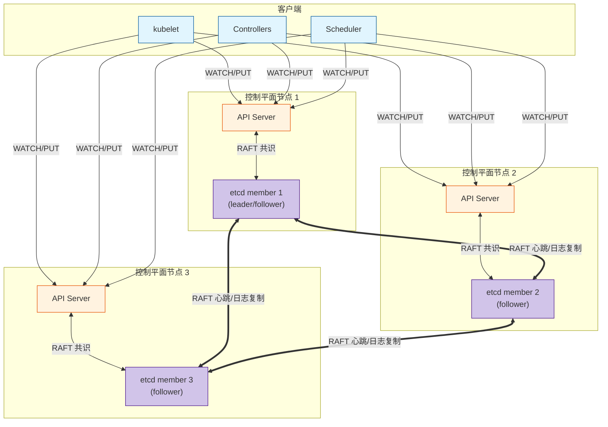
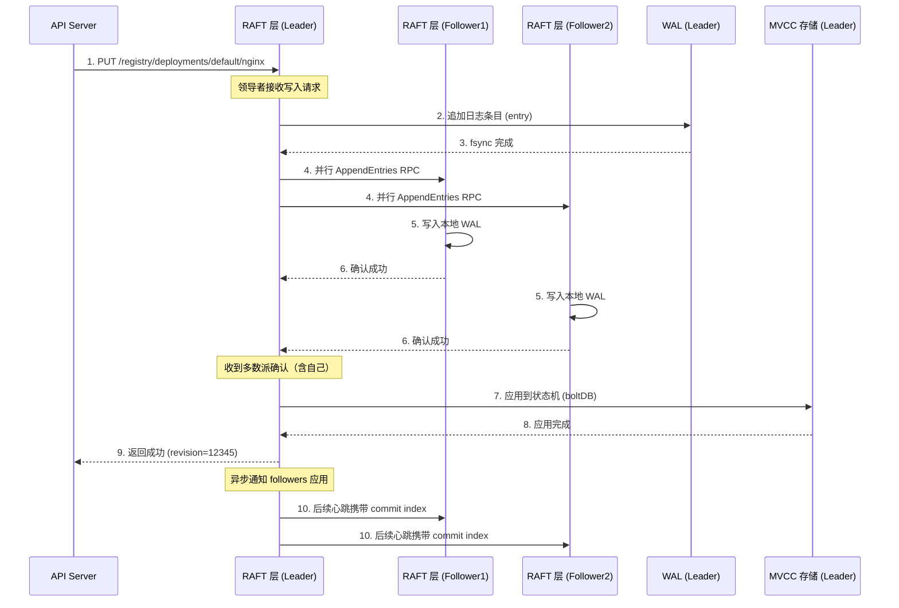

> [!abstract] 摘要
> etcd 是 Kubernetes 集群中唯一有状态的组件，存储所有集群对象（期望状态）与集群元数据。本文深入分析 etcd 在 Kubernetes 中的部署模式、数据模型设计、RAFT 共识算法的工程实现，以及 Watch 机制如何支撑控制器的事件驱动架构。通过拆解 etcd 的存储路径设计、事务隔离级别、压缩与碎片整理策略，揭示 etcd 如何在高并发读写场景下保证强一致性与可用性。同时分析 etcd 在 Kubernetes 生产环境中的常见故障模式与容量规划方法。

---

## 一、核心概念与底层图景

### 1.1 定义

> [!info] 工程定义
> etcd 是一个分布式的、强一致性的键值存储系统，基于 RAFT 共识算法实现。在 Kubernetes 中，etcd 作为**集群存储（Cluster Store）**，保存所有 API 对象的定义、状态和配置信息。它是整个控制平面的“单可信源”。

> [!quote] 设计哲学
> “etcd is the source of truth for the cluster.” —— 一切集群状态均存储于 etcd，API Server 仅作为 etcd 的代理与缓存。

### 1.2 架构全景图



> [!note] 架构要点
> - **RAFT 集群**：etcd 以集群模式运行，通常 3 或 5 节点，保证高可用
> - **API Server 直连**：每个 API Server 实例直接与所有 etcd 成员通信（非通过负载均衡）
> - **线性一致读**：API Server 默认启用 `--etcd-quorum-read=true`，读请求需经过 RAFT 确认
> - **Watch 机制**：基于 etcd 的 MVCC 实现，API Server 将其封装为 Kubernetes Watch API

---

## 二、机制原理深度剖析

### 2.1 核心子模块拆解

| 子模块 | 职责 | 设计意图/为何独立 |
|--------|------|------------------|
| **RAFT 共识层** | 实现领导者选举、日志复制、安全性保证 | 分布式系统中强一致性的工业标准实现，将复杂的共识问题简化为可证明正确的算法 |
| **MVCC 存储引擎** | 多版本并发控制，支持历史版本查询与 Watch | 基于 BoltDB（v3），实现快照隔离级别，支撑 Watch 机制需要保留历史版本 |
| **WAL（Write-Ahead Log）** | 预写日志，持久化所有 RAFT 日志条目 | 保证数据不丢失，重启时通过 WAL 恢复状态机 |
| **Lease 机制** | 分布式租约，支持 TTL 自动过期 | Kubernetes 中用于 Node 心跳、协调租约（Lease 对象） |
| **Watch 服务** | 监听键的变化，推送增量事件 | 支撑 Kubernetes 控制器的事件驱动架构，避免轮询 |
| **事务 API** | 支持比较-交换（CAS）操作 | 实现 Kubernetes 乐观并发控制（resourceVersion）的基础 |

### 2.2 核心流程可视化：一次 `kubectl apply` 在 etcd 层的生命周期



> [!tip] 流程关键点
> - **多数派原则**：写入成功只需多数节点（2/3、3/5）确认日志写入，无需等待所有节点应用
> - **线性一致读**：读请求需经过 RAFT 确认当前 leader，或通过 quorum 读保证读取最新数据
> - **revision 语义**：每个写入返回全局递增的 revision 号，用于 Watch 和乐观锁

### 2.3 设计意图分析：为什么 Kubernetes 选择 etcd？

> [!question] 为什么不是 ZooKeeper？为什么不是数据库？

**1. 强一致性 vs 最终一致性**

Kubernetes 需要**强一致性保证**：
- 多个控制器可能同时操作同一资源（如 Deployment 控制器与 HPA 控制器同时更新副本数）
- 必须保证数据不冲突、不丢失
- etcd 的 RAFT + 线性一致读提供分布式系统中的最高一致性级别

**2. Watch 机制的原生支持**

控制器模式依赖**事件驱动**：
- 如果使用传统数据库，需要自行实现 `SELECT ... WHERE updated_at > ?` 轮询
- etcd 原生支持键范围的持续监听，推送增量事件
- Kubernetes 的 `Informer` 机制完全构建在 etcd Watch 之上

**3. 简单数据模型 vs 复杂查询**

Kubernetes 对存储的需求**极其简单**：
- 键值对：`/registry/<resource>/<namespace>/<name>` → JSON 对象
- 不需要 JOIN、不需要复杂的 WHERE 条件
- etcd 的扁平键空间完全匹配需求，无额外复杂度

**4. 高可用与强一致性的成本**

etcd 的代价：
- **写入延迟**：每次写入需多数派 fsync（磁盘 IO 敏感）
- **空间放大**：MVCC 保留历史版本，需定期压缩
- **复杂性**：需维护 3/5 节点集群，处理网络分区

**结论**：etcd 是 Kubernetes 在“强一致性”、“Watch 原生支持”、“简单模型”三者权衡下的最优解。

---

## 三、内核/源码级实现

### 3.1 核心数据结构：etcd 存储路径设计

```go
// k8s.io/apiserver/pkg/storage/etcd3/store.go

// keyFunc 生成 etcd 存储路径
// 格式：/registry/<resource>/<namespace>/<name>
// 示例：/registry/deployments/default/nginx
func keyFunc(obj runtime.Object) (string, error) {
    accessor, err := meta.Accessor(obj)
    if err != nil {
        return "", err
    }
    
    // 获取资源类型（GVK）
    gvk := obj.GetObjectKind().GroupVersionKind()
    
    // 构建路径
    path := path.Join("/registry", gvk.Group, gvk.Version, gvk.Kind)
    
    // 如果是命名空间资源，加入命名空间
    namespace := accessor.GetNamespace()
    if namespace != "" {
        path = path.Join(path, namespace)
    }
    
    // 加入资源名称
    name := accessor.GetName()
    path = path.Join(path, name)
    
    return path, nil
}

// etcd 中实际存储的键结构示例：
// /registry/apiregistration.k8s.io/apiservices/v1.
// /registry/apps/deployments/default/nginx
// /registry/core/secrets/kube-system/etcd-certs
// /registry/minions/node-12345
```

### 3.2 核心流程伪代码：etcd Watch 实现

```go
// go.etcd.io/etcd/server/v3/mvcc/watcher.go

// watchableStore 实现可监听的存储
type watchableStore struct {
    // mu 保护以下两个 map
    mu sync.RWMutex
    
    // victims 待处理的 Watch 事件
    victims *victims
    
    // watches 按 key 范围组织的监听者
    watches map[string][]*watcher
}

// Watch 创建一个新的监听
func (s *watchableStore) Watch(key, end []byte, startRev int64) WatchChan {
    ch := make(WatchChan, 100) // 缓冲区防阻塞
    
    // 创建 watcher 对象
    w := &watcher{
        key:    key,
        end:    end,
        ch:     ch,
        // 从指定 revision 开始
        rev:    startRev,
        // 记录已发送的最大 revision
        lastRev: startRev,
    }
    
    s.mu.Lock()
    // 将监听者加入索引
    s.watches[string(key)] = append(s.watches[string(key)], w)
    s.mu.Unlock()
    
    // 异步推送历史事件（如果有）
    if startRev > 0 {
        go s.syncHistory(w, startRev)
    }
    
    return ch
}

// notify 推送新事件给所有匹配的监听者
func (s *watchableStore) notify(rev int64, event mvccpb.Event) {
    s.mu.RLock()
    defer s.mu.RUnlock()
    
    // 遍历所有监听者
    for _, w := range s.watches {
        // 检查键范围是否匹配
        if !matchesKeyRange(w.key, w.end, event.Kv.Key) {
            continue
        }
        
        // 检查 revision 连续性
        if w.lastRev+1 != rev {
            // 发现跳号，放入 victims 队列，后续由 sync 协程处理
            s.victims.add(w, event)
            continue
        }
        
        // 发送事件（非阻塞）
        select {
        case w.ch <- event:
            w.lastRev = rev
        default:
            // 缓冲区满，放入 victims
            s.victims.add(w, event)
        }
    }
}

// sync 协程处理 victims
func (s *watchableStore) sync() {
    for {
        // 获取一个 victims 事件
        w, event := s.victims.pop()
        if w == nil {
            time.Sleep(10 * time.Millisecond)
            continue
        }
        
        // 尝试重新发送
        select {
        case w.ch <- event:
            w.lastRev = event.Kv.ModRevision
        default:
            // 还是失败，重新入队
            s.victims.add(w, event)
        }
    }
}
```

> [!important] Watch 设计要点
> - **缓冲区**：每个 watch channel 有缓冲区，防止发送者阻塞
> - **victims 队列**：处理慢速消费者，保证事件不丢失
> - **范围匹配**：支持前缀监听（如 `/registry/pods/`）和精确键监听
> - **revision 连续性**：保证监听者不会漏掉事件

### 3.3 事务与乐观锁

```go
// k8s.io/apiserver/pkg/storage/etcd3/store.go

// GuaranteedUpdate 实现带乐观锁的更新
func (s *store) GuaranteedUpdate(ctx context.Context, key string, out runtime.Object, 
                                 ignoreNotFound bool, preconditions ...Preconditions,
                                 update func(input runtime.Object) (output runtime.Object, err error)) error {
    
    for {
        // 1. 读取当前对象及 revision
        rev, obj, err := s.get(ctx, key)
        
        // 2. 执行用户提供的更新函数
        newObj, err := update(obj)
        
        // 3. 序列化新对象
        data, err := runtime.Encode(s.codec, newObj)
        
        // 4. 构建 etcd 事务
        txn := s.client.Txn(ctx)
        
        // 条件：当前 revision 必须等于读取时的 rev
        cond := clientv3.Compare(clientv3.ModRevision(key), "=", rev)
        
        // 成功分支：执行写入
        txn.If(cond).Then(clientv3.OpPut(key, string(data)))
        
        // 执行事务
        resp, err := txn.Commit()
        
        if resp.Succeeded {
            // 写入成功，返回
            return decode(s.codec, key, resp.Responses[0].GetResponseRange().Kvs[0], out)
        }
        
        // 事务失败（revision 已变化），重试
        continue
    }
}
```

> [!note] 乐观锁设计
> - **条件**：`ModRevision = oldRev` 保证对象未被修改
> - **重试**：事务失败时自动重试，最大 10 次
> - **适用场景**：适合冲突概率低的场景（如 Deployment 更新），冲突高时（如 Pod 状态更新）使用 PATCH 优化

---

## 四、生产落地与 SRE 实战

### 4.1 场景化案例：etcd 磁盘延迟导致集群不可用

> [!danger] 现象
> - API Server 日志报错：`etcdserver: request timed out`
> - `kubectl` 命令超时或返回 `etcdserver: leader changed`
> - 已有 Pod 运行正常，但无法创建新资源或更新现有资源
> - 监控显示 etcd 磁盘 fsync 延迟 > 1000ms（正常应 < 10ms）

**排查链路**：

```bash
# 1. 检查 etcd 集群健康状态
ETCDCTL_API=3 etcdctl --endpoints=https://127.0.0.1:2379 \
  --cacert=/etc/kubernetes/pki/etcd/ca.crt \
  --cert=/etc/kubernetes/pki/etcd/server.crt \
  --key=/etc/kubernetes/pki/etcd/server.key \
  endpoint health --write-out=table

# 输出显示两个节点 unreachable，leader 缺失

# 2. 检查 etcd 日志
journalctl -u etcd -f --since "10 minutes ago"

# 发现大量 "took too long" 警告
# "wal: sync duration exceed 1s", "slow fdatasync"

# 3. 检查磁盘 IO 性能
iostat -x 1

# 发现磁盘 %util 100%，await > 1000ms
# 确认磁盘达到性能瓶颈

# 4. 检查磁盘类型
lsblk -d -o name,rota,type,size
# rota=1 表示机械硬盘，rota=0 表示 SSD
```

> [!bug] 根因
> etcd 使用的磁盘为**共享网络存储（NFS/iSCSI）**或**机械硬盘**，无法满足 etcd 对低延迟 fsync 的要求。etcd 每次写入需多数派节点 fsync，任一节点磁盘慢会导致整体写入延迟飙升，最终触发 RAFT 选举超时。

**解决方案**：

```bash
# 紧急恢复
# 1. 将 etcd 数据目录迁移至本地 SSD（需停机）
systemctl stop etcd
mv /var/lib/etcd /var/lib/etcd_bak
mkdir -p /var/lib/etcd
mount -o discard,defaults,nofail /dev/nvme0n1 /var/lib/etcd
restorecon -R /var/lib/etcd
systemctl start etcd

# 2. 验证恢复
ETCDCTL_API=3 etcdctl endpoint status --write-out=table
# 所有节点 health 为 true，有 leader
```

**长期治理**：

```yaml
# 监控告警规则 Prometheus
groups:
- name: etcd
  rules:
  - alert: EtcdHighFsyncDuration
    expr: histogram_quantile(0.99, rate(etcd_disk_wal_fsync_duration_seconds_bucket[5m])) > 1
    for: 5m
    annotations:
      summary: "etcd WAL fsync latency high"
      description: "etcd fsync latency is high, likely disk performance issue"
```

> [!check] 预防措施
> - **专用 SSD**：etcd 必须使用本地 SSD，禁用 NFS/网络存储
> - **IOPS 预留**：裸金属环境预留 80% 磁盘 IOPS 给 etcd
> - **定期碎片整理**：每月执行 `etcdctl defrag` 回收空间

### 4.2 参数调优矩阵

| 参数名 | 作用域 | 推荐值（v3.5+） | 内核解释 |
|--------|--------|----------------|---------|
| `--quota-backend-bytes` | etcd | 8GiB（默认 2GiB） | etcd 存储大小限制。超过触发 `mvcc: database space exceeded` 错误，Kubernetes 进入只读模式。 |
| `--auto-compaction-mode` | etcd | `revision` | 压缩模式。`revision` 按版本数压缩，`periodic` 按时间压缩。Kubernetes 推荐 `revision`。 |
| `--auto-compaction-retention` | etcd | `10000` | 保留的 revision 数量。影响 Watch 的历史回溯能力。 |
| `--max-request-bytes` | etcd | `1572864` (1.5MiB) | 单个请求最大字节。Kubernetes 中 Secret 可能较大，需相应调整。 |
| `--heartbeat-interval` | etcd | `100` (ms) | RAFT 心跳间隔。过低增加网络负载，过高延长故障检测时间。 |
| `--election-timeout` | etcd | `1000` (ms) | RAFT 选举超时。网络延迟高时需适当调高。 |
| `--snapshot-count` | etcd | `100000` | 触发快照的日志条目数。过大导致重启恢复慢，过小增加 IO。 |

### 4.3 监控与诊断命令

**健康检查**：
```bash
# 端点健康
ETCDCTL_API=3 etcdctl endpoint health --cluster

# 成员列表
ETCDCTL_API=3 etcdctl member list

# 集群状态（revision、raft index）
ETCDCTL_API=3 etcdctl endpoint status --cluster --write-out=table

# 输出示例：
# +------------------+----+... revision
# | https://10.0.1.1 | true |  123456 |
# | https://10.0.1.2 | true |  123456 |
# | https://10.0.1.3 | true |  123456 |
# revision 一致表示数据同步正常
```

**性能诊断**：
```bash
# 查看 etcd 自带的 metrics
curl -s http://127.0.0.1:2379/metrics | grep -E "etcd_disk_wal_fsync|etcd_network_peer_round_trip_time"

# 关键指标
# etcd_disk_wal_fsync_duration_seconds{quantile="0.99"}  # WAL fsync 延迟
# etcd_network_peer_round_trip_time_seconds{quantile="0.99"}  # 节点间 RTT

# 数据库大小
du -sh /var/lib/etcd/member/snap/db
# 若接近 --quota-backend-bytes，需压缩
```

**压缩与碎片整理**：
```bash
# 手动压缩（保留最近 10000 个 revision）
rev=$(ETCDCTL_API=3 etcdctl endpoint status --write-out=json | jq -r '.[].Status.header.revision')
ETCDCTL_API=3 etcdctl compact $((rev - 10000))

# 碎片整理（释放空间）
ETCDCTL_API=3 etcdctl defrag --cluster

# 验证空间回收
du -sh /var/lib/etcd/member/snap/db  # 应该变小
```

### 4.4 故障排查决策树

```mermaid
mindmap
  root((etcd 故障))
    集群失去 leader
      检查网络连通性
        etcdctl endpoint health --cluster
        ping 其他节点 IP
      检查磁盘空间
        df -h /var/lib/etcd
        quota 是否已满（只读模式）
      检查时间同步
        timedatectl status
        ntpq -p (所有节点时间差 < 1s)
      检查 RAFT 选举日志
        journalctl -u etcd | grep -i "leader"

    写入失败
      检查磁盘延迟
        iostat -x 1 | grep -E "await|svctm"
      检查 WAL 目录权限
        ls -la /var/lib/etcd/member/wal
      检查请求大小
        etcdctl get /registry/secrets/ --prefix --limit=1
        若 > 1.5MiB，调整 --max-request-bytes

    读请求超时
      检查线性一致读是否启用
        etcdctl get key --consistency=l
        vs --consistency=s (serializable)
      检查 follower 是否落后
        etcdctl endpoint status --cluster | grep -v "true"
      检查 Watch 堆积
        curl -s http://127.0.0.1:2379/metrics | grep etcd_server_watch_requests

    空间不足 (mvcc: database space exceeded)
      检查当前大小
        etcdctl endpoint status --write-out=table
      触发压缩
        etcdctl compact $(etcdctl endpoint status --write-out=json | jq -r '.[].Status.header.revision')
      碎片整理
        etcdctl defrag --cluster
      若仍不足，调整 --quota-backend-bytes 并重启
```

---

## 五、技术演进与未来视角（2026+）

### 5.1 历史设计约束与改进

| 版本 | 变化 | 动因/解决的问题 |
|------|------|----------------|
| etcd v2 | 简单键值存储，无 MVCC，目录结构 | Kubernetes 早期版本使用，但存在性能瓶颈（list 全量扫描） |
| etcd v3 (2016) | 引入 MVCC、Watch、事务 API | 支持 Kubernetes 的 Informer 机制，list 性能提升 1000 倍 |
| Kubernetes 1.6 | etcd v3 成为默认 | 彻底解决大规模集群的存储性能问题 |
| etcd 3.4 (2019) | 优化读性能，引入并发限制 | 支持单集群 10k+ 节点 |
| Kubernetes 1.19 | 支持 etcd 加密存储（KMS v1） | 解决 Secret 明文存储安全问题 |
| etcd 3.5 (2021) | 提升稳定性，减少内存占用 | 优化 watch 实现，降低 long-running 集群的内存消耗 |
| Kubernetes 1.29 | KMS v2 GA | 实现 envelope encryption，KEK 与 DEK 分离，增强 Secret 安全性 |

### 5.2 2026 年仍存在的“遗留设计”

> [!warning] 1. **存储引擎单点瓶颈**
> - etcd 仍使用 BoltDB（单机存储引擎），无法水平扩展
> - 单 etcd 集群最多支持约 8GB 数据、10k 节点
> - 超大规模集群（>5000 节点）需拆分集群或使用 federation

> [!warning] 2. **Watch 的内存放大**
> - 每个 watch 在 etcd 内存中维护状态
> - 大量 watch（如每个 Pod 都 watch 自己）导致内存线性增长
> - 虽引入 bookmark 机制优化，但本质问题未解决

> [!warning] 3. **碎片整理需停机**
> - `etcdctl defrag` 在 etcd 3.4 前需停机
> - 3.4+ 支持在线碎片整理，但仍需逐个节点操作
> - 大规模集群碎片整理仍是运维痛点

### 5.3 未来趋势

> [!idea] **1. 存储分层**
> - **热数据**：保留在内存/高速 SSD（如 etcd 本身）
> - **冷数据**：自动 offload 到廉价存储（如 S3、OSS）
> - 社区提案：`etcd Tiered Storage` 正在讨论中

> [!idea] **2. 分布式存储引擎替换**
> - **FoundationDB**：可作为 etcd 的替代，支持水平扩展
> - **Kine**：将 etcd 替换为 SQL 数据库，适用于边缘场景
> - 官方态度：短期内仍以 etcd 为主，但保持 CRI 类似的存储接口抽象

> [!idea] **3. 性能优化**
> - **RDMA 支持**：降低 RAFT 网络延迟
> - **持久内存（PMEM）**：绕过 fsync 瓶颈，实现亚毫秒级写入
> - **硬件加速**：FPGA 加速 RAFT 日志复制

> [!quote] 结语
> etcd 作为 Kubernetes 的“数据基石”，其设计哲学在过去十年被证明是正确的——强一致性、Watch 原生支持、简单模型，完美匹配 Kubernetes 的需求。未来它可能不再是最优解，但至少在未来五年内，它仍将是 Kubernetes 控制平面的心脏。**etcd 的可用性，就是 Kubernetes 的可用性。**