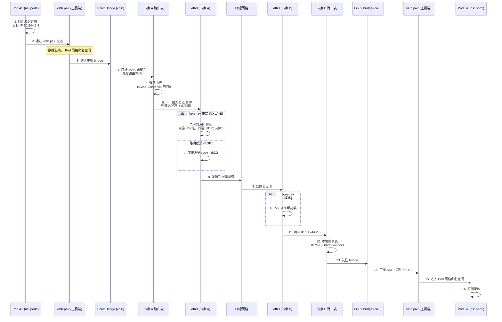

> [!abstract] 摘要
> Kubernetes 网络模型的核心设计是“每个 Pod 拥有独立 IP，所有 Pod 之间可直接通信”，这一模型由 CNI（Container Network Interface）实现。本文深入分析 Pod 网络的三大设计约束、CNI 的插件化架构、overlay 与 BGP 两种主流实现模式的数据路径与性能差异。通过拆解 veth pair、bridge、iptables 等底层网络技术，揭示 Kubernetes 网络如何在不修改应用的前提下实现跨节点容器通信。同时分析网络策略的实现原理与常见网络问题排查方法。

---

## 一、核心概念与底层图景

### 1.1 定义

> [!info] 工程定义
> Kubernetes 网络模型是一组网络设计约束，要求：
> 1. **每个 Pod 拥有独立 IP**（同一 Pod 内容器共享该 IP）
> 2. **所有 Pod 可直接通信**（无需 NAT，无论是否同节点）
> 3. **所有节点可与所有 Pod 直接通信**（节点与 Pod 间无 NAT）
> 4. **Service IP 仅集群内可达**（ClusterIP 实现负载均衡）

> [!tip] CNI 的角色
> CNI（Container Network Interface）是 Kubernetes 与网络实现之间的**契约**，定义了两个核心接口：
> - `ADD`：将容器加入网络（分配 IP、创建 veth、配置路由）
> - `DEL`：将容器从网络移除
> - `CHECK`：检查容器网络配置
> 
> Kubernetes 本身不实现网络，而是调用 CNI 插件完成上述操作。

### 1.2 架构全景图

```mermaid
graph TB
    subgraph "节点 A"
        direction TB
        KubeletA["kubelet"]
        CRI_A["CRI (containerd)"]
        CNI_A["CNI Plugin<br/>(Calico/Flannel/..."
        PodA1["Pod A1<br/>10.244.1.2"]
        PodA2["Pod A2<br/>10.244.1.3"]
        
        BridgeA["Linux Bridge / vSwitch"]
        RouteTableA["节点路由表"]
        Eth0A["eth0 (主机网卡)"]
        
        KubeletA -->|调用| CRI_A
        CRI_A -->|调用| CNI_A
        CNI_A -->|创建| PodA1
        CNI_A -->|创建| PodA2
        
        PodA1 -->|veth pair| BridgeA
        PodA2 -->|veth pair| BridgeA
        BridgeA --> RouteTableA
        RouteTableA --> Eth0A
    end
    
    subgraph "节点 B"
        direction TB
        PodB1["Pod B1<br/>10.244.2.2"]
        PodB2["Pod B2<br/>10.244.2.3"]
        BridgeB["Linux Bridge / vSwitch"]
        RouteTableB["节点路由表"]
        Eth0B["eth0 (主机网卡)"]
        
        PodB1 -->|veth pair| BridgeB
        PodB2 -->|veth pair| BridgeB
        BridgeB --> RouteTableB
        RouteTableB --> Eth0B
    end
    
    subgraph "外部"
        External["外部客户端"]
        LB["云负载均衡器"]
    end
    
    PodA1 ==overlay/BGP==> PodB2
    Eth0A <==>|物理网络| Eth0B
    External --> LB
    LB -->|NodePort| Eth0A
    LB -->|NodePort| Eth0B

    classDef node fill:#e1f5fe,stroke:#01579b
    classDef pod fill:#fff3e0,stroke:#e65100
    classDef external fill:#d1c4e9,stroke:#4a148c
    
    class KubeletA,CRI_A,CNI_A,BridgeA,RouteTableA,Eth0A,BridgeB,RouteTableB,Eth0B node
    class PodA1,PodA2,PodB1,PodB2 pod
    class External,LB external
```

> [!note] 架构要点
> - **每个 Pod 一个 veth pair**：一端在 Pod 网络命名空间，另一端在主机（通常桥接）
> - **节点作为路由器**：每个节点需知道如何到达其他节点的 Pod CIDR
> - **两种模式**：overlay（封装）和 BGP（路由）实现跨节点通信
> - **kube-proxy 独立**：负责 Service 的负载均衡规则，不参与 Pod 间通信

---

## 二、机制原理深度剖析

### 2.1 核心子模块拆解

| 子模块 | 职责 | 设计意图/为何独立 |
|--------|------|------------------|
| **veth pair** | 连接容器网络命名空间与主机网络命名空间 | Linux 原生虚拟网卡设备，一端在容器内（eth0），另一端在主机（vethXXX），实现命名空间间通信 |
| **cni0/docker0/bridge** | 同一节点上 Pod 的二层交换 | Linux bridge 设备，将节点上所有 Pod 连接在同一二层网络，实现同节点 Pod 直接通信 |
| **路由表** | 跨节点 Pod 的三层路由 | 每个节点需配置到达其他节点 Pod CIDR 的路由，下一跳为目标节点 IP |
| **隧道设备（overlay 模式）** | 封装跨节点流量 | VXLAN/IPIP/GRE 等隧道技术，将 Pod 包封装在节点间 UDP 包中，解决底层网络限制 |
| **BGP 协议（BGP 模式）** | 动态路由分发 | 通过 BGP 将 Pod CIDR 路由宣告给上游路由器，实现路由模式 |
| **iptables/ipvs** | 策略执行与 NAT | 用于 NetworkPolicy 实现和某些 CNI 的 SNAT 规则 |

### 2.2 核心流程可视化：Pod 间跨节点通信

#### 场景：Pod A1 (10.244.1.2) 访问 Pod B2 (10.244.2.3)



> [!tip] 流程关键点
> - **同节点通信**：直接通过 bridge，不经过路由，延迟极低（微秒级）
> - **跨节点通信**：必须经过节点路由决策，overlay 模式额外增加封装开销（约 10-20% 性能损失）
> - **MTU 影响**：overlay 模式需设置 MTU=1450（VXLAN 头部 50 字节），路由模式可用 1500

### 2.3 设计意图分析：为什么是“扁平 IP 空间”？

> [!question] 为什么不让 Pod 共享节点 IP + 端口映射？

**1. 应用透明性**

传统 PaaS 平台（如 Cloud Foundry）使用端口映射：每个应用占用宿主机不同端口。这要求：
- 应用必须感知自身端口（不能随意监听）
- 端口冲突管理复杂
- 无法运行标准网络服务（如 DNS 需要 53 端口）

Kubernetes 的扁平 IP 空间让 Pod 像独立虚拟机一样工作：任何端口均可使用，无需修改应用代码。

**2. 服务发现简化**

如果 Pod IP 经过 NAT，源 IP 会丢失，导致：
- 应用无法获取真实客户端 IP（日志、鉴权失效）
- 服务网格难以实现透明的流量管理
- 网络策略无法基于真实源 IP 实施

**3. 运维心智模型**

“Pod 就是轻量级 VM”的模型大幅降低运维复杂度——已有的网络工具（tcpdump、ping、traceroute）无需修改即可使用，故障排查路径与物理环境一致。

**4. 代价：IP 地址消耗**

扁平 IP 空间意味着每个 Pod 消耗一个 IP 地址。在大型集群中，这可能导致 IP 耗尽。解决方案：
- 每个节点分配一个 Pod CIDR 段（如 /24，支持 256 个 Pod）
- 节点总数受限于 IP 段规划（如 /16 集群支持 256 个节点）
- 云提供商通常支持更大的 CIDR（如 /14）或使用 IPv6

---

## 三、内核/源码级实现

### 3.1 核心数据结构：CNI 配置与网络命名空间

```go
// github.com/containernetworking/cni/pkg/types/types.go

// CNI 执行环境上下文
type CNIArgs struct {
    // 容器运行时传入的参数
    ContainerID string  // 容器 ID
    Netns       string  // 容器网络命名空间路径（/proc/[pid]/ns/net）
    IfName      string  // 容器内接口名（通常是 eth0）
    
    // 插件配置
    Conf        []byte  // CNI 配置文件内容（JSON）
    
    // 其他参数
    Args        string  // 额外参数（如 K8S_POD_NAMESPACE、K8S_POD_NAME）
    Path        string  // 插件搜索路径
}

// CNI 插件执行结果
type Result struct {
    CNIVersion string         `json:"cniVersion"`
    Interfaces []*Interface   `json:"interfaces"`  // 所有接口
    IPs        []*IPConfig    `json:"ips"`         // 分配的 IP
    Routes     []*types.Route `json:"routes"`      // 路由
    DNS        types.DNS      `json:"dns"`         // DNS 配置
}

// 接口信息
type Interface struct {
    Name    string `json:"name"`    // 接口名
    Mac     string `json:"mac"`     // MAC 地址
    Sandbox string `json:"sandbox"` // 网络命名空间路径（非空表示容器端）
}
```

### 3.2 CNI ADD 操作实现（Bridge 插件示例）

```go
// github.com/containernetworking/plugins/plugins/main/bridge/bridge.go

func cmdAdd(args *skel.CmdArgs) error {
    // 1. 解析配置文件
    conf, err := parseConfig(args.StdinData)
    
    // 2. 创建或获取 bridge 设备
    bridge, err := setupBridge(conf)
    
    // 3. 创建 veth pair
    hostVeth, containerVeth, err := setupVeth(args.Netns, args.IfName, conf.MTU)
    
    // 4. 将 veth 主机端连接到 bridge
    if err := bridge.AddVeth(hostVeth); err != nil {
        return err
    }
    
    // 5. 进入容器网络命名空间配置
    err = netns.Do(args.Netns, func(_ ns.NetNS) error {
        // 5.1 重命名容器端接口为 eth0
        if err := renameLink(containerVeth, args.IfName); err != nil {
            return err
        }
        
        // 5.2 分配 IP 地址
        ip, err := conf.IPAM.ExecAdd(args)
        if err != nil {
            return err
        }
        
        // 5.3 设置接口 up
        if err := ip.SetLinkUp(args.IfName); err != nil {
            return err
        }
        
        // 5.4 添加默认路由
        if err := ip.AddDefaultRoute(); err != nil {
            return err
        }
        
        return nil
    })
    
    // 6. 在主机上配置 IP 伪装/策略路由（如果需要）
    
    // 7. 返回结果
    return types.PrintResult(result, conf.CNIVersion)
}
```

### 3.3 Overlay 实现：VXLAN 数据包结构

```
原始 Pod 数据包（内层）：
+---------------------+
| Ethernet Header     | (14 bytes)  - 源/目的 MAC (Pod)
| IP Header           | (20 bytes)  - 源/目的 IP (Pod)
| TCP/UDP Payload     |
+---------------------+

VXLAN 封装后（外层）：
+-------------------------------------+
| Outer Ethernet Header               | (14 bytes) - 源/目的 MAC (节点)
| Outer IP Header                      | (20 bytes) - 源/目的 IP (节点)
| Outer UDP Header                      | (8 bytes)  - 源端口(哈希), 目的端口4789
| VXLAN Header                           | (8 bytes)  - VNI (VXLAN Network Identifier)
+-------------------------------------+
| Inner Ethernet Header (Pod)          | (14 bytes) - 原始帧
| Inner IP Header (Pod)                 | (20 bytes)
| Inner TCP/UDP Payload                  |
+-------------------------------------+
```

> [!important] VXLAN 关键参数
> - **VNI**：24 位标识符，每个 Kubernetes 集群通常使用唯一 VNI（如 1）
> - **UDP 目的端口**：IANA 分配 4789，Linux 默认使用此端口
> - **MTU 计算**：1500 (物理 MTU) - 50 (VXLAN 开销) = 1450 (Pod MTU)
> - **组播依赖**：传统 VXLAN 依赖组播学习 MAC，现代实现（Flannel VXLAN）使用 UDP 单播 + 控制平面分发 VTEP 信息

### 3.4 BGP 模式实现（Calico 示例）

```bash
# Calico 在节点上配置的路由表示例
$ ip route show

# 本地 Pod CIDR
10.244.1.0/24 dev calico.1 proto kernel scope link src 10.244.1.1 

# 其他节点 Pod CIDR
10.244.2.0/24 via 192.168.1.2 dev eth0 proto bird  # 节点 B
10.244.3.0/24 via 192.168.1.3 dev eth0 proto bird  # 节点 C

# BGP 会话状态（bird 客户端）
$ birdc show protocols
name     proto    table    state  since       info
device1  Device   master   up     00:00:05    
kernel1  Kernel   master   up     00:00:05    
direct1  Direct   master   up     00:00:05    
node1    BGP      master   up     00:00:04    Established   
node2    BGP      master   up     00:00:04    Established
```

---

## 四、生产落地与 SRE 实战

### 4.1 场景化案例：Overlay 网络导致跨可用区延迟过高

> [!danger] 现象
> - 应用团队反馈：跨 AZ（可用区）的服务调用延迟从 2ms 升至 15ms
> - 同 AZ 调用正常（< 1ms）
> - CPU、内存、网络带宽均未饱和

**排查链路**：

```bash
# 1. 确认网络模式
kubectl get daemonset -n kube-system calico-node -o yaml | grep -i overlay
# 发现使用 VXLAN 跨子网通信

# 2. 抓包分析
# 在源节点抓取目标节点 IP 的包
tcpdump -i any host 192.168.1.2 -w cross-az.pcap

# 用 Wireshark 分析发现：
# - 所有跨 AZ 包都是 VXLAN 封装
# - 每个请求-响应往返增加两次封装/解封装
# - 物理链路延迟 1ms，封装增加 4ms（单次）

# 3. 检查 MTU 设置
ip link show | grep mtu
# eth0: mtu 1500
# vxlan.calico: mtu 1450

# 4. 发现跨 AZ 物理链路 MTU 为 1400（运营商限制）
# 导致 VXLAN 包（1450）> 物理 MTU（1400），触发 IP 分片
# 分片重组增加额外延迟
```

> [!bug] 根因
> 跨 AZ 链路的物理 MTU 小于 VXLAN 封装后的包大小（1450 > 1400），导致：
> 1. 出方向包被分片（每个包分成 2 个）
> 2. 入方向需重组（消耗 CPU 并增加延迟）
> 3. 分片丢失概率增加（任一碎片丢失导致整个包重传）

**解决方案**：

```yaml
# 方案一：降低 VXLAN MTU（立即生效）
apiVersion: projectcalico.org/v3
kind: FelixConfiguration
metadata:
  name: default
spec:
  vxlanMTU: 1350  # 从 1450 降低，确保小于物理 MTU(1400)
```

```yaml
# 方案二：切换到 BGP 路由模式（长期）
# 修改 Calico 配置，禁用 overlay
apiVersion: projectcalico.org/v3
kind: Installation
metadata:
  name: default
spec:
  calicoNetwork:
    bgp: Enabled
    ipPools:
    - cidr: 10.244.0.0/16
      encapsulation: None  # 禁用 VXLAN/IPIP
```

```bash
# 验证修复
# 抓包确认不再有分片
tcpdump -i any -s 0 -n -v 'host 192.168.1.2 and ip[6:2] & 0x3fff != 0'
# 无输出表示无分片
```

### 4.2 参数调优矩阵

| 参数名 | 作用域 | 推荐值 | 内核解释 |
|--------|--------|--------|---------|
| `--mtu` | CNI 配置 | 1450 (overlay), 1500 (路由) | Pod 网络接口 MTU。overlay 需预留封装头部空间，设置不当导致分片。 |
| `veth.mtu` | 内核参数 | 同 CNI MTU | 主机端 veth 设备 MTU，需与 Pod 端一致。 |
| `net.ipv4.ip_forward` | 节点 sysctl | 1 | 启用 IP 转发，节点作为路由器必须开启。 |
| `net.bridge.bridge-nf-call-iptables` | 节点 sysctl | 1 | 允许 bridge 流量经过 iptables，NetworkPolicy 依赖此设置。 |
| `net.ipv4.neigh.default.gc_thresh*` | 节点 sysctl | 1024/4096/8192 | ARP 表大小，大规模集群需调高防止邻居表溢出。 |
| `conntrack_max` | 节点 sysctl | 262144 | 连接跟踪表大小，高并发 Service 需调高。 |

### 4.3 监控与诊断命令

**Pod 网络命名空间调试**：

```bash
# 进入 Pod 网络命名空间
# 获取 Pod PID
POD_PID=$(kubectl exec <pod> -- cat /proc/1/status | grep -i pid | awk '{print $2}')
# 进入命名空间
nsenter -t $POD_PID -n ip addr show

# 直接通过 crictl 获取容器 PID
CONTAINER_ID=$(crictl ps | grep <pod> | awk '{print $1}')
crictl inspect $CONTAINER_ID | grep pid
nsenter -t <PID> -n ip route show
```

**抓包诊断**：

```bash
# 抓取 Pod 内流量（从主机端抓 veth）
# 找到 Pod 对应的 veth
ethtool -S eth0 | grep peer_ifindex  # 在 Pod 内执行
# 或在主机上
ip link | grep -B1 "link/ether <pod-mac>"

# 在主机端抓 veth
tcpdump -i vethXXXX -n

# 抓取节点间封装后流量
tcpdump -i eth0 -n 'udp port 4789'  # VXLAN
tcpdump -i eth0 -n 'ip proto 4'      # IPIP
```

**连通性排查**：

```bash
# 测试 Pod 到 Pod 连通性（需容器内有 ping）
kubectl exec pod-a -- ping -c 3 10.244.2.3

# 测试节点到 Pod 连通性
# 在节点上直接 ping Pod IP
ping -c 3 10.244.1.2

# 如果 ping 不通但业务正常，可能是 ICMP 被 NetworkPolicy 阻断

# 跟踪路由路径
kubectl exec pod-a -- traceroute -n 10.244.2.3
# 第一跳通常是 bridge（同节点）或宿主机 IP（跨节点）
```

### 4.4 故障排查决策树

```mermaid
mindmap
  root((Pod 网络故障))
    Pod 无法访问同节点 Pod
      检查 Pod 内网络接口
        kubectl exec pod -- ip addr show
        eth0 是否存在，是否有 IP
      检查 veth pair
        主机端 ip link show | grep veth
        veth 状态是否为 UP
      检查 bridge
        brctl show (若使用 bridge)
        bridge fdb show | grep <pod-mac>
    
    Pod 无法访问跨节点 Pod
      检查节点间连通性
        ping <目标节点 IP>
        telnet <目标节点 IP> 4789 (VXLAN 端口)
      检查节点路由表
        ip route get 10.244.2.3
        输出应有 via 目标节点 IP
      检查 overlay 隧道
        ip link show | grep -E "vxlan|tunl"
        隧道设备状态 UP
    
    Pod 无法访问 Service
      检查 kube-proxy 规则
        iptables-save | grep <service-ip>
        ipvsadm -L -n (若使用 IPVS)
      检查 conntrack
        conntrack -L | grep <service-ip>
        conntrack 表是否满
      检查 endpoint 是否存在
        kubectl get endpoints <service>
        endpoints 中有 Pod IP
    
    网络延迟高/丢包
      检查 MTU 分片
        tcpdump -i any -s 0 'ip[6:2] & 0x3fff != 0'
        若有输出表示发生分片
      检查网络策略日志
        calico/node 日志 (iptables 日志)
      检查节点 conntrack 满
        sysctl net.netfilter.nf_conntrack_count
        net.netfilter.nf_conntrack_max 是否接近
```

---

## 五、技术演进与未来视角（2026+）

### 5.1 历史设计约束与改进

| 版本 | 变化 | 动因/解决的问题 |
|------|------|----------------|
| Kubernetes v1.0 | 依赖 Docker 网络（--net=host） | 早期无标准化网络接口 |
| v1.3 (2016) | CNI 成为默认网络接口 | 引入插件化架构，社区爆发式创新 |
| v1.5 (2016) | NetworkPolicy API Beta | 首次提供 Kubernetes 原生网络策略 |
| v1.7 (2017) | IPVS 模式 GA | 解决 iptables 在大规模 Service 下的性能问题 |
| v1.12 (2018) | 拓扑感知路由 Alpha | 优化跨可用区流量，避免跨 AZ 收费 |
| v1.24 (2022) | 移除 Dockershim | 所有运行时均需支持 CNI |
| v1.27 (2023) | 非特权端口绑定 | 允许 Pod 绑定 <1024 端口无需 root |

### 5.2 2026 年仍存在的“遗留设计”

> [!warning] 1. **NetworkPolicy 实现碎片化**
> - CNI 插件各自实现 NetworkPolicy，语义不一致
> - iptables 实现（Calico）与 eBPF 实现（Cilium）策略行为有细微差异
> - 官方缺乏端到端的策略一致性测试

> [!warning] 2. **IPv4 地址耗尽**
> - 每个 Pod 一个 IP 的模型在大规模集群下面临压力
> - 即使使用 /16 段（65536 个 IP），也仅支持约 200 个节点（/24 每节点）
> - IPv6 普及缓慢，多数云环境仍以 IPv4 为主

> [!warning] 3. **Service 负载均衡的非均匀分布**
> - iptables 随机选择，可能因连接复用导致负载不均
> - IPVS 使用哈希，同样可能因哈希碰撞导致不均
> - 需配合拓扑感知（Topology Aware Hints）优化

### 5.3 未来趋势

> [!idea] **1. eBPF 取代 iptables**
> - Cilium 基于 eBPF 实现网络策略、负载均衡、可观测性
> - 性能提升：无需遍历 iptables 链，直接内核态转发
> - 2026 年预计多数新集群将默认使用 eBPF 数据平面

> [!idea] **2. 无 overlay 大规模部署**
> - 云厂商支持 Pod CIDR 直接路由（AWS VPC CNI、Azure CNI）
> - 节点作为路由器，无需封装，性能接近裸金属
> - 限制：Pod IP 消耗 VPC IP 地址，需规划

> [!idea] **3. 拓扑感知调度**
> - 调度器结合网络拓扑（可用区、机架）放置 Pod
> - 服务网格（Istio）与网络策略联动
> - 实现真正的“网络感知调度”

> [!idea] **4. 硬件卸载**
> - DPU/IPU 将网络策略、封装卸载至硬件
> - CPU 零消耗处理 Pod 网络流量
> - 适用于 NFV、高性能计算场景

> [!quote] 结语
> Kubernetes 网络模型的设计看似简单（每个 Pod 一个 IP），实则解决了分布式系统中服务发现的根本问题。经过十年演进，从 iptables 到 eBPF，从 overlay 到路由模式，性能提升了两个数量级，但核心抽象始终未变。**未来，网络将成为调度的一部分，而不仅仅是连接。**