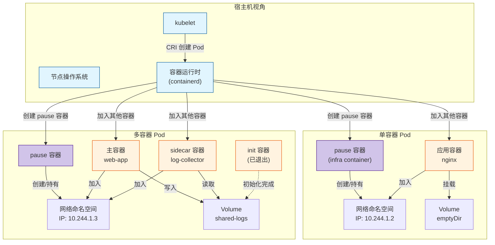
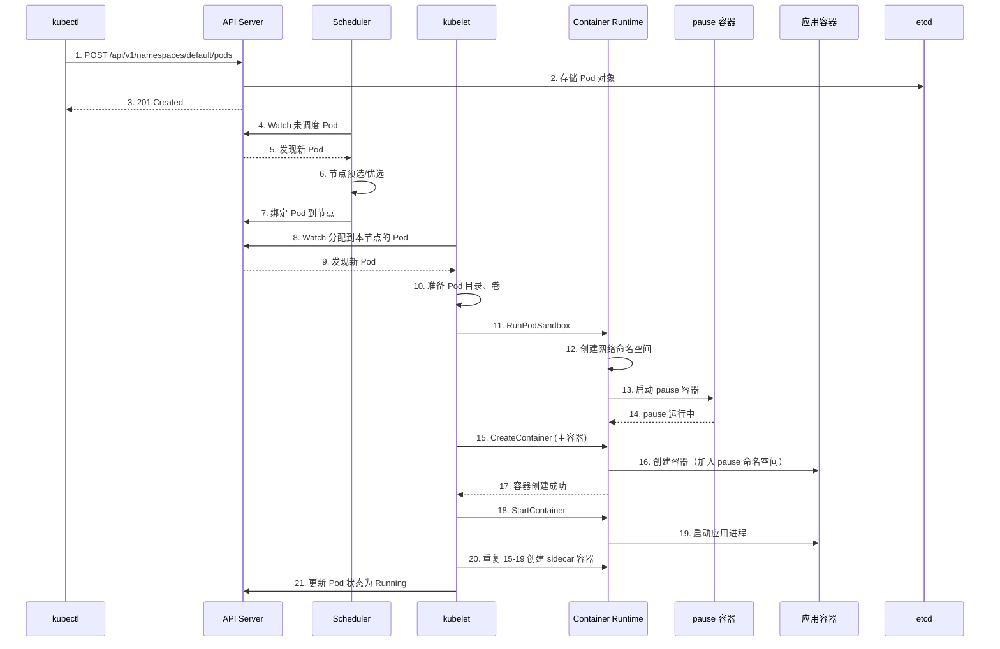
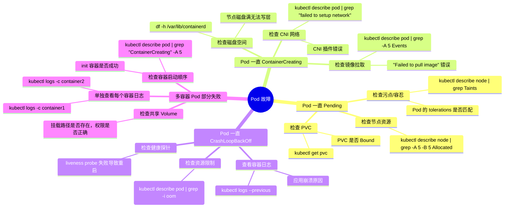

> [!abstract] 摘要
> Kubernetes 的最小调度单元是 Pod 而非容器，这一设计决策深刻影响了整个系统的架构。本文深入分析 Pod 作为抽象层的设计意图：资源共享、生命周期耦合、健康检查单元、以及 IP 分配的最小粒度。通过拆解 Pod 的 pause 容器原理、共享网络命名空间的实现、以及资源 requests/limits 的聚合计算，揭示 Pod 如何在不增加复杂性的前提下，为多容器协作场景提供“超能力”。同时分析单容器 Pod 与多容器 Pod 的适用场景及设计权衡。

---

## 一、核心概念与底层图景

### 1.1 定义

> [!info] 工程定义
> Pod 是 Kubernetes 中**最小的部署和调度单元**，是一个或多个容器的集合。这些容器共享：
> - **网络命名空间**（同一 IP 和端口空间）
> - **IPC 命名空间**（可通过共享内存通信）
> - **UTS 命名空间**（相同主机名）
> - **Volume**（共享存储卷）
>
> Pod 内的容器被调度到同一节点，作为一个原子单元启动和停止。

> [!quote] 设计哲学
> “Pod 是一个‘逻辑主机’——容器是进程，Pod 是它们运行的机器。” —— 这一抽象让容器间的协作模式从网络通信降级为本地 IPC，大幅简化应用设计。

### 1.2 架构全景图



> [!note] 架构要点
> - **pause 容器**：每个 Pod 的第一个容器，负责创建并持有网络命名空间
> - **容器加入**：其他容器通过 `setns()` 系统调用加入 pause 容器的命名空间
> - **Pod 生命周期**：kubelet 以 Pod 为单位管理容器（创建、健康检查、停止）
> - **IP 分配**：IP 分配给 pause 容器，所有应用容器共享

---

## 二、机制原理深度剖析

### 2.1 核心子模块拆解

| 子模块 | 职责 | 设计意图/为何独立 |
|--------|------|------------------|
| **pause 容器** | 创建并持有网络命名空间、PID 1 角色 | 作为命名空间的“锚点”，即使主容器崩溃，命名空间仍存在，新容器可加入 |
| **Pod 沙箱** | CRI 中的 PodSandbox 概念 | 将“Pod 级资源”与“容器级资源”分离，支持不同运行时实现 |
| **共享网络** | 容器间通过 localhost 通信 | 将跨容器通信从网络 IPC 降级为本地 IPC，消除序列化开销 |
| **共享存储** | Pod 级 Volume，所有容器可挂载 | 支持文件交换、日志收集等 sidecar 模式 |
| **资源聚合** | Pod 的资源 requests/limits 是各容器之和 | 调度器以 Pod 为单位分配资源，保证节点有足够容量 |
| **健康探针** | 以 Pod 为单位判断 readiness/liveness | 所有容器均就绪，Pod 才对外服务；任一容器失败，Pod 整体重启策略生效 |

### 2.2 核心流程可视化：Pod 创建全过程



> [!tip] 流程关键点
> - **顺序性**：先创建 Pod 沙箱（pause），后创建应用容器
> - **原子性**：只有所有容器均启动成功，Pod 状态才变为 Running
> - **重启语义**：容器崩溃时，kubelet 根据 restartPolicy 重启容器，pause 容器始终存活

### 2.3 设计意图分析：为什么需要 Pod？

> [!question] 为什么不让用户直接部署容器？

**1. 资源共享 —— 本地通信 vs 网络通信**

假设有一个应用需要两个容器：web 服务器和日志收集器。如果直接部署两个独立容器：
- 它们必须在不同节点（调度器无法保证同节点）
- 通信需通过网络（延迟高、安全策略复杂）
- 无法共享文件（日志收集器需读取 web 容器日志）

使用 Pod 后：
- 保证同节点
- 共享 localhost 网络（延迟趋近于零）
- 共享 Volume（日志文件直接可见）

**2. 生命周期耦合 —— 一起启动，一起停止**

某些容器必须同时存在：
- **sidecar 模式**：服务网格代理必须与应用容器共存
- **适配器模式**：将应用日志格式转换为标准格式的容器
- **大使模式**：代理外部服务的容器

Pod 保证这些容器同时调度、同时存在、同时消亡。

**3. 资源管理的原子性**

调度器以 Pod 为单位分配资源：
- 如果直接调度容器，可能出现容器 A 在节点 1，容器 B 在节点 2，但节点 1 的容器 A 需要访问节点 2 容器 B 的 Volume，这不可行
- Pod 模型将资源聚合计算，保证单个节点能满足 Pod 所有容器的资源需求

**4. 健康检查的单元化**

Liveness 探针以容器为单位，但 readiness 以 Pod 为单位：
- 只有所有容器均 ready，Pod 的 IP 才加入 Service 端点列表
- 任一容器失败，Pod 整体被移出负载均衡
- 这种“木桶效应”保证了服务的整体可用性

**5. IP 分配的效率**

如果每个容器独立 IP：
- 大规模集群 IP 消耗翻倍
- 每个容器需要独立的安全策略管理
- 应用间的服务发现复杂度增加

Pod 共享 IP 让“一组容器”对外表现为一个服务实体。

---

## 三、内核/源码级实现

### 3.1 核心数据结构：Pod 对象定义

```go
// k8s.io/api/core/v1/types.go

// Pod 是 Kubernetes 中最小部署单元
type Pod struct {
    metav1.TypeMeta `json:",inline"`
    // 标准对象元数据
    metav1.ObjectMeta `json:"metadata,omitempty" protobuf:"bytes,1,opt,name=metadata"`
    
    // Spec 定义 Pod 的期望状态
    Spec PodSpec `json:"spec,omitempty" protobuf:"bytes,2,opt,name=spec"`
    
    // Status 反映 Pod 的实际状态
    Status PodStatus `json:"status,omitempty" protobuf:"bytes,3,opt,name=status"`
}

// PodSpec - Pod 的详细定义
type PodSpec struct {
    // 容器列表（必填）
    Containers []Container `json:"containers" protobuf:"bytes,2,rep,name=containers"`
    
    // Init 容器列表（可选）
    InitContainers []Container `json:"initContainers,omitempty" protobuf:"bytes,20,rep,name=initContainers"`
    
    // 重启策略：Always, OnFailure, Never
    RestartPolicy RestartPolicy `json:"restartPolicy,omitempty" protobuf:"bytes,3,opt,name=restartPolicy,casttype=RestartPolicy"`
    
    // 终止宽限期（秒）
    TerminationGracePeriodSeconds *int64 `json:"terminationGracePeriodSeconds,omitempty" protobuf:"varint,4,opt,name=terminationGracePeriodSeconds"`
    
    // 节点选择器（调度约束）
    NodeSelector map[string]string `json:"nodeSelector,omitempty" protobuf:"bytes,7,rep,name=nodeSelector"`
    
    // 服务账户名
    ServiceAccountName string `json:"serviceAccountName,omitempty" protobuf:"bytes,8,opt,name=serviceAccountName"`
    
    // 节点名（调度后由 scheduler 填充）
    NodeName string `json:"nodeName,omitempty" protobuf:"bytes,10,opt,name=nodeName"`
    
    // Pod 级卷列表
    Volumes []Volume `json:"volumes,omitempty" protobuf:"bytes,1,rep,name=volumes"`
    
    // 容器运行时类
    RuntimeClassName *string `json:"runtimeClassName,omitempty" protobuf:"bytes,21,opt,name=runtimeClassName"`
}

// PodStatus - Pod 运行时状态
type PodStatus struct {
    // Pod 阶段：Pending, Running, Succeeded, Failed, Unknown
    Phase PodPhase `json:"phase,omitempty" protobuf:"bytes,1,opt,name=phase,casttype=PodPhase"`
    
    // Pod IP（集群内可路由）
    PodIP string `json:"podIP,omitempty" protobuf:"bytes,2,opt,name=podIP"`
    
    // 节点 IP
    HostIP string `json:"hostIP,omitempty" protobuf:"bytes,5,opt,name=hostIP"`
    
    // 容器状态列表
    ContainerStatuses []ContainerStatus `json:"containerStatuses,omitempty" protobuf:"bytes,6,rep,name=containerStatuses"`
    
    // 各容器是否就绪
    Conditions []PodCondition `json:"conditions,omitempty" patchStrategy:"merge" patchMergeKey:"type" protobuf:"bytes,8,rep,name=conditions"`
    
    // 启动时间
    StartTime *metav1.Time `json:"startTime,omitempty" protobuf:"bytes,7,opt,name=startTime"`
}
```

### 3.2 pause 容器源码分析

```go
// k8s.io/kubernetes/build/pause/linux/pause.c

// pause 容器的核心代码
// 编译后仅 100KB 左右，几乎不占资源
#include <signal.h>
#include <stdio.h>
#include <stdlib.h>
#include <unistd.h>

static void sigdown(int signo) {
    psignal(signo, "shutting down due to signal");
    exit(0);
}

static void sigreap(int signo) {
    // 收割僵尸进程（如果主容器遗留子进程）
    while (waitpid(-1, NULL, WNOHANG) > 0);
}

int main(int argc, char **argv) {
    int i;
    
    // 1. 设置信号处理
    signal(SIGINT, sigdown);   // Ctrl+C 时退出
    signal(SIGTERM, sigdown);  // 终止信号时退出
    signal(SIGCHLD, sigreap);  // 子进程退出时收割
    
    // 2. 创建 /etc/hosts, /etc/resolv.conf 等文件
    // 这些文件会被共享给 Pod 内其他容器
    for (i = 1; i < argc; i++) {
        if (!strcmp(argv[i], "-c")) {
            // 如果有子命令，执行（通常没有）
        }
    }
    
    // 3. 无限休眠，保持命名空间存活
    fprintf(stderr, "Pause loop, sleeping forever\n");
    while (1) {
        sleep(1000000);  // 长睡眠，不占 CPU
    }
    
    return 0;
}
```

> [!important] pause 容器的关键作用
> - **命名空间持有者**：即使主应用崩溃，命名空间仍存在
> - **PID 1 角色**：负责收割僵尸进程（主容器可能遗留子进程）
> - **资源共享**：pause 创建的 `/etc/hosts` 等文件被共享
> - **极小资源**：仅几 KB 内存，0% CPU

### 3.3 资源聚合计算

```go
// k8s.io/kubernetes/pkg/api/v1/resource/helpers.go

// 计算 Pod 的总资源需求
func PodRequestsAndLimits(pod *Pod) (reqs, limits ResourceList) {
    reqs = ResourceList{}
    limits = ResourceList{}
    
    // 1. 遍历所有 Init 容器
    // 取 Init 容器资源请求的最大值（因为它们串行执行）
    for _, container := range pod.Spec.InitContainers {
        // 逐个资源类型比较（CPU、内存）
        for name, quantity := range container.Resources.Requests {
            // 取最大值
            maxQuantity := max(reqs[name], quantity)
            reqs[name] = maxQuantity
        }
        // 同理处理 limits
    }
    
    // 2. 遍历所有普通容器
    // 普通容器的资源请求是累加值（并行执行）
    for _, container := range pod.Spec.Containers {
        for name, quantity := range container.Resources.Requests {
            // 累加
            addQuantity := add(reqs[name], quantity)
            reqs[name] = addQuantity
        }
        // 同理累加 limits
    }
    
    return reqs, limits
}

// 调度器使用这个计算结果判断节点是否满足 Pod 需求
// 示例：
// - init 容器: CPU 请求 500m
// - 容器1: CPU 请求 1000m
// - 容器2: CPU 请求 500m
// Pod 总 CPU 请求 = max(500m) + 1000m + 500m = 2000m
```

---

## 四、生产落地与 SRE 实战

### 4.1 场景化案例：Sidecar 容器导致 Pod 启动超时

> [!danger] 现象
> - 新版本发布后，Pod 启动时间从 5s 延长至 60s+
> - Readiness 探针反复失败
> - 滚动更新卡住，新 Pod 无法进入 Ready 状态

**排查链路**：

```bash
# 1. 查看 Pod 事件
kubectl describe pod <pod>

# 发现：
# - 应用容器启动快（5s 内）
# - sidecar 容器（日志收集器）启动需下载大模型文件（50s）
# - 应用容器启动后立即开始 readiness 探测，但因 sidecar 未 ready 而失败

# 2. 检查 Pod 状态
kubectl get pod <pod> -o yaml | grep -A 5 -B 5 containerStatuses

# 输出：
# - 应用容器状态: running, ready=false
# - sidecar 容器状态: running, ready=false (仍在初始化)

# 3. 查看 sidecar 容器日志
kubectl logs <pod> -c sidecar

# 发现首次启动需下载 500MB 模型文件
# "Downloading model from s3://... (500MB)"
```

> [!bug] 根因
> Pod 的 readiness 是所有容器 readiness 的“与”操作：
> - 应用容器 5s 后 ready
> - sidecar 容器 50s 后才 ready（下载完成）
> - 导致 Pod 整体在 50s 内处于 NotReady 状态
> - 滚动更新策略的 `maxSurge` 和 `maxUnavailable` 因新 Pod 未 ready 而阻塞

**解决方案**：

```yaml
# 方案一：调整 readinessProbe，容忍 sidecar 延迟（临时）
apiVersion: v1
kind: Pod
spec:
  containers:
  - name: sidecar
    # ... 其他配置
    readinessProbe:
      exec:
        command:
        - cat
        - /tmp/initialized  # sidecar 完成初始化后创建该文件
      initialDelaySeconds: 45  # 等待 45s 才开始探测
      periodSeconds: 5
```

```yaml
# 方案二：使用 initContainer 预加载模型（推荐）
apiVersion: v1
kind: Pod
spec:
  initContainers:
  - name: model-loader
    image: sidecar:latest
    command: ["/bin/sh", "-c"]
    args:
      - |
        # 下载模型到共享 volume
        wget -O /data/model.bin https://s3.amazonaws.com/model.bin
    volumeMounts:
    - name: model-cache
      mountPath: /data
  containers:
  - name: sidecar
    image: sidecar:latest
    # 直接使用已下载的模型
    volumeMounts:
    - name: model-cache
      mountPath: /data
    # readinessProbe 可立即通过
    readinessProbe:
      exec:
        command:
        - test
        - -f
        - /data/model.bin
  volumes:
  - name: model-cache
    emptyDir: {}
```

```bash
# 验证修复
kubectl get pod -w

# Pod 启动时间恢复至 10s 内
# 应用容器和 sidecar 几乎同时进入 ready 状态
```

### 4.2 参数调优矩阵

| 参数名 | 作用域 | 推荐值 | 内核解释 |
|--------|--------|--------|---------|
| `terminationGracePeriodSeconds` | Pod spec | 30s（默认） | Pod 收到 SIGTERM 后的宽限期，超时后强制 SIGKILL。需考虑容器优雅关闭时间。 |
| `restartPolicy` | Pod spec | Always（默认） | 容器退出后重启策略。OnFailure 适用于 Job，Never 适用于一次性任务。 |
| `shareProcessNamespace` | Pod spec | false | 是否让 Pod 内容器共享 PID 命名空间。开启后可互相 `kill` 信号，但增加安全风险。 |
| `automountServiceAccountToken` | Pod spec | true | 是否自动挂载 ServiceAccount token。无需访问 API 的 Pod 应设为 false。 |
| `dnsPolicy` | Pod spec | ClusterFirst | DNS 解析策略。Default 从节点继承，None 自定义 dnsConfig。 |
| `enableServiceLinks` | Pod spec | true | 是否将 Service 环境变量注入 Pod。大规模集群可关闭减少 env 爆炸。 |

### 4.3 监控与诊断命令

**Pod 内调试**：

```bash
# 进入 Pod 共享网络命名空间
kubectl exec -it <pod> -c <container> -- /bin/sh

# 查看所有容器（包括 pause）
crictl pods | grep <pod>
crictl ps -a | grep <pod-pod-id>

# 直接查看 pause 容器资源
# 获取 pause 容器 ID
PAUSE_ID=$(crictl ps -a | grep <pod> | grep pause | awk '{print $1}')
crictl inspect $PAUSE_ID | grep -A 10 namespace
```

**资源使用诊断**：

```bash
# 查看 Pod 内各容器资源使用
kubectl top pod <pod> --containers

# 输出：
# POD           NAME         CPU(cores)   MEMORY(bytes)
# my-pod        app          2m           128Mi
# my-pod        sidecar      1m           256Mi
# my-pod        pause        0m           2Mi     # pause 几乎不占资源

# 查看容器内进程
kubectl exec <pod> -c app -- ps aux
# 若 shareProcessNamespace=true，可看到所有容器的进程
```

**Pod 状态转换分析**：

```bash
# 查看 Pod 状态变化历史
kubectl get events --field-selector involvedObject.kind=Pod,involvedObject.name=<pod>

# 重点关注：
# - Scheduled: 调度成功
# - Pulled: 镜像拉取完成
# - Created: 容器创建
# - Started: 容器启动
# - Killing: 容器被终止
```

### 4.4 故障排查决策树



---

## 五、技术演进与未来视角（2026+）

### 5.1 历史设计约束与改进

| 版本 | 变化 | 动因/解决的问题 |
|------|------|----------------|
| Kubernetes v1.0 | Pod 概念引入，无 pause 容器 | 早期直接使用 Docker link，无法完全隔离 |
| v1.1 (2015) | pause 容器引入 | 解决网络命名空间生命周期问题 |
| v1.3 (2016) | Init 容器引入 | 支持初始化任务与主容器分离 |
| v1.6 (2017) | 支持共享 PID 命名空间 | 允许容器间互相信号通信（如 nginx reload） |
| v1.10 (2018) | PodSecurityPolicy GA | 集中控制 Pod 安全配置 |
| v1.18 (2020) | Ephemeral Containers Alpha | 支持在运行中 Pod 添加临时调试容器 |
| v1.25 (2022) | PodSecurityPolicy 移除 | 被 Pod Security Standards 替代 |
| v1.27 (2023) | Sidecar 容器 Beta | 原生支持 sidecar 生命周期管理（启动顺序、退出顺序） |

### 5.2 2026 年仍存在的“遗留设计”

> [!warning] 1. **共享 PID 默认关闭**
> - 即使开启 shareProcessNamespace，容器仍以不同用户运行，信号传递受限
> - 原因：安全考虑，防止容器互相干扰

> [!warning] 2. **Init 容器与普通容器资源竞争**
> - Init 容器阶段，普通容器尚未启动，但节点资源已被 Init 容器占用
> - 可能导致资源碎片，调度器难以精确预估

> [!warning] 3. **Pod 内无资源隔离**
> - Pod 内多个容器共享 cgroup，无法限制单个容器的突发资源使用
> - 一个容器的内存泄露可能影响同 Pod 其他容器

### 5.3 未来趋势

> [!idea] **1. Sidecar 生命周期管理**
> - Kubernetes v1.28+ 增强 sidecar 容器语义
> - 可指定启动顺序、退出顺序（sidecar 最后退出）
> - 解决日志收集器在应用退出前完成日志刷新的问题

> [!idea] **2. Pod 内资源隔离增强**
> - 支持容器级别的 resource isolation（Cgroup v2）
> - 限制单个容器的突发资源使用，防止“吵闹邻居”

> [!idea] **3. 异构 Pod**
> - 同一 Pod 内可混合 Linux 容器 + Windows 容器（目前不可能）
> - 用于边缘计算、混合 OS 应用场景

> [!idea] **4. Pod 资源预测**
> - 基于历史数据预测 Pod 资源需求
> - 调度器动态调整资源分配，提高节点利用率

> [!quote] 结语
> Pod 是 Kubernetes 最核心的抽象，它的设计体现了“关注点分离”的思想——将调度单元、资源共享单元、生命周期单元统一为一个概念。十年间，Pod 的定义几乎没有变化，但围绕它的功能不断增强：init 容器、sidecar 容器、临时容器、Pod 安全标准。**未来，Pod 仍将作为原子单元存在，但内部的组合方式将更加灵活、安全、可观测。**