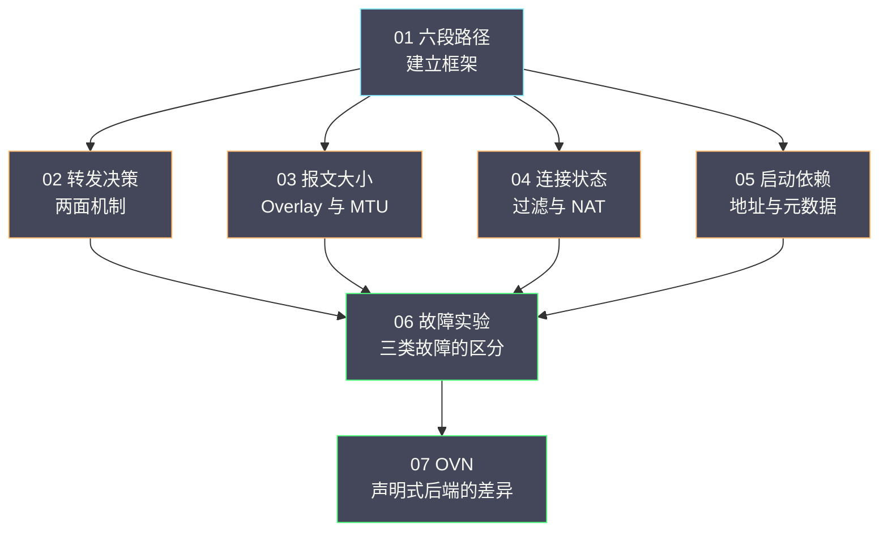

# 00 专栏导览：云网络数据面与故障定位

**摘要：**

本专栏建立「掌握报文路径、能解释控制面配置如何影响实际通信」的能力：七篇正文依次回答报文经过哪些跳、转发决策如何做出、报文大小如何成为故障源、连接为何被拒绝或被丢弃、虚机启动依赖哪些环节、如何用受控实验验证判断、以及声明式后端下排查入口如何变化。全专栏的主线是「先看清路径、再定位维度、最后在约束下验证」，与既有的 OpenStack Neutron 专栏互补而不重复。本文给出专栏定位、读者画像、七篇导读、两条阅读路径、与相邻专栏的分工，以及一张结构图。

---

## 第 1 章 专栏定位

### 1.1 要解决的问题

云网络排障有一个典型困境：**控制面上的配置看起来都是对的，但流量就是不通**。这个困境的根源是「配置与转发之间隔着若干层转换」——声明、编译、下发、落地，任何一层断裂都会表现为同一个症状。

**本专栏要建立的能力是：把「不通」这个笼统症状，拆成「哪一段、哪个方向、哪种大小、什么状态」**。它不追求覆盖网络的全部知识，而是聚焦「当流量不通时，知道该看哪一层、以及为什么」。

### 1.2 与相邻专栏的分工

本专栏与 OpenStack Neutron 专栏关系最近，分工需要说清楚。

| 相邻专栏 | 它讲什么 | 本专栏讲什么 |
| :--- | :--- | :--- |
| [[云原生/OpenStack/06 Neutron 架构——ML2、OVS 与网络命名空间\|06 Neutron 架构]] | 组件架构、对象模型、数据面概述 | 报文路径的逐跳机制与可观测点 |
| [[云原生/OpenStack/07 Neutron 进阶——VXLAN、DVR 与安全组\|07 Neutron 进阶]] | VXLAN 原理、DVR、安全组与 QoS 配置 | Overlay 与 MTU 的故障机制、连接状态与异常 |
| [[Linux/网络协议栈与IO/00 专栏导览\|Linux 网络协议栈与 IO]] | 单机协议栈与 IO 多路复用 | 跨机的报文路径与故障定位 |
| [[SRE/CVM集群可靠性工程/01 CVM 服务地图——用户操作、控制面与数据面依赖\|CVM 服务地图]] | 跨组件的依赖与恢复 | 网络数据面的机制细节 |
| [[Linux/KVM虚拟化与性能工程/04 virtio 与 vhost——虚拟磁盘、网卡的 IO 路径和队列\|04 virtio 与 vhost]] | 虚拟设备的 IO 路径与队列 | 报文离开虚机之后的路径 |

**一句话概括分工**：**OpenStack 专栏讲「架构与配置」，本专栏讲「路径与定位」**。

### 1.3 与其他专栏的连接点

| 连接点 | 相关篇目 |
| :--- | :--- |
| 虚机网络后端与队列 | [[Linux/KVM虚拟化与性能工程/04 virtio 与 vhost——虚拟磁盘、网卡的 IO 路径和队列\|04 virtio 与 vhost]] |
| 共享故障域与恢复顺序 | [[SRE/CVM集群可靠性工程/05 共享故障域——网络、存储和控制面同时异常时的恢复顺序\|05 共享故障域]] |
| 故障取证自动化 | [[SRE/CVM集群可靠性工程/08 运维工程化——巡检、维护预检、SLO 与故障取证自动化\|08 运维工程化]] |
| 指标与告警设计 | [[可观测/指标/00 专栏导览\|指标专栏]] |
| 性能实验方法 | [[Linux/KVM虚拟化与性能工程/06 虚拟化性能实验——基线、干扰负载与跨 Guest-Host 定位\|06 虚拟化性能实验]] |

## 第 2 章 读者画像

### 2.1 适合谁

**适合三类读者**：需要定位虚机网络故障的运维与 SRE；需要理解「控制面配置如何影响转发」的平台工程师；以及需要在云环境里排查网络问题的应用与开发人员。

### 2.2 需要什么前置知识

**需要基础**：TCP/IP 与以太网的基本概念；虚拟化「虚机网络由宿主机软件交换机实现」这个基本事实；以及基本的抓包与命令行使用能力。

**不需要**：不需要网络设备厂商的专业知识，也不需要协议实现细节。**本专栏关注的是机制与判据，而不是协议规范**。

### 2.3 读完之后能做什么

**能回答的问题包括**：为什么本机通跨机不通；为什么小包通大包不通；为什么连接偶尔失败；为什么虚机启动后配置没生效；以及为什么改了配置但行为没变。

**不能替代的**：不能替代现场经验与实测。**本专栏给的是框架与判据，具体数值必须实测**。

## 第 3 章 七篇导读

### 3.1 01 从虚机网卡到物理交换机

建立全专栏的基础框架：**六段路径**（虚机内、tap 与 qbr、集成桥、隧道、物理网络、对端）与**每段的可观测点**。**核心判据是「抓包位置决定看到什么」**，以及「分段法的结论形式是某一跳有、下一跳没有」。

### 3.2 02 OVS 的接口、端口、流表与 datapath

讲清 OVS 的**两面机制**：控制面流表（设计意图）与数据面缓存（实际行为），以及连接跟踪（连接状态）。**核心认知是「流表正确但流量不通」是可能的**，因为缓存未失效。

### 3.3 03 Overlay 网络

讲清封装的连锁反应：**路径 MTU 为何可能失效、分片发生在内层还是外层、卸载与封装如何交互**。**核心认知是「小包通大包不通」的阈值是稳定的**，这是与丢包问题的关键区分。

### 3.4 04 安全组、conntrack、NAT 与连接异常

讲清三个功能**共用一套状态**的事实：安全组按状态放行、NAT 按记录改写、连接跟踪负责记录。**核心认知是「连接跟踪是有状态、有容量、有超时的机制」**，三个陷阱都源于此。

### 3.5 05 DHCP、Metadata 与 cloud-init

讲清**启动依赖链**：拿到地址、拿到元数据、完成初始化。**核心认知是「症状与根因会错位」**——初始化失败的根因可能在网络。

### 3.6 06 网络故障实验

把前五篇的判据变成事实：**三类典型故障的复现与区分方法**（单向不通、小包通大包不通、跨宿主机不通）。**核心认知是「三类故障都是部分不通，必须用对比而不是检查」**。

### 3.7 07 OVN

讲清**声明式后端下的排查入口变化**：从「读流表」转向「读声明与映射」。**核心认知是「看交换机流表在 OVN 下不再是有效起点」**。

## 第 4 章 两条阅读路径

### 4.1 应急路径

**当手头有一条不通的流量时**，按以下顺序读：

1. **01 篇**：确认现象属于哪一类（本机通跨机不通、小包通大包不通、单向不通）。
2. **03 或 04 篇**：按现象选择（大小类、连接类）。
3. **06 篇**：用对比方法定位，必要时用实验确认。

**这条路径的目标是「尽快定位」**，因此跳过了机制细节，只取判据与观测方法。

### 4.2 系统路径

**当需要建立完整能力时**，按正文顺序读：

1. **01 篇**建框架（六段路径与可观测点）。
2. **02 至 05 篇**逐维深入（转发、大小、连接、启动）。
3. **06 篇**掌握验证方法（实验）。
4. **07 篇**看另一种后端下的差异（OVN）。

**这条路径的目标是「建立体系」**，因此每篇都完整读，包括边界与反例。

## 第 5 章 结构图

**图的结构含义**：01 建路径框架，02 至 05 是四个并列的维度（转发、大小、连接、启动），06 把四个维度的方法合起来，07 展示另一种后端下的差异。**读图可以快速定位「现在的问题属于哪一维」**。

## 第 6 章 贯穿全篇的四条纪律

### 6.1 先分类，再定位

**任何现象都先判断属于哪一类**（哪一段、哪个方向、哪种大小、什么状态）。**跳过这一步会在错误的方向上投入**。

### 6.2 用对比，不用检查

**云网络故障大多是「部分不通」**，因此**必须对比「通的情况」与「不通的情况」**，差异所在就是问题所在。**单纯「检查配置」无法发现「部分不通」的原因**。

### 6.3 同时刻、同口径

**对照必须在同一时间窗口、同一统计口径下进行**。**不同时刻的对照会产生假相关**——这与虚拟化专栏「跨视角对照」是同一要求。

### 6.4 影响面大的优先排除

**影响范围大的维度优先排除**：**路径段问题影响所有流量，方向问题影响特定方向，大小问题只影响大报文**。**按影响面排序，能最快缩小范围**。

## 第 7 章 本专栏的写作原则

### 7.1 机制优先于配置

**本专栏尽量讲「机制为什么这样」，而不是「配置项怎么写」**。**因为配置项会变，机制相对稳定**。

### 7.2 判据优先于命令

**每篇都给出判据，命令只是判据的载体**。**换一个环境，命令可能要变，但判据不变**。

### 7.3 边界优先于结论

**每个结论都标注边界**。**「在什么条件下成立」比「结论是什么」更重要**——因为网络环境的差异极大。

---

## 口径与事实说明

- 各篇引用的命令与观察方式取自 2026 年 9 月的现场记录，属某时点实践，不构成唯一正确用法。
- 机制描述属于 Linux、OVS、Neutron 与 OVN 的稳定行为；具体数值与阈值需按现场实测确定。
- 本专栏不涉及具体网络配置变更，相关动作须走审批并回读。

---

## 参考资料

1. OpenStack 官方文档，Neutron 管理与排查：<https://docs.openstack.org/neutron/latest/admin/>
2. Open vSwitch 官方文档，设计与连接跟踪：<https://docs.openvswitch.org/>
3. OVN 官方文档：<https://www.ovn.org/>
4. RFC 7348，VXLAN 规范：<https://datatracker.ietf.org/doc/html/rfc7348>
5. RFC 1191，路径 MTU 发现：<https://datatracker.ietf.org/doc/html/rfc1191>
6. 内部现场素材：CVM 集群网络故障复盘（2026-09，脱敏）

---

> [!note] 思考题
> 1. 本专栏与 OpenStack Neutron 专栏的分工边界在哪里，为什么需要这层分工。
> 2. 「用对比不用检查」为什么是云网络排查的核心纪律，它与「部分不通」有什么关系。
> 3. 四个维度（转发、大小、连接、启动）为什么可以并列，它们之间如何互相影响。
> 4. 「影响面大的优先排除」在多维故障叠加时如何应用。
> 5. 声明式后端（OVN）为什么需要不同的排查入口，哪些经验仍然适用。
