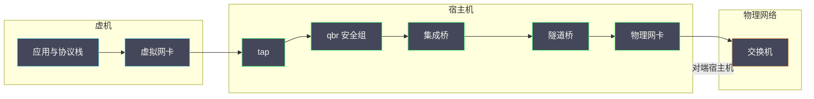

# 01 从虚机网卡到物理交换机——完整报文路径

**摘要：**

网络故障定位最有效的方法是「沿着包的路径走」：把一次通信拆成若干跳，逐跳确认报文是否存在、字段是否被改写。本文沿着虚机到物理交换机的完整路径，逐段讲清每一跳做了什么变换、以及在那里能观察到什么，重点放在容易出错的几处：卸载与分段、VLAN 标记、隧道封装、以及校验和。全文回答两个问题：一次通信在每一跳上发生了什么，以及在哪里能拿到可信的证据。文中的抓包位置与命令取自 2026 年 9 月的现场记录，涉及具体数值处标注口径；Neutron 的架构与对象模型见 [[云原生/OpenStack/06 Neutron 架构——ML2、OVS 与网络命名空间|06 Neutron 架构]]，Overlay 与 MTU 的深入分析见本专栏 03 篇。

---

## 第 1 章 为什么要沿着包的路径看

网络排障与单机排障有一个根本差异：**报文会离开你的视野**。因此方法论也不同。

### 1.1 一个方法论

**单机性能问题的定位是「分层」**（看 CPU、内存、I/O 哪一层），**网络问题的定位是「分段」**（看包走到了哪一段、在哪一段消失或变形）。

**分段法的核心动作是「在多个位置同时抓包，比较报文是否一致」**。**如果上游有、下游没有，断点就在这两点之间**——这是网络定位最可靠的方法，因为它不依赖任何单点的自述。

**这也解释了为什么网络排障强调抓包**：**抓包是唯一能给出「报文当时长什么样」的手段**，而日志与计数器只能给出「处理结果」。

### 1.2 路径的分段

一次虚机到虚机的跨宿主机通信，可以分成六段：

| 段 | 位置 | 主要动作 |
| :--- | :--- | :--- |
| 1 | 虚机内部 | 协议栈处理、卸载设置 |
| 2 | tap 与 qbr | 安全组过滤 |
| 3 | br-int | VLAN 标记转换、流表处理 |
| 4 | br-tun 与隧道 | 封装、出宿主机 |
| 5 | 物理网络 | 交换机转发 |
| 6 | 对端宿主机 | 解封装、反向处理 |

**六段里，第 2 至第 4 段是虚拟化特有的**，也是与物理网络差异最大的部分。**排障的多数时间花在这三段**。

### 1.3 每一跳的变换

**每一跳都可能改写报文**，这是网络定位的难点。

**常见的改写有四类**：**封装**（加一层头部）、**标记**（VLAN tag 的增删改）、**校验和重算**（因为头部变了）、以及**分段与合并**（受卸载能力影响）。

**改写的存在意味着「上下游抓到的包不是同一个包」**。**因此比较报文时不能直接对比原始字节，而要理解每一跳的改写规则**——这与单机排障「同一个指标在不同层含义不同」是同一类问题。

### 1.4 本篇的定位

本篇是全专栏的路径总览：**02 至 05 篇分别深入其中的某一段或某个机制**（OVS 流表、Overlay 与 MTU、安全组与 conntrack、DHCP 与 Metadata），**本篇先把整条路径串起来**。

**读完本篇应当能回答**：一次通信经过哪些跳、每跳做什么、以及在哪抓包最有效。

### 1.5 一张路径示意图



**图里的每一跳都是一个可观测点**。**排障的做法是「在这些点上分别取证据」，而不是在某一处反复深挖**——这是本篇与单机排障最大的方法差异。

### 1.6 分段法的三个前提

分段法有效，依赖三个前提。

**第一，路径是确定且串联的**：如果存在多路径或负载分担，同一条通信可能走不同的路，分段结论就不唯一。**第二，每一跳可观测**：需要有在该点取证据的能力（抓包、计数器）。**第三，路径是稳定的**：如果路径在故障时发生变化（如链路切换），抓到的证据可能不属于同一次通信。

**三个前提不成立时，分段法需要调整**：多路径时按路径分别追踪，不可观测时用计数器间接判断，路径不稳定时先稳定路径再追踪。

**这与 06 篇「实验的三个前提」是同一结构**：**任何方法都有前提，前提不满足时要换方法而不是硬用**。

### 1.7 一次通信的六段与三个问题

把六段与三个典型问题对应起来，能快速建立排查直觉。

**问题一：「本机通、跨机不通」**。它指向第 4 至第 5 段（桥间翻译与隧道）。**因为本机内通信不经过这两段**。

**问题二：「小包通、大包不通」**。它指向第 5 段（封装）与第 2 段（虚机内 MTU）。**因为只有大包会触及 MTU 限制**。

**问题三：「完全不通」**。它可能在任何一段，因此需要按段追踪。**但可以先看第 6 段的物理证据**（链路状态与错误计数），快速排除物理层。

**三个问题的价值在于「把排查从『全路径』缩小到『少数段』」**。**这是分段法最实际的收益**。

## 第 2 章 虚机内部的起点

路径的第一段在虚机内部，它决定了报文的初始形态。

### 2.1 应用发出数据

**应用调用发送接口，数据进入内核协议栈**。此时数据是「应用视角的字节流」，还没有任何网络头部。

**这一段的可观测性取决于应用本身**：应用日志能说明「它想发什么」，但看不到协议栈之后的样子。**因此应用层的证据只能作为旁证**。

### 2.2 协议栈处理

**协议栈为数据加上传输层与网络层头部**，并按 MTU 决定是否分段。**分段是这一段最关键的行为**：如果报文大于路径 MTU，协议栈会按规则处理（分片或依赖上层）。

**这一段的一个常见误区是「把虚机内的 MTU 当成路径 MTU」**。**虚机内的 MTU 只约束第一跳，路径上的实际 MTU 取决于所有中间段**——这与 03 篇要展开的「小包通大包不通」直接相关。

### 2.3 网卡驱动与 virtio

**报文交给虚拟网卡驱动，通过共享队列交给宿主机侧的设备后端**。这一段对应本专栏 04 篇讲过的 vring 机制。

**这一段的关键特征是「卸载能力」**：虚拟网卡通常支持校验和卸载与分段卸载，因此**虚机内看到的报文可能不是「最终形态」**——校验和字段可能是「未计算」的标记，大包可能还没分段。

**这一点对抓包有直接影响**：**在虚机内抓包，看到的可能是「未完成」的报文**。**因此抓包时要注意卸载标记**，否则会误判「校验和错误」——这是网络排障里最常见的一类假问题。

### 2.4 可观测点

```bash
# 虚机内抓包：注意可能带卸载标记
tcpdump -i <iface> -nn -e -c 20

# 查看虚机网卡的卸载设置
ethtool -k <iface> | head -20

# 查看虚机网卡的 MTU
ip link show <iface>
```

**观测的要点是「先确认卸载状态，再解读抓包结果」**。**卸载开启时，「校验和错误」与「超大帧」都可能是正常的中间形态**。

### 2.5 卸载机制详解

卸载机制值得展开，因为它是「抓包结果与直觉不符」的主要原因。

**校验和卸载**：协议栈不计算校验和，而是标记「待计算」，由网卡或对端计算。**因此抓包看到的校验和可能是零或错误值**，这是正常的。

**分段卸载**：协议栈把大块数据交给网卡，由网卡按 MTU 分段。**因此抓包可能看到一个「超大的帧」**，这也是正常的。

**接收侧卸载**：网卡把多个小包合并后交给协议栈，减少中断与协议栈开销。**因此接收侧抓包可能看到「合并后的包」**。

**三种卸载的共同效果是「抓包看到的不是协议栈逻辑上的报文」**。**因此解读抓包前必须确认卸载状态**——这与 06 篇「先问统计的是谁」是同一纪律。

### 2.6 虚机内协议栈的两种处理路径

虚机内的协议栈处理有两条路径，理解它们有助于判断抓包位置。

**第一条是「本机发出」**：应用数据经协议栈加头、按 MTU 处理、交给网卡。**第二条是「转发」**：虚机如果充当路由器或代理，报文会先收后发，此时抓包会看到两个方向的报文。

**两者的差异在于「看到的报文数量」**：**本机发出只看到一个方向，转发会看到收发两个方向**。**因此抓包时看到「意外的反向报文」不一定是异常**——可能是虚机在做转发。

**这个区分在容器与代理场景下尤其重要**：**容器与代理会引入额外的转发跳**，使路径比本文描述的更长。

### 2.7 一个 MTU 相关的实例

设想一次「虚机能 ping 通但传大文件失败」的问题。

**现象**：小包（如 ping 默认大小）正常，大文件传输卡住或失败。**初步判断**：典型的 MTU 问题。

**在虚机内验证**：用「不分片」标志发送逐渐增大的包，找到能通过的最大尺寸。**如果最大值明显小于虚机内 MTU，说明路径上有更小的 MTU**。

**这个实例说明「虚机内 MTU 只约束第一跳」**：**路径 MTU 是所有中间段的最小值**，而隧道封装会额外占用空间。**因此隧道网络的虚机 MTU 必须比物理链路小一个封装开销**——与 5.5 节的算例一致。

**处置方向是「统一规划 MTU」**：不是单独调虚机，而是把虚机、隧道、物理链路三者的 MTU 一起规划。

### 2.8 虚机内观测的三个层次

虚机内的观测有三个层次，选择哪个层次取决于问题。

**应用层**：应用日志与业务指标。**它的优势是「直接反映业务」，劣势是「看不到网络细节」**。**适合确认「业务是否受影响」**。

**协议栈层**：套接字统计、连接状态、重传计数。**它的优势是「能看到连接的行为」，劣势是「看不到报文的形态」**。**适合确认「连接是否建立、是否重传」**。

**报文层**：抓包。**它的优势是「能看到报文形态」，劣势是「开销大、需要解读」**。**适合确认「报文是否发出、字段是否正确」**。

**三个层次的顺序应当是「应用层确认现象、协议栈层缩小范围、报文层确认细节」**。**这与 8.5 节「工具使用顺序」是同一原则**。

## 第 3 章 tap 与 qbr

报文离开虚机后进入宿主机的第一段。

### 3.1 tap 设备的本质

**tap 设备是宿主机上的一个虚拟网卡**，它与虚机的虚拟网卡成对存在：**虚机侧发一个包，宿主机侧的 tap 就能收到**。

**它的本质是「内核里的一个网络接口」**，因此可以用标准工具观察（抓包、查看统计、查看链路状态）。**这是宿主机侧第一个可靠的可观测点**。

**tap 设备的常见问题是「链路状态与虚机侧不一致」**：虚机显示链路正常，但 tap 侧显示 down，或反之。**这类不一致通常来自配置未同步或设备重建**。

### 3.2 qbr 的作用

**qbr 是宿主机上的一个中间桥**，报文从 tap 进入它，再转发到集成桥。**它存在的主要目的是「承载安全组过滤」**。

**为什么不在集成桥上做过滤**：集成桥承载的是所有租户的流量，把过滤放在那里会让规则与租户的对应关系变复杂。**用一个每虚机独立的中间桥，可以让过滤规则按虚机隔离**。

**这个设计的历史原因**（早期防火墙驱动基于桥接设备）在 OpenStack 06/07 篇有说明；**本篇关注的是它对路径的影响**：**多了一跳，也多了一个可观测点**。

### 3.3 安全组在此处

**安全组规则在这一跳生效**。**它的效果是「报文在这里被丢弃或放行」**，因此**如果安全组拦截了流量，下游抓包就看不到包**。

**这一点对排障很关键**：**「下游没抓到包」有两种解释**——报文在中间丢了，或报文被安全组拦了。**区分方法是同时看安全组的计数器**——这与 04 篇要展开的 conntrack 直接相关。

### 3.4 可观测点

```bash
# 查看 tap 设备与中间桥
ip link show type bridge
ovs-vsctl show | head -40

# 在 tap 与中间桥分别抓包
tcpdump -i <tap> -nn -e -c 20
```

**观测的要点是「在过滤前后的两个点分别抓包」**。**两点都有包说明过滤放行；上游有下游无说明被过滤或丢弃**——这是分段法的直接应用。

### 3.5 tap 与 qbr 的一个实例

设想一次「虚机能 ping 通网关但访问不了外部」的问题。

**在 tap 抓包**：看到虚机发出了访问外部的包。**在中间桥抓包**：看到同样的包。**说明安全组放行了出方向**。

**回程检查**：如果外部回包没有到达 tap，说明回程被拦或路由有问题。**查看安全组计数器**：如果入方向有丢弃计数，说明回程被安全组拦截。

**这个实例演示了「安全组问题表现为单方向不通」**。**出方向放行、入方向拦截，是安全组配置错误的典型形态**——这与 04 篇要展开的 conntrack 状态有关。

### 3.6 qbr 的历史与现状

qbr 这一跳的存在与防火墙驱动的历史有关，理解它有助于判断「是否可以去掉」。

**早期防火墙驱动基于桥接设备实现**，因此需要在 tap 与集成桥之间插入一个中间桥来承载过滤规则。**这是 qbr 存在的直接原因**。

**随着驱动演进，部分实现可以把过滤放到别处**（如集成桥的流表或专门的连接跟踪），因此**qbr 在某些部署下可能不存在**。

**判断方法是「看实际路径」而不是「按文档假设」**。**这与全专栏「先确认实现形态」是同一要求**——文档描述的是典型形态，实际部署可能不同。

### 3.7 过滤机制的一个对照

过滤可以在多个位置实现，理解它们的差异有助于判断「丢包发生在哪一层」。

| 位置 | 机制 | 典型表现 |
| :--- | :--- | :--- |
| 中间桥 | 连接跟踪与规则 | 有丢弃计数器 |
| 集成桥流表 | 流表丢弃动作 | 有流表统计 |
| 虚机内 | 本机防火墙 | 虚机内可见 |
| 物理层 | 访问控制列表 | 物理侧可见 |

**四行的共同点是「每一层都有自己的证据」**。**排查时按层查证据，就能确定丢包发生在哪一层**——这与本篇「分段法」是同一思路，只是把「段」换成了「过滤层」。

**最容易混淆的是前两行**：两者都在宿主机内，都可能丢弃报文，**区分方法是看各自的计数器与流表统计**。

### 3.8 中间桥的一个观察要点

中间桥的观察有一个要点容易忽略：**它的存在与否取决于部署**。

**如果部署中不存在中间桥**（过滤在别处实现），那么「在中间桥抓包」这个动作就无从执行。**此时应当改用「在 tap 与集成桥分别抓包」**，效果等价。

**这提示了一个通用做法**：**不要记「在哪台设备抓包」，而记「在过滤前后抓包」**。**前者绑定实现，后者绑定逻辑**——这与全专栏「按逻辑而非按实现组织判据」是同一要求。

**这个做法在跨部署对比时尤其有价值**：不同部署的设备名不同，但「过滤前后」这个逻辑位置总是存在的。

## 第 4 章 br-int 与流表

集成桥是虚拟网络的汇聚点。

### 4.1 集成桥的职责

**集成桥汇聚本宿主机上所有虚机的流量**，并负责在「本机内部转发」与「送往隧道」之间分流。

**它的核心机制是流表**：**每个端口在桥内有一个内部标识，流表根据标识决定报文的去向**。**这个标识的作用是「在不修改报文的前提下标记它来自哪个网络」**。

**理解这一点很重要**：**桥内的网络区分靠内部标识，而不是靠报文的 VLAN tag**。**因此「在桥内抓包看不到 VLAN tag」是正常的**，不必惊讶。

### 4.2 VLAN tag 的转换

**报文在桥内与桥外的表示方式不同**：桥内用内部标识，桥外（或送往隧道时）用 VLAN tag 或隧道封装。

**因此集成桥承担「标识与标记的翻译」**。**翻译出错是常见故障**：表现为「本机内通信正常，跨宿主机不通」——因为本机内不涉及翻译。

**这个故障形态很有辨识度**：**它把问题限定在「桥间的翻译」这一跳上**，从而大幅缩小范围。

### 4.3 流表的作用

**流表决定报文的匹配与动作**：匹配什么（来自哪个端口、什么标识、什么目的地址）、执行什么（转发到哪个端口、加什么标记、丢弃）。

**流表的一个关键特性是「分层匹配」**：报文可能经过多张表，每张表处理一部分逻辑。**因此看单张表往往看不懂全貌**，需要按表的顺序追。

**这与 02 篇要展开的内容直接相关**，本篇只指出它对路径的影响：**流表是「路径的决策点」，报文在这里被决定去哪**。

### 4.4 可观测点

```bash
# 查看桥的端口与标识
ovs-vsctl list port

# 查看流表（条目可能很多，建议先看统计）
ovs-ofctl dump-flows <bridge>
ovs-ofctl dump-flows <bridge> | head -20

# 在集成桥上抓包（注意可能看不到 VLAN tag）
tcpdump -i <bridge> -nn -e -c 20
```

**观测的要点是「先看端口映射，再看流表」**：**不知道端口对应哪台虚机，看流表也读不懂**。**这与 02 篇「先建端口与虚机的对应关系」是同一要求**。

### 4.5 桥间翻译的一个实例

设想一次「同宿主机虚机互通，跨宿主机不通」的问题。

**本机内互通说明**：对象模型正确、集成桥内转发正确、安全组放行。**跨机不通说明**：问题在「桥间翻译」或「隧道」这两段。

**缩小范围的方法**：在隧道口抓包。**如果隧道口有封装后的包，说明翻译正确，问题在物理网络或对端；如果隧道口没有，说明翻译或隧道配置有问题**。

**这个实例的价值在于它演示了「故障形态直接指向段」**。**「本机通跨机不通」这个形态本身就把范围限定在两段内**，不必从头排查。

### 4.6 流表的三种典型动作

流表的动作可以归为三类，理解它们有助于读懂流表。

**第一类是「标记」**：给报文加上内部标识或 VLAN 标记，用于后续匹配。**第二类是「转发」**：把报文送到某个端口或隧道。**第三类是「丢弃」**：明确丢弃报文（可能带丢弃原因）。

**三类动作的组合构成了一条完整路径**：**标记决定「它属于谁」，转发决定「它去哪」，丢弃决定「它为什么没到」**。

**读流表的方法就是「按这三类动作把条目归类」**，而不是逐条阅读。**这与 02 篇「先建对应关系再读流表」是同一方法**。

### 4.7 集成桥的一个观察实例

设想一次「桥内端口与虚机对不上」的问题。

**现象**：虚机 A 与虚机 B 在同一宿主机、同一网络，但 A 的包到不了 B。**排查发现**：集成桥上的端口数量与虚机数量不一致。

**原因通常是「端口残留」**：虚机重建后，旧端口未清理，导致流表里存在指向旧端口的条目。**这类残留会让流表出现「指向不存在的端口」的动作**。

**处置方向是「清理残留端口」**，但要注意：**清理前必须确认该端口确实属于已销毁的虚机**，否则会误伤在用的虚机。

**这个实例说明「端口与虚机的对应关系」是读流表的前提**——这正是 4.4 节强调「先看端口映射」的原因。

### 4.8 集成桥的三种流量

集成桥处理的流量可以归为三类，理解它们有助于读懂流表。

**第一类是「本机内转发」**：报文从一台虚机到同一宿主机上的另一台虚机，不经过隧道。**第二类是「出隧道」**：报文需要跨宿主机，被交给隧道桥。**第三类是「出外部网络」**：报文需要离开虚拟网络（如访问外部地址），被交给外部桥。

**三类流量的流表条目不同**，因此**「某类流量不通而另一类通」这个现象能直接指向对应的流表分支**。

**这个分类的价值在于「把流表的规模缩小到可读」**：**按流量类别筛选流表条目**，比通读全部条目有效得多。

### 4.9 一个流表阅读的实例

设想一次「某台虚机流量异常」的问题，需要读流表确认。

**第一步，找到该虚机的端口**。**第二步，查该端口相关的流表条目**（按端口筛选）。**第三步，按动作归类**（标记、转发、丢弃）。**第四步，找到「丢弃」类条目并确认原因**。

**四步的关键是第二步「按端口筛选」**：**集成桥的流表条目可能上千条，不筛选就无法阅读**。

**这个实例与 02 篇要展开的内容直接相关**：**02 篇会讲清流表的分层结构与 megaflow 机制**，本篇只给出「怎么开始读」的入口。

**读流表的一个心态提示**：**不要试图读完，要带着问题去查**。**「我想确认这台虚机的流量去哪了」比「我想看懂流表」更有效**。

## 第 5 章 隧道与 br-tun

跨宿主机通信必须经过隧道。

### 5.1 隧道封装

**隧道把原始报文整体作为载荷，外面再套一层头部**。这一层头部的作用是「让报文能在物理网络上路由到对端宿主机」。

**封装的直接后果是「报文变大」**：外层头部占用额外空间，因此**隧道路径上的可用载荷变小**。**这是「小包通大包不通」的机制根源**——与 03 篇要展开的内容直接相关。

### 5.2 br-tun 的翻译

**隧道桥承担「内部标识与隧道标识的翻译」**：把桥内的标识翻译成隧道的网络标识，并在出口加上封装。

**它与集成桥的分工是「一个管本机内部，一个管跨机」**。**两者的翻译规则必须一致**，否则会出现「本机通、跨机不通」——与 4.2 节的故障形态同类。

### 5.3 封装后的报文

**封装后的报文有几个特征值得记住**：**外层是标准的三层报文**（因此物理网络不需要理解隧道）、**内层是完整的原始报文**（含原有的二层头部）、以及**校验和需要重算**（因为外层头部变了）。

**「内层是完整的原始报文」这一点对抓包很重要**：**在隧道出口抓包，看到的是外层报文，需要解析才能看到内层**。**不会解析就会误判「报文内容不对」**。

### 5.4 可观测点

```bash
# 查看隧道端口与远端
ovs-vsctl show | grep -A3 -i tunnel
ip -d link show type vxlan

# 在物理网卡抓包（隧道出口，看到的是封装后的报文）
tcpdump -i <phys> -nn -e 'udp port 4789' -c 10
```

**观测的要点是「区分内外层」**：**抓包工具通常能解析常见隧道协议并展示内层**，但要确认解析是否生效。**看不到内层时，先确认抓包的过滤条件是否匹配外层协议**。

### 5.5 隧道封装的一个算例

用一个算例说明封装开销。假设虚机内 MTU 是 1500 字节，隧道封装的外层头部（IP 加 UDP 加隧道头）约 50 字节。

**封装后报文变成 1550 字节**，超过物理链路的 1500 字节 MTU。**因此要么物理链路支持更大的 MTU（如 9000 的巨型帧），要么虚机内 MTU 必须调小到 1450**。

**如果两者都没做**，会出现「小包通、大包不通」：小包封装后不超限，大包封装后超限且被丢弃。**这个现象是隧道网络最典型的故障**——与 03 篇要展开的内容直接相关。

**算例的实践含义是：隧道网络的 MTU 必须统一规划**，不能只在虚机内设置。

### 5.6 隧道的两种实现

隧道有两种实现方式，它们的路径与排查方法不同。

**第一种是「在软件交换机里实现」**：隧道端点由软件交换机管理，封装与解封装在软件交换机内完成。**它的优点是配置统一，缺点是依赖软件转发能力**。

**第二种是「由内核的隧道设备实现」**：隧道端点是一个内核网络设备，封装与解封装由内核完成。**它的优点是性能好，缺点是配置分散**。

**两者的排查方法不同**：**软件交换机实现的隧道，端点信息在交换机配置里；内核实现的隧道，端点信息在网络设备配置里**。

**因此排障前先确认隧道由谁实现**——这与 04 篇「后端形态影响观测方式」是同一类约束。

### 5.7 隧道的一个观察实例

设想一次「隧道口有包但对端没收到」的问题。

**在源端隧道口抓包**：看到封装后的报文，目的地址是正确的对端地址。**在源端物理网卡抓包**：看到同样的封装报文。**说明封装与发出都正常**。

**在对端物理网卡抓包**：没有看到该报文。**结论**：报文在物理网络中丢失，或者对端地址在物理网络中不可达。

**处置方向**：检查物理网络的连通性与路由，以及对端宿主机是否在预期位置。

**这个实例说明「隧道口有包不等于对端能收到」**：**封装只保证报文格式正确，不保证物理网络能送达**。**因此隧道问题与物理网络问题必须分开排查**。

### 5.8 隧道与安全组的交互

隧道与安全组之间存在一个容易忽略的交互：**过滤发生在封装之前还是之后**。

**过滤在封装之前**：安全组看到的是原始报文（虚机的源地址与目的地址），因此规则按租户语义书写。**过滤在封装之后**：看到的是封装后的报文，规则会变成物理地址语义，难以按租户管理。

**主流实现选择「封装之前过滤」**，因为这样规则语义清晰。**这也解释了为什么安全组在宿主机内的位置靠前**（在 tap 与集成桥之间）。

**这个交互的实践含义是：安全组规则不感知隧道**。**因此隧道配置变更不应影响安全组行为**——如果出现了影响，说明实现与预期不符，值得深查。

## 第 6 章 物理网卡与交换机

报文离开宿主机后的最后一段。

### 6.1 出宿主机

**报文经物理网卡发出**。**这一跳的一个关键差异是「卸载」**：物理网卡可能承担分段卸载，**因此网卡上抓到的报文可能与协议栈发出时不同**（大包可能在网卡处才真正分段）。

**这一点再次印证「抓包位置决定看到什么」**：**同一个逻辑报文，在不同位置可能有不同的形态**。**比较时必须考虑这一因素**。

### 6.2 物理交换机的处理

**物理交换机只看到封装后的报文**（如果是隧道网络），因此**它对租户网络无感知**——这正是隧道方案的价值：**把租户网络的复杂度限制在宿主机内**。

**交换机层面的问题通常是「标准的三层/二层问题」**：链路聚合、生成树、MTU、以及访问控制。**这类问题与虚拟化无关**，排查方法与物理网络一致。

### 6.3 对端接收

**对端宿主机的接收路径是发送路径的镜像**：物理网卡收到、解封装、进入隧道桥、翻译标识、进入集成桥、经中间桥过滤、送到 tap、交给虚机。

**接收路径有一个额外的机制：中断与多队列**。**如果队列配置不当，接收可能成为瓶颈**——这与本专栏 04 篇「队列与多队列」是同一件事在网络侧的表现。

### 6.4 可观测点

```bash
# 物理网卡的统计与错误
ip -s link show <phys>
ethtool -S <phys> | grep -iE 'err|drop|miss' | head

# 接收侧的中断分布
grep -i <phys> /proc/interrupts
```

**观测的要点是「物理网卡的错误计数是最权威的物理层证据」**。**如果物理网卡没有错误与丢包，那么「网络不通」的原因就在网卡之上**——这是一条能快速排除整段物理网络的判据。

**这条判据的价值在于它的排除力**：**它能把「物理网络问题」与「虚拟化层问题」一刀切开**，从而把排查范围砍掉一半。

### 6.5 物理层判据的边界

「物理网卡无错误则问题在网卡之上」这条判据有边界，需要说明。

**它成立的前提是「报文确实经过了该网卡」**。**如果报文根本没发出去**（被上游丢弃），网卡自然没有错误计数，但问题也不在网卡之上。

**因此这条判据的正确用法是「与上游证据配合」**：**先确认上游有包发出，再看物理网卡有无错误**。**只有两步都确认，才能得出「问题在网卡之上」的结论**。

**这与全专栏「结论要带前提」是同一要求**：**任何判据都有前提，前提不成立时判据无效**。

### 6.6 交换机的两类问题

物理交换机层面的问题可以归为两类，区分它们能避免误判。

**第一类是「链路与二层问题」**：链路聚合配置不一致、生成树收敛、VLAN 配置不匹配。**这类问题的特征是「影响面大」**——通常影响多台虚机或多条链路。

**第二类是「策略与访问控制问题」**：物理层的访问控制列表、端口安全。**这类问题的特征是「影响面精确」**——通常只影响特定流量。

**区分方法看影响面**：**大面积不通倾向第一类，特定流量不通倾向第二类**。

**这与 01 篇「按现象定位」是同一方法**：**影响面的形态本身就是一个判据**。

### 6.7 物理层排查的一个顺序

物理层的排查可以按一个固定顺序。

**第一步看链路状态**：链路是否 up、速率与双工是否匹配。**第二步看错误计数**：是否有校验错误、丢弃、冲突。**第三步看流量**：是否有流量、是否达到预期速率。**第四步看物理配置**：链路聚合、VLAN、访问控制。

**四步的顺序是「由物理到逻辑」**。**跳过前三步直接查配置，会在物理层已经有问题时浪费时间**——这与全专栏「先确认基础事实」是同一原则。

**第一步最容易被跳过**：**链路状态是最基础的事实，但很多排查从配置开始**。

### 6.8 对端接收路径的额外机制

对端接收路径有两个额外机制，值得单独说明。

**第一个是「中断与队列」**：报文到达物理网卡后，由中断或轮询机制交给协议栈。**如果中断集中在少数核上，或队列数不足，接收会成为瓶颈**。**这与本专栏 04 篇「队列与多队列」是同一件事在网络侧的表现**。

**第二个是「反向翻译」**：对端需要把封装还原、把隧道标识翻译回内部标识、再交给正确的虚机。**反向翻译的规则必须与源端一致**，否则会出现「收到但送不到虚机」。

**两个机制的观测点不同**：前者看中断与队列分布，后者看对端的桥与流表。**区分它们的现象是「对端物理网卡有包、但对端虚机没有」**。

## 第 7 章 每一跳的变换汇总

把六段的变换整理成表，便于对照。

| 段 | 报文形态 | 关键变换 | 主要可观测点 |
| :--- | :--- | :--- | :--- |
| 虚机内 | 应用数据加协议头 | 分段、卸载标记 | 虚机内抓包 |
| tap 与 qbr | 标准以太帧 | 安全组过滤 | tap 与中间桥 |
| br-int | 带内部标识 | 标识与标记翻译 | 桥端口与流表 |
| br-tun | 封装后的报文 | 加隧道头、重算校验和 | 隧道口与物理网卡 |
| 物理网络 | 封装后的报文 | 无（对租户透明） | 交换机与链路 |
| 对端 | 逐步还原 | 解封装、反向翻译 | 对端各跳 |

**表的用途是「按现象定位段」**：**「本机通跨机不通」指向翻译段，「小包通大包不通」指向封装段，「有丢包计数」指向物理段**。

### 7.5 一张变换对照的实例

用一次跨宿主机通信把变换串起来。

**在源端虚机内抓包**：看到一个 1500 字节的以太帧（可能带卸载标记）。**在源端隧道口抓包**：看到同样的内层报文，外面多了一层封装。**在源端物理网卡抓包**：看到封装后的报文（可能因卸载而形态不同）。

**在对端物理网卡抓包**：看到封装后的报文。**在对端隧道口抓包**：看到解封装后的内层报文。**在对端虚机内抓包**：看到原始以太帧。

**六个抓包点的对照说明「同一个逻辑报文在不同位置形态不同」**。**因此「对照抓包」时必须按层对照，而不是按字节对照**——这是本篇最重要的实践结论。

### 7.6 变换与卸载的关系

变换与卸载是两件事，但会互相影响。

**变换是「路径上的必然改写」**（封装、标记、校验和重算），它在任何配置下都会发生。**卸载是「由谁来完成某个动作」的选择**（协议栈或网卡），它取决于配置与硬件。

**两者互相影响的方式是「卸载改变了变换发生的时机与位置」**：**同一个校验和重算，可能在协议栈发生，也可能在网卡发生**。**因此抓包位置不同，看到的形态也不同**。

**理解这一点，就能解释「为什么同一个抓包命令在不同位置结果不同」**——**不是命令有问题，而是变换发生的位置不同**。

**这也是本篇反复强调「抓包位置决定看到什么」的机制原因**。

### 7.7 变换对照的一个用途

变换对照除了用于排障，还有一个用途：**验证假设**。

**举例**：如果怀疑「报文在隧道处被丢弃」，可以先在隧道口抓包。**有包说明封装正常，无包说明问题在封装之前**。**这个验证不需要改动任何配置**，是纯粹的只读证据。

**变换对照的价值在于「它把假设变成了可验证的问题」**。**「可能哪里有问题」不是假设，「在某一跳应该看到什么」才是假设**——这与 06 篇「假设要可验证」是同一要求。

### 7.8 变换对照在实验中的应用

变换对照也可以用于受控实验，验证某一段的行为。

**举例**：为了验证「隧道封装确实增加了报文大小」，可以**在隧道前后分别抓包并比较长度**。**这个实验不改变任何配置，结论直接可用**。

**实验设计的要点是「固定其他变量」**：同一份流量、同一时刻、只在两个位置抓包。**这与 06 篇「单变量原则」是同一要求**。

**这类「只读实验」的价值在于「风险为零」**：**不需要改动配置，也不影响业务，却能给出确定结论**。**在生产的故障现场，这类实验是最优先的手段**。

## 第 8 章 一次跨宿主机通信的追踪

下面用一个实例把路径串起来。

### 8.1 现象

两台虚机在同一租户网络内，不同宿主机，互 ping 不通。

### 8.2 分段追踪

**第一步，确认本机内通信正常**：在同一宿主机上找一台同网络虚机，验证互通。**如果本机内正常，说明对象模型与基础配置没问题**。

**第二步，在源端 tap 抓包**：确认虚机确实发出了包。**如果源端没发出，问题在虚机内部**。

**第三步，在源端隧道口抓包**：确认包被封装并发出。**如果源端 tap 有包而隧道口没有，问题在集成桥或隧道桥的翻译**。

**第四步，在对端隧道口抓包**：确认包到达并被解封装。**如果源端发出了而对端没收到，问题在物理网络或隧道配置**。

**第五步，在对端 tap 抓包**：确认包被送到虚机。**如果对端隧道口有而对端 tap 没有，问题在对端的翻译或过滤**。

### 8.3 结论的形态

**五步追踪的结论必然是「某一跳有、下一跳没有」**。**这个结论直接给出了断点的位置**，而不需要猜测。

**这就是分段法的价值**：**它把「网络不通」这个笼统的现象，转换成一个明确的、可处置的定位结论**。

### 8.4 追踪方法的可迁移部分

这次追踪可以提炼成三个动作：**先验证本机内基线、再从源端向外逐跳抓包、最后用「有与无」定位断点**。

**第一个动作的关键是「先排除与跨机无关的部分」**；**第二个动作的关键是「按路径顺序而不是随机位置」**；**第三个动作的关键是「只判断有无，不判断内容」**。

**第三个动作尤其重要**：**在定位阶段判断「有无」比判断「内容对不对」更有效**，因为内容可能因卸载与封装而变化。**先定位段，再在段内看内容**。

### 8.5 追踪工具的选择

追踪工具的选择影响效率，值得说明。

**抓包工具适合「确认有无与形态」**，它的优势是直观，代价是开销与数据量大。**计数器适合「快速判断丢包位置」**，它的优势是开销小，代价是粒度粗。**日志适合「确认决策过程」**，它的优势是有上下文，代价是可能滞后或缺失。

**三者的使用顺序应当是「计数器定位段、抓包确认点、日志解释原因」**。**先用开销小的工具缩小范围，再用开销大的工具确认细节**——这与 06 篇「先采样后追踪」是同一原则。

**故障现场尤其要遵守这个顺序**：**在流量大的环境里一上来就抓包，可能既影响业务又拿不到有效数据**。

### 8.6 追踪结果的记录方式

追踪结果需要记录，否则无法复盘与对比。

**记录的要素**：**抓包位置**（在哪一点）、**过滤条件**（抓的是哪类流量）、**观察结果**（有包或无包、报文形态）、以及**时间戳**（用于与业务现象对齐）。

**四项里，「时间戳」最容易被省略**。**没有时间戳，抓包结果无法与业务现象对齐，也就无法确认「这次抓包对应的是不是那次故障」**。

**这与 06 篇「条件与数据一起记录」是同一要求**：**证据必须带上下文，否则无法被解读**。

## 第 9 章 误判与反例

第一，**把虚机内的抓包当成最终报文**。卸载标记会让报文看起来「异常」。

第二，**在桥内抓包却找不到 VLAN tag**。桥内用内部标识，这是正常的。

第三，**在隧道口抓包不解析内层**。看到的是外层报文，不解析会误判内容不对。

第四，**把安全组拦截当成中间丢包**。两者都表现为「下游没包」，需要看安全组计数器区分。

第五，**忽略物理网卡的卸载**。网卡上抓到的报文可能与协议栈发出时不同。

第六，**只看单点抓包就下结论**。单点无法区分「上游没发」与「中间丢了」。

第七，**把虚机内 MTU 当成路径 MTU**。路径 MTU 取决于所有中间段。

第八，**忽略物理网卡的错误计数**。它是最权威的物理层证据，也是最好的排除依据。

第九，**在定位阶段就纠结报文内容**。内容可能因卸载与封装变化，先判断有无更有效。

第十，**只验证一端就下结论**。跨机问题必须在两端都取证据。

第十一，**把抓包结果的差异当成异常**。同一个逻辑报文在不同位置形态不同，差异本身可能是正常的。

第十二，**把隧道问题与物理网络问题混在一起排查**。封装正确只保证格式，不保证送达，两者必须分开。

## 第 10 章 边界与反例

第一，**路径不适用于所有网络后端**。OVN、SR-IOV 直通等方案的路径与本文不同，套用前先确认后端。

第二，**桥与设备的命名因部署而异**。文中名称是常见形态，实际以现场为准。

第三，**抓包本身有开销与风险**。高流量场景下抓包可能丢包或影响性能，故障时尤其要克制。

第四，**卸载行为因驱动与硬件而异**。同一配置在不同硬件上表现可能不同。

第五，**分段法假设「路径是串联的」**。如果存在多路径或负载分担，需要按路径分别追踪。

第六，**把物理网卡的判据当成无条件成立**。它的前提是报文确实经过了该网卡。

第七，**在隧道网络里不统一规划 MTU**。只在虚机内设置 MTU 不足以避免大包被丢。

第八，**按文档假设路径**。qbr、隧道实现等在不同部署下可能不同，应当按实际确认。

第九，**按设备名而不是逻辑位置组织排查步骤**。设备名随部署变化，逻辑位置（如过滤前后）总是存在。

第十，**试图通读流表**。流表条目可能上千条，应当带着问题按端口或类别筛选。

行文至此，把本篇落点收在两条原则上。其一，架构即权衡——每一跳的封装与翻译换来了租户隔离与物理网络透明，代价是排障必须在多个位置取证据。其二，复杂性不会消失只会转移——虚拟化把网络复杂度从物理设备转移到了宿主机内的软件交换机上，这正是本专栏 02 篇要拆解的对象。相邻的架构与对象模型见 [[云原生/OpenStack/06 Neutron 架构——ML2、OVS 与网络命名空间|06 Neutron 架构]]，Overlay 与 MTU 的深入分析见本专栏 03 篇。

---

## 速查卡：按现象定位段

这张表把常见现象与优先怀疑的段对应起来，用于快速定向。使用时的顺序是「先看现象属于哪一类，再取对应证据」——表中「关键证据」是各现象最直接的判据。

还有两条纪律值得写在表前：**第一，先判断有无，再判断内容**（内容可能因卸载与封装变化）；**第二，跨机问题必须在两端都取证据**（只验证一端无法区分「没发」与「丢了」）。

**分段法的结论形式是「某一跳有、下一跳没有」**。如果拿不到这种形式的结论，说明证据还不够，应当继续增加抓包点，而不是凭感觉推测。

补充一句关于效率的提醒：**抓包点不是越多越好**。过多的抓包点会带来大量数据与解读成本，反而拖慢排查。**实践中的做法是「先按现象缩小到两三个段，再在这几个段的两端取证据」**——先缩小范围，再精确取证，比全程抓包高效得多。

再补一句关于经验的积累：**每次追踪都应当留下「现象到段到证据」的记录**。积累若干次之后，会发现某些现象反复指向同一段，这时就可以把它写进巡检或告警。**这正是 08 篇「故障取证自动化」的输入来源**——单次追踪的经验，经过沉淀就变成了可自动化的判据。

| 现象 | 优先怀疑段 | 关键证据 |
| :--- | :--- | :--- |
| 本机通、跨机不通 | 桥间翻译 | 桥端口与流表 |
| 小包通、大包不通 | 封装与 MTU | 路径 MTU 与封装开销 |
| 下游无包、上游有包 | 安全组或丢弃 | 安全组与丢弃计数器 |
| 校验和看似错误 | 卸载标记 | 网卡卸载设置 |
| 物理网卡有错误计数 | 物理链路 | 网卡错误与丢包统计 |
| 对端隧道口无包 | 物理网络或隧道配置 | 隧道端口与远端配置 |

## 口径与事实说明

- 抓包位置与命令取自 2026 年 9 月的现场记录，属某时点实践，不构成唯一正确用法。
- 机制描述（卸载与分段、VLAN 标记、隧道封装、校验和重算、桥间翻译）属于 Linux 与 OVS 的稳定行为。
- 桥与设备的具体名称、卸载支持情况随部署与硬件而异，排查前先确认现场形态。
- 分段法在 OVN 等后端下需要调整，相关映射见本专栏 07 篇。
- 抓包工具与过滤语法的细节以现场版本为准，本文只给方法与位置。
- 文中命令均为只读观测类操作，网络配置变更须走审批并回读。
- 本文与本专栏其余篇目共享同一套观察方法与口径纪律，相邻篇目已展开的机制不在此重复推导。
- 桥与设备的对应关系会随虚机重建而变化，追踪前先重新确认，不要沿用旧映射。
- 本文的判据与顺序可直接用于同类虚拟网络环境，具体配置项与设备名需按现场调整并以实测为准，不照搬结论。
- 抓包结果的解读依赖对卸载与封装的正确理解，解读前先确认这两项的实现形态，否则容易得出错误结论。
- 本文所述路径以软件交换方案为背景，其他方案的路径差异与对照见 07 篇 OVN，两者排查方法不同。
- 分段法产出的结论应当记录并沉淀，形成可复用的定位经验，供后续巡检与告警使用，避免每次从头推演。

---

## 参考资料

1. Open vSwitch 官方文档，桥与流表：<https://docs.openvswitch.org/>
2. OpenStack 官方文档，Neutron 数据面：<https://docs.openstack.org/neutron/latest/admin/>
3. Linux 内核文档，网络与卸载：<https://www.kernel.org/doc/html/latest/networking/index.html>
4. Linux 内核文档，隧道与 VXLAN：<https://www.kernel.org/doc/html/latest/networking/vxlan.html>
5. RFC 7348，VXLAN 规范：<https://datatracker.ietf.org/doc/html/rfc7348>
6. 内部现场素材：CVM 集群网络故障复盘（2026-09，脱敏）

---

> [!note] 思考题
> 1. 为什么网络排障强调「多位置抓包比较」，单点抓包为什么不够。
> 2. 卸载标记为什么会造成「校验和错误」的假象，如何避免误判。
> 3. 桥内看不到 VLAN tag 为什么是正常的，桥内用什么区分网络。
> 4. 物理网卡的错误计数为什么能快速排除整段物理网络。
> 5. 分段法在什么情况下不适用，多路径场景应当如何调整。
