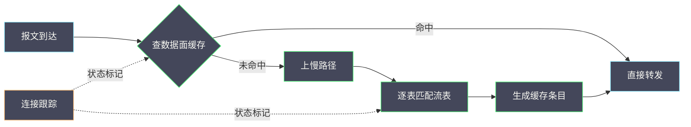

# 02 OVS 的接口、端口、流表与 datapath

**摘要：**

软件交换机是虚拟网络的实际转发者，但它的内部有两套机制：一套是控制面的规则（流表），一套是数据面的缓存（datapath 流）。只看其中一套都会误判——「流表里没有对应规则」不代表流量没通，「流表里有规则」也不代表流量真的走了这条规则。本文把接口、端口、桥、流表、datapath、recirculation 与连接跟踪逐一拆开，给出每一层的观测方法与误读陷阱。全文回答两个问题：OVS 的转发决策是如何做出的，以及为什么「查流表」常常查不出问题。文中的命令与观察方式取自 2026 年 9 月的现场记录，涉及具体数值处标注口径；报文路径的分段方法见本专栏 01 篇。

---

## 第 1 章 为什么需要理解 OVS 的内部

OVS 层面的排障有一个独特的困惑，理解它的来源是掌握这套机制的前提。

### 1.1 一个常见的困惑

**现象是：流量不通，但流表看起来是对的**；或者反过来，**流量通了，但流表里找不到对应的规则**。

**这两种现象都会让人怀疑自己的理解**：是不是看错了表、是不是读错了动作、是不是命令用错了。**实际上，问题往往出在「OVS 有两套转发决策机制」这一点上**。

### 1.2 两个面：控制面与数据面

**控制面是流表**：它是「应该怎么转发」的规则集合，由上层（网络控制面）下发，条目可能很多且逻辑复杂。

**数据面是 datapath 流**：它是「实际怎么转发」的缓存，由内核根据真实流量生成，条目少且直接。

**两者的关系是「数据面由控制面推导而来，但不完全等同」**：**一条流量可能对应多条控制面规则，也可能被合并成一条数据面条目**。**因此两个面的条目数量与形态都不一致**。

### 1.3 三种「流」

讨论 OVS 时说的「流」有三种含义，混淆它们是常见错误的来源。

| 名称 | 位置 | 内容 | 数量级 |
| :--- | :--- | :--- | :--- |
| 流表条目 | 控制面 | 匹配与动作规则 | 多（可能上千） |
| datapath 流 | 数据面缓存 | 实际转发路径 | 少（按活跃流量） |
| 连接跟踪条目 | 状态表 | 连接的状态 | 按活跃连接数 |

**三者的用途不同**：**流表回答「规则是什么」，datapath 流回答「实际怎么走」，连接跟踪回答「这条连接处于什么状态」**。

**排查时必须先明确「我在看哪一种流」**——这与 06 篇「先问统计的是谁」是同一纪律。

### 1.4 本篇的定位

本篇是路径的机制层：**01 篇给出了路径的六段，本篇深入其中「转发决策」这一环**。

**读完本篇应当能回答**：转发决策在哪一层做出、为什么查流表可能查不出问题、以及 datapath 与连接跟踪该如何观测。

### 1.5 一张两面关系示意图



**图里的关键分支是「命中」与「未命中」**：**日常转发走命中分支，只有新流量才走慢路径**。**因此「流表改了但行为没变」是因为命中分支仍然使用旧缓存**——这是 1.1 节困惑的机制解释。

### 1.6 三种流的关系与排查意义

三种流的关系可以概括为「规则、缓存、状态」三层，它们在排查中各有用途。

**流表（规则）回答「设计意图」**：**它告诉你「按设计，这类流量应该怎么走」**。**因此它是判断「是否符合预期」的依据**。

**缓存（实际）回答「实际行为」**：**它告诉你「实际怎么走的」**。**因此它是判断「是否与设计一致」的依据**。

**连接跟踪（状态）回答「连接现状」**：**它告诉你「连接处于什么状态」**。**因此它是判断「是否被状态机制影响」的依据**。

**三层的关系是「设计、实现、状态」**：**排查时按这个顺序看，就能把「设计问题」「实现问题」「状态问题」分开**。**这与 01 篇「先分段再取证据」是同一方法的不同维度**。

### 1.7 一个类比与它的边界

可以用「快递分拣」来类比 OVS 的两面机制。

**流表像是「分拣规则手册」**：它写明了「什么样的包裹该送到哪里」，条目详尽，但每次分拣都要翻阅手册，速度慢。

**数据面缓存像是「分拣员记住的常用路线」**：**对于常见的包裹类型，分拣员不需要翻手册，直接按记忆处理**。**只有遇到新类型的包裹，才去翻手册**。

**这个类比的价值在于「它解释了为什么改了手册但行为没变」**：**因为分拣员还在用记忆里的旧路线**。**记忆的更新有延迟**——这正是 4.6 节的现象。

**类比的边界在于「记忆是会过期的，而缓存不会自动感知规则变化」**：**缓存条目的失效依赖超时或主动清除，不会因为规则改变而立即失效**。**这一点比人的记忆更僵化，也是排查时必须显式考虑的因素**。

### 1.8 三个常见问题的归属

把常见问题按三个面归类，能快速判断该看哪里。

**「流表里有规则但流量不通」**：属于「实现」层，应当看数据面缓存与连接跟踪。**「流表里没有规则」**：属于「设计」层，应当看控制面是否下发了对应规则。**「偶尔不通」**：属于「状态」层，应当看连接跟踪的容量与超时。

**三类问题对应三个面**：**设计问题看流表，实现问题看缓存，状态问题看连接跟踪**。

**这个归类的价值在于「它避免了在一个面上反复找」**。**在一个错误的面上深挖，是最浪费时间的排查方式**——这与全专栏「先分类再定位」是同一纪律。

## 第 2 章 接口、端口与桥

三个概念经常被混用，但它们的层次不同。

### 2.1 三个概念的区别

**桥是转发设备的整体**：它管理若干端口，并持有流表。

**端口是桥上的一个接入点**：它可以是物理网卡、虚拟网卡、隧道端点，或一个「内部端口」。

**接口是端口与系统设备之间的绑定关系**：一个端口可以绑定一个或多个系统设备（如网卡）。

**三者的层次关系是「桥包含端口，端口绑定接口」**。**因此「端口不通」与「接口不通」是两个不同层次的问题**。

### 2.2 端口类型

端口有四种常见类型，它们的用途不同。

**物理端口**：绑定物理网卡，用于进出宿主机的物理网络。**虚拟端口**：绑定虚拟网卡，用于连接虚机。**隧道端口**：表示一个隧道的远端。**内部端口**：不绑定外部设备，而是作为宿主机的「一个虚拟网卡」存在，供宿主机自身收发报文。

**第四种最容易被忽略**：**内部端口让宿主机本身成为虚拟网络中的一个节点**，网关、DHCP 服务、Metadata 服务都通过内部端口接入。

### 2.3 内部端口的作用

**内部端口是「宿主机进入虚拟网络的入口」**。**网络命名空间里的虚拟网卡，本质上就是通过内部端口接入的**。

**这一点解释了为什么「在宿主机上 ping 虚拟网络里的地址」是可能的**：**因为宿主机通过内部端口接入了该网络**。

**它也解释了为什么「内部端口配置错误会导致 DHCP 与 Metadata 失效」**：**这两个服务都依赖内部端口接入**——这与 05 篇要展开的内容直接相关。

### 2.4 端口与虚机的对应

**排查的第一步是建立「端口与虚机」的对应关系**，否则流表读不懂。

**建立方法**：从虚机的虚拟网卡找到它在宿主机上的对应设备，再从该设备找到它绑定的端口。

```bash
# 查看桥与端口
ovs-vsctl show

# 查看某端口绑定的接口
ovs-vsctl list interface

# 从宿主机侧查看虚拟网卡与端口的关系
ip link show type bridge
```

**观测的要点是「先建对应关系再读流表」**。**不知道端口对应哪台虚机，流表里的条目就是无意义的字符串**——这与 01 篇「先看端口映射」是同一要求。

### 2.5 观测方法

```bash
# 桥与端口的整体结构
ovs-vsctl show | head -40

# 单个端口的统计
ovs-vsctl get interface <iface> statistics

# 查看端口所在的桥与标识
ovs-vsctl port-to-br <port>
```

**观测的要点是「按层次逐步查看」**：**先看桥有哪些端口，再看端口的接口，最后看接口的统计**。**跳过中间层次直接查统计，会在找不到对应关系时卡住**。

### 2.6 一个端口对应的实例

设想一次「找不到虚机对应哪个端口」的问题。

**第一步，从虚机侧获取网卡的标识**（如 MAC 地址或接口名）。**第二步，在宿主机侧找到该标识对应的设备**（通过查看设备列表与 MAC）。**第三步，从设备找到绑定的端口**（通过查询端口与接口的绑定关系）。**第四步，从端口找到所在的桥**。

**四步的关键是第二步**：**MAC 地址是最可靠的连接点**，因为它在虚机与宿主机两侧都可见且不变。

**这个实例说明「对应关系要靠一个共同标识串起来」**。**这与 06 篇「跨视角对照需要同时刻同口径」是同一思路**：**对照需要共同的锚点，否则两个视角的证据无法连接**。

### 2.7 内部端口的一个实例

设想一次「宿主机上的服务无法访问虚拟网络」的问题。

**现象**：虚机之间互通，但宿主机上运行的某个服务（如自定义的监控代理）无法访问虚机。**排查**：虚机之间的路径正常。

**原因通常是「宿主机没有接入该虚拟网络」**：**宿主机需要通过内部端口加入网络，才能与虚机通信**。**如果该网络没有为宿主机提供内部端口，宿主机就不在这个网络里**。

**验证方法**：查看宿主机上是否存在属于该网络的内部端口，以及该端口的地址是否在网络的地址段内。

**这个实例说明「宿主机默认不在虚拟网络里」**。**这是虚拟网络与物理网络的一个根本差异**：**物理机上宿主机与虚机同在一个网络，而虚拟化环境下宿主机需要显式接入**。

### 2.8 端口类型与故障形态

不同端口类型的故障形态不同，识别它们有助于快速定位。

| 端口类型 | 典型故障 | 表现 |
| :--- | :--- | :--- |
| 物理端口 | 链路或绑定问题 | 整机网络不通 |
| 虚拟端口 | 虚机侧配置问题 | 单台虚机不通 |
| 隧道端口 | 远端或封装问题 | 跨机不通 |
| 内部端口 | 宿主机接入问题 | 宿主机服务不可达 |

**四行的表现差异明显**：**「整机不通」「单机不通」「跨机不通」「宿主机不可达」分别指向不同端口类型**。

**这个对应关系的价值在于「从表现直接缩小到端口类型」**。**这与 01 篇「从现象定位段」是同一方法，只是粒度更细**。

### 2.9 桥的分工与流量归属

不同桥承担不同流量，理解这个分工能避免「在错误的桥上找问题」。

**集成桥承担「本机内转发与分流」**：本机内虚机之间的流量、以及需要送往隧道或外部网络的流量都在这里决策。**它是「所有流量的必经点」**。

**隧道桥承担「跨机流量」**：只有需要跨宿主机的流量才经过它。**因此本机内不通的问题不该在隧道桥上找**。

**外部桥承担「出入物理网络」**：只有需要访问外部地址或从外部进入的流量经过它。

**三座桥的分工带来一个实用的判据**：**「某类流量不通」可以直接定位到对应的桥**。**例如「访问外部不通」先看外部桥，「跨机不通」先看隧道桥**——这与 2.8 节「从表现定位端口类型」是同一方法。

## 第 3 章 流表：控制面的规则

流表是「应该怎么转发」的规则集合。

### 3.1 流表的组织

**流表由若干张表组成**，每张表有编号与用途。**报文进入后先匹配某张表，按匹配结果决定「执行什么动作」以及「是否跳到另一张表」**。

**这种组织方式叫「流水线」**：**它让复杂逻辑被拆成若干阶段**，每个阶段只处理一部分判断。

**流水线的代价是「读单张表看不懂全貌」**：**必须按表的顺序追，才能理解一条流量经历了哪些判断**——这是 01 篇「按动作归类」之外的第二种读法。

### 3.2 匹配域

**匹配域是「流表条目用来判断是否匹配的字段」**。常见的有：**入端口**（报文从哪个端口来）、**报文头字段**（源目地址、协议、端口号）、**元数据**（前一张表设置的标记）、以及**连接状态**（来自连接跟踪）。

**元数据与连接状态是 OVS 特有的两类匹配域**，它们让流表可以表达「按逻辑网络转发」与「按连接状态过滤」这类语义。

**理解匹配域的意义在于「知道能匹配什么」**：**流表能匹配的，就是它能表达的**。**如果某个条件无法匹配，那么它就无法在流表中表达**——这是流表的表达边界。

### 3.3 动作

**动作是「匹配之后做什么」**。常见的有：**转发到某端口**、**设置元数据或报文头字段**、**丢弃**、**送到连接跟踪**、**跳到另一张表**。

**动作的顺序是「先改后转」**：**先设置字段，再转发**。**如果顺序写反，转发时用的还是旧字段**——这是流表编写里最常见的错误之一。

### 3.4 表间跳转

**表间跳转让流水线可以分段**。**跳转本身不改变报文，只改变「接下来匹配哪张表」**。

**跳转的设计通常遵循「由粗到细」**：**先按入端口或网络标识分类，再按具体地址或连接状态判断**。

**因此读流表的顺序应当是「按跳转链追」**：**从入口表开始，按跳转关系追到出口**——这与 3.1 节「按表的顺序追」是同一方法。

### 3.5 阅读方法

```bash
# 查看全部流表（条目可能很多）
ovs-ofctl dump-flows <bridge>

# 按端口筛选（先建立对应关系再筛）
ovs-ofctl dump-flows <bridge> | grep -i 'in_port='

# 查看流表的统计（哪些条目被命中）
ovs-ofctl dump-flows <bridge> | grep -i 'n_packets'
```

**阅读的要点是「带着问题查，不要通读」**。**「我想知道这台虚机的流量去哪了」比「我想看懂流表」有效得多**——这与 01 篇「读流表的心态提示」是同一建议。

### 3.6 流表的一个阅读实例

设想一次「确认某虚机的流量是否被正确标记」的问题。

**第一步，按入端口筛选流表条目**。**第二步，找到「设置标记」类动作的条目**。**第三步，确认标记值与该虚机所在网络是否一致**。**第四步，找到「按标记转发」的条目，确认转发目标是否正确**。

**四步的关键是第三步**：**标记值是「逻辑网络的标识」，它必须与网络配置一致**。**标记值错误会导致「流量被转发到错误的网络」**——这类故障的表现是「能通但通错了地方」，比「不通」更难发现。

**这个实例说明「流表阅读要带业务语义」**：**只知道动作是「设置标记」没用，还要知道标记值代表什么**。

### 3.7 匹配域的边界

匹配域有边界，理解它有助于判断「某个需求能否用流表实现」。

**流表能匹配的是「报文里有的字段」与「前序表设置的元数据」**。**因此「报文里没有的信息」无法直接匹配**（如「这台虚机属于哪个业务」）。

**把业务语义映射到流表的方法通常是「用元数据承载」**：**前序表根据可匹配的字段设置元数据，后续表按元数据匹配**。**因此元数据是「业务语义进入流表的通道」**。

**这个边界解释了一个常见现象**：**「想按业务分组做规则」时，往往需要先在控制面把业务映射到某个可匹配的标识上**。**流表本身不提供业务语义，只提供字段匹配**。

### 3.8 流水线的一个阅读实例

设想一次「确认一条流量的完整处理链」的问题。

**第一步，找到入口表**（通常是表 0）。**第二步，按入端口找到该流量的第一个匹配条目**。**第三步，按该条目的跳转动作找到下一张表**。**第四步，重复第二步与第三步，直到找到转发或丢弃动作**。

**四步的关键是「按跳转链追，而不是按表号顺序读」**：**流表的表号顺序与流量的实际处理顺序不一定一致**，因为跳转可以跳过若干表。

**这个实例与 3.4 节「表间跳转」直接对应**。**掌握跳转链的读法，是读懂流水线的前提**。

**一个实用提示**：**如果流量在某一跳「消失」（找不到后续条目），说明存在一条「默认丢弃」规则**。**这类规则通常不带显式匹配，因此容易被忽略**。

### 3.9 流表规模与性能的关系

流表规模与性能的关系值得说明，因为它容易被误解。

**流表规模影响的是「慢路径的匹配成本」**：**条目越多，逐条比较的时间越长**。**因此流表规模只影响慢路径，不影响缓存命中的转发**。

**这个区分很重要**：**「流表很大」不等于「性能一定差」**。**如果缓存命中率高，绝大多数流量走缓存，流表规模的影响可以忽略**。

**反过来，如果缓存命中率低**（如短连接多、流量类型分散），**流表规模的影响就会被放大**。

**因此「精简流表」这个优化的收益取决于缓存命中率**。**这与 04 篇「优化的收益取决于负载特征」是同一判断**——**任何优化都要先问「在这个负载下它是否被触及」**。

### 3.10 一个流表与缓存的对照实例

设想一次「同一份流量在两个面上的记录不一致」的问题，这在实际中是正常的。

**流表侧的记录**：可能存在多条条目，分别处理「分类」「标记」「转发」等不同阶段。

**缓存侧的记录**：可能只有一条条目，因为它记录的是「完整的决策结果」，中间过程被合并了。

**因此「流表有三条而缓存只有一条」是正常的**。**判断是否异常的方法不是比较数量，而是比较「最终转发目标是否一致」**。

**这个实例的启示是：跨面比较要比较「结论」而不是「过程」**。**这与 06 篇「跨视角对照要同口径」是同一要求**——**不同机制的记录粒度不同，直接比较会产生假异常**。

## 第 4 章 datapath：数据面的快速路径

datapath 是 OVS 性能与行为的关键，也是最容易被忽略的一层。

### 4.1 datapath 的作用

**datapath 是内核里的转发实现**。**它维护一份「已经决定好的转发路径」的缓存**，报文到达时先查这份缓存，命中则直接转发，不再走完整的流表匹配。

**这样设计的目的是性能**：**流表匹配是逐张表、逐条规则的比较，成本高**；**缓存命中是哈希查找，成本低**。

**因此「实际转发」与「流表规则」之间存在一层缓存**——这正是 1.1 节困惑的来源。

### 4.2 流缓存

**流缓存（datapath flow）是「一次完整转发决策的结果」**。它记录了「什么样的报文」以及「怎么处理」。

**缓存的条目数远少于流表**：**它只包含当前活跃的流量**，因此数量级通常小得多。

**缓存的失效有两种**：**超时**（长时间没有匹配流量则删除）与**主动清除**（配置变更或手动清除）。**因此「流表改了但行为没变」的常见原因是「缓存未失效」**。

### 4.3 megaflow

**megaflow 是流缓存的匹配方式**：**它不按报文的每个字段精确匹配，而是按「哪些字段需要区分」来匹配**。

**举例**：如果同一段流量在源端口上有多个取值，但转发动作相同，那么缓存条目可能只记录「源端口需要区分」，而其他字段用通配。**这就是「一条缓存对应多条流表规则」的原因**。

**megaflow 的价值在于「大幅减少缓存条目数」**；**代价是「缓存条目与流表条目不再一一对应」**，因此**不能通过对比两者的数量来判断是否正常**。

### 4.4 上慢路径的过程

**报文未命中缓存时，会被送到慢路径（用户态）做完整匹配**。这个过程叫「上慢路径」。

**上慢路径的频率反映了缓存的命中率**：**如果上慢路径频繁，说明缓存命中率低**，通常意味着**流量特征分散**（如大量不同的源端口）或**缓存条目被频繁淘汰**。

**这一点对性能很重要**：**上慢路径的成本远高于缓存命中**，因此**「缓存命中率低」是一个值得关注的性能信号**——这是 7 章要展开的内容。

### 4.5 观测方法

```bash
# 查看 datapath 流（数据面缓存）
ovs-dpctl dump-flows

# 查看缓存的条目数
ovs-dpctl dump-flows | wc -l

# 查看上慢路径的统计（不同版本命令可能不同）
ovs-appctl dpif/show
```

**观测的要点是「区分控制面与数据面」**：**`ovs-ofctl dump-flows` 看的是控制面，`ovs-dpctl dump-flows` 看的是数据面**。**用错命令会得出完全不同的结论**——这是本篇最实用的一条提醒。

### 4.6 缓存未失效的一个实例

设想一次「改了流表但行为没变」的问题。

**现象**：为某台虚机调整了安全组规则，但流量行为没有变化。**排查**：控制面流表显示新规则已生效。

**原因通常是「数据面缓存仍然使用旧路径」**：**缓存条目的失效有超时机制，短时间内可能仍在使用**。

**验证方法**：查看数据面缓存中是否仍有该流量的条目。**如果条目存在且路径与流表不一致，即可确认**。

**处置方向是「等待超时或清除缓存」**。**清除是写操作**，会短暂影响转发，须谨慎并走审批。

**这个实例的启示是：配置变更的效果不是即时的**。**这与 06 篇「控制动作引发数据抖动」是同一类现象**：**变更需要时间生效，期间的观测结果不代表最终状态**。

### 4.7 慢路径的一个观察方法

慢路径的频率是判断缓存效率的关键指标，但它的观测方式因版本而异。

**常见方式是查看数据面与慢路径的统计**：**统计中通常有「缓存未命中次数」或「上慢路径次数」**。**如果这个数字持续增长且占比较大，说明缓存效率低**。

**另一方式是观察缓存条目数与流量特征**：**如果活跃流量类型远多于缓存条目数，说明缓存无法覆盖**。**这通常与「源端口随机」或「短连接多」有关**。

**观测的要点是「看趋势而不是看快照」**：**上慢路径的次数是一个累计量，需要看增长率**。**只看绝对值无法判断当前是否异常**——这与 02 篇「看趋势不看快照」是同一方法。

### 4.8 缓存条目的生命周期

缓存条目的生命周期有三个阶段，理解它有助于判断「为什么缓存会失效」。

**第一阶段是「生成」**：报文未命中缓存时上慢路径，匹配完成后生成缓存条目。

**第二阶段是「使用」**：后续同类报文命中缓存，直接转发。**这一阶段可能持续很久**，取决于流量是否持续。

**第三阶段是「失效」**：超时或主动清除。**超时通常基于「最后使用时间」**，因此**持续活跃的流量不会超时**。

**三个阶段里，「失效」的机制决定了排查方法**：**如果怀疑缓存未失效，应当查看缓存的「最后使用时间」而不是条目本身**。**这能判断它是否即将超时，从而决定是等待还是清除**。

## 第 5 章 recirculation 与隧道

recirculation 是理解 OVS 与隧道交互的关键概念。

### 5.1 为什么需要 recirculation

**有些转发决策需要「先改字段，再按新字段匹配」**。**这类决策无法在一次匹配中完成**，因此需要「把报文重新送回流水线」。

**这个过程叫 recirculation**。**它的典型场景是「解封装后再按内层字段转发」**——先解封装，再按内层地址匹配。

### 5.2 与隧道的关系

**隧道是 recirculation 最常见的来源**。**报文到达隧道端口后需要解封装，之后要按内层字段重新匹配**，这就触发了一次 recirculation。

**因此「隧道场景下的流表看起来更复杂」是正常的**：**复杂度来自「两次匹配」而不是配置错误**。

**理解这一点，就能解释「为什么同一份流表在非隧道场景下简单，在隧道场景下复杂」**——这是机制的必然，不是配置的问题。

### 5.3 观测

```bash
# 查看带 recirculation 的流（匹配域中会出现相关标记）
ovs-ofctl dump-flows <bridge> | grep -i recirc

# 查看隧道的解封装相关条目
ovs-ofctl dump-flows <bridge> | grep -i tunnel
```

**观测的要点是「把 recirculation 当成正常现象」**。**看到它不要当成异常**，而应当理解它对应的逻辑（通常是「解封装后按内层转发」）。

### 5.4 一次 recirculation 的追踪

设想一次「隧道场景下流表条目异常多」的问题。

**现象**：与非隧道场景相比，隧道场景的流表条目明显更多，且出现重复的匹配模式。

**原因**：**解封装后需要按内层字段重新匹配，因此同一条流量会经历两次匹配**，产生两组条目。

**确认方法**：查看带 recirculation 标记的条目。**如果条目数量与「隧道数乘以流量类型数」大致吻合，说明是正常机制**。

**这个实例的价值在于「把『条目多』从一个疑问变成一个可解释的现象」**。**可解释的现象不需要处理，不可解释的才需要深查**——这与全专栏「先判断是否异常」是同一纪律。

### 5.5 recirculation 的代价

recirculation 有代价，理解它有助于评估隧道场景的性能。

**它的代价是「一次转发决策变成多次」**：**每次 recirculation 都要重新进入流水线，成本高于一次匹配**。

**因此隧道场景的转发成本高于非隧道场景**：**这是封装方案的内在代价**，而不是配置问题。

**这个代价的量级与流量特征相关**：**长连接、大流量的场景下，缓存命中率高，recirculation 只在首次发生，代价可忽略**；**短连接、小流量的场景下，recirculation 频繁发生，代价明显**。

**这与 04 篇「抑制是延迟与吞吐的换算」是同一类判断**：**机制的代价与负载特征强相关，必须按负载评估**。

### 5.6 隧道与流水线的完整链路

把隧道与流水线合起来看，一次跨宿主机转发包含两次匹配。

**第一次匹配发生在「源端入口」**：报文从虚机侧进入，按入端口与地址匹配，决定「送往哪个隧道」。**这次匹配的结果是「加上隧道封装并发出」**。

**第二次匹配发生在「对端出口」**：报文从隧道进入，需要「解封装后再按内层字段匹配」，决定「送往哪台虚机」。**这次匹配需要 recirculation**。

**两次匹配的分工是「一次决定去哪台宿主机，一次决定去哪台虚机」**。**理解这个分工，就能理解「为什么隧道场景的流表更复杂」**——**因为它要表达两次决策，而不是一次**。

**这个视角也解释了隧道故障的一个形态**：**如果第一次匹配正确而第二次错误，表现为「报文到了对的宿主机但送错了虚机」**——这类故障很难通过抓包发现，需要看对端的流表。

## 第 6 章 OVS 内的连接跟踪

连接跟踪是安全组与 NAT 的机制基础。

### 6.1 conntrack 在 OVS 里的位置

**连接跟踪（conntrack）在 OVS 流水线中的位置是「过滤之前」**：报文先被送到连接跟踪，得到状态标记，再按状态匹配后续规则。

**这样设计的目的是「让规则可以按连接状态表达」**：**例如「只放行已建立连接的回程流量」，而不是逐条列出回程规则**。

**这与传统防火墙的「状态检测」是同一思路**，只是实现在软件交换机内。

### 6.2 状态与动作

**连接跟踪给报文打上的状态包括**：**新建**（这条连接的第一个报文）、**已建立**（属于已存在连接的报文）、**相关**（与已有连接相关的报文）、以及**无效**（无法识别或不合法）。

**动作包括**：**送检**（把报文送到连接跟踪）、**按状态匹配**（匹配上述状态）、**提交**（确认这条连接）、以及**丢弃**。

**理解「提交」这个动作很关键**：**只有提交后连接才会被记录**，因此**忘记提交会导致回程流量被当成「无效」而丢弃**——这是安全组配置错误的典型形态。

### 6.3 与安全组的关系

**安全组规则在实现上通常转化为「连接跟踪加状态匹配」的组合**：**出方向规则决定哪些连接可以新建，入方向规则决定哪些回程流量可以放行**。

**因此「安全组只配了出方向」也能收到回程流量**——因为回程流量匹配的是「已建立」状态，而不是一条显式的入方向规则。

**这与 01 篇「安全组问题表现为单方向不通」直接相关**：**单方向不通的常见原因是「出方向没放行」或「提交动作缺失」**。

### 6.4 观测与陷阱

```bash
# 查看连接跟踪条目（宿主机侧）
conntrack -L | head -20

# 查看连接跟踪的统计与上限
conntrack -S
sysctl net.netfilter.nf_conntrack_max
```

**观测有三个陷阱**。**第一，把「连接跟踪条目多」当成异常**：活跃连接多时条目自然多。**第二，忽略条目上限**：达到上限后新连接会被丢弃，表现为「间歇性不通」。**第三，忽略超时**：长时间空闲的连接会被清除，之后到达的报文可能被当成「无效」。

**三个陷阱的共同点是「连接跟踪是有状态的、有容量限制的机制」**。**把它当成无状态的过滤器，会在容量与超时场景下出错**。

### 6.5 连接跟踪的一个实例

设想一次「虚机偶尔连不上外部」的问题。

**现象**：不是完全不通，而是偶尔失败，且失败后重试可能成功。**排查**：安全组规则正确，流表正常。

**可能原因之一是「连接跟踪容量达到上限」**：**达到上限后新连接会被丢弃，表现为间歇性失败**。**验证方法是查看连接跟踪的条目数与上限**。

**另一个可能原因是「超时」**：长时间空闲的连接被清除，之后到达的报文被当成「无效」而丢弃。**验证方法是查看连接的存活时间与超时设置**。

**两个原因的共同点是「它们都与连接跟踪的状态性有关」**。**这与 9 章「把连接跟踪当成无状态过滤器」是同一误判**。

### 6.6 连接跟踪的容量规划

连接跟踪的容量需要规划，规划的依据是「峰值连接数」。

**规划步骤**：**第一步，测出业务的峰值连接数**（可从连接跟踪统计获得）。**第二步，留出余量**（建议高于峰值一定比例，应对突发）。**第三步，评估内存占用**（容量越大占用越多）。**第四步，设置告警**（接近上限时预警）。

**四步里，「设置告警」最容易被省略**。**没有告警时，容量不足表现为「间歇性不通」，很难与网络问题区分**——这正是 6.5 节实例的形态。

**这与 06 篇「容量水位要分维度」是同一思路**：**任何有容量限制的机制都需要水位监控**。

### 6.7 连接跟踪与 NAT

连接跟踪是 NAT 的机制基础，两者的关系值得说明。

**NAT 依赖连接跟踪记录「地址与端口的映射关系」**：**出方向报文被改写源地址后，映射被记录；回程报文按映射被改回**。**没有连接跟踪，NAT 无法知道回程报文该改回哪个地址**。

**因此 NAT 场景下连接跟踪是必需的，而不是可选的**。**这也意味着 NAT 场景的连接跟踪压力更大**（因为每条连接都要记录映射）。

**一个实践含义是**：**NAT 与安全组共用同一份连接跟踪表**，因此**两者的容量需求是叠加的**。**规划容量时必须把两者一起算**——这与 6.6 节「按峰值连接数规划」是同一件事，只是输入更大。

## 第 7 章 性能视角：OVS 的瓶颈在哪里

OVS 的性能瓶颈可以归为三类。

### 7.1 三类瓶颈

**第一类是「缓存命中率低」**：大量流量走慢路径，成本高。**第二类是「连接跟踪容量压力」**：条目接近上限，导致丢包或频繁淘汰。**第三类是「流表规模过大」**：流表条目过多导致慢路径匹配变慢。

**三类的处置方向不同**：第一类要分析流量特征（为什么命中率低），第二类要调整容量或减少连接数，第三类要精简规则或分区。

**这与 01 篇「按现象定位段」是同一方法**：**先把现象归到一类，再取对应证据**。

### 7.2 与队列和中断的关系

**OVS 的性能还受「队列与中断」影响**：**数据面处理通常绑定在特定核上，如果中断集中在少数核，处理能力会受限**。

**这与 04 篇「队列与多队列」是同一件事在网络侧的表现**。**因此 OVS 性能优化需要同时看「软件层面」与「核与中断层面」**。

### 7.3 观测方法

```bash
# 数据面流的条目数与形态
ovs-dpctl dump-flows | wc -l

# 连接跟踪的容量与使用
conntrack -C
conntrack -S | head

# 数据面处理的 CPU 占用与中断分布
top -H -p <ovs-pid>
cat /proc/interrupts | head
```

**观测的要点是「同时看软件与核」**。**只看流表条目数无法判断性能，只看 CPU 占用也无法判断原因**——这与 06 篇「跨视角对照」是同一方法。

### 7.4 三类瓶颈的一个对照

| 瓶颈 | 症状 | 证据 | 处置方向 |
| :--- | :--- | :--- | :--- |
| 缓存命中率低 | 慢路径频繁 | 上慢路径统计 | 分析流量特征 |
| 连接跟踪压力 | 间歇性丢包 | 条目数与上限 | 调容量或减连接 |
| 流表规模过大 | 慢路径变慢 | 条目数与匹配耗时 | 精简或分区 |

**三行的处置方向差异很大**，因此**「OVS 慢」这个笼统描述不足以决策**。**先归类，再处置**——这与 01 篇「按现象定位段」是同一方法。

### 7.5 一个性能观察的实例

设想一次「虚机网络吞吐上不去」的问题。

**第一步，看数据面缓存条目数**：如果条目数很少而流量很大，说明缓存覆盖良好，瓶颈可能在别处。

**第二步，看上慢路径统计**：如果慢路径频繁，说明缓存效率低，瓶颈可能在流水线匹配。

**第三步，看连接跟踪容量**：如果接近上限，说明状态表压力大。

**第四步，看核与中断分布**：如果数据面处理集中在少数核，说明并行度不足。

**四步的顺序是「软件层面到硬件层面」**。**前三步看软件，第四步看核**——这与 01 篇「先软件后物理」是同一顺序。

### 7.6 性能优化的顺序

OVS 性能优化应当按一个顺序推进。

**第一步，确认缓存效率**：如果命中率低，先分析流量特征（为什么类型分散）。**第二步，确认状态表容量**：如果接近上限，先调整容量或减少连接数。**第三步，确认流水线规模**：如果流表过大且命中率低，考虑精简或分区。**第四步，确认核与中断**：如果并行度不足，调整绑定与中断分布。

**四步的顺序是「先软件后硬件、先便宜后昂贵」**。**前两步通常是配置层面的调整，后两步可能涉及架构改动**——这与 04 篇「优化顺序」是同一原则。

**这个顺序的价值在于「它抑制了一步到位的冲动」**：**多数 OVS 性能问题在前两步就能解决**。

## 第 8 章 一次 OVS 层面的定位

下面用一个实例把前面的概念串起来。

### 8.1 现象

某台虚机的流量不通，但检查流表时发现规则看起来是正确的。

### 8.2 分层定位

**第一步，确认端口与虚机的对应关系**：确保看的端口确实属于该虚机。

**第二步，查控制面流表**：确认是否存在该流量的规则，以及规则的动作是否指向正确的端口。

**第三步，查数据面缓存**：确认该流量是否被缓存，以及缓存的转发路径是什么。**如果缓存里的路径与流表不一致，说明缓存未失效**。

**第四步，查连接跟踪**：如果涉及安全组或 NAT，确认连接状态是否正常、是否达到容量上限。

**第五步，清除缓存并观察**：如果怀疑缓存未失效，可以清除数据面缓存后重试。**注意这是写操作，需谨慎**。

### 8.3 结论的形态

**五步的结论可能是「缓存未失效」「连接跟踪容量不足」「规则动作顺序错误」等**。

**关键在于「每一步都排除一种可能」**：**而不是在流表上反复看**。**这正是本篇要建立的方法**——把「查流表」变成「按层排查」。

### 8.4 定位方法的可迁移部分

这次定位可以提炼成三个动作：**先确认对应关系、再分面查证据、最后验证缓存状态**。

**第一个动作的关键是「用共同标识串起虚机与端口」**；**第二个动作的关键是「明确在看控制面还是数据面」**；**第三个动作的关键是「不要假设配置即时生效」**。

**三个动作合起来，就把「查流表」从一个动作变成了一套流程**。**流程比动作更不容易出错**——这与 06 篇「把采基线变成流程」是同一思路。

### 8.5 一个排查记录模板

OVS 层面的排查应当留记录，要素有四。

**第一，对应关系**：虚机与端口的对应（含 MAC 等标识）。**第二，控制面状态**：相关流表条目与动作。**第三，数据面状态**：相关缓存条目与转发路径。**第四，状态表状态**：连接跟踪的条目与容量。

**四项里，「对应关系」是其他三项的前提**。**没有对应关系，后面三项的记录都无法被他人理解**——这与 01 篇「追踪结果要记录」是同一要求。

**记录的价值在于「复盘与沉淀」**：**多次记录之后，会发现某些问题反复出现，这时就可以把它写进巡检或自动化检查**。

## 第 9 章 误判与反例

第一，**只看流表不看数据面缓存**。实际转发由缓存决定，两者可能不一致。

第二，**把流表条目数当成缓存条目数**。两者的数量级与含义都不同。

第三，**认为「流表有规则就一定走这条规则」**。缓存可能仍然指向旧路径。

第四，**把 megaflow 的「一条对应多条」当成异常**。这是正常机制。

第五，**把 recirculation 当成配置错误**。隧道场景下它是必然的。

第六，**忽略连接跟踪的容量上限**。达到上限后表现为间歇性不通。

第七，**把连接跟踪条目多当成异常**。活跃连接多时条目自然多。

第八，**忽略动作的顺序**。先改后转，顺序写反会用到旧字段。

第九，**用错命令看错面**。控制面与数据面是两个不同的命令。

第十，**把连接跟踪当成无状态过滤器**。它有状态、有容量、有超时。

第十一，**把「条目多」当成异常**。隧道场景与活跃流量多时，条目自然多。

第十二，**认为配置变更即时生效**。数据面缓存的失效有延迟，期间的观测不代表最终状态。

第十三，**把流表规模当成性能的决定因素**。它只影响慢路径，缓存命中率高时影响可忽略。

## 第 10 章 边界与反例

第一，**机制描述绑定具体实现**。不同版本或不同实现的流水线设计可能不同。

第二，**命令与输出格式随版本变化**。以现场版本为准。

第三，**清除缓存是写操作**。可能短暂影响转发，须走审批。

第四，**连接跟踪容量调整需要评估**。容量过大占用内存，过小容易丢包。

第五，**性能结论绑定负载与硬件**。跨场景外推容易出错。

第六，**把数据面缓存当成控制面流表的镜像**。两者数量与形态都不同，不能互相推断。

第七，**在缓存未失效时反复改流表**。这会让配置与行为越来越不一致，应当先确认缓存状态。

第八，**把 recirculation 当成纯负担**。它在长连接场景下代价可忽略，不应一概而论。

第九，**把 NAT 与安全组的容量需求分开算**。两者共用连接跟踪表，容量需求是叠加的。

第十，**只看一个面就下结论**。设计、实现、状态是三个面，问题可能出在任何一面。

第十一，**跨面比较条目数量**。不同机制的记录粒度不同，应当比较最终结论而非过程。

行文至此，把本篇落点收在两条原则上。其一，架构即权衡——流表提供了表达力，缓存提供了性能，代价是「两者可能不一致」，因此排查必须同时看两面。其二，复杂性不会消失只会转移——把转发逻辑从物理设备搬到软件交换机，把复杂度从硬件配置转移到了流水线与缓存的一致性上。下一篇转向报文大小这一看似简单却最容易出问题的维度：Overlay 的封装开销、MTU 与分片如何共同导致「小包通大包不通」。相邻的 OVS 结构与桥的分工见 [[云原生/OpenStack/06 Neutron 架构——ML2、OVS 与网络命名空间|06 Neutron 架构]]，报文路径的分段方法见本专栏 01 篇。

---

## 速查卡：OVS 层面的定位

这张表把 OVS 层面的常见现象与优先怀疑的对象对应起来，用于快速定向。使用时的顺序是「先确认对应关系，再分面查证据」——表中「关键证据」是各现象最直接的判据。

两条纪律值得写在表前：**第一，明确在看哪个面**（控制面流表、数据面缓存、状态表）；**第二，不要假设配置即时生效**（缓存的失效有延迟）。

最后一点：**OVS 的问题往往不在 OVS 本身**。报文路径上有多个组件，OVS 只是其中一环。**在深挖 OVS 之前，先用 01 篇的分段法确认问题确实落在这一环**——这能避免在一个不是瓶颈的组件上花时间。

补充一句关于版本的提醒：**不同版本的流水线设计与命令输出差异较大**。**同样的排查思路在新旧版本上可能需要用不同的命令实现**。**因此排查前先确认版本，再看对应的命令与结构**——这与全专栏「先确认实现形态」是同一要求。

再补一句关于经验沉淀的提醒：**每次排查都应当记录「现象、面、证据、结论」四要素**。**积累之后，可以把高频问题做成自动检查**（如「连接跟踪使用率超过阈值」）。**这正是把单次排查经验转化为工程能力的路径**。

| 现象 | 优先怀疑 | 关键证据 |
| :--- | :--- | :--- |
| 流表正确但流量不通 | 缓存未失效 | 数据面缓存内容 |
| 流表找不到对应规则 | 看错面或看错端口 | 端口与虚机对应关系 |
| 间歇性不通 | 连接跟踪容量 | 条目数与上限 |
| 慢路径频繁 | 缓存命中率低 | 上慢路径统计 |
| 隧道场景流表复杂 | recirculation | 解封装相关条目 |
| 回程流量被丢 | 提交动作缺失 | 连接状态与规则 |

## 口径与事实说明

- 命令与观察方式取自 2026 年 9 月的现场记录，属某时点实践，不构成唯一正确用法。
- 机制描述（桥与端口、流水线与流表、datapath 缓存、megaflow、recirculation、连接跟踪）属于 OVS 的稳定行为。
- 命令名称与输出格式随版本变化，以现场版本为准。
- 清除缓存与容量调整属写操作，须走审批并回读。
- 不同版本的流水线设计与命令输出差异较大，排查前先确认版本与结构。
- 本文与本专栏其余篇目共享同一套观察方法与口径纪律，相邻篇目已展开的机制不在此重复推导。
- 连接跟踪容量的具体取值需按业务峰值连接数实测确定，本文只给规划方法。
- 缓存条目的超时参数与清除方式随实现与版本而异，排查前先确认当前配置。
- 本文的判据与顺序可直接用于同类软件交换机实现，具体命令与参数需按现场版本调整并以实测为准，不照搬输出格式。
- 在深挖 OVS 之前先用分段法确认问题确实落在这一环，能显著减少无效排查的时间投入与误判风险，也能避免误伤无关组件。

---

## 参考资料

1. Open vSwitch 官方文档，设计与架构：<https://docs.openvswitch.org/en/latest/topics/design/>
2. Open vSwitch 官方文档，连接跟踪：<https://docs.openvswitch.org/en/latest/topics/conntrack/>
3. Open vSwitch 官方文档，流表与动作：<https://docs.openvswitch.org/en/latest/ref/ovs-actions.7/>
4. OpenStack 官方文档，Neutron 与 OVS 集成：<https://docs.openstack.org/neutron/latest/admin/>
5. Linux 内核文档，连接跟踪：<https://www.kernel.org/doc/html/latest/networking/nf_conntrack-sysctl.html>
6. 内部现场素材：CVM 集群网络故障复盘（2026-09，脱敏）

---

> [!note] 思考题
> 1. 为什么「流表正确但流量不通」是可能的，两层机制的关系是什么。
> 2. megaflow 的「一条缓存对应多条规则」为什么是正常机制，它带来什么好处。
> 3. recirculation 为什么在隧道场景下是必然的，它带来什么观测特征。
> 4. 「忘记提交」为什么会导致回程流量被丢，这与安全组配置有什么关系。
> 5. 连接跟踪的三个陷阱为什么都源于「它是有状态的机制」。
