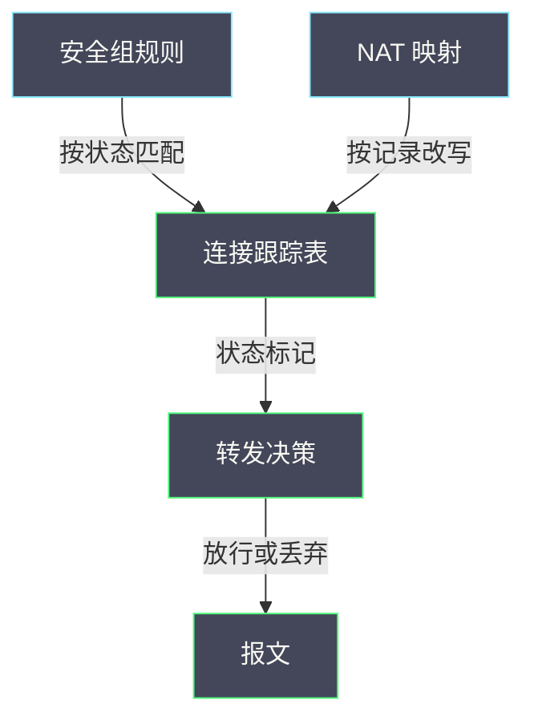

# 04 安全组、conntrack、NAT 与连接异常

**摘要：**

安全组、连接跟踪与 NAT 是三个常被分开讨论、实际却共用一套状态机制的功能。理解它们的共同基础，才能解释那些「规则看着对但连接不通」的现象：连接跟踪是有状态、有容量、有超时的表，NAT 依赖它记录映射，安全组依赖它判断回程。本文从这套共享状态出发，讲清安全组的规则语义、连接跟踪的状态机与容量、NAT 的映射与语义、以及五类连接异常的表现与定位方法。全文回答两个问题：连接为什么会被拒绝或被丢弃，以及「偶尔不通」与「一直不通」分别指向什么。文中的命令与观察方式取自 2026 年 9 月的现场记录，涉及具体数值处标注口径；转发决策与连接跟踪的位置见本专栏 02 篇。

---

## 第 1 章 三个功能与一套状态

先建立一个整体认识：这三者不是三个独立模块，而是共享同一份状态。

### 1.1 三个功能的关系

**连接跟踪是基础**：它记录「哪些连接存在、处于什么状态」。

**安全组是消费者**：它按连接状态决定放行或丢弃。

**NAT 也是消费者**：它按连接记录决定地址与端口的改写。

**三者的关系是「一个状态表、两个使用者」**。**这解释了为什么它们的容量需求是叠加的**（与 02 篇「NAT 与安全组的容量需求」一致），**也解释了为什么一个功能的变更可能影响另一个**。

### 1.2 为什么这种关系容易被忽略

**因为三者常被当成独立功能配置**：安全组在租户侧配置、NAT 在路由侧配置、连接跟踪容量在宿主机侧配置。**配置界面分离，让人误以为机制也分离**。

**实际的表现是「改了安全组规则后 NAT 行为异常」或「调了连接跟踪容量后安全组生效范围变化」**。**这类现象若按独立功能理解，就会找不到原因**。

**因此第一步是建立「共享状态」的认知**——这与 02 篇「三种流的关系」是同一思路。

### 1.3 本篇的定位

**01 至 03 篇讲路径、转发与报文大小，本篇讲连接这一维**。

**读完本篇应当能回答**：连接为什么被拒绝、为什么被丢弃、以及五类连接异常的定位方法。

### 1.4 一张共享状态示意图



**图里最重要的一点是「两个使用者共用一张表」**：**安全组与 NAT 都依赖连接跟踪，因此它们的容量需求叠加、行为互相影响**。**这解释了为什么「单独调一个功能的参数」可能影响另一个**。

### 1.5 一个类比与它的边界

可以用「访客登记」来类比这套机制。

**连接跟踪像「访客登记簿」**：**每次新访客登记一次，之后进出凭登记记录**。**安全组像「准入规则」**：**它按登记状态决定是否放行**。**NAT 像「房间号改写」**：**它按登记记录把外部房间号映射到内部**。

**类比的价值在于「它解释了为什么回程不需要额外规则」**：**已登记的访客不需要重新登记**。**这也解释了为什么「登记簿满了新访客进不来」**——容量问题的直观理解。

**类比的边界在于「登记簿是持久化的，而连接跟踪会被超时清除」**：**空闲的连接会被遗忘**。**因此「昨天登记过」不意味着「今天还认」**——**这一点比登记簿更严格，也是超时问题的根源**。

### 1.6 一个共享状态的实例

设想一次「调整安全组规则后，原本正常的 NAT 访问异常」的问题。

**现象**：为某虚机新增了一条安全组规则，之后该虚机的对外访问（经过 NAT）偶尔失败。**直觉判断**：新规则有冲突。

**实际原因可能是「连接跟踪容量压力」**：**新规则改变了流量的匹配方式，可能导致更多连接被跟踪**（例如从「复用连接」变成「每条都新建」），**从而推高了连接跟踪的条目数，接近容量上限**。

**验证方法**：**对比调整前后的连接跟踪条目数与失败率**。**如果条目数明显上升且接近上限，即可确认**。

**这个实例的价值在于「它演示了共享状态如何导致跨功能影响」**：**改了安全组，问题出在连接跟踪，表现是 NAT 访问失败**。**按独立功能理解就会找不到原因**——**这正是 1.2 节要建立的认知**。

### 1.7 三个功能的边界划分

三个功能虽然共用状态，但职责边界清晰，理解边界有助于判断「该改哪一个」。

**连接跟踪负责「记住连接」**：**它不决定放行或改写，只提供状态**。**因此它的可调项是容量、超时与内存**。

**安全组负责「按状态决定放行」**：**它不关心地址如何改写**。**因此它的可调项是规则**。

**NAT 负责「按记录改写地址」**：**它不关心是否放行**。**因此它的可调项是映射范围与出口**。

**三者的边界划分带来一个实用的判断**：**「连接被拒绝」改规则，「连接被遗忘」改超时，「映射不够用」改端口范围，「表存不下」改容量**。**四类问题的处置对象不同**——**混淆它们会导致改错参数**。

**这与 02 篇「三个面的归属」是同一方法**：**先判断问题属于哪个职责，再决定改什么**。

### 1.8 三个功能的变更影响面

三个功能的变更影响面不同，理解它有助于评估变更风险。

**安全组变更的影响面是「规则对应的流量」**：**它通常精确**（只影响被规则覆盖的连接）。**但 1.6 节的实例说明，它也可能通过状态压力间接影响更广**。

**连接跟踪变更（容量、超时）的影响面是「所有经过该节点的连接」**：**它不精确**，因此**风险更高**。

**NAT 变更（端口范围、出口）的影响面也是「所有经过 NAT 的连接」**：**风险同样较高**。

**三者的影响面排序是「安全组最小，连接跟踪与 NAT 较大」**。**因此变更的审批与回退要求应当与影响面匹配**——**影响面越大，要求越严**。

**这与 07 篇「门禁的强度与影响面匹配」是同一原则**：**不是所有变更都需要同样的流程**，而是按影响面分级。

## 第 2 章 安全组的规则语义

安全组是最容易被误解的一层，因为它的语义与「防火墙」不完全相同。

### 2.1 规则的两侧

**安全组规则分「出方向」与「入方向」两类**，各自定义「允许什么」。

**关键在于「入方向规则不是必须的」**：**由于连接跟踪的存在，已建立连接的回程流量会被自动放行**，不需要显式的入方向规则。

**这解释了为什么「只配出方向也能收到回程」**——**回程匹配的是「已建立」状态，而不是一条显式的入方向规则**。

### 2.2 默认行为

**安全组的默认行为是「默认拒绝」**：**没有规则允许的流量被丢弃**。

**这与某些防火墙的「默认允许」相反**，因此**从其他环境迁移过来的规则需要检查默认行为是否一致**。

**默认拒绝的设计取向是「安全优先」**：**忘记配置的后果是「不通」而不是「敞口」**。**代价是「忘记配置会表现为故障」**，而故障比敞口更容易被发现。

### 2.3 规则的方向与状态

**规则可以按状态匹配**：**「新建」状态对应「这条连接是否允许建立」**，**「已建立」状态对应「已有连接的回程是否放行」**。

**因此一条「允许某端口新建」的出方向规则，隐含了「允许该端口连接的回程」**。**这是「只配出方向」能工作的机制原因**。

**理解这一点，就能解释一个常见现象**：**「把出方向规则删掉后，回程也不通了」**——因为回程依赖「已建立」状态，而状态来自出方向的「新建」。

### 2.4 常见误解

**误解一：以为需要配双向规则**。实际上单向加状态即可。**误解二：以为规则顺序重要**。安全组是「允许列表」，不是「按顺序匹配的规则链」。**误解三：以为安全组能限制出方向的目标**。部分实现支持，但语义与防火墙不同。

**三个误解的共同根源是「把安全组当成传统防火墙」**。**它是「基于连接的允许列表」，不是「逐包匹配的规则链」**——**理解这个定位，就能避免大部分配置错误**。

### 2.5 一个规则实例

设想为一个需要访问外部数据库的虚机配置安全组。

**需求**：虚机能主动连接外部数据库的某个端口，并能收到响应。

**配置**：**只需要一条出方向规则**（允许到该端口的新建连接）。**入方向不需要显式规则**——回程由连接状态放行。

**验证方法**：**从虚机侧发起连接，确认能建立且能收到响应**。**如果连接建立但收不到响应，说明回程被拦或状态未提交**。

**这个实例的实践含义是「规则数量可以很少」**：**基于连接的语义让规则从「双向逐包」简化为「单向按连接」**。**代价是「必须理解状态机制」**——不理解就会配出冗余或错误的规则。

### 2.6 一个误解的排查实例

设想一次「配了双向规则但仍然不通」的问题。

**现象**：为某服务同时配了出方向与入方向规则，但连接仍不通。**直觉判断**：规则没生效。

**实际原因可能是「入方向规则与状态判断冲突」**：**如果实现采用「先过滤后连接跟踪」的顺序，入方向规则会先于状态判断生效，可能拦截尚未被识别为「已建立」的回程报文**。

**排查方法**：**先移除入方向规则，只保留出方向**，观察是否恢复。**如果恢复，说明入方向规则与状态机制冲突**。

**这个实例的启示是：「多配规则」不等于「更宽松」**。**在基于状态的机制里，多余的显式规则可能与状态判断冲突**——**这与 2.4 节「误解一」直接对应**。

### 2.7 安全组与连接跟踪的对照

把安全组与连接跟踪对照，可以看出两者的分工。

| 维度 | 安全组 | 连接跟踪 |
| :--- | :--- | :--- |
| 职责 | 决定放行或丢弃 | 记录连接状态 |
| 可调项 | 规则 | 容量、超时 |
| 失败表现 | 一直不通或单向不通 | 偶尔不通或空闲后失败 |
| 影响范围 | 单条规则对应的流量 | 所有经过该节点的连接 |

**四行的对照说明「两者的失败表现不同」**：**安全组问题倾向「确定性失败」，连接跟踪问题倾向「概率性失败」**。

**这个区分是 5 章五类异常的基础**：**「一直不通」与「单向不通」倾向规则问题，「偶尔不通」倾向状态问题**——**用失败形态区分职责，是排查的第一步**。

### 2.8 安全组的一个边界

安全组有一个容易忽略的边界：**它作用于「连接」而不是「路径」**。

**这意味着「安全组无法限制流量的路径」**：**它只能决定「这条连接是否允许」，不能决定「流量走哪条路」**。**路径控制是路由与网络策略的职责**。

**这个边界的实践含义是**：**如果需求是「限制某类流量只能走某条链路」，安全组做不到**。**需要改用路由策略或其他机制**。

**理解边界能避免「用错工具」**：**把路径需求写成安全组规则，会得出「规则配了但没效果」的结论**——**而实际是「这个工具不负责这件事」**。

**这与 07 篇「技术适用边界比技术本身更重要」是同一要求**：**知道「它不做什么」比知道「它能做什么」更实用**。

## 第 3 章 连接跟踪的状态机与容量

连接跟踪是这套机制的核心，它有明确的状态与容量边界。

### 3.1 连接的生命周期

**连接的生命周期是「新建 → 已建立 → 关闭（或被超时清除）」**。

**「新建」只出现一次**（第一个报文），之后都是「已建立」。**因此「新建」状态是「连接是否被允许」的判定点**。

**「关闭」由协议的结束报文触发**（如 TCP 的结束标志），**如果没有收到结束报文，连接只能靠超时清除**。

### 3.2 状态与超时

**每种状态有自己的超时时间**：**未完全建立的连接超时较短，已建立的连接超时较长**。**空闲连接会被清除**。

**超时带来的后果是「连接被遗忘」**：**如果一条连接长时间空闲后被清除，之后到达的报文会被当成「无效」而丢弃**。

**这解释了一类现象**：**「长时间空闲的连接突然不可用，重建后正常」**。**它不是「网络问题」，而是「状态被超时清除」**——这与 02 篇「忽略超时」是同一陷阱。

### 3.3 容量与上限

**连接跟踪有容量上限**。**达到上限后，新连接会被丢弃**。

**表现是「间歇性不通」**：**已有连接正常，新连接偶尔失败**。**这个表现很容易被误判为「网络抖动」**。

**判断方法是看「条目数与上限的比值」**：**如果接近上限，说明容量不足**。**这与 02 篇「连接跟踪容量规划」是同一方法**。

### 3.4 观测方法

```bash
# 查看连接跟踪条目
conntrack -L | head -20

# 查看统计与容量上限
conntrack -S
sysctl net.netfilter.nf_conntrack_max
sysctl net.netfilter.nf_conntrack_count

# 查看超时设置
sysctl -a 2>/dev/null | grep nf_conntrack_.*timeout
```

**观测的要点是「同时看条目数、上限与超时」**。**三者中任何一个异常都会导致连接问题**，只看其中一个无法判断。

### 3.5 一个状态实例

设想一次「连接建立后长时间空闲，再次使用时失败」的问题。

**现象**：连接建立正常，但空闲一段时间后，该连接不可用。**重建连接后正常**。

**原因通常是「连接被超时清除」**：**空闲期间连接跟踪条目被清除，之后到达的报文被当成「无效」**。

**验证方法**：**查看超时设置，并与业务的空闲间隔对比**。**如果空闲间隔大于超时，就会出现这个问题**。

**处置方向是「调整超时或调整业务心跳」**：**两者匹配即可**。**这与 7.2 节「超时与心跳的匹配」是同一要求**。

### 3.6 状态表的三个约束

连接跟踪表有三个约束，它们共同决定了它的行为。

**约束一是「容量」**：**表能存多少条**。**约束二是「超时」**：**条目多久被清除**。**约束三是「内存」**：**条目越多占用内存越多**。

**三个约束的关系是**：**超时越长，同样并发下占用越多（受容量与内存约束）**；**容量越大，内存占用越多**。**因此调整任何一个都会影响另外两个**。

**这与 7.3 节「容量与超时相关」是同一件事**，这里从约束的角度再说明一次。**理解三个约束的耦合关系，才能做出合理的参数选择**。

### 3.7 连接跟踪的一个观察实例

设想一次需要判断「容量是否充足」的观察。

**第一步看条目数**：**当前有多少条连接被跟踪**。**第二步看上限**：**表能容纳多少条**。**第三步算比值**：**条目数除以上限**。**第四步看趋势**：**比值是否在上升**。

**四步里，第四步最关键**：**单看比值可能得出「还够用」的结论，但趋势上升说明即将不够**。**这与 03 篇「看趋势不看快照」是同一方法**。

**进一步观察可以看「条目按状态的分布」**：**如果大量条目处于「未完全建立」状态，说明有连接在异常建立**，可能是扫描或配置错误。**这类观察能发现比「容量不足」更早的问题**。

### 3.8 状态分布的一个观察

连接跟踪的条目可以按状态分布观察，这个视角能发现容量之外的问题。

**观察方法**：**统计各状态的条目占比**。**如果「未完全建立」占比高**，说明有大量连接在建立过程中失败或被中断。

**「未完全建立」占比高的常见原因**：**扫描行为**（大量无后续的连接）、**配置错误**（目标不可达导致连接一直重试）、或**网络问题**（握手报文丢失）。

**这个观察的价值在于「它比容量告警更早」**：**容量告警只在接近上限时触发，而状态分布异常在容量充裕时就能发现**。

**这与 08 篇「趋势告警要早于阻塞告警」是同一思路**：**越早的信号越有价值**。

### 3.9 状态机制的一个代价

状态机制带来一个常被忽略的代价：**「故障恢复需要时间」**。

**因为连接状态是有生命的**：**节点故障恢复后，原有连接的状态丢失**，需要重建。**而重建需要时间**（重新握手、重新建立状态）。

**这个代价在两种场景下明显**：**节点重启**（状态表清空）与**服务切换**（映射指向旧实例，见 4.7 节）。

**理解这个代价能解释一个现象**：**「重启后部分业务需要一段时间才恢复正常」**。**它不是「恢复不彻底」，而是「连接需要重建」**。

**这与 [[SRE/CVM集群可靠性工程/07 备份恢复演练——RPO、RTO、数据校验与应用可用性|07 备份恢复演练]] 的「恢复的终点是业务可用」是同一关切**：**基础设施恢复不等于业务恢复**，中间还有状态重建的环节。

## 第 4 章 NAT 的映射与语义

NAT 是连接跟踪的主要消费者，它的语义值得单独说明。

### 4.1 两种 NAT

**源地址转换（SNAT）改写发出报文的源地址**，让内部地址能访问外部。**目标地址转换（DNAT）改写到达报文的目标地址**，让外部能访问内部服务。

**两者的共同点是「改写地址并记录映射」**：**改写后的连接被记录，回程按记录改回**。

### 4.2 映射的粒度

**NAT 映射的粒度是「连接」而不是「报文」**：**同一条连接的所有报文使用同一个映射**。

**这带来一个重要后果**：**映射的生命周期与连接一致**。**连接被超时清除后，映射也随之失效**。**因此「映射丢失」与「连接丢失」是同一件事**。

**理解这一点，就能解释「NAT 场景下超时更敏感」**：**超时不仅让连接失效，还让映射失效**。

### 4.3 端口耗尽

**SNAT 场景下，可用端口数有限**。**如果并发连接数接近可用端口数，新连接可能无法建立**。

**表现是「新建连接失败，但已有连接正常」**——与 3.3 节「容量不足」的表现类似。

**判断方法**：**查看端口的使用情况与并发连接数**。**如果接近上限，说明端口耗尽**。

**这与 3.3 节的容量问题是两个独立的限制**：**一个是「表能存多少条」，一个是「能映射多少个端口」**。**两者都可能成为瓶颈**。

### 4.4 与安全组的交互

**NAT 与安全组的顺序影响规则语义**。

**如果先过滤后 NAT**：**安全组看到的是原始地址**，规则按内部地址书写。**如果先 NAT 后过滤**：**看到的是改写后的地址**，规则按外部地址书写。

**主流实现选择「先过滤后 NAT」**，因为这样规则语义清晰。**因此安全组规则不感知 NAT 的存在**——与 03 篇「封装与安全组的交互」是同一类判断。

### 4.5 一个 NAT 实例

设想一次「内部服务对外暴露后，部分外部客户端连不上」的问题。

**现象**：多数外部客户端能连接，少数连不上。**排查**：服务本身正常。

**可能原因之一是「端口耗尽」**：**如果并发连接数接近可用端口数，新连接无法映射**。

**验证方法**：**查看端口使用情况与并发连接数**。**如果接近上限，说明端口耗尽**。

**处置方向是「扩大可用端口范围或减少并发」**。**但要注意「扩大范围」受实现与协议限制**——**这与 4.3 节「可用端口数有限」是同一约束**。

**这个实例说明「NAT 场景的容量问题是双重的」**：**既要看连接表容量，也要看端口容量**。

### 4.6 一个端口耗尽的实例

用一个算例说明端口耗尽的边界。

**假设 SNAT 可用端口范围是一万个**。**如果业务在短时间内需要建立一万两千个并发连接，就会有两千个无法映射**。

**表现是「大部分连接成功，少数失败」**——**失败的连接会在稍后重试时可能成功**（因为之前的连接可能已释放）。

**这个表现的辨识度不高**：**它看起来像「偶发失败」或「网络抖动」**。

**判断方法是「看并发连接数与端口使用率」**：**如果端口使用率接近上限，即可确认**。

**处置方向是「扩大端口范围、减少并发、或使用多个出口地址」**——**第三种相当于把可用端口数乘以出口数**，是最彻底的手段。

### 4.7 一个映射丢失的实例

设想一次「NAT 后的连接在业务切换时失败」的问题。

**现象**：外部流量经过 NAT 到达内部服务，服务在某个时刻切换实例，之后部分连接失败。

**原因可能是「映射与连接绑定」**：**服务切换后，原有连接的映射仍指向旧实例**，因此这些连接失败，而新连接正常。

**验证方法**：**对比失败连接与成功连接的建立时间**。**如果失败的都是切换前建立的，即可确认**。

**处置方向是「等待旧连接超时释放，或主动清理」**。**这也是「服务切换需要考虑连接排空」的原因**——**连接排空的时间应当与超时设置匹配**，否则切换期间会有持续的失败。

**这个实例说明「NAT 的映射粒度是连接」这一性质在变更场景下的影响**。

### 4.8 NAT 场景的一个排查顺序

NAT 场景的排查可以按一个固定顺序。

**第一步确认「是否涉及 NAT」**：**看流量是否经过地址改写**（从两端看到的地址是否不同）。**第二步确认「映射是否存在」**：看连接跟踪里是否有对应记录。

**第三步确认「映射是否正确」**：看改写后的地址是否符合预期。**第四步确认「映射是否充足」**：看端口使用率。

**四步的顺序是「先确认存在、再确认正确、最后确认充足」**。**跳过第一步会在不涉及 NAT 的问题上浪费时间**——**这与 01 篇「先确认现象属于哪一类」是同一纪律**。

**一个实用的判断是「对比两端看到的地址」**：**如果不同，说明经过 NAT**；**如果相同，说明不涉及**。

## 第 5 章 五类连接异常

把连接异常归为五类，能快速缩小排查范围。

### 5.1 一直不通

**表现**：连接从未成功建立。**原因**：**规则未放行、路由不可达、或目标未监听**。

**这三者的区分方法**：**看是否有「丢弃」记录**（有则规则问题）、**看是否有回报**（无回报可能路由问题）、**看目标侧是否监听**。

### 5.2 单向不通

**表现**：请求能到达但回程不通。**原因**：**出方向放行但状态未提交、或回程被显式规则拦截**。

**这与 01 篇「安全组问题表现为单方向不通」一致**。**定位方法是看两端的连接状态**。

### 5.3 偶尔不通

**表现**：多数时间正常，偶尔失败。**原因**：**连接跟踪容量不足、端口耗尽、或超时清除**。

**这三者的区分**：**容量不足与端口耗尽的失败是「新连接失败」**；**超时清除的失败是「空闲后首次失败」**。

**区分方法**：**看失败的时间分布**——**随机失败倾向容量问题，空闲后失败倾向超时问题**。

### 5.4 建立后中断

**表现**：连接建立成功，运行一段时间后中断。**原因**：**超时清除、或中间设备的状态表超时**。

**「中间设备的状态表超时」容易被忽略**：**路径上的设备也可能有自己的状态表**，其超时可能与两端不一致。**这会导致「两端都认为连接存在，但中间已经遗忘」**。

**这与 05 篇「中间设备的依赖」是同一类问题**。

### 5.5 性能异常

**表现**：连接可用但慢。**原因**：**分片（见 03 篇）、重传、或状态表压力导致的处理延迟**。

**这一类需要与前三类区分**：**前三类是「通与不通」，这一类是「通但慢」**。**两者的排查方向完全不同**。

### 5.6 五类异常的一个对照表

| 类别 | 表现 | 主要原因 | 区分方法 |
| :--- | :--- | :--- | :--- |
| 一直不通 | 从未建立 | 规则、路由、未监听 | 看丢弃与回报 |
| 单向不通 | 有去无回 | 状态未提交、回程拦截 | 看两端状态 |
| 偶尔不通 | 随机或空闲后失败 | 容量、端口、超时 | 看失败时间分布 |
| 建立后中断 | 用一段时间后断 | 超时清除 | 看超时与心跳 |
| 通但慢 | 可用但慢 | 分片、重传、状态压力 | 看报文大小 |

**五行的区分方法是「看表现的时间分布与方向性」**。**时间分布区分「随机」与「空闲后」，方向性区分「单向」与「双向」**——**这两个维度组合起来，就能把五类分开**。

### 5.7 五类异常的一个排查顺序

五类异常的排查顺序可以统一为三步。

**第一步，确认「通与不通」还是「通但慢」**：**如果是慢，先按 03 篇查分片与报文大小**。

**第二步，确认「一直不通」还是「偶尔不通」**：**一直不通查规则与路由；偶尔不通查容量、端口与超时**。

**第三步，确认「单向」还是「双向」**：**单向查状态提交与回程；双向查规则与路由**。

**三步的顺序是「先粗分后细分」**。**第一步把「慢」这一类排除掉，能避免在错误的维度上排查**——**这与 01 篇「先判断现象属于哪一类」是同一纪律**。

### 5.8 五类与职责的对应

把五类异常与三个职责对应起来，可以直接得出「该查什么」。

| 类别 | 主要职责 | 次要职责 |
| :--- | :--- | :--- |
| 一直不通 | 安全组（规则） | 路由 |
| 单向不通 | 安全组（状态提交） | 连接跟踪 |
| 偶尔不通 | 连接跟踪（容量与超时） | NAT（端口） |
| 建立后中断 | 连接跟踪（超时） | 中间设备 |
| 通但慢 | 无（属报文大小维度） | 连接跟踪（压力） |

**五行的对应关系是「先看主要职责，再看次要职责」**。**这能避免在错误的职责上排查**——**与 1.7 节「该改哪一个」是同一方法**。

**最后一行值得注意**：**「通但慢」的主要职责不在本篇范围内**，**它属于报文大小维度（03 篇）**。**把它归到本篇会走错方向**。

### 5.9 五类异常的一个排查清单

- 确认是「通与不通」还是「通但慢」。
- 确认是「一直不通」还是「偶尔不通」。
- 确认是「单向」还是「双向」。
- 查安全组规则与状态提交。
- 查连接跟踪容量、上限与超时。
- 查 NAT 端口使用率。
- 查中间设备的状态超时。

**七条覆盖了五类异常的主要判据**。**前三条是分类，后四条是取证**。

**清单的用途是「避免遗漏」**：**在紧张场景下，人容易只查最熟悉的一两项**。**清单强制逐项确认**——**这与 08 篇「巡检清单」是同一形态**。

## 第 6 章 一次连接异常的定位

下面用一个实例把前面的概念串起来。

### 6.1 现象

某虚机对外部服务的连接「偶尔失败」，失败后重试通常成功。

### 6.2 分层定位

**第一步，归类**：属于 5.3 节「偶尔不通」。**第二步，看失败的时间分布**：如果是随机的，倾向容量问题；如果是空闲后，倾向超时问题。

**第三步，查连接跟踪**：看条目数、上限与超时设置。**第四步，查端口使用**：如果涉及 NAT，看端口是否接近耗尽。

**第五步，查规则**：确认安全组规则与状态提交是否正常。

### 6.3 结论与处置

**结论可能是「容量不足」「端口耗尽」或「超时过短」**。

**处置方向分别是**：**调整容量、减少并发连接数、或调整超时**。**三者都是配置层面的调整，不涉及架构改动**——**这也是为什么先查这三项最经济**。

### 6.4 定位方法的可迁移部分

这次定位可以提炼成三个动作：**先归类、再看时间分布、最后查三项参数**。

**第一个动作的关键是「把现象归到五类之一」**；**第二个动作的关键是「用时间分布区分容量与超时」**；**第三个动作的关键是「同时看容量、端口与超时」**。

**三个动作合起来，把「偶尔不通」从一个模糊描述变成一条可执行的路径**。**这与 01 篇「按现象定位段」是同一方法在连接维度的应用**。

### 6.5 一个定位记录模板

连接异常定位的记录应当包含：**类别**（五类之一）、**时间分布**（随机还是空闲后）、**方向性**（单向还是双向）、**相关参数**（容量、上限、超时、端口使用）、以及**结论与处置**。

**五项里，「时间分布」与「方向性」是区分五类的关键判据**。**记录它们，能让后来者直接按判据复核**，而不必重新观察。

**记录的价值在于「它把经验变成判据」**：**多次记录后，可以针对高频类别建立自动检查**（如「容量使用率告警」）——**这与 02 篇「排查记录模板」是同一思路**。

### 6.6 一个反例

一个常见的反例：把「偶尔连不上」当成网络不稳定，反复检查链路质量，结果一无所获。

**问题在于「没有看失败的时间分布」**：**如果失败是随机的，更可能是容量问题；如果是空闲后失败，更可能是超时问题**。**两者都与链路质量无关**。

**正确的做法是先看时间分布**：**统计失败发生的时刻，与「上次使用该连接的时刻」对比**。**如果失败都发生在长时间空闲之后，即可确认是超时问题**。

**这个反例的启示是：不要跳过「时间分布」这一步**。**它与「影响半径」一样，是能快速缩小范围的判据**——**这与 06 篇「先判断现象属于哪一类」是同一纪律**。

## 第 7 章 容量与超时的规划

容量与超时是这套机制的两个可调参数，需要规划。

### 7.1 容量的规划

**规划依据是「峰值并发连接数」**（与 02 篇一致）。**步骤是「测峰值、留余量、评估内存、设告警」**。

**留余量的必要性在于「突发」**：**业务可能短时间产生大量连接**，没有余量就会失败。

### 7.2 超时的规划

**超时规划需要平衡两个目标**：**超时太长会占用容量**（连接不能及时释放），**太短会导致空闲连接失效**。

**规划依据是「业务的连接空闲模式」**：**如果业务有明显的长空闲期（如心跳间隔很长），超时应当大于空闲期**。

**这一点常被忽略**：**业务的心跳间隔与连接跟踪超时之间需要匹配**，否则会出现「心跳还没发，连接已被清除」。

### 7.3 两者的关系

**容量与超时是相关的**：**超时越长，同样并发下占用的条目越多**。**因此两者应当一起规划**。

**调整其中一个时应当评估对另一个的影响**——**这与 02 篇「配置项之间有关联」是同一要求**。

### 7.4 一个规划实例

设想为一个平台规划连接跟踪容量与超时。

**第一步测峰值**：**统计业务的峰值并发连接数**（可从连接跟踪统计获得）。**第二步定容量**：**取峰值的一点五到两倍，留出突发余量**。**第三步定超时**：**取业务最长空闲间隔的一点五倍以上**。**第四步设告警**：**容量使用率超过阈值时预警**。

**四步里，第三步最容易被忽略**：**超时设置往往沿用默认值，而默认值未必匹配业务**。

**验证方法**：**上线后观察「空闲后首次失败」的比例**。**如果比例明显，说明超时偏短**。

### 7.5 一个超时调整的风险

超时调整有一个容易被忽略的风险：**它可能影响「已建立连接」的存活**。

**如果调短超时**：**当前空闲时间超过新超时的连接会被清除**，表现为「调整后部分连接突然失败」。**因此调整应当选择业务低谷，并通知相关方**。

**如果调长超时**：**连接会占用条目更久，容量压力上升**，可能触发容量问题。**因此调整后应当观察条目数变化**。

**两种调整的风险方向不同**：**调短影响连接存活，调长影响容量**。**因此调整前应当评估「当前连接的空闲分布」**，选择影响最小的方向与幅度。

**这与 06 篇「变更的抖动窗口」是同一关切**：**任何变更都应当评估它的影响窗口**。

### 7.6 一个规划的检查清单

- 业务的峰值并发连接数。
- 业务的最长空闲间隔。
- 当前容量上限与超时设置。
- 两者的余量是否充足。
- 容量使用率的告警阈值。
- 调整的回退方案。

**六项里，第二项最容易被漏**：**「最长空闲间隔」往往不在运维的常规观测范围内**，需要从业务侧获取。

**没有这一项就无法合理设置超时**——**只能沿用默认值，而默认值未必匹配**。**这与 7.2 节「超时规划需要业务输入」是同一要求**。

## 第 8 章 实验：验证容量与超时的影响

容量与超时的影响可以用受控实验验证。

### 8.1 实验设计

**变量**：连接跟踪容量或超时设置。**度量**：**在给定并发下的失败率**、**空闲后首次连接的成功率**。

**两个度量分别对应两类问题**：**前者测容量，后者测超时**。

### 8.2 实验的边界

**结论的边界有三**：**绑定业务特征**（连接模式不同结论不同）、**绑定并发水平**（容量问题的阈值与并发相关）、**绑定实现**（不同实现的默认值与行为可能不同）。

**把边界写进结论**，是本专栏实验方法的统一要求。

### 8.3 实验的一个记录模板

实验记录应当包含：**业务连接模式**（并发水平、空闲间隔）、**当前参数**（容量、超时、端口范围）、**变量**（调整哪个参数）、**结果**（失败率、空闲后首次成功率）、以及**边界**（适用的业务与并发水平）。

**「业务连接模式」这一项是这类实验的关键**：**容量与超时的合理取值完全取决于连接模式**。**没有连接模式的记录，实验结论无法被复用**——这与 06 篇「实验结论要绑定条件」是同一要求。

### 8.4 一个实验的简化流程

如果资源有限，可以用简化流程评估容量与超时。

**容量实验**：**逐步增加并发连接数，观察从哪个水平开始出现失败**。**这个水平就是「实际可用容量」**，可能与配置上限有差异（因为要留余量给其他连接）。

**超时实验**：**建立一条连接，然后停止使用，测量「多久后该连接失效」**。**这个时间就是「实际超时」**，可用于与业务空闲间隔对比。

**两个实验都不需要改动配置**（只是施加负载与等待），**风险很低**。**这与 06 篇「只读实验优先」是同一原则**。

**简化流程的产出是「两个实测值」**：**实际可用容量与实际超时**。**这两个值比配置值更贴近真实行为**。

### 8.5 实验的一个简化记录

简化实验的记录可以更紧凑，但要素不能少。

**必需要素是「参数、施加的负载、观察到的阈值」**。**三项缺一不可**：**没有参数无法复现，没有负载无法解释阈值，没有阈值无法得出结论**。

**可以省略的是「详细的时序数据」**：**简化实验只需要结论性的阈值**，不必保留全部过程数据。

**这个取舍的依据是「实验目的」**：**摸底只需阈值，制定策略才需要详细数据**——**这与 06 篇「简化流程适合快速摸底」是同一判断**。

## 第 9 章 误判与反例

第一，**以为安全组需要配双向规则**。连接状态会放行回程。

第二，**把安全组当成按顺序匹配的规则链**。它是允许列表。

第三，**把「偶尔不通」当成网络抖动**。可能是容量或超时问题。

第四，**只看连接条目数不看上限**。两者结合才能判断容量是否充足。

第五，**忽略超时与业务心跳的匹配**。心跳未发而连接已被清除。

第六，**把端口耗尽与容量不足混为一谈**。两者是独立的限制。

第七，**认为连接跟踪是无状态的**。它有状态、有容量、有超时。

第八，**忽略路径上其他设备的状态表**。中间设备的超时可能导致「两端认为连接存在」。

第九，**把「通但慢」与「不通」混为一谈**。两者的排查方向完全不同。

第十，**调整容量时不评估超时的影响**。两者是相关的。

第十一，**调整超时或容量后不做验证**。两者相关，调整一个可能影响另一个。

第十二，**把端口耗尽当成连接表容量不足**。两者是独立限制，处置方向不同。

第十三，**认为「多配规则更宽松」**。在基于状态的机制里，多余的显式规则可能与状态判断冲突。

第十四，**把「重启后业务未立即恢复」当成恢复失败**。连接状态需要重建，这需要时间。

第十五，**把简化实验的阈值当成精确结论**。阈值是范围，精确结论需要更完整的实验。

第十六，**把安全组变更当成「只影响对应流量」**。它可能通过状态压力间接影响更广。

## 第 10 章 边界与反例

第一，**机制描述绑定具体实现**。不同实现的安全组语义与连接跟踪行为可能有差异。

第二，**容量与超时的默认值因系统而异**。规划前先确认当前值。

第三，**端口耗尽的阈值取决于映射方式**。不同方式可用端口数不同。

第四，**实验结论绑定业务连接模式**。跨业务外推容易出错。

第五，**安全组语义可能随版本演进**。以现场版本为准。

第六，**把安全组规则与 NAT 规则分开理解**。两者共用连接状态，行为互相影响。

第七，**忽略路径上中间设备的状态超时**。它可能导致两端状态不一致。

第八，**调整超时时不评估对已建立连接的影响**。调短会清除空闲连接，调长会推高容量压力。

第九，**把配置上限当成实际可用容量**。实际可用容量会因余量与其他连接而低于上限，应当实测。

第十，**把「通但慢」归到连接维度排查**。它属于报文大小维度，排查方向不同。

第十一，**忽略状态重建需要时间**。节点恢复后，连接与映射都需要重建，业务恢复会滞后。

第十二，**在紧张场景下只查最熟悉的一两项**。清单的价值正在于强制逐项确认，避免遗漏。

第十三，**对影响面大的变更使用与影响面小的变更相同的流程**。连接跟踪与 NAT 的变更影响所有连接，应当更谨慎。

行文至此，把本篇落点收在两条原则上。其一，架构即权衡——用共享状态机制换来了「规则可基于连接语义书写」，代价是引入了一张有容量、有超时的状态表，这份代价必须被管理。其二，复杂性不会消失只会转移——把「逐包匹配」简化为「按连接匹配」，把复杂度从「规则数量」转移到了「状态表容量与超时」上。下一篇转向启动依赖这一维：虚机拿到地址、拿到元数据、完成初始化这三个环节如何串联，以及其中一个环节失败会如何表现。相邻的安全组与 QoS 配置见 [[云原生/OpenStack/07 Neutron 进阶——VXLAN、DVR 与安全组|07 Neutron 进阶]]，连接跟踪在转发路径中的位置见本专栏 02 篇。

---

## 速查卡：连接异常的定位

这张表把连接异常的现象与优先怀疑的职责对应起来，用于快速定向。使用时的顺序是「先归类（通与不通、一直与偶尔、单向与双向），再查对应职责」。

三条纪律值得写在表前：**第一，先判断是「通与不通」还是「通但慢」**（后者属报文大小维度）；**第二，用时间分布区分容量与超时**（随机倾向容量，空闲后倾向超时）；**第三，记住三个功能共用一套状态**（改一个可能影响另一个）。

最后一点：**这套机制的复杂度不在「配置规则」，而在「管理状态」**。规则可以写得很少，但状态需要规划容量、设置超时、监控水位。**因此把「状态管理」纳入日常运维，比在故障时排查更有效**——这与 08 篇「运维工程化」是同一思路。

补充一句关于变更的提醒：**容量与超时的变更影响所有连接，因此风险高于规则变更**。**变更前应当评估「当前连接的空闲分布与容量水位」，并选择业务低谷执行**。

再补一句关于观测的提醒：**连接跟踪的状态分布比容量使用率更早暴露问题**。**把「未完全建立占比」纳入监控，能在容量告警之前发现问题**——**这也是「趋势告警早于阻塞告警」的具体应用**。

再补一句关于排查效率的提醒：**不要在不涉及 NAT 的问题上排查 NAT**。**先用「两端看到的地址是否相同」判断是否涉及**，这一步只需一次对比，却能省下大量时间。

最后补一句关于恢复的提醒：**状态机制意味着「基础设施恢复不等于业务恢复」**。**评估恢复时间时，应当把「连接与映射重建」的时间计入**——否则会得出「恢复不完整」的错误结论。

| 现象 | 优先怀疑 | 关键证据 |
| :--- | :--- | :--- |
| 一直不通 | 规则、路由或未监听 | 丢弃记录与回报 |
| 单向不通 | 状态未提交或回程拦截 | 两端连接状态 |
| 随机偶尔不通 | 容量不足或端口耗尽 | 条目数、上限与端口使用 |
| 空闲后首次失败 | 超时清除 | 超时设置与心跳间隔 |
| 建立后中断 | 两端或中间超时 | 中间设备状态表 |
| 通但慢 | 分片或状态表压力 | 报文大小与处理延迟 |

## 口径与事实说明

- 命令与观察方式取自 2026 年 9 月的现场记录，属某时点实践，不构成唯一正确用法。
- 机制描述（安全组语义、连接跟踪状态与容量、NAT 映射、状态超时）属于相关实现的稳定行为。
- 容量与超时的默认值因系统而异，规划前先确认当前值。
- 文中命令均为只读观测类操作，规则与容量调整须走审批并回读。
- 各实现的安全组语义与连接跟踪默认值差异较大，排查前先确认实现与版本。
- 容量与超时的取值需按业务连接模式实测确定，本文只给规划方法与顺序。
- 连接跟踪与 NAT 的变更影响所有连接，变更前应评估影响面并准备回退方案。
- 状态分布与容量水位的监控阈值需按现场基线确定，不要照搬通用阈值。
- 本文与本专栏其余篇目共享同一套观察方法与口径纪律，相邻篇目已展开的机制不在此重复推导。
- 观测方法绑定当前实现与版本，命令名称与输出格式以现场为准。
- 本文的判据与顺序可直接用于同类连接机制，具体参数需按现场调整并以实测为准。
- 排查记录应当保留「类别、时间分布、方向性、参数、结论」五项，供后续复核与经验沉淀。
- 容量与超时的调整应当选择业务低谷执行，并提前通知相关方。
- 观测的采样频率与保留时长需按排查需要确定，过短的保留会丢失关键证据。
- 本文的结论以软件交换与状态过滤方案为背景，其他方案的状态机制可能不同。
- 安全组规则的具体语法与字段随平台版本演进，配置前先确认当前版本的语义。
- 本文的排查与规划流程可纳入运维手册，使经验不依赖个人记忆，便于团队共享。
- 涉及连接状态的变更应当纳入变更管理，并按影响面确定审批与回退要求，影响面越大要求越严。

---

## 参考资料

1. OpenStack 官方文档，安全组与连接跟踪：<https://docs.openstack.org/neutron/latest/admin/>
2. Open vSwitch 官方文档，连接跟踪：<https://docs.openvswitch.org/en/latest/topics/conntrack/>
3. Linux 内核文档，连接跟踪与超时：<https://www.kernel.org/doc/html/latest/networking/nf_conntrack-sysctl.html>
4. RFC 3022，传统 IP 网络地址转换：<https://datatracker.ietf.org/doc/html/rfc3022>
5. RFC 4787，NAT 行为要求：<https://datatracker.ietf.org/doc/html/rfc4787>
6. 内部现场素材：CVM 集群网络故障复盘（2026-09，脱敏）

---

> [!note] 思考题
> 1. 为什么「只配出方向规则也能收到回程」，这与连接状态有什么关系。
> 2. 安全组为什么不是「按顺序匹配的规则链」，这个定位差异会带来什么配置错误。
> 3. 「随机失败」与「空闲后首次失败」分别指向什么问题，如何区分。
> 4. 容量不足与端口耗尽为什么是两个独立的限制，各自的判断方法是什么。
> 5. 为什么调整超时时必须评估容量的影响，两者是什么关系。
