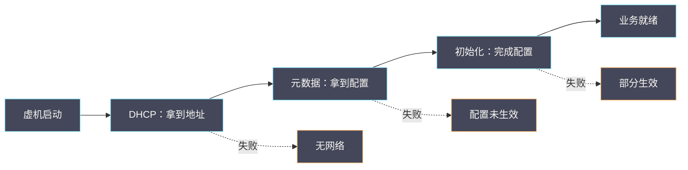

# 05 DHCP、Metadata 与 cloud-init

**摘要：**

虚机启动后的前几十秒里，有三个环节依次依赖：拿到网络地址、拿到配置元数据、完成系统初始化。三者是串联的，因此**第一个环节失败会表现为「系统启动异常」，而真正的故障在网络上**。本文从这条依赖链出发，讲清 DHCP 的交互过程与常见失败、Metadata 服务的访问路径与鉴权、cloud-init 的各个阶段与幂等性、以及链式失败如何表现为「看起来不像网络问题」的症状。全文回答两个问题：虚机启动异常时该从哪里查起，以及这三个环节各自有哪些典型失败。文中的命令与观察方式取自 2026 年 9 月的现场记录，涉及具体数值处标注口径；DHCP 与 Metadata 在路径中的位置见本专栏 01 篇，连接状态与过滤见 04 篇。

---

## 第 1 章 一条串联的依赖链

三个环节的关系是「串联」，理解这一点是排查的前提。

### 1.1 三个环节的顺序

**第一个环节是「拿到地址」**：虚机通过 DHCP 获取 IP 地址、网关与 DNS 等信息。**没有地址，后面都无从谈起**。

**第二个环节是「拿到元数据」**：虚机从元数据服务获取实例相关的信息（如实例标识、公钥、用户数据）。**这一步依赖第一个环节提供的网络**。

**第三个环节是「完成初始化」**：初始化程序根据元数据执行配置（设置主机名、注入公钥、执行用户脚本）。**这一步依赖第二个环节的数据**。

**三者的顺序不可颠倒**，因此**任何一环失败都会让后续环节无法完成**。

### 1.2 为什么这个顺序重要

**因为它决定了「症状」与「根因」的错位**。

**第一个环节失败**：**症状是「虚机没有网络」**，与根因一致，容易定位。

**第二个环节失败**：**症状是「初始化未完成」**（如主机名未设置、公钥未注入），但**根因可能在网络**（元数据服务不可达）。

**第三个环节失败**：**症状是「初始化报错或部分完成」**，根因可能在元数据内容、脚本逻辑或系统环境。

**「症状与根因错位」是这条链最难的地方**——**排查时必须沿着链反向追，而不是在症状出现的地方找原因**。

### 1.3 本篇的定位

**01 至 04 篇讲路径、转发、报文大小与连接**，**本篇讲「启动依赖」这一维**。

**读完本篇应当能回答**：启动异常的排查顺序、三个环节各自的典型失败、以及如何区分「链上某一环失败」与「该环自身的问题」。

### 1.4 一张依赖链示意图



**图里最关键的是三条虚线**：**每一环失败都有对应的症状**。**排查时「由症状反查环节」，比「从症状处深挖」高效得多**——**这也是本篇的核心方法**。

### 1.5 一个类比与它的边界

可以用「入住流程」来类比这条依赖链。

**DHCP 像「领房卡」**：**没有房卡就进不了房间**。**元数据像「领入住须知」**：**须知里写着房间号、网络密码等信息**。**初始化像「按须知布置房间」**：**根据须知设置各种配置**。

**类比的价值在于「它解释了为什么症状与根因会错位」**：**如果没领到须知，房间布置就会不完整**。**但表象是「房间没布置好」，而不是「没领到须知」**。

**类比的边界在于「入住流程是人执行的，可以看到每一步」**：**而虚机的启动过程是自动的，中间步骤不显式呈现**。**因此「可见性」是本篇的核心问题**——**这也是为什么日志与抓包在排查中如此重要**。

### 1.6 三个环节的可见性

三个环节的可见性不同，这决定了排查的难度。

**DHCP 的可见性最好**：**它有明确的报文交互，可以在虚机侧与宿主机侧抓包**。**因此「交互是否走完」是一个可直接观察的问题**。

**元数据的可见性中等**：**它是一次请求响应，可以在虚机侧发起并观察结果**。**但「服务端为什么返回这个内容」需要看服务端**。

**初始化的可见性最差**：**它是多阶段的自动过程，中间步骤只体现在日志里**。**如果日志不完整（如被截断或未开启），排查会很困难**。

**可见性的差异带来一个实践含义**：**排查应当「从可见性好的环节开始」**。**先确认 DHCP 与元数据是否正常，再去啃初始化的日志**——**这与 01 篇「先用低成本手段缩小范围」是同一原则**。

### 1.7 依赖链与故障域

依赖链与故障域的关系值得说明，因为它决定了「一次故障影响多少虚机」。

**DHCP 与元数据服务是「共享服务」**：**它们的故障会影响多台虚机**（所有正在启动的）。**因此它们是「共享故障域」**。

**初始化是「每台虚机独立执行」**：**它的失败只影响单台虚机**（除非是镜像本身的问题）。

**这个区分的实践含义是**：**「多台虚机同时异常」指向共享服务，「单台虚机异常」指向独立环节或该虚机本身**。

**这与 [[SRE/CVM集群可靠性工程/05 共享故障域——网络、存储和控制面同时异常时的恢复顺序|05 共享故障域]] 是同一思路**：**先判断影响面，再判断是共享还是独立**。

**它也解释了 5.4 节实例的价值**：**「只影响新建虚机」这个特征把范围限定到了「启动时依赖的共享服务」上**。

## 第 2 章 DHCP 的交互与失败

第一个环节是拿到地址。

### 2.1 交互过程

**DHCP 的交互是四步**：**发现**（客户端广播寻找服务端）、**提供**（服务端回应可用的地址）、**请求**（客户端请求使用某个地址）、**确认**（服务端确认分配）。

**四步完成后，客户端才真正获得地址**。**因此「看到发现报文」不等于「拿到地址」**——**必须看到确认**。

**这个区分很重要**：**排查时只看「有没有 DHCP 报文」会得出错误结论**，必须看交互是否走完四步。

### 2.2 服务端的位置

**DHCP 服务通常运行在网络命名空间里**（与 01 篇「内部端口」相关）。**它通过网络命名空间接入租户网络，为虚机提供地址**。

**因此「DHCP 不可用」的常见原因是「命名空间里的服务异常」**，而不是「网络不通」。**这与 01 篇「宿主机需要显式接入」是同一机制**。

**判断方法**：**看命名空间是否存在、服务是否在运行、内部端口是否正常**。

### 2.3 常见失败

**失败一：交互未走完**。**表现为「有发现报文但没有确认」**，原因可能是服务端异常或中间过滤。

**失败二：地址池耗尽**。**表现为「交互走完但分配失败」**，原因可能是地址池不足或分配冲突。

**失败三：配置项缺失**。**表现为「拿到地址但没有网关或 DNS」**，原因可能是服务端配置不完整。

**三类失败的表现不同**：**第一类是「不通」，第二类是「无可用资源」，第三类是「信息不完整」**。

### 2.4 观测方法

```bash
# 查看虚机侧的地址与 DHCP 租约
ip addr show
cat /var/lib/dhcp/*.leases 2>/dev/null | head

# 查看宿主机侧的命名空间与 DHCP 服务
ip netns list
ip netns exec <ns> ps aux | head

# 在虚机侧抓 DHCP 报文
tcpdump -i <iface> -nn 'udp port 67 or udp port 68' -c 10
```

**观测的要点是「同时看虚机侧与服务端侧」**。**只看一侧无法判断是「请求没发出」还是「服务没响应」**——这与 01 篇「跨视角对照」是同一方法。

### 2.5 一个 DHCP 实例

设想一次「虚机启动后没有网络」的问题。

**第一步，在虚机侧确认状态**：查看地址是否分配。**如果没有地址，进入第二步**。

**第二步，在虚机侧抓包**：确认 DHCP 报文是否发出。**如果看到发现报文但没有确认，说明交互未走完**。

**第三步，在宿主机侧查服务**：查看命名空间与服务状态。**如果服务未运行或异常，即为根因**。

**第四步，查地址池**：如果服务正常但分配失败，查地址池是否耗尽。

**四步的顺序是「虚机侧到服务端侧」**。**这与 01 篇「分段法」是同一方法**：**从一端向另一端追，用「有与无」定位断点**。

**这个实例的典型结论是「DHCP 服务异常」**，而**症状是「虚机没有网络」**——**症状与根因在同一环内，因此这类问题相对容易定位**。

### 2.6 DHCP 的一个边界

DHCP 有一个边界值得说明：**它只负责「分配」，不负责「路由」**。

**这意味着「拿到地址」不等于「能通信」**：**地址、掩码、网关、DNS 都是配置项，任何一项错误都会导致通信异常**。

**因此「DHCP 成功」的判据不是「有地址」，而是「地址与所有配置项都正确」**。**只看地址会漏掉「网关错误」这类问题**。

**这一点与 2.3 节「配置项缺失」相关**：**配置项缺失是「没有」，配置项错误是「有但不对」**。**后者更隐蔽**——**因为「有配置」会让人以为没问题**。

**这与 03 篇「配置值不等于实际值」是同一类观察**：**「有配置」与「配置正确」是两件事**。

### 2.7 DHCP 的一个性能视角

DHCP 除了「通与不通」，还有「快与慢」这一维，值得说明。

**DHCP 的耗时由两部分构成**：**交互本身的往返时间**，以及**等待与重试的时间**（如果首次请求没有响应）。

**「首次请求无响应」会导致重试**，重试间隔通常是指数增长的。**因此「一次丢包」可能导致几十秒的延迟**——**这解释了「虚机启动偶尔很慢」的现象**。

**这个视角的实践含义是**：**「启动慢」可能不是系统问题，而是 DHCP 的一次重试**。**判断方法是看 DHCP 报文的时序**——**如果有重试，耗时就能被解释**。

**这与 03 篇「分片导致的效率下降」是同一类观察**：**同样的「慢」，原因可能完全不在系统本身**。

### 2.8 DHCP 的一个检查清单

- 虚机侧是否有地址。
- 地址与掩码是否正确。
- 网关是否正确。
- DNS 配置是否正确。
- 交互是否走完四步。
- 地址池是否充足。
- 服务是否运行且正常。

**七项里，前三项与后四项是两个层次**：**前三项看「结果是否正确」，后四项看「过程是否正常」**。

**排查顺序应当是「先看结果，再看过程」**：**结果正确则不必查过程**；**结果错误则按过程逐项查**——**这与 07 篇「先确认现象再深挖」是同一顺序**。

## 第 3 章 Metadata 服务的访问路径

第二个环节是拿到元数据。

### 3.1 访问路径

**虚机访问元数据服务的路径是「一个固定的地址」**，这个地址通常通过 DHCP 的配置项下发。

**因此「元数据服务不可达」的第一步是确认「那个地址是否被正确下发」**。**如果 DHCP 没有下发该配置，虚机就不知道去哪取元数据**。

**这与 2.3 节「配置项缺失」直接相关**：**元数据地址的缺失是「配置项缺失」的一种，表现为「有网络但取不到元数据」**。

### 3.2 服务的实现方式

**元数据服务有两种常见实现**：**通过网络命名空间内的代理**，或**通过宿主机上的服务配合网络规则**。

**两种实现的排查点不同**：**前者看命名空间与服务，后者看网络规则与宿主机服务**。

**因此排查前先确认实现方式**——**这与 01 篇「先确认实现形态」是同一要求**。

### 3.3 鉴权与安全

**元数据服务通常带某种形式的鉴权**：**通过请求的来源信息判断「这个请求来自哪台虚机」**，从而只返回该虚机自己的元数据。

**这个机制的意义是「防止虚机读取他人的元数据」**。**如果鉴权失效，会出现「读到错误数据」而不是「读不到」**——**这类问题比「读不到」更危险**。

**因此元数据服务的安全配置应当被单独验证**，而不只是验证「能否访问」。

### 3.4 常见失败

**失败一：地址未下发**。**表现为「虚机不知道去哪取」**，与 DHCP 配置相关。

**失败二：服务不可达**。**表现为「有地址但连不上」**，可能是服务异常或路径问题。

**失败三：鉴权失败**。**表现为「连上了但被拒绝」或「读到错误数据」**。

**失败四：内容异常**。**表现为「取到了但内容不对」**，可能是元数据生成或缓存问题。

**四类失败的排查点依次是「DHCP 配置、服务状态、鉴权配置、内容生成」**。

### 3.5 观测方法

```bash
# 从虚机侧访问元数据服务（地址以现场配置为准）
curl -s -m 5 http://<metadata-addr>/ | head

# 查看虚机侧的 DHCP 下发配置
cat /etc/resolv.conf
ip route show

# 在宿主机侧查看相关服务与命名空间
ip netns list
```

**观测的要点是「先确认地址是否下发，再确认是否可达，最后确认内容是否正确」**。**三步对应 3.4 节的前三类失败**。

### 3.6 一个元数据实例

设想一次「虚机有网络但取不到元数据」的问题。

**第一步，确认地址是否下发**：查看虚机侧的配置，确认元数据地址是否存在。**如果不存在，问题在 DHCP 配置**。

**第二步，确认是否可达**：从虚机侧访问该地址。**如果不可达，问题在服务或路径**。

**第三步，确认鉴权**：如果可达但被拒绝，检查鉴权配置。

**第四步，确认内容**：如果可达且返回正常，检查内容是否符合预期。

**四步的顺序是「下发、可达、鉴权、内容」**。**它对应 3.4 节的四类失败**——**按顺序查，能避免跳跃**。

**这个实例的关键是「第一步最容易被跳过」**：**排查者往往直接去访问地址，而没确认「地址本身是否被下发」**。**如果地址未下发，访问失败是必然的，但根因在 DHCP**。

### 3.7 元数据的一个边界

元数据服务有一个边界：**它返回的是「实例创建时的快照」，不是「实时状态」**。

**这意味着「元数据里的信息可能已经过时」**：**例如实例的地址在运行中被改变，元数据里可能仍是旧值**。

**这个边界解释了一类现象**：**「元数据里显示的地址与实际地址不一致」**。**它不是元数据服务的故障，而是「快照语义」的必然**。

**实践含义是**：**不要用元数据作为「实时状态」的来源**。**实时状态应当从控制面查询**——**这与 4.3 节「初始化只做一次」是同一性质的边界**。

### 3.8 元数据服务的一个性能视角

元数据服务也有性能维度，且它的影响面比 DHCP 更大。

**元数据服务通常是「多台虚机共享一个服务」**：**因此它的响应时间会受并发请求数影响**。

**在批量创建虚机的场景下**：**大量虚机同时请求元数据，服务可能变慢或超时**。**表现为「部分虚机启动异常或很慢」**。

**这个视角的实践含义是**：**批量创建时的启动异常，应当考虑元数据服务的并发压力**。**判断方法是看「异常虚机是否集中在批量创建期间」**。

**这与 02 篇「连接跟踪容量压力」是同一类问题**：**共享服务的容量是有限的**，**并发高峰会暴露这个限制**。

### 3.9 元数据的一个检查清单

- 元数据地址是否下发。
- 从虚机侧是否可达。
- 请求是否被接受（鉴权）。
- 返回内容是否包含预期信息。
- 服务是否运行。
- 服务并发压力是否过高。
- 内容是否与当前状态一致（注意快照语义）。

**七项里，最后一项是「边界检查」**：**它确认「不一致」是否属于正常的快照语义**。

**没有这一项，会把「正常的不一致」当成故障**——**这与 3.7 节「快照语义」是同一要求**。

### 3.10 元数据与安全的一个提醒

元数据与安全的关系值得单独提醒，因为它涉及一个常见的安全隐患。

**元数据服务返回的信息可能包含敏感内容**：**例如访问凭据、内部地址、或初始化脚本中的密钥**。**因此元数据的访问控制至关重要**。

**如果鉴权失效，后果是「虚机可以读取他人的元数据」**：**这可能让攻击者获得其他实例的凭据**。**这类问题的危害远大于「读不到」**。

**因此元数据服务的鉴权应当被单独验证**，而不是只验证「能否访问」。**验证方法是从一台虚机尝试读取「不属于它的」元数据**，确认被拒绝。

**这个提醒与本专栏的定位一致**：**我们讲的是「排查与机制」，但机制的安全边界同样需要被知晓**——**因为「排查」的前提是「系统按预期工作」**。

## 第 4 章 cloud-init 的阶段与幂等性

第三个环节是完成初始化。

### 4.1 各阶段

**初始化的典型阶段是**：**本地阶段**（系统启动早期，配置网络等基础项）、**网络阶段**（依赖网络，获取元数据并配置系统）、**配置阶段**（执行用户数据中的配置与脚本）、以及**收尾阶段**（完成后的一次性动作）。

**各阶段的依赖不同**：**本地阶段不依赖网络，网络阶段依赖网络与元数据**。

**因此「初始化失败」需要先确认「失败在哪个阶段」**——**本地阶段失败与网络阶段失败的根因完全不同**。

### 4.2 幂等性与重试

**初始化通常设计为幂等**：**同一份配置多次执行，结果应当一致**。**这是「虚机重建后行为一致」的基础**。

**但幂等不等于「可以随意重跑」**：**某些动作（如执行用户脚本）可能被设计为「只执行一次」**，重跑时会被跳过。

**因此「重跑初始化」不一定会重现原问题**——**这与 06 篇「可重复检验」是同一类考量**。

### 4.3 数据来源与缓存

**初始化的数据来源是元数据服务**。**如果元数据在虚机启动后被修改，虚机内的配置不会自动更新**（除非重新获取）。

**这一点常被误解为「配置没生效」**：**实际是「初始化只做一次，之后不自动同步」**。

**因此「修改元数据后需要重建或手动触发」是一个应当被知晓的行为**——**它不是缺陷，而是「初始化」这个动作的性质**。

### 4.4 常见失败

**失败一：网络阶段超时**。**表现为「初始化卡住或超时」**，根因在元数据可达性。

**失败二：用户脚本报错**。**表现为「部分配置完成，部分未完成」**，根因在脚本本身。

**失败三：依赖缺失**。**表现为「脚本找不到命令或文件」**，根因在镜像或环境。

**失败四：配置冲突**。**表现为「配置了但不生效」**，根因可能是与其他配置机制冲突。

**四类失败的排查点依次是「元数据可达性、脚本逻辑、镜像环境、配置优先级」**。

### 4.5 观测方法

```bash
# 查看初始化日志
cat /var/log/cloud-init.log 2>/dev/null | tail -50
cat /var/log/cloud-init-output.log 2>/dev/null | tail -30

# 查看初始化状态
cloud-init status --long 2>/dev/null
```

**观测的要点是「先看状态、再看日志、最后定位阶段」**。**状态给出「是否完成」，日志给出「卡在哪」，阶段给出「根因方向」**。

### 4.6 一个初始化实例

设想一次「初始化部分完成」的问题。

**第一步，确认状态**：查看初始化的整体状态（完成、部分完成、失败）。**第二步，查日志**：找到报错的具体位置。

**第三步，定位阶段**：确认报错发生在哪个阶段。**如果是网络阶段，回到元数据环节查**。

**第四步，查脚本**：如果是配置阶段，检查用户脚本的逻辑与依赖。

**四步的顺序是「状态、日志、阶段、脚本」**。**它与 4.4 节的四类失败对应**。

**这个实例的典型结论是「用户脚本报错」**，**症状是「部分配置未生效」**。**处置方向是修复脚本，而不是重建虚机**——**这与 07 篇「先定位再处置」是同一原则**。

### 4.7 初始化的一个边界

初始化有一个边界：**它的执行结果依赖「镜像内的实现」**。

**不同镜像可能使用不同的初始化实现**，因此**阶段划分、日志位置、行为细节都可能不同**。

**这意味着「按某个镜像的经验排查另一个镜像」可能失效**。**因此排查前先确认镜像使用的实现**——**这与 01 篇「先确认实现形态」是同一要求**。

**一个实用做法是「把镜像的初始化实现记录在文档里」**：**这样排查时不必临时确认**。**文档的价值在于「减少临时确认的成本」**——**这与 03 篇「MTU 能力要形成文档」是同一思路**。

### 4.8 初始化耗时的一个视角

初始化的耗时往往被低估，因为它包含多个阶段与可能的等待。

**耗时来源有三**：**阶段之间的等待**（如等待网络就绪）、**脚本执行时间**（用户脚本可能很长）、以及**重试与超时**（某个步骤失败后的重试）。

**三者的占比差异很大**：**简单的初始化可能只需几秒，复杂的可能几分钟**。

**这个视角的实践含义是**：**评估「虚机多久可用」时，必须把初始化耗时计入**。**只算「虚机创建时间」会低估实际可用时间**。

**这与 [[SRE/CVM集群可靠性工程/07 备份恢复演练——RPO、RTO、数据校验与应用可用性|07 备份恢复演练]] 的「恢复时间要算状态重建」是同一关切**：**「创建完成」不等于「业务可用」**。

### 4.9 初始化的一个检查清单

- 初始化整体状态。
- 日志中的报错位置。
- 报错所在阶段。
- 用户脚本的退出状态。
- 脚本依赖的命令与文件。
- 初始化实现是否与预期一致。
- 是否与其他配置机制冲突。

**七项里，最后两项最容易被忽略**：**「实现是否一致」涉及镜像差异，「是否冲突」涉及配置优先级**。

**两者都不体现在「初始化是否成功」上**，**但会导致「成功了但配置不生效」**——**这类现象比「失败」更难排查**。

## 第 5 章 链式失败的表现

三个环节串联，因此失败会「向后传递」，形成有辨识度的表现。

### 5.1 三种典型表现

**表现一：虚机完全没有网络**。**指向第一个环节**（DHCP）。

**表现二：有网络但配置未生效**（主机名未设置、公钥未注入）。**指向第二个环节**（元数据）。

**表现三：配置部分生效**（部分脚本执行成功）。**指向第三个环节**（初始化）。

**三种表现的指向明确**，因此**「看表现就能定位到环节」**——**这与 01 篇「按现象定位段」是同一方法**。

### 5.2 为什么容易被误判

**误判一：把「配置未生效」当成配置管理问题**。**实际是元数据环节失败**。

**误判二：把「初始化卡住」当成系统问题**。**实际是网络问题**。

**误判三：把「公钥未注入」当成手动配置遗漏**。**实际是元数据未取到**。

**三个误判的共同点是「在症状出现的地方找原因」**。**正确的方法是「沿着链反向追」**——**从症状定位环节，再从环节定位根因**。

### 5.3 反向追的方法

**第一步，确认「症状属于哪个环节」**（用 5.1 节的三种表现）。

**第二步，确认「该环节的输入是否正常」**：**元数据环节的输入是网络，初始化环节的输入是元数据**。

**第三步，确认「该环节自身是否正常」**：**服务是否运行、配置是否正确、日志是否报错**。

**三步的顺序是「从症状到环节、从输入到自身」**。**它避免了「在症状处深挖」的常见错误**。

### 5.4 一个链式失败实例

设想一次「元数据服务异常导致多台虚机启动异常」的问题。

**现象**：多台新创建的虚机启动后配置未生效，但网络正常。**影响面是「新建的虚机」，已运行的虚机不受影响**。

**这个影响面特征很关键**：**它指向「启动时依赖的环节」**，而不是「运行时依赖的环节」。**元数据与初始化都是启动时依赖**。

**定位方法**：**从虚机侧访问元数据地址，确认是否可达**。**如果多台虚机都不可达，说明服务或路径问题**。

**这个实例的价值在于「影响面特征直接缩小了范围」**：**「只影响新建虚机」这一点就排除了运行时的问题**——**这与 06 篇「影响半径」是同一思路**。

### 5.5 链式失败的一个对照表

| 症状 | 指向环节 | 首要检查 | 次要检查 |
| :--- | :--- | :--- | :--- |
| 无网络 | DHCP | 交互是否走完 | 地址池与服务 |
| 有网络但取不到元数据 | DHCP 配置 | 地址是否下发 | 服务可达性 |
| 有元数据但配置未生效 | 初始化 | 阶段与日志 | 镜像实现 |
| 部分配置生效 | 初始化 | 脚本日志 | 依赖与环境 |
| 只影响新建虚机 | 启动依赖环节 | 元数据与初始化 | 运行时无关 |

**五行的对应关系是「症状到环节到检查项」**。**它把 5.1 节的三类表现细化为可执行的检查**。

**最后一行特别有价值**：**「只影响新建虚机」这个特征本身就排除了运行时问题**——**这是影响面特征在启动场景的应用**。

### 5.6 链式失败的一个排查顺序

链式失败的排查可以统一为四步。

**第一步，确认症状属于哪一类**（无网络、有网络未生效、部分生效）。**第二步，确认该环节的输入是否正常**（网络、元数据）。

**第三步，确认该环节自身的服务与配置**。**第四步，确认是否为「并发压力」导致的偶发失败**。

**四步的顺序是「分类、输入、自身、并发」**。**前三步是常规路径，第四步针对「批量场景下的偶发异常」**。

**第四步容易被忽略**：**在批量创建场景下，「偶发异常」往往不是「某个环节坏了」，而是「某个环节压力大了」**——**这与 5.4 节的实例是同一类判断**。

## 第 6 章 一次启动异常的定位

下面用一个实例把前面的概念串起来。

### 6.1 现象

某虚机启动后，主机名未按预期设置，且注入的公钥不可用，但网络正常。

### 6.2 分层定位

**第一步，归类**：属于 5.1 节「有网络但配置未生效」，指向第二个环节（元数据）。

**第二步，确认输入**：网络正常（已确认），因此输入正常。**问题在元数据环节自身**。

**第三步，查元数据可达性**：从虚机侧访问元数据地址，确认是否可达。**如果不可达，说明服务或路径问题**。

**第四步，查元数据内容**：如果可达，确认返回的内容是否包含预期信息。**如果内容异常，说明生成或鉴权问题**。

### 6.3 结论与处置

**结论可能是「元数据服务不可达」或「元数据内容异常」**。

**处置方向分别是「修复服务或路径」与「修复内容生成或鉴权」**。

**这个实例的关键是「没有在主机名与公钥上找原因」**：**它们只是症状**，**根因在元数据环节**。

### 6.4 定位方法的可迁移部分

这次定位可以提炼成三个动作：**先按症状定环节、再查该环节的输入、最后查该环节自身**。

**第一个动作的关键是「用三种典型表现定位环节」**；**第二个动作的关键是「确认上游是否正常」**；**第三个动作的关键是「查服务、配置与日志」**。

**三个动作合起来，把「启动异常」从一个笼统描述变成一条可执行的路径**。**这与 01 篇「分段法」是同一方法在启动维度的应用**。

### 6.5 一个反例

一个常见的反例：把「虚机启动后配置未生效」当成「初始化脚本写错了」，反复修改脚本，问题依旧。

**问题在于「没有确认元数据是否正常」**：**如果元数据取不到，脚本再怎么改也不会执行**——**因为初始化会在网络阶段就超时**。

**正确的做法是先确认元数据可达性**：**从虚机侧访问元数据地址，确认能取到数据**。**如果取不到，先解决元数据问题**。

**这个反例的启示是：修改之前先确认输入**。**这与 [[SRE/CVM集群可靠性工程/07 备份恢复演练——RPO、RTO、数据校验与应用可用性|07 备份恢复演练]] 的「恢复前先确认基础」是同一原则**——**在输入不满足的前提下做任何修改都是无效的**。

### 6.6 一个排查清单

- 症状属于哪一类（无网络、有网络未生效、部分生效）。
- 该环节的输入是否正常。
- 该环节的服务是否运行。
- 该环节的配置是否正确。
- 是否有并发压力。
- 是否为「链上传递」而非该环自身问题。

**六项覆盖了从症状到根因的完整路径**。**前一项是分类，后五项是逐层确认**。

**清单的用途是「避免在症状处深挖」**：**它强制把注意力从「症状」转到「环节」**——**这也是本篇最想传达的方法**。

## 第 7 章 排查清单与顺序

把前面的方法整理成可执行的清单。

### 7.1 排查顺序

**第一步，确认症状属于哪个环节**（无网络、有网络未生效、部分生效）。

**第二步，确认该环节的输入是否正常**（网络、元数据）。

**第三步，确认该环节自身是否正常**（服务、配置、日志）。

**第四步，确认是否为「链上传递」还是「该环自身」问题**。

### 7.2 三个环节的检查项

| 环节 | 检查项 | 关键证据 |
| :--- | :--- | :--- |
| DHCP | 交互是否走完四步 | 抓包与租约 |
| DHCP | 地址池与配置项 | 服务端配置 |
| 元数据 | 地址是否下发 | 虚机侧配置 |
| 元数据 | 服务是否可达与内容 | 访问结果 |
| 初始化 | 失败在哪个阶段 | 状态与日志 |
| 初始化 | 脚本与依赖 | 脚本日志 |

**六项覆盖了三个环节的主要检查点**。**按环节顺序检查，能避免跨环节跳跃**。

### 7.3 一个排查记录模板

**记录应当包含**：**症状表现**（三种之一）、**定位到的环节**、**输入状态**（网络、元数据）、**该环节的证据**（日志、抓包、访问结果）、以及**结论与处置**。

**五项里，「定位到的环节」是核心**：**它把「症状」与「根因」之间的映射关系记录下来**，供后来者直接复用。

### 7.4 一个排查实例

设想一次「虚机启动后主机名是默认值」的问题。

**第一步，归类**：属于「有网络但配置未生效」，指向元数据环节。

**第二步，查输入**：确认网络正常。**如果网络异常，先解决网络**。

**第三步，查元数据可达性**：从虚机侧访问。**如果不可达，定位到服务或路径**。

**第四步，查元数据内容**：如果可达，确认返回内容里是否有主机名相关信息。**如果没有，说明内容生成问题**。

**第五步，查初始化日志**：如果元数据正常，确认初始化是否读取并应用了该信息。

**五步的顺序是「归类、输入、可达、内容、应用」**。**它覆盖了从症状到根因的完整链条**——**这也是 7.1 节「排查顺序」的具体化**。

### 7.5 三个环节的检查清单

把三个环节的检查项整理成一份清单。

**DHCP 部分**：交互是否走完四步、地址池是否充足、配置项是否完整且正确。

**元数据部分**：地址是否下发、服务是否可达、鉴权是否通过、内容是否符合预期。

**初始化部分**：状态如何、日志报错在哪、阶段是哪一步、脚本与依赖是否正常。

**三部分共十一条检查项**。**按顺序执行，能覆盖从症状到根因的完整链条**。

**清单的价值在于「它把三个环节的检查统一到一个顺序里」**：**避免在环节之间跳跃**——**这与 04 篇「排查清单」是同一形态**。

### 7.6 一个反例

一个常见的反例：为了「尽快恢复」，直接把异常虚机重建，结果新虚机同样异常。

**问题在于「根因未解决」**：**如果根因在共享服务（如元数据不可用），重建的虚机同样会失败**。

**正确的做法是先定位根因**：**确认是共享服务问题还是单台虚机问题**。**如果是共享服务，重建无效**。

**这个反例的启示是：恢复动作应当在定位之后**。**盲目重建不仅无效，还会产生大量失败实例，增加排查噪声**——**这与 07 篇「先定位再处置」是同一原则**。

## 第 8 章 实验：验证依赖链的传递

依赖链的传递可以用受控实验验证。

### 8.1 实验设计

**变量**：**在某一个环节制造可控失败**（如阻断元数据访问、或不下发某个配置项）。**度量**：**观察症状表现是否与预期一致**。

**实验的价值在于「建立症状与环节的对应关系」**。**有了这个对应关系，排查时就能「由症状直接定位环节」**。

### 8.2 实验的边界

**结论的边界有三**：**绑定实现**（不同实现的阶段划分与表现可能不同）、**绑定镜像**（不同镜像的初始化行为不同）、**绑定配置**（DHCP 与元数据的配置差异会影响表现）。

**把边界写进结论**，是本专栏实验方法的统一要求。

### 8.3 实验的一个记录模板

实验记录应当包含：**制造失败的环节**、**预期症状**、**实际症状**、**差异原因**、以及**边界**（适用的实现与镜像）。

**「预期与实际的差异」这一项最有价值**：**如果实际症状与预期不符，说明还有未理解的机制**。**这个差异本身就是发现**。

**记录的价值在于「它建立了症状与环节的对应表」**：**这张表可以直接用于生产排查**——**这也是把实验结论转化为运维能力的路径**。

### 8.4 实验的一个简化流程

如果资源有限，可以用简化流程建立「症状与环节」的对应关系。

**方法**：**选一台测试虚机，在启动过程中人为阻断某一个环节**（如临时阻断元数据访问），**观察症状表现**。**重复几次，记录对应关系**。

**简化流程的优势是「直接建立对应表」**：**不必理解全部机制，就能得到可用的排查依据**。

**劣势是「样本少」**：**单次观察可能受其他因素影响**。**因此建议对每个环节各做两三次**。

**这个流程的产出是一张「症状到环节」的对照表**，**它可以作为 5.5 节表格的本地版本**——**本地版本比通用版本更贴合现场**。

### 8.5 实验的一个延伸

依赖链实验可以延伸一步：**验证「并发压力」对共享服务的影响**。

**方法**：**在测试环境同时创建多台虚机**，观察元数据与 DHCP 服务的响应时间与失败率。**逐步增加并发数，找到「开始出现失败」的水平**。

**这个延伸的价值在于「它把『共享服务容量』变成了一个可测的量」**。**有了这个量，就能判断「批量创建的合理规模」**——**这与 02 篇「容量规划」是同一思路**。

**延伸实验的产出是「并发与失败率的关系」**。**它可以直接用于容量规划与告警阈值设定**，而不只是一次性结论。

## 第 9 章 误判与反例

第一，**在症状出现的地方找原因**。症状在初始化，根因可能在网络。

第二，**只看「有没有 DHCP 报文」**。必须看交互是否走完四步。

第三，**把「配置未生效」当成配置管理问题**。可能是元数据环节失败。

第四，**把「初始化卡住」当成系统问题**。可能是网络问题。

第五，**认为「重跑初始化」能重现问题**。某些动作只执行一次。

第六，**把「修改元数据后未生效」当成缺陷**。初始化只做一次，不自动同步。

第七，**只验证「元数据能否访问」**。还要验证鉴权与内容正确性。

第八，**忽略元数据地址的 DHCP 下发**。地址未下发会导致「有网络但取不到」。

第九，**把「读到错误元数据」当成小问题**。它比「读不到」更危险。

第十，**不区分「链上传递」与「该环自身」问题**。两者的处置方向不同。

第十一，**跳过「地址是否下发」直接访问元数据**。地址未下发时访问必然失败，但根因在 DHCP。

第十二，**把「只影响新建虚机」当成随机现象**。它指向启动时依赖的环节，是有价值的线索。

第十三，**把「配置项存在」当成「配置项正确」**。存在与正确是两件事，后者需要逐项核对。

第十四，**把「启动慢」当成系统问题**。DHCP 的一次重试就可能导致几十秒延迟，应当先看时序。

第十五，**在批量创建期间用「重建」作为恢复手段**。共享服务问题下重建无效，只会增加排查噪声。

第十六，**把依赖链实验只做一次**。镜像与实现会变化，症状与环节的对应关系需要定期复核。

## 第 10 章 边界与反例

第一，**实现差异较大**。DHCP、元数据与初始化的实现随平台而异。

第二，**元数据地址与鉴权方式因平台而异**。以现场配置为准。

第三，**初始化阶段划分随版本变化**。以现场版本为准。

第四，**实验结论绑定镜像与配置**。跨镜像外推容易出错。

第五，**初始化行为可能被镜像定制**。默认行为未必适用。

第六，**把元数据服务当成「只要能访问就行」**。鉴权与内容正确性同样需要验证。

第七，**在排查启动异常时重建虚机**。重建会丢失现场，且不解决根因。

第八，**把元数据当成实时状态来源**。它返回的是创建时的快照，实时状态应从控制面查询。

第九，**忽略初始化耗时**。评估「虚机多久可用」时必须计入初始化时间，不能只算创建时间。

第十，**把「正常的不一致」当成故障**。元数据是创建时的快照，与当前状态不一致可能属正常。

第十一，**把共享服务与独立环节的处置方式混用**。共享服务需要修复服务，独立环节可能需要修复单台配置。

第十二，**把「服务正常」当成「服务容量充足」**。服务正常不等于能承受并发高峰，容量需要单独评估。

行文至此，把本篇落点收在两条原则上。其一，架构即权衡——把「地址、元数据、初始化」分成三个独立环节换来了职责清晰与可替换性，代价是引入了串联依赖，一环失败会向后传递。其二，复杂性不会消失只会转移——把「手动配置」换成「自动初始化」，把复杂度从「人工操作」转移到了「依赖链的可见性」上。下一篇从「单点机制」转向「实验方法」：如何用受控实验区分单向不通、小包通大包不通与跨宿主机不通这三类网络故障。相邻的 DHCP 与元数据交互时序见 [[云原生/OpenStack/06 Neutron 架构——ML2、OVS 与网络命名空间|06 Neutron 架构]]，报文路径的分段方法见本专栏 01 篇。

---

## 速查卡：启动异常的定位

这张表把启动异常的症状与指向的环节对应起来，用于快速定向。使用时的顺序是「先按症状定环节，再查该环节的输入，最后查该环节自身」。

三条纪律值得写在表前：**第一，不要在症状出现的地方找原因**（症状在初始化，根因可能在网络）；**第二，先看可见性好的环节**（DHCP 与元数据有明确交互，初始化只有日志）；**第三，用影响面区分共享与独立**（多台异常指向共享服务，单台异常指向独立环节）。

最后一点：**这条依赖链的核心问题是「可见性」**。三个环节都是自动执行的，中间步骤不显式呈现，因此**建立「症状到环节」的对应表，比理解每一个机制细节更重要**——前者直接可用于排查，后者需要时间积累。

补充一句关于批量场景的提醒：**批量创建时的偶发异常，应当优先怀疑共享服务的并发压力**。**元数据服务与 DHCP 服务都是共享的**，并发高峰会暴露它们的容量限制。

再补一句关于评估的提醒：**「虚机创建完成」不等于「业务可用」**。**创建、地址、元数据、初始化四个环节都完成，业务才就绪**——评估可用时间时应当把整条链计入。

再补一句关于文档的提醒：**把「镜像的初始化实现」与「元数据地址与鉴权方式」记录在文档里**。**这两项在排查时最常需要确认，而文档能省下临时确认的成本**。

最后补一句关于变更的提醒：**修改初始化脚本之前，先确认元数据可达**。**在输入不满足的前提下做任何修改都是无效的**——这也是本篇最重要的实践纪律。

| 症状 | 指向环节 | 关键证据 |
| :--- | :--- | :--- |
| 虚机完全没有网络 | DHCP | 抓包与租约 |
| 有网络但配置未生效 | 元数据 | 地址下发与访问结果 |
| 配置部分生效 | 初始化 | 状态与脚本日志 |
| 初始化卡住或超时 | 元数据的可达性 | 访问结果与超时 |
| 公钥或主机名未生效 | 元数据内容 | 返回内容 |
| 修改元数据后未生效 | 初始化只做一次 | 重建或手动触发 |

## 口径与事实说明

- 命令与观察方式取自 2026 年 9 月的现场记录，属某时点实践，不构成唯一正确用法。
- 机制描述（DHCP 四步交互、元数据访问路径与鉴权、初始化阶段与幂等性）属于相关实现的稳定行为。
- 元数据地址、鉴权方式与初始化阶段划分因平台与版本而异，排查前先确认现场形态。
- 文中命令均为只读观测类操作，网络与初始化配置变更须走审批并回读。
- DHCP 与元数据的服务实现可能是命名空间内代理或宿主机服务配合规则，实现形态决定排查点。
- 初始化实现随镜像不同而变化，跨镜像的经验不能直接套用，需先确认镜像使用的实现。
- 本文与本专栏其余篇目共享同一套观察方法与口径纪律，相邻篇目已展开的机制不在此重复推导。
- 「症状到环节」的对应关系建议本地验证后形成文档，通用结论未必贴合现场。
- 排查与规划流程建议纳入运维手册，避免经验依赖个人记忆，便于团队共享。
- 批量创建场景应当评估共享服务的并发容量，并据此设定合理的批量规模与节奏。
- 元数据与 DHCP 服务的容量规划应纳入日常监控，接近上限时提前预警而非事后排查。
- 初始化脚本的修改应当先确认上游输入正常，避免在无效前提下反复修改。
- 本文的判据与顺序可直接用于同类依赖链，具体命令与参数需按现场调整并以实测为准。
- 评估「虚机可用时间」时应当把创建、地址、元数据、初始化四个环节一并计入。
- 镜像的初始化实现与元数据访问方式应当形成文档，减少排查时的临时确认成本。
- 元数据服务的鉴权应当单独验证，确认虚机无法读取他人的元数据。
- 元数据可能包含敏感内容，其访问控制应当按安全要求定期复核。
- 本文的结论以软件网络与自动初始化方案为背景，其他方案的依赖链可能不同。
- 依赖链的环节数量与顺序随平台实现变化，排查前先确认现场的环节构成。
- 本文只给方法与判据，不替代现场的预检与回读验证。
- 初始化脚本中的敏感信息应当通过安全的注入方式传递，避免出现在元数据明文里。
- 批量创建的节奏应当与共享服务的容量匹配，必要时加入节流以避免连锁失败。
- 依赖链任一环节的变更都应评估对后续环节的影响，避免出现连锁故障。
- 本文所述排查顺序可直接用于同类自动初始化平台，具体命令与字段需按现场版本调整。
- 元数据与 DHCP 服务的可用性应当纳入监控，异常时及时告警以避免批量创建失败。
- 依赖链的每一环都应当有独立的观测手段，缺少观测的环节会成为排查盲区。
- 排查记录应当保留「症状、环节、输入状态、证据、结论」五项，供团队共享与经验沉淀。
- 依赖链的每一环都应当有独立的观测手段与基线，便于判断「是否异常」与「是否正在劣化」，是长期运维的基础。

---

## 参考资料

1. OpenStack 官方文档，DHCP 与元数据服务：<https://docs.openstack.org/neutron/latest/admin/>
2. cloud-init 官方文档，阶段与模块：<https://cloud-init.readthedocs.io/>
3. RFC 2131，DHCP 规范：<https://datatracker.ietf.org/doc/html/rfc2131>
4. RFC 3927，链路本地地址分配：<https://datatracker.ietf.org/doc/html/rfc3927>
5. Linux 内核文档，网络命名空间：<https://www.kernel.org/doc/html/latest/networking/index.html>
6. 内部现场素材：CVM 集群网络故障复盘（2026-09，脱敏）

---

> [!note] 思考题
> 1. 为什么「症状与根因错位」是这条依赖链最难的地方，如何沿链反向追。
> 2. 为什么「看到 DHCP 报文」不等于「拿到地址」，正确的判据是什么。
> 3. 「有网络但配置未生效」为什么指向元数据环节而不是配置管理。
> 4. 初始化的幂等性为什么意味着「重跑不一定重现问题」。
> 5. 为什么「读到错误元数据」比「读不到」更危险。
