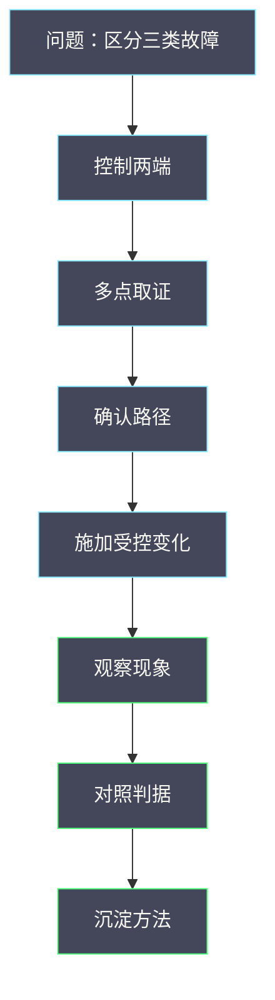

# 06 网络故障实验——单向不通、小包通大包不通、跨宿主机不通

**摘要：**

前五篇给出了路径、转发、报文大小、连接与启动依赖五维的机制与判据，这一篇给出把它们变成事实的方法：如何用受控实验复现三类最典型的网络故障，如何用证据把「不通」拆成「哪一段、哪个方向、哪种大小」，以及如何把一次实验的结论沉淀为可复用的排查能力。全文回答两个问题：三类典型故障的复现与定位方法是什么，以及网络实验与单机实验在设计上有何不同。文中的实验设计与命令取自 2026 年 9 月的现场记录，涉及具体数值处标注口径；分段方法见本专栏 01 篇，报文大小见 03 篇，连接状态见 04 篇。

---

## 第 1 章 网络实验与单机实验的差异

网络实验的设计与单机实验有一个根本差异：**被测对象是「两端之间」，而不是「一个进程」**。

### 1.1 三个根本差异

**差异一是「被测对象是链路」**：**单机实验的对象是进程或系统，网络实验的对象是「两端之间的路径」**。**因此实验必须同时控制两端**。

**差异二是「证据必须来自多点」**：**单机实验可以在一个位置取全部证据，网络实验必须在多个位置取证据**。**单点证据无法区分「没发」与「丢了」**。

**差异三是「干扰来自外部」**：**单机实验的干扰可控（同机负载），网络实验的干扰可能来自路径上的任意位置**（其他流量、设备状态）。

**三个差异决定了网络实验的三个要素**：**两端可控、多点取证、路径可知**。

### 1.2 三个要素

**「两端可控」指能同时操作源端与目的端**：**用于在两端分别施加负载、观察状态、发起探测**。**只有一端可控时，实验能力受限**。

**「多点取证」指能在路径的多个位置抓包**：**用于定位断点**。**这一点依赖对路径的了解**。

**「路径可知」指能确定流量走哪条路**：**如果路径不确定（多路径），实验结论就不唯一**。

**三个要素不满足时，实验需要调整**——**这与 06 篇「分段法的三个前提」是同一结构**。

### 1.3 本篇的定位

**01 至 05 篇给出五个维度的判据，本篇给出「用实验验证判据」的方法**。

**读完本篇应当能回答**：三类典型故障如何复现、如何用证据区分、以及实验结论如何沉淀。

### 1.4 一张实验设计示意图

**图里前四步是网络实验特有的准备**：**控制两端、多点取证、确认路径、施加受控变化**。**它们对应 1.2 节的三个要素**，也是网络实验比单机实验更耗成本的原因。

### 1.5 一个类比与它的边界

可以用「查水管」来类比网络实验。

**单机实验像「检查一个水龙头」**：**对象明确，在一点即可判断**。**网络实验像「检查两栋楼之间的管道」**：**需要同时看两端，还要知道管道怎么走**。

**类比的价值在于「它解释了为什么网络实验更耗成本」**：**两栋楼之间的管道可能有多个接头与阀门，每个都可能是问题点**。

**类比的边界在于「水管是可见的，而网络路径不可见」**：**网络路径需要通过工具与配置推断**，而不是直接观察。**因此「确认路径」是网络实验的必要前置**——**这也是 1.2 节把「路径可知」列为要素的原因**。

### 1.6 实验的三个成本

网络实验的成本有三个来源，理解它们有助于控制投入。

**成本一是「环境成本」**：**需要至少两台虚机与一条可控路径**。**在隔离环境不足时，这个成本会限制实验规模**。

**成本二是「取证成本」**：**需要在多个位置抓包，每个位置都需要权限与工具**。**位置越多，成本越高**。

**成本三是「恢复成本」**：**每次实验后都要恢复配置并验证**。**这项成本容易被低估**——**但它是安全的必要投入**。

**三个成本共同决定了「实验应当做多大」**。**小实验（单变量、单次）成本低，大实验（多变量、多次）成本高**——**这与 06 篇「实验的三种规模」是同一思路**。

### 1.7 实验与生产排查的分工

实验与生产排查有明确分工，混淆它们会导致错误的期望。

**实验回答「现象与原因的对应关系」**：**在受控条件下，制造原因并观察现象**。**它的产出是「对应表」**。

**生产排查回答「当前这次是什么原因」**：**在现场条件下，用对应表反查原因**。**它的产出是「处置方案」**。

**两者的关系是「实验建立对应表，排查使用对应表」**。**没有实验，排查只能靠经验；没有排查，实验结论无法验证**。

**这个分工解释了一个常见问题**：**「为什么有了实验结论，现场排查仍然慢」**——**因为排查还需要「现场取证能力」，而实验环境通常取证更便利**。

**因此「实验能力」与「现场取证能力」应当同步建设**——**这与 08 篇 CVM 专栏「巡检与取证」是同一关切**。

### 1.8 实验的三种产出

实验有三种产出，价值递增。

**第一种产出是「复现方法」**：**能在测试环境稳定复现某类故障**。**它的价值是「让问题可研究」**。

**第二种产出是「对应表」**：**现象与原因的对应关系**。**它的价值是「让排查有依据」**。

**第三种产出是「判据与自动化」**：**把对应表变成可执行的检查或脚本**。**它的价值是「让能力可复制」**。

**三种产出的关系是递进的**：**复现是前提，对应表是成果，自动化是落地**。

**多数实验止步于第二种产出**：**有了对应表就认为完成**。**但从「有对应表」到「自动化」还需要一步工作**——**这一步决定了能力能否规模化**。

## 第 2 章 三类典型故障

先明确三类故障的特征，它们是本篇的实验对象。

### 2.1 单向不通

**特征是「一个方向通、另一个方向不通」**。**ping 不通但能收到对端发来的包，或反之**。

**它的典型原因是「过滤只在一个方向生效」**：**出方向放行但回程被拦**（见 04 篇），或**源与目的的路由不对称**。

**这个特征很有辨识度**：**它把问题限定到「方向」这一维**，因此排查方向明确。

### 2.2 小包通大包不通

**特征是「小报文通过、大报文失败，且失败阈值稳定」**。**它的典型原因是 MTU 与封装开销**（见 03 篇）。

**「阈值稳定」是关键判据**：**随机失败更可能是丢包或拥塞，而 MTU 问题的阈值是确定的**。

**这个特征把问题限定到「报文大小」这一维**。

### 2.3 跨宿主机不通

**特征是「同宿主机虚机互通、跨宿主机不通」**。**它的典型原因是桥间翻译或隧道**（见 01、02 篇）。

**这个特征把问题限定到「跨机段」**：**同机通说明对象模型与基础配置正确**。

### 2.4 三类的区分方法

| 特征 | 指向维度 | 首要判据 |
| :--- | :--- | :--- |
| 一个方向不通 | 方向 | 两端抓包对比 |
| 小包通大包不通 | 报文大小 | 不同大小探测 |
| 同机通跨机不通 | 路径段 | 同机与跨机对比 |

**三行的判据互不重叠**：**方向、大小、路径段是三个正交的维度**。

**这意味着「先判断故障属于哪一类」是排查的第一步**——**判对了类别，排查方向就确定了一半**。

### 2.5 三类故障的一个共同点

三类故障有一个共同点：**它们都是「部分不通」，而不是「完全不通」**。

**「部分不通」比「完全不通」更难排查**：**完全不通的线索明确（没有任何成功），而部分不通需要在「成功」与「失败」的对比中找差异**。

**这个共同点决定了排查方法**：**必须用「对比」而不是「检查」**。**对比的是「通的情况」与「不通的情况」**，差异所在就是问题所在。

**三类故障的对比维度不同**：**方向维度对比「两个方向」，大小维度对比「不同大小」，路径维度对比「同机与跨机」**。

**「对比」这个思路是三类故障排查的统一方法**——**这也是本篇与 01 篇「分段法」的共通之处**：**都是通过对比定位差异**。

### 2.6 三类故障的实验难度

三类故障的实验难度不同，这影响实验设计的复杂度。

**「跨宿主机不通」最容易复现**：**只需在跨机段制造问题，表现明确**。

**「单向不通」较易复现**：**配置单向过滤即可，但需要确认过滤确实只在一个方向生效**。

**「小包通大包不通」最难复现**：**它需要精确控制 MTU，且要避免其他因素干扰**。**同时「阈值」需要逐级探测才能确定**。

**难度的差异决定了实验投入**：**容易的可以直接做，难的应当先在隔离环境验证**——**这与 06 篇「先用小实验排除」是同一原则**。

### 2.7 三类故障与五维判据的对应

把三类故障与前五篇的五个维度对应起来，可以看到它们的关系。

| 故障类别 | 主要维度 | 相关篇目 |
| :--- | :--- | :--- |
| 单向不通 | 连接与过滤 | 04 篇 |
| 小包通大包不通 | 报文大小 | 03 篇 |
| 跨宿主机不通 | 路径与转发 | 01、02 篇 |
| 启动后无网络 | 启动依赖 | 05 篇 |
| 时通时不通 | 容量与状态 | 02、04 篇 |

**五行的对应关系是「故障类别到维度到篇目」**。**它把本篇与前五篇连成一体**：**前五篇给判据，本篇给验证方法**。

**这也是本专栏的组织逻辑**：**01 至 05 篇按维度展开，06 篇按方法展开，07 篇按后端展开**。

### 2.8 一个判断顺序

判断故障属于哪一类，可以按一个简单顺序。

**第一步看「是否只在一个方向」**：**如果是，归为「单向不通」**。

**第二步看「是否与报文大小相关」**：**如果是，归为「小包通大包不通」**。

**第三步看「是否只在跨机时出现」**：**如果是，归为「跨宿主机不通」**。

**第四步看「是否时通时不通」**：**如果是，归为「容量或状态问题」**。

**四步的顺序是「从特征最明显的开始」**：**方向与大小的特征最直观，路径段次之，时通时不通最隐蔽**。

**这个顺序的价值在于「它把分类变成了可执行的步骤」**，而不是依赖直觉——**这与 01 篇「先判断现象属于哪一类」是同一方法**。

### 2.9 三类故障的一个共同排查框架

三类故障可以用同一个框架排查，只是每一步的具体操作不同。

**框架是三步**：**第一步确认「属于哪一类」**（用 2.8 节的顺序）；**第二步确认「对比维度上的差异」**（方向、大小或路径段）；**第三步确认「差异的来源」**（过滤、MTU 或翻译）。

**三步的共同点是「先分类、再对比、后归因」**。**它适用于三类故障，也适用于它们的组合**。

**这个框架的价值在于「它不依赖具体实现」**：**无论后端是软件交换还是其他方案，框架都成立**——**只是第三步的「来源」不同**。

### 2.10 三类故障的一个记录模板

三类故障的记录应当包含：**类别**（三类之一或组合）、**对比维度**（方向、大小、路径段）、**差异证据**（抓包或探测结果）、**来源判断**（过滤、MTU 或翻译）、以及**处置与验证**。

**五项里，「对比维度」是核心**：**它明确了「拿什么和什么比」**。**没有这一项，证据就无法被理解**。

**记录的价值在于「它让结论可复核」**：**后来者按同样维度对比，即可验证结论**——**这与 06 篇「实验要可复现」是同一要求**。

### 2.11 三类故障与五类连接异常的对照

本篇的三类故障与 04 篇的五类连接异常有重叠也有差异，对照它们有助于选择排查入口。

| 本篇类别 | 04 篇对应类别 | 差异 |
| :--- | :--- | :--- |
| 单向不通 | 单向不通 | 一致 |
| 小包通大包不通 | 通但慢（部分） | 本篇更强调大小维度 |
| 跨宿主机不通 | 一直不通（部分） | 本篇更强调路径段 |

**三行的对照说明「两篇的视角不同」**：**04 篇从「连接状态」看问题，本篇从「实验与维度」看问题**。

**两者的配合方式是**：**先用 04 篇的分类定位「是否与连接状态相关」，再用本篇的维度定位「是哪一维」**。

**这个对照也提示了一件事**：**同一个故障可以从多个视角分类**。**选择哪个视角，取决于「哪个视角的判据最容易获得」**——**这也是本专栏反复强调的「先分类」原则的延伸**。

## 第 3 章 实验设计：三类故障的复现

复现是实验的第一步，只有能稳定复现，才能验证定位方法。

### 3.1 复现单向不通

**方法**：**在目的端配置一条只拦截回程的过滤规则**（或只放行出方向而不提交状态）。**预期表现是「请求能到达但收不到响应」**。

**验证方法**：**在两端分别抓包**。**如果源端发出、目的端收到，但回程缺失，即复现成功**。

**这个复现的价值在于「它建立了「单向不通」与「回程被拦」的对应关系」**。

### 3.2 复现小包通大包不通

**方法**：**把某一段的 MTU 调小**（或人为限制），**同时保持虚机内 MTU 不变**。**预期表现是「小报文通过、大报文失败」**。

**验证方法**：**用不同大小的报文探测，找到失败阈值**。**如果阈值等于「该段 MTU 减封装开销」，即复现成功**。

**这个复现的价值在于「它建立了「大小阈值」与「某段 MTU」的对应关系」**。

### 3.3 复现跨宿主机不通

**方法**：**在跨机段的某一处制造问题**（如临时阻断隧道、或让翻译规则不一致）。**预期表现是「同机通、跨机不通」**。

**验证方法**：**先在同宿主机内验证互通，再验证跨机**。**如果同机通而跨机不通，即复现成功**。

**这个复现的价值在于「它建立了「跨机不通」与「跨机段」的对应关系」**。

### 3.4 复现的边界

**复现实验有三条边界**：**绑定实现**（不同实现的过滤与隧道机制不同）、**绑定配置**（MTU 与规则配置影响表现）、**绑定环境**（测试环境与生产的路径可能不同）。

**因此复现结论用于「建立对应关系」，不用于「替代生产排查」**——**这与 06 篇「实验结论要绑定条件」是同一要求**。

### 3.5 复现的一个检查清单

- 变化是否受控（只改一个变量）。
- 现象是否稳定复现（多次一致）。
- 是否有对照（不改变量时的表现）。
- 是否隔离（不影响生产流量）。
- 是否有恢复步骤。

**五项里，第二项与第五项最容易被省略**：**「稳定复现」是实验有效的前提，「恢复步骤」是安全的前提**。

**没有稳定复现，实验结论不可靠；没有恢复步骤，实验会留下隐患**——**这与 06 篇「实验要可复现」是同一要求**。

### 3.6 一个复现实例

设想复现「小包通大包不通」。

**第一步，确认基线**：**不限制时，用不同大小探测，确认都能通过**。**基线确认「默认状态下没有问题」**。

**第二步，施加变化**：**把某一跳的 MTU 调小**（如从默认调到较小值）。**这是唯一变量**。

**第三步，探测阈值**：**用不同大小探测，找到失败阈值**。**如果阈值与「调整后的 MTU 减开销」吻合，复现成功**。

**第四步，恢复并验证**：**恢复 MTU 配置，再次探测确认恢复正常**。

**四步的顺序是「基线、变化、探测、恢复」**。**第一步与第四步最容易被省略**：**没有基线无法判断变化的影响，没有恢复会留下隐患**。

### 3.7 复现的三种失败

复现可能失败，理解失败的原因有助于调整实验。

**失败一：现象未出现**。**可能原因是「变化未生效」或「变化被其他因素抵消」**。**排查方向是确认变化是否真的生效**。

**失败二：现象出现但不稳定**。**可能原因是「存在其他变量」或「环境本身不稳定」**。**排查方向是控制其他变量**。

**失败三：现象与预期不同**。**可能原因是「对机制的理解有偏差」**。**这种情况最有价值**——**它说明存在未理解的机制**。

**第三种失败是「发现」而不是「失败」**：**它提示机制与预期不符，值得深查**——**这与 06 篇「预期与实际的差异最有价值」是同一判断**。

### 3.8 复现与生产故障的差异

复现的故障与生产故障有三点差异，理解它们有助于避免「实验室结论误用」。

**差异一是「干扰可控性」**：**复现环境干扰可控，生产环境干扰来自多处**。**因此生产中的现象可能比复现更复杂**。

**差异二是「路径完整性」**：**复现环境的路径通常更简单**，**生产环境有更多中间设备**。

**差异三是「规模」**：**复现通常只涉及少数虚机**，**生产故障可能涉及大量虚机**，**从而触发容量类问题**。

**三点差异的共同含义是「复现结论需要生产验证」**。**它用于「建立对应关系」，不用于「替代现场判断」**——**这与 06 篇「实验结论要绑定条件」是同一要求**。

## 第 4 章 定位方法：用证据区分

复现之后，实验的第二步是验证「定位方法是否有效」。

### 4.1 方向维度的方法

**方法**：**在两端同时抓包，比较「有无」**。**如果源端有、目的端无，断点在路径上；如果两端都有但业务失败，问题在回程或上层**。

**进一步**：**在路径的多个位置抓包，找到「有与无」的边界**。

**这个方法的关键是「同时」**：**不同时刻的抓包无法对照**——**这与 06 篇「同时刻同口径」是同一要求**。

### 4.2 大小维度的方法

**方法**：**用不同大小的报文探测，找到失败阈值**。**然后在路径各段重复探测，比较阈值差异**。

**进一步**：**用「同机与跨机」的阈值差异反推封装开销**（见 03 篇）。

**这个方法的关键是「阈值稳定」**：**如果阈值不稳定，说明不是 MTU 问题**。

### 4.3 路径维度的方法

**方法**：**先验证同宿主机内互通，再验证跨宿主机**。**如果同机通、跨机不通，问题在跨机段**。

**进一步**：**在隧道口与物理网卡分别抓包，确认「封装是否发生、报文是否发出」**。

**这个方法的关键是「先验证同机」**：**同机通排除了大量可能**，是最经济的判据。

### 4.4 三个维度的组合

**三类故障可能同时存在**：**例如「跨机不通且只在一个方向」**。**此时需要按维度逐层排除**。

**排除顺序建议是「先路径段、再方向、最后大小」**：**路径段的问题影响最广，方向次之，大小最细**。

**这个顺序的依据是「影响范围」**：**影响范围大的问题优先排除**——**这与 06 篇「先定影响半径」是同一思路**。

### 4.5 三个维度的一个组合实例

设想一次「跨宿主机不通，且只在一个方向」的问题。

**第一步按路径段**：**先验证同宿主机内互通**。**如果同机通，问题在跨机段**。

**第二步按方向**：**在跨机段的两端抓包，确认「有去无回」还是「有去有回但业务失败」**。**如果是有去无回，问题在回程**。

**第三步按大小**：**如果方向正常，用不同大小探测，确认是否与报文大小相关**。

**三步的顺序是「路径段、方向、大小」**。**它体现了「影响范围大的优先排除」**——**路径段问题影响所有流量，方向问题影响特定方向，大小问题只影响大报文**。

**这个实例说明「三类故障可以叠加」**：**排查时必须按维度逐层排除，而不是假设只有一个问题**。

### 4.6 一个定位实例

设想一次「跨宿主机传输大文件失败，但 ping 正常」的问题。

**第一步按路径段**：**同机大文件传输是否正常**。**如果同机正常，问题在跨机段**。

**第二步按大小**：**跨机时用不同大小探测，确认失败阈值**。**如果阈值小于虚机 MTU，说明跨机段有额外限制**。

**第三步按方向**：**确认失败是否只在一个方向**。**如果两个方向都失败，排除单向过滤**。

**结论**：**「跨机段的 MTU 限制」**。**处置是调小虚机 MTU 或调大跨机段 MTU**（见 03 篇）。

**这个实例的价值在于它演示了「三维逐层排除」**：**每一步都排除一个维度，最后收敛到具体原因**。

### 4.7 三个维度的一个方法清单

- 方向维度：两端同时抓包，比较有无。
- 方向维度：确认过滤是否只在一个方向生效。
- 大小维度：不同大小探测，找失败阈值。
- 大小维度：逐段探测，比较阈值差异。
- 路径维度：先验证同宿主机互通。
- 路径维度：在跨机段两端抓包。
- 组合维度：按「路径段、方向、大小」顺序排除。

**七项覆盖了三个维度的主要方法**。**最后一项是组合场景的顺序**，**它体现了「影响范围大的优先排除」**。

**清单的用途是「避免遗漏维度」**：**排查者容易在熟悉的维度上反复查，而漏掉其他维度**——**这与 04 篇「排查清单」是同一形态**。

### 4.8 一个取证方法的选择

取证方法的选择影响效率，值得说明。

**抓包适合「确认有无与形态」**：**直观但开销大**。**适合定位到段之后的细节确认**。

**计数器适合「快速定位段」**：**开销小但粒度粗**。**适合第一步缩小范围**。

**配置查看适合「确认预期」**：**成本最低但可能与实际不符**。**适合作为起点**。

**三者的使用顺序是「配置、计数器、抓包」**。**先用成本最低的缩小范围，再用成本最高的确认细节**——**这与 01 篇「工具使用顺序」是同一原则**。

### 4.9 一个证据可信度的判断

证据的可信度不同，理解它有助于避免被误导。

**最可信的是「物理层证据」**：**如物理网卡的错误计数**。**它难以伪造或误读**。

**其次可信的是「多点的独立证据」**：**如两端同时抓包**。**多个独立来源一致时，可信度高**。

**较不可信的是「单点自述」**：**如某个组件的日志或计数器**。**它可能因配置或实现而失真**。

**最不可信的是「间接推断」**：**如「既然 A 正常所以 B 应该正常」**。**推断链条越长，可信度越低**。

**四级的排序提示了一个原则**：**优先用可信度高的证据**——**这与 01 篇「物理网卡错误计数是最权威的物理层证据」是同一判断**。

## 第 5 章 一次完整的实验

下面用一个完整的实验把前面的方法串起来。

### 5.1 问题

**问题**：**如何用受控实验区分「单向不通」与「双向不通」，并确认其原因是过滤还是路由**。

### 5.2 设计

**变量**：**过滤配置（只拦回程、全拦、不拦）**。**固定**：两端虚机、路径、探测方法。**度量**：**两端抓包结果、探测成功率**。**重复**：每种配置三次。

### 5.3 执行与观察

**配置「只拦回程」时**：源端发出、目的端收到、回程缺失。**表现为「单向不通」**。

**配置「全拦」时**：目的端收不到。**表现为「双向不通」**。

**配置「不拦」时**：双向正常。

### 5.4 结论与边界

**结论**：**「单向不通」对应「回程被拦」，「双向不通」对应「去程被拦或路由问题」**。

**边界**：**结论适用于「过滤在两端之一生效」的场景**；**如果路径中间有过滤，表现可能不同**。

**这个实验的价值在于它把「单向与双向」这个现象区分，变成了可复现、可解释的结论**。

### 5.5 实验的一个记录模板

实验记录应当包含：**问题与假设**、**变量与对照**、**路径与端点**、**观察到的现象**、**结论与边界**、以及**恢复确认**。

**六项里，「恢复确认」是网络实验特有的**：**它确认实验后的配置已恢复，不留下隐患**。

**没有这一项，实验可能在生产环境留下「半个配置」**，成为后续故障的诱因——**这是网络实验比单机实验更需要注意的地方**。

### 5.6 实验的可迁移部分

这次实验可以提炼成三个可迁移的动作：**先建对照、再改一个变量、最后确认恢复**。

**第一个动作的关键是「有不改变量的对照」**；**第二个动作的关键是「一次只改一个」**；**第三个动作的关键是「实验后必须恢复并验证」**。

**三个动作合起来，把「网络实验」从「随便试试」变成「可复现的验证」**。**这与 06 篇「单变量原则」是同一要求**。

### 5.7 一个反例

一个常见的反例：为了「验证是否 MTU 问题」，直接把虚机 MTU 调小，观察是否恢复，然后就认为「确认了」。

**问题在于「没有找到真正的限制位置」**：**调小虚机 MTU 确实能让业务恢复**，**但限制可能来自路径上任意一段**。**不找到位置，就无法根治**。

**正确的做法是「调小恢复业务，再逐段探测找位置」**：**前者是止血，后者是治本**（见 03 篇 7.7 节）。

**这个反例的启示是：恢复不等于定位**。**「业务恢复了」与「知道原因了」是两件事**——**这与 07 篇「恢复的终点是业务可用，但根因仍需定位」是同一要求**。

### 5.8 实验设计的一个模板

- 问题：要回答什么（如「单向不通是否由回程过滤导致」）。
- 假设：预期现象。
- 变量：改什么，其他固定什么。
- 对照：不改变量时的表现。
- 路径与端点：流量怎么走，两端是什么。
- 度量：抓包结果、探测成功率。
- 重复：次数与条件。
- 恢复：实验后如何恢复并验证。

**八项里，「路径与端点」与「恢复」是网络实验特有的**：**前者保证实验可解释，后者保证实验安全**。

**模板的价值在于「它让网络实验与单机实验同样规范」**——**网络实验更容易「随意做」，因此更需要模板约束**。

### 5.9 实验的一个变体

主实验之外，可以设计一个变体：**验证「组合故障」的区分能力**。

**变体设计**：**同时制造两个故障**（如「单向不通」加「MTU 限制」），**观察定位方法能否区分**。

**预期表现**：**现象会叠加**（既单向不通，又大包不通）。**定位时需要按维度逐层排除**（先用 4.5 节的顺序）。

**变体的价值在于「它验证方法的完备性」**：**如果方法只能处理单一故障，说明它不完备**。**能处理组合故障的方法，才是可用于生产的方法**。

**这与 06 篇「干扰实验」是同一思路**：**单因素实验建立基线，多因素实验验证完备性**。

## 第 6 章 实验的沉淀

实验的最终价值在于沉淀，而不在于单次结论。

### 6.1 沉淀什么

**沉淀三样东西**：**「现象到维度」的对应表**、**「维度到方法」的操作步骤**、以及**「方法到证据」的判据**。

**三者的关系是「现象、方法、判据」**：**从现象出发，按方法操作，用判据判断**。

### 6.2 沉淀的形式

**形式可以是「排查手册」或「自动检查脚本」**。**手册适合人工排查，脚本适合常规检查**。

**两者互补**：**手册覆盖「异常情况」，脚本覆盖「常规状态」**。

**这与 08 篇 CVM 专栏「巡检与取证自动化」是同一思路**：**把经验分成「可自动化的」与「需人工判断的」两部分**。

### 6.3 沉淀的价值

**沉淀的价值在于「降低对个人经验的依赖」**：**新人按手册即可完成基本排查**，不必等待经验积累。

**这是运维能力从「个人」变成「组织」的过程**——**也是本专栏的最终目的**。

### 6.4 沉淀的一个实例

设想把三类故障的排查方法沉淀为一份手册。

**手册的结构**：**「现象」部分列出三类故障的特征**；**「方法」部分给出每一类的操作步骤**；**「判据」部分给出每一步的结论标准**。

**手册的用途**：**新人按手册可完成基本排查**；**有经验的人用手册确认遗漏**。

**手册的维护**：**实现或配置变化时更新**。**维护责任应当明确**——**没有维护者的手册会逐渐失效**（与 07 篇「决策要留归属」是同一要求）。

**这个实例的价值在于「它把实验结论变成了组织能力」**。

### 6.5 沉淀与自动化的分工

沉淀与自动化有明确分工，理解它有助于设计沉淀形式。

**适合自动化的是「常规检查」**：**如「MTU 是否一致」「连接跟踪是否接近上限」**。**这类检查判据明确、执行频繁**。

**适合手册的是「异常排查」**：**如「跨机不通怎么查」**。**这类任务步骤多、需要判断**。

**分工的依据是「判据是否明确」**：**判据明确的可以自动化，需要判断的留给人**——**这与 08 篇 CVM 专栏「机器执行检查、人负责判断」是同一分工**。

**两者的关系是互补的**：**自动化负责「早发现」，手册负责「快定位」**。

### 6.6 沉淀的一个检查清单

- 是否沉淀了「现象到维度」的对应。
- 是否沉淀了「维度到方法」的步骤。
- 是否沉淀了「方法到证据」的判据。
- 是否指定了维护者。
- 是否明确了复核周期。
- 是否区分了「可自动化」与「需人工」的部分。

**六项里，第四与第五项最容易被省略**：**沉淀的常见问题是「写了但没人维护」**。

**没有维护者的沉淀会逐渐失效**，**甚至比没有沉淀更危险**（因为会给出过时的结论）——**这与 07 篇「决策要留归属」是同一要求**。

### 6.7 一个沉淀的实例

设想把「三类故障的区分」沉淀为一份可执行的文档。

**第一部分「现象」**：**列出三类故障的特征与区分顺序**（用 2.8 节的四步）。

**第二部分「操作」**：**给出每一类的具体操作步骤**（用 4.1 至 4.3 节的方法）。

**第三部分「判据」**：**给出每一步的结论标准**（如「阈值稳定则为 MTU 问题」）。

**第四部分「组合」**：**给出组合故障的排除顺序**（用 4.4 节的建议）。

**四个部分的关系是「识别、操作、判断、组合」**。**它覆盖了从单类到组合的完整场景**。

**这个实例的价值在于「它给出了一份文档的完整结构」**，而不只是一个目录。

## 第 7 章 实验的边界与风险

网络实验比单机实验风险更高，因为涉及网络配置。

### 7.1 三类风险

**风险一是「影响生产流量」**：**网络配置变更可能影响同网络的其他虚机**。**因此实验应当在隔离环境或专用网络中进行**。

**风险二是「路径共享」**：**测试流量可能与其他流量共享路径**，因此**干扰不可完全控制**。

**风险三是「配置残留」**：**实验后忘记恢复配置，会留下隐患**。**因此实验应当有明确的恢复步骤与验证**。

### 7.2 风险的控制

**控制手段有三**：**隔离环境**（专用网络或命名空间）、**变更审批**（按影响面分级）、以及**恢复验证**（实验后确认配置已恢复）。

**三者与 07 篇「验证与门禁」是同一要求**：**任何变更都需要审批与回读**。

### 7.3 一个隔离环境的实例

设想为网络实验搭建隔离环境。

**方案**：**使用专用的网络命名空间或专用虚拟网络**，使实验流量与其他流量隔离。

**优势**：**实验的配置变更不会影响生产**；**干扰可控**（隔离环境内只有实验流量）。

**代价**：**隔离环境的路径可能与生产不同**（少了中间设备的复杂性）。**因此隔离环境用于「建立对应关系」，生产验证仍需在生产或仿真环境进行**。

**这个取舍与 06 篇「实验环境与生产不完全一致」是同一类问题**：**隔离换来安全，代价是真实性的降低**。

### 7.4 实验的一个检查清单

- 是否在隔离环境（或已审批）。
- 是否只改一个变量。
- 是否有对照。
- 是否有多点取证。
- 是否有恢复步骤。
- 是否已确认恢复。

**六项覆盖了网络实验的安全与有效要求**。**前三项保证「结论可靠」，后三项保证「过程安全」**。

**清单的执行顺序是「先确认安全，再保证有效」**：**在隔离或审批确认之前，不应开始实验**——**这与 07 篇「门禁在实施之前」是同一要求**。

### 7.5 一个风险评估的实例

设想评估一次网络实验的风险。

**实验内容**：在测试网络上调整 MTU 配置，验证大包不通的复现。

**风险一**：**测试网络与其他环境共享物理链路**，调整 MTU 可能影响同链路流量。**缓解是选择共享程度低的链路**。

**风险二**：**实验后忘记恢复 MTU**，留下不一致的配置。**缓解是明确的恢复步骤与验证**。

**风险三**：**实验期间有业务流量经过该网络**。**缓解是选择业务低谷或专用环境**。

**三项风险的共同应对是「隔离、恢复、时段」**。**三者都不满足时，实验应当推迟**——**这与 07 篇「门禁不通过不放行」是同一原则**。

### 7.6 一个风险清单

- 实验是否在隔离环境或已审批。
- 是否会影响同网络的其他虚机。
- 实验路径是否与其他流量共享。
- 是否选择了业务低谷时段。
- 是否有明确的恢复步骤。
- 是否已确认恢复完成。

**六项覆盖了网络实验的主要风险点**。**前三项是「影响面」评估，后三项是「可恢复性」评估**。

**两项评估都通过时，实验可以开始**。**任何一项不通过，应当调整方案或推迟**——**这与 07 篇「门禁」是同一逻辑**。

## 第 8 章 误判与反例

第一，**用单点证据判断「不通」**。单点无法区分「没发」与「丢了」。

第二，**不同时刻抓包做对照**。时间错位会产生假相关。

第三，**把随机失败当成 MTU 问题**。MTU 问题的阈值是稳定的。

第四，**把「小包通大包不通」当成带宽问题**。方向不同。

第五，**忽略「先验证同机」这一步**。它是最经济的判据。

第六，**在共享路径上做实验**。干扰不可控，结论不可靠。

第七，**实验后不恢复配置**。配置残留会留下隐患。

第八，**把复现结论直接用于生产**。复现用于建立对应关系，不替代生产排查。

第九，**只沉淀结论不沉淀方法**。结论会过时，方法更持久。

第十，**把三类故障当成互斥**。它们可能同时存在，需要逐维排除。

第十一，**在隔离环境验证后直接在生产放行**。隔离环境少了中间设备的复杂性，结论需要生产复核。

第十二，**实验没有恢复确认**。配置残留会成为后续故障的诱因。

第十三，**把「业务恢复」当成「已定位」**。恢复是止血，定位是治本，两者不同。

第十四，**把判据明确的常规检查也留给人**。这类检查应当自动化，人力留给需要判断的部分。

第十五，**把复现结论直接用于生产判断**。复现的干扰可控、路径简单、规模小，结论需要生产验证。

第十六，**在隔离或审批未确认前开始实验**。影响面评估未完成时，实验可能影响生产。

第十七，**只沉淀「怎么做」不沉淀「为什么」**。缺少原因的步骤无法在新场景中灵活应用。

## 第 9 章 边界与反例

第一，**实现差异较大**。过滤、隧道与 MTU 的实现随平台而异。

第二，**测试环境的路径与生产可能不同**。结论外推需要说明差异。

第三，**实验的可控性受路径共享影响**。共享路径上的干扰不可完全排除。

第四，**实验结论绑定配置与实现**。跨环境外推容易出错。

第五，**沉淀的手册需要定期复核**。实现与配置变化会让手册失效。

第六，**把三类故障当成互斥**。它们可能叠加，需要按维度逐层排除。

第七，**沉淀手册但不指定维护者**。没有维护者的手册会随实现变化而失效。

第八，**把「业务恢复」当成「已定位」**。恢复是止血，定位是治本，两者不可互相替代。

第九，**把判据明确的常规检查也留给人**。这类检查应当自动化，人力应当留给需要判断的部分。

第十，**沉淀了但不指定维护者与复核周期**。过时的沉淀会给出错误结论，比没有沉淀更危险。

第十一条，**优先使用可信度低的证据**。物理层证据与多点独立证据的可信度更高，应当优先采用。

第十二条，**只做单因素实验就认为方法完备**。组合故障需要单独验证，才能确认方法的完备性。

第十三条，**沉淀只写步骤不写原因**。缺少原因的步骤无法在新场景中灵活应用。

行文至此，把本篇落点收在两条原则上。其一，架构即权衡——用受控实验换来可靠结论，代价是必须控制两端、多点取证并隔离干扰，这份成本无法省略。其二，复杂性不会消失只会转移——把「靠经验排查」换成「靠实验与判据」，把复杂度从「个人记忆」转移到了「方法沉淀与手册维护」上。下一篇转向另一种网络后端：控制面数据库与逻辑流如何映射到实际转发，以及在这种架构下排查方法有何不同。相邻的分段方法见本专栏 01 篇，报文大小与 MTU 见 03 篇，连接状态见 04 篇。

---

## 速查卡：三类故障的区分

这张表把三类故障的特征、判据与复现方法并列，用于快速定向与实验设计。使用时的顺序是「先按特征分类，再用判据区分，最后按复现方法验证」。

三条纪律值得写在表前：**第一，三类故障都是「部分不通」**，因此必须用「对比」而不是「检查」；**第二，对比必须同时刻、同口径**（不同时刻的对照会产生假相关）；**第三，影响范围大的维度优先排除**（路径段、方向、大小）。

最后一点：**网络实验的成本远高于单机实验**。它需要控制两端、多点取证、并隔离干扰，而实验后还要恢复配置。**因此「实验设计」比「实验执行」更值得投入时间**——设计好了，执行很快；设计不好，执行再多次也得不到可用结论。

补充一句关于证据的提醒：**优先采用可信度高的证据**。物理层证据（网卡错误计数）与多点独立证据（两端同时抓包）可信度最高，单点自述与间接推断可信度最低。

再补一句关于沉淀的提醒：**沉淀要指定维护者与复核周期**。没有维护者的手册会随实现变化而失效，而过时的手册会给出错误结论，比没有手册更危险。

再补一句关于组合故障的提醒：**三类故障可能叠加**。只做单因素实验的方法，未必能处理组合故障；因此方法完备性需要通过组合实验验证。

最后补一句关于复现与生产的提醒：**复现结论用于建立对应关系，不替代现场判断**。复现环境的干扰可控、路径简单、规模小，而生产故障可能同时具备三个特点。

| 特征 | 指向维度 | 首要判据 | 实验复现方法 |
| :--- | :--- | :--- | :--- |
| 一个方向不通 | 方向 | 两端同时抓包对比 | 只拦回程 |
| 小包通大包不通 | 报文大小 | 不同大小探测阈值 | 调小某段 MTU |
| 同机通跨机不通 | 路径段 | 同机与跨机对比 | 阻断跨机段 |
| 完全不通 | 路径或规则 | 逐段抓包 | 全拦 |
| 时通时不通 | 容量或状态 | 时间分布 | 施加并发 |

## 口径与事实说明

- 实验设计与命令取自 2026 年 9 月的现场记录，属某时点实践，不构成唯一正确用法。
- 机制描述（过滤方向、MTU 与封装、桥间翻译与隧道）属于相关实现的稳定行为。
- 实验结论绑定实现、配置与环境，用于建立对应关系，不替代生产排查。
- 实验中涉及的配置变更须在隔离环境进行，或走审批并回读。
- 实验设计需按环境与实现调整，本文给的是框架而非固定流程。
- 复现结论绑定实现、配置与环境，跨环境使用前需要重新验证。
- 「症状到维度」的对应关系建议本地验证后形成文档，通用结论未必贴合现场。
- 三类故障的组合场景需要单独验证，单因素实验不足以确认方法的完备性。
- 证据的可信度排序（物理层、多点独立、单点自述、间接推断）应当作为取证原则。
- 沉淀的手册应当指定维护者与复核周期，并区分可自动化与需人工的部分。
- 实验能力与现场取证能力应当同步建设，只有实验结论无法保证现场排查速度。
- 实验后必须确认配置已恢复，配置残留会成为后续故障的诱因。
- 实验应当选择业务低谷时段，并避开与其他流量共享程度高的链路。
- 本文与本专栏其余篇目共享同一套观察方法与口径纪律，相邻篇目已展开的机制不在此重复推导。
- 本文的判据与顺序可直接用于同类虚拟网络，具体命令与参数需按现场版本调整并以实测为准。
- 同一故障可以从多个视角分类，选择「判据最容易获得」的视角作为排查入口。
- 三类故障与连接异常类别的对照可用于选择排查入口，两篇的视角互补。
- 实验记录应当保留「类别、维度、证据、来源判断、处置与验证」五项，供复核。
- 组合故障的排除顺序建议为「路径段、方向、大小」，依据是影响范围大小。
- 复现失败时应当区分「现象未出现」「不稳定」「与预期不同」三种情形并分别处置。
- 第三种失败（与预期不同）最有价值，它提示存在尚未理解的机制。
- 实验的三种产出（复现方法、对应表、判据与自动化）应当逐步推进，不宜止步于对应表。
- 从「有对应表」到「自动化」还需要一步工作，这一步决定了能力能否规模化。
- 取证方法的使用顺序建议为「配置、计数器、抓包」，由低成本到高成本。
- 常规检查适合自动化，异常排查适合手册，分工依据是判据是否明确。
- 实验与生产排查的分工是「实验建立对应表、排查使用对应表」，两者都需要建设。
- 网络实验的三个成本（环境、取证、恢复）决定了实验规模，其中恢复成本最容易被低估。
- 实验的隔离程度与真实性成反比，隔离用于建立对应关系，生产验证不可省略。
- 沉淀文档的结构建议为「现象、操作、判据、组合」四部分，覆盖单类与组合场景。
- 实验前的风险清单应当覆盖影响面与可恢复性两方面，任一项不通过则推迟实验。
- 单点自述（日志、计数器）可信度低于多点独立证据，应当交叉验证后使用。
- 间接推断（「A 正常所以 B 正常」）可信度最低，推断链条越长越不可靠。
- 实验设计模板中的「路径与端点」与「恢复」是网络实验特有的必备项。
- 三类故障的判断顺序建议为「方向、大小、路径段、时通时不通」，由特征明显到隐蔽。
- 三类故障的复现难度不同，最难的「小包通大包不通」建议先在隔离环境验证。
- 实验记录中的「对比维度」是最关键项，它明确了「拿什么和什么比」。
- 复现结论需要生产验证，因为生产环境的干扰、路径与规模都与复现环境不同。
- 实验的最终价值在沉淀，单次结论会过时，方法与对应表更持久。
- 网络实验的价值在于把经验变成可复用的对应表与判据，而不是单次结论。
- 实验与排查都应避免「在症状处深挖」，应当先分类再定位，再深挖细节。

---

## 参考资料

1. OpenStack 官方文档，网络故障排查：<https://docs.openstack.org/neutron/latest/admin/>
2. Open vSwitch 官方文档，流表与隧道：<https://docs.openvswitch.org/>
3. RFC 1191，路径 MTU 发现：<https://datatracker.ietf.org/doc/html/rfc1191>
4. Linux 内核文档，网络与过滤：<https://www.kernel.org/doc/html/latest/networking/index.html>
5. Linux 内核文档，PSI 与压力指标：<https://www.kernel.org/doc/html/latest/accounting/psi.html>
6. 内部现场素材：CVM 集群网络故障复盘（2026-09，脱敏）

---

> [!note] 思考题
> 1. 网络实验与单机实验的三个根本差异是什么，它们如何决定实验设计。
> 2. 为什么「先验证同机互通」是最经济的判据。
> 3. 「阈值稳定」为什么能把 MTU 问题与丢包问题区分开。
> 4. 三类故障为什么可能同时存在，逐维排除的顺序依据是什么。
> 5. 为什么实验的最终价值在沉淀而不在单次结论。
