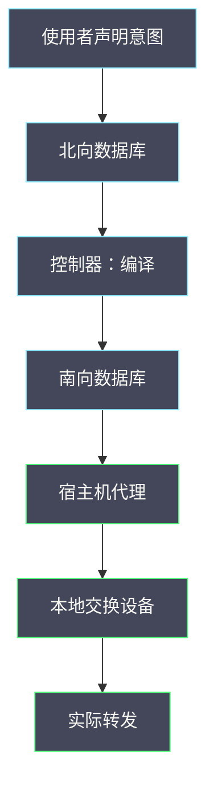

# 07 OVN——NB/SB 数据库、逻辑流到实际转发

**摘要：**

OVN 把网络的控制面从「逐个交换机下发流表」改成了「声明逻辑网络，由控制器编译成物理流」。这个改变带来了更强的表达能力，也带来了新的排查难点：**你在交换机上看到的流表，与你在逻辑网络里声明的规则之间，隔着一层编译**。本文讲清两类数据库与三类角色的分工、逻辑流与物理流的关系、从逻辑流到实际转发的转换过程、以及在这种架构下排查方法的差异。全文回答两个问题：OVN 的排查入口在哪里，以及为什么「看交换机流表」在 OVN 下不再有效。文中的命令与观察方式取自 2026 年 9 月的现场记录，涉及具体数值处标注口径；OVS 的两面机制见本专栏 02 篇，报文路径见 01 篇。

---

## 第 1 章 为什么要单独讲 OVN

OVN 不是 OVS 的升级版，而是另一种组织方式。

### 1.1 与 OVS 方案的根本差异

**传统 OVS 方案的工作方式是「控制面逐台下发」**：**网络控制面计算出每台宿主机需要哪些流表，然后分别下发**。**流表的内容直接反映网络意图**。

**OVN 的工作方式是「声明加编译」**：**使用者只在逻辑网络层面声明意图**（哪些网络、哪些端口、哪些规则），**由控制器把逻辑意图编译成每台宿主机需要的流表**。

**这个差异带来两个直接后果**：**一是表达能力更强**（可以用逻辑概念描述复杂网络），**二是排查多了一层**（必须理解编译过程才能对应逻辑与物理）。

### 1.2 一个判据的迁移

本专栏反复使用的一个判据是「**看实际转发，而不是看声明**」（见 02 篇）。**在 OVN 下，这个判据需要升级**。

**升级后的判据是「三层都要看」**：**逻辑层**（声明了什么）、**编译层**（编译成了什么）、**物理层**（实际转发成什么样）。

**只看向任何一层都会得出片面结论**：**只看逻辑层会忽略编译问题，只看物理层会看不懂意图，只看编译层会不知道原始需求**。

**这与 02 篇「控制面与数据面都要看」是同一思路，只是层数从两层变成了三层**。

### 1.3 本篇的定位

**01 至 06 篇以传统软件交换方案为背景**，**本篇讲另一种后端下的差异**。

**读完本篇应当能回答**：OVN 的排查入口在哪、为什么不能只看交换机流表、以及迁移到 OVN 时排查能力需要补什么。

### 1.4 一张架构示意图



**图里的每一步都可能断裂**：**而断裂的表现都是「不通」**。**因此 OVN 下的排查本质上是「确认哪一步没完成」**——**这与 05 篇「依赖链」是同一结构**。

### 1.5 一个类比与它的边界

可以用「图纸与施工」来类比 OVN 的工作方式。

**北向数据库像「设计图纸」**：**它描述「要建成什么样」**。**南向数据库像「施工图」**：**它描述「每面墙怎么砌」**。**代理像「施工队」**：**它按施工图实际砌墙**。

**类比的价值在于「它解释了为什么『图纸对』不等于『房子对』」**：**图纸正确但施工图缺失或施工队未到，房子都建不起来**。

**类比的边界在于「施工是一次性的，而 OVN 是持续同步的」**：**控制器会持续把图纸与施工图同步**。**因此「手工改墙」会被「重新按图施工」覆盖**——**这正是 6.1 节「不能直接改流表」的原因**。

### 1.6 三个层次的三个问题

三个层次各自回答不同的问题，理解这一点有助于选择排查入口。

**逻辑层回答「想要什么」**：**它给出意图**。**因此当问题是「这个需求是否被正确表达」时，入口在逻辑层**。

**编译层回答「变成了什么」**：**它给出转换结果**。**因此当问题是「意图是否被正确转换」时，入口在编译层**。

**物理层回答「实际做了什么」**：**它给出转发行为**。**因此当问题是「是否真的在转发」时，入口在物理层**。

**三个问题的区别在于「主语不同」**：**意图、转换、行为**。**混淆主语就会选错入口**——**这与 02 篇「三个面的归属」是同一方法**。

**实践中的顺序通常是「从逻辑层开始」**：**因为意图是最容易确认的，且它决定了后面两层的预期**。

### 1.7 三个层次的一个对照

把三个层次与「观测难度」「排查价值」对照，可以看出各自的定位。

| 层次 | 观测难度 | 是否含业务语义 | 排查价值 |
| :--- | :--- | :--- | :--- |
| 逻辑层 | 低 | 是 | 确认意图 |
| 编译层 | 中 | 部分 | 确认转换 |
| 物理层 | 高 | 否 | 确认落地 |

**三行的对照说明「逻辑层最容易理解，物理层最难理解」**。**因此排查从逻辑层开始，是「由易到难」的选择**。

**「是否含业务语义」这一列最关键**：**它决定了「能不能直接看出问题」**。**逻辑层能，物理层不能**——**这也是为什么 OVN 下不宜从物理层开始**。

**这与 02 篇「三种流的关系」是同一对照**：**规则、缓存、状态各自回答不同问题**。

## 第 2 章 架构：两类数据库与三类角色

OVN 的架构可以概括为「两类数据库、三类角色」。

### 2.1 北向数据库

**北向数据库存放「逻辑网络的声明」**：**逻辑交换机、逻辑路由器、逻辑端口、访问控制规则等**。

**它是「使用者意图的存放处」**：**使用者通过它声明想要什么网络**。**因此排查的第一步往往是从这里确认「意图是什么」**。

**北向数据库的一个特点是「与物理位置无关」**：**声明里没有「哪台宿主机」的概念**，**因此它无法直接回答「为什么这台虚机不通」**。

### 2.2 南向数据库

**南向数据库存放「编译后的结果」**：**包括逻辑流（逻辑层面的转发规则）与物理流（具体到某台宿主机、某个端口的转发规则）**。

**它是「逻辑与物理之间的桥梁」**：**向上连接逻辑声明，向下提供物理转发的依据**。

**因此排查的第二步是从这里确认「编译结果是否符合预期」**——**它是本篇的核心入口**。

### 2.3 控制器与代理

**控制器负责「编译与下发」**：**把逻辑声明编译成物理流，并通过南向数据库下发给各宿主机**。

**代理运行在每台宿主机上，负责「把下发的规则落到本地交换设备」**。**因此代理异常会导致「规则已下发但未生效」**。

**三类角色的分工可以概括为**：**数据库存放状态，控制器负责转换，代理负责落地**。**排查时按这个顺序追**。

### 2.4 数据流

把三类角色串起来，一次网络配置的生效路径是：**使用者在北向数据库声明 → 控制器编译 → 结果写入南向数据库 → 代理读取并落地 → 本地交换设备按规则转发**。

**五步中任何一步断裂都会导致「配置不生效」**，**而表现都是「网络不通」**——**这与 05 篇「依赖链」是同一结构**：**多步串联，症状相同**。

**因此 OVN 下的排查也是「沿链反向追」**：**从不通的现象出发，逐步确认每一步是否完成**。

### 2.5 一个角色分工的实例

设想一次需要确认「某条规则是否已生效」的问题。

**第一步，查北向数据库**：**确认规则是否被声明**。**如果声明里没有，问题在使用者**。

**第二步，查控制器状态**：**确认控制器是否正常、是否完成了编译**。**如果控制器异常，问题在控制面**。

**第三步，查南向数据库**：**确认编译结果里是否有对应的逻辑流与物理流**。**如果没有，问题在编译**。

**第四步，查代理状态**：**确认相关宿主机的代理是否在线且已同步**。**如果代理异常，问题在宿主机侧**。

**四步的顺序是「声明、编译、下发、落地」**。**它对应 2.4 节的五步路径**——**按这个顺序查，能定位到具体的角色**。

**这个实例的价值在于「它把『角色分工』变成了『排查顺序』」**。

### 2.6 一个数据流的实例

设想一次「配置变更后多久生效」的问题。

**第一步，在逻辑层做一次变更**。**第二步，记录逻辑流变化的时间**。**第三步，记录物理流出现的时间**。

**第四步，记录实际转发变化的时间**。**四步的间隔构成「收敛时间线」**。

**时间线的三段含义不同**：**第一段是编译时间**，**第二段是下发时间**，**第三段是落地时间**。

**三段的占比可以指出瓶颈在哪一环**：**编译慢说明控制器压力大，下发慢说明代理同步慢，落地慢说明本地应用慢**。

**这个实例说明「收敛时间可以分解」**：**分解后就能定位瓶颈环节**——**这与 04 篇「端到端时间分解」是同一方法**。

### 2.7 数据库的一个边界

两类数据库有一个共同的边界：**它们描述的是「期望状态」，而不是「实际状态」**。

**「期望状态」指「按设计应该是什么样」**：**数据库里的内容代表设计意图**。**「实际状态」指「当前真正是什么样」**：**它体现在交换设备的流表与实际的转发行为里**。

**这个边界解释了一类现象**：**「数据库里一切都对，但网络就是不通」**。**它说明期望与实际之间存在断裂**，**断裂点在下发或落地环节**。

**因此「数据库正常」不能作为「网络正常」的证据**。**必须确认到实际状态**——**这与 04 篇「配置正常不等于连接正常」是同一类观察**。

### 2.8 三类角色的一个边界

三类角色各自有边界，理解它们能避免「把问题归错角色」。

**数据库的边界是「只存状态，不做决策」**：**它不会主动改变任何东西**。**因此「数据库里有错误内容」说明有人写入了错误内容，而不是数据库自己出错**。

**控制器的边界是「按规则转换，不判断对错」**：**它把声明转换成物理规则，但不判断声明是否合理**。**因此「声明错了」会一路传到物理层**。

**代理的边界是「按指令落地，不做转换」**：**它把收到的规则应用到本地设备**。**因此「代理正常但流表不对」说明收到的规则本身有问题**。

**三个边界的共同含义是「每一层只做自己的事」**。**因此排查时「谁出了问题」与「谁写入了错误内容」是两个问题**——**混淆它们会把责任归错**。

**这与 02 篇「三个面的归属」是同一方法**：**先确定「哪一层不对」，再确定「为什么不对」**。

### 2.9 一个故障域视角

OVN 的组件有不同的故障域，理解它有助于评估影响面。

**数据库与控制器是「共享组件」**：**它们异常会影响所有依赖它们的网络**。**因此它们是「共享故障域」**。

**代理是「每宿主机独立」的**：**它异常只影响该宿主机上的虚机**。**因此它是「局部故障域」**。

**这个区分带来一个实用判据**：**「多台宿主机同时异常」指向共享组件，「单台宿主机异常」指向代理或本地设备**。

**这与 05 篇「依赖链与故障域」是同一思路**：**先判断影响面，再判断是共享还是局部**。

**它也解释了 4.5 节实例的价值**：**「某台宿主机不生效」这个特征直接把范围限定到了局部组件**。

## 第 3 章 逻辑流与物理流

理解这两个概念是理解 OVN 排查的前提。

### 3.1 逻辑流是什么

**逻辑流描述「逻辑层面的转发规则」**：**例如「从逻辑端口 A 到逻辑端口 B 的流量应当被允许」**。

**它的特点是「与物理位置无关」**：**逻辑流里没有宿主机、没有隧道、没有具体的物理端口**。

**因此逻辑流是「可读的」**：**它接近人类描述网络的方式**，**适合用来确认「意图是否被正确表达」**。

### 3.2 物理流是什么

**物理流描述「具体到某台宿主机的转发规则」**：**包括隧道端点、具体的端口编号、以及实际的动作**。

**它的特点是「与物理位置强相关」**：**同一条逻辑流在不同宿主机上对应不同的物理流**。

**因此物理流是「可执行的」但「不易读的」**：**它能被交换设备执行，但人很难从它反推意图**。

### 3.3 两者的映射

**两者的关系是「一对多」**：**一条逻辑流可能对应多条物理流**（因为涉及多台宿主机与多个端口）。

**这个关系决定了排查方法**：**不能通过「对比数量」来判断是否正常**（与 02 篇「流表与缓存的对照」是同一提醒）。

**正确的做法是「确认映射是否覆盖了预期」**：**从逻辑流出发，确认它在每台相关宿主机上都有对应的物理流**。

### 3.4 为什么映射是排查的关键

**因为「不通」的原因可能出现在映射的两端或中间**。

**可能是「逻辑流未生成」**：**声明有问题，编译没有产生对应规则**。**可能是「物理流未下发」**：**编译产生了但未到达某台宿主机**。**也可能是「物理流未落地」**：**到达了但代理未应用**。

**三种原因的排查入口不同**：**第一种看北向与逻辑流，第二种看南向与代理状态，第三种看本地交换设备**。

**因此「先确认问题在哪一端」是 OVN 排查的第一步**——**这与 01 篇「先判断现象属于哪一类」是同一方法**。

### 3.5 一个映射的实例

设想一次需要确认「逻辑流是否覆盖了所有相关宿主机」的问题。

**第一步，确定逻辑流**：**从南向数据库中找到该流量对应的逻辑流**。**第二步，确定涉及的宿主机**：**该逻辑流涉及哪些端点**。

**第三步，逐台确认物理流**：**在每台相关宿主机的南向数据中查找对应物理流**。**第四步，标记缺失项**：**哪台宿主机没有对应物理流**。

**四步的产出是「缺失清单」**。**它是后续处置的直接依据**——**「补齐缺失的物理流」比「重新下发全部」更精确**。

**这个实例说明「一对多的映射必须逐项确认」**：**不能用「有或没有」判断**——**这与 3.3 节「不能对比数量」是同一要求**。

### 3.6 逻辑流的一个边界

逻辑流有一个边界：**它描述「逻辑规则」，但不描述「规则何时生效」**。

**这意味着「逻辑流存在」不等于「规则已生效」**：**从逻辑流到生效还要经过编译、下发与落地**。

**这个边界在排查中的含义是**：**「看到逻辑流」只是确认了「规则已被表达」**，**不能推断「流量已被允许」**。

**因此逻辑流的观察应当与物理流、代理状态一起看**：**三者一致时，才能推断规则已生效**——**这与 4.2 节「三种状态是否一致」是同一要求**。

### 3.7 一个阅读顺序

阅读逻辑流与物理流有一个建议顺序。

**第一步，从逻辑流确认「预期」**：**这条流量在逻辑上应当如何处理**。**第二步，从物理流确认「实际」**：**在相关宿主机上实际生成了什么规则**。

**第三步，对比预期与实际**：**差异在哪里**。**第四步，按差异定位环节**：**是逻辑流未生成，还是物理流未覆盖**。

**四步的顺序是「先确认预期，再确认实际，最后对比」**。**颠倒顺序（先看物理流）会陷入「看不懂」的困境**——**因为物理流缺少业务语义**。

**这与 01 篇「先看现象属于哪一类」是同一原则**：**先建立参照，再观察对象**。

## 第 4 章 从逻辑流到实际转发

这一章讲清转换过程与常见断裂点。

### 4.1 转换过程

**转换可以概括为四步**：**逻辑流生成**（从声明到逻辑规则）、**物理流编译**（从逻辑规则到各宿主机的物理规则）、**下发**（写入南向数据库并由代理读取）、**落地**（应用到本地交换设备）。

**四步中，前两步在控制器侧，后两步在宿主机侧**。**因此「控制器侧问题」与「宿主机侧问题」是两个不同的排查方向**。

### 4.2 涉及的状态

**转换过程涉及三种状态**：**数据库状态**（声明与编译结果）、**代理状态**（是否在线、是否同步）、**交换设备状态**（流表是否已应用）。

**三种状态的观测方式不同**：**数据库用查询工具，代理用状态查询，交换设备用流表查看**。

**排查的要点是「三种状态是否一致」**：**数据库有而交换设备没有，说明下发或落地环节有问题**。

### 4.3 常见断裂点

**断裂点一：声明有误**。**表现为「逻辑流未生成或不符合预期」**，**入口是北向数据库**。

**断裂点二：编译异常**。**表现为「逻辑流正常但物理流缺失」**，**入口是控制器状态与南向数据库**。

**断裂点三：下发延迟**。**表现为「物理流最终出现但当时缺失」**，**入口是时间对照**。

**断裂点四：代理异常**。**表现为「物理流已下发但未落地」**，**入口是代理状态**。

**四个断裂点的入口不同**，**因此「确认断在哪一环」比「直接改配置」重要得多**。

### 4.4 观测方法

```bash
# 查看北向数据库中的逻辑对象（以现场工具为准）
# 通常提供查询逻辑交换机、逻辑端口与规则的接口

# 查看南向数据库中的逻辑流与物理流
# 通常提供查询逻辑流与物理流映射的接口

# 查看宿主机侧的代理状态
# 通常提供查询代理是否在线与是否同步的接口

# 查看本地交换设备的流表
ovs-ofctl dump-flows <bridge> | head -20
```

**观测的要点是「按转换顺序逐层查」**：**从逻辑层到物理层，每层确认一次**。**跳过中间层直接看交换设备流表，在 OVN 下往往读不懂**——**这是本篇最实用的一条提醒**。

### 4.5 一个断裂点的实例

设想一次「规则变更后某台宿主机不生效」的问题。

**第一步，确认声明**：**规则已正确声明**（北向数据库可见）。**第二步，确认逻辑流**：**逻辑流已生成**（南向数据库可见）。

**第三步，确认物理流**：**在受影响的宿主机上查找物理流**。**如果缺失，说明下发环节有问题**。

**第四步，确认代理**：**看该宿主机代理是否在线、是否报告同步完成**。**如果代理离线，说明是代理问题**。

**结论可能是「该宿主机代理异常导致未落地」**。**处置是恢复代理，而不是重新声明规则**——**因为声明与编译都已正常**。

**这个实例的价值在于「它避免了『重新声明』这种无效处置」**：**问题在下发或落地环节，重新声明不会解决**。

### 4.6 转换的一个边界

转换过程有一个边界：**它是「异步的」**。

**异步意味着「声明之后不会立即生效」**：**中间存在编译、下发与落地的时间**。**因此「立即验证」会得到「未生效」的结论**。

**这个边界在排查中的含义是**：**必须区分「未生效」与「不会生效」**。**前者是时间问题（等待即可），后者是断裂问题（需要处置）**。

**区分方法有两种**：**一是等待一个收敛周期后再验证**，**二是看中间层是否有进展**（如物理流是否已出现）。

**第二种方法更可靠**：**它不需要等待，而是通过「进展」判断是否在收敛**——**这与 03 篇「看趋势不看快照」是同一方法**。

### 4.7 一个观测方法的选择

OVN 下的观测方法选择有其特点。

**数据库查询适合「确认声明与编译结果」**：**它是只读的、低开销的**。**适合作为第一步**。

**代理状态查询适合「确认落地前置条件」**：**它给出「代理是否在线、是否同步」**。**适合作为第二步**。

**交换设备流表查看适合「确认最终落地」**：**它是最后一环的证据**。**适合作为第三步**。

**抓包适合「确认实际转发行为」**：**它是端到端的最终证据**。**适合在定位到某段后使用**。

**四种方法的顺序是「数据库、代理、流表、抓包」**。**它与 4.1 节的转换四步对应**——**按转换顺序取证据，是最不容易迷路的顺序**。

## 第 5 章 OVN 下的排查方法

把前面的机制合成可执行的方法。

### 5.1 分层定位

**第一步，确认「逻辑意图」**：**从北向数据库看声明，确认意图是否被正确表达**。

**第二步，确认「逻辑流」**：**看编译是否产生了预期的逻辑规则**。

**第三步，确认「物理流」**：**看是否在相关宿主机上都有对应的物理流**。

**第四步，确认「代理与落地」**：**看代理是否在线、流表是否已应用**。

**四步的顺序是「从声明到落地」**。**它与 05 篇「沿链反向追」方向相反但目的一致**：**都是为了确认「哪一环没完成」**。

### 5.2 与传统方案的差异

**传统方案下，排查往往从「看交换机流表」开始**：**因为流表直接反映意图**。

**OVN 下，这个起点不再有效**：**交换设备上的流表是编译产物，与意图之间隔着转换**。**从它开始排查，会陷入「看不懂」的困境**。

**因此 OVN 下的排查起点应当是「逻辑层」**：**先确认意图，再逐层向下**——**这个顺序的调整是迁移到 OVN 时最需要适应的变化**。

### 5.3 一个排查实例

设想一次「某虚机无法访问另一虚机」的问题。

**第一步，确认逻辑意图**：**从北向数据库确认两台虚机在逻辑上是否应当互通**（是否在同一逻辑网络、是否有允许规则）。

**第二步，确认逻辑流**：**看是否生成了「允许该流量」的逻辑规则**。**如果没有，问题在声明或编译**。

**第三步，确认物理流**：**看两端宿主机的南向数据库里是否有对应物理流**。**如果一端缺失，问题在该端的下发**。

**第四步，确认代理与流表**：**看缺失那端的代理是否在线、流表是否已应用**。

**四步的结论必然是「某一环未完成」**，**从而给出明确的处置方向**——**这与 01 篇「分段法」是同一形态**。

### 5.4 常见失败

**失败一：声明层面遗漏**。**表现为「逻辑上就不应该通」**，**处置是修正声明**。

**失败二：编译未覆盖**。**表现为「逻辑流有但物理流缺」**，**处置是检查控制器与编译配置**。

**失败三：下发未完成**。**表现为「物理流延迟出现」**，**处置是观察收敛时间**。

**失败四：代理未落地**。**表现为「物理流有但流表无」**，**处置是检查代理状态**。

**四类失败的表现相似（都是不通），但入口不同**——**这正是需要分层定位的原因**。

### 5.5 定位方法的可迁移部分

OVN 下的定位方法可以提炼成三个动作：**先从逻辑层确认意图、再逐层向下确认、最后确认落地**。

**第一个动作的关键是「不要从交换设备开始」**；**第二个动作的关键是「每层确认一次，不跳层」**；**第三个动作的关键是「确认代理与流表状态」**。

**三个动作合起来，把 OVN 排查从「看不懂流表」变成「按层确认」**。**这与 01 篇「分段法」是同一方法，只是层的定义不同**。

### 5.6 四类失败的一个对照表

| 失败类别 | 表现 | 排查入口 | 处置方向 |
| :--- | :--- | :--- | :--- |
| 声明遗漏 | 逻辑上不应通 | 北向数据库 | 修正声明 |
| 编译未覆盖 | 逻辑流有、物理流缺 | 控制器与南向库 | 检查编译配置 |
| 下发未完成 | 物理流延迟出现 | 时间对照 | 等待或排查收敛 |
| 代理未落地 | 物理流有、流表无 | 代理状态 | 恢复代理 |

**四行的表现都是「不通」，但入口与处置完全不同**。**这正是「先确认断在哪一环」的价值**。

**表的用法是「由表现反查入口」**：**先观察现象（逻辑上是否应通、物理流是否完整、流表是否有），再按表定位入口**。

### 5.7 一个排查清单

- 逻辑意图是否被正确声明。
- 逻辑流是否已生成。
- 物理流是否覆盖所有相关宿主机。
- 代理是否在线且已同步。
- 交换设备流表是否已应用。
- 实际转发是否符合预期。
- 是否在收敛完成之后验证。

**七项与转换四步加验证一一对应**。**按顺序执行，能定位到具体环节**。

**最后一项容易被忽略**：**「是否在收敛之后验证」决定了结论是否可信**。**在收敛前验证，会得到假结论**——**这与 4.6 节「未生效与不会生效」是同一要求**。

### 5.8 一个反例

一个常见的反例：规则变更后部分虚机不通，于是「重新下发全部规则」，问题依旧。

**问题在于「未确认断在哪一环」**：**如果是代理异常，重新下发同样不会落地**。**重复操作只会增加控制器负载，让问题更难观察**。

**正确的做法是先分层确认**：**确认声明、逻辑流、物理流与代理状态**。**定位到具体环节后再处置**。

**这个反例的启示是：OVN 下「重试」不是有效手段**。**因为问题可能在「不会生效」而不是「还没生效」**——**这与 4.6 节「未生效与不会生效」是同一区分**。

### 5.9 一个定位实例的变体

设想一次「多台宿主机同时不生效」的问题。

**现象**：规则变更后，多台宿主机上的虚机都不通。**影响面特征**：**多台宿主机同时异常，指向共享组件**（见 2.9 节）。

**第一步，确认声明**：**规则已正确声明**。**第二步，确认逻辑流**：**逻辑流已生成**。

**第三步，确认物理流**：**检查多台宿主机是否有对应物理流**。**如果普遍缺失，说明编译或下发环节有问题**。

**第四步，确认控制器与代理**：**如果控制器异常，问题在共享组件；如果控制器正常而所有代理都未同步，说明下发通道有问题**。

**结论通常是「共享组件异常」**。**处置是恢复控制器或下发通道，而不是逐台处理**——**因为问题是共享的，逐台处置无效**。

**这个变体的价值在于「它演示了影响面判据的用法」**：**「多台同时异常」这个特征直接把范围从「逐台排查」缩小到「共享组件」**。

## 第 6 章 OVN 下的故障实验

实验方法需要随架构调整。

### 6.1 实验的差异

**传统方案下的实验可以直接在交换设备上验证**：**改一条流表，观察效果**。

**OVN 下不能这样**：**直接改流表会被控制器覆盖**（因为控制器持续同步）。**因此实验必须在逻辑层进行**。

**这个差异带来一个实践含义**：**OVN 下的实验「改的是声明」，而不是「改的是转发」**。**观察的对象则仍然是转发结果**。

### 6.2 一个实验设计

**问题**：**验证「逻辑规则变更后，物理流与转发结果的收敛时间」**。

**设计**：**在逻辑层变更一条规则，同时记录三个时间点**：**逻辑流变化的时间、物理流变化的时间、实际转发变化的时间**。

**度量**：**三个时间点之间的间隔**。**它反映了「从声明到生效」的总延迟**。

**价值**：**这个延迟决定了「配置变更的生效窗口」**，**也决定了「变更后多久可以验证」**——**这与 07 篇 CVM 专栏「变更的抖动窗口」是同一关切**。

### 6.3 边界

**实验结论的边界有三**：**绑定控制器配置**（编译与下发策略影响延迟）、**绑定宿主机数量**（数量越多，收敛越慢）、**绑定变更类型**（不同变更的收敛时间不同）。

**把边界写进结论**，是本专栏实验方法的统一要求。

### 6.4 实验的一个记录模板

实验记录应当包含：**变更内容**（逻辑层改了什么）、**三个时间点**（逻辑流、物理流、转发变化的时间）、**涉及的宿主机**、**观测到的间隔**、以及**边界**（控制器配置与规模）。

**「三个时间点」是这类实验的核心**：**它们共同给出了「从声明到生效」的完整时间线**。

**这个时间线的价值在于「它决定了变更后的验证时机」**：**在收敛完成之前验证，会得到「未生效」的假结论**——**这与 07 篇 CVM 专栏「变更的抖动窗口」是同一关切**。

### 6.5 实验的一个延伸

实验可以延伸一步：**验证「控制器压力对收敛时间的影响」**。

**方法**：**在控制器负载不同时，重复同一变更，比较收敛时间**。**负载可以通过并发变更数量控制**。

**预期表现**：**负载高时收敛时间变长**。**这个关系决定了「批量变更的合理规模」**。

**延伸实验的价值在于「它把『收敛时间』从固定值变成了负载的函数」**。**有了这个函数，就能规划「一次变更多少条规则」**——**这与 02 篇「容量规划」是同一思路**。

**它也解释了「为什么批量变更时部分规则迟迟不生效」**：**不是断裂，而是控制器在排队处理**。

### 6.6 实验的一个边界讨论

OVN 下的实验有一个额外的边界：**实验本身会影响控制器与数据库**。

**影响体现在两处**：**一是实验产生的变更会进入数据库，二是变更会触发编译与下发**。**因此实验不仅是「改配置」，还会「占用控制器资源」**。

**这个边界的含义是**：**实验应当在低负载时段进行，且不宜过于频繁**。**频繁实验会累积变更，影响控制器性能**。

**这与 6.5 节「控制器压力」是同一关切**：**控制器资源是共享的，实验也会消耗它**——**因此实验设计应当考虑「对共享资源的影响」**。

## 第 7 章 迁移到 OVN 的注意事项

从传统方案迁移到 OVN，需要注意几点。

### 7.1 能力差异

**OVN 提供了更强的表达能力**：**逻辑网络、逻辑路由器、分布式网关等概念可以直接声明**。

**代价是「可读性的下降」**：**交换设备上的流表不再反映意图**，**因此「看懂流表」这项能力在 OVN 下价值下降**。

**这个变化要求排查能力同步升级**：**从「读流表」转向「读逻辑与映射」**——**这是迁移中最容易忽略的准备**。

### 7.2 排查能力差异

**传统方案需要的排查能力**：**读流表、看端口与桥、抓包定位段**。

**OVN 下需要的排查能力**：**读逻辑声明、看逻辑流与物理流的映射、看代理状态、以及抓包定位段**。

**两者有重叠（抓包与分段仍然有效）也有新增（逻辑与映射的阅读）**。**因此迁移前应当评估「新增能力是否具备」**——**这与 07 篇 CVM 专栏「能力可用才是验收标准」是同一要求**。

### 7.3 迁移的检查清单

- 逻辑声明的组织方式是否明确。
- 逻辑流与物理流的查询工具是否可用。
- 代理状态的监控是否建立。
- 收敛时间的基线是否测得。
- 排查手册是否已更新（含逻辑层入口）。
- 传统方案的排查经验哪些仍适用、哪些失效。

**六项里，最后一项最容易被忽略**：**迁移时往往只关注「新架构怎么用」，而忽略「旧经验哪些还能用」**。

**明确「哪些经验失效」能避免用旧方法排查新架构**——**这是迁移中最实际的收益**。

### 7.4 一个迁移评估实例

设想评估一次从传统方案到 OVN 的迁移准备。

**能力评估**：**现有团队是否具备「读逻辑声明」与「读映射」的能力**。**如果没有，需要培训**。

**工具评估**：**逻辑流与物理流的查询工具是否可用**。**不可用会显著降低排查效率**。

**监控评估**：**代理状态与收敛时间是否已纳入监控**。**没有监控，问题只能在故障后发现**。

**手册评估**：**排查手册是否已更新，含逻辑层入口**。

**四项评估的结果决定迁移是否可以推进**。**任一项缺失都应当在迁移前补齐**——**这与 07 篇 CVM 专栏「门禁不通过不放行」是同一原则**。

### 7.5 迁移的一个反例

一个常见的反例：迁移到 OVN 后，仍按传统方法「看交换机流表」排查，结果看不懂，于是认为「OVN 不可靠」。

**问题在于「排查入口未随架构调整」**：**OVN 下的流表是编译产物，与意图隔着一层**。**用旧入口排查新架构，必然受挫**。

**正确的做法是「先确认排查入口」**：**把「读流表」换成「读逻辑声明与映射」**。**抓包与分段方法仍然有效，但流表阅读的权重下降**。

**这个反例的启示是：架构变更必须同步更新排查方法**。**否则会把「方法不适用」误判为「架构有问题」**——**这与 07 篇 CVM 专栏「能力可用才是验收标准」是同一要求**。

## 第 8 章 误判与反例

第一，**从交换机流表开始排查**。OVN 下流表是编译产物，与意图隔着一层。

第二，**对比逻辑流与物理流的数量**。两者是一对多关系，数量不可比。

第三，**直接修改交换机流表做实验**。控制器会持续同步并覆盖。

第四，**只看逻辑层不看物理层**。逻辑正确不等于已落地。

第五，**只看物理层不看逻辑层**。会读不懂规则意图。

第六，**忽略代理状态**。物理流已下发但未落地，表现与「未下发」相同。

第七，**忽略收敛时间**。变更后立即验证可能得到「未生效」的假结论。

第八，**认为传统排查经验全部失效**。抓包与分段方法仍然有效。

第九，**认为传统排查经验全部适用**。读流表这一入口在 OVN 下价值下降。

第十，**把「不通」当成单一问题**。可能是声明、编译、下发、落地四环之一。

第十一，**迁移时只关注新架构怎么用**。还应明确「旧经验哪些失效」，避免用旧方法排查新架构。

第十二，**变更后立即验证并下结论**。控制器同步有收敛时间，立即验证可能得到假结论。

第十三，**把「数据库正常」当成「网络正常」**。数据库描述期望状态，实际状态需要单独确认。

第十四，**把「未生效」当成「不会生效」**。前者是时间问题，后者是断裂问题，处置不同。

第十五，**在收敛完成前就判定「变更失败」**。应当先确认中间层是否有进展，再判断是否真的失败。

### 8.1 四类误判的一个对照

把本篇的误判归为四类，便于自查。

| 误判类别 | 具体表现 | 正确做法 |
| :--- | :--- | :--- |
| 入口错 | 从交换机流表开始 | 从逻辑层开始 |
| 关系错 | 对比逻辑流与物理流数量 | 逐项确认覆盖 |
| 时机错 | 变更后立即验证 | 等收敛或看进展 |
| 对象错 | 直接改流表做实验 | 在逻辑层变更 |

**四行的共同点是「用了不适配新架构的方法」**。**因此自查的方法是「问自己：这个做法在新架构下还成立吗」**。

**这个自查习惯在架构变更时尤其重要**：**迁移后最容易犯的错，是把旧方法套用在新架构上**——**这与 7.5 节的反例是同一问题**。

## 第 9 章 边界与反例

第一，**OVN 的实现细节随版本变化**。数据库结构、工具名称与流表格式都可能不同。

第二，**部分部署是混合的**。部分网络用传统方案、部分用 OVN，排查时需先确认。

第三，**工具能力取决于部署**。查询工具未必都可用，需要按现场确认。

第四，**收敛时间绑定部署规模**。小规模结论不能外推。

第五，**迁移是渐进过程**。迁移期间的排查需要同时理解两套机制。

第六，**把「逻辑正确」当成「已生效」**。逻辑正确与已落地是两件事，需要逐层确认。

第七，**把「物理流存在」当成「已应用」**。代理可能尚未落地，表现与未下发相同。

第八，**把异步转换当成同步操作**。声明之后不会立即生效，需要等待或确认进展。

第九，**把「批量变更慢」当成故障**。可能是控制器在排队处理，属于正常的负载效应。

第十，**把「数据库有错误内容」当成数据库故障**。数据库只存状态，错误内容来自写入方。

第十一，**用「重新下发」作为通用处置**。问题可能在「不会生效」而非「还没生效」，重试无效。

行文至此，把本篇落点收在两条原则上。其一，架构即权衡——把「逐台下发」换成「声明加编译」换来了更强的表达能力，代价是排查多了一层且流表不再可读。其二，复杂性不会消失只会转移——把网络意图从「流表」转移到了「逻辑声明」与「编译过程」上，因此排查入口也必须随之转移。至此本专栏七篇正文告一段落：从报文路径到转发决策，从报文大小到连接状态，从启动依赖到实验方法，最后到另一种后端下的差异，主线始终是「先看清机制、再量化影响、最后在约束下决策」。相邻的 Neutron 架构与 OVN 现状见 [[云原生/OpenStack/07 Neutron 进阶——VXLAN、DVR 与安全组|07 Neutron 进阶]]，OVS 的两面机制见本专栏 02 篇。

---

## 速查卡：OVN 下的排查

这张表把 OVN 下的常见现象与排查入口对应起来，用于快速定向。使用时的顺序是「先确认逻辑意图，再逐层向下确认，最后确认落地」。

三条纪律值得写在表前：**第一，不要从交换机流表开始**（它是编译产物，缺少业务语义）；**第二，逻辑流与物理流是一对多关系**，不能对比数量；**第三，必须区分「未生效」与「不会生效」**（前者等待，后者处置）。

最后一点：**OVN 的排查本质上是「确认哪一环没完成」**。因为声明、编译、下发、落地是串联的，而断裂的表现都是「不通」。**因此分层确认比反复重试有效得多**——重试只在「还没生效」时有意义。

补充一句关于迁移的提醒：**架构变更必须同步更新排查方法**。否则会把「方法不适用」误判为「架构有问题」，进而得出「OVN 不可靠」的错误结论。

再补一句关于故障域的提醒：**数据库与控制器是共享组件，代理是局部组件**。「多台宿主机同时异常」指向共享组件，「单台宿主机异常」指向代理或本地设备。

再补一句关于实验的提醒：**OVN 下的实验会影响控制器与数据库**。因此实验应当在低负载时段进行，且不宜过于频繁，避免累积变更影响控制器性能。

最后补一句关于验证时机的提醒：**变更后应当先确认中间层是否有进展，再判断是否失败**。直接判定「失败」会误把「正在收敛」当成「不会生效」。

| 现象 | 优先怀疑 | 排查入口 |
| :--- | :--- | :--- |
| 逻辑上不应通 | 声明遗漏 | 北向数据库 |
| 逻辑流缺失 | 编译未覆盖 | 控制器状态 |
| 物理流缺失 | 下发未完成 | 南向数据库 |
| 物理流有但流表无 | 代理未落地 | 代理状态 |
| 变更后立即不通 | 收敛未完成 | 时间对照 |
| 交换机流表看不懂 | 起点选错 | 应从逻辑层开始 |

## 口径与事实说明

- 命令与观察方式取自 2026 年 9 月的现场记录，属某时点实践，不构成唯一正确用法。
- 机制描述（两类数据库、控制器与代理、逻辑流与物理流的映射、转换四步）属于 OVN 的稳定设计。
- 工具名称、数据库结构与流表格式随版本与部署变化，排查前先确认现场形态。
- 文中命令均为只读观测类操作，逻辑声明与配置变更须走审批并回读。
- 部分部署是混合的（部分网络传统方案、部分 OVN），排查前先确认后端。
- 收敛时间绑定控制器配置与部署规模，小规模结论不能外推。
- 迁移是渐进过程，迁移期间需要同时理解两套机制。
- 逻辑流与物理流的查询工具可用性取决于部署，缺失会显著降低排查效率。
- 代理状态与收敛时间应当纳入监控，否则问题只能在故障发生后被发现。
- 排查手册应当包含逻辑层入口，并按架构变更同步更新。
- 实验会产生变更并占用控制器资源，应当在低负载时段进行。
- 「重新下发」只在「还没生效」时有效，对「不会生效」无效。
- 数据库描述期望状态，实际状态需要单独确认，两者不可互相替代。
- 三层对照（逻辑层、编译层、物理层）的观测难度与业务语义含量依次递减。
- 共享组件（数据库、控制器）与局部组件（代理）的故障域不同，影响面判据也不同。
- 传统排查经验中，抓包与分段方法仍然有效，读流表的权重下降。
- 迁移评估应当覆盖能力、工具、监控与手册四方面，任一项缺失应在迁移前补齐。
- 三层证据应当一致，不一致说明存在断裂环节，应当逐层确认。
- 逻辑流与物理流是一对多关系，逐项确认覆盖情况比对比数量可靠。
- 收敛时间可以分解为编译、下发、落地三段，分解后可定位瓶颈环节。
- 本文与本专栏其余篇目共享同一套观察方法与口径纪律，相邻篇目已展开的机制不在此重复推导。
- 本文的判据与顺序可直接用于同类声明式网络后端，具体命令与字段需按现场版本调整并以实测为准。
- 迁移后应当先做一次「排查演练」，确认新入口可用，再投入生产使用。
- 误判可以归为入口错、关系错、时机错、对象错四类，自查时逐类核对。
- 逻辑层与物理层的证据应当配对使用，单看任一层都可能得出片面结论。
- 控制器的编译规则属于实现细节，排查时关注「结果是否覆盖」而非「规则如何编写」。
- 代理同步状态的观测方式因部署而异，排查前先确认可用工具与查询接口。
- 共享组件的异常应当优先排查，因为它影响面最大、恢复后收益最广。
- 影响面判据（多台异常指向共享组件、单台异常指向局部组件）是 OVN 排查的重要入口。
- 共享组件异常应当从整体恢复入手，逐台处置无效且会浪费处置时间。
- 逻辑层的声明应当可读，若声明本身难以理解，说明组织方式需要改进。
- 编译层的观测重点是「覆盖情况」，即所有相关宿主机是否都有对应物理流。
- 物理层的观测重点是「是否已应用」，即流表是否已包含预期规则。
- 三层证据一致时才能推断「规则已生效」，不一致时应当逐层定位断裂点。
- 排查记录应当保留「现象、影响面、逐层确认结果、断裂环节、处置与验证」六项。
- 变更后的验证应当先确认中间层进展，再判断是否失败，避免得出假结论。
- 迁移期间建议保留传统方案的排查能力，直到新方法经过实践验证。
- 控制器与数据库的负载应当纳入监控，避免批量变更导致的排队积压。
- 逻辑流与物理流的查询应当形成标准操作，避免每次临时摸索命令。
- 代理同步状态与收敛时间应当有基线，用于判断「是否异常变慢」。
- 迁移到 OVN 后，「读流表」这一技能的价值下降，但抓包与分段仍然是核心能力。
- 三层对照的观测难度差异决定了排查顺序，应当由易到难推进，不宜从最难的一层开始。
- 声明式后端的共同特点是「意图与实现分离」，排查方法也应当相应分离。
- 迁移评估的产出应当形成文档，明确「哪些旧经验保留、哪些需要替换」。
- 声明式后端的排查入口应当是「声明」，因为它是唯一含完整业务语义的一层。
- 三层证据的采集顺序建议与转换顺序一致，避免在层间跳跃导致遗漏关键环节。

---

## 参考资料

1. OVN 官方文档，架构与数据库：<https://www.ovn.org/>
2. OpenStack 官方文档，Neutron 与 OVN 集成：<https://docs.openstack.org/neutron/latest/admin/>
3. Open vSwitch 官方文档，流表与隧道：<https://docs.openvswitch.org/>
4. RFC 7348，VXLAN 规范：<https://datatracker.ietf.org/doc/html/rfc7348>
5. Linux 内核文档，网络命名空间：<https://www.kernel.org/doc/html/latest/networking/index.html>
6. 内部现场素材：CVM 集群网络故障复盘（2026-09，脱敏）

---

> [!note] 思考题
> 1. 「声明加编译」与「逐台下发」的根本差异是什么，它对排查有什么影响。
> 2. 为什么「看交换机流表」在 OVN 下不再是有效的排查起点。
> 3. 逻辑流与物理流为什么是一对多关系，这对「对比数量」的做法意味着什么。
> 4. 迁移到 OVN 时，哪些传统排查经验仍然适用、哪些失效。
> 5. 为什么「变更后立即验证」可能得到假结论，收敛时间在排查中起什么作用。
