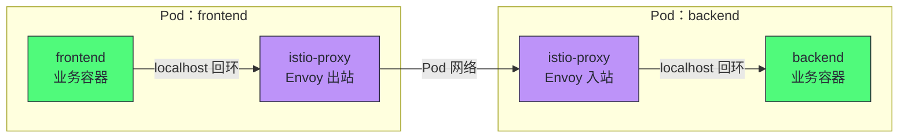
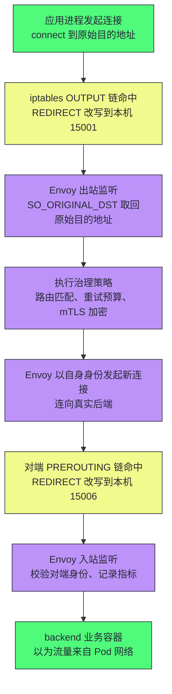
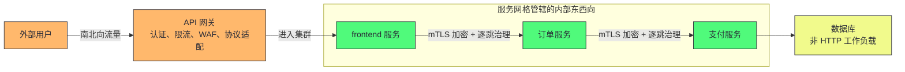

# 服务网格概述——从微服务治理痛点到Sidecar模式

**摘要：**

微服务拆分带来的最大错觉，是以为复杂性随着单体一起被拆散了——实际上它只是从代码内部搬到了服务之间的网络上：服务发现、超时重试、熔断限流、加密认证、链路追踪，每一项能力都在请求经过的每一跳反复索要，而单体时代它们不过是进程内的一次函数调用。本文沿"治理逻辑放在哪里"这条主线做一次完整的历史回溯：先看第一代胖客户端（Fat Client）SDK 如何把治理逻辑塞进每个服务的进程，又如何在多语言、升级螺旋与策略分散的困境中力不从心；再看 2016 年 Linkerd 的数据面实践与 2017 年"服务网格（Service Mesh）"的概念命名，如何完成从进程内库到旁路代理的架构跃迁；随后拆解 iptables 透明劫持与自动注入的工程落地，梳理 2017-2019 年间 Istio、Conduit、Consul Connect、App Mesh 相继入局后控制面（Control Plane）与数据面（Data Plane）分离的格局定型；最后盘点这套架构交付的四大能力、收取的四项代价与适用边界。读完全文你应当能回答两个问题：治理能力为什么必须下沉到基础设施层，以及这次下沉付出了什么、换回了什么。

---

## 第 1 章 治理问题的诞生：复杂性只是搬了家

### 1.1 一款先于概念一年的产品

2016 年 4 月，一家名叫 Buoyant 的初创公司发布了一款名叫 linkerd 的网络代理，媒体给的关注寥寥——彼时没有人说得清该把它归入哪个品类，"服务网格"这个词还要再等一年才会被发明出来。一款产品先于它的概念一年诞生，这在软件行业并不多见；而要看懂这场"先有实践、后有命名"的倒置从何而来，我们不妨把时钟再往前拨几年，回到微服务浪潮刚刚冲垮单体的那几年。

2013 年 Docker 将容器交付推向大众，2015 年 7 月 Kubernetes 1.0 正式发布——这段历史的完整脉络见 [[01 Kubernetes 的诞生与设计哲学]]——再加上 Netflix 在 2008 年数据库损坏事故后决意弃用自建数据中心、全面转向云计算的示范效应，把单体拆成微服务（Microservices）在 2014-2016 年间从激进尝试变成了行业标配。拆分的动机真实且充分：百万行级别的单体（Monolith）代码库里，任何一行改动都要触发全量构建与整体部署，发布窗口成为组织瓶颈；所有模块共享同一个进程，一个模块的内存泄漏足以拖垮全部业务；扩容只能整体复制，为热点功能多付的算力被冷门功能白白均摊。

但拆分解决的是发布与协作问题，它顺带制造的却是网络问题。单体里一次下单，本质是同一个进程内的几次函数调用——参数进栈、返回值出栈，开销小到可以忽略；拆成微服务之后，这几次调用变成了跨越网络的远程调用。这就好比把同在一间办公室里递纸条的协作方式，改成了隔着一座城市互寄快递：快递会晚点（延迟抖动）、会丢失（网络分区）、会被冒领（身份伪造）、还会在台风天整片停运（机房级故障）。办公室里"喊一嗓子就有回应"的默契，到了快递世界全部失效。用技术语言说，这正是 Sun 公司工程师 Peter Deutsch 等人在 1994-1997 年间总结的分布式计算八大谬论（Fallacies of Distributed Computing）所警告的情形：网络不是可靠的、延迟不是零、带宽不是无限的、网络不是安全的——单体时代这四条谬论被进程边界挡在门外，微服务拆分亲手拆掉了这道屏障。

换个角度说，微服务把复杂度从编译期搬到了运行期：过去藏在少数架构师心智里的分布式难题，现在铺在每一次调用的路径上，任何人只要发起一次请求，就要独自面对它们。

### 1.2 五类治理需求：请求的每一跳都在索要

把这些失效的假设翻译成工程需求，就是五类治理能力。我们不妨跟着一条请求把它走一遍：

- **服务发现（Service Discovery）与负载均衡（Load Balancing）**：容器化的 Pod 说重建就重建，IP 随之更换，实例列表分钟级变动；调用方得先知道"有哪些实例活着"，再决定"这一次发给谁"。
- **超时与重试（Timeout & Retry）**：网络抖动是常态而非异常，不设超时的请求会无限悬挂，不加节制的重试则会放大故障。
- **熔断与限流（Circuit Breaking & Rate Limiting）**：下游崩溃时要快速失败、及时释放连接与线程，否则级联失败（Cascading Failure）会沿调用链反向传播。
- **安全与身份**：谁在调用我、流量要不要加密——内网默认可信的前提已经不存在了。
- **可观测性（Observability）**：一次请求横跨十几个服务，慢在哪一跳、错在谁身上，总得有人记账。

同一组需求在两个时代的形态差异，用一张表看得更清楚：

| 治理需求 | 单体时代的形态 | 微服务时代的形态 |
| :--- | :--- | :--- |
| 服务发现与负载均衡 | 不存在，函数地址在编译期确定 | 实例列表动态变化，需实时感知与选择 |
| 超时与重试 | 几乎无此概念，调用即返回 | 每一跳都要显式配置，且需防重试放大 |
| 熔断与限流 | 不存在，进程崩溃一损俱损 | 级联失败防护成为刚需 |
| 安全与身份 | 进程边界即信任边界 | 每跳都要身份认证与传输加密 |
| 可观测性 | 断点调试加日志即可 | 需要跨服务的追踪与聚合指标 |

这五类需求有个共同特征，笔者想单独点破：它们作用在每一次网络调用上，而不作用在每个服务上。一个服务依赖十个下游，就是十份超时配置、十份重试策略、十份证书关系——治理需求的天然粒度是"跳"，而当时的工程手段几乎都以"服务"为单位供给。**治理需求按"跳"计数，治理供给按"服务"计数**，这个粒度错配正是本章之后所有架构演进的起点。

### 1.3 反事实：如果什么治理都不做

推演一个不设任何统一治理的系统会怎样，能让我们看清这五类需求各自的分量。

先看最日常的失败模式：重试风暴（Retry Storm）。假设每个服务统一配置超时 1 秒、失败重试 3 次——单看每一层，这都是教科书式的健壮性配置。但一条五层深的调用链上，最底层一次持续数秒的抖动会被逐层重试逐层放大：第一层重试 3 次，每次又触发第二层各自重试 3 次，以此类推，3 的 5 次方——一个原始请求在最坏情况下变成两百多个下游请求。重试本是为了对冲偶发失败，失控的重试反而成了压垮下游的最后一根稻草，而且每一层都会觉得"我只是重试了 3 次，问题不在我"。

再看安全。没有统一加密与身份机制的内网，流量以明文在服务间穿行，任何能连进网络的客户端都能冒充任何服务。攻击者只要攻陷一个边缘服务，就能以"合法内网流量"的姿态横向渗透（Lateral Movement），过去十年多起云上安全事件的事后复盘都指向同一个模式：边界被打穿一个点，内部网络形同不设防。零信任（Zero Trust）理念正是在这类事故里被反复验证的——但在没有基础设施支撑的年代，"每跳都验证身份"意味着每个服务自己集成 TLS 库、自己管理证书，成本高到大多数团队直接放弃。

最后看版本管理这种最枯燥的痛。某个 TLS 实现被披露高危漏洞（CVE），修复方案仅仅是升级依赖版本——但在几百个服务的组织里，这意味着几百次依赖变更、几百轮回归测试、几百个发布窗口的协调，大组织走完一轮以周计，而漏洞的公开利用窗口以天计。升级依赖靠人肉排期，是那个年代基础设施团队的日常。

> [!info] 核心概念：粒度错配为何在规模面前突然爆发
> 治理项挂在"一次调用"上，SDK 与配置却长在"一个服务"里。服务数量为 N 时，服务间的潜在链路以 N(N-1)/2 的量级增长，治理项随之超线性膨胀——这就是为什么治理问题在服务数过百之后会突然变得不可忍受。把治理供给从"每服务一份"改造成"每跳一份的统一供给"，是后续所有方案的共同方向，差别只在把治理逻辑安放在哪一层。

把这五类需求收拢成一个问题的形式：治理逻辑究竟该放在哪里？放每一跳里，可每一跳只存在于代码里——于是第一代工程师给出的答案朴实无华：那就写进每个服务的代码。

### 1.4 供给的前史：治理能力一直在迁移

在 SDK 之前，这五类治理需求并非无人过问，只是供给形态几经更迭。把这条前史摆出来，"治理逻辑不断迁移"的规律会看得更清楚：

| 时代 | 供给形态 | 治理位置 | 天花板 |
| :--- | :--- | :--- | :--- |
| 硬件负载均衡时代 | F5 等专用设备 | 网络边界一处 | 只覆盖南北向入口，东西向无从谈起 |
| DNS 轮询时代 | 域名多 A 记录 | 集群外一处 | 客户端缓存导致摘除延迟，无健康检查 |
| 注册中心时代 | Eureka、ZooKeeper、Consul | 客户端 SDK 内 | 发现能力进了进程，弹性与安全仍在代码里 |
| 网格时代 | 控制面加边车 | 每一跳的代理内 | 引入每跳延迟与平台运维成本 |

这张表里有一条清晰的轨迹：治理的位置离流量越来越近，粒度越来越细，变更越来越实时。硬件负载均衡与 DNS 把治理放在网络边缘，粗粒度、变更慢，一个实例下线要等缓存过期；注册中心把"有哪些实例活着"这一件事搬进了应用进程，但"怎么调、失败了怎么办"仍留在代码里；网格把完整的治理语义搬到了每一跳。**每一步迁移的方向一致：让治理更贴近流量本身，让变更离流量更近。** 服务网格不是凭空发明的，它是这条三十年迁移线上的最新一站——理解了这一点，就不会把它当成凭空冒出来的时髦概念，也就有理由预判它未来还会被下一站替换。

---

## 第 2 章 第一代答案：胖客户端 SDK 与它的四大困境

### 2.1 Netflix OSS：治理逻辑的第一次系统化封装

2012 年前后，正在向 AWS 迁移的 Netflix 把内部沉淀的治理组件陆续开源，形成了后来统称 Netflix OSS 的整套体系：

| 组件 | 职责 | 后来的位置 |
| :--- | :--- | :--- |
| Eureka | 服务注册与发现 | 注册中心，全语言可用 |
| Ribbon | 客户端负载均衡 | 进程内均衡器，Java 专属 |
| Hystrix | 熔断器与资源隔离 | 进程内熔断，Java 专属 |
| Zuul | 边缘网关与动态路由 | 集群入口层 |
| Feign | 声明式 HTTP 客户端 | 把 Ribbon 与 Hystrix 包进接口声明 |

Eureka 与 Hystrix 在 2012 年先后开源，Zuul 次年跟进，Ribbon 与 Feign 相继加入，整套体系到 2016 年前后完全成熟。国内的对应物是 2011 年由阿里巴巴开源的 Dubbo——RPC 框架加注册中心的组合，治理逻辑同样长在客户端 SDK 里，2018 年进入 Apache 软件基金会孵化，后成为顶级项目。Spring Cloud 在 2015 年发布 1.0 之后把 Netflix OSS 整合成注解驱动的开箱即用体验：`@EnableDiscoveryClient` 接上注册中心，`@FeignClient` 声明即调用，`@HystrixCommand` 兜底熔断。gRPC 后来提供的拦截器（Interceptor）机制，本质也是同一思路在 RPC 框架内的延续。

必须公道地说，对全 Java 技术栈的团队，这套体验在相当长的时间里是顺畅的，功能层面胖 SDK 也不比后来的网格少多少——它的失败不是功能失败，而是结构失败。

### 2.2 四大结构性困境

**困境一：多语言栈的重复实现。** 现代公司的技术栈几乎注定混合：Java 写业务、Go 写网关与基础设施、Python 写算法服务、Node.js 写聚合层。Netflix OSS 是纯 Java 的，Hystrix 的熔断语义无法直接给 Go 服务复用，于是每个语言栈要么自研一套（Go 社区后来出现 go-kit、GoMicro 等，能力对齐程度参差），要么接受部分服务裸奔。更麻烦的是能力不对齐——Java 侧有完整熔断，Python 侧只有基础重试，整套系统的治理下限由最弱的那个 SDK 决定，木桶效应在治理领域同样成立。

**困境二：SDK 升级的死亡螺旋。** 治理库以依赖的形式长在每个服务的构建产物里，升级意味着改依赖、跑回归、走发布，三件事乘以服务数量。在服务过百的组织里推一轮全量升级以月计，而框架本身还在快速迭代：2018 年年底 Netflix 宣布 Hystrix 进入维护模式并推荐社区迁移到 Resilience4j，各公司被迫再开启一轮全量迁移。这个螺旋的结构性无解在于——你永远在追赶上一版本的升级队列，治理框架的每一次演进都要向几百个服务分摊协调成本。

**困境三：代码侵入。** 治理样板代码与业务逻辑纠缠在同一批方法与调用路径里：Ribbon 的配置、Hystrix 的注解、追踪 SDK 的埋点，全都长在业务代码旁边。更换治理框架等于大面积修改业务代码；新同事入职要先学框架再学业务；代码评审里两类关注点互相干扰。侵入性最大的代价是**锁定**——业务代码与治理框架的 API 耦合越深，将来替换的成本越高。

**困境四：策略分散，无法统一。** 每个服务自带一份治理配置，同一个组织里服务间调用的超时从 500 毫秒到 30 秒各不相同，重试次数有人配 0 有人配 5。想把全局默认超时从 3 秒调到 5 秒？意味着触碰所有服务。策略漂移（Policy Drift）让"全局治理策略"这个词本身成为幻觉——你有一百个服务，就有一百份独立演化的策略。

> [!warning] 生产避坑：治理能力对齐不了语言栈的下限
> 多语言组织里最常见的安全与稳定性事故，恰恰来自"没有 SDK 可用"的那批语言：Java 服务有熔断与认证，新写的 Python 服务两者皆无。审计层面更无从下手——想回答"全公司有多少服务开了重试"，SDK 模式下只能逐个仓库翻代码。当治理配置失去可审计性，策略统一就只剩口号意义；这也是平台团队后来强烈要求"策略收口"的直接动因。

胖 SDK 方案好比每个搬进新家的住户都要自己凿井取水、自装电表与防盗门——基础设施完全私有、完全自理。住几户人时各家尚可应付，住进上千户后，你会发现各家井的水质参差、电路规范不一，而组织对全小区的水电状况一无所知。治理逻辑需要的是从"每户自备"走向"统一供给"。

### 2.3 同一思路的诸多变奏

需要澄清的是，胖 SDK 并非 Netflix 一家之言，而是一整个时代的集体选择。阿里的 Dubbo 用 Filter 链把治理逻辑织进 RPC 调用管道；gRPC 用拦截器（Interceptor）机制提供同类的织入点；Spring Cloud 的抽象门面让底层实现在 Netflix OSS 与其他方案之间可插拔。形态各异，骨架相同：治理逻辑以库的形态活在应用进程内，随应用一起编译、一起部署、一起升级。

这些变奏确实缓解了部分困境——框架化把样板代码收拢进了框架内部，抽象层让"换实现"的成本下降——但没有一项能撼动前两堵墙：库的宿命是跟着进程走，进程是什么语言，治理就得是什么语言；进程怎么发布，治理就得怎么发布。这也解释了后来网格支持者爱用的一句话总结：SDK 时代的问题从来不是"谁家的库不够好"，而是"库"这个形态本身到顶了。形态的问题只能靠换形态来解决。

把四堵墙收进一张表，它们的成因与指向一目了然：

| 困境 | 成因 | 指向的解法 |
| :--- | :--- | :--- |
| 多语言重复实现 | 治理逻辑与语言运行时绑定 | 治理进程化，语言无关 |
| 升级死亡螺旋 | 治理版本跟随应用发布 | 治理与发布解耦，独立演进 |
| 代码侵入 | 样板代码与业务代码同仓 | 治理移出进程，应用零改动 |
| 策略无法统一 | 配置散落在各仓库 | 策略集中声明，统一下发 |

四行解法并排看，"独立进程、统一控制"八个字已经呼之欲出——这恰好就是下一章的主角。

困境的形态至此已经完整：治理逻辑必须从应用进程里搬出去。可是搬到哪、以什么形态存在、如何做到应用无感知——这三个问题在 2016 年之前没有像样的答案。第一个给出答案的，是一群从 Twitter 出来的工程师。

---

## 第 3 章 Sidecar 模式：治理逻辑的一次架构跃迁

### 3.1 从 Finagle 到 Linkerd：把库变成进程

Buoyant 公司 2015 年成立，两位创始人 William Morgan 与 Oliver Gould 都出身 Twitter 的 Finagle 团队。Finagle 是 Twitter 在 2009-2012 年间把 Ruby 单体迁移到 JVM 微服务的过程中沉淀下来的容错 RPC 库，2011 年开源，客户端负载均衡、快速失败、重试预算这些能力都以进程内库的形式提供——思路与 Netflix OSS 如出一辙，只是诞生得更早。Buoyant 做出的关键改造只有一个：把 Finagle 从"库"变成"独立进程"，治理能力不再注入应用进程，而是守在应用旁边。

2016 年 4 月发布的 Linkerd 1.0 用 Scala 写在 JVM 上，以 TCP/HTTP 代理的形态部署在每个服务实例旁边。这种部署形态后来有了一个家喻户晓的名字——边车（Sidecar），取自摩托挎斗：不改动摩托车本身的构造，挂上车斗就能载人载货。落到容器时代的技术语境里，Sidecar 指与业务容器同处一个 Pod、共享同一套 Linux 网络命名空间（Network Namespace）的辅助容器：业务容器与代理容器共用同一个 localhost 与同一个 Pod IP，应用与代理之间的往返只是一次回环，不产生真实的网络跳。容器与命名空间的底层机制在 [[01 容器的本质——从进程隔离到 OCI 标准]] 与 [[02 Linux Namespace 深度解析]] 中有系统展开，Docker 系列的完整脉络见 [[云原生/Docker/00 专栏导览|Docker 专栏]]；而 Pod 抽象之所以是 Sidecar 普及的关键土壤，在于它第一次让"一组共享命名空间的容器"成为平台的一等公民——没有这个抽象，边车部署就得靠各公司自写运维脚本去凑。

两个 Pod 部署边车之后的结构与流量路径，如下图所示：



这张图值得多看一眼两个细节。其一，应用与边车之间的箭头是 localhost 回环——治理逻辑真正驻扎到了"每一跳"的位置上，应用发出的每个包必然经过它；其二，Pod 之间的箭头不再是应用直连应用，而是边车对边车——应用以为自己在和后端说话，实际一直在和代理说话。

### 3.2 命名时刻：Service Mesh 作为概念诞生

2017 年 4 月 25 日，William Morgan 发表博客，为这套实践正式命名并给出定义。原文只有一句话：*"A service mesh is a dedicated infrastructure layer for handling service-to-service communication."* 直译即：**服务网格是处理服务间通信的专用基础设施层**。定义很短，但两个限定词不妨逐字推敲。"专用"——它不承载业务语义，只负责通信治理，业务代码不需要知道它的存在；"基础设施层"——它的定位类比于 TCP/IP 之于单机进程：单机程序员不手写重传与拥塞控制，网格化之后的分布式程序员也不必手写熔断与重试。

Morgan 同时强调部署形态的决定性，这一点常被忽视。集中式代理并不新鲜——2000 年代面向服务的架构（Service-Oriented Architecture，SOA）时代的企业服务总线（Enterprise Service Bus，ESB）早把"通信治理收拢到一处"实践过一遍，但总线汇聚一切逻辑之后，自己也成了单点瓶颈、版本泥潭与组织协作的堵点。mesh 的不同在于部署粒度：治理能力以细粒度的边车形态与应用同生共死，没有中心化的流量汇聚点——总线被打碎成了千万个进程级代理，集中收拢的只有"决策"，而"决策"与"执行"的分离要到下一章才真正完成。

他还补了一个常被引用的观察：网格管的不是"服务"，而是"服务之间的连接"。N 个服务之间潜在存在 N(N-1)/2 条调用链路，这张网在传统架构里完全隐形——它散落在几百份配置与代码分支里；mesh 把这张网显形为可以被观察、被修改的对象。这也是"网格"一词最贴切的意象：你的管理单位从节点变成了网。

> [!note] 设计哲学：先有实践，后有概念，再有抽象
> 这条时间线值得记住：2016 年 4 月 Linkerd 先落地了"治理逻辑外移"的实践；2017 年 4 月 Morgan 给实践命名；2017 年 5 月之后 Istio 才把"决策"从数据面里抽出来变成控制面。软件史多数时候是概念先行、实现后至，服务网格恰好倒置——先有了能跑的东西，才回头发明名字，名字又反过来框定了此后所有讨论的边界。理解这一点，才不会把服务网格当成某个具体产品的特性，而是当成架构演进的一个阶段。

把第 2 章末尾的比喻接下去：胖 SDK 是每户自装防盗门、自雇保安，Sidecar 加控制面的组合则是小区统一装门禁、统一请物业——门禁就装在每家门口，访客核验与出入登记（流量治理与身份认证）在门口完成；物业在楼上统一决定规则：几点锁门、哪位访客放行。两个限定防止比喻失真：物业只管门禁与公共管网，不进屋干涉住户的家务——对应代理只处理流量、不侵入业务进程；"统一"意味着规则变更在一处生效，不必挨家挨户重新装修。

### 3.3 缺失的拼图：流量凭什么路过边车

边车解决了治理逻辑"住在哪里"，但立刻冒出新问题：成千上万个边车散落在集群里，谁告诉它们"给 v2 分流 10%"、"下周轮换证书"？让边车各自去拉配置，等于把 SDK 困境换个进程重演。而在此之前还有一个更基础的问题——应用发出的流量，凭什么"恰好"路过边车？下一章的答案会让很多第一次了解它的人感到意外：靠的是内核网络栈里的几条转发规则。

### 3.4 边车的资源账：同舱而居的两个进程

边车与业务容器同处一个 Pod，共享网络命名空间，但 CPU 与内存的 cgroup 边界依然各自独立——这份"同舱而居"的关系有三笔账要算清。第一笔是 CPU 争抢：两个容器共享节点的物理核，业务容器高峰期打满分配额度时，代理同样在转发路径上被挤压；反过来代理处理 TLS 与七层解析的开销，也会分走业务容器的配额，调度器为 Pod 申请资源时必须把两者之和纳入考虑。第二笔是内存边界：代理 OOM 被内核杀掉时，Kubernetes 会连带重启整个 Pod——业务进程明明健康，也陪着代理一起归零，这就是边车模式里"代理故障即应用故障"的结构性来源。第三笔是生命周期：Pod 是调度与重建的最小单位，Sidecar 升级意味着业务容器陪着重启，这是第 07 篇 Ambient 模式想要拆掉的最大痛点之一。理解了这三笔账，就理解了边车模式所有后续演进的物质基础：它不只是"多一个容器"，而是把一份基础设施的成本与风险放进了每一个业务 Pod 里。

---

## 第 4 章 透明劫持：让流量"恰好"路过边车

### 4.1 劫持的目标：应用零改动

最朴素的接入方式是让应用显式指向代理——设置 HTTP_PROXY 环境变量，或在代码里把请求地址写成 localhost 上的代理端口。但这又回到了侵入的老路：改配置、改代码、每种框架一份接入文档，"透明"二字无从谈起。Istio 们的选择是让操作系统代劳：在 Pod 的网络栈里写入转发规则，把进出应用的所有 TCP 流量重定向到边车端口——应用不改一行代码、不感知一个字节。可以把这套机制想象成小区门口的快递驿站：所有出入的包裹先统一进驿站，驿站记得每个包裹原本的收件地址，再决定转交、改投还是拒收；而驿站自己寄出的包裹贴着驿站自己的单号，不会被再收进驿站，否则包裹会在驿站里无限打转。技术上的对应关系也很工整：改写规则是驿站的大门，登记簿是内核的连接跟踪表，"驿站单号"是代理进程的身份。

### 4.2 REDIRECT 与 SO_ORIGINAL_DST：劫持的两个支点

机制层面，netfilter 是 Linux 内核的包过滤与改写框架，其中 nat 表负责地址改写：OUTPUT 链检查本机进程发出的包，PREROUTING 链检查进入本机的包。网格劫持在这两条链上各写一条 REDIRECT 规则——出站流量改写到本机 15001 端口（Envoy 的出站监听），入站流量改写到 15006（入站监听）。

改写一旦发生，第一个支点问题立刻浮现：包的目的地址已经被内核改成本机回环，代理怎么知道应用原本要去哪里？答案在内核的连接跟踪（conntrack）表里——它记录了每次改写前后的地址映射，代理对接受的连接执行一次 getsockopt，用 SO_ORIGINAL_DST 选项就能取回原始目的地址。这是透明代理的生命线：没有它，代理只知道"有个包冲我来了"，不知道"它本来要去哪"，路由与负载均衡全都无从谈起。读过 [[06 Service底层实现——kube-proxy、iptables与IPVS]] 的读者会记得 kube-proxy 的 DNAT：同样是改写目的地址，kube-proxy 改完就交给内核直接转发，全程没有用户态进程参与；网格的劫持则在改写之后把包交给一个用户态代理去执行策略——一进一出之间，治理逻辑有了落脚点，延迟也由此产生。

```bash
# 由 init 容器（或 istio-cni）在 Pod 的网络命名空间内写入，此处为简化示意
# 出站：除 uid 1337（Envoy 自身）外，所有 TCP 出站流量重定向到 15001
# owner 匹配是防回环的关键——排除不掉的话，Envoy 转发的包会再次命中规则，死循环
iptables -t nat -A OUTPUT -p tcp -m owner ! --uid-owner 1337 -j REDIRECT --to-ports 15001

# 入站：进入 Pod 的 TCP 流量重定向到 Envoy 的入站监听端口
iptables -t nat -A PREROUTING -p tcp -j REDIRECT --to-ports 15006
```

代码里那条 owner 匹配值得单独解释。规则匹配"所有 TCP 出站流量"，而 Envoy 自己也要发起新连接——连真实后端、连控制面拉配置；如果不做排除，代理发出的包会再次命中规则、再次回到代理，形成死循环。Istio 的做法是给 Envoy 进程固定 uid 1337（istio-proxy 用户），OUTPUT 规则明确放行这个 uid 的流量。**一个数字的差别，隔开了"透明代理"与"死循环"。** 一次完整请求在两端的流转路径如下图所示：



### 4.3 规则谁来写：init 容器与 istio-cni

写规则需要 NET_ADMIN 权限，而规则必须先于应用容器生效——init 容器（Init Container）应运而生：它是 Pod 里最先启动的容器，写完 iptables 规则即退出，然后业务容器才开始运行。早期 Istio 的每个注入 Pod 里都驻留一个这样的 istio-init 容器。不过特权容器住进每个 Pod，让安全团队如芒在背——一个 NET_ADMIN 就足以改写该 Pod 的全部网络行为。新版本转由 istio-cni 接管：CNI 插件链在 Pod 网络配置阶段、于节点层面写入规则，业务 Pod 从此不再需要任何特权容器。这又是一次典型的下沉——把"每个 Pod 里的专用特权步骤"替换成"节点上由平台统一执行的通用步骤"。

REDIRECT 与 TPROXY 的取舍也值得一提。REDIRECT 在内核里改写目的地址，实现简单、兼容性最好，但改写后代理取原始地址要靠 conntrack 查询，且 UDP 流量走不了这条通道；TPROXY 则不做地址改写，直接把包"透明交付"给本机 socket，原始目的地址天然保留，还能覆盖 UDP——代价是要求代理 socket 具备 IP_TRANSPARENT 能力，且规则配置更精细。Istio 默认用 REDIRECT，TPROXY 作为可选项保留给 UDP 或特殊场景。两种模式没有高下之分，只有适用面之别——这也是内核网络机制服务于架构需求的又一例。

### 4.4 自动注入：准入控制链上的修改劫持

最后一个工程问题是规模化：上千个 Pod，不可能靠人肉在每个 Deployment 里手写 Sidecar 容器定义。Kubernetes 的准入控制（Admission Control）链提供了解法——MutatingAdmissionWebhook 允许在对象创建的途中被"劫持"修改。istiod 内置的注入器注册了这样一个 webhook：只要命名空间打上 istio-injection=enabled 标签，其中创建的每个 Pod 都会在写入存储之前被自动塞入 istio-proxy 容器定义与相应的初始化配置。准入控制链的完整机制在 [[04 准入控制器深度解析]] 中有专门展开。日常使用里最直观的信号是 Pod 的 READY 列：

```bash
# 开启命名空间级自动注入：之后的每个 Pod 都会被改写为双容器结构
kubectl label namespace default istio-injection=enabled

# 注入成功的直观信号：READY 列从 1/1 变为 2/2（业务容器 + istio-proxy）
kubectl get pods
```

> [!warning] 生产避坑：劫持并非万能，边界要提前划清
> REDIRECT 只作用于 TCP；UDP 流量需要 TPROXY 等机制另行处理，DNS（UDP 53 端口）在 Istio 里有专门的劫持与重写逻辑，否则服务名解析会被牵连。劫持范围要按网段与端口精细圈定——譬如只截获发往集群内网段的流量——否则连数据库、外部 API 的流量也会被误收，代理的连接池与故障域被无谓放大。还有启动时序问题：劫持规则在网络就绪时即生效，而 Envoy 完成启动与配置拉取需要时间，窗口期内应用发出的请求会撞上没有监听的端口——Istio 提供 holdApplicationUntilProxyStarts 等选项让业务容器等代理就绪后再启动，Pod 启动初期"偶发连接拒绝"多半与此相关。

### 4.5 劫持的性能账：多出来的那一程

透明劫持不是免费的，把它拆开记账很有必要。一次服务间调用的完整路径上：数据包先穿越一次 netfilter 规则链被 REDIRECT 改写，再经回环接口（Loopback）进入代理的用户态协议栈；代理处理完后发起新连接——这条新连接到达对端后，同样要经历对端的 PREROUTING 劫持与回环。把账摊开：一次调用，两次 netfilter 穿越、四次回环接口、两次完整的 TCP 会话（应用到代理、代理到对端代理）、两次用户态代理处理。延迟与开销就从这几个"多出来"里长出来——Istio 官方基准里 Sidecar 模式新增的 P90 延迟通常在亚毫秒到个位数毫秒之间浮动，报文越小、并发越高，占比越明显。对多数业务请求无感，但对高频低延迟路径（譬如服务间密集的 gRPC 短调用）就不是一个小数字。

本文先立此存照，第 07 篇 [[07 服务网格的性能开销与Ambient Mesh]] 会把这笔账展开算透，并交代 Ambient Mesh 与 eBPF 两条试图把"多出来的一程"消掉的后继路线。在此之前只需要记住结论：劫持机制的每一步——netfilter、回环、用户态——都是 Sidecar 模式的固有成本，不是实现缺陷，后来者若声称"零开销"反而要多一分警惕。

收尾前把实践里最常见的三个误区排在明处。其一，以为"透明"等于"无状态"——劫持规则写错一条，就是全 Pod 网络的黑洞，改 iptables 的权限与变更流程要按生产级管理。其二，以为"劫持"等于"全部流量"——外部 API、数据库、云服务的流量若不圈定范围就一并入网，代理的连接池与故障域被无谓放大，还可能撞上不兼容 TLS 的老服务。其三，以为"注入"等于"接入"——Pod 里有 istio-proxy 只是物理就位，代理没拿到配置、证书没签下来之前，流量治理并没有真正生效，READY 2/2 不等于网格就绪。

至此，Sidecar 模式的三块基石——进程形态（边车）、流量路径（透明劫持）、部署自动化（自动注入）——全部就位。但此刻的网格还只是一堆各自为政的代理：它们知道"怎么治"，却不知道"治什么"。让千万个代理协同一致的指挥层，在 2017 年夏天由 Google、IBM 与 Lyft 联手补上。

---

## 第 5 章 Istio 入局：控制面与数据面的分野

### 5.1 Envoy：先于 Istio 成名的数据面

2016 年 9 月，Lyft 开源了内部代理 Envoy——Matt Klein 主导、C++ 编写、面向边缘与内部通信的高性能代理。它在设计上最有远见的一步，是把配置做成流式推送：监听器（Listener）、集群（Cluster）、路由（Route）都通过名为 xDS 的一组 gRPC 接口动态下发，代理不重启即可完成配置热更新。"配置从静态文件变成实时数据流"，这一步让"集中决策、分散执行"第一次有了可用的通信契约。Envoy 的线程模型与 Filter 链在 [[03 Envoy代理——线程模型、Filter链与连接管理]] 中专门拆解，此处只需要记住一个判断：数据面的工程难度极高——C++、事件驱动、可热更新、内存可控——这也解释了后来大多数玩家为什么选择复用而不是重造。

### 5.2 数据面为什么难造

控制面/数据面分界立起来之后，一个自然的问题是：数据面无非是个代理，为什么几乎所有玩家都选择复用 Envoy，而不是各写一个？把数据面的硬性门槛列出来，答案就浮出来了：

- **每包开销的极致控制**：代理处在每一跳的路径上，它慢一微秒，全公司所有调用慢一微秒；它多占一 MB 内存，万级 Pod 就是一万 MB；
- **事件驱动的并发模型**：单机数十万并发连接是现代代理的底线，每连接一线程的模型直接出局，只能走事件循环；
- **协议栈的完整性**：HTTP/1.1 与 HTTP/2 的边角语义、gRPC 的流式语义、TLS 握手的每个细节都要完整实现——上游应用的所有"怪癖"，到了代理层都会变成网格的故障；
- **配置热更新**：规则变更不能断流、存量连接要平滑迁移，这是 Envoy 相对传统代理 reload 时代的核心优势，也是最难做对的部分；
- **可观测性深埋点**：每个请求的指标、日志、追踪跨度都在这一层产出，信息量与开销的平衡是持续调优的工程活。

五项门槛叠在一起，数据面成了典型的"易学难精"领域：写一个能跑的代理一周，写一个能扛住生产十年不变更开销的代理是数年之功。这也反过来解释了 xDS 的价值——**与其每家重造数据面，不如把工程难度收敛到一处，用开放契约把决策权交还给控制面**。行业后来几乎收敛到 Envoy 系（Istio、AWS App Mesh、Consul Connect）与自研轻量代理系（Linkerd 2 的 Rust 代理）两个阵营，正是这道门槛留下的注脚。

### 5.3 Istio 0.1：把"决策"拆出来

2017 年 5 月 24 日，Google、IBM、Lyft 联合发布 Istio 0.1（名字取自希腊语的"帆"）。它做了一件 Linkerd 1.0 没有做的事：把"策略计算与下发"从代理里拆出来，独立成一组中心组件——Pilot 负责把流量规则翻译成数据面配置，Mixer 负责策略检查与遥测收集，Auth（后来的 Citadel）负责证书与身份。**控制面（Control Plane）与数据面（Data Plane）这对概念由此正式定型**：控制面决定"流量应该怎么走"，数据面执行"流量正在怎么走"。

两个月后的 9 月，Matt Klein 发表《The Universal Data Plane API》，给出了一个后来被反复引用的论断：控制面终将趋于同质化——每家公司都能做一个——而高性能数据面才是长期壁垒，因此应当定义中立的数据面 API，让任意控制面驱动任意代理。这篇文章把控制面/数据面的分界正式立为行业叙事，xDS 也由此走向标准化。有意思的是 Klein 自己被历史开了个玩笑：他的判断应验了"数据面收敛"的前一半，却没应验"控制面同质化"的后一半——Envoy 后来被几乎所有主流网格用作了数据面，而各家的控制面在功能与平台上深度分化，真正同质的只有底层的 xDS 协议。

控制面与数据面的关系，最贴切的意象是机场塔台与飞机：塔台自己不载一名旅客，只决定每架飞机的航线与起降次序；飞机严格执行指令，把旅客送到目的地。两个技术限定防止失真：塔台与飞机之间靠无线电沟通，xDS 就是这套无线电协议；塔台短暂失联时飞机不会坠毁——边车会按最后一份配置继续工作，只是新规则再也下不去。控制面可用性与数据面可用性被刻意解耦，是这套架构最重要的工程性质之一。

### 5.4 2017-2019：两年间的格局速成

把这一阶段的关键事件串成一条时间线，格局的形成速度一目了然：

```mermaid
%%{init: {'theme': 'dracula'}}%%
graph LR
    T1["2011<br/>Finagle 开源"] --> T2["2016.4<br/>Linkerd 1.0"]
    T2 --> T3["2016.9<br/>Envoy 开源"]
    T3 --> T4["2017.4<br/>mesh 概念命名"]
    T4 --> T5["2017.5<br/>Istio 0.1"]
    T5 --> T6["2017.9<br/>通用数据面 API"]
    T6 --> T7["2017.12<br/>Conduit 发布"]
    T7 --> T8["2018.6-7<br/>Consul Connect 与 Linkerd 2"]
    T8 --> T9["2019.4<br/>App Mesh GA"]
    T9 --> T10["2020.3<br/>istiod 合并"]
    T10 --> T11["2021-2023<br/>CNCF 毕业潮"]

    classDef e1 fill:#bd93f9,stroke:#282a36,color:#282a36
    classDef e2 fill:#50fa7b,stroke:#282a36,color:#282a36
    class T1,T2,T3,T4,T5,T6,T7 e1
    class T8,T9,T10,T11 e2
```



时间线上的其余事件可以快进：2017 年 12 月 Buoyant 发布 Conduit——用 Rust 从零重写的数据面，主打极致轻量与 Kubernetes 原生；2018 年 7 月 Conduit 并入主线成为 Linkerd 2，其数据面 linkerd2-proxy 沿用至今。2018 年 6 月 HashiCorp 在 Consul 1.2 中推出 Connect，把网格能力附着在既有的 Consul 服务目录上，卖点是虚拟机与容器混合环境的平滑接入。2019 年 4 月 AWS App Mesh 正式 GA，控制面完全托管、用户不可见，数据面同样选择 Envoy，深度绑定 AWS 生态。四款主流产品的路线差异如下：

| 维度 | Istio | Linkerd 2 | Consul Connect | AWS App Mesh |
| :--- | :--- | :--- | :--- | :--- |
| 数据面 | Envoy（C++） | linkerd2-proxy（Rust） | Envoy（可选挂载） | Envoy（托管分发） |
| 控制面 | Go，istiod 单进程 | Go | Go，随 Consul Agent 部署 | AWS 托管，用户不可见 |
| 依托平台 | Kubernetes 优先 | Kubernetes 专用 | Consul 目录，VM 与 K8s 通吃 | 仅 AWS（ECS/EKS/EC2） |
| 资源开销 | 偏高 | 低，Rust 代理极轻 | 中 | 数据面按用量，控制面托管 |
| 定位 | 功能最全的通用网格 | 轻量与易用优先 | 复用 Consul 生态的混合环境 | AWS 深度绑定的一站式方案 |

回头看这两年，业界常把网格的发展划成三代：第一代（2016 年前后）以 Linkerd 1.0 为代表，只有数据面，代理各自为政，配置靠人工；第二代（2017 年起）以 Istio 0.1 为标志，控制面登场，"决策与执行分离"的完整形态落地；第三代（2020 年前后至今）的关键词是收敛与瘦身——istiod 合并、Mixer 退场、Ambient 模式把每 Pod 代理重排为按需分层。三代的更替有清晰的内在逻辑：先把能力做出来，再把形态做对，最后把成本做下去。这份"三代"叙事记在心里，读后面各篇时会更清楚每个机制是哪一代的遗产、为什么长成今天这个样子。

### 5.5 Istio 的自我演进：从组件拆分到合并收敛

Istio 自身也在演进。1.5 版本（2020 年 3 月）把 Pilot、Citadel、Galley 合并为单进程 istiod，Mixer 退役、遥测职责下沉回数据面。社区流传过一句调侃——"用微服务架构写的控制面，最后自己合并成了单体"。调侃之外有工程实质：组件拆分带来的部署、排障与升级复杂度，已经超过它换来的模块独立性收益；Mixer 当年为每次请求做进程外策略检查的设计更是性能瓶颈的重灾区，最终被"边车内完成遥测"的方案取代。**拆还是合，从来都是权衡而不是教条**——这条教训与第 2 章的困境一脉相承，只是这次轮到基础设施自己品尝。

治理地位上，Istio 在 2022 年捐入 CNCF（先以孵化项目身份加入），2023 年 7 月毕业；Linkerd 则在 2021 年 7 月成为第一个从 CNCF 毕业的服务网格——两大阵营先后进入成熟开源基础设施的行列。表达层面，Istio 把治理策略建模成 Kubernetes 的自定义资源（VirtualService、DestinationRule 等），把声明式 API 的思路从工作负载治理延伸到流量治理——这条思路的源流在 [[云原生/Kubernetes/kubernetes架构原则和对象设计/00 专栏导览|Kubernetes 架构专栏]] 中有完整论述。

> [!info] 核心概念：控制面与数据面的分界意味着什么
> 一句话：控制面决定"包该怎么走"，数据面执行"包正在怎么走"。这条分界带来三个工程后果：其一，控制面故障不会立即影响存量流量——边车按最后一份配置继续工作；其二，数据面可以独立替换——xDS 是契约，满足契约的代理皆可入围；其三，两面的故障域、扩缩容与升级节奏从此分治。istiod 内部如何把一条 VirtualService 翻译成 xDS 配置，正是下一篇的主题。

名字有了、分界立了、产品格局长成了。但在决定"要不要把它搬进你的集群"之前，我们该冷静盘一盘：这套架构究竟交付了什么能力，又把哪些新代价压在了谁的账上。

---

## 第 6 章 收益清单与代价账单

### 6.1 四大能力象限与 SDK 的逐项对照

业界通常把网格的能力归入四个象限：流量管理（路由、灰度、超时重试、流量镜像）、安全（mTLS、身份与授权）、可观测（指标、日志、追踪）、弹性（熔断、异常点检测、限流）。与第 1 章的五类治理需求对照，会发现它们一一对应——需求没有变，变的是供给方式：

| 能力项 | 胖 SDK 的实现 | 服务网格的实现 |
| :--- | :--- | :--- |
| 服务发现与负载均衡 | Eureka 加 Ribbon，注册与均衡逻辑每种语言一份 | 控制面统一维护服务目录，边车代为转发 |
| 超时与重试 | Feign 注解或各语言自写，策略埋在代码与配置里 | VirtualService 声明式下发，一处生效 |
| 熔断与限流 | Hystrix 线程池隔离（Java 专属），Resilience4j 接棒 | Envoy 连接池限制加异常点检测，语言无关 |
| 安全与身份 | 每个服务集成 TLS 库、自管证书，内网常明文 | mTLS 自动加密，SPIFFE 身份随证书下发 |
| 可观测性 | 注入追踪 SDK、手工透传上下文，漏一跳断一链 | 边车自动产出指标、日志与跨度，应用零改动 |

两列对照里有几处差异值得展开，因为它们最能说明"下沉到基础设施"究竟改变了什么。

灰度发布的粒度。Kubernetes 原生方案按 Deployment 副本数比例分流，10 个副本只能做到 10% 一档的粗粒度；网格按权重精确分流，1% 与 99% 都是合法配置，且与副本数无关。流量镜像（Traffic Mirroring）与故障注入（Fault Injection）更是网格的独门能力——把生产流量复制一份打到测试版本而响应被丢弃，或者人为注入延迟与错误来检验系统韧性，后者是混沌工程（Chaos Engineering）的基建化形态，在无代理架构里得自建整套体系。

安全。mTLS（双向 TLS，mutual TLS）让每一次服务间通信都完成双向身份验证与加密，身份不再是 IP 地址，而是随证书下发的 SPIFFE（Secure Production Identity Framework For Everyone）身份标识——精确到"哪个命名空间里的哪个服务账号"。基于身份的授权策略（"只有 frontend 可以访问 backend 的 /api/v1 路径"）比基于 IP 的网络策略更稳固，因为身份随证书走，伪造 IP 拿不到证书。

可观测。指标、访问日志、分布式追踪（Distributed Tracing）三支柱由边车自动产出：请求量、错误率、延迟分位数以 Prometheus 格式暴露，每个请求的元数据落成访问日志，跨服务的调用链由代理生成并关联跨度。诚实地说清边界：追踪上下文在服务之间的透传由代理完成，但应用内部的异步边界——线程池、消息队列——仍需应用配合传递，网格大幅降低了追踪成本，没有把它降为零。

弹性。Envoy 的连接池限制与异常点检测（Outlier Detection）承接了 Hystrix 们的职责：连接数上限、请求队列上限、连续错误后把异常实例驱逐出负载均衡池，全部在代理层配置、语言无关。SDK 时代"治理能力对齐不了语言栈下限"的木桶效应，在这里被结构性抹平。

### 6.2 四项代价

**代价一：每跳代理延迟。** 请求出应用经过一次回环加一次代理处理，到达对端再经历同样的一程——每次服务间调用实际穿越两个代理。单跳延迟在毫秒量级，对多数业务请求无感；但把它乘以调用链的跳数，尾延迟就会显形。对延迟极度敏感的内部路径，笔者建议引入网格前用真实流量实测，而不是相信任何一份基准报告。把单跳的延迟构成拆开看，每一项都对应第 4.5 节那笔"性能账"的一个条目：

| 延迟构成 | 量级 | 说明 |
| :--- | :--- | :--- |
| netfilter 规则匹配 | 微秒级 | REDIRECT 在内核态完成，通常可忽略 |
| 回环往返 | 微秒到十微秒级 | 两次会话即四次穿越回环接口 |
| 代理处理 | 亚毫秒级 | 过滤链、路由匹配、指标埋点 |
| TLS 加解密 | 亚毫秒到毫秒级 | mTLS 开启后每跳两次握手外的对称加密 |
| 队列与调度 | 毫秒级（高载时） | 代理连接池排队，高并发下成为大头 |
| 重试放大 | 毫秒级（故障时） | 失败路径上的重试会叠加多跳延迟 |

**代价二：per-Pod 资源线性增长。** 每个 Pod 一个代理进程，万级 Pod 就是万级 Envoy，各自维护连接池、TLS 会话与配置缓存。以单个代理几十到一二百 MiB 内存、零点几核 CPU 的量级估算，这是一笔随集群规模线性放大的"底盘开销"，在资源紧张的业务集群里会直接挤占业务容量。把单个代理的内存构成摊开，大头有四块：

- **xDS 配置快照**：集群越大、服务越多，监听器与集群配置越占内存，大网格里这是第一大项；
- **连接池与缓冲区**：随流量并发度线性增长，突发流量下的内存尖峰常来自这里；
- **TLS 会话与证书缓存**：mTLS 开启后，每条连接都持有会话状态；
- **指标与统计存储**：标签基数越大，统计占用的内存越高，第 06 篇还会再遇到它。

可见代理内存不是常数，而是随网格规模与流量形态增长——大集群的 Sidecar 内存调优是一门持续的功课，第 07 篇会把它与 Ambient 模式放在一起算总账。

**代价三：排障链路变长。** "请求失败"的候选根因清单翻倍了：除了应用代码，还要检查代理配置是否同步、mTLS 证书是否过期、xDS 推送是否受阻、劫持规则是否正确。故障域从应用扩展到"应用、代理、控制面、CNI"四层，没有平台团队承接时，这些新故障域会以工单的形式砸回业务团队头上。

**代价四：CRD 学习曲线。** VirtualService、DestinationRule、PeerAuthentication、AuthorizationPolicy——先学 Kubernetes 再学 Istio 的双重概念负担真实存在；更微妙的是配置错误的爆炸半径是全局的，一条写错的 VirtualService 可以影响一个服务的全部流量。学习曲线不是引入的阻塞项，但必须计入上线节奏的时间成本。

### 6.3 适用边界：何时值得，何时不值得

值得引入的画像：服务数量多且语言栈混合，治理需求已经压过重复建设成本；有合规或零信任要求，mTLS 全覆盖是硬指标；灰度与流量编排需求精细——按权重、按 Header、镜像与故障注入都用得上；存在能承接网格运维的平台团队。

不值得的画像：服务个位数且单语言，Spring Cloud 或 gRPC 拦截器绰绰有余；尚未完成容器化与编排平台建设——网格假设工作负载可被平台统一管理，皮之不存，毛将焉附；团队无力承接平台运维，引入后无人认领的网格比没有网格更危险。

网格的固定成本很像小区物业费——住户少的小区请专职物业是奢侈，独栋别墅（单体应用）压根不需要物业；住户越多、设施越复杂，物业费摊到每户就越划算。由此也能看出两个常见反例：其一，为了"想要一个灰度发布"引入整套网格是典型的错配——Kubernetes 原生方案加网关层灰度在多数场景已经够用，网格的价值随服务间链路数量与异构程度超线性增长，链路少时固定成本摊不薄；其二，把网格当成万能通信层——对数据库这类非 HTTP 工作负载，代理层能提供的应用语义有限，Redis 与 MySQL 虽有社区过滤器，成熟度远不及 HTTP 系，指望网格统一治理所有协议并不现实。

综合两份画像，笔者把引入前的自检整理成五问，逐条回答后再做决定不迟：

1. 服务数量与语言栈：服务是否已过几十个，且至少两种语言在承载核心流量；
2. 治理痛点是否真实：升级螺旋、策略漂移、内网明文这些问题是否已经发生过，而不是"听说会";
3. 灰度与合规需求：按权重分流、全网格 mTLS 是否是明确的硬需求；
4. 平台承接能力：是否有人对控制面运维、版本推进、故障响应负责；
5. 延迟预算：核心调用链对新增毫秒级延迟是否敏感，是否做过实测。

五问里有三问答"否"，就先把网格从 roadmap 上撤下来，先解决容器化与服务治理的基本盘；三问以上答"是"，网格才进入认真的评估范围。

### 6.4 与 API 网关的分工：南北向与东西向

业界惯用方向隐喻区分流量：南北向流量指从外部世界进出集群的流量，东西向流量指集群内部服务与服务之间的流量。API 网关与网格恰好各守一个方向：



| 维度 | API 网关 | 服务网格 |
| :--- | :--- | :--- |
| 流量方向 | 南北向（外部到集群） | 东西向（服务到服务） |
| 部署位置 | 集群边缘，入口一处 | 每个 Pod 旁，随服务铺开 |
| 典型职能 | 路由、认证、限流、WAF、协议适配 | mTLS、灰度、熔断、逐跳观测 |
| 配置主体 | 网关团队集中管理 | 平台团队定基线，业务按需覆盖 |
| 故障影响面 | 入口不通则外部不可达 | 单个边车异常只影响所在 Pod |

二者是分工而非替代：外部请求先经网关整形入内，再由网格接管内部的每一程。Istio 的 Ingress Gateway 可以兼任部分网关职能，但路由聚合、API 生命周期管理等功能的完整度不及专用网关——**入口归网关、内部归网格**是实践中最稳的分工。

### 6.5 组织承接：能力下沉之后，责任去了哪里

技术账算完还有组织账。网格把治理逻辑从业务团队手里拿走、交给平台团队，这笔交接若没有清晰的制度安排，网格就会变成组织里的"无主之地"——人人受益，无人负责。一份可对照的责任划分参考如下：

| 职责 | 建议归属 | 说明 |
| :--- | :--- | :--- |
| 控制面升级与容量 | 平台团队 | istiod 故障会拖慢全部配置下发与证书签发 |
| Sidecar 版本推进 | 平台团队 | 升级等于滚动重建全部 Pod，须错峰规划窗口 |
| 网格级策略基线 | 平台团队 | 默认 mTLS 模式、全局超时与重试基线 |
| 业务级路由与授权 | 业务团队 | VirtualService、AuthorizationPolicy 中承载业务语义的部分 |
| 故障第一响应 | 平台与业务共担 | 边车层归平台，应用语义归业务，按响应标志位切分 |

> [!warning] 生产避坑：引入网格前先回答"谁负责"
> 比技术选型更早出问题的往往是责任划分：mTLS 证书轮换失败导致全站 503 时，是平台团队的告警先响，还是业务团队的用户投诉先到？Sidecar 曝出漏洞需要全集群滚动重启时，业务团队的发布窗口怎么为平台变更让路？这些问题在引入前没有答案，就会在第一次网格级故障时集中爆发。稳妥的做法是把网格运维纳入平台团队的服务目录，明确 SLA、升级通告与演练机制，再开始铺开注入——顺序反了，网格就会成为组织内无人认领的风险源。

---

## 第 7 章 小结：复杂性去了哪里

行文至此，可以把这条主线合拢了。治理需求随微服务拆分而诞生，第一代胖客户端 SDK 把治理逻辑写进每个服务的进程，在多语言与规模面前撞上四重结构性困境；Sidecar 模式把治理逻辑搬出进程、驻扎到每一跳的边上，透明劫持让这一切对应用无感，控制面让千万个代理协同一致；四大能力与四项代价构成这笔交易的两面。

同时也要诚实地记录本章没有解决的问题——它们正是后续各篇的议程：

- 千万个代理的配置从哪来、如何保证一致？——控制面与 xDS 协议，第 02 篇；
- 代理内部如何组织才能扛住每一跳的流量？——Envoy 线程模型与过滤链，第 03 篇；
- 灰度、熔断、重试这些策略如何声明与下发？——流量管理 API，第 04 篇；
- mTLS 的证书体系如何自动运转？——身份与零信任，第 05 篇；
- 指标、日志、追踪如何无侵入产出？——可观测性，第 06 篇；
- 每跳代理的成本如何压下来？——性能与 Ambient，第 07 篇。

回看这场演进，最有解释力的命题还是那句话：**复杂性不会消失，只会转移**。复杂性像被按压的气球——从这一头按下去，另一头必然鼓出来，基础设施的全部技艺在于把鼓出来的那一头挪到大多数人不必看见的地方。服务网格没有消灭网络治理的复杂性——超时还是要配、证书还是要轮换、故障还是要排——它做的是把 N 份散落在进程内的复杂性归拢成 1 份沉淀在基础设施里的复杂性。归拢的价值在于规模效应：一份专业知识服务全公司，一次策略变更全网格生效，一套排障体系覆盖所有服务；归拢的代价在于集中：平台团队成为新的关键路径，网格自身的故障域需要被认真对待。**基础设施的职责是替应用隐藏复杂性，而不是替你取消复杂性**——你可以不再在每个服务里写熔断器，但你从此要维护一个网格。

把镜头拉远，还能看到一条更长的钟摆轨迹：治理逻辑从网络设备（硬件负载均衡）摆到应用进程（SDK），再摆到旁路代理（Sidecar）；而近年来 eBPF 数据面与 gRPC 的 xDS 直连方案，又开始试图把它摆回内核与应用库内——这轮回摆的动因与代价，第 07 篇 [[07 服务网格的性能开销与Ambient Mesh]] 会专门展开。钟摆来回，唯一不变的是它在寻找"变更频率与执行效率的最佳交点"。判断自己该站在钟摆的哪一侧，靠的从来不是对新架构的信仰，而是对自身系统规模、语言栈与组织能力的诚实盘点。

由此得出的选型结论也没有悬念：网格化与否从来不是先进与落后的站队，而是复杂性的存放位置与组织运维能力之间的匹配问题——服务间链路越多、语言栈越杂、合规要求越严，归拢的价值越大；反之，把几十个单语言服务硬塞进网格，换来的多半是更长的排障链路和更贵的账单。本文是 [[云原生/服务网格/00 专栏导览|服务网格专栏导览]] 的开篇，讲完了治理逻辑外移的"为什么"；它"怎么运转"的部分——istiod 如何把一条 VirtualService 翻译成 Envoy 能执行的 xDS 配置、证书如何在集群里流转——留给下一篇 [[02 Istio架构——控制面与数据面的职责分离]]。

---

## 参考资料

1. William Morgan. What's a Service Mesh? And Why Do I Need One?. Buoyant 博客， 2017-04. https://buoyant.io/blog/whats-a-service-mesh-and-why-do-i-need-one
2. Matt Klein. The Universal Data Plane API. 2017-09. https://medium.com/@mattklein123/the-universal-data-plane-api-d15cec7a
3. Google / IBM / Lyft. Announcing Istio 0.1. istio.io 官方新闻， 2017-05. https://istio.io/latest/news/2017/announcing-0.1/
4. Buoyant. Introducing Conduit（Conduit 发布公告）. 2017-12.
5. HashiCorp. Consul 1.2 发布公告（含 Consul Connect）. 2018-06.
6. AWS. AWS App Mesh 正式发布（GA）公告. 2019-04.
7. Istio. Istio 1.5 发布公告（Pilot/Citadel/Galley 合并为 istiod）. 2020-03. https://istio.io/latest/news/releases/1.5.x/announcing-1.5/
8. CNCF. Istio 加入 CNCF 公告（2022-04）与 Istio 毕业公告（2023-07）.
9. CNCF. Linkerd 毕业公告（首个从 CNCF 毕业的服务网格）. 2021-07.
10. Netflix. Hystrix 项目状态说明（GitHub README：转入维护模式，推荐 Resilience4j）. 2018-12.
11. Peter Deutsch 等. Fallacies of Distributed Computing. 1994-1997.
12. 周志明. 凤凰架构：构建可靠的大型分布式系统. 机械工业出版社， 2021.（服务网格章节）

---

> [!note] 思考题
> 1. 治理逻辑的放置位置是一道组织题而不只是技术题。假设你的团队是纯 Java 技术栈、只有 8 个服务、没有任何合规要求，但管理层要求"上业界最新的服务网格"。请从"复杂性存放在哪里"的角度写出你的反提案，并给出 SDK 方案仍然够用的三条论证。
> 2. 第 1 章的重试风暴数学里，五层链路、每层重试 3 次的最坏放大是 243 倍。请推演：若把其中一层的重试改为 1 次，放大倍数变成多少？再推演两层各重试 2 次的情形。这个乘法结构解释了为什么重试预算必须成为全局配置，而不是每个服务自由发挥。
> 3. 透明劫持依赖 iptables 与 conntrack 这对内核机制。如果集群 CNI 普遍改用 eBPF 重写流量路径（譬如 Cilium 的做法），Sidecar 的透明劫持会被什么替代？你认为这是"实现细节的替换"，还是"Sidecar 模式本身的终结"？给出你的判断依据。
