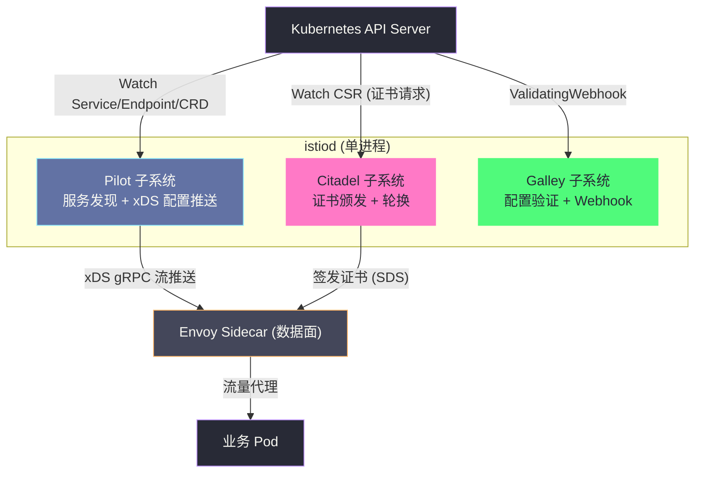
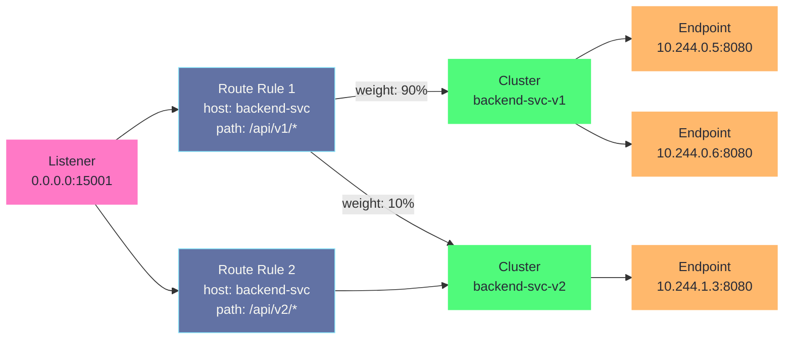
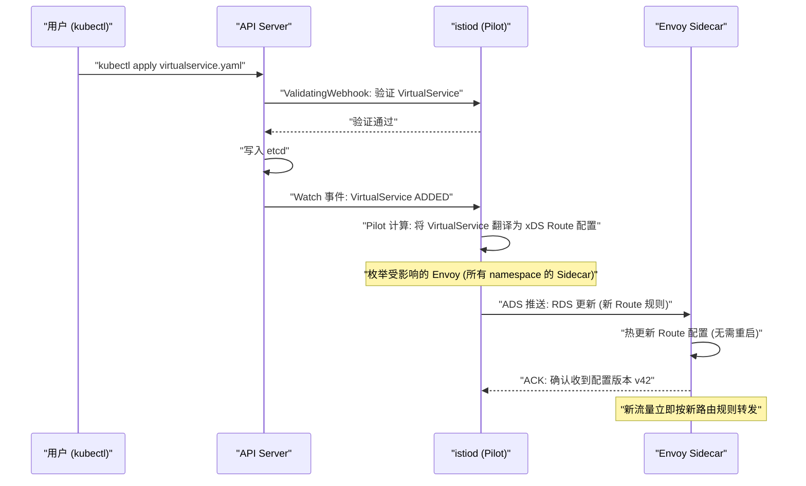

# Istio架构——控制面与数据面的职责分离

## 摘要

Istio 是当前最成熟、功能最完整的服务网格实现。理解 Istio，必须从它的核心架构分离开始：**控制面（istiod）负责策略计算和配置下发，数据面（Envoy Sidecar）负责流量的实际转发与执行**。本文深入 istiod 的三大内部子系统——Pilot（服务发现与配置推送）、Citadel（证书管理）、Galley（配置验证），解析 xDS API（LDS/RDS/CDS/EDS）如何将高层 Istio CRD 翻译为 Envoy 可理解的底层配置，还原从用户创建 VirtualService 到 Envoy 开始执行新路由规则的完整链路，并分析 Istio 从多组件到 istiod 单进程架构演进背后的工程权衡。**控制面/数据面分离不只是一种架构风格，它是大规模分布式系统中"策略与执行分离"这一原则的具体体现。**

---

## 第 1 章 Istio 架构的演进历史

### 1.1 早期架构（Istio 0.x - 1.4）：多组件时代

Istio 最初（2017 年 0.1 版本）的设计是一个多组件架构，每个组件负责独立的功能：

- **Pilot**：服务发现与流量配置推送——Watch Kubernetes API，将 Service/Endpoint 信息以及 VirtualService/DestinationRule 策略翻译为 Envoy 可读的 xDS 配置，通过 gRPC 流推送给数据面
- **Citadel**（原名 Istio-CA）：证书颁发机构——为每个服务生成 X.509 证书，实现 mTLS
- **Galley**：配置验证与分发——验证用户提交的 Istio CRD 语义正确性，将配置分发给其他组件
- **Mixer**：策略执行与遥测收集——数据面每次请求都需要向 Mixer 发起同步 RPC，检查策略和上报遥测数据

这个多组件架构的问题在生产环境暴露得很明显：

**Mixer 成为性能瓶颈**：每次请求两次 Mixer RPC（一次 precondition check，一次遥测上报），Mixer 本身成为高流量集群的性能瓶颈，也是单点故障点。测试数据显示，Mixer 的存在使数据面延迟增加了 8-20ms。

**多组件部署复杂**：运维人员需要管理 4-5 个独立进程，每个有独立的配置、Deployment、ServiceAccount、RBAC 权限，部署一个 Istio 集群需要数十条 `kubectl apply` 命令。

**组件间通信可靠性**：多个控制面组件之间的 gRPC 通信增加了故障点，任何一个组件不健康都可能影响整体功能。

### 1.2 架构整合（Istio 1.5+）：istiod 单进程

2020 年，Istio 1.5 版本做出了一个决定性的架构重构：**将 Pilot、Citadel、Galley 合并为单一进程 istiod，彻底移除 Mixer**。

**移除 Mixer 的替代方案**：
- 遥测数据采集改为由 Envoy Sidecar 直接推送（通过 Prometheus scrape 或 OpenTelemetry exporter）
- 策略执行改为在 Envoy 内部通过 External Authorization（ext_authz）扩展点调用，不再在 critical path 上同步调用 Mixer

**istiod 合并的收益**：
- 单一部署单元：一个 `kubectl apply` 就能安装完整控制面
- 进程内通信代替 gRPC 跨进程通信：组件协作效率提升
- 故障域简化：只有一个进程需要关注健康状态
- 配置管理简化：单一 ConfigMap/Secret 管理（存储在 [[06 etcd 与 Kubernetes 的状态存储|etcd]] 中）

> [!note] 设计哲学
> 从多进程到单进程，看似是"退步"（违反了微服务的单一职责原则），实则是对"过度微服务化基础设施"的理性回归。Istio 早期架构本质上是在控制面内部也做了微服务拆分，但控制面的各个组件之间高度耦合（Galley 为 Pilot 提供配置，Pilot 为 Citadel 提供服务身份信息），拆分带来的不是独立性，而是额外的网络通信和故障点。单进程 istiod 证明了：**微服务不是万能的，内部高度协作的组件合并为单进程往往是更好的工程选择**。

---

## 第 2 章 istiod 的内部架构

### 2.1 istiod 的三大子系统

尽管 istiod 是一个单进程，但在代码层面它仍然保持了清晰的子系统划分：



### 2.2 Pilot 子系统：服务发现与配置推送

Pilot 是 istiod 中最核心的子系统，它完成两件事：

**1. 服务发现（Service Discovery）**

Pilot Watch [[01 API Server 的角色与整体架构|Kubernetes API Server]] 中的 Service、Endpoint（Slice）、Pod、Node 等资源，在内存中维护一张完整的"服务注册表"（Service Registry）。这张注册表包含：
- 集群中所有 Service 的 ClusterIP、端口、选择器
- 每个 Service 当前健康的 Endpoint（Pod IP:Port）
- 每个 Pod 的标签（label）和所在节点信息

**2. xDS 配置推送（xDS Server）**

Pilot 实现了 xDS（discovery service）API——这是 Envoy 的动态配置协议。当服务注册表发生变化（新 Pod 上线、Endpoint 变化、用户修改 VirtualService），Pilot 将变化翻译为 Envoy 能理解的 xDS 配置，通过 gRPC 流实时推送给所有 Envoy Sidecar。

Pilot 的 xDS Server 监听端口：
- **15010**：明文 xDS（仅用于调试和测试，不建议生产使用）
- **15012**：mTLS xDS（生产环境使用，Envoy 通过 mTLS 认证连接到 istiod）

### 2.3 Citadel 子系统：证书管理

Citadel 是 istiod 的 PKI（公钥基础设施）组件，负责：

**1. 根证书管理**：istiod 启动时，如果没有现有的根 CA 证书，会自动生成一个自签名根 CA，存储在 Kubernetes Secret `istio-ca-secret` 中。生产环境中，可以通过插件 CA（`pluggedCA`）将外部 CA（如 HashiCorp Vault、AWS ACM PCA）接入 Istio，避免 Istio 自签名证书的信任链问题。

**2. 工作负载证书签发**：每个注入了 Sidecar 的 Pod 启动时，Envoy Sidecar 通过 **SDS（Secret Discovery Service）** 向 istiod 请求证书。SDS 是 xDS 协议族中的一员，专门用于安全凭证的动态获取和轮换。

证书签发流程：
```
Envoy Sidecar 启动
  ↓ 通过 UDS (Unix Domain Socket) 连接本地的 istiod
  ↓ 发送 SDS 请求，携带 Kubernetes Service Account JWT Token（证明自己是哪个 SA）
  istiod 接收请求
  ↓ 验证 JWT Token（通过 Kubernetes TokenReview API）
  ↓ 从 JWT 中提取 Pod 的 Service Account 信息（namespace/serviceaccount）
  ↓ 生成 SPIFFE Identity: spiffe://cluster.local/ns/<ns>/sa/<sa>
  ↓ 签发 X.509 证书（包含 SPIFFE ID 作为 SAN）
  ↓ 通过 SDS 响应推送给 Envoy
Envoy 使用证书建立 mTLS 连接
```

**3. 证书自动轮换**：Istio 默认的工作负载证书有效期为 24 小时，在证书到期前 75% 时（即约 18 小时后），Envoy 会自动向 istiod 请求新证书，整个轮换过程对应用完全透明，无需重启任何 Pod。

> [!warning] 生产避坑
> Istio 使用 Kubernetes Service Account JWT Token 作为 Pod 身份的初始凭证。在 Kubernetes 1.21+ 中，默认的 ServiceAccount Token 是"时间绑定"的（有过期时间），而 Istio 需要的是"挂载在 Pod 上的长效 Token"。如果你的集群开启了 `--service-account-signing-key-file` 并且使用了受限的 SA Token 配置，可能导致 Sidecar 无法向 istiod 申请证书，mTLS 握手失败，所有服务间请求返回 503。确保 Istio 使用的 ServiceAccount 有正确的 Token 投影配置。

### 2.4 Galley 子系统：配置验证

Galley 的主要职责是通过 Kubernetes **ValidatingWebhook** 和 **MutatingWebhook** 验证和处理 Istio CRD：

**ValidatingWebhook**：当用户 `kubectl apply` 一个 VirtualService 或 AuthorizationPolicy 时，[[01 API Server 的角色与整体架构|API Server]] 会调用 istiod 的 [[04 准入控制器深度解析|ValidatingWebhook]] 接口，istiod 检查配置的语义合法性（如 VirtualService 引用的 host 是否存在），不合法则拒绝（返回 403）。这防止了错误配置进入系统。

**MutatingWebhook**：当 Pod 创建时，API Server 调用 istiod 的 MutatingWebhook，istiod 根据 Namespace 的 `istio-injection=enabled` 标签决定是否注入 Sidecar 容器和 init 容器配置。

---

## 第 3 章 xDS API：控制面与数据面的通信协议

### 3.1 xDS 是什么

**xDS** 是 Envoy 的动态配置协议家族，由 Lyft 在 Envoy 开源时提出，已成为云原生生态中的数据面配置标准（CNCF 的 Universal Data Plane API，UDPA）。"xDS"中的"x"代表一系列具体的 Discovery Service 名称：

| API 名称 | 缩写 | 管理的 Envoy 配置 |
| :--- | :--- | :--- |
| **Listener Discovery Service** | LDS | Envoy 监听的端口和 Filter Chain |
| **Route Discovery Service** | RDS | HTTP 路由规则（path/host 路由） |
| **Cluster Discovery Service** | CDS | 后端服务集群（对应 K8s Service）|
| **Endpoint Discovery Service** | EDS | 集群中的具体端点（Pod IP:Port）|
| **Secret Discovery Service** | SDS | TLS 证书和私钥 |
| **Aggregated Discovery Service** | ADS | 将以上所有 API 聚合在一个 gRPC 流上 |

Istio 使用 ADS——所有 xDS 更新通过一个 gRPC 流传输，保证更新的有序性（如先推 CDS 再推 EDS，避免 Envoy 引用了不存在的 Cluster）。

### 3.2 Envoy 的四大核心概念

理解 xDS 配置，需要先理解 Envoy 内部的四大核心概念，这是整个 Envoy 架构的基础：

**Listener（监听器）**：Envoy 在哪些 IP:Port 上监听流量，以及收到连接后如何处理（Filter Chain）。在 Istio 中：
- `0.0.0.0:15001`：出站流量监听器（接收被 iptables 重定向的所有出站 TCP）
- `0.0.0.0:15006`：入站流量监听器（接收所有入站 TCP）
- `0.0.0.0:15090`：Prometheus metrics 监听器

**Cluster（集群）**：代表一组提供相同服务的后端（通常对应 Kubernetes Service）。Cluster 定义了负载均衡策略、健康检查配置、连接池配置、TLS 设置等。在 Istio 中，每个 Kubernetes Service 对应一个（或多个，当有 DestinationRule subset 时）Envoy Cluster。

**Route（路由）**：HTTP 层的路由规则，根据请求的 Host、Path、Header 等将请求映射到指定的 Cluster。Route 挂载在 Listener 上（通过 HTTP Connection Manager filter）。

**Endpoint（端点）**：Cluster 中的具体后端实例（IP:Port），由 EDS 动态获取。Envoy 根据 Cluster 的负载均衡算法从 Endpoint 列表中选择目标。



### 3.3 xDS 的推送模式：主动推送 vs 被动拉取

xDS 有两种工作模式，Istio 使用的是**服务端主动推送（Server-Initiated Push）**：

**State-of-the-World（SotW，全量推送）**：每次推送包含某类资源的完整状态。如每次 CDS 推送包含所有 Cluster 的完整配置。这种模式简单但在大型集群中效率低（每次 Endpoint 变化都推完整的 EDS 列表）。

**Incremental xDS（增量推送）**：只推送变化的资源（增加/修改/删除）。对于 EDS（Endpoint 频繁变化），增量推送能显著减少网络流量和 Envoy 处理开销。

Istio 从 1.0 版本开始支持增量 xDS，并在最新版本中对增量 EDS 做了深度优化，在 Pod 频繁更新的大型集群中，增量 xDS 的带宽消耗比全量推送低 90% 以上。

### 3.4 完整的 xDS 配置推送链路

以用户创建一个 VirtualService 为例，追踪从 API 操作到 Envoy 生效的完整链路：



**关键时序保证**：Istio 使用 ADS 确保配置更新的顺序性。例如，一个 VirtualService 引用了新的 DestinationRule subset，Pilot 会先推 CDS（新增 Cluster），等 Envoy ACK 后，再推 RDS（更新 Route 引用新 Cluster），避免 Envoy 在 Route 生效时引用了不存在的 Cluster 导致请求失败。

### 3.5 xDS 配置的 NACK 机制

Envoy 收到 xDS 推送后，会解析并尝试应用新配置。如果配置有错误（如引用了不存在的 Cluster），Envoy 会向 istiod 发送 **NACK（Negative ACK）**，istiod 记录错误并保留之前的正确配置。这是 xDS 协议的容错机制——配置错误不会导致 Envoy 进入错误状态，而是保持上一个已知正确的配置继续工作。

```bash
# 排查 xDS 推送问题：查看 Envoy 的 xDS 配置同步状态
istioctl proxy-status

# 输出示例：
# NAME                          CLUSTER        CDS    LDS    EDS    RDS    ECDS   ISTIOD
# backend-7d9f5c8-xk2p9.default Kubernetes    SYNCED SYNCED SYNCED SYNCED       istiod-xxx
# frontend-6b4c7f-jk9m2.default Kubernetes    SYNCED STALE  SYNCED SYNCED       istiod-xxx
#                                                             ↑
#                                              LDS 状态 STALE = Envoy 还没收到最新 LDS 配置
```

---

## 第 4 章 Istio CRD 到 xDS 配置的翻译逻辑

### 4.1 Istio CRD 的层次结构

Istio 通过 Kubernetes [[03 API 对象模型与 GVR 体系|CRD]] 扩展 API，为用户提供声明式的流量管理接口。核心 CRD 及其职责：

| CRD | 作用层面 | 配置目标 |
| :--- | :--- | :--- |
| **VirtualService** | L7 路由 | 定义"流量如何路由"（根据 host、path、header 等条件分配流量） |
| **DestinationRule** | 连接策略 | 定义"如何连接目标服务"（负载均衡算法、连接池、熔断、mTLS 模式） |
| **Gateway** | 入口/出口流量 | 控制进出 mesh 的 L4/L7 流量（替代 K8s Ingress） |
| **ServiceEntry** | 外部服务注册 | 将外部服务（集群外 API）注册到 mesh，使其可以被 VirtualService 控制 |
| **PeerAuthentication** | mTLS 策略 | 配置服务间的 mTLS 模式（STRICT/PERMISSIVE/DISABLE） |
| **AuthorizationPolicy** | 访问控制 | 基于 SPIFFE 身份的访问控制（替代 NetworkPolicy 做 L7 授权） |
| **Sidecar** | Sidecar 作用域 | 限制 Sidecar 监听的 Listener 和持有的 Cluster 配置（减少内存占用） |

### 4.2 VirtualService 到 xDS RDS 的翻译

以一个典型的灰度发布配置为例，展示 Pilot 如何将 VirtualService 翻译为 Envoy RDS 配置：

**用户配置（Istio VirtualService）**：
```yaml
apiVersion: networking.istio.io/v1alpha3
kind: VirtualService
metadata:
  name: backend-vs
spec:
  hosts:
  - backend-service        # 匹配发往 backend-service 的请求
  http:
  - match:
    - headers:
        x-version:
          exact: "v2"      # 带有 x-version: v2 Header 的请求
    route:
    - destination:
        host: backend-service
        subset: v2         # 路由到 v2 subset（DestinationRule 定义）
  - route:                 # 默认流量
    - destination:
        host: backend-service
        subset: v1
      weight: 90
    - destination:
        host: backend-service
        subset: v2
      weight: 10
```

**Pilot 翻译为 Envoy RDS 配置（JSON，简化）**：
```json
{
  "name": "80",
  "virtual_hosts": [
    {
      "name": "backend-service.default.svc.cluster.local:80",
      "domains": ["backend-service", "backend-service.default", "backend-service.default.svc.cluster.local"],
      "routes": [
        {
          "match": {
            "prefix": "/",
            "headers": [{"name": "x-version", "exact_match": "v2"}]
          },
          "route": {
            "cluster": "outbound|80|v2|backend-service.default.svc.cluster.local"
          }
        },
        {
          "match": {"prefix": "/"},
          "route": {
            "weighted_clusters": {
              "clusters": [
                {"name": "outbound|80|v1|backend-service.default.svc.cluster.local", "weight": 90},
                {"name": "outbound|80|v2|backend-service.default.svc.cluster.local", "weight": 10}
              ]
            }
          }
        }
      ]
    }
  ]
}
```

Envoy Cluster 的命名规则 `outbound|80|v1|backend-service.default.svc.cluster.local` 是 Istio 的标准格式：
`{方向}|{端口}|{subset}|{FQDN}`

### 4.3 DestinationRule 到 xDS CDS 的翻译

**用户配置（DestinationRule）**：
```yaml
apiVersion: networking.istio.io/v1alpha3
kind: DestinationRule
metadata:
  name: backend-dr
spec:
  host: backend-service
  trafficPolicy:
    connectionPool:
      tcp:
        maxConnections: 100
      http:
        http2MaxRequests: 1000
    outlierDetection:        # 熔断配置
      consecutive5xxErrors: 5
      interval: 30s
      baseEjectionTime: 30s
  subsets:
  - name: v1
    labels:
      version: v1
  - name: v2
    labels:
      version: v2
    trafficPolicy:
      connectionPool:
        http:
          http2MaxRequests: 500  # v2 subset 覆盖全局连接池设置
```

**Pilot 翻译为 Envoy CDS Cluster 配置（关键字段）**：
```json
{
  "name": "outbound|80|v1|backend-service.default.svc.cluster.local",
  "type": "EDS",
  "eds_cluster_config": {
    "service_name": "outbound|80|v1|backend-service.default.svc.cluster.local"
  },
  "circuit_breakers": {
    "thresholds": [{"max_connections": 100, "max_requests": 1000}]
  },
  "outlier_detection": {
    "consecutive_5xx": 5,
    "interval": "30s",
    "base_ejection_time": "30s"
  },
  "transport_socket": {
    "name": "envoy.transport_sockets.tls",
    "typed_config": {
      "@type": "type.googleapis.com/envoy.extensions.transport_sockets.tls.v3.UpstreamTlsContext",
      "common_tls_context": {
        "tls_certificates": [],     // 从 SDS 动态获取
        "validation_context_sds_secret_configs": [{"name": "ROOTCA"}]
      }
    }
  }
}
```

**subset 的工作原理**：DestinationRule 中的 subset 通过 Label Selector 区分 Pod。Pilot 在 EDS 中为 `v1` Cluster 只包含有 `version: v1` 标签的 Pod IP，为 `v2` Cluster 只包含有 `version: v2` 标签的 Pod IP。这样，Envoy 向 `outbound|80|v1|...` Cluster 发请求时，只会选择 `version: v1` 的 Pod。

---

## 第 5 章 Istio 的流量劫持机制深度解析

### 5.1 iptables 规则的完整结构

前文提到 init 容器写入 iptables 规则实现流量劫持，这里详细展开：

```bash
# istio-init 容器写入的完整 iptables 规则（nat 表）

# 1. 创建 Istio 自定义链
iptables -t nat -N ISTIO_REDIRECT
iptables -t nat -N ISTIO_IN_REDIRECT
iptables -t nat -N ISTIO_OUTPUT
iptables -t nat -N ISTIO_INBOUND

# 2. 设置出站重定向链
iptables -t nat -A ISTIO_REDIRECT -p tcp -j REDIRECT --to-port 15001

# 3. 设置入站重定向链
iptables -t nat -A ISTIO_IN_REDIRECT -p tcp -j REDIRECT --to-port 15006

# 4. 入站流量劫持（PREROUTING）
iptables -t nat -A PREROUTING -p tcp -j ISTIO_INBOUND
iptables -t nat -A ISTIO_INBOUND -p tcp --dport 15008 -j RETURN  # 排除 HBONE 隧道
iptables -t nat -A ISTIO_INBOUND -p tcp --dport 22 -j RETURN     # 排除 SSH
iptables -t nat -A ISTIO_INBOUND -p tcp --dport 15090 -j RETURN  # 排除 Envoy metrics
iptables -t nat -A ISTIO_INBOUND -p tcp -j ISTIO_IN_REDIRECT     # 其余重定向到 15006

# 5. 出站流量劫持（OUTPUT）
iptables -t nat -A OUTPUT -p tcp -j ISTIO_OUTPUT
# 排除 Envoy 自身的流量（通过 uid/gid 匹配）
iptables -t nat -A ISTIO_OUTPUT -m owner --uid-owner 1337 -j RETURN
iptables -t nat -A ISTIO_OUTPUT -m owner --gid-owner 1337 -j RETURN
# 排除 loopback 流量（Pod 内部访问 localhost）
iptables -t nat -A ISTIO_OUTPUT -d 127.0.0.1/32 -j RETURN
# 其余出站流量重定向到 15001
iptables -t nat -A ISTIO_OUTPUT -j ISTIO_REDIRECT
```

**关键设计：uid 1337**

Envoy 进程以 uid/gid 1337 运行，iptables 规则通过 `--uid-owner 1337` 排除 Envoy 自身发出的流量——这是防止 Envoy 的出站流量被重新劫持而形成死循环的关键。

### 5.2 Envoy 如何知道原始目标地址

出站流量被 iptables 重定向到 Envoy 的 15001 端口后，Envoy 收到的连接目标变成了 `127.0.0.1:15001`。但 Envoy 需要知道原始目标（如 `10.96.100.1:80`）才能做路由决策。

Linux 的 **`SO_ORIGINAL_DST` socket 选项** 解决了这个问题：对于被 iptables REDIRECT 重定向的 TCP 连接，内核会记录原始目标地址，并通过 `getsockopt(SO_ORIGINAL_DST)` 暴露给接受连接的进程。Envoy 在接受每个新连接时，调用这个 socket 选项获取原始目标 IP:Port，然后根据这个地址匹配 Listener 和 Route 规则，完成流量的正确路由。

### 5.3 Envoy 的出站流量处理流程

从应用发出请求到请求到达后端 Pod，Envoy 经历的完整处理流程：

```
应用进程 connect("backend-svc ClusterIP", 80)
  ↓ iptables REDIRECT → Envoy 15001
  
Envoy 出站 Listener (0.0.0.0:15001)
  ↓ SO_ORIGINAL_DST: 读取原始目标 "10.96.100.1:80"
  ↓ 匹配 Virtual Host: "backend-svc.default.svc.cluster.local:80"
  ↓ HTTP Connection Manager: 解析 HTTP 请求（URL、Header）
  ↓ Router Filter: 匹配 Route 规则
     - 如果有 x-version: v2 Header → 选择 Cluster v2
     - 否则 → 90% 选 Cluster v1，10% 选 Cluster v2
  ↓ 选定 Cluster: "outbound|80|v1|backend-svc.default.svc.cluster.local"
  ↓ 负载均衡: 从 EDS 列表中选择 Endpoint "10.244.0.5:8080"
  ↓ 建立到 10.244.0.5:8080 的 mTLS 连接（如果启用了 mTLS）
  ↓ 转发请求
```

---

## 第 6 章 Istio 的多集群与外部服务支持

### 6.1 多集群部署模式

Istio 支持多集群部署，将多个 Kubernetes 集群纳入同一个服务网格，实现跨集群的流量管理和安全策略。主要模式：

**Primary-Remote 模式**：一个集群运行 istiod（Primary），其他集群（Remote）只运行数据面，从 Primary 的 istiod 获取配置。
- 优点：控制面集中管理，配置简单
- 缺点：Primary 集群的 istiod 是单点，Remote 集群与 Primary 的网络必须可达

**Multi-Primary 模式**：每个集群运行独立的 istiod，各自管理本集群的数据面，但通过 Secret 共享根 CA 和服务发现数据，实现跨集群的 mTLS 身份互信和服务发现。
- 优点：每个集群独立，控制面故障隔离
- 缺点：配置更复杂，需要维护多个 istiod

### 6.2 ServiceEntry：将外部服务纳入 Mesh

默认情况下，Istio 中的服务只能调用集群内部的 Kubernetes Service。如果服务需要调用外部 API（如 AWS S3、外部数据库），需要通过 **ServiceEntry** 将外部服务注册到 mesh：

```yaml
apiVersion: networking.istio.io/v1alpha3
kind: ServiceEntry
metadata:
  name: external-stripe-api
spec:
  hosts:
  - api.stripe.com           # 外部服务的域名
  ports:
  - number: 443
    name: https
    protocol: HTTPS
  resolution: DNS            # 通过 DNS 解析外部服务地址
  location: MESH_EXTERNAL    # 明确标记为 mesh 外部服务
```

注册后，可以对 `api.stripe.com` 应用 VirtualService（如设置超时、重试），Envoy 的访问日志也会记录对外部服务的调用，纳入可观测性体系。

---

## 第 7 章 istiod 的高可用配置

### 7.1 istiod 的水平扩展

istiod 是一个无状态的控制面（持久化状态存储在 Kubernetes etcd 中），可以水平扩展（多副本部署）以提高可用性和处理能力：

```bash
# 扩展 istiod 副本数
kubectl scale deployment istiod -n istio-system --replicas=3
```

多副本 istiod 的工作方式：每个 Envoy Sidecar 连接到一个 istiod 实例（通过 Kubernetes Service 的随机负载均衡选择）。当某个 istiod 实例故障时，Envoy 会自动重新连接到其他实例，重新同步配置。

**已有 mTLS 连接的影响**：当 istiod 实例故障导致 Envoy 重连时，**已经建立的 mTLS 连接不会中断**——Envoy 的连接是数据面连接，与控制面的 xDS 连接是独立的。控制面短暂不可用时，Envoy 继续使用最后一次同步到的配置处理流量，只是无法接收新的配置变更。

### 7.2 istiod 的资源配置建议

| 集群规模 | Pods 数量 | istiod 副本数 | 每副本 CPU | 每副本内存 |
| :--- | :--- | :--- | :--- | :--- |
| 小型 | < 100 | 1 | 500m | 2Gi |
| 中型 | 100-1000 | 2 | 1000m | 4Gi |
| 大型 | 1000-5000 | 3 | 2000m | 8Gi |
| 超大型 | > 5000 | 5+ | 4000m | 16Gi |

istiod 的主要内存开销来自：
- 服务注册表（内存中存储所有 Service/Endpoint 信息）
- xDS 缓存（每个 Envoy 实例的当前配置版本）
- gRPC 连接（每个 Envoy Sidecar 维护一个 ADS gRPC 流）

在 5000 个 Pod 的集群中（意味着 5000 个 Envoy gRPC 流），istiod 的内存占用可能达到 8-16GB，务必预先规划资源。

---

## 第 8 章 Istio 架构的调试工具

### 8.1 istioctl 核心命令

```bash
# 验证 Istio 安装状态
istioctl verify-install

# 查看所有 Sidecar 的 xDS 同步状态
istioctl proxy-status

# 查看特定 Pod 的完整 Envoy 配置（LDS/CDS/RDS/EDS 全集）
istioctl proxy-config all <pod-name>.<namespace>

# 查看 Listener 配置
istioctl proxy-config listener <pod-name>.<namespace>

# 查看 Cluster 配置
istioctl proxy-config cluster <pod-name>.<namespace>

# 查看 Route 配置（HTTP 路由规则）
istioctl proxy-config route <pod-name>.<namespace>

# 查看 Endpoint（后端 Pod 列表）
istioctl proxy-config endpoint <pod-name>.<namespace>

# 分析 Istio 配置潜在问题
istioctl analyze

# 分析特定 Namespace
istioctl analyze -n production

# 追踪一次请求的路由决策（验证 VirtualService 是否生效）
istioctl x authz check <pod-name>.<namespace>
```

### 8.2 Envoy Admin API

每个 Envoy Sidecar 暴露一个管理端口（15000），通过 HTTP API 可以实时查看 Envoy 内部状态：

```bash
# 通过 kubectl port-forward 访问 Envoy Admin API
kubectl port-forward <pod-name> 15000:15000 -n <namespace> &

# 查看所有 Listener
curl localhost:15000/listeners

# 查看所有 Cluster
curl localhost:15000/clusters

# 查看路由配置
curl localhost:15000/routes

# 查看 xDS 配置状态
curl localhost:15000/config_dump | python3 -m json.tool | head -200

# 查看统计信息（请求数、错误数、延迟）
curl localhost:15000/stats/prometheus | grep upstream_rq

# 动态调整日志级别（临时，不影响正式配置）
curl -X POST localhost:15000/logging?level=debug
```

---

## 第 9 章 小结

### 9.1 Istio 架构全景

| 层面 | 组件/机制 | 职责 |
| :--- | :--- | :--- |
| **控制面** | istiod（单进程） | 策略计算、配置推送、证书管理 |
| **服务发现** | Pilot（Watch K8s API） | 维护服务注册表，生成 xDS 配置 |
| **安全** | Citadel（SDS） | 证书颁发、轮换（24h 生命周期） |
| **配置验证** | Galley（Webhook） | CRD 语义验证，Sidecar 自动注入 |
| **配置协议** | xDS ADS（gRPC 流） | 控制面→数据面配置同步 |
| **数据面** | Envoy Sidecar | 流量代理、TLS 终止、策略执行 |
| **流量劫持** | iptables REDIRECT | 对应用透明的流量拦截 |
| **数据面 API** | Listener/Route/Cluster/Endpoint | Envoy 内部流量处理的四大概念 |

### 9.2 下一篇预告

理解了 Istio 的控制面架构和 xDS 配置协议，接下来深入数据面的核心组件：

- **[[03 Envoy代理——线程模型、Filter链与连接管理]]**：Envoy 的事件驱动多线程架构如何实现高性能，FilterChain 如何实现插件化功能扩展，以及连接池和健康检查的精确工作机制

---

*本文是 [[服务网格]] 专栏的第 2 篇。相关专栏：[[kubernetes之API Server|K8s API Server 专栏]]、[[kubernetes控制器和调度器|K8s 控制器专栏]]、[[05 List-Watch 机制与 Informer 框架|List-Watch 机制]]*

---

> [!note] 思考题
> 1. Istio 的控制平面（istiod）将路由规则、安全策略等编译为 Envoy 配置，通过 xDS 协议推送到数据平面的 Envoy 代理。istiod 是单点组件——如果 istiod 崩溃，已下发的配置仍然生效（Envoy 继续使用本地缓存），但新的配置变更无法下发。istiod 的高可用如何保证？
> 2. Istio 的 Sidecar 注入通过 Kubernetes MutatingAdmissionWebhook 自动在 Pod 创建时注入 istio-proxy 容器。如果 Webhook 服务不可用，Pod 创建会失败还是跳过注入？`failurePolicy: Fail` vs `Ignore` 如何配置？
> 3. Istio Ambient Mesh 是 Istio 的新架构——取消 Sidecar，使用 ztunnel（节点级代理）和 Waypoint Proxy（可选的 L7 代理）。这减少了资源开销（不再每个 Pod 一个 Sidecar）。Ambient Mesh 与 Sidecar 模式在功能和性能方面有什么权衡？它是否能完全替代 Sidecar 模式？
