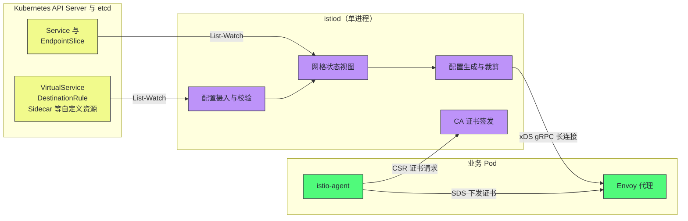
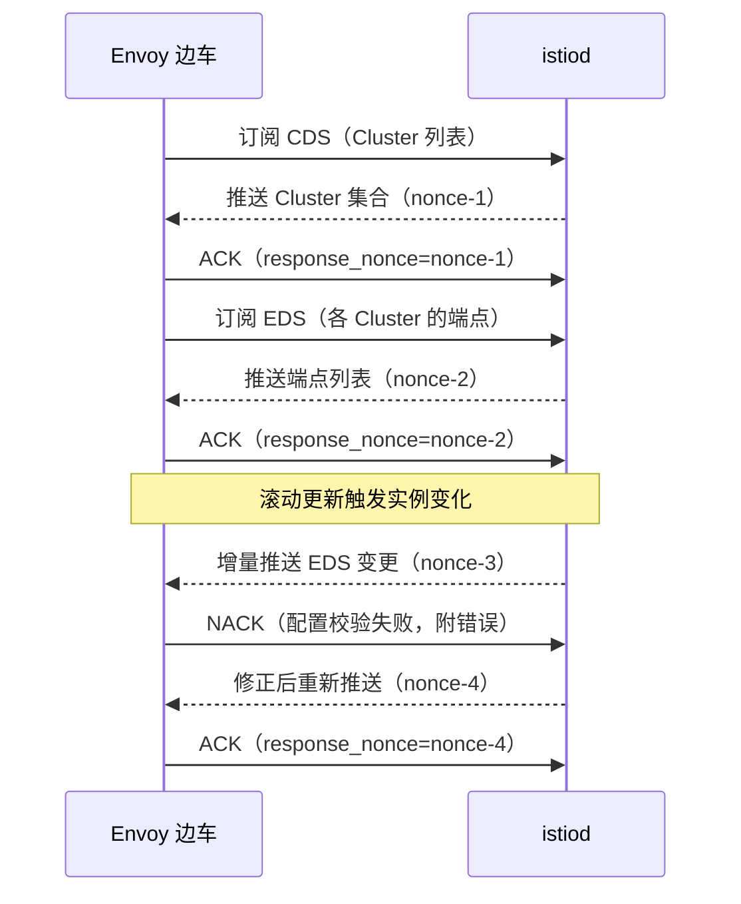

# Istio架构——控制面与数据面的职责分离

**摘要：**

上一篇留下一组没有大脑的代理：它们精通"怎么治"，却不知道"治什么"。本文回答的问题就是——这个大脑长什么样，以及它如何同时指挥成千上万个代理而不错乱。文章先论证控制面（Control Plane）与数据面（Data Plane）分离的必然性：治理决策变更频繁、数据面转发必须极致稳定，两者的变更节奏与工程要求截然不同；再回看 Istio 自己走过的弯路——0.1 版拆出 Pilot、Mixer、Citadel 等一组微服务，到 1.5 版（2020 年 3 月）又合并为单进程 istiod，用自身历史演绎了"拆分粒度由变更边界决定"的架构法则；然后拆解 istiod 内部：如何监听 Kubernetes 的声明式资源，如何把 VirtualService 这类高层策略"编译"成 Envoy 能执行的 xDS 配置，Sidecar 如何经准入 Webhook 被自动注入并完成证书签发；最后深入 xDS 协议的机制细节——五种发现类型的分工、聚合发现服务（ADS）如何解决乱序竞态、ACK/NACK 如何维持配置一致性——并以"控制面宕机时数据面会发生什么"收束。读完全文你应当能回答两个问题：一条 YAML 规则要经过哪些环节才能变成代理里的转发行为，以及这条链路上的每一环在故障时的表现。

---

## 第 1 章 为什么要分离：决策与执行的不同物理法则

### 1.1 代理没有大脑会怎样

不妨设想上一篇的网格在没有任何控制面的状态下运行：集群里一千个 Pod 各自挂着一个 Envoy，每个代理都配置齐全、功能完备，但它们对"后端有哪些实例"一无所知，对"新版本上线怎么分流"一无所知，连证书都没有。要让它工作，唯一的办法是运维把每个代理的配置文件逐个写好——服务发现要手工更新，路由变更要逐个 reload，证书过期要逐个替换。这场景荒谬得一眼可见：**治理决策的变更频率是分钟级的（实例增减、灰度调整、证书轮换），而手工变更的吞吐是人天级的**，两者之间隔着几个数量级的鸿沟。

反过来想，有没有可能干脆不要代理、只留一个"大脑"？把所有流量汇聚到一个集中式的智能网关，由它统一做负载均衡、熔断、灰度——这条路 SOA 时代的企业服务总线（ESB）走过，结局是总线自己成为单点瓶颈与部署泥潭。集中的执行把全集群的流量压到一个点上，也让每一次功能升级都变成全量风险。

两条路都走到头，剩下的唯一解就是把"决策"与"执行"拆开：**决策集中成控制面，以低频、批量的方式计算策略；执行分散为数据面，以高频、逐包的方式转发流量**。控制面像城市规划部门，决定限行规则与车道划分，但自己不站在路口指挥任何一辆车；数据面是街头执勤的交通岗，只严格执行当下生效的规则，不在路口自作主张改规划。规划部门可以整修、升级甚至停摆几天，路口的车照常通行——这正是控制面可用性与数据面可用性解耦的形象说法，后文会把它变成可验证的工程性质。

### 1.2 Kubernetes 早已给出范式

这个"决策与执行分离"的形态并非 Istio 首创。Kubernetes 自己就是这套范式最大规模的实践：用户声明期望状态（Pod 副本数、服务暴露方式），控制器持续监听并把它"调谐"成现实——apiserver 承接声明、etcd 存储状态、控制器与 kubelet 分工执行。这套声明式 API 加调谐循环的架构思想，在 [[01 Kubernetes 的诞生与设计哲学]] 里有完整论述。

Istio 的设计几乎是对这套范式的镜像复用，只是调谐的对象从"集群里的工作负载"换成了"代理里的转发行为"：

| | Kubernetes | Istio |
| :--- | :--- | :--- |
| 声明的对象 | Pod、Deployment、Service | VirtualService、DestinationRule |
| 状态存储 | etcd | etcd（经 apiserver） |
| 调谐者 | 各类控制器、kubelet | istiod |
| 执行者 | kubelet、容器运行时、内核 | Envoy 边车 |
| 生效的终点 | 集群的真实状态 | 代理的转发行为 |

理解了这张对照表，Istio 的每一个设计都不再神秘：它把 Kubernetes 用在"工作负载"上的控制器模式，原样套在了"流量行为"上，声明式的好处也随之继承——策略即代码、可评审、可回滚，配置的意图与实现分离。这也是为什么上一篇说"把治理策略建模成 Kubernetes 自定义资源"不是权宜之计，而是这套架构的地基。apiserver 在这条链路里承担的准入与监听职责，[[01 API Server 的角色与整体架构]] 中有系统展开，此处不重复。

### 1.3 两面的工程要求本就相反

支持分离的更深一层论据，是决策与执行两端的工程要求几乎处处相反，把它们塞进同一个组件只会两头都做不好：

| 维度 | 控制面的要求 | 数据面的要求 |
| :--- | :--- | :--- |
| 核心指标 | 策略正确性与下发时延 | 单跳延迟与吞吐 |
| 变更节奏 | 分钟级，频繁 | 部署后长期稳定 |
| 失效后果 | 新策略下不去、证书续不了 | 转发中断，业务直接受损 |
| 升级方式 | 随时可停可换 | 尽量无感，连接不中断 |
| 资源形态 | 常规部署，弹性伸缩 | 精简常驻，内存严格受限 |

数据面是典型的性能敏感、稳定优先：它的代码路径每一纳秒都被乘以全网格的请求量，任何花哨的抽象都要掂量掂量。控制面是典型的正确性敏感、迭代优先：规则引擎要频繁演进，错误的代价是全局的，但它的计算离数据包足够远，可以用任何方便的实现语言与框架。要求相反的两件事硬合在一起，结果要么数据面背上了控制面的功能包袱变慢，要么控制面为了迁就性能而放弃表达力——分离让各自都用自己最合适的方式演进。后文会看到 Envoy 用 C++ 与事件循环伺候数据面、istiod 用 Go 快速迭代控制面，语言的选择本身就是这份要求对照表的落点。

### 1.4 分离的代价清单

公平起见，分离不是免费午餐，它同时引入了三个新问题，本文的剩余部分就是在逐一回答它们：

- **一致性问题**：成千上万个代理如何及时拿到一致的配置？乱序、丢失、部分失败的配置更新，都可能让不同代理在同一时刻执行不同规则——这是第 5 章 xDS 协议要解决的核心问题；
- **翻译问题**：人类友好的策略声明（"v2 放 10% 流量"）与机器执行的转发规则之间隔着一整层语义鸿沟，谁来翻译、如何保证翻译不出错——这是第 3 章 istiod 内部的主题；
- **可用性耦合问题**：控制面自身故障时，数据面会怎样？会不会出现"控制面一抖、全集群断流"的连带失效——这是第 6 章的边界与反例。

先把这三个问题挂在这里，然后进入 Istio 的历史——因为这三个问题的答案，一半写在协议设计里，另一半写在 Istio 自己的架构演进教训里。

### 1.5 控制面的职责清单

把"决策"落到枚举，控制面在现代网格里实际承担五类职责：

| 职责 | 输入 | 输出 |
| :--- | :--- | :--- |
| 服务发现聚合 | Kubernetes Service 与 EndpointSlice | 各集群的端点视图（EDS 的数据源） |
| 策略编译 | VirtualService、DestinationRule 等 CRD | 路由与集群配置（CDS/RDS/LDS） |
| 身份与证书 | 工作负载的 CSR 请求 | SPIFFE 身份证书（SDS 的数据源） |
| 作用域裁剪 | Sidecar 声明与命名空间拓扑 | 每个代理可见的配置子集 |
| 策略分发 | 上述全部 | 经 xDS 的持续推送 |

清单的每一行都有独立的失效模式与容量模型——发现聚合的瓶颈在 watch 连接数量，策略编译的瓶颈在重算延迟，证书签名的瓶颈在密钥操作，分发的瓶颈在扇出带宽。第 5.5 节要算的那笔推送账只是"分发"一行的账，其余四行的账会在各自主题的篇章里遇到。控制面的资源规划，本质上就是给这五项职责分别建立模型再相加。

---

## 第 2 章 Istio 的自我修正：从组件大杂烩到 istiod

### 2.1 0.1 版的四个组件

2017 年 5 月发布的 Istio 0.1，把控制面按职能拆成了几个独立部署的组件，各自的分工如下：

| 组件 | 职能 | 命运 |
| :--- | :--- | :--- |
| Pilot | 把流量规则与服务发现翻译成 Envoy 配置并下发 | 并入 istiod |
| Mixer | 请求前置检查与遥测收集（进程外策略执行） | 1.5 废弃、1.6 移除 |
| Citadel | 证书签发与轮换（CA） | 并入 istiod |
| Galley | 配置的校验与摄入（1.1 引入） | 职能并入 istiod |

这个拆分在今天看来过于激进，但放在 2017 年的语境里并非没有道理：彼时微服务教条正值巅峰，"单体是罪恶"是社区共识，按职能拆分组件是条件反射式的选择。问题在于，拆分的代价很快在工程上显形——第 01 篇批评过 SDK 时代的四堵墙，控制面自己不长记性地重演了一遍。

### 2.2 Mixer：性能账压垮的第一张多米诺

四个组件里 Mixer 的教训最深，值得单独解剖。它的设计是把每一次请求的策略检查与遥测上报都做成**进程外调用**：Envoy 在转发每个请求前，先经 gRPC 调用 Mixer 做前置检查（precheck），请求完成后再调用一次上报（report）——每个业务请求额外引入两次跨进程 RPC。这个设计的动机很宏大：策略与遥测的适配器（Adapter）可以独立于数据面开发和扩展，审计、配额、计费、各种后端都能以插件形式挂进 Mixer，而不用动 Envoy。

代价同样宏大。其一，延迟以倍数叠加上去——调用链上每一跳都多两次 RPC，深链路下的尾延迟被显著拉长；其二，可用性被硬耦合——Mixer 宕机意味着所有前置检查失败，控制面故障直接击穿数据面的转发路径，第 1 章强调的"控制面可用性与数据面可用性解耦"被 Mixer 一项设计全部推翻；其三，为了对抗延迟与可用性问题，社区又给 Mixer 加了大量缓存与旁路逻辑，复杂度进一步膨胀。最终 1.5 版宣布废弃 Mixer，遥测职责下沉回代理进程内完成（指标、日志、追踪在 Envoy 边车里直接产出，细节见 [[06 可观测性——分布式追踪、指标与访问日志]]），1.6 版将组件彻底移除。

> [!note] 设计哲学：性能敏感的路径上，进程外扩展是奢侈品
> Mixer 的失败不是功能失败，而是位置失败：它把一个"每请求都要执行"的逻辑放到了进程外。工程上有一条朴素的法则——与数据包同频的逻辑必须与数据包同居，与数据包低频的逻辑才可以外置。遥测的聚合、策略的计算可以是进程外的（低频），但逐请求的检查与打点必须内联（高频）。这条法则后来也解释了 Ambient 模式的组件分层——ztunnel 常驻转发、waypoint 按需挂载，感兴趣的读者可先记下，第 07 篇展开。

### 2.3 1.5 版的分久必合

2020 年 3 月发布的 Istio 1.5 做出了那个著名的决定：把 Pilot、Citadel、Galley 合并成单一进程 istiod。社区流传的调侃一针见血——"用微服务架构写成的控制面，最终自己合并成了单体"。但这次"回摆"不是教条崩塌，而是架构法则的胜利，值得把账算清楚：

- **变更边界不存在**：微服务拆分的正当性来自各部分独立变更、独立发布、独立扩缩容。而 Pilot 的规则翻译、Citadel 的证书签发、Galley 的配置摄入，三者共享同一份"网格状态"视图，任何一处改动都牵动其余，它们之间根本不存在独立的变更节奏；
- **运维成本失序**：四个组件各自有部署、升级、监控、排障的成本，一次问题排查要横跨四套日志与指标——控制面自己长出了 SDK 时代"排障链路长"的毛病；
- **性能损耗无谓**：组件间本可以用进程内函数调用解决的通信，变成了跨进程的 gRPC 与序列化，纯粹为架构教条付费。

合并成 istiod 后，部署形态从四个负载收敛为一个 Go 进程，运维与排障成本骤降：

- 部署单元从四个收敛到一个，滚动升级与资源规划同步简化；
- 排障从横跨四套日志收敛到单进程日志与 15014 调试端点；
- 组件间 gRPC 变为函数调用，配置编译的端到端延迟同步下降；
- Mixer 的进程外遥测被"代理内产出指标"替代，每请求两次 RPC 的税彻底取消。

**拆还是合，从来不是微服务教条能裁决的，只能由变更边界裁决**——这是 Istio 用两年弯路换来的、可以写进任何架构手册的教训。

### 2.4 弯路的完整时间线

把 0.1 到 1.5 的演进钉在时间线上，能看出每一步都是对上一步痛点的响应：0.1 四组件起跑（2017 年 5 月）；1.0 宣布生产可用时（2018 年 7 月），Mixer 的性能质疑已经四起；1.1 引入 Galley 想把配置摄入独立成层（2019 年 3 月）；1.3 开始把遥测从 Mixer 向代理内迁移（进程内遥测的雏形）；1.4 继续给 Mixer 加缓存与降级逻辑。每一步都是修补，直到 1.5 承认修补救不了结构、直接合并（2020 年 3 月），1.6 移除 Mixer 残骸（2020 年 5 月）。

两年半的弯路并非全无遗产。其一，istiod 合并后模块内的边界仍沿旧组件划分，代码的可读性资产得以保留；其二，"遥测必须内联"沉淀为架构共识，直接塑造了第 06 篇的可观测性设计；其三，社区对"控制面自身也需要控制复杂度"形成了警惕。弯路本身也是信息量——它以生产规模的代价，替整个行业验证了一遍哪些抽象在这个领域站不住。

### 2.5 istiod 的部署形态

合并后的 istiod 以 Deployment 形式部署在 istio-system 命名空间，多个副本经 Service 对代理提供服务。代理侧连接的端口有三个值得记住：

- **15010**：明文 xDS gRPC 流，集群内网信任前提下使用；
- **15012**：TLS 加密的 xDS 与证书签发通道，生产环境的默认选择；
- **15014**：istiod 自身的监控与调试端点，Prometheus 抓取与排障从这里取数。

副本数量与资源配额是控制面容量规划的基本盘——它要扛住的负载是"全部代理的连接保持 + 配置推送扇出"，第 5.5 节会算这笔容量账。

---

## 第 3 章 istiod 内部解剖：一台策略编译器

### 3.1 它到底在做什么

剥开所有实现细节，istiod 做的事情可以概括为一句话：**把人类声明的高层策略，编译成 Envoy 可执行的底层配置**。这个"编译器"比喻经得起推敲，我们把它用足：

- **源码**：用户写的 VirtualService、DestinationRule、Gateway 等自定义资源，加上 Kubernetes 集群的服务与端点信息——这是声明层，语法面向人；
- **编译过程**：istiod 把这些声明与发现数据组合、求值、裁剪，翻译成 Listener、Cluster、Route 等 Envoy 配置对象——这是中间表示，语义必须与源码严格等价；
- **目标码**：经 xDS 协议下发的 Envoy 动态配置——这是执行层，只认协议不认意图。

编译器视角立刻带来两条推论。其一，翻译必须保真：源码里一条规则的语义，编译后在任何一个代理上的执行结果都不能走样，这正是 Istio 投入大量一致性测试的原因；其二，编译可以增量：服务实例变化时不必重译全量配置，只重算受影响的部分——这是配置推送性能的根基。

### 3.2 输入侧：监听集群的状态

istiod 的输入有两路。第一路是配置面：用户通过 kubectl 写入的 CRD 对象（VirtualService、DestinationRule、Gateway、Sidecar 等）。istiod 经 apiserver 的 List-Watch 机制建立对这批资源的实时监听——List 拉取全量快照，Watch 增量接收变更，这套机制的细节在 [[05 List-Watch 机制与 Informer 框架]] 中有专门拆解，此处只需明确：istiod 对配置的感知是秒级准实时的，且状态真相始终在 apiserver 背后的 [[06 etcd 与 Kubernetes 的状态存储|etcd]] 里，istiod 自身不持久化任何配置。第二路是发现面：集群的服务与端点（Service、Endpoints、EndpointSlice），同样经 Watch 获得实例的生灭变化。

两路输入合流进 istiod 内部的"网格状态"视图。这个设计有一个常被低估的优点：**istiod 无状态化**——它不保存任何需要持久化的东西，挂掉重启后从 apiserver 重新 List 一遍就能恢复全部认知。这为第 6 章要谈的"控制面水平扩展"埋下伏笔。此外，配置在进入编译前还要过一道校验：Istio 注册了校验类准入 Webhook，语法非法或语义冲突的资源在写入 etcd 之前就被拒绝——把错误挡在声明侧，比让编译器在运行期吞下垃圾要好得多。

### 3.3 处理侧：翻译与裁剪

输入就位后，istiod 把状态翻译成每个代理各自适用的配置。这一步有两个工程要点。

第一是**作用域裁剪**。默认情况下，每个边车理论上需要知道全网格所有服务的配置——服务数过千时，单个代理的配置快照会大到不可接受（内存与推送流量双杀）。Sidecar 自定义资源为此提供作用域声明：egress 部分限定代理可见的命名空间与服务范围，作用域收窄后，istiod 只向该代理推送它需要的子集。裁剪不是锦上添花，而是大规模网格的存活条件。

第二是**翻译的分层**。服务发现数据（哪些实例活着）与策略声明（流量怎么分）被分开处理：实例变化只触发端点配置的增量重算，策略变化才触发路由结构的重编译——把高频的细粒度变化与低频的结构变化分流，推送风暴才能被抑制。这个分流思想在第 5 章的 xDS 类型划分里还会再次出现。istiod 内部承担这次合流的缓冲区，实现里称为推送上下文（push context）：每次重算先构建全网格状态的快照，再按各代理的订阅差异裁剪下发——快照保证了同一轮推送内的一致性，裁剪保证了规模可行性。

### 3.4 输出侧：与 Envoy 的连接管理

istiod 与每个边车之间维持一条长连接（gRPC 双向流）。全网格的代理同时连上来，意味着 istiod 的第一重负载是**连接保持**——万级代理就是万级长连接；第二重负载是**推送扇出**——一次全网格配置变更要向每个代理各推一份。istiod 内部对推送做了防抖与合并（短时间内的多次变更合并为一次推送），但这笔扇出账在集群规模设计时必须提前算，不能等事故来算。

istiod 整体的数据流可以浓缩成下面这张图：



图里三条通道值得分清：左侧的 List-Watch 是 istiod 对 apiserver 的"感知通道"，右侧的 xDS 是 istiod 对代理的"下发通道"，证书路径（agent 到 CA、SDS 到 Envoy）是第三条独立的信任通道——它将在 [[05 安全——mTLS、认证与授权策略]] 中展开。三条通道共同构成一条完整的治理链路：声明进入、状态合流、配置编译、逐代理生效。

### 3.5 一次编译的全过程：以灰度规则为例

把抽象的编译过程落到一条具体规则上。假设用户声明了这样一组灰度策略——v2 版本承接 10% 流量：

```yaml
apiVersion: networking.istio.io/v1beta1
kind: VirtualService
metadata:
  name: reviews-route
spec:
  hosts: [reviews]
  http:
  - route:
    - destination: {host: reviews, subset: v1, weight: 90}
    - destination: {host: reviews, subset: v2, weight: 10}
---
apiVersion: networking.istio.io/v1beta1
kind: DestinationRule
metadata:
  name: reviews-dr
spec:
  host: reviews
  subsets:
  - name: v1
    labels: {version: v1}
  - name: v2
    labels: {version: v2}
```

istiod 的编译分四步走。**第一步，解析与校验**：VirtualService 与 DestinationRule 语法合法、host 相互引用闭合、subset 定义齐全——任何一步不过，对象被标记拒绝，Webhook 层就会把错误挡在用户提交的当下。**第二步，与发现数据求交**：用 subset 的标签选择器在 EndpointSlice 里筛出带对应标签的实例，形成 v1 与 v2 两个端点集合。**第三步，生成 Envoy 配置**：产出两个 Cluster（reviews 的 v1 池与 v2 池，各自携带负载均衡策略），再产出一条路由规则——匹配 host reviews 的请求按 90 与 10 的权重转发到两个 Cluster。**第四步，经 xDS 下发**：CDS 推两个 Cluster、EDS 推两组端点、RDS 推路由表，代理即刻具备执行能力。

这个过程里最值得玩味的是第二步——**策略与拓扑的交点**。VirtualService 只声明"v1 90%、v2 10%"，哪些实例算 v1 完全由发现数据决定；滚动更新时策略一字未改，端点集合却在变，于是策略部分的配置（路由表）纹丝不动、端点部分的配置（EDS）增量更新——分层翻译的必然性，在这条最常见的规则里就看得明明白白。反过来，如果实例标签打错（Pod 没有 version: v2 标签），第二步求交的结果就是空集，代理侧表现为"v2 集群无健康端点"——策略声明与基础设施现实之间的每一次错位，最终都以数据面的一类具体故障显形，这是排障时把两类配置放在一起看的理由。

---

## 第 4 章 Sidecar 注入与生命周期：代理从哪来

### 4.1 注入的三种方式

控制面编译好配置只是内功，代理还得先"住进"每个 Pod。Istio 提供三种注入方式，覆盖不同的使用场景：

| 方式 | 触发条件 | 适用场景 |
| :--- | :--- | :--- |
| 命名空间级自动注入 | 命名空间带 istio-injection=enabled 标签 | 全命名空间统一接入，最常见的默认选项 |
| Pod 级注解注入 | Pod 带 sidecar.istio.io/inject="true" | 个别工作负载精细化开关 |
| revision 级注入 | 命名空间带 istio.io/rev 标签 | 灰度升级控制面时的版本对齐 |

三种方式的底层机制是同一个：Kubernetes 的**变更准入 Webhook（MutatingAdmissionWebhook）**。Pod 创建请求经过 apiserver 的准入控制链时，apiserver 调用 istiod 注册的注入 Webhook，istiod 检查 Pod 的命名空间标签与注解，符合条件就把 Pod 对象原地改写——塞进 istio-proxy 容器与初始化容器定义——再交回调度流程。准入链的完整机制在 [[04 准入控制器深度解析]] 中有专门拆解，与 [[03 授权机制——RBAC 深度解析]] 所在的准入校验环节共同构成 apiserver 的两道闸门。这里只强调注入在语义上的关键点：**注入发生在对象落库之前**，因此调度器、kubelet 看到的 Pod 自始至终就是双容器的，没有任何事后补装的动作——这好比汽车出厂就装配安全带，而不是卖出去之后再进厂改装，前者的可靠性天然高于后者。

用 kubectl 视角看，注入的开关与验证各只有一条命令：

```bash
# 开启命名空间级自动注入
kubectl label namespace default istio-injection=enabled

# 注入成功的直观信号：READY 列从 1/1 变为 2/2
kubectl get pods -n default
```

### 4.2 代理的启动序列

Pod 被调度到节点后，注入的容器按依赖次序启动，这个序列值得逐帧看一遍，因为每一帧都对应一类生产故障：

1. **初始化容器写劫持规则**：istio-init（或新版由 istio-cni 在节点网络配置阶段完成）向 Pod 的网络命名空间写入 iptables 重定向规则，此后应用的任何出入流量都会被引向代理端口——上一篇已详述，此处不赘；
2. **istio-agent 先于 Envoy 就绪**：代理容器里实际跑着两个进程——Envoy 与 istio-agent。agent 先启动，向 istiod 的 CA 发起证书签名请求（CSR），拿到工作负载证书后经 **SDS（Secret Discovery Service）** 接口交给 Envoy，全程私钥不出代理容器（信任链的完整设计见下一篇）；
3. **Envoy 拉取配置**：Envoy 与 istiod 建立 xDS 流（下一章的主角），拿到监听器、集群、路由的完整配置后进入就绪状态；
4. **应用容器启动**：Pod 状态转为 Ready，流量开始进入。

序列里藏着一个经典的时序坑：劫持规则在第 1 步就生效了，而 Envoy 要到第 3 步才能承接流量——窗口期内应用若已启动并发起请求，就会撞上没有监听的端口。Istio 的 `holdApplicationUntilProxyStarts` 选项把业务容器调整为在代理就绪后启动，代价是 Pod 启动时间变长。窗口期问题的根源在于**注入把"两个进程的启动顺序"变成了同一 Pod 内的强依赖**，这是 Sidecar 模式的结构性约束之一，第 07 篇谈 Ambient 时还会回头引用。

### 4.3 升级与重建：边车模式的运维惯性

注入还决定了一件常被低估的事：**Sidecar 的升级等于 Pod 的重建**。代理以容器形态存在于每个 Pod 的 spec 里，换成新版本镜像就必须滚动重建全部 Pod——在千级 Pod 的集群里，这是一次需要分批、错峰、盯控制面的运维行动。Istio 用 revision 机制缓解这个痛点：多个版本的控制面可以并行运行（istio-1-20 与 istio-1-21 各一套），命名空间通过 istio.io/rev 标签选择接入哪个版本，逐个命名空间切换、验证、推进，控制面升级因此可以灰度；但代理镜像的最终落地仍然以 Pod 重建为终点。这个"升级惯性"是边车模式的固有成本，也是 Ambient 模式把代理移出 Pod 的核心动机之一，此处先立此存照。revision 灰度升级的标准序列值得记录，它把一次控制面升级拆成了可控的多步：

1. 部署新版本 revision 的 istiod（新旧两套并存，各自独立服务）；
2. 在预发命名空间把 istio.io/rev 标签切到新版本，验证配置下发与注入行为；
3. 逐个生产命名空间切换标签，切过的命名空间里新创建的 Pod 即由新版控制面管理；
4. 观察全网格的同步状态（proxy-status）与推送延迟，稳定后下线旧 revision。

序列里有一条暗线：标签切换改变的是"新 Pod 的注入来源"，存量 Pod 的边车仍是旧模板注入的版本——控制面的灰度与数据面的灰度在这个机制里被严格区分，两把钥匙各开各的锁。

> [!warning] 生产避坑：注入 Webhook 的失败策略要提前想清楚
> istiod 宕机时，注入 Webhook 会调用失败，此时的行为取决于 Webhook 的失败策略（failurePolicy）——配置为 Fail 时，Pod 创建会被拒绝，全集群无法扩容与重启；配置为 Ignore 时，Pod 会退化为"无边车"状态照常创建，流量裸奔进网格，两种结果都不理想。生产实践要么给 istiod 配置足够的副本与 PDB 保证可用性，要么接受 Ignore 策略下"短暂无代理"的降级窗口并配合告警。这个选择题没有标准答案，但必须是有意识的选择，而不是默认值的意外。

### 4.4 注入进去的是什么：模板解剖

注入不是魔法，注入器只是把一份容器模板改写进 Pod 对象。模板的核心构件值得点名，因为每一项都对应生产里的一类配置与故障：

- **istio-init 初始化容器**（或由 istio-cni 接管）：向 Pod 网络命名空间写 iptables 劫持规则，需要 NET_ADMIN 能力；
- **istio-proxy 容器**：镜像内含 Envoy 与 istio-agent 两个进程，以 uid 1337 运行——上一篇防回环的 owner 匹配依赖这个固定 uid；
- **健康探针改写**：代理在 15021 端口接管应用探针，注入时把应用的 readinessProbe 重写到代理上，避免"应用健康而代理未就绪"的错判；
- **身份凭据挂载**：ServiceAccount 令牌挂进代理容器，作为向 CA 发起 CSR 时证明身份的凭据；
- **生命周期控制**：`holdApplicationUntilProxyStarts` 等启动顺序选项，落点就在模板的 lifecycle 字段。

理解模板结构还有一层运维含义：代理的资源请求与上限、镜像版本、日志级别都在注入模板里定义，调整它们不需要动业务方的工作负载清单——**平台团队在一处改模板，全网格的新 Pod 统一生效**。这是治理能力平台化的又一次体现：业务团队的 Deployment 保持在"我只关心怎么跑"的状态，代理的运维参数被平台层的模板接管。

### 4.5 卸载与退出：反向的工程问题

接入有路径，退出也要有路径，而退出的路径常常更考验设计。移除 istio-injection 标签只影响"之后的 Pod"——已注入的 Pod 依然带着边车与劫持规则运行，业务流量仍在经过代理；要彻底退出，要么逐个工作负载重建 Pod，要么接受"半进半出"的过渡态长期共存。更微妙的是过渡期的流量语义：重建了一半的集群里，有边车的 Pod 之间走 mTLS，与无边车 Pod 通信时要退回明文——这正是下一篇要讲的 PERMISSIVE 模式存在的理由之一。退出成本高的根源在注入机制本身：代理长在 Pod 的 spec 里，与 Pod 同生共死，这是边车模式的又一个结构性约束。架构决策时把"进得来"与"出得去"一起评估，是对任何基础设施的基本礼貌。

---

## 第 5 章 xDS 协议深潜：配置如何正确地流动

### 5.1 五种发现类型：各管一段

xDS 不是一个协议，而是一族发现协议的统称，每种类型负责配置模型里的一段。Istio 场景下最常用的五种：

| 类型 | 全称 | 管什么 | 典型变更来源 |
| :--- | :--- | :--- | :--- |
| LDS | Listener Discovery Service | 监听器及其过滤链（15006、15001 端口怎么配） | 网格扩容、端口策略变化 |
| CDS | Cluster Discovery Service | 上游集群定义（每个服务一个集群） | 新服务注册、Subset 变化 |
| EDS | Endpoint Discovery Service | 集群内的端点列表（哪些实例活着） | 实例扩缩容、滚动更新 |
| RDS | Route Discovery Service | HTTP 路由表（路径、Header、权重分流） | VirtualService 变更 |
| SDS | Secret Discovery Service | 证书与密钥（mTLS 的身份材料） | 证书签发与轮换 |
| SRDS | Scoped Route Discovery Service | 路由配置的分片拆分（超大规模路由表） | 特大网格的路由治理 |
| VHDS | Virtual Host Discovery Service | 虚拟主机条目的动态增删 | host 极多的特殊场景 |

后两种在常规网格里较少直接感知，列出只为图谱完整——它们的出现同样遵循"变更粒度对齐推送粒度"的同一逻辑：哪里有高频细粒度的变更需求，xDS 就在哪里长出新的类型。

五类的变更频率差异极大：EDS 随滚动更新分钟级变动，RDS 随发布策略小时级变动，LDS/CDS 天级变动，SDS 按证书周期轮换。这个频率分布正是 istiod"翻译分层"的协议映射——高变的走轻量推送，低变的走结构更新，两者互不拖累。

五类对象里，Listener 与 Cluster 是理解配置模型的钥匙。Listener 是"流量从哪里进代理"的入口描述——监听哪个端口、入口先过哪些过滤器，Envoy 收到包的第一件事就是按端口找到对应 Listener；Cluster 是"流量往哪里出"的出口描述——一个上游服务对应一个或多个 Cluster（不同 subset 各一个），负载均衡策略、连接池上限、异常剔除都挂在 Cluster 上。中间的 RDS 路由表负责"从入口到出口的映射"：路径、Header、权重决定这一次请求进哪个 Cluster 的哪个 subset。入口、映射、出口三层各自独立配置又相互引用，xDS 把它们拆成三种发现类型正是这个分层结构的直接映射。

### 5.2 协议的骨架：请求、响应与确认

xDS 的传输层是 gRPC 双向流：代理主动连向 istiod 建立长连接，随后双方的对话有一个固定节奏——代理发出订阅请求（声明自己要哪类配置、订阅哪些资源），istiod 推送响应（携带完整或增量的配置资源与一个随机数 nonce），代理校验后回发确认。这个节奏里有两个保命设计，值得逐个拆开。

**其一是 nonce 防错序**。istiod 每次推送都带一个新 nonce，代理确认时必须引用收到的最后一个 nonce。若代理还在处理第 N 版推送时收到了第 N+1 版，它会以 N+1 的 nonce 确认，istiod 由此知道 N 版的处理已被跳过，立即以最新状态重新推送——乱序与过期推送在协议层就被识别和纠正，代理不会停留在中间状态。

**其二是 NACK 带错误回执**。代理若发现推送的配置无法接受（譬如引用了不存在的集群、字段语义不合法），会回发 NACK 并附上错误详情，同时继续用上一版有效配置运行。这条链路的价值在于把"配置错误"从静默故障变成了可观测的信号——istiod 侧能明确看到某个代理拒绝了哪版配置、为什么拒绝。排障时，代理侧的 `config dump` 与 istiod 侧的推送日志两端对齐，配置不一致问题基本无所遁形。

一轮完整的对话由两类报文承载，核心字段及其分工如下：

| 字段 | 方向 | 作用 |
| :--- | :--- | :--- |
| type_url | 双向 | 标识交互的发现类型（LDS/CDS/RDS/EDS/SDS） |
| version_info | 请求 | 代理当前已应用的配置版本 |
| response_nonce | 请求 | 回执最近一次收到的 nonce（ACK/NACK 都靠它） |
| resource_names | 请求 | 订阅的资源清单，增量语义的核心 |
| error_detail | 请求 | NACK 时携带的拒绝原因 |
| nonce | 响应 | istiod 为本次推送打的序号 |
| resources | 响应 | 配置资源本体（全量为全集，增量为差量） |

字段虽少，组合起来的语义相当完备：代理用 version_info 声明"我到哪了"，用 resource_names 声明"我要什么"，istiod 用 nonce 标记"这次给你的算第几版"，代理用 response_nonce 加 error_detail 回答"收到没有、对不对"。读懂这张表，排障日志里的 xDS 对话就从天书变成了流水账。



### 5.3 ADS：一条流上解决乱序竞态

五种类型各自的流足够传输配置，却带来一个协议设计者必须面对的竞态：不同类型的更新之间存在**依赖顺序**。最典型的是 Listener 引用 Cluster、HTTP 连接管理器引用路由配置——若代理先收到 LDS 的更新、其中引用的 Cluster 还没经 CDS 下发，配置在代理侧校验就会失败；RDS 与其所属 Listener 的关系同理。要让配置在代理侧永远自洽，推送必须满足"CDS 先于 EDS、CDS/RDS 先于 LDS"这类偏序。

逐条流各自维护顺序是不够的——两条独立 gRPC 流之间没有全局的先后保证，乱序仍会发生。解决方案是 **ADS（Aggregated Discovery Service，聚合发现服务）**：所有类型的订阅与推送都收拢到同一条 gRPC 流上，istiod 在单流内按依赖偏序串行提交所有更新。Istio 的边车一律经 ADS 与 istiod 通信，也就是说，你在生产环境看到的永远是"一条流管所有配置"。这个设计把协议正确性问题收束到单点上，是 xDS 能支撑大规模网格的关键一步——**顺序一旦成为正确性的前提，就把它做成协议的义务，而不是实现的运气**。

补充一句 ADS 的适用边界：它是 Istio 场景的标配，却不是 xDS 的强制项。自管 Envoy 的团队（不经 istiod，直接对接自研控制面）可以选择非 ADS 的分离流，代价是自己维护类型间的推送顺序；Envoy 社区保留两种模式，是把"顺序保证"的复杂度明码标价交给使用方选择。Istio 替你选了 ADS——理解了第 5.3 节的竞态，就知道这个默认值的分量。

### 5.4 全量与增量：EDS 的流量经济学

xDS 有两种推送粒度：**全量（State of the World）** 每次推送该类型的完整配置，**增量（Incremental xDS）** 只推送发生变化的资源。对 LDS/CDS 这类低频结构配置，全量推送的体积可以接受；但对 EDS——端点列表——全量的代价是灾难性的：一个千服务万实例的网格里，滚动更新一个 Deployment 会触发 EDS 变更，如果每次变更都推全量端点快照，istiod 的出口带宽与代理的解析 CPU 都会为"传输大量没变的数据"买单。增量 EDS 只下发增删的端点，把推送体积从"与网格规模成正比"压到"与变更规模成正比"——这就是 3.3 节"翻译分层"思想在协议层的落点：**推送的粒度必须与变更的粒度对齐**。

### 5.5 推送风暴与容量账

把前面的机制串起来，可以算 istiod 的容量账了。触发推送的源有三类：实例变更（滚动更新、弹性伸缩，触发 EDS）、策略变更（VirtualService 发布，触发 RDS/LDS/CDS）、证书轮换（触发 SDS）。规模化的网格里，一次全集群滚动更新会让成百上千个 EDS 变更密集发生，istiod 要在防抖窗口内合并变更，再向每个代理各推一份——扇出量是"变更数 × 代理数"。万级代理的网格里，这笔扇出足以把配置不足的 istiod 压垮，表现就是配置下发延迟飙升、代理长时间拿不到新端点，滚动更新期间出现 503（no healthy upstream）。对应的工程手段按优先级排列：

1. **Sidecar 作用域裁剪**：从源头缩小每个代理的订阅面，推送量直接下降一个量级；
2. **istiod 水平扩容**：多条连接分摊扇出，代价是对 apiserver 的 watch 压力上升（见第 6.5 节）；
3. **滚动更新分批限速**：压平变更峰值，给防抖窗口留出合并空间。

三条手段都不复杂，复杂的是在故障发生前意识到它们是同一笔账的三个科目。压垮发生前，istiod 通常会先亮三个信号：15014 端口上的推送延迟指标抬升（从毫秒级爬向秒级）、代理侧 proxy-status 出现 STALE（推送长时间未确认）、滚动更新期间 no healthy upstream 的 503 零星出现。三个信号按此顺序出现，基本就是扇出账爆掉的完整剧本。

### 5.6 排障实操：站在代理视角看配置

xDS 的排障利器，是把"代理视角的配置"显式拉出来与声明比对。istioctl 提供了一组按对象类型切片的命令：

```bash
# 全网格代理与 istiod 的同步状态：SYNCED 为一致，NOT SENT、STALE 都要警惕
istioctl proxy-status

# 看某个代理视角的路由表：VirtualService 被编译成了什么，一眼见底
istioctl proxy-config routes deploy/productpage-v1 -n default

# 看集群与端点：subset 是否编译、端点是否纳入、EDS 推送是否到达
istioctl proxy-config clusters deploy/productpage-v1 -n default
istioctl proxy-config endpoints deploy/productpage-v1 -n default
```

这组命令的价值在于**视角的彻底切换**：kubectl 看到的是"集群里声明了什么"，proxy-config 看到的是"这个代理真的会怎么转发"。多数"VirtualService 不生效"的工单，最终都终结在 `proxy-config routes` 的输出里——要么规则根本没被编译进路由表（命名空间作用域或 host 不匹配），要么编译了但匹配优先级被更具体的规则抢先。把 3.5 节的编译四步记在脑子里，再对着这组命令逐段核对，编译链路上断在哪一节，通常十分钟内有答案。

---

## 第 6 章 边界与反例：控制面失效时会发生什么

### 6.1 数据面的自治能力

控制面与数据面分离的架构红利，最终要在故障时刻兑现。istiod 彻底宕机时，网格的行为逐项盘点如下：

| 场景 | 表现 | 依赖机制 |
| :--- | :--- | :--- |
| 存量流量转发 | 完全正常 | Envoy 按最后已知配置继续执行 |
| 存量 mTLS 通信 | 短期正常 | 证书默认 24 小时有效期，到期前仍可解密验签 |
| 滚动更新与扩缩容 | 端点变更不生效 | EDS 无法推送，新实例进不了负载均衡池 |
| 新 Pod 注入 | 取决于 Webhook 失败策略 | Fail 拒绝创建，Ignore 裸奔创建 |
| 证书到期后 | mTLS 失败 | CSR 与 SDS 都需要 istiod 在线 |
| 策略变更 | 全部冻结 | 配置编译与推送中断 |

这张表是"控制面可用性与数据面可用性解耦"的精确含义：**解耦的是存量转发，不解耦的是变更能力**。控制面宕机不会立刻断流，但会让网格失去"应变能力"——持续不了多久，"不能变的系统"在故障演练或业务高峰面前就会露出第三种失效形态。把控制面当成交换机里的控制板来对待——它挂了转发还在，但没有人会因此推迟修它——这个心智模型才算立住了。

证书的时效值得单独展开，因为它是失效清单里最隐蔽的一项。工作负载证书默认 24 小时有效期，签发依赖 istiod 在线；istiod 宕机一小时内，一切如常——证书还远未到期；宕机超过一天，存量证书陆续到期，CSR 无法续签，mTLS 连接开始批量失败，故障以"越过了某个时间门槛后逐渐蔓延"的形态出现。这类"延迟显形的失效"最难归因——故障发生时的告警（mTLS 握手失败）与真正的根因（一天前 istiod 宕机）隔着一整个时间轴，把证书有效期、istiod 恢复时间与告警阈值放进同一张时间线里推演，是网格运维演练的标准科目。

### 6.2 一个值得推演的反例

用第 1.3 节的一致性问题做一个反事实推演：如果没有 ADS 与 nonce，滚动更新期间会发生什么？实例 A 下线、实例 B 上线，两次 EDS 推送在两条流上乱序到达某代理——代理先应用了"B 上线"，再应用了"A 下线"，若 A 的下线推送因网络抖动丢失，代理的负载均衡池里就长期挂着一个已死的端点，部分请求持续撞向它，错误率小幅但顽固地抬升，而任何单点的日志都看不出问题。这类"陈旧配置"故障在协议设计上被 nonce 与 ACK/NACK 消灭了——重推、纠错、版本对齐都有章法。协议的每一条设计都能对应一类它要消灭的故障，这是读协议的正确姿势。反过来说，当你接手一个自研配置分发系统时，不妨拿 xDS 当对照清单逐项检查：乱序有没有兜底、错误有没有回执、版本有没有协商——三个问题任何一个答不上来，那份系统里就埋着同类故障的种子。

### 6.3 一页速查：配置链路故障定位清单

把本文所有机制收拢成一份排障清单，配置类故障按序逐项核对，绝大多数在第五步之前见分晓：

1. 声明是否存在且合法：kubectl get 对应 CRD，校验 Webhook 是否拒绝过提交；
2. 声明的作用域是否覆盖目标代理：命名空间、exportTo、Sidecar 作用域三处都可能收窄可见性；
3. proxy-status 里该代理是否 SYNCED：NOT SENT 看连接，STALE 看推送延迟；
4. proxy-config 里编译产物是否存在：routes、clusters、endpoints 逐层核对；
5. 代理是否 NACK 过：istiod 日志查 error_detail，字段级错误会在这里现形；
6. 注入是否真的发生：READY 是否 2/2、劫持规则是否写入（第 01 篇的三个误区）；
7. 证书链是否健康：SDS 是否拿到证书、有效期是否临近（6.1 节的时间线）；
8. 以上全部正常而行为仍异常：进入数据面内部，Envoy 的过滤链与连接池（下一篇的主题）。

### 6.4 多集群一笔带过

跨集群场景下控制面的形态有两类：主从模式（primary-remote，多集群共用一套 istiod）与多主模式（multi-primary，每集群自持一套 istiod、经东西向网关同步身份与服务发现）。前者运维简单但控制面成为跨集群单点，后者故障域隔离更彻底但配置一致性要靠纪律维持。这个话题展开是独立的一章，本专栏从简，两种拓扑的取舍先记一张表：

| 维度 | 主从（primary-remote） | 多主（multi-primary） |
| :--- | :--- | :--- |
| 控制面数量 | 一套，跨集群服务 | 每集群一套 |
| 故障域 | 控制面是全局单点 | 集群间天然隔离 |
| 配置一致性 | 单点声明，天然一致 | 需要纪律与工具维持 |
| 适用阶段 | 起步与容灾演练 | 大规模与多地部署 |

多集群网格的价值在故障隔离与地域容灾，代价是拓扑与身份体系的复杂度，规模不到时不必着急上车。

> [!info] 核心概念：控制面排障的两端视角
> 配置不生效的排查永远从两端同时下手：代理端用 Envoy 管理端口的 `config dump` 看"代理认为自己有什么配置"，istiod 端用调试端点与推送日志看"控制面认为它该有什么配置"，两端一比对，问题就锁定在"没翻译对"（istiod 编译错误）、"没推出去"（连接与扇出问题）还是"没接受"（NACK 校验失败）三者之一。这个三分法几乎覆盖全部配置类故障，比任何逐条尝试都省时间。

### 6.5 istiod 的水平扩展与它的边界

istiod 无状态，副本扩容在机制上很直白：多个副本共同挂在同一个 Service 之后，各代理的 gRPC 连接被负载均衡到不同副本，每个副本独立从 apiserver 监听全量状态、独立服务自己连上的那批代理。一致性由无状态性保证——所有副本读到的是同一份 apiserver 状态，代理连到哪个副本，得到的认知都一样。

但这条扩展路径有三个不显眼的边界。其一，副本越多，对 apiserver 的 watch 连接越多——每个 istiod 都要监听全部 CRD 与端点，apiserver 与 etcd 的压力随 istiod 副本数线性增长，控制面的扩展瓶颈会从 istiod 本身转移到 apiserver；其二，推送扇出虽被分摊，单次全局变更仍要经所有副本各自推给各自的代理，总扇出量不变，扩容缓解的是单点的连接数与带宽，不是总量；其三，证书签发依赖共享的 CA 根密钥，多副本以 Secret 形式挂载同一密钥，密钥的暴露面随副本数增加。扩容买得到头顶空间，买不到无限——规模再往上，出路是第 3.3 节的作用域裁剪与多集群分片，而不是无止境堆副本。

---

## 第 7 章 小结：一台编译器与它的容错哲学

行文至此可以把本文合拢：控制面与数据面的分离不是发明，而是把 Kubernetes 的声明式调谐范式平移到流量域；Istio 在 0.1 到 1.5 之间经历了一次"拆分过头再合并"的自我修正，用自身历史证明了拆分粒度只能由变更边界裁决；istiod 的本质是一台策略编译器，输入是 CRD 与服务发现，输出是经 xDS 逐代理生效的转发配置；xDS 用五种发现类型对齐变更粒度，用 nonce 与 ACK/NACK 维护一致性，用 ADS 把顺序竞态收束到单流；而控制面失效时的行为清单，划清了这套架构"自治"与"依赖"的精确边界。

上一篇说边车是"驻扎在每一跳的执行者"，本文补上了它的另一面：**执行者的价值取决于决策链路的可靠性**。xDS 协议的全部复杂性——nonce、NACK、ADS、增量推送——都是为了一个朴素的承诺：任何时刻，任何一个代理上的配置，都与其他代理严格一致且语义保真。分布式系统里"一致"两个字从状态机复制讲到配置分发，做的其实是同一件事。而 istiod 的所有设计选择——无状态、监听 apiserver、防抖合并、作用域裁剪——则是在"一致性"这个硬承诺之上，给"规模"留出的每一分回旋余地。

但编译器的输出只是纸面上的指令，真正的执行发生在数据面——Envoy 的线程模型如何扛住每一跳的流量、过滤链如何组织、连接池如何管理，这是下一篇 [[03 Envoy代理——线程模型、Filter链与连接管理]] 的主题。

---

## 参考资料

1. Istio 官方文档：Architecture 与 istiod 概念页. https://istio.io/latest/docs/ops/deployment/architecture/
2. Istio 官方文档：Sidecar 注入与生命周期. https://istio.io/latest/docs/setup/additional-setup/sidecar-injection/
3. Envoy 官方文档：xDS 协议（v3 Discovery API 与 Aggregated Discovery Service）. https://www.envoyproxy.io/docs/envoy/latest/api-docs/xds_protocol
4. Matt Klein. The Universal Data Plane API. 2017-09. https://medium.com/@mattklein123/the-universal-data-plane-api-d15cec7a
5. Istio. Istio 1.5 发布公告（Pilot/Citadel/Galley 合并为 istiod，Mixer 废弃）. 2020-03. https://istio.io/latest/news/releases/1.5.x/announcing-1.5/
6. Envoy 官方博客/文档：Incremental xDS 说明.
7. CNCF. Istio 加入 CNCF（2022-04）与毕业（2023-07）公告.
8. 周志明. 凤凰架构：构建可靠的大型分布式系统. 机械工业出版社， 2021.（服务网格章节）

---

> [!note] 思考题
> 1. 第 2 章的"变更边界"法则解释了 istiod 的合并。请用它检视你所在团队的一个微服务拆分决策：哪些服务之间存在共享状态视图与同步变更节奏？它们是否本不该拆开？
> 2. 控制面宕机后，存量流量正常而"滚动更新冻结"。请推演：此时上游流量压力增大需要紧急扩容，你会用什么手段在不依赖 istiod 的前提下让新实例承接流量？这个预案是否应该写进网格的运行手册？
> 3. ADS 把所有发现类型收拢到一条 gRPC 流。请推演：万级代理、每代理一条 ADS 流的规模下，istiod 的连接与扇出压力该如何建模？水平扩容多个 istiod 副本时，配置一致性靠什么保证？（提示：状态真相在 apiserver，istiod 无状态。）

