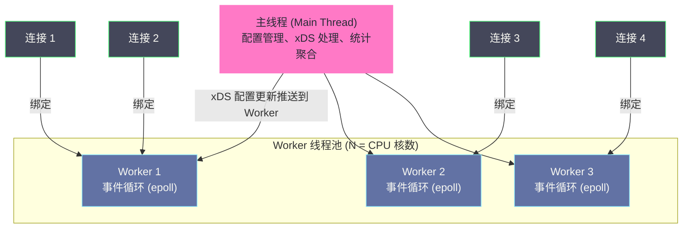
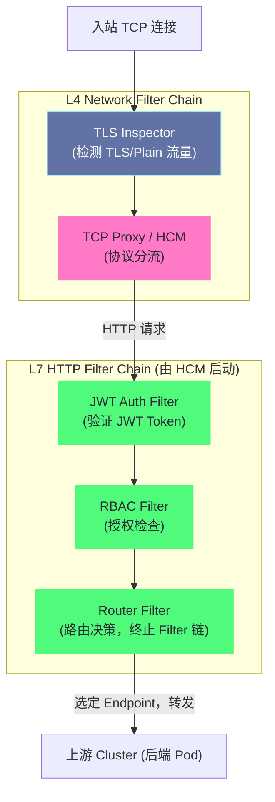

# Envoy代理——线程模型、Filter链与连接管理

## 摘要

Envoy 是现代云原生生态中最重要的数据面代理，它不仅是 Istio 的数据面，还是 AWS App Mesh、Google Cloud Traffic Director、Kong Mesh 等众多服务网格的基础。理解 Envoy 的内部机制，是真正掌握服务网格数据面行为的必要条件。本文深入 Envoy 的事件驱动多线程架构——为什么选择 Worker 线程模型而非 Go 的 goroutine 模型，每个 Worker 如何独立处理连接；解析 Filter Chain 的层次结构，从 L4 Network Filter 到 L7 HTTP Filter 的处理逻辑，以及 Filter 如何实现插件化功能扩展；剖析连接池（Connection Pool）、健康检查（Health Check）、熔断（Circuit Breaker）三大连接管理机制的精确工作原理。**Envoy 的设计证明了一个命题：在高并发网络代理场景中，精心设计的 C++ 事件循环 + 静态线程池，在性能和可预测性上优于动态协程模型。**

---

## 第 1 章 Envoy 的诞生背景与设计哲学

### 1.1 Lyft 的痛点：微服务可观测性黑盒

2015 年，Lyft 的工程团队面临一个棘手的问题。随着微服务数量从十几个增长到数百个，整个系统的网络行为变成了一个黑盒——当某条 API 调用链路出现超时时，工程师无法快速定位是哪个服务导致的，因为没有统一的机制追踪跨服务的请求延迟。

每个服务团队使用不同的语言（Python、Java、Go、Node.js），需要在每种语言的框架中独立集成追踪客户端、限流库、熔断库。这种工作重复低效，而且各团队的实现质量参差不齐——部分服务的熔断配置错误，导致一个服务故障级联引发多个服务宕机。

**Matt Klein**（Envoy 的创始工程师）在 Lyft 提出了一个解决方案：与其让每个服务单独解决这些问题，不如构建一个高性能的 L4/L7 代理，统一处理所有服务的网络治理需求。这个代理就是 Envoy，于 2016 年在 Lyft 内部达到生产就绪状态，同年开源。

### 1.2 Envoy 的核心设计原则

Matt Klein 在 Envoy 的架构设计文档中明确了几个核心原则：

**原则一：对应用透明**。Envoy 作为透明代理运行，应用代码不需要知道 Envoy 的存在——它只是"碰巧"接管了应用的网络连接。这要求 Envoy 在协议层面做到完全兼容，不能修改请求语义。

**原则二：L7 感知**。不同于传统的 L4 负载均衡器（HAProxy、LVS），Envoy 理解 HTTP/1.1、HTTP/2、gRPC、Thrift 等应用层协议，能够基于 URL、Header、Method 做路由决策，并采集 L7 粒度的指标（成功率、延迟分布）。

**原则三：高性能、可预测**。Envoy 使用 C++ 实现，基于 libevent/io_uring（最新版本）的事件驱动架构，追求极低的 tail latency（尾延迟）而非高平均吞吐量——在分布式系统中，尾延迟比平均延迟更重要（木桶效应）。

**原则四：统一的可观测性输出**。所有通过 Envoy 的流量，都能以统一的格式输出 Stats（指标）、Access Log（访问日志）、Trace Span（追踪），屏蔽了各个服务之间可观测性实现的差异。

---

## 第 2 章 Envoy 的线程模型

### 2.1 事件驱动的 I/O 模型

Envoy 基于 **事件驱动的非阻塞 I/O** 模型，这是高性能网络代理的标准选择。在这个模型中：

- 网络 I/O 操作（读取数据、等待连接建立）不会阻塞线程
- 当 I/O 事件就绪（如"有数据可读"），内核通过 epoll 通知 Envoy
- Envoy 的事件循环处理这个事件，进行数据读取和处理

相比多线程阻塞 I/O 模型（每个连接一个线程，等待时阻塞），事件驱动模型的优势是：单个线程可以处理数千个并发连接，内存占用和上下文切换开销远低于"每连接一线程"。

### 2.2 Worker 线程架构：为什么不用 goroutine

Envoy 使用**固定数量的 Worker 线程**（默认等于 CPU 核数）+ 一个主线程（Main Thread）的架构。这与 Go 语言的 goroutine 模型有本质区别：

**Go goroutine 模型**：M 个 OS 线程运行 N 个 goroutine（N >> M），goroutine 是轻量级用户态协程，M:N 调度，Go Runtime 负责调度。创建 goroutine 的成本极低（几 KB 栈），适合大量并发任务。

**Envoy Worker 线程模型**：固定 N 个 OS 线程（N = CPU 核数），每个线程有独立的事件循环（libevent/io_uring），连接直接绑定到某个 Worker 线程（通过 accept 线程分发），连接的生命周期内始终由同一个 Worker 线程处理。

**Envoy 选择固定 Worker 线程的理由**：

1. **无锁数据访问**：每个连接绑定到一个固定 Worker，连接的所有处理都在同一个线程内进行。连接相关的数据结构（Filter 状态、连接统计等）不需要加锁——这是 Envoy 低延迟的关键。如果使用 goroutine 动态调度，同一连接可能被不同 goroutine 处理，需要加锁。

2. **CPU 缓存友好**：同一连接的处理始终在同一 CPU 核上进行，连接相关的数据在 L1/L2 cache 中是热的，减少 cache miss。

3. **可预测的性能**：固定线程数 = 固定的并发度，没有动态调度的开销和不确定性，延迟更可预测（这对服务网格的 tail latency 目标非常重要）。



### 2.3 主线程与 Worker 线程的协作

**主线程（Main Thread）** 的职责：
- 接收 xDS 配置更新（从 istiod 的 ADS gRPC 流）
- 解析新配置，生成新的配置对象（Listener/Cluster/Route）
- 将新配置通过线程安全的机制分发给所有 Worker 线程

**配置更新的 TLS（Thread-Local Storage）机制**：

这是 Envoy 架构中最精妙的设计之一。当主线程更新配置时，它不是直接修改 Worker 线程的共享数据（这需要加锁），而是：

1. 主线程创建新配置对象（Cluster/Route），保存在主线程的内存中
2. 主线程向每个 Worker 线程的事件队列中放入一个回调任务
3. Worker 线程在下一次事件循环时，执行回调，将自己的 TLS 数据（线程本地的 Cluster 引用）更新为指向新配置对象
4. 主线程等待所有 Worker 线程都完成 TLS 更新后，释放旧的配置对象

这个机制确保了：
- **Worker 线程访问配置时从不需要加锁**（TLS 数据是线程私有的）
- **配置更新是原子的**（要么 Worker 使用旧配置，要么使用新配置，不会有中间状态）
- **零停机配置热更新**（Envoy 在处理流量的同时更新配置，无需重启）

### 2.4 Dispatcher：事件循环的抽象

每个 Worker 线程运行一个 **Dispatcher**（`Event::Dispatcher`），这是 Envoy 对事件循环的抽象封装。Dispatcher 提供：

- 定时器（Timer）管理：支持超时机制（如请求超时、连接空闲超时）
- I/O 事件注册：将 fd（文件描述符）的读写事件注册到 epoll
- 异步回调队列：支持跨线程安全地向 Worker 投递任务
- DNS 解析：非阻塞的异步 DNS 解析（不阻塞 Worker 事件循环）

---

## 第 3 章 Filter Chain：Envoy 的插件化架构

### 3.1 为什么需要 Filter Chain

Envoy 需要对每个连接和请求执行多种处理逻辑：TLS 解密、协议解析、认证检查、路由决策、指标采集、日志记录、限流等。如果把所有逻辑写在一个大函数里，代码会变成难以维护的泥球（Big Ball of Mud）。

Filter Chain（过滤器链）是 Envoy 的核心架构模式：**将每种处理逻辑封装为独立的 Filter，多个 Filter 按顺序组成链条，数据从链头流向链尾，每个 Filter 可以读取/修改数据，也可以终止链的执行**。

这个模式类似于中间件链（如 Express.js 的 `app.use()`），但 Envoy 的 Filter 体系有更严格的层次结构。

### 3.2 两层 Filter 架构

Envoy 的 Filter 分为两个层次：

**L4 Network Filter（网络过滤器）**：工作在 TCP 连接层，处理的单元是字节流（`Buffer`）。Network Filter 不理解应用层协议（HTTP/gRPC），它的职责是：
- TLS 解密/加密（`envoy.transport_sockets.tls`）
- 流量统计（字节数、连接数）
- TCP 代理（将连接转发到上游）
- 连接级别的访问控制

**L7 HTTP Filter（HTTP 过滤器）**：工作在 HTTP 请求/响应层，由 L4 层的 **HTTP Connection Manager（HCM）** Network Filter 启动。HTTP Filter 理解 HTTP 语义（Method、URL、Header、Body），其职责是：
- 路由决策（Router Filter）
- JWT Token 验证（JWT Authentication Filter）
- RBAC 访问控制（RBAC Filter）
- 请求/响应 Header 修改
- 限流（Rate Limit Filter）
- Fault Injection（故障注入）
- gRPC JSON 转码



### 3.3 HTTP Connection Manager（HCM）深度解析

**HTTP Connection Manager（HCM）** 是 Envoy 中最重要的 Network Filter，它是 L4 和 L7 之间的桥梁。HCM 的职责：

1. **HTTP 解析**：解析 HTTP/1.1 或 HTTP/2 协议，将字节流拆分为 Request/Response 对象
2. **连接管理**：HTTP/1.1 的 Keep-Alive、HTTP/2 的多路复用（Multiplexing）
3. **启动 L7 HTTP Filter Chain**：对每个 HTTP 请求执行 HTTP Filter 链
4. **路由表管理**：持有路由表（Route Table），用于路由决策
5. **访问日志生成**：请求完成后生成访问日志

HCM 的关键配置字段：

```json
{
  "name": "envoy.filters.network.http_connection_manager",
  "typed_config": {
    "@type": "type.googleapis.com/envoy.extensions.filters.network.http_connection_manager.v3.HttpConnectionManager",
    "codec_type": "AUTO",          // 自动检测 HTTP/1.1 或 HTTP/2
    "stat_prefix": "ingress_http", // 指标前缀
    "stream_idle_timeout": "300s", // 流空闲超时（HTTP/2 stream 级别）
    "request_timeout": "0s",       // 请求总超时（0 = 无限制）
    "rds": {                       // 从 RDS 动态获取路由表
      "config_source": {"ads": {}},
      "route_config_name": "local_route"
    },
    "http_filters": [              // L7 HTTP Filter 链
      {"name": "envoy.filters.http.jwt_authn"},
      {"name": "envoy.filters.http.rbac"},
      {"name": "envoy.filters.http.router"}  // 必须最后一个
    ],
    "access_log": [...]
  }
}
```

### 3.4 Router Filter：HTTP 请求的最终裁决者

**Router Filter** 是 HTTP Filter 链中最后执行的 Filter（也是唯一必须存在的 Filter），负责做出最终的路由决策：

1. 遍历当前请求的 Virtual Host，找到匹配的 Route（基于 path、header、method 等）
2. 根据 Route 配置选定目标 Cluster（可能是加权随机选择，用于灰度发布）
3. 应用 Route 级别的策略（超时、重试配置、Header 修改）
4. 从选定 Cluster 的 Endpoint 列表中，通过负载均衡算法选择一个 Endpoint
5. 建立到 Endpoint 的连接（通过连接池），转发请求

Router Filter 还负责实现 Envoy 的 **重试机制**：

```json
"retry_policy": {
  "retry_on": "5xx,gateway-error,connect-failure,retriable-4xx",
  "num_retries": 3,
  "retry_host_predicate": [
    {"name": "envoy.retry_host_predicates.previous_hosts"}  // 不重试到同一台主机
  ],
  "per_try_timeout": "5s",
  "retry_back_off": {
    "base_interval": "0.025s",  // 初始退避 25ms
    "max_interval": "0.250s"    // 最大退避 250ms
  }
}
```

`retry_on` 字段定义了触发重试的条件：
- `5xx`：后端返回 5xx 错误
- `gateway-error`：后端返回 502/503/504
- `connect-failure`：连接建立失败（TCP 握手失败）
- `retriable-4xx`：可重试的 4xx（目前只有 409 Conflict）

> [!warning] 生产避坑
> Envoy 的重试只对**幂等**操作安全。HTTP GET 通常是幂等的（重试不会产生副作用），但 HTTP POST 不一定幂等（重试可能导致重复创建资源）。Istio 的默认重试配置对所有请求（包括 POST）都开启了 `5xx` 重试，这在非幂等 POST 请求场景下可能导致重复操作。生产中建议在 VirtualService 中为 POST 请求单独配置 `retryOn`，或者对非幂等接口明确禁用重试：`retries: {attempts: 0}`。

---

## 第 4 章 连接池管理

### 4.1 为什么需要连接池

Envoy 作为代理，需要维护两端的连接：
- **下游（Downstream）**：客户端（应用进程通过 iptables 重定向）到 Envoy 的连接
- **上游（Upstream）**：Envoy 到后端 Endpoint（Pod）的连接

直接方式是：每次有新的下游请求，就建立一个新的上游 TCP 连接。但 TCP 连接的建立（三次握手）和 TLS 握手需要数毫秒，对于高频小请求场景，每次建立新连接的开销是不可接受的。

**连接池（Connection Pool）** 解决了这个问题：Envoy 为每个 Cluster 的每个 Endpoint 维护一个连接池，已经建立的连接可以被多个请求复用（HTTP/1.1 的 Keep-Alive，或 HTTP/2 的多路复用）。

### 4.2 HTTP/1.1 vs HTTP/2 的连接池差异

**HTTP/1.1 连接池**：
- 一个连接同时只能处理一个请求（串行）
- 支持 Keep-Alive（连接用完后归还到池中供下一个请求使用）
- 需要多个并发连接来处理多个并发请求
- 连接池大小决定了并发度上限

**HTTP/2 连接池**：
- 一个 TCP 连接上可以多路复用多个 HTTP/2 Stream（并发请求）
- 理论上单个连接就能处理大量并发请求
- Envoy 默认对 HTTP/2 Cluster 只建立少量连接（甚至 1 个），通过 Stream 并发

**DestinationRule 中的连接池配置**：

```yaml
trafficPolicy:
  connectionPool:
    tcp:
      maxConnections: 100          # 到每个 Endpoint 的最大 TCP 连接数
      connectTimeout: 30ms         # TCP 连接建立超时
      tcpKeepalive:
        probes: 9
        time: 7200s
        interval: 75s              # TCP Keepalive 配置
    http:
      http1MaxPendingRequests: 100 # HTTP/1.1: 等待可用连接的最大请求数
      http2MaxRequests: 1000       # HTTP/2: 单个连接最大并发 stream 数
      maxRequestsPerConnection: 0  # 每个连接的最大请求数（0 = 无限制）
      maxRetries: 3                # 最大并发重试数
      idleTimeout: 60s             # 连接空闲超时
      h2UpgradePolicy: UPGRADE     # 如果服务支持 HTTP/2，自动升级
```

### 4.3 连接池的 Per-Thread Per-Endpoint 模型

Envoy 的连接池不是全局共享的，而是 **per-Worker-thread、per-Endpoint** 的。每个 Worker 线程为每个 Endpoint 维护独立的连接池，这确保了 Worker 线程访问连接池时不需要加锁（与线程模型一致）。

这意味着：如果你有 4 个 Worker 线程，每个 Endpoint 最多有 `maxConnections = 25` 个连接，那么实际对一个 Endpoint 的最大连接数是 4 × 25 = 100 个。在配置 `maxConnections` 时，需要除以 Worker 线程数来理解每个 Endpoint 实际收到的连接数。

---

## 第 5 章 健康检查机制

### 5.1 主动健康检查 vs 被动健康检查

Envoy 支持两种健康检查机制：

**主动健康检查（Active Health Check）**：Envoy 定期向 Endpoint 发送探测请求（HTTP GET、TCP connect、gRPC Check），根据响应判断 Endpoint 是否健康。类似于 Kubernetes 的 `readinessProbe`，但在 Envoy 侧执行。

```yaml
# DestinationRule 中的主动健康检查配置
trafficPolicy:
  outlierDetection: {}  # 被动熔断（见下文）
```

注意：Istio 中通常**不推荐**在 DestinationRule 中配置主动健康检查，因为 Kubernetes 已经通过 `readinessProbe` 管理 Endpoint 健康状态——kube-proxy 或 CNI 会将不健康的 Pod 从 Service Endpoint 列表中移除，istiod 通过 EDS 通知 Envoy。重复的健康检查会产生额外的流量开销。

**被动健康检查（Outlier Detection，异常检测/熔断）**：Envoy 观察实际请求的响应，当某个 Endpoint 的连续错误率超过阈值时，将其标记为不健康并短暂移除（Eject），经过一段时间后再尝试恢复。这就是 Envoy 的**熔断（Circuit Breaking）** 实现。

### 5.2 Outlier Detection 的工作机制

**Outlier Detection** 是 Envoy 中实现熔断的核心机制，它基于实际请求失败来动态调整 Cluster 的 Endpoint 列表。

**触发条件**（可配置任意组合）：

| 条件 | 配置字段 | 说明 |
| :--- | :--- | :--- |
| 连续 5xx 错误 | `consecutive5xxErrors` | 连续 N 次 5xx 响应 |
| 连续网关错误 | `consecutiveGatewayErrors` | 连续 N 次 502/503/504 |
| 连续本地原因错误 | `consecutiveLocalOriginFailures` | 连续 N 次连接失败/超时 |
| 成功率 | `successRateMinimumHosts/RequestVolume` | 低于平均成功率 stdev 倍标准差 |

**Eject 机制**：

当某个 Endpoint 触发条件时，Envoy 将其从 Cluster 的活跃 Endpoint 列表中移除（Eject），移除时间为 `baseEjectionTime × 被移除次数`（指数增长，但不超过 `maxEjectionPercent` 的比例）。

```yaml
outlierDetection:
  consecutive5xxErrors: 5       # 连续 5 次 5xx 触发
  interval: 10s                  # 检测间隔
  baseEjectionTime: 30s          # 基础移除时间（第 1 次移除 30s，第 2 次 60s，以此类推）
  maxEjectionPercent: 50         # 最多移除 50% 的 Endpoint（保证可用性）
  splitExternalLocalOriginErrors: true  # 区分网络错误（超时、连接失败）和后端返回的 5xx
```

**恢复机制**：Eject 时间到期后，Endpoint 自动重新加入活跃列表，接受少量流量。如果这些流量也失败，移除时间进一步翻倍；如果成功，Endpoint 完全恢复。

> [!info] 核心概念
> Outlier Detection 实现的是**自动化的熔断器（Circuit Breaker）模式**。在 Netflix Hystrix 时代，熔断器是在应用代码中实现的——每个服务独立维护一个熔断器状态机（Closed/Open/Half-Open）。Envoy 的 Outlier Detection 将这个逻辑下沉到代理层，对所有服务统一生效，且与应用语言无关。更重要的是，Envoy 的熔断是**集群感知的**（cluster-aware）——当某个 Endpoint 被 Eject 时，流量被重新分配给其他健康 Endpoint，而不是简单地快速失败，大幅提升了系统的整体可用性。

---

## 第 6 章 Envoy 的负载均衡算法

### 6.1 支持的负载均衡策略

Envoy 在 Cluster 层面支持多种负载均衡算法，通过 DestinationRule 的 `loadBalancer` 字段配置：

**Round Robin（轮询）**：轮流选择 Endpoint，每个 Endpoint 获得等量请求。简单，但不考虑 Endpoint 当前负载。

**Random（随机）**：随机选择 Endpoint。在 Endpoint 数量较多时，随机选择的长期分布接近均匀，但短期可能不均。

**Least Request（最少请求）**：选择当前 pending 请求数最少的 Endpoint（每个 Worker 线程独立维护各 Endpoint 的请求计数）。对于请求处理时间差异大的场景（如一些请求需要数秒，一些需要毫秒），最少请求能更好地均衡负载。

**Ring Hash / Maglev（一致性哈希）**：基于请求的某个属性（如 Cookie、Header 值、Source IP）做哈希，确保相同属性的请求始终路由到同一个 Endpoint（会话粘性）。Maglev 是 Google 提出的改进一致性哈希算法，在 Endpoint 数量变化时，需要重新路由的请求数量最少。

**Random + Outlier Detection（推荐组合）**：Random 配合 Outlier Detection 是 Istio 推荐的生产配置——Random 负载均衡足够简单高效，Outlier Detection 负责自动移除故障 Endpoint，两者结合能在绝大多数场景下提供良好的负载均衡效果。

### 6.2 Zone-Aware 路由

当集群跨多个可用区部署时，Envoy 的 **Zone-Aware Routing** 功能可以优先将流量路由到与请求来源同可用区的 Endpoint，减少跨可用区的延迟和网络费用：

```yaml
trafficPolicy:
  loadBalancer:
    localityLbSetting:
      enabled: true
      failover:
      - from: us-east-1a
        to: us-east-1b    # us-east-1a 的 Endpoint 全部不可用时，failover 到 us-east-1b
```

Zone-Aware 路由要求 EDS 的 Endpoint 数据中包含 `locality`（可用区）信息，Istio 通过 Kubernetes Node 的 `topology.kubernetes.io/zone` 标签自动提取这个信息。

---

## 第 7 章 Envoy 的 TLS 处理

### 7.1 mTLS 握手流程

当 Envoy 建立到上游 Cluster 的连接时（在 Istio 中，上游也是另一个 Envoy Sidecar），如果启用了 mTLS，握手过程如下：

```
发起方 Envoy → 目标 Envoy
  ↓ TCP 三次握手
  ↓ TLS Client Hello（附带 SNI：outbound_.80_._.backend-svc.default.svc.cluster.local）
  ← TLS Server Hello（附带服务器证书）
  
目标 Envoy 验证：
  - 验证服务器证书的 CA（是否由 istiod/Citadel 签发）
  - 验证证书中的 SPIFFE SAN（是否与预期的服务身份匹配）

  ↓ Client Certificate（发送自己的证书，因为是 mTLS）
  
发起方 Envoy 验证：
  - 同样验证服务器证书

  ← Finished（握手完成）
  ↓ 加密的 HTTP/2 请求
```

### 7.2 SDS 与证书热更新

前文提到，Envoy 通过 SDS（Secret Discovery Service）从 istiod 动态获取证书。SDS 的关键优势是：**证书可以在不重启 Envoy 的情况下轮换**。

当 Envoy 的证书即将过期时：
1. Envoy 向 istiod 发送 SDS 请求，申请新证书
2. istiod 签发新证书，通过 SDS 流推送给 Envoy
3. Envoy 热更新其 TLS 上下文，从这一刻起新建的 TLS 连接使用新证书
4. 已有的 TLS 连接继续使用旧证书（直到连接自然关闭）

全程无需重启任何进程，对正在处理的流量完全透明。

---

## 第 8 章 Envoy 的可观测性接口

### 8.1 Stats（统计指标）

Envoy 内置丰富的统计指标，在 `:15090/stats` 端点以 Prometheus 格式暴露：

**连接层指标**：
```
envoy_cluster_upstream_cx_active{cluster_name="..."} 42         # 当前活跃连接数
envoy_cluster_upstream_cx_connect_fail{cluster_name="..."} 3    # 连接失败次数
envoy_cluster_upstream_cx_total{cluster_name="..."} 12345       # 总连接数
```

**请求层指标**：
```
envoy_cluster_upstream_rq_total{cluster_name="..."} 98765       # 总请求数
envoy_cluster_upstream_rq_pending_active{cluster_name="..."} 5  # 待处理请求数
envoy_cluster_upstream_rq_2xx{cluster_name="..."} 97000         # 2xx 响应数
envoy_cluster_upstream_rq_5xx{cluster_name="..."} 120           # 5xx 响应数
envoy_cluster_upstream_rq_time_bucket{...}                      # 延迟直方图
```

**Outlier Detection 指标**：
```
envoy_cluster_outlier_detection_ejections_active{cluster_name="..."} 2   # 当前被移除的 Endpoint 数
envoy_cluster_outlier_detection_ejections_total{cluster_name="..."} 15   # 历史移除总次数
```

### 8.2 Access Log：每请求的详细记录

Envoy 为每个通过的请求生成一条访问日志，默认输出到标准输出（stdout），由 Kubernetes 的 log driver 收集。访问日志格式可以通过 Istio 的 `MeshConfig.accessLogFormat` 自定义：

```
# 默认 Istio 访问日志格式（部分字段）：
[%START_TIME%] "%REQ(:METHOD)% %REQ(X-ENVOY-ORIGINAL-PATH?:PATH)% %PROTOCOL%"
%RESPONSE_CODE% %RESPONSE_FLAGS% %BYTES_RECEIVED% %BYTES_SENT%
%DURATION% %RESP(X-ENVOY-UPSTREAM-SERVICE-TIME)% "%REQ(X-FORWARDED-FOR)%"
"%REQ(USER-AGENT)%" "%REQ(X-REQUEST-ID)%" "%REQ(:AUTHORITY)%" "%UPSTREAM_HOST%"
%UPSTREAM_CLUSTER% %UPSTREAM_LOCAL_ADDRESS% %DOWNSTREAM_LOCAL_ADDRESS%
%DOWNSTREAM_REMOTE_ADDRESS% %REQUESTED_SERVER_NAME% %ROUTE_NAME%

# 示例输出：
[2024-01-15T10:23:41.234Z] "GET /api/v1/users HTTP/1.1"
200 - 0 1234
3 2 "-" "curl/7.64.1" "abc-123-def" "backend-service" "10.244.0.5:8080"
outbound|80||backend-service.default.svc.cluster.local
10.244.1.3:41234 10.96.100.1:80
10.244.1.3:41234 10.244.1.3:0 outbound_.80_._.backend-service.default.svc.cluster.local default
```

**Response Flags（响应标志）** 是访问日志中极其重要的诊断字段，标识请求失败的原因：

| Flag | 含义 |
| :--- | :--- |
| `-` | 正常完成 |
| `UF` | Upstream Connection Failure（连接建立失败） |
| `UO` | Upstream Overflow（连接池满，熔断触发） |
| `URX` | Upstream Retry Exhausted（重试次数耗尽） |
| `NR` | No Route Match（没有匹配的路由规则） |
| `DC` | Downstream Connection Termination（客户端关闭连接） |
| `UC` | Upstream Connection Termination（后端关闭连接） |
| `UH` | Upstream No Healthy Hosts（没有健康的 Endpoint） |
| `UT` | Upstream Request Timeout（上游请求超时） |

> [!warning] 生产避坑
> 当收到大量 503 错误时，查看访问日志中的 `Response Flags` 字段能立即定位根因：
> - `UH`：所有 Endpoint 都被 Outlier Detection 移除，需要检查后端服务健康状态
> - `UO`：连接池满，需要调大 `maxConnections` 或排查后端处理慢的问题
> - `NR`：路由规则配置错误，用 `istioctl proxy-config route` 检查路由表

---

## 第 9 章 小结

### 9.1 Envoy 核心机制总览

| 层面 | 机制 | 工程价值 |
| :--- | :--- | :--- |
| **并发模型** | 固定 Worker 线程 + 事件循环 | 无锁、可预测的低延迟 |
| **配置热更新** | TLS + 主线程分发回调 | 零停机配置变更 |
| **L4 处理** | Network Filter Chain | 可插拔的 TCP 层处理逻辑 |
| **L7 处理** | HTTP Filter Chain（由 HCM 启动） | 可插拔的 HTTP 层处理逻辑 |
| **连接复用** | Per-thread Per-Endpoint 连接池 | 消除连接建立开销 |
| **故障隔离** | Outlier Detection（被动熔断） | 自动移除故障 Endpoint |
| **负载均衡** | Random/LeastRequest/Maglev | 多场景适配的流量分发 |
| **安全** | SDS 动态证书 + mTLS | 零重启证书轮换 |
| **可观测性** | Stats + Access Log + Tracing | 统一的运维可见性 |

### 9.2 下一篇预告

理解了 Envoy 的内部机制，接下来将深入 Istio 流量管理的核心用法：

- **[[04 流量管理——VirtualService、DestinationRule与灰度发布]]**：VirtualService 和 DestinationRule 的精确语义，如何用它们实现金丝雀发布、A/B 测试、故障注入，以及常见的配置错误和排查方法

---

*本文是 [[服务网格]] 专栏的第 3 篇。*
