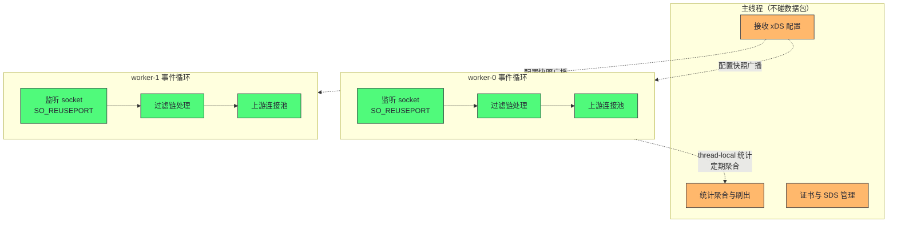
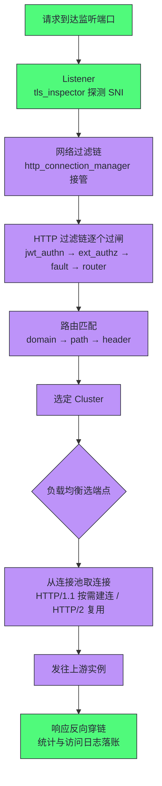
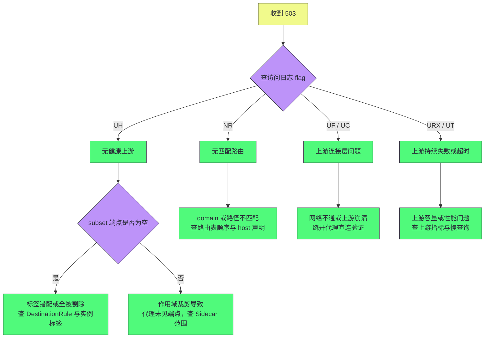

# Envoy代理——线程模型、Filter链与连接管理

**摘要：**

istiod 把配置"编译"出来之后，真正逐包执行治理动作的是 Envoy——全网格每一条服务间调用要各穿越它两次，它的每一个设计决定都被乘以全网请求量。本文自底向上拆解这台数据面引擎：从 Lyft 为什么放弃 Nginx 而自研 Envoy 说起（配置热更新与 API 化是分水岭）；拆开它的事件驱动线程模型——主线程管配置与统计、每个 worker 独立跑完整管线、连接终生绑定线程——并顺着这个模型推演出连接池与容量限制的 per-worker 本质；再跟随一个请求走完"监听器、过滤链、路由、集群、连接池"的完整旅程；随后厘清三组容易混淆的机制：负载均衡策略与一致性哈希、熔断（资源上限）与异常点检测（被动剔除）、主动健康检查与恐慌阈值；最后交代 Envoy 的配置热更新与热重启两套机制，并以 503 响应标志位收束成一张排障对照表。读完全文你应当能回答两个问题：一次代理转发里真正发生了什么，以及"偶发 503"在生产环境里究竟是谁的锅。

---

## 第 1 章 Envoy 的诞生：从 Lyft 的痛点到通用数据面

### 1.1 Nginx 时代的三块短板

2015 年前后的 Lyft 正处在微服务快速扩张期，内部通信治理跑在一组 Nginx 与 HAProxy 上。这两款代理是上一代 web 基础设施的王者，但用在服务间通信上，三块短板很快显形。其一是**配置静态**：所有路由、上游、健康检查都写在静态文件里，任何一条变更都要走一遍 reload——服务发现这种分钟级变更是常态，静态配置与之天然失配；其二是 **reload 的代价**：新配置要拉起新的 worker 进程、旧 worker 排干存量连接，发布高峰期反复 reload 时，新旧进程交替窗口的连接毛刺与偶发失败防不胜防；其三是**可观测粒度粗**：按服务、按路由、按版本拆分的请求统计拿不到，灰度发布的成功率与延迟对比无从谈起。三块短板共同指向同一个判断：**这些代理是为"人类偶尔改一次配置"设计的，而服务间通信需要"机器持续地改配置"**。

Lyft 内部由 Matt Klein 主导写了一个 C++ 代理（内部代号就叫 http_proxy），把这些问题的解法直接内置：配置以 API 推送的方式动态下发、转发统计按集群与路由两级精细拆分、连接不因配置变更而中断。2016 年 9 月，这个代理以 Envoy 之名开源。

### 1.2 一年之后的定位宣言

2017 年 9 月，Klein 发表《The Universal Data Plane API》，给 Envoy 的定位画了像：**控制面注定五花八门，数据面应当收敛**——因此要定义一套中立的数据面 API（后来的 xDS），让任何控制面驱动任何代理。上一篇已经引用过这篇文章的历史意义，此处补充它在工程上的分量：Envoy 从诞生起就把"被程序驱动"当成一等公民，而同期大多数代理把"被人配置"当主场景，API 是后来补的。设计起点的差别，决定了谁最后能当数据面。

社区轨迹随后快速兑现这个定位：2017 年 9 月 Envoy 进入 CNCF 孵化，2018 年 11 月毕业；[[02 Istio架构——控制面与数据面的职责分离|Istio]]、AWS App Mesh、Consul Connect 相继选它作数据面——第 01 篇讲过的"数据面门槛"（每包开销、事件驱动、协议完整性、热更新、埋点深度五项）Envoy 全部跨过，于是通用数据面这个生态位就被它坐实了。生态的辐射还延伸到网关层：Emissary Ingress、Gloo Edge 等网关产品把 Envoy 当内核，APISIX 之外的现代网关格局里半壁江山跑着 Envoy 的代码——"数据面收敛"的判断，最终以"各家控制面各显神通、底层引擎趋同"的方式实现。

### 1.3 本篇的视角声明

Envoy 是一个体量巨大的系统，官方文档洋洋洒洒数百页。本篇不打算做文档复述，而是抓住**理解服务网格行为最需要的四层机制**：线程模型（决定容量怎么算）、过滤链（决定治理动作怎么编排）、连接池与健康（决定故障怎么表现）、配置更新（决定变更怎么生效）。每层都配一个可以直接检验的推论——学完线程模型你就能算连接数，学完标志位你就能定域 503。网格排障的功夫大半就在这些机制的因果链上。

### 1.4 Envoy 的工程性格

从后续章节的机制里会反复看到几个一以贯之的性格特征，先立此存照：

- **性能是底线不是目标**：C++ 与事件驱动只是及格线，真正的功夫在"每一纳秒都被乘以全网请求量"的自我要求——统计无锁、转发零拷贝、连接不中断，处处是这条要求的落实；
- **API 优先**：一切配置皆可动态下发，静态文件只是兼容的例外，这个性格让它天然适配控制面驱动的时代；
- **可观测内建**：统计、日志、追踪锚点是架构的一部分而不是事后补丁，第 06 篇的可观测能力全部建立在这层埋点上；
- **扩展但克制**：过滤器与 wasm 插件开放了扩展点，但核心路径的改动极其保守——数据面的每一行热路径代码都要为十年后的生产环境负责。

这四条性格是理解 Envoy 一切设计选择的钥匙，也是"为什么后来者很难替代它"的软性答案：门槛不在功能清单，而在十年生产校准出来的工程纪律。这个生态位的统治力可以从侧面验证——后来不少网关产品（Emissary Ingress、Gloo Edge 等）干脆把 Envoy 当内核，网关层只做易用性封装；数据面的"造轮子运动"始终没能撼动它的位置。

---

## 第 2 章 线程模型：一个进程如何吃下全机流量

### 2.1 主线程与 worker 的分工

Envoy 是单进程多线程架构，线程分两类。**主线程（main thread）**不碰任何数据包，只做四件"全局事务"：接收并应用 xDS 配置、聚合各线程的统计并定期刷出、管理证书与 SDS、维护进程健康。**worker 线程**数量默认等于 CPU 核数，每个 worker 独立运行一条完整的转发管线——从监听 socket 接受连接，到执行过滤链，再到向上游发起连接、读写响应——一条连接从生到死都在同一个 worker 内完成，没有跨线程移交。

这个模型与 Netty 的 Reactor 架构神似而不雷同：同为事件驱动，Netty 的 EventLoop 在应用层自由组合（boss 与 worker 分工、业务线程池承接阻塞逻辑），Envoy 的 worker 则自带完整网络栈语义，业务逻辑以过滤器插件形式嵌入事件循环，没有"回业务线程池"一说。读过 [[03 EventLoop与线程模型——Reactor模式的落地实现]] 的读者可以这样对照：Envoy 相当于把 Reactor、Pipeline、连接管理全部内置成不可拆的整机，扩展点只剩过滤器。

为什么坚持连接不跨线程？因为跨线程移交的每一笔都有代价——锁、上下文切换、缓存失效。Envoy 的选择是让每条连接在其生命周期内只被一个线程读写，线程之间几乎无锁，唯一的同步点是主线程下发配置与统计聚合时的短暂互斥。**用"连接亲和"换"无锁转发"**，这是全部线程模型推演的起点。把这个选择摊开，可以列出三份直接的红利与一份账单：

- 红利一：转发路径零锁竞争，吞吐随核数近似线性扩展；
- 红利二：连接状态（缓冲区、会话、统计）天然 thread-local，内存与代码都省去同步；
- 红利三：单 worker 卡死只影响它名下的连接，故障域天然按线程切分；
- 账单：所有按连接计数的资源限制都变成 per-worker，容量模型必须显式乘上 worker 数。

### 2.2 监听 socket 的分发

worker 之间如何分摊监听流量？Envoy 采用 SO_REUSEPORT：每个 worker 在同一监听端口上各自绑定一个 socket，内核把新连接哈希分发到其一。连接被哪个 worker 的 socket 接受，就终生属于哪个 worker。这个机制让连接的分摊完全在内核完成，用户态零协调成本——但也埋下一个排障线索：如果内核的哈希分布不均（极少见但存在），个别 worker 会承载偏重的流量，其内存与连接数指标会系统性偏高。



### 2.3 per-worker：一切容量限制的隐藏定语

线程模型最重要的推论是：**Envoy 里所有以"连接数、请求数"为单位的限制，默认都是 per-worker 的**。连接池上限、等待队列上限、熔断的最大连接数——每一个 worker 都有自己独立的一份。这一推论直接改变容量计算方式：4 个 worker、每 worker 连接池 1024，理论连接总量是 4096 而不是 1024；扩容机器的 CPU 核数让 worker 数变多，连接数上限就随之翻倍。不少"代理连接数莫名翻倍""压测结果随核数变化"的困惑，根子都在这个隐藏定语上。

反过来，这也是一份排障地图：某 worker 上连接池打满，其他 worker 完全健康，表现为小比例的请求失败——如果把 per-worker 的账算成全局的，你会得出"连接池余量充足"的错误结论，然后漏掉真正的凶手。本篇第 6 章的排障表会反复用到这个视角。排障时还有一个直观信号：Envoy 自带的 server.concurrency 配置与节点核数是否一致、容器配额是多少——两个数字先对账，多数"容量对不上"的问题在这里就现出了原形。

### 2.4 统计的 thread-local 设计

连统计都服从同一哲学。每个 worker 在 thread-local 存储里记自己的计数，主线程定期把各线程的数字聚合刷出——转发路径上连统计都不加锁，代价是统计数字有秒级的聚合延迟。分位数直方图（histogram）同理：各线程各自记桶，聚合后由 Prometheus 抓取时计算分位数。这个设计的工程含义是：**Envoy 的指标是准实时的，用它做秒级告警要小心抖动，做趋势与定域足够可靠**。

### 2.5 worker 数量：容器配额下的经典错配

worker 数默认取 CPU 核数，这个默认值在容器环境里有一个著名的坑：**线程数看的是机器的核数，而容器实际能用的是 cgroup 配额**。一个被限制为 1 核配额的 Pod，跑在 64 核节点上，Envoy 会启动 64 个 worker——64 个线程挤在 1 核的时间片里轮转，上下文切换开销被放大数十倍，性能不升反降。Istio 后来在 sidecar 里做了修正（按 CPU limit 计算 worker 数），但理解这个错配的机制仍然重要：**事件驱动模型的前提是"每个事件循环有自己的核"，配额与线程数一旦脱钩，模型的前提就塌了**。

由此推出两条实操规则：

- sidecar 的 CPU limit 要与业务容器的实际用量一起规划——代理的 worker 数决定了它吃 CPU 的上限；
- 压测代理性能时必须锁定核数配额，不同配额下的结果没有可比性——"同样是 Envoy，为何我家慢"的谜题，一半的答案在配额里。

Istio 默认在注入模板里把并发性设置与资源 limit 绑定，就是为了把这条错配挡在模板层。

### 2.6 从线程模型回看 Sidecar 的资源画像

线程模型还解释了第 01 篇 3.4 节那笔"边车资源账"的微观机理。代理与业务容器虽分属不同 cgroup，但 worker 线程与业务线程共享同一组物理核——业务高峰打满节点时，代理的事件循环被挤压，转发延迟上升；反过来代理在 TLS 握手与七层解析上的 CPU 开销，也从业务的配额里扣。没有隔离的是核，有隔离的只是配额——理解了这一点，就明白为什么 sidecar 的 CPU requests 不是可省的油钱，而是给调度器的容量承诺；也明白了为什么大流量 Pod 的 sidecar 需要单独调高配额，而不是沿用模板默认值。

---

## 第 3 章 一个请求的完整旅程：从端口到上游

### 3.1 四类配置对象

Envoy 的配置模型由四类对象组成，先立一张速查表，请求旅程按此展开：

| 对象 | 职责 | 对应 xDS 类型 |
| :--- | :--- | :--- |
| Listener（监听器） | 定义"从哪里进"：端口与入口过滤链 | LDS |
| Filter Chain（过滤链） | 定义"进来先做什么"：协议探测与转发方式 | 随 LDS |
| Route Configuration（路由表） | 定义"从入口到出口的映射" | RDS |
| Cluster（集群） | 定义"往哪里出"：上游集合与均衡策略 | CDS/EDS |

不妨把四类对象读成一座大楼的门禁系统：Listener 是各处大门，过滤链是大门处的登记与安检流程，路由表是楼层索引，Cluster 是电梯井与楼层里的房间。访客（请求）从哪扇门进、登记哪些事项、去几层、进哪个房间，全部由这四类对象静态定义——代理本身没有策略，它只是配置的忠实执行者。

### 3.2 逐帧回放

现在跟一个 HTTP 请求走完全程。**第一帧：进入监听器。** 请求到达 15006（Istio 的入站端口），Envoy 按端口定位 Listener，先过监听器级过滤器——这一层的过滤器是"探针型"的，只采集事实、不改动流量：

| 监听器过滤器 | 采集的事实 | 用途 |
| :--- | :--- | :--- |
| tls_inspector | 是否 TLS、SNI 域名、ALPN 协议 | 后续按域名分流与 TLS 终止的依据 |
| original_dst | 连接的原始目的地址 | 通配监听还原真实去向（iptables 改写后） |
| http_inspector | 明文流量是否 HTTP | 协议自动识别 |

**第二帧：网络过滤链。** Listener 的过滤链里，http_connection_manager（HCM，HTTP 连接管理器）接管 HTTP 流量，tcp_proxy 接管 TCP 流量。HCM 是 Envoy 的七层中枢：解析 HTTP 报文头，随后在 HCM 内部再跑一条 **HTTP 过滤链**——每个过滤器按序处理请求头，任何一个都有权短路（拒绝、重定向）。常用的 HTTP 过滤器可以列成一张表：

| 过滤器 | 职能 | 治理语义 |
| :--- | :--- | :--- |
| jwt_authn | 校验 JWT 签名与声明 | 入口认证，第 05 篇的主角之一 |
| ext_authz | 外呼外部鉴权服务 | 自定义策略的注入点 |
| fault | 按比例注入延迟或错误 | 混沌工程的代理层实现 |
| cors | 跨域头处理 | 浏览器侧的安全策略 |
| router | 匹配路由并转发 | 过滤链的终点，请求在此离场 |

过滤链的顺序在配置里显式声明，治理动作的编排语义就来自这个顺序：鉴权必须先于转发，故障注入的观察点在哪个过滤器之后都有讲究。Istio 的许多高层能力（认证、授权、遥测）落到数据面，都是在这条链上插入对应过滤器——**Istio 的声明式 API 是给过滤器链写"编排说明"的人类界面**，这句话概括了两篇之间的衔接关系。

**第三帧：路由匹配。** HCM 带着请求查路由表：先匹配 domain（虚拟主机，精确与通配各按优先级），再依次匹配路径（精确、前缀、正则）、HTTP 方法、Header、查询参数——先具体后抽象，第一条命中的规则生效。命中后规则给出目标 Cluster 与转发策略（超时、重试、镜像都挂在这里）。匹配顺序里藏着两类经典事故：其一，通配 domain 抢在精确 domain 之前声明，所有请求被宽规则截胡；其二，`/api` 的前缀规则排在 `/api/v2` 之前，后者的精确规则永远轮不到生效。**路由表是顺序敏感的数据结构**，把它当无序集合来维护，迟早会撞上这两类事故。

**第四帧：集群与连接池。** Cluster 的负载均衡器从健康端点中选出一个，向上游连接池要一条连接：HTTP/1.1 池按需建连，HTTP/2 池复用多路复用连接。请求发出、响应回来，沿原路反向穿过过滤链，统计与访问日志在过滤链的锚点上落账。



### 3.3 Istio 的双监听与通配技巧

Istio 接管 Pod 流量的方式建立在这套模型上：出站方向，iptables 把应用的所有连接重定向到 15001，Envoy 在那里配置了一个**通配监听器**——它不写死任何目标，而是用 original_dst 取回连接的真实目的地址，再虚拟出一组按 IP 与端口区分的监听器逐一分流；入站方向对称，15006 收下全端口流量再分发。这个设计让"代理所有端口"成为可能——不必为每个上游服务单独监听——但也让配置规模与集群服务数成正比，第 02 篇讲的作用域裁剪，裁的正是这里的配置量。理解了双监听与通配，"iptables 劫持之后流量怎么走"这个上一章遗留的问号就闭环了：劫持只负责把流量送到代理门口，original_dst 负责告诉代理"这包原本要去哪"，通配监听器与虚拟监听器群负责把每个目的地翻译成对应的治理动作——三层接力，透明才有内容。

### 3.4 一行访问日志的解剖

请求走完全程后会在访问日志里留下一行记录。把一行典型日志摊开看，每个字段都是前几节某个机制的出口：

```text
[2026-09-19T10:23:45.123Z] "POST /api/v1/orders HTTP/2" 200 -
  0 41 12 11 "-" "productpage/1.0" "10.244.1.15" "outbound|9080||reviews.default.svc.cluster.local"
  "10.244.3.7:9080" "10.244.2.11:9080" 10.244.3.7:51344 10.244.3.7:9080 10.244.3.12:41832 -
  reviews.default.svc.cluster.local -
```

关键字段的对应关系逐项列出：

| 字段样例 | 对应机制 |
| :--- | :--- |
| "POST /api/v1/orders HTTP/2" 200 | HCM 协议解析与过滤链的最终裁决 |
| 0 41 12 11 | 响应标志位、字节数、总耗时与上游耗时（12 与 11 之差即本代理开销） |
| "productpage/1.0" | 上游服务身份（mTLS 证书声明的 SPIFFE 身份，第 05 篇展开） |
| outbound\|9080\|\|reviews... | 集群命名：方向、端口、subset、服务 FQDN 四段编码 |
| "10.244.2.11:9080" | 负载均衡选中的上游端点 |

读懂一行日志，就读懂了代理的一次完整决策——第 06 篇的可观测性体系，正是把这行日志与指标、追踪跨度组装起来的工程。

---

## 第 4 章 集群、连接池与健康：上游世界的三条规则

### 4.1 负载均衡策略：五种选择器

Cluster 是治理策略在数据面的最终载体：负载均衡策略、连接池上限、异常点检测、主动健康检查全部挂在它身上。理解了 Cluster 的地位，上一篇讲的 DestinationRule（负载均衡策略与 Subset 的声明处）与它的对应关系也就一目了然——声明层的每个字段，编译后都落在某个 Cluster 的某个字段上。

Cluster 的负载均衡器决定"这一次请求发给谁"，Envoy 提供的策略各有明确的适用前提：

| 策略 | 语义 | 适用场景与代价 |
| :--- | :--- | :--- |
| ROUND_ROBIN | 依次轮转 | 默认选项，实例能力相近时最稳 |
| LEAST_REQUEST | 发给当前活跃请求最少的实例 | 实例处理耗时差异大时更均衡，统计有开销 |
| RANDOM | 随机挑选 | 简单且无状态，超大集群下表现稳定 |
| RING_HASH | 一致性哈希环 | 会话保持场景，端点增减只影响相邻区间 |
| MAGLEV | 一致性哈希的另一实现 | 哈希表更大、分布更均匀，内存开销更高 |

两个哈希策略值得多说一句：它们是"会话亲和"（同一用户落到同一实例）的实现基础，哈希键可以是 Header、Cookie 或源 IP。但亲和是策略不是承诺——实例下线时，哈希区间重排，亲和自然断裂。把会话状态存在实例内存里再配上哈希策略，滚动更新时依旧会掉会话，这是把应用状态外置（进缓存或数据库）的众多理由之一。与下一章预告的 DestinationRule 相对照：Subset 负载均衡（把流量限制在带特定标签的实例子集内）叠加在这些策略之上，先筛子集、再在子集内均衡——两级过滤是版本路由的数据面基石。

### 4.2 连接池：按协议分治

连接池的语义随上游协议分治，这是最容易算错账的地方。**HTTP/1.1** 下，一条连接同一时刻只承载一个请求，池子按 `max_connections`（per-worker，记住第 2 章的定语）限制并发连接数，请求超过池容量就在 `max_pending_requests` 的等待队列里排队，队列也满则直接失败。**HTTP/2** 下，一条连接可以多路复用成百上千个并发流，`max_concurrent_streams` 限制单连接的并发流数——池子只需极少的连接就能扛住高并发，代价是所有请求挤在少数几条 TCP 连接上，队头拥塞与单连接的丢包放大效应要靠调大连接数对冲。**纯 TCP** 代理最简单：每 worker 每上游维护连接数上限，超限排队或失败。

这份分治清单直接给出两条调优经验：其一，HTTP/2 或 gRPC 上游的连接池上限要按"流"而不是"连接"估算，配 1000 条连接毫无意义，关注的是 streams 与连接数的乘积；其二，从 HTTP/1.1 迁到 HTTP/2 后连接数断崖式下降是正常现象，不是丢连接事故——但监控口径要跟着换，否则告警形同虚设。

连接池还有两个时间参数常被忽视。**空闲超时（idle timeout）**决定连接闲置多久被回收——设得过短，空闲期后的第一波请求要承担建连与 TLS 握手的冷启动成本，毛刺由此而来；**预连接（preconnect）**让代理在预测到流量前提前建连对冲冷启动，代价是可能建了用不上的连接。两者连同 keepalive 探测（探测半开连接，防止把请求发进已死的连接里等超时）构成连接池的时间维度调优——数量管并发，时间管延迟，缺一面都算不清连接池的账。

### 4.3 熔断与异常点检测：主动上限与被动剔除

Hystrix 教育出来的一代人容易把这两者混为一谈，实际上它们是互补的两套机制。**熔断（Circuit Breaking）是资源级的主动上限**：连接数、等待队列、并发请求、重试数各设上限，触顶即快速失败——它保护的是**代理自身与下游的容量**，不管下游健康与否，只要资源账超了就拦。**异常点检测（Outlier Detection）是被动的健康剔除**：统计每个端点的连续错误（如连续 5 次 5xx）或错误率，越限者被暂时"弹射"出负载均衡池（baseEjectionTime 起步、逐次翻倍），到期自动回归——它保护的是**请求不再撞向已经病了的实例**。

| 维度 | 熔断 | 异常点检测 |
| :--- | :--- | :--- |
| 触发条件 | 并发资源超限 | 端点错误率越限 |
| 作用对象 | 整个 Cluster 的准入 | 个别端点的池内资格 |
| 失败形态 | 快速失败，请求被拒 | 请求被导向其余健康端点 |
| 保护目标 | 防止故障传导、保护容量 | 隔离坏实例、自动恢复 |
| 恢复方式 | 流量回落后自动恢复 | 弹射到期自动回归 |

两者的时间尺度也不同：熔断是毫秒级的当下保护，异常点检测是十秒级（默认检测间隔）的群体免疫。它们共同构成无 SDK 时代的弹性层——上一篇对照表里"语言无关的熔断"，物理载体就在这里。还有一条容易被忽略的互动：**重试预算也受熔断约束**——Envoy 的 `max_retries` 限制的是"同时处于重试中的请求总数"（per-worker），下游故障引发的重试风暴会先撞上这堵墙，被拦截的重试直接失败而不是堆积——这正是第 01 篇重试风暴推演在数据面的落点：重试可以配，但必须配在资源上限之内。

### 4.4 健康检查的两种形态与恐慌阈值

判断"端点还能不能用"有两条信息通道。**主动健康检查**（active health check）由 Envoy 定期探测——HTTP 探活、TCP 探活各有精度与开销，发现坏得快、误伤也可能快；**被动健康检查**就是异常点检测，靠真实流量的错误反馈说话，零探测开销、发现偏慢。Istio 默认只开被动侧（经 DestinationRule 配置），主动探测需要显式声明——因为网格场景里实例生灭已经由 Kubernetes 的探针管理，主动探测的增量价值主要在"应用活着但语义异常"的场景。

被动剔除还有一个精妙的逃生门：**恐慌阈值（panic threshold）**。当健康端点占比跌破 50%，Envoy 不再假装自己知道谁健康，而是把流量全量发往所有端点——宁可全试、不再选择性拒绝。这个反直觉的设计背后的判断是：健康信息已经不可信时，"基于错误信息的选择性剔除"比"基于无差别转发"更危险。调试时若发现"明明配了剔除策略却像没配"，先按三个问题自查：

1. 健康端点占比是否已跌破恐慌线——跌进去就是全量转发的预期行为，不是配置失效；
2. 剔除参数是否过保守——maxEjectionPercent 默认 10%，20 个实例最多弹射 2 个，错误率自然压不下去；
3. 低流量实例是否误判——样本太少时连续错误计数波动大，需要结合 success rate 类指标综合判断。

> [!info] 核心概念：Ejection 不是熔断的分支，而是它的镜像
> 一个便于记忆的框架：熔断回答"我还要不要再放请求进去"，异常点检测回答"这个端点还有没有资格被选中"。前者站在流量的门口，后者站在候选名单里。生产里最常见的配错是把两者当一个用——配了熔断没配异常点检测，于是坏实例永远留在池子里被轮询选中，错误率下不去；或者反过来配了剔除没配上限，坏流量洪水冲垮代理自己的连接资源。

### 4.5 TCP 代理：L4 视野的能与不能

不是所有流量都是 HTTP。数据库连接、Redis、消息队列的私有协议，在 Envoy 里走 tcp_proxy 这条 L4 通道。L4 视野的能与不能值得列清楚：能做的——连接级转发、连接数与资源上限、mTLS 加密（第 05 篇）、按连接计的指标；不能做的——理解报文内容，于是**按路由分流、按请求重试、按接口授权这些七层治理全部缺席**，重试一条 TCP 流意味着重放应用语义，代理不敢也不该代劳。Istio 支持把数据库纳入网格（有 MySQL、Postgres、Redis 的协议解析过滤器），但成熟度远不及 HTTP 系。对 TCP 流量，网格的合理预期是"安全与可观测"，而不是"治理"——预期错位是 TCP 场景失望的根源。

### 4.6 主动健康检查的形态选择

| 形态 | 探测内容 | 优势 | 代价与陷阱 |
| :--- | :--- | :--- | :--- |
| HTTP 主动探活 | 指定路径返回 2xx/3xx | 可探到应用语义层 | 探活路径"活"不代表业务"健康" |
| TCP 主动探活 | 端口可建连 | 开销最低 | 只能证明进程在，不能证明能服务 |
| 被动（异常点检测） | 真实流量的错误反馈 | 零探测开销，反映真实 | 发现慢，低流量端点误判难 |

三种形态没有普适的优劣，组合使用是常态：TCP 探活做底线（进程死了快速摘除），被动检测做主力（真实流量说了算），HTTP 语义探活留给确有健康语义声明的服务。组合的要点在于**各层各司其职、探测频率错开**——底层高频、语义层低频，避免任何一层成为探测风暴的源头。

Kubernetes 场景里还有第四条通道——kubelet 的探针已经管理着实例生灭，网格侧的主动检查是在这套机制之上的增量，重复配置两套严苛探活只会互相放大误伤。

### 4.7 一次完整的弹性事件复盘

把本章机制串成一次真实形态的事故推演。起点：某实例因内存泄漏开始返回 5xx。事件按时间轴展开：

| 时刻 | 事件 | 机制 |
| :--- | :--- | :--- |
| T+0 | 请求陆续失败，坏实例仍在池中 | 检测窗口未走完 |
| T+10 秒 | 连续 5xx 越限，实例被弹射出池 | 异常点检测，baseEjectionTime 起算 |
| T+30 秒 | 弹射到期，实例回归——泄漏仍在，再被弹射 | 弹射时长翻倍，进入震荡期 |
| 持续 | 若剔除前并发已超熔断上限，队列溢出请求被快速拒绝 | 熔断的资源上限即时生效 |
| 直至根因处理 | 实例在池内外震荡或被 K8s 重启 | 弹性机制止血，根因另治 |

复盘里有三个认知点。其一，被动剔除的**恢复尝试是特性不是缺陷**——自动回归给了瞬时故障自愈的机会，代价是坏实例反复进出池子的震荡期；其二，熔断与剔除在这一事件里各司其职，缺了任何一个，故障形态都会更糟；其三，根因修复（重启实例、回滚版本）永远在弹性机制之外——网格替你止血，不替你治病。

### 4.8 连接池调优清单

把本章的调优要素收进一张清单，供实际排障时逐项核对：

| 调优项 | 管什么 | 常见错误 |
| :--- | :--- | :--- |
| max_connections | 每 worker 并发连接数 | 忘乘 worker 数，或按全局口径理解 |
| max_pending_requests | 等待队列长度 | 过大导致排队延迟掩盖故障，过小放大失败 |
| max_concurrent_streams | HTTP/2 单连接并发流 | 与连接数混算，监控口径错位 |
| idle_timeout | 连接闲置回收 | 过短引发冷启动毛刺，过长堆积僵尸连接 |
| keepalive | 半开连接探测 | 未开启时空闲期后偶发超时 |
| outlier 检测参数 | 剔除灵敏度 | 检测间隔过长，坏实例在池内停留过久 |
| 恐慌阈值 | 健康占比失守时的策略 | 误以为是"剔除失效"而反复乱调 |

清单里的每一行都对应一类生产事故，调优顺序建议从上往下——先算对数量账（前两行），再对齐协议口径（第三行），最后打磨时间参数。顺序反了，常在时间参数上空转。

---

## 第 5 章 配置更新与热重启：两套不中断的机制

### 5.1 xDS 动态更新：配置不碰连接

上一篇讲了 xDS 的协议细节，本节补数据面的消费侧。配置更新到达 worker 后，Envoy 采用**配置快照切换**语义，落地分三步：收到推送后先整体校验（引用闭合、语义合法），通过后构建一套新的 Listener/Cluster/Route 对象；快照构建完成即原子切换，存量连接继续按旧配置走完，新连接按新配置建立；被移除的监听器进入排水（drain）状态，存量连接按排水超时陆续关闭。整个过程没有 reload、没有断流窗口，代理在任意时刻执行的都是一套自洽配置——绝不出现半新半旧的中间态。这就是第 1 章里"配置热更新"短板的正面回答：**变更的粒度是连接，而不是进程**。

### 5.2 热重启：二进制升级的祖传手艺

xDS 解决"配置怎么变"，解决不了"二进制怎么换"——升级 Envoy 本体时，旧进程要被新进程替代，这就是热重启（Hot Restart）的职责。它的机制分三步：新进程启动后与旧进程经 Unix 域 socket 协商，完成监听 socket 移交（新进程接管 accept）与统计的共享内存对接（计数不断档）；随后旧进程进入排水，存量连接按排水超时自然收尾；超时未排干的连接由旧进程强行关闭，重启完成。整个过程对上游与应用表现为：连接偶有重建，端口从不关闭，监控曲线不出现断崖。

xDS 与热重启的分工值得一张表说清：

| 维度 | xDS 动态更新 | 热重启 |
| :--- | :--- | :--- |
| 变更对象 | 配置（监听器、集群、路由） | 二进制（Envoy 版本升级） |
| 频率 | 分钟级，随时 | 月级，跟随版本 |
| 机制 | 快照切换与连接排水 | 父子进程协商与 socket 移交 |
| 与 Istio 的关系 | 日常配置下发的主通道 | Sidecar 镜像升级的底层保障 |

Istio 场景里热重启被藏得更深：Sidecar 升级通常整体重建 Pod，热重启主要在"只升代理镜像不重建 Pod"的高级用法里出现。但理解它仍有价值——它是"数据面进程永不直接断流"这个承诺的完整拼图。

### 5.3 排水：优雅退场的全部秘密

排水（drain）在两套机制里都出现，值得单独交代语义。监听器被移除时，Envoy 停止接受新连接，但存量连接继续服务直到自然结束或排水超时——超时值是利弊的天平：

- 设太长：配置变更的收敛时间被拖长，旧规则残留越久，新旧规则并存的窗口越大；
- 设太短：长连接被强拆，客户端偶发重置，滚动更新期"偶发失败"多由此来；
- HTTP/2 与 gRPC 场景：连接上挂着的长寿命流需要更久的排水窗口，GOAWAY 帧是 HTTP/2 的"我不再接新活"信号，gRPC 客户端收到后应主动迁移连接——**服务端只管宣告，迁移的礼数要客户端配合**。

这也是长连接服务滚动更新时"服务端已排水、客户端却撞墙"事故的根源：排水语义落在协议帧上，客户端不响应帧，排水就只是单方面的礼貌。

### 5.4 管理端点：代理的自我陈述

每个 Envoy 进程内嵌一个管理端点（Istio 映射在 localhost 的 15000 端口），提供几组排障利器：`/config_dump` 输出代理当前生效的完整配置（上一篇排障三分法的"代理端"取数点）、`/clusters` 列出各集群的端点与健康状态、`/stats` 暴露全部计数器、`/server_info` 给出版本与启动参数。它们与 istioctl 的 proxy-config 系列命令同源——后者本质是对这些端点的格式化封装。代理自己永远是最诚实的证人，排障时先取证、再推断。

### 5.5 Istio 场景的配置全景：一个 Sidecar 的配置从哪来

把第 02 篇的编译与本篇的消费侧对齐，一个 Sidecar 的配置全景可以这样描述。istiod 为每个代理单独编译一份配置：出站侧，一个名为 virtualOutbound 的通配监听器坐镇 15001，用 original_dst 虚拟出该代理"可见的"全部上游监听——可见二字对应第 02 篇的作用域裁剪，Sidecar 声明之外的命名空间根本不会出现在这份配置里；入站侧，virtualInbound 坐镇 15006，按端口逐一分发到本 Pod 的应用容器。每个 Cluster 对应"服务加 subset"的一对组合，每条路由对应 VirtualService 的一条 http 规则——上一章 3.5 节那条灰度规则，在数据面的最终形态就是"两个 Cluster 加一条权重路由"。

这份全景还解释了一个规模现象：Sidecar 的内存占用与"它可见的服务数"成正比，与"集群总服务数"无关——作用域裁剪是 Sidecar 内存问题的第一处方，调优 Sidecar 资源参数只是第二处方。排障时 config_dump 里的配置与预期不符，第一步永远是确认"这份配置本来就该是什么样"——编译的意图与消费的实况对上号，分歧点自然显形。至于劫持机制本身如何把流量送到这些监听器门口，[[01 服务网格概述——从微服务治理痛点到Sidecar模式|第 01 篇]] 的 iptables 三段论是它的前置阅读。

---

## 第 6 章 边界与反例：503 的家族史与容量的算术

前四章讲的全是"正常时怎么运转"，但数据面工程师的真实日常，一大半花在"异常时怎么解释"上。Envoy 对此有一个常被低估的善意设计：它几乎从不在失败时沉默——每个失败请求都带着字段、计数与标志位离开。本章把这些痕迹组织成一张验伤报告、一道算术题与一棵决策树。

### 6.1 响应标志位：每个失败都带着验伤报告

Envoy 拒绝或失败一个请求时，会在访问日志与响应头（x-envoy-upstream-service-time 旁的 flag 字段）里留下标志位——这是网格排障里信息密度最高的一个字段，值得整表收录：

| 标志 | 含义 | 典型根因与去处 |
| :--- | :--- | :--- |
| UH | 无健康上游（NoHealthyUpstream） | 端点全被剔除或标签错配，回查第 4 章健康机制与 subset 标签 |
| UF | 上游连接失败 | 网络不通、端口错、安全组拦截 |
| UC | 上游连接中断 | 上游进程崩溃或中间设备掐断连接 |
| URX | 重试次数超限 | 重试策略耗尽，回查上游为何持续失败 |
| UT | 上游请求超时 | 上游慢，查超时配置与上游容量 |
| UO | 上游溢出（UpstreamOverflow） | 熔断上限触顶，按 4.3 节的账重算容量 |
| RL | 被限流（RateLimited） | 限流策略生效，属预期行为而非故障 |
| NR | 无路由（NoRouteFound） | 路由表没匹配上，查 domain 与路径规则 |
| UAHR | 主动健康检查标记的失败 | 探活配置与真实可用性不符 |

这张表的用法是**定域**：UH、NR 指向网格自身的配置与状态（控制面或代理配置问题），UF、UC、UT 指向上游与网络（应用或基础设施问题）。看到 503 先看标志位，等于先把故障切成了两半，每半的排查路径完全不同——排障效率的差距主要就在这第一步。举一个真实形态的例子：某服务偶发 503 且占比不足 1%，日志里 flag 均为 UO——上游溢出。按表对号入座，这是连接池或队列上限触顶，而"偶发、低占比"正是 per-worker 限制被集中打满的典型形态：全局余量充足，个别 worker 在流量尖峰瞬间爆表。调大 per-worker 上限并配合连接池预热后，问题消失。没有标志位，这类问题的排查往往要绕一大圈。

### 6.2 延迟毛刺的解剖：P99 从哪里冒出来

平均值健康而 P99 抖动，是网格场景最常见的性能投诉。把毛刺的来源按代理内外分开盘点，**代理内**的来源有四类：

- **连接池冷启动**：存量连接被回收后，新请求承担建连与 TLS 握手成本，典型表现是空闲期后的第一波请求变慢；
- **per-worker 队列等待**：个别 worker 承载偏重时，毛刺集中在它名下的请求；
- **排水期余量**：配置切换或排水超时设置不当，旧连接上的请求带着旧规则完成生命周期；
- **切换瞬间重建**：配置快照切换时少量连接重建的抖动。

**代理外**的来源——上游 GC 停顿、内核网络抖动、对端节点竞争——代理只是如实转发了这些延迟，但在访问日志里它们与代理自身的延迟混在一起。

区分的钥匙是 Envoy 记录的两个时间量：请求在代理内的处理耗时与上游耗时是分开统计的（访问日志的 duration 与 upstream_service_time 之差就是代理自身开销）。**两个数字一减，代理的嫌疑当庭洗清或坐实**——这个动作应该成为网格性能排障的条件反射。

毛刺治理没有银弹，只有对症：

- 连接池保活与预热管冷启动，空闲超时别设得过短；
- 连接数上调管队列等待，per-worker 的账先算对；
- 上游的账要上游还——GC、慢查询、磁盘抖动都不在代理的管辖范围。

每一类来源都有对应的科目，混在一起猜永远猜不出结果。

### 6.3 容量的算术：一道综合应用题

把前几章的机制合成一道题：一个 32 核节点上的 sidecar（32 个 worker），上游服务 20 个实例（HTTP/2，每连接 100 流），连接池每 worker 上限 8 连接，等待队列 1024。算笔账：理论并发流上限 = 32 × 8 × 100 = 25600 流；上游总连接 = 32 × 8 × 20 = 5120 条 TCP——后者才是这个配置里先爆的资源。由此可见 HTTP/2 场景的容量瓶颈常常不在"流"，而在"连接"的建连风暴与内存；而把 worker 数（核数）翻倍，三个数字同时翻倍——per-worker 定语再次显灵。这道题的通用解法固定为三步：

1. **先定协议**：HTTP/1.1 与 HTTP/2 的池语义完全不同，算错协议全盘皆错；
2. **再按 per-worker 展开**：每个限制先算单 worker 的，再乘 worker 数；
3. **最后乘实例数**：上游连接总量、内存占用、端口消耗都与实例数线性相关。

三步算完，容量账就不会错得离谱。

### 6.4 Envoy 不适合做什么

边界意识同样重要，四类场景应当先想清楚再上：

- **业务语义的边界**：过滤链能处理请求头与路径，但"这个请求属于哪个租户、扣费怎么算"永远在应用里——代理是协议层的执行者，不是业务逻辑的解释者；
- **极端低延迟**：微秒级交易路径上，两次代理穿越的成本不可接受，进程内治理或 eBPF 路线更合适（第 07 篇展开）；
- **私有协议扩展**：私有的二进制协议需要自写过滤器，工程成本远高于通用 HTTP 场景，除非协议值得，否则绕开；
- **小规模场景**：几个服务的单体或小集群上它纯属过度设计，一个 Ingress 加进程内治理足够。

数据面是重资产，投入前先确认流量值得。

### 6.5 Sidecar 的资源调优科目

Sidecar 模式下每个业务 Pod 都带着一个 Envoy，它的资源调优有四个固定科目。**科目一：并发性与 CPU**——worker 数应与 CPU 配额对齐（第 2.5 节的错配），Istio 默认把两者绑定，自管 Envoy 时要自己盯紧。**科目二：内存的构成**——xDS 配置快照、连接缓冲、TLS 会话、统计存储四块大头里，配置快照随可见服务数增长（作用域裁剪是第一处方），连接缓冲随并发增长（容量规划是第二处方）。**科目三：统计基数**——指标标签基数（source、destination、code 等的组合）直接影响统计内存，基数失控的网格里，统计本身能吃掉几百 MB，第 06 篇会专讲这个话题。**科目四：排水时长**——terminationDrainDuration 决定 Pod 终止时代理收尾存量连接的耐心，长连接服务要显著调大，否则滚动更新时客户端撞上被强拆的连接。

四个科目对应 Sidecar 资源账单的四个旋钮，按流量形态与网格规模各调各的——它们共同决定了第 07 篇要算的那笔"每 Pod 底盘开销"的最终数字。

> [!warning] 生产避坑：直连 sidecar 的"漏网流量"
> 配置了劫持规则就默认"所有流量都经过治理"，是常见的思维漏洞。网格通常只接管声明的服务端口，旁路端口（调试端口、监控端口、直连外部 IP 的流量）并不入网——它们没有 mTLS、没有指标、没有审计。安全评估与容量评估都要把这部分"网格视野之外"的流量单独盘点，否则画出服务拓扑时会有一批看不见的边。审计的办法也简单：应用容器内抓包比对访问日志，多出来的连接就是漏网之鱼。

### 6.6 503 排障决策树

把标志位与机制收拢成一棵决策树，面对 503 按图索骥：



树的每个叶子都落在前几章的某个机制上——这正是本篇反复强调的因果链：机制学扎实了，决策树不需要背，因为它就是机制的骨架图。

### 6.7 本篇机制速查

收官前把全篇机制收进一张速查表，供排障时按图索骥：

| 机制 | 一句话语义 | 排障入口 |
| :--- | :--- | :--- |
| worker 线程模型 | 连接终生绑定线程，容量限制 per-worker | 指标按 worker 分位观察 |
| 过滤链 | 治理动作按序编排，可短路 | config_dump 看过滤器顺序 |
| 路由匹配 | 顺序敏感，先具体后抽象 | proxy-config routes |
| 连接池 | 数量管并发、时间管延迟 | /clusters 与溢出计数 |
| 熔断 | 资源上限，超限快速失败 | UO 标志与 pool overflow 计数 |
| 异常点检测 | 被动剔除坏端点 | ejections 计数与错误率对照 |
| 恐慌阈值 | 健康占比失守后退回全量转发 | 健康占比与剔除行为矛盾时先查它 |
| xDS 快照切换 | 新配置新连接、存量连接照旧 | 配置版本与连接代际对照 |
| 排水 | 优雅退场，长连接要给足窗口 | 滚动更新期的客户端重置 |
| 响应标志位 | 每个失败自带验伤报告 | 访问日志 flag 字段 |

这张表也是本专栏前三篇的索引：线程模型属于本篇、作用域裁剪属于第 02 篇、劫持机制属于第 01 篇——三张拼图合在一起，网格数据面的完整图景才告闭合。

---

## 第 7 章 小结：把治理动作组织成管线

收拢全篇：Envoy 用主线程加 worker 的事件驱动模型换来无锁转发，代价是所有容量限制带 per-worker 定语；用四层配置对象把"进、滤、由、出"组织成管线，治理动作以过滤器形式按序编排；连接池按协议分治，熔断守资源上限、异常点检测做被动剔除、恐慌阈值在健康信息失真时兜底；配置更新以连接为粒度无缝切换，二进制升级由热重启兜底；而每个失败请求携带的标志位，把 503 的家族史摊开在访问日志里。

三篇连载到这里的因果链已经完整：**SDK 时代的困境呼唤治理外移（第 01 篇），外移需要控制面与数据面的分工（第 02 篇），分工的执行端是 Envoy 这台管线引擎（本篇）**。至此，一条 VirtualService 从用户声明到逐包执行的全部旅程——声明、编译、下发、快照切换、过滤链执行、连接池转发——每一环都有了名字与机制。但这条链路上的治理动作目前只讲了"怎么执行"，还没讲"怎么声明"：灰度、熔断、重试、镜像这些最常被使用的治理意图，如何在 Istio 的声明式 API 里表达、组合与避坑，是下一篇 [[04 流量管理——VirtualService、DestinationRule与灰度发布]] 的主题。

---

## 参考资料

1. Envoy 官方文档：架构概述（线程模型、监听器与过滤链）. https://www.envoyproxy.io/docs/envoy/latest/intro/arch_overview
2. Envoy 官方文档：配置最佳实践与 circuit breaking / outlier detection. https://www.envoyproxy.io/docs/envoy/latest/intro/arch_overview/upstream/circuit_breaking
3. Envoy 官方文档：Hot Restart. https://www.envoyproxy.io/docs/envoy/latest/operations/hot_restarter
4. Matt Klein. Envoy: The story so far. 2016-09. https://medium.com/@mattklein123/envoy-the-story-so-far-403a0f3f5f69
5. Matt Klein. The Universal Data Plane API. 2017-09.
6. Istio 官方文档：Envoy sidecar 排障（proxy-config 与响应标志位）. https://istio.io/latest/docs/ops/diagnostic-tools/proxy-cmd/
7. CNCF. Envoy 毕业公告. 2018-11.
8. 周志明. 凤凰架构：构建可靠的大型分布式系统. 机械工业出版社， 2021.（服务网格章节）

---

> [!note] 思考题
> 1. 第 2.3 节的 per-worker 定语推演出"连接数限制随核数翻倍"。请推演反向场景：把节点从大核数机器迁到小核数机器，代理容量会发生什么变化？哪些依赖该节点的容量规划需要重算？
> 2. 恐慌阈值的设计是"健康信息不可信时，放弃选择性、退回全量转发"。请对照你熟悉的系统找出同构的设计（譬如注册中心的自我保护模式），并思考这类设计的共同前提：它们都在什么信号失真时起作用？
> 3. 6.2 节的容量题里，上游连接总量（5120 条）先于并发流上限触顶。请为 gRPC 长连接场景重新设计连接池参数：每 worker 2 连接、每连接 100 流，并推演滚动更新时连接重建风暴的规模。

