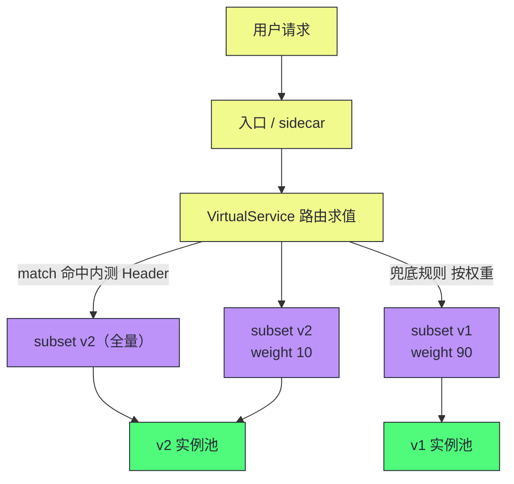
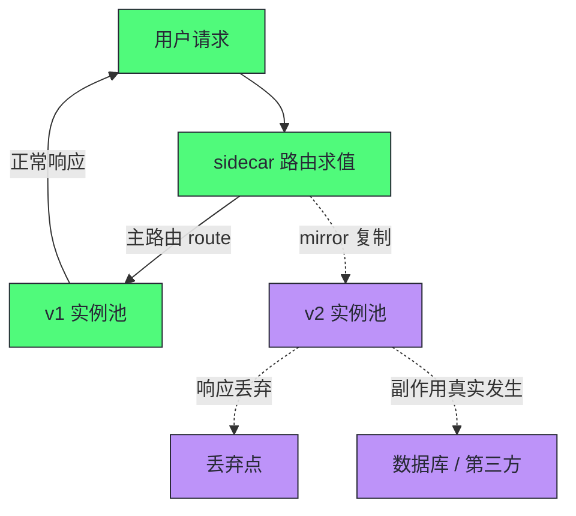
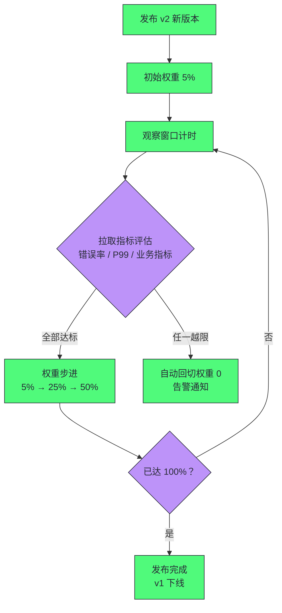

# 流量管理——VirtualService、DestinationRule与灰度发布

**摘要：**

前三篇搭好了网格的骨架：控制面编译策略、数据面逐包执行。本篇进入这套机器最高频的使用场景——流量管理，回答"如何声明流量行为并让它安全落地"。文章先论证 Kubernetes Service 在路由语义上的天花板：L4 随机转发、副本数即流量比、无版本概念，这些不是缺陷而是它的抽象层次使然；然后拆解 Istio 流量管理的两块核心拼图——VirtualService 承载"路由与行为"、DestinationRule 承载"目标与策略"，两者经 host 名字松耦合绑定的设计深意；接着把灰度发布做成完整的工程闭环：按权重金丝雀、按 Header 精准路由、流量镜像与暗发布，配上步进式放量的操作序列与数据库兼容性的前置约束；随后讲清超时、重试、熔断、故障注入四类弹性行为的语义与相互作用；最后盘点常见误区与排障清单。读完全文你应当能回答两个问题：一次"放 5% 流量给新版本"的发布要怎么声明才不踩坑，以及发布出问题时流量行为应该到哪里核对。

---

## 第 1 章 Service 的天花板：为什么需要新的路由语言

### 1.1 K8s Service 只回答了一个问题

先公平地评估 Kubernetes Service 能做什么。它回答的问题是"这个服务名背后的实例集合是谁"——稳定域名、负载均衡、端点摘除，三件事在 L4 层干净利落，[[06 Service底层实现——kube-proxy、iptables与IPVS|kube-proxy 的机制篇]] 也证明它把 L4 做得足够好。但灰度发布的时代问题恰好在它的语义之外：**新版本要上线，流量按什么规则、以什么比例、在什么条件下流过去**——Service 的配置模型里没有"版本"、没有"比例"、没有"条件"，它只有一个均匀转发到一个端点集合的抽象。连它唯一沾边的会话保持（sessionAffinity）也只支持 ClientIP 的 L4 级黏连，按内容、按用户的路由完全缺席。

| 发布需求 | K8s Service 的现实 |
| :--- | :--- |
| 新版本承接 5% 流量 | 无法按比例分流，只能调副本数比 |
| 特定用户访问新版本 | 无请求级匹配能力，L4 不认识 Header |
| 生产流量复制到测试版本 | 不存在此概念 |
| 新版本异常时快速回切 | 只能改镜像或副本，回滚以分钟计 |
| 跨集群统一灰度策略 | Service 不跨集群，策略无法全局声明 |

这张表里最经典的困境是**副本数即流量比**：10 个副本的 Deployment 想放 5% 流量给新版本，得部署一个 1 副本的新 Deployment，同时把旧版本缩到 19 副本——流量比与副本数死死绑定，想放 0.5% 就得把总副本数凑到 200 个。而且副本是随滚动更新漂移的，流量比随之漂移——用部署拓扑表达流量意图，就像用水泥浇筑来表达菜单：能做，但每改一次都要砸墙。

### 1.2 反事实：没有路由语言的世界

把这层缺失放大到组织尺度，能看到灰度发布的各个工序都在原始状态下运转。按用户分流靠业务代码：每个服务里长出"if 用户在灰度名单就走新逻辑"的分支，名单逻辑本身也要维护、也要发版，半年后没人说得清有多少处这样的开关散落在仓库里。镜像验证靠手工：在网关上配一份"复制转发"的特殊规则，改一次验证目标要登录一次网关，验证完还要记得删。快速回切靠重新部署：旧镜像重新拉起、健康检查通过、端点恢复，全程以分钟计，而故障在以秒计地扩散。这些原始形态并不是不可用，而是**每一次执行都要人肉投入、每一次投入都是一次风险敞口**。路由语言的本质是把这套流程从"运维操作序列"变成"声明式对象"——声明可以评审、可以版本化、可以自动化，这正是第 2 章两块拼图的意义所在。这些原始形态还有一个共同的隐性成本：**它们都不可审计**。名单逻辑散在代码里、网关规则活在配置文件里、回切动作依赖值班者手速——发布流程的每一次实际执行长什么样，没有任何一份记录能完整还原。声明式对象落到 Git 仓库后，"谁在什么时间把权重改成多少、经过谁评审"成为仓库历史的一部分，流程的可审计性随之而来——这一点在合规场景里往往比效率更重要。

把这一章的判断浓缩成一句话：**K8s Service 解决了"地址稳定"的问题，却没有解决"流量语义"的问题**——前者让服务可被调用，后者让变更可被驾驭。服务数量少、变更频率低时，后一个问题可以靠人力扛；规模与频率上来之后，它就需要一门机器可执行的流量语言，以及一门能驾驭这门语言的发布工程。本章剩下的篇幅，就是把这门语言与这门工程讲清楚。

### 1.3 路由需要的语言能力

把灰度发布的真实需求翻译成路由语言，至少需要四类表达能力：**匹配**（这次请求满足了什么条件——路径、Header、用户身份）、**分流**（满足条件的流量按什么比例去往哪里）、**目标描述**（"新版本"这个概念如何在实例层面定义）、**行为修饰**（超时多久、失败重试几次、是否镜像一份）。K8s Service 一类都没有，而 Istio 的答案分两个对象：**VirtualService 承载匹配、分流与行为修饰，DestinationRule 承载目标描述**。接下来两节分别解剖，然后再看两者如何咬合。

---

## 第 2 章 两块拼图：VirtualService 与 DestinationRule

### 2.1 VirtualService：一份"条件-动作"表

VirtualService 的心智模型是一张条件-动作表：请求进来，自上而下逐条匹配 `match` 条件，命中即执行 `route` 动作，都不命中则走兜底路由。一份典型的声明长这样：

```yaml
apiVersion: networking.istio.io/v1beta1
kind: VirtualService
metadata:
  name: reviews
spec:
  hosts: [reviews]
  http:
  - match:                      # 精准路由：内测用户全量进 v2
    - headers:
        end-user: {exact: jason}
    route:
    - destination: {host: reviews, subset: v2}
  - route:                      # 兜底：其余流量 90/10 分流
    - destination: {host: reviews, subset: v1, weight: 90}
    - destination: {host: reviews, subset: v2, weight: 10}
```

五处细节值得逐个点名。其一，`hosts` 声明这份规则服务谁——可以是 Kubernetes Service 名，也可以是 Gateway 上的对外域名，一份规则两个用武之地；hosts 还支持通配前缀（如 `*.example.com`），在网关场景下为一批子域名声明统一路由。其二，`match` 的匹配维度覆盖面比多数人预期的宽，常用维度如下：

| 匹配维度 | 写法 | 典型用途 |
| :--- | :--- | :--- |
| uri | exact / prefix / regex | 路径级灰度、API 版本分流 |
| method | GET / POST / ... | 读写分离路由 |
| headers | exact / prefix / regex / 存在性 | 内测名单、租户标识、流量打标 |
| queryParams | exact / regex | 回调、跳转类请求的条件路由 |
| ignoreUriCase | 布尔 | 路径大小写容错 |

其三，`weight` 是 0 到 100 的整数，两个权重之和不要求刻意凑 100 但语义上是比例分配。其四，**规则的顺序就是匹配的优先级**——上面这份声明里，内测用户的规则必须排在兜底之前，否则永远轮不到，这是 YAML 列表顺序语义在流量治理里的直接体现。其五，除 http 外还有 `tcp` 与 `tls` 两类路由块，覆盖非 HTTP 流量，语义同构但匹配维度收窄（2.6 节展开）。

行为修饰也挂在同一层级：`timeout` 声明单次请求的超时（缺省 15 秒），`retries` 声明重试策略，`mirror` 声明镜像目标——它们与路由写在同一个 `http` 块里，属于"这条路由的行为"而非"全局配置"，这个作用域设计让不同路由可以有不同的弹性语义，第 4 章展开。

一份 VirtualService 从提交到生效的生命周期，是第 02 篇编译链路的具体化：提交时经校验 Webhook 拦截语法与引用错误；随后 istiod 监听到变更，重编译受影响代理的路由表；经 xDS 推送到边车，秒级生效——全程没有实例重启、没有连接中断。**变更的成本被压缩到"一次配置提交"**，这是灰度发布得以高频迭代的物质基础，也是路由规则必须像代码一样对待（评审、测试、灰度）的原因——变更太便宜的东西，出错也变得容易。

### 2.2 DestinationRule：目标的定义书

VirtualService 说"10% 去 v2"，但"v2"这个概念由谁定义？答案是 DestinationRule：**subset 给实例集合贴上逻辑名字，trafficPolicy 给这些目标声明治理策略**。

```yaml
apiVersion: networking.istio.io/v1beta1
kind: DestinationRule
metadata:
  name: reviews
spec:
  host: reviews
  subsets:
  - name: v1
    labels: {version: v1}
  - name: v2
    labels: {version: v2}
  trafficPolicy:
    loadBalancer:
      simple: LEAST_REQUEST
    connectionPool:
      tcp: {maxConnections: 100}
    outlierDetection:
      consecutive5xxErrors: 5
      interval: 10s
      baseEjectionTime: 30s
```

`subsets` 是标签选择器——`labels: {version: v2}` 从 EndpointSlice 里筛出带该标签的实例。这个设计有一个必须刻在脑子里的推论：**subset 的实体是 Pod 标签，标签打错，subset 就是空集**——上一篇讲过的"无健康上游"（UH）故障，最常见根源就在这里。trafficPolicy 部分则在目标层面落实策略，字段清单与它们的物理落点一一对应：

| trafficPolicy 字段 | 管什么 | Envoy 侧落点 |
| :--- | :--- | :--- |
| loadBalancer | 均衡策略与一致性哈希 | Cluster 的 LB 配置 |
| connectionPool | 连接数、等待队列、空闲超时 | Cluster 的熔断与连接池 |
| outlierDetection | 被动剔除的灵敏度 | Cluster 的异常点检测 |
| tls | 目标侧的 TLS 模式 | Cluster 的传输层安全 |
| portLevelSettings | 按端口覆盖以上策略 | 多端口目标的精细化 |

第 03 篇讲过这些机制在 Envoy Cluster 上的语义——DestinationRule 就是这些 Cluster 字段的人类声明层（机制详见 [[03 Envoy代理——线程模型、Filter链与连接管理|Envoy 数据面篇]]），声明一个 DR 等于给一类目标统一配置"如何被对待"。DR 与 VirtualService 一样遵循声明式的生命周期——提交、校验、编译、经 xDS 下发，全程不触碰实例。两者还有一个容易忽视的差异值得点破：VirtualService 的变更直接影响"下一个请求去哪"，生效即有流量后果；DestinationRule 的多数字段（均衡策略、连接池参数）则要等新连接建立才完全体现，存量连接按旧参数走完。理解这层差异，才能解释为什么改了 DR 的参数、指标却没有立刻变化——不是没生效，是新参数在等新连接。DR 的作用域同样是命名空间级、可用 exportTo 调整——但与 VirtualService 不同，DR 的引用是"按名字全局解析"的：别的命名空间引用 subset 时，解析到的 DR 是目标服务命名空间里的那份。多团队共用一个服务时，DR 的归属权要提前约定——通常归服务提供方维护，调用方只消费 subset 名字，就像消费它的 API 一样。

### 2.3 松耦合绑定的深意

两个对象各管一段，靠 `host` 名字引用绑定——这个松耦合不是随手为之，值得把设计账算清楚。**耦合点最小化**：VirtualService 只需要知道"有个叫 v2 的子集"，不需要知道 v2 由什么标签构成、几个实例、什么负载均衡策略；反过来 DestinationRule 也不知道谁在引用自己。于是两边的变更节奏完全解耦——发布流程改 VirtualService（动路由），容量规划改 DestinationRule（动策略），互不踩脚。

| 维度 | VirtualService | DestinationRule |
| :--- | :--- | :--- |
| 回答的问题 | 流量按什么规则走 | 目标是什么、如何对待它 |
| 核心字段 | match、route、weight、timeout、retries、mirror | subsets、loadBalancer、connectionPool、outlierDetection |
| 变更的典型节奏 | 跟随发布流程，频繁 | 跟随容量与治理基线，低频 |
| 谁来改 | 业务团队 | 平台定基线，业务按需覆盖 |
| 编译产物 | 路由表（RDS） | Cluster 定义（CDS）与端点（EDS） |

松耦合的代价也要说破：**引用是弱校验的**——VirtualService 引用一个不存在的 subset，对象本身合法、Webhook 照样放行，故障要等流量到达时才显形（subset 解析为空集）。生产实践里通常用 CI 流程补强校验（发布前核对 subset 定义），这是声明式系统里"编译期检查不足、流程期补位"的典型案例。

> [!note] 设计哲学：路由逻辑与目标属性为什么分开
> 把"怎么分流"与"目标是什么"拆成两个对象，本质是把两类不同节奏的变更拆开。路由逻辑跟着发布走——每周每服务可能变更数次；目标属性跟着容量与治理基线走——每月都可能不动一次。合在一个对象里，要么变更互相牵连（改权重必须重提整份策略），要么权限互相越界（发布者拥有了改熔断参数的权力）。**对象边界即权限边界，也即变更频率的边界**——这条思路在 Kubernetes 的对象设计哲学里有更完整的论述。

### 2.4 两个入口：Gateway 与 sidecar

同一份 VirtualService 经常要服务两个入口：集群外的请求经 Gateway 进来，集群内的请求经 sidecar 转发。语义上两者共用路由规则（`hosts` 同时出现在 Gateway 的 server 声明与 VirtualService 里），差别在入口过滤器的位置——Gateway 是集群边缘独立的 Envoy 部署，sidecar 是每个 Pod 内嵌的代理。这个设计的实用推论是：**网关侧与网格侧的路由策略可以保持一致**，对外发布比例与对内灰度比例天然同步，不必在两套系统里维护两份各说各话的规则。南北向与东西向的分工（第 01 篇的结论）在这里有了工程细节的支撑。

两个入口的职能侧重仍有差异，混用前值得分清：Gateway 面向外部世界，承担协议终结（TLS 卸载）、域名校验、外部限流这类"边界职能"；sidecar 面向内部服务，承担 mTLS、subset 分流、逐跳观测这类"内部职能"。把内部灰度规则抄到 Gateway 上对外放量，是常见但危险的操作——外部流量的不可控性远高于内部，对外放量策略应独立设计，而非对内策略的镜像。

### 2.5 hosts 与服务发现：网格眼里的"目的地"

`hosts` 字段的取值值得单独交代，因为它是 VirtualService 与现实世界对接的接口。集群内服务直接写短名（`reviews`），解析时按规则所在命名空间展开为 FQDN（`reviews.default.svc.cluster.local`）；跨命名空间引用要写全名，这是多命名空间团队最常见的引用错误来源。目的地也不限于 Kubernetes Service：ServiceEntry 对象可以把外部 API、第三方服务、虚拟机上的遗留系统"注册"进网格的服务目录：

```yaml
apiVersion: networking.istio.io/v1beta1
kind: ServiceEntry
metadata:
  name: external-payment
spec:
  hosts: [payment.partner.example.com]
  ports:
  - number: 443
    name: https
    protocol: HTTPS
  location: MESH_EXTERNAL
```

注册之后，`payment.partner.example.com` 与集群内服务一样可被路由、可被 mTLS 管理（第 05 篇）、可被观测（第 06 篇）——外部依赖从"网络的盲区"变成"网格的公民"，调用外部服务的超时、重试与熔断也能用同一套语言声明。这是网格"服务目录"视野的声明入口——**网格能治理的前提，是目的地先被它看见**。

这个"看见"的机制还有一个严格模式值得知道：网格的出站策略可以设为 REGISTRY_ONLY——凡不在服务目录里的目的地一律拒绝出站。它把"应用私自外联"（未申报的第三方调用、数据外发）从网络层堵死，是零信任出站治理的强抓手；代价是任何遗漏注册的合法依赖都会突然不通，开启前必须先以审计模式跑一段时间，盘点全量出站目的地。

### 2.6 非 HTTP 流量的路由块

http 块之外，VirtualService 还有 tls 与 tcp 两个路由块。tls 块按 SNI 与端口匹配——非终结的 TLS 流量（代理不拆证书）按域名转发，网关场景常见；tcp 块按端口、目的网段、来源网段匹配——数据库、消息队列这类 L4 流量的转发在此声明。一份最简的 tcp 声明长这样：

```yaml
tcp:
- match:
  - port: 3306
  route:
  - destination: {host: mysql.prod.svc.cluster.local}
```

语义与 http 块同构（条件-动作），但匹配维度与行为修饰明显收窄：没有 HTTP 语义，也就没有按路径分流、按 Header 灰度、按请求镜像——第 03 篇 4.5 节"L4 视野的能与不能"在这里再次应验。声明层的选择已经替你划好了边界：**HTTP 享受全谱系治理，非 HTTP 享受安全与转发**。

---

## 第 3 章 灰度发布的完整工程：从声明到收尾

### 3.1 四种发布形态的谱系

把"新版本如何接流量"的业界方案排开，网格语境下的四种形态各有明确的适用时刻。它们共同的对立面是第 01 篇描述过的原始状态——治理能力散落在部署拓扑与业务代码里；四者的差异在"流量切换的条件与风险承担方式"：

| 形态 | 机制 | 适用场景 | 主要风险 |
| :--- | :--- | :--- | :--- |
| 按权重金丝雀 | weight 比例分流 | 常规发布的默认路径 | 新版本缺陷按比例波及真实用户 |
| 按 Header 精准路由 | match 条件路由 | 内测、特定租户、员工先行 | 规则残留导致流量长期偏斜 |
| A/B 测试 | 按 Header/Cookie 分组对照 | 产品决策驱动的并行实验 | 分组不均导致结论失真 |
| 暗发布与镜像 | mirror 复制流量，响应丢弃 | 真实流量验证而不影响用户 | 副作用重复执行（发邮件、扣款） |

滚动发布与蓝绿发布是 Service 层面的传统形态，与上表不是同一抽象层——滚动发布管"实例怎么换"，网格管"流量怎么分"，实践中常常组合：滚动更新保证新旧实例共存，VirtualService 控制新旧实例各承接多少。**部署与分流解耦**，正是网格对发布工程最大的结构改善。

### 3.2 一次金丝雀的完整序列

以"reviews 服务 v2 上线"为例走完整个序列。**第一步：部署不接流**。v2 以新 Deployment 部署（带 version: v2 标签），DestinationRule 里已声明 v2 subset——此时 weight 为 0（或不引用），实例就绪但零流量。**第二步：放试探流量**。weight 调到 1，观察指标：错误率、P99 延迟、资源水位，[[06 可观测性——分布式追踪、指标与访问日志|第 06 篇的网格指标]] 在这里就是验收仪表盘。**第三步：步进放量**。1% → 5% → 25% → 50%，每个台阶停留一个观察窗口（常规业务一个窗口十几分钟到数小时），窗口内指标越限即回切——把 weight 调回 0 只是一次配置变更，秒级生效，不需要动任何实例。****第四步：收尾**。v2 到 100% 并稳定一个观察期后，下线 v1 的 Deployment，VirtualService 里的 v1 路由项择机清理。把四步的责任与时限排进一张表：

| 步骤 | 动作 | 责任角色 | 时限参考 |
| :--- | :--- | :--- | :--- |
| 部署不接流 | 发布 v2 Deployment 与 subset | 交付流水线 | 自动，分钟级 |
| 试探流量 | weight 调至 1 | 发布决策者 | 即时 |
| 步进放量 | 逐级调权重、盯窗口 | 发布决策者与值班 | 每台阶一个观察窗口 |
| 收尾 | v1 下线、规则清理 | 平台团队例行 | 稳定期后，天级 |

第三步里一次典型的权重调整只改一个数字：

```yaml
http:
- route:
  - destination: {host: reviews, subset: v1, weight: 95}   # 90 → 95：放量即改数
  - destination: {host: reviews, subset: v2, weight: 5}    # 10 → 5：如回切则归零
```



序列里最值得强调的是**回滚的性质**：传统发布的回滚是"把镜像换回去"（分钟到十分钟级），网格的回滚是"把权重改回去"（秒级，且不碰实例）。回滚成本的数量级下降，直接改变了发布的风险模型——敢于放量的人多了，敢于快速试探的组织文化才立得起来。这个序列里还有一条隐性的角色分工：部署实例是交付系统的事（CI/CD 流水线），控制流量比例是发布决策者的事（SRE 或值班负责人），两者通过"标签与 subset 的约定"解耦——**交付节奏与放量节奏从此可以各自独立地快**。

步进节奏里还有一个常被问起的问题：**观察窗口多长才够**。窗口的长度由三类信号的稳定周期决定：错误率类信号（分钟级即可显形）、性能类信号（要看缓存预热与连接池收敛，十几分钟起步）、业务类信号（订单漏斗、转化率，往往以小时计）。窗口的取法是"最慢信号的稳定周期"，而不是"最快的"——被最快的信号骗着放量，等业务信号显形时已经 25% 了。窗口内还要控制变量：观察期不叠加其他变更、不看错的指标口径、对照组用 v1 的实时指标而不是历史均值。

### 3.3 精准路由与暗发布

按 Header 精准路由是金丝雀的姊妹形态，适用场景各有分工。**内测先行**：员工或白名单用户的流量全量指向 v2，在真实负载下验证功能，问题影响面被圈定在知情人范围内。**租户级灰度**：多租户 SaaS 按租户标识分批开放新版本——把"按客户分批"从业务代码里的 if-else 挪进了基础设施声明，业务代码保持无感。**A/B 对照**：按 Cookie 或用户 ID 哈希分组，两组各自固定版本，对照指标才有统计意义——这里的一致性哈希正是第 03 篇 RING_HASH 策略的用武之地。A/B 与金丝雀的目的差异值得点透：金丝雀验证"新版本是否更差"（工程验收，越快结束越好），A/B 回答"哪个版本更好"（产品决策，需要足够的样本量与观察时长）。**工程验收的对照组是历史基线，产品实验的对照组是并行版本**——把金丝雀的观察窗口拉长到"统计显著"是常见的时间浪费，把 A/B 的分组做成随请求漂移则是常见的结论污染。分组的稳定性由哈希键保证，键的选择要满足"同一用户始终落入同组"——用户 ID 优于 Cookie，Cookie 优于源 IP，稳定性递减。

哈希键一旦选定就不要轻易更换——更换键等于重新洗牌，所有"同组"关系一夜重建，对照实验与会话保持同时作废。

镜像（mirror）则是风险最低的"接流量"方式：生产流量复制一份发往 v2，v2 的响应被丢弃，用户看到的永远是 v1 的应答。镜像的流量路径值得看一眼，它与正常分流有本质区别：



主实线是用户看到的世界，虚线是镜像的影子世界——影子里的响应被丢弃，但影子里的每一个环节都是真实执行的。它适合"新版本要先见过真实流量才敢上线"的场景——性能压测、异常路径验证、新旧版本行为对比。但影子世界的副作用陷阱必须严肃对待：**副作用会真实发生**。镜像的写请求会在 v2 侧触发真实的数据库写入、真实的邮件发送、真实的第三方调用——生产与镜像两侧各执行一次。副作用幂等且可丢弃的请求才适合镜像；不具备这个前提的业务，要么在应用层做流量标记与副作用隔离，要么放弃镜像改用低权重金丝雀。镜像比例可用 mirrorPercentage 控制（如只镜像 10% 的流量），进一步压低下游压力。观测层面，镜像流量的指标与日志落在 v2 侧且带独立口径，新旧版本的行为对比就在两侧的指标差里——这也是影子世界存在的真正价值：让 v2 在"零用户风险"的条件下积累真实的性能与错误画像。

> [!warning] 生产避坑：灰度的前提是兼容，网格管不了兼容
> 灰度期间新旧版本并存，一切流量语义都建立在**两版互操作兼容**的假设上：API 契约向后兼容、消息格式新旧互认、数据库 schema 双写兼容。网格能保证"流量按你说的比例去"，不能保证"旧数据进了新代码不出事"。数据库层面的工程惯例是扩张-收缩（Expand-Contract）：先加列双写（扩张），两版都稳定后再删旧列（收缩），每个阶段都保持两版代码都能正确运行。**把灰度发布理解成纯流量工程，是这类事故的第一根因。**

### 3.4 发布形态的选择题

把选择逻辑收拢成五个前置问题，答案基本决定了形态组合：

1. **变更的风险等级**：普通迭代还是高风险重构（协议升级、存储引擎更换）？风险越高，验证密度越高；
2. **流量是否可标识**：有没有稳定的用户或租户标识可供 match？没有就只能走权重；
3. **副作用是否可控**：镜像的前提，写请求的幂等性决定暗发布是否可用；
4. **回滚的真实成本**：不只看流量回切（秒级），还要看数据与状态是否可回退；
5. **发布频率**：日发布量决定要不要上自动化金丝雀。

**默认走权重金丝雀**（最普适、可步进、可秒回）；**内测与租户分批走精准路由**（需要可控的流量标识）；**产品实验走 A/B**（需要分组一致性与统计口径）；**高风险重构走暗发布**（副作用可控的前提下）。四者可以组合——常见的高风险发布组合是"镜像验证一周，员工内测三天，1% 金丝雀起步，步进到全量"，每一步都有明确的通过标准与回退动作。没有放之四海皆准的发布策略，只有与风险等级匹配的验证密度。

灰度工程还有一个上游环节值得交代：**契约测试前置**。步进放量前先在 CI 里跑新旧版本的契约测试（消费者驱动的契约、OpenAPI diff 比对），把破坏兼容性的变更挡在部署之前——网格能秒级回切流量，但把不兼容变更拦在部署之前，比事后回切便宜一个数量级。发布工程的金字塔是：契约测试守底层，镜像与内测守中间，金丝雀守顶层——网格承接的是顶层的流量编排，底层环节的缺位会让顶层承接不了的风险漏进生产。

### 3.5 自动化金丝雀：把序列交给机器

3.2 节的手工序列在发布频率上来后会遭遇人力瓶颈——每个台阶盯指标、判断、改权重，一天发布十次就是一百次人工判断。社区因此长出了自动化层：**Flagger 与 Argo Rollouts** 是两个代表实现，它们把"步进放量 + 指标分析 + 自动回切"做成了自动循环——声明每个台阶的流量比例与观察窗口，接入 Prometheus 的指标查询作为通过标准，窗口结束自动评估、通过则进下一台阶、不达标自动回切并告警。网格提供"可编程的流量"，这两类工具证明"可编程的流量值得交给程序"。

自动化的边界也要说清：机器擅长判断"指标是否越限"，不擅长判断"指标是否异常但未越限"、更不擅长判断"业务上该不该继续"——自动化金丝雀的通过标准要保守设置，且关键发布的最终放量决策保留人工确认。**自动化把人从重复判断里解放出来，但决策的最终责任仍在人**，这与第 02 篇控制面的设计哲学一脉相承。

把 Flagger 式工具接入时，有四类参数值得认真对待，它们决定了自动化的性格：**步进序列**（每级放量的比例曲线，激进与保守都在这里定调）、**指标查询**（接 Prometheus 的哪些查询、以什么口径聚合）、**阈值**（每项指标的失败判定线，宁严勿松）、**回退动作**（只回切流量，还是连部署一起回滚）。四类参数写完，发布的人格就定下来了——同一套工具，可以是激进的先行者，也可以是保守的守门人。

把 Flagger 式的自动循环画出来，它与 3.2 节手工序列的对应关系一目了然：



循环里的每个节点都对应人工序列的一步——机器接管的不是新的治理逻辑，而是既有序列的执行权。

---

## 第 4 章 弹性行为：超时、重试、熔断与故障注入

灰度发布解决"流量怎么过去"，弹性行为解决"过去了之后怎么对待"——四类行为的共同点是与业务语义无关、纯为网络与容量设计，因此天然适合下沉到网格层统一声明。本章按"声明在哪、语义是什么、与谁联动"的顺序讲清它们。

### 4.1 超时与重试：同一条路由上的行为

超时与重试都挂在 VirtualService 的路由层级，这个作用域选择有讲究——**不同路由不同弹性策略**：支付路由 3 秒超时零重试，查询路由 10 秒超时重试 2 次，各自声明互不牵连。超时的缺省值是 15 秒，但对深链路系统这不是"安全默认"而是"隐性地雷"：每跳 15 秒、链路 5 层，最坏情况上游要等 75 秒——**超时策略必须显式声明并全链路对齐**，逐层递减（下游超时 + 余量 < 上游超时），否则重试与超时会在链路上互相放大。

超时与重试的声明长在同一处，一份实际的配置如下：

```yaml
http:
- match:
  - uri: {prefix: /api/orders}
  route:
  - destination: {host: orders, subset: v1}
  timeout: 3s                    # 总耐心：3 秒
  retries:
    attempts: 2                  # 最多重试 2 次（总共至多 3 次尝试）
    perTryTimeout: 1s            # 单次尝试最多 1 秒
    retryOn: connect-failure,reset,503
```

字段组合里有三处细节：`attempts` 控制重试次数（缺省 2）；`perTryTimeout` 控制单次尝试的耐心——若不设置，单次尝试的超时会从总超时里摊派，深链路下同样有放大效应；`retryOn` 控制什么信号才重试（4.4 节给名单）。最要紧的一条认知是：**重试不是越多越稳**。重试会放大流量（第 01 篇的乘法推演），而放大流量恰好发生在下游最脆弱的时刻——重试配置必须与熔断上限联动，Envoy 的 `max_retries`（并发重试数上限）就是这堵墙，重试风暴撞上去会被快速失败而不是继续堆积。应用语义层面还有一条底线：**只有幂等操作才值得重试**，非幂等请求的重试要在应用层做幂等键设计，代理层无从代劳。

### 4.2 与 SDK 弹性方案的职责重叠

从 Hystrix、Resilience4j 一路走过来的团队常问：代理层有了超时重试熔断，SDK 里的还要不要？诚实的答案是**两层各管半场，而不是互相替代**，迁移的合理路径分三步：

1. **冻结增量**：新服务不再接入 SDK 弹性组件，弹性需求一律走网格声明；
2. **对齐存量语义**：把 SDK 里散落的超时、重试参数翻译成网格配置，网络层的重复实现逐个下线；
3. **保留业务层**：降级 fallback、幂等设计、业务舱壁留在应用——这些网格永远替代不了。

| 关注点 | 归网格层（代理） | 归应用层（SDK/代码） |
| :--- | :--- | :--- |
| 连接失败、超时、5xx 的重试 | 网络统一基线 | 不重复实现 |
| 业务异常的降级响应 | 不可见 | fallback 逻辑 |
| 舱壁隔离（按业务分组限并发） | 只有资源级上限 | 业务语义的分组 |
| 幂等与业务事务 | 无从代劳 | 幂等键设计 |
| 降级后的返回内容 | 无从代劳 | 本地缓存兜底 |

合理的分层是：网络弹性下沉到网格（全网统一基线），业务降级留在应用（只有应用知道自己降级后返回什么）。两边都配重试时尤其要小心——**代理重试一次加 SDK 重试两次等于三次**，乘法要按两层的乘积算，这是迁移期最容易爆的雷。

### 4.3 故障注入：把混沌工程做成声明

故障注入（Fault Injection）让代理按比例对请求"使坏"：注入延迟（`delay`，如 5 秒延迟施加于 10% 请求）或注入错误（`abort`，如 503 施加于 10% 请求）。它的价值在两个层面。工程层面，这是混沌工程（Chaos Engineering）的声明式实现——上游服务对下游变慢、变坏的反应（超时配置是否合理、熔断是否触发、重试是否放大）可以用一条 YAML 反复验证，不必真的搞坏下游。组织层面，它把韧性验证从"事故日才检验"变成"随时可演练"——每次发布流程里捎带一轮低比例故障注入，弹性行为的正确性就成了持续验证的对象。

使用边界也要划清：注入只作用于声明它的路由，比例要控制在与验证目的匹配的最低值，且**注入期间必须盯着下游真正的健康指标**，别把注入引发的级联误判为真实故障。故障注入是手术刀，不是日常开关。把它纳入常规节奏的团队通常会立一个轻量剧本：

1. 每次大版本发布前，对下游依赖注入 100 毫秒延迟，验证上游超时与重试配置如预期工作；
2. 每月对一条非关键路由注入 1% 的 503，验证熔断与异常点检测的联动；
3. 每季度对一条完整链路做一次"延迟加错误"组合注入，演练值班响应；
4. 每次演练后回收两项产出：配置修正项与演练报告——**没有产出的演练只是表演**。

### 4.4 retryOn：重试的准入名单

`retryOn` 决定"什么失败才值得重来"，它的取值是一张明确的信号名单，常用项如下：

| 信号 | 含义 | 重试是否合理 |
| :--- | :--- | :--- |
| connect-failure | 建连失败 | 合理，网络瞬时问题的主流形态 |
| refused-stream | 上游主动拒流（常为过载） | 谨慎，可能是上游保护机制 |
| 503 | 服务不可用 | 合理但要看 flag——UO 触顶时重试等于火上浇油 |
| 429 | 限流响应 | 默认不重试，重试等于冲击限流器 |
| gateway-error | 5xx 网关类错误 | 合理，覆盖 502/503/504 |
| reset | 连接被重置 | 合理，但伴随数据写入时要先问幂等 |

名单的存在传递了一个重要语义：**重试是选择性为特定失败模式设计的，不是失败的万能解药**。把 retryOn 配成"全部重试"（如 retriable-all-status-codes 类的宽泛配置）通常适得其反——把 400 这类客户端错误也重试一遍，除了放大流量没有收益。名单之外还有两个交互式头部值得认识：x-envoy-retry-on 允许调用方在单次请求上临时声明重试条件（调试利器），x-envoy-attempt-count 则把当前尝试次数透传给下游——下游据此可以看到"这个请求已经重试过几次"，为多层重试的去重与协调提供原料。

并发维度还有一道"重试预算"闸门：Envoy 的 `max_retries` 限制的是同一时刻处于重试中的请求总量（per-worker，第 03 篇的定语再次生效）。这个设计把重试风暴的数学从"无界放大"改写成"有界放大"——下游故障时，重试流量最多填满预算，超出的重试请求直接失败。预算的取值要与下游容量挂钩：预算过大形同虚设，过小则正常恢复期的重试需求也得不到满足，一般取并发请求量的一小段比例起步，压测校准。

与弹性行为伴生的一项实用技术是流量打标：路由命中时给请求注入内部 Header（如 x-version-tag），后续链路与日志、追踪都会带上这个标记。打标的用途超出发布本身——审计追溯（这次灰度的请求都经过了谁）、问题定位（异常请求出自哪个版本）、成本核算（新版本的资源消耗画像），都以这一枚标记为锚点。打标是无状态路由通往可审计工程的黏合剂。

### 4.5 一条链路的超时推演

把"逐层递减"原则算成具体的数。一条 A→B→C 的调用链，C 处理正常请求需要 200 毫秒，为下游抖动留 300 毫秒余量，C 的超时设 500 毫秒；B 调 C 需要给 C 的重试留空间——C 重试 1 次最坏 2×500 毫秒加网络余量，B 的超时设 1.2 秒且 perTryTimeout 600 毫秒；A 的用户侧体验目标 2 秒，A 的超时设 1.5 秒、重试 1 次。逐层验算最坏耗时：C 层最坏 500 毫秒（超时截断），B 层最坏 1.2 秒，A 层最坏 1.5 秒——每一层都在上一层的有界等待之内，**整条链路的等待是有界的，且这个界是设计出来的，不是碰出来的**。反过来，若 B 与 C 都用缺省 15 秒，C 的一次抖动就能让 B 层的并发请求挂满 15 秒，连接池与线程资源同步告急——超时的本质不是"等多久"的问题，是"资源被占多久"的问题。

推演方法沉淀成三条要点，便于复制到自己的链路：

1. 从最底层开始定界——最底层按"正常耗时加抖动余量"定超时，这一层没有重试；
2. 逐层向上，"下层最坏总耗时加重试空间"即为该层的超时下界，用户侧体验目标构成上界；
3. 每一层的 perTryTimeout 小于该层总超时，且重试次数与超时的乘积不超过上一层预算。

---

## 第 5 章 边界与反例：规则为什么不生效

### 5.1 "VirtualService 不生效"的定位序列

最高频的工单场景，值得给一条固定的定位序列：

1. **确认规则被编译**：istioctl proxy-config routes 看目标代理的路由表里有没有这条规则——没有则查作用域（命名空间、exportTo、hosts 匹配）与 istiod 同步状态（proxy-status，机制见 [[02 Istio架构——控制面与数据面的职责分离|Istio 架构篇]]）；
2. **确认顺序**：宽泛的 match 是否排在具体的 match 之前、兜底规则是否误排首位——第 2.1 节的顺序语义在这里最常翻车；
3. **确认 subset 非空**：proxy-config endpoints 看 subset 对应端点集合——空集说明 Pod 标签与 subset 选择器对不上；
4. **确认入口匹配**：流量走的是 Gateway 还是 sidecar，hosts 声明是否覆盖该入口，Gateway 的 server 是否声明了该 host。

四步走完，九成的不生效问题见分晓；剩下的一成在数据面内部，第 03 篇的决策树接手。以第三步为例，proxy-config endpoints 的输出里，subset 编码在集群名的第三段，一眼可辨：

```text
outbound|9080|v1|reviews.default.svc.cluster.local ... HEALTHY
outbound|9080|v2|reviews.default.svc.cluster.local ... (空集即标签错配)
```

### 5.2 常见误区清单

| 误区 | 症状 | 正解 |
| :--- | :--- | :--- |
| subset 引用了不存在/无匹配的标签 | UH，无健康上游 | 发布前核对标签与选择器 |
| match 顺序错误 | 规则"部分生效"或永不生效 | 具体规则在前，兜底在最后 |
| 两层重试叠乘 | 下游故障时流量放大数倍 | 网格与应用只留一层重试，另一层显式关闭 |
| 镜像了有副作用的写请求 | 邮件双发、库存双扣 | 镜像仅用于副作用可控的请求 |
| 超时未逐层对齐 | 深链路下重试风暴 | 下游超时加余量小于上游超时 |
| 灰度期间会话丢失 | 精准路由下用户会话漂移 | 一致性哈希或状态外置 |
| weight 写成小数或超界 | 提交被拒 | weight 为 0-100 整数 |
| 跨命名空间写短名 | 规则匹配不到服务 | hosts 写全限定名 |
| 多个 VirtualService 绑同一 host | 规则合并语义不清 | 一个 host 一份主规则，其余用 delegate |
| 忘了 Gateway 侧的 hosts 声明 | 网关 404 | Gateway server 与 VS 的 hosts 对齐 |

清单背后的共性根因值得点破：**把 VirtualService 当普通配置文件、忘了它是顺序敏感的流量程序**。它的每一行都参与一次"自上而下、先命中先执行"的求值，写它的人要有写代码的心智——测试、评审、灰度验证一样都不能少。

### 5.3 有状态与长连接的灰度约束

两类场景的灰度要单独对待。**WebSocket 与 gRPC 长连接**：路由规则对新连接生效，存量连接不会自动迁移——按权重分流在长连接上要等连接自然重连才体现，灰度节奏要以"重连周期"为单位规划，服务端 GOAWAY 排水（第 03 篇）是主动迁移的推手。实际操作里通常把"权重台阶"与"连接重建事件"绑定：发布触发重连、重连即按新权重分布，观察窗口要覆盖足够次数的重连周期才算数。

**有状态应用**：实例持有会话或分片数据时，任意分流都可能把请求派到"没有该会话"的实例上——一致性哈希保证亲和，但实例增减仍会重排区间；有状态服务的灰度要先解决状态迁移或状态外置，流量比例只是这个前提下的小事。网格的流量语言再精细，也改变不了"有状态是另一门工程"的事实。

### 5.4 exportTo 与多集群的可见性

规则在更大拓扑里的可见性由 `exportTo` 控制：缺省导出到当前命名空间与整个网格（`.` 与 `*` 的语义组合），显式收窄后规则只对指定命名空间可见。它与第 02 篇的 Sidecar 作用域是一对配合——Sidecar 管代理"看得见哪些服务"，exportTo 管规则"允许被哪些命名空间使用"，两者共同决定大规模网格里配置的传播半径。多集群场景再添一层：hosts 的解析按集群本地服务目录进行，同名服务在不同集群里可以是不同的部署——跨集群灰度本质上是"每个集群独立的金丝雀序列加统一的全局配额"，工具层的联合编排（多集群 GitOps）在此几乎是必需品。

### 5.5 路由与安全的交界

路由与安全是两套独立但咬合的体系，交界处的两件事值得预告。其一，**subset 与授权策略可以叠加**：AuthorizationPolicy 可以按身份（服务账号、命名空间）限制谁能访问某个 subset——"v2 只允许内测服务访问"这类规则在安全层声明，与路由层的分流正交组合。其二，**mTLS 与路由互不感知**：路由决策在 Envoy 的七层完成，mTLS 在传输层完成，两者互不干扰——这一解耦是特性不是缺陷——但这意味着路由规则本身不含信任语义，"谁能调用 v2"是下一章的议题，不在本章的任何字段里。

> [!info] 核心概念：流量管理的能力边界
> 一句话划界：**网格管理"请求如何被路由与对待"，不管理"实例如何被创建与更新"**。前者是 VirtualService/DestinationRule 的辖区，后者仍归 Deployment/HPA 的控制器逻辑。发布工程 = 部署策略（旧世界）+ 流量策略（新世界），两者的协同点在 Pod 标签与版本命名——这一环设计好了，其余都是声明问题。

### 5.6 与 Gateway API 的关系

谈流量管理的边界，绕不开 Kubernetes 社区的 Gateway API。它是 Ingress 的后继规范，用 Role-orientied 的对象模型（GatewayClass、Gateway、HTTPRoute）把入口治理标准化，其中 HTTPRoute 的匹配与分流语义与 VirtualService 高度相似。两者不是竞争而是层次关系：Gateway API 是跨实现的标准规范（Istio、Envoy Gateway、各家网关都可实现），VirtualService 是 Istio 自有的全功能方言——表达能力更全（ tcp/tls 路由、故障注入、与网格深度联动），但绑定 Istio。Istio 同时支持两者，且社区在推动 Gateway API 覆盖网格内流量（GAMMA 倡议）。务实的选型是：**入口层优先用 Gateway API 获得可移植性，网格内的精细治理留在 Istio 方言**；两者长期会走向合流，但迁移节奏不必激进。判断自己是否需要关心这件事的标准很简单：如果你的流量策略只在 Istio 内使用且运转良好，方言就是最高效的表达；如果策略要在多个实现之间复用，标准才是那个值得支付的翻译成本。

---

## 第 6 章 小结：流量即声明

本篇的边界清单也值得在收官时重申一遍：网格管流量语义，不管实例生灭；管网络失败，不管业务降级；管流量的比例与去向，不管新旧版本的兼容性——每一条边界的另一侧都有对应的工程实践（部署系统、应用层弹性、Expand-Contract），两边的配合点在 Pod 标签、版本命名与发布流程的约定上。流量管理是把"发布"从运维动作升格为工程学科的那块基石，但它只承担学科里"流量"的那一半。

收拢本篇：Kubernetes Service 的路由语义停在 L4 均匀转发，灰度发布需要的"条件-比例-目标-行为"四类表达能力由 Istio 的两个对象补齐——VirtualService 用条件-动作表承载路由与行为，DestinationRule 用 subset 与 trafficPolicy 定义目标与策略，两者经 host 名字松耦合绑定，变更节奏互不牵连。发布工程在网格里落成四种形态的谱系：权重金丝雀做默认路径、精准路由做圈定放量、A/B 做产品对照、镜像做无感验证，回滚从"换镜像"降级为"改权重"，成本的数量级下降重塑了发布的风险模型。弹性行为在同一层级声明：超时逐层对齐、重试配额与熔断联动、故障注入把混沌工程变成一行 YAML。

把三篇的视角叠起来看一个闭环：**istiod 把 VirtualService 编译成 Envoy 的路由表与集群（第 02 篇），Envoy 的过滤链与负载均衡器逐包执行（第 03 篇），而人类只面对两份声明式的 YAML（本篇）**——从意图到执行的整条链路，每一层都有清晰的职责与验证手段。这条链路还有一个组织层面的红利：路由声明放进 Git 仓库后，发布的每一次流量变更都有了评审记录与回滚点——流量治理从此进入了与代码相同的工程化轨道。

收官前给一张本篇机制速查表：

| 需求 | 声明位置 | 关键字段 |
| :--- | :--- | :--- |
| 按比例灰度 | VirtualService | http.route[].weight |
| 按条件精准路由 | VirtualService | http.match（顺序敏感） |
| 版本子集定义 | DestinationRule | subsets.labels |
| 均衡与一致性哈希 | DestinationRule | trafficPolicy.loadBalancer |
| 超时与重试 | VirtualService | timeout、retries（attempts/perTryTimeout/retryOn） |
| 流量镜像 | VirtualService | mirror、mirrorPercentage |
| 故障注入 | VirtualService | fault.delay / fault.abort |
| 外部服务纳管 | ServiceEntry | hosts、ports、location |
| 可见性控制 | exportTo | `.` 当前命名空间、`*` 全网格 |

流量管好了，下一个问题是安全：这些在服务间自由流动的流量，如何保证不被窃听、不被冒充、不被越权访问——下一篇 [[05 安全——mTLS、认证与授权策略]] 进入网格的信任体系。

---

## 参考资料

1. Istio 官方文档：流量管理概念（VirtualService、DestinationRule、Gateway）. https://istio.io/latest/docs/concepts/traffic-management/
2. Istio 官方文档：VirtualService 与 DestinationRule API 参考. https://istio.io/latest/docs/reference/config/networking/
3. Istio 官方博客：Canary Deployment using Istio（灰度实践）.
4. Martin Fowler. Canary Release / Feature Toggles. martinfowler.com（发布形态的概念谱系）.
5. Envoy 官方文档：重试与超时语义. https://www.envoyproxy.io/docs/envoy/latest/intro/arch_overview/http/http_retries
6. Istio 官方文档：Fault Injection 任务页.
7. Flagger 与 Argo Rollouts 项目文档（自动化金丝雀实现）.
8. Kubernetes SIG-Network. Gateway API 规范. https://gateway-api.sigs.k8s.io/
9. 周志明. 凤凰架构：构建可靠的大型分布式系统. 机械工业出版社， 2021.（服务网格章节）

---

> [!note] 思考题
> 1. 3.2 节的金丝雀序列里，回滚只是"把权重改回 0"。请推演：如果新版本已经写入了新格式的数据（如消息队列里的新 schema 消息），权重归零后旧版本消费这些消息会发生什么？回滚的真正边界在哪里？
> 2. 4.1 节要求"下游超时加余量小于上游超时"。请为一条四层调用链（A→B→C→D）设计完整的超时与重试矩阵：每层的超时、重试次数、perTryTimeout，并验证最坏情况下 A 的总等待时间是有界的。
> 3. 镜像把真实流量复制到新版本但丢弃响应。请设计一个"镜像侧副作用隔离"方案：应用需要哪些改造（流量标记、存储隔离、第三方调用打桩），这些改造成本与直接低权重金丝雀相比是否值得？


